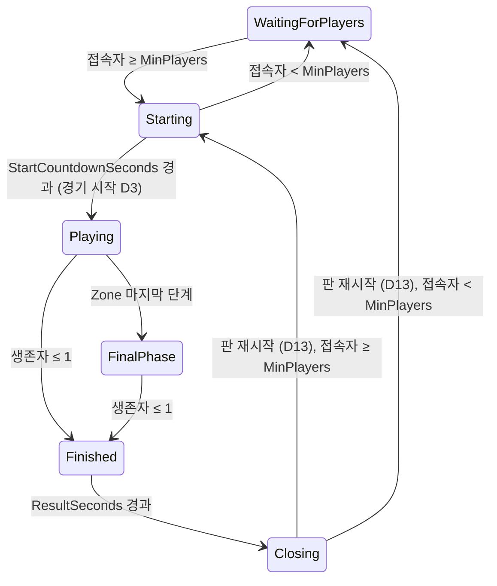

# Battle Royale

Phase 6 기준. 설계 근거와 결정 D1–D15: `Docs/specs/2026-10-01-phase5-battle-royale-design.md`, Phase 6 투입·Zone 변경: `Docs/specs/2026-10-01-phase6-map-design.md`. 서버 한 개가 판을 계속 이어서 연다(한 서버 = 여러 판). 패킷은 `Networking.md` "Battle Royale".

## 상태 기계 (`MatchFlow`, D1)

- 전환은 Tick 시작에 서버 Tick으로 판정한다. 카운트다운 중 인원이 모자라면 대기로 돌아가고, 다시 모이면 처음부터 센다. `Closing`은 한 Tick 안에서 끝나므로 Client는 보지 못한다(`Round`가 1 오른 `Starting`/`WaitingForPlayers`를 받는다).
- 서버는 비어서 `WaitingForPlayers`로 시작한다. 운영(`DevRespawn = false`)에서는 월드 아이템이 경기 시작 전까지 없다.
- `DevRespawn = true`(테스트·개발용)면 상태 기계가 돌지 않는다: 피해 항상, 3초 부활, Loot는 서버 시작 때부터 있고 `LootRespawnSeconds`마다 다시 생긴다(Phase 3·4 규칙). 경기 패킷(`MatchState`·`ZoneState`·`MatchResult`)도 보내지 않아 Client는 Phase 4처럼 동작한다. 경기 중 부활과 Loot 재생성은 `DevRespawn`에서만 있다.

## 경기 전 (D2)

자유롭게 움직이고 쏠 수 있지만 피해가 없다(궤적은 보인다). 월드에 Loot가 없고, 죽을 수 없다.

## 경기 시작 (D3) — 한 Tick 안에서

모든 접속자를 투입 지점으로 옮긴다(Phase 6 D9: `DropPoints` 24곳을 시드 `SpawnSeed + 판 번호`로 섞어 플레이어 목록 순서로 배정, 24명을 넘으면 같은 지점의 동쪽·서쪽 3 m. `PlayerRespawned`, Seq 유지) → 인벤토리를 비우고 Health 100·Shield 0 → 월드 아이템을 모두 지운다 → Loot를 시드 `LootSeed + 판 번호`로 새로 굴린다 → 참가자와 생존자 수를 확정하고 처치 수를 0으로 → Zone을 시드 `ZoneSeed + 판 번호`로 시작한다. 판 재시작과 대기는 여전히 중앙 5 m 원이다.

## Safe Zone (`SafeZone`, D6–D8)

- 원형. `zones.json`: 첫 원(중심 (0, 0), 반지름 115 m, 맵 전체를 덮는다)과 단계 5개(대기 s, 축소 s, 목표 반지름 m, 초당 피해): 45/40/70/1, 35/30/40/2, 30/25/20/5, 25/20/8/10, 20/15/0/20(Phase 6 D12). 전체 약 4분 45초.
- 경기 시작 때 모든 원을 시드 난수로 정한다. 새 원은 이전 원 안에 완전히 들어가고(중심 거리 + 새 반지름 ≤ 이전 반지름), 중심은 ±60 m(`zones.json`의 `arenaHalfSize`)를 넘지 않는다(16번 다시 뽑고, 그래도 안 되면 이전 중심).
- 단계 p 동안: 대기 중에는 이전 원, 축소 중에는 매 Tick 선형 보간한 원, 축소가 끝나면 목표 원. 다음 단계의 대기는 이전 축소가 끝난 Tick부터 센다. 마지막 단계에 들어가면 `FinalPhase`이고, 그 원은 경기가 끝날 때까지 반지름 0으로 남는다.
- Zone 피해: 경기 시작부터 1초(`SimHz` Tick)마다, 그 Tick의 원 밖(수평 거리 > 반지름. 반지름 0인 원은 안이 없어 누구나 밖이다. 서버 `SafeZone.IsOutside`와 Client `ZoneMath.IsOutside`가 같은 규칙이다)에 있는 생존자의 Health를 그 단계의 초당 피해만큼 깎는다. Shield는 무시한다. 처리 순서는 플레이어 목록 순서다. Zone으로 죽으면 처치자가 없다(KillerId 0).
- 마지막 단계는 반지름 0·피해 > 0이어야 한다(`zones.json` 검증: spec의 검증은 이 둘을 요구하지 않았다). 그래서 싸우지 않아도 모든 경기는 끝난다.

## 사망·순위·승자 (D4, D9, D12)

- 경기 중 사망은 영구적이다. 시체는 남고 가진 것은 떨어지며, 그 Client는 관전자가 된다(처치자 → 좌클릭으로 다음 생존자, 대상이 죽으면 다음 사람. Client가 원격 보간 위치로 그리고 "Spectating Player <EntityId>"를 띄운다. 이름은 Client에 전달되지 않는다).
- 순위 = 죽은 순간 남은 생존자 수 + 1(`PlayerDied.Placement`). 마지막 생존자가 1위다. 같은 Tick에 남은 사람이 모두 죽으면 그 Tick에 마지막으로 처리된 사람이 1위다(승자는 정확히 한 명).
- 처치 수는 다른 참가자를 쏴서 죽였을 때만 센다(Zone·자기 자신은 제외). 판이 시작될 때 0이 된다.
- 생존자가 1명 이하가 된 Tick에 `Finished`(결과 10초). 접속 중인 참가자마다 `MatchResult`(승자 EntityId, 내 순위, 내 처치 수, 참가자 수). 결과 화면에서는 피해가 없다.

## 이탈과 합류 (D10)

- 경기 중 이탈은 탈락이다. 인벤토리는 남은 사람들에게 떨어지고 생존자에서 빠진다. 이탈자는 결과를 받지 않고, 1위였던 사람이 이미 나갔으면 승자는 0이다.
- 경기 중 들어온 사람은 죽은 상태의 관전자로 합류하고(본인에게 `PlayerDied`), 참가자가 아니라 생존자 수에도 들지 않는다. 다음 판부터 참가한다.

## 판 재시작 (D13)

`Finished` 10초 뒤 `Closing`: 월드 아이템을 모두 지우고(전원에게 `ItemRemoved`), 모든 접속자를 살려 Spawn에 두고 인벤토리를 비우고, Zone을 끄고, 판 번호를 올린다 → 인원에 따라 `Starting` 또는 `WaitingForPlayers`.

## 아직 없는 것 (D15)

비행기·낙하산 투입, 팀·분대, 기절, 킬로그 UI, 관전자 채팅, 재접속, 전적 저장(Phase 9), 지형 가중 Zone, Zone 경고 음향. Phase 6 D14: 비행기·낙하산, 2층 건물, 미니맵.
