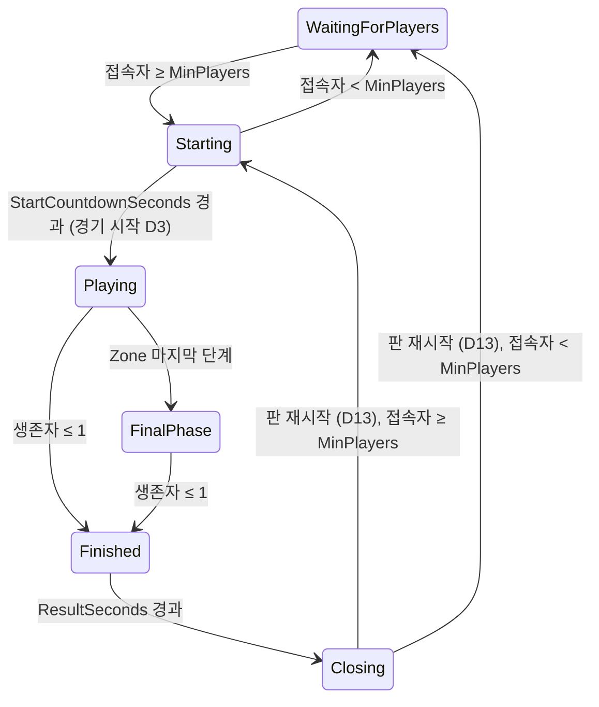

# Battle Royale

Phase 12 기준. 설계 근거와 결정 D1–D15: `Docs/specs/2026-10-01-phase5-battle-royale-design.md`, Phase 6 투입·Zone 변경: `Docs/specs/2026-10-01-phase6-map-design.md`, Phase 12 공중 투입: `Docs/specs/2026-10-02-phase12-deployment-traversal-design.md`. 서버 한 개가 판을 계속 이어서 연다(한 서버 = 여러 판). 패킷은 `Networking.md` "Battle Royale".

## 상태 기계 (`MatchFlow`, D1)



- 전환은 Tick 시작에 서버 Tick으로 판정한다. 카운트다운 중 인원이 모자라면 대기로 돌아가고, 다시 모이면 처음부터 센다. `Closing`은 한 Tick 안에서 끝나므로 Client는 보지 못한다(`Round`가 1 오른 `Starting`/`WaitingForPlayers`를 받는다).
- 서버는 비어서 `WaitingForPlayers`로 시작한다. 운영(`DevRespawn = false`)에서는 월드 아이템이 경기 시작 전까지 없다.
- `DevRespawn = true`(테스트·개발용)면 상태 기계가 돌지 않는다: 피해 항상, 3초 부활, Loot는 서버 시작 때부터 있고 `LootRespawnSeconds`마다 다시 생긴다(Phase 3·4 규칙). 경기 패킷(`MatchState`·`ZoneState`·`MatchResult`)도 보내지 않아 Client는 Phase 4처럼 동작한다. 경기 중 부활과 Loot 재생성은 `DevRespawn`에서만 있다.

## 경기 전 (D2)

자유롭게 움직이고 쏠 수 있지만 피해가 없다(궤적은 보인다). 월드에 Loot가 없고, 죽을 수 없다.

## 경기 시작 (D3) — 한 Tick 안에서

**Phase 12 순서(`AirDrop`, 기본 켬):**
1. 수송기 경로를 정해(`DropPlanner`, 시드 `SpawnSeed + 판 번호`, 시작 Tick은 시작하는 Tick + 1) `TransportRoute`로 모두에게 보낸다. `PlayerRespawned`보다 먼저 보낸다.
2. 모두를 `Transport` 모드로 Respawn한다(`PlayerRespawned.Mode = Transport`, 위치는 경로의 시작점. Seq 유지).
3. 문을 모두 닫는다(`DoorSet.CloseAll`. 바뀐 `DoorStates`는 그 Tick 끝에 간다).
4. 자기장을 `Start(route.EndTick)`으로 시작한다. 첫 축소는 경로 끝 + 45초다.

`AirDrop=false`(`DevRespawn`이면 항상)면 아래 Phase 6의 투입 지점이다. 인벤토리·월드 아이템·Loot·참가자 확정은 두 경우 모두 같다.

**Phase 6 방식(투입 지점):** 모든 접속자를 투입 지점으로 옮긴다(Phase 6 D9: `DropPoints` 24곳을 시드 `SpawnSeed + 판 번호`로 섞어 플레이어 목록 순서로 배정, 24명을 넘으면 같은 지점의 동쪽·서쪽 3 m. `PlayerRespawned`, Seq 유지) → 인벤토리를 비우고 Health 100·Shield 0 → 월드 아이템을 모두 지운다 → Loot를 시드 `LootSeed + 판 번호`로 새로 굴린다 → 참가자와 생존자 수를 확정하고 처치 수를 0으로 → Zone을 시드 `ZoneSeed + 판 번호`로 시작한다. 판 재시작과 대기는 여전히 중앙 5 m 원이다. (리뷰 수정 C1: `시드 + 판 번호`는 `DeterministicSeeds`일 때다. 기본은 경기 시작마다 만든 경기 비밀에 용도·판 번호를 섞은 시드다, `Server.md` 옵션 표.)

## Safe Zone (`SafeZone`, D6–D8)

- 원형. `zones.json`: 첫 원(중심 (0, 0), 반지름 115 m, 맵 전체를 덮는다)과 단계 5개(대기 s, 축소 s, 목표 반지름 m, 초당 피해): 45/40/70/1, 35/30/40/2, 30/25/20/5, 25/20/8/10, 20/15/0/20(Phase 6 D12). 전체 약 4분 45초.
- 경기 시작 때 모든 원을 시드 난수로 정한다. 새 원은 이전 원 안에 완전히 들어가고(중심 거리 + 새 반지름 ≤ 이전 반지름), 중심은 ±60 m(`zones.json`의 `arenaHalfSize`)를 넘지 않는다(16번 다시 뽑고, 그래도 안 되면 이전 중심).
- 단계 p 동안: 대기 중에는 이전 원, 축소 중에는 매 Tick 선형 보간한 원, 축소가 끝나면 목표 원. 다음 단계의 대기는 이전 축소가 끝난 Tick부터 센다. 마지막 단계에 들어가면 `FinalPhase`이고, 그 원은 경기가 끝날 때까지 반지름 0으로 남는다.
- Zone 피해: 경기 시작부터 1초(`SimHz` Tick)마다, 그 Tick의 원 밖(수평 거리 > 반지름. 반지름 0인 원은 안이 없어 누구나 밖이다. 서버 `SafeZone.IsOutside`와 Client `ZoneMath.IsOutside`가 같은 규칙이다)에 있는 생존자(Phase 12: `Transport` 탑승자는 뺀다. 경로가 첫 원 밖까지 가서 탑승 중에는 원 안에 있지 않다)의 Health를 그 단계의 초당 피해만큼 깎는다. Shield는 무시한다. 처리 순서는 플레이어 목록 순서다. Zone으로 죽으면 처치자가 없다(KillerId 0).
- 마지막 단계는 반지름 0·피해 > 0이어야 한다(`zones.json` 검증: spec의 검증은 이 둘을 요구하지 않았다). 그래서 싸우지 않아도 모든 경기는 끝난다.

- Phase 12: 공중 투입이면 Zone 시계는 경기 시작이 아니라 수송기 경로가 끝나는 Tick에 시작한다. 첫 단계의 대기 45초는 거기서 센다. 뛰어내리기 전에 자기장이 줄지 않게 하기 위해서다. 피해 간격(초당 1회)은 경기 시작 Tick을 기준으로 센다.

## 공중 투입 (Phase 12 D4–D6)

상태 기계에 새 State는 없다. 투입은 `Playing` 안의 하위 단계다(`InMatch`, `DamageAllowed`, 탈락, UI가 그대로 맞는다). 이동 규칙과 수치는 `Movement.md`다.

```text
수송기(Transport) → 뛰어내리기 구간 → 자유 낙하(Freefall) → 글라이더(Glide, 지면 30 m에서 자동) → 착지(Ground) → Loot → 전투
```

- **수송기:** 고도 90 m, 속도 20 m/s로 맵 중심을 지나는 직선을 난다. 길이는 200–약 266 m(10–약 13.3초)다. 탑승자의 위치는 서버가 Tick마다 경로 위에 둔다. 시선(Yaw)만 돌릴 수 있고, 다른 행동은 없다.
- **뛰어내리기:** 수송기가 벽 안쪽 10 m 이상 들어온 구간(±70 m)에서 Jump를 누르면 자유 낙하가 된다. 구간이 끝나도 안 뛴 사람은 그 지점에서 강제로 뛰어내린다.
- **자유 낙하:** 종단 속도 30 m/s. WASD로 앞(15 m/s)·옆(10)·뒤(6)로 조종한다. Jump로 글라이더를 편다. 외곽벽 안에 머문다.
- **글라이더:** Jump를 누르거나 지면(지형이나 발 아래 상자 윗면)까지 30 m 이하면 펴진다. 5 m/s로 일정하게 내려오고 다시 접히지 않는다. 앞 14·옆 10·뒤 4 m/s로 조종한다.
- **착지:** 땅에 닿으면 `Ground`가 된다. 자유 낙하·글라이더 착지는 낙하 피해가 없다.
- **탑승자:** 자기장 피해를 받지 않고 총알에 맞지 않는다. 탑승 중·낙하 중·글라이더 중에는 사격·줍기·재장전·회복·칸 바꾸기·버리기가 안 된다.
- **재접속(D16):** 끊긴 동안 서버는 그 캐릭터를 빈 입력으로 이동시킨다(Phase 10 유예 10초 그대로). 탑승자는 구간 끝에서 강제로 뛰어내리고, 낙하는 곧게 떨어지다 30 m에서 글라이더가 펴지고, 글라이더는 곧게 내려와 착지한다. 돌아오면 늦은 합류와 같은 전체 상태에 `TransportRoute`·`DoorStates`가 더해지고, 다음 Snapshot의 모드와 Self로 서버의 현재 상태에 맞춘다(`Networking.md` "투입과 문").
- **늦은 합류:** 공중 투입 경기 중 들어온 관전자도 `TransportRoute`를 받아 수송기를 본다.
- **`AirDrop=false` / `DevRespawn`:** 투입 단계가 없다. 모두 땅(투입 지점 또는 중앙 광장)에서 시작한다. Phase 5–11의 규칙 테스트는 이 설정을 쓴다.

## 사망·순위·승자 (D4, D9, D12)

- 경기 중 사망은 영구적이다. 시체는 남고 가진 것은 떨어지며, 그 Client는 관전자가 된다(처치자 → 좌클릭으로 다음 생존자, 대상이 죽으면 다음 사람. Client가 원격 보간 위치로 그리고 "관전 중: <이름>"을 띄운다. 이름은 `PlayerSpawned.Name`이고, 모르면 "플레이어 <EntityId>").
- 순위 = 죽은 순간 남은 생존자 수 + 1(`PlayerDied.Placement`). 마지막 생존자가 1위다. 같은 Tick에 남은 사람이 모두 죽으면 그 Tick에 마지막으로 처리된 사람이 1위다(승자는 정확히 한 명).
- 처치 수는 다른 참가자를 쏴서 죽였을 때만 센다(Zone·낙하·자기 자신은 제외). 판이 시작될 때 0이 된다.
- **낙하 사망(Phase 12 D10):** 착지 속도 13 m/s를 넘으면 피해가 나고(30 m/s 이상은 100) 체력만 깎는다. 실드는 막지 못한다(Zone과 같다). 피해가 허용될 때만이다(경기 전·결과 화면에서는 없다). 죽으면 처치자 없이 원인 `Fall`(`PlayerDied.Cause = 1`)이고 순위가 있다. Kill Feed는 "낙하 ▸ 이름", 결과 화면은 "탈락 원인: 낙하"다. 자기장·플레이어 사망의 원인은 0이다.
- 생존자가 1명 이하가 된 Tick에 `Finished`(결과 10초). 접속 중인 참가자마다 `MatchResult`(승자 EntityId, 내 순위, 내 처치 수, 참가자 수). 결과 화면에서는 피해가 없다.

## 이탈과 합류 (D10)

- 경기 중 이탈은 탈락이다. 인벤토리는 남은 사람들에게 떨어지고 생존자에서 빠진다. 이탈자는 결과를 받지 않고, 1위였던 사람이 이미 나갔으면 승자는 0이다.
- 경기 중 들어온 사람은 죽은 상태의 관전자로 합류하고(본인에게 `PlayerDied`), 참가자가 아니라 생존자 수에도 들지 않는다. 다음 판부터 참가한다.

## 판 재시작 (D13)

`Finished` 10초 뒤 `Closing`: 월드 아이템을 모두 지우고(전원에게 `ItemRemoved`), 모든 접속자를 살려 Spawn에 두고 인벤토리를 비우고, Zone을 끄고, 수송기 경로를 지우고(Phase 12), 판 번호를 올린다 → 인원에 따라 `Starting` 또는 `WaitingForPlayers`.

## Loot Container와 Supply Drop (Phase 16)

Chest·Ammo Box(맵의 고정 34곳)는 경기 시작에 생성 여부와 Loot가 정해지고 E로 연다. Supply Drop은 자기장 시계 60초·150초에 다음 원 안으로 떨어진다. 규칙 전체는 `Loot.md`다.

## 아직 없는 것 (D15)

팀·분대, 기절, 관전자 채팅, 지형 가중 Zone, Zone 경고 음향. Phase 6 D14: 2층 건물, 미니맵. Phase 12 D17: 지도 UI(낙하 지점 고르기. 수송기 경로는 F1 문구와 월드의 수송기로만 보인다)와 새 애니메이션 에셋. (Phase 5 때 "없는 것"이던 비행기·낙하산 투입은 Phase 12에서, 킬로그 UI는 Phase 11에서, 재접속은 Phase 10에서, 전적 저장은 Phase 9에서 생겼다.)

## 팀 경기 (Phase 14)

`ServerOptions.TeamSize`가 2 이상이면 경기 시작 때 참가자가 입장 순서로 팀이 되고, 순위·승자·종료는 팀 단위다(`MatchFlow.TeamsAlive`, 종료 = 남은 팀 ≤ 1, `MatchResult.Participants` = 팀 수). 기절·소생·Reboot과 `PlayerDied.Placement`의 잠정 값 규칙은 `Squad.md`에 있다. Solo(TeamSize 1, 기본)는 위 규칙 그대로다.
