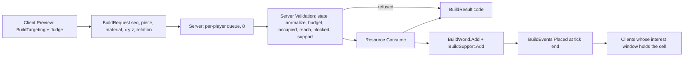
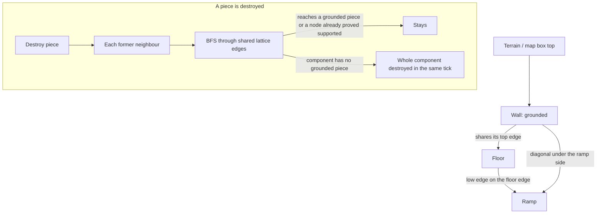
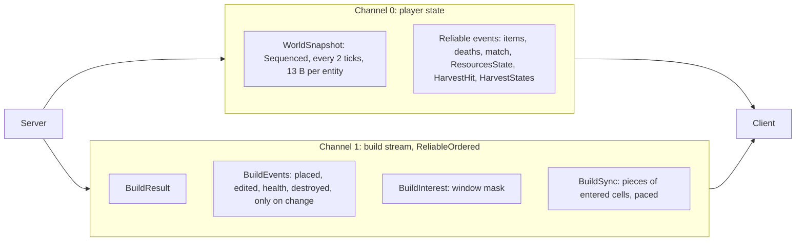

# Building

Phase 13 Harvesting & Building 기준. 설계 근거와 결정 D1–D20: `Docs/specs/2026-10-02-phase13-harvesting-building-design.md`, 구현 계획(Spec과 다른 점): `Docs/plans/2026-10-02-phase13-harvesting-building.md`. 채집으로 자원(나무·돌·금속)을 얻고, 그 자원으로 벽·바닥·경사로·지붕을 격자에 짓는다. 모든 결과는 서버가 정한다. Client는 미리보기와 대기 중 표시만 하고, 충돌은 서버가 확정한 구조물로만 예측한다.

## 구조

```mermaid
flowchart LR
    subgraph Client[Unity Client]
        Keys[InputReader: Q F Z X V B T R] --> Tools[ToolState]
        Keys --> Ctl[BuildController: BuildTargeting, TurboGate]
        Store[BuildStore + PieceGrid] --> Ctl
        Store --> Pred[LocalPlayerPredictor: CollisionWorld]
        Store --> Views[BuildPieceViews]
        Ctl --> Ghost[BuildPreview]
    end
    subgraph Shared[/Shared/]
        Grid[BuildGrid, PieceGrid, Slope]
        Coll[CollisionWorld, MovementSimulation]
        Pk[BuildPackets, HarvestPackets]
    end
    subgraph Server[Game Loop thread]
        Q[BuildRequestQueue per player] --> Rules[BuildRules, BuildSupport]
        Rules --> World[BuildWorld + PieceGrid]
        World --> Rep[BuildReplication: events, interest, sync]
        Harvest[HarvestWorld, HarvestRules] --> Inv[Inventory resources]
        Trace[PieceTrace] --> World
    end
    Ctl -->|BuildRequest, channel 1| Q
    Rep -->|BuildResult, BuildEvents, BuildSync, BuildInterest, channel 1| Store
```

| 위치 | 파일 | 역할 |
|---|---|---|
| Shared `Simulation` | `BuildGrid` | 격자 상수, 조각 종류·재료·슬롯, 정규화(`TryNormalize`), 슬롯 키, 상자(`BoxOf`)·경사면(`SlopeOf`) |
| | `PieceGrid` | 조각 id → 칸, 칸(Column)마다 id 순서 목록. 서버와 Client가 같은 공간 색인을 쓴다 |
| | `CollisionWorld` | 이동 한 번의 충돌 후보(맵 상자, 닫힌 문, 서 있는 채집 대상, 가까운 조각) |
| | `GameMap.Harvestables` | 채집 대상 41개(나무 23, 바위 8, 잔해 6, 상자 4) |
| Shared `Protocol` | `BuildPackets`, `HarvestPackets` | v11 패킷(아래 "네트워크") |
| Server `Game/Build` | `BuildingCatalog`(`building.json`), `BuildWorld`, `BuildRules`, `BuildSupport`, `BuildReplication`, `BuildRequestQueue`, `PieceTrace` | 수치, 저장, 배치 검사, 지지, 복제, 요청 큐, 사격·채집 광선 |
| Server `Game/Harvest` | `HarvestWorld`, `HarvestRules` | 채집 대상 상태(체력·약점), 도구 전환, 휘두르기 판정 |
| Client `Game/Build` | `ToolState`, `BuildTargeting`, `BuildStore`, `BuildController`, `BuildPieceLook`, `PieceMeshes`, `BuildPieceViews`, `BuildPreview`, `HarvestEffects`, `BuildHud`, `BuildAudio` | 도구 예측, 미리보기 계산, 확정 조각 저장, 요청·대기, 표시 |
| Bots | `BotBuilder` | 방어 벽, 높은 적을 향한 경사로, `--build-spam`(부하) |

모든 건설 상태는 Game Loop 스레드 하나가 쓴다(단일 Writer). Lock이 없다. 요청은 수신 스레드가 `InboundChannels.Build`(유한 채널)에 넣고 Game Loop가 Tick마다 꺼낸다.

## 격자 (`BuildGrid`)

- 칸 5 m × 5 m, 층 3 m. 원점은 맵 모서리(−80, −80)이고 32 × 32칸, 16층이다(맵 160 m 전체).
- 슬롯(`BuildSlotKind`): 칸마다 남쪽 벽, 서쪽 벽, 바닥, 경사로, 지붕. 북쪽·동쪽 벽은 옆 칸의 남쪽·서쪽 벽으로 정규화한다(회전 2 → z+1·회전 0, 회전 3 → x+1·회전 1). 그래서 한 벽 자리에 키가 하나다(`SlotKey` = x | z≪6 | y≪12 | slot≪16).
- 조각 모양:
  - 벽: 칸 가장자리에 서는 0.25 m 두께 상자, 높이 3 m.
  - 바닥: 윗면이 층 높이인 0.25 m 두께 판.
  - 경사로: 낮은 가장자리(층 높이)에서 높은 가장자리(+3 m)까지 칸을 가로지르는 평면, 아래로 0.25 m 판. 회전이 오르는 방향이다(0 +Z, 1 +X, 2 −Z, 3 −X).
  - 지붕: 다음 층 높이(처마)에서 1.5 m 올라가는 사각뿔, 아래로 0.25 m 판(평평한 천장).
- 경사면(`Slope`)은 이동에서 지형처럼 다룬다. 발밑 높이는 발자국 범위의 가장 높은 표면이고 양 끝 높이가 정확하다(경사로 3/5 기울기를 끝점에서 정확히 계산한다). 판은 아래에서 막는다.

## 채집

- 도구(`ToolKind`): 무기(1–3), 채집(F), 건축(Q). Q를 다시 누르면 이전 도구로 돌아간다. 키가 같이 눌리면 무기 키, F, Q 순서다. 도구는 Snapshot의 Self(무기 칸 바이트의 위 2비트)와 Entity `Flags` bit6–7에 실린다. Client는 같은 규칙(`ToolState.Select`)으로 예측하고 서버 테스트가 두 규칙을 비교한다.
- 휘두르기: 채집 도구로 Fire. 간격 0.4초, 사거리 2.5 m. 서버가 눈에서 조준 방향으로 광선을 쏴 가장 가까운 것(맵 상자·닫힌 문·채집 대상·조각)을 맞힌다.
- 채집 대상(`building.json` `harvestables`): 나무 체력 150·한 번에 6, 상자 100·6, 바위 200·5, 잔해 250·4, 부술 때 추가 10. 피해는 25(`environmentDamage`). 나무와 상자는 나무, 바위는 돌, 잔해는 금속을 준다.
- 약점: 첫 타격이 휘두른 쪽 면에 약점을 만든다. 반지름 0.4 m 안을 치면 피해와 자원이 2배이고 약점이 옮겨 간다. 위치는 (id, 타격 수)의 정수 해시라 재현된다. 위치는 `HarvestHit`으로 휘두른 사람에게만 간다.
- 부서진 대상은 충돌·사격에서 빠지고(`HarvestStates` 비트 마스크) 다음 경기·판에 다시 선다.

## 자원

- 재료마다 최대 500(`maxResource`). 넘는 양은 버린다. 인벤토리(`Inventory.Resource`)에 있고 바뀐 Tick 끝에 `ResourcesState`(7 B)로 본인에게 간다.
- 죽으면 자원이 Material 월드 아이템으로 떨어진다(`ItemKind.Material`). Material은 E 없이 1.5 m 안에 들어오면 3 Tick마다 자동으로 줍는다. E 줍기 대상(`FindNearest`)에서는 빠진다.
- `--Server:BuildInfiniteResources=true`면 비용이 0이다(부하 테스트용).

## 배치



- 미리보기(`BuildTargeting`, 물리 질의 없음): 발이 있는 칸과 시선 방향(Yaw의 가장 가까운 축)의 다음 칸. 수평(±35°)이면 벽은 그 사이 가장자리, 바닥·경사로·지붕은 다음 칸. 아래를 보면(피치 35° 이상) 내 칸, 위를 보면(피치 -20° 이하, 카메라 한계 -30° 안쪽) 한 층 위. 층은 발 + 1.5 m로 정해 경사로 중간을 넘으면 다음 층을 겨눈다(경사로 달리기). R은 벽(내 칸 둘레)과 경사로(제자리)를 90°씩 돌린다.
- 미리보기 색(`BuildPreview`, 충돌 없는 반투명): 파랑 가능, 빨강 불가(사거리 밖, 이미 있음, 대기 중인 자리), 주황 자원 부족. 대기 중인 배치는 흰색으로 보인다(최대 8개, 서버 큐와 같다). 받아들여진 배치는 확정 조각이 도착할 때까지(또는 시간 초과까지) 대기로 계속 보이고, 거절되면 바로 사라진다.
- Turbo(`TurboGate`): 누르는 순간 한 번, 누르고 있으면 `minimumBuildInterval`(0.1초)마다 후보를 다시 보고 마지막으로 보낸 자리와 다를 때만 보낸다. 가만히 누르고 있으면 같은 자리를 다시 보내지 않는다.
- Client는 요청을 초당 20개(`BuildController.MaxRequestsPerSecond`, 서버 상한과 같다)까지만 보낸다.
- 요청 번호는 연결마다 1부터 시작하는 u16이다. 서버는 이미 본 번호 이하(감김 비교)를 다시 처리하지 않는다(중복 요청 = 자원 이중 차감 없음).
- 서버 처리: 이동보다 먼저(그 Tick의 입력 위치·조준으로), 플레이어마다 Tick당 최대 1개를 받아들인다. 큐가 가득 차면 `RateLimited`로 답하고, 이렇게 버린 요청도 `requests`와 `rateLimited`에 센다. 수신 스레드에서 Game Loop로 가는 유한 채널(`InboundChannels.Build`)이 넘쳐 버린 요청은 Health 줄 `buildInboxDrops`와 Meter `projecth.build.inbox_drops`로 센다. 받아들인 조각의 생성 Tick은 다음 Tick이다.

## 검증 (`Match.TryBuild`)

순서대로 보고 처음 걸린 이유로 답한다(`BuildResultCode`).

| 순서 | 검사 | 코드 |
|---|---|---|
| 1 | 살아 있고 경기가 끝나지 않았다. 도구가 건축이고 지상 모드(행동 가능)다. 관전자·죽은 사람은 여기서 막힌다 | `InvalidState` 7 |
| 2 | 재료 0–2, 조각 0–3, 회전 0–3, 칸·층이 격자 안 | `InvalidRequest` 8 |
| 3 | 경기 상한 20,000개, 플레이어 상한 500개 | `BudgetFull` 9 |
| 4 | 같은 슬롯에 조각이 있다. 바닥과 그 아래층 지붕은 판을 같이 써서 함께 있을 수 없다 | `Occupied` 5 |
| 5 | 눈에서 7 m(조각 크기의 절반을 더한 거리) 안이고 조준에서 75° 안 | `OutOfRange` 2 |
| 6 | 지형에 묻힘, 눈과 조각 사이에 벽(맵 상자·닫힌 문·지형), 맵 상자·문·서 있는 채집 대상과 너무 겹침(축마다 min(0.3 m, 조각 반 크기) 넘게), 살아 있는 캐릭터의 몸 중심을 벽·바닥이 가름, 경사로·지붕이 캐릭터를 올려 줄 높이에 몸이 들어갈 자리가 없음(위 조각·맵 상자), 진행 중인 넘기(Vault)의 남은 경로를 가로지름 | `Blocked` 3 |
| 7 | 땅이나 맵 상자 위에 있거나 이웃 조각이 있다 | `Unsupported` 4 |
| 8 | 자원이 비용(재료마다 10) 이상 | `NoResource` 1 |

통과하면 자원을 빼고 저장한다. 실패하면 아무것도 바뀌지 않는다. Client가 보낸 좌표는 격자 번호뿐이고 서버가 모양을 만든다. 받아들여진 배치는 진행 중인 회복을 끊는다.

- 눈과 조각 사이의 "벽"은 맵 상자·닫힌 문·지형만 본다. 적의 조각 너머로도 지을 수 있다(Phase 13.5에서 다룬다).

## 체력과 파괴

- 재료(`building.json` `materials`): 나무 최대 150·건설 1.5초, 돌 240·3초, 금속 360·5초. 처음 체력은 최대의 30 %. 체력 = 처음 + (최대 − 처음) × 진행도 − 받은 피해이고(표시 단계는 지금까지 자란 체력에 대한 피해 비율이라, 피해 없는 짓는 중 조각은 Healthy로 보인다), 진행도와 체력은 저장하지 않고 필요할 때 계산한다(매 Tick 전체 순회가 없다).
- 짓는 중에도 맞는다. 총알은 조각에서 멈춘다(`PieceTrace`: 광선이 지나는 칸만 2D DDA로 걷는다). 무기 피해 그대로(Phase 17: × 무기 `structureMultiplier` × 재료 배율, 산탄은 합친 뒤 한 번. 폭발은 시선 없이 조각 경계까지 거리로 투사체의 구조물 피해 × 감쇠 × 재료 배율. `Weapons.md`), 채집 도구는 50. 조각을 쳐도 자원은 없다.
- 한 Tick에 여러 번 맞으면 Tick 끝에 Health 기록 하나로 보낸다. 체력이 0 이하면 바로 파괴하고, 지지는 그 Tick 끝에 한 번 다시 계산한다(아래 "지지").
- 0층 바닥 윗면은 땅 평면(y 0)과 같은 높이다. 광선이 둘에 같은 거리(1 mm 안)로 닿으면 조각이 맞는다.
- 라운드 재시작과 경기 시작에 모두 지운다(`ClearBuilds`). Client는 reset Sync로 모두 버린다.

## 지지 (`BuildSupport`)



- 연결: 두 조각이 격자 모서리(칸 꼭짓점을 층마다 이은 선분)를 같이 쓰면 이웃이다. 벽은 네 변과 두 대각선, 바닥·지붕은 네 변, 경사로는 낮은·높은 가장자리와 두 옆 경사선. 그래서 벽 위에 바닥이 얹히고, 벽끼리 모서리에서 만나고 쌓이며, 경사로는 바닥 가장자리에 닿고, 경사로 옆면은 옆 벽의 대각선 위에 놓인다.
- 접지: 조각 바닥이 지형이나 맵 상자 윗면에서 0.5 m 안이다(채집 대상은 부서지므로 아니다). 조각이 있는 동안 바뀌지 않는다.
- 배치는 접지되었거나 이웃이 있어야 한다.
- 파괴 뒤: 옛 이웃을 그 Tick의 탐색 시작점으로 모은다(칸마다 한 번). 모든 행동이 끝난 Tick 끝, 사건을 보내기 전에 한 번 탐색하므로 한 Tick의 여러 파괴가 탐색을 나눠 쓴다. 결과는 하나씩 탐색할 때와 같다. 무너질 조각은 그 Tick 끝까지 서 있다(이동·사격을 막고, 맞아서 부서지면 붕괴가 아니라 파괴로 센다).
- 탐색: 시작점마다 연결 요소를 너비 우선으로 찾는다. 앞선 탐색이 이미 지지된다고 밝힌 노드에 닿으면 바로 멈춘다(검색마다 표식). 접지 조각이 없는 요소는 같은 Tick에 모두 무너진다. 비용은 무너진 조각과 닿은 모서리 수에 비례한다(전체 맵 순회가 없다, O(N²) 없음). 모서리 색인(모서리 → 조각)이 있어 이웃 찾기는 모서리마다 사전 조회 하나다.

## 네트워크

Protocol v12(Phase 13.5 편집, 아래 "편집"). 건설 패킷은 채널 1(`ProtocolConstants.BuildChannel`, ReliableOrdered)로만 다닌다. 플레이어 Snapshot(채널 0, Sequenced)에는 건설을 싣지 않는다.



섞지 않는 이유: Snapshot은 최신 하나만 의미가 있어 잃어도 되고(Sequenced) 크기가 플레이어 수에 묶여 있다(패킷당 90명, 1197 B). 건설은 수천 개가 될 수 있고 하나라도 잃으면 상태가 틀어지므로 순서 있는 신뢰 전송이 필요하다. 같은 채널에 두면 큰 Sync가 Snapshot과 이벤트를 막는다(Head-of-line). 채널을 나누면 건설 재전송이 이동·전투를 기다리게 하지 않는다. Player Entity는 13 B 그대로다(도구는 빈 `Flags` 비트).

| Packet | 방향 | 크기 | 내용 |
|---|---|---|---|
| `BuildCatalog` (26) | S→C | 49 B | 재료 3개(비용·최대·처음 체력·건설 Tick), 최대 자원, 사거리, 시야각, 채집 사거리·간격, 최소 간격 Tick, 관심 칸 크기·반지름·여유. Join·Resume 때 채널 1의 첫 패킷(reset Sync 바로 앞) |
| `BuildRequest` (27) | C→S | 9 B | 번호 u16, 조각, 재료, x, y, z, 회전 |
| `BuildResult` (28) | S→C 본인 | 8 B | 번호, 코드, 조각 id |
| `BuildEvents` (29) | S→C | 헤더 9 B + Placed 14 B / Edited 6 B / Health 6 B / Destroyed 5 B(id + 이유, Phase 18) | Tick 끝, 받는 사람의 관심 칸에 든 것만, 이 순서로. 1200 B로 나눈다 |
| `BuildSync` (30) | S→C | 헤더 7 B + 조각 16 B × 최대 74 = 1191 B | 새로 들어온 관심 칸의 조각(체력 포함). reset 플래그는 모두 버리라는 뜻 |
| `BuildInterest` (31) | S→C | 9 B | 관심 칸 64비트 마스크 |
| `ResourcesState` (32) | S→C 본인 | 7 B | 나무·돌·금속 |
| `HarvestHit` (33) | S→C 본인 | 18 B | 대상, 남은 체력, 약점 위치, 얻은 양, 플래그 |
| `HarvestStates` (34) | S→C | 9 B | 부서진 채집 대상 마스크 |
| `BuildEditRequest` (35) | C→S | 9 B | 번호 u16(배치와 같은 카운터), 조각 id u32, 상태 u16(Edit 12비트 + 회전 2비트 ≪ 12) |

- 받는 쪽 규칙(`BuildStore`): 모두 id로 적용한다. 같은 Placed가 두 번 와도 하나다. 모르는 id의 Health·Destroyed는 무시한다. 관심 칸 밖의 조각은 저장하지 않는다. 그래서 순서가 어긋나거나 늦은 이벤트가 사라진 조각을 되살리지 않는다.
- 재접속(Resume)과 늦은 합류: `BuildCatalog` → reset Sync → 다음 Tick 끝에 `BuildInterest` → 그 칸들의 Sync. 채널 0과 1은 서로 순서를 지키지 않으므로 카탈로그를 채널 1에 먼저 실어, 관심 칸 크기를 모르는 채로 창이나 조각을 읽는 일이 없다. 요청 번호도 1부터 다시 센다. 유예 중(연결이 끊긴) 플레이어의 대기 요청은 버린다.
- 밀린 연결: 건설 채널의 신뢰 대기열이 32개(`Match.MaxBuildBacklog`)를 넘으면 그 Tick의 Sync를 건너뛴다(사건·창·결과는 간다, Health `syncDeferred`). 두 채널의 대기열이 512개를 넘은 채 10초가 지나면 `Congested`로 끊는다(`Server.md` "관측").
- 보안: 연결마다 초당 20개(`maxRequestsPerSecond`)를 넘는 요청은 잘못된 패킷 `BuildRate`로 센다(잘못된 패킷이 연결마다 20개 쌓이면 `Kicked`로 끊는다, `BadPacketDisconnectThreshold`). Fuzz 테스트가 새 파서 모두를 거친다.

## 편집 (Phase 13.5)

Spec: `Docs/specs/2026-10-07-phase13_5-building-edit-design.md`(D1–D14). Build → Edit → Open → Shoot → Reset 흐름이다.

- **상태:** 조각마다 12비트 `BuildPieceShape.Edit`(0 = 원래 모양). 슬롯 키에 들어가지 않아 편집해도 같은 자리다.
  - 벽: 비트 0–8 = 3 × 3 칸 중 뚫린 칸. 칸 = 열 + 3 × 행(행 0이 아래, 열은 회전 0이면 +X, 1이면 +Z). 뚫린 칸이 4방향으로 이어진 한 덩어리이고 1칸 이상 남아야 한다(창 16, 문 18, Half Wall 448, 가운데 열 146, 눈높이 행 56 등).
  - 바닥: 비트 0–3 = 뚫린 사분면(사분면 = x 절반 + 2 × z 절반), 0–14.
  - 지붕: 0 사각뿔, 1–4 한쪽 경사(높아지는 방향 = Edit − 1: +Z, +X, −Z, −X, 기울기 0.3), 5 평지붕, 6 통로(가운데 2.5 m 구멍).
  - 경사로: Edit는 항상 0이고 편집은 회전(오르는 방향)만 바꾼다.
  - 규칙은 Shared `BuildEdit`(`IsValid`, `TryApply`, Client 선택 → 상태 `FromSelection`, 칸 기하 `TileBox`·`TileAt`)에 하나다. Client 미리보기와 서버 검증이 같은 코드를 쓴다.
- **모양:** `BuildGrid.PartsOf`가 남은 칸을 행마다 구간으로 묶고 위아래 같은 구간을 합친 상자(최대 6개)를 낸다(Half Wall 1, 문 3, 창 4). 이동(`CollisionWorld`), 사격·채집(`PieceTrace`), 배치·편집 검사(`BuildRules`)가 모두 이 함수를 쓴다. 경사 지붕은 `SlopeKind.RoofSlope` 평면이고 천장까지 찬 고체다. `BoundsOf`(사거리·시선·위치 기준)는 벽·바닥이면 편집과 관계없이 틀 상자다.
- **요청:** `BuildEditRequest`는 배치와 같은 순번·같은 큐(`BuildRequestQueue` 8개, 종류 태그 `BuildQueueItem`)·같은 0.1초 간격·같은 초당 20개 상한을 쓴다. 상태를 실제로 바꾼 편집만 간격을 쓴다. Reset은 Edit 0 요청이다.
- **검증(`Match.TryEdit`, 처음 걸린 이유로 답):** 1 살아 있음·경기 진행·지상 모드(도구는 보지 않는다, 무기를 든 채 편집하고 바로 쏜다) → `InvalidState`, 2 조각 있음 → `NotFound`(11), 3 `BuildRules.CanEdit`(지금은 소유자 본인. Phase 14 팀 공유는 이 함수만 고친다. QA가 놓은 소유자 0 조각은 아무도 못 고친다) → `NotOwner`(10), 4 `BuildEdit.TryApply`(유효한 상태, 경사로 외 회전 불변) → `InvalidRequest`. 지금과 같은 상태면 여기서 `Ok`(아무것도 바꾸지 않음, 이벤트 없음, 반복 확정 멱등). 5 배치와 같은 `InReach` → `OutOfRange`, 6 맵·문·지형(`BehindAWall`) 또는 대상이 아닌 조각(`BehindAPiece`, `PieceTrace`가 대상을 빼고 본다)이 시선을 막음 → `Blocked`, 7 새로 막히는 부분(다시 채워지는 칸만, 지붕·경사로는 새 모양)이 몸 중심을 가르거나 Vault 경로를 가로지르거나 올린 몸이 들어가지 않음 → `Blocked`, 8 경사로 회전 뒤 접지도 이웃도 없음 → `Unsupported`. 결과의 조각 id는 Ok면 대상 id, 거절이면 0이다.
- **유지되는 것:** id, 소유자, 재료, `CreatedTick`(건설 진행), `Damage`. 짓는 중인 조각도 편집된다. `BuildWorld.SetShape`·`PieceGrid.SetShape`가 같은 slot·같은 칸을 지킨 채 모양만 바꾼다(slot으로 묶인 지지·복제 배열이 어긋나지 않는다).
- **지지:** 벽·바닥·지붕 편집은 지지 모서리를 바꾸지 않는다(틀이 지지 단위, 문을 낸 벽도 위층을 받친다). 경사로 회전은 `BuildSupport.Reshape`가 모서리를 다시 쓰고 `Grounded`를 다시 계산하며, 잃은 이웃과 그 경사로를 Tick 끝 붕괴 탐색 시작점에 넣는다(파괴와 같은 탐색 한 번).
- **복제:** Edited 기록(id + 상태, 6 B)을 Tick 끝에 조각마다 마지막 상태 하나로 보낸다(Health처럼 합친다). 같은 Tick에 파괴되면 Destroyed만 간다. Placed·Sync 기록은 격자 u32의 비트 20–31에 Edit를 실어 재접속·늦은 합류·관심 칸 진입이 최종 상태를 받는다(크기 그대로). 리더는 그 종류에 유효하지 않은 상태를 거부한다.
- **성능(server-hotpath):** 편집 상태는 조각마다 상자 수만 늘린다. 이동 한 번(`Gather` + `Step`)은 모든 슬롯에 벽·바닥이 있는 3 × 3칸 × 5층 블록 안을 무작위로 걷는 측정(Release, 200k Step)에서 편집 전 코드 1.96 µs → 이번 코드 Edit 0 2.20 µs, 모든 벽이 문 4.8 µs, 창 5.6 µs, 최악(5상자) 6.7 µs였다(수집 상자 평균 72 → 197–306개). 100명이 모두 그런 블록 안에 있어도 Tick(33 ms)당 0.7 ms 아래다. 상자 버퍼는 고정 크기(`MaxPieces × MaxPartsPerPiece`)라 할당이 없다. 문제가 되면 열 방향 합치기를 시도한다(Spec D3).
- **카운터:** Health 줄 `edits=`, `notOwner=`, `notFound=`, Meter `projecth.build.edits`, `projecth.build.requests{result=NotOwner|NotFound}`. 편집 요청은 `requests=`·`accepted=`에 배치와 같이 센다.

## 관심 영역

- 관심 칸은 20 m(건설 칸 4 × 4)이고 맵은 8 × 8 = 64칸이라 마스크 하나(u64)다.
- 창: 플레이어가 있는 관심 칸에서 반지름 2(5 × 5칸)를 원한다. 이미 가진 칸은 반지름 3까지 유지한다(여유 1, 경계에서 들락날락하지 않게). 죽은 사람과 관전자는 맵 전체다.
- 창이 바뀐 Tick에만 `BuildInterest`를 보낸다. 새로 들어온 칸은 Sync 대기열에 넣어 Tick마다 최대 4패킷(`MaxSyncPacketsPerTick`)씩 보낸다. 플레이어의 지금 칸에서 가까운 칸부터(Chebyshev 거리, 같으면 번호가 작은 칸) → 칸 안 열 → id 순서로 이어 간다. 시작한 칸은 끝까지 보낸다. 나간 칸의 조각은 Client가 지운다.
- Client 예측은 관심 창 안의 확정 조각만으로 충돌한다. 이동 한 번의 후보는 발 주변 ±1칸, ±2층의 조각이다(최대 225개, id 순서). 슬롯을 같이 쓰는 조각 때문에 넘치면 id가 낮은 쪽을 남긴다.

## 성능

- 매 Tick 전체 조각 순회가 없다. Tick 비용은 그 Tick의 요청·피해·파괴 수와 플레이어 주변 칸의 조각 수에 비례한다.
- 저장은 칸 색인(`PieceGrid`)과 슬롯 배열이고 필요할 때 두 배로 늘린다(처음 256, 경기 상한까지). 빈 경기가 큰 배열을 미리 잡지 않는다.
- 붕괴는 연결 요소에 비례하고, 한 Tick의 파괴는 탐색 하나를 나눠 쓴다(위 "지지"). 동료 측정에서 10.5k 조각 탑의 무너지지 않는 파괴 50개가 한 Tick 64 ms였던 경우다.
- 이벤트는 Tick 끝에 모아 받는 사람마다 관심 칸으로 걸러 보낸다. Health는 Tick당 조각마다 하나로 합친다.
- Client: 바뀐 조각만 다시 그린다(`BuildStore.Changed`), 짓는 중인 조각만 프레임마다 높이를 바꾼다. 조각 뷰는 종류별 풀(최대 256)과 공유 Mesh 3개·Material 9개(재료 3 × 손상 3단계)를 쓴다. 미리보기는 고정된 유령 4개와 대기 8개를 재사용한다(매 프레임 Instantiate 없음).
- 측정: `LoadTest.md` "Phase 13 확인"(시나리오 A–D, 조각 수 단계, 100명). 스트레스 테스트는 환경 변수가 있을 때만 돈다:

```bash
PROJECTH_BUILD_STRESS=1 dotnet test Server/ProjectH.Server.slnx -c Release --filter "FullyQualifiedName~BuildStressTests" --logger "console;verbosity=detailed"
```

## 테스트

- Shared: `BuildGridTests`, `CollisionWorldTests`, `PieceCollisionTests`(맞닿은 조각 사이 이동, 무작위 1000건 이상, Phase 13.5 편집된 조각 배치 포함), `BuildEditTests`(편집 상태·선택 변환, 모든 유효 상태의 `PartsOf`가 남은 칸을 정확히 덮음, Edit 0 = 기존 모양), `EditedPieceCollisionTests`(문 통과, 창·Half Wall에 막힘, 바닥 사분면·지붕 통로로 떨어짐, 경사 지붕 오르기, 편집된 상자 안 무작위 이동 갇힘 0), `BuildPacketTests`(편집 요청·Edited·격자 비트 왕복, 거부), `HarvestPacketTests`, `HarvestableMapTests`
- Server: `HarvestTests`, `ToolTests`(Client 복사본 비교 포함), `BuildPlacementTests`, `StructureDamageTests`, `SupportTests`, `BuildReplicationTests`(서버가 보낸 실제 바이트를 Client의 `BuildStore`에 넣어 같은 조각·관심 칸·자리 판정을 갖는지 본다), `BuildIntegrationTests`(실제 UDP 채널 1, 속도 제한, 편집 요청), Game `BuildEditTests`(검증 코드별, 유지되는 것, 멱등, 같은 Tick 편집+피해, 파괴 뒤 편집, 경사로 회전 붕괴, 공용 큐·순번·간격, 유예 중 편집 뒤 재접속 Sync, 사격이 창으로 지나감), `MaterialItemTests`, `BuildingCatalogTests`, `BuildStressTests`(환경 변수), `UiTextBuildTests`
- Bots: `BotBuilderTests`
- Client EditMode: `ToolStateTests`, `BuildTargetingTests`(격자 미리보기, Turbo), `BuildStoreTests`(중복, 늦은 이벤트, 관심 칸 나감·들어옴, reset), `BuildControllerTests`(대기, 시간 초과, 번호), `BuildPieceLookTests`, `MovementPredictionTests`(조각 위 예측 일치), Phase 13.5 `BuildEditControllerTests`(선택 → 미리보기, 확정 → 예측 → 거절 롤백·Ok 확정, 편집 중 Fire 제거)
- QA: `building` Suite(`QA/Suites/building.json`): 편집 시나리오 6개(`building_edit_*`, 아래 QA.md "Scenario Library")
