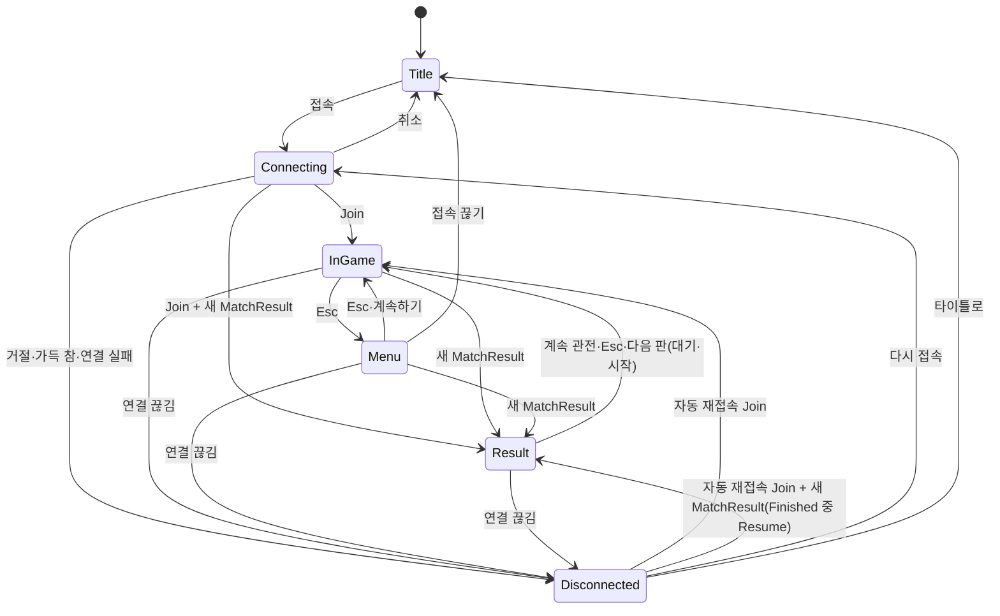

# Client

Unity 6000.3.24f1, URP, Input System. Scene·Prefab 없이 `GameBootstrap`(RuntimeInitializeOnLoadMethod, AfterSceneLoad)가 `GameClient`+`UiRoot`를 만들고, `GameClient.Awake`가 맵(`MapWorld`)을 만든다. 화면(타이틀·메뉴·끊김·결과·내 전적)은 `UiRoot`가 코드로 만든 UGUI다("화면과 흐름 (Phase 11)").

## 구조

| 파일 | 역할 |
|---|---|
| `Bootstrap/GameBootstrap` | GameClient와 UiRoot를 한 GameObject에 1개 생성(DontDestroyOnLoad) |
| `Bootstrap/MapWorld` | Shared `GameMap`의 지형 Mesh 1개(`TerrainMesh`, 81 × 81 꼭짓점, 서버와 같은 삼각형, 앞면이 위)와 MeshCollider, 박스마다 Cube(BoxCollider), 맵 밖 400 m 바닥(y −0.05), 공유 Material 3개(지형·구조물·엄폐물), 그림자 없음. Collider는 카메라 충돌·조준 광선용이고 이동 충돌은 `MovementSimulation`이 한다 |
| `Bootstrap/LaunchArgs` | 실행 인자(`-host`, `-port`, `-devId`, `-autoConnect`). `-autoConnect`면 `UiRoot.Start`가 타이틀을 거치지 않고 바로 접속한다. QA 인자(`-qaPort`, `-qaShotDir`, `-qaRecord`)는 `Qa/QaLaunchOptions`가 읽는다("QA 자동화") |
| `Qa/*` | QA-4·QA-5. Editor와 Development Build에만 있다(`#if UNITY_EDITOR \|\| DEVELOPMENT_BUILD`). `QaCommandReceiver`(localhost HTTP), `QaInputRecorder`(입력 녹화), 순수 코드 `QaProtocol`·`QaInputRecordFormat`("QA 자동화") |
| `Net/NetClient` | LiteNetLib, 메인 스레드 전용(`UnsyncedEvents = false`, `Update`에서 Poll). 전투 패킷 6종(WeaponCatalog, ShotFired, HitConfirmed, DamageTaken, PlayerDied, PlayerRespawned)과 아이템 패킷(ItemCatalog, WorldItems·ItemSpawned → `ItemReceived`, ItemRemoved, InventoryState, PickupResult), 경기 패킷(MatchState, ZoneState, MatchResult), 전적 응답(`StatsReceived`)을 이벤트로 올린다. `RequestStats()`가 `StatsRequest`를 보낸다(Join한 뒤에만). `PlayerSpawned.Name`을 함께 전달하고, 마지막 Join 결과·거절 사유·시작 실패를 끊김 화면용으로 보관한다 |
| `Net/VectorConversions` | System.Numerics ↔ UnityEngine 벡터 변환 |
| `Input/InputReader` | Input System 격리. Move, Look, Jump, Sprint, Fire(좌클릭), Aim(우클릭), Reload(R), Slot1–3(1·2·3), Interact(E), Drop(G), UseMedkit(4), UseShieldCell(5), Crouch(C 토글, Ctrl 누르는 동안. Phase 12), Esc(메뉴), F1(디버그 줄). Esc·F1은 `GameClient`가 `UiRoot`에 넘긴다. 누름은 `QueuedButtons`에 모았다가 다음 예측 Step이 가져간다. Crouch는 누른 상태라 매 Step에 실린다. C 토글은 Jump나 Sprint를 누르면 꺼지고, 입력이 막혀 있으면(메뉴, 풀린 커서) C는 토글하지 않는다(`Update(gameInputBlocked)`) |
| `Game/TerrainMesh` | 높이 격자 → Mesh 꼭짓점·삼각형(순수 계산) |
| `Game/PoiLookup`, `PoiLabel` | 따라가는 발이 있는 POI 이름을 왼쪽 위에 표시(글꼴은 `UiFont`). POI가 바뀔 때만 Text를 바꾼다 |
| `Game/GameClient` | 구성 루트, 생성·해제 책임 |
| `Game/LocalPlayerPredictor` | 예측·재조정. `GameMap.Boxes`에 닫힌 문(`PredictedDoors.World`)을 붙인 세계와 `GameMap.Terrain`으로 이동(서버와 같은 지형). 입력에 버튼·조준·ViewTick을 담는다. 사망 중 정지, 부활 시 상태만 초기화(Seq 유지, 예측기는 새로 만들지 않는다). `SetAim`은 이번 프레임의 입력마다 그 Step의 예측 결과 위치를 눈으로 삼아 조준 각을 구하고(눈 높이는 그 Step의 모드), `RenderPosition`은 카메라·뷰에 쓴다. Phase 12: `MoveState` 전체(모드, 수평 속도, 기력, Tick 값, 기진)를 예측·보정하고, 탑승 중에는 `DropTransport.Ride`로 경로를 따라간다. 내가 밀친 문과 E로 여닫은 문을 `PredictedDoors`에 예측한다 |
| `Game/PredictedDoors` | 문 상태(서버의 `DoorStates` 위에 내 예측을 겹친다. 예측은 다음 `DoorStates`나 1초 뒤에 사라진다). 충돌 세계 배열(`Boxes` + 닫힌 문)을 고정 배열로 들고 문이 바뀔 때만 다시 쓴다. 순수 코드(UnityEngine 없음) |
| `Game/DoorRule` | 서버 `DoorRules.FindTarget`의 사본(E가 닿는 문). 예측과 "[E] 문" 안내용이고 결정은 서버가 한다. 서버 테스트 프로젝트가 소스 링크로 컴파일해 서버 규칙과 같은 문을 고르는지 시험한다(`DoorTests`) |
| `Game/AimSolver` | 눈(발 + 1.6 m) → 조준점 방향을 Yaw/Pitch로(순수 계산) |
| `Game/WeaponState` | 서버 무기 규칙의 표시용 사본. 인벤토리 칸 3개(빈 칸 가능)와 탄약 보유량 기준. 예측 입력마다 Step하고 결과(보유량 포함)를 64칸 링에 저장한다. Snapshot 수신자 블록이 ack 시점 기록과 다르면 서버 값으로 맞춘 뒤 ack 이후 입력을 다시 적용한다(이동 재조정과 같은 방식). 칸 내용물과 보유량은 `InventoryState`로 받고, 현재 칸의 탄창은 무기가 그대로면 Snapshot에 맡긴다 |
| `Game/WorldItemList`, `WorldItemViews` | 월드 아이템 목록(256칸 고정, Upsert·Remove)과 뷰. 뷰는 최대 256개 풀에서 빌려 쓰고 Dispose 때만 파괴한다. 공유 Material 8개(등급 5색, 탄약, Medkit, Shield Cell)와 내장 Mesh 3개(무기 큐브, 탄약 원통, 회복 구), Collider 없음, 프레임마다 회전 하나를 모두에 적용 |
| `Game/PickupRule` | 서버 줍기 대상 규칙의 사본(수평·수직 2 m, 가장 가까운 것, 같으면 작은 ItemId). "[E]" 안내용이고 결정은 서버가 한다 |
| `Game/InventoryHud`, `InventoryHudText` | 인벤토리 HUD(칸 3개·선택 표시·등급 색·탄창/보유량, 회복 개수("[4] 구급상자 x2    [5] 실드 셀 x3"), 회복 진행 막대, "[E] 줍기: …" 안내, 줍기 실패 안내). 글꼴은 `UiFont`. 문자열은 `InventoryHudText`가 값이 바뀔 때만 만든다 |
| `Game/CombatHud` | 코드로 만든 UGUI(Legacy `Text`, 글꼴은 `UiFont`). 체력·실드("체력 100   실드 50"), 현재 무기·탄창/보유량("재장전 중..."), 명중 표시, 피격 방향, 사망 카운트다운("사망   3초 뒤 부활"). Phase 12: 기력 막대(왼쪽 아래)와 안내 문구 한 줄(`UiText` 상수). 값이 바뀔 때만 문자열을 만든다 |
| `Game/ZoneMath` | Zone 원 보간·밖 판정·안내 문구 종류(순수 계산, UnityEngine 없음). 서버 `SafeZone.Sample`·`IsOutside`와 같은 식이어야 한다(반지름 0인 원은 안이 없다). 서버 테스트가 이 파일을 컴파일해 비교한다 |
| `Game/ZoneView` | Zone 표시: LineRenderer 원 2개(현재 원 흰색, 다음 목표 원 하늘색, 128점, 지형 높이를 따라감)와 반투명 벽(벽 높이 40 m, 코드로 만든 뚜껑 없는 단위 원통 Mesh, 공유 Material, Scale만 바꾼다). 벽 Material은 내장 `Sprites/Default`(빌드에 항상 포함되고 알파·양면이 키워드 없이 된다. URP Lit 투명은 변형이 빌드에서 빠져 벽이 불투명해질 수 있어 쓰지 않는다. 셰이더를 못 찾으면 경고 로그를 남기고 URP Lit로 대체한다). 원 선 Material 2개는 기본 큐브 Material의 복사본이다. Phase 0이면 숨긴다 |
| `Game/MatchHud`, `MatchHudText` | 상단 상태 문구("플레이어를 기다리는 중 1/2", "시작까지 7초", "생존 3/5", "경기 종료"), Zone 안내("자기장 축소까지 12초", "자기장 축소 중"), Zone 밖이면 화면 가장자리 붉게, 관전 줄("관전 중: <이름>", 이름을 모르면 "플레이어 <id>"). 글꼴은 `UiFont`. 결과 줄은 결과 화면(`UI/ResultScreen`)으로 옮겼다. 문자열은 `MatchHudText`가 값이 바뀔 때만 만든다 |
| `Game/SpectatorCamera`, `SpectatorTargets` | 경기 중 죽으면 카메라가 처치자를, 좌클릭마다 다음 생존자(EntityId 오름차순, 순환)를, 따라가던 사람이 죽으면 다음 사람을 원격 보간 위치로 따라간다. 대상 규칙은 순수 계산(`SpectatorTargets`) |
| `Game/Crosshair` | 코드로 만든 Screen Space Overlay Canvas 조준점(UGUI, GraphicRaycaster 없음). 살아 있고 게임 입력이 통할 때(화면이 없고 커서가 잠김, 입력 차단과 같은 값)만 보인다 |
| `Game/LocalFireEffects`, `RingCursor` | 발사 연출: 내 발사는 `WeaponState`가 쏜다고 한 입력마다(프레임당 최대 3발) 총구 → 조준점 광선, 다른 사람 발사는 `ShotFired`의 시작 → 끝. 궤적 16·탄착 32 고정 링 풀 |
| `Game/RemotePlayers`, `RemotePlayerInterpolator`, `ServerClock` | 다른 플레이어 보간. Snapshot 생존 비트로 회색·눕힘, 부활하면 보간 기록을 비운다. 다른 플레이어의 `PlayerRespawned`(경기 시작·판 재시작은 생존 비트가 바뀌지 않는다)는 `Teleport`로 Spawn 위치 5 m 안의 최근 샘플만 남기고 이전 샘플을 버린다. 살아 있는 뷰는 회전하지 않는다(서버 AABB와 같은 축 정렬 Collider 유지) |
| `Game/PlayerViewFactory`, `PlayerView` | 캡슐 뷰 생성, 공유 Material(내 색, 남 색, 사망 회색). 원격 뷰는 캡슐 Collider 대신 서버 판정 상자와 같은 크기(0.7 × 높이 × 0.7)의 `BoxCollider`를 `Ignore Raycast` 레이어(2)에 둔다(조준 광선만 이 레이어를 본다). 높이는 모드에 따라 1.8 m 또는 1.2 m다(Phase 12). 내 뷰에는 Collider가 없다. `PlayerView`는 몸·날개 자식·Collider를 들고 `PlayerPose`대로 모양을 바꾼다(바뀔 때만) |
| `Game/PlayerPose` | 모드마다 캡슐을 어떻게 그리는지(몸 높이, 기울기, 엎드림, 날개, 숨김, 맞는 높이)를 정하는 순수 계산. UnityEngine이 없고 EditMode 테스트가 Unity 밖에서도 돈다 |
| `Game/TransportView` | 수송기 상자 하나(4 × 2 × 14 m, Collider 없음). `DropRoute.PositionAt`으로 경로 시작부터 끝 Tick까지만 보이고, 서버와 같은 식이다. 그리는 Tick은 렌더 Tick이고, 내가 타고 있는 동안만 내 예측 Tick(`LocalPlayerPredictor.RenderTick`, 첫 Ack 전에는 최신 Snapshot Tick)이다. 그래야 수송기, 내 탑승 위치, 카메라가 같이 움직인다. 판이 `WaitingForPlayers`·`Starting`으로 돌아가면 지운다. 탑승자의 발보다 2.5 m 위에 그린다. Dispose가 오브젝트와 Material을 파괴한다 |
| `Game/DoorViews` | `GameMap.Doors`마다 갈색 상자 하나. `PredictedDoors.Version`이 바뀔 때만 켜고 끈다(닫혀 있으면 보인다). Collider가 있어 카메라와 조준 광선을 막는다(서버 사격이 닫힌 문에서 멈추는 것과 같다) |
| `Game/Build/ToolState` | 도구 예측(서버 `HarvestRules.SelectTool`의 복사본, 서버 테스트가 소스 링크로 비교). 입력마다 Step, Snapshot Self의 도구가 다르면 Ack에서 다시 계산. 무기는 도구가 무기일 때만 Step한다 |
| `Game/Build/BuildTargeting`, `BuildController`, `BuildStore` | 순수 코드(UnityEngine 없음). 미리보기 격자 계산과 선택(조각·재료·회전), Turbo, 요청 번호·대기(최대 8, 1초), 판정(사거리·자리·자원). `BuildStore`는 확정 조각(id로 적용, 관심 칸 마스크)과 예측 충돌용 `PieceGrid` |
| `Game/Build/PieceMeshes`, `BuildPieceViews`, `BuildPreview`, `BuildPieceLook` | 조각 Mesh 3개(상자, 경사로 판, 지붕 사각뿔)를 코드로 한 번 만든다. 조각 뷰는 뿌리(전체 크기 Collider: 카메라·조준 광선이 멈춘다)와 몸(건설 높이로 줄여 그림), 종류별 풀(최대 256), Material 9개(재료 3 × 손상 3단계). 손상 단계는 지금까지 자란 체력 대비 피해라 피해 없는 짓는 중 조각은 Healthy로 보인다. 바뀐 조각과 짓는 중인 조각만 다시 그린다. 미리보기 유령 4개와 대기 8개는 `Sprites/Default` 반투명이고 Collider가 없다 |
| `Game/Build/HarvestEffects`, `BuildHud`, `BuildAudio` | 약점 표시(맞으면 커진다, 4초), 부서질 때 연기, 내 휘두르기. HUD: 자원 줄(대기 비용을 뺀 값), 건축 줄과 키 안내, 거절 안내(1.5초). `BuildAudio`는 소리 자리(아직 클립 없음, 횟수만 센다) |
| `Game/HarvestableViews` | `GameMap.Harvestables`마다 상자 하나(종류별 Material 4개, Collider). `HarvestStates`가 바뀔 때만 켜고 끈다 |
| `Camera/ShoulderCamera`, `ShoulderCameraMath` | 오른쪽 어깨 카메라, 우클릭 ADS(거리 3.5→1.6 m, 오른쪽 0.55→0.65 m, FOV 60→42, 감도 ×0.6), 두 단계 SphereCast(반경 0.2 m) 충돌. 1단계(머리 기준점 → 어깨점)는 부딪힌 거리에서 0.02 m(`ShoulderClearance`) 덜 나가 2단계가 벽에 붙은 채 시작하지 않게 한다. 계산은 `ShoulderCameraMath` 순수 함수. Phase 12: 모드마다 목표(기준 높이·거리·FOV, `CameraTargets`)를 정하고(`TargetsFor`) 현재 값이 `ModeSharpness` 5로 부드럽게 따라간다("이동과 투입") |
| `UI/UiFlow`, `UiText`, `KillFeedModel` | 순수 코드(UnityEngine 없음). `UiFlow`: 화면 상태 기계(D3)와 전적 창의 대기(`StatsWait`). `UiText`: 한국어 문구와 이름·포트·주소 검사. `KillFeedModel`: 5칸 링, 줄마다 6초. 서버 테스트 프로젝트가 소스 링크로 시험한다(`Server/tests/ProjectH.Server.Tests/ClientUi`) |
| `UI/UiFont`, `UiFactory` | `UiFont`: 모든 UI 글자의 글꼴 하나(D2, 아래 "글꼴"). `UiFactory`: Canvas·`CanvasScaler`(1920 × 1080 기준, 가로·세로 0.5)·패널·글자·버튼·입력칸(Legacy `InputField`) 생성 도우미, `EventSystem` 생성 |
| `UI/KillFeed`, `DebugOverlay` | 각자 자기 Canvas를 쓴다(GraphicRaycaster 없음). `KillFeed`는 Canvas 정렬 순서 94, `GameClient`가 갖는다. `DebugOverlay`는 정렬 순서 120이고 F1로 켠다. Phase 12: F1에 이동 줄과 수송기 경로 줄이 더해졌다 |
| `UI/TitleScreen`, `MenuScreen`, `DisconnectScreen`, `ResultScreen`, `StatsWindow` | 화면 5개. 한 Canvas `UiScreens`(정렬 순서 110, GraphicRaycaster)의 자식이고 `SetActive`로 보이고 숨긴다. 그리기만 하고 흐름은 `UiFlow`가 정한다 |
| `UI/UiRoot` | MonoBehaviour(`GameClient`와 같은 GameObject). 화면을 만들고, 매 프레임 `GameClient` 상태를 `UiFlow`에 넣고, `UiFlow`가 바뀐 때(`Version`)만 화면을 바꾸고, 커서·입력 막기(D5)를 `GameClient.SetUiControl`로 넘긴다. 버튼은 `GameClient`와 `UiFlow`를 부른다 |

의존성: 어셈블리 `ProjectH.Client`는 `ProjectH.Shared`, `Unity.InputSystem`, `UnityEngine.UI`를 참조한다. `UnityEngine.UI`는 조준점·HUD·화면에, `Unity.InputSystem`은 입력(`InputReader`)과 UI의 `InputSystemUIInputModule`에 쓴다. LiteNetLib은 `Assets/Plugins/LiteNetLib/LiteNetLib.dll`(서버와 같은 버전(NuGet 2.1.4)의 netstandard2.1 빌드. 서버는 같은 패키지의 net8.0 빌드를 쓴다)이다. Git UPM 패키지는 `.meta`가 없어 Unity가 무시하므로 쓰지 않는다. 소스 스텝 실행은 안 된다.

## 프레임 흐름 (`GameClient.Update`)

1. `NetClient.Poll` → 콜백(Joined/Spawned/Snapshot/전투 이벤트/아이템 이벤트(`ItemSpawned`·`ItemRemoved`·`PickupResult`·`InventoryState`))가 메인 스레드에서 실행됨
2. `InputReader.Update`(점프·재장전·슬롯·E(줍기)·G(버리기)·4·5(회복) 눌림 큐잉), 커서·버튼 처리: 경기 화면(`UiFlow.AllowCursorLock`)이고 커서가 풀려 있으면 좌클릭은 잠금만 하고(Join 후), 그 클릭은 버튼을 뗄 때까지 발사로 치지 않는다. 다른 화면이 떠 있으면 커서를 풀고 클릭으로 잠그지 않는다. 조준·발사는 커서가 잠겨 있고 입력이 막히지 않았을 때만. `UiRoot.Update`가 Esc·F1을 읽고 `SetUiControl`로 이 두 값을 매 프레임 넘긴다.
3. 원격 플레이어 렌더(`ServerClock.RenderTick`로 보간 대상 Tick 계산, 이 값이 입력의 ViewTick이 된다)
4. 카메라 Look(ADS 중 감도 ×0.6. 입력이 막혀 있으면 시점·이동·발사·조준이 0이고 입력 패킷은 빈 입력으로 계속 간다) → `LocalPlayerPredictor.Advance`(고정 스텝 예측, Sprint·Fire·Crouch는 매 Step, 눌림은 마지막 Step) → 로컬 뷰 자세(사망이면 눕힘)
5. `LateUpdate`: 관전 대상 갱신(`SpectatorCamera.Update`) → 카메라 Follow(관전 중이면 대상의 보간 위치, 아니면 내 렌더 위치. 머리 기준점 → 어깨점 → 카메라 두 번 SphereCast, 막히면 즉시 당기고 풀리면 감쇠 복귀) → 조준점(`Physics.SyncTransforms` 후 화면 중앙 Raycast, 원격 플레이어 포함) → 이번 프레임 입력들에 조준(눈은 예측 위치 기준)·ViewTick 기록 → `WeaponState` Step → `PlayerInput` 전송 → 내 발사 연출(카메라가 움직인 뒤라 조준점과 일치) → HUD → 아이템 회전 → 인벤토리 HUD·"[E]" 안내(예측 위치 기준 `PickupRule`) → 경기 HUD·Zone 원(서버 현재 Tick 추정 = 렌더 Tick + 보간 지연)

아이템 회전(`WorldItemViews.Tick`)은 예측기 유무와 상관없이 `LateUpdate` 맨 앞에서 돌아 첫 Spawn 전에도 아이템이 돈다(할당 없음).

알려진 Client 쪽 불일치(다음 Snapshot 하나 안에 스스로 맞춰진다):

- Client는 줍기·버리기·교환을 흉내 내지 않는다. 그래서 G를 누른 뒤 최대 1 RTT 동안은 내 궤적 연출과 탄약 표시에 버린 무기가 남아 있을 수 있다.
- `DroppedFireLockTick`(버린 무기의 발사 간격이 주운 무기에 걸리는 것)은 Client에 복사돼 있지 않다.

`Joined` 응답에서 SimHz·SnapshotHz를 받아 `ServerClock`과 보간 지연(`2 / SnapshotHz`)을 정한다. 자기 `PlayerSpawned`를 받으면 `LocalPlayerPredictor`와 로컬 뷰를 만든다.

경기(Phase 5): `MatchState`를 한 번이라도 받으면 경기 모드다(`DevRespawn` 서버는 보내지 않아 Phase 4처럼 동작한다). 경기 모드에서 내 `PlayerDied`를 받으면 부활 카운트다운 대신 관전을 시작한다(처치자부터. Zone 사망과 경기 중 합류는 KillerId 0이라 첫 생존자부터). 죽을 때 발사 버튼이 눌려 있었다면 뗄 때까지 발사로 치지 않는다(누른 채 다음 판이 시작돼도 쏘지 않는다). 관전 중 좌클릭은 다음 대상으로 넘기고 절대 발사하지 않으며, 버튼을 뗄 때까지 다시 발사로 치지 않는다(D12 규칙과 같다. 커서를 잠그는 클릭은 넘기지도 쏘지도 않는다). 경기 시작과 판 재시작은 서버가 `PlayerRespawned`로 모두를 Spawn에 옮기므로, 부활과 같은 경로로 예측기 상태만 되돌리고 Seq는 유지하며 관전을 끝낸다. 결과는 `MatchResult`가 오면 보이고 다음 판의 대기·카운트다운이 오면 사라진다.

## 이동과 투입 (Phase 12)

설계 근거: `Docs/specs/2026-10-02-phase12-deployment-traversal-design.md` D14. 이동 규칙은 `Movement.md`, 전송은 `Networking.md` "투입과 문"이다. 표현은 모두 Placeholder다(새 에셋 없음).

- **조작:**
  - Space: 점프, 앞으로 달릴 때 장애물이 있으면 Vault, 수송기에서 뛰어내리기, 자유 낙하에서 글라이더 펼치기
  - Shift: 달리기(기력 소모)
  - C: 웅크리기 켜고 끄기. Ctrl: 누르는 동안 웅크리기. Jump나 Sprint를 누르면 C 토글이 꺼진다
  - 달리며 C(또는 Ctrl): 슬라이드
  - E: 문 열기·닫기(없으면 줍기)
- **카메라 목표(D14, `ShoulderCameraMath.TargetsFor`):** 모드가 정하는 목표로 현재 값이 부드럽게 따라간다(`ModeSharpness` 5). 조준(우클릭)은 이 값에서 조준 카메라로 섞인다. 흔들림은 없다.

  | 모드 | 기준 높이 | 거리 | FOV |
  |---|---|---|---|
  | 지상·Vault, 걷기 | 1.6 m | 3.5 m | 60 |
  | 지상, 달리는 중 | 1.6 m | 3.5 m | 66 |
  | 웅크리기·슬라이드 | 1.1 m | 3.5 m | 60 |
  | 자유 낙하·글라이드 | 1.6 m | 6 m | 70 |
  | 수송기 | 1.6 m | 12 m(수송기를 따라간다) | 70 |

- **HUD(`CombatHud`):**
  - 기력 막대: 체력 줄 위 왼쪽 아래에 있다. 기력이 가득 차지 않았거나 달리는 중이면 땅·공중 모두 보인다. 가득 차 있고 달리지 않으면 숨긴다. 기진(기력 0 뒤 20 이상 회복할 때까지 달리기 불가)이면 주황색이다.
  - 안내 문구(화면 중앙 아래): 수송기에서 뛰어내릴 수 있는 구간이면 "[Space] 뛰어내리기", 자유 낙하면 "[Space] 글라이더 펼치기", 문 앞(`DoorRule`)이면 "[E] 문 열기"·"[E] 문 닫기". 문 앞에서는 "[E] 줍기" 안내를 숨긴다. 탑승·낙하·글라이더·Vault 중에는 줍기 안내도 없다(서버가 행동을 막는다). 문구는 `UiText` 상수이고 바뀔 때만 Text를 바꾼다. `MatchHud`가 아니라 `CombatHud`에 있어 `MatchHud`가 숨는 개발 모드에서도 문 안내가 보인다.
- **F1 두 줄(`DebugOverlay`):**
  - 이동: "이동 Ground   수평 0.0 m/s   수직 0.0 m/s   기력 100   보정 0.00 m"(모드 이름, 속도, 기력, 마지막 예측 보정 거리). 0.1초에 한 번 바뀐다. 평소 보정은 0.00 m이고 문을 밀치는 순간만 잠깐 커질 수 있다.
  - 수송기 경로: "수송기 (x, z) → (x, z)"(지도 UI가 없어 경로를 알 곳이다). 경로를 받은 뒤부터 보인다.
- **원격 자세(`PlayerPose`):** 원격 캐릭터의 Snapshot 모드와 달리는 중 플래그로 정한다. 모드·달리기·기력 소진은 보간 샘플마다 저장하고(`RemotePlayerInterpolator`), 그리는 Tick 이하의 가장 새 샘플 것을 쓴다. 서버 `PositionHistory.Sample`과 같은 규칙이라 그려진 위치·자세·조준 Collider 높이가 서버가 되감은 Tick의 모드와 맞는다(최종 검토 A1). 웅크리기는 짧은 캡슐, 슬라이드는 짧은 캡슐이 뒤로 기운다, Vault는 앞으로 기운다, 자유 낙하는 엎드린다, 글라이더는 머리 위 납작한 상자(날개), 수송기는 숨긴다, 달리기는 앞으로 약간 기운다. 조준 광선용 Collider의 높이는 서버의 맞는 높이(웅크리기·슬라이드 1.2 m)와 같다. 내 캐릭터도 같은 자세 함수를 쓰고(예측 모드), 수송기는 탑승 중에는 내 몸을 그리지 않는다.
- **수송기 상자와 문:** `TransportView`가 경로를 한 번 받아 렌더 Tick마다 위치를 계산한다. `DoorViews`는 `PredictedDoors`에 맞춰 닫힌 문만 보인다.

## 채집과 건설 (Phase 13)

`Building.md`가 규칙이다. Client 쪽:

- **조작:** F 채집 도구, Q 건축 모드(다시 누르면 이전 도구), 1–3 무기. 건축 모드에서 Z 벽, X 바닥, V 경사로, B 지붕(누르면 건축 모드로 들어간다), T 재료(나무 → 돌 → 금속), R 회전(재장전 대신), 좌클릭 배치(누르고 있으면 Turbo).
- **편집(Phase 13.5, `Building.md` "편집"):** H로 조준한 내 조각의 편집을 시작하고 다시 H로 확정한다. 칸 격자(벽 3 × 3, 나머지 2 × 2)에서 좌클릭(끌면 칠하기)으로 칸을 고르면 `BuildEdit.FromSelection`으로 바로 미리보기 모양이 된다(잘못된 모양은 빨강, 확정 불가). 편집 중 우클릭은 Reset을 바로 보낸다. Esc(메뉴를 열지 않음)·무기 키·Q·F는 취소다. 도구는 바뀌지 않고 편집 중에는 Fire·Aim을 뺀다. 파일: `Game/Build/BuildEditController`(편집 상태, 순수 코드), `BuildEditOverlay`(칸 격자·유령), `BuildRequestCounter`(배치·편집이 같이 쓰는 순번과 초당 20개 상한). `BuildStore`가 편집 예측 덧씌우기(최대 8개)를 갖고 거절이면 롤백한다. Mesh는 (종류, Edit)마다 처음 쓸 때 만들어 캐시하고, 편집된 조각의 Collider는 `PartsOf` 상자마다 BoxCollider다.
- **예측:** 도구는 입력마다 예측한다(`ToolState`). 이동은 확정 조각과 충돌한다(`LocalPlayerPredictor.Pieces = BuildStore.Grid`). 대기 중인 배치는 그리기만 하고 충돌하지 않는다. 받아들여진 배치는 확정 조각이 도착할 때까지(최대 1초 시간 초과) 대기로 계속 보인다. 요청은 초당 20개까지만 보낸다(`BuildController.MaxRequestsPerSecond`).
- **HUD:** 오른쪽 아래 "나무 n   돌 n   금속 n"(서버 값 − 대기 비용), 건축 모드에서 "건축: 벽 · 나무"와 키 안내, 거절 이유("자원이 부족합니다" 등, `UiText.BuildRefusal`).
- **카탈로그:** `BuildCatalog`는 건설 채널(1)의 첫 패킷으로 온다(최종 리뷰 A3). 받는 순서대로 적용하므로 Client 코드는 바뀌지 않았다. `BuildStore.MaxPieces`(20,000)는 기본 경기 상한이고 카탈로그에서 받지 않는다(충돌 격자를 한 번 잡는다). 넘는 조각은 저장하지 않고 `Ignored`로 센다. `BuildStore.Reset`은 Version과 `Ignored`도 0으로 되돌린다.
- **끊김 문구:** `Congested`(6)는 "연결이 너무 느려 끊겼습니다."이고 자동 재접속하지 않는다(`Networking.md`).
- **소리:** `BuildAudio.Play`는 자리만 있고 아무것도 하지 않는다(읽지 않던 횟수를 지웠다). 클립이 생기면 이 클래스만 바꾼다.
- **F1:** 건설 줄 "도구 · 조각/재료 · 구조물 n(표시 n, 무시 n) · 요청 n(n/s) · 거절 n 코드"(0.25초마다, 바뀔 때만). 요청 §190에 따라 Development Build와 Editor에서만 보인다(`Debug.isDebugBuild`). 다른 F1 줄은 전과 같다.
- **Lifetime:** `PieceMeshes`, `BuildPieceViews`, `BuildPreview`, `HarvestEffects`, `BuildHud`는 `Awake`에서 만들고 `OnDestroy`에서 해제한다. 이벤트 구독이 9개 늘었다(`BuildCatalogReceived`, `ResourcesReceived`, `BuildResultReceived`, `BuildPieceReceived`, `BuildHealthReceived`, `BuildDestroyedReceived`, `BuildResetReceived`, `BuildInterestReceived`, `HarvestHitReceived`). 연결이 끊기면(`ClearMatchState`) 조각·유령·효과를 모두 치운다.

## 분대 (Phase 14)

`Squad.md`가 규칙이다(D14). Client는 서버가 정한 것을 보여 주기만 한다. 파일: `Game/SquadState`(우리 팀과 채널 고정 4칸, 진행률은 `ChannelState.EndTick`과 서버 Tick 추정으로만), `SquadHudText`(바뀔 때만 문자열), `SquadHud`(왼쪽 위 팀원 줄 4개 + 체력 막대, 카드 줄, 기절 막대, 진행 막대), `SquadPrompt`(가까운 기절 팀원 2 m·스테이션 수평 3 m/높이 2 m, 출혈 남은 초. `squad.json` 기본값의 표시용 복사본이라 서버 `SquadCatalogTests`가 같은지 고정한다), `TeammateMarkers`(팀원 머리 위 마름모 풀 3개, 초록·기절 빨강), `RebootStationViews`(기둥 4개, 공유 원기둥 Mesh, 대기 중 회색, Collider 없음).

- **팀원 표시(§33):** 팀원 캡슐은 초록(나 파랑, 적 주황). 팀원의 원격 피격 Collider를 끈다(아군 사격 통과: 조준점이 팀원에 멈추지 않고 뒤의 적에 찍힌다). 편집 대상 고르기도 팀원을 지나간다.
- **분대 HUD:** 팀이 2명 이상일 때만 보인다(Solo의 1인 팀은 숨김). 이름, 체력 막대, 상태(기절·탈락·카드·재투입 중), 소지 카드 수.
- **기절:** 내 화면은 카메라 기준 높이 0.7(`ShoulderCameraMath`), "기절 · 출혈 n초" 막대, 조준점 숨김. 기절한 캡슐은 높이 0.9(`PlayerPose`). 눈높이 0.6(`AimSolver.DownedEyeHeight` = 서버 `CombatRules.DownedEyeHeight`). 기어가기는 Shared `MovementSimulation`으로 예측한다. `LocalPlayerPredictor.ActionsAllowed` 복사본에는 Downed를 넣지 않는다(행동 불가).
- **소생·재투입:** E가 눌려 있는 동안 매 입력에 `InteractHeld`(`InputReader`). 안내 "[E] 길게 눌러 소생/재투입"과 진행 막대. 소생·재투입 대상이 있으면 문·줍기 안내를 끈다(D7 우선순위). 알려진 차이: 그 프레임에도 E 누름(`Interact`)은 보내므로 기절 팀원 옆의 문에서 Client 문 예측이 한 번 잘못 열릴 수 있고, 서버 `DoorStates`가 바로 고친다.
- **카드:** 바닥의 카드(납작한 초록 판, 우리 팀 카드만 서버가 알려 준다), 카드 줍기 안내, HUD의 소지 카드 수(`InventoryState.RebootCards`).
- **Kill Feed:** `PlayerDowned`마다 "A ▸ B 기절" 줄.
- **관전(D12):** 살아 있는 팀원 먼저(처치자 선호는 보존), 클릭 순환도 팀원 안에서. 팀이 모두 탈락하면 지금 흐름.
- **결과:** 우승 = 배치 1(팀 배치). 분대면 "순위 n / m팀", "우승 팀: 이름"(`UiText.Placement`·`Winner`의 teams 오버로드). `PlayerDied.Placement`는 잠정 값이라 쓰지 않는다. 신규 관전자 안내는 "피해자 = 나, Placement 0, 처치자 0, Zone, 내가 팀에 없음"일 때만이다.
- **EditMode 테스트:** `SquadStateTests`, `SquadHudTextTests`, `SquadPromptTests`, `SpectatorTargetsTests`(분대 관전), `LocalPlayerPredictorTests`(InteractHeld, 기절 기어가기·행동 불가), `PlayerPoseTests`, `AimSolverTests`, `ShoulderCameraMathTests`.
- **Lifetime:** `SquadHud`, `TeammateMarkers`, `RebootStationViews`는 `Awake`에서 만들고 `OnDestroy`에서 해제한다(각자 Material 소유). 이벤트 구독 4개(`TeamStateReceived`, `PlayerDownedReceived`, `ChannelStateReceived`, `RebootStationsReceived`). 끊김(`ClearMatchState`)과 새 라운드 카운트다운에 분대 상태를 비운다. 매 프레임 할당 없음.

## 화면과 흐름 (Phase 11)

설계 근거: `Docs/specs/2026-10-01-phase11-game-ui-design.md`. 어느 화면을 보일지는 `UiFlow`(D3)가 정한다. `UiRoot`가 매 프레임 `GameClient`가 말하는 것(연결 상태, 재접속 중인지, 지금까지 받은 `MatchResult` 수, 마지막 `MatchState`)을 `UiFlow.Update`에 넣고, 버튼과 Esc는 `UiFlow`의 명령 메서드를 부른다. 화면은 그 결과만 그린다. `UiFlow`의 상태는 `Title`, `Connecting`, `InGame`, `Menu`, `Disconnected`, `Result`다.



- 전적 창은 화면이 아니라 메뉴·결과 위에 연다(`UiFlow.StatsOpen`). Esc는 창부터 닫는다.
- 연결 상태는 `Offline`(끊김), `Connecting`(`Connecting`·`Connected`), `Joined`로 줄여 넣는다. 그래서 경기 가득 참(`MatchFull`)은 Join이 아니다. 서버가 1초 뒤 끊을 때까지 "접속하는 중..."이 보이다가 끊기면 끊김 화면이 "경기가 가득 찼습니다."를 보여 준다.
- 커서와 입력(D5): 경기 화면에서만 클릭으로 커서를 잠근다. 다른 화면이 떠 있거나 커서가 풀려 있으면 이동·발사·조준·시점이 0이다. 입력 패킷은 빈 입력으로 계속 간다(Input Timeout). **동작이 바뀌었다:** Join한 뒤 화면을 한 번 클릭해야 움직인다(Phase 10까지는 커서가 풀려 있어도 움직였다). 메뉴를 열어도 일시정지가 아니다(서버는 경기를 계속 돌린다).
- 타이틀: 주소·포트·이름, 마지막 입력값은 `PlayerPrefs`(`ProjectH.Host`, `ProjectH.Port`, `ProjectH.Name`). `-autoConnect`면 명령줄 값으로 바로 접속한다(이 값은 `PlayerPrefs`에 저장하지 않는다. 저장은 타이틀의 접속만 한다). 입력 규칙: 주소 1–253자, 포트 1–65535, 이름은 앞뒤 공백 제거 뒤 올바른 UTF-8 1–32바이트에 제어 문자·서식 문자(폭 0 문자, 방향 제어)·줄 구분자가 없어야 한다(한글은 한 글자 3바이트. 서버의 연결 요청 검사와 같은 Shared `ProtocolConstants.IsValidPlayerName`). 어기면 규칙 문구를 보여 주고, 입력칸을 고치거나 다시 접속을 누르면 지운다. 접속 중에는 입력칸이 잠기고 접속 대신 취소가 보인다.
- 끊김 화면: `UiText.Disconnect`의 문구(시작 실패 → 경기 가득 참 → 거절 이유 → 서버 끊기 코드 → LiteNetLib 이유 순서). 자동 재접속 중이면 "재접속 중 (n/3) - k초 뒤 다시 시도"와 재접속 취소, 아니면 다시 접속·타이틀로. 다시 접속은 앞 연결이 완전히 끊긴 뒤에만 눌린다(타이틀의 접속과 같다). 끊김 화면에서 타이틀로를 누르면 타이틀에 같은 이유가 보인다. 메뉴의 접속 끊기나 접속 취소로 직접 나갔을 때는 이유 문구가 없다.
- 결과 화면: 승리/탈락, 순위/인원, 처치, 승자, 탈락 원인(처치자 이름 또는 자기장), 다음 판까지 남은 초. 피해량·생존 시간은 결과 패킷에 없어서 "내 전적"에서 본다. 다음 판 대기·시작이 오면 저절로 닫힌다. 버튼은 계속 관전과 내 전적이다. `Finished` 중에 재접속(Resume)하면 Join 답과 `MatchResult`가 같은 프레임에 와서 게임 화면을 거치지 않고 결과 화면으로 간다. 결과 수가 지난번보다 커야 새 결과다.
- 내 전적: 열 때 요청 1개(2.5초 안에 다시 열면 앞 요청을 쓴다. 서버가 연결당 2초에 한 번만 답하기 때문이다), 5초 안에 답이 없으면 "응답 없음". 상태별 문구("아직 기록이 없습니다.", "기록을 볼 수 없음", Busy 문구), 요약 두 줄, 최근 경기 최대 10줄(현지 시각, 최신순). 프로토콜은 `Networking.md` "전적 조회".
- Kill Feed: 오른쪽 위, 최근 5줄, 6초. "가해자 ▸ 피해자", Zone이면 "자기장 ▸ 피해자". 경기 중 합류 알림(킬러·순위가 없는 `PlayerDied`)은 넣지 않는다.
- 이름 표: `PlayerSpawned.Name`. Despawn과 끊김 때 지운다. 모르는 이름은 "플레이어 <id>".
- 모든 UI Text(화면, HUD, Kill Feed, POI, F1 줄, 입력칸)는 Rich Text를 끈다(`supportRichText = false`). 이름에 `<color=red>`가 있어도 글자 그대로 보인다. 태그를 쓰는 문구는 없다.
- F1: `DebugOverlay`(상태, RTT, Entity, 그리고 0이 아닐 때만 "인증 버림 n"·"Tick 거절 n"·"Spawn 거절 n": 리뷰 수정 B3·D3, "받기 검증" 절). 처음에는 숨겨져 있고, 숨겨진 동안은 문자열을 만들지 않는다. 보이는 값이 바뀔 때만 다시 만든다.
- 성능(D11): 숨긴 화면은 `SetActive(false)`라 다시 그리지 않는다. 글자는 값이 바뀔 때만 바꾸고(남은 초는 정수 초가 바뀔 때만) 매 프레임 할당이 없다. Kill Feed·F1은 자기 Canvas를 써서 줄이 바뀌어도 다른 UI를 다시 그리지 않는다. 모든 문구 생성은 `UiText`(순수 함수)다.

## 글꼴 (Phase 11 D2)

모든 UI 글자(HUD 포함)는 `UiFont.Get()`의 글꼴 하나를 쓴다. 저장소에 글꼴 에셋은 없다(라이선스·용량).

- 후보 6개, 순서대로: "Malgun Gothic", "맑은 고딕", "Apple SD Gothic Neo", "Noto Sans CJK KR", "Noto Sans KR", "NanumGothic".
- `Font.GetOSInstalledFontNames()`에 있는 것만 모아 `Font.CreateDynamicFontFromOSFont(string[], 16)`에 한 번에 넘긴다. 첫 글꼴이 그리고 나머지는 그 글꼴에 없는 글자의 대체다.
- 하나도 없으면 내장 `LegacyRuntime.ttf`를 쓰고 Warning 로그를 남긴다. 이때 한글은 네모로 나온다. 그런 OS를 지원해야 하면 OFL 글꼴(예: Noto Sans KR)을 에셋으로 넣는다.
- 시작 로그 "UI font: Malgun Gothic (OS font)"처럼 무엇을 골랐는지 본다.
- OS 글꼴로 만든 `Font`는 `GameClient.OnDestroy`가 마지막에 `UiFont.Release`로 파괴한다(내장 글꼴은 Unity 것이라 파괴하지 않는다).

## Lifetime

생성 순서: 월드(+박스 Material) → InputReader → ShoulderCamera → Crosshair → CombatHud → InventoryHud → WorldItemViews → LocalFireEffects → MatchHud → ZoneView → PoiLabel → KillFeed → TransportView → DoorViews → NetClient. `UiRoot`는 같은 GameObject의 다른 컴포넌트라 `GameClient.Awake`가 끝난 뒤 `Start`에서 접속한다. `GameClient.OnDestroy`는 역순으로 해제한다: 이벤트 구독 해제(23개, `StatsReceived`·`TransportRouteReceived`·`DoorStatesReceived` 포함) → NetClient Dispose(`NetManager.Stop`) → 매치 상태(예측기·로컬 뷰·원격 뷰·ServerClock·WeaponState·카탈로그·마지막 InventoryState·월드 아이템 목록과 뷰 반납, 이름 표·Kill Feed·마지막 전적 응답, 마지막 MatchState·ZoneState·결과, 관전 종료, Zone 숨김, 조준점·HUD·인벤토리 HUD·경기 HUD 숨김, 발사 연출 숨김, Phase 12: 예측 문을 모두 닫힘으로(`PredictedDoors.Reset`)·수송기 경로와 상자 지움) → KillFeed Dispose(Canvas) → DoorViews Dispose(문 상자 5개와 Material) → TransportView Dispose(상자와 Material) → ZoneView Dispose(루트, 원통 Mesh, Material 3개) → MatchHud Dispose(Canvas) → PoiLabel Dispose(Canvas) → LocalFireEffects Dispose(풀 GameObject·Material) → WorldItemViews Dispose(루트와 풀 전체, Material 8개) → InventoryHud Dispose(Canvas) → CombatHud Dispose(Canvas) → Crosshair Dispose(Canvas) → InputAction Dispose → 플레이어 공유 Material(3개) → 월드·박스 Material 파괴 → 마지막으로 `UiFont.Release`(글꼴을 쓰던 HUD가 모두 사라진 뒤 OS 글꼴 파괴). 연결이 끊기면(`OnDisconnected`) 매치 상태를 지운다. 종료 때 Unity가 오브젝트를 먼저 파괴했을 수 있어(OnDestroy 순서는 보장되지 않음) `Crosshair.SetVisible`, `CombatHud`의 메서드, `LocalFireEffects.HideAll`은 루트가 파괴됐으면 아무것도 하지 않고 돌아온다. 예외가 나면 뒤의 해제가 건너뛰어지기 때문이다.
`UiRoot`: `EventSystem`(장면에 없을 때만 만든다. 꺼진 것도 있는 것으로 친다. `InputSystemUIInputModule`은 기본 UI Action을 `OnEnable`에서 붙이고 `OnDisable`에서 뗀다), 화면 Canvas(`UiScreens`), `DebugOverlay`를 만들고 `OnDestroy`에서 지운다. 버튼 리스너는 Canvas와 함께 사라진다. `KillFeed`는 링 5칸 고정이라 늘어나지 않고 줄은 죽음마다 한 번만 만든다. 이름 표(Entity Id → 이름)는 플레이어 수만큼이고 Despawn과 끊김·매치 초기화 때 지운다.
`renderer.material`은 쓰지 않는다(복제됨). 캡슐은 스폰/디스폰 때만 생성·파괴하므로 풀링하지 않는다. `RemotePlayers`는 Spawn/Despawn/Clear로만 증감하고, 보간 히스토리는 플레이어당 8개 고정이다. 발사 연출은 궤적 16·탄착 32개를 생성자에서 한 번 만들고 `RingCursor`로 오래된 것부터 재사용하므로 늘어나지 않는다. 발사·카메라의 Physics 호출은 단일 결과 버전만 쓴다.

## 끊김과 자동 재접속 (Phase 10)

설계 근거: `Docs/specs/2026-10-01-phase10-hardening-design.md` D10. 코드는 서버 종료·Kick·Timeout 같은 이유(`DisconnectCode`, `Networking.md` "끊기와 재접속")를 받아 다시 접속해도 되는 경우에만 스스로 다시 접속한다.

- 화면에는 `UiText.Disconnect`의 한국어 문구가 나온다("서버가 종료되었습니다.", "잘못된 패킷이 많아 연결이 끊겼습니다.", "경기 참가가 늦어 연결이 끊겼습니다.", "입력이 오래 없어 연결이 끊겼습니다.", "서버 오류로 경기가 초기화되었습니다."). `NetClient.LastError`는 로그용 영어 문장으로 남는다. 판단 결과는 `NetClient.LastDisconnectCode`와 `LastDisconnectRetryable`에 있다.
- 재접속 조건: Shared `DisconnectCodes.ShouldReconnect`의 표(원격 종료는 `ServerError`만, `Timeout`·`ConnectionFailed`·`HostUnreachable`·`NetworkUnreachable`은 한다. 직접 끊기·거절·코드 없는 원격 종료는 안 한다)이고, 거기에 그 연결이 연결된 적이 있거나(`Connected` 이벤트) 이미 재접속 사이클 중이어야 한다. 처음 연결이 실패한 것은 다시 하지 않는다.
- 시각: n번째 시도는 끊김을 안 때부터 1·3·7초 뒤(`DisconnectCodes.ReconnectOffsetSeconds(n)`, `GameClient`, Unscaled 시간)에 시작하고 최대 3번이다. 앞 시도가 실패한 때가 아니라 끊긴 때부터 재므로, 시도가 늦게 실패해도 다음 시도가 밀리지 않는다.
- 자동 시도는 짧은 연결 예산으로 접속한다(`NetClient.Connect(..., reconnectAttempt: true)`가 LiteNetLib `ReconnectDelay` 250 ms, `MaxConnectAttempts` 5로 바꾼다. 약 1.5초 안에 포기). 직접 Connect는 LiteNetLib 기본값(500 ms × 10, 약 5.5초)으로 되돌린다. 두 값은 LiteNetLib이 연결 중인 peer를 갱신할 때마다 읽는 public 필드라 접속마다 바꿔도 된다(2.1.4에서 확인).
- 다음 시각이 왔는데 앞 시도가 아직 연결 중이면 `NetClient.CancelConnect()`로 버리고 다음 시도를 시작한다. 버린 peer의 이벤트는 무시한다(`_server`가 아닌 peer). 그래서 버린 시도의 끊김(`DisconnectPeerCalled`)이 사이클을 끝내지 않는다. 셋째 시도는 약 8.5초에 끝나 서버 유예(10초) 안이다.
- 시도가 연결되면 다음 시각을 지운다. Join(또는 Resumed)이 되면 횟수가 0으로 돌아간다. Join이 거절되면(`MatchFull`) 재접속을 멈춘다(서버가 1초 뒤 코드 없이 끊는다).
- 끊김 화면이 재접속 중에 "재접속 중 (n/3) - k초 뒤 다시 시도"를 보여 준다(n은 연결 중인 시도, 또는 기다리는 다음 시도의 번호. 시도가 연결하는 중이면 "연결하는 중").
- 다시 접속·타이틀로·접속 끊기를 누르면 재접속을 멈춘다(다시 접속은 새로 접속한다). 재접속 취소는 진행 중인 시도(연결 중, 또는 연결됐지만 Join 답 전)를 끊김 이벤트 없이 버려서 화면의 이유가 그대로다(`GameClient.StopReconnecting`, `NetClient.CancelConnect`). `GameClient.Connect`는 연결이 끊긴 상태에서만 받는다. 연결 중·연결됨이면 무시하고 주소와 id도 바꾸지 않는다.
- Resumed는 Join과 같다. 서버가 전체 상태를 다시 보낸다. 끊길 때 매치 상태를 지우므로 예측기는 자기 `PlayerSpawned` 위치에서 새로 시작하고 Seq는 1부터다(서버도 Resume 때 그 캐릭터의 입력 상태를 비운다).

## 접속 인증 (리뷰 수정 A3·B)

설계 근거: `Docs/specs/2026-10-08-review-fixes-design.md`의 A3, B1–B4. 규칙 코드는 Shared `SessionAuth`이고, Client에는 얇은 어댑터만 있다.

- **쿠키:** 첫 접속 요청은 서버가 `ConnectionRejected` + 16 B 쿠키로 거절한다(`NetClient.ClassifyReject`).
  - `NetClient`는 같은 호출 안에서 거절한 peer의 IP:port로 쿠키를 넣어 한 번 다시 보낸다. 재접속 사이클과 화면에는 보이지 않는다.
  - 두 번째도 쿠키면 `LastError = "cookie challenge loop"`로 실패한다.
  - 1 B 거절 데이터는 지금처럼 `RejectReason`이다.
- **세션 키:** 접속 요청마다(쿠키 재시도 포함) 새 32 B 세션 키를 만든다(`RandomNumberGenerator`).
  - 서버 공개키로 RSA-OAEP-SHA1 암호화한 256 B blob을 요청에 싣는다(`NetClient.EncryptSessionKey`). Mono가 `RSAEncryptionPadding.OaepSHA1`을 거부하면 `RSACryptoServiceProvider.Encrypt(key, true)`로 대체한다(같은 OAEP-SHA1).
  - 같은 키로 `SessionKeys`를 만들어, 요청을 보내기 **전에** `AuthPacketLayer`에 등록한다.
- **서명:** `AuthPacketLayer`(`PacketLayerBase`, 꼬리 20 B)가 모든 데이터그램에 꼬리를 붙인다. LiteNetLib의 Ack·Ping·끊기 패킷도 포함된다.
  - 보낼 때: 키가 있으면 `Seal`(counter + HMAC 16 B), 없으면 0 꼬리를 붙인다.
  - 받을 때: 지금 키로 열리면 통과하고, 그 키를 검증됨으로 표시한다.
  - 지금 키로 아직 아무것도 열리지 않았으면 검증 없이 꼬리를 벗겨 통과시킨다. 서버의 쿠키 거절은 키가 없는 서버가 0 꼬리로 보내기 때문이다.
  - 검증된 뒤 실패한 데이터그램은 버리고 `AuthDrops`를 센다. F1 줄의 "인증 버림 n"이 그 수다. 끊지는 않는다.
  - 새 접속이 키를 바꾸면 검증 표시도 자동으로 초기화된다. "검증됨"은 마지막으로 열린 키 객체가 지금 키와 같다는 뜻이기 때문이다.
  - 끊긴 뒤에도 키는 다음 Connect까지 남긴다. LiteNetLib이 뒤늦게 받은 서버의 끊기 패킷을 검증해야 `DisconnectCode`를 잃지 않는다.
  - MTU는 `ProtocolLimits.UserMtu`(1212, 꼬리를 뺀 값)이고 서버와 같다.
- **Resume 키:** Join이 Ok 또는 Resumed로 성공할 때마다 그 연결의 `SessionKeys.ResumeKey`와 이름을 보관하고 nonce를 0으로 되돌린다.
  - 같은 이름으로 다시 접속하면(자동 재접속, 끊김 화면의 다시 접속) 요청에 `HasResume`을 싣는다. nonce는 요청마다 1씩 오르고, 증명은 `SessionAuth.ComputeResumeProof(resumeKey, nonce, 이번 세션 키, 이름)`이다.
  - 증명이 맞으면 서버가 유예 중인 캐릭터를 돌려준다(Resumed). 아니면 새 플레이어로 들어간다.
  - 사용자가 직접 끊으면(메뉴의 접속 끊기, 타이틀로, 연결 중 취소: `GameClient.Disconnect`) 키를 버린다(`NetClient.ForgetResume`). 다른 주소·포트·이름으로 접속할 때도 버린다.
- **서버 공개키 파일:** `Client/Assets/Resources/ServerPublicKey.txt`(`RSA.ToXmlString` 형식 XML)를 `GameClient`가 `Resources.Load<TextAsset>`으로 읽어 `NetClient`에 넘긴다. 공개키는 생성자에서 한 번 읽는다.
  - 파일이 없거나 읽을 수 없으면 접속이 그 이유로 실패한다. 개발 키로 대신하지 않는다.
  - 저장소의 파일은 개발 서버 키(Shared `DevServerPublicKey.Xml`)와 같다. EditMode `NetClientConnectDataTests`가 같은지 확인한다.
  - **운영 키로 바꾸는 절차:**
    1. 운영 서버의 개인키로 공개키 XML을 만든다(`RSA.ToXmlString(false)`).
    2. 이 파일 내용을 그 XML로 바꾼다. 서버 시작 로그의 키 지문으로 같은 키인지 확인한다.
    3. 빌드한다.
    4. 위 EditMode 고정 테스트는 개발 키를 기대하므로 운영 빌드 브랜치에서는 그 단언을 운영 키로 바꾼다.
  - 키가 서버와 다르면 서버가 복호화에 실패해 BadRequest로 거절한다("서버가 접속 요청을 받지 않았습니다."). 같은 주소에서 60초 안에 3번 실패하면 서버가 그 주소에 벌점을 주어, 그 뒤 60초 동안은 ServerFull로 거절한다("서버가 가득 찼습니다.").
- **Lifetime:** `NetClient.Dispose`가 `NetManager.Stop` 뒤에 키를 해제한다(`AuthPacketLayer.DisposeKeys`). LiteNetLib 스레드가 더는 키를 쓰지 않을 때다. RSA 객체와 난수 생성기도 이때 해제한다.
  - 접속마다 밀려난 키는 한 번 더 교체될 때 해제한다. 수신 스레드가 교체 직후에도 잠금 없이 `TryOpen`을 쓰고 있을 수 있기 때문이다.
  - 할당은 접속 시점에만 생긴다(blob, 키, peer). 데이터그램마다 할당하지 않는다.

## 받기 검증 (리뷰 수정 D2–D4)

설계 근거: `Docs/specs/2026-10-08-review-fixes-design.md` D2–D4(원 지적 SEC-24·25·26, STB-1·2). 정상 서버는 이 검사에 걸리는 값을 보내지 않는다. 데이터그램 인증(묶음 B)을 지나온 뒤의 방어선이고, 값의 범위는 Shared 파서(`ProtocolLimits`)가 먼저 거른다.

- **너무 앞선 Tick:** `ServerClock.OnSnapshot`은 준비된 뒤 `LatestTick`보다 `SimHz × (10초 + 마지막 Tick 뒤 지난 로컬 시간)`을 넘게 앞선 Tick을 버리고 `TickRejects`를 센다.
  - 버린 Snapshot은 통째로 무시한다(체력·무기·예측 교정·원격 보간에 넣지 않는다). 큰 Tick 하나로 렌더 Tick이 다음 입장까지 고정되던 문제(SEC-26)를 막는다.
  - 지난 로컬 시간을 더하는 이유: 메인 스레드가 멈췄다 돌아온 Client는 그동안 서버가 앞서 있으므로 그 시간만큼 창이 넓어진다.
  - 시계는 입장마다 새로 만들므로 이 수도 입장마다 0부터다.
- **차량 Tick:** `VehicleStore.Apply`도 마지막 적용 Tick 기준으로 같은 창을 쓴다(`TickRejects`). 버린 패킷은 마지막 Tick을 바꾸지 않아 다음 정상 패킷이 그대로 적용된다.
  - 서버는 근처에 차량이 없으면 VehicleStates를 보내지 않으므로, 오래 조용했던 만큼 창이 넓어지는 것이 여기서 꼭 필요하다(차량에서 10초 넘게 떨어졌다 돌아와도 받는다).
  - 남은 한계: `Reset`(끊김·입장) 바로 뒤 첫 패킷은 기준이 없어 그대로 받는다.
- **내 Spawn 조건:** `GameClient.IsMySpawn(state, myId, spawnedId)` = `Joined`이고 내 id가 0이 아니며 같은 id일 때만 내 캐릭터로 본다(SEC-25).
  - Join 응답 전에 온 Spawn이 SimHz 0으로 예측기를 만들어 입력이 나가지 않던 경로를 막는다.
  - id 0이나 참가 전의 내 id인 Spawn은 원격 플레이어로도 만들지 않는다.
- **원격 플레이어 상한:** `RemotePlayers.Spawn`은 이미 `ProtocolConstants.MaxSnapshotEntities`(100)명이면 뷰를 만들지 않고 `SpawnRejects`를 센다.
  - 이름 표(`_names`)는 내 id이거나 원격 표에 들어간 플레이어만 넣는다. 그래서 이름 표도 같은 상한을 따른다(SEC-24).
- **ViewTick:** 입력의 ViewTick은 uint다(`ServerClock.ToViewTick`: 렌더 Tick의 소수점을 버린다). NaN·음수·범위 밖은 `uint.MaxValue`("지금", 서버가 최신 Tick으로 자른다)다. float는 2^24 Tick(약 6.5일 가동)부터 정수를 잃었다(STB-1).
- **조각 뷰:** 내 Spawn 전에도 `LateUpdateGame`이 확정 조각의 뷰를 만든다(`UpdateBuildPresentationWithoutPredictor` → `ApplyPieceChanges`). 전에는 예측기가 없으면 변경 목록만 지워서, 내 Spawn보다 먼저 온 조각이 보이지 않는데 예측 이동은 막았다(STB-2).
- **F1 줄:** 0이 아닐 때만 "인증 버림 n"(묶음 B), "Tick 거절 n"(Snapshot과 차량의 합), "Spawn 거절 n"을 붙인다.
- **EditMode 정리:** 뷰를 실제로 만드는 EditMode 테스트(`RemotePlayersTests`, `BuildPieceViewsTests`)가 Play 밖에서도 정리되도록 뷰·Mesh·Material 파괴는 `UnityObjects.Destroy`를 쓴다. Play 중에는 `Object.Destroy`와 같다.

## 실행과 두 Client 확인

1. 서버: `dotnet run --project Server/src/ProjectH.Server`
2. Multiplayer Play Mode: Window > Multiplayer > Multiplayer Play Mode에서 Player 2 활성화 → Play → 각 창의 타이틀에서 접속
3. Standalone: 빌드 후 `ProjectH.exe -autoConnect -devId p2` + Editor Play (`-host`, `-port`도 지정 가능. 기본 127.0.0.1:7777, devId 미지정 시 `dev-<8자리>` 자동 생성)
4. 조작: 좌클릭(Join한 뒤 한 번 눌러야 커서가 잠기고 움직인다. 잠긴 뒤 누르고 있으면 발사. 경기 중 죽어 있으면 다음 관전 대상), 우클릭(누르는 동안 조준), R(재장전), 1·2·3(무기 칸), E(줍기), G(현재 무기 버리기), 4(Medkit), 5(Shield Cell), WASD, Shift(달리기), Space(점프·Vault·뛰어내리기·글라이더), C(웅크리기 토글)·Ctrl(누르는 동안 웅크리기), 달리며 C(슬라이드), Esc(메뉴), F1(디버그 줄). E는 문이 앞에 있으면 문을 먼저 연다("이동과 투입"). 시작은 빈손이라 먼저 아이템을 주워야 쏠 수 있다.
5. 경기 확인(Phase 5): 두 Client가 접속하면 "시작까지 10초" 카운트다운 → 모두 Spawn으로 옮겨지고 Loot가 생긴다 → Zone 원과 "자기장 축소까지 …초" → Zone 밖이면 화면 가장자리가 붉고 체력이 1초마다 준다 → 한 명이 죽으면 관전("관전 중: <이름>") → 결과 화면(승리/탈락, 순위, 처치) → 10초 뒤 다음 판 카운트다운이 오면 결과 화면이 저절로 닫힌다. Unity Editor에서의 확인은 사용자가 한다.
6. 재접속 확인(Phase 10): 경기 중 Client 하나를 끄고 10초 안에 같은 `-devId`(타이틀의 이름)로 다시 켜면 같은 캐릭터(위치·체력·인벤토리)로 돌아온다. 서버를 Ctrl+C로 끄면 끊김 화면에 "서버가 종료되었습니다."가 보이고 재접속하지 않는다. Unity Editor에서의 확인은 사용자가 한다.
7. 게임 UI 확인(Phase 11): 아래 "Unity 확인 순서 (Phase 11)"를 따른다.
8. 투입과 이동 확인(Phase 12): 아래 "Unity 확인 순서 (Phase 12)"를 따른다. 땅에서 바로 시작하는 비교 실행은 서버를 `-- --Server:AirDrop=false`로 띄운다(`Server.md`).

## Unity 확인 순서 (Phase 11)

사용자가 Editor에서 한다. 서버를 `dotnet run --project Server/src/ProjectH.Server`로 띄우고 Play한다. Multiplayer Play Mode로 Player 2도 켠다.

1. Console에 "UI font: Malgun Gothic …"(또는 다른 한글 글꼴)이 나온다. 타이틀·HUD·Kill Feed의 한글이 네모가 아니다. Kill Feed의 `▸`도 글자로 보인다.
2. 타이틀: 주소·포트·이름 입력칸에 영어와 한글(IME 조합 포함)을 칠 수 있다. Console에 `InvalidOperationException`(Input 클래스)이 없다. 이름을 비우거나 한글 11자를 넣고 접속을 누르면 이름 규칙 문구가 나온다.
3. 서버를 끈 채 접속: "접속하는 중..."과 취소가 보이고, 약 5초 뒤 끊김 화면에 "서버에 연결할 수 없습니다."와 다시 접속·타이틀로가 나온다. 취소를 누르면 바로 타이틀로 간다.
4. 서버를 켜고 접속: 경기 화면. 클릭 전에는 움직이지 않고, 클릭하면 커서가 잠기고 움직인다.
5. Esc: 메뉴가 열리고 커서가 풀린다. 메뉴가 열린 동안 WASD·마우스로 캐릭터와 시점이 움직이지 않는다. 10초 넘게 열어 두어도 끊기지 않는다(Input Timeout). Esc·계속하기로 닫힌다.
6. 메뉴 → 내 전적: "불러오는 중..." 뒤에 기록 또는 "아직 기록이 없습니다."(DB 있음), "기록을 볼 수 없음"(`Persistence:Enabled=false` 또는 DB 없음). 닫고 바로 다시 열어도 "응답 없음"이 되지 않는다.
7. 두 Client로 한 판(Player 2의 타이틀에 같은 이름이 미리 채워져 있으면 다른 이름으로 바꾼다. `PlayerPrefs`를 같이 쓸 수 있다): Kill Feed(오른쪽 위)에 "이름 ▸ 이름", 관전 줄 "관전 중: <이름>", 결과 화면(승리/탈락, 순위, 처치, 승자, 탈락 원인, 다음 판까지 남은 초). 다음 판 카운트다운이 오면 결과 화면이 닫힌다.
8. 경기 중 서버를 Ctrl+C로 끈다: 끊김 화면 "서버가 종료되었습니다.", 재접속하지 않는다. 타이틀로를 누르면 타이틀에 같은 이유가 보인다.
9. 자동 재접속: 경기 중 서버 프로세스를 강제로 끝낸다(작업 관리자. 끊기 코드가 없어 Client는 5초 뒤 Timeout으로 안다). 끊김 화면에 "서버의 응답이 끊겼습니다."와 "재접속 중 (1/3) - k초 뒤 다시 시도", 재접속 취소가 보인다. 바로 서버를 다시 켜면 새 경기 화면으로 돌아간다. 다시 해 보고 이번에는 재접속 취소를 누르면 다시 접속·타이틀로가 나오고 이유 문구는 그대로다.
10. 메뉴 → 접속 끊기: 타이틀로 가고 이유 문구가 없다. F1이 디버그 줄(상태, RTT, Entity)을 켜고 끈다. 게임 종료는 빌드에서만 창을 닫는다(Editor에서는 아무 일도 없다).

## Unity 확인 순서 (Phase 12)

사용자가 Editor에서 한다. 서버를 `dotnet run --project Server/src/ProjectH.Server -- --Persistence:Enabled=false`로 띄우고 Play한다. Multiplayer Play Mode로 Player 2도 켠다(`MinPlayers` 2).

1. **수송기:** 카운트다운이 끝나면 두 캐릭터가 사라진다. 길쭉한 상자(수송기)가 맵 밖에서 들어와 가로지른다.
   - 카메라는 12 m 뒤에서 따라간다.
   - 맵 안쪽에 들어오면 "[Space] 뛰어내리기"가 보인다.
   - F1을 누르면 "수송기 (x, z) → (x, z)" 줄이 보인다.
2. **자유 낙하:** Space를 누르면 엎드린 캡슐로 떨어진다. 카메라는 6 m 뒤로 물러나고 FOV가 70이 된다. 부드럽게 바뀌어야 한다. "[Space] 글라이더 펼치기"가 보인다. WASD로 앞(빠름)·옆·뒤(느림)로 간다.
3. **글라이더:** Space를 누르거나 지면 30 m에 오면 머리 위에 노란 날개가 생긴다. 천천히 내려온다. 착지하면 Ground가 되고 체력이 그대로다.
   - 아무것도 누르지 않은 Player 2도 맵 안쪽에서 떨어져 맵 안에 착지한다.
4. **기력과 달리기:** Shift를 누르면 FOV가 66으로 넓어지고 왼쪽 아래 기력 막대가 줄어든다. 5초 뒤 막대가 주황색이 되고 걷는다. 1초 뒤 차오르기 시작해 20을 넘으면 다시 달린다. 가득 차고 달리지 않으면 막대가 사라진다.
5. **웅크리기:** C를 누르면 짧은 캡슐이 되고 카메라가 낮아진다(1.1 m). 다시 누르면 선다. Ctrl은 누르는 동안만이다. 웅크린 채 2.5 m/s로 걷는다.
6. **슬라이드:** 달리며 C를 누르면 뒤로 기운 짧은 캡슐로 미끄러진다. 언덕을 내려가면 더 빨라진다. Space를 누르면 슬라이드 속도로 뛴다. 벽에 막히면 웅크리기가 된다.
7. **Mantle·Hurdle:**
   - Gearworks의 1.5 m 상자(34, 60)를 향해 Space를 누르면 앞으로 기운 캡슐이 0.4초에 윗면으로 올라간다.
   - 1 m 상자(36, 40)를 달리며 넘으면 0.2초에 반대편 땅에 선다. 상자를 지나는 동안 캡슐이 상자와 겹쳐 보이는 것은 Placeholder로 받아들인다.
   - 3 m 벽은 넘지 않는다.
8. **착지 느낌과 낙하 피해:** 글라이더로 지붕(3.25 m)에 내린 뒤 걸어서 떨어지면 피해가 없다. 지붕에서 점프해 떨어지면 체력이 약 4 준다(착지 속도 약 13.6 m/s). 빨간 피격 방향 표시는 낙하 피해에는 나오지 않는다(방향 0).
9. **문:**
   - Rustvale 집 남쪽 문 앞에서 "[E] 문 열기"가 보인다. E로 열고 닫는다. 그 자리의 줍기 안내는 숨는다.
   - 다른 Player가 문 자리에 서 있으면 닫히지 않는다.
   - 달리며 닫힌 문에 부딪히면 열린다.
   - Player 2의 화면에도 같은 상태가 보인다.
   - 닫힌 문 너머의 Player 2를 쏘면 맞지 않는다.
10. **원격 자세와 결과:** Player 2가 웅크리면 Player 1 화면에서 짧은 캡슐로 보인다. 머리 높이(1.5 m)를 쏘면 빗나간다. 낙하로 죽으면 Kill Feed가 "낙하 ▸ 이름", 결과 화면이 "탈락 원인: 낙하"다.
11. Console에 `error`·`Exception`이 없다. F1의 "보정" 값이 평소 0.00 m이고, 문을 밀치는 순간만 잠깐 커질 수 있다(D9).

## Unity 확인 순서 (Phase 13)

사용자가 Editor에서 한다. 서버를 `dotnet run --project Server/src/ProjectH.Server -- --Persistence:Enabled=false --Server:AirDrop=false`로 띄우고 Play한다(자원을 모으려면 그대로, 빨리 보려면 `--Server:BuildInfiniteResources=true`를 더한다). Player 2도 켠다.

1. **채집:** F를 누르고 나무를 친다. 오른쪽 아래 나무 숫자가 오르고 노란 약점이 생긴다. 약점을 치면 더 많이 오르고 약점이 옮겨 간다. 계속 치면 나무가 연기와 함께 사라진다. 바위는 돌, 잔해는 금속을 준다.
2. **미리보기 위치:** Q로 건축 모드. 파란 반투명 벽이 바라보는 칸 가장자리에 붙는다. 몸을 돌리면 90°마다 옮겨 간다. 아래를 보면 바닥이 발밑, 위를 보면(피치 -20° 이하, 카메라 한계 -30° 안쪽) 한 층 위. 자원이 없으면 주황, 이미 있는 자리는 빨강.
3. **벽·바닥 연결:** 벽 네 개로 칸을 두르고 그 위에 바닥을 얹는다. 벽 위에 정확히 맞는다.
4. **경사로 이동:** V로 경사로를 짓고 걸어 올라간다. 끝에서 바닥으로 걸림 없이 넘어간다. 달리며 Turbo로 경사로를 이어 지으면 계속 올라간다(경사로 중간을 넘으면 다음 층을 겨눈다).
5. **지붕 충돌:** B로 지붕을 짓고 위를 걷는다. 아래에서 점프하면 천장에 머리가 막힌다.
6. **재료 차이:** T로 돌·금속을 고른다. 색이 다르고 짓는 속도(높이가 자라는 시간)가 다르다(1.5·3·5초).
7. **Turbo 느낌:** 좌클릭을 누른 채 돌면 벽이 이어 지어진다. 가만히 누르고 있으면 한 번만 지어진다. 흰 대기 표시가 잠깐 보였다가 확정 조각으로 바뀐다.
8. **무기 ↔ 건축 전환:** 1을 누르면 무기, Q로 다시 건축. 건축 모드에서 R은 재장전이 아니라 회전이다.
9. **구조물 파괴:** 무기나 채집 도구로 벽을 친다. 손상되면 어두워지고 붉어진다. 부서지면 연기와 함께 사라진다. 바닥을 받치던 벽들을 부수면 바닥이 같이 무너진다.
10. **Player 2:** 같은 조각이 보이고 그 위를 걷는다. 멀리(관심 칸 3칸 넘게, 60–80 m) 가면 조각이 사라지고 돌아오면 다시 보인다.
11. Console에 `error`·`Exception`이 없다. F1의 건설 줄에서 거절 수와 요청/s가 보이고, 이동 줄의 "보정"이 조각 위에서도 평소 0.00 m다.

## QA 자동화 (QA-4, QA-5 녹화)

설계 근거: `Docs/specs/2026-10-02-qa-tool-design.md` D26–D29. QA Tool 쪽 사용법은 `Docs/QA.md` "Unity Client"에 있다. Release 빌드에는 이 코드가 없다(빌드 결과 DLL에 `Qa` 타입이 없는 것을 확인했다). QA에는 Development Build를 쓴다.

| 인자 | 뜻 |
|---|---|
| `-qaPort N` | `http://127.0.0.1:N/`에 QA 명령 수신기를 연다(시작이 실패할 때만 `localhost`로 다시 시도). 1–65535가 아니거나 없으면 꺼진다. Port가 이미 쓰이고 있으면 경고 한 줄을 남기고 꺼진다 |
| `-qaShotDir <dir>` | 스크린샷 폴더. 없으면 `Application.persistentDataPath/qa-shots` |
| `-qaRecord <file>` | 매 시뮬레이션 Step의 InputCommand를 JSON Lines로 쓴다. 파일을 열 수 없으면 경고 한 줄을 남기고 꺼진다 |

Editor에는 Play마다 다른 명령줄이 없다. 그래서 명령줄에 없는 값은 환경 변수 `PROJECTH_QA_PORT`, `PROJECTH_QA_SHOT_DIR`, `PROJECTH_QA_RECORD`에서 읽는다(Editor 전용). Unity/Hub를 시작하기 전에 설정해야 한다. Multiplayer Play Mode 복제본도 이 값을 물려받는다. Port는 먼저 연 하나만 쓰고, 나머지는 경고를 남기고 끈다.

예: `ProjectH.exe -qaPort 18777 -qaShotDir QA/Reports/<runId> -qaRecord rec.jsonl -autoConnect -port 7777 -devId qa1 -screen-fullscreen 0 -screen-width 800 -screen-height 450`. 로그 줄은 `[QA]`로 시작한다.

명령(`QaCommandReceiver`):

- `GET /qa/status`가 돌려주는 값: `{ok, devPlayerId, connected, joined, screen, statsOpen, debugVisible, alive, health, fps, frame, tool, preview, cursorLocked}`.
  - `devPlayerId`는 첫 접속 전에 null이다.
  - `screen`은 Title, Connecting, InGame, Menu, Disconnected, Result 중 하나다.
  - `tool`은 예측 도구 `Weapon`·`Harvest`·`Build`, Join 전이면 `none`이다.
  - `preview`는 건설 미리보기 판정 `Valid`·`Invalid`·`NoResource`다. 건설 모드가 아니거나 이번 프레임 후보가 없으면 `none`이다.
  - `cursorLocked`는 게임이 보는 커서 잠금이다(아래 QA 커서 가정 포함).
- `POST /qa/screenshot {"name"}`은 프레임이 끝난 뒤(`WaitForEndOfFrame`) 화면을 찍어 `<dir>/<name>.png`에 쓴다. 파일이 생긴 뒤에 `{ok, path}`로 답한다.
  - name은 `[A-Za-z0-9_-]{1,64}`만 받는다.
  - Windows 장치 이름(CON, PRN, AUX, NUL, COM1–9, LPT1–9)은 거절한다.
- `POST /qa/ui {"command"}`의 명령 다섯 가지는 Esc·메뉴 버튼·F1과 같은 `UiFlow`/`DebugOverlay` 경로를 쓴다. 가짜 입력은 만들지 않는다.

  | 명령 | 동작하는 화면 |
  |---|---|
  | `openMenu` | InGame에서만 |
  | `closeMenu` | Menu에서만(통계 창이 닫혀 있을 때) |
  | `openStats` | Menu나 Result |
  | `closeStats` | 통계 창이 열려 있을 때 |
  | `toggleDebug` | 어느 화면에서나 |

  - 화면은 바로 다시 그린다. 그래서 같은 프레임의 스크린샷에 바뀐 화면이 찍힌다.
  - 맞지 않는 화면이면 409를 돌려주고 아무것도 바꾸지 않는다.
  - Gameplay 입력은 아래 `/qa/input`으로 한다.
- `POST /qa/input`은 실제 Input System 경로로 Gameplay 입력을 넣는다. 가상 장치 `QaKeyboard`·`QaMouse`를 수신기가 시작할 때 붙이고(`InputSystem.AddDevice`) 종료할 때 뗀다. `InputReader`의 Binding(`<Keyboard>/q`, `<Mouse>/delta` 등)은 어느 키보드·마우스에나 맞으므로 게임 코드는 바뀌지 않는다. 상태는 `InputSystem.QueueStateEvent`로 넣고, Input System이 다음 프레임 입력 Update에서 반영한다.

  | Body | 뜻 |
  |---|---|
  | `{"key":"q"}` | 누름: 이번에 누르고 다음 프레임에 뗀다(`WasPressedThisFrame`이 한 번) |
  | `{"key":"w","holdMs":1500}` | 누르고 holdMs(1–10000, 정수) 뒤 뗀다. 적어도 한 프레임은 눌려 있다 |
  | `{"key":"w","action":"down"}` / `"up"` | 직접 누르기·떼기. 떼지 않은 down은 10초 뒤 저절로 뗀다. 눌려 있지 않은 키의 up도 200이다 |
  | `{"button":"left"}` | 마우스 `left`·`right`. holdMs·action은 키와 같다 |
  | `{"lookX":120,"lookY":-30,"ms":300}` | 마우스 이동(픽셀)을 ms(0–5000, 정수, 0 = 한 프레임) 동안 시간에 맞게 나눠 보낸다. 합계는 프레임 속도와 상관없이 정확하다. 절댓값 20000 이하 |
  | `{"releaseAll":true}` | 눌린 키·버튼을 모두 떼고 진행 중인 이동을 멈춘다. Join 전에도 된다(200) |

  - 허용 키: `w a s d space leftShift leftCtrl c q f z x v b t r e g 1 2 3 4 5 escape f1 h`(Input System 이름, 대소문자 구분. 숫자는 윗줄 숫자키).
  - key·button·look 중 정확히 하나만 온다. holdMs와 action은 함께 쓸 수 없고, ms는 look에만, 다른 필드는 받지 않는다(오타가 누름으로 처리되지 않게). 어기면 400이다.
  - 성공하면 `{"ok":true,"applied":"press q"}`(`hold w 1500ms`, `down left`, `look 120,-30 300ms`, `releaseAll`)로 답한다. 키·버튼은 답하기 전에 Input System 큐에 들어가 있고, hold와 look은 그 뒤에도 이어진다.
  - Join 전이면 409(releaseAll 제외), 누르고 있는 키·버튼과 진행 중인 look이 이미 16칸을 쓰고 있으면 503이다. 같은 키·버튼은 한 칸을 같이 쓰고 새 요청이 해제 시각을 바꾼다. look은 요청마다 한 칸이다.
  - Joined 상태를 벗어나면(끊김, 타이틀) 모두 뗀다. 눌린 키가 다음 접속까지 남지 않는다.
  - 포커스: 수신기가 있는 동안 `InputSystem.settings.backgroundBehavior = IgnoreFocus`다(QA가 띄운 Player는 보통 포커스가 없다). Editor에서는 `editorInputBehaviorInPlayMode = AllDeviceInputAlwaysGoesToGameView`도 켠다. 종료할 때 원래 값으로 되돌린다.
  - 커서: 포커스 없는 창은 커서가 잠기지 않는다. 그래서 수신기가 `GameClient.QaAssumeCursorLocked`를 켜고, 게임은 클릭으로 잠글 수 있는 화면(`_cursorLockAllowed`)이면 커서가 잠긴 것으로 본다(`CursorLocked`). 메뉴·결과 같은 화면은 지금처럼 입력을 막는다. QA 클릭은 잠그는 클릭이 아니라 바로 발사한다. 시점(`ShoulderCamera.ApplyLook`)도 실제 커서 잠금을 따로 보지 않고 `GameClient`가 막힌 프레임에 0을 넘기는 것으로 막는다. 창에 포커스가 있으면 클릭이 실제 커서도 잠근다(Editor에서 `PROJECTH_QA_PORT`를 켜고 사람이 플레이할 때). 이 클릭도 발사한다. 수신기가 없으면 실제 잠금만 본다.
  - 매 프레임 일은 수신기 `Update`의 `TickInput`이다. 칸이 비어 있으면 바로 끝나고, 칸은 고정 배열 16개라 할당이 없다.
- POST는 `Content-Type: application/json`이어야 한다. 아니면 415를 돌려준다. 브라우저가 preflight 없이 보내는 text/plain·form POST를 막기 위해서다.
- 그 밖의 오류 코드:
  - 400: 잘못된 JSON·이름·명령·입력 Body
  - 403: loopback이 아님
  - 404, 405(OPTIONS 포함)
  - 408: 5초 안에 Body가 오지 않음. 연결도 닫는다
  - 413: Body가 16 KB를 넘음
  - 409: UI 명령이 지금 화면에 맞지 않음, Join 전의 Gameplay 입력
  - 503: 처리 중 32개 초과, 큐가 가득 참, 종료 중, 입력 칸 16개가 모두 사용 중, QA 입력 장치를 붙이지 못함
  - 504: 5초 안에 답하지 못함

스레드 구조:

- Accept 스레드와 thread pool 처리기는 Unity API를 부르지 않는다.
- 요청은 32칸 큐에 들어가고 메인 스레드 `Update`가 꺼내 답한다.
- 요청마다 5초 기한 하나가 Body 읽기부터 답까지 덮는다.
- 종료(`OnApplicationQuit`/`OnDestroy`) 순서:
  1. 남은 요청에 503을 답한다.
  2. 그 응답이 나갈 때까지 최대 100 ms 기다린다.
  3. Listener를 닫는다.
  4. Accept 스레드를 Join한다.
  5. QA 입력 장치를 떼고(눌린 것이 모두 풀린다) Input System 설정과 커서 가정을 되돌린다.

녹화(`QaInputRecorder`, `QaInputRecordFormat`):

- 파일 형식
  - BOM 없는 UTF-8, `\n` 줄바꿈이다.
  - 첫 줄은 header `{"type":"header","version":1,"simHz":30,"devPlayerId":"qa1"}`다. 첫 Step과 함께 쓰므로 한 번도 Spawn하지 않으면 파일이 비어 있다.
  - 이후 Step마다 `{"t","moveX","moveY","yaw","buttons","aimYaw","aimPitch"}` 한 줄이다.
- `t` = 파일 안의 Step 번호(0부터) / simHz다. Spawn 전이나 끊긴 동안처럼 예측이 없는 시간은 빠진다.
- `LateUpdate`에서 `SetAim` 뒤, 패킷을 만들기 직전에 쓴다. 그래서 보낸 입력과 같다.
- 건설 요청(`SendBuild`)·접속·화면은 녹화에 없다. 입력만 담으므로, 서버 상태가 다르면 재생 결과도 달라질 수 있다.
- 54,000줄(30 Hz로 30분)에서 멈춘다. 300줄마다, 그리고 종료 때 Flush한다.

순수 코드 `Qa/QaProtocol.cs`와 `Qa/QaInputRecordFormat.cs`에는 UnityEngine이 없다. `#if ... || !UNITY_5_3_OR_NEWER`로 감싸서, Unity Release 빌드에서는 빠지지만 .NET 서버 테스트 프로젝트는 소스 링크로 컴파일할 수 있다.

## 자동 검사

EditMode 테스트: `Assets/Tests/EditMode`(`LocalPlayerPredictorTests`, `MapPredictionTests`, `MovementPredictionTests`, `PlayerPoseTests`, `RemotePlayerInterpolatorTests`, `ShoulderCameraMathTests`, `AimSolverTests`, `WeaponStateTests`, `RingCursorTests`, `PickupRuleTests`, `WorldItemListTests`, `InventoryHudTextTests`, `ZoneMathTests`, `MatchHudTextTests`, `SpectatorTargetsTests`, `PoiLookupTests`, `TerrainMeshTests`. Phase 12 끝에서 모두 146개). QA 입력(`/qa/input`)의 순수 코드는 `QaInputProtocolTests`(19개)가 본다. 이 테스트도 `EditTests` 도구가 Unity 밖에서 돌린다(그 도구 기준 모두 188개). Phase 12가 바꾼 범위(`LocalPlayerPredictorTests` 20, `MapPredictionTests` 5, `MovementPredictionTests` 11, `PlayerPoseTests` 5, `ShoulderCameraMathTests` 11, `MatchHudTextTests`·`InventoryHudTextTests` 10, 그리고 최종 검토에서 더한 `RemotePlayerInterpolatorTests`·`WeaponStateTests`)는 저장소 밖의 `EditTests` 도구가 Unity 밖 NUnit으로 돌린다. 모두 99개다. 이 코드는 Unity의 관리 코드 멤버(`Vector2/3`, `Mathf`, `Quaternion` 필드)만 쓰고 Physics·GameObject·`Quaternion.Euler` 같은 네이티브 호출이 없어서 `UnityEngine.CoreModule.dll`만 참조해 돈다. View·HUD 클래스는 테스트가 없다. 컴파일은 `UnityCompile` 도구가, 동작은 위 "Unity 확인 순서 (Phase 12)"가 본다.

`MovementPredictionTests`(Phase 12 spec §2 예측)의 방식: 서버가 Tick마다 하는 일(탑승이면 `DropTransport.Ride`, 아니면 `MovementSimulation.Step`을 닫힌 문을 붙인 세계에서, 밀치기로 문 열기)을 그대로 되풀이하는 복제본을 둔다. 같은 입력을 복제본과 `LocalPlayerPredictor`에 먹이고, 두 Tick마다 복제본의 상태를 실제 Snapshot 쓰기·읽기(양자화된 Entity와 Self 블록, `DoorStates`)로 거쳐 `Reconcile`에 넣는다. 예측이 서버와 같으면 보정이 한 번도 일어나지 않아야 한다. 달리기·기력, 웅크리기·슬라이드, Hurdle, 탑승·낙하·글라이더, 문 밀치기와 E를 모드마다 시험하고, 공중에서의 재접속(Ack 0), 첫 Ack 전 탑승자 고정, 지운 경로, 행동 제한도 본다. `WeaponStateTests`는 행동이 막힌 동안(탑승·공중·Vault)에도 Fire를 누른 상태는 따라가서 누른 채 착지한 반자동 무기가 새로 누르기 전에는 쏘지 않는 것을 본다(서버 `FireHeld`와 같다, 최종 검토 C9).

Phase 11 메모: `MatchHudTextTests`는 결과 줄 테스트가 없어져(결과는 결과 화면으로 옮겼다) 관전 줄의 이름이 늦게 오는 경우를 더해 6개이고 문구가 한국어다. 이 테스트들은 Physics·GameObject·네이티브 Quaternion 함수를 쓰지 않으므로 Unity 밖 NUnit 프로젝트로도 돌릴 수 있다. 발사 간격은 `WeaponState`가 센다.

Phase 11의 순수 코드 `UI/UiFlow.cs`, `UiText.cs`, `KillFeedModel.cs`는 서버 테스트 프로젝트가 소스 링크로 컴파일해 시험한다(`Server/tests/ProjectH.Server.Tests/ClientUi`: `UiFlowTests`, `UiTextTests`, `KillFeedModelTests`). 화면 클래스는 Unity에서 확인한다("Unity 확인 순서").

```bash
"C:/Program Files/Unity/Hub/Editor/6000.3.24f1/Editor/Unity.exe" -batchmode -nographics -projectPath Client -runTests -testPlatform EditMode -testResults _workspace/editmode-results.xml -logFile _workspace/unity-tests.log
```
(Editor가 프로젝트를 열고 있지 않을 때)

Phase 13: EditMode에 `ToolStateTests`, `BuildTargetingTests`, `BuildStoreTests`, `BuildControllerTests`, `BuildPieceLookTests`가 더해졌다(모두 순수 코드라 `EditTests` 도구로도 돈다). Phase 13.5: `BuildEditControllerTests`(13개)와 `BuildStoreTests` 편집 예측 4개가 더해졌고 `QaInputProtocolTests`의 키 수가 26이다. `MovementPredictionTests`에 조각 위 일치 3개가 더해졌다. 조각 뷰·유령·효과·HUD는 위 "Unity 확인 순서 (Phase 13)"가 본다.
