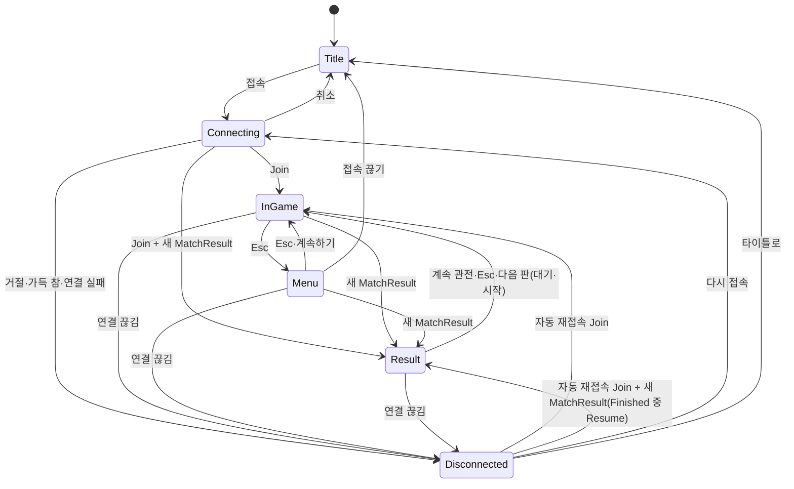

# Client

Unity 6000.3.24f1, URP, Input System. Scene·Prefab 없이 `GameBootstrap`(RuntimeInitializeOnLoadMethod, AfterSceneLoad)가 `GameClient`+`UiRoot`를 만들고, `GameClient.Awake`가 맵(`MapWorld`)을 만든다. 화면(타이틀·메뉴·끊김·결과·내 전적)은 `UiRoot`가 코드로 만든 UGUI다("화면과 흐름 (Phase 11)").

## 구조

| 파일 | 역할 |
|---|---|
| `Bootstrap/GameBootstrap` | GameClient와 UiRoot를 한 GameObject에 1개 생성(DontDestroyOnLoad) |
| `Bootstrap/MapWorld` | Shared `GameMap`의 지형 Mesh 1개(`TerrainMesh`, 81 × 81 꼭짓점, 서버와 같은 삼각형, 앞면이 위)와 MeshCollider, 박스마다 Cube(BoxCollider), 맵 밖 400 m 바닥(y −0.05), 공유 Material 3개(지형·구조물·엄폐물), 그림자 없음. Collider는 카메라 충돌·조준 광선용이고 이동 충돌은 `MovementSimulation`이 한다 |
| `Bootstrap/LaunchArgs` | 실행 인자(`-host`, `-port`, `-devId`, `-autoConnect`). `-autoConnect`면 `UiRoot.Start`가 타이틀을 거치지 않고 바로 접속한다 |
| `Net/NetClient` | LiteNetLib, 메인 스레드 전용(`UnsyncedEvents = false`, `Update`에서 Poll). 전투 패킷 6종(WeaponCatalog, ShotFired, HitConfirmed, DamageTaken, PlayerDied, PlayerRespawned)과 아이템 패킷(ItemCatalog, WorldItems·ItemSpawned → `ItemReceived`, ItemRemoved, InventoryState, PickupResult), 경기 패킷(MatchState, ZoneState, MatchResult), 전적 응답(`StatsReceived`)을 이벤트로 올린다. `RequestStats()`가 `StatsRequest`를 보낸다(Join한 뒤에만). `PlayerSpawned.Name`을 함께 전달하고, 마지막 Join 결과·거절 사유·시작 실패를 끊김 화면용으로 보관한다 |
| `Net/VectorConversions` | System.Numerics ↔ UnityEngine 벡터 변환 |
| `Input/InputReader` | Input System 격리. Move, Look, Jump, Sprint, Fire(좌클릭), Aim(우클릭), Reload(R), Slot1–3(1·2·3), Interact(E), Drop(G), UseMedkit(4), UseShieldCell(5), Esc(메뉴), F1(디버그 줄). Esc·F1은 `GameClient`가 `UiRoot`에 넘긴다. 누름은 `QueuedButtons`에 모았다가 다음 예측 Step이 가져간다 |
| `Game/TerrainMesh` | 높이 격자 → Mesh 꼭짓점·삼각형(순수 계산) |
| `Game/PoiLookup`, `PoiLabel` | 따라가는 발이 있는 POI 이름을 왼쪽 위에 표시(글꼴은 `UiFont`). POI가 바뀔 때만 Text를 바꾼다 |
| `Game/GameClient` | 구성 루트, 생성·해제 책임 |
| `Game/LocalPlayerPredictor` | 예측·재조정. `GameMap.Boxes`·`GameMap.Terrain`으로 이동(서버와 같은 지형). 입력에 버튼·조준·ViewTick을 담는다. 사망 중 정지, 부활 시 상태만 초기화(Seq 유지, 예측기는 새로 만들지 않는다). `SetAim`은 이번 프레임의 입력마다 그 Step의 예측 결과 위치를 눈으로 삼아 조준 각을 구하고, `RenderPosition`은 카메라·뷰에 쓴다 |
| `Game/AimSolver` | 눈(발 + 1.6 m) → 조준점 방향을 Yaw/Pitch로(순수 계산) |
| `Game/WeaponState` | 서버 무기 규칙의 표시용 사본. 인벤토리 칸 3개(빈 칸 가능)와 탄약 보유량 기준. 예측 입력마다 Step하고 결과(보유량 포함)를 64칸 링에 저장한다. Snapshot 수신자 블록이 ack 시점 기록과 다르면 서버 값으로 맞춘 뒤 ack 이후 입력을 다시 적용한다(이동 재조정과 같은 방식). 칸 내용물과 보유량은 `InventoryState`로 받고, 현재 칸의 탄창은 무기가 그대로면 Snapshot에 맡긴다 |
| `Game/WorldItemList`, `WorldItemViews` | 월드 아이템 목록(256칸 고정, Upsert·Remove)과 뷰. 뷰는 최대 256개 풀에서 빌려 쓰고 Dispose 때만 파괴한다. 공유 Material 8개(등급 5색, 탄약, Medkit, Shield Cell)와 내장 Mesh 3개(무기 큐브, 탄약 원통, 회복 구), Collider 없음, 프레임마다 회전 하나를 모두에 적용 |
| `Game/PickupRule` | 서버 줍기 대상 규칙의 사본(수평·수직 2 m, 가장 가까운 것, 같으면 작은 ItemId). "[E]" 안내용이고 결정은 서버가 한다 |
| `Game/InventoryHud`, `InventoryHudText` | 인벤토리 HUD(칸 3개·선택 표시·등급 색·탄창/보유량, 회복 개수("[4] 구급상자 x2    [5] 실드 셀 x3"), 회복 진행 막대, "[E] 줍기: …" 안내, 줍기 실패 안내). 글꼴은 `UiFont`. 문자열은 `InventoryHudText`가 값이 바뀔 때만 만든다 |
| `Game/CombatHud` | 코드로 만든 UGUI(Legacy `Text`, 글꼴은 `UiFont`). 체력·실드("체력 100   실드 50"), 현재 무기·탄창/보유량("재장전 중..."), 명중 표시, 피격 방향, 사망 카운트다운("사망   3초 뒤 부활"). 값이 바뀔 때만 문자열을 만든다 |
| `Game/ZoneMath` | Zone 원 보간·밖 판정·안내 문구 종류(순수 계산, UnityEngine 없음). 서버 `SafeZone.Sample`·`IsOutside`와 같은 식이어야 한다(반지름 0인 원은 안이 없다). 서버 테스트가 이 파일을 컴파일해 비교한다 |
| `Game/ZoneView` | Zone 표시: LineRenderer 원 2개(현재 원 흰색, 다음 목표 원 하늘색, 128점, 지형 높이를 따라감)와 반투명 벽(벽 높이 40 m, 코드로 만든 뚜껑 없는 단위 원통 Mesh, 공유 Material, Scale만 바꾼다). 벽 Material은 내장 `Sprites/Default`(빌드에 항상 포함되고 알파·양면이 키워드 없이 된다. URP Lit 투명은 변형이 빌드에서 빠져 벽이 불투명해질 수 있어 쓰지 않는다. 셰이더를 못 찾으면 경고 로그를 남기고 URP Lit로 대체한다). 원 선 Material 2개는 기본 큐브 Material의 복사본이다. Phase 0이면 숨긴다 |
| `Game/MatchHud`, `MatchHudText` | 상단 상태 문구("플레이어를 기다리는 중 1/2", "시작까지 7초", "생존 3/5", "경기 종료"), Zone 안내("자기장 축소까지 12초", "자기장 축소 중"), Zone 밖이면 화면 가장자리 붉게, 관전 줄("관전 중: <이름>", 이름을 모르면 "플레이어 <id>"). 글꼴은 `UiFont`. 결과 줄은 결과 화면(`UI/ResultScreen`)으로 옮겼다. 문자열은 `MatchHudText`가 값이 바뀔 때만 만든다 |
| `Game/SpectatorCamera`, `SpectatorTargets` | 경기 중 죽으면 카메라가 처치자를, 좌클릭마다 다음 생존자(EntityId 오름차순, 순환)를, 따라가던 사람이 죽으면 다음 사람을 원격 보간 위치로 따라간다. 대상 규칙은 순수 계산(`SpectatorTargets`) |
| `Game/Crosshair` | 코드로 만든 Screen Space Overlay Canvas 조준점(UGUI, GraphicRaycaster 없음). 살아 있고 게임 입력이 통할 때(화면이 없고 커서가 잠김, 입력 차단과 같은 값)만 보인다 |
| `Game/LocalFireEffects`, `RingCursor` | 발사 연출: 내 발사는 `WeaponState`가 쏜다고 한 입력마다(프레임당 최대 3발) 총구 → 조준점 광선, 다른 사람 발사는 `ShotFired`의 시작 → 끝. 궤적 16·탄착 32 고정 링 풀 |
| `Game/RemotePlayers`, `RemotePlayerInterpolator`, `ServerClock` | 다른 플레이어 보간. Snapshot 생존 비트로 회색·눕힘, 부활하면 보간 기록을 비운다. 다른 플레이어의 `PlayerRespawned`(경기 시작·판 재시작은 생존 비트가 바뀌지 않는다)는 `Teleport`로 Spawn 위치 5 m 안의 최근 샘플만 남기고 이전 샘플을 버린다. 살아 있는 뷰는 회전하지 않는다(서버 AABB와 같은 축 정렬 Collider 유지) |
| `Game/PlayerViewFactory` | 캡슐 뷰 생성, 공유 Material(내 색, 남 색, 사망 회색). 원격 뷰는 캡슐 Collider 대신 서버 판정 상자와 같은 크기(0.7 × 1.8 × 0.7)의 `BoxCollider`를 `Ignore Raycast` 레이어(2)에 둔다(조준 광선만 이 레이어를 본다). 내 뷰에는 Collider가 없다 |
| `Camera/ShoulderCamera`, `ShoulderCameraMath` | 오른쪽 어깨 카메라, 우클릭 ADS(거리 3.5→1.6 m, 오른쪽 0.55→0.65 m, FOV 60→42, 감도 ×0.6), 두 단계 SphereCast(반경 0.2 m) 충돌. 1단계(머리 기준점 → 어깨점)는 부딪힌 거리에서 0.02 m(`ShoulderClearance`) 덜 나가 2단계가 벽에 붙은 채 시작하지 않게 한다. 계산은 `ShoulderCameraMath` 순수 함수 |
| `UI/UiFlow`, `UiText`, `KillFeedModel` | 순수 코드(UnityEngine 없음). `UiFlow`: 화면 상태 기계(D3)와 전적 창의 대기(`StatsWait`). `UiText`: 한국어 문구와 이름·포트·주소 검사. `KillFeedModel`: 5칸 링, 줄마다 6초. 서버 테스트 프로젝트가 소스 링크로 시험한다(`Server/tests/ProjectH.Server.Tests/ClientUi`) |
| `UI/UiFont`, `UiFactory` | `UiFont`: 모든 UI 글자의 글꼴 하나(D2, 아래 "글꼴"). `UiFactory`: Canvas·`CanvasScaler`(1920 × 1080 기준, 가로·세로 0.5)·패널·글자·버튼·입력칸(Legacy `InputField`) 생성 도우미, `EventSystem` 생성 |
| `UI/KillFeed`, `DebugOverlay` | 각자 자기 Canvas를 쓴다(GraphicRaycaster 없음). `KillFeed`는 Canvas 정렬 순서 94, `GameClient`가 갖는다. `DebugOverlay`는 정렬 순서 120이고 F1로 켠다 |
| `UI/TitleScreen`, `MenuScreen`, `DisconnectScreen`, `ResultScreen`, `StatsWindow` | 화면 5개. 한 Canvas `UiScreens`(정렬 순서 110, GraphicRaycaster)의 자식이고 `SetActive`로 보이고 숨긴다. 그리기만 하고 흐름은 `UiFlow`가 정한다 |
| `UI/UiRoot` | MonoBehaviour(`GameClient`와 같은 GameObject). 화면을 만들고, 매 프레임 `GameClient` 상태를 `UiFlow`에 넣고, `UiFlow`가 바뀐 때(`Version`)만 화면을 바꾸고, 커서·입력 막기(D5)를 `GameClient.SetUiControl`로 넘긴다. 버튼은 `GameClient`와 `UiFlow`를 부른다 |

의존성: 어셈블리 `ProjectH.Client`는 `ProjectH.Shared`, `Unity.InputSystem`, `UnityEngine.UI`를 참조한다. `UnityEngine.UI`는 조준점·HUD·화면에, `Unity.InputSystem`은 입력(`InputReader`)과 UI의 `InputSystemUIInputModule`에 쓴다. LiteNetLib은 `Assets/Plugins/LiteNetLib/LiteNetLib.dll`(서버와 같은 버전(NuGet 2.1.4)의 netstandard2.1 빌드. 서버는 같은 패키지의 net8.0 빌드를 쓴다)이다. Git UPM 패키지는 `.meta`가 없어 Unity가 무시하므로 쓰지 않는다. 소스 스텝 실행은 안 된다.

## 프레임 흐름 (`GameClient.Update`)

1. `NetClient.Poll` → 콜백(Joined/Spawned/Snapshot/전투 이벤트/아이템 이벤트(`ItemSpawned`·`ItemRemoved`·`PickupResult`·`InventoryState`))가 메인 스레드에서 실행됨
2. `InputReader.Update`(점프·재장전·슬롯·E(줍기)·G(버리기)·4·5(회복) 눌림 큐잉), 커서·버튼 처리: 경기 화면(`UiFlow.AllowCursorLock`)이고 커서가 풀려 있으면 좌클릭은 잠금만 하고(Join 후), 그 클릭은 버튼을 뗄 때까지 발사로 치지 않는다. 다른 화면이 떠 있으면 커서를 풀고 클릭으로 잠그지 않는다. 조준·발사는 커서가 잠겨 있고 입력이 막히지 않았을 때만. `UiRoot.Update`가 Esc·F1을 읽고 `SetUiControl`로 이 두 값을 매 프레임 넘긴다.
3. 원격 플레이어 렌더(`ServerClock.RenderTick`로 보간 대상 Tick 계산, 이 값이 입력의 ViewTick이 된다)
4. 카메라 Look(ADS 중 감도 ×0.6. 입력이 막혀 있으면 시점·이동·발사·조준이 0이고 입력 패킷은 빈 입력으로 계속 간다) → `LocalPlayerPredictor.Advance`(고정 스텝 예측, Sprint·Fire는 매 Step, 눌림은 마지막 Step) → 로컬 뷰 자세(사망이면 눕힘)
5. `LateUpdate`: 관전 대상 갱신(`SpectatorCamera.Update`) → 카메라 Follow(관전 중이면 대상의 보간 위치, 아니면 내 렌더 위치. 머리 기준점 → 어깨점 → 카메라 두 번 SphereCast, 막히면 즉시 당기고 풀리면 감쇠 복귀) → 조준점(`Physics.SyncTransforms` 후 화면 중앙 Raycast, 원격 플레이어 포함) → 이번 프레임 입력들에 조준(눈은 예측 위치 기준)·ViewTick 기록 → `WeaponState` Step → `PlayerInput` 전송 → 내 발사 연출(카메라가 움직인 뒤라 조준점과 일치) → HUD → 아이템 회전 → 인벤토리 HUD·"[E]" 안내(예측 위치 기준 `PickupRule`) → 경기 HUD·Zone 원(서버 현재 Tick 추정 = 렌더 Tick + 보간 지연)

아이템 회전(`WorldItemViews.Tick`)은 예측기 유무와 상관없이 `LateUpdate` 맨 앞에서 돌아 첫 Spawn 전에도 아이템이 돈다(할당 없음).

알려진 Client 쪽 불일치(다음 Snapshot 하나 안에 스스로 맞춰진다):

- Client는 줍기·버리기·교환을 흉내 내지 않는다. 그래서 G를 누른 뒤 최대 1 RTT 동안은 내 궤적 연출과 탄약 표시에 버린 무기가 남아 있을 수 있다.
- `DroppedFireLockTick`(버린 무기의 발사 간격이 주운 무기에 걸리는 것)은 Client에 복사돼 있지 않다.

`Joined` 응답에서 SimHz·SnapshotHz를 받아 `ServerClock`과 보간 지연(`2 / SnapshotHz`)을 정한다. 자기 `PlayerSpawned`를 받으면 `LocalPlayerPredictor`와 로컬 뷰를 만든다.

경기(Phase 5): `MatchState`를 한 번이라도 받으면 경기 모드다(`DevRespawn` 서버는 보내지 않아 Phase 4처럼 동작한다). 경기 모드에서 내 `PlayerDied`를 받으면 부활 카운트다운 대신 관전을 시작한다(처치자부터. Zone 사망과 경기 중 합류는 KillerId 0이라 첫 생존자부터). 죽을 때 발사 버튼이 눌려 있었다면 뗄 때까지 발사로 치지 않는다(누른 채 다음 판이 시작돼도 쏘지 않는다). 관전 중 좌클릭은 다음 대상으로 넘기고 절대 발사하지 않으며, 버튼을 뗄 때까지 다시 발사로 치지 않는다(D12 규칙과 같다. 커서를 잠그는 클릭은 넘기지도 쏘지도 않는다). 경기 시작과 판 재시작은 서버가 `PlayerRespawned`로 모두를 Spawn에 옮기므로, 부활과 같은 경로로 예측기 상태만 되돌리고 Seq는 유지하며 관전을 끝낸다. 결과는 `MatchResult`가 오면 보이고 다음 판의 대기·카운트다운이 오면 사라진다.

## 화면과 흐름 (Phase 11)

설계 근거: `Docs/specs/2026-10-01-phase11-game-ui-design.md`. 어느 화면을 보일지는 `UiFlow`(D3)가 정한다. `UiRoot`가 매 프레임 `GameClient`가 말하는 것(연결 상태, 재접속 중인지, 지금까지 받은 `MatchResult` 수, 마지막 `MatchState`)을 `UiFlow.Update`에 넣고, 버튼과 Esc는 `UiFlow`의 명령 메서드를 부른다. 화면은 그 결과만 그린다. `UiFlow`의 상태는 `Title`, `Connecting`, `InGame`, `Menu`, `Disconnected`, `Result`다.



- 전적 창은 화면이 아니라 메뉴·결과 위에 연다(`UiFlow.StatsOpen`). Esc는 창부터 닫는다.
- 연결 상태는 `Offline`(끊김), `Connecting`(`Connecting`·`Connected`), `Joined`로 줄여 넣는다. 그래서 경기 가득 참(`MatchFull`)은 Join이 아니다. 서버가 1초 뒤 끊을 때까지 "접속하는 중..."이 보이다가 끊기면 끊김 화면이 "경기가 가득 찼습니다."를 보여 준다.
- 커서와 입력(D5): 경기 화면에서만 클릭으로 커서를 잠근다. 다른 화면이 떠 있거나 커서가 풀려 있으면 이동·발사·조준·시점이 0이다. 입력 패킷은 빈 입력으로 계속 간다(Input Timeout). **동작이 바뀌었다:** Join한 뒤 화면을 한 번 클릭해야 움직인다(Phase 10까지는 커서가 풀려 있어도 움직였다). 메뉴를 열어도 일시정지가 아니다(서버는 경기를 계속 돌린다).
- 타이틀: 주소·포트·이름, 마지막 입력값은 `PlayerPrefs`(`ProjectH.Host`, `ProjectH.Port`, `ProjectH.Name`). `-autoConnect`면 명령줄 값으로 바로 접속한다(이 값은 `PlayerPrefs`에 저장하지 않는다. 저장은 타이틀의 접속만 한다). 입력 규칙: 주소 1–253자, 포트 1–65535, 이름은 앞뒤 공백 제거 뒤 올바른 UTF-8 1–32바이트에 제어 문자·서식 문자(폭 0 문자, 방향 제어)·줄 구분자가 없어야 한다(한글은 한 글자 3바이트. 서버의 연결 요청 검사와 같은 Shared `ProtocolConstants.IsValidPlayerName`). 어기면 규칙 문구를 보여 주고, 입력칸을 고치거나 다시 접속을 누르면 지운다. 접속 중에는 입력칸이 잠기고 접속 대신 취소가 보인다.
- 끊김 화면: `UiText.Disconnect`의 문구(시작 실패 → 경기 가득 참 → 거절 이유 → 서버 끊기 코드 → LiteNetLib 이유 순서). 자동 재접속 중이면 "재접속 중 (n/3) - k초 뒤 다시 시도"와 재접속 취소, 아니면 다시 접속·타이틀로. 다시 접속은 앞 연결이 완전히 끊긴 뒤에만 눌린다(타이틀의 접속과 같다). 끊김 화면에서 타이틀로를 누르면 타이틀에 같은 이유가 보인다. 메뉴의 접속 끊기나 접속 취소로 직접 나갔을 때는 이유 문구가 없다.
- 결과 화면: 승리/탈락, 순위/인원, 처치, 승자, 탈락 원인(처치자 이름 또는 자기장), 다음 판까지 남은 초. 피해량·생존 시간은 결과 패킷에 없어서 "내 전적"에서 본다. 다음 판 대기·시작이 오면 저절로 닫힌다. 버튼은 계속 관전과 내 전적이다. `Finished` 중에 재접속(Resume)하면 Join 답과 `MatchResult`가 같은 프레임에 와서 게임 화면을 거치지 않고 결과 화면으로 간다. 결과 수가 지난번보다 커야 새 결과다.
- 내 전적: 열 때 요청 1개(2.5초 안에 다시 열면 앞 요청을 쓴다. 서버가 연결당 2초에 한 번만 답하기 때문이다), 5초 안에 답이 없으면 "응답 없음". 상태별 문구("아직 기록이 없습니다.", "기록을 볼 수 없음", Busy 문구), 요약 두 줄, 최근 경기 최대 10줄(현지 시각, 최신순). 프로토콜은 `Networking.md` "전적 조회".
- Kill Feed: 오른쪽 위, 최근 5줄, 6초. "가해자 ▸ 피해자", Zone이면 "자기장 ▸ 피해자". 경기 중 합류 알림(킬러·순위가 없는 `PlayerDied`)은 넣지 않는다.
- 이름 표: `PlayerSpawned.Name`. Despawn과 끊김 때 지운다. 모르는 이름은 "플레이어 <id>".
- 모든 UI Text(화면, HUD, Kill Feed, POI, F1 줄, 입력칸)는 Rich Text를 끈다(`supportRichText = false`). 이름에 `<color=red>`가 있어도 글자 그대로 보인다. 태그를 쓰는 문구는 없다.
- F1: `DebugOverlay`(상태, RTT, Entity). 처음에는 숨겨져 있고, 숨겨진 동안은 문자열을 만들지 않는다.
- 성능(D11): 숨긴 화면은 `SetActive(false)`라 다시 그리지 않는다. 글자는 값이 바뀔 때만 바꾸고(남은 초는 정수 초가 바뀔 때만) 매 프레임 할당이 없다. Kill Feed·F1은 자기 Canvas를 써서 줄이 바뀌어도 다른 UI를 다시 그리지 않는다. 모든 문구 생성은 `UiText`(순수 함수)다.

## 글꼴 (Phase 11 D2)

모든 UI 글자(HUD 포함)는 `UiFont.Get()`의 글꼴 하나를 쓴다. 저장소에 글꼴 에셋은 없다(라이선스·용량).

- 후보 6개, 순서대로: "Malgun Gothic", "맑은 고딕", "Apple SD Gothic Neo", "Noto Sans CJK KR", "Noto Sans KR", "NanumGothic".
- `Font.GetOSInstalledFontNames()`에 있는 것만 모아 `Font.CreateDynamicFontFromOSFont(string[], 16)`에 한 번에 넘긴다. 첫 글꼴이 그리고 나머지는 그 글꼴에 없는 글자의 대체다.
- 하나도 없으면 내장 `LegacyRuntime.ttf`를 쓰고 Warning 로그를 남긴다. 이때 한글은 네모로 나온다. 그런 OS를 지원해야 하면 OFL 글꼴(예: Noto Sans KR)을 에셋으로 넣는다.
- 시작 로그 "UI font: Malgun Gothic (OS font)"처럼 무엇을 골랐는지 본다.
- OS 글꼴로 만든 `Font`는 `GameClient.OnDestroy`가 마지막에 `UiFont.Release`로 파괴한다(내장 글꼴은 Unity 것이라 파괴하지 않는다).

## Lifetime

생성 순서: 월드(+박스 Material) → InputReader → ShoulderCamera → Crosshair → CombatHud → InventoryHud → WorldItemViews → LocalFireEffects → MatchHud → ZoneView → PoiLabel → KillFeed → NetClient. `UiRoot`는 같은 GameObject의 다른 컴포넌트라 `GameClient.Awake`가 끝난 뒤 `Start`에서 접속한다. `GameClient.OnDestroy`는 역순으로 해제한다: 이벤트 구독 해제(21개, `StatsReceived` 포함) → NetClient Dispose(`NetManager.Stop`) → 매치 상태(예측기·로컬 뷰·원격 뷰·ServerClock·WeaponState·카탈로그·마지막 InventoryState·월드 아이템 목록과 뷰 반납, 이름 표·Kill Feed·마지막 전적 응답, 마지막 MatchState·ZoneState·결과, 관전 종료, Zone 숨김, 조준점·HUD·인벤토리 HUD·경기 HUD 숨김, 발사 연출 숨김) → KillFeed Dispose(Canvas) → ZoneView Dispose(루트, 원통 Mesh, Material 3개) → MatchHud Dispose(Canvas) → PoiLabel Dispose(Canvas) → LocalFireEffects Dispose(풀 GameObject·Material) → WorldItemViews Dispose(루트와 풀 전체, Material 8개) → InventoryHud Dispose(Canvas) → CombatHud Dispose(Canvas) → Crosshair Dispose(Canvas) → InputAction Dispose → 플레이어 공유 Material(3개) → 월드·박스 Material 파괴 → 마지막으로 `UiFont.Release`(글꼴을 쓰던 HUD가 모두 사라진 뒤 OS 글꼴 파괴). 연결이 끊기면(`OnDisconnected`) 매치 상태를 지운다. 종료 때 Unity가 오브젝트를 먼저 파괴했을 수 있어(OnDestroy 순서는 보장되지 않음) `Crosshair.SetVisible`, `CombatHud`의 메서드, `LocalFireEffects.HideAll`은 루트가 파괴됐으면 아무것도 하지 않고 돌아온다. 예외가 나면 뒤의 해제가 건너뛰어지기 때문이다.
`UiRoot`: `EventSystem`(장면에 없을 때만 만든다. 꺼진 것도 있는 것으로 친다. `InputSystemUIInputModule`은 기본 UI Action을 `OnEnable`에서 붙이고 `OnDisable`에서 뗀다), 화면 Canvas(`UiScreens`), `DebugOverlay`를 만들고 `OnDestroy`에서 지운다. 버튼 리스너는 Canvas와 함께 사라진다. `KillFeed`는 링 5칸 고정이라 늘어나지 않고 줄은 죽음마다 한 번만 만든다. 이름 표(Entity Id → 이름)는 플레이어 수만큼이고 Despawn과 끊김·매치 초기화 때 지운다.
`renderer.material`은 쓰지 않는다(복제됨). 캡슐은 스폰/디스폰 때만 생성·파괴하므로 풀링하지 않는다. `RemotePlayers`는 Spawn/Despawn/Clear로만 증감하고, 보간 히스토리는 플레이어당 8개 고정이다. 발사 연출은 궤적 16·탄착 32개를 생성자에서 한 번 만들고 `RingCursor`로 오래된 것부터 재사용하므로 늘어나지 않는다. 발사·카메라의 Physics 호출은 단일 결과 버전만 쓴다.

## 끊김과 자동 재접속 (Phase 10)

설계 근거: `Docs/specs/2026-10-01-phase10-hardening-design.md` D10. 코드는 서버 종료·Kick·Timeout 같은 이유(`DisconnectCode`, `Networking.md` "끊기와 재접속")를 받아 다시 접속해도 되는 경우에만 스스로 다시 접속한다.

- 화면에는 `UiText.Disconnect`의 한국어 문구가 나온다("서버가 종료되었습니다.", "잘못된 패킷이 많아 연결이 끊겼습니다.", "경기 참가가 늦어 연결이 끊겼습니다.", "입력이 오래 없어 연결이 끊겼습니다.", "서버 오류로 경기가 초기화되었습니다."). `NetClient.LastError`는 로그용 영어 문장으로 남는다. 판단 결과는 `NetClient.LastDisconnectCode`와 `LastDisconnectRetryable`에 있다.
- 재접속 조건: Shared `DisconnectCodes.ShouldReconnect`의 표(원격 종료는 `ServerError`만, `Timeout`·`ConnectionFailed`·`HostUnreachable`·`NetworkUnreachable`은 한다. 직접 끊기·거절·코드 없는 원격 종료는 안 한다)이고, 거기에 그 연결이 연결된 적이 있거나(`Connected` 이벤트) 이미 재접속 사이클 중이어야 한다. 처음 연결이 실패한 것은 다시 하지 않는다.
- 시각: n번째 시도는 끊김을 안 때부터 1·3·7초 뒤(`DisconnectCodes.ReconnectOffsetSeconds(n)`, `GameClient`, Unscaled 시간)에 시작하고 최대 3번이다. 앞 시도가 실패한 때가 아니라 끊긴 때부터 재므로, 시도가 늦게 실패해도 다음 시도가 밀리지 않는다.
- 자동 시도는 짧은 연결 예산으로 접속한다(`NetClient.Connect(..., reconnectAttempt: true)`가 LiteNetLib `ReconnectDelay` 250 ms, `MaxConnectAttempts` 5로 바꾼다. 약 1.5초 안에 포기). 직접 Connect는 LiteNetLib 기본값(500 ms × 10, 약 5.5초)으로 되돌린다. 두 값은 LiteNetLib이 연결 중인 peer를 갱신할 때마다 읽는 public 필드라 접속마다 바꿔도 된다(2.1.4에서 확인).
- 다음 시각이 왔는데 앞 시도가 아직 연결 중이면 `NetClient.CancelConnect()`로 버리고 다음 시도를 시작한다. 버린 peer의 이벤트는 무시한다(`_server`가 아닌 peer). 그래서 버린 시도의 끊김(`DisconnectPeerCalled`)이 사이클을 끝내지 않는다. 셋째 시도는 약 8.5초에 끝나 서버 유예(10초) 안이다.
- 시도가 연결되면 다음 시각을 지운다. Join(또는 Resumed)이 되면 횟수가 0으로 돌아간다. Join이 거절되면(`MatchFull`) 재접속을 멈춘다(서버가 1초 뒤 코드 없이 끊는다).
- 끊김 화면이 재접속 중에 "재접속 중 (n/3) - k초 뒤 다시 시도"를 보여 준다(n은 연결 중인 시도, 또는 기다리는 다음 시도의 번호. 시도가 연결하는 중이면 "연결하는 중").
- 다시 접속·타이틀로·접속 끊기를 누르면 재접속을 멈춘다(다시 접속은 새로 접속한다). 재접속 취소는 진행 중인 시도(연결 중, 또는 연결됐지만 Join 답 전)를 끊김 이벤트 없이 버려서 화면의 이유가 그대로다(`GameClient.StopReconnecting`, `NetClient.CancelConnect`). `GameClient.Connect`는 연결이 끊긴 상태에서만 받는다. 연결 중·연결됨이면 무시하고 주소와 id도 바꾸지 않는다.
- Resumed는 Join과 같다. 서버가 전체 상태를 다시 보낸다. 끊길 때 매치 상태를 지우므로 예측기는 자기 `PlayerSpawned` 위치에서 새로 시작하고 Seq는 1부터다(서버도 Resume 때 그 캐릭터의 입력 상태를 비운다).

## 실행과 두 Client 확인

1. 서버: `dotnet run --project Server/src/ProjectH.Server`
2. Multiplayer Play Mode: Window > Multiplayer > Multiplayer Play Mode에서 Player 2 활성화 → Play → 각 창의 타이틀에서 접속
3. Standalone: 빌드 후 `ProjectH.exe -autoConnect -devId p2` + Editor Play (`-host`, `-port`도 지정 가능. 기본 127.0.0.1:7777, devId 미지정 시 `dev-<8자리>` 자동 생성)
4. 조작: 좌클릭(Join한 뒤 한 번 눌러야 커서가 잠기고 움직인다. 잠긴 뒤 누르고 있으면 발사. 경기 중 죽어 있으면 다음 관전 대상), 우클릭(누르는 동안 조준), R(재장전), 1·2·3(무기 칸), E(줍기), G(현재 무기 버리기), 4(Medkit), 5(Shield Cell), WASD, Shift(달리기), Space(점프), Esc(메뉴), F1(디버그 줄). 시작은 빈손이라 먼저 아이템을 주워야 쏠 수 있다.
5. 경기 확인(Phase 5): 두 Client가 접속하면 "시작까지 10초" 카운트다운 → 모두 Spawn으로 옮겨지고 Loot가 생긴다 → Zone 원과 "자기장 축소까지 …초" → Zone 밖이면 화면 가장자리가 붉고 체력이 1초마다 준다 → 한 명이 죽으면 관전("관전 중: <이름>") → 결과 화면(승리/탈락, 순위, 처치) → 10초 뒤 다음 판 카운트다운이 오면 결과 화면이 저절로 닫힌다. Unity Editor에서의 확인은 사용자가 한다.
6. 재접속 확인(Phase 10): 경기 중 Client 하나를 끄고 10초 안에 같은 `-devId`(타이틀의 이름)로 다시 켜면 같은 캐릭터(위치·체력·인벤토리)로 돌아온다. 서버를 Ctrl+C로 끄면 끊김 화면에 "서버가 종료되었습니다."가 보이고 재접속하지 않는다. Unity Editor에서의 확인은 사용자가 한다.
7. 게임 UI 확인(Phase 11): 아래 "Unity 확인 순서"를 따른다.

## Unity 확인 순서 (Phase 11)

사용자가 Editor에서 한다. 서버를 `dotnet run --project Server/src/ProjectH.Server`로 띄우고 Play한다. Multiplayer Play Mode로 Player 2도 켠다.

1. Console에 "UI font: Malgun Gothic …"(또는 다른 한글 글꼴)이 나온다. 타이틀·HUD·Kill Feed의 한글이 네모가 아니다. Kill Feed의 `▸`도 글자로 보인다.
2. 타이틀: 주소·포트·이름 입력칸에 영어와 한글(IME 조합 포함)을 칠 수 있다. Console에 `InvalidOperationException`(Input 클래스)이 없다. 이름을 비우거나 한글 11자를 넣고 접속을 누르면 이름 규칙 문구가 나온다.
3. 서버를 끈 채 접속: "접속하는 중..."과 취소가 보이고, 약 5초 뒤 끊김 화면에 "서버에 연결할 수 없습니다."와 다시 접속·타이틀로가 나온다. 취소를 누르면 바로 타이틀로 간다.
4. 서버를 켜고 접속: 경기 화면. 클릭 전에는 움직이지 않고, 클릭하면 커서가 잠기고 움직인다.
5. Esc: 메뉴가 열리고 커서가 풀린다. 메뉴가 열린 동안 WASD·마우스로 캐릭터와 시점이 움직이지 않는다. 10초 넘게 열어 두어도 끊기지 않는다(Input Timeout). Esc·계속하기로 닫힌다.
6. 메뉴 → 내 전적: "불러오는 중..." 뒤에 기록 또는 "아직 기록이 없습니다."(DB 있음), "기록을 볼 수 없음"(`Persistence:Enabled=false` 또는 DB 없음). 닫고 바로 다시 열어도 "응답 없음"이 되지 않는다.
7. 두 Client로 한 판(Player 2의 타이틀에 같은 이름이 미리 채워져 있으면 다른 이름으로 바꾼다. `PlayerPrefs`를 같이 쓸 수 있다): Kill Feed(오른쪽 위)에 "이름 ▸ 이름", 관전 줄 "관전 중: <이름>", 결과 화면(승리/탈락, 순위, 처치, 승자, 탈락 원인, 다음 판까지 남은 초). 다음 판 카운트다운이 오면 결과 화면이 닫힌다.
8. 경기 중 서버를 Ctrl+C로 끈다: 끊김 화면 "서버가 종료되었습니다.", 재접속하지 않는다. 타이틀로를 누르면 타이틀에 같은 이유가 보인다.
9. 자동 재접속: 경기 중 서버 프로세스를 강제로 끝낸다(작업 관리자. 끊기 코드가 없어 Client는 5초 뒤 Timeout으로 안다). 끊김 화면에 "서버의 응답이 끊겼습니다."와 "재접속 중 (1/3) - k초 뒤 다시 시도", 재접속 취소가 보인다. 바로 서버를 다시 켜면 새 경기 화면으로 돌아간다. 다시 해 보고 이번에는 재접속 취소를 누르면 다시 접속·타이틀로가 나오고 이유 문구는 그대로다.
10. 메뉴 → 접속 끊기: 타이틀로 가고 이유 문구가 없다. F1이 디버그 줄(상태, RTT, Entity)을 켜고 끈다. 게임 종료는 빌드에서만 창을 닫는다(Editor에서는 아무 일도 없다).

## 자동 검사

EditMode 테스트: `Assets/Tests/EditMode`(`LocalPlayerPredictorTests`, `ArenaPredictionTests`, `RemotePlayerInterpolatorTests`, `ShoulderCameraMathTests`, `AimSolverTests`, `WeaponStateTests`, `RingCursorTests`, `PickupRuleTests`, `WorldItemListTests`, `InventoryHudTextTests`, `ZoneMathTests`, `MatchHudTextTests`, `SpectatorTargetsTests`). `MatchHudTextTests`는 결과 줄 테스트가 없어져(결과는 결과 화면으로 옮겼다) 관전 줄의 이름이 늦게 오는 경우를 더해 6개이고 문구가 한국어다. 이 테스트들은 Physics·GameObject·네이티브 Quaternion 함수를 쓰지 않으므로 Unity 밖 NUnit 프로젝트로도 돌릴 수 있다. 발사 간격은 `WeaponState`가 센다.

Phase 11의 순수 코드 `UI/UiFlow.cs`, `UiText.cs`, `KillFeedModel.cs`는 서버 테스트 프로젝트가 소스 링크로 컴파일해 시험한다(`Server/tests/ProjectH.Server.Tests/ClientUi`: `UiFlowTests`, `UiTextTests`, `KillFeedModelTests`). 화면 클래스는 Unity에서 확인한다("Unity 확인 순서").

```bash
"C:/Program Files/Unity/Hub/Editor/6000.3.24f1/Editor/Unity.exe" -batchmode -nographics -projectPath Client -runTests -testPlatform EditMode -testResults _workspace/editmode-results.xml -logFile _workspace/unity-tests.log
```
(Editor가 프로젝트를 열고 있지 않을 때)
