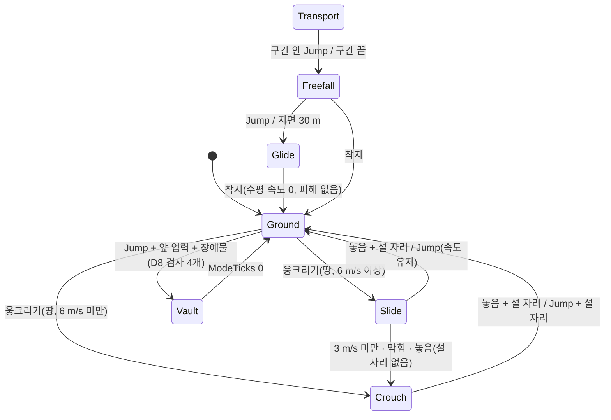

# Movement

Phase 12 기준. 설계 근거와 결정 D1–D17: `Docs/specs/2026-10-02-phase12-deployment-traversal-design.md`(5절은 계획 단계에서 바뀐 것). 이동은 Shared `MovementSimulation`이 한다. 서버(`Match.Tick`)와 Client 예측(`LocalPlayerPredictor`)이 같은 코드를 같은 입력으로 돌린다. 상태는 `MoveState`(위치, `VelocityY`, `Yaw`, `Mode`, `HorizontalVelocity`, `EnergySpent`, `EnergyDelayTicks`, `ModeTicks`, `Exhausted`)이고, 수치는 Phase 12의 `MovementTuning`과 그 전의 `MoveSettings`(걷기 4.5·달리기 7 m/s, 중력 −20, 점프 7 m/s, 반폭 0.35 m, 높이 1.8 m, `Skin`, `GroundProbe`, `MaxSlope`)에 모여 있다. Client는 위치·속도·모드를 보내지 않고 입력(이동 벡터, Yaw, 버튼)만 보낸다. 서버가 같은 `Step`으로 결과를 만들므로 속도·가속·공중 이동·기력·글라이더·순간 이동은 Client가 바꿀 수 없다(D12). 충돌 규칙과 지형은 `Networking.md` "이동 충돌", 맵은 `Map.md`다.

## 모드

`MovementMode`(byte)의 값은 전송 형식이라 번호를 바꾸지 않는다. 달리기와 공중(점프·낙하)은 모드가 아니다. 달리기는 입력(Shift)과 기력으로, 공중은 접지 판정(매 Step 다시 계산)으로 정해진다.

| 값 | 모드 | 상자 높이(`CollisionHeight`) | 처리 | 행동 가능 | Snapshot `Flags` bit1–3 | Client 자세(`PlayerPose`) |
|---|---|---|---|---|---|---|
| 0 | `Ground` | 1.8 m | `StepGround` | 예 | 0 | 보통 캡슐. 달리는 중이면 앞으로 10° 기운다 |
| 1 | `Crouch` | 1.2 m | `StepGround` | 예 | 1 | 짧은 캡슐(몸 높이 1.3) |
| 2 | `Slide` | 1.2 m | `StepGround` | 예 | 2 | 짧은 캡슐이 뒤로 30° 기운다 |
| 3 | `Vault` | 1.8 m(충돌 검사 없음) | `StepVault` | 아니오 | 3 | 앞으로 20° 기운 캡슐 |
| 4 | `Freefall` | 1.8 m | `StepAir` | 아니오 | 4 | 엎드린 캡슐 |
| 5 | `Glide` | 1.8 m | `StepAir` | 아니오 | 5 | 머리 위 납작한 상자(날개) |
| 6 | `Transport` | 1.8 m | `DropTransport.Ride`(`Step`은 Yaw만 반영한다) | 아니오 | 6 | 숨김(그리지도 맞히지도 않는다) |

- **행동 가능:** 지상·웅크리기·슬라이드만이다. 다른 모드에서는 사격·재장전·줍기·상호작용·회복·칸 바꾸기·버리기가 안 된다. 이미 진행 중인 재장전과 회복은 계속된다. 서버 `Match.ActionsAllowed`가 이동이 끝난 뒤의 모드로 판단하고, Client `LocalPlayerPredictor.ActionsAllowed`가 같은 표를 쓴다.
- **Snapshot 표현:** `SnapshotEntity.Flags`의 bit0 살아 있음, bit1–3 모드, bit4 달리는 중, bit5 기진이다(`Networking.md`). 모르는 모드 값(7)은 `Ground`로 읽는다.
- **맞는 높이:** 웅크리기·슬라이드는 1.2 m, 나머지는 1.8 m다. 사격의 눈은 웅크리기·슬라이드에서 발 + 1.0 m(`CombatRules.CrouchEyeHeight`, Client `AimSolver`와 같다), 그 밖에는 1.6 m다. 위치 기록(`PositionHistory`)에 모드도 남기므로 되감기에서도 그때의 높이로 맞힌다. `Transport` 탑승자는 맞지 않는다.
- Client의 뷰와 `BoxCollider`(조준 광선용)의 높이는 `PlayerPose.HitHeight`로 서버와 같다. 캡슐의 모양은 자세만 보여 줄 뿐이다.

## 전환 규칙

- 웅크리기·슬라이드는 땅 위에서만 시작한다. 땅을 떠나도 모드는 그대로라(절벽을 슬라이드로 넘으면 1.2 m 상자로 떨어진다) 그 착지는 낙하 피해를 줄 수 있다.
- `Ground` → `Glide`·`Freefall` 직접 전환은 없다. 공중 모드는 `Transport`에서만 들어간다.
- 달리기는 땅 위에서만이다. 접지한 `Ground` 모드에서 Shift를 누른 채 움직이면 기력이 닳고 달리는 중 플래그가 선다. 공중에서는 Shift를 무시한다. 기력이 닳지 않고 달리는 중·밀치기(`Charging`)가 아니다. 달리며 점프한 속도는 이륙 Tick에 정해져 그대로 이어진다(최종 검토 C8). 그래서 공중에서 문을 밀치지 못한다.
- 다음 입력은 무시한다.
  - 공중·웅크리기·슬라이드에서의 Vault(`Ground` 모드에서만 판정한다)
  - 자유 낙하·글라이드에서의 웅크리기·슬라이드
  - 탑승 중의 이동(Yaw만 반영된다)
  - 달리기 속도가 아닌 낮은 상자 위 점프(Hurdle은 6 m/s 이상일 때만이고, 아니면 보통 점프다)
- Client `InputReader`는 C를 켜고 끄는 토글로, Ctrl을 누르는 동안으로 받아 둘 다 `Crouch` 버튼(누른 상태)으로 보낸다. 토글은 Jump나 Sprint를 누르면 꺼진다. 메뉴가 떠 있거나 커서가 풀려 입력이 막혀 있으면 C와 Ctrl은 무시한다. 내 캐릭터가 나타날 때(Spawn), 부활할 때, 죽을 때 토글을 끈다.

## 수치 (`MovementTuning`)

수치는 Shared 상수 한 곳에 있다. 서버와 Client 예측이 같은 값을 써야 하므로 서버 설정(JSON)이 아니라 코드다. 초 단위 값은 `Step`이 `deltaTime`으로 Tick에 곱한다.

| 이름 | 값 | 단위 | 뜻 |
|---|---|---|---|
| `MaxEnergy` | 100 | | 기력 최대 |
| `SprintEnergyCostPerSecond` | 20 | 1/s | 달리기 소모 |
| `EnergyRecoveryPerSecond` | 25 | 1/s | 회복 |
| `EnergyRecoveryDelaySeconds` | 1 | s | 달리기를 멈추고 회복이 시작하기까지 |
| `SprintResumeEnergy` | 20 | | 기력이 0이 된 뒤 다시 달리려면 이만큼 회복해야 한다(`Exhausted`) |
| `EnergyScale` | 100 | | 기력은 0.01 단위 정수(`EnergySpent`)로 둔다 |
| `CrouchHeight` | 1.2 | m | 웅크리기·슬라이드의 상자 높이 |
| `CrouchSpeed` | 2.5 | m/s | 웅크린 채 걷기 |
| `SlideMinStartSpeed` | 6 | m/s | 땅 위에서 Shift를 누르고 있고 기력 소진이 아니며 이 속도 이상일 때 웅크리기를 누르면 슬라이드 |
| `SlideStartSpeed` | 9 | m/s | 시작 속도는 max(현재 수평 속도, 이 값) |
| `SlideFriction` | 5 | m/s² | 초당 감속 |
| `SlideMinSpeed` | 3 | m/s | 이보다 느려지면 웅크리기로 끝난다 |
| `SlideSlopeFactor` | 0.6 | | 내리막에서 경사 × 중력 × 이 값만큼 초당 가속 |
| `SlideMaxSpeed` | 13 | m/s | 슬라이드 최고 속도 |
| `SlideStartEnergyCost` | 15 | | 슬라이드를 시작할 때 쓰는 기력(회복 대기도 다시 시작) |
| `SprintJumpSpeedScale` | 1.1 | | 달리며 점프하면 이륙 수평 속도 = 달리기 속도 × 이 값(높이는 같다) |
| `AirAcceleration` | 12 | m/s² | 공중 조작 가속 |
| `VaultReach` | 0.8 | m | 앞 장애물까지의 거리 |
| `VaultBaseTolerance` | 0.3 | m | 장애물 바닥이 발보다 이만큼까지 높아도 같은 층으로 본다. Hurdle 도착점의 높이 허용도 같은 값 |
| `HurdleMinHeight` / `HurdleMaxHeight` | 0.5 / 1.1 | m | Hurdle 장애물 높이(윗면 − 발) |
| `HurdleMinSpeed` | 6 | m/s | Hurdle은 이 수평 속도 이상(달리는 중)일 때만 |
| `HurdleSeconds` | 0.2 | s | 6 Tick |
| `HurdleMaxDepth` | 2.2 | m | 이보다 깊은 장애물은 넘지 않고 윗면에 선다 |
| `HurdleLandingGap` | 0.1 | m | 장애물 반대편에서 이만큼 띄워 내린다 |
| `MantleMaxHeight` | 2.1 | m | Mantle 최대 높이(1.1 초과 ~ 2.1) |
| `MantleSeconds` | 0.4 | s | 12 Tick |
| `MantleInset` | 0.4 | m | 윗면 가장자리에서 안쪽으로 이만큼 선다 |
| `FreefallTerminalSpeed` | 30 | m/s | 자유 낙하 종단 속도 |
| `FreefallAcceleration` | 20 | m/s² | 수평 조종 가속 |
| `FreefallForwardSpeed` / `SideSpeed` / `BackSpeed` | 15 / 10 / 6 | m/s | 앞 / 옆 / 뒤 수평 한계 |
| `GlideAutoDeployHeight` | 30 | m | 지면까지 이 거리 이하면 글라이더가 저절로 펴진다 |
| `GlideFallSpeed` | 5 | m/s | 글라이더 하강 속도(일정) |
| `GlideAcceleration` | 10 | m/s² | 글라이더 수평 조종 가속(spec에는 없고 코드에서 정했다) |
| `GlideForwardSpeed` / `SideSpeed` / `BackSpeed` | 14 / 10 / 4 | m/s | 앞 / 옆 / 뒤 수평 한계 |
| `TransportAltitude` | 90 | m | 수송기 고도 |
| `TransportSpeed` | 20 | m/s | 수송기 속도 |
| `TransportOutsideMargin` | 20 | m | 경로 양 끝은 외곽벽 밖 이만큼 |
| `TransportJumpMargin` | 10 | m | 벽 안쪽 이만큼 이상 들어온 구간에서만 뛰어내릴 수 있다 |
| `DoorInteractRange` | 2.5 | m | E가 닿는 문 거리 |
| `DoorInteractHalfAngle` | 60 | ° | 바라보는 방향에서 좌우로 |

- **기력의 Tick 정수 비용(spec과 다른 점 5):** 기력은 Tick마다 정수(0.01 단위)로 더하고 뺀다. 30 Hz에서 달리기는 Tick당 67(= round(20 × 100 / 30), 실제 초당 20.1), 회복은 Tick당 83(초당 24.9)이다. 값이 정수라 Snapshot의 기력(u16 × 100)이 정확하고 예측과 서버가 어긋나지 않는다. 기력이 0이 되는 Tick에 `Exhausted`가 서고(그 Tick의 달리기는 이미 치렀다), 기력이 20 이상으로 돌아오면 꺼진다. 가득 찬 상태가 기본 `MoveState`다(`EnergySpent` 0).
- `ModeTicks`는 Vault만 쓴다(spec과 다른 점 4). 슬라이드는 속도로 끝난다.

## 판정

### Vault (Mantle·Hurdle)

Jump 비트가 켜진 입력(Client는 누른 Step에만 싣는다)이고, 땅 위의 `Ground` 모드이고, 앞으로 움직이는 입력일 때만 판정한다. 상자 목록을 한 번 훑으므로 매 Tick 비용은 없다(앞 입력 + Jump인 접지 Tick만). 통과하면 `Vault`로 바꾸고, 남은 Tick 동안 일정한 3D 속도(도착점 − 시작점) / Tick 수로 움직인다. 그동안 충돌 검사는 하지 않는다. 속도 3개(`HorizontalVelocity`, `VelocityY`)와 `ModeTicks`만으로 예측이 재생된다. 마지막 Tick에 `Ground`로 돌아가고 속도는 0이 된다. 판정은 `TryStartVault`다.

검사 4개(모두 통과해야 한다).
1. **앞 장애물:** 바라보는 방향으로 `VaultReach` 0.8 m 안에서 서 있는 발자국(반폭 0.35)이 처음 닿는 상자. 상자의 바닥이 발보다 `VaultBaseTolerance` 0.3 m 넘게 높지 않아야 한다(같은 층에 선 상자. 오르막에서 올라와도 같다). 직선이 상자 자체를 지나야 한다(모서리만 스치면 Vault가 아니다).
2. **윗면 높이:** 윗면 − 발이 0.5–2.1 m. 1.1 m 이하는 Hurdle(수평 속도 6 m/s 이상일 때만. 걸으면 보통 점프), 1.1 m 초과는 Mantle이다. 2.1 m를 넘으면(3 m 벽, 3.25 m 지붕) 보통 점프다.
3. **도착점에 설 공간:** 서 있는 상자(1.8 m)가 다른 어떤 상자와도 겹치지 않고 발이 지형 아래가 아니어야 한다(`IsFreeStand`).
4. **직선 경로가 비어 있음(`IsPathClear`):** 시작점에서 도착점까지 서 있는 상자가 쓰는 공간에 장애물 자신 말고 다른 상자가 하나도 없어야 한다. 이 공간의 바닥은 출발한 발 높이 + `Skin`이다. 그래서 조금 낮은 곳(0.3 m 안)에 내리는 Hurdle이 출발한 바닥 상자에 막히지 않는다(최종 검토 C10). 그래서 문(닫힌 문도 상자다)이나 얇은 벽 너머로는 넘지 못한다. 하나라도 있으면 Vault가 일어나지 않고 보통 점프가 된다.

도착점.
- **Hurdle:** 장애물 깊이(진입면 ~ 반대면)가 `HurdleMaxDepth` 2.2 m 이하면, 장애물 반대편 면에서 반폭 + `HurdleLandingGap` 0.1 m 지점에 내린다. 그 지점 아래의 면(`SurfaceUnder`: 지형 또는 발 높이 + 0.3 m 이하인 가장 높은 상자 윗면)이 발 높이와 0.3 m 안이어야 한다(`VaultBaseTolerance`). 아니거나 그 자리에 설 공간이 없으면 Mantle처럼 윗면에 선다. 윗면에도 설 수 없으면 Vault는 없다.
- **Mantle:** 윗면의 가장자리 안쪽 `MantleInset` 0.4 m(장애물이 얕으면 가운데)에 선다.
- 도착점은 충돌 여유(`Skin`)만큼 올린다. 다음 Tick의 접지 판정이 면에 정확히 맞춘다.

### 공중 조작과 달리며 점프

- 달리며 점프하면 이륙 수평 속도가 달리기 속도 × 1.1이 된다. 높이는 같다.
- 공중(`Ground`·`Crouch`·`Slide` 모드로 접지하지 않았을 때)에서 수평 속도는 이어진다. 입력이 있으면 `AirAcceleration` 12 m/s²로 가속하되, 속도가 이륙 속도(= 직전 수평 속도)와 걷기 속도 4.5 m/s(웅크린 채면 2.5) 중 큰 값을 넘지 않도록 자른다(spec 해석 3). 입력이 없어도 관성이 남아 서 있는 점프는 걷기 속도 안에서만 흐른다. 벽에 막힌 축의 속도는 사라진다.

### 슬라이드

- 달리는 중에만 시작한다: 접지한 `Ground` 모드이고, Shift를 누르고 있고, 기력 소진(`Exhausted`)이 아니고, 수평 속도가 6 m/s 이상일 때 웅크리기를 누르면 슬라이드다. 아니면 웅크리기다. 그래서 Shift 없이 빠르게 움직이거나(달리며 점프한 관성), 웅크리기를 누른 채 착지해도 슬라이드가 다시 시작되지 않는다(최종 검토 C7). 시작할 때마다 기력 15를 쓰고 회복 대기 1초가 다시 시작된다(달리기 Tick과 같은 `Spend`). 그 Tick에는 기력 회복 계산을 하지 않는다. 기력이 0이 되면 `Exhausted`가 서서 20을 회복할 때까지 슬라이드를 시작하지 못한다. 그래서 Shift+웅크리기 점프 연쇄(슬라이드 홉)는 약 6번 만에 멈춘다. 시작 속도는 max(현재, 9 m/s)이다. 방향은 그대로 두고 초당 5 m/s씩 줄며 3 m/s 미만이 되면 웅크리기로 끝난다. 앞이 막히면 웅크리기로 끝난다. Jump는 슬라이드 속도를 가진 점프다(설 자리가 있을 때만). 웅크리기를 놓으면 설 자리가 있을 때 `Ground`로, 없으면 `Crouch`로 간다.
- 지형 위에서는 `HeightField.Gradient(x, z)`(삼각형 기울기, 미터당 오름)를 슬라이드 방향에 내적해 내리막(음수)일 때 초당 `−rise × 20 × 0.6`만큼 더한다. 박스 위에서는 경사가 없다. 최고 13 m/s로 자른다. 격자 밖은 기울기 0이다.

### 글라이더 자동 전개

- `GroundDistance` = 발의 높이 − 발 아래의 땅. 땅은 발 아래 지형 높이와 발 위치(반폭)에 겹치는 상자 중 윗면이 발 아래에 있는 가장 높은 값이다. 자유 낙하 Tick마다 계산해 30 m 이하이면 `Glide`로 바꾼다(Jump 입력과 같다). `Freefall`·`Glide`일 때만 계산한다. 글라이더는 다시 접히지 않는다.
- 착지는 `Ground` 모드이고 수평 속도 0이며 낙하 피해가 없다(`StepResult.LandingSpeed` 0).

### 바깥벽 경계

- 외곽벽은 높이 4 m뿐이라 공중에서는 그 위로 넘을 수 있다. 그래서 `StepAir`가 자유 낙하·글라이드의 위치를 ±(80 − 0.35 − `Skin`)으로 자르고 그 축의 속도를 0으로 한다(맵 안에 머문다).

### 낙하 피해 (`CombatRules.FallDamage`)

- 수치는 서버 규칙이라 Shared `MovementTuning`이 아니라 `CombatRules`에 있다: `FallDamageMinSpeed` 13 m/s, `FallDamageMaxSpeed` 30 m/s, `FallDamageMax` 100(최종 검토 B4).
- 착지 속도(m/s)가 13 이하면 0, 30 이상이면 100, 사이는 `(속도 − 13) / (30 − 13) × 100`을 반올림(0에서 먼 쪽)한다. 13 m/s는 약 4.2 m 낙하다.
- `Step`이 `Ground`·`Crouch`·`Slide`에서 땅에 닿은 Tick의 충돌 직전 수직 속도를 알린다(`StepResult.LandingSpeed`). `Vault`·`Freefall`·`Glide` 착지와 `Transport`는 0이다.
- 서버는 피해가 허용될 때만(`DamageAllowed`: 경기 중 또는 `DevRespawn`) 피해를 준다. 체력만 깎고 실드는 건드리지 않는다(자기장과 같다). 피해자에게 `DamageTaken`(공격자 0, 방향 0)을 보낸다. 죽으면 처치자 없는 `Kill`이고 원인은 `Fall`이다(`PlayerDied.Cause`, 순위가 있다).

### 이동 이상 검사 (`MovementLimits`, D12)

서버는 Tick마다 한 플레이어의 이동 거리를 `max(이동 전 모드 한도, 이동 후 모드 한도) × dt × 1.5`(`Slack`)와 비교한다. 각 모드 한도는 그 모드의 수평 최대 + 수직 최대다. 넘으면 `movementAnomalies`를 센다(Health 줄, Meter `projecth.movement_anomalies`). 위치는 서버가 계산하므로 속도 조작이 아니라 시뮬레이션 버그를 찾는 용도이고, 정상이면 언제나 0이다. 모드별 최대 속도는 수평 최대 + 수직 최대다.

| 모드 | 최대 속도 |
|---|---|
| `Ground`·`Crouch`·`Slide` | 슬라이드 13 + 낙하 종단 30 = 43 m/s |
| `Vault` | ((`VaultReach` 0.8 + 깊이 2.2 + 몸 0.7 + 간격 0.1) × (1 + `MaxSlope`) + 높이 2.1) / `HurdleSeconds` 0.2 = 약 40.9 m/s |
| `Freefall` | 15 + 30 = 45 m/s |
| `Glide` | 14 + 5 = 19 m/s |
| `Transport` | 0 (`Ride`가 놓는다) |

## 수송기

- **경로(`DropPlanner.Plan`, 서버 전용, spec과 다른 점 1·2):** 시드(`SpawnSeed + 판 번호`)로 방향을 하나 굴려, 맵 중심을 지나는 직선을 만든다. 양 끝은 그 방향의 외곽벽에서 경로를 따라 밖으로 20 m인 지점이다. 그래서 길이는 방향에 따라 200 m(축 방향, 10초)에서 약 266 m(대각선, 2 × (중심에서 모서리까지 113 m + 20 m), 400 Tick = 약 13.3초)까지다(`DeploymentMovementTests.TheRouteLength_IsTwoHundredToAbout266Metres`가 시드 5,000개로 잰다). 고도 90 m, 속도 20 m/s이고 시작 Tick은 경기를 시작하는 Tick + 1이다. 시드 난수는 Shared에 두지 않아(`game-core-rules` 4절) Shared에는 경로 값(`DropRoute`)과 위치 계산(`PositionAt`)만 있다. 경로는 `TransportRoute`로 한 번 보낸다(경기 시작, Join·Resume).
- **뛰어내리기 구간(`DropRoute.JumpWindow`, 다른 점 3):** 수송기가 벽 안쪽 10 m 이상, 즉 ±70 m 사각형 안에 있는 Tick들이다. 구간 안에서 Jump를 누르면 `Freefall`이 된다. 구간 앞의 Jump는 무시한다. 구간이 끝날 때까지 안 뛰면 그 지점에서 강제로 뛰어내린다(경로 끝이 아니다. 끝에서는 벽 밖이라 맵으로 돌아올 수 없다). 입력이 없는 탑승자(끊긴 사람)도 같다.
- **`Ride`와 `Step`을 같은 Tick에 부르지 않는 이유:** `Ride`는 `Transport`일 때만 일하고(아니면 false) 그 Tick의 위치를 경로에서 정한 뒤 모드를 `Freefall`로 바꾼다. 서버와 예측 모두 `Ride`가 true를 돌려준 Tick에는 `Step`을 부르지 않는다. 같은 Tick에 `Step`이 이어지면 방금 뛰어내리게 한 Jump 입력이 자유 낙하 안에서 글라이더 전개로도 읽혀 낙하 없이 바로 `Glide`가 된다. 낙하는 다음 Tick의 `Step`부터 시작한다.
- **Tick 대응:** `Ride`는 그 입력이 시뮬레이션되는 서버 Tick으로 위치를 정한다. 서버는 `ServerTick + 1`(그 Tick의 Snapshot이 보고하는 Tick)을 쓰고, Client 예측은 입력 Seq의 서버 Tick을 `ServerTick − Ack + Seq`로 구한다(`LocalPlayerPredictor`가 Snapshot마다 `_tickBase = ServerTick − Ack`로 갱신). Ack가 0인 동안은 입력이 어느 Tick에 처리될지 모르므로 추측한 Tick으로 탑승을 예측하지 않는다. 탑승자는 제자리에 두고 Ack 0인 Snapshot마다 서버 위치를 그대로 받는다(보정으로 세지 않는다). 첫 Ack가 오면 기준을 잡고 그 Ack부터 다시 계산한다. 이것도 보정으로 세지 않는다(최종 검토 B6).
- **판이 바뀔 때:** `MatchState`가 `WaitingForPlayers`·`Starting`으로 돌아가면 Client(`GameClient`, 예측기, 수송기 뷰)와 봇(`BotView.ApplyMatch`)이 지난 경로를 지운다. 새 경로는 다음 경기 시작에 같은 신뢰 채널로 이 상태 뒤에 온다. 봇은 끝난 경로(`ServerTick ≥ EndTick`)로 계획하지 않고, 죽으면 투입 계획을 버린다(최종 검토 B2).
- 탑승자는 자기장 피해를 받지 않고(경로가 첫 원 밖까지 가므로) 총알에 맞지 않는다. 자기장 시계는 경로가 끝나는 Tick에 시작한다(`BattleRoyale.md`).

## 테스트

`Server/tests/ProjectH.Server.Tests`(전체 1082개, 1073 통과, MySQL 9개는 `PROJECTH_TEST_MYSQL` 없이 건너뜀).

- `Shared/MovementModesTests`: 기력(소모, 0이 되면 끝, 20 회복, 1초 대기), 웅크리기(1.2 m, 낮은 틈, 머리 위가 막히면 유지), 슬라이드(시작·감속·내리막·13 m/s 한계·Jump·막힘, Shift 없이·기력 소진·웅크린 채 착지면 웅크리기, 시작 비용 15, 슬라이드 홉 연쇄가 기력이 떨어져 멈춤), 달리며 점프와 공중 조작(공중 Shift는 기력·밀치기 없음), `HeightField.Gradient`
- `Shared/VaultTests`: Hurdle·Mantle, 걷는 속도·3 m 벽·너무 먼 장애물, 도착점이 막힌 경우, 얇은 벽 너머(`IsPathClear`), 발 높이와 맞지 않는 착지, 재생(속도와 `ModeTicks`), 맵의 Gearworks 상자
- `Shared/DeploymentMovementTests`: 경로(중심 통과, 시드, 길이), 뛰어내리기 구간, `Ride`, 자유 낙하·글라이더·자동 전개·착지, 바깥벽
- `Game/MatchDeploymentTests`: 경기 시작의 경로·탑승, 자기장 시작, 구간 앞 Jump, 입력 없는 탑승자, 행동 제한, 진행 중인 재장전, 늦은 합류, 다음 판, `DevRespawn`, Snapshot, 이동 이상 카운터
- `Game/FallDamageTests`: 낙하 사망(원인 `Fall`, 순위), 글라이드 착지, 경기 전, 총 사망의 원인
- `Game/HitBoxModeTests`: 웅크린 대상의 1.2 m, 웅크린 사수의 눈 1.0 m, 기록의 모드
- `Game/DoorTests`: 문 5개, 충돌 세계와 Client `PredictedDoors`의 일치(모든 마스크), E 규칙, Client 복사본(`DoorRule`)과의 일치, 밀치기(문틀 쪽 대각선 포함), 닫기 조건(Vault 남은 경로 포함), 총알, `DoorStates` 전송, 경기 시작 때 닫힘
- `Shared/TraversalPacketTests`: `TransportRoute`·`DoorStates`·Self·Flags·`PlayerRespawned`·`PlayerDied`·`Crouch` 비트, 범위 밖 값 거절
- Client EditMode `MovementPredictionTests`(`Client/Assets/Tests/EditMode`): 서버와 같은 Tick을 되풀이하는 복제본(`Ride` 또는 `Step`, 문)과 예측이 모드마다 같다(달리기·웅크리기·슬라이드·Hurdle·탑승·낙하·글라이드·문). 두 Tick마다 복제본의 상태를 실제 Snapshot 쓰기·읽기(양자화)로 `Reconcile`에 넣고, 일치하면 보정이 한 번도 없어야 한다. 순수 계산만 써서 Unity 밖에서도 돈다.
