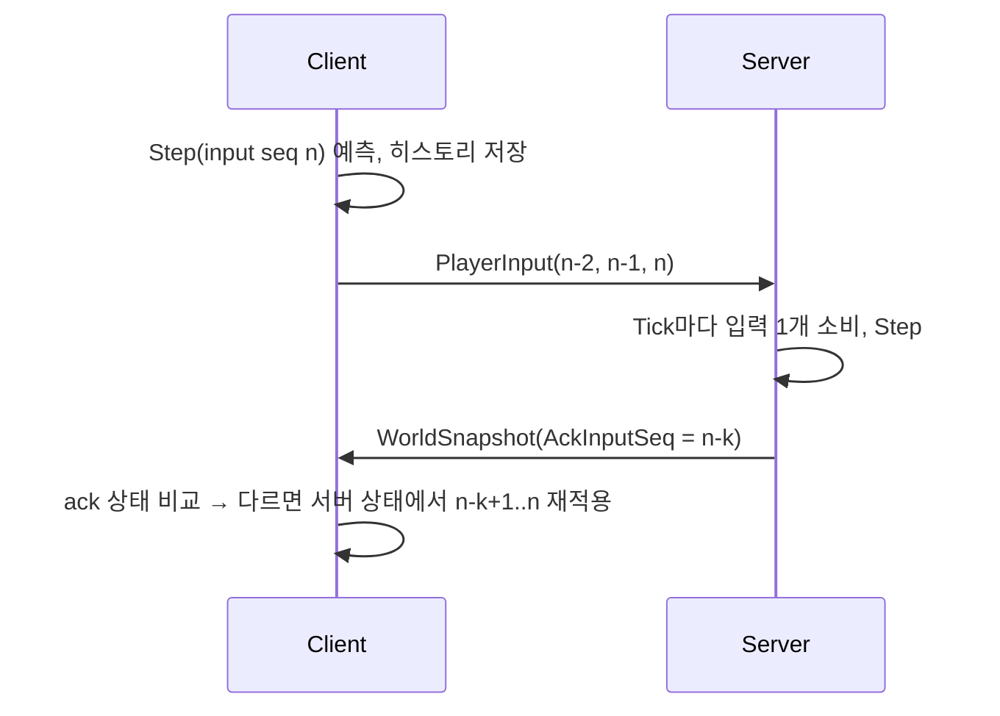

# Networking

Transport: LiteNetLib 2.1.4 (UDP). 프레이밍 `[PacketId: byte][payload]`, little-endian, 수기 직렬화(`PacketWriter`/`PacketReader`).
`ProtocolVersion`(현재 11. Phase 13: 건설 패킷 6종과 채집 패킷 3종(`PacketId` 26–34), 건설 전용 채널 1, 입력 버튼 `ToolHarvest`·`ToolBuild`, Snapshot의 도구(Self 무기 칸 바이트의 위 2비트, Entity `Flags` bit6–7), 아이템 종류 `Material`이 생겼다("건설과 채집 (Phase 13)", `Building.md`). Phase 12: 이동 모드를 Snapshot Entity의 `Flags`에 싣고, 수신자 블록(Self)이 6B에서 14B가 됐고, `Crouch` 버튼, 새 패킷 `TransportRoute`·`DoorStates`, `PlayerRespawned.Mode`, `PlayerDied.Cause`가 생겼다. 이동 규칙도 바뀌었다("투입과 문 (Phase 12)", `Movement.md`). Phase 11: 전적 패킷 `StatsRequest`/`StatsResponse`가 생겼고 `PlayerSpawned`에 이름(`Name`)이 들어갔다("전적 조회 (Phase 11 D8)"). Phase 10: 서버가 끊을 때 이유 코드(`DisconnectCode`)를 보내고 `JoinResult.Resumed`가 생겼다("끊기와 재접속 (Phase 10)"). 패킷 형식은 같다. Phase 8: Snapshot을 여러 패킷으로 나누고 엔티티를 양자화했다("Snapshot 분할과 양자화"). Phase 6: 지형과 새 맵 박스로 이동 결과가 바뀌었다. 패킷 형식은 같다. Phase 3에서 입력 명령·Snapshot 형식이 바뀌고 전투 패킷이 생겼고, Phase 4에서 Buttons가 2B가 되고 무기 카탈로그에 탄약 종류가, 아이템 패킷 6종이 생겼고, Phase 5에서 경기 패킷 3종(`MatchState`, `ZoneState`, `MatchResult`)과 `PlayerDied`의 Placement가 생겼다) 불일치 연결은 접속 단계(`OnConnectionRequest`)에서 `RejectReason.VersionMismatch`로 거절된다. 그 외 거절 사유: `ServerFull`(연결 수 ≥ MaxPlayers), `BadRequest`(연결 데이터 없음·파싱 실패·DevPlayerId가 이름 규칙에 어긋남. 아래 "Validation"). Client는 거절 사유를 끊김 화면이 한국어로 보여 준다(`UiText.Reject`).

## MTU

LiteNetLib의 기본 단일 패킷 한도는 1020B라 Snapshot 한도(1200B)보다 작다. 그래서 `ProtocolConstants.Mtu = 1232`를 서버·클라이언트 `NetManager`의 `MtuOverride`에 똑같이 쓴다(IPv6 최소 MTU 1280 − 헤더 48B, Sequenced 패킷에 1228B 사용 가능). 두 쪽이 같은 상수를 공유하므로 한쪽만 바꾸지 않는다.

## Packets

| Packet | 방향 | Delivery | 내용 |
|---|---|---|---|
| ConnectRequestData | C→S | 연결 요청 데이터 | ProtocolVersion u16, DevPlayerId 1–32B 올바른 UTF-8, 제어·서식 문자·줄 구분자 없음 (PacketId 없음) |
| JoinMatchRequest | C→S | ReliableOrdered | 없음 (Client는 연결 직후 자동 전송) |
| JoinMatchResponse | S→C | ReliableOrdered | Result(Ok / AlreadyJoined / MatchFull / Resumed(3)), MyEntityId, ServerTick, SimHz, SnapshotHz |
| PlayerSpawned | S→C | ReliableOrdered | EntityId, Position, Yaw, Name(DevPlayerId, 1바이트 길이 + UTF-8 1–32B. 빈 이름·33B 이상은 읽기 실패) |
| PlayerDespawned | S→C | ReliableOrdered | EntityId |
| PlayerInput | C→S | Unreliable | 최근 입력 1–3개(Seq, MoveX, MoveY, Yaw, Buttons u16, AimYaw, AimPitch, ViewTick = 명령 1개 30B), 오래된 것부터 |
| WorldSnapshot | S→C | Sequenced | ServerTick, AckInputSeq(수신자별), Count, Part, PartCount, 수신자 블록(Health, Shield, WeaponSlot = 현재 인벤토리 칸 0–2, Ammo = 그 칸의 탄창(빈 칸이면 0), ReloadRemainingTicks, 기력 u16(×100, 0–10000), 수평 속도 X·Z i16 ×2(1/256 m/s), `ModeTicks`, `EnergyDelayTicks` = 14B, 수신자별), [EntityId, Position, VelocityY, Yaw, Flags(bit0 생존, bit1–3 이동 모드, bit4 달리는 중, bit5 기진 = 달리기 불가 상태)] (엔티티 13B, 양자화) |
| WeaponCatalog | S→C | ReliableOrdered | Join 응답 직후 1회. 무기 1–8개: WeaponId, Name ≤ 16B, Damage, FireIntervalTicks, MagazineSize, ReloadTicks, Range, Automatic, AmmoType(1 Light, 2 Medium, 3 Heavy) |
| ItemCatalog | S→C | ReliableOrdered | WeaponCatalog 직후 1회. 등급 5개(Name, DamageMultiplier), 탄약 3종(Type, Name, Max), 소모품 2종(Type, Name, UseTicks, Heal, Shield, MaxStack). 최대 219B |
| WorldItems | S→C(새로 들어온 사람) | ReliableOrdered | ItemCatalog 직후. 월드 아이템 전체를 50개씩 나눠서: Count 1–50 + [ItemId u16, Kind, DefId, Rarity, Amount u16, Position] × Count(개체마다 19B). 패킷 최대 952B, 256개면 6개 패킷 |
| ItemSpawned | S→C(전원) | ReliableOrdered | 아이템 1개(패킷 20B).  새 아이템이거나 수량 변경(ItemId 기준 Upsert) |
| ItemRemoved | S→C(전원) | ReliableOrdered | ItemId |
| InventoryState | S→C(본인) | ReliableOrdered | Join 때와, 인벤토리가 바뀐 Tick 끝에 1회(발사는 제외). 칸 3 × (WeaponId(0 = 빈 칸), Rarity, MagAmmo), CurrentSlot, 탄약 3 × u16, Medkits, ShieldCells, Using(0 없음, 1 Medkit, 2 ShieldCell), UseRemainingTicks. 22B |
| PickupResult | S→C(누른 사람) | ReliableOrdered | Result(Ok / NothingInRange / Full), ItemId. 안내 표시용 |
| ShotFired | S→C(전원) | Unreliable | ShooterId, Start(눈), End(멈춘 곳) |
| HitConfirmed | S→C(쏜 사람) | ReliableOrdered | TargetId, Damage(무기의 명목 피해. 실제로 깎인 양이 아니다), Killed |
| DamageTaken | S→C(맞은 사람) | ReliableOrdered | AttackerId, Damage, FromDirection(맞은 쪽 → 쏜 쪽 단위 벡터) |
| PlayerDied | S→C(전원) | ReliableOrdered | VictimId, KillerId(0 = 처치자 없음), Placement(경기 중 사망이면 남은 생존자 수 + 1, 아니면 0), `Cause`(0 자기장·플레이어, 1 낙하. 1보다 크면 읽기 실패). 7B. 처치자가 있으면 `Cause`는 0이다. 경기 중 들어온 사람에게는 본인에게만 `VictimId = 자기, KillerId 0, Placement 0, Cause 0`으로 보낸다(관전 시작) |
| PlayerRespawned | S→C(전원) | ReliableOrdered | EntityId, Position, Yaw, `Mode`(시작 이동 모드: 경기 시작의 공중 투입이면 `Transport` 6, 아니면 `Ground` 0. 6보다 크면 읽기 실패). 20B. 경기 시작·판 재시작 때 모두의 Spawn 이동에도 쓴다 |
| TransportRoute | S→C | ReliableOrdered | 시작 X·Z, 끝 X·Z, 고도(float 5개), 시작 Tick, 길이 Tick(u32 2개) = 29B. 경기 시작 때(`PlayerRespawned`보다 먼저 보낸다. 같은 채널이라 그 순서로 도착한다)와 경기 중 Join·Resume 때. Client는 이 값으로 수송기 위치를 서버 Tick마다 계산한다(`DropRoute.PositionAt`). 좌표가 ±127 밖이거나 고도가 음수이거나 길이가 0 또는 76800 Tick(10분) 초과면 읽기 실패 |
| DoorStates | S→C | ReliableOrdered | 열린 문 비트 마스크(bit i = `GameMap.Doors[i]`, 문 5개) = 2B. 문이 바뀐 Tick의 끝(Tick당 최대 1개), 판 시작(모두 닫힘), Join·Resume 때. 없는 문의 비트가 켜져 있으면 읽기 실패 |
| MatchState | S→C(전원, 바뀐 Tick 끝)·Join | ReliableOrdered | State(0 Waiting, 1 Starting, 2 Playing, 3 FinalPhase, 4 Finished, 5 Closing), StateEndTick u32(0 = 타이머 없음), Alive, Participants, Round u16, MinPlayers. 11B. 경기 전에는 Alive·Participants가 접속자 수다 |
| ZoneState | S→C(전원, 단계가 바뀐 Tick 끝)·Join | ReliableOrdered | Phase(0 = Zone 없음), From(X, Z, Radius), To(X, Z, Radius), ShrinkStartTick, ShrinkEndTick, DamagePerSecond u16. 36B |
| MatchResult | S→C(접속 중인 참가자 본인) | ReliableOrdered | WinnerId(0 = 없음), Placement, Kills, Participants. 6B |
| StatsRequest | C→S | ReliableOrdered | 없음(PacketId만). Join을 요청한 연결만, 연결당 2초에 한 번. 본문이 있으면 잘못된 패킷 |
| BuildCatalog | S→C | ReliableOrdered(채널 0) | Phase 13. Join 때 ItemCatalog 뒤 1회. 49B. 내용은 `Building.md` "네트워크" |
| ResourcesState · HarvestHit · HarvestStates | S→C | ReliableOrdered(채널 0) | Phase 13. 자원 7B(본인, 바뀐 Tick 끝·Join·Resume), 채집 타격 18B(휘두른 사람), 부서진 채집 대상 마스크 9B(바뀐 Tick 끝·Join·Resume) |
| BuildRequest | C→S | ReliableOrdered(채널 1) | Phase 13. 9B. Join한 연결만, 연결당 초당 20개 |
| BuildResult · BuildEvents · BuildSync · BuildInterest | S→C | ReliableOrdered(채널 1) | Phase 13. 8B, 헤더 8B + 기록(Placed 14B, Health 6B, Destroyed 4B), 헤더 7B + 조각 16B × 최대 74(1191B), 9B. `Building.md` "네트워크" |
| StatsResponse | S→C(요청한 사람) | ReliableOrdered | Status(0 Ok, 1 NoRecord, 2 Unavailable, 3 Busy), 요약(Matches, Wins, Kills, Deaths, Damage, SurvivalSeconds, 각 u32, 서버가 자른다), Count 0–10, 행(EndedUnixSeconds u32, Round u32, Players, Placement(0 = 순위 없음), Kills u16, Damage u32, SurvivalMs u32 = 20B) × Count, 최신순. Ok가 아니면 요약 0, 행 없음. 최대 227B |

- Snapshot 헤더 13B(`Part`, `PartCount` 포함) + 수신자 블록 14B = 27B(Phase 12. 그 전에는 블록 6B로 19B), 엔티티 13B(Phase 12에서도 그대로. 이동 모드는 빈 `Flags` 비트에 넣었다). LiteNetLib은 Sequenced 패킷을 분할하지 않으므로 패킷 하나가 `MaxPacketSize` 1200B 이내여야 한다 → 패킷당 최대 90명 = 27 + 13 × 90 = 1197B(`PacketTests`가 고정, 3B 여유), 50명 = 27 + 13 × 50 = 677B(Phase 7의 1167B에서 -42.0 %. Phase 8~11은 669B). 수신자 블록을 읽을 때 기력이 가득(10000)보다 크면 헤더 읽기가 실패한다(범위 밖 블록 거절). 한 경기 최대 100명(`MaxSnapshotEntities`), Snapshot은 최대 2패킷(`MaxSnapshotParts`), `MaxPlayers ≤ 100`(기본 16, 시작 시 검증). 서버는 payload를 한 번 쓰고 수신자마다 AckInputSeq와 수신자 블록만 덮어쓴다(`WorldSnapshotHeader.PatchRecipient`).
- **Snapshot 분할과 양자화(Protocol v7, Phase 8):**
  - 분할: 플레이어 목록을 90명씩 나눠 Part마다 패킷 하나를 보낸다(91–100명이면 90 + 나머지, 2패킷). 패킷마다 같은 Tick·Ack·수신자 블록을 가진 완전한 헤더에 `Part`, `PartCount`가 있다. 읽을 때 `Count ≤ 90`, `1 ≤ PartCount ≤ 2`, `Part < PartCount`를 검증한다(어기면 읽기 실패).
  - 양자화: 위치 x·y·z와 VelocityY는 부호 있는 16비트 1/256 단위(±128 m, ±128 m/s, 맵은 ±80 m), Yaw는 16비트로 360°를 나눈다. 최대 오차는 축마다 반 단위(약 0.002 m)다. 범위 밖 값은 잘라 넣고 NaN·무한대는 0이다. 구조체 필드는 float 그대로이고 Write/Read에서만 바뀐다(`SnapshotEntity.Quantize`). 내 엔티티도 같은 값을 받고, 오차가 재조정 허용 오차(0.01 m)보다 작아 보정이 일어나지 않는다(Client EditMode 테스트로 고정). 박스 윗면과 지형 꼭짓점은 1/256의 배수라 그대로 전달된다. 실제 예측 불일치로 재조정할 때는 Client가 양자화된 서버 상태에서 다시 시작하므로, 다음 보정까지 재적용한 예측에 축마다 최대 약 0.002 m의 오차가 실릴 수 있다(허용 오차 0.01 m 이내).
  - 수신 쪽 규칙: 패킷마다 독립적으로 적용한다(재조립·대기 버퍼 없음). 한 패킷을 잃으면 그 안의 플레이어가 그 Tick의 표본 하나를 못 받을 뿐이고 보간이 흡수한다. 원격 플레이어 제거는 Snapshot에 없다는 이유가 아니라 `PlayerDespawned` 이벤트로 한다. 봇·테스트 Client는 같은 Tick의 패킷을 더하고 새 Tick이 오면 처음부터 다시 모은다.
- Buttons(u16)는 알려진 비트(Jump, Sprint, Fire, Reload, Slot1, Slot2, Slot3, Interact, Drop, UseMedkit, UseShieldCell, Crouch = 0x0FFF)만 남기고 나머지는 버린다. 입력 패킷은 최대 2 + 3 × 30 = 92B다.

  | 비트 | 값 | 버튼 | 비고 |
  |---|---|---|---|
  | 0–10 | 1–1024 | Jump, Sprint, Fire, Reload, Slot1–3, Interact, Drop, UseMedkit, UseShieldCell | Phase 4까지 |
  | 11 | 2048 | `Crouch` | Phase 12. 누르고 있는 상태(토글은 Client가 만든다). 뛰어내리기·글라이더·Vault는 Jump, 문은 Interact를 다시 쓴다 |
  | 12 | 4096 | `ToolHarvest` | Phase 13. F(누름). 알려진 비트는 0x3FFF가 된다 |
  | 13 | 8192 | `ToolBuild` | Phase 13. Q(누름). 건축 모드에서는 Fire가 배치 대신 아무것도 쏘지 않고, 배치는 `BuildRequest`로 간다 |
- 이 표의 패킷 크기(`ItemCatalog` 219B, `WorldItems` 952B, `ItemSpawned` 20B, `InventoryState` 22B, 입력 패킷 92B, `MatchState` 11B, `ZoneState` 36B, `MatchResult` 6B, `StatsResponse` 227B 등)는 모두 PacketId 1B를 포함한 전체 바이트 수다. 새 패킷은 모두 1200B 이하다(`ItemPacketTests`, `MatchPacketTests`가 고정). Snapshot 크기는 위 Snapshot 항목을 본다(Phase 7까지는 50명 1167B, v7은 669B, v10은 677B). Phase 12의 `TransportRoute` 29B, `DoorStates` 2B, `PlayerRespawned` 20B, `PlayerDied` 7B도 `TraversalPacketTests`·`MatchPacketTests`가 고정한다. Zone 원은 Snapshot에 싣지 않는다(시작·끝 값과 Tick으로 양쪽이 같은 식으로 보간한다).
- Client가 "누구를 맞혔다"고 보내는 필드는 없다. 명중은 서버가 조준 방향으로 판정한다.
- Join 결과: Resumed는 끊겼던 참가자가 같은 Entity로 돌아온 것이다("끊기와 재접속"). 늦은 합류와 같은 전체 상태가 이어진다. MatchFull이면 응답만 보내고, 그 연결은 Join한 것으로 치지 않는다. 1초 뒤(응답이 먼저 나가도록) 코드 없이(`None`) 끊는다. Client는 Join 실패를 받으면 자동 재접속을 멈춘다(Phase 10). 이미 참가한 peer의 중복 Join은 서버 Match에 도달하지 않는다(아래 Validation).

## 접속 순서

1. Client `Connect` → 연결 요청 데이터 전송.
2. Server `OnConnectionRequest`에서 검사 후 Accept, `PeerState`를 `peer.Tag`에 설정하고 그 다음에 `Connected` 제어 메시지를 Control 채널에 쓴다. LiteNetLib이 `Accept()` 안에서 `OnPeerConnected`를 동기 호출하는데 그 시점엔 Tag가 아직 없으므로, `OnPeerConnected`에서는 아무것도 하지 않는다.
3. Client `OnPeerConnected`에서 `JoinMatchRequest` 전송.
4. Server가 `JoinMatchResponse` → `WeaponCatalog` → `ItemCatalog` → `WorldItems`(분할, 아이템이 없으면 보내지 않는다. 운영 서버는 경기 전에 월드가 비어 있다) → `InventoryState` → 새 플레이어에게 전원의 `PlayerSpawned`, 기존 플레이어에게 새 플레이어의 `PlayerSpawned` → (`DevRespawn`이 꺼져 있으면) `MatchState` → `ZoneState` → (Phase 12) `DoorStates` → (공중 투입 경기 중이면) `TransportRoute` → (경기 중이면) 본인의 `PlayerDied`(관전).
5. Resume(Phase 10): 경기 중 끊긴 참가자가 유예 안에 같은 DevPlayerId로 Join하면 `JoinMatchResponse(Resumed, 같은 Entity)` → `WeaponCatalog` → `ItemCatalog` → `WorldItems` → `InventoryState` → 전원의 `PlayerSpawned`(자기 포함, 지금 위치) → `MatchState` → `ZoneState` → (Phase 12: 공중 투입 경기면) `TransportRoute` → `DoorStates` → (유예 중에 경기가 끝났으면, 즉 `Finished`이면) 본인의 `MatchResult`. 경기 끝에 보낸 결과는 연결이 없어 사라졌으므로 다시 보낸다. 다른 플레이어에게는 아무것도 보내지 않는다(떠난 적이 없다).

## 끊기와 재접속 (Phase 10)

설계 근거: `Docs/specs/2026-10-01-phase10-hardening-design.md`.

**끊는 코드(`DisconnectCode`, D1):** 서버가 끊을 때 LiteNetLib 끊기 데이터 1바이트로 보낸다. 끊김과 한 메시지라 순서 문제가 없다. 데이터가 없거나 모르는 값은 `None`이다(`DisconnectCodes.Read`). Client는 `RemoteConnectionClose`의 추가 데이터에서 읽는다.

| 값 | 코드 | 뜻 | Client 자동 재접속 |
|---|---|---|---|
| 0 | `None` | 코드 없음(서버가 이유를 보내지 않았거나 모르는 값) | 안 한다 |
| 1 | `ServerShutdown` | 서버 종료 | 안 한다 |
| 2 | `Kicked` | 잘못된 패킷이 `BadPacketDisconnectThreshold`(20)개 | 안 한다 |
| 3 | `JoinTimeout` | 연결하고 Join하지 않음 | 안 한다 |
| 4 | `InputTimeout` | Join하고 입력을 보내지 않음 | 안 한다 |
| 5 | `ServerError` | Tick이 계속 실패해 경기를 초기화함. 또는 서버 Control 채널이 가득 차 연결·Join을 받지 못함 | 한다 |

**재접속 표(Shared `DisconnectCodes.ShouldReconnect(remoteClose, code, networkLoss)`, Client와 봇이 같이 쓴다):**

- 원격 종료(`RemoteConnectionClose`)는 `ServerError`만 다시 한다.
- `Timeout`·`ConnectionFailed`·`HostUnreachable`·`NetworkUnreachable`은 다시 한다.
- 직접 끊기·연결 거절·코드 없는 원격 종료는 다시 하지 않는다.
- 처음 연결이 실패한 것은 사이클을 시작하지 않는다(호출한 쪽이 정한다. Client 동작은 `Client.md`).
- 한 끊김에 최대 `DisconnectCodes.MaxReconnectAttempts` = 3번이다.
- 시도 시각(Client와 봇이 같다): n번째 시도는 끊김을 안 때부터 `DisconnectCodes.ReconnectOffsetSeconds(n)` = 1·3·7초 뒤에 시작한다(간격 1·2·4초, 앞 시도가 실패한 때가 아니라 끊긴 때부터 잰다).
- 자동 시도의 연결 예산: LiteNetLib `ReconnectDelay` 250 ms × `MaxConnectAttempts` 5(`DisconnectCodes.ReconnectRequestIntervalMs`·`ReconnectRequestAttempts`). 한 시도는 (5 + 1) × 250 ms = 약 1.5초 안에 포기한다(측정 1.53초). 기본값(500 ms × 10)이면 약 5.5초 걸려 둘째 시도가 8초쯤, 셋째가 17초쯤으로 밀려 유예(10초)를 넘긴다. 직접 Connect는 기본값을 쓴다.
- 다음 시각이 왔는데 앞 시도가 아직 연결 중이면 그 시도를 버리고 다음 시도를 시작한다. 셋째 시도는 약 8.5초에 끝나 기본 유예 10초 안이다.

**재접속 유예(D2):**

- 대상: 경기 중(`Playing`·`FinalPhase`) 살아 있는 참가자이고, 서버가 끊지 않은 연결(Client 종료·비정상 종료·네트워크 끊김)이다. 기본 `ReconnectGraceSeconds` 10초(0이면 끈다).
- 유예 중: 캐릭터는 그 자리에 남는다. 입력이 없다(0.5초 뒤 정지, 위 "Movement"). 맞으면 죽고 Zone 피해도 받는다. 다른 플레이어에게 `PlayerDespawned`를 보내지 않는다.
- 같은 DevPlayerId로 Join하면 새 연결에 그 캐릭터(위치, 체력, 인벤토리, 순위 상태)를 다시 묶고 위 접속 순서 5번을 보낸다. 새 Client는 Seq를 1부터 센다. 같은 id로 **연결된** 플레이어가 있으면 빼앗지 않고 새 플레이어로 합류한다. 같은 id의 유예 캐릭터가 여럿이면 먼저 끊긴 것이다.
- 나가는 경우: 유예 중에 죽으면 다음 Tick에 나간다(다시 오면 보통의 늦은 합류, 관전자다). 시간이 다 되어도 나간다. 시간이 다 된 경우는 탈락, 사망 Drop, 이탈자 기록으로 보통의 이탈과 같다. 판 재시작(`Closing`)에서 유예 목록을 비운다. 세 경우 모두 유예 만료로 센다(Health `graceExpiries`, Information 로그에 DevPlayerId).
- 유예 중에 경기가 끝나면(`Finished`) 결과 화면 동안은 아직 돌아올 수 있고, 돌아오면 자기 `MatchResult`를 다시 받는다(접속 순서 5번).
- 서버가 끊은 연결(`Kicked`·`InputTimeout` 등 모든 코드)과 경기 밖·사망·관전 상태의 끊김은 유예 없이 바로 나간다.
- 위험: 인증이 없어 남의 DevPlayerId로 유예 캐릭터를 가져갈 수 있다(spec D2). 개발 단계에서는 받아들이고 인증 단계에서 세션 토큰으로 바꾼다. Client가 비정상 종료한 뒤 서버가 옛 연결의 끊김을 알기 전(최대 `DisconnectTimeoutMs` 5초)에 다시 Join하면 연결된 같은 id로 보여 새 플레이어(관전자)가 된다.

**Timeout(D3, D4):**

- Join Timeout: 연결한 뒤 `JoinTimeoutSeconds`(5초) 안에 Join하지 않으면 `JoinTimeout`으로 끊는다.
- Input Timeout: Join한 peer가 `InputTimeoutSeconds`(10초, 0이면 끔) 동안 `PlayerInput`을 하나도 보내지 않으면 `InputTimeout`으로 끊는다. Join이 입력 하나로 센다. 죽음·관전·대기 중에도 적용한다. Client와 봇은 Join한 동안 늘 입력을 보낸다.
- 둘 다 Game Loop의 Tick 수(`SimHz`)로 잰다. 경기를 초기화해도 이어진다.
- `InputTimeoutSeconds` × 1000은 `DisconnectTimeoutMs` + 2000 이상이어야 한다(시작할 때 검사). 네트워크가 끊기면 입력도 끊긴다. Input Timeout이 LiteNetLib Timeout보다 먼저 오면 서버가 끊은 것(`InputTimeout`)이 되어 유예를 잃기 때문이다.
- 디버거로 Client를 10초 넘게 멈추면 `InputTimeout`으로 끊긴다(재접속하지 않는다). LiteNetLib 스레드는 Pong을 보내 연결은 살아 있어도 입력은 오지 않기 때문이다.

**서버 종료·경기 초기화:** 종료하면 모든 peer를 `ServerShutdown`으로 끊는다. 종료가 시작되면(`Stop`, 또는 경기 초기화가 거듭 실패해 서버를 멈출 때) 새 연결 요청은 `ServerFull`로 거절한다(프로토콜 변경 없음, Client는 거절에 재접속하지 않는다). Tick이 계속 실패하면 경기를 초기화하면서 `ServerError`로 끊는다(`Server.md` "예외 복구").

## Tick

- 서버 Simulation 30Hz(`SimHz`), Snapshot 15Hz(`SnapshotEveryTicks = 2`, `SnapshotHz = SimHz / SnapshotEveryTicks`). `appsettings.json`에서 변경. 값은 `JoinMatchResponse`로 Client에 전달된다.
- Client 렌더는 가변 FPS. 시뮬레이션은 서버 Tick과 같은 고정 스텝(`1/SimHz`)이다.
- 연결 유지: 서버 `DisconnectTimeout = DisconnectTimeoutMs`(기본 5000), `PingInterval = min(1000, DisconnectTimeoutMs / 4)`. 타임아웃은 클라이언트가 보낸 패킷으로만 갱신되므로, 짧은 타임아웃에서도 대기 중인 클라이언트가 pong으로 살아있도록 Ping을 타임아웃당 4번 이상 보낸다. Client는 `DisconnectTimeout = 5000`, 기본 PingInterval(1000).

## Movement

- 내 캐릭터: Client Prediction + Reconciliation (`LocalPlayerPredictor`).
  - 프레임당 누적 시간으로 고정 스텝을 0~N회 실행(누적은 0.25초로 제한, 히치 후 폭주 방지). 스텝마다 Seq를 1 올리고 입력·결과를 64칸 링 히스토리에 저장한다.
  - 패킷은 프레임당 1개, 최신 입력 최대 3개(`MaxInputsPerPacket`)만 담는다. 스텝이 여러 번 돈 프레임에서는 그보다 앞선 입력이 전송되지 않을 수 있다.
  - 점프는 프레임의 마지막 예측 스텝에서 소비한다(항상 최신 3개 패킷에 들어가도록).
  - Phase 12: 예측하고 보정하는 상태는 `MoveState` 전체다(모드, 수평 속도, 기력, Tick 값, 기진). 이동 모드별 규칙과 수치는 `Movement.md`다. 서버 상태는 Entity(위치, VelocityY, 모드, 달리기·기진 플래그)와 수신자 블록(수평 속도, 기력, `ModeTicks`, `EnergyDelayTicks`)에서 합쳐 만든다.
  - Snapshot 수신 시 ack 시점의 예측과 서버 상태를 비교한다. 위치·VelocityY·수평 속도는 0.01(양자화 오차보다 크다), 모드·기력·`EnergyDelayTicks`·`ModeTicks`·기진은 정확히 같아야 한다. 다르면 서버 상태에서 ack 이후 입력을 재적용한다. 화면 위치는 오차를 렌더 오프셋으로 유지하며 감쇠(`exp(-10·dt)`)시키고, 보정량이 2m를 초과하면 오프셋 없이 즉시 스냅한다. ack가 0이면 아직 서버가 입력을 처리하지 않았다는 뜻이므로, 보낸 입력이 없을 때만 서버 상태로 교체하고 이미 예측 중이면 무시한다(Phase 12: 단, 서버의 모드가 예측과 다르면 서버 상태로 맞춘다. 공중에서의 재접속 D16). ack가 보낸 입력보다 크거나 히스토리(64)를 벗어나면 서버 상태로 바로 교체한다.
  - 서버가 보낸 값이 NaN/Infinity이면 그 엔티티는 무시한다(예측 상태 오염 방지).
- 다른 플레이어: Snapshot 보간, 2 Snapshot 간격(`2 / SnapshotHz` ≈ 133ms) 과거를 렌더 (`RemotePlayerInterpolator`, `ServerClock`). 플레이어당 8개 샘플 링버퍼, 최신 샘플 이후는 외삽 없이 마지막 위치 유지. Phase 12: 샘플마다 이동 모드·달리기·기력 소진도 저장하고, 렌더 Tick 이하의 가장 새 샘플 것을 자세·조준 Collider 높이에 쓴다(서버 `PositionHistory.Sample`과 같은 규칙, 최종 검토 A1). 비유한(non-finite) 샘플은 버린다. `ServerClock`은 렌더 Tick이 뒤로 가지 않게 한다.
- 입력이 제때 오지 않으면 서버는 직전 입력을 반복(점프 제외)하고 ack는 올리지 않는다 → 패킷 손실 시 작은 보정이 생길 수 있다. 입력 없는 Tick이 `SimHz / 2`(0.5초)를 넘으면 이동 입력 0(직전 Yaw 유지, 버튼 없음)으로 멈춘다. 멈춘 클라이언트가 Disconnect 전까지 계속 걷지 않게 하기 위해서다. 새 입력이 오면 다시 반복 허용 구간이 시작된다.

## 이동 충돌 (Phase 1)

서버(`Match.Tick`)와 예측(`LocalPlayerPredictor`)은 같은 `MovementSimulation.Step(ref state, input, dt, 세계, GameMap.Terrain)`를 호출한다. 세계는 `GameMap.Boxes` 뒤에 닫힌 문을 붙인 배열이다(Phase 12. 서버 `DoorSet.World`, Client `PredictedDoors.World`. `Map.md` "문"). 탑승 중에는 `Step` 대신 `DropTransport.Ride`다(`Movement.md` "수송기"). 지형은 Shared 상수 `GameMap`: 높이 격자(`HeightField`) + 축 정렬 박스이고, 캐릭터는 AABB(반폭 0.35 m, 높이 1.8 m)다.

Step 순서:
1. 입력 검증(비유한 값 0, 이동 길이 ≤ 1), Yaw·수평 속도 계산.
2. 박스와 `Skin`(0.001 m)보다 깊게 겹치면 가장 적게 겹친 축으로 밀어낸다(동률은 -X, +X, -Z, +Z, +Y, -Y 순. 아래로는 바닥 위일 때만). 박스를 하나씩 한 번만 밀어낸다.
3. 접지 판정은 상태 없이 매 Step: `VelocityY ≤ 0`이고 발밑 ±0.02 m(`GroundProbe`) 안에 바닥이나 박스 윗면이 있으면 Y를 그 면에 정확히 맞춘다. 접지면 `VelocityY = Jump ? 7 : 0`, 아니면 중력.
4. X → Z → Y 축 분리 Sweep. 각 축에서 나머지 두 축이 겹치는 박스 중 진행 방향 가장 가까운 면까지(Skin만큼 띄움) 이동한다(바닥 y=0은 Skin 없이 정확히 0). 거리에 상관없이 모든 앞쪽 박스를 보므로 빠른 낙하도 판을 뚫지 않는다. Y가 막히면 `VelocityY = 0`.

위 순서는 지상 이동(`Ground`·`Crouch`·`Slide`)의 것이다. Phase 12에서 `Step`은 `MoveState.Mode`로 지상, `Vault`, 공중(`Freefall`·`Glide`)으로 갈라지고, 수평 속도·기력도 상태로 이어진다(`Movement.md`). 접지 여부는 여전히 상태에 저장하지 않고 매 Step 다시 계산한다. 박스 위에 서 있으면 Y가 윗면 값으로 고정되어 예측과 서버가 같은 값을 내고, 재조정 떨림이 없다. 서버 보정으로 예측이 박스 안에 들어가도 재적용 첫 Step이 밀어낸다. 점프 최고점은 30 Hz 이산 적분으로 약 1.34 m(연속식은 1.225 m)라 1 m 박스는 점프로 오르고 1.5 m 박스는 점프로 못 오른다(Phase 12부터 1.5·2 m 박스는 Mantle로 오르고 1 m 박스는 달리며 Hurdle로 넘는다. `Movement.md`). 접지 판정이 부동소수 오차(약 1e-7 m)를 접지로 보므로 점프가 Phase 0보다 한 Tick 일찍 나갈 수 있다. 서버와 Client가 같은 판정을 쓰므로 서로 어긋나지 않는다.

지형(Phase 6 D4): 모든 경사가 0.6 이하라 지형은 수평 이동을 막지 않는다. 바닥 판정·Y Sweep·밀어내기의 바닥은 발밑 지형 높이다. 수평 이동 뒤 발이 지형보다 낮으면 올리고, 이번 Step을 땅에서 시작했고 점프하지 않았으면 `이동 거리 × MaxSlope + GroundProbe` 이내의 내리막에 Y Sweep으로 붙인다(박스 윗면에서 멈춘다).

`GameMap` 규칙(`GameMapTests`가 검사, 자세한 내용은 `Map.md`): 박스 128개 이하, 중앙 광장 12 m 비움, 두 박스 사이 틈은 0.25 m 이하이거나 캐릭터 폭 이상, **어떤 두 박스도 옆으로 맞닿거나 겹치지 않는다(위로 쌓는 것은 허용)**, 박스 아래는 평지. 박스를 하나씩 밀어내므로 면을 공유하는 두 박스 사이에서는 캐릭터가 갇힐 수 있기 때문이다. 외곽 벽 모서리는 0.25 m 틈으로 두는데, 캐릭터(0.7 m)보다 좁아 맵은 막힌 채로 유지된다(`Character_CannotPassThroughAnyCornerSlit`).

## 전투 (Phase 3)

발사는 입력 명령에 실린다(Phase 3 D1): Fire 비트 + 조준(AimYaw, AimPitch) + ViewTick. 따라서 입력의 중복 전송·Seq 중복 제거·Tick당 1개 규칙을 그대로 따르고, 입력보다 빨리 쏠 수 없다.

- **조준(Phase 3 D2):** Client는 카메라 광선이 맞은 점(원격 플레이어는 서버 판정 상자 크기의 `BoxCollider`가 있어 조준점이 몸 위에 온다)과 캐릭터 눈(발 + 1.6 m. Phase 12: 웅크리기·슬라이드는 발 + 1.0 m, 서버 `CombatRules.EyeHeightOf`와 Client `AimSolver`가 같다)을 이어 Yaw/Pitch를 구한다. 눈의 발 위치는 렌더 위치가 아니라 입력마다 그 입력의 Step을 마친 예측 위치다(`LocalPlayerPredictor.SetAim`). 서버가 그 입력을 처리한 뒤의 위치이기 때문이다. 한 프레임에 Step이 여럿이면 앞선 입력은 각자 자기 위치에서 조준한다. 규약은 카메라와 같다(Yaw 0 = +Z, Yaw 90 = +X, 양의 Pitch = 아래). 서버는 같은 눈에서 같은 방향으로 쏘므로 어깨 카메라 시차가 있어도 조준점이 가리키는 곳을 맞힌다.
- **무기(Phase 3 D4, D5):** 수치는 서버 `weapons.json`에만 있다(Vesper AR: 20 / 3 Tick / 30발 / 60 Tick / 150 m / 자동 / Medium 탄, Kestrel LR: 90 / 38 Tick / 5발 / 75 Tick / 300 m / 단발 / Heavy 탄. 1.25 s × 30 Hz = 37.5는 38로 반올림. Phase 4에서 Wisp SMG가 추가됐다: "인벤토리와 Loot"). 시작 시 검증하고 틀리면 서버가 뜨지 않는다. Join 직후 `WeaponCatalog`로 Client에 간다. Slot1/2/3 = 무기 목록이 아니라 인벤토리 칸 0/1/2다(칸에 든 무기는 줍기로 정해진다).
- **서버 Tick 순서:** (Phase 5: 경기 흐름 전환 → Zone 진행·피해가 맨 앞에 온다. "Battle Royale (Phase 5)") → (`DevRespawn`만) 부활 시각이 된 플레이어 부활 → (`DevRespawn`만) Loot 재생성 → 플레이어마다 입력 1개(죽어 있으면 Seq만 확인 응답, 이동·발사 없음, 중력도 없음) → 이동(Phase 12: 탑승 중이면 `Ride`, 아니면 `Step`과 그 결과 처리: 문 밀치기, 이동 이상 검사, 낙하 피해) → 재장전 완료 확인 → **실제로 받은 입력일 때만** 사용 취소 → 칸 선택 → 버리기 → 줍기 → 재장전 → 발사 → 사용 시작 → (매 Tick) 사용 완료 → (Phase 5: 종료 판정) → `ServerTick++` → 바뀐 인벤토리 전송 → (Phase 5: 바뀐 `MatchState`·`ZoneState`) → (Phase 12: 바뀐 `DoorStates`) → 모든 플레이어 위치와 이동 모드를 History에 기록 → Snapshot. (실제로 받은 입력의) 사용 취소·칸 선택·버리기·줍기·재장전·발사·사용 시작은 이동을 마친 뒤의 모드가 지상·웅크리기·슬라이드일 때만 한다(Phase 12 D12). 막힌 동안에도 Fire를 누른 상태(`FireHeld`)는 입력을 따른다. 누른 채 착지한 반자동 무기는 새로 눌러야 쏜다(최종 검토 C9, Client `WeaponState`도 같다). 누락 입력 반복(Phase 0 유예)은 이동만 반복하고 줍기·버리기·사용·교체·재장전·발사는 하지 않는다. 줍기·버리기·사용은 "인벤토리와 Loot"에 있다.
- **무기 규칙(Phase 3 D14, 서버 Tick 기준):** 교체는 Slot 비트가 하나만 켜졌을 때(둘 이상이면 무시), 교체하면 재장전 취소. 재장전은 탄창이 가득이 아니고 그 무기 탄약 종류의 보유량이 1 이상일 때만 시작하고, 끝나면 보유량에서 탄창으로 옮긴다(보유량 0이면 시작하지 않는다). 발사는 칸이 비어 있지 않고, 탄 > 0, 재장전 중 아님, `now ≥ 그 칸의 NextFireTick`, 조준 각이 유한할 때만. 단발은 Fire를 새로 누른 입력에서만. 마지막 탄을 쏘거나 빈 탄창으로 쏘려 하면 자동 재장전(보유량이 있을 때). 탄창과 발사 간격은 칸별이다. Snapshot의 `ReloadRemainingTicks`는 재장전 중이면 마지막 Tick에도 1 이상이다(0은 "재장전 아님").
- **판정(Phase 3 D7):** 눈에서 조준 방향으로 사거리까지, 맵 박스와 닫힌 문(Phase 12. 열린 문은 없는 것과 같다), 지형 삼각형(광선이 지나는 칸만 검사, `HitScan.TraceTerrain`), y=0 평면(격자 밖으로 나간 광선용. 박스는 slab 교차), 그리고 쏜 사람을 뺀 살아 있는 플레이어의 이동 AABB(반폭 0.35 m, 높이 1.8 m. Phase 12: 그 사람의 모드로 정한다. 웅크리기·슬라이드는 1.2 m, `Transport` 탑승자는 맞지 않는다) 중 가장 가까운 것에 맞는다. 머리 판정·탄 퍼짐·반동은 없다(`spread`·`recoil`은 데이터 필드만 있고 쓰지 않는다).
- **Lag Compensation(Phase 3 D6):** 플레이어마다 32칸 위치 링(`PositionHistory`)에 매 Tick 끝 위치와 이동 모드(Phase 12. 되감은 시점의 모드로 맞는 높이를 정한다)를 기록한다. 문은 되감지 않는다. 사격은 지금의 문 상태로 추적한다(고정 박스와 같다). 발사 판정은 다른 플레이어를 ViewTick 위치로 되감는다(두 기록 사이 보간). ViewTick은 `[최신 Tick − 12, 최신 Tick]`(0.4 s, 30 Hz 기준. SimHz가 높으면 링 `Capacity − 1` = 31 Tick으로 한 번 더 잘린다)으로 잘리고, NaN이면 최신 Tick이다. 기록이 모자라면 가장 오래된 기록을 쓴다. Join·부활 때 History를 새로 시작하므로 되감기가 시체 위치에 닿지 않는다. 쏜 사람 자신은 되감지 않는다. 원격 플레이어는 약 133 ms(4 Tick) 과거로 보이고 입력 버퍼가 1 Tick을 더 쓰므로, 왕복 지연에 남는 여유는 약 7 Tick(약 233 ms)이다. 왕복 지연이 약 200 ms를 넘으면 빠르게 움직이는 상대를 빗나갈 수 있고, 벽 뒤로 숨은 뒤 최대 약 400 ms 동안 맞을 수 있다(D6의 비용).
- **피해·사망·부활(Phase 3 D8, D9):** Health 최대 100, Shield 최대 100(Phase 4부터 시작 Shield는 0이고 채우려면 Shield Cell을 쓴다). 피해는 Shield부터, 남은 만큼 Health, 0 아래로 내려가지 않는다. Health가 0이 되면 사망: `PlayerDied`(전원), 판정 대상에서 빠지고 입력은 무시되며, 진행 중이던 재장전과 회복은 취소되고 가진 것은 떨어진다("인벤토리와 Loot"). 부활은 `DevRespawn` 서버(Phase 3·4 테스트 아레나)에서만 한다: `SimHz × 3` Tick 뒤 `Match.SpawnPosition(id)`에서 Health 100·Shield 0·빈손(빈 인벤토리, 칸 0)으로 부활하고 `PlayerRespawned`(전원). 운영(`DevRespawn = false`)에서는 경기 중 사망이 영구적이다(Phase 5 D4. `BattleRoyale.md`). 부활 때 누락 입력 반복(LastInput·MissedTicks)도 새로 시작해 이전 삶의 이동을 되풀이하지 않는다. `DamageTaken` → `PlayerDied` → `PlayerRespawned`는 같은 ReliableOrdered 채널이라 이 순서로 도착한다.
- **Client 예측 범위(Phase 3 D12):** 내 발사 연출은 `WeaponState`(서버 규칙의 표시용 사본, 예측 입력마다 1 Step)가 "서버가 쏠 것"이라고 할 때 바로 그린다. 서버 `ShotFired` 중 내 것은 무시한다. `WeaponState`는 입력마다의 결과(Phase 4부터 탄약 보유량 포함)를 64칸 링에 저장하고, Snapshot 수신자 블록이 오면 ack 시점의 기록과 비교한다. 다르면 그 시점을 서버 값으로 맞추고 ack 이후의 입력(아직 서버가 처리하지 않은 것)을 다시 적용한다(이동 재조정과 같은 방식). 기록보다 오래된 ack면 재적용 없이 서버 값에서 다시 시작한다. 명중·피해·사망은 서버 이벤트만 표시한다.
- **사망 중 예측:** `PlayerDied`(내 것)를 받으면 예측기는 이동하지 않고, Seq는 계속 올리되 이동 0·버튼 없음 입력을 보낸다(부활 직후 서버가 이 입력 일부를 살아 있는 상태로 처리하기 때문). 사망 중 Snapshot은 서버 위치로 바로 맞춘다. `PlayerRespawned`를 받으면 예측기를 새로 만들지 않고 같은 예측기의 상태만 Spawn 위치로 되돌린다. **Seq는 유지한다**(1부터 다시 세면 서버가 이미 소비한 Seq 이하를 버려 모든 입력이 무시된다). 생존 비트가 예측기 상태와 다른 Snapshot(다른 생의 것)은 재조정에 쓰지 않는다.
- **원격 플레이어:** 생존 여부는 Snapshot의 생존 비트로 정한다(죽어 있는 동안 들어온 Client는 `PlayerDied`를 받지 않았다). 살아 있는 동안 뷰는 회전하지 않는다(서버 AABB와 같은 축 정렬 `BoxCollider` 0.7 × 1.8 × 0.7을 유지하기 위해서이고, 캡슐은 Y축 둘레로 둥글어 보이는 모습은 같다). 이 Collider는 `Ignore Raycast` 레이어(2)에 있어 조준 광선만 본다. 죽으면 회색으로 눕고(진행 방향으로) Collider가 꺼진다. 다시 살아나면 보간 기록을 비워 시체 자리에서 미끄러지지 않고 Spawn 위치에 바로 나타난다. 경기 시작·판 재시작은 살아 있는 채로 Spawn에 옮기는 것이라 생존 비트가 바뀌지 않으므로, 다른 플레이어의 `PlayerRespawned`도 그 플레이어의 보간 기록을 정리한다(`RemotePlayerInterpolator.Teleport`): Spawn 위치에서 5 m 안에 있는 가장 최근 샘플들만 남기고(이벤트보다 늦게 도착한 이동 후 샘플을 지우지 않기 위해서다) 그보다 오래된 샘플은 버린다. 남는 샘플이 없으면 전부 비운다. 같은 이벤트를 다시 받아도 결과가 같다.

## 인벤토리와 Loot (Phase 4)

- **데이터(D2–D5):** 서버의 `weapons.json`(무기 3종: Vesper AR Medium, Kestrel LR Heavy, Wisp SMG Light = 12 / 2 Tick / 25발 / 48 Tick / 80 m / 자동), `items.json`(등급 5개와 피해 배율 1.00–1.20, 탄약 Light 180·Medium 150·Heavy 30 한도와 줍는 양 60·45·10, Medkit 3 s +50 스택 3, Shield Cell 2 s +25 스택 6), `loot.json`(Floor·Tower 가중치 표와 등급 가중치 50/25/15/7/3). 시작 시 셋 다 검증하고 틀리면 서버가 뜨지 않는다. Client에는 `WeaponCatalog`·`ItemCatalog`로 간다.
- **Loot(D5–D7):** Spawn Point는 Shared `LootPoints`(50곳, 테이블 `Floor`·`Building`·`Tower`, `GameMap` 옆. `Map.md`)다. 서버는 모든 Point에서 표를 굴려 아이템을 만든다. 운영 서버는 경기 시작 Tick에 굴리고(시드 `LootSeed + 판 번호`) 그 전(대기·카운트다운·결과 화면)에는 월드에 아이템이 없다. `DevRespawn` 서버는 Match를 만들 때 굴린다(시드 `LootSeed`). 난수는 Game Loop 스레드가 가진 `System.Random` 하나(경기마다 새로 만든다)라서 시드가 같으면 배치가 같다. 무기는 Id를 균등하게, 등급은 가중치로, 탄창은 가득. 탄약은 종류를 균등하게 줍는 양만큼. 다 가져간 Point는 `DevRespawn`일 때만 `LootRespawnSeconds`(기본 30) 뒤 다시 굴린다(0이면 끔). 경기 중에는 다시 생기지 않는다(Phase 5 D4). 타이머는 Point의 아이템이 완전히 사라질 때만 시작한다(부분 줍기는 타이머를 시작하지도 버리지도 않는다: 남은 수량이 월드에 있는 동안 Point는 비어 있지 않다). 타이머가 끝났을 때 그 Point의 아이템이 아직 월드에 있으면 다시 굴리지 않고 타이머를 버린다(Spawn Point 표식이 붙은 아이템은 Point마다 살아 있는 것이 최대 1개, `RefillLootPoints`). 떨어뜨린 아이템은 다시 생기지 않고, 칸이 다 찬 교환으로 나온 무기도 G처럼 플레이어 앞에 떨어지므로 Point 위에 겹치지 않는다.
- **월드 아이템(D13):** 최대 256개. 가득 차면 가장 오래 전에 떨어진 아이템부터 지우고(`ItemRemoved`를 먼저 보낸 뒤 새 `ItemSpawned`), Spawn Point 아이템은 지우지 않는다. ItemId는 1–65535를 한 바퀴 돈 뒤에야 다시 쓴다.
- **인벤토리(D1, D10):** 무기 칸 3개(무기, 등급, 탄창, 칸별 다음 발사 Tick), 현재 칸, 탄약 3종 보유량, Medkit·Shield Cell 개수. 서버가 소유하고 Client는 `InventoryState`를 표시만 한다. 시작과 부활은 빈손(Shield 0, Health 100)이다. 빈 칸도 선택할 수 있고, 빈 칸에서는 발사·재장전하지 않는다. 아이템은 월드가 받은 뒤에만 인벤토리에서 빠진다(Drop·교환·사망 Drop 모두. 월드가 거절하면 인벤토리에 남는다). 재장전은 보유량에서 탄창으로 옮기고, 보유량이 0이면 시작하지 않는다(Snapshot에 끝나지 않는 재장전이 나오지 않는다). 피해 = 무기 피해 × 등급 배율, 소수점은 0에서 멀어지게 반올림(`decimal` 계산), 최소 1. Shield 최대는 100이다.
- **서버 Tick 순서(살아 있는 플레이어):** 이동(Phase 12: 탑승 중이면 `Ride`) → 재장전 완료 → (**실제로 받은 입력일 때만**) 사용 취소 → 칸 선택 → 버리기 → 줍기 → 재장전 → 발사 → 사용 시작 → (매 Tick) 사용 완료. Tick 전체 앞에는 (`DevRespawn`일 때만) 부활과 Loot 재생성이, 끝에는 `ServerTick++` → 바뀐 인벤토리의 `InventoryState` → 바뀐 `MatchState`·`ZoneState` → History → Snapshot이 온다. 누락 입력 반복은 이동만 반복하고, 줍기·버리기·사용·교체는 반복하지 않는다.
- **줍기(D8, D9):** E를 누른 입력에서 서버가 발 기준 수평 2.0 m·수직 2.0 m 안의 가장 가까운(3D 거리, 같으면 작은 ItemId) 아이템을 고른다. Client는 ItemId를 보내지 않는다. 무기: 첫 빈 칸에(빈손이면 그 칸을 손에 든다), 칸이 다 차 있으면 현재 칸과 바꾸고 원래 무기는 G처럼 플레이어 앞 1 m에 떨어진다(주운 자리가 아니다). 탄약·소모품: 한도까지만 받고 나머지는 수량을 줄여 바닥에 남긴다(`ItemSpawned` Upsert). 받을 수 없으면 `Full`, 범위 안에 없으면 `NothingInRange`. 같은 Tick에 둘이 누르면 먼저 처리된 플레이어만 얻는다.
- **버리기·사망 Drop(D12):** G는 현재 무기를 발 앞 1 m에 탄창째 떨어뜨린다. 발 높이 0.5 m에서 그 방향으로 박스에 막히면(지형은 막지 않는다. 얇은 벽 너머 포함), 또는 계산한 지점이 박스 안이면(수평은 엄밀히 안쪽, 높이는 `Min.Y <= y < Max.Y`라 바닥 박스 안의 y = 0도 안쪽이다) 발밑에 떨어뜨린다. 떨어진 곳은 그 위치의 지형 높이, 또는 발 높이 + `GroundProbe` 이하에서 더 높은 박스 윗면이다(아이템은 나중에 떨어지지 않는다). 사망 Drop의 원 위 지점에도 같은 규칙이 적용된다. 죽으면 무기·탄약 종류·소모품 종류마다 1개씩 시체 둘레 1 m 원 위에 `PlayerDied` 뒤에 떨어뜨리고 인벤토리를 비운다. 무기를 버렸다 다시 주워 발사 간격을 건너뛸 수 없다(버린 무기의 다음 발사 Tick이 새로 주운 무기에 걸린다).
- **회복(D11):** 4 = Medkit(90 Tick, Health +50), 5 = Shield Cell(60 Tick, Shield +25), 둘 다 최대 100. 이미 최대면 시작하지 않는다. 발사(Fire 비트)·칸 선택 비트·G·다른 회복을 누르면 취소되고(다른 회복은 같은 Tick에 새로 시작), 이동은 취소하지 않는다. 죽으면 회복과 재장전이 함께 취소된다(사망 Drop은 인벤토리를 `Clear`하지 않으므로 `Kill`이 직접 취소한다). 사용 중 상태는 `InventoryState`의 Using·UseRemainingTicks로 Client에 간다.
- **Client:** `WorldItemViews`가 아이템을 모양(무기 큐브·탄약 원통·회복 구)과 색(등급 5색, 탄약·Medkit·Shield Cell)으로 그린다. `PickupRule`(서버 규칙 사본)이 E가 집을 아이템에 "[E] Pick up …"을, `PickupResult`가 실패하면 "Inventory full"·"Nothing to pick up"을 띄운다(내장 폰트에서 한글 표시를 확인하지 않아 안내 문구는 영어다). `WeaponState`는 인벤토리 칸 3개를 기준으로 발사를 흉내 낸다. 칸의 내용물과 보유량은 `InventoryState`에서, 현재 칸과 그 탄창은 Snapshot에서 받는다(두 패킷은 채널이 달라 순서가 섞이므로, 현재 칸 탄창을 `InventoryState`로 덮어쓰면 ack 비교가 그 값을 고치지 못한다). 보유량이 바뀌면 64칸 기록의 보유량도 종류별 차이만큼 같이 옮긴다(rebase). 그렇지 않으면 이후 불일치 재적용이 줍기 같은 서버 확정 값을 되돌린다.

## Battle Royale (Phase 5)

규칙과 상태 전환은 `BattleRoyale.md`에 있다. 여기에는 전송 규칙만 적는다.

- `MatchState`·`ZoneState`는 Tick 끝에 마지막으로 보낸 값과 다를 때만 전원에게 보낸다(상태·타이머·생존자 수·인원·판 번호가 바뀔 때, Zone 단계가 바뀔 때). Join 때는 새로 온 사람에게 바로 보낸다. `DevRespawn` 서버는 둘 다 보내지 않는다. 그래서 Client는 `MatchState`를 받은 적이 없으면 Phase 4처럼(부활 카운트다운, 경기 HUD·Zone 없음) 동작한다.
- `MatchState`에는 `MinPlayers`(1B)가 있다. HUD가 "플레이어를 기다리는 중 1/2"의 2를 알기 위해서다.
- `MatchResult`는 경기가 끝난 Tick에 아직 접속해 있는 참가자에게 한 번씩 간다. 경기 중 들어온 관전자와 이탈자는 받지 않는다.
- **서버 Tick 순서(Phase 5):** `MatchFlow` 전환(경기 시작·판 재시작은 이 Tick 안에서 끝난다) → Zone 단계 진행과 Zone 피해(경기 중, 시작부터 1초마다) → (`DevRespawn`만) 부활 → Loot 재생성(`DevRespawn`만) → 플레이어마다 입력·이동·행동(사망하면 순위 기록) → 종료 판정(생존자 ≤ 1) → `ServerTick++` → 바뀐 인벤토리 → 바뀐 `MatchState`·`ZoneState` → History → Snapshot.
- **경기 전 피해 차단(D2):** 경기 전(대기·카운트다운)과 결과 화면에서는 발사·궤적(`ShotFired`, 맞은 사람에서 멈춘 끝점)은 그대로지만 피해가 없고 `HitConfirmed`·`DamageTaken`도 없다.
- **Zone 원(D11):** Client는 `ZoneState`의 From·To와 ShrinkStart·End Tick으로 서버 `SafeZone.Sample`과 같은 식(`ZoneMath.Sample`)으로 원을 그린다. 반지름 0인 원은 안이 없다(`IsOutside`는 서버·Client 모두 `radius <= 0`이면 밖이다). 두 식이 같은지는 서버 테스트(`ZoneMathParityTests`)가 Client 파일을 컴파일해 고정한다. Client의 시각은 "렌더 Tick + 보간 지연"(서버 현재 Tick 추정)이다.
- **판 시작·재시작의 이동:** 서버는 모두의 Spawn 이동을 `PlayerRespawned`(전원, 내 Seq 유지)로 알린다. 내 예측기는 부활과 같은 경로로 상태만 되돌리고, 다른 사람의 보간 기록은 위 "원격 플레이어"의 `Teleport`로 정리한다.

## 투입과 문 (Phase 12)

설계 근거: `Docs/specs/2026-10-02-phase12-deployment-traversal-design.md` D5, D9, D16. 이동 규칙은 `Movement.md`, 흐름은 `BattleRoyale.md` "공중 투입", 문은 `Map.md` "문"이다.

- **탑승 Tick 대응:** 수송기는 Snapshot에 실리지 않는다. `TransportRoute`가 한 번 가고, 양쪽이 같은 `DropRoute.PositionAt(tick)`으로 위치를 구한다. 서버는 탑승자를 그 Tick에 시뮬레이션되는 서버 Tick(`ServerTick + 1`)의 경로 위치에 둔다. Client 예측은 입력 Seq의 서버 Tick을 `ServerTick − Ack + Seq`로 구한다. `ServerTick − Ack`는 Ack가 0보다 큰 Snapshot마다 새로 잡는다. Ack가 0인 처음에는 기준이 없으므로 탑승을 예측하지 않고 탑승자를 Ack 0 Snapshot의 서버 위치에 둔다(보정으로 세지 않는다). 첫 Ack 뒤의 다시 계산도 보정으로 세지 않는다(최종 검토 B6). Seq와 서버 Tick은 한 입력에 Tick 하나씩이라 둘의 차이가 일정하기 때문에, 예측한 탑승 위치가 서버가 그 입력을 처리하는 Tick의 위치와 같다. 수송기 상자를 그리는 Tick은 렌더 Tick(원격 플레이어와 같은 보간 지연)이다. 내가 타고 있는 동안만 내 예측 Tick으로 그린다(탑승 위치·카메라와 같이 움직이게). 판이 `WaitingForPlayers`·`Starting`으로 돌아가면 Client와 봇은 지난 경로를 지운다(최종 검토 B2, C14).
- **뛰어내리기·글라이더·Vault·문은 새 패킷이 없다.** Jump(`Transport`에서는 뛰어내리기, `Freefall`에서는 글라이더, 지상에서는 점프 또는 Vault)와 Interact(문, 없으면 줍기)를 다시 쓴다. 서버가 모드를 보고 거른다(중복 뛰어내리기는 무시).
- **문 예측:** 예측은 서버의 `DoorStates`에 자기 예측(내가 밀친 문, 내가 E로 연 문)을 겹쳐 쓴다(`PredictedDoors`). 예측은 다음 `DoorStates`가 오거나 1초(`PredictionSeconds`)가 지나면, 둘 중 먼저 오는 쪽에서 서버 상태로 돌아간다. 서버가 거부한 예측이 남지 않게 하기 위해서다. 문을 밀치는 순간 Client가 서버보다 한 왕복 먼저 통과해 짧은 보정이 생길 수 있다(받아들인다). 연결이 끊기면 모든 문이 닫힌 것으로 되돌린다.
- **재접속과 Ack 0:** Resume이나 늦은 합류의 첫 Snapshot은 Ack가 0이다. 이미 예측하고 있어도 서버의 모드가 예측과 다르면(공중에서 돌아온 경우) 서버 상태로 맞춘다. 같으면 무시한다(Phase 3의 규칙). 끊긴 동안 서버는 빈 입력으로 이동을 이어 가므로(0.5초 뒤 정지, 탑승자는 구간 끝에서 강제로 뛰어내림) 서버의 모드가 앞서 있을 수 있다.
- **재접속 때 전송:** `TransportRoute`(공중 투입 경기 중일 때), `DoorStates`는 접속 순서에 들어 있다. 모드와 Self는 다음 Snapshot이 알려 준다.

## 건설과 채집 (Phase 13)

설계 근거: `Docs/specs/2026-10-02-phase13-harvesting-building-design.md` D5–D8, D13–D15. 규칙과 패킷의 자세한 내용은 `Building.md`다.

- **채널:** `ProtocolConstants.ChannelCount` = 2. 채널 0(`ReliableChannel`)은 지금까지의 모든 패킷이고, 채널 1(`BuildChannel`)은 `BuildRequest`와 건설 스트림(`BuildResult`, `BuildEvents`, `BuildSync`, `BuildInterest`)만이다. 서버·Client·봇·테스트 Client가 모두 `ChannelsCount = 2`로 연다. 건설 스트림이 커져도 채널 0의 이벤트와 Snapshot이 기다리지 않는다.
- **Snapshot은 그대로다:** Entity 13B, Self 14B. 도구는 빈 비트에 넣었다. 건설 상태는 Snapshot에 싣지 않는다.
- **요청 검사(수신 스레드):** Join 전 요청은 `InputBeforeJoin`, 본문이 틀리면 `Malformed`, 연결당 초당 20개를 넘으면 `BuildRate`(잘못된 패킷, 고정 1초 창). 통과한 요청은 유한 채널(`InboundChannels.Build`)로 Game Loop에 가고, 플레이어마다 큐 8개다(가득 차면 `RateLimited`로 답한다).
- **받는 쪽:** `BuildStore`가 id로 적용한다(중복·늦은 이벤트 무시, 관심 칸 밖 조각은 저장하지 않음). reset Sync를 받으면 모두 버린다(Join·Resume·라운드).
- **Fuzz:** 새 파서 9개 모두 `ProtocolFuzzTests`에 들어 있다.

## 전적 조회 (Phase 11 D8)

설계 근거: `Docs/specs/2026-10-01-phase11-game-ui-design.md` D8, 5절. Game Loop는 DB를 기다리지 않는다.

- 흐름: Client가 전적 창을 열 때 `StatsRequest` → 수신 스레드(`NetworkListener`)가 검사하고 요청 채널(32)에 넣는다 → `StatsQueryService`가 하나씩 읽어 DB를 조회한다(`Database.md` "조회 경로") → 응답 채널(32) → Game Loop가 Tick마다(`SendStatsReplies`, 최대 32개) 요청한 연결에 `StatsResponse`를 보낸다. 모든 송신은 Game Loop가 한다.
- 버리는 경우: Join이 성공하지 않은 연결(Join 전, Join 처리 전, `MatchFull`로 거절됨)의 요청, 같은 연결의 앞 요청 뒤 2초(`StatsQueryQueue.MinRequestIntervalMs`) 안의 요청은 답 없이 버리고 `limited`로 센다. 잘못된 패킷이 아니라서 버튼을 연타해도 Kick되지 않는다. 거절된 요청은 2초 창을 옮기지 않으므로, 계속 눌러도 2초마다 한 번은 답을 받는다.
- `Busy`: 요청 채널이 가득 차면 수신 스레드가 바로 `Busy`를 답 채널에 넣는다.
- `Unavailable`: Persistence가 꺼져 있거나(요청마다 바로), 요청이 큐에서 5초(`StatsQueryQueue.MaxQueueAgeMs`, Client가 기다리는 시간)보다 오래 기다렸거나(조회하지 않고 바로), DB가 실패하거나, 조회가 3초를 넘었을 때. 3초를 넘긴 조회는 그 자리에서 취소한다.
- 요청한 연결이 떠났거나 그 peer id가 다른 연결로 바뀌었으면 답을 버리고 `undelivered`로 센다. 응답 채널이 가득 차서 못 넣은 것도 `undelivered`다.
- Client는 5초 안에 답이 없으면 "응답 없음"을 보여 준다(`Client.md` "화면과 흐름"). 2.5초 안에 다시 열면 새로 요청하지 않고 앞 요청의 답을 기다린다.
- 카운터는 Health 줄과 Meter(`Server.md` "관측")에 있다.

## Validation (서버)

- 입력: NaN/Infinity → 0, 이동 벡터 길이 > 1 → 정규화(`MovementSimulation.Step`), Yaw가 비유한이면 이전 Yaw 유지. Seq 중복·역행(이미 소비한 Seq 이하) 무시, Tick당 플레이어별 1스텝. 시작 위치가 박스와 겹치면 밀어낸 뒤 이동한다.
- Join은 연결당 한 번만 처리한다. 두 번째부터는 잘못된 패킷으로 세고 Match에 전달하지 않는다(Control 채널 이벤트 ≤ 3/연결 유지).
- Join하지 않은 peer의 PlayerInput은 거절(잘못된 패킷). peer별 입력 패킷은 초당 `SimHz * 2`개(기본 60)까지만 받고 초과분은 잘못된 패킷으로 센다(고정 1초 창).
- 알 수 없는 PacketId, 클라이언트가 보낼 수 없는 PacketId(서버→클라이언트 패킷), 잘리거나 개수가 범위 밖인 PlayerInput → drop하고 잘못된 패킷으로 센다. 연결별 `BadPacketDisconnectThreshold`(20) 이상이면 `Kicked` 코드로 끊는다(Warning 로그).
- 잘못된 패킷은 이유별로 센다(`BadPacketReason` 8가지, Health 줄과 Meter. Phase 13: `BuildRate` = 연결당 초당 건설 요청 상한 초과): `UnknownId`(빈 패킷·모르는 첫 바이트), `Malformed`(아는 Id인데 본문이 틀림), `InputBeforeJoin`, `DuplicateJoin`, `InputRate`(초당 상한 초과), `WrongDirection`(서버→Client 패킷 Id), `HandlerException`(받기 핸들러가 던진 예외).
- 받기 핸들러(`OnNetworkReceive`)는 try/catch로 감싼다. 예외는 그 peer의 잘못된 패킷(`HandlerException`)으로 세고 통계 주기마다 첫 하나만 로그(Error)로 남긴다. LiteNetLib 스레드는 모든 연결을 맡으므로 한 패킷이 그 스레드를 흔들지 못한다.
- `StatsRequest`: 본문이 있으면 `Malformed`(잘못된 패킷). Join이 성공하지 않은 연결의 요청이나 연결당 2초 안의 요청은 잘못된 패킷이 아니라 `limited`로만 센다(Kick 없음).
- 연결 요청의 DevPlayerId(이름)는 1–32바이트의 올바른 UTF-8이고 제어 문자(C0, DEL, C1), 서식 문자(폭 0 문자, 방향 제어, BOM), 줄·문단 구분자가 없어야 한다. 아니면 `BadRequest`로 거절한다. 규칙은 Shared `ProtocolConstants.IsValidPlayerName` 하나이고 `ConnectRequestData.TryRead`가 검사한다(타이틀과 봇도 같은 규칙을 쓴다). 깨진 바이트는 대체 문자(3바이트)로 읽혀 32바이트를 넘을 수 있고, 그러면 그 이름을 `PlayerSpawned`에 못 써 다른 Client가 그 플레이어를 못 본다(Phase 11). `Match`는 그래도 넘친 `PlayerSpawned`를 보내지 않고 센다(`Server.md`).
- 거절된 연결 요청(`ServerFull`, `BadRequest`, `VersionMismatch`)을 이유별로 센다. 로그는 Debug다(요청 폭주가 로그를 채우지 않게).
- Fuzz 테스트(시드 고정): 무작위 바이트 10만 개를 모든 파서에(`StatsResponse`와 Phase 12의 `TransportRoute`·`DoorStates` 포함, `ProtocolFuzzTests`), NaN·±Inf·큰 값·음수 Seq·ViewTick이 든 입력으로 `Match`를 수백 Tick 돌려 예외가 없고 위치·체력이 유한함을(`InputFuzzTests`), 무작위 패킷을 보내는 peer 하나만 `Kicked`로 끊기고 다른 peer는 계속 Snapshot을 받음을(`FuzzIntegrationTests`) 확인한다.
- 전투 입력: 조준 각이 NaN/Infinity면 그 입력은 발사하지 않는다(탄·간격 소모 없음). Pitch는 ±89°로 자른다. ViewTick은 되감기 범위로 자른다. Slot 비트가 둘 이상 켜져 있으면 교체하지 않는다. 명중 대상은 Client가 정하지 않는다.
- 아이템 입력: 줍기 대상·위치·수량은 Client가 보내지 않는다(Interact 비트뿐). Medkit·Shield Cell 비트가 함께 켜져 있으면 사용하지 않는다. 받은 패킷의 아이템 값(Kind, DefId, 등급, 수량, 비유한 위치)은 Client의 `TryRead`가 거른다.
- 위치는 서버가 계산하므로 순간이동·속도 조작은 구조적으로 불가능하다. Phase 12의 이동 모드도 같다. Client는 모드·속도·기력을 보내지 않고 입력만 보낸다.
- **상태 전환 규칙(Phase 12 D12):** `Step`의 규칙으로 서버가 정한다. 모르는 버튼 비트는 버린다(`Crouch` 비트는 통과한다).
  - 죽음·관전: 이동 없음.
  - `Transport`·`Freefall`·`Glide`·`Vault`: 사격·재장전·줍기·상호작용(문)·회복·칸 바꾸기·버리기가 안 된다. 이미 진행 중인 재장전·회복은 계속된다. 제한은 이동이 끝난 뒤의 모드로 판단한다.
  - `Freefall`·`Glide`: 웅크리기·슬라이드가 안 된다. 입력은 무시한다.
  - `Ground` → `Glide`·`Freefall` 직접 전환은 없다. 공중 모드는 `Transport`에서만 들어간다. `Transport`에서는 구간 앞의 Jump를 무시한다.
  - 서버의 이동 이상 검사(`movementAnomalies`)는 규칙이 아니라 자기 점검이다. 정상이면 0이다(`Movement.md`).
- 경기 패킷(Client의 `TryRead`): 알 수 없는 State, Alive > Participants, 비유한·음수 반지름, ShrinkEnd < ShrinkStart, Placement 0 또는 Participants 초과인 결과는 버린다.
- Phase 12 패킷(Client와 봇의 `TryRead`):
  - `TransportRoute`: 좌표가 ±127 밖(NaN 포함), 고도가 음수, 길이 0 Tick 또는 76800 Tick 초과면 읽기 실패.
  - `DoorStates`: 문 5개를 넘는 비트(bit5 이상)가 켜져 있으면 읽기 실패.
  - `PlayerRespawned`: `Mode`가 6(`Transport`)보다 크면 읽기 실패. `PlayerDied`: `Cause`가 1보다 크면 읽기 실패.
  - Snapshot 헤더: 수신자 블록의 기력이 10000(가득)보다 크면 헤더 읽기 실패(범위 밖 블록 거절).
  - Entity `Flags`의 모드가 6보다 크면 읽기 실패가 아니라 `Ground`로 읽는다.
