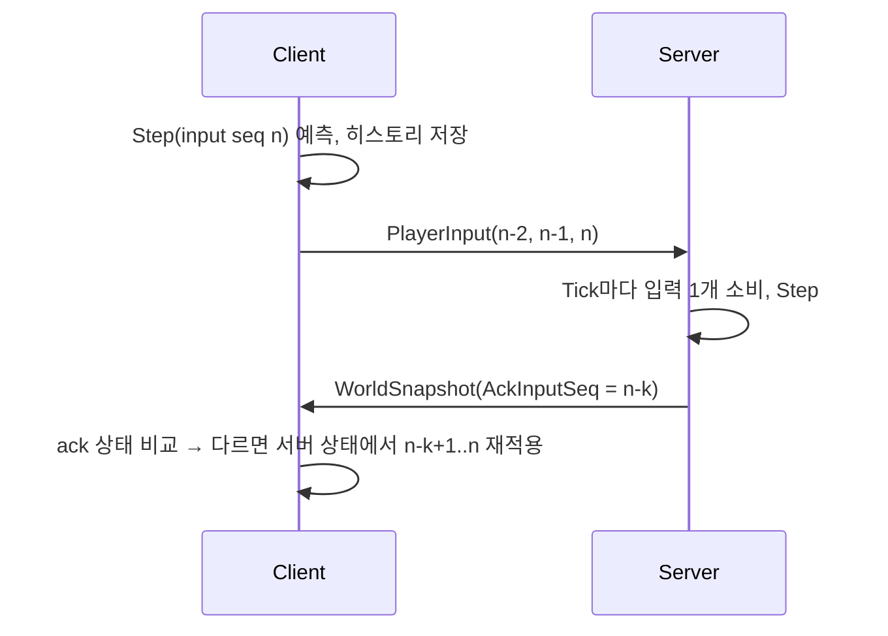

# Networking

Transport: LiteNetLib 2.1.4 (UDP). 프레이밍 `[PacketId: byte][payload]`, little-endian, 수기 직렬화(`PacketWriter`/`PacketReader`).
`ProtocolVersion`(현재 3. Phase 3에서 입력 명령·Snapshot 형식이 바뀌고 전투 패킷이 생겼다) 불일치 연결은 접속 단계(`OnConnectionRequest`)에서 `RejectReason.VersionMismatch`로 거절된다. 그 외 거절 사유: `ServerFull`(연결 수 ≥ MaxPlayers), `BadRequest`(연결 데이터 없음·파싱 실패·DevPlayerId 빈 문자열). Client는 거절 사유를 `Rejected: <사유>`로 표시한다.

## MTU

LiteNetLib의 기본 단일 패킷 한도는 1020B라 Snapshot 한도(1200B)보다 작다. 그래서 `ProtocolConstants.Mtu = 1232`를 서버·클라이언트 `NetManager`의 `MtuOverride`에 똑같이 쓴다(IPv6 최소 MTU 1280 − 헤더 48B, Sequenced 패킷에 1228B 사용 가능). 두 쪽이 같은 상수를 공유하므로 한쪽만 바꾸지 않는다.

## Packets

| Packet | 방향 | Delivery | 내용 |
|---|---|---|---|
| ConnectRequestData | C→S | 연결 요청 데이터 | ProtocolVersion u16, DevPlayerId ≤ 32B (PacketId 없음) |
| JoinMatchRequest | C→S | ReliableOrdered | 없음 (Client는 연결 직후 자동 전송) |
| JoinMatchResponse | S→C | ReliableOrdered | Result(Ok / AlreadyJoined / MatchFull), MyEntityId, ServerTick, SimHz, SnapshotHz |
| PlayerSpawned | S→C | ReliableOrdered | EntityId, Position, Yaw |
| PlayerDespawned | S→C | ReliableOrdered | EntityId |
| PlayerInput | C→S | Unreliable | 최근 입력 1–3개(Seq, MoveX, MoveY, Yaw, Buttons, AimYaw, AimPitch, ViewTick = 29B), 오래된 것부터 |
| WorldSnapshot | S→C | Sequenced | ServerTick, AckInputSeq(수신자별), Count, 수신자 블록(Health, Shield, WeaponSlot, Ammo, ReloadRemainingTicks = 6B, 수신자별), [EntityId, Position, VelocityY, Yaw, Flags(bit0 생존)] |
| WeaponCatalog | S→C | ReliableOrdered | Join 응답 직후 1회. 무기 1–8개: WeaponId, Name ≤ 16B, Damage, FireIntervalTicks, MagazineSize, ReloadTicks, Range, Automatic |
| ShotFired | S→C(전원) | Unreliable | ShooterId, Start(눈), End(멈춘 곳) |
| HitConfirmed | S→C(쏜 사람) | ReliableOrdered | TargetId, Damage(무기의 명목 피해. 실제로 깎인 양이 아니다), Killed |
| DamageTaken | S→C(맞은 사람) | ReliableOrdered | AttackerId, Damage, FromDirection(맞은 쪽 → 쏜 쪽 단위 벡터) |
| PlayerDied | S→C(전원) | ReliableOrdered | VictimId, KillerId |
| PlayerRespawned | S→C(전원) | ReliableOrdered | EntityId, Position, Yaw |

- Snapshot 헤더 11B + 수신자 블록 6B + 엔티티 23B. 분할되지 않으므로 `MaxPacketSize` 1200B 이내여야 한다 → 50명 = 17 + 23 × 50 = 1167B(`PacketTests`가 고정), 최대 50 엔티티(`MaxSnapshotEntities`), `MaxPlayers ≤ 50`(기본 16, 시작 시 검증). 서버는 payload를 한 번 쓰고 수신자마다 AckInputSeq와 수신자 블록만 덮어쓴다(`WorldSnapshotHeader.PatchRecipient`).
- Buttons는 알려진 비트(Jump, Sprint, Fire, Reload, Slot1, Slot2)만 남기고 나머지는 버린다. 입력 패킷은 최대 2 + 3 × 29 = 89B다.
- Client가 "누구를 맞혔다"고 보내는 필드는 없다. 명중은 서버가 조준 방향으로 판정한다.
- Join 결과: MatchFull이면 응답만 보낸다. 이미 참가한 peer의 중복 Join은 서버 Match에 도달하지 않는다(아래 Validation).

## 접속 순서

1. Client `Connect` → 연결 요청 데이터 전송.
2. Server `OnConnectionRequest`에서 검사 후 Accept, `PeerState`를 `peer.Tag`에 설정하고 그 다음에 `Connected` 제어 메시지를 Control 채널에 쓴다. LiteNetLib이 `Accept()` 안에서 `OnPeerConnected`를 동기 호출하는데 그 시점엔 Tag가 아직 없으므로, `OnPeerConnected`에서는 아무것도 하지 않는다.
3. Client `OnPeerConnected`에서 `JoinMatchRequest` 전송.
4. Server가 `JoinMatchResponse` → 새 플레이어에게 전원의 `PlayerSpawned`, 기존 플레이어에게 새 플레이어의 `PlayerSpawned`.

## Tick

- 서버 Simulation 30Hz(`SimHz`), Snapshot 15Hz(`SnapshotEveryTicks = 2`, `SnapshotHz = SimHz / SnapshotEveryTicks`). `appsettings.json`에서 변경. 값은 `JoinMatchResponse`로 Client에 전달된다.
- Client 렌더는 가변 FPS. 시뮬레이션은 서버 Tick과 같은 고정 스텝(`1/SimHz`)이다.
- 연결 유지: 서버 `DisconnectTimeout = DisconnectTimeoutMs`(기본 5000), `PingInterval = min(1000, DisconnectTimeoutMs / 4)`. 타임아웃은 클라이언트가 보낸 패킷으로만 갱신되므로, 짧은 타임아웃에서도 대기 중인 클라이언트가 pong으로 살아있도록 Ping을 타임아웃당 4번 이상 보낸다. Client는 `DisconnectTimeout = 5000`, 기본 PingInterval(1000).

## Movement

- 내 캐릭터: Client Prediction + Reconciliation (`LocalPlayerPredictor`).
  - 프레임당 누적 시간으로 고정 스텝을 0~N회 실행(누적은 0.25초로 제한, 히치 후 폭주 방지). 스텝마다 Seq를 1 올리고 입력·결과를 64칸 링 히스토리에 저장한다.
  - 패킷은 프레임당 1개, 최신 입력 최대 3개(`MaxInputsPerPacket`)만 담는다. 스텝이 여러 번 돈 프레임에서는 그보다 앞선 입력이 전송되지 않을 수 있다.
  - 점프는 프레임의 마지막 예측 스텝에서 소비한다(항상 최신 3개 패킷에 들어가도록).
  - Snapshot 수신 시 ack 시점의 예측과 서버 상태를 비교(위치 0.01m, VelocityY 0.01)해 다르면 서버 상태에서 ack 이후 입력을 재적용한다. 화면 위치는 오차를 렌더 오프셋으로 유지하며 감쇠(`exp(-10·dt)`)시키고, 보정량이 2m를 초과하면 오프셋 없이 즉시 스냅한다. ack가 0이면 아직 서버가 입력을 처리하지 않았다는 뜻이므로, 보낸 입력이 없을 때만 서버 상태로 교체하고 이미 예측 중이면 무시한다. ack가 보낸 입력보다 크거나 히스토리(64)를 벗어나면 서버 상태로 바로 교체한다.
  - 서버가 보낸 값이 NaN/Infinity이면 그 엔티티는 무시한다(예측 상태 오염 방지).
- 다른 플레이어: Snapshot 보간, 2 Snapshot 간격(`2 / SnapshotHz` ≈ 133ms) 과거를 렌더 (`RemotePlayerInterpolator`, `ServerClock`). 플레이어당 8개 샘플 링버퍼, 최신 샘플 이후는 외삽 없이 마지막 위치 유지. 비유한(non-finite) 샘플은 버린다. `ServerClock`은 렌더 Tick이 뒤로 가지 않게 한다.
- 입력이 제때 오지 않으면 서버는 직전 입력을 반복(점프 제외)하고 ack는 올리지 않는다 → 패킷 손실 시 작은 보정이 생길 수 있다. 입력 없는 Tick이 `SimHz / 2`(0.5초)를 넘으면 이동 입력 0(직전 Yaw 유지, 버튼 없음)으로 멈춘다. 멈춘 클라이언트가 Disconnect 전까지 계속 걷지 않게 하기 위해서다. 새 입력이 오면 다시 반복 허용 구간이 시작된다.

## 이동 충돌 (Phase 1)

서버(`Match.Tick`)와 예측(`LocalPlayerPredictor`)은 같은 `MovementSimulation.Step(ref state, input, dt, TestArena.Boxes)`를 호출한다. 지형은 Shared 코드 상수 `TestArena`(축 정렬 박스 20개 + y=0 바닥)이고, 캐릭터는 AABB(반폭 0.35 m, 높이 1.8 m)다.

Step 순서:
1. 입력 검증(비유한 값 0, 이동 길이 ≤ 1), Yaw·수평 속도 계산.
2. 박스와 `Skin`(0.001 m)보다 깊게 겹치면 가장 적게 겹친 축으로 밀어낸다(동률은 -X, +X, -Z, +Z, +Y, -Y 순. 아래로는 바닥 위일 때만). 박스를 하나씩 한 번만 밀어낸다.
3. 접지 판정은 상태 없이 매 Step: `VelocityY ≤ 0`이고 발밑 ±0.02 m(`GroundProbe`) 안에 바닥이나 박스 윗면이 있으면 Y를 그 면에 정확히 맞춘다. 접지면 `VelocityY = Jump ? 7 : 0`, 아니면 중력.
4. X → Z → Y 축 분리 Sweep. 각 축에서 나머지 두 축이 겹치는 박스 중 진행 방향 가장 가까운 면까지(Skin만큼 띄움) 이동한다(바닥 y=0은 Skin 없이 정확히 0). 거리에 상관없이 모든 앞쪽 박스를 보므로 빠른 낙하도 판을 뚫지 않는다. Y가 막히면 `VelocityY = 0`.

접지 여부를 상태에 저장하지 않으므로 Snapshot 형식은 그대로다. 박스 위에 서 있으면 Y가 윗면 값으로 고정되어 예측과 서버가 같은 값을 내고, 재조정 떨림이 없다. 서버 보정으로 예측이 박스 안에 들어가도 재적용 첫 Step이 밀어낸다. 점프 최고점은 30 Hz 이산 적분으로 약 1.34 m(연속식은 1.225 m)라 1 m 박스는 오르고 1.5 m 박스는 못 오른다. 접지 판정이 부동소수 오차(약 1e-7 m)를 접지로 보므로 점프가 Phase 0보다 한 Tick 일찍 나갈 수 있다. 서버와 Client가 같은 판정을 쓰므로 서로 어긋나지 않는다.

`TestArena` 규칙(`TestArenaTests`가 검사): 박스 30개 이하, 중앙 반경 7 m(`ClearRadius`) 비움, 두 박스 사이 틈은 0이거나 캐릭터보다 넓게, **어떤 두 박스도 옆으로 맞닿거나 겹치지 않는다(위로 쌓는 것은 허용)**. 박스를 하나씩 밀어내므로 면을 공유하는 두 박스 사이에서는 캐릭터가 갇힐 수 있기 때문이다. 외곽 벽 모서리는 0.5 m 틈으로 두는데, 캐릭터(0.7 m)보다 좁아 아레나는 막힌 채로 유지된다(`Character_CannotLeaveThroughCorner`).

## 전투 (Phase 3)

발사는 입력 명령에 실린다(D1): Fire 비트 + 조준(AimYaw, AimPitch) + ViewTick. 따라서 입력의 중복 전송·Seq 중복 제거·Tick당 1개 규칙을 그대로 따르고, 입력보다 빨리 쏠 수 없다.

- **조준(D2):** Client는 카메라 광선이 맞은 점(원격 플레이어는 서버 판정 상자 크기의 `BoxCollider`가 있어 조준점이 몸 위에 온다)과 캐릭터 눈(발 + 1.6 m)을 이어 Yaw/Pitch를 구한다. 눈의 발 위치는 렌더 위치가 아니라 입력마다 그 입력의 Step을 마친 예측 위치다(`LocalPlayerPredictor.SetAim`). 서버가 그 입력을 처리한 뒤의 위치이기 때문이다. 한 프레임에 Step이 여럿이면 앞선 입력은 각자 자기 위치에서 조준한다. 규약은 카메라와 같다(Yaw 0 = +Z, Yaw 90 = +X, 양의 Pitch = 아래). 서버는 같은 눈에서 같은 방향으로 쏘므로 어깨 카메라 시차가 있어도 조준점이 가리키는 곳을 맞힌다.
- **무기(D4, D5):** 수치는 서버 `weapons.json`에만 있다(Vesper AR: 20 / 3 Tick / 30발 / 60 Tick / 150 m / 자동, Kestrel LR: 90 / 38 Tick / 5발 / 75 Tick / 300 m / 단발. 1.25 s × 30 Hz = 37.5는 38로 반올림). 시작 시 검증하고 틀리면 서버가 뜨지 않는다. Join 직후 `WeaponCatalog`로 Client에 간다. Slot1/Slot2 = 목록의 0/1번째.
- **서버 Tick 순서:** 부활 시각이 된 플레이어 부활 → 플레이어마다 입력 1개(죽어 있으면 Seq만 확인 응답, 이동·발사 없음, 중력도 없음) → 이동 Step → 재장전 완료 확인 → **실제로 받은 입력일 때만** 교체 → 재장전 → 발사 → `ServerTick++` → 모든 플레이어 위치를 History에 기록 → Snapshot. 누락 입력 반복(Phase 0 유예)은 이동만 반복하고 발사·교체·재장전은 하지 않는다.
- **무기 규칙(D14, 서버 Tick 기준):** 교체는 Slot 비트가 하나만 켜졌을 때(둘 다면 무시), 교체하면 재장전 취소. 재장전은 탄이 가득이 아닐 때만. 발사는 탄 > 0, 재장전 중 아님, `now ≥ NextFireTick[슬롯]`, 조준 각이 유한할 때만. 단발은 Fire를 새로 누른 입력에서만. 마지막 탄을 쏘거나 빈 탄창으로 쏘려 하면 자동 재장전. 탄과 발사 간격은 슬롯별이다. Snapshot의 `ReloadRemainingTicks`는 재장전 중이면 마지막 Tick에도 1 이상이다(0은 "재장전 아님").
- **판정(D7):** 눈에서 조준 방향으로 사거리까지, 아레나 박스와 y=0 바닥(slab 교차), 그리고 쏜 사람을 뺀 살아 있는 플레이어의 이동 AABB(반폭 0.35 m, 높이 1.8 m) 중 가장 가까운 것에 맞는다. 머리 판정·탄 퍼짐·반동은 없다(`spread`·`recoil`은 데이터 필드만 있고 쓰지 않는다).
- **Lag Compensation(D6):** 플레이어마다 32칸 위치 링(`PositionHistory`)에 매 Tick 끝 위치를 기록한다. 발사 판정은 다른 플레이어를 ViewTick 위치로 되감는다(두 기록 사이 보간). ViewTick은 `[최신 Tick − 12, 최신 Tick]`(0.4 s, 30 Hz 기준. SimHz가 높으면 링 `Capacity − 1` = 31 Tick으로 한 번 더 잘린다)으로 잘리고, NaN이면 최신 Tick이다. 기록이 모자라면 가장 오래된 기록을 쓴다. Join·부활 때 History를 새로 시작하므로 되감기가 시체 위치에 닿지 않는다. 쏜 사람 자신은 되감지 않는다. 원격 플레이어는 약 133 ms(4 Tick) 과거로 보이고 입력 버퍼가 1 Tick을 더 쓰므로, 왕복 지연에 남는 여유는 약 7 Tick(약 233 ms)이다. 왕복 지연이 약 200 ms를 넘으면 빠르게 움직이는 상대를 빗나갈 수 있고, 벽 뒤로 숨은 뒤 최대 약 400 ms 동안 맞을 수 있다(D6의 비용).
- **피해·사망·부활(D8, D9):** Health 100, Shield 50. 피해는 Shield부터, 남은 만큼 Health, 0 아래로 내려가지 않는다. Health가 0이 되면 사망: `PlayerDied`(전원), 판정 대상에서 빠지고 입력은 무시되며, 진행 중이던 재장전은 취소된다. `SimHz × 3` Tick 뒤 `Match.SpawnPosition(id)`에서 Health·Shield·탄 가득, 슬롯 0으로 부활하고 `PlayerRespawned`(전원). 부활 때 누락 입력 반복(LastInput·MissedTicks)도 새로 시작해 이전 삶의 이동을 되풀이하지 않는다. `DamageTaken` → `PlayerDied` → `PlayerRespawned`는 같은 ReliableOrdered 채널이라 이 순서로 도착한다.
- **Client 예측 범위(D12):** 내 발사 연출은 `WeaponState`(서버 규칙의 표시용 사본, 예측 입력마다 1 Step)가 "서버가 쏠 것"이라고 할 때 바로 그린다. 서버 `ShotFired` 중 내 것은 무시한다. `WeaponState`는 입력마다의 결과를 64칸 링에 저장하고, Snapshot 수신자 블록이 오면 ack 시점의 기록과 비교한다. 다르면 그 시점을 서버 값으로 맞추고 ack 이후의 입력(아직 서버가 처리하지 않은 것)을 다시 적용한다(이동 재조정과 같은 방식). 기록보다 오래된 ack면 재적용 없이 서버 값에서 다시 시작한다. 명중·피해·사망은 서버 이벤트만 표시한다.
- **사망 중 예측:** `PlayerDied`(내 것)를 받으면 예측기는 이동하지 않고, Seq는 계속 올리되 이동 0·버튼 없음 입력을 보낸다(부활 직후 서버가 이 입력 일부를 살아 있는 상태로 처리하기 때문). 사망 중 Snapshot은 서버 위치로 바로 맞춘다. `PlayerRespawned`를 받으면 예측기를 새로 만들지 않고 같은 예측기의 상태만 Spawn 위치로 되돌린다. **Seq는 유지한다**(1부터 다시 세면 서버가 이미 소비한 Seq 이하를 버려 모든 입력이 무시된다). 생존 비트가 예측기 상태와 다른 Snapshot(다른 생의 것)은 재조정에 쓰지 않는다.
- **원격 플레이어:** 생존 여부는 Snapshot의 생존 비트로 정한다(죽어 있는 동안 들어온 Client는 `PlayerDied`를 받지 않았다). 살아 있는 동안 뷰는 회전하지 않는다(서버 AABB와 같은 축 정렬 `BoxCollider` 0.7 × 1.8 × 0.7을 유지하기 위해서이고, 캡슐은 Y축 둘레로 둥글어 보이는 모습은 같다). 이 Collider는 `Ignore Raycast` 레이어(2)에 있어 조준 광선만 본다. 죽으면 회색으로 눕고(진행 방향으로) Collider가 꺼진다. 다시 살아나면 보간 기록을 비워 시체 자리에서 미끄러지지 않고 Spawn 위치에 바로 나타난다.

## Validation (서버)

- 입력: NaN/Infinity → 0, 이동 벡터 길이 > 1 → 정규화(`MovementSimulation.Step`), Yaw가 비유한이면 이전 Yaw 유지. Seq 중복·역행(이미 소비한 Seq 이하) 무시, Tick당 플레이어별 1스텝. 시작 위치가 박스와 겹치면 밀어낸 뒤 이동한다.
- Join은 연결당 한 번만 처리한다. 두 번째부터는 잘못된 패킷으로 세고 Match에 전달하지 않는다(Control 채널 이벤트 ≤ 3/연결 유지).
- Join하지 않은 peer의 PlayerInput은 거절(잘못된 패킷). peer별 입력 패킷은 초당 `SimHz * 2`개(기본 60)까지만 받고 초과분은 잘못된 패킷으로 센다(고정 1초 창).
- 알 수 없는 PacketId, 클라이언트가 보낼 수 없는 PacketId(서버→클라이언트 패킷), 잘리거나 개수가 범위 밖인 PlayerInput → drop하고 잘못된 패킷으로 센다. 연결별 `BadPacketDisconnectThreshold`(20) 이상이면 Disconnect.
- 전투 입력: 조준 각이 NaN/Infinity면 그 입력은 발사하지 않는다(탄·간격 소모 없음). Pitch는 ±89°로 자른다. ViewTick은 되감기 범위로 자른다. Slot 비트가 둘 다 켜져 있으면 교체하지 않는다. 명중 대상은 Client가 정하지 않는다.
- 위치는 서버가 계산하므로 순간이동·속도 조작은 구조적으로 불가능하다.
