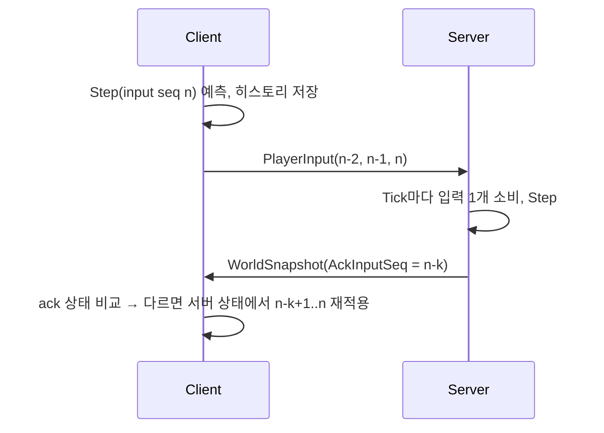

# Phase 0 + 네트워크 이동 동기화 Implementation Plan

> **For agentic workers:** REQUIRED SUB-SKILL: Use superpowers:subagent-driven-development (recommended) or superpowers:executing-plans to implement this plan task-by-task. Steps use checkbox (`- [ ]`) syntax for tracking.

**Goal:** Unity Client가 .NET 10 Dedicated Server에 접속해 Session·Spawn을 거쳐, 두 Client가 서로의 이동(내 캐릭터 예측 + 다른 플레이어 보간)을 보는 상태를 만든다.

**Architecture:** LiteNetLib UDP. 서버는 LiteNetLib 네트워크 스레드가 패킷을 검증·파싱해 크기 제한 Channel 두 개로 넘기고, 전용 Game Loop 스레드(30Hz)가 모든 게임 상태를 단독 소유해 시뮬레이션하고 2 Tick마다 Snapshot을 보낸다. 패킷 DTO와 이동 계산(`MovementSimulation`)은 `/Shared` 로컬 UPM 패키지 하나를 Unity와 서버가 같이 컴파일한다.

**Tech Stack:** .NET 10, C# (Shared·Client는 C# 9 / netstandard2.1), LiteNetLib 2.1.4, Microsoft.Extensions.Hosting, xUnit, Unity 6000.3.24f1 (URP, Input System 1.20, Test Framework 1.6), Multiplayer Play Mode 2.0.2.

**Spec:** `Docs/specs/2026-09-30-phase0-network-sync-design.md`

## Global Constraints

- 커밋하지 않는다. 각 Task의 마지막 단계는 "체크포인트"(검증 결과 기록)다. Commit·Push는 사용자가 "푸시"를 입력했을 때만 `github-push` 스킬로 한다.
- 모든 코드는 `.claude/skills/game-core-rules/SKILL.md`를 따른다. 우리 코드는 Lock을 쓰지 않는다(스레드 간 전달은 `System.Threading.Channels`만).
- `Shared/Runtime`은 `netstandard2.1` + C# 9에서 컴파일되어야 한다(Unity 호환). `UnityEngine` 참조 금지, `System.Numerics`만 사용. `BinaryPrimitives.WriteSingleLittleEndian` 같은 .NET 5+ API 금지.
- Shared에 게임 로직을 넣지 않는다. 예외는 `Shared/Runtime/Simulation`의 순수 이동 수학 하나뿐이다.
- 이동 수치(`MoveSettings`)는 Shared 상수만 쓴다. 서버 설정 파일에 두지 않는다(예측이 어긋나기 때문).
- LiteNetLib 버전: 서버 NuGet `LiteNetLib` **2.1.4**, Unity `https://github.com/RevenantX/LiteNetLib.git?path=LiteNetLib#2.1.4`.
- `ProtocolConstants.MaxPacketSize = 1200`. Unreliable/Sequenced는 LiteNetLib이 분할하지 않으므로 Snapshot 하나가 이 크기를 넘으면 안 된다 → `MaxSnapshotEntities = 50`, `ServerOptions.MaxPlayers ≤ 50`.
- Tick: SimHz 30, SnapshotEveryTicks 2(=15Hz). 둘 다 `appsettings.json`에서 변경 가능.
- Unity: Scene·Prefab·`.meta` 파일을 직접 만들거나 수정하지 않는다. Hot Path(Update, 패킷 처리)에서 LINQ·임시 컬렉션·문자열 생성 금지.
- 서버 Hot Path(패킷 파싱, Tick, Snapshot)에서 할당 금지(메시지는 struct, 송신 버퍼 재사용).
- Unity batchmode 명령은 Unity Editor가 이 프로젝트를 열고 있지 않을 때만 실행한다.

## Review Focus

- 플레이어 수가 Snapshot 한 datagram(1200B)을 넘기는 설정 → 서버가 시작을 거부해야 한다 (Task 7 `Validate_RejectsMaxPlayersAboveSnapshotLimit`).
- Client가 Tick보다 빠르게 입력을 보냄(스피드핵·시계 차이) → 서버는 Tick당 1스텝만 적용해야 한다 (Task 7 `Tick_AppliesAtMostOneInputPerTick`).
- 3개씩 중복 전송되는 입력, 순서가 뒤바뀐 입력 → 같은 Seq는 정확히 한 번만 적용 (Task 5, Task 7 `DuplicateInputs_AreAppliedOnce`).
- NaN·Infinity·과도하게 큰 입력값 → 위치가 유한값으로 유지되고 속도 제한을 넘지 않음 (Task 4, Task 7 `NonFiniteInput_KeepsStateFinite`).
- Disconnect 패킷 없이 사라진 Client(크래시·네트워크 단절) → Timeout 후 Session이 제거되고 다른 Client에 Despawn (Task 8 `CrashedClient_IsDespawnedAfterTimeout`).

---

## File Structure

| 경로 | 책임 |
|---|---|
| `Shared/package.json`, `Shared/Runtime/ProjectH.Shared.asmdef` | 로컬 UPM 패키지 정의 |
| `Shared/Runtime/Protocol/ProtocolConstants.cs` | 버전·크기 상수 |
| `Shared/Runtime/Protocol/PacketId.cs`, `RejectReason.cs` | 네트워크 Enum |
| `Shared/Runtime/Protocol/PacketWriter.cs`, `PacketReader.cs` | Span 기반 바이너리 쓰기/읽기(TryRead) |
| `Shared/Runtime/Protocol/ClientPackets.cs` | C→S: ConnectRequestData, JoinMatchRequest, PlayerInputPacket |
| `Shared/Runtime/Protocol/ServerPackets.cs` | S→C: JoinMatchResponse, PlayerSpawned, PlayerDespawned, WorldSnapshotHeader, SnapshotEntity |
| `Shared/Runtime/Simulation/InputCommand.cs`, `MoveState.cs`, `MoveSettings.cs`, `MovementSimulation.cs` | 예측·서버 공용 이동 계산(유일한 Shared 로직 예외) |
| `Server/ProjectH.Server.slnx` | 솔루션 |
| `Server/src/ProjectH.Shared/ProjectH.Shared.csproj` | Shared 소스를 netstandard2.1로 컴파일 |
| `Server/src/ProjectH.Server/ServerOptions.cs` | 설정 + 검증 |
| `Server/src/ProjectH.Server/Game/PlayerInputBuffer.cs` | 플레이어별 입력 링 버퍼 |
| `Server/src/ProjectH.Server/Game/PlayerEntity.cs`, `Match.cs` | 플레이어 상태, Join/Leave/Tick/Snapshot |
| `Server/src/ProjectH.Server/Diagnostics/TickMetrics.cs`, `ServerStats.cs` | Tick 백분위, 카운터 |
| `Server/src/ProjectH.Server/Net/InboundMessages.cs`, `InboundChannels.cs`, `PeerState.cs`, `NetworkListener.cs` | 네트워크 스레드 → Game Loop 전달 |
| `Server/src/ProjectH.Server/GameLoop.cs`, `WindowsTimerResolution.cs` | 전용 스레드 고정 Tick, 통계 로그 |
| `Server/src/ProjectH.Server/GameServerService.cs`, `Program.cs`, `appsettings.json` | Generic Host |
| `Server/tests/ProjectH.Server.Tests/...` | xUnit 단위·통합 테스트, `HeadlessClient` |
| `Client/Packages/manifest.json` | Shared·LiteNetLib·MPPM 패키지 추가 |
| `Client/Assets/Scripts/ProjectH.Client.asmdef` | Client 어셈블리 |
| `Client/Assets/Scripts/Bootstrap/*` | 런타임 부트스트랩, 테스트 월드, 실행 인자, 개발용 접속 패널 |
| `Client/Assets/Scripts/Net/NetClient.cs`, `VectorConversions.cs` | LiteNetLib 클라이언트, 벡터 변환 |
| `Client/Assets/Scripts/Input/InputReader.cs` | Input System 격리 |
| `Client/Assets/Scripts/Game/*` | GameClient, 예측, 보간, 뷰 |
| `Client/Assets/Scripts/Camera/ThirdPersonCamera.cs` | Follow + Mouse Look |
| `Client/Assets/Tests/EditMode/*` | 예측·보간 EditMode 테스트 |
| `Docs/*.md` | 아키텍처·네트워크·서버·클라이언트 문서 |

---

### Task 1: 솔루션 골격, Shared 패키지, 하네스 규칙 예외

**Files:**
- Create: `Shared/package.json`, `Shared/Runtime/ProjectH.Shared.asmdef`, `Shared/Runtime/Protocol/ProtocolConstants.cs`
- Create: `Server/ProjectH.Server.slnx`, `Server/src/ProjectH.Shared/ProjectH.Shared.csproj`, `Server/src/ProjectH.Server/ProjectH.Server.csproj`, `Server/tests/ProjectH.Server.Tests/ProjectH.Server.Tests.csproj`
- Test: `Server/tests/ProjectH.Server.Tests/Shared/ProtocolConstantsTests.cs`
- Modify: `.claude/skills/game-core-rules/SKILL.md` (4절), `CLAUDE.md` (변경 이력)

**Interfaces:**
- Produces: 네임스페이스 `ProjectH.Shared.Protocol`, `ProjectH.Shared.Simulation`, `ProjectH.Server`; `ProtocolConstants.ProtocolVersion (ushort)=1`, `MaxDevPlayerIdBytes=32`, `MaxInputsPerPacket=3`, `MaxPacketSize=1200`, `MaxSnapshotEntities=50`

- [ ] **Step 1: Shared 패키지 파일 작성**

`Shared/package.json`:

```json
{
  "name": "com.projecth.shared",
  "version": "0.1.0",
  "displayName": "ProjectH Shared",
  "description": "Packet DTOs, protocol ids and the movement simulation shared by the Unity client and the .NET server.",
  "unity": "6000.3"
}
```

`Shared/Runtime/ProjectH.Shared.asmdef`:

```json
{
  "name": "ProjectH.Shared",
  "rootNamespace": "ProjectH.Shared",
  "references": [],
  "includePlatforms": [],
  "excludePlatforms": [],
  "allowUnsafeCode": false,
  "overrideReferences": false,
  "precompiledReferences": [],
  "autoReferenced": true,
  "defineConstraints": [],
  "versionDefines": [],
  "noEngineReferences": true
}
```

`Shared/Runtime/Protocol/ProtocolConstants.cs`:

```csharp
namespace ProjectH.Shared.Protocol
{
    public static class ProtocolConstants
    {
        // Bump whenever any packet layout changes; the server rejects other versions at connect time.
        public const ushort ProtocolVersion = 1;

        public const int MaxDevPlayerIdBytes = 32;
        public const int MaxInputsPerPacket = 3;

        // LiteNetLib does not fragment Unreliable/Sequenced packets, so one snapshot must fit one datagram.
        public const int MaxPacketSize = 1200;

        // (1200 - 11 header bytes) / 22 bytes per entity = 54; 50 leaves headroom.
        public const int MaxSnapshotEntities = 50;
    }
}
```

- [ ] **Step 2: 서버 솔루션과 프로젝트 생성**

Run (저장소 루트에서):

```bash
cd Server
dotnet new sln -n ProjectH.Server --format slnx
dotnet new classlib -n ProjectH.Shared -o src/ProjectH.Shared -f netstandard2.1
rm src/ProjectH.Shared/Class1.cs
dotnet new console -n ProjectH.Server -o src/ProjectH.Server -f net10.0
dotnet new xunit -n ProjectH.Server.Tests -o tests/ProjectH.Server.Tests -f net10.0
rm -f tests/ProjectH.Server.Tests/UnitTest1.cs
dotnet add src/ProjectH.Server package LiteNetLib --version 2.1.4
dotnet add src/ProjectH.Server package Microsoft.Extensions.Hosting
dotnet add src/ProjectH.Server reference src/ProjectH.Shared
dotnet add tests/ProjectH.Server.Tests reference src/ProjectH.Server src/ProjectH.Shared
dotnet sln ProjectH.Server.slnx add src/ProjectH.Shared src/ProjectH.Server tests/ProjectH.Server.Tests
cd ..
```

- [ ] **Step 3: Shared csproj를 Shared 소스 컴파일용으로 교체**

`Server/src/ProjectH.Shared/ProjectH.Shared.csproj` 전체:

```xml
<Project Sdk="Microsoft.NET.Sdk">

  <PropertyGroup>
    <!-- Same target and language version as Unity 6, so Unity-incompatible APIs or syntax fail here first. -->
    <TargetFramework>netstandard2.1</TargetFramework>
    <LangVersion>9.0</LangVersion>
    <Nullable>disable</Nullable>
    <RootNamespace>ProjectH.Shared</RootNamespace>
    <!-- Sources live in /Shared (the Unity package); this project only compiles them. -->
    <EnableDefaultCompileItems>false</EnableDefaultCompileItems>
  </PropertyGroup>

  <ItemGroup>
    <Compile Include="../../../Shared/Runtime/**/*.cs" />
  </ItemGroup>

</Project>
```

- [ ] **Step 4: 실패하는 테스트 작성**

`Server/tests/ProjectH.Server.Tests/Shared/ProtocolConstantsTests.cs`:

```csharp
using ProjectH.Shared.Protocol;
using Xunit;

namespace ProjectH.Server.Tests.Shared;

public class ProtocolConstantsTests
{
    [Fact]
    public void SnapshotEntityLimit_FitsInOneDatagram()
    {
        const int headerBytes = 11;
        const int entityBytes = 22;
        Assert.True(headerBytes + ProtocolConstants.MaxSnapshotEntities * entityBytes <= ProtocolConstants.MaxPacketSize);
    }

    [Fact]
    public void ProtocolVersion_IsOne()
    {
        Assert.Equal((ushort)1, ProtocolConstants.ProtocolVersion);
    }
}
```

- [ ] **Step 5: 빌드와 테스트 실행**

Run: `dotnet test Server/ProjectH.Server.slnx`
Expected: 빌드 성공, 테스트 2개 PASS. (Step 1이 빠졌다면 `ProtocolConstants` 미정의로 실패)

- [ ] **Step 6: 하네스 규칙에 Shared 예외 추가**

`.claude/skills/game-core-rules/SKILL.md`의 4절 마지막 줄 `Shared에 게임 로직을 넣지 않는다.` 바로 뒤에 추가:

```markdown
예외: `Shared/Runtime/Simulation`의 이동 계산(`MovementSimulation`과 그 입력·상태·상수 타입)만 둔다. Client Prediction과 서버 시뮬레이션이 같은 코드를 실행해야 예측이 어긋나지 않기 때문이다. 이 폴더에는 `System.Numerics`만 쓰는 순수 계산만 두고, 전투·인벤토리 등 다른 게임 규칙은 넣지 않는다.
```

`CLAUDE.md` 변경 이력 표 마지막에 추가:

```markdown
| 2026-09-30 | Shared 이동 계산 예외 추가 | `game-core-rules` 4절 | Client Prediction과 서버가 같은 이동 코드를 써야 함 |
```

- [ ] **Step 7: 체크포인트**

`dotnet test Server/ProjectH.Server.slnx` PASS를 확인하고 다음 Task로 넘어간다. 커밋하지 않는다.

---

### Task 2: PacketWriter / PacketReader / PacketId

**Files:**
- Create: `Shared/Runtime/Protocol/PacketId.cs`, `Shared/Runtime/Protocol/PacketWriter.cs`, `Shared/Runtime/Protocol/PacketReader.cs`
- Test: `Server/tests/ProjectH.Server.Tests/Shared/PacketWriterReaderTests.cs`

**Interfaces:**
- Consumes: `ProtocolConstants` (Task 1)
- Produces:
  - `enum PacketId : byte { None=0, JoinMatchRequest=1, JoinMatchResponse=2, PlayerSpawned=3, PlayerDespawned=4, PlayerInput=5, WorldSnapshot=6 }`
  - `ref struct PacketWriter(Span<byte>)`: `WriteByte`, `WriteUInt16`, `WriteUInt32`, `WriteSingle`, `WriteVector3(System.Numerics.Vector3)`, `WriteString(string, int maxBytes)`, `int Length`, `bool Overflowed`, `ReadOnlySpan<byte> WrittenSpan`
  - `ref struct PacketReader(ReadOnlySpan<byte>)`: `TryReadByte/UInt16/UInt32/Single/Vector3(out)`, `TryReadString(int maxBytes, out string)`, `TryReadPacketId(out PacketId)`, `int Remaining`

- [ ] **Step 1: 실패하는 테스트 작성**

`Server/tests/ProjectH.Server.Tests/Shared/PacketWriterReaderTests.cs`:

```csharp
using System;
using System.Numerics;
using ProjectH.Shared.Protocol;
using Xunit;

namespace ProjectH.Server.Tests.Shared;

public class PacketWriterReaderTests
{
    [Fact]
    public void RoundTrip_AllTypes()
    {
        var buffer = new byte[64];
        var writer = new PacketWriter(buffer);
        writer.WriteByte(7);
        writer.WriteUInt16(65000);
        writer.WriteUInt32(4_000_000_000);
        writer.WriteSingle(-1.5f);
        writer.WriteVector3(new Vector3(1f, 2f, 3f));
        writer.WriteString("player-1", 32);
        Assert.False(writer.Overflowed);

        var reader = new PacketReader(buffer.AsSpan(0, writer.Length));
        Assert.True(reader.TryReadByte(out byte b));
        Assert.True(reader.TryReadUInt16(out ushort u16));
        Assert.True(reader.TryReadUInt32(out uint u32));
        Assert.True(reader.TryReadSingle(out float f));
        Assert.True(reader.TryReadVector3(out Vector3 v));
        Assert.True(reader.TryReadString(32, out string s));

        Assert.Equal(7, b);
        Assert.Equal(65000, u16);
        Assert.Equal(4_000_000_000u, u32);
        Assert.Equal(-1.5f, f);
        Assert.Equal(new Vector3(1f, 2f, 3f), v);
        Assert.Equal("player-1", s);
        Assert.Equal(0, reader.Remaining);
    }

    [Fact]
    public void Writer_Overflows_WithoutThrowing_AndStopsWriting()
    {
        var buffer = new byte[3];
        var writer = new PacketWriter(buffer);
        writer.WriteUInt16(1);
        writer.WriteUInt32(2);   // does not fit
        writer.WriteByte(3);     // ignored after overflow

        Assert.True(writer.Overflowed);
        Assert.Equal(2, writer.Length);
    }

    [Fact]
    public void Reader_ReturnsFalse_OnTruncatedData()
    {
        var reader = new PacketReader(new byte[] { 1, 2, 3 });
        Assert.False(reader.TryReadUInt32(out _));
        Assert.False(reader.TryReadVector3(out _));
    }

    [Fact]
    public void String_LongerThanMax_OverflowsWriter_AndIsRejectedByReader()
    {
        var writer = new PacketWriter(new byte[128]);
        writer.WriteString(new string('x', 33), 32);
        Assert.True(writer.Overflowed);

        // Length prefix 40 but only 2 payload bytes: must be rejected, not read past the end.
        var reader = new PacketReader(new byte[] { 40, (byte)'a', (byte)'b' });
        Assert.False(reader.TryReadString(64, out _));

        // Length prefix within data but above the caller's limit.
        var reader2 = new PacketReader(new byte[] { 3, (byte)'a', (byte)'b', (byte)'c' });
        Assert.False(reader2.TryReadString(2, out _));
    }

    [Theory]
    [InlineData(0)]
    [InlineData(7)]
    [InlineData(255)]
    public void PacketId_OutOfRange_IsRejected(byte raw)
    {
        var reader = new PacketReader(new[] { raw });
        Assert.False(reader.TryReadPacketId(out _));
    }

    [Fact]
    public void PacketId_InRange_IsAccepted()
    {
        var reader = new PacketReader(new[] { (byte)PacketId.PlayerInput });
        Assert.True(reader.TryReadPacketId(out PacketId id));
        Assert.Equal(PacketId.PlayerInput, id);
    }
}
```

- [ ] **Step 2: 테스트 실패 확인**

Run: `dotnet test Server/ProjectH.Server.slnx --filter FullyQualifiedName~PacketWriterReaderTests`
Expected: FAIL — `PacketWriter`, `PacketReader`, `PacketId` 미정의 컴파일 오류

- [ ] **Step 3: 구현**

`Shared/Runtime/Protocol/PacketId.cs`:

```csharp
namespace ProjectH.Shared.Protocol
{
    // First byte of every packet. Keep values stable: they are the wire format.
    public enum PacketId : byte
    {
        None = 0,
        JoinMatchRequest = 1,
        JoinMatchResponse = 2,
        PlayerSpawned = 3,
        PlayerDespawned = 4,
        PlayerInput = 5,
        WorldSnapshot = 6,
    }
}
```

`Shared/Runtime/Protocol/PacketWriter.cs`:

```csharp
using System;
using System.Buffers.Binary;
using System.Numerics;
using System.Text;

namespace ProjectH.Shared.Protocol
{
    // Writes little-endian values into a caller-owned buffer. Never throws on overflow: it sets
    // Overflowed and ignores further writes, so a too-large packet is caught by one check before sending.
    public ref struct PacketWriter
    {
        private readonly Span<byte> _buffer;
        private int _length;
        private bool _overflowed;

        public PacketWriter(Span<byte> buffer)
        {
            _buffer = buffer;
            _length = 0;
            _overflowed = false;
        }

        public int Length => _length;
        public bool Overflowed => _overflowed;
        public ReadOnlySpan<byte> WrittenSpan => _buffer.Slice(0, _length);

        public void WriteByte(byte value)
        {
            if (!Reserve(1)) return;
            _buffer[_length] = value;
            _length += 1;
        }

        public void WriteUInt16(ushort value)
        {
            if (!Reserve(2)) return;
            BinaryPrimitives.WriteUInt16LittleEndian(_buffer.Slice(_length), value);
            _length += 2;
        }

        public void WriteUInt32(uint value)
        {
            if (!Reserve(4)) return;
            BinaryPrimitives.WriteUInt32LittleEndian(_buffer.Slice(_length), value);
            _length += 4;
        }

        // BinaryPrimitives.WriteSingleLittleEndian is .NET 5+ and missing in Unity's netstandard2.1.
        public void WriteSingle(float value)
        {
            WriteUInt32(unchecked((uint)BitConverter.SingleToInt32Bits(value)));
        }

        public void WriteVector3(Vector3 value)
        {
            WriteSingle(value.X);
            WriteSingle(value.Y);
            WriteSingle(value.Z);
        }

        // 1-byte length prefix + UTF-8 bytes. Longer than maxBytes marks the writer overflowed.
        public void WriteString(string value, int maxBytes)
        {
            if (value == null) value = string.Empty;
            int byteCount = Encoding.UTF8.GetByteCount(value);
            if (byteCount > maxBytes || byteCount > byte.MaxValue)
            {
                _overflowed = true;
                return;
            }
            if (!Reserve(1 + byteCount)) return;
            _buffer[_length] = (byte)byteCount;
            Encoding.UTF8.GetBytes(value.AsSpan(), _buffer.Slice(_length + 1, byteCount));
            _length += 1 + byteCount;
        }

        private bool Reserve(int count)
        {
            if (_overflowed) return false;
            if (_length + count > _buffer.Length)
            {
                _overflowed = true;
                return false;
            }
            return true;
        }
    }
}
```

`Shared/Runtime/Protocol/PacketReader.cs`:

```csharp
using System;
using System.Buffers.Binary;
using System.Numerics;
using System.Text;

namespace ProjectH.Shared.Protocol
{
    // Reads little-endian values from received bytes. Every read is TryXxx: short or malformed data
    // returns false instead of throwing, because client packets are untrusted and exceptions must not
    // be used as control flow on the receive path.
    public ref struct PacketReader
    {
        private readonly ReadOnlySpan<byte> _data;
        private int _position;

        public PacketReader(ReadOnlySpan<byte> data)
        {
            _data = data;
            _position = 0;
        }

        public int Remaining => _data.Length - _position;

        public bool TryReadByte(out byte value)
        {
            if (Remaining < 1)
            {
                value = 0;
                return false;
            }
            value = _data[_position];
            _position += 1;
            return true;
        }

        public bool TryReadUInt16(out ushort value)
        {
            if (Remaining < 2)
            {
                value = 0;
                return false;
            }
            value = BinaryPrimitives.ReadUInt16LittleEndian(_data.Slice(_position));
            _position += 2;
            return true;
        }

        public bool TryReadUInt32(out uint value)
        {
            if (Remaining < 4)
            {
                value = 0;
                return false;
            }
            value = BinaryPrimitives.ReadUInt32LittleEndian(_data.Slice(_position));
            _position += 4;
            return true;
        }

        public bool TryReadSingle(out float value)
        {
            if (!TryReadUInt32(out uint bits))
            {
                value = 0f;
                return false;
            }
            value = BitConverter.Int32BitsToSingle(unchecked((int)bits));
            return true;
        }

        public bool TryReadVector3(out Vector3 value)
        {
            if (Remaining < 12)
            {
                value = default;
                return false;
            }
            TryReadSingle(out float x);
            TryReadSingle(out float y);
            TryReadSingle(out float z);
            value = new Vector3(x, y, z);
            return true;
        }

        // Allocates the string: only used at connect time, never on the per-tick path.
        public bool TryReadString(int maxBytes, out string value)
        {
            value = null;
            if (!TryReadByte(out byte length)) return false;
            if (length > maxBytes || Remaining < length) return false;
            value = Encoding.UTF8.GetString(_data.Slice(_position, length));
            _position += length;
            return true;
        }

        public bool TryReadPacketId(out PacketId id)
        {
            id = PacketId.None;
            if (!TryReadByte(out byte raw)) return false;
            if (raw < (byte)PacketId.JoinMatchRequest || raw > (byte)PacketId.WorldSnapshot) return false;
            id = (PacketId)raw;
            return true;
        }
    }
}
```

- [ ] **Step 4: 테스트 통과 확인**

Run: `dotnet test Server/ProjectH.Server.slnx --filter FullyQualifiedName~PacketWriterReaderTests`
Expected: PASS (8개)

- [ ] **Step 5: 체크포인트**

`dotnet build Server/ProjectH.Server.slnx`가 경고 외 오류 없이 끝나는지 확인한다(Shared가 netstandard2.1/C# 9로 컴파일됨). 커밋하지 않는다.

---

### Task 3: 패킷 정의와 InputCommand

**Files:**
- Create: `Shared/Runtime/Protocol/RejectReason.cs`, `Shared/Runtime/Protocol/ClientPackets.cs`, `Shared/Runtime/Protocol/ServerPackets.cs`, `Shared/Runtime/Simulation/InputCommand.cs`
- Test: `Server/tests/ProjectH.Server.Tests/Shared/PacketTests.cs`

**Interfaces:**
- Consumes: `PacketWriter`, `PacketReader`, `PacketId`, `ProtocolConstants` (Task 1–2)
- Produces:
  - `ProjectH.Shared.Simulation`: `[Flags] enum InputButtons : byte { None=0, Jump=1, Sprint=2 }`; `struct InputCommand { uint Seq; float MoveX; float MoveY; float Yaw; InputButtons Buttons; }`
  - `enum RejectReason : byte { None=0, VersionMismatch=1, ServerFull=2, BadRequest=3 }`; `enum JoinResult : byte { Ok=0, AlreadyJoined=1, MatchFull=2 }`
  - `struct ConnectRequestData { ushort ProtocolVersion; string DevPlayerId; static Write(ref PacketWriter, in ...); static bool TryRead(ref PacketReader, out ...) }` (PacketId 없음)
  - `static class JoinMatchRequest { static void Write(ref PacketWriter) }`
  - `struct PlayerInputPacket { byte Count; InputCommand Input0, Input1, Input2; InputCommand Get(int); void Set(int, in InputCommand); static Write; static TryRead }` — 입력은 오래된 것부터
  - `struct JoinMatchResponse { JoinResult Result; ushort MyEntityId; uint ServerTick; byte SimHz; byte SnapshotHz; static Write; static TryRead }`
  - `struct PlayerSpawned { ushort EntityId; Vector3 Position; float Yaw; static Write; static TryRead }`
  - `struct PlayerDespawned { ushort EntityId; static Write; static TryRead }`
  - `struct WorldSnapshotHeader { uint ServerTick; uint AckInputSeq; ushort Count; const int Size=11; const int AckInputSeqOffset=5; static Write; static TryRead; static void PatchAckInputSeq(Span<byte> packet, uint ack) }`
  - `struct SnapshotEntity { ushort EntityId; Vector3 Position; float VelocityY; float Yaw; const int Size=22; static Write; static TryRead }`
  - 모든 `Write`는 PacketId를 먼저 쓴다(`ConnectRequestData`, `SnapshotEntity` 제외). 모든 `TryRead`는 PacketId를 이미 읽은 뒤 호출한다.

- [ ] **Step 1: 실패하는 테스트 작성**

`Server/tests/ProjectH.Server.Tests/Shared/PacketTests.cs`:

```csharp
using System;
using System.Numerics;
using ProjectH.Shared.Protocol;
using ProjectH.Shared.Simulation;
using Xunit;

namespace ProjectH.Server.Tests.Shared;

public class PacketTests
{
    private readonly byte[] _buffer = new byte[ProtocolConstants.MaxPacketSize];

    private PacketReader ReaderAfterId(int length, PacketId expected)
    {
        var reader = new PacketReader(_buffer.AsSpan(0, length));
        Assert.True(reader.TryReadPacketId(out PacketId id));
        Assert.Equal(expected, id);
        return reader;
    }

    [Fact]
    public void ConnectRequestData_RoundTrip()
    {
        var writer = new PacketWriter(_buffer);
        ConnectRequestData.Write(ref writer, new ConnectRequestData { ProtocolVersion = 1, DevPlayerId = "abc" });
        var reader = new PacketReader(_buffer.AsSpan(0, writer.Length));
        Assert.True(ConnectRequestData.TryRead(ref reader, out var data));
        Assert.Equal((ushort)1, data.ProtocolVersion);
        Assert.Equal("abc", data.DevPlayerId);
    }

    [Fact]
    public void ConnectRequestData_EmptyId_IsRejected()
    {
        var writer = new PacketWriter(_buffer);
        ConnectRequestData.Write(ref writer, new ConnectRequestData { ProtocolVersion = 1, DevPlayerId = "" });
        var reader = new PacketReader(_buffer.AsSpan(0, writer.Length));
        Assert.False(ConnectRequestData.TryRead(ref reader, out _));
    }

    [Fact]
    public void PlayerInput_RoundTrip_KeepsOrder()
    {
        var packet = new PlayerInputPacket { Count = 3 };
        for (int i = 0; i < 3; i++)
            packet.Set(i, new InputCommand { Seq = (uint)(10 + i), MoveX = 0.5f, MoveY = -1f, Yaw = 90f + i, Buttons = InputButtons.Jump });

        var writer = new PacketWriter(_buffer);
        PlayerInputPacket.Write(ref writer, packet);
        var reader = ReaderAfterId(writer.Length, PacketId.PlayerInput);
        Assert.True(PlayerInputPacket.TryRead(ref reader, out var read));

        Assert.Equal(3, read.Count);
        for (int i = 0; i < 3; i++)
        {
            Assert.Equal((uint)(10 + i), read.Get(i).Seq);
            Assert.Equal(90f + i, read.Get(i).Yaw);
            Assert.Equal(InputButtons.Jump, read.Get(i).Buttons);
        }
    }

    [Theory]
    [InlineData(0)]
    [InlineData(4)]
    public void PlayerInput_InvalidCount_IsRejected(byte count)
    {
        var bytes = new byte[2 + 17 * 4];
        bytes[0] = (byte)PacketId.PlayerInput;
        bytes[1] = count;
        var reader = new PacketReader(bytes);
        reader.TryReadPacketId(out _);
        Assert.False(PlayerInputPacket.TryRead(ref reader, out _));
    }

    [Fact]
    public void PlayerInput_Truncated_IsRejected()
    {
        var bytes = new byte[] { (byte)PacketId.PlayerInput, 2, 1, 0, 0, 0 };
        var reader = new PacketReader(bytes);
        reader.TryReadPacketId(out _);
        Assert.False(PlayerInputPacket.TryRead(ref reader, out _));
    }

    [Fact]
    public void PlayerInput_UnknownButtonBits_AreMasked()
    {
        var packet = new PlayerInputPacket { Count = 1 };
        packet.Set(0, new InputCommand { Seq = 1, Buttons = (InputButtons)0xFF });
        var writer = new PacketWriter(_buffer);
        PlayerInputPacket.Write(ref writer, packet);
        var reader = ReaderAfterId(writer.Length, PacketId.PlayerInput);
        Assert.True(PlayerInputPacket.TryRead(ref reader, out var read));
        Assert.Equal(InputButtons.Jump | InputButtons.Sprint, read.Get(0).Buttons);
    }

    [Fact]
    public void JoinMatchResponse_RoundTrip()
    {
        var writer = new PacketWriter(_buffer);
        JoinMatchResponse.Write(ref writer, new JoinMatchResponse { Result = JoinResult.Ok, MyEntityId = 5, ServerTick = 99, SimHz = 30, SnapshotHz = 15 });
        var reader = ReaderAfterId(writer.Length, PacketId.JoinMatchResponse);
        Assert.True(JoinMatchResponse.TryRead(ref reader, out var r));
        Assert.Equal(JoinResult.Ok, r.Result);
        Assert.Equal(5, r.MyEntityId);
        Assert.Equal(99u, r.ServerTick);
        Assert.Equal(30, r.SimHz);
        Assert.Equal(15, r.SnapshotHz);
    }

    [Fact]
    public void SpawnAndDespawn_RoundTrip()
    {
        var writer = new PacketWriter(_buffer);
        PlayerSpawned.Write(ref writer, new PlayerSpawned { EntityId = 3, Position = new Vector3(1, 0, 2), Yaw = 45f });
        var reader = ReaderAfterId(writer.Length, PacketId.PlayerSpawned);
        Assert.True(PlayerSpawned.TryRead(ref reader, out var s));
        Assert.Equal(3, s.EntityId);
        Assert.Equal(new Vector3(1, 0, 2), s.Position);

        writer = new PacketWriter(_buffer);
        PlayerDespawned.Write(ref writer, new PlayerDespawned { EntityId = 3 });
        reader = ReaderAfterId(writer.Length, PacketId.PlayerDespawned);
        Assert.True(PlayerDespawned.TryRead(ref reader, out var d));
        Assert.Equal(3, d.EntityId);
    }

    [Fact]
    public void Snapshot_RoundTrip_AndAckPatch()
    {
        var writer = new PacketWriter(_buffer);
        WorldSnapshotHeader.Write(ref writer, new WorldSnapshotHeader { ServerTick = 7, AckInputSeq = 0, Count = 2 });
        SnapshotEntity.Write(ref writer, new SnapshotEntity { EntityId = 1, Position = new Vector3(1, 2, 3), VelocityY = -1f, Yaw = 10f });
        SnapshotEntity.Write(ref writer, new SnapshotEntity { EntityId = 2, Position = new Vector3(4, 5, 6), VelocityY = 0f, Yaw = 20f });
        Assert.Equal(WorldSnapshotHeader.Size + 2 * SnapshotEntity.Size, writer.Length);

        WorldSnapshotHeader.PatchAckInputSeq(_buffer.AsSpan(0, writer.Length), 42);

        var reader = ReaderAfterId(writer.Length, PacketId.WorldSnapshot);
        Assert.True(WorldSnapshotHeader.TryRead(ref reader, out var h));
        Assert.Equal(7u, h.ServerTick);
        Assert.Equal(42u, h.AckInputSeq);
        Assert.Equal(2, h.Count);
        Assert.True(SnapshotEntity.TryRead(ref reader, out var e1));
        Assert.True(SnapshotEntity.TryRead(ref reader, out var e2));
        Assert.Equal(new Vector3(1, 2, 3), e1.Position);
        Assert.Equal(-1f, e1.VelocityY);
        Assert.Equal(2, e2.EntityId);
    }

    [Fact]
    public void Snapshot_CountAboveLimit_IsRejected()
    {
        var writer = new PacketWriter(_buffer);
        WorldSnapshotHeader.Write(ref writer, new WorldSnapshotHeader { ServerTick = 1, Count = ProtocolConstants.MaxSnapshotEntities + 1 });
        var reader = ReaderAfterId(writer.Length, PacketId.WorldSnapshot);
        Assert.False(WorldSnapshotHeader.TryRead(ref reader, out _));
    }

    [Fact]
    public void Snapshot_CountLargerThanPayload_IsRejected()
    {
        var writer = new PacketWriter(_buffer);
        WorldSnapshotHeader.Write(ref writer, new WorldSnapshotHeader { ServerTick = 1, Count = 3 });
        SnapshotEntity.Write(ref writer, new SnapshotEntity { EntityId = 1 });
        var reader = ReaderAfterId(writer.Length, PacketId.WorldSnapshot);
        Assert.False(WorldSnapshotHeader.TryRead(ref reader, out _));
    }
}
```

- [ ] **Step 2: 테스트 실패 확인**

Run: `dotnet test Server/ProjectH.Server.slnx --filter FullyQualifiedName~PacketTests`
Expected: FAIL — 패킷 타입 미정의 컴파일 오류

- [ ] **Step 3: 구현**

`Shared/Runtime/Simulation/InputCommand.cs`:

```csharp
using System;

namespace ProjectH.Shared.Simulation
{
    [Flags]
    public enum InputButtons : byte
    {
        None = 0,
        Jump = 1,
        Sprint = 2,
    }

    // One fixed-tick input. Seq increases by one per client simulation step and is how the
    // server acknowledges inputs back to the client for reconciliation.
    public struct InputCommand
    {
        public uint Seq;
        public float MoveX;   // strafe, -1..1 (sanitized by MovementSimulation)
        public float MoveY;   // forward, -1..1
        public float Yaw;     // degrees, camera heading
        public InputButtons Buttons;
    }
}
```

`Shared/Runtime/Protocol/RejectReason.cs`:

```csharp
namespace ProjectH.Shared.Protocol
{
    // Sent as the single byte of LiteNetLib's reject data when a connection request is refused.
    public enum RejectReason : byte
    {
        None = 0,
        VersionMismatch = 1,
        ServerFull = 2,
        BadRequest = 3,
    }

    public enum JoinResult : byte
    {
        Ok = 0,
        AlreadyJoined = 1,
        MatchFull = 2,
    }
}
```

`Shared/Runtime/Protocol/ClientPackets.cs`:

```csharp
using ProjectH.Shared.Simulation;

namespace ProjectH.Shared.Protocol
{
    // Payload of LiteNetLib's connection request (no PacketId: it is not a regular packet).
    public struct ConnectRequestData
    {
        public ushort ProtocolVersion;
        public string DevPlayerId;

        public static void Write(ref PacketWriter writer, in ConnectRequestData data)
        {
            writer.WriteUInt16(data.ProtocolVersion);
            writer.WriteString(data.DevPlayerId, ProtocolConstants.MaxDevPlayerIdBytes);
        }

        public static bool TryRead(ref PacketReader reader, out ConnectRequestData data)
        {
            data = default;
            if (!reader.TryReadUInt16(out data.ProtocolVersion)) return false;
            if (!reader.TryReadString(ProtocolConstants.MaxDevPlayerIdBytes, out string id)) return false;
            if (id.Length == 0) return false;
            data.DevPlayerId = id;
            return true;
        }
    }

    public static class JoinMatchRequest
    {
        public static void Write(ref PacketWriter writer)
        {
            writer.WriteByte((byte)PacketId.JoinMatchRequest);
        }
    }

    // Carries the newest inputs, oldest first. Sent Unreliable: repeating the last few inputs in
    // every packet means one lost datagram does not lose an input. The server drops seqs it already has.
    public struct PlayerInputPacket
    {
        private const int CommandSize = 17; // seq 4 + moveX 4 + moveY 4 + yaw 4 + buttons 1
        private const byte KnownButtons = (byte)(InputButtons.Jump | InputButtons.Sprint);

        public byte Count;
        public InputCommand Input0;
        public InputCommand Input1;
        public InputCommand Input2;

        public InputCommand Get(int index)
        {
            switch (index)
            {
                case 0: return Input0;
                case 1: return Input1;
                default: return Input2;
            }
        }

        public void Set(int index, in InputCommand command)
        {
            switch (index)
            {
                case 0: Input0 = command; break;
                case 1: Input1 = command; break;
                default: Input2 = command; break;
            }
        }

        public static void Write(ref PacketWriter writer, in PlayerInputPacket packet)
        {
            int count = packet.Count > ProtocolConstants.MaxInputsPerPacket ? ProtocolConstants.MaxInputsPerPacket : packet.Count;
            writer.WriteByte((byte)PacketId.PlayerInput);
            writer.WriteByte((byte)count);
            for (int i = 0; i < count; i++)
            {
                InputCommand c = packet.Get(i);
                writer.WriteUInt32(c.Seq);
                writer.WriteSingle(c.MoveX);
                writer.WriteSingle(c.MoveY);
                writer.WriteSingle(c.Yaw);
                writer.WriteByte((byte)c.Buttons);
            }
        }

        public static bool TryRead(ref PacketReader reader, out PlayerInputPacket packet)
        {
            packet = default;
            if (!reader.TryReadByte(out byte count)) return false;
            if (count == 0 || count > ProtocolConstants.MaxInputsPerPacket) return false;
            if (reader.Remaining < count * CommandSize) return false;

            packet.Count = count;
            for (int i = 0; i < count; i++)
            {
                var c = new InputCommand();
                reader.TryReadUInt32(out c.Seq);
                reader.TryReadSingle(out c.MoveX);
                reader.TryReadSingle(out c.MoveY);
                reader.TryReadSingle(out c.Yaw);
                reader.TryReadByte(out byte buttons);
                c.Buttons = (InputButtons)(buttons & KnownButtons);
                packet.Set(i, c);
            }
            return true;
        }
    }
}
```

`Shared/Runtime/Protocol/ServerPackets.cs`:

```csharp
using System;
using System.Buffers.Binary;
using System.Numerics;

namespace ProjectH.Shared.Protocol
{
    public struct JoinMatchResponse
    {
        public JoinResult Result;
        public ushort MyEntityId;
        public uint ServerTick;
        public byte SimHz;
        public byte SnapshotHz;

        public static void Write(ref PacketWriter writer, in JoinMatchResponse r)
        {
            writer.WriteByte((byte)PacketId.JoinMatchResponse);
            writer.WriteByte((byte)r.Result);
            writer.WriteUInt16(r.MyEntityId);
            writer.WriteUInt32(r.ServerTick);
            writer.WriteByte(r.SimHz);
            writer.WriteByte(r.SnapshotHz);
        }

        public static bool TryRead(ref PacketReader reader, out JoinMatchResponse r)
        {
            r = default;
            if (reader.Remaining < 9) return false;
            reader.TryReadByte(out byte result);
            r.Result = (JoinResult)result;
            reader.TryReadUInt16(out r.MyEntityId);
            reader.TryReadUInt32(out r.ServerTick);
            reader.TryReadByte(out r.SimHz);
            reader.TryReadByte(out r.SnapshotHz);
            return r.SimHz > 0 && r.SnapshotHz > 0;
        }
    }

    public struct PlayerSpawned
    {
        public ushort EntityId;
        public Vector3 Position;
        public float Yaw;

        public static void Write(ref PacketWriter writer, in PlayerSpawned s)
        {
            writer.WriteByte((byte)PacketId.PlayerSpawned);
            writer.WriteUInt16(s.EntityId);
            writer.WriteVector3(s.Position);
            writer.WriteSingle(s.Yaw);
        }

        public static bool TryRead(ref PacketReader reader, out PlayerSpawned s)
        {
            s = default;
            if (reader.Remaining < 18) return false;
            reader.TryReadUInt16(out s.EntityId);
            reader.TryReadVector3(out s.Position);
            reader.TryReadSingle(out s.Yaw);
            return true;
        }
    }

    public struct PlayerDespawned
    {
        public ushort EntityId;

        public static void Write(ref PacketWriter writer, in PlayerDespawned d)
        {
            writer.WriteByte((byte)PacketId.PlayerDespawned);
            writer.WriteUInt16(d.EntityId);
        }

        public static bool TryRead(ref PacketReader reader, out PlayerDespawned d)
        {
            d = default;
            return reader.TryReadUInt16(out d.EntityId);
        }
    }

    // Layout: [PacketId 1][ServerTick 4][AckInputSeq 4][Count 2] then Count x SnapshotEntity.
    // The server writes one payload for everyone and patches AckInputSeq per recipient.
    public struct WorldSnapshotHeader
    {
        public const int Size = 11;
        public const int AckInputSeqOffset = 5;

        public uint ServerTick;
        public uint AckInputSeq;
        public ushort Count;

        public static void Write(ref PacketWriter writer, in WorldSnapshotHeader h)
        {
            writer.WriteByte((byte)PacketId.WorldSnapshot);
            writer.WriteUInt32(h.ServerTick);
            writer.WriteUInt32(h.AckInputSeq);
            writer.WriteUInt16(h.Count);
        }

        public static bool TryRead(ref PacketReader reader, out WorldSnapshotHeader h)
        {
            h = default;
            if (reader.Remaining < Size - 1) return false;
            reader.TryReadUInt32(out h.ServerTick);
            reader.TryReadUInt32(out h.AckInputSeq);
            reader.TryReadUInt16(out h.Count);
            if (h.Count > ProtocolConstants.MaxSnapshotEntities) return false;
            return reader.Remaining >= h.Count * SnapshotEntity.Size;
        }

        public static void PatchAckInputSeq(Span<byte> packet, uint ackInputSeq)
        {
            BinaryPrimitives.WriteUInt32LittleEndian(packet.Slice(AckInputSeqOffset, 4), ackInputSeq);
        }
    }

    public struct SnapshotEntity
    {
        public const int Size = 22; // id 2 + position 12 + velocityY 4 + yaw 4

        public ushort EntityId;
        public Vector3 Position;
        public float VelocityY;
        public float Yaw;

        public static void Write(ref PacketWriter writer, in SnapshotEntity e)
        {
            writer.WriteUInt16(e.EntityId);
            writer.WriteVector3(e.Position);
            writer.WriteSingle(e.VelocityY);
            writer.WriteSingle(e.Yaw);
        }

        public static bool TryRead(ref PacketReader reader, out SnapshotEntity e)
        {
            e = default;
            if (reader.Remaining < Size) return false;
            reader.TryReadUInt16(out e.EntityId);
            reader.TryReadVector3(out e.Position);
            reader.TryReadSingle(out e.VelocityY);
            reader.TryReadSingle(out e.Yaw);
            return true;
        }
    }
}
```

- [ ] **Step 4: 테스트 통과 확인**

Run: `dotnet test Server/ProjectH.Server.slnx --filter FullyQualifiedName~PacketTests`
Expected: PASS (12개)

- [ ] **Step 5: 체크포인트**

`dotnet test Server/ProjectH.Server.slnx` 전체 PASS 확인. 커밋하지 않는다.

---

### Task 4: MovementSimulation

**Files:**
- Create: `Shared/Runtime/Simulation/MoveState.cs`, `Shared/Runtime/Simulation/MoveSettings.cs`, `Shared/Runtime/Simulation/MovementSimulation.cs`
- Test: `Server/tests/ProjectH.Server.Tests/Shared/MovementSimulationTests.cs`

**Interfaces:**
- Consumes: `InputCommand`, `InputButtons` (Task 3)
- Produces: `struct MoveState { Vector3 Position; float VelocityY; float Yaw; }`; `static class MoveSettings { const float WalkSpeed=4.5f, SprintSpeed=7f, Gravity=-20f, JumpSpeed=7f; }`; `static class MovementSimulation { static void Step(ref MoveState state, in InputCommand input, float deltaTime); }` — Yaw 0 = +Z, Yaw 90 = +X (Unity 규칙), 바닥 y=0.

- [ ] **Step 1: 실패하는 테스트 작성**

`Server/tests/ProjectH.Server.Tests/Shared/MovementSimulationTests.cs`:

```csharp
using System.Numerics;
using ProjectH.Shared.Simulation;
using Xunit;

namespace ProjectH.Server.Tests.Shared;

public class MovementSimulationTests
{
    private const float Dt = 1f / 30f;

    private static MoveState Run(InputCommand input, int steps, MoveState start = default)
    {
        MoveState state = start;
        for (int i = 0; i < steps; i++) MovementSimulation.Step(ref state, input, Dt);
        return state;
    }

    [Fact]
    public void WalkForward_AtYaw0_MovesAlongPositiveZ_AtWalkSpeed()
    {
        var s = Run(new InputCommand { MoveY = 1f, Yaw = 0f }, 30);
        Assert.Equal(MoveSettings.WalkSpeed, s.Position.Z, 3);
        Assert.Equal(0f, s.Position.X, 3);
        Assert.Equal(0f, s.Position.Y, 5);
    }

    [Fact]
    public void WalkForward_AtYaw90_MovesAlongPositiveX()
    {
        var s = Run(new InputCommand { MoveY = 1f, Yaw = 90f }, 30);
        Assert.Equal(MoveSettings.WalkSpeed, s.Position.X, 3);
        Assert.Equal(0f, s.Position.Z, 3);
    }

    [Fact]
    public void StrafeRight_AtYaw0_MovesAlongPositiveX()
    {
        var s = Run(new InputCommand { MoveX = 1f, Yaw = 0f }, 30);
        Assert.Equal(MoveSettings.WalkSpeed, s.Position.X, 3);
    }

    [Fact]
    public void Diagonal_IsNormalized()
    {
        var s = Run(new InputCommand { MoveX = 1f, MoveY = 1f }, 30);
        Assert.Equal(MoveSettings.WalkSpeed, new Vector2(s.Position.X, s.Position.Z).Length(), 3);
    }

    [Fact]
    public void OversizedInput_IsClampedToMaxSpeed()
    {
        var s = Run(new InputCommand { MoveY = 1000f, Buttons = InputButtons.Sprint }, 30);
        Assert.Equal(MoveSettings.SprintSpeed, s.Position.Z, 3);
    }

    [Fact]
    public void NonFiniteInput_IsIgnored()
    {
        var start = new MoveState { Yaw = 30f };
        var s = Run(new InputCommand { MoveX = float.NaN, MoveY = float.PositiveInfinity, Yaw = float.NaN }, 10, start);
        Assert.Equal(Vector3.Zero, s.Position);
        Assert.Equal(30f, s.Yaw);
    }

    [Fact]
    public void Jump_RisesThenLands()
    {
        var s = new MoveState();
        MovementSimulation.Step(ref s, new InputCommand { Buttons = InputButtons.Jump }, Dt);
        Assert.True(s.Position.Y > 0f);

        float peak = s.Position.Y;
        for (int i = 0; i < 60; i++)
        {
            MovementSimulation.Step(ref s, new InputCommand(), Dt);
            if (s.Position.Y > peak) peak = s.Position.Y;
        }
        Assert.InRange(peak, 1.0f, 1.5f);          // v^2 / 2g = 49 / 40 ≈ 1.2 m
        Assert.Equal(0f, s.Position.Y);
        Assert.Equal(0f, s.VelocityY);
    }

    [Fact]
    public void HoldingJump_InAir_DoesNotDoubleJump()
    {
        var s = new MoveState();
        var jump = new InputCommand { Buttons = InputButtons.Jump };
        MovementSimulation.Step(ref s, jump, Dt);
        float vAfterFirst = s.VelocityY;
        MovementSimulation.Step(ref s, jump, Dt);
        Assert.True(s.VelocityY < vAfterFirst);
    }

    [Fact]
    public void SameInputs_ProduceIdenticalState()
    {
        var a = new MoveState();
        var b = new MoveState();
        for (int i = 0; i < 100; i++)
        {
            var input = new InputCommand { Seq = (uint)i, MoveX = (i % 7) / 7f, MoveY = 1f, Yaw = i * 3.3f, Buttons = i % 20 == 0 ? InputButtons.Jump : InputButtons.None };
            MovementSimulation.Step(ref a, input, Dt);
            MovementSimulation.Step(ref b, input, Dt);
        }
        Assert.Equal(a.Position, b.Position);
        Assert.Equal(a.VelocityY, b.VelocityY);
        Assert.Equal(a.Yaw, b.Yaw);
    }

    [Fact]
    public void Yaw_IsNormalizedTo0_360()
    {
        var s = Run(new InputCommand { Yaw = -90f }, 1);
        Assert.Equal(270f, s.Yaw, 3);
    }
}
```

- [ ] **Step 2: 테스트 실패 확인**

Run: `dotnet test Server/ProjectH.Server.slnx --filter FullyQualifiedName~MovementSimulationTests`
Expected: FAIL — `MoveState`, `MovementSimulation` 미정의

- [ ] **Step 3: 구현**

`Shared/Runtime/Simulation/MoveState.cs`:

```csharp
using System.Numerics;

namespace ProjectH.Shared.Simulation
{
    // Everything MovementSimulation needs to continue from one step to the next.
    public struct MoveState
    {
        public Vector3 Position;   // feet position, ground plane at y = 0
        public float VelocityY;
        public float Yaw;          // degrees 0..360
    }
}
```

`Shared/Runtime/Simulation/MoveSettings.cs`:

```csharp
namespace ProjectH.Shared.Simulation
{
    // Single source of truth for client prediction and server simulation. Changing a value on only
    // one side makes every prediction diverge, so these are constants rather than server config.
    public static class MoveSettings
    {
        public const float WalkSpeed = 4.5f;
        public const float SprintSpeed = 7f;
        public const float Gravity = -20f;
        public const float JumpSpeed = 7f;
    }
}
```

`Shared/Runtime/Simulation/MovementSimulation.cs`:

```csharp
using System;

namespace ProjectH.Shared.Simulation
{
    // The one piece of game logic allowed in Shared (see game-core-rules §4): client prediction and
    // the authoritative server run exactly this code. Pure math, no allocation, no engine types.
    public static class MovementSimulation
    {
        private const float DegToRad = 0.017453292f;

        public static void Step(ref MoveState state, in InputCommand input, float deltaTime)
        {
            // Untrusted input: non-finite values become 0 and the move vector is clamped to length 1,
            // so no input can exceed the configured speed.
            float moveX = Finite(input.MoveX);
            float moveY = Finite(input.MoveY);
            float lengthSq = moveX * moveX + moveY * moveY;
            if (lengthSq > 1f)
            {
                float inv = 1f / MathF.Sqrt(lengthSq);
                moveX *= inv;
                moveY *= inv;
            }

            if (IsFinite(input.Yaw)) state.Yaw = NormalizeYaw(input.Yaw);

            // Unity convention: yaw rotates around +Y and yaw 0 faces +Z.
            // right = (cos, 0, -sin), forward = (sin, 0, cos).
            float yawRad = state.Yaw * DegToRad;
            float sin = MathF.Sin(yawRad);
            float cos = MathF.Cos(yawRad);
            float speed = (input.Buttons & InputButtons.Sprint) != 0 ? MoveSettings.SprintSpeed : MoveSettings.WalkSpeed;
            float velocityX = (cos * moveX + sin * moveY) * speed;
            float velocityZ = (-sin * moveX + cos * moveY) * speed;

            bool grounded = state.Position.Y <= 0f && state.VelocityY <= 0f;
            if (grounded)
            {
                state.VelocityY = (input.Buttons & InputButtons.Jump) != 0 ? MoveSettings.JumpSpeed : 0f;
            }
            else
            {
                state.VelocityY += MoveSettings.Gravity * deltaTime;
            }

            var position = state.Position;
            position.X += velocityX * deltaTime;
            position.Z += velocityZ * deltaTime;
            position.Y += state.VelocityY * deltaTime;
            if (position.Y < 0f)
            {
                position.Y = 0f;
                state.VelocityY = 0f;
            }
            state.Position = position;
        }

        private static float Finite(float value) => IsFinite(value) ? value : 0f;

        private static bool IsFinite(float value) => !float.IsNaN(value) && !float.IsInfinity(value);

        private static float NormalizeYaw(float yaw)
        {
            yaw %= 360f;
            if (yaw < 0f) yaw += 360f;
            return yaw;
        }
    }
}
```

- [ ] **Step 4: 테스트 통과 확인**

Run: `dotnet test Server/ProjectH.Server.slnx --filter FullyQualifiedName~MovementSimulationTests`
Expected: PASS (10개)

- [ ] **Step 5: 체크포인트**

전체 테스트 PASS 확인. 커밋하지 않는다.

---

### Task 5: PlayerInputBuffer

**Files:**
- Create: `Server/src/ProjectH.Server/Game/PlayerInputBuffer.cs`
- Test: `Server/tests/ProjectH.Server.Tests/Game/PlayerInputBufferTests.cs`

**Interfaces:**
- Consumes: `InputCommand` (Task 3)
- Produces: `sealed class PlayerInputBuffer(int capacity)`: `bool Add(in InputCommand)`, `bool TryTake(out InputCommand)`, `int Count`, `uint LastTakenSeq`, `long DroppedCount`

- [ ] **Step 1: 실패하는 테스트 작성**

`Server/tests/ProjectH.Server.Tests/Game/PlayerInputBufferTests.cs`:

```csharp
using ProjectH.Server.Game;
using ProjectH.Shared.Simulation;
using Xunit;

namespace ProjectH.Server.Tests.Game;

public class PlayerInputBufferTests
{
    private static InputCommand Cmd(uint seq) => new InputCommand { Seq = seq };

    [Fact]
    public void TakesInSeqOrder_RegardlessOfArrivalOrder()
    {
        var buffer = new PlayerInputBuffer(8);
        buffer.Add(Cmd(3));
        buffer.Add(Cmd(1));
        buffer.Add(Cmd(2));

        Assert.True(buffer.TryTake(out var a));
        Assert.True(buffer.TryTake(out var b));
        Assert.True(buffer.TryTake(out var c));
        Assert.Equal(new uint[] { 1, 2, 3 }, new[] { a.Seq, b.Seq, c.Seq });
        Assert.Equal(3u, buffer.LastTakenSeq);
    }

    [Fact]
    public void Duplicate_IsRejected()
    {
        var buffer = new PlayerInputBuffer(8);
        Assert.True(buffer.Add(Cmd(5)));
        Assert.False(buffer.Add(Cmd(5)));
        Assert.Equal(1, buffer.Count);
    }

    [Fact]
    public void AlreadyTakenOrOlder_IsRejected()
    {
        var buffer = new PlayerInputBuffer(8);
        buffer.Add(Cmd(5));
        buffer.TryTake(out _);
        Assert.False(buffer.Add(Cmd(5)));
        Assert.False(buffer.Add(Cmd(4)));
        Assert.Equal(0, buffer.Count);
    }

    [Fact]
    public void Full_DropsOldest()
    {
        var buffer = new PlayerInputBuffer(3);
        buffer.Add(Cmd(1));
        buffer.Add(Cmd(2));
        buffer.Add(Cmd(3));
        Assert.True(buffer.Add(Cmd(4)));

        Assert.Equal(3, buffer.Count);
        Assert.Equal(1, buffer.DroppedCount);
        buffer.TryTake(out var first);
        Assert.Equal(2u, first.Seq);
    }

    [Fact]
    public void Full_AndNewIsOldest_DropsNew()
    {
        var buffer = new PlayerInputBuffer(3);
        buffer.Add(Cmd(5));
        buffer.Add(Cmd(6));
        buffer.Add(Cmd(7));
        Assert.False(buffer.Add(Cmd(4)));
        Assert.Equal(1, buffer.DroppedCount);
        buffer.TryTake(out var first);
        Assert.Equal(5u, first.Seq);
    }

    [Fact]
    public void Empty_TryTake_ReturnsFalse()
    {
        var buffer = new PlayerInputBuffer(2);
        Assert.False(buffer.TryTake(out _));
        Assert.Equal(0u, buffer.LastTakenSeq);
    }
}
```

- [ ] **Step 2: 테스트 실패 확인**

Run: `dotnet test Server/ProjectH.Server.slnx --filter FullyQualifiedName~PlayerInputBufferTests`
Expected: FAIL — `PlayerInputBuffer` 미정의

- [ ] **Step 3: 구현**

`Server/src/ProjectH.Server/Game/PlayerInputBuffer.cs`:

```csharp
using System;
using ProjectH.Shared.Simulation;

namespace ProjectH.Server.Game;

// Per-player input queue sorted by Seq. Owned by the game loop thread only, so no locking.
// Bounded: when full the oldest input is dropped. Because the game loop takes one input per tick,
// this also caps a client that sends faster than the tick rate (speed hack or clock drift).
public sealed class PlayerInputBuffer
{
    private readonly InputCommand[] _items;
    private int _count;

    public PlayerInputBuffer(int capacity)
    {
        if (capacity < 1) throw new ArgumentOutOfRangeException(nameof(capacity));
        _items = new InputCommand[capacity];
    }

    public int Count => _count;
    public uint LastTakenSeq { get; private set; }
    public long DroppedCount { get; private set; }

    public bool Add(in InputCommand command)
    {
        if (command.Seq <= LastTakenSeq) return false;

        int insertAt = _count;
        for (int i = 0; i < _count; i++)
        {
            if (_items[i].Seq == command.Seq) return false;
            if (_items[i].Seq > command.Seq)
            {
                insertAt = i;
                break;
            }
        }

        if (_count == _items.Length)
        {
            DroppedCount++;
            // The new input would be the oldest one kept: dropping it is the same as dropping the oldest.
            if (insertAt == 0) return false;
            Array.Copy(_items, 1, _items, 0, _count - 1);
            _count--;
            insertAt--;
        }

        Array.Copy(_items, insertAt, _items, insertAt + 1, _count - insertAt);
        _items[insertAt] = command;
        _count++;
        return true;
    }

    public bool TryTake(out InputCommand command)
    {
        if (_count == 0)
        {
            command = default;
            return false;
        }
        command = _items[0];
        Array.Copy(_items, 1, _items, 0, _count - 1);
        _count--;
        LastTakenSeq = command.Seq;
        return true;
    }
}
```

- [ ] **Step 4: 테스트 통과 확인**

Run: `dotnet test Server/ProjectH.Server.slnx --filter FullyQualifiedName~PlayerInputBufferTests`
Expected: PASS (6개)

- [ ] **Step 5: 체크포인트**

전체 테스트 PASS 확인. 커밋하지 않는다.

---

### Task 6: TickMetrics와 ServerStats

**Files:**
- Create: `Server/src/ProjectH.Server/Diagnostics/TickMetrics.cs`, `Server/src/ProjectH.Server/Diagnostics/ServerStats.cs`
- Test: `Server/tests/ProjectH.Server.Tests/Diagnostics/DiagnosticsTests.cs`

**Interfaces:**
- Produces:
  - `sealed class TickMetrics(int sampleCapacity = 1024)`: `void Record(double milliseconds)`, `TickStats Compute()`, `void Reset()`
  - `readonly struct TickStats { double P50, P95, P99, Max; int SampleCount; }`
  - `sealed class ServerStats`: `AddIn(int bytes)`, `AddOut(int bytes)`, `AddBadPacket()`, `AddInputDrop()`, `StatsCounters TakeDelta()`
  - `readonly struct StatsCounters { long PacketsIn, BytesIn, PacketsOut, BytesOut, BadPackets, InputDrops; }`

- [ ] **Step 1: 실패하는 테스트 작성**

`Server/tests/ProjectH.Server.Tests/Diagnostics/DiagnosticsTests.cs`:

```csharp
using ProjectH.Server.Diagnostics;
using Xunit;

namespace ProjectH.Server.Tests.Diagnostics;

public class DiagnosticsTests
{
    [Fact]
    public void Percentiles_UseNearestRank()
    {
        var metrics = new TickMetrics(128);
        for (int i = 1; i <= 100; i++) metrics.Record(i);

        TickStats stats = metrics.Compute();
        Assert.Equal(50, stats.P50);
        Assert.Equal(95, stats.P95);
        Assert.Equal(99, stats.P99);
        Assert.Equal(100, stats.Max);
        Assert.Equal(100, stats.SampleCount);
    }

    [Fact]
    public void Ring_KeepsOnlyNewestSamples()
    {
        var metrics = new TickMetrics(4);
        for (int i = 1; i <= 6; i++) metrics.Record(i);   // keeps 3, 4, 5, 6

        TickStats stats = metrics.Compute();
        Assert.Equal(4, stats.SampleCount);
        Assert.Equal(6, stats.Max);
        Assert.Equal(4, stats.P50);
    }

    [Fact]
    public void Empty_ReturnsZeroes_AndResetClears()
    {
        var metrics = new TickMetrics(4);
        Assert.Equal(0, metrics.Compute().SampleCount);
        metrics.Record(3);
        metrics.Reset();
        Assert.Equal(0, metrics.Compute().SampleCount);
    }

    [Fact]
    public void ServerStats_TakeDelta_ResetsCounters()
    {
        var stats = new ServerStats();
        stats.AddIn(10);
        stats.AddIn(5);
        stats.AddOut(7);
        stats.AddBadPacket();
        stats.AddInputDrop();

        StatsCounters first = stats.TakeDelta();
        Assert.Equal(2, first.PacketsIn);
        Assert.Equal(15, first.BytesIn);
        Assert.Equal(1, first.PacketsOut);
        Assert.Equal(7, first.BytesOut);
        Assert.Equal(1, first.BadPackets);
        Assert.Equal(1, first.InputDrops);

        StatsCounters second = stats.TakeDelta();
        Assert.Equal(0, second.PacketsIn);
        Assert.Equal(0, second.BytesIn);
    }
}
```

- [ ] **Step 2: 테스트 실패 확인**

Run: `dotnet test Server/ProjectH.Server.slnx --filter FullyQualifiedName~DiagnosticsTests`
Expected: FAIL — 타입 미정의

- [ ] **Step 3: 구현**

`Server/src/ProjectH.Server/Diagnostics/TickMetrics.cs`:

```csharp
using System;

namespace ProjectH.Server.Diagnostics;

public readonly struct TickStats
{
    public TickStats(double p50, double p95, double p99, double max, int sampleCount)
    {
        P50 = p50;
        P95 = p95;
        P99 = p99;
        Max = max;
        SampleCount = sampleCount;
    }

    public double P50 { get; }
    public double P95 { get; }
    public double P99 { get; }
    public double Max { get; }
    public int SampleCount { get; }
}

// Keeps the most recent tick durations in a fixed ring, so memory does not grow with uptime.
// Percentiles are computed on a preallocated scratch copy: reporting does not allocate.
// Game loop thread only.
public sealed class TickMetrics
{
    private readonly double[] _samples;
    private readonly double[] _scratch;
    private int _next;
    private int _count;

    public TickMetrics(int sampleCapacity = 1024)
    {
        if (sampleCapacity < 1) throw new ArgumentOutOfRangeException(nameof(sampleCapacity));
        _samples = new double[sampleCapacity];
        _scratch = new double[sampleCapacity];
    }

    public void Record(double milliseconds)
    {
        _samples[_next] = milliseconds;
        _next = (_next + 1) % _samples.Length;
        if (_count < _samples.Length) _count++;
    }

    public TickStats Compute()
    {
        if (_count == 0) return default;
        Array.Copy(_samples, _scratch, _count);
        Array.Sort(_scratch, 0, _count);
        return new TickStats(Percentile(0.50), Percentile(0.95), Percentile(0.99), _scratch[_count - 1], _count);
    }

    public void Reset()
    {
        _next = 0;
        _count = 0;
    }

    // Nearest-rank percentile on the sorted scratch buffer.
    private double Percentile(double fraction)
    {
        int index = (int)Math.Ceiling(fraction * _count) - 1;
        return _scratch[Math.Clamp(index, 0, _count - 1)];
    }
}
```

`Server/src/ProjectH.Server/Diagnostics/ServerStats.cs`:

```csharp
using System.Threading;

namespace ProjectH.Server.Diagnostics;

public readonly struct StatsCounters
{
    public StatsCounters(long packetsIn, long bytesIn, long packetsOut, long bytesOut, long badPackets, long inputDrops)
    {
        PacketsIn = packetsIn;
        BytesIn = bytesIn;
        PacketsOut = packetsOut;
        BytesOut = bytesOut;
        BadPackets = badPackets;
        InputDrops = inputDrops;
    }

    public long PacketsIn { get; }
    public long BytesIn { get; }
    public long PacketsOut { get; }
    public long BytesOut { get; }
    public long BadPackets { get; }
    public long InputDrops { get; }
}

// Counters written from LiteNetLib's threads and the game loop, read by the game loop for the
// periodic stats log. Interlocked only, no lock: counters are independent, so a slightly
// inconsistent view across counters is acceptable for monitoring.
public sealed class ServerStats
{
    private long _packetsIn;
    private long _bytesIn;
    private long _packetsOut;
    private long _bytesOut;
    private long _badPackets;
    private long _inputDrops;

    public void AddIn(int bytes)
    {
        Interlocked.Increment(ref _packetsIn);
        Interlocked.Add(ref _bytesIn, bytes);
    }

    public void AddOut(int bytes)
    {
        Interlocked.Increment(ref _packetsOut);
        Interlocked.Add(ref _bytesOut, bytes);
    }

    public void AddBadPacket() => Interlocked.Increment(ref _badPackets);

    public void AddInputDrop() => Interlocked.Increment(ref _inputDrops);

    public StatsCounters TakeDelta() => new StatsCounters(
        Interlocked.Exchange(ref _packetsIn, 0),
        Interlocked.Exchange(ref _bytesIn, 0),
        Interlocked.Exchange(ref _packetsOut, 0),
        Interlocked.Exchange(ref _bytesOut, 0),
        Interlocked.Exchange(ref _badPackets, 0),
        Interlocked.Exchange(ref _inputDrops, 0));
}
```

- [ ] **Step 4: 테스트 통과 확인**

Run: `dotnet test Server/ProjectH.Server.slnx --filter FullyQualifiedName~DiagnosticsTests`
Expected: PASS (4개)

- [ ] **Step 5: 체크포인트**

전체 테스트 PASS 확인. 커밋하지 않는다.

---

### Task 7: ServerOptions, PlayerEntity, Match

**Files:**
- Create: `Server/src/ProjectH.Server/ServerOptions.cs`, `Server/src/ProjectH.Server/Game/PlayerEntity.cs`, `Server/src/ProjectH.Server/Game/Match.cs`
- Test: `Server/tests/ProjectH.Server.Tests/Game/MatchTests.cs`, `Server/tests/ProjectH.Server.Tests/ServerOptionsTests.cs`

**Interfaces:**
- Consumes: 패킷 타입(Task 3), `MovementSimulation`/`MoveState` (Task 4), `PlayerInputBuffer` (Task 5)
- Produces:
  - `sealed class ServerOptions` (속성: `Port=7777, MaxPlayers=16, SimHz=30, SnapshotEveryTicks=2, InputBufferPerPlayer=8, MaxInputMessagesPerTick=512, BadPacketDisconnectThreshold=20, DisconnectTimeoutMs=5000, StatsIntervalSeconds=10`; 계산값 `ControlChannelCapacity`, `InputChannelCapacity`, `byte SnapshotHz`; `string Validate()` — 유효하면 null)
  - `delegate void SendPacket(int peerId, ReadOnlySpan<byte> data, DeliveryMethod method)` (LiteNetLib `DeliveryMethod`)
  - `sealed class PlayerEntity` (`EntityId`, `PeerId`, `DevPlayerId`, `Inputs`, 필드 `State`, `LastInput`, `LastProcessedSeq`)
  - `sealed class Match(ServerOptions, SendPacket)`: `JoinResult TryJoin(int peerId, string devPlayerId)`, `void Leave(int peerId)`, `void EnqueueInput(int peerId, in PlayerInputPacket)`, `void Tick()`, `uint ServerTick`, `int PlayerCount`, `long TotalBufferDrops`, `bool TryGetPlayer(int peerId, out PlayerEntity)`

- [ ] **Step 1: 실패하는 테스트 작성**

`Server/tests/ProjectH.Server.Tests/ServerOptionsTests.cs`:

```csharp
using ProjectH.Shared.Protocol;
using Xunit;

namespace ProjectH.Server.Tests;

public class ServerOptionsTests
{
    [Fact]
    public void Defaults_AreValid()
    {
        Assert.Null(new ServerOptions().Validate());
        Assert.Equal(15, new ServerOptions().SnapshotHz);
    }

    [Fact]
    public void Validate_RejectsMaxPlayersAboveSnapshotLimit()
    {
        var options = new ServerOptions { MaxPlayers = ProtocolConstants.MaxSnapshotEntities + 1 };
        Assert.NotNull(options.Validate());
    }

    [Theory]
    [InlineData(0)]
    [InlineData(200)]
    public void Validate_RejectsOutOfRangeSimHz(int simHz)
    {
        Assert.NotNull(new ServerOptions { SimHz = simHz }.Validate());
    }
}
```

`Server/tests/ProjectH.Server.Tests/Game/MatchTests.cs`:

```csharp
using System;
using System.Collections.Generic;
using System.Linq;
using LiteNetLib;
using ProjectH.Server.Game;
using ProjectH.Shared.Protocol;
using ProjectH.Shared.Simulation;
using Xunit;

namespace ProjectH.Server.Tests.Game;

public class MatchTests
{
    private sealed record Sent(int PeerId, byte[] Data, DeliveryMethod Method)
    {
        public PacketId Id => (PacketId)Data[0];
    }

    private readonly List<Sent> _sent = new();
    private readonly Match _match;

    public MatchTests()
    {
        _match = new Match(new ServerOptions { MaxPlayers = 3, SnapshotEveryTicks = 2 },
            (peer, data, method) => _sent.Add(new Sent(peer, data.ToArray(), method)));
    }

    private static PlayerInputPacket Inputs(params InputCommand[] commands)
    {
        var packet = new PlayerInputPacket { Count = (byte)commands.Length };
        for (int i = 0; i < commands.Length; i++) packet.Set(i, commands[i]);
        return packet;
    }

    private static InputCommand Forward(uint seq) => new InputCommand { Seq = seq, MoveY = 1f };

    private ushort SpawnedEntityIdFor(int recipientPeer, int index)
    {
        var spawns = _sent.Where(s => s.PeerId == recipientPeer && s.Id == PacketId.PlayerSpawned).ToList();
        var reader = new PacketReader(spawns[index].Data);
        reader.TryReadPacketId(out _);
        PlayerSpawned.TryRead(ref reader, out var spawned);
        return spawned.EntityId;
    }

    private (WorldSnapshotHeader header, List<SnapshotEntity> entities) LastSnapshotFor(int peer)
    {
        var data = _sent.Last(s => s.PeerId == peer && s.Id == PacketId.WorldSnapshot).Data;
        var reader = new PacketReader(data);
        reader.TryReadPacketId(out _);
        Assert.True(WorldSnapshotHeader.TryRead(ref reader, out var header));
        var list = new List<SnapshotEntity>();
        for (int i = 0; i < header.Count; i++)
        {
            SnapshotEntity.TryRead(ref reader, out var e);
            list.Add(e);
        }
        return (header, list);
    }

    [Fact]
    public void Join_SendsResponse_AndSpawnsPlayersToEachOther()
    {
        Assert.Equal(JoinResult.Ok, _match.TryJoin(1, "a"));
        Assert.Equal(JoinResult.Ok, _match.TryJoin(2, "b"));

        Assert.Contains(_sent, s => s.PeerId == 1 && s.Id == PacketId.JoinMatchResponse && s.Method == DeliveryMethod.ReliableOrdered);
        // Peer 1: own spawn, then spawn of peer 2. Peer 2: spawns of 1 and 2.
        Assert.Equal(2, _sent.Count(s => s.PeerId == 1 && s.Id == PacketId.PlayerSpawned));
        Assert.Equal(2, _sent.Count(s => s.PeerId == 2 && s.Id == PacketId.PlayerSpawned));
        Assert.Equal(2, _match.PlayerCount);
    }

    [Fact]
    public void Join_Twice_IsIgnored()
    {
        _match.TryJoin(1, "a");
        int sentBefore = _sent.Count;
        Assert.Equal(JoinResult.AlreadyJoined, _match.TryJoin(1, "a"));
        Assert.Equal(sentBefore, _sent.Count);
        Assert.Equal(1, _match.PlayerCount);
    }

    [Fact]
    public void Join_BeyondMaxPlayers_ReturnsMatchFull()
    {
        _match.TryJoin(1, "a");
        _match.TryJoin(2, "b");
        _match.TryJoin(3, "c");
        Assert.Equal(JoinResult.MatchFull, _match.TryJoin(4, "d"));
        Assert.Equal(3, _match.PlayerCount);
        Assert.Contains(_sent, s => s.PeerId == 4 && s.Id == PacketId.JoinMatchResponse);
    }

    [Fact]
    public void Leave_BroadcastsDespawn_ToRemainingPlayers()
    {
        _match.TryJoin(1, "a");
        _match.TryJoin(2, "b");
        ushort entityOf1 = SpawnedEntityIdFor(1, 0);

        _match.Leave(1);

        var despawn = _sent.Last(s => s.PeerId == 2 && s.Id == PacketId.PlayerDespawned);
        var reader = new PacketReader(despawn.Data);
        reader.TryReadPacketId(out _);
        PlayerDespawned.TryRead(ref reader, out var d);
        Assert.Equal(entityOf1, d.EntityId);
        Assert.Equal(1, _match.PlayerCount);
    }

    [Fact]
    public void Tick_AppliesAtMostOneInputPerTick()
    {
        _match.TryJoin(1, "a");
        _match.TryGetPlayer(1, out var player);
        float startZ = player.State.Position.Z;

        // A client flooding 3 inputs at once must still move only one step per tick.
        _match.EnqueueInput(1, Inputs(Forward(1), Forward(2), Forward(3)));
        _match.Tick();

        float oneStep = MoveSettings.WalkSpeed / 30f;
        Assert.Equal(startZ + oneStep, player.State.Position.Z, 4);
        Assert.Equal(1u, player.LastProcessedSeq);
    }

    [Fact]
    public void DuplicateInputs_AreAppliedOnce()
    {
        _match.TryJoin(1, "a");
        var packet = Inputs(Forward(1), Forward(2), Forward(3));
        _match.EnqueueInput(1, packet);
        _match.EnqueueInput(1, packet);   // redundant resend

        for (int i = 0; i < 3; i++) _match.Tick();
        _match.TryGetPlayer(1, out var player);
        Assert.Equal(3u, player.LastProcessedSeq);
        Assert.Equal(0, player.Inputs.Count);

        _match.Tick();   // no new input: ack must not advance
        Assert.Equal(3u, player.LastProcessedSeq);
    }

    [Fact]
    public void Tick_WithoutInput_RepeatsMovement_ButNotJump()
    {
        _match.TryJoin(1, "a");
        _match.EnqueueInput(1, Inputs(new InputCommand { Seq = 1, MoveY = 1f, Buttons = InputButtons.Jump }));
        _match.Tick();
        _match.TryGetPlayer(1, out var player);
        float zAfterFirst = player.State.Position.Z;

        // Land, then keep ticking without input: movement continues, no second jump.
        for (int i = 0; i < 60; i++) _match.Tick();
        Assert.True(player.State.Position.Z > zAfterFirst);
        Assert.Equal(0f, player.State.Position.Y);
    }

    [Fact]
    public void NonFiniteInput_KeepsStateFinite()
    {
        _match.TryJoin(1, "a");
        _match.EnqueueInput(1, Inputs(new InputCommand { Seq = 1, MoveX = float.NaN, MoveY = float.PositiveInfinity, Yaw = float.NegativeInfinity }));
        _match.Tick();
        _match.TryGetPlayer(1, out var player);
        Assert.True(float.IsFinite(player.State.Position.X));
        Assert.True(float.IsFinite(player.State.Position.Z));
        Assert.True(float.IsFinite(player.State.Yaw));
    }

    [Fact]
    public void Snapshot_IsSentEveryNTicks_WithPerRecipientAck()
    {
        _match.TryJoin(1, "a");
        _match.TryJoin(2, "b");
        _match.EnqueueInput(1, Inputs(Forward(1)));
        _sent.Clear();

        _match.Tick();
        Assert.DoesNotContain(_sent, s => s.Id == PacketId.WorldSnapshot);

        _match.Tick();
        var (h1, e1) = LastSnapshotFor(1);
        var (h2, _) = LastSnapshotFor(2);
        Assert.Equal(2u, h1.ServerTick);
        Assert.Equal(1u, h1.AckInputSeq);
        Assert.Equal(0u, h2.AckInputSeq);
        Assert.Equal(2, e1.Count);
        Assert.All(_sent.Where(s => s.Id == PacketId.WorldSnapshot), s => Assert.Equal(DeliveryMethod.Sequenced, s.Method));
    }
}
```

- [ ] **Step 2: 테스트 실패 확인**

Run: `dotnet test Server/ProjectH.Server.slnx --filter "FullyQualifiedName~MatchTests|FullyQualifiedName~ServerOptionsTests"`
Expected: FAIL — `ServerOptions`, `Match` 미정의

- [ ] **Step 3: 구현**

`Server/src/ProjectH.Server/ServerOptions.cs`:

```csharp
using ProjectH.Shared.Protocol;

namespace ProjectH.Server;

// Bound from the "Server" section of appsettings.json. Validate() runs at startup so a bad
// config fails fast instead of producing oversized snapshots or unbounded queues at runtime.
public sealed class ServerOptions
{
    public int Port { get; set; } = 7777;
    public int MaxPlayers { get; set; } = 16;
    public int SimHz { get; set; } = 30;
    public int SnapshotEveryTicks { get; set; } = 2;
    public int InputBufferPerPlayer { get; set; } = 8;
    public int MaxInputMessagesPerTick { get; set; } = 512;
    public int BadPacketDisconnectThreshold { get; set; } = 20;
    public int DisconnectTimeoutMs { get; set; } = 5000;
    public int StatsIntervalSeconds { get; set; } = 10;

    // Each connection produces at most Connected + JoinRequested + Disconnected.
    public int ControlChannelCapacity => MaxPlayers * 3;
    public int InputChannelCapacity => MaxPlayers * InputBufferPerPlayer;
    public byte SnapshotHz => (byte)(SimHz / SnapshotEveryTicks);

    public string Validate()
    {
        if (Port < 0 || Port > 65535) return "Port must be 0-65535.";
        if (MaxPlayers < 1 || MaxPlayers > ProtocolConstants.MaxSnapshotEntities)
            return $"MaxPlayers must be 1-{ProtocolConstants.MaxSnapshotEntities}: a full snapshot must fit one unfragmented datagram.";
        if (SimHz < 10 || SimHz > 128) return "SimHz must be 10-128.";
        if (SnapshotEveryTicks < 1 || SnapshotEveryTicks > SimHz) return "SnapshotEveryTicks must be 1-SimHz.";
        if (InputBufferPerPlayer < 2 || InputBufferPerPlayer > 64) return "InputBufferPerPlayer must be 2-64.";
        if (MaxInputMessagesPerTick < 1) return "MaxInputMessagesPerTick must be positive.";
        if (BadPacketDisconnectThreshold < 1) return "BadPacketDisconnectThreshold must be positive.";
        if (DisconnectTimeoutMs < 500) return "DisconnectTimeoutMs must be at least 500.";
        if (StatsIntervalSeconds < 1) return "StatsIntervalSeconds must be positive.";
        return null;
    }
}
```

`Server/src/ProjectH.Server/Game/PlayerEntity.cs`:

```csharp
using ProjectH.Shared.Simulation;

namespace ProjectH.Server.Game;

// One joined player. Owned by Match on the game loop thread.
public sealed class PlayerEntity
{
    public PlayerEntity(ushort entityId, int peerId, string devPlayerId, int inputCapacity)
    {
        EntityId = entityId;
        PeerId = peerId;
        DevPlayerId = devPlayerId;
        Inputs = new PlayerInputBuffer(inputCapacity);
    }

    public ushort EntityId { get; }
    public int PeerId { get; }
    public string DevPlayerId { get; }
    public PlayerInputBuffer Inputs { get; }

    // Fields, not properties, so MovementSimulation can step State by ref without copies.
    public MoveState State;
    public InputCommand LastInput;
    public uint LastProcessedSeq;
}
```

`Server/src/ProjectH.Server/Game/Match.cs`:

```csharp
using System;
using System.Collections.Generic;
using System.Numerics;
using LiteNetLib;
using ProjectH.Shared.Protocol;
using ProjectH.Shared.Simulation;

namespace ProjectH.Server.Game;

public delegate void SendPacket(int peerId, ReadOnlySpan<byte> data, DeliveryMethod method);

// All player state of one match. Game loop thread only: the network thread never touches it,
// so nothing here takes a lock.
public sealed class Match
{
    private const float SpawnRadius = 5f;

    private readonly Dictionary<int, PlayerEntity> _playersByPeer = new();
    // Players are removed only in Leave(); both collections are updated together.
    private readonly List<PlayerEntity> _players = new();
    private readonly byte[] _sendBuffer = new byte[ProtocolConstants.MaxPacketSize];
    private readonly SendPacket _send;
    private readonly int _maxPlayers;
    private readonly int _snapshotEveryTicks;
    private readonly int _inputCapacity;
    private readonly byte _simHz;
    private readonly byte _snapshotHz;
    private readonly float _tickSeconds;
    private ushort _nextEntityId = 1;

    public Match(ServerOptions options, SendPacket send)
    {
        _send = send ?? throw new ArgumentNullException(nameof(send));
        _maxPlayers = options.MaxPlayers;
        _snapshotEveryTicks = options.SnapshotEveryTicks;
        _inputCapacity = options.InputBufferPerPlayer;
        _simHz = (byte)options.SimHz;
        _snapshotHz = options.SnapshotHz;
        _tickSeconds = 1f / options.SimHz;
    }

    public uint ServerTick { get; private set; }
    public int PlayerCount => _players.Count;

    public long TotalBufferDrops
    {
        get
        {
            long total = 0;
            foreach (var player in _players) total += player.Inputs.DroppedCount;
            return total;
        }
    }

    public bool TryGetPlayer(int peerId, out PlayerEntity player) => _playersByPeer.TryGetValue(peerId, out player);

    public JoinResult TryJoin(int peerId, string devPlayerId)
    {
        if (_playersByPeer.ContainsKey(peerId)) return JoinResult.AlreadyJoined;
        if (_players.Count >= _maxPlayers)
        {
            SendJoinResponse(peerId, JoinResult.MatchFull, 0);
            return JoinResult.MatchFull;
        }

        var player = new PlayerEntity(AllocateEntityId(), peerId, devPlayerId, _inputCapacity);
        player.State.Position = SpawnPosition(player.EntityId);
        _playersByPeer.Add(peerId, player);
        _players.Add(player);

        SendJoinResponse(peerId, JoinResult.Ok, player.EntityId);
        // Everyone (including itself) to the newcomer, then the newcomer to everyone else.
        foreach (var other in _players) SendSpawned(peerId, other);
        foreach (var other in _players)
        {
            if (other != player) SendSpawned(other.PeerId, player);
        }
        return JoinResult.Ok;
    }

    public void Leave(int peerId)
    {
        if (!_playersByPeer.Remove(peerId, out var player)) return;
        _players.Remove(player);

        var writer = new PacketWriter(_sendBuffer);
        PlayerDespawned.Write(ref writer, new PlayerDespawned { EntityId = player.EntityId });
        foreach (var other in _players) _send(other.PeerId, writer.WrittenSpan, DeliveryMethod.ReliableOrdered);
    }

    public void EnqueueInput(int peerId, in PlayerInputPacket packet)
    {
        if (!_playersByPeer.TryGetValue(peerId, out var player)) return;
        for (int i = 0; i < packet.Count; i++) player.Inputs.Add(packet.Get(i));
    }

    public void Tick()
    {
        foreach (var player in _players)
        {
            InputCommand input;
            if (player.Inputs.TryTake(out input))
            {
                player.LastInput = input;
                player.LastProcessedSeq = input.Seq;
            }
            else
            {
                // No input arrived in time: keep moving the same way, but never repeat a jump.
                // The ack does not advance, so the client replays its own input over this.
                input = player.LastInput;
                input.Buttons &= ~InputButtons.Jump;
            }
            MovementSimulation.Step(ref player.State, input, _tickSeconds);
        }

        ServerTick++;
        if (ServerTick % (uint)_snapshotEveryTicks == 0) SendSnapshots();
    }

    private void SendSnapshots()
    {
        if (_players.Count == 0) return;

        // One payload for everyone; only AckInputSeq differs per recipient and is patched in place.
        var writer = new PacketWriter(_sendBuffer);
        WorldSnapshotHeader.Write(ref writer, new WorldSnapshotHeader { ServerTick = ServerTick, AckInputSeq = 0, Count = (ushort)_players.Count });
        foreach (var p in _players)
        {
            SnapshotEntity.Write(ref writer, new SnapshotEntity
            {
                EntityId = p.EntityId,
                Position = p.State.Position,
                VelocityY = p.State.VelocityY,
                Yaw = p.State.Yaw,
            });
        }
        // Cannot overflow: ServerOptions.Validate caps MaxPlayers at MaxSnapshotEntities.
        if (writer.Overflowed) return;

        Span<byte> packet = _sendBuffer.AsSpan(0, writer.Length);
        foreach (var p in _players)
        {
            WorldSnapshotHeader.PatchAckInputSeq(packet, p.LastProcessedSeq);
            _send(p.PeerId, packet, DeliveryMethod.Sequenced);
        }
    }

    private void SendJoinResponse(int peerId, JoinResult result, ushort entityId)
    {
        var writer = new PacketWriter(_sendBuffer);
        JoinMatchResponse.Write(ref writer, new JoinMatchResponse
        {
            Result = result,
            MyEntityId = entityId,
            ServerTick = ServerTick,
            SimHz = _simHz,
            SnapshotHz = _snapshotHz,
        });
        _send(peerId, writer.WrittenSpan, DeliveryMethod.ReliableOrdered);
    }

    private void SendSpawned(int recipientPeerId, PlayerEntity player)
    {
        var writer = new PacketWriter(_sendBuffer);
        PlayerSpawned.Write(ref writer, new PlayerSpawned { EntityId = player.EntityId, Position = player.State.Position, Yaw = player.State.Yaw });
        _send(recipientPeerId, writer.WrittenSpan, DeliveryMethod.ReliableOrdered);
    }

    // Entity ids are ushort and 0 means "none". With at most 50 players a free id is always found.
    private ushort AllocateEntityId()
    {
        while (_nextEntityId == 0 || IsEntityIdInUse(_nextEntityId)) _nextEntityId++;
        return _nextEntityId++;
    }

    private bool IsEntityIdInUse(ushort id)
    {
        foreach (var p in _players)
        {
            if (p.EntityId == id) return true;
        }
        return false;
    }

    // Spread players on a circle (golden angle) so they do not spawn inside each other.
    private static Vector3 SpawnPosition(ushort entityId)
    {
        float angle = entityId * 2.39996f;
        return new Vector3(MathF.Cos(angle) * SpawnRadius, 0f, MathF.Sin(angle) * SpawnRadius);
    }
}
```

- [ ] **Step 4: 테스트 통과 확인**

Run: `dotnet test Server/ProjectH.Server.slnx --filter "FullyQualifiedName~MatchTests|FullyQualifiedName~ServerOptionsTests"`
Expected: PASS (12개)

- [ ] **Step 5: 체크포인트**

전체 테스트 PASS 확인. 커밋하지 않는다.

---

### Task 8: 네트워크 계층, GameLoop, 통합 테스트

**Files:**
- Create: `Server/src/ProjectH.Server/Net/InboundMessages.cs`, `Server/src/ProjectH.Server/Net/InboundChannels.cs`, `Server/src/ProjectH.Server/Net/PeerState.cs`, `Server/src/ProjectH.Server/Net/NetworkListener.cs`, `Server/src/ProjectH.Server/WindowsTimerResolution.cs`, `Server/src/ProjectH.Server/GameLoop.cs`
- Test: `Server/tests/ProjectH.Server.Tests/Integration/HeadlessClient.cs`, `Server/tests/ProjectH.Server.Tests/Integration/ServerIntegrationTests.cs`

**Interfaces:**
- Consumes: `ServerOptions`, `Match`, `SendPacket` (Task 7), `ServerStats`, `TickMetrics` (Task 6), 패킷 타입(Task 3)
- Produces:
  - `sealed class GameLoop(ServerOptions options, ILogger logger) : IDisposable`: `void Start()`, `void Stop()`, `int LocalPort`, `bool IsRunning`
  - 테스트 헬퍼 `HeadlessClient`: `Connect(int port, string devPlayerId, ushort protocolVersion = ProtocolConstants.ProtocolVersion)`, `SendJoin()`, `SendMove(float moveX, float moveY, float yaw, InputButtons buttons = None)`, `SendRaw(byte[])`, `Poll()`, `Kill()`, 상태 `Connected`, `Disconnected`, `RejectReason`, `JoinResponse`, `Spawned`, `Despawned`, `LastSnapshot`, `LastAckInputSeq`, `SnapshotsReceived`; `static class Pump { static bool Until(Func<bool>, int timeoutMs, params HeadlessClient[]) }`

- [ ] **Step 1: 테스트 헬퍼 작성**

`Server/tests/ProjectH.Server.Tests/Integration/HeadlessClient.cs`:

```csharp
using System;
using System.Collections.Generic;
using System.Diagnostics;
using System.Threading;
using LiteNetLib;
using LiteNetLib.Utils;
using ProjectH.Shared.Protocol;
using ProjectH.Shared.Simulation;

namespace ProjectH.Server.Tests.Integration;

// Minimal client for tests: same wire protocol as the Unity client, no prediction or rendering.
public sealed class HeadlessClient : IDisposable
{
    private readonly EventBasedNetListener _listener = new();
    private readonly NetManager _net;
    private readonly byte[] _buffer = new byte[ProtocolConstants.MaxPacketSize];
    private NetPeer _peer;
    private uint _nextSeq = 1;

    public HeadlessClient()
    {
        _net = new NetManager(_listener, null) { UnsyncedEvents = false };
        _listener.PeerConnectedEvent += _ => Connected = true;
        _listener.PeerDisconnectedEvent += (_, info) =>
        {
            Disconnected = true;
            DisconnectReason = info.Reason;
            if (info.AdditionalData != null && info.AdditionalData.AvailableBytes > 0)
                RejectReason = (RejectReason)info.AdditionalData.GetByte();
        };
        _listener.NetworkReceiveEvent += OnReceive;
        _net.Start();
    }

    public bool Connected { get; private set; }
    public bool Disconnected { get; private set; }
    public DisconnectReason DisconnectReason { get; private set; }
    public RejectReason RejectReason { get; private set; }
    public JoinMatchResponse? JoinResponse { get; private set; }
    public ushort MyEntityId => JoinResponse?.MyEntityId ?? 0;
    public HashSet<ushort> Spawned { get; } = new();
    public HashSet<ushort> Despawned { get; } = new();
    public Dictionary<ushort, SnapshotEntity> LastSnapshot { get; } = new();
    public uint LastAckInputSeq { get; private set; }
    public int SnapshotsReceived { get; private set; }

    public void Connect(int port, string devPlayerId, ushort protocolVersion = ProtocolConstants.ProtocolVersion)
    {
        var writer = new PacketWriter(_buffer);
        ConnectRequestData.Write(ref writer, new ConnectRequestData { ProtocolVersion = protocolVersion, DevPlayerId = devPlayerId });
        var data = new NetDataWriter();
        data.Put(_buffer, 0, writer.Length);
        _peer = _net.Connect("127.0.0.1", port, data);
    }

    public void SendJoin()
    {
        var writer = new PacketWriter(_buffer);
        JoinMatchRequest.Write(ref writer);
        _peer.Send(writer.WrittenSpan, DeliveryMethod.ReliableOrdered);
    }

    public void SendMove(float moveX, float moveY, float yaw, InputButtons buttons = InputButtons.None)
    {
        var packet = new PlayerInputPacket { Count = 1 };
        packet.Set(0, new InputCommand { Seq = _nextSeq++, MoveX = moveX, MoveY = moveY, Yaw = yaw, Buttons = buttons });
        var writer = new PacketWriter(_buffer);
        PlayerInputPacket.Write(ref writer, packet);
        _peer.Send(writer.WrittenSpan, DeliveryMethod.Unreliable);
    }

    public void SendRaw(byte[] data) => _peer.Send(data, DeliveryMethod.ReliableOrdered);

    public void Poll() => _net.PollEvents();

    // Simulates a crash: the socket closes without telling the server.
    public void Kill() => _net.Stop(false);

    public void Dispose() => _net.Stop();

    private void OnReceive(NetPeer peer, NetPacketReader reader, byte channel, DeliveryMethod method)
    {
        var r = new PacketReader(reader.GetRemainingBytesSpan());
        if (!r.TryReadPacketId(out PacketId id)) return;
        switch (id)
        {
            case PacketId.JoinMatchResponse:
                if (JoinMatchResponse.TryRead(ref r, out var response)) JoinResponse = response;
                break;
            case PacketId.PlayerSpawned:
                if (PlayerSpawned.TryRead(ref r, out var spawned)) Spawned.Add(spawned.EntityId);
                break;
            case PacketId.PlayerDespawned:
                if (PlayerDespawned.TryRead(ref r, out var despawned)) Despawned.Add(despawned.EntityId);
                break;
            case PacketId.WorldSnapshot:
                if (!WorldSnapshotHeader.TryRead(ref r, out var header)) return;
                LastSnapshot.Clear();
                for (int i = 0; i < header.Count; i++)
                {
                    if (SnapshotEntity.TryRead(ref r, out var e)) LastSnapshot[e.EntityId] = e;
                }
                LastAckInputSeq = header.AckInputSeq;
                SnapshotsReceived++;
                break;
        }
    }
}

public static class Pump
{
    public static bool Until(Func<bool> condition, int timeoutMs, params HeadlessClient[] clients)
    {
        var clock = Stopwatch.StartNew();
        while (clock.ElapsedMilliseconds < timeoutMs)
        {
            foreach (var client in clients) client.Poll();
            if (condition()) return true;
            Thread.Sleep(5);
        }
        foreach (var client in clients) client.Poll();
        return condition();
    }
}
```

- [ ] **Step 2: 실패하는 통합 테스트 작성**

`Server/tests/ProjectH.Server.Tests/Integration/ServerIntegrationTests.cs`:

```csharp
using System;
using System.Net.Sockets;
using System.Numerics;
using LiteNetLib;
using Microsoft.Extensions.Logging.Abstractions;
using ProjectH.Shared.Protocol;
using Xunit;

namespace ProjectH.Server.Tests.Integration;

public sealed class ServerIntegrationTests : IDisposable
{
    private readonly GameLoop _server = StartServer(maxPlayers: 4);

    private static GameLoop StartServer(int maxPlayers)
    {
        var loop = new GameLoop(new ServerOptions
        {
            Port = 0,                 // OS picks a free port: tests can run in parallel
            MaxPlayers = maxPlayers,
            DisconnectTimeoutMs = 1000,
            StatsIntervalSeconds = 60,
        }, NullLogger.Instance);
        loop.Start();
        return loop;
    }

    public void Dispose() => _server.Dispose();

    private static HeadlessClient Join(GameLoop server, string devId)
    {
        var client = new HeadlessClient();
        client.Connect(server.LocalPort, devId);
        Assert.True(Pump.Until(() => client.Connected, 3000, client), "connect");
        client.SendJoin();
        Assert.True(Pump.Until(() => client.JoinResponse.HasValue, 3000, client), "join response");
        Assert.Equal(JoinResult.Ok, client.JoinResponse.Value.Result);
        return client;
    }

    [Fact]
    public void TwoClients_ReceiveEachOthersSpawn()
    {
        using var a = Join(_server, "a");
        using var b = Join(_server, "b");

        Assert.True(Pump.Until(() =>
            a.Spawned.Contains(a.MyEntityId) && a.Spawned.Contains(b.MyEntityId) &&
            b.Spawned.Contains(a.MyEntityId) && b.Spawned.Contains(b.MyEntityId), 3000, a, b));
    }

    [Fact]
    public void Movement_IsVisibleToOtherClient_AndAckAdvances()
    {
        using var a = Join(_server, "a");
        using var b = Join(_server, "b");
        Assert.True(Pump.Until(() => b.LastSnapshot.ContainsKey(a.MyEntityId), 3000, a, b));
        Vector3 start = b.LastSnapshot[a.MyEntityId].Position;

        for (int i = 0; i < 45; i++)
        {
            a.SendMove(0f, 1f, 0f);
            Pump.Until(() => false, 33, a, b);
        }

        Assert.True(Pump.Until(() => Vector3.Distance(b.LastSnapshot[a.MyEntityId].Position, start) > 1f, 3000, a, b));
        Assert.True(a.LastAckInputSeq > 0);
    }

    [Fact]
    public void Disconnect_DespawnsForOthers()
    {
        var a = Join(_server, "a");
        using var b = Join(_server, "b");
        ushort aId = a.MyEntityId;

        a.Dispose();
        Assert.True(Pump.Until(() => b.Despawned.Contains(aId), 3000, b));
    }

    [Fact]
    public void CrashedClient_IsDespawnedAfterTimeout()
    {
        var a = Join(_server, "a");
        using var b = Join(_server, "b");
        ushort aId = a.MyEntityId;

        a.Kill();
        Assert.True(Pump.Until(() => b.Despawned.Contains(aId), 5000, b));
    }

    [Fact]
    public void VersionMismatch_IsRejected()
    {
        using var c = new HeadlessClient();
        c.Connect(_server.LocalPort, "old", protocolVersion: 999);
        Assert.True(Pump.Until(() => c.Disconnected, 3000, c));
        Assert.Equal(DisconnectReason.ConnectionRejected, c.DisconnectReason);
        Assert.Equal(RejectReason.VersionMismatch, c.RejectReason);
    }

    [Fact]
    public void ServerFull_IsRejected()
    {
        using var server = StartServer(maxPlayers: 1);
        using var a = Join(server, "a");
        using var c = new HeadlessClient();
        c.Connect(server.LocalPort, "c");
        Assert.True(Pump.Until(() => c.Disconnected, 3000, c, a));
        Assert.Equal(RejectReason.ServerFull, c.RejectReason);
    }

    [Fact]
    public void GarbagePackets_DoNotCrash_AndKickAfterThreshold()
    {
        using var a = Join(_server, "a");
        using var b = Join(_server, "b");

        for (int i = 0; i < 25; i++) a.SendRaw(new byte[] { 0xFF, 0x01 });
        Assert.True(Pump.Until(() => a.Disconnected, 3000, a, b));

        int before = b.SnapshotsReceived;
        Assert.True(Pump.Until(() => b.SnapshotsReceived > before + 3, 3000, b), "server keeps ticking");
    }

    [Fact]
    public void Stop_ReleasesUdpPort_AndThread()
    {
        var server = StartServer(maxPlayers: 2);
        int port = server.LocalPort;
        server.Dispose();

        Assert.False(server.IsRunning);
        using var socket = new UdpClient(port);   // throws if the port is still bound
    }
}
```

- [ ] **Step 3: 테스트 실패 확인**

Run: `dotnet test Server/ProjectH.Server.slnx --filter FullyQualifiedName~ServerIntegrationTests`
Expected: FAIL — `GameLoop` 미정의

- [ ] **Step 4: 네트워크 계층 구현**

`Server/src/ProjectH.Server/Net/InboundMessages.cs`:

```csharp
using LiteNetLib;
using ProjectH.Shared.Protocol;

namespace ProjectH.Server.Net;

public enum ControlKind : byte
{
    Connected,
    JoinRequested,
    Disconnected,
}

// Messages are readonly structs so the network -> game loop handoff does not allocate.
// Peer is carried because LiteNetLib reuses peer ids: the game loop compares references
// to ignore messages from a previous connection that had the same id.
public readonly struct ControlMessage
{
    public ControlMessage(ControlKind kind, int peerId, NetPeer peer, string devPlayerId)
    {
        Kind = kind;
        PeerId = peerId;
        Peer = peer;
        DevPlayerId = devPlayerId;
    }

    public ControlKind Kind { get; }
    public int PeerId { get; }
    public NetPeer Peer { get; }
    public string DevPlayerId { get; }
}

public readonly struct InputMessage
{
    public InputMessage(int peerId, NetPeer peer, in PlayerInputPacket packet)
    {
        PeerId = peerId;
        Peer = peer;
        Packet = packet;
    }

    public int PeerId { get; }
    public NetPeer Peer { get; }
    public PlayerInputPacket Packet { get; }
}
```

`Server/src/ProjectH.Server/Net/InboundChannels.cs`:

```csharp
using System.Threading.Channels;
using ProjectH.Server.Diagnostics;

namespace ProjectH.Server.Net;

// The only handoff from LiteNetLib's threads to the game loop. Both channels are bounded:
//
// | Channel | Producer               | Consumer  | Capacity               | When full                          |
// | Control | LiteNetLib event threads | GameLoop | MaxPlayers * 3         | TryWrite fails -> caller disconnects the peer |
// | Input   | LiteNetLib event threads | GameLoop | MaxPlayers * InputBuffer | DropOldest (newest input matters most) |
//
// SingleWriter is false: with UnsyncedEvents LiteNetLib may raise events from more than one thread.
public sealed class InboundChannels
{
    public InboundChannels(ServerOptions options, ServerStats stats)
    {
        Control = Channel.CreateBounded<ControlMessage>(new BoundedChannelOptions(options.ControlChannelCapacity)
        {
            FullMode = BoundedChannelFullMode.Wait,   // TryWrite never blocks; it returns false when full
            SingleReader = true,
            SingleWriter = false,
        });

        Input = Channel.CreateBounded<InputMessage>(new BoundedChannelOptions(options.InputChannelCapacity)
        {
            FullMode = BoundedChannelFullMode.DropOldest,
            SingleReader = true,
            SingleWriter = false,
        }, _ => stats.AddInputDrop());
    }

    public Channel<ControlMessage> Control { get; }
    public Channel<InputMessage> Input { get; }
}
```

`Server/src/ProjectH.Server/Net/PeerState.cs`:

```csharp
namespace ProjectH.Server.Net;

// Stored in NetPeer.Tag at accept time. DevPlayerId is immutable and may be read by the game loop;
// BadPackets and Kicked are touched only on LiteNetLib's receive path.
public sealed class PeerState
{
    public PeerState(string devPlayerId)
    {
        DevPlayerId = devPlayerId;
    }

    public string DevPlayerId { get; }
    public int BadPackets;
    public bool Kicked;
}
```

`Server/src/ProjectH.Server/Net/NetworkListener.cs`:

```csharp
using System;
using System.Net;
using System.Net.Sockets;
using LiteNetLib;
using Microsoft.Extensions.Logging;
using ProjectH.Server.Diagnostics;
using ProjectH.Shared.Protocol;

namespace ProjectH.Server.Net;

// Runs on LiteNetLib's threads (UnsyncedEvents). Validates and parses packets, then hands plain
// structs to the game loop through InboundChannels. Never touches Match or any game state.
public sealed class NetworkListener : INetEventListener
{
    private static readonly byte[] RejectVersionMismatch = { (byte)RejectReason.VersionMismatch };
    private static readonly byte[] RejectServerFull = { (byte)RejectReason.ServerFull };
    private static readonly byte[] RejectBadRequest = { (byte)RejectReason.BadRequest };

    private readonly ServerOptions _options;
    private readonly InboundChannels _channels;
    private readonly ServerStats _stats;
    private readonly ILogger _logger;

    public NetworkListener(ServerOptions options, InboundChannels channels, ServerStats stats, ILogger logger)
    {
        _options = options;
        _channels = channels;
        _stats = stats;
        _logger = logger;
    }

    // Set once by GameLoop right after creating the NetManager (the two reference each other).
    public NetManager Manager { get; set; }

    public void OnConnectionRequest(ConnectionRequest request)
    {
        if (Manager.ConnectedPeersCount >= _options.MaxPlayers)
        {
            request.Reject(RejectServerFull);
            return;
        }

        var data = request.Data;
        if (data == null || data.AvailableBytes == 0)
        {
            request.Reject(RejectBadRequest);
            return;
        }

        var reader = new PacketReader(new ReadOnlySpan<byte>(data.RawData, data.Position, data.AvailableBytes));
        if (!ConnectRequestData.TryRead(ref reader, out var connect))
        {
            request.Reject(RejectBadRequest);
            return;
        }
        if (connect.ProtocolVersion != ProtocolConstants.ProtocolVersion)
        {
            request.Reject(RejectVersionMismatch);
            return;
        }

        NetPeer peer = request.Accept();
        peer.Tag = new PeerState(connect.DevPlayerId);
    }

    public void OnPeerConnected(NetPeer peer)
    {
        var state = (PeerState)peer.Tag;
        if (!_channels.Control.Writer.TryWrite(new ControlMessage(ControlKind.Connected, peer.Id, peer, state.DevPlayerId)))
        {
            _logger.LogCritical("Control channel full; disconnecting peer {PeerId}", peer.Id);
            peer.Disconnect();
        }
    }

    public void OnPeerDisconnected(NetPeer peer, DisconnectInfo disconnectInfo)
    {
        // If this message is lost the session is still removed: the game loop also drops
        // sessions whose peer is no longer Connected.
        if (!_channels.Control.Writer.TryWrite(new ControlMessage(ControlKind.Disconnected, peer.Id, peer, null)))
            _logger.LogWarning("Control channel full; disconnect of peer {PeerId} will be detected by the stale-peer sweep", peer.Id);
    }

    public void OnNetworkReceive(NetPeer peer, NetPacketReader reader, byte channelNumber, DeliveryMethod deliveryMethod)
    {
        // AutoRecycle is on: the reader's buffer is reused after this returns, so everything the
        // game loop needs is copied into value-type messages here.
        ReadOnlySpan<byte> data = reader.GetRemainingBytesSpan();
        _stats.AddIn(data.Length);

        var packet = new PacketReader(data);
        if (!packet.TryReadPacketId(out PacketId id))
        {
            OnBadPacket(peer);
            return;
        }

        switch (id)
        {
            case PacketId.JoinMatchRequest:
                if (!_channels.Control.Writer.TryWrite(new ControlMessage(ControlKind.JoinRequested, peer.Id, peer, null)))
                {
                    _logger.LogCritical("Control channel full; disconnecting peer {PeerId}", peer.Id);
                    peer.Disconnect();
                }
                break;

            case PacketId.PlayerInput:
                if (PlayerInputPacket.TryRead(ref packet, out var input))
                    _channels.Input.Writer.TryWrite(new InputMessage(peer.Id, peer, input));
                else
                    OnBadPacket(peer);
                break;

            default:
                // Server-to-client packet ids are never valid from a client.
                OnBadPacket(peer);
                break;
        }
    }

    public void OnNetworkError(IPEndPoint endPoint, SocketError socketError)
    {
        _logger.LogWarning("Network error {SocketError} from {EndPoint}", socketError, endPoint);
    }

    public void OnNetworkReceiveUnconnected(IPEndPoint remoteEndPoint, NetPacketReader reader, UnconnectedMessageType messageType)
    {
        // Unconnected messages are disabled on the NetManager; nothing to do.
    }

    public void OnNetworkLatencyUpdate(NetPeer peer, int latency)
    {
    }

    private void OnBadPacket(NetPeer peer)
    {
        _stats.AddBadPacket();
        if (peer.Tag is not PeerState state) return;
        state.BadPackets++;
        if (state.BadPackets >= _options.BadPacketDisconnectThreshold && !state.Kicked)
        {
            state.Kicked = true;
            _logger.LogWarning("Disconnecting peer {PeerId} ({DevPlayerId}) after {Count} invalid packets", peer.Id, state.DevPlayerId, state.BadPackets);
            peer.Disconnect();
        }
    }
}
```

`Server/src/ProjectH.Server/WindowsTimerResolution.cs`:

```csharp
using System;
using System.Runtime.InteropServices;

namespace ProjectH.Server;

// Windows' default timer granularity (~15.6 ms) makes Thread.Sleep overshoot a 33 ms tick badly.
// Raising it to 1 ms for the lifetime of the game loop thread keeps tick timing close to target.
internal sealed class WindowsTimerResolution : IDisposable
{
    private readonly bool _active;

    private WindowsTimerResolution(bool active)
    {
        _active = active;
    }

    public static WindowsTimerResolution Begin()
    {
        if (!OperatingSystem.IsWindows()) return new WindowsTimerResolution(false);
        return new WindowsTimerResolution(timeBeginPeriod(1) == 0);
    }

    public void Dispose()
    {
        if (_active) timeEndPeriod(1);
    }

    [DllImport("winmm.dll")]
    private static extern uint timeBeginPeriod(uint period);

    [DllImport("winmm.dll")]
    private static extern uint timeEndPeriod(uint period);
}
```

`Server/src/ProjectH.Server/GameLoop.cs`:

```csharp
using System;
using System.Collections.Generic;
using System.Diagnostics;
using System.Threading;
using LiteNetLib;
using Microsoft.Extensions.Logging;
using ProjectH.Server.Diagnostics;
using ProjectH.Server.Game;
using ProjectH.Server.Net;

namespace ProjectH.Server;

// Owns the NetManager, the Match and the dedicated simulation thread.
//
// Threads:
//   - LiteNetLib threads run NetworkListener and write to InboundChannels.
//   - The "GameLoop" thread is the only reader of the channels and the only thread that touches
//     Match, _peers and _stalePeers.
// This class takes no locks, so there is no lock ordering to keep.
public sealed class GameLoop : IDisposable
{
    private readonly ServerOptions _options;
    private readonly ILogger _logger;
    private readonly ServerStats _stats = new();
    private readonly TickMetrics _tickMetrics = new();
    private readonly InboundChannels _channels;
    private readonly NetManager _net;
    private readonly Match _match;
    // Removed on Disconnected messages and by the stale-peer sweep; never outlives the connection.
    private readonly Dictionary<int, NetPeer> _peers = new();
    private readonly List<int> _stalePeers = new();
    private readonly CancellationTokenSource _stop = new();
    private Thread _thread;
    private long _exceptionCount;
    private long _exceptionsSinceStats;
    private long _lateTicksSkipped;
    private bool _disposed;

    public GameLoop(ServerOptions options, ILogger logger)
    {
        string error = options.Validate();
        if (error != null) throw new ArgumentException(error, nameof(options));

        _options = options;
        _logger = logger;
        _channels = new InboundChannels(options, _stats);
        var listener = new NetworkListener(options, _channels, _stats, logger);
        _net = new NetManager(listener, null)
        {
            UnsyncedEvents = true,
            AutoRecycle = true,
            DisconnectTimeout = options.DisconnectTimeoutMs,
            UnconnectedMessagesEnabled = false,
            IPv6Enabled = false,
        };
        listener.Manager = _net;
        _match = new Match(options, SendToPeer);
    }

    public int LocalPort => _net.LocalPort;
    public bool IsRunning => _thread != null && _thread.IsAlive;

    public void Start()
    {
        if (_thread != null) throw new InvalidOperationException("GameLoop already started.");
        if (!_net.Start(_options.Port)) throw new InvalidOperationException($"Failed to bind UDP port {_options.Port}.");

        _thread = new Thread(Run) { Name = "GameLoop", IsBackground = false };
        _thread.Start();
        _logger.LogInformation("Server listening on UDP {Port} (SimHz {SimHz}, SnapshotHz {SnapshotHz}, MaxPlayers {MaxPlayers})",
            _net.LocalPort, _options.SimHz, _options.SnapshotHz, _options.MaxPlayers);
    }

    public void Stop()
    {
        if (_thread != null)
        {
            _stop.Cancel();
            _thread.Join();
        }
        // The loop has exited, so nothing sends anymore: tell clients and release the socket.
        if (_net.IsRunning) _net.Stop(true);
    }

    public void Dispose()
    {
        if (_disposed) return;
        _disposed = true;
        Stop();
        _stop.Dispose();
    }

    private void Run()
    {
        using var timerResolution = WindowsTimerResolution.Begin();
        long tickTicks = Stopwatch.Frequency / _options.SimHz;
        long statsTicks = Stopwatch.Frequency * _options.StatsIntervalSeconds;
        var clock = Stopwatch.StartNew();
        long nextTick = clock.ElapsedTicks;
        long nextStats = nextTick + statsTicks;
        CancellationToken token = _stop.Token;

        while (!token.IsCancellationRequested)
        {
            long tickStart = clock.ElapsedTicks;
            try
            {
                RunTick();
            }
            catch (Exception ex)
            {
                // One bad tick must not stop the server. Log the first of each stats interval only,
                // so a repeating failure cannot flood the log 30 times per second.
                _exceptionCount++;
                if (++_exceptionsSinceStats == 1)
                    _logger.LogError(ex, "Unhandled exception in game tick {Tick}", _match.ServerTick);
            }
            _tickMetrics.Record((clock.ElapsedTicks - tickStart) * 1000.0 / Stopwatch.Frequency);

            if (clock.ElapsedTicks >= nextStats)
            {
                LogStats();
                nextStats += statsTicks;
            }

            nextTick += tickTicks;
            long behind = clock.ElapsedTicks - nextTick;
            if (behind > tickTicks * 5)
            {
                // Far behind (debugger pause, machine stall): skip the backlog instead of bursting ticks.
                _lateTicksSkipped += behind / tickTicks;
                nextTick = clock.ElapsedTicks;
            }
            WaitUntil(clock, nextTick, token);
        }
    }

    private void RunTick()
    {
        DrainControl();
        DrainInput();
        RemoveStalePeers();
        _match.Tick();
    }

    private void DrainControl()
    {
        // Bounded by the channel capacity (MaxPlayers * 3), so draining fully is safe.
        var reader = _channels.Control.Reader;
        while (reader.TryRead(out ControlMessage message))
        {
            switch (message.Kind)
            {
                case ControlKind.Connected:
                    _peers[message.PeerId] = message.Peer;
                    break;

                case ControlKind.JoinRequested:
                    if (_peers.TryGetValue(message.PeerId, out var peer) && ReferenceEquals(peer, message.Peer))
                        _match.TryJoin(message.PeerId, ((PeerState)peer.Tag).DevPlayerId);
                    break;

                case ControlKind.Disconnected:
                    if (_peers.TryGetValue(message.PeerId, out var known) && ReferenceEquals(known, message.Peer))
                        RemovePeer(message.PeerId);
                    break;
            }
        }
    }

    private void DrainInput()
    {
        // Budgeted so an input flood cannot stretch one tick; the rest waits for the next tick.
        var reader = _channels.Input.Reader;
        int budget = _options.MaxInputMessagesPerTick;
        while (budget-- > 0 && reader.TryRead(out InputMessage message))
        {
            if (_peers.TryGetValue(message.PeerId, out var peer) && ReferenceEquals(peer, message.Peer))
                _match.EnqueueInput(message.PeerId, message.Packet);
        }
    }

    private void RemoveStalePeers()
    {
        // Safety net for lost Disconnected messages. ConnectionState is written by LiteNetLib's
        // thread; a stale read only delays removal by one tick.
        foreach (var pair in _peers)
        {
            if (pair.Value.ConnectionState != ConnectionState.Connected) _stalePeers.Add(pair.Key);
        }
        foreach (int peerId in _stalePeers) RemovePeer(peerId);
        _stalePeers.Clear();
    }

    private void RemovePeer(int peerId)
    {
        _peers.Remove(peerId);
        _match.Leave(peerId);
    }

    private void SendToPeer(int peerId, ReadOnlySpan<byte> data, DeliveryMethod method)
    {
        if (!_peers.TryGetValue(peerId, out var peer)) return;
        // NetPeer.Send is thread-safe and copies the data into LiteNetLib's own packet.
        peer.Send(data, method);
        _stats.AddOut(data.Length);
    }

    private void LogStats()
    {
        StatsCounters c = _stats.TakeDelta();
        TickStats t = _tickMetrics.Compute();
        _tickMetrics.Reset();
        double seconds = _options.StatsIntervalSeconds;

        _logger.LogInformation(
            "Stats players={Players} pktIn/s={PktIn:F0} bytesIn/s={BytesIn:F0} pktOut/s={PktOut:F0} bytesOut/s={BytesOut:F0} " +
            "tickMs p50={P50:F2} p95={P95:F2} p99={P99:F2} max={Max:F2} inputDrops={Drops} bufferDrops={BufferDrops} " +
            "badPackets={Bad} lateTicksSkipped={Late} exceptions={Exceptions} gc={Gc0}/{Gc1}/{Gc2} workingSetMB={WorkingSet:F0}",
            _match.PlayerCount, c.PacketsIn / seconds, c.BytesIn / seconds, c.PacketsOut / seconds, c.BytesOut / seconds,
            t.P50, t.P95, t.P99, t.Max, c.InputDrops, _match.TotalBufferDrops,
            c.BadPackets, _lateTicksSkipped, _exceptionCount,
            GC.CollectionCount(0), GC.CollectionCount(1), GC.CollectionCount(2), Environment.WorkingSet / 1048576.0);
        _exceptionsSinceStats = 0;
    }

    // Dedicated thread (not the ThreadPool), so sleeping here cannot starve other work.
    private static void WaitUntil(Stopwatch clock, long targetTicks, CancellationToken token)
    {
        while (!token.IsCancellationRequested)
        {
            long remaining = targetTicks - clock.ElapsedTicks;
            if (remaining <= 0) return;
            double remainingMs = remaining * 1000.0 / Stopwatch.Frequency;
            if (remainingMs > 2.0) Thread.Sleep((int)(remainingMs - 1.0));
            else Thread.Yield();
        }
    }
}
```

- [ ] **Step 5: 통합 테스트 통과 확인**

Run: `dotnet test Server/ProjectH.Server.slnx --filter FullyQualifiedName~ServerIntegrationTests`
Expected: PASS (8개). `CrashedClient_IsDespawnedAfterTimeout`는 DisconnectTimeout(1s) 때문에 1–2초 걸린다.

`new NetManager(listener, null)`에서 컴파일 오류가 나면 두 번째 인자 타입(`PacketLayerBase`)을 명시해 `new NetManager(listener, (PacketLayerBase)null)`로 바꾼다.

- [ ] **Step 6: 전체 테스트 3회 반복(불안정성 확인)**

Run: `for i in 1 2 3; do dotnet test Server/ProjectH.Server.slnx --no-build || break; done`
Expected: 3회 모두 PASS. 한 번이라도 실패하면 타이밍 가정(Pump 타임아웃)을 늘리지 말고 원인을 먼저 찾는다.

- [ ] **Step 7: 체크포인트**

커밋하지 않는다.

---

### Task 9: Generic Host 실행 진입점

**Files:**
- Create: `Server/src/ProjectH.Server/GameServerService.cs`, `Server/src/ProjectH.Server/appsettings.json`
- Modify: `Server/src/ProjectH.Server/Program.cs` (템플릿 내용 전체 교체), `Server/src/ProjectH.Server/ProjectH.Server.csproj` (appsettings 복사)

**Interfaces:**
- Consumes: `GameLoop`, `ServerOptions` (Task 7–8)
- Produces: 실행 파일 `ProjectH.Server` — `dotnet run --project Server/src/ProjectH.Server`

- [ ] **Step 1: 구현**

`Server/src/ProjectH.Server/GameServerService.cs`:

```csharp
using System.Threading;
using System.Threading.Tasks;
using Microsoft.Extensions.Hosting;
using Microsoft.Extensions.Logging;
using Microsoft.Extensions.Options;

namespace ProjectH.Server;

// Bridges the Generic Host lifetime (Ctrl+C, SIGTERM) to the game loop's own thread.
// The host owns this service; this service owns the GameLoop and disposes it.
public sealed class GameServerService : IHostedService, System.IDisposable
{
    private readonly GameLoop _loop;

    public GameServerService(IOptions<ServerOptions> options, ILogger<GameLoop> logger)
    {
        _loop = new GameLoop(options.Value, logger);
    }

    public Task StartAsync(CancellationToken cancellationToken)
    {
        _loop.Start();
        return Task.CompletedTask;
    }

    public Task StopAsync(CancellationToken cancellationToken)
    {
        // Joins the game loop thread (at most one tick) and closes the socket.
        _loop.Stop();
        return Task.CompletedTask;
    }

    public void Dispose() => _loop.Dispose();
}
```

`Server/src/ProjectH.Server/Program.cs` 전체:

```csharp
using System;
using Microsoft.Extensions.DependencyInjection;
using Microsoft.Extensions.Hosting;
using ProjectH.Server;

// Content root = the build output folder, so appsettings.json is found no matter where
// `dotnet run` is started from.
var builder = Host.CreateApplicationBuilder(new HostApplicationBuilderSettings
{
    Args = args,
    ContentRootPath = AppContext.BaseDirectory,
});

builder.Services.Configure<ServerOptions>(builder.Configuration.GetSection("Server"));
builder.Services.AddHostedService<GameServerService>();

await builder.Build().RunAsync();
```

`Server/src/ProjectH.Server/appsettings.json`:

```json
{
  "Logging": {
    "LogLevel": {
      "Default": "Information",
      "Microsoft": "Warning"
    }
  },
  "Server": {
    "Port": 7777,
    "MaxPlayers": 16,
    "SimHz": 30,
    "SnapshotEveryTicks": 2,
    "InputBufferPerPlayer": 8,
    "MaxInputMessagesPerTick": 512,
    "BadPacketDisconnectThreshold": 20,
    "DisconnectTimeoutMs": 5000,
    "StatsIntervalSeconds": 10
  }
}
```

`Server/src/ProjectH.Server/ProjectH.Server.csproj`의 `</Project>` 바로 앞에 추가:

```xml
  <ItemGroup>
    <None Update="appsettings.json" CopyToOutputDirectory="PreserveNewest" />
  </ItemGroup>
```

- [ ] **Step 2: 실행 확인**

Run (실행 파일을 직접 실행: `timeout`이 `dotnet run`만 종료하고 서버 프로세스를 남겨 포트를 점유하는 일을 막는다):

```bash
dotnet build Server/src/ProjectH.Server -c Release
timeout 13 Server/src/ProjectH.Server/bin/Release/net10.0/ProjectH.Server.exe; echo "exit=$?"
```
Expected: 출력에 `Server listening on UDP 7777 (SimHz 30, SnapshotHz 15, MaxPlayers 16)`와 약 10초 뒤 `Stats players=0 ... tickMs p50=... p99=...` 한 줄. timeout 종료 후 예외 스택 없음.

- [ ] **Step 3: 잘못된 설정이 시작을 막는지 확인**

Run: `timeout 10 Server/src/ProjectH.Server/bin/Release/net10.0/ProjectH.Server.exe --Server:MaxPlayers=64; echo "exit=$?"`
Expected: `MaxPlayers must be 1-50` 메시지와 함께 즉시 종료(0이 아닌 종료 코드).

- [ ] **Step 4: 체크포인트**

`dotnet test Server/ProjectH.Server.slnx` 전체 PASS 재확인. 커밋하지 않는다.

---

### Task 10: Unity 패키지, Client 어셈블리, NetClient, 접속 흐름

**Files:**
- Modify: `Client/Packages/manifest.json`
- Create: `Client/Assets/Scripts/ProjectH.Client.asmdef`
- Create: `Client/Assets/Scripts/Net/NetClient.cs`, `Client/Assets/Scripts/Net/VectorConversions.cs`
- Create: `Client/Assets/Scripts/Bootstrap/LaunchArgs.cs`, `Client/Assets/Scripts/Bootstrap/TestWorld.cs`, `Client/Assets/Scripts/Bootstrap/GameBootstrap.cs`, `Client/Assets/Scripts/Bootstrap/DevConnectPanel.cs`
- Create: `Client/Assets/Scripts/Game/GameClient.cs`

**Interfaces:**
- Consumes: Shared 패킷 타입(Task 3), 실행 중인 서버(Task 9)
- Produces:
  - `enum ClientState { Disconnected, Connecting, Connected, Joined }`
  - `delegate void SnapshotHandler(in WorldSnapshotHeader header, SnapshotEntity[] entities, int count)`
  - `sealed class NetClient : INetEventListener, IDisposable`: `Connect(string host, int port, string devPlayerId)`, `Poll()`, `SendInput(in PlayerInputPacket)`, `Disconnect()`, `Dispose()`, `ClientState State`, `string LastError`, `int RoundTripMs`, events `Connected`, `Joined(JoinMatchResponse)`, `SpawnReceived(PlayerSpawned)`, `DespawnReceived(ushort)`, `SnapshotReceived(SnapshotHandler)`, `Disconnected(string)`
  - `static class VectorConversions { static UnityEngine.Vector3 ToUnity(this System.Numerics.Vector3) }`
  - `GameClient : MonoBehaviour`: `Connect(string host, int port, string devId)`, `Disconnect()`, `ClientState State`, `string LastError`, `int RoundTripMs`, `ushort MyEntityId`

- [ ] **Step 1: 패키지 추가**

`Client/Packages/manifest.json`의 `"dependencies": {` 바로 다음 줄에 추가(나머지 항목은 그대로 둔다):

```json
    "com.projecth.shared": "file:../../Shared",
    "com.revenantx.litenetlib": "https://github.com/RevenantX/LiteNetLib.git?path=LiteNetLib#2.1.4",
    "com.unity.multiplayer.playmode": "2.0.2",
```

- [ ] **Step 2: Client asmdef 작성**

`Client/Assets/Scripts/ProjectH.Client.asmdef`:

```json
{
  "name": "ProjectH.Client",
  "rootNamespace": "ProjectH.Client",
  "references": [
    "ProjectH.Shared",
    "LiteNetLib",
    "Unity.InputSystem"
  ],
  "includePlatforms": [],
  "excludePlatforms": [],
  "allowUnsafeCode": false,
  "overrideReferences": false,
  "precompiledReferences": [],
  "autoReferenced": true,
  "defineConstraints": [],
  "versionDefines": [],
  "noEngineReferences": false
}
```

- [ ] **Step 3: NetClient와 변환 헬퍼 작성**

`Client/Assets/Scripts/Net/VectorConversions.cs`:

```csharp
namespace ProjectH.Client.Net
{
    public static class VectorConversions
    {
        public static UnityEngine.Vector3 ToUnity(this System.Numerics.Vector3 value)
        {
            return new UnityEngine.Vector3(value.X, value.Y, value.Z);
        }
    }
}
```

`Client/Assets/Scripts/Net/NetClient.cs`:

```csharp
using System;
using System.Net;
using System.Net.Sockets;
using LiteNetLib;
using LiteNetLib.Utils;
using ProjectH.Shared.Protocol;

namespace ProjectH.Client.Net
{
    public enum ClientState
    {
        Disconnected,
        Connecting,
        Connected,
        Joined,
    }

    public delegate void SnapshotHandler(in WorldSnapshotHeader header, SnapshotEntity[] entities, int count);

    // Owns the LiteNetLib client. Main thread only: UnsyncedEvents is off and Poll() is called from
    // Update, so every callback below runs on the Unity main thread. Buffers are reused: receiving
    // and sending do not allocate per packet.
    public sealed class NetClient : INetEventListener, IDisposable
    {
        private readonly NetManager _net;
        private readonly NetDataWriter _connectData = new NetDataWriter();
        private readonly byte[] _sendBuffer = new byte[ProtocolConstants.MaxPacketSize];
        private readonly SnapshotEntity[] _snapshotEntities = new SnapshotEntity[ProtocolConstants.MaxSnapshotEntities];
        private NetPeer _server;
        private bool _disposed;

        public NetClient()
        {
            _net = new NetManager(this, null)
            {
                UnsyncedEvents = false,
                AutoRecycle = true,
                DisconnectTimeout = 5000,
                IPv6Enabled = false,
            };
        }

        public event Action Connected;
        public event Action<JoinMatchResponse> Joined;
        public event Action<PlayerSpawned> SpawnReceived;
        public event Action<ushort> DespawnReceived;
        public event SnapshotHandler SnapshotReceived;
        public event Action<string> Disconnected;

        public ClientState State { get; private set; } = ClientState.Disconnected;
        public string LastError { get; private set; }
        public int RoundTripMs => _server != null ? _server.RoundTripTime : 0;

        public void Connect(string host, int port, string devPlayerId)
        {
            if (_disposed || State != ClientState.Disconnected) return;
            if (!_net.IsRunning && !_net.Start())
            {
                LastError = "Failed to open a local UDP socket.";
                return;
            }

            var writer = new PacketWriter(_sendBuffer);
            ConnectRequestData.Write(ref writer, new ConnectRequestData { ProtocolVersion = ProtocolConstants.ProtocolVersion, DevPlayerId = devPlayerId });
            if (writer.Overflowed)
            {
                LastError = "DevPlayerId is longer than 32 bytes.";
                return;
            }
            _connectData.Reset();
            _connectData.Put(_sendBuffer, 0, writer.Length);

            try
            {
                // Host comes from user input or command line: an unresolvable name is an expected failure.
                _server = _net.Connect(host, port, _connectData);
            }
            catch (Exception ex) when (ex is SocketException || ex is ArgumentException)
            {
                _server = null;
                LastError = "Connect failed: " + ex.Message;
                return;
            }
            LastError = null;
            State = _server != null ? ClientState.Connecting : ClientState.Disconnected;
        }

        public void Poll()
        {
            if (_net.IsRunning) _net.PollEvents();
        }

        public void SendInput(in PlayerInputPacket packet)
        {
            if (State != ClientState.Joined) return;
            var writer = new PacketWriter(_sendBuffer);
            PlayerInputPacket.Write(ref writer, packet);
            _server.Send(writer.WrittenSpan, DeliveryMethod.Unreliable);
        }

        public void Disconnect()
        {
            if (_server != null) _net.DisconnectPeer(_server);
        }

        public void Dispose()
        {
            if (_disposed) return;
            _disposed = true;
            if (_net.IsRunning) _net.Stop(true);
            _server = null;
            State = ClientState.Disconnected;
        }

        void INetEventListener.OnPeerConnected(NetPeer peer)
        {
            State = ClientState.Connected;
            var writer = new PacketWriter(_sendBuffer);
            JoinMatchRequest.Write(ref writer);
            peer.Send(writer.WrittenSpan, DeliveryMethod.ReliableOrdered);
            Connected?.Invoke();
        }

        void INetEventListener.OnPeerDisconnected(NetPeer peer, DisconnectInfo disconnectInfo)
        {
            _server = null;
            State = ClientState.Disconnected;
            string reason = disconnectInfo.Reason.ToString();
            if (disconnectInfo.Reason == DisconnectReason.ConnectionRejected &&
                disconnectInfo.AdditionalData != null && disconnectInfo.AdditionalData.AvailableBytes > 0)
            {
                reason = "Rejected: " + (RejectReason)disconnectInfo.AdditionalData.GetByte();
            }
            LastError = reason;
            Disconnected?.Invoke(reason);
        }

        void INetEventListener.OnNetworkReceive(NetPeer peer, NetPacketReader reader, byte channelNumber, DeliveryMethod deliveryMethod)
        {
            var packet = new PacketReader(reader.GetRemainingBytesSpan());
            if (!packet.TryReadPacketId(out PacketId id)) return;

            switch (id)
            {
                case PacketId.JoinMatchResponse:
                    if (JoinMatchResponse.TryRead(ref packet, out var response))
                    {
                        if (response.Result == JoinResult.Ok) State = ClientState.Joined;
                        Joined?.Invoke(response);
                    }
                    break;

                case PacketId.PlayerSpawned:
                    if (PlayerSpawned.TryRead(ref packet, out var spawned)) SpawnReceived?.Invoke(spawned);
                    break;

                case PacketId.PlayerDespawned:
                    if (PlayerDespawned.TryRead(ref packet, out var despawned)) DespawnReceived?.Invoke(despawned.EntityId);
                    break;

                case PacketId.WorldSnapshot:
                    if (!WorldSnapshotHeader.TryRead(ref packet, out var header)) return;
                    int count = 0;
                    for (int i = 0; i < header.Count; i++)
                    {
                        if (!SnapshotEntity.TryRead(ref packet, out _snapshotEntities[count])) break;
                        count++;
                    }
                    SnapshotReceived?.Invoke(header, _snapshotEntities, count);
                    break;
            }
        }

        void INetEventListener.OnConnectionRequest(ConnectionRequest request)
        {
            // A client never accepts incoming connections.
            request.Reject();
        }

        void INetEventListener.OnNetworkError(IPEndPoint endPoint, SocketError socketError)
        {
            LastError = "Network error: " + socketError;
        }

        void INetEventListener.OnNetworkReceiveUnconnected(IPEndPoint remoteEndPoint, NetPacketReader reader, UnconnectedMessageType messageType)
        {
        }

        void INetEventListener.OnNetworkLatencyUpdate(NetPeer peer, int latency)
        {
        }
    }
}
```

- [ ] **Step 4: Bootstrap, 테스트 월드, 실행 인자, 접속 패널, GameClient(접속만) 작성**

`Client/Assets/Scripts/Bootstrap/LaunchArgs.cs`:

```csharp
using System;

namespace ProjectH.Client.Bootstrap
{
    // Reads -host, -port, -devId and -autoConnect from the process command line (Standalone builds).
    public readonly struct LaunchArgs
    {
        public LaunchArgs(string host, int port, string devPlayerId, bool autoConnect)
        {
            Host = host;
            Port = port;
            DevPlayerId = devPlayerId;
            AutoConnect = autoConnect;
        }

        public string Host { get; }
        public int Port { get; }
        public string DevPlayerId { get; }
        public bool AutoConnect { get; }

        public static LaunchArgs FromCommandLine()
        {
            string host = "127.0.0.1";
            int port = 7777;
            string devId = null;
            bool autoConnect = false;

            string[] args = Environment.GetCommandLineArgs();
            for (int i = 0; i < args.Length; i++)
            {
                bool hasValue = i + 1 < args.Length;
                switch (args[i])
                {
                    case "-host" when hasValue: host = args[++i]; break;
                    case "-port" when hasValue: if (int.TryParse(args[++i], out int p)) port = p; break;
                    case "-devId" when hasValue: devId = args[++i]; break;
                    case "-autoConnect": autoConnect = true; break;
                }
            }

            if (string.IsNullOrEmpty(devId)) devId = "dev-" + Guid.NewGuid().ToString("N").Substring(0, 8);
            return new LaunchArgs(host, port, devId, autoConnect);
        }
    }
}
```

`Client/Assets/Scripts/Bootstrap/TestWorld.cs`:

```csharp
using UnityEngine;

namespace ProjectH.Client.Bootstrap
{
    // Throwaway test map (flat 100 x 100 m ground + light). Replaced by a real map in Phase 6.
    public static class TestWorld
    {
        public static GameObject Build()
        {
            var root = new GameObject("TestWorld");

            var ground = GameObject.CreatePrimitive(PrimitiveType.Plane);
            ground.name = "Ground";
            ground.transform.SetParent(root.transform, false);
            ground.transform.localScale = new Vector3(10f, 1f, 10f);

            if (Object.FindAnyObjectByType<Light>() == null)
            {
                var sun = new GameObject("Sun");
                sun.transform.SetParent(root.transform, false);
                sun.transform.rotation = Quaternion.Euler(50f, -30f, 0f);
                var light = sun.AddComponent<Light>();
                light.type = LightType.Directional;
                light.shadows = LightShadows.None;   // low-spec default until the real map exists
            }
            return root;
        }
    }
}
```

`Client/Assets/Scripts/Bootstrap/GameBootstrap.cs`:

```csharp
using ProjectH.Client.Game;
using UnityEngine;

namespace ProjectH.Client.Bootstrap
{
    public static class GameBootstrap
    {
        // Runs after the first scene loads, in any scene, so the prototype needs no scene or prefab
        // edits. Creates exactly one GameClient that lives for the whole session.
        [RuntimeInitializeOnLoadMethod(RuntimeInitializeLoadType.AfterSceneLoad)]
        private static void Boot()
        {
            if (Object.FindAnyObjectByType<GameClient>() != null) return;
            var go = new GameObject("GameClient");
            Object.DontDestroyOnLoad(go);
            go.AddComponent<GameClient>();
            go.AddComponent<DevConnectPanel>();
        }
    }
}
```

`Client/Assets/Scripts/Bootstrap/DevConnectPanel.cs`:

```csharp
using ProjectH.Client.Game;
using ProjectH.Client.Net;
using UnityEngine;
using UnityEngine.InputSystem;

namespace ProjectH.Client.Bootstrap
{
    // Development-only connect UI (IMGUI). IMGUI allocates while drawing, which is acceptable for a
    // dev panel; it hides itself after joining (F1 toggles) and must not become the game UI.
    [RequireComponent(typeof(GameClient))]
    public sealed class DevConnectPanel : MonoBehaviour
    {
        private GameClient _client;
        private string _host;
        private string _port;
        private string _devId;
        private bool _visible = true;
        private bool _wasJoined;

        private void Awake()
        {
            _client = GetComponent<GameClient>();
            LaunchArgs args = LaunchArgs.FromCommandLine();
            _host = args.Host;
            _port = args.Port.ToString();
            _devId = args.DevPlayerId;
            if (args.AutoConnect) _client.Connect(_host, args.Port, _devId);
        }

        private void Update()
        {
            var keyboard = Keyboard.current;
            if (keyboard != null && keyboard.f1Key.wasPressedThisFrame) _visible = !_visible;

            bool joined = _client.State == ClientState.Joined;
            if (joined && !_wasJoined) _visible = false;
            if (!joined && _wasJoined) _visible = true;
            _wasJoined = joined;
        }

        private void OnGUI()
        {
            if (!_visible) return;

            GUILayout.BeginArea(new Rect(10, 10, 340, 190), GUI.skin.box);
            GUILayout.Label($"State: {_client.State}   RTT: {_client.RoundTripMs} ms   Entity: {_client.MyEntityId}");
            if (!string.IsNullOrEmpty(_client.LastError)) GUILayout.Label(_client.LastError);

            if (_client.State == ClientState.Disconnected)
            {
                _host = Field("Host", _host);
                _port = Field("Port", _port);
                _devId = Field("DevPlayerId", _devId);
                if (GUILayout.Button("Connect") && int.TryParse(_port, out int port)) _client.Connect(_host, port, _devId);
            }
            else if (GUILayout.Button("Disconnect"))
            {
                _client.Disconnect();
            }

            GUILayout.Label("F1: panel   Left click: lock mouse   Esc: unlock");
            GUILayout.EndArea();
        }

        private static string Field(string label, string value)
        {
            GUILayout.BeginHorizontal();
            GUILayout.Label(label, GUILayout.Width(90));
            value = GUILayout.TextField(value);
            GUILayout.EndHorizontal();
            return value;
        }
    }
}
```

`Client/Assets/Scripts/Game/GameClient.cs` (이 Task 버전 — 접속·Join만):

```csharp
using ProjectH.Client.Bootstrap;
using ProjectH.Client.Net;
using ProjectH.Shared.Protocol;
using UnityEngine;

namespace ProjectH.Client.Game
{
    // Composition root of the client. Everything it creates is released in OnDestroy
    // (which also runs on application quit), in reverse order of creation.
    public sealed class GameClient : MonoBehaviour
    {
        private GameObject _world;
        private NetClient _net;

        public ClientState State => _net.State;
        public string LastError => _net.LastError;
        public int RoundTripMs => _net.RoundTripMs;
        public ushort MyEntityId { get; private set; }

        public void Connect(string host, int port, string devPlayerId) => _net.Connect(host, port, devPlayerId);

        public void Disconnect() => _net.Disconnect();

        private void Awake()
        {
            _world = TestWorld.Build();
            _net = new NetClient();
            _net.Joined += OnJoined;
            _net.Disconnected += OnDisconnected;
        }

        private void Update()
        {
            _net.Poll();
        }

        private void OnDestroy()
        {
            _net.Joined -= OnJoined;
            _net.Disconnected -= OnDisconnected;
            _net.Dispose();
            if (_world != null) Destroy(_world);
        }

        private void OnJoined(JoinMatchResponse response)
        {
            if (response.Result != JoinResult.Ok)
            {
                Debug.LogWarning($"Join failed: {response.Result}");
                return;
            }
            MyEntityId = response.MyEntityId;
            Debug.Log($"Joined as entity {response.MyEntityId} (SimHz {response.SimHz}, SnapshotHz {response.SnapshotHz})");
        }

        private void OnDisconnected(string reason)
        {
            MyEntityId = 0;
            Debug.Log($"Disconnected: {reason}");
        }
    }
}
```

- [ ] **Step 5: Unity batchmode 컴파일 확인** (Unity Editor가 이 프로젝트를 열고 있지 않아야 한다)

Run:

```bash
mkdir -p _workspace
"C:/Program Files/Unity/Hub/Editor/6000.3.24f1/Editor/Unity.exe" -batchmode -nographics -quit \
  -projectPath "E:/popol/ProjectH/Client" -logFile "E:/popol/ProjectH/_workspace/unity-compile.log"
echo "exit=$?"; grep -E "error CS|Compilation failed|Scripts have compiler errors" _workspace/unity-compile.log | head -20
```

Expected: `exit=0`, grep 결과 없음. 첫 실행은 LiteNetLib Git 패키지를 받느라 수 분 걸릴 수 있다. LiteNetLib Git 패키지를 받지 못해 실패하면 사용자에게 보고한다(대체안: LiteNetLib 2.1.4 소스를 `Client/Assets/Plugins/LiteNetLib`에 복사 — 사용자 승인 후).

- [ ] **Step 6: 수동 접속 확인**

1. 터미널 A: `dotnet run --project Server/src/ProjectH.Server`
2. Unity Editor로 `Client` 열기 → Play → 패널에서 Connect
3. Expected: Console에 `Joined as entity 1 (SimHz 30, SnapshotHz 15)`, 패널이 사라지고(F1로 다시 표시) State=Joined. 서버 10초 통계에 `players=1`.

- [ ] **Step 7: 체크포인트**

Unity가 생성한 `.meta`(Shared 포함)가 생겼는지 `git status --short`로 확인만 한다. 커밋하지 않는다.

---

### Task 11: 입력, 3인칭 카메라, 내 캐릭터 예측

**Files:**
- Create: `Client/Assets/Scripts/Input/InputReader.cs`, `Client/Assets/Scripts/Camera/ThirdPersonCamera.cs`, `Client/Assets/Scripts/Game/PlayerViewFactory.cs`, `Client/Assets/Scripts/Game/LocalPlayerPredictor.cs`
- Modify: `Client/Assets/Scripts/Game/GameClient.cs` (전체 교체)
- Create: `Client/Assets/Tests/EditMode/ProjectH.Client.Tests.EditMode.asmdef`
- Test: `Client/Assets/Tests/EditMode/LocalPlayerPredictorTests.cs`

**Interfaces:**
- Consumes: `NetClient`, `VectorConversions` (Task 10), `MovementSimulation`, `InputCommand`, `PlayerInputPacket`, `SnapshotEntity` (Task 3–4)
- Produces:
  - `sealed class InputReader : IDisposable`: `Vector2 Move`, `Vector2 LookDelta`, `bool Sprint`, `bool JumpQueued {get;set;}`, `bool LockCursorPressed`, `bool UnlockCursorPressed`, `void Update()`
  - `sealed class ThirdPersonCamera(Transform camera)`: `float Yaw`, `void ApplyLook(Vector2)`, `void Follow(Vector3 targetFeet)`
  - `static class PlayerViewFactory`: `Transform Create(string name, bool isLocal)`, `void ReleaseMaterials()`
  - `sealed class LocalPlayerPredictor(int simHz, MoveState spawnState)`: `int Advance(float deltaTime, Vector2 move, float yaw, bool sprint, ref bool jumpQueued)`, `bool TryBuildInputPacket(out PlayerInputPacket)`, `void Reconcile(in SnapshotEntity server, uint ackSeq)`, `Vector3 RenderPosition`, `float RenderYaw`, `Vector3 PredictedPosition`, `uint LastSeq`

- [ ] **Step 1: EditMode 테스트 어셈블리와 실패하는 테스트 작성**

`Client/Assets/Tests/EditMode/ProjectH.Client.Tests.EditMode.asmdef`:

```json
{
  "name": "ProjectH.Client.Tests.EditMode",
  "rootNamespace": "ProjectH.Client.Tests",
  "references": [
    "ProjectH.Client",
    "ProjectH.Shared",
    "UnityEngine.TestRunner",
    "UnityEditor.TestRunner"
  ],
  "includePlatforms": ["Editor"],
  "excludePlatforms": [],
  "allowUnsafeCode": false,
  "overrideReferences": true,
  "precompiledReferences": ["nunit.framework.dll"],
  "autoReferenced": false,
  "defineConstraints": ["UNITY_INCLUDE_TESTS"],
  "versionDefines": [],
  "noEngineReferences": false
}
```

`Client/Assets/Tests/EditMode/LocalPlayerPredictorTests.cs`:

```csharp
using NUnit.Framework;
using ProjectH.Client.Game;
using ProjectH.Shared.Protocol;
using ProjectH.Shared.Simulation;
using UnityEngine;

namespace ProjectH.Client.Tests
{
    public class LocalPlayerPredictorTests
    {
        private const int SimHz = 30;
        private const float Step = 1f / SimHz;

        private static LocalPlayerPredictor NewPredictor() => new LocalPlayerPredictor(SimHz, new MoveState());

        private static void AdvanceSteps(LocalPlayerPredictor predictor, int steps, Vector2 move)
        {
            bool jump = false;
            // Slightly more than N steps of time so float rounding cannot drop a step.
            predictor.Advance(steps * Step + 0.0005f, move, 0f, false, ref jump);
        }

        [Test]
        public void Advance_ProducesOneSeqPerStep_AndPacketHoldsNewestThree()
        {
            var predictor = NewPredictor();
            AdvanceSteps(predictor, 4, Vector2.up);

            Assert.AreEqual(4u, predictor.LastSeq);
            Assert.IsTrue(predictor.TryBuildInputPacket(out PlayerInputPacket packet));
            Assert.AreEqual(3, packet.Count);
            Assert.AreEqual(2u, packet.Get(0).Seq);
            Assert.AreEqual(4u, packet.Get(2).Seq);
        }

        [Test]
        public void Reconcile_WithMatchingServerState_KeepsPrediction()
        {
            var predictor = NewPredictor();
            AdvanceSteps(predictor, 3, Vector2.up);
            Vector3 before = predictor.PredictedPosition;

            // Server processed inputs 1..2 exactly as the client did.
            var server = new MoveState();
            for (int i = 0; i < 2; i++) MovementSimulation.Step(ref server, new InputCommand { MoveY = 1f }, Step);
            predictor.Reconcile(new SnapshotEntity { Position = server.Position, VelocityY = server.VelocityY, Yaw = server.Yaw }, 2);

            Assert.AreEqual(before.z, predictor.PredictedPosition.z, 1e-4f);
        }

        [Test]
        public void Reconcile_WithDifferentServerState_ReplaysUnackedInputs()
        {
            var predictor = NewPredictor();
            AdvanceSteps(predictor, 3, Vector2.up);
            Vector3 before = predictor.PredictedPosition;

            // Server says that after input 1 the player was 1 m further along +X (e.g. pushed).
            var server = new MoveState();
            MovementSimulation.Step(ref server, new InputCommand { MoveY = 1f }, Step);
            server.Position.X += 1f;
            predictor.Reconcile(new SnapshotEntity { Position = server.Position, VelocityY = server.VelocityY, Yaw = server.Yaw }, 1);

            // Inputs 2..3 are replayed on top of the corrected state.
            Assert.AreEqual(before.x + 1f, predictor.PredictedPosition.x, 1e-4f);
            Assert.AreEqual(before.z, predictor.PredictedPosition.z, 1e-4f);
        }

        [Test]
        public void Reconcile_WithNoAckYet_SnapsToServer()
        {
            var predictor = NewPredictor();
            AdvanceSteps(predictor, 2, Vector2.up);
            predictor.Reconcile(new SnapshotEntity { Position = new System.Numerics.Vector3(3f, 0f, 4f) }, 0);
            Assert.AreEqual(new Vector3(3f, 0f, 4f), predictor.PredictedPosition);
        }

        [Test]
        public void JumpQueued_IsConsumedByFirstStepOnly()
        {
            var predictor = NewPredictor();
            bool jump = true;
            predictor.Advance(2 * Step + 0.0005f, Vector2.zero, 0f, false, ref jump);
            Assert.IsFalse(jump);
            Assert.IsTrue(predictor.TryBuildInputPacket(out PlayerInputPacket packet));
            Assert.AreEqual(InputButtons.Jump, packet.Get(0).Buttons);
            Assert.AreEqual(InputButtons.None, packet.Get(1).Buttons);
        }
    }
}
```

- [ ] **Step 2: 테스트 실패 확인** (Editor가 닫혀 있어야 한다)

Run:

```bash
"C:/Program Files/Unity/Hub/Editor/6000.3.24f1/Editor/Unity.exe" -batchmode -nographics \
  -projectPath "E:/popol/ProjectH/Client" -runTests -testPlatform EditMode \
  -testResults "E:/popol/ProjectH/_workspace/editmode-results.xml" -logFile "E:/popol/ProjectH/_workspace/unity-tests.log"
echo "exit=$?"; grep -E "error CS" _workspace/unity-tests.log | head
```

Expected: 컴파일 오류 `LocalPlayerPredictor` 미정의(exit ≠ 0)

- [ ] **Step 3: 구현**

`Client/Assets/Scripts/Input/InputReader.cs`:

```csharp
using System;
using UnityEngine;
using UnityEngine.InputSystem;

namespace ProjectH.Client.Input
{
    // The only place that talks to the Unity Input System; game code reads plain values from here.
    // Actions are created in code (no .inputactions asset dependency) and disposed in Dispose().
    public sealed class InputReader : IDisposable
    {
        private readonly InputAction _move;
        private readonly InputAction _look;
        private readonly InputAction _jump;
        private readonly InputAction _sprint;
        private readonly InputAction _lockCursor;
        private readonly InputAction _unlockCursor;

        public InputReader()
        {
            _move = new InputAction("Move", InputActionType.Value);
            _move.AddCompositeBinding("2DVector")
                .With("Up", "<Keyboard>/w")
                .With("Down", "<Keyboard>/s")
                .With("Left", "<Keyboard>/a")
                .With("Right", "<Keyboard>/d");
            _look = new InputAction("Look", InputActionType.Value, "<Mouse>/delta");
            _jump = new InputAction("Jump", InputActionType.Button, "<Keyboard>/space");
            _sprint = new InputAction("Sprint", InputActionType.Button, "<Keyboard>/leftShift");
            _lockCursor = new InputAction("LockCursor", InputActionType.Button, "<Mouse>/leftButton");
            _unlockCursor = new InputAction("UnlockCursor", InputActionType.Button, "<Keyboard>/escape");

            _move.Enable();
            _look.Enable();
            _jump.Enable();
            _sprint.Enable();
            _lockCursor.Enable();
            _unlockCursor.Enable();
        }

        public Vector2 Move => _move.ReadValue<Vector2>();
        public Vector2 LookDelta => _look.ReadValue<Vector2>();
        public bool Sprint => _sprint.IsPressed();
        public bool LockCursorPressed => _lockCursor.WasPressedThisFrame();
        public bool UnlockCursorPressed => _unlockCursor.WasPressedThisFrame();

        // Set when Jump is pressed, cleared by the simulation step that uses it. Rendering runs faster
        // than the fixed simulation, so a press between two steps must be remembered, not lost.
        public bool JumpQueued { get; set; }

        // Call once per rendered frame.
        public void Update()
        {
            if (_jump.WasPressedThisFrame()) JumpQueued = true;
        }

        public void Dispose()
        {
            _move.Dispose();
            _look.Dispose();
            _jump.Dispose();
            _sprint.Dispose();
            _lockCursor.Dispose();
            _unlockCursor.Dispose();
        }
    }
}
```

`Client/Assets/Scripts/Camera/ThirdPersonCamera.cs`:

```csharp
using UnityEngine;

namespace ProjectH.Client.CameraControl
{
    // Presentation only: follows the rendered player position and never writes simulation or network
    // state. Its yaw is copied into each InputCommand, the only way camera input reaches the server.
    public sealed class ThirdPersonCamera
    {
        private const float Distance = 5f;
        private const float PivotHeight = 1.6f;
        private const float Sensitivity = 0.1f;
        private const float MinPitch = -30f;
        private const float MaxPitch = 70f;

        private readonly Transform _camera;

        public ThirdPersonCamera(Transform camera)
        {
            _camera = camera;
        }

        public float Yaw { get; private set; }
        public float Pitch { get; private set; } = 15f;

        public void ApplyLook(Vector2 lookDelta)
        {
            if (Cursor.lockState != CursorLockMode.Locked) return;
            Yaw = Mathf.Repeat(Yaw + lookDelta.x * Sensitivity, 360f);
            Pitch = Mathf.Clamp(Pitch - lookDelta.y * Sensitivity, MinPitch, MaxPitch);
        }

        public void Follow(Vector3 targetFeet)
        {
            Vector3 pivot = targetFeet + Vector3.up * PivotHeight;
            Quaternion rotation = Quaternion.Euler(Pitch, Yaw, 0f);
            _camera.SetPositionAndRotation(pivot - rotation * Vector3.forward * Distance, rotation);
        }
    }
}
```

`Client/Assets/Scripts/Game/PlayerViewFactory.cs`:

```csharp
using UnityEngine;

namespace ProjectH.Client.Game
{
    // Capsule views are created on spawn and destroyed on despawn (rare events), so no pooling.
    // Materials are created once per color and shared through sharedMaterial: never use
    // renderer.material, which silently clones a material per object.
    public static class PlayerViewFactory
    {
        private static Material _localMaterial;
        private static Material _remoteMaterial;

        public static Transform Create(string name, bool isLocal)
        {
            var go = GameObject.CreatePrimitive(PrimitiveType.Capsule);
            go.name = name;
            Object.Destroy(go.GetComponent<Collider>());   // no client physics in this phase

            var renderer = go.GetComponent<Renderer>();
            renderer.sharedMaterial = GetMaterial(renderer.sharedMaterial, isLocal);
            return go.transform;
        }

        // Called by GameClient.OnDestroy: the cached materials live exactly as long as the client.
        public static void ReleaseMaterials()
        {
            if (_localMaterial != null) Object.Destroy(_localMaterial);
            if (_remoteMaterial != null) Object.Destroy(_remoteMaterial);
            _localMaterial = null;
            _remoteMaterial = null;
        }

        private static Material GetMaterial(Material template, bool isLocal)
        {
            // Explicit == null (not ??=): Unity's null check also catches destroyed materials.
            if (isLocal)
            {
                if (_localMaterial == null) _localMaterial = Tinted(template, new Color(0.2f, 0.6f, 1f));
                return _localMaterial;
            }
            if (_remoteMaterial == null) _remoteMaterial = Tinted(template, new Color(1f, 0.45f, 0.2f));
            return _remoteMaterial;
        }

        // Copies the primitive's default material, so the shader is guaranteed to be in the build.
        private static Material Tinted(Material template, Color color)
        {
            var material = new Material(template) { color = color };
            return material;
        }
    }
}
```

`Client/Assets/Scripts/Game/LocalPlayerPredictor.cs`:

```csharp
using System;
using ProjectH.Client.Net;
using ProjectH.Shared.Protocol;
using ProjectH.Shared.Simulation;
using UnityEngine;

namespace ProjectH.Client.Game
{
    // Client-side prediction for the local player (Docs/Networking.md).
    // Runs MovementSimulation at the server's tick rate, keeps a fixed 64-entry history of inputs and
    // results, and on each snapshot replays the inputs the server has not processed yet.
    public sealed class LocalPlayerPredictor
    {
        private const int HistorySize = 64;               // ~2 s at 30 Hz; older unacked input -> snap
        private const float SnapDistance = 2f;             // corrections larger than this are not smoothed
        private const float ErrorDecayPerSecond = 10f;
        private const float MatchEpsilon = 0.01f;
        private const float MaxAccumulatedSeconds = 0.25f; // after a hitch, do not burst-simulate

        private readonly InputCommand[] _inputs = new InputCommand[HistorySize];
        private readonly MoveState[] _results = new MoveState[HistorySize];
        private readonly float _stepSeconds;
        private MoveState _state;
        private MoveState _previous;
        private float _accumulator;
        private Vector3 _renderError;

        public LocalPlayerPredictor(int simHz, MoveState spawnState)
        {
            _stepSeconds = 1f / simHz;
            _state = spawnState;
            _previous = spawnState;
            RenderPosition = spawnState.Position.ToUnity();
        }

        public uint LastSeq { get; private set; }
        public Vector3 RenderPosition { get; private set; }
        public float RenderYaw => _state.Yaw;
        public Vector3 PredictedPosition => _state.Position.ToUnity();

        // Returns how many simulation steps ran (each generated one input).
        public int Advance(float deltaTime, Vector2 move, float yaw, bool sprint, ref bool jumpQueued)
        {
            _accumulator = Mathf.Min(_accumulator + deltaTime, MaxAccumulatedSeconds);
            int steps = 0;
            while (_accumulator >= _stepSeconds)
            {
                _accumulator -= _stepSeconds;

                var buttons = InputButtons.None;
                if (sprint) buttons |= InputButtons.Sprint;
                if (jumpQueued)
                {
                    buttons |= InputButtons.Jump;
                    jumpQueued = false;
                }

                var command = new InputCommand { Seq = ++LastSeq, MoveX = move.x, MoveY = move.y, Yaw = yaw, Buttons = buttons };
                _previous = _state;
                MovementSimulation.Step(ref _state, command, _stepSeconds);

                int slot = (int)(command.Seq % HistorySize);
                _inputs[slot] = command;
                _results[slot] = _state;
                steps++;
            }

            float alpha = _accumulator / _stepSeconds;
            _renderError = Vector3.Lerp(_renderError, Vector3.zero, 1f - Mathf.Exp(-ErrorDecayPerSecond * deltaTime));
            RenderPosition = Vector3.Lerp(_previous.Position.ToUnity(), _state.Position.ToUnity(), alpha) + _renderError;
            return steps;
        }

        // Newest inputs, oldest first (up to 3). Resending recent inputs covers single packet loss.
        public bool TryBuildInputPacket(out PlayerInputPacket packet)
        {
            packet = default;
            if (LastSeq == 0) return false;

            int count = (int)Math.Min(LastSeq, (uint)ProtocolConstants.MaxInputsPerPacket);
            packet.Count = (byte)count;
            for (int i = 0; i < count; i++)
            {
                uint seq = LastSeq - (uint)(count - 1 - i);
                packet.Set(i, _inputs[(int)(seq % HistorySize)]);
            }
            return true;
        }

        public void Reconcile(in SnapshotEntity server, uint ackSeq)
        {
            var authoritative = new MoveState { Position = server.Position, VelocityY = server.VelocityY, Yaw = server.Yaw };

            if (ackSeq == 0 || ackSeq > LastSeq || LastSeq - ackSeq >= HistorySize)
            {
                // Nothing to replay from (no input acked yet, or history already overwritten).
                _state = authoritative;
                _previous = authoritative;
                _renderError = Vector3.zero;
                return;
            }

            MoveState predicted = _results[(int)(ackSeq % HistorySize)];
            if (System.Numerics.Vector3.DistanceSquared(predicted.Position, authoritative.Position) < MatchEpsilon * MatchEpsilon &&
                Mathf.Abs(predicted.VelocityY - authoritative.VelocityY) < MatchEpsilon)
            {
                return;
            }

            // Misprediction: restart from the server state and replay unacknowledged inputs.
            System.Numerics.Vector3 oldPosition = _state.Position;
            _state = authoritative;
            _previous = authoritative;
            _results[(int)(ackSeq % HistorySize)] = authoritative;
            for (uint seq = ackSeq + 1; seq <= LastSeq; seq++)
            {
                int slot = (int)(seq % HistorySize);
                _previous = _state;
                MovementSimulation.Step(ref _state, _inputs[slot], _stepSeconds);
                _results[slot] = _state;
            }

            // Keep the rendered position continuous and let the difference decay, unless it is large.
            Vector3 correction = (oldPosition - _state.Position).ToUnity();
            _renderError = correction.sqrMagnitude > SnapDistance * SnapDistance ? Vector3.zero : _renderError + correction;
        }
    }
}
```

`Client/Assets/Scripts/Game/GameClient.cs` 전체(이 Task 버전 — 로컬 플레이어 추가):

```csharp
using ProjectH.Client.Bootstrap;
using ProjectH.Client.CameraControl;
using ProjectH.Client.Input;
using ProjectH.Client.Net;
using ProjectH.Shared.Protocol;
using ProjectH.Shared.Simulation;
using UnityEngine;

namespace ProjectH.Client.Game
{
    // Composition root of the client. Everything it creates is released in OnDestroy
    // (which also runs on application quit), in reverse order of creation.
    public sealed class GameClient : MonoBehaviour
    {
        private GameObject _world;
        private NetClient _net;
        private InputReader _input;
        private ThirdPersonCamera _camera;
        private LocalPlayerPredictor _predictor;
        private Transform _localView;
        private int _simHz;

        public ClientState State => _net.State;
        public string LastError => _net.LastError;
        public int RoundTripMs => _net.RoundTripMs;
        public ushort MyEntityId { get; private set; }

        public void Connect(string host, int port, string devPlayerId) => _net.Connect(host, port, devPlayerId);

        public void Disconnect() => _net.Disconnect();

        private void Awake()
        {
            _world = TestWorld.Build();
            _input = new InputReader();

            Camera main = Camera.main;
            if (main == null)
            {
                var cameraGo = new GameObject("Main Camera") { tag = "MainCamera" };
                main = cameraGo.AddComponent<Camera>();
                cameraGo.AddComponent<AudioListener>();
            }
            _camera = new ThirdPersonCamera(main.transform);

            _net = new NetClient();
            _net.Joined += OnJoined;
            _net.SpawnReceived += OnSpawned;
            _net.SnapshotReceived += OnSnapshot;
            _net.Disconnected += OnDisconnected;
        }

        private void Update()
        {
            _net.Poll();
            _input.Update();
            UpdateCursorLock();

            if (_predictor == null) return;

            _camera.ApplyLook(_input.LookDelta);
            bool jump = _input.JumpQueued;
            int steps = _predictor.Advance(Time.deltaTime, _input.Move, _camera.Yaw, _input.Sprint, ref jump);
            _input.JumpQueued = jump;
            if (steps > 0 && _predictor.TryBuildInputPacket(out PlayerInputPacket packet)) _net.SendInput(packet);

            _localView.SetPositionAndRotation(_predictor.RenderPosition + Vector3.up, Quaternion.Euler(0f, _predictor.RenderYaw, 0f));
        }

        private void LateUpdate()
        {
            if (_predictor != null) _camera.Follow(_predictor.RenderPosition);
        }

        private void OnDestroy()
        {
            _net.Joined -= OnJoined;
            _net.SpawnReceived -= OnSpawned;
            _net.SnapshotReceived -= OnSnapshot;
            _net.Disconnected -= OnDisconnected;
            _net.Dispose();
            ClearLocalPlayer();
            _input.Dispose();
            PlayerViewFactory.ReleaseMaterials();
            if (_world != null) Destroy(_world);
        }

        private void UpdateCursorLock()
        {
            if (_input.UnlockCursorPressed) Cursor.lockState = CursorLockMode.None;
            else if (_input.LockCursorPressed && State == ClientState.Joined) Cursor.lockState = CursorLockMode.Locked;
        }

        private void OnJoined(JoinMatchResponse response)
        {
            if (response.Result != JoinResult.Ok)
            {
                Debug.LogWarning($"Join failed: {response.Result}");
                return;
            }
            MyEntityId = response.MyEntityId;
            _simHz = response.SimHz;
            Debug.Log($"Joined as entity {response.MyEntityId} (SimHz {response.SimHz}, SnapshotHz {response.SnapshotHz})");
        }

        private void OnSpawned(PlayerSpawned spawned)
        {
            if (spawned.EntityId != MyEntityId || _predictor != null) return;
            _predictor = new LocalPlayerPredictor(_simHz, new MoveState { Position = spawned.Position, Yaw = spawned.Yaw });
            _localView = PlayerViewFactory.Create($"Player {spawned.EntityId} (you)", true);
        }

        private void OnSnapshot(in WorldSnapshotHeader header, SnapshotEntity[] entities, int count)
        {
            if (_predictor == null) return;
            for (int i = 0; i < count; i++)
            {
                if (entities[i].EntityId == MyEntityId)
                {
                    _predictor.Reconcile(entities[i], header.AckInputSeq);
                    return;
                }
            }
        }

        private void OnDisconnected(string reason)
        {
            MyEntityId = 0;
            ClearLocalPlayer();
            Cursor.lockState = CursorLockMode.None;
            Debug.Log($"Disconnected: {reason}");
        }

        private void ClearLocalPlayer()
        {
            _predictor = null;
            if (_localView != null) Destroy(_localView.gameObject);
            _localView = null;
        }
    }
}
```

- [ ] **Step 4: EditMode 테스트 통과 확인**

Step 2와 같은 명령을 실행한다.
Expected: `exit=0`, `_workspace/editmode-results.xml`의 `<test-run ... result="Passed"`, 5개 PASS.

- [ ] **Step 5: 수동 확인**

서버 실행 후 Play → Connect → 마우스 클릭으로 커서 잠금 → WASD·Shift·Space로 이동. Expected: 파란 캡슐이 입력 즉시 반응(예측), 카메라가 따라옴, Esc로 커서 해제.

- [ ] **Step 6: 체크포인트**

커밋하지 않는다.

---

### Task 12: 다른 플레이어 보간과 뷰

**Files:**
- Create: `Client/Assets/Scripts/Game/ServerClock.cs`, `Client/Assets/Scripts/Game/RemotePlayerInterpolator.cs`, `Client/Assets/Scripts/Game/RemotePlayers.cs`
- Modify: `Client/Assets/Scripts/Game/GameClient.cs` (전체 교체)
- Test: `Client/Assets/Tests/EditMode/RemotePlayerInterpolatorTests.cs`

**Interfaces:**
- Consumes: `PlayerViewFactory`, `VectorConversions`, `NetClient` 이벤트 (Task 10–11)
- Produces:
  - `sealed class ServerClock(int simHz)`: `void OnSnapshot(uint serverTick, double localTime)`, `double RenderTick(double localTime, double delaySeconds)`, `bool IsReady`, `uint LatestTick`
  - `sealed class RemotePlayerInterpolator`: `void Push(uint tick, Vector3 position, float yaw)`, `bool TrySample(double renderTick, out Vector3 position, out float yaw)`
  - `sealed class RemotePlayers`: `Spawn(in PlayerSpawned, uint tick)`, `Despawn(ushort)`, `Push(uint tick, in SnapshotEntity)`, `Render(double renderTick)`, `Clear()`, `int Count`

- [ ] **Step 1: 실패하는 테스트 작성**

`Client/Assets/Tests/EditMode/RemotePlayerInterpolatorTests.cs`:

```csharp
using NUnit.Framework;
using ProjectH.Client.Game;
using UnityEngine;

namespace ProjectH.Client.Tests
{
    public class RemotePlayerInterpolatorTests
    {
        [Test]
        public void Sample_BetweenTwoTicks_Interpolates()
        {
            var interp = new RemotePlayerInterpolator();
            interp.Push(10, new Vector3(0f, 0f, 0f), 0f);
            interp.Push(12, new Vector3(2f, 0f, 0f), 90f);

            Assert.IsTrue(interp.TrySample(11.0, out Vector3 position, out float yaw));
            Assert.AreEqual(1f, position.x, 1e-4f);
            Assert.AreEqual(45f, yaw, 1e-3f);
        }

        [Test]
        public void Sample_PastNewest_HoldsNewest()
        {
            var interp = new RemotePlayerInterpolator();
            interp.Push(10, Vector3.zero, 0f);
            interp.Push(12, new Vector3(2f, 0f, 0f), 0f);

            Assert.IsTrue(interp.TrySample(20.0, out Vector3 position, out _));
            Assert.AreEqual(2f, position.x, 1e-4f);
        }

        [Test]
        public void Sample_BeforeOldest_ReturnsOldest()
        {
            var interp = new RemotePlayerInterpolator();
            interp.Push(10, new Vector3(5f, 0f, 0f), 0f);
            interp.Push(12, new Vector3(7f, 0f, 0f), 0f);

            Assert.IsTrue(interp.TrySample(3.0, out Vector3 position, out _));
            Assert.AreEqual(5f, position.x, 1e-4f);
        }

        [Test]
        public void OlderOrDuplicateTick_IsIgnored()
        {
            var interp = new RemotePlayerInterpolator();
            interp.Push(10, Vector3.zero, 0f);
            interp.Push(12, new Vector3(2f, 0f, 0f), 0f);
            interp.Push(12, new Vector3(99f, 0f, 0f), 0f);
            interp.Push(11, new Vector3(99f, 0f, 0f), 0f);

            Assert.IsTrue(interp.TrySample(12.0, out Vector3 position, out _));
            Assert.AreEqual(2f, position.x, 1e-4f);
        }

        [Test]
        public void Ring_KeepsNewestEight()
        {
            var interp = new RemotePlayerInterpolator();
            for (uint t = 1; t <= 12; t++) interp.Push(t * 2, new Vector3(t, 0f, 0f), 0f);

            // Oldest kept sample is tick 10 (t = 5).
            Assert.IsTrue(interp.TrySample(0.0, out Vector3 position, out _));
            Assert.AreEqual(5f, position.x, 1e-4f);
        }

        [Test]
        public void Empty_ReturnsFalse()
        {
            Assert.IsFalse(new RemotePlayerInterpolator().TrySample(1.0, out _, out _));
        }

        [Test]
        public void ServerClock_RenderTick_NeverGoesBackwards()
        {
            var clock = new ServerClock(30);
            clock.OnSnapshot(300, 10.0);
            double first = clock.RenderTick(10.0, 0.1);
            clock.OnSnapshot(290, 10.0);   // late/odd sample pulls the offset down
            double second = clock.RenderTick(10.0, 0.1);
            Assert.GreaterOrEqual(second, first);
        }
    }
}
```

- [ ] **Step 2: 테스트 실패 확인**

Task 11 Step 2의 EditMode 명령을 실행한다.
Expected: 컴파일 오류 `RemotePlayerInterpolator`, `ServerClock` 미정의

- [ ] **Step 3: 구현**

`Client/Assets/Scripts/Game/ServerClock.cs`:

```csharp
namespace ProjectH.Client.Game
{
    // Maps local time to server ticks from snapshot arrival times. Jitter is smoothed (quick to
    // follow earlier-arriving samples, slow to follow late ones) and the render tick never moves
    // backwards, so remote players never visibly jump back in time.
    public sealed class ServerClock
    {
        private readonly double _simHz;
        private double _offsetSeconds;   // server time - local time
        private double _lastRenderTick;

        public ServerClock(int simHz)
        {
            _simHz = simHz;
        }

        public bool IsReady { get; private set; }
        public uint LatestTick { get; private set; }

        public void OnSnapshot(uint serverTick, double localTime)
        {
            if (serverTick > LatestTick) LatestTick = serverTick;
            double sample = serverTick / _simHz - localTime;
            if (!IsReady)
            {
                _offsetSeconds = sample;
                IsReady = true;
                return;
            }
            double rate = sample > _offsetSeconds ? 0.5 : 0.05;
            _offsetSeconds += (sample - _offsetSeconds) * rate;
        }

        public double RenderTick(double localTime, double delaySeconds)
        {
            double tick = (localTime + _offsetSeconds - delaySeconds) * _simHz;
            if (tick < _lastRenderTick) tick = _lastRenderTick;
            _lastRenderTick = tick;
            return tick;
        }
    }
}
```

`Client/Assets/Scripts/Game/RemotePlayerInterpolator.cs`:

```csharp
using UnityEngine;

namespace ProjectH.Client.Game
{
    // Fixed 8-sample history per remote player (no growth). Renders between the two samples around
    // the render tick; past the newest sample it holds position (no extrapolation in this phase).
    public sealed class RemotePlayerInterpolator
    {
        private const int Capacity = 8;

        private readonly uint[] _ticks = new uint[Capacity];
        private readonly Vector3[] _positions = new Vector3[Capacity];
        private readonly float[] _yaws = new float[Capacity];
        private int _count;
        private int _newest = -1;

        public void Push(uint tick, Vector3 position, float yaw)
        {
            // Sequenced delivery already drops older snapshots; this also guards duplicates.
            if (_count > 0 && tick <= _ticks[_newest]) return;
            _newest = (_newest + 1) % Capacity;
            _ticks[_newest] = tick;
            _positions[_newest] = position;
            _yaws[_newest] = yaw;
            if (_count < Capacity) _count++;
        }

        public bool TrySample(double renderTick, out Vector3 position, out float yaw)
        {
            position = default;
            yaw = 0f;
            if (_count == 0) return false;

            for (int i = 0; i < _count; i++)
            {
                int index = (_newest - i + Capacity) % Capacity;
                if (_ticks[index] > renderTick) continue;

                if (i == 0)
                {
                    position = _positions[index];
                    yaw = _yaws[index];
                    return true;
                }

                int next = (index + 1) % Capacity;
                float t = (float)((renderTick - _ticks[index]) / (_ticks[next] - _ticks[index]));
                position = Vector3.Lerp(_positions[index], _positions[next], t);
                yaw = Mathf.LerpAngle(_yaws[index], _yaws[next], t);
                return true;
            }

            int oldest = (_newest - _count + 1 + Capacity) % Capacity;
            position = _positions[oldest];
            yaw = _yaws[oldest];
            return true;
        }
    }
}
```

`Client/Assets/Scripts/Game/RemotePlayers.cs`:

```csharp
using System.Collections.Generic;
using ProjectH.Client.Net;
using ProjectH.Shared.Protocol;
using UnityEngine;

namespace ProjectH.Client.Game
{
    // Views of other players. An entry is added on PlayerSpawned and removed on PlayerDespawned or
    // Clear() (disconnect / destroy), so the dictionary cannot outlive the match.
    public sealed class RemotePlayers
    {
        private sealed class Entry
        {
            public Transform View;
            public RemotePlayerInterpolator Interpolator;
        }

        private readonly Dictionary<ushort, Entry> _entries = new Dictionary<ushort, Entry>();

        public int Count => _entries.Count;

        public void Spawn(in PlayerSpawned spawned, uint tick)
        {
            if (_entries.ContainsKey(spawned.EntityId)) return;
            var entry = new Entry
            {
                View = PlayerViewFactory.Create($"Player {spawned.EntityId}", false),
                Interpolator = new RemotePlayerInterpolator(),
            };
            Vector3 position = spawned.Position.ToUnity();
            entry.Interpolator.Push(tick, position, spawned.Yaw);
            entry.View.SetPositionAndRotation(position + Vector3.up, Quaternion.Euler(0f, spawned.Yaw, 0f));
            _entries.Add(spawned.EntityId, entry);
        }

        public void Despawn(ushort entityId)
        {
            if (_entries.Remove(entityId, out Entry entry)) Object.Destroy(entry.View.gameObject);
        }

        public void Push(uint tick, in SnapshotEntity entity)
        {
            if (_entries.TryGetValue(entity.EntityId, out Entry entry))
                entry.Interpolator.Push(tick, entity.Position.ToUnity(), entity.Yaw);
        }

        public void Render(double renderTick)
        {
            foreach (var pair in _entries)
            {
                if (pair.Value.Interpolator.TrySample(renderTick, out Vector3 position, out float yaw))
                    pair.Value.View.SetPositionAndRotation(position + Vector3.up, Quaternion.Euler(0f, yaw, 0f));
            }
        }

        public void Clear()
        {
            foreach (var pair in _entries)
            {
                if (pair.Value.View != null) Object.Destroy(pair.Value.View.gameObject);
            }
            _entries.Clear();
        }
    }
}
```

`Client/Assets/Scripts/Game/GameClient.cs` 전체(최종):

```csharp
using ProjectH.Client.Bootstrap;
using ProjectH.Client.CameraControl;
using ProjectH.Client.Input;
using ProjectH.Client.Net;
using ProjectH.Shared.Protocol;
using ProjectH.Shared.Simulation;
using UnityEngine;

namespace ProjectH.Client.Game
{
    // Composition root of the client. Everything it creates is released in OnDestroy
    // (which also runs on application quit), in reverse order of creation.
    public sealed class GameClient : MonoBehaviour
    {
        // Render remote players two snapshot intervals in the past so one late or lost snapshot
        // still leaves a sample to interpolate towards.
        private const double InterpolationSnapshots = 2.0;

        private GameObject _world;
        private NetClient _net;
        private InputReader _input;
        private ThirdPersonCamera _camera;
        private LocalPlayerPredictor _predictor;
        private Transform _localView;
        private readonly RemotePlayers _remotePlayers = new RemotePlayers();
        private ServerClock _clock;
        private int _simHz;
        private double _interpolationDelaySeconds;

        public ClientState State => _net.State;
        public string LastError => _net.LastError;
        public int RoundTripMs => _net.RoundTripMs;
        public ushort MyEntityId { get; private set; }

        public void Connect(string host, int port, string devPlayerId) => _net.Connect(host, port, devPlayerId);

        public void Disconnect() => _net.Disconnect();

        private void Awake()
        {
            _world = TestWorld.Build();
            _input = new InputReader();

            Camera main = Camera.main;
            if (main == null)
            {
                var cameraGo = new GameObject("Main Camera") { tag = "MainCamera" };
                main = cameraGo.AddComponent<Camera>();
                cameraGo.AddComponent<AudioListener>();
            }
            _camera = new ThirdPersonCamera(main.transform);

            _net = new NetClient();
            _net.Joined += OnJoined;
            _net.SpawnReceived += OnSpawned;
            _net.DespawnReceived += OnDespawned;
            _net.SnapshotReceived += OnSnapshot;
            _net.Disconnected += OnDisconnected;
        }

        private void Update()
        {
            _net.Poll();
            _input.Update();
            UpdateCursorLock();

            if (_clock != null && _clock.IsReady)
                _remotePlayers.Render(_clock.RenderTick(Time.unscaledTimeAsDouble, _interpolationDelaySeconds));

            if (_predictor == null) return;

            _camera.ApplyLook(_input.LookDelta);
            bool jump = _input.JumpQueued;
            int steps = _predictor.Advance(Time.deltaTime, _input.Move, _camera.Yaw, _input.Sprint, ref jump);
            _input.JumpQueued = jump;
            if (steps > 0 && _predictor.TryBuildInputPacket(out PlayerInputPacket packet)) _net.SendInput(packet);

            _localView.SetPositionAndRotation(_predictor.RenderPosition + Vector3.up, Quaternion.Euler(0f, _predictor.RenderYaw, 0f));
        }

        private void LateUpdate()
        {
            if (_predictor != null) _camera.Follow(_predictor.RenderPosition);
        }

        private void OnDestroy()
        {
            _net.Joined -= OnJoined;
            _net.SpawnReceived -= OnSpawned;
            _net.DespawnReceived -= OnDespawned;
            _net.SnapshotReceived -= OnSnapshot;
            _net.Disconnected -= OnDisconnected;
            _net.Dispose();
            ClearMatchState();
            _input.Dispose();
            PlayerViewFactory.ReleaseMaterials();
            if (_world != null) Destroy(_world);
        }

        private void UpdateCursorLock()
        {
            if (_input.UnlockCursorPressed) Cursor.lockState = CursorLockMode.None;
            else if (_input.LockCursorPressed && State == ClientState.Joined) Cursor.lockState = CursorLockMode.Locked;
        }

        private void OnJoined(JoinMatchResponse response)
        {
            if (response.Result != JoinResult.Ok)
            {
                Debug.LogWarning($"Join failed: {response.Result}");
                return;
            }
            MyEntityId = response.MyEntityId;
            _simHz = response.SimHz;
            _interpolationDelaySeconds = InterpolationSnapshots / response.SnapshotHz;
            _clock = new ServerClock(response.SimHz);
            _clock.OnSnapshot(response.ServerTick, Time.unscaledTimeAsDouble);
            Debug.Log($"Joined as entity {response.MyEntityId} (SimHz {response.SimHz}, SnapshotHz {response.SnapshotHz})");
        }

        private void OnSpawned(PlayerSpawned spawned)
        {
            if (spawned.EntityId == MyEntityId)
            {
                if (_predictor != null) return;
                _predictor = new LocalPlayerPredictor(_simHz, new MoveState { Position = spawned.Position, Yaw = spawned.Yaw });
                _localView = PlayerViewFactory.Create($"Player {spawned.EntityId} (you)", true);
                return;
            }
            _remotePlayers.Spawn(spawned, _clock != null ? _clock.LatestTick : 0);
        }

        private void OnDespawned(ushort entityId)
        {
            _remotePlayers.Despawn(entityId);
        }

        private void OnSnapshot(in WorldSnapshotHeader header, SnapshotEntity[] entities, int count)
        {
            if (_clock == null) return;
            _clock.OnSnapshot(header.ServerTick, Time.unscaledTimeAsDouble);

            for (int i = 0; i < count; i++)
            {
                if (entities[i].EntityId == MyEntityId)
                {
                    if (_predictor != null) _predictor.Reconcile(entities[i], header.AckInputSeq);
                }
                else
                {
                    _remotePlayers.Push(header.ServerTick, entities[i]);
                }
            }
        }

        private void OnDisconnected(string reason)
        {
            MyEntityId = 0;
            ClearMatchState();
            Cursor.lockState = CursorLockMode.None;
            Debug.Log($"Disconnected: {reason}");
        }

        private void ClearMatchState()
        {
            _predictor = null;
            if (_localView != null) Destroy(_localView.gameObject);
            _localView = null;
            _remotePlayers.Clear();
            _clock = null;
        }
    }
}
```

- [ ] **Step 4: EditMode 테스트 통과 확인**

Task 11 Step 2의 EditMode 명령을 실행한다.
Expected: `exit=0`, `result="Passed"`, 전체 12개(예측 5 + 보간 7) PASS.

- [ ] **Step 5: batchmode 컴파일 재확인**

Task 10 Step 5 명령. Expected: `exit=0`, 컴파일 오류 없음.

- [ ] **Step 6: 체크포인트**

커밋하지 않는다.

---

### Task 13: 문서

**Files:**
- Create: `Docs/Architecture.md`, `Docs/Networking.md`, `Docs/Server.md`, `Docs/Client.md`, `Docs/Database.md`, `Docs/BattleRoyale.md`

**Interfaces:**
- Consumes: Task 1–12의 실제 구조. 문서는 코드와 다르면 안 된다.

- [ ] **Step 1: 문서 작성**

`Docs/Architecture.md`:

````markdown
# Architecture

Phase 0 + 네트워크 이동 동기화 기준. 설계 근거: `Docs/specs/2026-09-30-phase0-network-sync-design.md`.

```mermaid
flowchart LR
    subgraph Client[Unity Client]
        Input[InputReader] --> Predictor[LocalPlayerPredictor]
        Net[NetClient] --> Remote[RemotePlayers]
        Net --> Predictor
    end
    subgraph Shared[/Shared UPM package/]
        Protocol[Protocol: packets]
        Sim[Simulation: MovementSimulation]
    end
    subgraph Server[.NET 10 Server]
        Listener[NetworkListener] -->|Channels| Loop[GameLoop thread]
        Loop --> Match
    end
    Client <-->|UDP / LiteNetLib| Server
    Client -.uses.-> Shared
    Server -.uses.-> Shared
```

| 폴더 | 역할 |
|---|---|
| `Client/` | Unity. 입력·표시·예측·보간. 결과를 확정하지 않는다 |
| `Server/` | .NET 10 Dedicated Server. 이동 결과를 결정한다 |
| `Shared/` | 패킷 DTO, 프로토콜 상수, 이동 계산(유일한 로직 예외) |
| `Docs/` | 이 문서들 |

DB는 아직 사용하지 않는다(`Database.md`).
````

`Docs/Networking.md`:

````markdown
# Networking

Transport: LiteNetLib 2.1.4 (UDP). 프레이밍 `[PacketId: byte][payload]`, little-endian, 수기 직렬화(`PacketWriter`/`PacketReader`).
`ProtocolVersion` 불일치 연결은 접속 단계에서 거절된다.

## Packets

| Packet | 방향 | Delivery | 내용 |
|---|---|---|---|
| ConnectRequestData | C→S | 연결 요청 데이터 | ProtocolVersion u16, DevPlayerId ≤ 32B |
| JoinMatchRequest | C→S | ReliableOrdered | 없음 |
| JoinMatchResponse | S→C | ReliableOrdered | Result, MyEntityId, ServerTick, SimHz, SnapshotHz |
| PlayerSpawned | S→C | ReliableOrdered | EntityId, Position, Yaw |
| PlayerDespawned | S→C | ReliableOrdered | EntityId |
| PlayerInput | C→S | Unreliable | 최근 입력 1–3개(Seq, MoveX, MoveY, Yaw, Buttons), 오래된 것부터 |
| WorldSnapshot | S→C | Sequenced | ServerTick, AckInputSeq(수신자별), Count, [EntityId, Position, VelocityY, Yaw] |

Snapshot은 분할되지 않으므로 1200B 이내여야 한다 → 최대 50 엔티티, `MaxPlayers ≤ 50`.

## Tick

- 서버 Simulation 30Hz, Snapshot 15Hz(`SnapshotEveryTicks = 2`). `appsettings.json`에서 변경.
- Client 렌더는 가변 FPS. 시뮬레이션은 서버 Tick과 같은 고정 스텝.

## Movement



- 내 캐릭터: Client Prediction + Reconciliation (`LocalPlayerPredictor`). 작은 오차는 렌더 오프셋으로 감쇠, 2m 초과는 즉시 스냅.
- 다른 플레이어: Snapshot 보간, 2 Snapshot 간격(≈133ms) 과거를 렌더 (`RemotePlayerInterpolator`, `ServerClock`).
- 입력이 제때 오지 않으면 서버는 직전 입력을 반복(점프 제외)하고 ack는 올리지 않는다 → 패킷 손실 시 작은 보정이 생길 수 있다.

## Validation (서버)

- 입력: NaN/Infinity → 0, 이동 벡터 길이 > 1 → 정규화, Seq 중복·역행 무시, Tick당 1스텝.
- 알 수 없는 PacketId·잘린 패킷 → drop, 연결별 20회 초과 시 Disconnect.
- 위치는 서버가 계산하므로 순간이동·속도 조작은 구조적으로 불가능하다.
````

`Docs/Server.md`:

````markdown
# Server

## 실행

```bash
dotnet run --project Server/src/ProjectH.Server
dotnet test Server/ProjectH.Server.slnx
```

설정: `Server/src/ProjectH.Server/appsettings.json`의 `Server` 섹션. 명령줄로 덮어쓰기: `-- --Server:Port=7778`. 잘못된 값이면 시작 시 종료된다.

## 스레드와 소유권

| 스레드 | 하는 일 | 접근하는 상태 |
|---|---|---|
| LiteNetLib 스레드 | `NetworkListener`: 연결 요청 검사, 패킷 검증·파싱 | `InboundChannels`(쓰기), `PeerState` |
| `GameLoop` 전용 스레드 | 채널 소비, `Match.Tick`, Snapshot 송신, 통계 로그 | `Match`, `_peers` 단독 소유 |

우리 코드는 Lock을 쓰지 않는다. 스레드 간 전달은 `System.Threading.Channels`, 카운터는 `Interlocked`. 따라서 Lock Ordering·Deadlock 대상이 없다.
Lock을 추가하게 되면 이 문서에 순서를 적는다.

## Queue

| Queue | 크기 | 가득 찼을 때 |
|---|---|---|
| Control 채널 | MaxPlayers × 3 | TryWrite 실패 → 해당 peer Disconnect(Critical 로그) |
| Input 채널 | MaxPlayers × InputBufferPerPlayer | 가장 오래된 입력 폐기(inputDrops) |
| PlayerInputBuffer(플레이어별) | InputBufferPerPlayer(8) | 가장 오래된 입력 폐기(bufferDrops) |

Game Loop는 Tick당 입력 메시지를 최대 `MaxInputMessagesPerTick`개만 소비한다.

## Lifetime

- Session(`_peers` 항목, `PlayerEntity`): Connected 메시지에서 생성, Disconnected 메시지 또는 peer 상태가 Connected가 아니면 제거. LiteNetLib DisconnectTimeout이 끊김을 보장한다.
- LiteNetLib는 peer id를 재사용하므로 메시지의 NetPeer 참조가 현재 peer와 같을 때만 처리한다.
- 종료: Ctrl+C → Host `StopAsync` → Game Loop 스레드 Join → `NetManager.Stop(true)`.

## 관측

10초마다 한 줄: `Stats players=… pktIn/s … bytesOut/s … tickMs p50/p95/p99/max … inputDrops bufferDrops badPackets lateTicksSkipped exceptions gc workingSetMB`.
패킷 단위 로그는 없다. Tick 예외는 통계 주기당 1회만 로그한다.
````

`Docs/Client.md`:

````markdown
# Client

Unity 6000.3.24f1, URP, Input System. Scene·Prefab 없이 `GameBootstrap`(RuntimeInitializeOnLoadMethod)가 테스트 월드와 `GameClient`를 만든다.

## 구조

| 파일 | 역할 |
|---|---|
| `Bootstrap/GameBootstrap` | GameClient 1개 생성 |
| `Bootstrap/TestWorld` | 100×100m 바닥, 조명 (Phase 6에서 교체) |
| `Bootstrap/DevConnectPanel`, `LaunchArgs` | 개발용 접속 UI, 실행 인자 |
| `Net/NetClient` | LiteNetLib, 메인 스레드 전용 |
| `Input/InputReader` | Input System 격리 |
| `Game/GameClient` | 구성 루트, 생성·해제 책임 |
| `Game/LocalPlayerPredictor` | 예측·재조정 |
| `Game/RemotePlayers`, `RemotePlayerInterpolator`, `ServerClock` | 다른 플레이어 보간 |
| `Camera/ThirdPersonCamera` | Follow + Mouse Look (Aim·Shoulder·Collision은 Phase 1) |

## Lifetime

`GameClient.OnDestroy`에서 이벤트 구독 해제 → NetClient Stop → 뷰 파괴 → InputAction Dispose → 공유 Material 파괴.
`renderer.material`은 쓰지 않는다(복제됨). 캡슐은 스폰/디스폰 때만 생성·파괴하므로 풀링하지 않는다.

## 실행과 두 Client 확인

1. 서버: `dotnet run --project Server/src/ProjectH.Server`
2. Multiplayer Play Mode: Window > Multiplayer > Multiplayer Play Mode에서 Player 2 활성화 → Play → 각 창에서 Connect
3. Standalone: 빌드 후 `ProjectH.exe -autoConnect -devId p2` + Editor Play
4. 조작: 클릭(커서 잠금), WASD, Shift(달리기), Space(점프), Esc(해제), F1(패널)

## 자동 검사

```bash
"C:/Program Files/Unity/Hub/Editor/6000.3.24f1/Editor/Unity.exe" -batchmode -nographics -projectPath Client -runTests -testPlatform EditMode -testResults _workspace/editmode-results.xml -logFile _workspace/unity-tests.log
```
(Editor가 프로젝트를 열고 있지 않을 때)
````

`Docs/Database.md`:

```markdown
# Database

아직 사용하지 않는다. Phase 9(Persistence)에서 MySQL로 Account, PlayerProfile, Statistics, MatchHistory를 추가한다.
실시간 전투 경로에서 DB를 기다리지 않는다는 원칙(game-core-rules)은 그때도 유지한다.
```

`Docs/BattleRoyale.md`:

```markdown
# Battle Royale

아직 구현되지 않았다. 현재는 한 Match에 접속한 플레이어가 평면 위를 이동하는 단계다.
Match State Machine, Safe Zone, 탈락·승자 판정은 Phase 5에서 이 문서에 설계와 함께 추가한다.
```

- [ ] **Step 2: 문서-코드 일치 확인**

각 문서의 파일명·클래스명·설정 키가 실제 코드와 같은지 확인한다:

```bash
grep -oE "\b(GameLoop|NetworkListener|InboundChannels|Match|PlayerInputBuffer|LocalPlayerPredictor|RemotePlayerInterpolator|ServerClock|RemotePlayers|InputReader|ThirdPersonCamera|DevConnectPanel|GameBootstrap|TestWorld|NetClient)\b" Docs/*.md | sort -u
```

출력된 각 이름에 대해 `Server/src` 또는 `Client/Assets/Scripts`에 같은 이름의 `class`가 있는지 확인한다. 없으면 문서를 고친다.

- [ ] **Step 3: 체크포인트**

커밋하지 않는다.

---

### Task 14: 최종 검증

**Files:** 없음(검증만)

- [ ] **Step 1: 서버 전체 빌드·테스트**

Run: `dotnet build Server/ProjectH.Server.slnx && dotnet test Server/ProjectH.Server.slnx`
Expected: 오류 0, 모든 테스트 PASS.

- [ ] **Step 2: Unity 컴파일·EditMode 테스트**

Task 10 Step 5, Task 11 Step 2 명령 실행. Expected: 컴파일 오류 없음, EditMode 12개 PASS.

- [ ] **Step 3: 두 Client 수동 확인**

1. 서버 실행.
2. Multiplayer Play Mode로 Player 2 활성화 후 Play, 두 창에서 Connect.
3. Expected: 각 창에 파란(내)·주황(상대) 캡슐. 한쪽에서 이동·점프하면 다른 창에서 약 0.1–0.2초 지연으로 부드럽게 따라 움직인다.
4. 한 창을 종료(또는 Disconnect) → 다른 창에서 상대 캡슐이 사라진다.
5. 서버 통계 로그의 `players`가 2 → 1로 바뀐다.

- [ ] **Step 4: 결과 보고**

사용자에게 다음을 보고한다: 변경된 파일, 실행 방법, 테스트 방법, 현재 제한사항(아래), 다음 구현 단계(Phase 1 Character Prototype: Aim·Shoulder Camera·Camera Collision, 이후 Phase 3 Combat).

현재 제한사항(보고에 포함):
- 바닥은 y=0 평면뿐, 충돌 없음(플레이어끼리 겹침).
- 입력이 제때 오지 않으면 서버가 직전 입력을 반복하므로 패킷 손실 시 작은 보정이 보일 수 있다.
- 다른 플레이어는 외삽하지 않아 Snapshot이 끊기면 잠시 멈춘다.
- 인증은 DevPlayerId뿐, DB 없음.
- Snapshot은 전체 상태 전송(Delta·Interest Management 없음), 최대 50명.
- Multiplayer Play Mode 가상 플레이어는 실행 인자를 받지 않으므로 패널에서 수동 접속.
