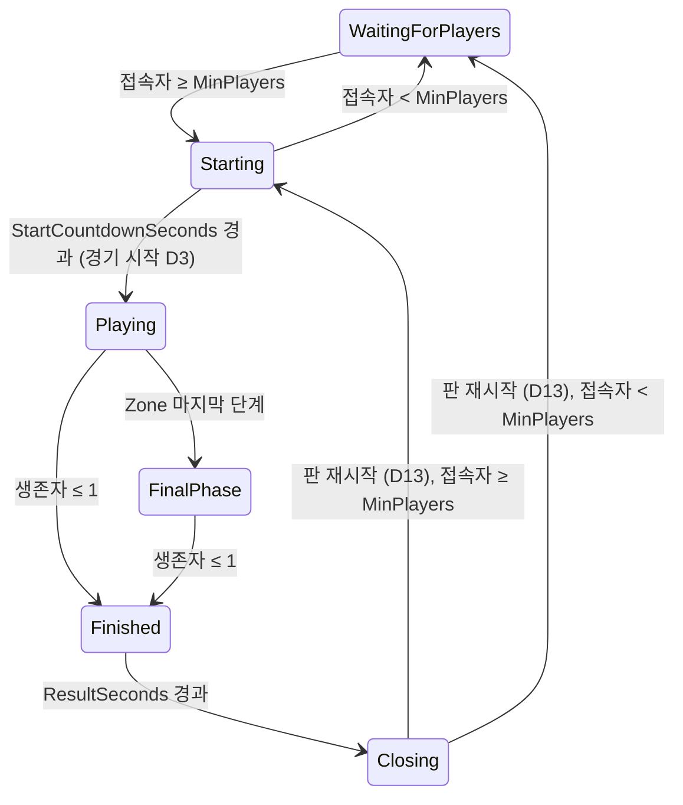

# Phase 5 Battle Royale Implementation Plan

> **For agentic workers:** REQUIRED SUB-SKILL: Use superpowers:subagent-driven-development (recommended) or superpowers:executing-plans to implement this plan task-by-task. Steps use checkbox (`- [ ]`) syntax for tracking.

**Goal:** 두 명 이상이 모이면 카운트다운 뒤 경기가 시작되고(모두 빈손으로 Spawn, Loot 새로 생성), 서버가 정한 Safe Zone이 단계별로 줄며 밖에 있으면 1초마다 Health를 깎고, 경기 중 사망은 영구적이라 죽은 사람은 관전한다. 살아 있는 사람이 1명 이하가 되면 서버가 승자·순위·처치 수를 정해 보내고, 결과 화면 뒤 다음 판이 자동으로 준비된다.

**Architecture:** `Match`(Game Loop 스레드)가 새로 `MatchFlow`(상태 기계·판 번호·참가자/생존자 수·피해/부활 허용)와 `SafeZone`(`zones.json` 단계와 시드 난수로 만든 원, 순수 계산)을 소유한다. `Match.Tick`은 ① 상태 전환(경기 시작·판 재시작은 그 Tick 안에서 끝) → ② Zone 진행·피해 → 기존 입력 처리(사망 시 순위 기록) → ⑤ 종료 판정 순서이고, 바뀐 `MatchState`·`ZoneState`를 Tick 끝에 Reliable로 보낸다. `DevRespawn`(기본 꺼짐)을 켜면 Phase 3·4 테스트 아레나 그대로다. Client는 `ZoneState`를 서버와 같은 식(`ZoneMath`)으로 보간해 원을 그리고(`ZoneView`), `MatchHud`가 상태·Zone 안내·결과를, `SpectatorCamera`가 원격 보간 위치로 관전 대상을 따라간다.

**Tech Stack:** .NET 10, C# (Shared·Client는 C# 9 / netstandard2.1), `System.Numerics`, `System.Text.Json`(새 NuGet 없음), xUnit, LiteNetLib 2.1.4, Unity 6000.3.24f1(URP, Input System, UGUI 2.0 Legacy `Text`), NUnit(EditMode).

**Spec:** `Docs/specs/2026-10-01-phase5-battle-royale-design.md` (결정 D1–D15는 확정. 아래 "Spec 해석"의 수정 사항은 이 계획이 따른다)

## Global Constraints

- 커밋하지 않는다. 각 Task의 마지막 단계는 "체크포인트"(검증 결과 기록)다. Commit·Push는 Phase가 끝난 뒤 사용자가 "푸시"를 입력했을 때만 `github-push` 스킬로 한다. Force Push는 하지 않는다.
- 모든 코드는 `.claude/skills/game-core-rules/SKILL.md`를 따른다. 우리 코드는 Lock을 쓰지 않는다. `MatchFlow`·`SafeZone`·플레이어의 Participant·Placement·Kills는 Game Loop 스레드만 만진다(`Match` 소유). 스레드 구조는 바꾸지 않는다.
- 판정 코드는 **Server에만** 둔다: `Server/src/ProjectH.Server/Game/Flow/`, `Game/Zone/`. Shared에는 패킷 DTO(`Shared/Runtime/Protocol/MatchPackets.cs`)만 추가한다(spec §5: Shared 예외를 넓히지 않는다). Client의 `ZoneMath`·`SpectatorTargets`는 표시용 계산이다.
- `Shared/Runtime`은 `netstandard2.1` + C# 9에서 컴파일되어야 한다. `UnityEngine` 참조 금지, `System.Numerics`만 사용. `record`·`init`·`Vector3` 인덱서 금지.
- `ProtocolConstants.ProtocolVersion = 5`. 새 패킷 `MatchState` 11 B(spec §3 + MinPlayers 1 B), `ZoneState` 36 B, `MatchResult` 6 B, `PlayerDied` 6 B(Placement 추가). 모든 패킷은 1200 B 이하이고 테스트로 고정한다. Snapshot은 바꾸지 않는다: 헤더 11 B + 수신자 블록 6 B + 엔티티 23 B × N, 50명 **1167 B**. 입력 명령 30 B, 입력 패킷 최대 92 B 그대로.
- 데이터(spec §1, D7): `zones.json` = initialCenter [0, 0], initialRadius 30, arenaHalfSize 19.5, 단계(대기 s, 축소 s, 목표 반지름, 초당 피해) 20/15/20/1, 15/12/12/2, 12/10/6/5, 10/8/2/10, 8/8/0/20. `ServerOptions`: `MinPlayers` 2(2–MaxPlayers), `StartCountdownSeconds` 10(1–300), `ResultSeconds` 10(1–300), `DevRespawn` false, `ZoneSeed` 1(≥ 0). `LootRespawnSeconds`는 `DevRespawn`일 때만 쓴다.
- Server Hot Path(Tick, Zone 진행·피해, 상태 전환 판정, 경기 패킷 송신)는 할당이 없고(테스트로 고정), 예외를 흐름 제어에 쓰지 않는다. 할당은 경기 시작 Tick의 `System.Random` 2개(Loot, Zone)뿐이다. JSON 예외는 시작 시에만 잡는다. `_sendBuffer`를 쓰는 `PacketWriter`를 다른 송신을 부를 수 있는 호출 너머로 들고 있지 않는다.
- Phase 0–4 동작을 유지한다: 누락 입력 유예(SimHz/2 동안 직전 입력 반복, 점프 제외, 행동은 실제 입력에서만), Join 1회, peer별 입력 상한 `SimHz × 2`/s, `MtuOverride = 1232`, 아레나 규칙(중앙 7 m 비움, 박스끼리 옆으로 맞닿지 않음), Lag Compensation(되감기 최대 400 ms, History 용량 − 1로 잘림), 조준은 입력마다 그 Step의 `PredictedPosition` 기준, ViewTick = 그 프레임 `_remotePlayers.Render`에 넘긴 `_renderTick`, 부활 때 Seq 유지, D12 좌클릭 규칙(잠그는 클릭은 발사 아님), `runInBackground`, `WeaponState` 재조정과 보유량 rebase, 아이템 보존(월드가 받은 뒤에만 인벤토리에서 빠진다), 1167 B Snapshot, 할당 없는 Tick.
- 기존 Phase 3·4 전투·Loot 테스트는 고치지 않고, 이미 쓰는 `ServerOptions` 초기화에 `DevRespawn = true`만 더해 그대로 통과시킨다(Task 3). 어떤 테스트도 약하게 만들지 않는다.
- Unity: Scene·Prefab·`.meta` 파일을 직접 만들거나 수정하지 않는다(새 `.cs`의 `.meta`는 Unity가 만든다. Shared UPM 패키지(`file:`)의 새 파일도 Unity가 `.meta`를 만든다). Unity가 생성한 `Client/*.csproj`는 건드리지 않는다. Hot Path(Update, LateUpdate, HUD, Zone 뷰, 관전)에서 LINQ·임시 컬렉션·캡처 람다·매 프레임 문자열 생성·`renderer.material`·`GetComponent` 금지(생성자에서만 `GetComponent`). `Physics.Raycast`는 단일 결과 버전만.
- Unity batchmode는 쓸 수 없다(사용자가 Editor를 열어 둔다). Client 검증은 (a) 스크래치 컴파일·NUnit 프로젝트, (b) Editor 자동 import 후 `Editor.log`의 새 줄에서 `error CS` 확인, (c) 사용자 수동 확인이다.
- Unity가 컴파일하는 코드(Shared·Client)는 Task 1·7·8이 바꾼다. 테스트를 먼저 쓰는 Step에서는 일부러 컴파일되지 않는 구간이 생긴다. Task 1 Step 0부터 Task 7의 Editor.log 확인 Step 전까지, 그리고 Task 8 Step 1부터 Task 8의 Editor.log 확인 Step 전까지 사용자에게 Unity Editor를 포커스하지 말아 달라고 요청한다. 그래도 로그에 `error CS`가 보이면, 그 뒤에 오류 없는 스크립트 컴파일이 다시 있었는지 보고 마지막 컴파일 결과만 판정한다.
- 명령은 저장소 루트(`E:/popol/ProjectH`)에서 실행한다. 서버 테스트 명령은 `dotnet test Server/ProjectH.Server.slnx`다. 각 Task의 "Expected" 테스트 수는 이 계획대로 적용했을 때의 수다(시작 기준 서버 444, Client NUnit 93).

## Review Focus

- 아무도 싸우지 않거나 Zone 데이터가 잘못된 경기 → 경기가 끝나지 않으면 서버가 영원히 `Playing`에 머문다. 마지막 원은 반지름 0이고 아프므로 spec Zone(약 2분) + 5초 안에 반드시 `Finished`가 된다. 끝나지 않는 `zones.json`(마지막 반지름 > 0 또는 피해 0)은 시작 시 거절된다 (Task 5 `NobodyFights_TheZoneStillEndsTheMatch`, Task 2 `InvalidData_IsRejected_WithAReason`의 "last phase" 두 경우).
- 마지막 두 명이 같은 Tick에 죽거나 순서대로 죽음 → 승자는 정확히 한 명이다. 생존자가 있으면 그 생존자, 모두 죽었으면 그 Tick에 마지막으로 처리된 사람(D9). Placement 1은 한 명뿐이다 (Task 5 `Kills_Placements_AndTheLastOneAliveWins`, `LastTwoDieInTheSameTick_TheOneProcessedLastWins`).
- 지기 직전에 접속을 끊음 → 탈락으로 처리된다. 인벤토리는 남은 사람에게 떨어지고, 생존자 수가 줄고, 남은 한 명이 다음 Tick에 이긴다. 이탈자는 결과를 받지 않는다 (Task 5 `Leaving_MidMatch_IsAnElimination_AndDropsTheInventory`, Task 6 `MatchResult_GoesToEachParticipant_WithItsOwnPlacementAndKills`).
- Client가 그리는 Zone 원이 서버 판정과 다름 → 안이라고 보이는데 피해를 받는다. Client `ZoneMath`는 받은 `ZoneState`만으로 서버 `SafeZone`과 같은 float를 낸다(경기 전체, 정수·소수 Tick, 밖 판정 포함) (Task 7 `ZoneMathParityTests.ClientCircle_EqualsTheServerCircle_ThroughAWholeMatch`).
- 판이 끝난 뒤 다음 판에 이전 판이 남음 → 떨어진 아이템, 죽은 상태, 참가자 표시, Zone이 남으면 다음 판이 불공정하다. `Closing`이 모든 아이템을 지우고(전원에게 `ItemRemoved`), 모두를 살려 Spawn에 두고, Zone을 끄고, 다음 카운트다운 동안 다시 피해가 없다 (Task 4 `RoundReset_ClearsItemsAndState_AndCountsDownTheNextRound`).

(spec §6이 이미 고정하는 경우는 제외했다: 경기 전 피해(Task 4 `BeforeTheMatch_ShotsHurtNobody`), Zone 안 무피해·Shield 무시(Task 5 `ZoneDamage_OutsideOncePerSecond_HealthOnly_AndPerPhase`), 원 포함·아레나 경계(Task 2 1000 시드), 카운트다운 중 인원 부족(Task 3 `PlayerLeavesDuringCountdown_BackToWaiting_AndTheNextCountdownStartsOver`). Snapshot 50명 1167 B는 기존 `Snapshot_WithMaxEntities_Is1167Bytes_AndFitsOneDatagram`이 바뀌지 않은 채로 계속 고정한다.)

## Spec 해석 (구현 전 확정)

spec을 코드에 옮기며 확정한 점이다. 1–4는 spec의 빈틈이나 결함을 고친 것이다(Spec fixes).

1. **`MatchState`에 `MinPlayers byte`를 더한다(11 B).** spec §3의 필드로는 HUD의 "Waiting for players 1/2"(D14)에서 2를 알 수 없다. 경기 전에는 `Alive`·`Participants`가 접속자 수다.
2. **`zones.json` 검증: 마지막 단계는 targetRadius 0, damagePerSecond > 0.** spec §1 검증은 피해 0·마지막 반지름 > 0을 허용해, 싸우지 않으면 끝나지 않는 경기를 만들 수 있었다(D7 "반지름 0까지 줄이면 경기가 반드시 끝난다"가 데이터로 보장되지 않음).
3. **반지름 0인 원은 안이 없다(`radius <= 0`이면 밖).** D8의 "수평 거리 > 반지름"만으로는 마지막 원의 정확한 중심에 선 사람이 피해를 받지 않는다. 서버 `SafeZone.IsOutside`와 Client `ZoneMath.IsOutside`가 같은 규칙을 쓴다.
4. **"Spectating <이름>"은 "Spectating Player <EntityId>"다.** 이름(DevPlayerId)은 Client에 전달되지 않는다. 이름 전송은 Persistence 단계 범위다.
5. **`DevRespawn = true`는 Phase 3·4 테스트 아레나 전체다(D4).** 상태 기계가 돌지 않고, 피해 항상·3초 부활·Loot는 서버 시작 때부터 있고 재생성되며(`LootRespawnSeconds`), 경기 패킷(`MatchState`·`ZoneState`·`MatchResult`)을 보내지 않는다. 그래야 기존 전투·Loot 테스트가 `DevRespawn = true` 하나로 그대로 통과한다(시작 텔레포트·경기 전 무피해에 걸리지 않음). Client는 `MatchState`를 받은 적이 없으면 Phase 4처럼 동작한다(부활 카운트다운).
6. **경기 시작·판 재시작의 이동은 `PlayerRespawned`(전원)다.** 서버는 기존 `Respawn`으로 모두를 Spawn에 옮기고(Seq 유지, 누락 입력 반복 초기화, History 초기화), Client는 부활과 같은 경로로 예측기를 맞춘다(spec §4 "부활 처리와 같은 방식").
7. **`Closing`은 한 Tick 안에서 끝나 Client에 보내지지 않는다(D1).** Client는 `Round`가 1 오른 `Starting` 또는 `WaitingForPlayers`를 받는다. 서버 테스트는 `MatchFlow`를 직접 돌려 `Closing`을 확인한다.
8. **경기 중 합류자(D10)**는 `Alive = false`, `Participant = false`로 들어오고, 본인에게만 `PlayerDied { VictimId = 자기, KillerId = 0, Placement = 0 }`를 Reliable로 받는다(Snapshot 생존 비트는 Sequenced라 판 재시작 이벤트보다 늦게 올 수 있어 신호로 쓰지 않는다). 생존자 수에 들지 않으므로 경기 종료를 막지 못한다.
9. **Zone 시간:** 단계 p의 피해는 그 단계의 대기와 축소 동안 적용된다. "1초마다" = 경기 시작 Tick부터 `SimHz` Tick마다(시작 Tick 자체는 제외), 판정 원은 그 Tick(`now`)의 원이다. 다음 단계의 대기는 이전 축소가 끝난 Tick부터 센다(호출 시각과 무관). 마지막 단계에 들어가는 순간 `FinalPhase`다(단계가 하나뿐이면 시작부터).
10. **Zone 중심(D6):** 이전 원 안의 허용 원판(반지름 = 이전 반지름 − 새 반지름)에서 균등하게 뽑고, 아레나 ±19.5 m를 벗어나면 다시 뽑는다(16회). 모두 실패하면 이전 중심(두 조건을 항상 만족)을 쓴다. 포함 검사는 저장되는 float로 한다.
11. **승자(D9):** 생존 참가자가 있으면 그 사람(Placement 1), 없으면 Placement 1(마지막 처리된 피해자). 1위가 이미 접속을 끊었으면 WinnerId 0. `MatchResult`는 종료 Tick에 접속 중인 참가자에게 보내고(관전 합류자·이탈자 제외), 그 Tick 끝의 `MatchState(Finished)`보다 먼저 간다.
12. **이탈(D10) 순서:** `PlayerDespawned`(남은 사람에게) → 탈락 처리(Placement 기록, 생존자 −1) → 인벤토리 Drop(남은 사람에게 `ItemSpawned`). 경기 밖(대기·결과·`DevRespawn`)의 이탈은 Phase 4처럼 떨어뜨리지 않는다.
13. **결과 화면(`Finished`)에도 피해가 없다**(`DamageAllowed = DevRespawn || Playing/FinalPhase`). 남은 사람이 시체를 쏴도 아무 일이 없고, 관전자도 맞지 않는다.
14. **시드:** Loot = `LootSeed + Round`, Zone = `ZoneSeed + Round`(unchecked). `Round`는 1부터, `Closing`마다 +1.
15. **Client 시각:** HUD 카운트다운·Zone 안내·Zone 원·밖 판정은 "렌더 Tick + 보간 지연"(서버 현재 Tick 추정)을 쓴다. 밖 판정 위치는 `PredictedPosition`이다. 표시용이고 피해는 서버가 정한다.
16. **Zone 식 일치 검증:** 서버 테스트 프로젝트가 Client의 `ZoneMath.cs`(UnityEngine 없음)를 테스트 전용으로 링크 컴파일해 `SafeZone`과 같은 입력으로 비교한다(`ZoneMathParityTests`). 서버 본체는 Client 코드를 참조하지 않는다. Client EditMode `ZoneMathTests`는 고정 입력의 기대값을 확인한다.
17. **관전 대상 규칙(D5)과 D12:** 대상 순서는 EntityId 오름차순(순환), 생존 여부는 원격 Snapshot 생존 비트. 처음엔 처치자(살아 있으면), Zone 사망·합류자는 첫 생존자부터. 죽어 있을 때 커서가 잠긴 상태의 좌클릭은 다음 대상으로 넘기기만 하고 발사하지 않으며, 버튼을 뗄 때까지 발사로 치지 않는다(누른 채 다음 판이 시작돼도 쏘지 않는다). 커서를 잠그는 클릭은 넘기지도 쏘지도 않는다.
18. **결과 문구:** "#1 VICTORY"(WinnerId = 나), 그 외 "ELIMINATED #3 — 2 kills"(1이면 "1 kill"). 결과는 `MatchResult`가 오면 보이고 다음 판의 대기·카운트다운이 오면 사라진다.
19. **통합 테스트의 짧은 설정(spec §6):** 카운트다운·결과는 1 s로 줄이지만 Zone은 spec 값을 쓴다. 짧은 Zone은 실제 UDP 테스트에서 처치보다 먼저 사람을 죽일 수 있어 결과가 흔들린다(첫 spec 원은 20초 동안 아레나 전체를 덮는다). 짧은 Zone(`ShortZonesJson`)은 Tick 단위로 도는 Match 테스트에서 쓴다.

---

## File Structure

| 경로 | 책임 |
|---|---|
| `Shared/Runtime/Protocol/MatchPackets.cs` (신규) | `MatchFlowState` enum, `MatchState`, `ZoneState`, `MatchResult` |
| `Shared/Runtime/Protocol/PacketId.cs`, `PacketReader.cs`, `ProtocolConstants.cs`, `CombatPackets.cs` | PacketId 19–21, 읽기 상한, 버전 5, `PlayerDied.Placement` |
| `Server/src/ProjectH.Server/zones.json` (신규), `ProjectH.Server.csproj`, `appsettings.json` | Zone 데이터와 출력 폴더 복사, 경기 설정 |
| `Server/src/ProjectH.Server/Game/Zone/ZoneData.cs` (신규) | `zones.json` 로드·검증, `ZonePhase` |
| `Server/src/ProjectH.Server/Game/Zone/SafeZone.cs` (신규) | 시드로 원 생성, 단계 진행, `Sample`·`IsOutside`·`ToWire` |
| `Server/src/ProjectH.Server/Game/Flow/MatchFlow.cs` (신규) | 상태 기계, 판 번호, 참가자·생존자 수, 순위, 피해·부활 허용 |
| `Server/src/ProjectH.Server/Game/GameData.cs`, `DataJson.cs` | Zone 데이터 포함 |
| `Server/src/ProjectH.Server/ServerOptions.cs` | MinPlayers, StartCountdownSeconds, ResultSeconds, DevRespawn, ZoneSeed |
| `Server/src/ProjectH.Server/Game/Match.cs`, `PlayerEntity.cs`, `Game/Items/LootSpawner.cs` | Tick 순서, 시작·재시작, 피해 차단, Zone 피해, 영구 사망·순위·처치·승자, 이탈·합류, 경기 패킷 송신 |
| `Server/tests/ProjectH.Server.Tests/TestGameData.cs`, `ProjectH.Server.Tests.csproj` | 테스트 Zone 데이터, Client `ZoneMath.cs` 링크 |
| `Server/tests/ProjectH.Server.Tests/Shared/MatchPacketTests.cs` (신규), `ProtocolConstantsTests.cs`, `PacketWriterReaderTests.cs` | 프로토콜 v5 |
| `Server/tests/ProjectH.Server.Tests/Game/ZoneDataTests.cs`, `SafeZoneTests.cs`, `MatchFlowTests.cs`, `MatchFlowMatchTests.cs`, `RoyaleHarness.cs`, `MatchStartTests.cs`, `MatchEliminationTests.cs`, `MatchPacketSendTests.cs`, `ZoneMathParityTests.cs` (모두 신규) | 서버 규칙 |
| `Server/tests/ProjectH.Server.Tests/Game/*Tests.cs`(Phase 3·4 Match 테스트 8개), `ItemCatalogTests.cs`, `ServerOptionsTests.cs` | `DevRespawn = true` 이전, GameData 인자, 옵션 검증 |
| `Server/tests/ProjectH.Server.Tests/Integration/HeadlessClient.cs`, `BattleRoyaleIntegrationTests.cs` (신규), `CombatIntegrationTests.cs`, `ItemIntegrationTests.cs`, `ServerIntegrationTests.cs` | 통합 |
| `Client/Assets/Scripts/Net/NetClient.cs` | 경기 이벤트 3종 |
| `Client/Assets/Scripts/Game/ZoneMath.cs`, `SpectatorTargets.cs`, `MatchHudText.cs` (신규) | 순수 계산: Zone 보간·밖 판정·안내, 관전 대상 규칙, HUD 문자열 캐시 |
| `Client/Assets/Scripts/Game/ZoneView.cs`, `MatchHud.cs`, `SpectatorCamera.cs` (신규), `RemotePlayers.cs`, `GameClient.cs` | Zone 표시, 경기 HUD, 관전, 연결 |
| `Client/Assets/Tests/EditMode/ZoneMathTests.cs`, `SpectatorTargetsTests.cs`, `MatchHudTextTests.cs` (신규) | EditMode |
| `Docs/Networking.md`, `Docs/Server.md`, `Docs/Client.md`, `Docs/Architecture.md`, `Docs/BattleRoyale.md` | 동작 변경 반영 |

스크래치 검증 프로젝트(저장소 밖, 수정해도 됨):

- 컴파일 확인: `C:/Users/aaa/AppData/Local/Temp/claude/e--popol-ProjectH/d2917085-fce9-4150-aedb-13ba1b855314/scratchpad/unitycompile/UnityCompile.csproj` — `Client/Assets/Scripts/**/*.cs`와 `Shared/Runtime/**/*.cs`를 netstandard2.1 / C# 9로 Unity DLL에 대해 컴파일한다. 새 스크립트는 glob으로 자동 포함된다.
- NUnit: `C:/Users/aaa/AppData/Local/Temp/claude/e--popol-ProjectH/d2917085-fce9-4150-aedb-13ba1b855314/scratchpad/predictortests/PredictorTests.csproj` — `Client/Assets/Tests/EditMode/*.cs` 전부와 **명시한 Client 소스만** + `Shared/Runtime/**/*.cs`를 `UnityEngine.CoreModule`만 참조해 net10.0에서 실행한다. 새 순수 소스(`ZoneMath.cs`, `SpectatorTargets.cs`, `MatchHudText.cs`)는 Task 7에서 이 csproj에 `<Compile Include>`를 추가한다.

서버 명령은 저장소 루트(`E:/popol/ProjectH`)에서 실행한다.

---

### Task 1: Protocol v5 (`MatchState`·`ZoneState`·`MatchResult`, `PlayerDied.Placement`, 버전 5)

**Files:**
- Create: `Shared/Runtime/Protocol/MatchPackets.cs`
- Modify: `Shared/Runtime/Protocol/PacketId.cs`, `Shared/Runtime/Protocol/PacketReader.cs`, `Shared/Runtime/Protocol/ProtocolConstants.cs`, `Shared/Runtime/Protocol/CombatPackets.cs`
- Test: `Server/tests/ProjectH.Server.Tests/Shared/MatchPacketTests.cs` (신규), `Server/tests/ProjectH.Server.Tests/Shared/ProtocolConstantsTests.cs`, `Server/tests/ProjectH.Server.Tests/Shared/PacketWriterReaderTests.cs`

**Interfaces:**
- Consumes: 기존 `PacketWriter`, `PacketReader`, `Finite.Check`(같은 어셈블리 internal)
- Produces:
  - `enum MatchFlowState : byte { WaitingForPlayers = 0, Starting = 1, Playing = 2, FinalPhase = 3, Finished = 4, Closing = 5 }`
  - `struct MatchState { MatchFlowState State; uint StateEndTick; byte Alive; byte Participants; ushort Round; byte MinPlayers; const int Size = 11; static Write(ref PacketWriter, in MatchState); static bool TryRead(ref PacketReader, out MatchState); bool SameAs(in MatchState) }`
  - `struct ZoneState { byte Phase; float FromX, FromZ, FromRadius, ToX, ToZ, ToRadius; uint ShrinkStartTick, ShrinkEndTick; ushort DamagePerSecond; const int Size = 36; Write; TryRead; bool SameAs(in ZoneState) }`
  - `struct MatchResult { ushort WinnerId; byte Placement; byte Kills; byte Participants; const int Size = 6; Write; TryRead }`
  - `PlayerDied.Placement` (byte, 패킷 6 B), `PacketId.MatchState = 19`, `ZoneState = 20`, `MatchResult = 21`, `ProtocolConstants.ProtocolVersion = 5`

- [ ] **Step 0: Editor.log 기준선 기록 (코드 수정 전)**

이 Task부터 Unity가 컴파일하는 코드(Shared)를 고친다. `Editor.log`는 세션 동안 누적되므로 수정 전 줄 수를 기록해 두고, Task 7의 Editor.log 확인 Step에서 이 줄 이후만 검사한다. 사용자에게 Task 7의 확인 Step 전까지 Unity Editor를 포커스하지 말아 달라고 요청한다.

```bash
LOG="$LOCALAPPDATA/Unity/Editor/Editor.log"; wc -l < "$LOG"
```

출력을 `N0`으로 기록한다.

- [ ] **Step 1: 실패하는 테스트 작성**

새 패킷 3종의 왕복·크기·잘린 패킷·잘못된 값, `PlayerDied`의 Placement, 버전 5, PacketId 범위를 고정한다.

`Server/tests/ProjectH.Server.Tests/Shared/MatchPacketTests.cs`:

```csharp
using System;
using ProjectH.Shared.Protocol;
using Xunit;

namespace ProjectH.Server.Tests.Shared;

// Phase 5 spec §3: MatchState, ZoneState, MatchResult and the Placement byte of PlayerDied.
public class MatchPacketTests
{
    private readonly byte[] _buffer = new byte[ProtocolConstants.MaxPacketSize];

    private PacketReader ReaderAfterId(int length, PacketId expected)
    {
        var reader = new PacketReader(_buffer.AsSpan(0, length));
        Assert.True(reader.TryReadPacketId(out PacketId id));
        Assert.Equal(expected, id);
        return reader;
    }

    private static ZoneState SampleZone() => new ZoneState
    {
        Phase = 3,
        FromX = 1.5f,
        FromZ = -2.25f,
        FromRadius = 12f,
        ToX = 3f,
        ToZ = -4f,
        ToRadius = 6f,
        ShrinkStartTick = 1000,
        ShrinkEndTick = 1300,
        DamagePerSecond = 5,
    };

    [Fact]
    public void MatchState_RoundTrip_Is11Bytes()
    {
        var writer = new PacketWriter(_buffer);
        MatchState.Write(ref writer, new MatchState
        {
            State = MatchFlowState.Starting, StateEndTick = 123456, Alive = 3, Participants = 5, Round = 7, MinPlayers = 2,
        });
        Assert.Equal(MatchState.Size, writer.Length);
        Assert.Equal(11, writer.Length);

        var reader = ReaderAfterId(writer.Length, PacketId.MatchState);
        Assert.True(MatchState.TryRead(ref reader, out var s));
        Assert.Equal(MatchFlowState.Starting, s.State);
        Assert.Equal(123456u, s.StateEndTick);
        Assert.Equal(3, s.Alive);
        Assert.Equal(5, s.Participants);
        Assert.Equal(7, s.Round);
        Assert.Equal(2, s.MinPlayers);
    }

    [Fact]
    public void MatchState_UnknownStateOrMoreAliveThanParticipants_IsRejected()
    {
        var writer = new PacketWriter(_buffer);
        MatchState.Write(ref writer, new MatchState { State = (MatchFlowState)6, Alive = 1, Participants = 1 });
        var reader = ReaderAfterId(writer.Length, PacketId.MatchState);
        Assert.False(MatchState.TryRead(ref reader, out _));

        writer = new PacketWriter(_buffer);
        MatchState.Write(ref writer, new MatchState { State = MatchFlowState.Playing, Alive = 3, Participants = 2 });
        reader = ReaderAfterId(writer.Length, PacketId.MatchState);
        Assert.False(MatchState.TryRead(ref reader, out _));
    }

    [Fact]
    public void ZoneState_RoundTrip_Is36Bytes()
    {
        var writer = new PacketWriter(_buffer);
        ZoneState.Write(ref writer, SampleZone());
        Assert.Equal(ZoneState.Size, writer.Length);
        Assert.Equal(36, writer.Length);

        var reader = ReaderAfterId(writer.Length, PacketId.ZoneState);
        Assert.True(ZoneState.TryRead(ref reader, out var z));
        Assert.True(z.SameAs(SampleZone()));
        Assert.Equal(3, z.Phase);
        Assert.Equal(-2.25f, z.FromZ);
        Assert.Equal(1300u, z.ShrinkEndTick);
        Assert.Equal(5, z.DamagePerSecond);
    }

    [Fact]
    public void ZoneState_NonFiniteNegativeRadiusOrReversedTicks_IsRejected()
    {
        ZoneState[] bad =
        {
            SampleZone(), SampleZone(), SampleZone(), SampleZone(),
        };
        bad[0].FromX = float.NaN;
        bad[1].ToRadius = float.PositiveInfinity;
        bad[2].FromRadius = -1f;
        bad[3].ShrinkEndTick = bad[3].ShrinkStartTick - 1;
        foreach (ZoneState zone in bad)
        {
            var writer = new PacketWriter(_buffer);
            ZoneState.Write(ref writer, zone);
            var reader = ReaderAfterId(writer.Length, PacketId.ZoneState);
            Assert.False(ZoneState.TryRead(ref reader, out _));
        }
    }

    [Fact]
    public void MatchResult_RoundTrip_Is6Bytes()
    {
        var writer = new PacketWriter(_buffer);
        MatchResult.Write(ref writer, new MatchResult { WinnerId = 4, Placement = 2, Kills = 3, Participants = 5 });
        Assert.Equal(MatchResult.Size, writer.Length);
        Assert.Equal(6, writer.Length);

        var reader = ReaderAfterId(writer.Length, PacketId.MatchResult);
        Assert.True(MatchResult.TryRead(ref reader, out var r));
        Assert.Equal(4, r.WinnerId);
        Assert.Equal(2, r.Placement);
        Assert.Equal(3, r.Kills);
        Assert.Equal(5, r.Participants);
    }

    [Theory]
    [InlineData(0, 5)]   // placement 0 is "no placement", never a result
    [InlineData(6, 5)]   // below the last place
    public void MatchResult_PlacementOutsideTheField_IsRejected(byte placement, byte participants)
    {
        var writer = new PacketWriter(_buffer);
        MatchResult.Write(ref writer, new MatchResult { WinnerId = 1, Placement = placement, Participants = participants });
        var reader = ReaderAfterId(writer.Length, PacketId.MatchResult);
        Assert.False(MatchResult.TryRead(ref reader, out _));
    }

    [Fact]
    public void PlayerDied_CarriesPlacement_In6Bytes()
    {
        var writer = new PacketWriter(_buffer);
        PlayerDied.Write(ref writer, new PlayerDied { VictimId = 2, KillerId = 0, Placement = 4 });
        Assert.Equal(6, writer.Length);
        var reader = ReaderAfterId(writer.Length, PacketId.PlayerDied);
        Assert.True(PlayerDied.TryRead(ref reader, out var died));
        Assert.Equal(2, died.VictimId);
        Assert.Equal(0, died.KillerId);
        Assert.Equal(4, died.Placement);
    }

    [Fact]
    public void TruncatedMatchPackets_AreRejected()
    {
        var shortState = new PacketReader(new byte[MatchState.Size - 2]);
        Assert.False(MatchState.TryRead(ref shortState, out _));
        var shortZone = new PacketReader(new byte[ZoneState.Size - 2]);
        Assert.False(ZoneState.TryRead(ref shortZone, out _));
        var shortResult = new PacketReader(new byte[MatchResult.Size - 2]);
        Assert.False(MatchResult.TryRead(ref shortResult, out _));
        var shortDied = new PacketReader(new byte[4]);   // the v4 layout, without Placement
        Assert.False(PlayerDied.TryRead(ref shortDied, out _));
    }

    // Spec §3: every packet fits one datagram. The new ones are fixed size.
    [Fact]
    public void MatchPackets_FitOneDatagram()
    {
        Assert.True(MatchState.Size <= ProtocolConstants.MaxPacketSize);
        Assert.True(ZoneState.Size <= ProtocolConstants.MaxPacketSize);
        Assert.True(MatchResult.Size <= ProtocolConstants.MaxPacketSize);
    }
}
```

`Server/tests/ProjectH.Server.Tests/Shared/ProtocolConstantsTests.cs`:

변경 — 찾을 코드:

```csharp
    }

    [Fact]
    public void ProtocolVersion_IsFour()
    {
        // Phase 4 changed the input command and the weapon catalog and added item packets; v3 clients
        // must be rejected at connect.
        Assert.Equal((ushort)4, ProtocolConstants.ProtocolVersion);
    }
}
```

바꿀 코드:

```csharp
    }

    [Fact]
    public void ProtocolVersion_IsFive()
    {
        // Phase 5 added the match packets and Placement in PlayerDied; v4 clients must be rejected at connect.
        Assert.Equal((ushort)5, ProtocolConstants.ProtocolVersion);
    }
}
```

`Server/tests/ProjectH.Server.Tests/Shared/PacketWriterReaderTests.cs`:

변경 1/2 — 찾을 코드:

```csharp

    [Theory]
    [InlineData(0)]
    [InlineData(19)]   // one above PacketId.PickupResult
    [InlineData(255)]
    public void PacketId_OutOfRange_IsRejected(byte raw)
    {
```

바꿀 코드:

```csharp

    [Theory]
    [InlineData(0)]
    [InlineData(22)]   // one above PacketId.MatchResult
    [InlineData(255)]
    public void PacketId_OutOfRange_IsRejected(byte raw)
    {
```

변경 2/2 — 찾을 코드:

```csharp
    [InlineData(PacketId.PlayerRespawned)]
    [InlineData(PacketId.ItemCatalog)]
    [InlineData(PacketId.PickupResult)]
    public void PacketId_InRange_IsAccepted(PacketId expected)
    {
        var reader = new PacketReader(new[] { (byte)expected });
```

바꿀 코드:

```csharp
    [InlineData(PacketId.PlayerRespawned)]
    [InlineData(PacketId.ItemCatalog)]
    [InlineData(PacketId.PickupResult)]
    [InlineData(PacketId.MatchState)]
    [InlineData(PacketId.MatchResult)]
    public void PacketId_InRange_IsAccepted(PacketId expected)
    {
        var reader = new PacketReader(new[] { (byte)expected });
```

- [ ] **Step 2: 테스트 실패 확인**

Run: `dotnet test Server/ProjectH.Server.slnx`
Expected: 빌드 실패 — `MatchState`, `ZoneState`, `MatchResult`, `MatchFlowState`, `PacketId.MatchState`, `PlayerDied.Placement`가 없다(CS0103/CS0117/CS0246).

- [ ] **Step 3: 패킷 구현**

`Shared/Runtime/Protocol/MatchPackets.cs`:

```csharp
namespace ProjectH.Shared.Protocol
{
    // Phase 5 (D1): the match state machine. The values are the wire format.
    public enum MatchFlowState : byte
    {
        WaitingForPlayers = 0,
        Starting = 1,
        Playing = 2,
        FinalPhase = 3,
        Finished = 4,
        Closing = 5,
    }

    // S->C, ReliableOrdered, to everyone whenever a field changes, and to a newcomer at join (D11).
    // Before the match (WaitingForPlayers, Starting) Alive and Participants are the connected player count;
    // from Playing on they are the living participants and the participants at the start.
    // StateEndTick is the server tick the state ends at (Starting, Finished), 0 when it has no timer.
    // MinPlayers lets the client show "Waiting for players 1/2".
    public struct MatchState
    {
        public const int Size = 11;   // with the packet id

        public MatchFlowState State;
        public uint StateEndTick;
        public byte Alive;
        public byte Participants;
        public ushort Round;
        public byte MinPlayers;

        public static void Write(ref PacketWriter writer, in MatchState s)
        {
            writer.WriteByte((byte)PacketId.MatchState);
            writer.WriteByte((byte)s.State);
            writer.WriteUInt32(s.StateEndTick);
            writer.WriteByte(s.Alive);
            writer.WriteByte(s.Participants);
            writer.WriteUInt16(s.Round);
            writer.WriteByte(s.MinPlayers);
        }

        public static bool TryRead(ref PacketReader reader, out MatchState s)
        {
            s = default;
            if (reader.Remaining < Size - 1) return false;
            reader.TryReadByte(out byte state);
            if (state > (byte)MatchFlowState.Closing) return false;
            s.State = (MatchFlowState)state;
            reader.TryReadUInt32(out s.StateEndTick);
            reader.TryReadByte(out s.Alive);
            reader.TryReadByte(out s.Participants);
            reader.TryReadUInt16(out s.Round);
            reader.TryReadByte(out s.MinPlayers);
            return s.Alive <= s.Participants;
        }

        public bool SameAs(in MatchState other) =>
            State == other.State && StateEndTick == other.StateEndTick && Alive == other.Alive &&
            Participants == other.Participants && Round == other.Round && MinPlayers == other.MinPlayers;
    }

    // S->C, ReliableOrdered, to everyone when the zone phase changes, and to a newcomer at join (D11).
    // Phase 0 = no zone (before the match): From = To = the first circle. During phase p (1-based) the circle
    // is From until ShrinkStartTick, moves linearly to To until ShrinkEndTick, then stays To. Both sides
    // interpolate with the same formula (server SafeZone.Sample, client ZoneMath.Sample), so the circle is
    // never sent per snapshot. Centers are on the ground plane: X and Z.
    public struct ZoneState
    {
        public const int Size = 36;   // with the packet id

        public byte Phase;
        public float FromX;
        public float FromZ;
        public float FromRadius;
        public float ToX;
        public float ToZ;
        public float ToRadius;
        public uint ShrinkStartTick;
        public uint ShrinkEndTick;
        public ushort DamagePerSecond;

        public static void Write(ref PacketWriter writer, in ZoneState z)
        {
            writer.WriteByte((byte)PacketId.ZoneState);
            writer.WriteByte(z.Phase);
            writer.WriteSingle(z.FromX);
            writer.WriteSingle(z.FromZ);
            writer.WriteSingle(z.FromRadius);
            writer.WriteSingle(z.ToX);
            writer.WriteSingle(z.ToZ);
            writer.WriteSingle(z.ToRadius);
            writer.WriteUInt32(z.ShrinkStartTick);
            writer.WriteUInt32(z.ShrinkEndTick);
            writer.WriteUInt16(z.DamagePerSecond);
        }

        public static bool TryRead(ref PacketReader reader, out ZoneState z)
        {
            z = default;
            if (reader.Remaining < Size - 1) return false;
            reader.TryReadByte(out z.Phase);
            reader.TryReadSingle(out z.FromX);
            reader.TryReadSingle(out z.FromZ);
            reader.TryReadSingle(out z.FromRadius);
            reader.TryReadSingle(out z.ToX);
            reader.TryReadSingle(out z.ToZ);
            reader.TryReadSingle(out z.ToRadius);
            reader.TryReadUInt32(out z.ShrinkStartTick);
            reader.TryReadUInt32(out z.ShrinkEndTick);
            reader.TryReadUInt16(out z.DamagePerSecond);
            return Finite.Check(z.FromX) && Finite.Check(z.FromZ) && Finite.Check(z.FromRadius) && z.FromRadius >= 0f &&
                   Finite.Check(z.ToX) && Finite.Check(z.ToZ) && Finite.Check(z.ToRadius) && z.ToRadius >= 0f &&
                   z.ShrinkEndTick >= z.ShrinkStartTick;
        }

        public bool SameAs(in ZoneState other) =>
            Phase == other.Phase && FromX == other.FromX && FromZ == other.FromZ && FromRadius == other.FromRadius &&
            ToX == other.ToX && ToZ == other.ToZ && ToRadius == other.ToRadius &&
            ShrinkStartTick == other.ShrinkStartTick && ShrinkEndTick == other.ShrinkEndTick &&
            DamagePerSecond == other.DamagePerSecond;
    }

    // S->C, ReliableOrdered, to each participant still connected when the match finishes (D9, D11).
    // WinnerId 0 = no winner among the connected players (the last one left). Placement 1 = the winner.
    public struct MatchResult
    {
        public const int Size = 6;   // with the packet id

        public ushort WinnerId;
        public byte Placement;
        public byte Kills;
        public byte Participants;

        public static void Write(ref PacketWriter writer, in MatchResult r)
        {
            writer.WriteByte((byte)PacketId.MatchResult);
            writer.WriteUInt16(r.WinnerId);
            writer.WriteByte(r.Placement);
            writer.WriteByte(r.Kills);
            writer.WriteByte(r.Participants);
        }

        public static bool TryRead(ref PacketReader reader, out MatchResult r)
        {
            r = default;
            if (reader.Remaining < Size - 1) return false;
            reader.TryReadUInt16(out r.WinnerId);
            reader.TryReadByte(out r.Placement);
            reader.TryReadByte(out r.Kills);
            reader.TryReadByte(out r.Participants);
            return r.Placement >= 1 && r.Placement <= r.Participants;
        }
    }
}
```

`Shared/Runtime/Protocol/PacketId.cs`:

변경 — 찾을 코드:

```csharp
        ItemRemoved = 16,
        InventoryState = 17,
        PickupResult = 18,
    }
}
```

바꿀 코드:

```csharp
        ItemRemoved = 16,
        InventoryState = 17,
        PickupResult = 18,
        MatchState = 19,
        ZoneState = 20,
        MatchResult = 21,
    }
}
```

`Shared/Runtime/Protocol/PacketReader.cs`:

변경 — 찾을 코드:

```csharp
            id = PacketId.None;
            if (!TryReadByte(out byte raw)) return false;
            // Upper bound is the highest id in PacketId; raise it whenever a packet is added.
            if (raw < (byte)PacketId.JoinMatchRequest || raw > (byte)PacketId.PickupResult) return false;
            id = (PacketId)raw;
            return true;
        }
```

바꿀 코드:

```csharp
            id = PacketId.None;
            if (!TryReadByte(out byte raw)) return false;
            // Upper bound is the highest id in PacketId; raise it whenever a packet is added.
            if (raw < (byte)PacketId.JoinMatchRequest || raw > (byte)PacketId.MatchResult) return false;
            id = (PacketId)raw;
            return true;
        }
```

`Shared/Runtime/Protocol/ProtocolConstants.cs`:

변경 — 찾을 코드:

```csharp
        // Bump whenever any packet layout changes; the server rejects other versions at connect time.
        // 2: Phase 1 box collision changed movement results. 3: Phase 3 combat (aim in inputs, snapshot flags and self block, combat packets).
        // 4: Phase 4 inventory (2-byte buttons, ammo type in the weapon catalog, item packets).
        public const ushort ProtocolVersion = 4;

        public const int MaxDevPlayerIdBytes = 32;
        public const int MaxInputsPerPacket = 3;
```

바꿀 코드:

```csharp
        // Bump whenever any packet layout changes; the server rejects other versions at connect time.
        // 2: Phase 1 box collision changed movement results. 3: Phase 3 combat (aim in inputs, snapshot flags and self block, combat packets).
        // 4: Phase 4 inventory (2-byte buttons, ammo type in the weapon catalog, item packets).
        // 5: Phase 5 battle royale (MatchState, ZoneState, MatchResult, Placement in PlayerDied).
        public const ushort ProtocolVersion = 5;

        public const int MaxDevPlayerIdBytes = 32;
        public const int MaxInputsPerPacket = 3;
```

`Shared/Runtime/Protocol/CombatPackets.cs`:

변경 — 찾을 코드:

```csharp

    // S->C, ReliableOrdered, to everyone. Same channel as PlayerRespawned, so a client always sees a
    // death before the matching respawn.
    public struct PlayerDied
    {
        public ushort VictimId;
        public ushort KillerId;

        public static void Write(ref PacketWriter writer, in PlayerDied d)
        {
            writer.WriteByte((byte)PacketId.PlayerDied);
            writer.WriteUInt16(d.VictimId);
            writer.WriteUInt16(d.KillerId);
        }

        public static bool TryRead(ref PacketReader reader, out PlayerDied d)
        {
            d = default;
            if (reader.Remaining < 4) return false;
            reader.TryReadUInt16(out d.VictimId);
            reader.TryReadUInt16(out d.KillerId);
            return true;
        }
    }
```

바꿀 코드:

```csharp

    // S->C, ReliableOrdered, to everyone. Same channel as PlayerRespawned, so a client always sees a
    // death before the matching respawn.
    // KillerId 0 = no killer (the zone, Phase 5 D8). Placement (Phase 5 D11) = living participants left + 1
    // during a match, 0 outside one (dev respawn mode, or a newcomer told it is spectating).
    public struct PlayerDied
    {
        public ushort VictimId;
        public ushort KillerId;
        public byte Placement;

        public static void Write(ref PacketWriter writer, in PlayerDied d)
        {
            writer.WriteByte((byte)PacketId.PlayerDied);
            writer.WriteUInt16(d.VictimId);
            writer.WriteUInt16(d.KillerId);
            writer.WriteByte(d.Placement);
        }

        public static bool TryRead(ref PacketReader reader, out PlayerDied d)
        {
            d = default;
            if (reader.Remaining < 5) return false;
            reader.TryReadUInt16(out d.VictimId);
            reader.TryReadUInt16(out d.KillerId);
            reader.TryReadByte(out d.Placement);
            return true;
        }
    }
```

서버의 `Match.Kill`은 아직 Placement를 채우지 않는다(기본값 0, Task 5에서 채운다). `HeadlessClient`와 Unity `NetClient`는 새 패킷을 아직 읽지 않고, `TryReadPacketId`가 19–21을 받아도 `switch`에 없으므로 무시한다.

- [ ] **Step 4: 테스트 통과 확인**

Run: `dotnet test Server/ProjectH.Server.slnx`
Expected: 빌드 성공(경고 0), 456개 PASS

- [ ] **Step 5: Client 스크래치 컴파일 (Shared 변경)**

Run: `dotnet build "C:/Users/aaa/AppData/Local/Temp/claude/e--popol-ProjectH/d2917085-fce9-4150-aedb-13ba1b855314/scratchpad/unitycompile/UnityCompile.csproj"`
Expected: 경고 0, 오류 0

Run: `dotnet test "C:/Users/aaa/AppData/Local/Temp/claude/e--popol-ProjectH/d2917085-fce9-4150-aedb-13ba1b855314/scratchpad/predictortests/PredictorTests.csproj"`
Expected: 93개 PASS

- [ ] **Step 6: 체크포인트**

결과와 `N0`을 기록한다. 커밋하지 않는다.

---

### Task 2: Zone 데이터와 `SafeZone` (`zones.json`, `ZoneData`, `SafeZone`, `GameData`)

**Files:**
- Create: `Server/src/ProjectH.Server/zones.json`, `Server/src/ProjectH.Server/Game/Zone/ZoneData.cs`, `Server/src/ProjectH.Server/Game/Zone/SafeZone.cs`
- Modify: `Server/src/ProjectH.Server/ProjectH.Server.csproj`, `Server/src/ProjectH.Server/Game/GameData.cs`, `Server/src/ProjectH.Server/Game/DataJson.cs`
- Test: `Server/tests/ProjectH.Server.Tests/Game/ZoneDataTests.cs` (신규), `Server/tests/ProjectH.Server.Tests/Game/SafeZoneTests.cs` (신규), `Server/tests/ProjectH.Server.Tests/TestGameData.cs`, `Server/tests/ProjectH.Server.Tests/Game/ItemCatalogTests.cs`

**Interfaces:**
- Consumes: Task 1의 `ZoneState`; 기존 `DataJson.TryTicks`, `DataJson.TryDeserialize`
- Produces:
  - `readonly struct ZonePhase(uint WaitTicks, uint ShrinkTicks, float TargetRadius, ushort DamagePerSecond)`
  - `sealed class ZoneData` — `const int MaxPhases = 16`; `Vector2 InitialCenter`(X = 월드 X, Y = 월드 Z), `float InitialRadius`, `float ArenaHalfSize`, `int PhaseCount`, `int SimHz`, `ZonePhase Phase(int index)`(0 = 1단계), `static ZoneData LoadFile(string path, int simHz)`, `static bool TryParse(string json, int simHz, out ZoneData? data, out string? error)`
  - `sealed class SafeZone(ZoneData data)` — `int Phase`(0 = Zone 없음, 1..PhaseCount), `uint ShrinkStartTick`, `uint ShrinkEndTick`, `int PhaseCount`, `bool IsFinalPhase`, `ushort DamagePerSecond`, `float CenterX(int circle)`, `CenterZ(int)`, `Radius(int)`, `void Reset()`, `void Start(uint startTick, int seed)`, `bool Advance(uint now)`, `void Sample(double tick, out float centerX, out float centerZ, out float radius)`, `bool IsOutside(Vector3 position, double tick)`, `ZoneState ToWire()`
  - `GameData(WeaponCatalog, ItemCatalog, LootTable, ZoneData zones)`, `GameData.Zones`, `GameData.ZonesFile = "zones.json"`
  - 테스트: `TestGameData.ZonesJson`(spec §1), `TestGameData.ShortZonesJson`(1 s 대기·축소 2단계: 반지름 10·피해 10, 반지름 0·피해 50), `ShortPhase1Damage = 10`, `ShortPhase2Damage = 50`, `TestGameData.Zones(int simHz = 30, string json = ZonesJson)`, `TestGameData.Create(..., string zonesJson = ZonesJson)`

- [ ] **Step 1: 실패하는 테스트 작성**

`zones.json` 로드·검증(정상, 반지름 증가·유지, 음수·0 시간, 음수 반지름·피해, 빈 목록, 17단계, 끝나지 않는 마지막 단계, 아레나 밖 중심)과 실제 파일 = spec 값, 그리고 `SafeZone`의 시드 재현·1000 시드 포함/경계·선형 보간·단계 일정·반지름 0·할당 없음을 고정한다.

`Server/tests/ProjectH.Server.Tests/TestGameData.cs`:

변경 1/3 — 찾을 코드:

```csharp
using System;
using ProjectH.Server.Game;
using ProjectH.Server.Game.Items;

namespace ProjectH.Server.Tests;
```

바꿀 코드:

```csharp
using System;
using ProjectH.Server.Game;
using ProjectH.Server.Game.Items;
using ProjectH.Server.Game.Zone;

namespace ProjectH.Server.Tests;
```

변경 2/3 — 찾을 코드:

```csharp
        }
        """;

    public static ItemCatalog Items(int simHz = 30)
    {
        if (!ItemCatalog.TryParse(ItemsJson, simHz, out var items, out string? error))
```

바꿀 코드:

```csharp
        }
        """;

    // Spec §1 zones.json (D7).
    public const string ZonesJson = """
        {
          "initialCenter": [0, 0],
          "initialRadius": 30,
          "arenaHalfSize": 19.5,
          "phases": [
            {"waitSeconds":20,"shrinkSeconds":15,"targetRadius":20,"damagePerSecond":1},
            {"waitSeconds":15,"shrinkSeconds":12,"targetRadius":12,"damagePerSecond":2},
            {"waitSeconds":12,"shrinkSeconds":10,"targetRadius":6,"damagePerSecond":5},
            {"waitSeconds":10,"shrinkSeconds":8,"targetRadius":2,"damagePerSecond":10},
            {"waitSeconds":8,"shrinkSeconds":8,"targetRadius":0,"damagePerSecond":20}
          ]
        }
        """;

    // Short phases for match tests (spec §6 "짧은 테스트용 Zone"): 1 s waits and shrinks, the whole zone is over
    // 4 s after the start, and the last phase kills 100 health in 2 s.
    public const int ShortPhase1Damage = 10;
    public const int ShortPhase2Damage = 50;
    public const string ShortZonesJson = """
        {
          "initialCenter": [0, 0],
          "initialRadius": 30,
          "arenaHalfSize": 19.5,
          "phases": [
            {"waitSeconds":1,"shrinkSeconds":1,"targetRadius":10,"damagePerSecond":10},
            {"waitSeconds":1,"shrinkSeconds":1,"targetRadius":0,"damagePerSecond":50}
          ]
        }
        """;

    public static ZoneData Zones(int simHz = 30, string json = ZonesJson)
    {
        if (!ZoneData.TryParse(json, simHz, out var zones, out string? error))
            throw new InvalidOperationException("Test zones are invalid: " + error);
        return zones!;
    }

    public static ItemCatalog Items(int simHz = 30)
    {
        if (!ItemCatalog.TryParse(ItemsJson, simHz, out var items, out string? error))
```

변경 3/3 — 찾을 코드:

```csharp
        return loot!;
    }

    public static GameData Create(int simHz = 30, float autoRange = 100f, string lootJson = LootJson)
    {
        ItemCatalog items = Items(simHz);
        return new GameData(TestWeapons.Create(simHz, autoRange), items, Loot(items, lootJson));
    }
}
```

바꿀 코드:

```csharp
        return loot!;
    }

    public static GameData Create(int simHz = 30, float autoRange = 100f, string lootJson = LootJson, string zonesJson = ZonesJson)
    {
        ItemCatalog items = Items(simHz);
        return new GameData(TestWeapons.Create(simHz, autoRange), items, Loot(items, lootJson), Zones(simHz, zonesJson));
    }
}
```

`Server/tests/ProjectH.Server.Tests/Game/ItemCatalogTests.cs` (`GameData` 생성자에 Zone 인자):

변경 1/2 — 찾을 코드:

```csharp
    public void GameData_RejectsCatalogsBuiltForDifferentSimHz()
    {
        var items = TestGameData.Items(simHz: 60);
        Assert.Throws<ArgumentException>(() => new GameData(TestWeapons.Create(simHz: 30), items, TestGameData.Loot(items)));
    }

    // D5 "all references exist": a table named by a LootPoint must be in loot.json.
```

바꿀 코드:

```csharp
    public void GameData_RejectsCatalogsBuiltForDifferentSimHz()
    {
        var items = TestGameData.Items(simHz: 60);
        Assert.Throws<ArgumentException>(() => new GameData(TestWeapons.Create(simHz: 30), items, TestGameData.Loot(items), TestGameData.Zones()));
    }

    // D5 "all references exist": a table named by a LootPoint must be in loot.json.
```

변경 2/2 — 찾을 코드:

```csharp
            { "rarityWeights": { "Common": 1, "Uncommon": 1, "Rare": 1, "Epic": 1, "Legendary": 1 },
              "tables": { "Floor": [ { "kind": "Ammo", "weight": 1 } ] } }
            """);
        var ex = Assert.Throws<ArgumentException>(() => new GameData(TestWeapons.Create(), items, noTower));
        Assert.Contains("Tower", ex.Message);
    }
}
```

바꿀 코드:

```csharp
            { "rarityWeights": { "Common": 1, "Uncommon": 1, "Rare": 1, "Epic": 1, "Legendary": 1 },
              "tables": { "Floor": [ { "kind": "Ammo", "weight": 1 } ] } }
            """);
        var ex = Assert.Throws<ArgumentException>(() => new GameData(TestWeapons.Create(), items, noTower, TestGameData.Zones()));
        Assert.Contains("Tower", ex.Message);
    }
}
```

`Server/tests/ProjectH.Server.Tests/Game/ZoneDataTests.cs`:

```csharp
using System;
using System.IO;
using ProjectH.Server.Game;
using ProjectH.Server.Game.Zone;
using Xunit;

namespace ProjectH.Server.Tests.Game;

// Spec §1: zones.json loading and validation. A bad file stops the server at startup.
public class ZoneDataTests
{
    private static string Json(string phases, string initialRadius = "30", string center = "[0, 0]", string half = "19.5") => $$"""
        { "initialCenter": {{center}}, "initialRadius": {{initialRadius}}, "arenaHalfSize": {{half}}, "phases": [ {{phases}} ] }
        """;

    private static string Phase(int radius) => $$"""{"waitSeconds":1,"shrinkSeconds":1,"targetRadius":{{radius}},"damagePerSecond":1}, """;

    private const string Last = """{"waitSeconds":8,"shrinkSeconds":8,"targetRadius":0,"damagePerSecond":20}""";

    [Fact]
    public void ShippedFile_MatchesTheSpec()
    {
        // The server copies zones.json next to the executable; the test output gets it through the project reference.
        ZoneData zones = ZoneData.LoadFile(Path.Combine(AppContext.BaseDirectory, GameData.ZonesFile), 30);

        Assert.Equal(0f, zones.InitialCenter.X);
        Assert.Equal(0f, zones.InitialCenter.Y);
        Assert.Equal(30f, zones.InitialRadius);
        Assert.Equal(19.5f, zones.ArenaHalfSize);
        Assert.Equal(5, zones.PhaseCount);
        // D7 at 30 Hz: (wait, shrink) in ticks, target radius, damage per second.
        (uint Wait, uint Shrink, float Radius, int Damage)[] expected =
        {
            (600, 450, 20f, 1), (450, 360, 12f, 2), (360, 300, 6f, 5), (300, 240, 2f, 10), (240, 240, 0f, 20),
        };
        for (int i = 0; i < expected.Length; i++)
        {
            ZonePhase p = zones.Phase(i);
            Assert.Equal(expected[i].Wait, p.WaitTicks);
            Assert.Equal(expected[i].Shrink, p.ShrinkTicks);
            Assert.Equal(expected[i].Radius, p.TargetRadius);
            Assert.Equal(expected[i].Damage, p.DamagePerSecond);
        }
    }

    [Fact]
    public void TestCopy_IsTheShippedFile()
    {
        // TestGameData.ZonesJson stands in for the shipped file in match tests; both are spec §1.
        ZoneData shipped = ZoneData.LoadFile(Path.Combine(AppContext.BaseDirectory, GameData.ZonesFile), 30);
        ZoneData test = TestGameData.Zones();
        Assert.Equal(shipped.PhaseCount, test.PhaseCount);
        for (int i = 0; i < shipped.PhaseCount; i++) Assert.Equal(shipped.Phase(i), test.Phase(i));
    }

    [Fact]
    public void ShortTestZones_AreValid()
    {
        ZoneData zones = TestGameData.Zones(json: TestGameData.ShortZonesJson);
        Assert.Equal(2, zones.PhaseCount);
        Assert.Equal(30u, zones.Phase(0).WaitTicks);
    }

    [Fact]
    public void FirstTarget_MayEqualTheFirstCircle()
    {
        string json = Json("""{"waitSeconds":1,"shrinkSeconds":1,"targetRadius":30,"damagePerSecond":0}, """ + Last);
        Assert.True(ZoneData.TryParse(json, 30, out var zones, out string? error), error);
        Assert.Equal(30f, zones!.Phase(0).TargetRadius);
    }

    public static TheoryData<string, string> Invalid => new()
    {
        { Json(""), "phases" },                                                                               // empty list
        { Json(Phase(10) + Phase(12) + Last), "phases[1]" },                                                   // radius grows
        { Json(Phase(10) + Phase(10) + Last), "phases[1]" },                                                   // radius stays
        { Json("""{"waitSeconds":-1,"shrinkSeconds":1,"targetRadius":10,"damagePerSecond":1}, """ + Last), "waitSeconds" },     // negative time
        { Json("""{"waitSeconds":1,"shrinkSeconds":0,"targetRadius":10,"damagePerSecond":1}, """ + Last), "shrinkSeconds" },    // zero time
        { Json("""{"waitSeconds":1,"shrinkSeconds":1,"targetRadius":-1,"damagePerSecond":1}, """ + Last), "targetRadius" },     // negative radius
        { Json("""{"waitSeconds":1,"shrinkSeconds":1,"targetRadius":10,"damagePerSecond":-1}, """ + Last), "damagePerSecond" }, // negative damage
        { Json(Last, initialRadius: "0"), "initialRadius" },
        { Json("""{"waitSeconds":1,"shrinkSeconds":1,"targetRadius":31,"damagePerSecond":1}, """ + Last), "initialRadius" },  // first target above the first circle
        { Json("""{"waitSeconds":8,"shrinkSeconds":8,"targetRadius":1,"damagePerSecond":20}"""), "last phase" },           // never closes
        { Json("""{"waitSeconds":8,"shrinkSeconds":8,"targetRadius":0,"damagePerSecond":0}"""), "last phase" },            // never hurts
        { Json(Last, center: "[20, 0]"), "initialCenter" },                                                     // outside the arena bound
        { Json(Last, center: "[0]"), "initialCenter" },
        { Json(Last, half: "0"), "arenaHalfSize" },
        { "{ not json", "invalid JSON" },
    };

    [Theory]
    [MemberData(nameof(Invalid))]
    public void InvalidData_IsRejected_WithAReason(string json, string reason)
    {
        Assert.False(ZoneData.TryParse(json, 30, out var zones, out string? error));
        Assert.Null(zones);
        Assert.Contains(reason, error);
    }

    [Fact]
    public void MoreThanSixteenPhases_IsRejected()
    {
        var phases = new System.Text.StringBuilder();
        for (int i = 0; i < ZoneData.MaxPhases; i++)
            phases.Append($$"""{"waitSeconds":1,"shrinkSeconds":1,"targetRadius":{{29 - i}},"damagePerSecond":1}, """);
        string json = Json(phases + Last);
        Assert.False(ZoneData.TryParse(json, 30, out _, out string? error));
        Assert.Contains("1-16", error);
    }

    [Fact]
    public void MissingFile_Throws()
    {
        Assert.Throws<InvalidOperationException>(() => ZoneData.LoadFile(Path.Combine(AppContext.BaseDirectory, "no-zones.json"), 30));
    }

    [Fact]
    public void GameData_RejectsZonesBuiltForDifferentSimHz()
    {
        var items = TestGameData.Items();
        Assert.Throws<ArgumentException>(() =>
            new GameData(TestWeapons.Create(simHz: 30), items, TestGameData.Loot(items), TestGameData.Zones(simHz: 60)));
    }
}
```

`Server/tests/ProjectH.Server.Tests/Game/SafeZoneTests.cs`:

```csharp
using System;
using System.Numerics;
using ProjectH.Server.Game.Zone;
using ProjectH.Shared.Protocol;
using Xunit;

namespace ProjectH.Server.Tests.Game;

// Spec §6 SafeZone: seeded circles, containment, arena bound, linear shrink, radius 0 at the end, no allocation.
public class SafeZoneTests
{
    private static SafeZone Started(uint startTick, int seed, string json = TestGameData.ZonesJson)
    {
        var zone = new SafeZone(TestGameData.Zones(json: json));
        zone.Start(startTick, seed);
        return zone;
    }

    [Fact]
    public void BeforeStart_IsTheFirstCircle_WithNoDamage()
    {
        var zone = new SafeZone(TestGameData.Zones());
        Assert.Equal(0, zone.Phase);
        Assert.Equal(0, zone.DamagePerSecond);
        zone.Sample(12345.0, out float x, out float z, out float radius);
        Assert.Equal((0f, 0f, 30f), (x, z, radius));
        Assert.False(zone.Advance(1_000_000));
        // The first circle covers the whole 39 x 39 m arena, corners included (27.6 m from the center).
        Assert.False(zone.IsOutside(new Vector3(19.5f, 0f, -19.5f), 0));

        ZoneState wire = zone.ToWire();
        Assert.Equal(0, wire.Phase);
        Assert.Equal(30f, wire.FromRadius);
        Assert.Equal(30f, wire.ToRadius);
    }

    [Fact]
    public void SameSeed_GivesTheSameCircles()
    {
        SafeZone a = Started(100, seed: 7);
        SafeZone b = Started(900, seed: 7);
        for (int p = 0; p <= a.PhaseCount; p++)
        {
            Assert.Equal(a.CenterX(p), b.CenterX(p));
            Assert.Equal(a.CenterZ(p), b.CenterZ(p));
            Assert.Equal(a.Radius(p), b.Radius(p));
        }
    }

    [Fact]
    public void DifferentSeeds_MoveTheCircles()
    {
        SafeZone a = Started(0, seed: 1);
        SafeZone b = Started(0, seed: 2);
        Assert.NotEqual((a.CenterX(1), a.CenterZ(1)), (b.CenterX(1), b.CenterZ(1)));
    }

    // D6 / Review Focus: each new circle lies completely inside the previous one and its center never leaves the
    // arena bound, for 1000 seeds.
    [Fact]
    public void EveryNextCircle_IsInsideTheCurrent_AndCentersStayInTheArena_For1000Seeds()
    {
        var zone = new SafeZone(TestGameData.Zones());
        for (int seed = 0; seed < 1000; seed++)
        {
            zone.Start(0, seed);
            for (int p = 1; p <= zone.PhaseCount; p++)
            {
                float dx = zone.CenterX(p) - zone.CenterX(p - 1);
                float dz = zone.CenterZ(p) - zone.CenterZ(p - 1);
                Assert.True(MathF.Sqrt(dx * dx + dz * dz) + zone.Radius(p) <= zone.Radius(p - 1),
                    $"seed {seed}: circle {p} leaves circle {p - 1}");
                Assert.InRange(zone.CenterX(p), -19.5f, 19.5f);
                Assert.InRange(zone.CenterZ(p), -19.5f, 19.5f);
            }
        }
    }

    [Fact]
    public void Schedule_FollowsTheData_AndTheLastPhaseNeverEnds()
    {
        SafeZone zone = Started(1000, seed: 3);
        Assert.Equal(1, zone.Phase);
        Assert.Equal(1u, zone.DamagePerSecond);
        Assert.Equal(1600u, zone.ShrinkStartTick);   // 20 s wait
        Assert.Equal(2050u, zone.ShrinkEndTick);     // 15 s shrink

        Assert.False(zone.Advance(2049));
        Assert.True(zone.Advance(2050));
        Assert.Equal(2, zone.Phase);
        Assert.Equal(2u, zone.DamagePerSecond);
        Assert.Equal(2050u + 450u, zone.ShrinkStartTick);
        Assert.Equal(2050u + 450u + 360u, zone.ShrinkEndTick);

        // Late calls do not shift the schedule: phase 3 starts at phase 2's end, not at the call.
        uint phase2End = zone.ShrinkEndTick;
        Assert.True(zone.Advance(phase2End + 100));
        Assert.Equal(phase2End + 360u, zone.ShrinkStartTick);

        Assert.True(zone.Advance(zone.ShrinkEndTick));
        Assert.True(zone.Advance(zone.ShrinkEndTick));
        Assert.True(zone.IsFinalPhase);
        Assert.Equal(5, zone.Phase);
        Assert.Equal(20u, zone.DamagePerSecond);
        Assert.False(zone.Advance(uint.MaxValue));
        Assert.Equal(5, zone.Phase);
    }

    [Fact]
    public void Shrink_IsLinear_BetweenTheTwoCircles()
    {
        SafeZone zone = Started(0, seed: 11);
        uint start = zone.ShrinkStartTick;
        uint end = zone.ShrinkEndTick;

        zone.Sample(start, out float x0, out float z0, out float r0);
        Assert.Equal((zone.CenterX(0), zone.CenterZ(0), zone.Radius(0)), (x0, z0, r0));
        zone.Sample(start - 50, out _, out _, out float waiting);
        Assert.Equal(30f, waiting);

        zone.Sample((start + end) / 2.0, out float xm, out float zm, out float rm);
        Assert.Equal((zone.CenterX(0) + zone.CenterX(1)) / 2f, xm, 4);
        Assert.Equal((zone.CenterZ(0) + zone.CenterZ(1)) / 2f, zm, 4);
        Assert.Equal(25f, rm, 4);

        zone.Sample(start + (end - start) / 4.0, out _, out _, out float quarter);
        Assert.Equal(27.5f, quarter, 4);

        zone.Sample(end, out float x1, out float z1, out float r1);
        Assert.Equal((zone.CenterX(1), zone.CenterZ(1), 20f), (x1, z1, r1));
        zone.Sample(end + 5000, out _, out _, out float after);
        Assert.Equal(20f, after);
    }

    [Fact]
    public void LastPhase_ClosesToRadiusZero_AndNobodyIsInside()
    {
        SafeZone zone = Started(0, seed: 5, TestGameData.ShortZonesJson);
        Assert.True(zone.Advance(zone.ShrinkEndTick));
        Assert.True(zone.IsFinalPhase);
        uint end = zone.ShrinkEndTick;

        zone.Sample(end, out float x, out float z, out float radius);
        Assert.Equal(0f, radius);
        // Spec fix: even the exact final center is outside a radius-0 circle, so the last phase always ends the match.
        Assert.True(zone.IsOutside(new Vector3(x, 0f, z), end));
        Assert.True(zone.IsOutside(new Vector3(x, 5f, z), end + 1000));
    }

    [Fact]
    public void IsOutside_UsesTheHorizontalDistance_AndTheEdgeIsInside()
    {
        SafeZone zone = Started(0, seed: 9);
        uint end = zone.ShrinkEndTick;   // phase 1 done: radius 20 around circle 1
        float cx = zone.CenterX(1);
        float cz = zone.CenterZ(1);

        Assert.False(zone.IsOutside(new Vector3(cx, 0f, cz), end));
        Assert.False(zone.IsOutside(new Vector3(cx + 20f, 0f, cz), end));    // on the edge
        Assert.True(zone.IsOutside(new Vector3(cx + 20.01f, 0f, cz), end));
        Assert.False(zone.IsOutside(new Vector3(cx, 50f, cz + 19.9f), end)); // height does not count
        // During the wait the circle is still the first one.
        Assert.False(zone.IsOutside(new Vector3(cx + 20.01f, 0f, cz), zone.ShrinkStartTick - 1));
    }

    [Fact]
    public void ToWire_DescribesTheCurrentPhase()
    {
        SafeZone zone = Started(10, seed: 4);
        zone.Advance(zone.ShrinkEndTick);
        ZoneState wire = zone.ToWire();

        Assert.Equal(2, wire.Phase);
        Assert.Equal(zone.CenterX(1), wire.FromX);
        Assert.Equal(zone.CenterZ(1), wire.FromZ);
        Assert.Equal(20f, wire.FromRadius);
        Assert.Equal(zone.CenterX(2), wire.ToX);
        Assert.Equal(zone.CenterZ(2), wire.ToZ);
        Assert.Equal(12f, wire.ToRadius);
        Assert.Equal(zone.ShrinkStartTick, wire.ShrinkStartTick);
        Assert.Equal(zone.ShrinkEndTick, wire.ShrinkEndTick);
        Assert.Equal(2, wire.DamagePerSecond);
    }

    [Fact]
    public void Reset_GoesBackToNoZone()
    {
        SafeZone zone = Started(0, seed: 4);
        zone.Advance(zone.ShrinkEndTick);
        zone.Reset();
        Assert.Equal(0, zone.Phase);
        Assert.Equal(0, zone.DamagePerSecond);
        Assert.Equal(30f, zone.ToWire().ToRadius);
    }

    [Fact]
    public void SampleAdvanceAndIsOutside_DoNotAllocate()
    {
        SafeZone zone = Started(0, seed: 4);
        var feet = new Vector3(3f, 0f, 4f);
        bool outside = false;
        zone.IsOutside(feet, 1);   // JIT before measuring
        zone.ToWire();

        long start = GC.GetAllocatedBytesForCurrentThread();
        for (uint tick = 0; tick < 5000; tick++)
        {
            zone.Advance(tick);
            zone.Sample(tick + 0.5, out _, out _, out _);
            outside |= zone.IsOutside(feet, tick);
            zone.ToWire();
        }
        Assert.Equal(0, GC.GetAllocatedBytesForCurrentThread() - start);
        Assert.True(outside);   // the loop reached the closing circles
    }
}
```

- [ ] **Step 2: 테스트 실패 확인**

Run: `dotnet test Server/ProjectH.Server.slnx`
Expected: 빌드 실패 — `ProjectH.Server.Game.Zone` 네임스페이스와 `ZoneData`, `SafeZone`, `GameData.ZonesFile`, 4인자 `GameData` 생성자가 없다.

- [ ] **Step 3: 데이터 파일과 출력 폴더 복사**

`Server/src/ProjectH.Server/zones.json` (spec §1 그대로):

```json
{
  "initialCenter": [0, 0],
  "initialRadius": 30,
  "arenaHalfSize": 19.5,
  "phases": [
    {"waitSeconds":20,"shrinkSeconds":15,"targetRadius":20,"damagePerSecond":1},
    {"waitSeconds":15,"shrinkSeconds":12,"targetRadius":12,"damagePerSecond":2},
    {"waitSeconds":12,"shrinkSeconds":10,"targetRadius":6,"damagePerSecond":5},
    {"waitSeconds":10,"shrinkSeconds":8,"targetRadius":2,"damagePerSecond":10},
    {"waitSeconds":8,"shrinkSeconds":8,"targetRadius":0,"damagePerSecond":20}
  ]
}
```

`Server/src/ProjectH.Server/ProjectH.Server.csproj`:

변경 — 찾을 코드:

```xml
    <None Update="weapons.json" CopyToOutputDirectory="PreserveNewest" />
    <None Update="items.json" CopyToOutputDirectory="PreserveNewest" />
    <None Update="loot.json" CopyToOutputDirectory="PreserveNewest" />
  </ItemGroup>

</Project>
```

바꿀 코드:

```xml
    <None Update="weapons.json" CopyToOutputDirectory="PreserveNewest" />
    <None Update="items.json" CopyToOutputDirectory="PreserveNewest" />
    <None Update="loot.json" CopyToOutputDirectory="PreserveNewest" />
    <None Update="zones.json" CopyToOutputDirectory="PreserveNewest" />
  </ItemGroup>

</Project>
```

- [ ] **Step 4: `ZoneData`와 `SafeZone` 구현**

검증은 spec §1 항목에 Spec 해석 2(마지막 단계 반지름 0·피해 > 0)를 더한다. 초 값은 `DataJson.TryTicks`로 Tick으로 바꾼다(최소 1, 65535 이하).

`Server/src/ProjectH.Server/Game/Zone/ZoneData.cs`:

```csharp
using System;
using System.Collections.Generic;
using System.IO;
using System.Numerics;

namespace ProjectH.Server.Game.Zone;

// One zone phase (D6, D7): wait, then shrink to TargetRadius. DamagePerSecond applies outside the circle for
// the whole phase (its wait and its shrink). Tick values are already in simulation ticks.
public readonly struct ZonePhase
{
    public ZonePhase(uint waitTicks, uint shrinkTicks, float targetRadius, ushort damagePerSecond)
    {
        WaitTicks = waitTicks;
        ShrinkTicks = shrinkTicks;
        TargetRadius = targetRadius;
        DamagePerSecond = damagePerSecond;
    }

    public uint WaitTicks { get; }
    public uint ShrinkTicks { get; }
    public float TargetRadius { get; }
    public ushort DamagePerSecond { get; }
}

// zones.json (D6, spec §1): the first circle, the arena bound for zone centers and the phases. Loaded and
// validated once at startup; a bad file stops the server. Immutable afterwards, so the game loop reads it
// without locks. Centers are on the ground plane: Vector2.X = world X, Vector2.Y = world Z.
public sealed class ZoneData
{
    public const int MaxPhases = 16;   // the wire Phase is a byte; 16 keeps the data readable

    private readonly ZonePhase[] _phases;

    private ZoneData(Vector2 initialCenter, float initialRadius, float arenaHalfSize, ZonePhase[] phases, int simHz)
    {
        InitialCenter = initialCenter;
        InitialRadius = initialRadius;
        ArenaHalfSize = arenaHalfSize;
        _phases = phases;
        SimHz = simHz;
    }

    public Vector2 InitialCenter { get; }
    public float InitialRadius { get; }
    // A zone center never leaves [-ArenaHalfSize, ArenaHalfSize] on X and Z (D6: the inside of the arena walls).
    public float ArenaHalfSize { get; }
    public int PhaseCount => _phases.Length;
    // Tick values were converted with this rate; GameData refuses zones built for another SimHz.
    public int SimHz { get; }

    // index 0 = phase 1
    public ZonePhase Phase(int index) => _phases[index];

    public static ZoneData LoadFile(string path, int simHz)
    {
        if (!File.Exists(path)) throw new InvalidOperationException($"Zone data not found: {path}");
        if (!TryParse(File.ReadAllText(path), simHz, out var data, out string? error))
            throw new InvalidOperationException($"Invalid zone data {path}: {error}");
        return data!;
    }

    public static bool TryParse(string json, int simHz, out ZoneData? data, out string? error)
    {
        data = null;
        if (simHz < 1)
        {
            error = "SimHz must be positive.";
            return false;
        }
        if (!DataJson.TryDeserialize(json, out ZonesJson? root, out error)) return false;

        double[]? center = root!.InitialCenter;
        if (center == null || center.Length != 2 || !double.IsFinite(center[0]) || !double.IsFinite(center[1]))
        {
            error = "\"initialCenter\" must be [x, z] with two finite numbers.";
            return false;
        }
        if (!double.IsFinite(root.ArenaHalfSize) || root.ArenaHalfSize <= 0 || root.ArenaHalfSize > 10000)
        {
            error = "\"arenaHalfSize\" must be above 0 and at most 10000.";
            return false;
        }
        var initialCenter = new Vector2((float)center[0], (float)center[1]);
        float half = (float)root.ArenaHalfSize;
        if (MathF.Abs(initialCenter.X) > half || MathF.Abs(initialCenter.Y) > half)
        {
            error = "\"initialCenter\" must lie within arenaHalfSize on both axes.";
            return false;
        }
        if (!double.IsFinite(root.InitialRadius) || root.InitialRadius <= 0 || root.InitialRadius > 10000)
        {
            error = "\"initialRadius\" must be above 0 and at most 10000.";
            return false;
        }

        List<PhaseJson?>? list = root.Phases;
        if (list == null || list.Count < 1 || list.Count > MaxPhases)
        {
            error = $"\"phases\" must hold 1-{MaxPhases} entries.";
            return false;
        }

        var phases = new ZonePhase[list.Count];
        float previousRadius = (float)root.InitialRadius;
        for (int i = 0; i < list.Count; i++)
        {
            PhaseJson? p = list[i];
            if (p == null)
            {
                error = $"phases[{i}]: entry is null.";
                return false;
            }
            if (!DataJson.TryTicks(p.WaitSeconds, simHz, out ushort waitTicks))
            {
                error = $"phases[{i}]: waitSeconds must be positive and finite (at most 65535 ticks).";
                return false;
            }
            if (!DataJson.TryTicks(p.ShrinkSeconds, simHz, out ushort shrinkTicks))
            {
                error = $"phases[{i}]: shrinkSeconds must be positive and finite (at most 65535 ticks).";
                return false;
            }
            if (!double.IsFinite(p.TargetRadius) || p.TargetRadius < 0)
            {
                error = $"phases[{i}]: targetRadius must be 0 or more.";
                return false;
            }
            float radius = (float)p.TargetRadius;
            // The first target may equal the first circle (initialRadius >= the first target radius); after that
            // every phase must shrink.
            if (i == 0 ? radius > previousRadius : radius >= previousRadius)
            {
                error = i == 0
                    ? "phases[0]: targetRadius must be at most initialRadius."
                    : $"phases[{i}]: targetRadius must be below the previous phase's.";
                return false;
            }
            if (p.DamagePerSecond < 0 || p.DamagePerSecond > ushort.MaxValue)
            {
                error = $"phases[{i}]: damagePerSecond must be 0-65535.";
                return false;
            }
            phases[i] = new ZonePhase(waitTicks, shrinkTicks, radius, (ushort)p.DamagePerSecond);
            previousRadius = radius;
        }

        // Every match must end (D7): the last circle closes to radius 0 and hurts, so nobody survives it.
        ZonePhase last = phases[phases.Length - 1];
        if (last.TargetRadius != 0f || last.DamagePerSecond == 0)
        {
            error = "the last phase must have targetRadius 0 and damagePerSecond above 0, so every match ends.";
            return false;
        }

        data = new ZoneData(initialCenter, (float)root.InitialRadius, half, phases, simHz);
        error = null;
        return true;
    }

    // Missing numbers stay 0 and fail validation, so every required field must be written.
    private sealed class ZonesJson
    {
        public double[]? InitialCenter { get; set; }
        public double InitialRadius { get; set; }
        public double ArenaHalfSize { get; set; }
        public List<PhaseJson?>? Phases { get; set; }
    }

    private sealed class PhaseJson
    {
        public double WaitSeconds { get; set; }
        public double ShrinkSeconds { get; set; }
        public double TargetRadius { get; set; }
        public int DamagePerSecond { get; set; }
    }
}
```

`SafeZone`은 `Start`에서 경기의 모든 원을 한 번에 정하고(난수 1개), 그 뒤로는 고정 배열만 읽는다. `Sample`·`IsOutside`는 Task 7의 Client `ZoneMath`와 같은 식이어야 한다(Spec 해석 3, 16).

`Server/src/ProjectH.Server/Game/Zone/SafeZone.cs`:

```csharp
using System;
using System.Numerics;
using ProjectH.Shared.Protocol;

namespace ProjectH.Server.Game.Zone;

// The safe zone of one match (request §26-28, D6-D8). Pure calculation, owned by Match on the game loop thread.
// Start rolls every circle of the match from a seed (one Random per match); after that nothing allocates:
// Advance, Sample and IsOutside only read the fixed arrays.
//
// Circle 0 is the first circle (zones.json initialCenter / initialRadius); circle p is phase p's target. During
// phase p the circle is circle p-1 until ShrinkStartTick, moves linearly to circle p until ShrinkEndTick, then
// stays circle p until the next phase starts at that ShrinkEndTick. Phase 0 = no zone (before the match).
//
// The client draws the same circle from ZoneState with ZoneMath.Sample (Client/Assets/Scripts/Game/ZoneMath.cs).
// Sample below and ZoneMath.Sample must stay the same formula; SafeZoneTests compares them on the same inputs.
public sealed class SafeZone
{
    // Rejection sampling for a center that is both inside the current circle and inside the arena bound. After
    // this many misses the previous center is kept, which satisfies both (the first center is validated to lie
    // inside the arena and every later one is accepted only when it does).
    private const int CenterTries = 16;

    private readonly ZoneData _data;
    private readonly float[] _centerX;
    private readonly float[] _centerZ;
    private readonly float[] _radius;

    public SafeZone(ZoneData data)
    {
        _data = data ?? throw new ArgumentNullException(nameof(data));
        _centerX = new float[data.PhaseCount + 1];
        _centerZ = new float[data.PhaseCount + 1];
        _radius = new float[data.PhaseCount + 1];
        Reset();
    }

    // 0 = no zone; 1..PhaseCount while a match runs.
    public int Phase { get; private set; }
    public uint ShrinkStartTick { get; private set; }
    public uint ShrinkEndTick { get; private set; }
    public int PhaseCount => _data.PhaseCount;
    public bool IsFinalPhase => Phase == _data.PhaseCount;
    public ushort DamagePerSecond => Phase == 0 ? (ushort)0 : _data.Phase(Phase - 1).DamagePerSecond;

    // Circle p's center and radius (0 = the first circle). For tests and the wire.
    public float CenterX(int circle) => _centerX[circle];
    public float CenterZ(int circle) => _centerZ[circle];
    public float Radius(int circle) => _radius[circle];

    // Back to "no zone": the first circle, no damage (round reset, D13).
    public void Reset()
    {
        Phase = 0;
        ShrinkStartTick = 0;
        ShrinkEndTick = 0;
        _centerX[0] = _data.InitialCenter.X;
        _centerZ[0] = _data.InitialCenter.Y;
        _radius[0] = _data.InitialRadius;
        for (int p = 1; p < _radius.Length; p++)
        {
            _centerX[p] = _centerX[0];
            _centerZ[p] = _centerZ[0];
            _radius[p] = _data.Phase(p - 1).TargetRadius;
        }
    }

    // Match start (D3): rolls every circle from seed and starts phase 1's wait at startTick. Same seed = same
    // circles. One Random per match, never per tick.
    public void Start(uint startTick, int seed)
    {
        Reset();
        var rng = new Random(seed);
        for (int p = 1; p < _radius.Length; p++) PickCenter(rng, p);

        ZonePhase first = _data.Phase(0);
        Phase = 1;
        ShrinkStartTick = startTick + first.WaitTicks;
        ShrinkEndTick = ShrinkStartTick + first.ShrinkTicks;
    }

    // Moves to the next phase once the current shrink is over. The next wait starts at the old ShrinkEndTick,
    // so the schedule does not depend on when this is called. Returns true when the phase changed. The last
    // phase never ends: its circle stays (radius 0) until the match is over.
    public bool Advance(uint now)
    {
        if (Phase == 0 || IsFinalPhase || now < ShrinkEndTick) return false;
        ZonePhase next = _data.Phase(Phase);   // index Phase = phase Phase + 1
        Phase++;
        ShrinkStartTick = ShrinkEndTick + next.WaitTicks;
        ShrinkEndTick = ShrinkStartTick + next.ShrinkTicks;
        return true;
    }

    // The circle at a (fractional) server tick. Keep in step with the client's ZoneMath.Sample.
    public void Sample(double tick, out float centerX, out float centerZ, out float radius)
    {
        int to = Phase;
        int from = Phase == 0 ? 0 : Phase - 1;
        float t;
        if (tick <= ShrinkStartTick) t = 0f;
        else if (tick >= ShrinkEndTick) t = 1f;
        else t = (float)((tick - ShrinkStartTick) / ((double)ShrinkEndTick - ShrinkStartTick));
        centerX = _centerX[from] + (_centerX[to] - _centerX[from]) * t;
        centerZ = _centerZ[from] + (_centerZ[to] - _centerZ[from]) * t;
        radius = _radius[from] + (_radius[to] - _radius[from]) * t;
    }

    // D8: outside = horizontal distance from the center above the radius. A circle of radius 0 has no inside,
    // so standing exactly on the final center cannot survive the last phase. Keep in step with ZoneMath.IsOutside.
    public bool IsOutside(Vector3 position, double tick)
    {
        Sample(tick, out float x, out float z, out float radius);
        float dx = position.X - x;
        float dz = position.Z - z;
        return radius <= 0f || dx * dx + dz * dz > radius * radius;
    }

    public ZoneState ToWire()
    {
        int to = Phase;
        int from = Phase == 0 ? 0 : Phase - 1;
        return new ZoneState
        {
            Phase = (byte)Phase,
            FromX = _centerX[from],
            FromZ = _centerZ[from],
            FromRadius = _radius[from],
            ToX = _centerX[to],
            ToZ = _centerZ[to],
            ToRadius = _radius[to],
            ShrinkStartTick = ShrinkStartTick,
            ShrinkEndTick = ShrinkEndTick,
            DamagePerSecond = DamagePerSecond,
        };
    }

    // D6: the new circle lies completely inside the previous one (center distance <= previous radius - new
    // radius) and its center stays within the arena bound. A uniform point in the allowed disc, retried when it
    // falls outside the arena; the checks run on the stored floats, so rounding cannot break the rule.
    private void PickCenter(Random rng, int p)
    {
        float px = _centerX[p - 1];
        float pz = _centerZ[p - 1];
        float maxOffset = _radius[p - 1] - _radius[p];
        float half = _data.ArenaHalfSize;
        for (int i = 0; i < CenterTries; i++)
        {
            double angle = rng.NextDouble() * 2.0 * Math.PI;
            double distance = Math.Sqrt(rng.NextDouble()) * maxOffset;
            float x = (float)(px + Math.Cos(angle) * distance);
            float z = (float)(pz + Math.Sin(angle) * distance);
            float dx = x - px;
            float dz = z - pz;
            if (MathF.Abs(x) <= half && MathF.Abs(z) <= half && MathF.Sqrt(dx * dx + dz * dz) + _radius[p] <= _radius[p - 1])
            {
                _centerX[p] = x;
                _centerZ[p] = z;
                return;
            }
        }
        _centerX[p] = px;
        _centerZ[p] = pz;
    }
}
```

- [ ] **Step 5: `GameData`에 Zone 추가 (시작 시 검증, 오류면 시작 거부)**

`Server/src/ProjectH.Server/Game/GameData.cs`:

변경 1/4 — 찾을 코드:

```csharp
using System.IO;
using ProjectH.Server.Game.Combat;
using ProjectH.Server.Game.Items;
using ProjectH.Shared.Simulation;

namespace ProjectH.Server.Game;
```

바꿀 코드:

```csharp
using System.IO;
using ProjectH.Server.Game.Combat;
using ProjectH.Server.Game.Items;
using ProjectH.Server.Game.Zone;
using ProjectH.Shared.Simulation;

namespace ProjectH.Server.Game;
```

변경 2/4 — 찾을 코드:

```csharp
    public const string WeaponsFile = "weapons.json";
    public const string ItemsFile = "items.json";
    public const string LootFile = "loot.json";

    public GameData(WeaponCatalog weapons, ItemCatalog items, LootTable loot)
    {
        Weapons = weapons ?? throw new ArgumentNullException(nameof(weapons));
        Items = items ?? throw new ArgumentNullException(nameof(items));
        Loot = loot ?? throw new ArgumentNullException(nameof(loot));
        if (weapons.SimHz != items.SimHz)
            throw new ArgumentException($"Weapons were built for SimHz {weapons.SimHz}, items for {items.SimHz}.", nameof(items));
        // Every table the map's spawn points name must exist (D5, "all references exist").
        foreach (LootPoint point in LootPoints.All)
        {
```

바꿀 코드:

```csharp
    public const string WeaponsFile = "weapons.json";
    public const string ItemsFile = "items.json";
    public const string LootFile = "loot.json";
    public const string ZonesFile = "zones.json";

    public GameData(WeaponCatalog weapons, ItemCatalog items, LootTable loot, ZoneData zones)
    {
        Weapons = weapons ?? throw new ArgumentNullException(nameof(weapons));
        Items = items ?? throw new ArgumentNullException(nameof(items));
        Loot = loot ?? throw new ArgumentNullException(nameof(loot));
        Zones = zones ?? throw new ArgumentNullException(nameof(zones));
        if (weapons.SimHz != items.SimHz)
            throw new ArgumentException($"Weapons were built for SimHz {weapons.SimHz}, items for {items.SimHz}.", nameof(items));
        if (weapons.SimHz != zones.SimHz)
            throw new ArgumentException($"Weapons were built for SimHz {weapons.SimHz}, zones for {zones.SimHz}.", nameof(zones));
        // Every table the map's spawn points name must exist (D5, "all references exist").
        foreach (LootPoint point in LootPoints.All)
        {
```

변경 3/4 — 찾을 코드:

```csharp
    public WeaponCatalog Weapons { get; }
    public ItemCatalog Items { get; }
    public LootTable Loot { get; }
    public int SimHz => Weapons.SimHz;

    // The files are copied next to the server executable. A missing or invalid file throws, so the host
```

바꿀 코드:

```csharp
    public WeaponCatalog Weapons { get; }
    public ItemCatalog Items { get; }
    public LootTable Loot { get; }
    // Phase 5 (D6): the safe zone phases.
    public ZoneData Zones { get; }
    public int SimHz => Weapons.SimHz;

    // The files are copied next to the server executable. A missing or invalid file throws, so the host
```

변경 4/4 — 찾을 코드:

```csharp
        var weapons = WeaponCatalog.LoadFile(Path.Combine(directory, WeaponsFile), simHz);
        var items = ItemCatalog.LoadFile(Path.Combine(directory, ItemsFile), simHz);
        var loot = LootTable.LoadFile(Path.Combine(directory, LootFile), items);
        try
        {
            return new GameData(weapons, items, loot);
        }
        catch (ArgumentException ex)
        {
```

바꿀 코드:

```csharp
        var weapons = WeaponCatalog.LoadFile(Path.Combine(directory, WeaponsFile), simHz);
        var items = ItemCatalog.LoadFile(Path.Combine(directory, ItemsFile), simHz);
        var loot = LootTable.LoadFile(Path.Combine(directory, LootFile), items);
        var zones = ZoneData.LoadFile(Path.Combine(directory, ZonesFile), simHz);
        try
        {
            return new GameData(weapons, items, loot, zones);
        }
        catch (ArgumentException ex)
        {
```

`Server/src/ProjectH.Server/Game/DataJson.cs`:

변경 — 찾을 코드:

```csharp

namespace ProjectH.Server.Game;

// Shared by the data file loaders (weapons.json, items.json, loot.json). Startup only.
internal static class DataJson
{
    public static readonly JsonSerializerOptions Options = new()
```

바꿀 코드:

```csharp

namespace ProjectH.Server.Game;

// Shared by the data file loaders (weapons.json, items.json, loot.json, zones.json). Startup only.
internal static class DataJson
{
    public static readonly JsonSerializerOptions Options = new()
```

`GameServerService`는 그대로다: `GameData.LoadDirectory`가 `zones.json`이 없거나 틀리면 `InvalidOperationException`을 던져 서버가 시작하지 않는다(Phase 3·4와 같은 경로).

- [ ] **Step 6: 테스트 통과 확인**

Run: `dotnet test Server/ProjectH.Server.slnx`
Expected: 빌드 성공(경고 0), 489개 PASS

- [ ] **Step 7: 서버 실행 확인 (시간 제한 실행)**

```bash
timeout 12 dotnet run --project Server/src/ProjectH.Server -- --Server:Port=7791
```

Expected: `Server listening on UDP 7791 (SimHz 30, SnapshotHz 15, MaxPlayers 16)`가 찍히고 예외 없이 12초 뒤 종료된다. `ls Server/src/ProjectH.Server/bin/Debug/net10.0/*.json`에 `zones.json`이 있다.

- [ ] **Step 8: 체크포인트**

결과를 기록한다. 커밋하지 않는다.

---

### Task 3: `MatchFlow` 상태 기계와 `DevRespawn` (설정, 부활·Loot 게이트, 기존 테스트 이전)

**Files:**
- Create: `Server/src/ProjectH.Server/Game/Flow/MatchFlow.cs`
- Modify: `Server/src/ProjectH.Server/ServerOptions.cs`, `Server/src/ProjectH.Server/appsettings.json`, `Server/src/ProjectH.Server/Game/Match.cs`
- Test: `Server/tests/ProjectH.Server.Tests/Game/MatchFlowTests.cs` (신규), `Server/tests/ProjectH.Server.Tests/Game/MatchFlowMatchTests.cs` (신규), `Server/tests/ProjectH.Server.Tests/ServerOptionsTests.cs`, 기존 Phase 3·4 Match 테스트 8개(`CombatMatchTests`, `ConsumableTests`, `InventoryMatchTests`, `LagCompensationTests`, `LootRespawnTests`, `MatchTests`, `MatchWorldItemsTests`, `PickupDropTests`), `Integration/CombatIntegrationTests.cs`, `Integration/ItemIntegrationTests.cs`, `Integration/ServerIntegrationTests.cs`

**Interfaces:**
- Consumes: Task 1의 `MatchFlowState`, `MatchState`
- Produces:
  - `ServerOptions.MinPlayers`(2), `StartCountdownSeconds`(10), `ResultSeconds`(10), `DevRespawn`(false), `ZoneSeed`(1) + `Validate`
  - `enum FlowEvent : byte { None, MatchStarted, RoundClosed }`
  - `sealed class MatchFlow(int minPlayers, uint countdownTicks, uint resultTicks, bool devRespawn)` — `int MinPlayers`, `bool DevRespawn`, `MatchFlowState State`, `uint StateEndTick`, `ushort Round`(1부터), `int Participants`, `int Alive`, `bool InMatch`(Playing·FinalPhase, Dev 아님), `bool DamageAllowed`(Dev 또는 InMatch), `bool RespawnAllowed`(= Dev), `FlowEvent Update(uint now, int playerCount)`, `void Reopen(uint now, int playerCount)`, `void EnterFinalPhase()`, `byte Eliminate()`(순위 반환, 경기 밖이면 0), `bool ShouldFinish`, `void Finish(uint now)`, `MatchState ToWire(int playerCount)`
  - `Match.Flow` (internal 테스트 접근자). `Match`는 Tick 시작에 `_flow.Update(now, PlayerCount)`를 부르고, 부활은 `RespawnAllowed`일 때만, 생성 시 Loot 배치와 Loot 재생성은 `DevRespawn`일 때만 한다. 이 Task에서는 `FlowEvent`에 반응하지 않는다(Task 4).

- [ ] **Step 1: 실패하는 테스트 작성**

`MatchFlow` 단독(대기 유지, 카운트다운 10초 → Playing, 카운트다운 중 이탈 → 대기, 순위, 동시 사망, 결과 10초 → Closing → 다음 판, FinalPhase, Dev 모드, Wire 값, 할당 없음), `Match` 안에서의 흐름, 옵션 검증을 고정한다.

`Server/tests/ProjectH.Server.Tests/Game/MatchFlowTests.cs`:

```csharp
using System;
using ProjectH.Server.Game;
using ProjectH.Server.Game.Flow;
using ProjectH.Shared.Protocol;
using Xunit;

namespace ProjectH.Server.Tests.Game;

// Spec §6 MatchFlow (D1, D4, D9): transitions in server ticks, placements, the dev sandbox.
public class MatchFlowTests
{
    private const uint Countdown = 300;   // 10 s at 30 Hz
    private const uint Result = 300;

    private static MatchFlow Flow(int minPlayers = 2, bool dev = false) => new(minPlayers, Countdown, Result, dev);

    // Runs Update for every tick in [from, to) and returns the first event that is not None (and its tick).
    private static (FlowEvent Event, uint Tick) RunUntilEvent(MatchFlow flow, uint from, uint to, int players)
    {
        for (uint tick = from; tick < to; tick++)
        {
            FlowEvent e = flow.Update(tick, players);
            if (e != FlowEvent.None) return (e, tick);
        }
        return (FlowEvent.None, to);
    }

    [Fact]
    public void BelowMinPlayers_StaysWaiting()
    {
        MatchFlow flow = Flow();
        Assert.Equal((FlowEvent.None, 1000u), RunUntilEvent(flow, 0, 1000, players: 1));
        Assert.Equal(MatchFlowState.WaitingForPlayers, flow.State);
        Assert.Equal(0u, flow.StateEndTick);
        Assert.False(flow.InMatch);
        Assert.False(flow.DamageAllowed);
        Assert.False(flow.RespawnAllowed);
    }

    [Fact]
    public void TwoPlayers_CountDown10Seconds_ThenPlaying()
    {
        MatchFlow flow = Flow();
        flow.Update(50, 2);
        Assert.Equal(MatchFlowState.Starting, flow.State);
        Assert.Equal(50u + Countdown, flow.StateEndTick);

        Assert.Equal((FlowEvent.MatchStarted, 50u + Countdown), RunUntilEvent(flow, 51, 1000, players: 2));
        Assert.Equal(MatchFlowState.Playing, flow.State);
        Assert.Equal(0u, flow.StateEndTick);
        Assert.Equal(2, flow.Participants);
        Assert.Equal(2, flow.Alive);
        Assert.True(flow.InMatch);
        Assert.True(flow.DamageAllowed);
        Assert.False(flow.RespawnAllowed);   // D4: permanent death
        Assert.Equal(1, flow.Round);
    }

    // Review Focus: a countdown never finishes below MinPlayers.
    [Fact]
    public void PlayerLeavesDuringCountdown_BackToWaiting_AndTheNextCountdownStartsOver()
    {
        MatchFlow flow = Flow();
        flow.Update(0, 2);
        RunUntilEvent(flow, 1, Countdown - 1, players: 2);
        flow.Update(Countdown - 1, 1);   // one tick before the start
        Assert.Equal(MatchFlowState.WaitingForPlayers, flow.State);
        Assert.Equal((FlowEvent.None, 2000u), RunUntilEvent(flow, Countdown, 2000, players: 1));

        flow.Update(2000, 2);
        Assert.Equal(MatchFlowState.Starting, flow.State);
        Assert.Equal(2000u + Countdown, flow.StateEndTick);
    }

    [Fact]
    public void Eliminations_GivePlacementsInReverseOrder_AndOneLeftFinishes()
    {
        MatchFlow flow = Flow();
        flow.Update(0, 4);
        RunUntilEvent(flow, 1, 1000, players: 4);

        Assert.Equal(4, flow.Eliminate());
        Assert.False(flow.ShouldFinish);
        Assert.Equal(3, flow.Eliminate());
        Assert.False(flow.ShouldFinish);
        Assert.Equal(2, flow.Eliminate());
        Assert.Equal(1, flow.Alive);
        Assert.True(flow.ShouldFinish);
        Assert.Equal(4, flow.Participants);
    }

    // D9: the last two die in the same tick: the one processed last gets 1st, and nobody is left.
    [Fact]
    public void LastTwoEliminatedTogether_TheLastOneIsFirst()
    {
        MatchFlow flow = Flow();
        flow.Update(0, 2);
        RunUntilEvent(flow, 1, 1000, players: 2);
        Assert.Equal(2, flow.Eliminate());
        Assert.Equal(1, flow.Eliminate());
        Assert.Equal(0, flow.Alive);
        Assert.True(flow.ShouldFinish);
        Assert.Equal(0, flow.Eliminate());   // nobody left to eliminate
    }

    [Fact]
    public void Finished_Lasts10Seconds_ThenClosing_ThenTheNextRoundCountsDown()
    {
        MatchFlow flow = Flow();
        flow.Update(0, 2);
        RunUntilEvent(flow, 1, 1000, players: 2);
        flow.Eliminate();
        flow.Finish(500);
        Assert.Equal(MatchFlowState.Finished, flow.State);
        Assert.Equal(500u + Result, flow.StateEndTick);
        Assert.False(flow.InMatch);
        Assert.False(flow.DamageAllowed);
        Assert.Equal(1, flow.Alive);   // the result still shows the field

        Assert.Equal((FlowEvent.RoundClosed, 500u + Result), RunUntilEvent(flow, 501, 2000, players: 2));
        Assert.Equal(MatchFlowState.Closing, flow.State);

        flow.Reopen(500 + Result, 2);
        Assert.Equal(MatchFlowState.Starting, flow.State);
        Assert.Equal(500u + Result + Countdown, flow.StateEndTick);
        Assert.Equal(2, flow.Round);
        Assert.Equal(0, flow.Participants);
    }

    [Fact]
    public void Closing_WithTooFewPlayers_GoesBackToWaiting()
    {
        MatchFlow flow = Flow();
        flow.Update(0, 2);
        RunUntilEvent(flow, 1, 1000, players: 2);
        flow.Eliminate();
        flow.Finish(400);
        RunUntilEvent(flow, 401, 2000, players: 1);
        flow.Reopen(700, 1);
        Assert.Equal(MatchFlowState.WaitingForPlayers, flow.State);
        Assert.Equal(2, flow.Round);
    }

    [Fact]
    public void FinalPhase_OnlyFromPlaying_AndStillInMatch()
    {
        MatchFlow flow = Flow();
        flow.EnterFinalPhase();
        Assert.Equal(MatchFlowState.WaitingForPlayers, flow.State);

        flow.Update(0, 3);
        RunUntilEvent(flow, 1, 1000, players: 3);
        flow.EnterFinalPhase();
        Assert.Equal(MatchFlowState.FinalPhase, flow.State);
        Assert.True(flow.InMatch);
        Assert.Equal(3, flow.Eliminate());
        flow.Eliminate();
        Assert.True(flow.ShouldFinish);
        flow.Finish(900);
        Assert.Equal(MatchFlowState.Finished, flow.State);
    }

    [Fact]
    public void FinishAndEliminate_OutsideAMatch_DoNothing()
    {
        MatchFlow flow = Flow();
        flow.Finish(10);
        Assert.Equal(MatchFlowState.WaitingForPlayers, flow.State);
        Assert.Equal(0, flow.Eliminate());
        Assert.False(flow.ShouldFinish);
    }

    // D4: the Phase 3/4 sandbox. No transitions; damage and respawn always on.
    [Fact]
    public void DevRespawn_NeverTransitions_AndAllowsDamageAndRespawn()
    {
        MatchFlow flow = Flow(dev: true);
        Assert.Equal((FlowEvent.None, 5000u), RunUntilEvent(flow, 0, 5000, players: 10));
        Assert.Equal(MatchFlowState.WaitingForPlayers, flow.State);
        Assert.True(flow.DamageAllowed);
        Assert.True(flow.RespawnAllowed);
        Assert.False(flow.InMatch);
        Assert.Equal(0, flow.Eliminate());
    }

    [Fact]
    public void ToWire_BeforeTheMatch_ShowsTheConnectedCount_AndInTheMatchTheField()
    {
        MatchFlow flow = Flow(minPlayers: 3);
        MatchState waiting = flow.ToWire(playerCount: 2);
        Assert.Equal(MatchFlowState.WaitingForPlayers, waiting.State);
        Assert.Equal(2, waiting.Alive);
        Assert.Equal(2, waiting.Participants);
        Assert.Equal(3, waiting.MinPlayers);
        Assert.Equal(1, waiting.Round);

        flow.Update(0, 3);
        Assert.Equal(Countdown, flow.ToWire(3).StateEndTick);
        RunUntilEvent(flow, 1, 1000, players: 3);
        flow.Eliminate();
        MatchState playing = flow.ToWire(playerCount: 4);   // a spectator joined: not a participant
        Assert.Equal(MatchFlowState.Playing, playing.State);
        Assert.Equal(2, playing.Alive);
        Assert.Equal(3, playing.Participants);
    }

    [Fact]
    public void Update_DoesNotAllocate()
    {
        MatchFlow flow = Flow();
        flow.Update(0, 2);
        long start = GC.GetAllocatedBytesForCurrentThread();
        for (uint tick = 1; tick < 2000; tick++)
        {
            if (flow.Update(tick, 2) == FlowEvent.MatchStarted) flow.Eliminate();
            if (flow.ShouldFinish) flow.Finish(tick);
            if (flow.State == MatchFlowState.Closing) flow.Reopen(tick, 2);
            flow.ToWire(2);
        }
        Assert.Equal(0, GC.GetAllocatedBytesForCurrentThread() - start);
        Assert.True(flow.Round > 1);
    }
}
```

`Server/tests/ProjectH.Server.Tests/Game/MatchFlowMatchTests.cs`:

```csharp
using ProjectH.Server.Game;
using ProjectH.Shared.Protocol;
using Xunit;

namespace ProjectH.Server.Tests.Game;

// Phase 5 D1, D2, D4 inside Match: the flow runs at the start of every tick, and a battle royale server (no
// DevRespawn) has no loot until the match starts.
public class MatchFlowMatchTests
{
    private static Match Create(bool devRespawn) =>
        new(new ServerOptions { MaxPlayers = 4, DevRespawn = devRespawn }, TestGameData.Create(), static (_, _, _) => { });

    [Fact]
    public void WithoutDevRespawn_TheWorldStartsEmpty()
    {
        Assert.Equal(0, Create(devRespawn: false).WorldItems.Count);
        Assert.Equal(17, Create(devRespawn: true).WorldItems.Count);   // the Phase 4 sandbox fills every point
    }

    [Fact]
    public void TwoJoins_StartTheCountdown_AndTheMatchStarts10SecondsLater()
    {
        Match match = Create(devRespawn: false);
        match.TryJoin(1, "a");
        match.Tick();
        Assert.Equal(MatchFlowState.WaitingForPlayers, match.Flow.State);

        match.TryJoin(2, "b");
        match.Tick();   // tick 1 sees two players
        Assert.Equal(MatchFlowState.Starting, match.Flow.State);
        Assert.Equal(1u + 300u, match.Flow.StateEndTick);

        while (match.ServerTick < 301) match.Tick();
        Assert.Equal(MatchFlowState.Starting, match.Flow.State);
        match.Tick();
        Assert.Equal(MatchFlowState.Playing, match.Flow.State);
        Assert.Equal(2, match.Flow.Participants);
    }

    [Fact]
    public void LeaveDuringCountdown_GoesBackToWaiting()
    {
        Match match = Create(devRespawn: false);
        match.TryJoin(1, "a");
        match.TryJoin(2, "b");
        match.Tick();
        Assert.Equal(MatchFlowState.Starting, match.Flow.State);

        match.Leave(2);
        match.Tick();
        Assert.Equal(MatchFlowState.WaitingForPlayers, match.Flow.State);
        for (int i = 0; i < 400; i++) match.Tick();
        Assert.Equal(MatchFlowState.WaitingForPlayers, match.Flow.State);
    }

    [Fact]
    public void DevRespawn_NeverLeavesWaiting()
    {
        Match match = Create(devRespawn: true);
        match.TryJoin(1, "a");
        match.TryJoin(2, "b");
        for (int i = 0; i < 400; i++) match.Tick();
        Assert.Equal(MatchFlowState.WaitingForPlayers, match.Flow.State);
    }
}
```

`Server/tests/ProjectH.Server.Tests/ServerOptionsTests.cs`:

변경 — 찾을 코드:

```csharp
        Assert.Null(new ServerOptions { LootRespawnSeconds = 0, LootSeed = 0 }.Validate());
    }

    [Theory]
    [InlineData(30, 1)]
    [InlineData(30, 3)]
```

바꿀 코드:

```csharp
        Assert.Null(new ServerOptions { LootRespawnSeconds = 0, LootSeed = 0 }.Validate());
    }

    // Phase 5 spec §1: MinPlayers 2 (1-MaxPlayers), countdown and result 10 s, DevRespawn off, ZoneSeed.
    [Fact]
    public void MatchFlowDefaults_MatchSpec()
    {
        var options = new ServerOptions();
        Assert.Equal(2, options.MinPlayers);
        Assert.Equal(10, options.StartCountdownSeconds);
        Assert.Equal(10, options.ResultSeconds);
        Assert.False(options.DevRespawn);
        Assert.Equal(1, options.ZoneSeed);
        Assert.Null(new ServerOptions { MinPlayers = 1, MaxPlayers = 1 }.Validate());
        Assert.Null(new ServerOptions { MinPlayers = 16, MaxPlayers = 16, ZoneSeed = 0 }.Validate());
    }

    [Theory]
    [InlineData(0, 16, 10, 10, 1)]    // nobody needed
    [InlineData(17, 16, 10, 10, 1)]   // more than can join
    [InlineData(2, 1, 10, 10, 1)]     // MaxPlayers 1 with the default MinPlayers 2
    [InlineData(2, 16, 0, 10, 1)]
    [InlineData(2, 16, 301, 10, 1)]
    [InlineData(2, 16, 10, 0, 1)]
    [InlineData(2, 16, 10, 301, 1)]
    [InlineData(2, 16, 10, 10, -1)]
    public void Validate_RejectsBadMatchFlowSettings(int minPlayers, int maxPlayers, int countdown, int result, int zoneSeed)
    {
        Assert.NotNull(new ServerOptions
        {
            MinPlayers = minPlayers, MaxPlayers = maxPlayers, StartCountdownSeconds = countdown, ResultSeconds = result, ZoneSeed = zoneSeed,
        }.Validate());
    }

    [Theory]
    [InlineData(30, 1)]
    [InlineData(30, 3)]
```

- [ ] **Step 2: 기존 Phase 3·4 테스트를 `DevRespawn = true`로 이전**

D4: 테스트용 부활·Loot 재생성은 플래그 뒤로 간다. 기존 테스트는 고치지 않고 이미 쓰는 `ServerOptions` 초기화에 `DevRespawn = true`만 더한다(검사 내용·수치는 그대로). `MatchTests.Constructor_RejectsDataBuiltForOtherSimHz`의 `new ServerOptions { SimHz = 60 }`은 생성자 예외만 보므로 바꾸지 않는다. `ServerIntegrationTests`(Phase 0 이동·접속 테스트)는 경기 모드 그대로 두고, `MaxPlayers = 1` 서버(`ServerFull_IsRejected`)가 `MinPlayers ≤ MaxPlayers` 검증에 걸리지 않게 `MinPlayers`만 맞춘다. `GameLoopPeerTests`는 그대로다.

`Server/tests/ProjectH.Server.Tests/Game/CombatMatchTests.cs`:

변경 — 찾을 코드:

```csharp
    }

    private Match NewMatch(GameData data) =>
        new(new ServerOptions { MaxPlayers = 3, SnapshotEveryTicks = 2 }, data,
            (peer, data, method) => _sent.Add(new Sent(peer, data.ToArray(), method)), TestGameData.CombatLoadout);

    private PlayerEntity Join(int peer, Vector3 feet)
```

바꿀 코드:

```csharp
    }

    private Match NewMatch(GameData data) =>
        new(new ServerOptions { MaxPlayers = 3, SnapshotEveryTicks = 2, DevRespawn = true }, data,
            (peer, data, method) => _sent.Add(new Sent(peer, data.ToArray(), method)), TestGameData.CombatLoadout);

    private PlayerEntity Join(int peer, Vector3 feet)
```

`Server/tests/ProjectH.Server.Tests/Game/ConsumableTests.cs`:

변경 1/3 — 찾을 코드:

```csharp

    public ConsumableTests()
    {
        _match = new Match(new ServerOptions { MaxPlayers = 2 }, TestGameData.Create(),
            (peer, data, method) => _sent.Add(new Sent(peer, data.ToArray(), method)),
            new StartingLoadout
            {
```

바꿀 코드:

```csharp

    public ConsumableTests()
    {
        _match = new Match(new ServerOptions { MaxPlayers = 2, DevRespawn = true }, TestGameData.Create(),
            (peer, data, method) => _sent.Add(new Sent(peer, data.ToArray(), method)),
            new StartingLoadout
            {
```

변경 2/3 — 찾을 코드:

```csharp
    [Fact]
    public void Death_CancelsTheUse()
    {
        var match = new Match(new ServerOptions { MaxPlayers = 2 }, TestGameData.Create(), static (_, _, _) => { },
            new StartingLoadout { Weapons = new[] { new LoadoutWeapon(TestWeapons.AutoId, 0) }, MediumAmmo = 30, Medkits = 2 },
            Array.Empty<LootPoint>());
        match.TryJoin(1, "shooter");
```

바꿀 코드:

```csharp
    [Fact]
    public void Death_CancelsTheUse()
    {
        var match = new Match(new ServerOptions { MaxPlayers = 2, DevRespawn = true }, TestGameData.Create(), static (_, _, _) => { },
            new StartingLoadout { Weapons = new[] { new LoadoutWeapon(TestWeapons.AutoId, 0) }, MediumAmmo = 30, Medkits = 2 },
            Array.Empty<LootPoint>());
        match.TryJoin(1, "shooter");
```

변경 3/3 — 찾을 코드:

```csharp
    [Fact]
    public void UseTicks_AllocateNothing()
    {
        var match = new Match(new ServerOptions { MaxPlayers = 1 }, TestGameData.Create(), static (_, _, _) => { },
            new StartingLoadout { Medkits = 3 }, Array.Empty<LootPoint>());
        match.TryJoin(1, "a");
        match.TryGetPlayer(1, out var a);
```

바꿀 코드:

```csharp
    [Fact]
    public void UseTicks_AllocateNothing()
    {
        var match = new Match(new ServerOptions { MaxPlayers = 1, DevRespawn = true }, TestGameData.Create(), static (_, _, _) => { },
            new StartingLoadout { Medkits = 3 }, Array.Empty<LootPoint>());
        match.TryJoin(1, "a");
        match.TryGetPlayer(1, out var a);
```

`Server/tests/ProjectH.Server.Tests/Game/InventoryMatchTests.cs`:

변경 — 찾을 코드:

```csharp
    }

    private Match NewMatch(StartingLoadout? loadout) =>
        new(new ServerOptions { MaxPlayers = 3 }, TestGameData.Create(),
            (peer, data, method) => _sent.Add(new Sent(peer, data.ToArray(), method)), loadout);

    private PlayerEntity Join(int peer, Vector3 feet)
```

바꿀 코드:

```csharp
    }

    private Match NewMatch(StartingLoadout? loadout) =>
        new(new ServerOptions { MaxPlayers = 3, DevRespawn = true }, TestGameData.Create(),
            (peer, data, method) => _sent.Add(new Sent(peer, data.ToArray(), method)), loadout);

    private PlayerEntity Join(int peer, Vector3 feet)
```

`Server/tests/ProjectH.Server.Tests/Game/LagCompensationTests.cs`:

변경 1/4 — 찾을 코드:

```csharp

    public LagCompensationTests()
    {
        _match = new Match(new ServerOptions { MaxPlayers = 2 }, TestGameData.Create(), (_, _, _) => { }, TestGameData.CombatLoadout);
        _match.TryJoin(1, "shooter");
        _match.TryJoin(2, "target");
        _match.TryGetPlayer(1, out _shooter);
```

바꿀 코드:

```csharp

    public LagCompensationTests()
    {
        _match = new Match(new ServerOptions { MaxPlayers = 2, DevRespawn = true }, TestGameData.Create(), (_, _, _) => { }, TestGameData.CombatLoadout);
        _match.TryJoin(1, "shooter");
        _match.TryJoin(2, "target");
        _match.TryGetPlayer(1, out _shooter);
```

변경 2/4 — 찾을 코드:

```csharp
    public void Shooter_FiresFromCurrentPosition()
    {
        var shots = new List<Vector3>();
        var match = new Match(new ServerOptions { MaxPlayers = 1 }, TestGameData.Create(), (_, data, _) =>
        {
            var reader = new PacketReader(data);
            if (reader.TryReadPacketId(out PacketId id) && id == PacketId.ShotFired && ShotFired.TryRead(ref reader, out var shot))
```

바꿀 코드:

```csharp
    public void Shooter_FiresFromCurrentPosition()
    {
        var shots = new List<Vector3>();
        var match = new Match(new ServerOptions { MaxPlayers = 1, DevRespawn = true }, TestGameData.Create(), (_, data, _) =>
        {
            var reader = new PacketReader(data);
            if (reader.TryReadPacketId(out PacketId id) && id == PacketId.ShotFired && ShotFired.TryRead(ref reader, out var shot))
```

변경 3/4 — 찾을 코드:

```csharp
    [Fact]
    public void AfterRespawn_RewindFindsSpawnPoint_NotTheBody()
    {
        var match = new Match(new ServerOptions { MaxPlayers = 2 }, TestGameData.Create(), static (_, _, _) => { }, TestGameData.CombatLoadout);
        match.TryJoin(1, "shooter");
        match.TryJoin(2, "target");
        match.TryGetPlayer(1, out var shooter);
```

바꿀 코드:

```csharp
    [Fact]
    public void AfterRespawn_RewindFindsSpawnPoint_NotTheBody()
    {
        var match = new Match(new ServerOptions { MaxPlayers = 2, DevRespawn = true }, TestGameData.Create(), static (_, _, _) => { }, TestGameData.CombatLoadout);
        match.TryJoin(1, "shooter");
        match.TryJoin(2, "target");
        match.TryGetPlayer(1, out var shooter);
```

변경 4/4 — 찾을 코드:

```csharp
    [Fact]
    public void FiringTick_AllocatesNothing()
    {
        var match = new Match(new ServerOptions { MaxPlayers = 2 }, TestGameData.Create(), static (_, _, _) => { }, TestGameData.CombatLoadout);
        match.TryJoin(1, "shooter");
        match.TryJoin(2, "target");
        match.TryGetPlayer(1, out var shooter);
```

바꿀 코드:

```csharp
    [Fact]
    public void FiringTick_AllocatesNothing()
    {
        var match = new Match(new ServerOptions { MaxPlayers = 2, DevRespawn = true }, TestGameData.Create(), static (_, _, _) => { }, TestGameData.CombatLoadout);
        match.TryJoin(1, "shooter");
        match.TryJoin(2, "target");
        match.TryGetPlayer(1, out var shooter);
```

`Server/tests/ProjectH.Server.Tests/Game/LootRespawnTests.cs`:

변경 — 찾을 코드:

```csharp

    private void Start(int respawnSeconds, string lootJson = TestGameData.LootJson)
    {
        _match = new Match(new ServerOptions { MaxPlayers = 2, LootRespawnSeconds = respawnSeconds }, TestGameData.Create(lootJson: lootJson),
            (peer, data, _) => _sent.Add((peer, (PacketId)data[0])), TestGameData.CombatLoadout,
            new[] { new LootPoint(PointPosition, LootPoints.FloorTable) });
        _match.TryJoin(1, "a");
```

바꿀 코드:

```csharp

    private void Start(int respawnSeconds, string lootJson = TestGameData.LootJson)
    {
        _match = new Match(new ServerOptions { MaxPlayers = 2, LootRespawnSeconds = respawnSeconds, DevRespawn = true }, TestGameData.Create(lootJson: lootJson),
            (peer, data, _) => _sent.Add((peer, (PacketId)data[0])), TestGameData.CombatLoadout,
            new[] { new LootPoint(PointPosition, LootPoints.FloorTable) });
        _match.TryJoin(1, "a");
```

`Server/tests/ProjectH.Server.Tests/Game/MatchTests.cs`:

변경 — 찾을 코드:

```csharp

    public MatchTests()
    {
        _match = new Match(new ServerOptions { MaxPlayers = 3, SnapshotEveryTicks = 2 }, TestGameData.Create(),
            (peer, data, method) => _sent.Add(new Sent(peer, data.ToArray(), method)));
    }
```

바꿀 코드:

```csharp

    public MatchTests()
    {
        _match = new Match(new ServerOptions { MaxPlayers = 3, SnapshotEveryTicks = 2, DevRespawn = true }, TestGameData.Create(),
            (peer, data, method) => _sent.Add(new Sent(peer, data.ToArray(), method)));
    }
```

`Server/tests/ProjectH.Server.Tests/Game/MatchWorldItemsTests.cs`:

변경 1/2 — 찾을 코드:

```csharp
    private readonly List<Sent> _sent = new();

    private Match NewMatch(int seed = 1, LootPoint[]? points = null) =>
        new(new ServerOptions { MaxPlayers = 4, LootSeed = seed }, TestGameData.Create(),
            (peer, data, method) => _sent.Add(new Sent(peer, data.ToArray(), method)), lootPoints: points);

    private static PacketReader Reader(Sent s)
```

바꿀 코드:

```csharp
    private readonly List<Sent> _sent = new();

    private Match NewMatch(int seed = 1, LootPoint[]? points = null) =>
        new(new ServerOptions { MaxPlayers = 4, LootSeed = seed, DevRespawn = true }, TestGameData.Create(),
            (peer, data, method) => _sent.Add(new Sent(peer, data.ToArray(), method)), lootPoints: points);

    private static PacketReader Reader(Sent s)
```

변경 2/2 — 찾을 코드:

```csharp
    [Fact]
    public void SpawnAndRemove_AllocateNothing()
    {
        var match = new Match(new ServerOptions { MaxPlayers = 2 }, TestGameData.Create(), static (_, _, _) => { });
        match.TryJoin(1, "a");
        LootRoll roll = Ammo();
        ushort warm = match.SpawnItem(roll, Vector3.Zero, -1);
```

바꿀 코드:

```csharp
    [Fact]
    public void SpawnAndRemove_AllocateNothing()
    {
        var match = new Match(new ServerOptions { MaxPlayers = 2, DevRespawn = true }, TestGameData.Create(), static (_, _, _) => { });
        match.TryJoin(1, "a");
        LootRoll roll = Ammo();
        ushort warm = match.SpawnItem(roll, Vector3.Zero, -1);
```

`Server/tests/ProjectH.Server.Tests/Game/PickupDropTests.cs`:

변경 1/3 — 찾을 코드:

```csharp
    }

    private Match NewMatch(StartingLoadout loadout, LootPoint[]? lootPoints = null) =>
        new(new ServerOptions { MaxPlayers = 3 }, TestGameData.Create(),
            (peer, data, method) => _sent.Add(new Sent(peer, data.ToArray(), method)), loadout,
            lootPoints ?? Array.Empty<LootPoint>());
```

바꿀 코드:

```csharp
    }

    private Match NewMatch(StartingLoadout loadout, LootPoint[]? lootPoints = null) =>
        new(new ServerOptions { MaxPlayers = 3, DevRespawn = true }, TestGameData.Create(),
            (peer, data, method) => _sent.Add(new Sent(peer, data.ToArray(), method)), loadout,
            lootPoints ?? Array.Empty<LootPoint>());
```

변경 2/3 — 찾을 코드:

```csharp
    [Fact]
    public void PickupTick_AllocatesNothing()
    {
        _match = new Match(new ServerOptions { MaxPlayers = 2 }, TestGameData.Create(), static (_, _, _) => { },
            TestGameData.CombatLoadout, Array.Empty<LootPoint>());
        _match.TryJoin(1, "a");
        _match.TryGetPlayer(1, out var a);
```

바꿀 코드:

```csharp
    [Fact]
    public void PickupTick_AllocatesNothing()
    {
        _match = new Match(new ServerOptions { MaxPlayers = 2, DevRespawn = true }, TestGameData.Create(), static (_, _, _) => { },
            TestGameData.CombatLoadout, Array.Empty<LootPoint>());
        _match.TryJoin(1, "a");
        _match.TryGetPlayer(1, out var a);
```

변경 3/3 — 찾을 코드:

```csharp
    [Fact]
    public void SwapAndDropTicks_AllocateNothing()
    {
        _match = new Match(new ServerOptions { MaxPlayers = 2 }, TestGameData.Create(), static (_, _, _) => { },
            new StartingLoadout
            {
                Weapons = new[] { new LoadoutWeapon(TestWeapons.AutoId, 0), new LoadoutWeapon(TestWeapons.SemiId, 0), new LoadoutWeapon(TestWeapons.LightId, 0) },
```

바꿀 코드:

```csharp
    [Fact]
    public void SwapAndDropTicks_AllocateNothing()
    {
        _match = new Match(new ServerOptions { MaxPlayers = 2, DevRespawn = true }, TestGameData.Create(), static (_, _, _) => { },
            new StartingLoadout
            {
                Weapons = new[] { new LoadoutWeapon(TestWeapons.AutoId, 0), new LoadoutWeapon(TestWeapons.SemiId, 0), new LoadoutWeapon(TestWeapons.LightId, 0) },
```

`Server/tests/ProjectH.Server.Tests/Integration/CombatIntegrationTests.cs`:

변경 — 찾을 코드:

```csharp
            MaxPlayers = 4,
            DisconnectTimeoutMs = 1000,
            StatsIntervalSeconds = 60,
        }, TestGameData.Create(), NullLogger.Instance, TestGameData.CombatLoadout);
        _server.Start();
    }
```

바꿀 코드:

```csharp
            MaxPlayers = 4,
            DisconnectTimeoutMs = 1000,
            StatsIntervalSeconds = 60,
            DevRespawn = true,   // Phase 5 D4: the Phase 3/4 sandbox (respawn, no match flow)
        }, TestGameData.Create(), NullLogger.Instance, TestGameData.CombatLoadout);
        _server.Start();
    }
```

`Server/tests/ProjectH.Server.Tests/Integration/ItemIntegrationTests.cs`:

변경 — 찾을 코드:

```csharp
            MaxPlayers = 4,
            DisconnectTimeoutMs = 1000,
            StatsIntervalSeconds = 60,
            LootRespawnSeconds = 0,
        }, TestGameData.Create(lootJson: TestGameData.WeaponsOnlyLootJson), NullLogger.Instance,
            new StartingLoadout { Medkits = 1 });
```

바꿀 코드:

```csharp
            MaxPlayers = 4,
            DisconnectTimeoutMs = 1000,
            StatsIntervalSeconds = 60,
            DevRespawn = true,   // Phase 5 D4: the Phase 3/4 sandbox (respawn, no match flow)
            LootRespawnSeconds = 0,
        }, TestGameData.Create(lootJson: TestGameData.WeaponsOnlyLootJson), NullLogger.Instance,
            new StartingLoadout { Medkits = 1 });
```

`Server/tests/ProjectH.Server.Tests/Integration/ServerIntegrationTests.cs`:

변경 — 찾을 코드:

```csharp
        {
            Port = 0,                 // OS picks a free port: tests can run in parallel
            MaxPlayers = maxPlayers,
            DisconnectTimeoutMs = 1000,
            StatsIntervalSeconds = 60,
        }, TestGameData.Create(), NullLogger.Instance);
```

바꿀 코드:

```csharp
        {
            Port = 0,                 // OS picks a free port: tests can run in parallel
            MaxPlayers = maxPlayers,
            MinPlayers = Math.Min(2, maxPlayers),   // Phase 5: MinPlayers may not exceed MaxPlayers
            DisconnectTimeoutMs = 1000,
            StatsIntervalSeconds = 60,
        }, TestGameData.Create(), NullLogger.Instance);
```

- [ ] **Step 3: 테스트 실패 확인**

Run: `dotnet test Server/ProjectH.Server.slnx`
Expected: 빌드 실패 — `ServerOptions.DevRespawn`·`MinPlayers`·`StartCountdownSeconds`·`ResultSeconds`·`ZoneSeed`, `ProjectH.Server.Game.Flow`, `Match.Flow`가 없다.

- [ ] **Step 4: 설정 추가**

`Server/src/ProjectH.Server/ServerOptions.cs`:

변경 1/2 — 찾을 코드:

```csharp
    public int DisconnectTimeoutMs { get; set; } = 5000;
    public int StatsIntervalSeconds { get; set; } = 10;
    // Phase 4 (D5, D7): seed of the game loop's loot Random (same seed = same loot), and how long a
    // looted spawn point stays empty. 0 turns respawning off (the battle royale rule, Match Flow phase).
    public int LootSeed { get; set; } = 1;
    public int LootRespawnSeconds { get; set; } = 30;

    // Each connection produces at most Connected + JoinRequested + Disconnected.
    public int ControlChannelCapacity => MaxPlayers * 3;
    public int InputChannelCapacity => MaxPlayers * InputBufferPerPlayer;
```

바꿀 코드:

```csharp
    public int DisconnectTimeoutMs { get; set; } = 5000;
    public int StatsIntervalSeconds { get; set; } = 10;
    // Phase 4 (D5, D7): seed of the game loop's loot Random (same seed = same loot), and how long a
    // looted spawn point stays empty. Phase 5 (D4): used only with DevRespawn; a match never refills loot.
    // Each match rolls its loot with LootSeed + round number (D3).
    public int LootSeed { get; set; } = 1;
    public int LootRespawnSeconds { get; set; } = 30;

    // Phase 5 (D1, D4, D6): the match flow. A countdown starts once MinPlayers are connected; the result
    // screen lasts ResultSeconds. DevRespawn = the Phase 3/4 sandbox (no match flow, respawn and loot refill
    // on, loot from the start); off in production. Each match rolls its zone with ZoneSeed + round number.
    public int MinPlayers { get; set; } = 2;
    public int StartCountdownSeconds { get; set; } = 10;
    public int ResultSeconds { get; set; } = 10;
    public bool DevRespawn { get; set; }
    public int ZoneSeed { get; set; } = 1;

    // Each connection produces at most Connected + JoinRequested + Disconnected.
    public int ControlChannelCapacity => MaxPlayers * 3;
    public int InputChannelCapacity => MaxPlayers * InputBufferPerPlayer;
```

변경 2/2 — 찾을 코드:

```csharp
        if (StatsIntervalSeconds < 1) return "StatsIntervalSeconds must be positive.";
        if (LootSeed < 0) return "LootSeed must be 0 or more.";
        if (LootRespawnSeconds < 0 || LootRespawnSeconds > 3600) return "LootRespawnSeconds must be 0-3600 (0 = off).";
        return null;
    }
}
```

바꿀 코드:

```csharp
        if (StatsIntervalSeconds < 1) return "StatsIntervalSeconds must be positive.";
        if (LootSeed < 0) return "LootSeed must be 0 or more.";
        if (LootRespawnSeconds < 0 || LootRespawnSeconds > 3600) return "LootRespawnSeconds must be 0-3600 (0 = off).";
        if (MinPlayers < 1 || MinPlayers > MaxPlayers) return "MinPlayers must be 1-MaxPlayers.";
        if (StartCountdownSeconds < 1 || StartCountdownSeconds > 300) return "StartCountdownSeconds must be 1-300.";
        if (ResultSeconds < 1 || ResultSeconds > 300) return "ResultSeconds must be 1-300.";
        if (ZoneSeed < 0) return "ZoneSeed must be 0 or more.";
        return null;
    }
}
```

`Server/src/ProjectH.Server/appsettings.json`:

변경 — 찾을 코드:

```json
    "DisconnectTimeoutMs": 5000,
    "StatsIntervalSeconds": 10,
    "LootSeed": 1,
    "LootRespawnSeconds": 30
  }
}
```

바꿀 코드:

```json
    "DisconnectTimeoutMs": 5000,
    "StatsIntervalSeconds": 10,
    "LootSeed": 1,
    "LootRespawnSeconds": 30,
    "MinPlayers": 2,
    "StartCountdownSeconds": 10,
    "ResultSeconds": 10,
    "DevRespawn": false,
    "ZoneSeed": 1
  }
}
```

- [ ] **Step 5: `MatchFlow` 구현**

전환은 Tick 시작에 `now`(마지막으로 끝난 Tick)로 판정한다. `Starting`의 끝 Tick에 도달하면 그 Tick의 접속자 전원이 참가자·생존자가 된다. `Closing`은 `RoundClosed`를 돌려주고 `Match`가 판을 정리한 뒤 같은 Tick에 `Reopen`을 부른다(Task 4).

`Server/src/ProjectH.Server/Game/Flow/MatchFlow.cs`:

```csharp
using System;
using ProjectH.Shared.Protocol;

namespace ProjectH.Server.Game.Flow;

// What Match must do after MatchFlow.Update (step 1 of Match.Tick).
public enum FlowEvent : byte
{
    None,
    MatchStarted,   // Starting -> Playing this tick: Match runs the start reset (D3)
    RoundClosed,    // Finished -> Closing this tick: Match resets the round (D13), then calls Reopen
}

// The match state machine (request §29, D1): WaitingForPlayers -> Starting -> Playing -> FinalPhase -> Finished
// -> Closing -> WaitingForPlayers or Starting. Every transition is decided in server ticks, so tests control time
// exactly. Owned by Match on the game loop thread; plain fields, no allocation.
//
// It also decides what Match.Tick allows (D2, D4): damage only during the match, respawn never. With
// DevRespawn (ServerOptions) the flow stays out of the way: no transitions, damage and respawn always on — the
// Phase 3/4 test sandbox.
public sealed class MatchFlow
{
    private readonly uint _countdownTicks;
    private readonly uint _resultTicks;

    public MatchFlow(int minPlayers, uint countdownTicks, uint resultTicks, bool devRespawn)
    {
        if (minPlayers < 1) throw new ArgumentOutOfRangeException(nameof(minPlayers));
        MinPlayers = minPlayers;
        _countdownTicks = countdownTicks;
        _resultTicks = resultTicks;
        DevRespawn = devRespawn;
    }

    public int MinPlayers { get; }
    public bool DevRespawn { get; }
    public MatchFlowState State { get; private set; } = MatchFlowState.WaitingForPlayers;
    // The tick the current state ends at (Starting, Finished); 0 when the state has no timer.
    public uint StateEndTick { get; private set; }
    // 1 for the first match; Closing moves to the next (D13). Loot and zone seeds add it (D3).
    public ushort Round { get; private set; } = 1;
    // Fixed when the match starts (D3): everyone connected at that tick.
    public int Participants { get; private set; }
    // Participants not yet eliminated (dead or left, D10).
    public int Alive { get; private set; }

    public bool InMatch => !DevRespawn && (State == MatchFlowState.Playing || State == MatchFlowState.FinalPhase);
    // D2: shots before (and after) the match hurt nobody.
    public bool DamageAllowed => DevRespawn || InMatch;
    // D4: death is permanent; only the dev sandbox respawns.
    public bool RespawnAllowed => DevRespawn;

    // Step 1 of Match.Tick (now = the last completed tick). playerCount = connected players.
    public FlowEvent Update(uint now, int playerCount)
    {
        if (DevRespawn) return FlowEvent.None;
        switch (State)
        {
            case MatchFlowState.WaitingForPlayers:
                if (playerCount >= MinPlayers) Enter(MatchFlowState.Starting, now + _countdownTicks);
                return FlowEvent.None;

            case MatchFlowState.Starting:
                // Someone left during the countdown: wait again; the next countdown starts from the beginning.
                if (playerCount < MinPlayers)
                {
                    Enter(MatchFlowState.WaitingForPlayers, 0);
                    return FlowEvent.None;
                }
                if (now < StateEndTick) return FlowEvent.None;
                Enter(MatchFlowState.Playing, 0);
                Participants = playerCount;
                Alive = playerCount;
                return FlowEvent.MatchStarted;

            case MatchFlowState.Finished:
                if (now < StateEndTick) return FlowEvent.None;
                Enter(MatchFlowState.Closing, 0);
                return FlowEvent.RoundClosed;

            default:
                return FlowEvent.None;
        }
    }

    // Closing is over (Match reset the round in the same tick): the next round waits or counts down (D13).
    public void Reopen(uint now, int playerCount)
    {
        if (State != MatchFlowState.Closing) return;
        unchecked { Round++; }
        Participants = 0;
        Alive = 0;
        if (playerCount >= MinPlayers) Enter(MatchFlowState.Starting, now + _countdownTicks);
        else Enter(MatchFlowState.WaitingForPlayers, 0);
    }

    // The zone reached its last phase (D7).
    public void EnterFinalPhase()
    {
        if (State == MatchFlowState.Playing) State = MatchFlowState.FinalPhase;
    }

    // A participant died or left during the match (D9, D10). Returns its placement: the living participants
    // left after it + 1, so the first of five to go is 5th and, when the last two go in the same tick, the one
    // processed last is 1st.
    public byte Eliminate()
    {
        if (!InMatch || Alive <= 0) return 0;
        byte placement = (byte)Alive;
        Alive--;
        return placement;
    }

    // Step 5 of Match.Tick (D9): one or no participant left.
    public bool ShouldFinish => InMatch && Alive <= 1;

    public void Finish(uint now)
    {
        if (!InMatch) return;
        Enter(MatchFlowState.Finished, now + _resultTicks);
    }

    // The MatchState packet (D11). Before the match Alive and Participants are the connected count.
    public MatchState ToWire(int playerCount)
    {
        bool counting = State == MatchFlowState.WaitingForPlayers || State == MatchFlowState.Starting || State == MatchFlowState.Closing;
        byte connected = (byte)Math.Min(playerCount, byte.MaxValue);
        return new MatchState
        {
            State = State,
            StateEndTick = StateEndTick,
            Alive = counting ? connected : (byte)Alive,
            Participants = counting ? connected : (byte)Participants,
            Round = Round,
            MinPlayers = (byte)Math.Min(MinPlayers, byte.MaxValue),
        };
    }

    private void Enter(MatchFlowState state, uint endTick)
    {
        State = state;
        StateEndTick = endTick;
    }
}
```

- [ ] **Step 6: `Match`에 연결 (부활·Loot 게이트)**

`Server/src/ProjectH.Server/Game/Match.cs`:

변경 1/5 — 찾을 코드:

```csharp
using System.Numerics;
using LiteNetLib;
using ProjectH.Server.Game.Combat;
using ProjectH.Server.Game.Items;
using ProjectH.Shared.Protocol;
using ProjectH.Shared.Simulation;
```

바꿀 코드:

```csharp
using System.Numerics;
using LiteNetLib;
using ProjectH.Server.Game.Combat;
using ProjectH.Server.Game.Flow;
using ProjectH.Server.Game.Items;
using ProjectH.Shared.Protocol;
using ProjectH.Shared.Simulation;
```

변경 2/5 — 찾을 코드:

```csharp
    private readonly ItemCatalog _items;
    private readonly WorldItems _worldItems = new();
    private readonly LootSpawner _loot;
    private readonly StartingLoadout _loadout;
    private readonly int _maxPlayers;
    private readonly int _snapshotEveryTicks;
```

바꿀 코드:

```csharp
    private readonly ItemCatalog _items;
    private readonly WorldItems _worldItems = new();
    private readonly LootSpawner _loot;
    private readonly MatchFlow _flow;
    private readonly StartingLoadout _loadout;
    private readonly int _maxPlayers;
    private readonly int _snapshotEveryTicks;
```

변경 3/5 — 찾을 코드:

```csharp
        _tickSeconds = 1f / options.SimHz;
        _respawnTicks = CombatRules.TicksFromSeconds(CombatRules.RespawnSeconds, options.SimHz);
        _maxRewindTicks = CombatRules.MaxRewindTicks(options.SimHz);

        // D6: the server fills every spawn point when the match starts; clients get the list at join.
        _loot = new LootSpawner(lootPoints is null ? LootPoints.All : new ReadOnlySpan<LootPoint>(lootPoints), data, options.LootSeed,
            (uint)options.LootRespawnSeconds * (uint)options.SimHz);
        for (int point = 0; point < _loot.Count; point++) SpawnItem(_loot.Roll(point), _loot.Position(point), point);
    }

    public uint ServerTick { get; private set; }
```

바꿀 코드:

```csharp
        _tickSeconds = 1f / options.SimHz;
        _respawnTicks = CombatRules.TicksFromSeconds(CombatRules.RespawnSeconds, options.SimHz);
        _maxRewindTicks = CombatRules.MaxRewindTicks(options.SimHz);
        _flow = new MatchFlow(options.MinPlayers, (uint)options.StartCountdownSeconds * (uint)options.SimHz,
            (uint)options.ResultSeconds * (uint)options.SimHz, options.DevRespawn);

        // Phase 5 D4: loot refills only in the dev sandbox; a match never refills a looted point.
        uint lootRespawnTicks = options.DevRespawn ? (uint)options.LootRespawnSeconds * (uint)options.SimHz : 0u;
        _loot = new LootSpawner(lootPoints is null ? LootPoints.All : new ReadOnlySpan<LootPoint>(lootPoints), data, options.LootSeed,
            lootRespawnTicks);
        // The dev sandbox fills every spawn point now (Phase 4 D6); clients get the list at join. A battle royale
        // server has no loot before the match (Phase 5 D2): the match start rolls it (D3).
        if (options.DevRespawn)
        {
            for (int point = 0; point < _loot.Count; point++) SpawnItem(_loot.Roll(point), _loot.Position(point), point);
        }
    }

    public uint ServerTick { get; private set; }
```

변경 4/5 — 찾을 코드:

```csharp

    // Test seam (InternalsVisibleTo): the store itself. Match is the only writer.
    internal WorldItems WorldItems => _worldItems;

    public JoinResult TryJoin(int peerId, string devPlayerId)
    {
```

바꿀 코드:

```csharp

    // Test seam (InternalsVisibleTo): the store itself. Match is the only writer.
    internal WorldItems WorldItems => _worldItems;
    // Test seam: the match state machine. Match is the only writer.
    internal MatchFlow Flow => _flow;

    public JoinResult TryJoin(int peerId, string devPlayerId)
    {
```

변경 5/5 — 찾을 코드:

```csharp
        // (NextFireTick, ReloadEndTick, RespawnAtTick) are compared against it.
        uint now = ServerTick;

        foreach (var player in _players)
        {
            if (!player.Alive && now >= player.RespawnAtTick) Respawn(player);
        }
        RefillLootPoints(now);
```

바꿀 코드:

```csharp
        // (NextFireTick, ReloadEndTick, RespawnAtTick) are compared against it.
        uint now = ServerTick;

        // Phase 5 step 1: state transitions (D1).
        _flow.Update(now, _players.Count);

        // D4: death is permanent in a match; the dev sandbox respawns (Phase 3 D9). Refills are off in a match
        // (the spawner was built with 0 respawn ticks).
        if (_flow.RespawnAllowed)
        {
            foreach (var player in _players)
            {
                if (!player.Alive && now >= player.RespawnAtTick) Respawn(player);
            }
        }
        RefillLootPoints(now);
```

- [ ] **Step 7: 테스트 통과 확인**

Run: `dotnet test Server/ProjectH.Server.slnx`
Expected: 빌드 성공(경고 0), 514개 PASS. Phase 3·4 전투·Loot·부활·재생성 테스트가 `DevRespawn = true`로 모두 그대로 통과한다.

- [ ] **Step 8: 체크포인트**

결과를 기록한다. 커밋하지 않는다.

---

### Task 4: 경기 시작·판 재시작·경기 전 규칙 (D2, D3, D13)

**Files:**
- Modify: `Server/src/ProjectH.Server/Game/Match.cs`, `Server/src/ProjectH.Server/Game/PlayerEntity.cs`, `Server/src/ProjectH.Server/Game/Items/LootSpawner.cs`
- Test: `Server/tests/ProjectH.Server.Tests/Game/RoyaleHarness.cs` (신규), `Server/tests/ProjectH.Server.Tests/Game/MatchStartTests.cs` (신규)

**Interfaces:**
- Consumes: Task 2의 `SafeZone`·`GameData.Zones`, Task 3의 `MatchFlow`·`FlowEvent`·`ServerOptions.ZoneSeed`; 기존 `Match.Respawn`, `Match.SpawnItem`, `LootSpawner.Roll`
- Produces:
  - `PlayerEntity.Participant`(bool), `Placement`(byte), `Kills`(int)
  - `LootSpawner.Restart(int seed)` — 새 `Random(seed)`, 대기 중 타이머 모두 해제
  - `Match.Zone` (internal 테스트 접근자). `FlowEvent.MatchStarted` → `StartMatch(now)`: 월드 비움(`ItemRemoved`) → 전원 `Respawn`(Spawn, Health 100, 로드아웃 = 운영 빈손·Shield 0, `PlayerRespawned`, Seq 유지) + Participant·Placement 0·Kills 0 → Loot `Restart(LootSeed + Round)` 후 모든 Point 굴림 → `SafeZone.Start(now, ZoneSeed + Round)`(마지막 단계면 바로 `EnterFinalPhase`). `FlowEvent.RoundClosed` → `CloseRound(now)`: 월드 비움 → 전원 `Respawn` + Participant false·Placement 0 → `SafeZone.Reset()` → `MatchFlow.Reopen`.
  - 피해 게이트: `FireShot`은 궤적(`ShotFired`, 맞은 사람에서 멈춘 끝점)을 그대로 보내고, `MatchFlow.DamageAllowed`일 때만 `ApplyHit`(피해·`HitConfirmed`·`DamageTaken`·사망)한다.
  - 테스트 도우미 `RoyaleHarness(StartingLoadout? loadout = null, string zonesJson = TestGameData.ZonesJson, int maxPlayers = 6, int minPlayers = 2, string lootJson = TestGameData.LootJson)` — 카운트다운·결과 1 s(30 Tick), `Match`, `Packets`(받는 peer·바이트·Delivery), `Join(int peer)`, `RunToMatch()`, `TickUntil(Func<bool>, int maxTicks)`, `Ticks(int)`, `Place(PlayerEntity, Vector3)`(History 포함), `Send(PlayerEntity, InputCommand)`(Seq는 마지막 처리 Seq 다음부터), `ShootOnce(shooter, target)`, `ShootUntilDead(shooter, target, int maxTicks = 120)`, `SentTo(int peer, PacketId)`, `Reader`, `ReadDied`, `ReadRespawned`, `ReadShot`, `ReadRemoved`

- [ ] **Step 1: 실패하는 테스트 작성**

경기 전(대기·카운트다운) 무피해·무 Loot, 시작 순간의 초기화(Spawn, 빈손, Health 100·Shield 0, Kills 0, Loot 17개, Zone 1단계, 모두에게 `PlayerRespawned`), 판 번호 시드, Seq 유지, 판 재시작의 정리(Review Focus)를 고정한다.

`Server/tests/ProjectH.Server.Tests/Game/RoyaleHarness.cs`:

```csharp
using System;
using System.Collections.Generic;
using System.Linq;
using System.Numerics;
using LiteNetLib;
using ProjectH.Server.Game;
using ProjectH.Server.Game.Items;
using ProjectH.Shared.Protocol;
using ProjectH.Shared.Simulation;
using Xunit;

namespace ProjectH.Server.Tests.Game;

// A battle royale Match (no DevRespawn) driven tick by tick, for the Phase 5 rule tests. The countdown and the
// result screen are 1 s (30 ticks) so tests reach every state quickly. Every sent packet is recorded.
internal sealed class RoyaleHarness
{
    public sealed record Sent(int PeerId, byte[] Data, DeliveryMethod Method)
    {
        public PacketId Id => (PacketId)Data[0];
    }

    public const int CountdownTicks = 30;
    public const int ResultTicks = 30;
    public static readonly Vector3 Chest = new(0f, 1.2f, 0f);

    private readonly Dictionary<int, uint> _seq = new();

    public RoyaleHarness(StartingLoadout? loadout = null, string zonesJson = TestGameData.ZonesJson, int maxPlayers = 6,
        int minPlayers = 2, string lootJson = TestGameData.LootJson)
    {
        Match = new Match(new ServerOptions
            {
                MaxPlayers = maxPlayers, MinPlayers = minPlayers, StartCountdownSeconds = 1, ResultSeconds = 1,
            },
            TestGameData.Create(lootJson: lootJson, zonesJson: zonesJson),
            (peer, data, method) => Packets.Add(new Sent(peer, data.ToArray(), method)), loadout);
    }

    public Match Match { get; }
    public List<Sent> Packets { get; } = new();

    public PlayerEntity Join(int peer)
    {
        Assert.Equal(JoinResult.Ok, Match.TryJoin(peer, "p" + peer));
        Match.TryGetPlayer(peer, out var player);
        return player;
    }

    // Ticks until the match is running (Playing or FinalPhase).
    public void RunToMatch() => TickUntil(() => Match.Flow.InMatch, 2 * CountdownTicks + 5);

    public void TickUntil(Func<bool> condition, int maxTicks)
    {
        for (int i = 0; i < maxTicks && !condition(); i++) Match.Tick();
        Assert.True(condition(), $"condition not reached within {maxTicks} ticks (state {Match.Flow.State})");
    }

    public void Ticks(int count)
    {
        for (int i = 0; i < count; i++) Match.Tick();
    }

    // Moves a player (and its lag compensation history) to feet.
    public void Place(PlayerEntity player, Vector3 feet)
    {
        player.State.Position = feet;
        player.History.Reset(Match.ServerTick, feet);
    }

    public void Send(PlayerEntity player, InputCommand command)
    {
        _seq.TryGetValue(player.PeerId, out uint seq);
        // Continue after the client's last seq (a respawn or a match start keeps it).
        seq = Math.Max(seq, player.LastProcessedSeq);
        command.Seq = ++seq;
        _seq[player.PeerId] = seq;
        var packet = new PlayerInputPacket { Count = 1 };
        packet.Set(0, command);
        Match.EnqueueInput(player.PeerId, packet);
    }

    // One tick with the shooter firing at the target's chest (as rendered now).
    public void ShootOnce(PlayerEntity shooter, PlayerEntity target)
    {
        TestAim.YawPitch(shooter.State.Position, target.State.Position + Chest, out float yaw, out float pitch);
        Send(shooter, new InputCommand { Buttons = InputButtons.Fire, AimYaw = yaw, AimPitch = pitch, ViewTick = Match.ServerTick });
        Match.Tick();
    }

    // Fires until the target is dead (the combat loadout's automatic weapon: 30 damage every 3 ticks).
    public void ShootUntilDead(PlayerEntity shooter, PlayerEntity target, int maxTicks = 120)
    {
        for (int i = 0; i < maxTicks && target.Alive; i++) ShootOnce(shooter, target);
        Assert.False(target.Alive, "target still alive");
    }

    public List<Sent> SentTo(int peer, PacketId id) => Packets.Where(s => s.PeerId == peer && s.Id == id).ToList();

    public static PacketReader Reader(Sent s)
    {
        var reader = new PacketReader(s.Data);
        reader.TryReadPacketId(out _);
        return reader;
    }

    public static PlayerDied ReadDied(Sent s) { var r = Reader(s); Assert.True(PlayerDied.TryRead(ref r, out var v)); return v; }
    public static PlayerRespawned ReadRespawned(Sent s) { var r = Reader(s); Assert.True(PlayerRespawned.TryRead(ref r, out var v)); return v; }
    public static ShotFired ReadShot(Sent s) { var r = Reader(s); Assert.True(ShotFired.TryRead(ref r, out var v)); return v; }
    public static ItemRemoved ReadRemoved(Sent s) { var r = Reader(s); Assert.True(ItemRemoved.TryRead(ref r, out var v)); return v; }
}
```

`Server/tests/ProjectH.Server.Tests/Game/MatchStartTests.cs`:

```csharp
using System.Linq;
using System.Numerics;
using ProjectH.Server.Game;
using ProjectH.Server.Game.Combat;
using ProjectH.Server.Game.Items;
using ProjectH.Shared.Protocol;
using ProjectH.Shared.Simulation;
using Xunit;

namespace ProjectH.Server.Tests.Game;

// Phase 5 D2 (before the match), D3 (the start) and D13 (the round reset), through Match.Tick.
public class MatchStartTests
{
    // Review Focus: damage before the match. Shots fly and stop at the target, but nobody is hurt and the
    // shooter gets no HitConfirmed; nobody can die, so nothing is dropped.
    [Fact]
    public void BeforeTheMatch_ShotsHurtNobody()
    {
        var h = new RoyaleHarness(TestGameData.CombatLoadout, minPlayers: 3);
        PlayerEntity a = h.Join(1);
        PlayerEntity b = h.Join(2);
        h.Place(a, new Vector3(0f, 0f, -3f));
        h.Place(b, new Vector3(0f, 0f, 3f));

        for (int i = 0; i < 60; i++) h.ShootOnce(a, b);   // 20 shots: 600 damage if any of it counted

        Assert.Equal(MatchFlowState.WaitingForPlayers, h.Match.Flow.State);
        Assert.Equal(CombatRules.MaxHealth, b.Health);
        Assert.Equal(TestGameData.LoadoutShield, b.Shield);
        Assert.True(b.Alive);
        Assert.Empty(h.SentTo(1, PacketId.HitConfirmed));
        Assert.Empty(h.SentTo(2, PacketId.DamageTaken));
        Assert.DoesNotContain(h.Packets, s => s.Id == PacketId.PlayerDied);
        // The tracer still ends at B (a shot into the open would fly 100 m).
        ShotFired shot = RoyaleHarness.ReadShot(h.SentTo(2, PacketId.ShotFired)[0]);
        Assert.True(Vector3.Distance(shot.Start, shot.End) < 6.5f);
    }

    [Fact]
    public void DuringTheCountdown_ShotsHurtNobody_AndThereIsNoLoot()
    {
        var h = new RoyaleHarness(TestGameData.CombatLoadout);
        PlayerEntity a = h.Join(1);
        PlayerEntity b = h.Join(2);
        h.Match.Tick();
        Assert.Equal(MatchFlowState.Starting, h.Match.Flow.State);
        h.Place(a, new Vector3(0f, 0f, -3f));
        h.Place(b, new Vector3(0f, 0f, 3f));

        for (int i = 0; i < 20; i++) h.ShootOnce(a, b);

        Assert.Equal(MatchFlowState.Starting, h.Match.Flow.State);
        Assert.Equal(CombatRules.MaxHealth, b.Health);
        Assert.Equal(TestGameData.LoadoutShield, b.Shield);
        Assert.Empty(h.SentTo(1, PacketId.HitConfirmed));
        Assert.Equal(0, h.Match.WorldItems.Count);
    }

    [Fact]
    public void MatchStart_ResetsEveryone_RollsLoot_AndStartsTheZone_InOneTick()
    {
        var h = new RoyaleHarness();   // production start: empty-handed, Shield 0
        PlayerEntity a = h.Join(1);
        PlayerEntity b = h.Join(2);
        h.Match.Tick();
        // Before the start: moved away, carrying things, hurt, with kills from nowhere.
        h.Place(a, new Vector3(10f, 0f, 10f));
        a.Inventory.Medkits = 2;
        a.Inventory.SetAmmo(AmmoType.Light, 40);
        a.Health = 30;
        a.Shield = 20;
        a.Kills = 3;
        h.Packets.Clear();

        h.RunToMatch();

        Assert.Equal(MatchFlowState.Playing, h.Match.Flow.State);
        foreach (PlayerEntity p in new[] { a, b })
        {
            Assert.Equal(Match.SpawnPosition(p.EntityId), p.State.Position);
            Assert.Equal(CombatRules.MaxHealth, p.Health);
            Assert.Equal(0, p.Shield);
            Assert.True(p.Alive);
            Assert.True(p.Participant);
            Assert.Equal(0, p.Kills);
            Assert.Equal(0, p.Inventory.Medkits);
            Assert.Equal(0, p.Inventory.GetAmmo(AmmoType.Light));
            Assert.True(p.Inventory.Slots.All(s => s.IsEmpty));
            // Everyone hears of every teleport (the client re-syncs its prediction as after a respawn).
            Assert.Contains(h.SentTo(1, PacketId.PlayerRespawned), s => RoyaleHarness.ReadRespawned(s).EntityId == p.EntityId);
        }
        Assert.Equal(17, h.Match.WorldItems.Count);
        Assert.Equal(2, h.Match.Flow.Participants);
        Assert.Equal(2, h.Match.Flow.Alive);
        Assert.Equal(1, h.Match.Zone.Phase);
        Assert.Equal(17, h.SentTo(2, PacketId.ItemSpawned).Count);
    }

    // D3: loot seed = LootSeed + round. The same round on two servers rolls the same loot; the next round differs.
    [Fact]
    public void MatchLoot_IsSeededByTheRound()
    {
        static WorldItemData[] LootOf(RoyaleHarness h) =>
            Enumerable.Range(0, h.Match.WorldItems.Count).Select(i => h.Match.WorldItems[i].Data)
                .OrderBy(d => d.Position.X).ThenBy(d => d.Position.Z).ThenBy(d => d.Position.Y)
                .Select(d => d with { ItemId = 0 }).ToArray();

        var first = new RoyaleHarness();
        var second = new RoyaleHarness();
        foreach (var h in new[] { first, second })
        {
            h.Join(1);
            h.Join(2);
            h.RunToMatch();
        }
        WorldItemData[] round1 = LootOf(first);
        Assert.Equal(round1, LootOf(second));

        // Round 2 on the first server.
        first.Match.Flow.Eliminate();
        first.Match.Flow.Finish(first.Match.ServerTick);
        first.TickUntil(() => first.Match.Flow.Round == 2, RoyaleHarness.ResultTicks + 5);
        first.RunToMatch();
        Assert.NotEqual(round1, LootOf(first));
    }

    // Respawn keeps Seq: the first input after the start continues the client's sequence and moves the player.
    [Fact]
    public void MatchStart_KeepsTheInputSequence()
    {
        var h = new RoyaleHarness();
        PlayerEntity a = h.Join(1);
        h.Join(2);
        for (int i = 0; i < 5; i++)
        {
            h.Send(a, new InputCommand { MoveY = 1f });
            h.Match.Tick();
        }
        uint before = a.LastProcessedSeq;
        Assert.Equal(5u, before);

        h.RunToMatch();
        Assert.Equal(before, a.LastProcessedSeq);
        Vector3 spawn = a.State.Position;
        for (int i = 0; i < 5; i++)
        {
            h.Send(a, new InputCommand { MoveY = 1f });
            h.Match.Tick();
        }
        Assert.Equal(before + 5, a.LastProcessedSeq);
        Assert.NotEqual(spawn, a.State.Position);
    }

    // Review Focus: a round reset leaking items or state. After Finished -> Closing every item is gone (and every
    // client told), everyone is alive on the spawn ring with nothing, the zone is off, and the next round counts down.
    [Fact]
    public void RoundReset_ClearsItemsAndState_AndCountsDownTheNextRound()
    {
        var h = new RoyaleHarness(TestGameData.CombatLoadout);
        PlayerEntity a = h.Join(1);
        PlayerEntity b = h.Join(2);
        h.RunToMatch();
        h.Match.SpawnItem(new LootRoll(ItemKind.Consumable, (byte)ConsumableType.Medkit, 0, 1), new Vector3(3f, 0f, 3f), -1);
        b.Alive = false;
        b.Placement = h.Match.Flow.Eliminate();
        b.Health = 0;
        a.Kills = 1;
        h.Match.Flow.Finish(h.Match.ServerTick);
        int itemsBefore = h.Match.WorldItems.Count;
        Assert.Equal(18, itemsBefore);
        h.Packets.Clear();

        h.TickUntil(() => h.Match.Flow.Round == 2, RoyaleHarness.ResultTicks + 5);

        Assert.Equal(MatchFlowState.Starting, h.Match.Flow.State);
        Assert.Equal(0, h.Match.WorldItems.Count);
        Assert.Equal(itemsBefore, h.SentTo(1, PacketId.ItemRemoved).Count);
        Assert.Equal(itemsBefore, h.SentTo(2, PacketId.ItemRemoved).Count);
        Assert.Equal(0, h.Match.Zone.Phase);
        Assert.Equal(0, h.Match.Flow.Participants);
        foreach (PlayerEntity p in new[] { a, b })
        {
            Assert.True(p.Alive);
            Assert.Equal(CombatRules.MaxHealth, p.Health);
            Assert.Equal(Match.SpawnPosition(p.EntityId), p.State.Position);
            Assert.False(p.Participant);
            Assert.Equal(0, p.Placement);
        }
        Assert.Equal(2, h.SentTo(1, PacketId.PlayerRespawned).Count);

        // Before the next match starts, shots hurt nobody again.
        h.Place(a, new Vector3(0f, 0f, -3f));
        h.Place(b, new Vector3(0f, 0f, 3f));
        for (int i = 0; i < 10; i++) h.ShootOnce(a, b);
        Assert.Equal(CombatRules.MaxHealth, b.Health);
        Assert.Equal(TestGameData.LoadoutShield, b.Shield);
    }
}
```

- [ ] **Step 2: 테스트 실패 확인**

Run: `dotnet test Server/ProjectH.Server.slnx`
Expected: 빌드 실패 — `PlayerEntity.Kills`·`Participant`·`Placement`, `Match.Zone`이 없다.

- [ ] **Step 3: 플레이어 경기 필드와 Loot 재시작**

`Server/src/ProjectH.Server/Game/PlayerEntity.cs`:

변경 — 찾을 코드:

```csharp
    public bool Alive;
    public uint RespawnAtTick;

    // Phase 4 (D10): weapons, magazines, per-slot fire intervals, ammo reserves and consumables. Replaced
    // by the starting loadout at join and respawn.
    public readonly Inventory Inventory = new();
```

바꿀 코드:

```csharp
    public bool Alive;
    public uint RespawnAtTick;

    // Phase 5 (D3, D9, D12): set when a match starts. A participant keeps its placement once eliminated
    // (0 = still in, or not a participant); kills count only during the match.
    public bool Participant;
    public byte Placement;
    public int Kills;

    // Phase 4 (D10): weapons, magazines, per-slot fire intervals, ammo reserves and consumables. Replaced
    // by the starting loadout at join and respawn.
    public readonly Inventory Inventory = new();
```

`Server/src/ProjectH.Server/Game/Items/LootSpawner.cs`:

변경 1/2 — 찾을 코드:

```csharp
    private readonly GameData _data;
    private readonly LootPoint[] _points;
    private readonly int[] _tables;
    private readonly Random _rng;
    private readonly uint _respawnTicks;    // 0 = a looted point stays empty
    private readonly bool[] _waiting;       // the point's item was taken and a refill is due at _refillAt
    private readonly uint[] _refillAt;
```

바꿀 코드:

```csharp
    private readonly GameData _data;
    private readonly LootPoint[] _points;
    private readonly int[] _tables;
    private Random _rng;
    private readonly uint _respawnTicks;    // 0 = a looted point stays empty
    private readonly bool[] _waiting;       // the point's item was taken and a refill is due at _refillAt
    private readonly uint[] _refillAt;
```

변경 2/2 — 찾을 코드:

```csharp

    public bool IsDue(int point, uint now) => _waiting[point] && now >= _refillAt[point];

    public void OnRefilled(int point) => _waiting[point] = false;
}
```

바꿀 코드:

```csharp

    public bool IsDue(int point, uint now) => _waiting[point] && now >= _refillAt[point];

    // Phase 5 D3: every match rolls its loot from its own seed (LootSeed + round), with no timers pending.
    // One Random per match start, never per tick.
    public void Restart(int seed)
    {
        _rng = new Random(seed);
        Array.Clear(_waiting);
    }

    public void OnRefilled(int point) => _waiting[point] = false;
}
```

- [ ] **Step 4: `Match`에 시작·재시작·피해 게이트 추가**

시작과 재시작은 Tick 1단계 안에서 끝난다(중간 상태가 Client에 보이지 않는다). 월드 비우기는 `RemoveItemAt`이 아니라 저장소에서 직접 지우고 `ItemRemoved`만 보낸다(Spawn Point 타이머는 `Restart`가 정리한다). `Respawn`은 Phase 3 그대로라 Seq·LastProcessedSeq를 유지하고 누락 입력 반복과 History를 새로 시작한다.

`Server/src/ProjectH.Server/Game/Match.cs`:

변경 1/7 — 찾을 코드:

```csharp
using ProjectH.Server.Game.Combat;
using ProjectH.Server.Game.Flow;
using ProjectH.Server.Game.Items;
using ProjectH.Shared.Protocol;
using ProjectH.Shared.Simulation;
```

바꿀 코드:

```csharp
using ProjectH.Server.Game.Combat;
using ProjectH.Server.Game.Flow;
using ProjectH.Server.Game.Items;
using ProjectH.Server.Game.Zone;
using ProjectH.Shared.Protocol;
using ProjectH.Shared.Simulation;
```

변경 2/7 — 찾을 코드:

```csharp
    private readonly WorldItems _worldItems = new();
    private readonly LootSpawner _loot;
    private readonly MatchFlow _flow;
    private readonly StartingLoadout _loadout;
    private readonly int _maxPlayers;
    private readonly int _snapshotEveryTicks;
```

바꿀 코드:

```csharp
    private readonly WorldItems _worldItems = new();
    private readonly LootSpawner _loot;
    private readonly MatchFlow _flow;
    private readonly SafeZone _zone;
    private readonly int _lootSeed;
    private readonly int _zoneSeed;
    private readonly StartingLoadout _loadout;
    private readonly int _maxPlayers;
    private readonly int _snapshotEveryTicks;
```

변경 3/7 — 찾을 코드:

```csharp
        _maxRewindTicks = CombatRules.MaxRewindTicks(options.SimHz);
        _flow = new MatchFlow(options.MinPlayers, (uint)options.StartCountdownSeconds * (uint)options.SimHz,
            (uint)options.ResultSeconds * (uint)options.SimHz, options.DevRespawn);

        // Phase 5 D4: loot refills only in the dev sandbox; a match never refills a looted point.
        uint lootRespawnTicks = options.DevRespawn ? (uint)options.LootRespawnSeconds * (uint)options.SimHz : 0u;
```

바꿀 코드:

```csharp
        _maxRewindTicks = CombatRules.MaxRewindTicks(options.SimHz);
        _flow = new MatchFlow(options.MinPlayers, (uint)options.StartCountdownSeconds * (uint)options.SimHz,
            (uint)options.ResultSeconds * (uint)options.SimHz, options.DevRespawn);
        _zone = new SafeZone(data.Zones);
        _lootSeed = options.LootSeed;
        _zoneSeed = options.ZoneSeed;

        // Phase 5 D4: loot refills only in the dev sandbox; a match never refills a looted point.
        uint lootRespawnTicks = options.DevRespawn ? (uint)options.LootRespawnSeconds * (uint)options.SimHz : 0u;
```

변경 4/7 — 찾을 코드:

```csharp
    internal WorldItems WorldItems => _worldItems;
    // Test seam: the match state machine. Match is the only writer.
    internal MatchFlow Flow => _flow;

    public JoinResult TryJoin(int peerId, string devPlayerId)
    {
```

바꿀 코드:

```csharp
    internal WorldItems WorldItems => _worldItems;
    // Test seam: the match state machine. Match is the only writer.
    internal MatchFlow Flow => _flow;
    // Test seam: the safe zone of the current match. Match is the only writer.
    internal SafeZone Zone => _zone;

    public JoinResult TryJoin(int peerId, string devPlayerId)
    {
```

변경 5/7 — 찾을 코드:

```csharp
        // (NextFireTick, ReloadEndTick, RespawnAtTick) are compared against it.
        uint now = ServerTick;

        // Phase 5 step 1: state transitions (D1).
        _flow.Update(now, _players.Count);

        // D4: death is permanent in a match; the dev sandbox respawns (Phase 3 D9). Refills are off in a match
        // (the spawner was built with 0 respawn ticks).
```

바꿀 코드:

```csharp
        // (NextFireTick, ReloadEndTick, RespawnAtTick) are compared against it.
        uint now = ServerTick;

        // Phase 5 step 1: state transitions (D1). The start and the round reset each happen within this one
        // tick, so no client ever sees a half-reset match (D3, D13).
        switch (_flow.Update(now, _players.Count))
        {
            case FlowEvent.MatchStarted:
                StartMatch(now);
                break;
            case FlowEvent.RoundClosed:
                CloseRound(now);
                break;
        }

        // D4: death is permanent in a match; the dev sandbox respawns (Phase 3 D9). Refills are off in a match
        // (the spawner was built with 0 respawn ticks).
```

변경 6/7 — 찾을 코드:

```csharp
        ShotFired.Write(ref writer, new ShotFired { ShooterId = shooter.EntityId, Start = origin, End = origin + direction * nearest });
        Broadcast(writer.WrittenSpan, DeliveryMethod.Unreliable);

        if (target != null) ApplyHit(shooter, target, damage);
    }

    private void ApplyHit(PlayerEntity shooter, PlayerEntity target, ushort damage)
```

바꿀 코드:

```csharp
        ShotFired.Write(ref writer, new ShotFired { ShooterId = shooter.EntityId, Start = origin, End = origin + direction * nearest });
        Broadcast(writer.WrittenSpan, DeliveryMethod.Unreliable);

        // Phase 5 D2: before (and after) the match a shot still stops at the player it hit (the tracer shows
        // it), but it does no damage and the shooter gets no HitConfirmed.
        if (target != null && _flow.DamageAllowed) ApplyHit(shooter, target, damage);
    }

    private void ApplyHit(PlayerEntity shooter, PlayerEntity target, ushort damage)
```

변경 7/7 — 찾을 코드:

```csharp
        Broadcast(writer.WrittenSpan, DeliveryMethod.ReliableOrdered);
    }

    private void ResetCombat(PlayerEntity player)
    {
        player.Alive = true;
```

바꿀 코드:

```csharp
        Broadcast(writer.WrittenSpan, DeliveryMethod.ReliableOrdered);
    }

    // D3: Starting -> Playing, in this one tick: everyone to the spawn ring, empty-handed with Health 100 and
    // Shield 0 (the loadout), the world cleared and filled with this match's loot, the participants fixed, the
    // zone started. Respawn keeps Seq, so clients re-sync their prediction exactly as after a death.
    private void StartMatch(uint now)
    {
        ClearWorldItems();
        foreach (var player in _players)
        {
            Respawn(player);
            player.Participant = true;
            player.Placement = 0;
            player.Kills = 0;
        }
        _loot.Restart(unchecked(_lootSeed + _flow.Round));
        for (int point = 0; point < _loot.Count; point++) SpawnItem(_loot.Roll(point), _loot.Position(point), point);
        _zone.Start(now, unchecked(_zoneSeed + _flow.Round));
        if (_zone.IsFinalPhase) _flow.EnterFinalPhase();   // a one-phase zone is final from the start
    }

    // D13: Finished -> Closing -> the next round, in this one tick: everyone alive on the spawn ring with an
    // empty inventory, no items in the world (no loot before a match, D2), no zone.
    private void CloseRound(uint now)
    {
        ClearWorldItems();
        foreach (var player in _players)
        {
            Respawn(player);
            player.Participant = false;
            player.Placement = 0;
        }
        _zone.Reset();
        _flow.Reopen(now, _players.Count);
    }

    // Removes every world item, telling every client. Spawn-point timers are not involved (the spawner restarts).
    private void ClearWorldItems()
    {
        while (_worldItems.Count > 0)
        {
            int last = _worldItems.Count - 1;
            ushort itemId = _worldItems[last].Data.ItemId;
            _worldItems.RemoveAt(last);
            BroadcastItemRemoved(itemId);
        }
    }

    private void ResetCombat(PlayerEntity player)
    {
        player.Alive = true;
```

- [ ] **Step 5: 테스트 통과 확인**

Run: `dotnet test Server/ProjectH.Server.slnx`
Expected: 빌드 성공(경고 0), 520개 PASS

- [ ] **Step 6: 체크포인트**

결과를 기록한다. 커밋하지 않는다.

---

### Task 5: Zone 피해·영구 사망·순위·처치·승자·이탈·경기 중 합류 (D4, D8–D10, D12)

**Files:**
- Modify: `Server/src/ProjectH.Server/Game/Match.cs`
- Test: `Server/tests/ProjectH.Server.Tests/Game/MatchEliminationTests.cs` (신규), `Server/tests/ProjectH.Server.Tests/Game/RoyaleHarness.cs`

**Interfaces:**
- Consumes: Task 2의 `SafeZone.Advance`·`IsOutside`·`DamagePerSecond`·`IsFinalPhase`, Task 3의 `MatchFlow.Eliminate`·`ShouldFinish`·`Finish`·`EnterFinalPhase`·`InMatch`, Task 4의 `StartMatch`·`PlayerEntity.Participant/Placement/Kills`·`RoyaleHarness`
- Produces:
  - `Match.Tick` 2단계 `UpdateZone(now)`(경기 중): `Advance`(마지막 단계면 `EnterFinalPhase`) → `now ≠ 시작 Tick`이고 `(now − 시작 Tick) % SimHz == 0`이면 목록 순서로 원 밖 생존자의 Health만 그 단계 피해만큼(0 미만 없음), 0이면 `Kill(player, null)`
  - `Match.Tick` 5단계: `MatchFlow.ShouldFinish`면 `FinishMatch(now)` — `Finish`, 생존 참가자에게 Placement 1, 승자 = Placement 1인 접속 중 참가자(없으면 0)
  - `Kill(PlayerEntity victim, PlayerEntity? killer)`: 경기 중 참가자면 `Placement = Eliminate()`, killer가 있고 자기 자신이 아니면 `Kills++`. `PlayerDied { KillerId = killer?.EntityId ?? 0, Placement }`
  - `Leave`: 경기 중 살아 있는 참가자면 `PlayerDespawned` 뒤 탈락(`Eliminate`)·`DropEverything`(남은 사람에게)
  - `TryJoin`: 경기 중 합류자는 `Alive = false`(Participant false), 스폰 패킷 뒤 본인에게만 `PlayerDied { VictimId = 자기 }`
  - `Match.MatchStartTick`, `Match.WinnerId` (internal 테스트 접근자)
  - `RoyaleHarness(..., bool record = true)` — false면 보낸 패킷을 복사하지 않는다(할당 테스트용)

- [ ] **Step 1: 실패하는 테스트 작성**

Zone 피해(1초마다·Health만·Shield 유지·안은 무피해·단계별 피해량·FinalPhase), Zone 사망(처치자 0, 순위, 처치 없음, 부활 없음, 재생성 없음), 처치·순위·승자, 동시 사망, 싸우지 않아도 끝나는 경기, 이탈 탈락, 합류자 관전, 할당 없는 경기 Tick을 고정한다. 작은 첫 원(반지름 5)의 테스트 Zone을 쓰면 1단계 대기 중에도 밖에 설 수 있다.

`Server/tests/ProjectH.Server.Tests/Game/RoyaleHarness.cs`:

변경 — 찾을 코드:

```csharp

    private readonly Dictionary<int, uint> _seq = new();

    public RoyaleHarness(StartingLoadout? loadout = null, string zonesJson = TestGameData.ZonesJson, int maxPlayers = 6,
        int minPlayers = 2, string lootJson = TestGameData.LootJson)
    {
        Match = new Match(new ServerOptions
            {
                MaxPlayers = maxPlayers, MinPlayers = minPlayers, StartCountdownSeconds = 1, ResultSeconds = 1,
            },
            TestGameData.Create(lootJson: lootJson, zonesJson: zonesJson),
            (peer, data, method) => Packets.Add(new Sent(peer, data.ToArray(), method)), loadout);
    }

    public Match Match { get; }
```

바꿀 코드:

```csharp

    private readonly Dictionary<int, uint> _seq = new();

    // record false: sent packets are dropped instead of copied, for allocation tests.
    public RoyaleHarness(StartingLoadout? loadout = null, string zonesJson = TestGameData.ZonesJson, int maxPlayers = 6,
        int minPlayers = 2, string lootJson = TestGameData.LootJson, bool record = true)
    {
        SendPacket send = record ? (peer, data, method) => Packets.Add(new Sent(peer, data.ToArray(), method)) : static (_, _, _) => { };
        Match = new Match(new ServerOptions
            {
                MaxPlayers = maxPlayers, MinPlayers = minPlayers, StartCountdownSeconds = 1, ResultSeconds = 1,
            },
            TestGameData.Create(lootJson: lootJson, zonesJson: zonesJson), send, loadout);
    }

    public Match Match { get; }
```

`Server/tests/ProjectH.Server.Tests/Game/MatchEliminationTests.cs`:

```csharp
using System;
using System.Linq;
using System.Numerics;
using ProjectH.Server.Game;
using ProjectH.Server.Game.Combat;
using ProjectH.Shared.Protocol;
using Xunit;

namespace ProjectH.Server.Tests.Game;

// Phase 5 D4, D8-D10, D12 through Match.Tick: zone damage, permanent death, placements, kills, the winner,
// leaving and joining during a match.
public class MatchEliminationTests
{
    // A small first circle (radius 5 around the origin) so a player can stand outside it during phase 1:
    // phase 1 = 2 s wait + 1 s shrink at 3 damage per second, then phase 2 at 7 per second down to radius 0.
    private const string DamageZonesJson = """
        {
          "initialCenter": [0, 0],
          "initialRadius": 5,
          "arenaHalfSize": 19.5,
          "phases": [
            {"waitSeconds":2,"shrinkSeconds":1,"targetRadius":4,"damagePerSecond":3},
            {"waitSeconds":2,"shrinkSeconds":1,"targetRadius":0,"damagePerSecond":7}
          ]
        }
        """;

    private static readonly Vector3 Outside = new(10f, 0f, 0f);   // outside every circle of DamageZonesJson
    private static readonly Vector3 Center = Vector3.Zero;         // inside until phase 2 shrinks

    private static void TickTo(RoyaleHarness h, uint serverTick)
    {
        while (h.Match.ServerTick < serverTick) h.Match.Tick();
    }

    // Spec §6: outside -> Health drops once per second, Shield stays; inside -> nothing; phase 2 hurts more.
    [Fact]
    public void ZoneDamage_OutsideOncePerSecond_HealthOnly_AndPerPhase()
    {
        var h = new RoyaleHarness(TestGameData.CombatLoadout, DamageZonesJson);   // shield 50
        PlayerEntity a = h.Join(1);
        PlayerEntity b = h.Join(2);
        h.RunToMatch();
        uint start = h.Match.MatchStartTick;
        h.Place(a, Outside);
        h.Place(b, Center);

        TickTo(h, start + 30);   // the tick start + 30 is not processed yet
        Assert.Equal(100, a.Health);
        h.Match.Tick();          // processes start + 30: the first whole second
        Assert.Equal(97, a.Health);
        Assert.Equal(TestGameData.LoadoutShield, a.Shield);   // D8: the shield does not stop the zone
        Assert.Equal(100, b.Health);

        TickTo(h, start + 60);
        Assert.Equal(97, a.Health);   // nothing between the seconds
        h.Match.Tick();
        Assert.Equal(94, a.Health);

        TickTo(h, start + 91);        // start + 90: phase 1's shrink ends, phase 2 (7 per second) begins
        Assert.Equal(2, h.Match.Zone.Phase);
        Assert.Equal(87, a.Health);
        Assert.Equal(100, b.Health);
        Assert.Equal(TestGameData.LoadoutShield, a.Shield);
        Assert.Equal(MatchFlowState.FinalPhase, h.Match.Flow.State);   // phase 2 is the last one
    }

    // D4, D8, D9, D12: a zone death is permanent, has no killer and gives no kill; loot never refills.
    [Fact]
    public void ZoneDeath_IsPermanent_WithoutKiller_AndWithAPlacement()
    {
        var h = new RoyaleHarness(TestGameData.CombatLoadout, DamageZonesJson);
        PlayerEntity a = h.Join(1);
        PlayerEntity b = h.Join(2);
        PlayerEntity c = h.Join(3);
        h.RunToMatch();
        h.Place(a, Outside);
        h.Place(b, Center);
        h.Place(c, Center + new Vector3(0.5f, 0f, 0f));
        a.Health = 3;
        int lootBefore = h.Match.WorldItems.Count;
        int respawnsBefore = h.SentTo(2, PacketId.PlayerRespawned).Count;

        h.TickUntil(() => !a.Alive, 40);
        PlayerDied died = RoyaleHarness.ReadDied(h.SentTo(2, PacketId.PlayerDied).Single());
        Assert.Equal(a.EntityId, died.VictimId);
        Assert.Equal(0, died.KillerId);
        Assert.Equal(3, died.Placement);
        Assert.Equal(3, a.Placement);
        Assert.Equal(0, b.Kills + c.Kills);
        Assert.Equal(2, h.Match.Flow.Alive);

        h.Ticks(200);   // far past the dev respawn delay (3 s) and nothing comes back
        Assert.False(a.Alive);
        Assert.True(h.Match.Flow.InMatch);
        Assert.Equal(respawnsBefore, h.SentTo(2, PacketId.PlayerRespawned).Count);
        Assert.Equal(lootBefore + 4, h.Match.WorldItems.Count);   // A's death drop; no spawn point refilled
    }

    // Spec §6 / Review Focus: placements are the reverse death order, kills are counted, exactly one winner who is
    // the last one alive, and the match finishes in the tick of the last kill.
    [Fact]
    public void Kills_Placements_AndTheLastOneAliveWins()
    {
        var h = new RoyaleHarness(TestGameData.CombatLoadout);
        PlayerEntity a = h.Join(1);
        PlayerEntity b = h.Join(2);
        PlayerEntity c = h.Join(3);
        h.RunToMatch();
        h.Place(a, new Vector3(0f, 0f, -3f));
        h.Place(b, new Vector3(0f, 0f, 3f));
        h.Place(c, new Vector3(3f, 0f, 0f));

        h.ShootUntilDead(a, b);
        Assert.Equal(3, b.Placement);
        Assert.Equal(1, a.Kills);
        Assert.Equal(MatchFlowState.Playing, h.Match.Flow.State);

        h.ShootUntilDead(a, c);
        Assert.Equal(2, c.Placement);
        Assert.Equal(2, a.Kills);
        Assert.Equal(MatchFlowState.Finished, h.Match.Flow.State);
        Assert.Equal(1, a.Placement);
        Assert.True(a.Alive);
        Assert.Equal(a.EntityId, h.Match.WinnerId);
        Assert.Single(new[] { a, b, c }, p => p.Placement == 1);

        PlayerDied lastDeath = RoyaleHarness.ReadDied(h.SentTo(3, PacketId.PlayerDied).Last());
        Assert.Equal(c.EntityId, lastDeath.VictimId);
        Assert.Equal(a.EntityId, lastDeath.KillerId);
        Assert.Equal(2, lastDeath.Placement);

        // Finished: no more damage, and the dead stay dead until the round reset.
        h.Ticks(RoyaleHarness.ResultTicks - 2);
        Assert.False(b.Alive);
        Assert.False(c.Alive);
    }

    // D9: the last two die in the same tick (the zone, list order): the one processed last is first, the only winner.
    [Fact]
    public void LastTwoDieInTheSameTick_TheOneProcessedLastWins()
    {
        var h = new RoyaleHarness(TestGameData.CombatLoadout, DamageZonesJson);
        PlayerEntity a = h.Join(1);
        PlayerEntity b = h.Join(2);
        h.RunToMatch();
        h.Place(a, Outside);
        h.Place(b, -Outside);
        a.Health = 3;
        b.Health = 3;

        h.TickUntil(() => h.Match.Flow.State == MatchFlowState.Finished, 40);
        Assert.False(a.Alive);
        Assert.False(b.Alive);
        Assert.Equal(2, a.Placement);   // processed first
        Assert.Equal(1, b.Placement);
        Assert.Equal(b.EntityId, h.Match.WinnerId);
        Assert.Equal(0, h.Match.Flow.Alive);
    }

    // Review Focus: a match that never ends. Nobody fights; the zone closes to radius 0 and kills everyone, so the
    // spec zones (about 2 min) end with a finished match and exactly one winner.
    [Fact]
    public void NobodyFights_TheZoneStillEndsTheMatch()
    {
        var h = new RoyaleHarness();
        PlayerEntity a = h.Join(1);
        PlayerEntity b = h.Join(2);
        h.RunToMatch();
        uint start = h.Match.MatchStartTick;
        const uint zoneTicks = 3540;   // every wait and shrink of spec §1 at 30 Hz

        h.TickUntil(() => h.Match.Flow.State == MatchFlowState.Finished, (int)zoneTicks + 5 * 30 + 30);

        Assert.True(h.Match.ServerTick <= start + zoneTicks + 5 * 30 + 31);
        Assert.Single(new[] { a, b }, p => p.Placement == 1);
        Assert.Contains(h.Match.WinnerId, new[] { a.EntityId, b.EntityId });
    }

    // D10 / Review Focus: a leaver does not avoid elimination. Its items drop for the others, it no longer counts
    // as alive, and the remaining player wins on the next tick.
    [Fact]
    public void Leaving_MidMatch_IsAnElimination_AndDropsTheInventory()
    {
        var h = new RoyaleHarness(TestGameData.CombatLoadout);
        PlayerEntity a = h.Join(1);
        PlayerEntity b = h.Join(2);
        h.RunToMatch();
        int itemsBefore = h.Match.WorldItems.Count;
        h.Packets.Clear();

        h.Match.Leave(2);

        Assert.Equal(1, h.Match.Flow.Alive);
        Assert.Equal(itemsBefore + 4, h.Match.WorldItems.Count);   // Test Auto, Test Semi, Medium and Heavy ammo
        Assert.Equal(4, h.SentTo(1, PacketId.ItemSpawned).Count);
        Assert.Empty(h.SentTo(2, PacketId.ItemSpawned));             // the leaver is gone already

        h.Match.Tick();
        Assert.Equal(MatchFlowState.Finished, h.Match.Flow.State);
        Assert.Equal(a.EntityId, h.Match.WinnerId);
        Assert.Equal(1, a.Placement);
    }

    // D10: someone who joins during the match spectates: dead, not a participant, told so reliably, never hit,
    // and it cannot keep the match going. The next round it plays.
    [Fact]
    public void JoiningMidMatch_Spectates_UntilTheNextRound()
    {
        var h = new RoyaleHarness(TestGameData.CombatLoadout);
        PlayerEntity a = h.Join(1);
        PlayerEntity b = h.Join(2);
        h.RunToMatch();

        PlayerEntity late = h.Join(3);
        Assert.False(late.Alive);
        Assert.False(late.Participant);
        PlayerDied told = RoyaleHarness.ReadDied(h.SentTo(3, PacketId.PlayerDied).Single());
        Assert.Equal(late.EntityId, told.VictimId);
        Assert.Equal(0, told.KillerId);
        Assert.Equal(0, told.Placement);
        Assert.Empty(h.SentTo(1, PacketId.PlayerDied));   // only the newcomer is told
        Assert.Equal(2, h.Match.Flow.Alive);

        // Standing between the shooter and the target, the spectator is not hit.
        h.Place(a, new Vector3(0f, 0f, -3f));
        h.Place(late, new Vector3(0f, 0f, 0f));
        h.Place(b, new Vector3(0f, 0f, 3f));
        h.ShootUntilDead(a, b);
        Assert.Equal(CombatRules.MaxHealth, late.Health);
        Assert.Equal(MatchFlowState.Finished, h.Match.Flow.State);
        Assert.Equal(a.EntityId, h.Match.WinnerId);

        h.TickUntil(() => h.Match.Flow.Round == 2, RoyaleHarness.ResultTicks + 5);
        Assert.True(late.Alive);
        h.RunToMatch();
        Assert.True(late.Participant);
        Assert.Equal(3, h.Match.Flow.Participants);
    }

    // Allocation-free ticks: a running match with zone damage applied every second (no deaths in the window).
    [Fact]
    public void MatchTicks_WithZoneDamage_DoNotAllocate()
    {
        var h = new RoyaleHarness(TestGameData.CombatLoadout, DamageZonesJson, record: false);
        PlayerEntity a = h.Join(1);
        PlayerEntity b = h.Join(2);
        h.RunToMatch();
        h.Place(a, Outside);
        h.Place(b, Center);
        h.Match.Tick();   // warm up

        long start = GC.GetAllocatedBytesForCurrentThread();
        for (int i = 0; i < 80; i++) h.Match.Tick();
        long allocated = GC.GetAllocatedBytesForCurrentThread() - start;

        Assert.Equal(0, allocated);
        Assert.Equal(94, a.Health);   // two zone hits landed inside the window
    }
}
```

- [ ] **Step 2: 테스트 실패 확인**

Run: `dotnet test Server/ProjectH.Server.slnx`
Expected: 빌드 실패 — `Match.MatchStartTick`, `Match.WinnerId`가 없다.

- [ ] **Step 3: `Match` 구현**

Zone 피해는 `ApplyDamage`를 거치지 않고 Health에 직접 준다(Shield 무시, `DamageTaken` 없음). 같은 Tick의 사망은 처리 순서대로 순위를 받으므로(Zone은 목록 순서, 발사는 입력 처리 순서) 종료 판정은 입력 처리가 모두 끝난 5단계에서 한 번만 한다. `Leave`는 `GameLoop.RemovePeer`가 `_peers`에서 먼저 뺀 뒤 불리므로 이탈자에게 가는 송신은 어차피 버려지지만, 목록에서 먼저 빼서 보내지도 않는다.

`Server/src/ProjectH.Server/Game/Match.cs`:

변경 1/12 — 찾을 코드:

```csharp
    private readonly SafeZone _zone;
    private readonly int _lootSeed;
    private readonly int _zoneSeed;
    private readonly StartingLoadout _loadout;
    private readonly int _maxPlayers;
    private readonly int _snapshotEveryTicks;
```

바꿀 코드:

```csharp
    private readonly SafeZone _zone;
    private readonly int _lootSeed;
    private readonly int _zoneSeed;
    private uint _matchStartTick;
    private readonly StartingLoadout _loadout;
    private readonly int _maxPlayers;
    private readonly int _snapshotEveryTicks;
```

변경 2/12 — 찾을 코드:

```csharp
    internal MatchFlow Flow => _flow;
    // Test seam: the safe zone of the current match. Match is the only writer.
    internal SafeZone Zone => _zone;

    public JoinResult TryJoin(int peerId, string devPlayerId)
    {
```

바꿀 코드:

```csharp
    internal MatchFlow Flow => _flow;
    // Test seam: the safe zone of the current match. Match is the only writer.
    internal SafeZone Zone => _zone;
    // The tick the current match started at (zone damage counts whole seconds from it).
    internal uint MatchStartTick => _matchStartTick;
    // The last match's winner (D9), 0 = none among the connected players. Set when the match finishes.
    internal ushort WinnerId { get; private set; }

    public JoinResult TryJoin(int peerId, string devPlayerId)
    {
```

변경 3/12 — 찾을 코드:

```csharp
        var player = new PlayerEntity(AllocateEntityId(), peerId, devPlayerId, _inputCapacity);
        player.State.Position = SpawnPosition(player.EntityId);
        ResetCombat(player);
        player.History.Reset(ServerTick, player.State.Position);
        _playersByPeer.Add(peerId, player);
        _players.Add(player);
```

바꿀 코드:

```csharp
        var player = new PlayerEntity(AllocateEntityId(), peerId, devPlayerId, _inputCapacity);
        player.State.Position = SpawnPosition(player.EntityId);
        ResetCombat(player);
        // D10: a newcomer during a match spectates until the next round (dead, not a participant). It never
        // counts as alive, so it cannot keep the match from ending.
        bool spectator = _flow.InMatch;
        if (spectator) player.Alive = false;
        player.History.Reset(ServerTick, player.State.Position);
        _playersByPeer.Add(peerId, player);
        _players.Add(player);
```

변경 4/12 — 찾을 코드:

```csharp
        {
            if (other != player) SendSpawned(other.PeerId, player);
        }
        return JoinResult.Ok;
    }
```

바꿀 코드:

```csharp
        {
            if (other != player) SendSpawned(other.PeerId, player);
        }
        // Reliable, after its own spawn: the newcomer's client knows it is dead (spectating) before any input.
        // Only to the newcomer; the others see it dead from the snapshot flag.
        if (spectator) SendDied(peerId, new PlayerDied { VictimId = player.EntityId });
        return JoinResult.Ok;
    }
```

변경 5/12 — 찾을 코드:

```csharp
        var writer = new PacketWriter(_sendBuffer);
        PlayerDespawned.Write(ref writer, new PlayerDespawned { EntityId = player.EntityId });
        foreach (var other in _players) _send(other.PeerId, writer.WrittenSpan, DeliveryMethod.ReliableOrdered);
    }

    public void EnqueueInput(int peerId, in PlayerInputPacket packet)
```

바꿀 코드:

```csharp
        var writer = new PacketWriter(_sendBuffer);
        PlayerDespawned.Write(ref writer, new PlayerDespawned { EntityId = player.EntityId });
        foreach (var other in _players) _send(other.PeerId, writer.WrittenSpan, DeliveryMethod.ReliableOrdered);

        // D10: leaving a match is an elimination. What it carried goes to the ground for the others (the death
        // drop, sent to the remaining players only), and it no longer counts as alive. It gets no result.
        if (_flow.InMatch && player.Participant && player.Alive)
        {
            player.Alive = false;
            player.Placement = _flow.Eliminate();
            DropEverything(player);
        }
    }

    public void EnqueueInput(int peerId, in PlayerInputPacket packet)
```

변경 6/12 — 찾을 코드:

```csharp
                break;
        }

        // D4: death is permanent in a match; the dev sandbox respawns (Phase 3 D9). Refills are off in a match
        // (the spawner was built with 0 respawn ticks).
        if (_flow.RespawnAllowed)
```

바꿀 코드:

```csharp
                break;
        }

        // Step 2: the zone's phase and its damage (D8).
        if (_flow.InMatch) UpdateZone(now);

        // D4: death is permanent in a match; the dev sandbox respawns (Phase 3 D9). Refills are off in a match
        // (the spawner was built with 0 respawn ticks).
        if (_flow.RespawnAllowed)
```

변경 7/12 — 찾을 코드:

```csharp
            ConsumableRules.Complete(player, _items, now);   // step 9: every tick, input or not
        }

        ServerTick++;
        SendInventoryChanges();
        // After every move of this tick, so all players are recorded at the same moment. A snapshot with
```

바꿀 코드:

```csharp
            ConsumableRules.Complete(player, _items, now);   // step 9: every tick, input or not
        }

        // Phase 5 step 5: one participant (or none) left ends the match (D9). Deaths of this tick, from the zone
        // and from shots, already have their placements.
        if (_flow.ShouldFinish) FinishMatch(now);

        ServerTick++;
        SendInventoryChanges();
        // After every move of this tick, so all players are recorded at the same moment. A snapshot with
```

변경 8/12 — 찾을 코드:

```csharp
        if (killed) Kill(target, shooter);
    }

    // D8, D9: the server picks the nearest item in range itself; the client never names one, so it cannot
    // reach for a far item. Items are processed in player order within a tick, so when two players reach
    // for the same item the first one takes it and the second finds it gone.
```

바꿀 코드:

```csharp
        if (killed) Kill(target, shooter);
    }

    // D7, D8: the next phase when the shrink is over, then, once per second since the start, zone damage to
    // everyone outside the circle at this tick. Health only: the shield does not stop the zone. Players are
    // processed in list order, which fixes the placements of deaths in the same tick (D9).
    private void UpdateZone(uint now)
    {
        if (_zone.Advance(now) && _zone.IsFinalPhase) _flow.EnterFinalPhase();
        if (now == _matchStartTick || (now - _matchStartTick) % _simHz != 0) return;
        ushort damage = _zone.DamagePerSecond;
        if (damage == 0) return;
        foreach (var player in _players)
        {
            if (!player.Alive || !_zone.IsOutside(player.State.Position, now)) continue;
            player.Health = Math.Max(0, player.Health - damage);
            if (player.Health == 0) Kill(player, null);
        }
    }

    // D9: the living participant wins; when the last ones died in the same tick, the one processed last (the
    // only placement 1). A winner who already left is no winner (0).
    private void FinishMatch(uint now)
    {
        _flow.Finish(now);
        PlayerEntity? winner = null;
        foreach (var player in _players)
        {
            if (!player.Participant) continue;
            if (player.Alive) player.Placement = 1;
            if (player.Placement == 1) winner = player;
        }
        WinnerId = winner?.EntityId ?? 0;
    }

    // D8, D9: the server picks the nearest item in range itself; the client never names one, so it cannot
    // reach for a far item. Items are processed in player order within a tick, so when two players reach
    // for the same item the first one takes it and the second finds it gone.
```

변경 9/12 — 찾을 코드:

```csharp
        return SpawnItem(roll, ItemRules.DropPosition(player.State.Position, offset, TestArena.Boxes), -1) != 0;
    }

    private void SendPickupResult(PlayerEntity player, PickupResultCode result, ushort itemId)
    {
        var writer = new PacketWriter(_sendBuffer);
```

바꿀 코드:

```csharp
        return SpawnItem(roll, ItemRules.DropPosition(player.State.Position, offset, TestArena.Boxes), -1) != 0;
    }

    private void SendDied(int peerId, in PlayerDied died)
    {
        var writer = new PacketWriter(_sendBuffer);
        PlayerDied.Write(ref writer, died);
        _send(peerId, writer.WrittenSpan, DeliveryMethod.ReliableOrdered);
    }

    private void SendPickupResult(PlayerEntity player, PickupResultCode result, ushort itemId)
    {
        var writer = new PacketWriter(_sendBuffer);
```

변경 10/12 — 찾을 코드:

```csharp

    // D9: death is decided here. The same ReliableOrdered channel carries DamageTaken, PlayerDied and
    // PlayerRespawned, so every client sees them in that order.
    private void Kill(PlayerEntity victim, PlayerEntity killer)
    {
        victim.Alive = false;
        victim.RespawnAtTick = ServerTick + _respawnTicks;
```

바꿀 코드:

```csharp

    // D9: death is decided here. The same ReliableOrdered channel carries DamageTaken, PlayerDied and
    // PlayerRespawned, so every client sees them in that order.
    // killer null = the zone (Phase 5 D8): KillerId 0, nobody gets the kill. During a match the death is
    // permanent and takes the next placement (D9); the killer's count rises unless it killed itself (D12).
    private void Kill(PlayerEntity victim, PlayerEntity? killer)
    {
        victim.Alive = false;
        victim.RespawnAtTick = ServerTick + _respawnTicks;
```

변경 11/12 — 찾을 코드:

```csharp
        // must not heal the corpse or the respawned player.
        ConsumableRules.Cancel(victim.Inventory);

        var writer = new PacketWriter(_sendBuffer);
        PlayerDied.Write(ref writer, new PlayerDied { VictimId = victim.EntityId, KillerId = killer.EntityId });
        Broadcast(writer.WrittenSpan, DeliveryMethod.ReliableOrdered);

        // After PlayerDied, so every client hears of the death before the items appear.
```

바꿀 코드:

```csharp
        // must not heal the corpse or the respawned player.
        ConsumableRules.Cancel(victim.Inventory);

        byte placement = 0;
        if (_flow.InMatch && victim.Participant)
        {
            placement = _flow.Eliminate();
            victim.Placement = placement;
            if (killer != null && killer != victim) killer.Kills++;
        }

        var writer = new PacketWriter(_sendBuffer);
        PlayerDied.Write(ref writer, new PlayerDied { VictimId = victim.EntityId, KillerId = killer?.EntityId ?? 0, Placement = placement });
        Broadcast(writer.WrittenSpan, DeliveryMethod.ReliableOrdered);

        // After PlayerDied, so every client hears of the death before the items appear.
```

변경 12/12 — 찾을 코드:

```csharp
        for (int point = 0; point < _loot.Count; point++) SpawnItem(_loot.Roll(point), _loot.Position(point), point);
        _zone.Start(now, unchecked(_zoneSeed + _flow.Round));
        if (_zone.IsFinalPhase) _flow.EnterFinalPhase();   // a one-phase zone is final from the start
    }

    // D13: Finished -> Closing -> the next round, in this one tick: everyone alive on the spawn ring with an
```

바꿀 코드:

```csharp
        for (int point = 0; point < _loot.Count; point++) SpawnItem(_loot.Roll(point), _loot.Position(point), point);
        _zone.Start(now, unchecked(_zoneSeed + _flow.Round));
        if (_zone.IsFinalPhase) _flow.EnterFinalPhase();   // a one-phase zone is final from the start
        _matchStartTick = now;
        WinnerId = 0;
    }

    // D13: Finished -> Closing -> the next round, in this one tick: everyone alive on the spawn ring with an
```

- [ ] **Step 4: 테스트 통과 확인**

Run: `dotnet test Server/ProjectH.Server.slnx`
Expected: 빌드 성공(경고 0), 528개 PASS

- [ ] **Step 5: 체크포인트**

결과를 기록한다. 커밋하지 않는다.

---

### Task 6: 경기 패킷 송신·HeadlessClient·두 Client 통합 테스트 (D11, spec §6 통합)

**Files:**
- Modify: `Server/src/ProjectH.Server/Game/Match.cs`
- Test: `Server/tests/ProjectH.Server.Tests/Game/MatchPacketSendTests.cs` (신규), `Server/tests/ProjectH.Server.Tests/Integration/BattleRoyaleIntegrationTests.cs` (신규), `Server/tests/ProjectH.Server.Tests/Integration/HeadlessClient.cs`

**Interfaces:**
- Consumes: Task 1의 패킷, Task 3의 `MatchFlow.ToWire`, Task 2의 `SafeZone.ToWire`, Task 5의 `FinishMatch`·`WinnerId`
- Produces:
  - Join(Dev 아님): 스폰 패킷 뒤 `MatchState` → `ZoneState`(→ 합류자면 `PlayerDied`). Phase 4의 Join 순서(Response, 카탈로그 2개, WorldItems, InventoryState, PlayerSpawned)는 그대로다.
  - Tick 끝(`SendInventoryChanges` 다음) `SendMatchChanges()`: `MatchFlow.ToWire(PlayerCount)`·`SafeZone.ToWire()`가 마지막으로 보낸 값과 다를 때만 전원에게 ReliableOrdered. Dev면 아무것도 보내지 않는다.
  - `FinishMatch`: 접속 중인 참가자마다 `MatchResult { WinnerId, Placement, Kills(≤ 255), Participants }`
  - `HeadlessClient.MatchStates`, `ZoneStates`, `MatchResults` (`List<…>`, 도착 순서)

- [ ] **Step 1: 실패하는 테스트 작성**

Join 송신 위치, Dev 무송신, 바뀔 때만 보내는 `MatchState`, 단계마다 `ZoneState`, 참가자별 결과(관전자·이탈자 제외), 그리고 실제 UDP로 두 Client가 대기 → 카운트다운 → 경기 → 처치 → 결과 → 다음 판 카운트다운을 보는 통합 테스트(spec §6: 카운트다운·결과 1 s, 전투 로드아웃. Zone은 spec 값이라 첫 원이 20초 동안 아레나 전체를 덮는다. 테스트 스레드가 늦어져도 Zone이 처치를 가로채지 못한다)를 고정한다.

`Server/tests/ProjectH.Server.Tests/Integration/HeadlessClient.cs`:

변경 1/3 — 찾을 코드:

```csharp
namespace ProjectH.Server.Tests.Integration;

// Minimal client for tests: same wire protocol as the Unity client, no prediction or rendering.
// Every received combat and item event is kept in a list; a test client lives for one test only.
public sealed class HeadlessClient : IDisposable
{
    private readonly EventBasedNetListener _listener = new();
```

바꿀 코드:

```csharp
namespace ProjectH.Server.Tests.Integration;

// Minimal client for tests: same wire protocol as the Unity client, no prediction or rendering.
// Every received combat, item and match event is kept in a list; a test client lives for one test only.
public sealed class HeadlessClient : IDisposable
{
    private readonly EventBasedNetListener _listener = new();
```

변경 2/3 — 찾을 코드:

```csharp
    public List<InventoryState> Inventories { get; } = new();
    public List<PickupResult> PickupResults { get; } = new();

    public void Connect(int port, string devPlayerId, ushort protocolVersion = ProtocolConstants.ProtocolVersion)
    {
        var writer = new PacketWriter(_buffer);
```

바꿀 코드:

```csharp
    public List<InventoryState> Inventories { get; } = new();
    public List<PickupResult> PickupResults { get; } = new();

    // Phase 5: every match event in arrival order.
    public List<MatchState> MatchStates { get; } = new();
    public List<ZoneState> ZoneStates { get; } = new();
    public List<MatchResult> MatchResults { get; } = new();

    public void Connect(int port, string devPlayerId, ushort protocolVersion = ProtocolConstants.ProtocolVersion)
    {
        var writer = new PacketWriter(_buffer);
```

변경 3/3 — 찾을 코드:

```csharp
            case PacketId.PickupResult:
                if (PickupResult.TryRead(ref r, out var pickup)) PickupResults.Add(pickup);
                break;
        }
    }
}
```

바꿀 코드:

```csharp
            case PacketId.PickupResult:
                if (PickupResult.TryRead(ref r, out var pickup)) PickupResults.Add(pickup);
                break;
            case PacketId.MatchState:
                if (MatchState.TryRead(ref r, out var match)) MatchStates.Add(match);
                break;
            case PacketId.ZoneState:
                if (ZoneState.TryRead(ref r, out var zone)) ZoneStates.Add(zone);
                break;
            case PacketId.MatchResult:
                if (MatchResult.TryRead(ref r, out var result)) MatchResults.Add(result);
                break;
        }
    }
}
```

`Server/tests/ProjectH.Server.Tests/Game/MatchPacketSendTests.cs`:

```csharp
using System.Linq;
using System.Numerics;
using LiteNetLib;
using ProjectH.Server.Game;
using ProjectH.Shared.Protocol;
using Xunit;

namespace ProjectH.Server.Tests.Game;

// Phase 5 D11: when MatchState, ZoneState and MatchResult are sent, and to whom.
public class MatchPacketSendTests
{
    private static MatchState ReadState(RoyaleHarness.Sent s) { var r = RoyaleHarness.Reader(s); Assert.True(MatchState.TryRead(ref r, out var v)); return v; }
    private static ZoneState ReadZone(RoyaleHarness.Sent s) { var r = RoyaleHarness.Reader(s); Assert.True(ZoneState.TryRead(ref r, out var v)); return v; }
    private static MatchResult ReadResult(RoyaleHarness.Sent s) { var r = RoyaleHarness.Reader(s); Assert.True(MatchResult.TryRead(ref r, out var v)); return v; }

    [Fact]
    public void Join_SendsMatchAndZoneState_AfterTheSpawns()
    {
        var h = new RoyaleHarness();
        h.Join(1);

        var toPeer = h.Packets.Where(s => s.PeerId == 1).Select(s => s.Id).ToList();
        int spawn = toPeer.LastIndexOf(PacketId.PlayerSpawned);
        Assert.Equal(PacketId.MatchState, toPeer[spawn + 1]);
        Assert.Equal(PacketId.ZoneState, toPeer[spawn + 2]);
        Assert.All(h.Packets.Where(s => s.Id is PacketId.MatchState or PacketId.ZoneState),
            s => Assert.Equal(DeliveryMethod.ReliableOrdered, s.Method));

        MatchState state = ReadState(h.SentTo(1, PacketId.MatchState)[0]);
        Assert.Equal(MatchFlowState.WaitingForPlayers, state.State);
        Assert.Equal(1, state.Participants);
        Assert.Equal(2, state.MinPlayers);
        Assert.Equal(1, state.Round);
        ZoneState zone = ReadZone(h.SentTo(1, PacketId.ZoneState)[0]);
        Assert.Equal(0, zone.Phase);
        Assert.Equal(30f, zone.ToRadius);
    }

    [Fact]
    public void DevRespawn_SendsNoMatchPackets()
    {
        var sent = new System.Collections.Generic.List<PacketId>();
        var match = new Match(new ServerOptions { MaxPlayers = 2, DevRespawn = true }, TestGameData.Create(),
            (_, data, _) => sent.Add((PacketId)data[0]));
        match.TryJoin(1, "a");
        match.TryJoin(2, "b");
        for (int i = 0; i < 400; i++) match.Tick();
        Assert.DoesNotContain(PacketId.MatchState, sent);
        Assert.DoesNotContain(PacketId.ZoneState, sent);
        Assert.DoesNotContain(PacketId.MatchResult, sent);
    }

    // Only changes are broadcast: an idle wait sends nothing; a join, the countdown, the start and a death do.
    [Fact]
    public void MatchState_IsBroadcastOnlyWhenItChanges()
    {
        var h = new RoyaleHarness(TestGameData.CombatLoadout);
        PlayerEntity a = h.Join(1);
        h.Ticks(1);
        h.Packets.Clear();
        h.Ticks(100);
        Assert.Empty(h.SentTo(1, PacketId.MatchState));

        PlayerEntity b = h.Join(2);
        h.Ticks(1);
        MatchState starting = ReadState(h.SentTo(1, PacketId.MatchState).Single());
        Assert.Equal(MatchFlowState.Starting, starting.State);
        Assert.Equal(h.Match.Flow.StateEndTick, starting.StateEndTick);
        Assert.Equal(2, starting.Participants);

        h.Packets.Clear();
        h.RunToMatch();
        MatchState playing = ReadState(h.SentTo(1, PacketId.MatchState).Single());
        Assert.Equal(MatchFlowState.Playing, playing.State);
        Assert.Equal(0u, playing.StateEndTick);
        Assert.Equal(2, playing.Alive);
        ZoneState zone = ReadZone(h.SentTo(2, PacketId.ZoneState).Single());
        Assert.Equal(1, zone.Phase);
        Assert.Equal(h.Match.Zone.ShrinkStartTick, zone.ShrinkStartTick);

        h.Place(a, new Vector3(0f, 0f, -3f));
        h.Place(b, new Vector3(0f, 0f, 3f));
        h.Packets.Clear();
        h.ShootUntilDead(a, b);
        MatchState finished = ReadState(h.SentTo(2, PacketId.MatchState).Single());
        Assert.Equal(MatchFlowState.Finished, finished.State);
        Assert.Equal(1, finished.Alive);
        Assert.Equal(2, finished.Participants);
        Assert.Equal(h.Match.Flow.StateEndTick, finished.StateEndTick);
    }

    // A ZoneState for every phase change, each matching the server's zone, and phase 0 again after the reset.
    [Fact]
    public void ZoneState_IsBroadcastOnEveryPhaseChange()
    {
        var h = new RoyaleHarness(zonesJson: TestGameData.ShortZonesJson);
        h.Join(1);
        h.Join(2);
        h.Packets.Clear();
        h.RunToMatch();
        h.TickUntil(() => h.Match.Zone.IsFinalPhase, 200);
        h.Ticks(1);

        var zones = h.SentTo(1, PacketId.ZoneState).Select(ReadZone).ToList();
        Assert.Equal(new byte[] { 1, 2 }, zones.Select(z => z.Phase));
        Assert.True(zones[1].SameAs(h.Match.Zone.ToWire()));
        Assert.Equal(TestGameData.ShortPhase2Damage, zones[1].DamagePerSecond);
        // Phase 2 starts where phase 1 ended.
        Assert.Equal(zones[0].ToX, zones[1].FromX);
        Assert.Equal(zones[0].ToRadius, zones[1].FromRadius);
        Assert.Equal(zones[0].ShrinkEndTick + 30u, zones[1].ShrinkStartTick);
    }

    // D9, D10, D11: each participant gets its own result; a spectator and a leaver get none.
    [Fact]
    public void MatchResult_GoesToEachParticipant_WithItsOwnPlacementAndKills()
    {
        var h = new RoyaleHarness(TestGameData.CombatLoadout);
        PlayerEntity a = h.Join(1);
        PlayerEntity b = h.Join(2);
        PlayerEntity c = h.Join(3);
        h.RunToMatch();
        h.Join(4);   // spectator
        h.Place(a, new Vector3(0f, 0f, -3f));
        h.Place(b, new Vector3(0f, 0f, 3f));
        h.Match.Leave(3);
        h.ShootUntilDead(a, b);

        MatchResult winner = ReadResult(h.SentTo(1, PacketId.MatchResult).Single());
        Assert.Equal(a.EntityId, winner.WinnerId);
        Assert.Equal(1, winner.Placement);
        Assert.Equal(1, winner.Kills);
        Assert.Equal(3, winner.Participants);

        MatchResult loser = ReadResult(h.SentTo(2, PacketId.MatchResult).Single());
        Assert.Equal(a.EntityId, loser.WinnerId);
        Assert.Equal(2, loser.Placement);
        Assert.Equal(0, loser.Kills);

        Assert.Empty(h.SentTo(3, PacketId.MatchResult));
        Assert.Empty(h.SentTo(4, PacketId.MatchResult));
        Assert.Equal(3, c.Placement);   // the leaver was eliminated first
    }
}
```

`Server/tests/ProjectH.Server.Tests/Integration/BattleRoyaleIntegrationTests.cs`:

```csharp
using System;
using System.Linq;
using System.Numerics;
using Microsoft.Extensions.Logging.Abstractions;
using ProjectH.Shared.Protocol;
using ProjectH.Shared.Simulation;
using Xunit;

namespace ProjectH.Server.Tests.Integration;

// Phase 5 spec §6: two headless clients over real UDP, with a 1 s countdown and a 1 s result screen. Both start with
// the combat loadout (TestGameData.CombatLoadout), so A can kill B without looting. The zone is the spec one: its
// first circle covers the whole arena for 20 s, so the zone cannot kill anyone while the clients play this out
// (a starved test thread must not let the zone decide the kill).
public sealed class BattleRoyaleIntegrationTests : IDisposable
{
    private readonly GameLoop _server;

    public BattleRoyaleIntegrationTests()
    {
        _server = new GameLoop(new ServerOptions
        {
            Port = 0,
            MaxPlayers = 4,
            MinPlayers = 2,
            StartCountdownSeconds = 1,
            ResultSeconds = 1,
            DisconnectTimeoutMs = 1000,
            StatsIntervalSeconds = 60,
        }, TestGameData.Create(), NullLogger.Instance, TestGameData.CombatLoadout);
        _server.Start();
    }

    public void Dispose() => _server.Dispose();

    private HeadlessClient Join(string devId)
    {
        var client = new HeadlessClient();
        client.Connect(_server.LocalPort, devId);
        Assert.True(Pump.Until(() => client.Connected, 3000, client), "connect");
        client.SendJoin();
        Assert.True(Pump.Until(() => client.JoinResponse.HasValue, 3000, client), "join response");
        Assert.Equal(JoinResult.Ok, client.JoinResponse?.Result);
        return client;
    }

    private static bool Saw(HeadlessClient c, MatchFlowState state, int round = 1) =>
        c.MatchStates.Any(s => s.State == state && s.Round == round);

    [Fact]
    public void Countdown_Match_Kill_Result_ThenTheNextRound()
    {
        using var a = Join("winner");
        using var b = Join("loser");

        // 1. Join -> countdown -> Playing, seen by both, with the zone's first phase.
        Assert.True(Pump.Until(() => Saw(a, MatchFlowState.Starting) && Saw(b, MatchFlowState.Starting), 3000, a, b), "countdown");
        Assert.True(Pump.Until(() => Saw(a, MatchFlowState.Playing) && Saw(b, MatchFlowState.Playing), 3000, a, b), "playing");
        Assert.True(Pump.Until(() => a.ZoneStates.Any(z => z.Phase == 1) && b.ZoneStates.Any(z => z.Phase == 1), 3000, a, b), "zone phase 1");
        Assert.True(a.ZoneStates.Last(z => z.Phase == 1).SameAs(b.ZoneStates.Last(z => z.Phase == 1)), "both see the same zone");
        MatchState playing = a.MatchStates.Last();
        Assert.Equal(2, playing.Participants);
        Assert.Equal(2, playing.Alive);
        // Snapshots taken after the start show both on the spawn ring.
        uint startSeen = a.LastServerTick;
        Assert.True(Pump.Until(() => a.LastServerTick > startSeen + 2 && a.LastSnapshot.ContainsKey(b.MyEntityId), 3000, a, b), "snapshot");

        // 2. A kills B (the loadout's automatic weapon: five hits).
        Vector3 shooter = a.LastSnapshot[a.MyEntityId].Position;
        Vector3 target = a.LastSnapshot[b.MyEntityId].Position;
        TestAim.YawPitch(shooter, target + new Vector3(0f, 1.2f, 0f), out float yaw, out float pitch);
        for (int i = 0; i < 90 && b.Deaths.Count == 0; i++)
        {
            a.SendInput(new InputCommand { Buttons = InputButtons.Fire, AimYaw = yaw, AimPitch = pitch, ViewTick = a.LastServerTick });
            Pump.Until(() => false, 33, a, b);
        }
        Assert.True(Pump.Until(() => a.Deaths.Count > 0 && b.Deaths.Count > 0, 3000, a, b), "death");
        PlayerDied died = b.Deaths.Single();
        Assert.Equal(b.MyEntityId, died.VictimId);
        Assert.Equal(a.MyEntityId, died.KillerId);
        Assert.Equal(2, died.Placement);
        int bRespawns = b.Respawns.Count(r => r.EntityId == b.MyEntityId);   // the match start teleport

        // 3. Both get Finished and their own result.
        Assert.True(Pump.Until(() => Saw(a, MatchFlowState.Finished) && Saw(b, MatchFlowState.Finished) &&
                                     a.MatchResults.Count > 0 && b.MatchResults.Count > 0, 3000, a, b), "finished and results");
        MatchResult won = a.MatchResults.Single();
        Assert.Equal(a.MyEntityId, won.WinnerId);
        Assert.Equal(1, won.Placement);
        Assert.Equal(1, won.Kills);
        Assert.Equal(2, won.Participants);
        MatchResult lost = b.MatchResults.Single();
        Assert.Equal(a.MyEntityId, lost.WinnerId);
        Assert.Equal(2, lost.Placement);
        Assert.Equal(0, lost.Kills);
        Assert.Equal(bRespawns, b.Respawns.Count(r => r.EntityId == b.MyEntityId));   // D4: no respawn in the match

        // 4. After the result screen: Closing -> the next round counts down, everyone alive again, no zone.
        Assert.True(Pump.Until(() => Saw(a, MatchFlowState.Starting, round: 2) && Saw(b, MatchFlowState.Starting, round: 2), 4000, a, b),
            "next round");
        Assert.True(Pump.Until(() => b.Respawns.Count(r => r.EntityId == b.MyEntityId) == bRespawns + 1 &&
                                     b.ZoneStates.Last().Phase == 0, 3000, a, b), "B alive again, zone off");
        Assert.Single(a.MatchResults);
    }
}
```

- [ ] **Step 2: 테스트 실패 확인**

Run: `dotnet test Server/ProjectH.Server.slnx`
Expected: 빌드 성공, 5개 FAIL(`Join_SendsMatchAndZoneState_AfterTheSpawns`, `MatchState_IsBroadcastOnlyWhenItChanges`, `ZoneState_IsBroadcastOnEveryPhaseChange`, `MatchResult_GoesToEachParticipant_WithItsOwnPlacementAndKills`, `Countdown_Match_Kill_Result_ThenTheNextRound`: 경기 패킷을 아직 보내지 않는다), 529개 PASS

- [ ] **Step 3: `Match`에 송신 추가**

마지막으로 보낸 값과 비교해 바뀐 Tick에만 보내므로 대기 중에는 패킷이 없다(접속자 수·상태·타이머·생존자 수·판 번호·Zone 단계가 바뀔 때만). 각 송신은 자기 `PacketWriter`를 끝낸 뒤 돌아온다.

`Server/src/ProjectH.Server/Game/Match.cs`:

변경 1/6 — 찾을 코드:

```csharp
    private readonly int _lootSeed;
    private readonly int _zoneSeed;
    private uint _matchStartTick;
    private readonly StartingLoadout _loadout;
    private readonly int _maxPlayers;
    private readonly int _snapshotEveryTicks;
```

바꿀 코드:

```csharp
    private readonly int _lootSeed;
    private readonly int _zoneSeed;
    private uint _matchStartTick;
    // What every client was last told (D11): a new MatchState or ZoneState is broadcast at the end of a tick only
    // when it differs. Never sent in the dev sandbox (no match flow there).
    private MatchState _sentMatchState;
    private ZoneState _sentZoneState;
    private readonly StartingLoadout _loadout;
    private readonly int _maxPlayers;
    private readonly int _snapshotEveryTicks;
```

변경 2/6 — 찾을 코드:

```csharp
        _zone = new SafeZone(data.Zones);
        _lootSeed = options.LootSeed;
        _zoneSeed = options.ZoneSeed;

        // Phase 5 D4: loot refills only in the dev sandbox; a match never refills a looted point.
        uint lootRespawnTicks = options.DevRespawn ? (uint)options.LootRespawnSeconds * (uint)options.SimHz : 0u;
```

바꿀 코드:

```csharp
        _zone = new SafeZone(data.Zones);
        _lootSeed = options.LootSeed;
        _zoneSeed = options.ZoneSeed;
        _sentMatchState = _flow.ToWire(0);
        _sentZoneState = _zone.ToWire();

        // Phase 5 D4: loot refills only in the dev sandbox; a match never refills a looted point.
        uint lootRespawnTicks = options.DevRespawn ? (uint)options.LootRespawnSeconds * (uint)options.SimHz : 0u;
```

변경 3/6 — 찾을 코드:

```csharp
        {
            if (other != player) SendSpawned(other.PeerId, player);
        }
        // Reliable, after its own spawn: the newcomer's client knows it is dead (spectating) before any input.
        // Only to the newcomer; the others see it dead from the snapshot flag.
        if (spectator) SendDied(peerId, new PlayerDied { VictimId = player.EntityId });
```

바꿀 코드:

```csharp
        {
            if (other != player) SendSpawned(other.PeerId, player);
        }
        // Phase 5 (D11): where the match and the zone stand, after the spawns so the join order of Phase 4 holds.
        if (!_flow.DevRespawn)
        {
            SendMatchState(peerId, _flow.ToWire(_players.Count));
            SendZoneState(peerId, _zone.ToWire());
        }
        // Reliable, after its own spawn: the newcomer's client knows it is dead (spectating) before any input.
        // Only to the newcomer; the others see it dead from the snapshot flag.
        if (spectator) SendDied(peerId, new PlayerDied { VictimId = player.EntityId });
```

변경 4/6 — 찾을 코드:

```csharp

        ServerTick++;
        SendInventoryChanges();
        // After every move of this tick, so all players are recorded at the same moment. A snapshot with
        // ServerTick N shows exactly the positions recorded at N, which is what ViewTick refers to.
        foreach (var player in _players) player.History.Record(ServerTick, player.State.Position);
```

바꿀 코드:

```csharp

        ServerTick++;
        SendInventoryChanges();
        SendMatchChanges();
        // After every move of this tick, so all players are recorded at the same moment. A snapshot with
        // ServerTick N shows exactly the positions recorded at N, which is what ViewTick refers to.
        foreach (var player in _players) player.History.Record(ServerTick, player.State.Position);
```

변경 5/6 — 찾을 코드:

```csharp
            if (player.Placement == 1) winner = player;
        }
        WinnerId = winner?.EntityId ?? 0;
    }

    // D8, D9: the server picks the nearest item in range itself; the client never names one, so it cannot
```

바꿀 코드:

```csharp
            if (player.Placement == 1) winner = player;
        }
        WinnerId = winner?.EntityId ?? 0;

        // D11: each participant still connected gets its own result. Spectators and leavers get none.
        foreach (var player in _players)
        {
            if (!player.Participant) continue;
            var writer = new PacketWriter(_sendBuffer);
            MatchResult.Write(ref writer, new MatchResult
            {
                WinnerId = WinnerId,
                Placement = player.Placement,
                Kills = (byte)Math.Min(player.Kills, byte.MaxValue),
                Participants = (byte)_flow.Participants,
            });
            _send(player.PeerId, writer.WrittenSpan, DeliveryMethod.ReliableOrdered);
        }
    }

    // D8, D9: the server picks the nearest item in range itself; the client never names one, so it cannot
```

변경 6/6 — 찾을 코드:

```csharp
        return SpawnItem(roll, ItemRules.DropPosition(player.State.Position, offset, TestArena.Boxes), -1) != 0;
    }

    private void SendDied(int peerId, in PlayerDied died)
    {
        var writer = new PacketWriter(_sendBuffer);
```

바꿀 코드:

```csharp
        return SpawnItem(roll, ItemRules.DropPosition(player.State.Position, offset, TestArena.Boxes), -1) != 0;
    }

    // End of tick (D11): the match state when any of its fields changed (state, timer, alive and player counts,
    // round), the zone when its phase changed. Each is one small Reliable packet to everyone.
    private void SendMatchChanges()
    {
        if (_flow.DevRespawn) return;
        MatchState match = _flow.ToWire(_players.Count);
        if (!match.SameAs(_sentMatchState))
        {
            _sentMatchState = match;
            foreach (var p in _players) SendMatchState(p.PeerId, match);
        }
        ZoneState zone = _zone.ToWire();
        if (!zone.SameAs(_sentZoneState))
        {
            _sentZoneState = zone;
            foreach (var p in _players) SendZoneState(p.PeerId, zone);
        }
    }

    private void SendMatchState(int peerId, in MatchState state)
    {
        var writer = new PacketWriter(_sendBuffer);
        MatchState.Write(ref writer, state);
        _send(peerId, writer.WrittenSpan, DeliveryMethod.ReliableOrdered);
    }

    private void SendZoneState(int peerId, in ZoneState zone)
    {
        var writer = new PacketWriter(_sendBuffer);
        ZoneState.Write(ref writer, zone);
        _send(peerId, writer.WrittenSpan, DeliveryMethod.ReliableOrdered);
    }

    private void SendDied(int peerId, in PlayerDied died)
    {
        var writer = new PacketWriter(_sendBuffer);
```

- [ ] **Step 4: 서버 테스트 (반복 실행으로 통합 테스트 흔들림 확인)**

Run: `dotnet test Server/ProjectH.Server.slnx`
Expected: 빌드 성공(경고 0), 534개 PASS

Run (3회): `dotnet test Server/ProjectH.Server.slnx --no-build`
Expected: 매번 534개 PASS (`Countdown_Match_Kill_Result_ThenTheNextRound`가 흔들리지 않는다)

- [ ] **Step 5: 서버 실행 확인 (시간 제한 실행)**

```bash
timeout 12 dotnet run --project Server/src/ProjectH.Server -- --Server:Port=7791
```

Expected: `Server listening on UDP 7791 (SimHz 30, SnapshotHz 15, MaxPlayers 16)`, 예외 없이 12초 뒤 종료.

- [ ] **Step 6: 체크포인트**

결과를 기록한다. 커밋하지 않는다.

---

### Task 7: Client 네트워크와 순수 상태 (`NetClient` 경기 이벤트, `ZoneMath`, `SpectatorTargets`, `MatchHudText`)

**Files:**
- Create: `Client/Assets/Scripts/Game/ZoneMath.cs`, `Client/Assets/Scripts/Game/SpectatorTargets.cs`, `Client/Assets/Scripts/Game/MatchHudText.cs`
- Modify: `Client/Assets/Scripts/Net/NetClient.cs`, `Server/tests/ProjectH.Server.Tests/ProjectH.Server.Tests.csproj`, 스크래치 `predictortests/PredictorTests.csproj`(저장소 밖)
- Test: `Client/Assets/Tests/EditMode/ZoneMathTests.cs`, `Client/Assets/Tests/EditMode/SpectatorTargetsTests.cs`, `Client/Assets/Tests/EditMode/MatchHudTextTests.cs`, `Server/tests/ProjectH.Server.Tests/Game/ZoneMathParityTests.cs` (모두 신규)

**Interfaces:**
- Consumes: Task 1의 `MatchFlowState`, `MatchState`, `ZoneState`, `MatchResult`; Task 2의 `SafeZone`
- Produces:
  - `NetClient.MatchStateReceived` (`Action<MatchState>`), `ZoneStateReceived` (`Action<ZoneState>`), `MatchResultReceived` (`Action<MatchResult>`)
  - `enum ZoneHint { None, ShrinksIn, Closing }`
  - `static class ZoneMath` — `Sample(in ZoneState zone, double tick, out float centerX, out float centerZ, out float radius)`, `bool IsOutside(in ZoneState zone, float x, float z, double tick)`, `ZoneHint Hint(in ZoneState zone, double tick, int simHz, out int seconds)`. UnityEngine을 쓰지 않는다(서버 테스트가 이 파일을 컴파일한다).
  - `static class SpectatorTargets` — `ushort Next(ushort[] alive, int count, ushort current)`, `ushort Resolve(ushort[] alive, int count, ushort current, ushort preferred)`, `bool Contains(ushort[] alive, int count, ushort id)`
  - `sealed class MatchHudText` — `int Rebuilds`, `string Status`, `Zone`, `Result`, `Spectating`; `bool SetStatus(MatchFlowState state, int secondsLeft, int alive, int participants, int minPlayers)`, `bool SetZone(ZoneHint hint, int seconds)`, `bool SetResult(bool won, int placement, int kills)`(placement 0 = 숨김), `bool SetSpectating(ushort entityId)`(0 = 숨김)

- [ ] **Step 1: 실패하는 테스트 작성**

Client 쪽: Zone 보간(대기·중간·끝·축소 시간 0), 밖 판정(경계 = 안, 반지름 0 = 밖), 안내 초, 관전 대상 순환·처치자 우선·대상 사망, HUD 문자열과 "값이 바뀔 때만". 서버 쪽: Client `ZoneMath`와 서버 `SafeZone`이 경기 전체에서 같은 float를 내는지(Review Focus).

`Client/Assets/Tests/EditMode/ZoneMathTests.cs`:

```csharp
using NUnit.Framework;
using ProjectH.Client.Game;
using ProjectH.Shared.Protocol;

namespace ProjectH.Client.Tests
{
    // D11, D14: the client draws the circle the server judges with. The same inputs and expected values are pinned
    // on the server side for SafeZone (ZoneMathParityTests compiles this ZoneMath and compares it with SafeZone).
    public class ZoneMathTests
    {
        private static ZoneState Zone() => new ZoneState
        {
            Phase = 2,
            FromX = 2f,
            FromZ = -4f,
            FromRadius = 20f,
            ToX = 6f,
            ToZ = 0f,
            ToRadius = 12f,
            ShrinkStartTick = 1000,
            ShrinkEndTick = 1360,
            DamagePerSecond = 2,
        };

        [Test]
        public void BeforeTheShrink_IsTheFromCircle()
        {
            ZoneMath.Sample(Zone(), 999.5, out float x, out float z, out float r);
            Assert.AreEqual((2f, -4f, 20f), (x, z, r));
            ZoneMath.Sample(Zone(), 1000, out x, out z, out r);
            Assert.AreEqual((2f, -4f, 20f), (x, z, r));
        }

        [Test]
        public void DuringTheShrink_MovesLinearly()
        {
            ZoneMath.Sample(Zone(), 1180, out float x, out float z, out float r);   // halfway
            Assert.AreEqual(4f, x, 1e-5f);
            Assert.AreEqual(-2f, z, 1e-5f);
            Assert.AreEqual(16f, r, 1e-5f);
            ZoneMath.Sample(Zone(), 1090, out _, out _, out r);                      // a quarter
            Assert.AreEqual(18f, r, 1e-5f);
        }

        [Test]
        public void AfterTheShrink_IsTheToCircle()
        {
            ZoneMath.Sample(Zone(), 1360, out float x, out float z, out float r);
            Assert.AreEqual((6f, 0f, 12f), (x, z, r));
            ZoneMath.Sample(Zone(), 99999, out x, out z, out r);
            Assert.AreEqual((6f, 0f, 12f), (x, z, r));
        }

        [Test]
        public void NoShrinkTime_JumpsWithoutDividingByZero()
        {
            ZoneState zone = Zone();
            zone.ShrinkEndTick = zone.ShrinkStartTick;
            ZoneMath.Sample(zone, 1000, out _, out _, out float r);
            Assert.AreEqual(20f, r);
            ZoneMath.Sample(zone, 1000.01, out _, out _, out r);
            Assert.AreEqual(12f, r);
        }

        [Test]
        public void IsOutside_IsHorizontal_TheEdgeIsInside_AndRadiusZeroHasNoInside()
        {
            ZoneState zone = Zone();
            Assert.IsFalse(ZoneMath.IsOutside(zone, 6f, 0f, 2000));
            Assert.IsFalse(ZoneMath.IsOutside(zone, 18f, 0f, 2000));   // exactly on the edge
            Assert.IsTrue(ZoneMath.IsOutside(zone, 18.01f, 0f, 2000));
            Assert.IsFalse(ZoneMath.IsOutside(zone, 18.01f, 0f, 500));  // the bigger From circle

            zone.ToRadius = 0f;
            Assert.IsTrue(ZoneMath.IsOutside(zone, 6f, 0f, 2000));      // on the final center
        }

        [Test]
        public void Hint_CountsDownToTheShrink_ThenSaysClosing()
        {
            ZoneState zone = Zone();
            Assert.AreEqual(ZoneHint.ShrinksIn, ZoneMath.Hint(zone, 640, 30, out int seconds));
            Assert.AreEqual(12, seconds);
            Assert.AreEqual(ZoneHint.ShrinksIn, ZoneMath.Hint(zone, 999.9, 30, out seconds));
            Assert.AreEqual(1, seconds);
            Assert.AreEqual(ZoneHint.Closing, ZoneMath.Hint(zone, 1000, 30, out _));
            Assert.AreEqual(ZoneHint.None, ZoneMath.Hint(zone, 1360, 30, out _));

            zone.Phase = 0;   // before the match
            Assert.AreEqual(ZoneHint.None, ZoneMath.Hint(zone, 640, 30, out _));
        }
    }
}
```

`Client/Assets/Tests/EditMode/SpectatorTargetsTests.cs`:

```csharp
using NUnit.Framework;
using ProjectH.Client.Game;

namespace ProjectH.Client.Tests
{
    // D5: a dead player first watches its killer, a click moves to the next living player (ascending id, wrapping),
    // and a target that dies is replaced by the next one.
    public class SpectatorTargetsTests
    {
        private static readonly ushort[] Alive = { 7, 2, 5 };   // any order, as RemotePlayers lists them

        [Test]
        public void Next_GoesUpInIdOrder_AndWraps()
        {
            Assert.AreEqual(5, SpectatorTargets.Next(Alive, 3, 2));
            Assert.AreEqual(7, SpectatorTargets.Next(Alive, 3, 5));
            Assert.AreEqual(2, SpectatorTargets.Next(Alive, 3, 7));
            Assert.AreEqual(2, SpectatorTargets.Next(Alive, 3, 0));   // no target yet: the smallest
            Assert.AreEqual(7, SpectatorTargets.Next(Alive, 3, 6));   // current died: the next one after it
        }

        [Test]
        public void Next_WithOneOrNobody()
        {
            Assert.AreEqual(5, SpectatorTargets.Next(new ushort[] { 5 }, 1, 5));
            Assert.AreEqual(0, SpectatorTargets.Next(new ushort[0], 0, 5));
            Assert.AreEqual(0, SpectatorTargets.Next(Alive, 0, 5));   // count limits the buffer
        }

        [Test]
        public void Resolve_FollowsTheKillerFirst()
        {
            Assert.AreEqual(7, SpectatorTargets.Resolve(Alive, 3, 0, preferred: 7));
        }

        [Test]
        public void Resolve_KeepsALivingTarget()
        {
            Assert.AreEqual(2, SpectatorTargets.Resolve(Alive, 3, 2, preferred: 7));
        }

        [Test]
        public void Resolve_ATargetThatDied_MovesToTheNext()
        {
            ushort[] after = { 7, 5 };   // 2 died
            Assert.AreEqual(5, SpectatorTargets.Resolve(after, 2, 2, preferred: 0));
            // The killer is dead too (zone death, or killed later): the next one after the old target.
            Assert.AreEqual(5, SpectatorTargets.Resolve(after, 2, 2, preferred: 9));
        }

        [Test]
        public void Resolve_NobodyLeft_IsZero()
        {
            Assert.AreEqual(0, SpectatorTargets.Resolve(new ushort[4], 0, 3, preferred: 3));
        }
    }
}
```

`Client/Assets/Tests/EditMode/MatchHudTextTests.cs`:

```csharp
using NUnit.Framework;
using ProjectH.Client.Game;
using ProjectH.Shared.Protocol;

namespace ProjectH.Client.Tests
{
    // D14 / Client Hot Path: MatchHud calls every Set* each frame; a string is built only when a shown value changed.
    public class MatchHudTextTests
    {
        [Test]
        public void Status_Texts()
        {
            var text = new MatchHudText();
            text.SetStatus(MatchFlowState.WaitingForPlayers, 0, 1, 1, 2);
            Assert.AreEqual("Waiting for players 1/2", text.Status);
            text.SetStatus(MatchFlowState.Starting, 7, 2, 2, 2);
            Assert.AreEqual("Starting in 7", text.Status);
            text.SetStatus(MatchFlowState.Playing, 0, 3, 5, 2);
            Assert.AreEqual("Alive 3/5", text.Status);
            text.SetStatus(MatchFlowState.FinalPhase, 0, 2, 5, 2);
            Assert.AreEqual("Alive 2/5", text.Status);
            text.SetStatus(MatchFlowState.Finished, 0, 1, 5, 2);
            Assert.AreEqual("Match over", text.Status);
        }

        [Test]
        public void Status_BuildsOnlyOnChange()
        {
            var text = new MatchHudText();
            Assert.IsTrue(text.SetStatus(MatchFlowState.Playing, 0, 3, 5, 2));
            string built = text.Status;
            int rebuilds = text.Rebuilds;
            // Values the current state does not show (the countdown while playing) change nothing.
            for (int frame = 0; frame < 100; frame++) Assert.IsFalse(text.SetStatus(MatchFlowState.Playing, frame, 3, 5, 2));
            Assert.AreEqual(rebuilds, text.Rebuilds);
            Assert.AreSame(built, text.Status);
            Assert.IsTrue(text.SetStatus(MatchFlowState.Playing, 0, 2, 5, 2));   // someone died
        }

        [Test]
        public void Countdown_RebuildsOncePerSecond()
        {
            var text = new MatchHudText();
            int before = text.Rebuilds;
            for (int frame = 0; frame < 600; frame++)
                text.SetStatus(MatchFlowState.Starting, 10 - frame / 60, 2, 2, 2);   // 60 frames per second
            Assert.AreEqual(before + 10, text.Rebuilds);
        }

        [Test]
        public void Zone_Texts_AndBuildsOnlyOnChange()
        {
            var text = new MatchHudText();
            Assert.IsTrue(text.SetZone(ZoneHint.ShrinksIn, 12));
            Assert.AreEqual("Zone shrinking in 12s", text.Zone);
            Assert.IsFalse(text.SetZone(ZoneHint.ShrinksIn, 12));
            Assert.IsTrue(text.SetZone(ZoneHint.Closing, 0));
            Assert.AreEqual("Zone closing", text.Zone);
            Assert.IsFalse(text.SetZone(ZoneHint.Closing, 5));   // seconds do not matter while closing
            Assert.IsTrue(text.SetZone(ZoneHint.None, 0));
            Assert.AreEqual(string.Empty, text.Zone);
        }

        [Test]
        public void Result_Texts()
        {
            var text = new MatchHudText();
            text.SetResult(true, 1, 4);
            Assert.AreEqual("#1 VICTORY", text.Result);
            text.SetResult(false, 3, 2);
            Assert.AreEqual("ELIMINATED #3 — 2 kills", text.Result);
            text.SetResult(false, 2, 1);
            Assert.AreEqual("ELIMINATED #2 — 1 kill", text.Result);
            Assert.IsFalse(text.SetResult(false, 2, 1));
            text.SetResult(false, 0, 0);
            Assert.AreEqual(string.Empty, text.Result);
        }

        [Test]
        public void Spectating_Texts_AndBuildsOnlyOnChange()
        {
            var text = new MatchHudText();
            Assert.IsFalse(text.SetSpectating(0));
            Assert.IsTrue(text.SetSpectating(3));
            Assert.AreEqual("Spectating Player 3", text.Spectating);
            Assert.IsFalse(text.SetSpectating(3));
            Assert.IsTrue(text.SetSpectating(0));
            Assert.AreEqual(string.Empty, text.Spectating);
        }
    }
}
```

`Server/tests/ProjectH.Server.Tests/Game/ZoneMathParityTests.cs`:

```csharp
using System;
using System.Numerics;
using ProjectH.Client.Game;
using ProjectH.Server.Game.Zone;
using ProjectH.Shared.Protocol;
using Xunit;

namespace ProjectH.Server.Tests.Game;

// Phase 5 D11, spec §4 / Review Focus: the client's ZoneMath (compiled into this test project from
// Client/Assets/Scripts/Game/ZoneMath.cs) draws exactly the circle SafeZone judges with, given only the ZoneState
// the server sent. Same inputs -> same floats, for every phase, at whole and fractional ticks.
public class ZoneMathParityTests
{
    [Theory]
    [InlineData(1)]
    [InlineData(7)]
    [InlineData(1234)]
    public void ClientCircle_EqualsTheServerCircle_ThroughAWholeMatch(int seed)
    {
        var zone = new SafeZone(TestGameData.Zones());
        zone.Start(500, seed);
        var rng = new Random(seed);
        int checkedSamples = 0;
        for (uint tick = 500; tick < 500 + 4000; tick++)
        {
            zone.Advance(tick);
            ZoneState wire = zone.ToWire();   // what the client last received
            double[] ticks = { tick, tick + 0.25, tick + rng.NextDouble() };
            foreach (double t in ticks)
            {
                zone.Sample(t, out float sx, out float sz, out float sr);
                ZoneMath.Sample(wire, t, out float cx, out float cz, out float cr);
                Assert.Equal(sx, cx);
                Assert.Equal(sz, cz);
                Assert.Equal(sr, cr);

                var feet = new Vector3(sx + (float)(rng.NextDouble() * 30 - 15), 0f, sz + (float)(rng.NextDouble() * 30 - 15));
                Assert.Equal(zone.IsOutside(feet, t), ZoneMath.IsOutside(wire, feet.X, feet.Z, t));
                checkedSamples++;
            }
        }
        Assert.Equal(12000, checkedSamples);
        Assert.True(zone.IsFinalPhase);
    }
}
```

서버 테스트 프로젝트가 Client의 `ZoneMath.cs`를 테스트 전용으로 링크한다(Spec 해석 16. 서버 본체 `ProjectH.Server.csproj`는 바꾸지 않는다).

`Server/tests/ProjectH.Server.Tests/ProjectH.Server.Tests.csproj`:

변경 — 찾을 코드:

```xml
    <ProjectReference Include="..\..\src\ProjectH.Shared\ProjectH.Shared.csproj" />
  </ItemGroup>

</Project>
```

바꿀 코드:

```xml
    <ProjectReference Include="..\..\src\ProjectH.Shared\ProjectH.Shared.csproj" />
  </ItemGroup>

  <ItemGroup>
    <!-- Phase 5: the client's display copy of the zone formula, compiled here only so ZoneMathParityTests can
         compare it with the server's SafeZone on the same inputs. Pure C# (no UnityEngine); the server itself
         never references client code. -->
    <Compile Include="..\..\..\Client\Assets\Scripts\Game\ZoneMath.cs" Link="ClientCopies\ZoneMath.cs" />
  </ItemGroup>

</Project>
```

`C:/Users/aaa/AppData/Local/Temp/claude/e--popol-ProjectH/d2917085-fce9-4150-aedb-13ba1b855314/scratchpad/predictortests/PredictorTests.csproj` (저장소 밖 스크래치 NUnit 프로젝트)에 새 순수 소스 3개를 추가한다.

찾을 코드:

```xml
    <Compile Include="E:/popol/ProjectH/Shared/Runtime/**/*.cs" />
```

바꿀 코드:

```xml
    <Compile Include="E:/popol/ProjectH/Client/Assets/Scripts/Game/ZoneMath.cs" Condition="Exists('E:/popol/ProjectH/Client/Assets/Scripts/Game/ZoneMath.cs')" />
    <Compile Include="E:/popol/ProjectH/Client/Assets/Scripts/Game/SpectatorTargets.cs" Condition="Exists('E:/popol/ProjectH/Client/Assets/Scripts/Game/SpectatorTargets.cs')" />
    <Compile Include="E:/popol/ProjectH/Client/Assets/Scripts/Game/MatchHudText.cs" Condition="Exists('E:/popol/ProjectH/Client/Assets/Scripts/Game/MatchHudText.cs')" />
    <Compile Include="E:/popol/ProjectH/Shared/Runtime/**/*.cs" />
```

- [ ] **Step 2: 테스트 실패 확인**

Run: `dotnet test Server/ProjectH.Server.slnx`
Expected: 빌드 실패 — 링크한 `Client/Assets/Scripts/Game/ZoneMath.cs`가 없다(CS2001)와 `ProjectH.Client.Game`이 없다.

Run: `dotnet test "C:/Users/aaa/AppData/Local/Temp/claude/e--popol-ProjectH/d2917085-fce9-4150-aedb-13ba1b855314/scratchpad/predictortests/PredictorTests.csproj"`
Expected: 빌드 실패 — `ZoneMath`, `ZoneHint`, `SpectatorTargets`, `MatchHudText`가 없다.

- [ ] **Step 3: 순수 계산 구현**

`ZoneMath.Sample`·`IsOutside`는 서버 `SafeZone.Sample`·`IsOutside`(Task 2)와 글자 그대로 같은 식이다(같은 float 연산 순서). 한쪽을 바꾸면 다른 쪽도 바꾸고 `ZoneMathParityTests`를 돌린다.

`Client/Assets/Scripts/Game/ZoneMath.cs`:

```csharp
using ProjectH.Shared.Protocol;

namespace ProjectH.Client.Game
{
    // What the HUD says about the zone (D14).
    public enum ZoneHint
    {
        None,
        ShrinksIn,   // "Zone shrinking in 12s"
        Closing,     // "Zone closing"
    }

    // The safe zone circle from the server's ZoneState, for display only (D11, D14): the server decides damage.
    // Pure (no UnityEngine), so EditMode tests and the server's parity test (ZoneMathParityTests, which compiles
    // this file) can run it.
    //
    // Sample and IsOutside must stay the same formula as the server's SafeZone.Sample and SafeZone.IsOutside
    // (Server/src/ProjectH.Server/Game/Zone/SafeZone.cs). Change both or neither; the parity test compares them.
    public static class ZoneMath
    {
        // The circle at a (fractional) server tick: From until ShrinkStartTick, linear to To until ShrinkEndTick,
        // then To.
        public static void Sample(in ZoneState zone, double tick, out float centerX, out float centerZ, out float radius)
        {
            float t;
            if (tick <= zone.ShrinkStartTick) t = 0f;
            else if (tick >= zone.ShrinkEndTick) t = 1f;
            else t = (float)((tick - zone.ShrinkStartTick) / ((double)zone.ShrinkEndTick - zone.ShrinkStartTick));
            centerX = zone.FromX + (zone.ToX - zone.FromX) * t;
            centerZ = zone.FromZ + (zone.ToZ - zone.FromZ) * t;
            radius = zone.FromRadius + (zone.ToRadius - zone.FromRadius) * t;
        }

        // Horizontal distance above the radius; a radius-0 circle has no inside.
        public static bool IsOutside(in ZoneState zone, float x, float z, double tick)
        {
            Sample(zone, tick, out float centerX, out float centerZ, out float radius);
            float dx = x - centerX;
            float dz = z - centerZ;
            return radius <= 0f || dx * dx + dz * dz > radius * radius;
        }

        // Phase 0 (no zone) says nothing. Before the shrink: whole seconds until it starts (rounded up); during
        // the shrink: closing; after it (the last phase stays closed): nothing.
        public static ZoneHint Hint(in ZoneState zone, double tick, int simHz, out int seconds)
        {
            seconds = 0;
            if (zone.Phase == 0 || simHz <= 0) return ZoneHint.None;
            if (tick < zone.ShrinkStartTick)
            {
                double left = (zone.ShrinkStartTick - tick) / simHz;
                seconds = left >= int.MaxValue ? int.MaxValue : (int)System.Math.Ceiling(left);
                return ZoneHint.ShrinksIn;
            }
            return tick < zone.ShrinkEndTick ? ZoneHint.Closing : ZoneHint.None;
        }
    }
}
```

`Client/Assets/Scripts/Game/SpectatorTargets.cs`:

```csharp
namespace ProjectH.Client.Game
{
    // D5: who a dead player watches. Pure (EditMode tests): the camera passes the living remote players' entity
    // ids (any order, from RemotePlayers.CollectAlive into a reused buffer) and gets an id back, 0 = nobody.
    // Order is ascending entity id, wrapping around, so every client cycles the same way.
    public static class SpectatorTargets
    {
        // The next living id after current (current itself need not be alive); wraps to the smallest. 0 when
        // nobody is alive. With one living player that player is returned, even when it is current.
        public static ushort Next(ushort[] alive, int count, ushort current)
        {
            ushort smallest = 0;
            ushort after = 0;
            for (int i = 0; i < count; i++)
            {
                ushort id = alive[i];
                if (id == 0) continue;
                if (smallest == 0 || id < smallest) smallest = id;
                if (id > current && (after == 0 || id < after)) after = id;
            }
            return after != 0 ? after : smallest;
        }

        // The target to follow this frame: the current one while it lives; else the preferred one (the killer,
        // right after the death) if it lives; else the next one after the current.
        public static ushort Resolve(ushort[] alive, int count, ushort current, ushort preferred)
        {
            if (current != 0 && Contains(alive, count, current)) return current;
            if (preferred != 0 && Contains(alive, count, preferred)) return preferred;
            return Next(alive, count, current);
        }

        public static bool Contains(ushort[] alive, int count, ushort id)
        {
            for (int i = 0; i < count; i++)
            {
                if (alive[i] == id) return true;
            }
            return false;
        }
    }
}
```

`Client/Assets/Scripts/Game/MatchHudText.cs`:

```csharp
using ProjectH.Shared.Protocol;

namespace ProjectH.Client.Game
{
    // The strings of the match HUD (D14), built only when a shown value changes, so a HUD that shows the same
    // thing every frame allocates nothing. Pure (no UnityEngine): MatchHud puts a string on screen when its Set*
    // call returns true. English for the same reason as the other HUDs (the built-in font's Hangul is untested).
    public sealed class MatchHudText
    {
        private MatchFlowState _state = (MatchFlowState)255;   // forces the first SetStatus to build
        private int _statusA = -1;
        private int _statusB = -1;
        private ZoneHint _zoneHint;
        private int _zoneSeconds = -1;
        private int _resultPlacement = -1;
        private int _resultKills = -1;
        private bool _resultWon;
        private ushort _spectating;

        // How many strings were built so far (tests check that unchanged values build nothing).
        public int Rebuilds { get; private set; }
        public string Status { get; private set; } = string.Empty;
        public string Zone { get; private set; } = string.Empty;
        public string Result { get; private set; } = string.Empty;
        public string Spectating { get; private set; } = string.Empty;

        // The top line: "Waiting for players 1/2", "Starting in 7", "Alive 3/5", "Match over". secondsLeft is
        // used while Starting; alive / participants / minPlayers come from MatchState.
        public bool SetStatus(MatchFlowState state, int secondsLeft, int alive, int participants, int minPlayers)
        {
            int a;
            int b;
            switch (state)
            {
                case MatchFlowState.WaitingForPlayers: a = participants; b = minPlayers; break;
                case MatchFlowState.Starting: a = secondsLeft; b = 0; break;
                case MatchFlowState.Playing:
                case MatchFlowState.FinalPhase: a = alive; b = participants; break;
                default: a = 0; b = 0; break;
            }
            if (state == _state && a == _statusA && b == _statusB) return false;
            _state = state;
            _statusA = a;
            _statusB = b;
            switch (state)
            {
                case MatchFlowState.WaitingForPlayers: Status = "Waiting for players " + a + "/" + b; break;
                case MatchFlowState.Starting: Status = "Starting in " + a; break;
                case MatchFlowState.Playing:
                case MatchFlowState.FinalPhase: Status = "Alive " + a + "/" + b; break;
                case MatchFlowState.Finished: Status = "Match over"; break;
                default: Status = string.Empty; break;
            }
            Rebuilds++;
            return true;
        }

        // "Zone shrinking in 12s" / "Zone closing" / nothing.
        public bool SetZone(ZoneHint hint, int seconds)
        {
            if (hint != ZoneHint.ShrinksIn) seconds = 0;
            if (hint == _zoneHint && seconds == _zoneSeconds) return false;
            _zoneHint = hint;
            _zoneSeconds = seconds;
            switch (hint)
            {
                case ZoneHint.ShrinksIn: Zone = "Zone shrinking in " + seconds + "s"; break;
                case ZoneHint.Closing: Zone = "Zone closing"; break;
                default: Zone = string.Empty; break;
            }
            Rebuilds++;
            return true;
        }

        // The result in the middle of the screen: "#1 VICTORY" for the winner, "ELIMINATED #3 — 2 kills"
        // otherwise. placement 0 hides it.
        public bool SetResult(bool won, int placement, int kills)
        {
            if (won == _resultWon && placement == _resultPlacement && kills == _resultKills) return false;
            _resultWon = won;
            _resultPlacement = placement;
            _resultKills = kills;
            if (placement <= 0) Result = string.Empty;
            else if (won) Result = "#" + placement + " VICTORY";
            else Result = "ELIMINATED #" + placement + " — " + kills + (kills == 1 ? " kill" : " kills");
            Rebuilds++;
            return true;
        }

        // "Spectating Player 3" (no names on the wire: the entity id). 0 hides it.
        public bool SetSpectating(ushort entityId)
        {
            if (entityId == _spectating) return false;
            _spectating = entityId;
            Spectating = entityId == 0 ? string.Empty : "Spectating Player " + entityId;
            Rebuilds++;
            return true;
        }
    }
}
```

- [ ] **Step 4: `NetClient` 경기 이벤트**

`Client/Assets/Scripts/Net/NetClient.cs`:

변경 1/2 — 찾을 코드:

```csharp
        public event Action<ushort> ItemRemovedReceived;
        public event Action<InventoryState> InventoryReceived;
        public event Action<PickupResult> PickupResultReceived;

        public ClientState State { get; private set; } = ClientState.Disconnected;
        public string LastError { get; private set; }
```

바꿀 코드:

```csharp
        public event Action<ushort> ItemRemovedReceived;
        public event Action<InventoryState> InventoryReceived;
        public event Action<PickupResult> PickupResultReceived;
        // Phase 5 match flow (D11): structs, so raising them does not allocate. A dev-respawn server sends none.
        public event Action<MatchState> MatchStateReceived;
        public event Action<ZoneState> ZoneStateReceived;
        public event Action<MatchResult> MatchResultReceived;

        public ClientState State { get; private set; } = ClientState.Disconnected;
        public string LastError { get; private set; }
```

변경 2/2 — 찾을 코드:

```csharp
                case PacketId.PickupResult:
                    if (PickupResult.TryRead(ref packet, out var pickup)) PickupResultReceived?.Invoke(pickup);
                    break;
            }
        }
```

바꿀 코드:

```csharp
                case PacketId.PickupResult:
                    if (PickupResult.TryRead(ref packet, out var pickup)) PickupResultReceived?.Invoke(pickup);
                    break;

                case PacketId.MatchState:
                    if (MatchState.TryRead(ref packet, out var match)) MatchStateReceived?.Invoke(match);
                    break;

                case PacketId.ZoneState:
                    if (ZoneState.TryRead(ref packet, out var zone)) ZoneStateReceived?.Invoke(zone);
                    break;

                case PacketId.MatchResult:
                    if (MatchResult.TryRead(ref packet, out var result)) MatchResultReceived?.Invoke(result);
                    break;
            }
        }
```

- [ ] **Step 5: 테스트 통과 확인**

Run: `dotnet test Server/ProjectH.Server.slnx`
Expected: 빌드 성공(경고 0), 537개 PASS

Run: `dotnet build "C:/Users/aaa/AppData/Local/Temp/claude/e--popol-ProjectH/d2917085-fce9-4150-aedb-13ba1b855314/scratchpad/unitycompile/UnityCompile.csproj"`
Expected: 경고 0, 오류 0

Run: `dotnet test "C:/Users/aaa/AppData/Local/Temp/claude/e--popol-ProjectH/d2917085-fce9-4150-aedb-13ba1b855314/scratchpad/predictortests/PredictorTests.csproj"`
Expected: 111개 PASS

- [ ] **Step 6: Unity Editor import 확인 (Task 1–7)**

사용자에게 Unity Editor를 한 번 포커스해 자동 import·컴파일이 끝나게 해 달라고 요청한 뒤, Task 1 Step 0의 `N0` 이후만 본다.

```bash
LOG="$LOCALAPPDATA/Unity/Editor/Editor.log"; tail -n +N0 "$LOG" | grep -n "error CS"; wc -l < "$LOG"
```

Expected: `error CS` 출력 없음. 출력이 있으면 그 줄 뒤에 오류 없는 컴파일(`error CS` 없이 끝난 다음 스크립트 컴파일)이 있는지 보고, 마지막 컴파일에 오류가 없으면 통과로 본다. `Shared/Runtime/Protocol/MatchPackets.cs.meta`와 새 Client 스크립트·테스트의 `.meta`가 생겼는지 `git status`로 확인한다(직접 만들지 않는다). 마지막 줄 수를 `N7`로 기록한다. (Editor가 이전 버전으로 Play 중이면 새 서버와 ProtocolVersion이 달라 접속이 거절된다. Play를 멈추고 확인한다.)

- [ ] **Step 7: 체크포인트**

결과와 `N7`을 기록한다. 커밋하지 않는다.

---

### Task 8: Client 뷰와 연결 (`ZoneView`, `MatchHud`, `SpectatorCamera`, `GameClient`)

**Files:**
- Create: `Client/Assets/Scripts/Game/ZoneView.cs`, `Client/Assets/Scripts/Game/MatchHud.cs`, `Client/Assets/Scripts/Game/SpectatorCamera.cs`
- Modify: `Client/Assets/Scripts/Game/RemotePlayers.cs`, `Client/Assets/Scripts/Game/GameClient.cs`

**Interfaces:**
- Consumes: Task 7의 `ZoneMath`, `ZoneHint`, `SpectatorTargets`, `MatchHudText`, `NetClient` 경기 이벤트; 기존 `ShoulderCamera.Follow`, `RemotePlayerInterpolator.TrySample`, `ServerClock`
- Produces:
  - `RemotePlayers.CollectAlive(ushort[] buffer)` → 개수, `RemotePlayers.TryGetFeet(ushort entityId, double renderTick, out Vector3 feet)`
  - `SpectatorCamera` — `bool Active`, `ushort Target`, `Begin(ushort killerId)`, `End()`, `Update(RemotePlayers)`, `Cycle()`, `bool TryGetFeet(RemotePlayers, double renderTick, out Vector3 feet)`
  - `ZoneView : IDisposable` — `SetZone(in ZoneState)`(Phase 0이면 숨김), `Clear()`, `Tick(double serverTick)`, `Dispose()`
  - `MatchHud : IDisposable` — `SetVisible(bool)`, `SetStatus(...)`, `SetZone(ZoneHint, int)`, `SetResult(bool won, int placement, int kills)`, `SetSpectating(ushort)`, `SetOutside(bool)`, `Dispose()`
  - `GameClient`: `MatchState`를 한 번이라도 받으면 경기 모드. 내 `PlayerDied` → 경기 모드면 `SpectatorCamera.Begin(KillerId)`, 아니면 Phase 3 카운트다운. 내 `PlayerRespawned`(부활·경기 시작·판 재시작) → 예측기 `Respawn`(Seq 유지) + `SpectatorCamera.End()`. 관전 중 잠긴 커서의 좌클릭 = `Cycle()` + 뗄 때까지 발사 막기, `_fireHeld`는 관전 중 항상 false.

이 Task의 코드는 GameObject·Canvas·LineRenderer·Mesh를 쓰므로 EditMode 순수 테스트 대상이 아니다. 규칙은 Task 7의 순수 클래스가 테스트로 고정했고, 여기서는 연결만 한다. 검증은 스크래치 컴파일, Editor.log, 사용자 수동 확인이다.

- [ ] **Step 1: 원격 플레이어 조회 추가**

`Client/Assets/Scripts/Game/RemotePlayers.cs`:

변경 — 찾을 코드:

```csharp
            }
        }

        public void Clear()
        {
            foreach (var pair in _entries)
```

바꿀 코드:

```csharp
            }
        }

        // Phase 5 D5 (spectating): the entity ids of the living remote players, written into buffer; returns how
        // many. Alive comes from the snapshot flags. No allocation (struct enumerator).
        public int CollectAlive(ushort[] buffer)
        {
            int count = 0;
            foreach (var pair in _entries)
            {
                if (count == buffer.Length) break;
                if (pair.Value.Alive) buffer[count++] = pair.Key;
            }
            return count;
        }

        // Where a remote player's feet are drawn at renderTick (the same interpolation as its view).
        public bool TryGetFeet(ushort entityId, double renderTick, out Vector3 feet)
        {
            feet = default;
            return _entries.TryGetValue(entityId, out Entry entry) && entry.Interpolator.TrySample(renderTick, out feet, out _);
        }

        public void Clear()
        {
            foreach (var pair in _entries)
```

- [ ] **Step 2: `SpectatorCamera`**

`Client/Assets/Scripts/Game/SpectatorCamera.cs`:

```csharp
using ProjectH.Shared.Protocol;
using UnityEngine;

namespace ProjectH.Client.Game
{
    // D5: what a dead player's camera follows during a match. On by Begin (our own PlayerDied while a match runs),
    // off by End (our respawn: the round start or reset). It first follows the killer, a left click moves to the
    // next living player (SpectatorTargets), and a target that dies is replaced by the next one. The target is
    // drawn where RemotePlayers interpolates it, so the server is not involved. The id buffer is allocated once.
    public sealed class SpectatorCamera
    {
        private readonly ushort[] _alive = new ushort[ProtocolConstants.MaxSnapshotEntities];
        private int _count;
        private ushort _preferred;

        public bool Active { get; private set; }
        // 0 = nobody to watch (everyone else is dead or gone): the camera stays on our own body.
        public ushort Target { get; private set; }

        public void Begin(ushort killerId)
        {
            Active = true;
            Target = 0;
            _preferred = killerId;   // 0 for the zone or a newcomer: the first living player instead
        }

        public void End()
        {
            Active = false;
            Target = 0;
            _preferred = 0;
            _count = 0;
        }

        // Once per frame while active, before the camera follows: the living players from the snapshot flags.
        public void Update(RemotePlayers players)
        {
            if (!Active) return;
            _count = players.CollectAlive(_alive);
            Target = SpectatorTargets.Resolve(_alive, _count, Target, _preferred);
            if (Target != 0) _preferred = 0;   // the killer only decides the first target
        }

        // Left click while dead (D12: the click never fires then).
        public void Cycle()
        {
            if (Active) Target = SpectatorTargets.Next(_alive, _count, Target);
        }

        public bool TryGetFeet(RemotePlayers players, double renderTick, out Vector3 feet)
        {
            feet = default;
            return Active && Target != 0 && players.TryGetFeet(Target, renderTick, out feet);
        }
    }
}
```

- [ ] **Step 3: `ZoneView`**

LineRenderer 원 2개(현재·목표, 64점, 위치 배열 하나 재사용)와 뚜껑 없는 단위 원통 Mesh(생성자에서 한 번)의 벽. Material 3개는 기본 Primitive Material의 사본(빌드에 셰이더 보장, `LocalFireEffects`와 같은 방식)이고 벽은 URP Lit 투명·양면 설정이다. 원이 움직일 때(축소 중)만 점과 Scale을 바꾼다. 모두 `Dispose`에서 파괴한다.

`Client/Assets/Scripts/Game/ZoneView.cs`:

```csharp
using ProjectH.Shared.Protocol;
using UnityEngine;
using UnityEngine.Rendering;

namespace ProjectH.Client.Game
{
    // D14: the safe zone on the ground. Two LineRenderer circles (the current circle, and the next target in another
    // color) and one see-through wall. The wall is a unit open tube mesh built once (no caps, so it does not cover
    // the arena, and drawn from both sides so it is visible from inside); only its transform scale changes. Every
    // object, mesh and material is created in the constructor and destroyed in Dispose; nothing is allocated per
    // frame. The circle comes from ZoneMath with the server's ZoneState (same formula as the server's judgement).
    public sealed class ZoneView : System.IDisposable
    {
        private const int Segments = 64;
        private const float WallHeight = 6f;
        private const float LineLift = 0.05f;   // above the floor, so the line does not flicker into it
        private const float LineWidth = 0.15f;
        private const float MinWallRadius = 0.01f;

        private static readonly Color CurrentColor = new Color(1f, 1f, 1f);
        private static readonly Color TargetColor = new Color(0.3f, 0.75f, 1f);
        private static readonly Color WallColor = new Color(0.3f, 0.55f, 1f, 0.25f);

        private readonly GameObject _root;
        private readonly LineRenderer _current;
        private readonly LineRenderer _target;
        private readonly Transform _wall;
        private readonly GameObject _wallObject;
        private readonly Mesh _tube;
        private readonly Material _currentMaterial;
        private readonly Material _targetMaterial;
        private readonly Material _wallMaterial;
        private readonly Vector3[] _points = new Vector3[Segments];
        private readonly float[] _cos = new float[Segments];
        private readonly float[] _sin = new float[Segments];

        private ZoneState _zone;
        private bool _visible;
        private float _drawnX = float.NaN;
        private float _drawnZ;
        private float _drawnRadius;

        public ZoneView()
        {
            for (int i = 0; i < Segments; i++)
            {
                float angle = i * Mathf.PI * 2f / Segments;
                _cos[i] = Mathf.Cos(angle);
                _sin[i] = Mathf.Sin(angle);
            }

            _root = new GameObject("ZoneView");

            // Materials are copies of a primitive's default material, so their shader is guaranteed to be in the
            // build (the same approach as LocalFireEffects). Never renderer.material (clones per object).
            var probe = GameObject.CreatePrimitive(PrimitiveType.Cube);
            Material source = probe.GetComponent<Renderer>().sharedMaterial;
            _currentMaterial = new Material(source) { color = CurrentColor };
            _targetMaterial = new Material(source) { color = TargetColor };
            _wallMaterial = new Material(source) { color = WallColor };
            MakeTransparentTwoSided(_wallMaterial);
            Object.Destroy(probe);

            _current = CreateLine("Current", _currentMaterial);
            _target = CreateLine("Target", _targetMaterial);

            _tube = BuildTube();
            _wallObject = new GameObject("Wall");
            _wall = _wallObject.transform;
            _wall.SetParent(_root.transform, false);
            _wallObject.AddComponent<MeshFilter>().sharedMesh = _tube;
            var wallRenderer = _wallObject.AddComponent<MeshRenderer>();
            wallRenderer.sharedMaterial = _wallMaterial;
            wallRenderer.shadowCastingMode = ShadowCastingMode.Off;
            wallRenderer.receiveShadows = false;

            _root.SetActive(false);
        }

        // A new ZoneState (phase change, join). Phase 0 = no zone: nothing is drawn.
        public void SetZone(in ZoneState zone)
        {
            if (_root == null) return;
            _zone = zone;
            _visible = zone.Phase > 0;
            _root.SetActive(_visible);
            _drawnX = float.NaN;   // redraw the current circle on the next Tick
            if (!_visible) return;
            DrawCircle(_target, zone.ToX, zone.ToZ, zone.ToRadius);
        }

        public void Clear()
        {
            if (_root == null) return;
            _zone = default;
            _visible = false;
            _root.SetActive(false);
        }

        // Once per frame with the estimated server tick. The circle points and the wall scale change only while the
        // circle moves (during a shrink).
        public void Tick(double serverTick)
        {
            if (!_visible || _root == null) return;
            ZoneMath.Sample(_zone, serverTick, out float x, out float z, out float radius);
            if (x == _drawnX && z == _drawnZ && radius == _drawnRadius) return;
            _drawnX = x;
            _drawnZ = z;
            _drawnRadius = radius;
            DrawCircle(_current, x, z, radius);
            bool wall = radius > MinWallRadius;
            if (_wallObject.activeSelf != wall) _wallObject.SetActive(wall);
            if (wall)
            {
                _wall.localPosition = new Vector3(x, 0f, z);
                _wall.localScale = new Vector3(radius, WallHeight, radius);
            }
        }

        public void Dispose()
        {
            if (_root != null) Object.Destroy(_root);
            if (_tube != null) Object.Destroy(_tube);
            if (_currentMaterial != null) Object.Destroy(_currentMaterial);
            if (_targetMaterial != null) Object.Destroy(_targetMaterial);
            if (_wallMaterial != null) Object.Destroy(_wallMaterial);
        }

        private void DrawCircle(LineRenderer line, float x, float z, float radius)
        {
            for (int i = 0; i < Segments; i++)
                _points[i] = new Vector3(x + _cos[i] * radius, LineLift, z + _sin[i] * radius);
            line.SetPositions(_points);
        }

        private LineRenderer CreateLine(string name, Material material)
        {
            var go = new GameObject(name);
            go.transform.SetParent(_root.transform, false);
            var line = go.AddComponent<LineRenderer>();
            line.useWorldSpace = true;
            line.loop = true;
            line.positionCount = Segments;
            line.startWidth = LineWidth;
            line.endWidth = LineWidth;
            line.sharedMaterial = material;
            line.shadowCastingMode = ShadowCastingMode.Off;
            line.receiveShadows = false;
            return line;
        }

        // Radius 1, height 1, open at both ends.
        private static Mesh BuildTube()
        {
            var vertices = new Vector3[(Segments + 1) * 2];
            var triangles = new int[Segments * 6];
            for (int i = 0; i <= Segments; i++)
            {
                float angle = i * Mathf.PI * 2f / Segments;
                float cx = Mathf.Cos(angle);
                float cz = Mathf.Sin(angle);
                vertices[i * 2] = new Vector3(cx, 0f, cz);
                vertices[i * 2 + 1] = new Vector3(cx, 1f, cz);
            }
            for (int i = 0; i < Segments; i++)
            {
                int v = i * 2;
                int t = i * 6;
                triangles[t] = v;
                triangles[t + 1] = v + 1;
                triangles[t + 2] = v + 2;
                triangles[t + 3] = v + 2;
                triangles[t + 4] = v + 1;
                triangles[t + 5] = v + 3;
            }
            var mesh = new Mesh { name = "ZoneTube", vertices = vertices, triangles = triangles };
            mesh.RecalculateNormals();
            mesh.RecalculateBounds();
            return mesh;
        }

        // URP Lit surface options set from code: alpha blended, no depth write, both faces.
        private static void MakeTransparentTwoSided(Material material)
        {
            material.SetFloat("_Surface", 1f);
            material.SetFloat("_Blend", 0f);
            material.SetFloat("_SrcBlend", (float)BlendMode.SrcAlpha);
            material.SetFloat("_DstBlend", (float)BlendMode.OneMinusSrcAlpha);
            material.SetFloat("_SrcBlendAlpha", (float)BlendMode.One);
            material.SetFloat("_DstBlendAlpha", (float)BlendMode.OneMinusSrcAlpha);
            material.SetFloat("_ZWrite", 0f);
            material.SetFloat("_Cull", (float)CullMode.Off);
            material.SetOverrideTag("RenderType", "Transparent");
            material.EnableKeyword("_SURFACE_TYPE_TRANSPARENT");
            material.renderQueue = (int)RenderQueue.Transparent;
        }
    }
}
```

- [ ] **Step 4: `MatchHud`**

`Client/Assets/Scripts/Game/MatchHud.cs`:

```csharp
using ProjectH.Shared.Protocol;
using UnityEngine;
using UnityEngine.UI;

namespace ProjectH.Client.Game
{
    // D14: the match HUD on one Screen Space Overlay canvas built in code (UGUI legacy Text with the built-in font,
    // like CombatHud): the state line and the zone line at the top, the result in the middle, "Spectating" below
    // it, and red screen edges while the local player stands outside the zone. No GraphicRaycaster; nothing is a
    // raycast target. Text is set only when MatchHudText rebuilt a string, and the edges only toggle, so an
    // unchanged HUD allocates nothing per frame. Dispose destroys the canvas.
    public sealed class MatchHud : System.IDisposable
    {
        private const int FontSize = 22;
        private const int ResultFontSize = 40;
        private const float EdgeThickness = 28f;

        private readonly MatchHudText _text = new MatchHudText();
        private readonly GameObject _root;
        private readonly Text _status;
        private readonly Text _zone;
        private readonly Text _result;
        private readonly Text _spectating;
        private readonly GameObject _edges;
        private bool _visible;

        public MatchHud()
        {
            _root = new GameObject("MatchHud");
            var canvas = _root.AddComponent<Canvas>();
            canvas.renderMode = RenderMode.ScreenSpaceOverlay;
            canvas.sortingOrder = 92;   // above CombatHud (90) and InventoryHud (91), under the crosshair (100)

            // The edges first, so the texts draw over them.
            _edges = new GameObject("OutsideZoneEdges", typeof(RectTransform));
            var edgesRect = (RectTransform)_edges.transform;
            edgesRect.SetParent(_root.transform, false);
            edgesRect.anchorMin = Vector2.zero;
            edgesRect.anchorMax = Vector2.one;
            edgesRect.offsetMin = Vector2.zero;
            edgesRect.offsetMax = Vector2.zero;
            CreateEdge(edgesRect, new Vector2(0f, 0f), new Vector2(1f, 0f), new Vector2(0f, EdgeThickness));   // bottom
            CreateEdge(edgesRect, new Vector2(0f, 1f), new Vector2(1f, 1f), new Vector2(0f, EdgeThickness));   // top
            CreateEdge(edgesRect, new Vector2(0f, 0f), new Vector2(0f, 1f), new Vector2(EdgeThickness, 0f));   // left
            CreateEdge(edgesRect, new Vector2(1f, 0f), new Vector2(1f, 1f), new Vector2(EdgeThickness, 0f));   // right
            _edges.SetActive(false);

            Font font = Resources.GetBuiltinResource<Font>("LegacyRuntime.ttf");
            _status = CreateText("Status", font, FontSize, new Vector2(0.5f, 1f), new Vector2(0f, -20f));
            _zone = CreateText("Zone", font, FontSize, new Vector2(0.5f, 1f), new Vector2(0f, -50f));
            _zone.color = new Color(0.6f, 0.85f, 1f);
            _result = CreateText("Result", font, ResultFontSize, new Vector2(0.5f, 0.5f), new Vector2(0f, 60f));
            _result.color = new Color(1f, 0.85f, 0.3f);
            _spectating = CreateText("Spectating", font, FontSize, new Vector2(0.5f, 0f), new Vector2(0f, 130f));

            _root.SetActive(false);
        }

        public void SetVisible(bool visible)
        {
            // Unity null: the root can be destroyed on teardown before the owner's OnDestroy runs this.
            if (_root == null || visible == _visible) return;
            _visible = visible;
            _root.SetActive(visible);
        }

        public void SetStatus(MatchFlowState state, int secondsLeft, int alive, int participants, int minPlayers)
        {
            if (_root != null && _text.SetStatus(state, secondsLeft, alive, participants, minPlayers)) _status.text = _text.Status;
        }

        public void SetZone(ZoneHint hint, int seconds)
        {
            if (_root != null && _text.SetZone(hint, seconds)) _zone.text = _text.Zone;
        }

        // placement 0 hides the result.
        public void SetResult(bool won, int placement, int kills)
        {
            if (_root != null && _text.SetResult(won, placement, kills)) _result.text = _text.Result;
        }

        // 0 hides the line.
        public void SetSpectating(ushort entityId)
        {
            if (_root != null && _text.SetSpectating(entityId)) _spectating.text = _text.Spectating;
        }

        // Red screen edges while the local player is outside the zone.
        public void SetOutside(bool outside)
        {
            if (_root != null && _edges.activeSelf != outside) _edges.SetActive(outside);
        }

        public void Dispose()
        {
            if (_root != null) Object.Destroy(_root);
        }

        private Text CreateText(string name, Font font, int size, Vector2 anchor, Vector2 offset)
        {
            var go = new GameObject(name, typeof(RectTransform));
            var rect = (RectTransform)go.transform;
            rect.SetParent(_root.transform, false);
            rect.anchorMin = anchor;
            rect.anchorMax = anchor;
            rect.pivot = anchor;
            rect.anchoredPosition = offset;
            rect.sizeDelta = new Vector2(800f, size + 20f);

            var text = go.AddComponent<Text>();
            text.font = font;
            text.fontSize = size;
            text.alignment = TextAnchor.MiddleCenter;
            text.color = Color.white;
            text.raycastTarget = false;
            text.horizontalOverflow = HorizontalWrapMode.Overflow;
            text.text = string.Empty;
            return text;
        }

        // A red bar along one screen edge: anchored to the edge (anchorMin..anchorMax), size = thickness across it.
        private static void CreateEdge(RectTransform parent, Vector2 anchorMin, Vector2 anchorMax, Vector2 size)
        {
            var go = new GameObject("Edge", typeof(RectTransform));
            var rect = (RectTransform)go.transform;
            rect.SetParent(parent, false);
            rect.anchorMin = anchorMin;
            rect.anchorMax = anchorMax;
            rect.pivot = new Vector2(anchorMin.x == anchorMax.x ? anchorMin.x : 0.5f, anchorMin.y == anchorMax.y ? anchorMin.y : 0.5f);
            rect.anchoredPosition = Vector2.zero;
            rect.sizeDelta = size;
            var image = go.AddComponent<Image>();   // no sprite: draws a solid rectangle
            image.color = new Color(1f, 0.1f, 0.1f, 0.35f);
            image.raycastTarget = false;
        }
    }
}
```

- [ ] **Step 5: `GameClient` 연결**

HUD·Zone 시각은 "렌더 Tick + 보간 지연"(서버 현재 Tick 추정, Spec 해석 15)이다. `_renderTick`은 여전히 `Update`에서 한 번만 정해지고 ViewTick 불변식은 그대로다. 관전 카메라는 대상의 보간 위치를 `ShoulderCamera.Follow`에 넘길 뿐이고, 입력·조준·예측은 바꾸지 않는다(죽어 있는 동안 서버는 입력을 무시한다).

`Client/Assets/Scripts/Game/GameClient.cs`:

변경 1/11 — 찾을 코드:

```csharp
        private InventoryHud _inventoryHud;
        private WorldItemViews _worldItems;
        private LocalFireEffects _fireEffects;
        private NetClient _net;
        private LocalPlayerPredictor _predictor;
        private Transform _localView;
```

바꿀 코드:

```csharp
        private InventoryHud _inventoryHud;
        private WorldItemViews _worldItems;
        private LocalFireEffects _fireEffects;
        private MatchHud _matchHud;
        private ZoneView _zoneView;
        private readonly SpectatorCamera _spectator = new SpectatorCamera();
        private NetClient _net;
        private LocalPlayerPredictor _predictor;
        private Transform _localView;
```

변경 2/11 — 찾을 코드:

```csharp
        private int _pendingSteps;        // inputs predicted in Update, aimed and sent in LateUpdate
        private int _health;
        private int _shield;
        private bool _aiming;
        private bool _fireHeld;
        // D12: the click that locks the cursor must not also fire; fire waits for that button's release.
```

바꿀 코드:

```csharp
        private int _pendingSteps;        // inputs predicted in Update, aimed and sent in LateUpdate
        private int _health;
        private int _shield;
        // Phase 5 (D11): the newest MatchState and ZoneState. A dev-respawn server sends neither: _hasMatch stays
        // false and the client behaves as in Phase 4 (respawn countdown, no match HUD, no zone).
        private bool _hasMatch;
        private MatchState _match;
        private ZoneState _zone;
        private bool _hasResult;
        private MatchResult _result;
        private bool _aiming;
        private bool _fireHeld;
        // D12: the click that locks the cursor must not also fire; fire waits for that button's release.
```

변경 3/11 — 찾을 코드:

```csharp
            _inventoryHud = new InventoryHud();
            _worldItems = new WorldItemViews();
            _fireEffects = new LocalFireEffects();

            _net = new NetClient();
            _net.Joined += OnJoined;
```

바꿀 코드:

```csharp
            _inventoryHud = new InventoryHud();
            _worldItems = new WorldItemViews();
            _fireEffects = new LocalFireEffects();
            _matchHud = new MatchHud();
            _zoneView = new ZoneView();

            _net = new NetClient();
            _net.Joined += OnJoined;
```

변경 4/11 — 찾을 코드:

```csharp
            _net.ItemReceived += OnItem;
            _net.ItemRemovedReceived += OnItemRemoved;
            _net.PickupResultReceived += OnPickupResult;
        }

        private void Update()
```

바꿀 코드:

```csharp
            _net.ItemReceived += OnItem;
            _net.ItemRemovedReceived += OnItemRemoved;
            _net.PickupResultReceived += OnPickupResult;
            _net.MatchStateReceived += OnMatchState;
            _net.ZoneStateReceived += OnZoneState;
            _net.MatchResultReceived += OnMatchResult;
        }

        private void Update()
```

변경 5/11 — 찾을 코드:

```csharp
            float now = Time.time;
            bool alive = !_predictor.IsDead;

            _camera.Follow(_predictor.RenderPosition, _aiming, Time.deltaTime);
            _crosshair.SetVisible(alive);

            // After the camera moved, so aim, tracer and the sent inputs all use the crosshair of this frame.
```

바꿀 코드:

```csharp
            float now = Time.time;
            bool alive = !_predictor.IsDead;

            // D5: dead in a match, the camera follows the watched player where it is drawn; otherwise our own view.
            _spectator.Update(_remotePlayers);
            Vector3 followFeet = _spectator.TryGetFeet(_remotePlayers, _renderTick, out Vector3 watched) ? watched : _predictor.RenderPosition;
            _camera.Follow(followFeet, _aiming, Time.deltaTime);
            _crosshair.SetVisible(alive);

            // After the camera moved, so aim, tracer and the sent inputs all use the crosshair of this frame.
```

변경 6/11 — 찾을 코드:

```csharp
            _hud.Tick(_camera.Yaw, now);

            UpdateInventoryHud(alive, now);
        }

        // D15: slots, heals, the heal bar and the "[E]" prompt. Strings are rebuilt only on change (InventoryHudText).
```

바꿀 코드:

```csharp
            _hud.Tick(_camera.Yaw, now);

            UpdateInventoryHud(alive, now);
            UpdateMatchHud(alive);
        }

        // D14: state line, zone line and circle, red edges outside the zone, result, spectating. Strings are rebuilt
        // only on change (MatchHudText). Times use the estimated current server tick: the render tick plus the
        // interpolation delay.
        private void UpdateMatchHud(bool alive)
        {
            if (!_hasMatch || _clock == null || !_clock.IsReady || _simHz <= 0) return;
            double tick = _renderTick + _interpolationDelaySeconds * _simHz;

            int secondsLeft = _match.StateEndTick > tick ? (int)Math.Ceiling((_match.StateEndTick - tick) / _simHz) : 0;
            _matchHud.SetStatus(_match.State, secondsLeft, _match.Alive, _match.Participants, _match.MinPlayers);

            bool inMatch = _match.State == MatchFlowState.Playing || _match.State == MatchFlowState.FinalPhase;
            int zoneSeconds = 0;
            ZoneHint hint = inMatch ? ZoneMath.Hint(_zone, tick, _simHz, out zoneSeconds) : ZoneHint.None;
            _matchHud.SetZone(hint, zoneSeconds);
            Vector3 feet = _predictor.PredictedPosition;
            _matchHud.SetOutside(inMatch && alive && ZoneMath.IsOutside(_zone, feet.x, feet.z, tick));
            _zoneView.Tick(tick);

            if (_hasResult) _matchHud.SetResult(_result.WinnerId == MyEntityId, _result.Placement, _result.Kills);
            else _matchHud.SetResult(false, 0, 0);
            _matchHud.SetSpectating(_spectator.Active ? _spectator.Target : (ushort)0);
        }

        // D15: slots, heals, the heal bar and the "[E]" prompt. Strings are rebuilt only on change (InventoryHudText).
```

변경 7/11 — 찾을 코드:

```csharp
            _net.ItemReceived -= OnItem;
            _net.ItemRemovedReceived -= OnItemRemoved;
            _net.PickupResultReceived -= OnPickupResult;
            _net.Dispose();
            ClearMatchState();
            _fireEffects.Dispose();
            _worldItems.Dispose();
            _inventoryHud.Dispose();
```

바꿀 코드:

```csharp
            _net.ItemReceived -= OnItem;
            _net.ItemRemovedReceived -= OnItemRemoved;
            _net.PickupResultReceived -= OnPickupResult;
            _net.MatchStateReceived -= OnMatchState;
            _net.ZoneStateReceived -= OnZoneState;
            _net.MatchResultReceived -= OnMatchResult;
            _net.Dispose();
            ClearMatchState();
            _zoneView.Dispose();
            _matchHud.Dispose();
            _fireEffects.Dispose();
            _worldItems.Dispose();
            _inventoryHud.Dispose();
```

변경 8/11 — 찾을 코드:

```csharp

        // Left click locks a free cursor (only once joined) and fires while it is locked (D12).
        // Aim and fire only count while the cursor is locked, i.e. while the mouse controls the game.
        private void UpdateCursorAndButtons()
        {
            bool locked = Cursor.lockState == CursorLockMode.Locked;
```

바꿀 코드:

```csharp

        // Left click locks a free cursor (only once joined) and fires while it is locked (D12).
        // Aim and fire only count while the cursor is locked, i.e. while the mouse controls the game.
        // Phase 5 D5: while spectating, a left click on a locked cursor moves to the next player and never fires;
        // the button must be released before it fires again (a click held into the next round does not shoot).
        // The click that locks the cursor neither fires nor cycles.
        private void UpdateCursorAndButtons()
        {
            bool locked = Cursor.lockState == CursorLockMode.Locked;
```

변경 9/11 — 찾을 코드:

```csharp
                locked = true;
                _fireBlockedUntilRelease = true;
            }

            if (!_input.FireHeld) _fireBlockedUntilRelease = false;
            _fireHeld = locked && _input.FireHeld && !_fireBlockedUntilRelease;
            _aiming = locked && _input.AimHeld;
        }
```

바꿀 코드:

```csharp
                locked = true;
                _fireBlockedUntilRelease = true;
            }
            else if (locked && _input.FirePressed && _spectator.Active)
            {
                _spectator.Cycle();
                _fireBlockedUntilRelease = true;
            }

            if (!_input.FireHeld) _fireBlockedUntilRelease = false;
            _fireHeld = locked && _input.FireHeld && !_fireBlockedUntilRelease && !_spectator.Active;
            _aiming = locked && _input.AimHeld;
        }
```

변경 10/11 — 찾을 코드:

```csharp
            if (died.VictimId != MyEntityId || _predictor == null) return;
            _predictor.SetDead();
            PlayerViewFactory.SetAlive(_localRenderer, null, true, false);
            _hud.ShowDeath(Time.time);
        }

        private void OnPlayerRespawned(PlayerRespawned respawned)
        {
            // Other players' views follow their snapshot flags (RemotePlayers.Push).
            if (respawned.EntityId != MyEntityId || _predictor == null) return;
            _predictor.Respawn(new MoveState { Position = respawned.Position, Yaw = respawned.Yaw });
            _input.QueuedButtons = InputButtons.None;
            // Empty until the server's InventoryState for the new life arrives (sent right after this event).
            if (_weapons != null) _weapons.Clear();
            PlayerViewFactory.SetAlive(_localRenderer, null, true, true);
            _hud.HideDeath();
        }

        private void OnDisconnected(string reason)
        {
            MyEntityId = 0;
```

바꿀 코드:

```csharp
            if (died.VictimId != MyEntityId || _predictor == null) return;
            _predictor.SetDead();
            PlayerViewFactory.SetAlive(_localRenderer, null, true, false);
            // D4, D5: in a match death is permanent, so no respawn countdown: watch the killer instead. A newcomer
            // during a match is told the same way (KillerId 0). The dev sandbox keeps the Phase 3 countdown.
            if (_hasMatch) _spectator.Begin(died.KillerId);
            else _hud.ShowDeath(Time.time);
        }

        private void OnPlayerRespawned(PlayerRespawned respawned)
        {
            // Other players' views follow their snapshot flags (RemotePlayers.Push).
            if (respawned.EntityId != MyEntityId || _predictor == null) return;
            // Also the match start and the round reset (Phase 5 D3, D13): the same teleport, Seq continues.
            _predictor.Respawn(new MoveState { Position = respawned.Position, Yaw = respawned.Yaw });
            _input.QueuedButtons = InputButtons.None;
            _spectator.End();
            // Empty until the server's InventoryState for the new life arrives (sent right after this event).
            if (_weapons != null) _weapons.Clear();
            PlayerViewFactory.SetAlive(_localRenderer, null, true, true);
            _hud.HideDeath();
        }

        private void OnMatchState(MatchState state)
        {
            _match = state;
            if (!_hasMatch)
            {
                _hasMatch = true;
                _matchHud.SetVisible(true);
            }
            // The result stays up during Finished and goes with the next round's countdown.
            if (state.State == MatchFlowState.WaitingForPlayers || state.State == MatchFlowState.Starting) _hasResult = false;
        }

        private void OnZoneState(ZoneState zone)
        {
            _zone = zone;
            _zoneView.SetZone(zone);
        }

        // Only participants get one (D11).
        private void OnMatchResult(MatchResult result)
        {
            _result = result;
            _hasResult = true;
        }

        private void OnDisconnected(string reason)
        {
            MyEntityId = 0;
```

변경 11/11 — 찾을 코드:

```csharp
            _worldItems.Clear();
            _pendingSteps = 0;
            _renderTick = 0;
            _crosshair.SetVisible(false);
            _hud.HideDeath();
            _hud.SetVisible(false);
```

바꿀 코드:

```csharp
            _worldItems.Clear();
            _pendingSteps = 0;
            _renderTick = 0;
            _hasMatch = false;
            _match = default;
            _zone = default;
            _hasResult = false;
            _spectator.End();
            _zoneView.Clear();
            _matchHud.SetOutside(false);
            _matchHud.SetResult(false, 0, 0);
            _matchHud.SetSpectating(0);
            _matchHud.SetVisible(false);
            _crosshair.SetVisible(false);
            _hud.HideDeath();
            _hud.SetVisible(false);
```

- [ ] **Step 6: Client 스크래치 검증**

Run: `dotnet build "C:/Users/aaa/AppData/Local/Temp/claude/e--popol-ProjectH/d2917085-fce9-4150-aedb-13ba1b855314/scratchpad/unitycompile/UnityCompile.csproj"`
Expected: 경고 0, 오류 0

Run: `dotnet test "C:/Users/aaa/AppData/Local/Temp/claude/e--popol-ProjectH/d2917085-fce9-4150-aedb-13ba1b855314/scratchpad/predictortests/PredictorTests.csproj"`
Expected: 111개 PASS

Run: `dotnet test Server/ProjectH.Server.slnx`
Expected: 537개 PASS (서버는 바뀌지 않았다)

- [ ] **Step 7: Unity Editor import 확인**

사용자에게 Editor 포커스를 요청한 뒤 Task 7의 `N7` 이후만 본다.

```bash
LOG="$LOCALAPPDATA/Unity/Editor/Editor.log"; tail -n +N7 "$LOG" | grep -n -E "error CS|Shader|LegacyRuntime"
```

Expected: `error CS` 없음(있으면 Task 7 Step 6과 같이 마지막 컴파일 결과만 판정한다). Play 시작 후 다시 실행해 셰이더·폰트 오류가 없는지도 본다.

- [ ] **Step 8: 사용자 수동 확인 요청**

서버를 새로 빌드해 실행하고(`dotnet run --project Server/src/ProjectH.Server`), 두 Client(Multiplayer Play Mode 또는 Standalone + Editor)로 접속한다.
- 한 명만 접속: 화면 위 가운데 `Waiting for players 1/2`. 쏴도(아이템이 없어 빈손이지만) 아무 일도 없고 아레나에 아이템이 없다.
- 두 번째가 접속: 두 화면 모두 `Starting in 10`이 1초마다 줄어든다. 한 명이 끊으면 `Waiting for players 1/2`로 돌아가고, 다시 들어오면 10부터 다시 센다.
- 0이 되면 두 캐릭터가 Spawn 원 위로 순간이동하고(미끄러지지 않음), 아이템이 아레나에 생기며, 위에 `Alive 2/2`, 그 아래 `Zone shrinking in 20s`. 바닥에 흰 원과 하늘색 목표 원, 반투명 파란 원통 벽이 보이고(안에서도 벽이 보인다), 두 Client에서 원이 같은 자리에 있다.
- 20초 뒤 `Zone closing`과 함께 흰 원·벽이 목표 원 쪽으로 부드럽게 줄어든다. 원 밖으로 나가면 화면 가장자리가 붉어지고 HP가 1초마다 줄며 SH는 그대로다. 단계가 오를수록 더 많이 준다.
- 한 명이 다른 한 명을 처치: 죽은 쪽은 부활 카운트다운 없이 카메라가 처치자를 따라가고 아래에 `Spectating Player n`. 좌클릭은 쏘지 않는다(생존자가 한 명이라 대상은 그대로). 두 화면 위가 `Match over`, 가운데에 이긴 쪽 `#1 VICTORY`, 진 쪽 `ELIMINATED #2 — 0 kills`.
- 10초 뒤 둘 다 Spawn에서 살아나고(관전 끝, 결과 사라짐) 아이템과 Zone이 사라지며 `Starting in 10`이 다시 시작된다. 커서가 잠긴 채 좌클릭을 누르고 있었어도 다음 판 시작 때 저절로 쏘지 않는다.
- (선택) 세 번째 Client를 경기 중에 접속: 바로 관전(`Spectating Player n`)이고 다음 판에 참가한다.
- (선택) Profiler에서 GC Alloc: 가만히 있거나 걷는 프레임은 0. 카운트다운·안내 값이 바뀌는 프레임에만 문자열 하나.

- [ ] **Step 9: 체크포인트**

결과를 기록한다. 커밋하지 않는다.

---

### Task 9: 문서 갱신

**Files:**
- Modify: `Docs/Networking.md`, `Docs/Server.md`, `Docs/Client.md`, `Docs/Architecture.md`, `Docs/BattleRoyale.md`

**Interfaces:**
- Consumes: Task 1–8의 동작
- Produces: 없음

- [ ] **Step 1: Networking** (버전 5, 패킷 표 4줄, 크기 문단, Join 순서, "Battle Royale" 절, 경기 패킷 검증)

`Docs/Networking.md`:

변경 1/5 — 찾을 코드:

```markdown
# Networking

Transport: LiteNetLib 2.1.4 (UDP). 프레이밍 `[PacketId: byte][payload]`, little-endian, 수기 직렬화(`PacketWriter`/`PacketReader`).
`ProtocolVersion`(현재 4. Phase 3에서 입력 명령·Snapshot 형식이 바뀌고 전투 패킷이 생겼고, Phase 4에서 Buttons가 2B가 되고 무기 카탈로그에 탄약 종류가, 아이템 패킷 6종이 생겼다) 불일치 연결은 접속 단계(`OnConnectionRequest`)에서 `RejectReason.VersionMismatch`로 거절된다. 그 외 거절 사유: `ServerFull`(연결 수 ≥ MaxPlayers), `BadRequest`(연결 데이터 없음·파싱 실패·DevPlayerId 빈 문자열). Client는 거절 사유를 `Rejected: <사유>`로 표시한다.

## MTU
```

바꿀 코드:

```markdown
# Networking

Transport: LiteNetLib 2.1.4 (UDP). 프레이밍 `[PacketId: byte][payload]`, little-endian, 수기 직렬화(`PacketWriter`/`PacketReader`).
`ProtocolVersion`(현재 5. Phase 3에서 입력 명령·Snapshot 형식이 바뀌고 전투 패킷이 생겼고, Phase 4에서 Buttons가 2B가 되고 무기 카탈로그에 탄약 종류가, 아이템 패킷 6종이 생겼고, Phase 5에서 경기 패킷 3종(`MatchState`, `ZoneState`, `MatchResult`)과 `PlayerDied`의 Placement가 생겼다) 불일치 연결은 접속 단계(`OnConnectionRequest`)에서 `RejectReason.VersionMismatch`로 거절된다. 그 외 거절 사유: `ServerFull`(연결 수 ≥ MaxPlayers), `BadRequest`(연결 데이터 없음·파싱 실패·DevPlayerId 빈 문자열). Client는 거절 사유를 `Rejected: <사유>`로 표시한다.

## MTU
```

변경 2/5 — 찾을 코드:

```markdown
| ShotFired | S→C(전원) | Unreliable | ShooterId, Start(눈), End(멈춘 곳) |
| HitConfirmed | S→C(쏜 사람) | ReliableOrdered | TargetId, Damage(무기의 명목 피해. 실제로 깎인 양이 아니다), Killed |
| DamageTaken | S→C(맞은 사람) | ReliableOrdered | AttackerId, Damage, FromDirection(맞은 쪽 → 쏜 쪽 단위 벡터) |
| PlayerDied | S→C(전원) | ReliableOrdered | VictimId, KillerId |
| PlayerRespawned | S→C(전원) | ReliableOrdered | EntityId, Position, Yaw |

- Snapshot 헤더 11B + 수신자 블록 6B + 엔티티 23B. 분할되지 않으므로 `MaxPacketSize` 1200B 이내여야 한다 → 50명 = 17 + 23 × 50 = 1167B(`PacketTests`가 고정), 최대 50 엔티티(`MaxSnapshotEntities`), `MaxPlayers ≤ 50`(기본 16, 시작 시 검증). 서버는 payload를 한 번 쓰고 수신자마다 AckInputSeq와 수신자 블록만 덮어쓴다(`WorldSnapshotHeader.PatchRecipient`).
- Buttons(u16)는 알려진 비트(Jump, Sprint, Fire, Reload, Slot1, Slot2, Slot3, Interact, Drop, UseMedkit, UseShieldCell = 0x07FF)만 남기고 나머지는 버린다. 입력 패킷은 최대 2 + 3 × 30 = 92B다.
- 이 표의 패킷 크기(`ItemCatalog` 219B, `WorldItems` 952B, `ItemSpawned` 20B, `InventoryState` 22B, 입력 패킷 92B 등)는 모두 PacketId 1B를 포함한 전체 바이트 수다. 새 패킷은 모두 1200B 이하다(`ItemPacketTests`가 고정). Snapshot 형식은 Phase 3과 같다(50명 1167B).
- Client가 "누구를 맞혔다"고 보내는 필드는 없다. 명중은 서버가 조준 방향으로 판정한다.
- Join 결과: MatchFull이면 응답만 보낸다. 이미 참가한 peer의 중복 Join은 서버 Match에 도달하지 않는다(아래 Validation).
```

바꿀 코드:

```markdown
| ShotFired | S→C(전원) | Unreliable | ShooterId, Start(눈), End(멈춘 곳) |
| HitConfirmed | S→C(쏜 사람) | ReliableOrdered | TargetId, Damage(무기의 명목 피해. 실제로 깎인 양이 아니다), Killed |
| DamageTaken | S→C(맞은 사람) | ReliableOrdered | AttackerId, Damage, FromDirection(맞은 쪽 → 쏜 쪽 단위 벡터) |
| PlayerDied | S→C(전원) | ReliableOrdered | VictimId, KillerId(0 = Zone), Placement(경기 중 사망이면 남은 생존자 수 + 1, 아니면 0). 6B. 경기 중 들어온 사람에게는 본인에게만 `VictimId = 자기, KillerId 0, Placement 0`으로 보낸다(관전 시작) |
| PlayerRespawned | S→C(전원) | ReliableOrdered | EntityId, Position, Yaw. 경기 시작·판 재시작 때 모두의 Spawn 이동에도 쓴다 |
| MatchState | S→C(전원, 바뀐 Tick 끝)·Join | ReliableOrdered | State(0 Waiting, 1 Starting, 2 Playing, 3 FinalPhase, 4 Finished, 5 Closing), StateEndTick u32(0 = 타이머 없음), Alive, Participants, Round u16, MinPlayers. 11B. 경기 전에는 Alive·Participants가 접속자 수다 |
| ZoneState | S→C(전원, 단계가 바뀐 Tick 끝)·Join | ReliableOrdered | Phase(0 = Zone 없음), From(X, Z, Radius), To(X, Z, Radius), ShrinkStartTick, ShrinkEndTick, DamagePerSecond u16. 36B |
| MatchResult | S→C(접속 중인 참가자 본인) | ReliableOrdered | WinnerId(0 = 없음), Placement, Kills, Participants. 6B |

- Snapshot 헤더 11B + 수신자 블록 6B + 엔티티 23B. 분할되지 않으므로 `MaxPacketSize` 1200B 이내여야 한다 → 50명 = 17 + 23 × 50 = 1167B(`PacketTests`가 고정), 최대 50 엔티티(`MaxSnapshotEntities`), `MaxPlayers ≤ 50`(기본 16, 시작 시 검증). 서버는 payload를 한 번 쓰고 수신자마다 AckInputSeq와 수신자 블록만 덮어쓴다(`WorldSnapshotHeader.PatchRecipient`).
- Buttons(u16)는 알려진 비트(Jump, Sprint, Fire, Reload, Slot1, Slot2, Slot3, Interact, Drop, UseMedkit, UseShieldCell = 0x07FF)만 남기고 나머지는 버린다. 입력 패킷은 최대 2 + 3 × 30 = 92B다.
- 이 표의 패킷 크기(`ItemCatalog` 219B, `WorldItems` 952B, `ItemSpawned` 20B, `InventoryState` 22B, 입력 패킷 92B, `MatchState` 11B, `ZoneState` 36B, `MatchResult` 6B 등)는 모두 PacketId 1B를 포함한 전체 바이트 수다. 새 패킷은 모두 1200B 이하다(`ItemPacketTests`, `MatchPacketTests`가 고정). Snapshot 형식은 Phase 3과 같다(50명 1167B). Zone 원은 Snapshot에 싣지 않는다(시작·끝 값과 Tick으로 양쪽이 같은 식으로 보간한다).
- Client가 "누구를 맞혔다"고 보내는 필드는 없다. 명중은 서버가 조준 방향으로 판정한다.
- Join 결과: MatchFull이면 응답만 보낸다. 이미 참가한 peer의 중복 Join은 서버 Match에 도달하지 않는다(아래 Validation).
```

변경 3/5 — 찾을 코드:

```markdown
1. Client `Connect` → 연결 요청 데이터 전송.
2. Server `OnConnectionRequest`에서 검사 후 Accept, `PeerState`를 `peer.Tag`에 설정하고 그 다음에 `Connected` 제어 메시지를 Control 채널에 쓴다. LiteNetLib이 `Accept()` 안에서 `OnPeerConnected`를 동기 호출하는데 그 시점엔 Tag가 아직 없으므로, `OnPeerConnected`에서는 아무것도 하지 않는다.
3. Client `OnPeerConnected`에서 `JoinMatchRequest` 전송.
4. Server가 `JoinMatchResponse` → `WeaponCatalog` → `ItemCatalog` → `WorldItems`(분할) → `InventoryState` → 새 플레이어에게 전원의 `PlayerSpawned`, 기존 플레이어에게 새 플레이어의 `PlayerSpawned`.

## Tick
```

바꿀 코드:

```markdown
1. Client `Connect` → 연결 요청 데이터 전송.
2. Server `OnConnectionRequest`에서 검사 후 Accept, `PeerState`를 `peer.Tag`에 설정하고 그 다음에 `Connected` 제어 메시지를 Control 채널에 쓴다. LiteNetLib이 `Accept()` 안에서 `OnPeerConnected`를 동기 호출하는데 그 시점엔 Tag가 아직 없으므로, `OnPeerConnected`에서는 아무것도 하지 않는다.
3. Client `OnPeerConnected`에서 `JoinMatchRequest` 전송.
4. Server가 `JoinMatchResponse` → `WeaponCatalog` → `ItemCatalog` → `WorldItems`(분할, 아이템이 없으면 보내지 않는다) → `InventoryState` → 새 플레이어에게 전원의 `PlayerSpawned`, 기존 플레이어에게 새 플레이어의 `PlayerSpawned` → (`DevRespawn`이 꺼져 있으면) `MatchState` → `ZoneState` → (경기 중이면) 본인의 `PlayerDied`(관전).

## Tick
```

변경 4/5 — 찾을 코드:

```markdown
- **회복(D11):** 4 = Medkit(90 Tick, Health +50), 5 = Shield Cell(60 Tick, Shield +25), 둘 다 최대 100. 이미 최대면 시작하지 않는다. 발사(Fire 비트)·칸 선택 비트·G·다른 회복을 누르면 취소되고(다른 회복은 같은 Tick에 새로 시작), 이동은 취소하지 않는다. 죽으면 회복과 재장전이 함께 취소된다(사망 Drop은 인벤토리를 `Clear`하지 않으므로 `Kill`이 직접 취소한다). 사용 중 상태는 `InventoryState`의 Using·UseRemainingTicks로 Client에 간다.
- **Client:** `WorldItemViews`가 아이템을 모양(무기 큐브·탄약 원통·회복 구)과 색(등급 5색, 탄약·Medkit·Shield Cell)으로 그린다. `PickupRule`(서버 규칙 사본)이 E가 집을 아이템에 "[E] Pick up …"을, `PickupResult`가 실패하면 "Inventory full"·"Nothing to pick up"을 띄운다(내장 폰트에서 한글 표시를 확인하지 않아 안내 문구는 영어다). `WeaponState`는 인벤토리 칸 3개를 기준으로 발사를 흉내 낸다. 칸의 내용물과 보유량은 `InventoryState`에서, 현재 칸과 그 탄창은 Snapshot에서 받는다(두 패킷은 채널이 달라 순서가 섞이므로, 현재 칸 탄창을 `InventoryState`로 덮어쓰면 ack 비교가 그 값을 고치지 못한다). 보유량이 바뀌면 64칸 기록의 보유량도 종류별 차이만큼 같이 옮긴다(rebase). 그렇지 않으면 이후 불일치 재적용이 줍기 같은 서버 확정 값을 되돌린다.

## Validation (서버)

- 입력: NaN/Infinity → 0, 이동 벡터 길이 > 1 → 정규화(`MovementSimulation.Step`), Yaw가 비유한이면 이전 Yaw 유지. Seq 중복·역행(이미 소비한 Seq 이하) 무시, Tick당 플레이어별 1스텝. 시작 위치가 박스와 겹치면 밀어낸 뒤 이동한다.
```

바꿀 코드:

```markdown
- **회복(D11):** 4 = Medkit(90 Tick, Health +50), 5 = Shield Cell(60 Tick, Shield +25), 둘 다 최대 100. 이미 최대면 시작하지 않는다. 발사(Fire 비트)·칸 선택 비트·G·다른 회복을 누르면 취소되고(다른 회복은 같은 Tick에 새로 시작), 이동은 취소하지 않는다. 죽으면 회복과 재장전이 함께 취소된다(사망 Drop은 인벤토리를 `Clear`하지 않으므로 `Kill`이 직접 취소한다). 사용 중 상태는 `InventoryState`의 Using·UseRemainingTicks로 Client에 간다.
- **Client:** `WorldItemViews`가 아이템을 모양(무기 큐브·탄약 원통·회복 구)과 색(등급 5색, 탄약·Medkit·Shield Cell)으로 그린다. `PickupRule`(서버 규칙 사본)이 E가 집을 아이템에 "[E] Pick up …"을, `PickupResult`가 실패하면 "Inventory full"·"Nothing to pick up"을 띄운다(내장 폰트에서 한글 표시를 확인하지 않아 안내 문구는 영어다). `WeaponState`는 인벤토리 칸 3개를 기준으로 발사를 흉내 낸다. 칸의 내용물과 보유량은 `InventoryState`에서, 현재 칸과 그 탄창은 Snapshot에서 받는다(두 패킷은 채널이 달라 순서가 섞이므로, 현재 칸 탄창을 `InventoryState`로 덮어쓰면 ack 비교가 그 값을 고치지 못한다). 보유량이 바뀌면 64칸 기록의 보유량도 종류별 차이만큼 같이 옮긴다(rebase). 그렇지 않으면 이후 불일치 재적용이 줍기 같은 서버 확정 값을 되돌린다.

## Battle Royale (Phase 5)

규칙과 상태 전환은 `BattleRoyale.md`에 있다. 여기에는 전송 규칙만 적는다.

- `MatchState`·`ZoneState`는 Tick 끝에 마지막으로 보낸 값과 다를 때만 전원에게 보낸다(상태·타이머·생존자 수·인원·판 번호가 바뀔 때, Zone 단계가 바뀔 때). Join 때는 새로 온 사람에게 바로 보낸다. `DevRespawn` 서버는 둘 다 보내지 않는다. 그래서 Client는 `MatchState`를 받은 적이 없으면 Phase 4처럼(부활 카운트다운, 경기 HUD·Zone 없음)동작한다.
- `MatchResult`는 경기가 끝난 Tick에 아직 접속해 있는 참가자에게 한 번씩 간다. 경기 중 들어온 관전자와 이탈자는 받지 않는다.
- **서버 Tick 순서(Phase 5):** ① `MatchFlow` 전환(경기 시작·판 재시작은 이 Tick 안에서 끝난다) → ② Zone 단계 진행과 Zone 피해(경기 중, 시작부터 1초마다) → 부활(`DevRespawn`만) → Loot 재생성(`DevRespawn`만) → 플레이어마다 입력·이동·행동(사망하면 순위 기록) → ⑤ 종료 판정(생존자 ≤ 1) → `ServerTick++` → 바뀐 인벤토리 → 바뀐 `MatchState`·`ZoneState` → History → Snapshot.
- **경기 전 피해 차단(D2):** 경기 전(대기·카운트다운)과 결과 화면에서는 발사·궤적(`ShotFired`, 맞은 사람에서 멈춘 끝점)은 그대로지만 피해가 없고 `HitConfirmed`·`DamageTaken`도 없다.
- **Zone 원(D11):** Client는 `ZoneState`의 From·To와 ShrinkStart·End Tick으로 서버 `SafeZone.Sample`과 같은 식(`ZoneMath.Sample`)으로 원을 그린다. 두 식이 같은지는 서버 테스트(`ZoneMathParityTests`)가 Client 파일을 컴파일해 고정한다. Client의 시각은 "렌더 Tick + 보간 지연"(서버 현재 Tick 추정)이다.

## Validation (서버)

- 입력: NaN/Infinity → 0, 이동 벡터 길이 > 1 → 정규화(`MovementSimulation.Step`), Yaw가 비유한이면 이전 Yaw 유지. Seq 중복·역행(이미 소비한 Seq 이하) 무시, Tick당 플레이어별 1스텝. 시작 위치가 박스와 겹치면 밀어낸 뒤 이동한다.
```

변경 5/5 — 찾을 코드:

```markdown
- 전투 입력: 조준 각이 NaN/Infinity면 그 입력은 발사하지 않는다(탄·간격 소모 없음). Pitch는 ±89°로 자른다. ViewTick은 되감기 범위로 자른다. Slot 비트가 둘 이상 켜져 있으면 교체하지 않는다. 명중 대상은 Client가 정하지 않는다.
- 아이템 입력: 줍기 대상·위치·수량은 Client가 보내지 않는다(Interact 비트뿐). Medkit·Shield Cell 비트가 함께 켜져 있으면 사용하지 않는다. 받은 패킷의 아이템 값(Kind, DefId, 등급, 수량, 비유한 위치)은 Client의 `TryRead`가 거른다.
- 위치는 서버가 계산하므로 순간이동·속도 조작은 구조적으로 불가능하다.
```

바꿀 코드:

```markdown
- 전투 입력: 조준 각이 NaN/Infinity면 그 입력은 발사하지 않는다(탄·간격 소모 없음). Pitch는 ±89°로 자른다. ViewTick은 되감기 범위로 자른다. Slot 비트가 둘 이상 켜져 있으면 교체하지 않는다. 명중 대상은 Client가 정하지 않는다.
- 아이템 입력: 줍기 대상·위치·수량은 Client가 보내지 않는다(Interact 비트뿐). Medkit·Shield Cell 비트가 함께 켜져 있으면 사용하지 않는다. 받은 패킷의 아이템 값(Kind, DefId, 등급, 수량, 비유한 위치)은 Client의 `TryRead`가 거른다.
- 위치는 서버가 계산하므로 순간이동·속도 조작은 구조적으로 불가능하다.
- 경기 패킷(Client의 `TryRead`): 알 수 없는 State, Alive > Participants, 비유한·음수 반지름, ShrinkEnd < ShrinkStart, Placement 0 또는 Participants 초과인 결과는 버린다.
```

- [ ] **Step 2: Server** (설정 표, `zones.json` 검증, 경기 흐름 문단, Lifetime)

`Docs/Server.md`:

변경 1/3 — 찾을 코드:

```markdown
| BadPacketDisconnectThreshold | 20 | ≥ 1 |
| DisconnectTimeoutMs | 5000 | ≥ 500 |
| StatsIntervalSeconds | 10 | ≥ 1 |
| LootSeed | 1 | ≥ 0. Loot 난수 시드(같으면 배치가 같다) |
| LootRespawnSeconds | 30 | 0–3600. 다 가져간 Spawn Point를 다시 채우는 시간, 0이면 끔 |

데이터 파일: `Server/src/ProjectH.Server/weapons.json`, `items.json`, `loot.json`(출력 폴더로 복사). 시작 시 `GameData.LoadDirectory`가 셋을 읽고 검증한다.
- `weapons.json`(`WeaponCatalog`): 무기 1–8개, Id 1–255·이름 중복 없음, 이름 1–16 UTF-8 바이트, damage 1–65535, magazineSize 1–255, fireIntervalSeconds·reloadSeconds > 0이고 Tick으로 바꿔 65535 이하, range > 0, spread·recoil ≥ 0, ammoType Light·Medium·Heavy, 모두 유한.
- `items.json`(`ItemCatalog`): 등급 정확히 5개(이름 중복 없음, 배율 0 초과 10 이하), 탄약 Light·Medium·Heavy 각 1개(max 1–65535, pickupAmount 1–max), 소모품 Medkit·ShieldCell 각 1개(useSeconds > 0, heal·shield ≥ 0이고 합 > 0, maxStack 1–255). 이름은 1–16 UTF-8 바이트이고 목록 안에서 중복 없음.
- `loot.json`(`LootTable`): rarityWeights에 5개 등급 이름이 모두 있고 가중치 1–1,000,000, 표 1개 이상, 표마다 항목 1개 이상, kind(Weapon, Ammo, Medkit, ShieldCell) 중복 없음, 가중치 1–1,000,000. Shared `LootPoints`가 쓰는 표 이름이 모두 있어야 한다.
초 값은 `SimHz`로 반올림해 Tick으로 바꾼다(최소 1). 파일이 없거나 틀리면 `GameServerService` 생성자가 `InvalidOperationException`을 던져 서버가 시작하지 않는다.

파생값: `SnapshotHz = SimHz / SnapshotEveryTicks`, `MaxInputPacketsPerSecond = SimHz * 2`(peer별 입력 상한).
```

바꿀 코드:

```markdown
| BadPacketDisconnectThreshold | 20 | ≥ 1 |
| DisconnectTimeoutMs | 5000 | ≥ 500 |
| StatsIntervalSeconds | 10 | ≥ 1 |
| LootSeed | 1 | ≥ 0. Loot 난수 시드. 경기마다 `LootSeed + 판 번호`로 굴린다(같으면 배치가 같다) |
| LootRespawnSeconds | 30 | 0–3600. 다 가져간 Spawn Point를 다시 채우는 시간, 0이면 끔. `DevRespawn`일 때만 쓴다 |
| MinPlayers | 2 | 2–MaxPlayers. 이 인원이 모이면 카운트다운 |
| StartCountdownSeconds | 10 | 1–300. 카운트다운(`Starting`) |
| ResultSeconds | 10 | 1–300. 결과 화면(`Finished`) |
| DevRespawn | false | true = Phase 3·4 테스트 아레나(경기 흐름 없음, 피해 항상, 3초 부활, Loot 처음부터·재생성). 운영은 false |
| ZoneSeed | 1 | ≥ 0. Zone 중심 난수 시드. 경기마다 `ZoneSeed + 판 번호` |

데이터 파일: `Server/src/ProjectH.Server/weapons.json`, `items.json`, `loot.json`, `zones.json`(출력 폴더로 복사). 시작 시 `GameData.LoadDirectory`가 넷을 읽고 검증한다.
- `weapons.json`(`WeaponCatalog`): 무기 1–8개, Id 1–255·이름 중복 없음, 이름 1–16 UTF-8 바이트, damage 1–65535, magazineSize 1–255, fireIntervalSeconds·reloadSeconds > 0이고 Tick으로 바꿔 65535 이하, range > 0, spread·recoil ≥ 0, ammoType Light·Medium·Heavy, 모두 유한.
- `items.json`(`ItemCatalog`): 등급 정확히 5개(이름 중복 없음, 배율 0 초과 10 이하), 탄약 Light·Medium·Heavy 각 1개(max 1–65535, pickupAmount 1–max), 소모품 Medkit·ShieldCell 각 1개(useSeconds > 0, heal·shield ≥ 0이고 합 > 0, maxStack 1–255). 이름은 1–16 UTF-8 바이트이고 목록 안에서 중복 없음.
- `loot.json`(`LootTable`): rarityWeights에 5개 등급 이름이 모두 있고 가중치 1–1,000,000, 표 1개 이상, 표마다 항목 1개 이상, kind(Weapon, Ammo, Medkit, ShieldCell) 중복 없음, 가중치 1–1,000,000. Shared `LootPoints`가 쓰는 표 이름이 모두 있어야 한다.
- `zones.json`(`ZoneData`): initialCenter [x, z]는 유한하고 ±arenaHalfSize 안, arenaHalfSize·initialRadius는 0 초과 10000 이하, 단계 1–16개, 단계마다 waitSeconds·shrinkSeconds > 0(Tick으로 65535 이하), targetRadius ≥ 0이고 첫 단계는 initialRadius 이하·그 뒤로는 계속 줄어든다, damagePerSecond 0–65535. 마지막 단계는 targetRadius 0이고 damagePerSecond > 0이어야 한다(모든 경기가 끝나도록).
초 값은 `SimHz`로 반올림해 Tick으로 바꾼다(최소 1). 파일이 없거나 틀리면 `GameServerService` 생성자가 `InvalidOperationException`을 던져 서버가 시작하지 않는다.

파생값: `SnapshotHz = SimHz / SnapshotEveryTicks`, `MaxInputPacketsPerSecond = SimHz * 2`(peer별 입력 상한).
```

변경 2/3 — 찾을 코드:

```markdown

전투(Phase 3, 규칙은 `Networking.md` "전투"·"인벤토리와 Loot"): `Match.Tick`은 부활 → Loot 재생성 → 입력·이동 → 재장전 완료 → 실제 입력의 사용 취소·칸 선택·버리기·줍기·재장전·발사(`HitScan`)·사용 시작 → 사용 완료 → `ServerTick++` → History 기록 → 바뀐 인벤토리 전송 → Snapshot 순서다. 전투 코드는 `Game/Combat/`(`WeaponCatalog`, `WeaponDefinition`, `WeaponRules`, `HitScan`, `CombatRules`, `PositionHistory`)에 있고 Game Loop 스레드만 쓴다. `WeaponCatalog`는 시작 후 바뀌지 않는다. 발사 한 번은 박스 20개 + 플레이어 수만큼의 slab 교차이고, 전송은 `_sendBuffer` 하나를 재사용하므로 발사 Tick도 할당이 없다(`LagCompensationTests.FiringTick_AllocatesNothing`).

인벤토리·Loot(Phase 4): `Game/Items/`(`ItemCatalog`, `LootTable`, `LootSpawner`, `WorldItems`, `Inventory`, `StartingLoadout`, `ItemRules`, `ConsumableRules`)와 `Game/GameData`. 모두 Game Loop 스레드 소유이고 Lock이 없다. `WorldItems`는 256칸 고정 배열이라 선형 탐색(최대 256)이 줍기 한 번의 비용이다. 월드 아이템을 바꾸는 곳은 `Match.SpawnItem`·`RemoveItemAt`·`SetItemAmount` 셋뿐이고, 각자 이벤트 전송을 끝낸 뒤 돌아오므로 `_sendBuffer`를 쓰는 `PacketWriter`가 다른 전송과 겹치지 않는다. 줍기·회복 Tick도 할당이 없다(`PickupDropTests.PickupTick_AllocatesNothing`, `ConsumableTests.UseTicks_AllocateNothing`). `Match`와 `GameLoop` 생성자의 `StartingLoadout`·`LootPoint[]` 인자는 테스트용이고, 운영은 빈손 시작과 Shared `LootPoints`를 쓴다. 아이템은 월드(`SpawnItem`)가 받은 뒤에만 인벤토리에서 빠지고(Drop·교환·사망 Drop), `RefillLootPoints`는 Point에 아이템이 남아 있으면 다시 굴리지 않는다. `Kill`은 재장전과 회복 채널을 직접 취소한다.

## Queue
```

바꿀 코드:

```markdown

전투(Phase 3, 규칙은 `Networking.md` "전투"·"인벤토리와 Loot"): `Match.Tick`은 부활 → Loot 재생성 → 입력·이동 → 재장전 완료 → 실제 입력의 사용 취소·칸 선택·버리기·줍기·재장전·발사(`HitScan`)·사용 시작 → 사용 완료 → `ServerTick++` → History 기록 → 바뀐 인벤토리 전송 → Snapshot 순서다. 전투 코드는 `Game/Combat/`(`WeaponCatalog`, `WeaponDefinition`, `WeaponRules`, `HitScan`, `CombatRules`, `PositionHistory`)에 있고 Game Loop 스레드만 쓴다. `WeaponCatalog`는 시작 후 바뀌지 않는다. 발사 한 번은 박스 20개 + 플레이어 수만큼의 slab 교차이고, 전송은 `_sendBuffer` 하나를 재사용하므로 발사 Tick도 할당이 없다(`LagCompensationTests.FiringTick_AllocatesNothing`).

경기 흐름(Phase 5, 규칙은 `BattleRoyale.md`): `Game/Flow/MatchFlow`(상태 기계, 판 번호, 참가자·생존자 수, 피해·부활 허용 여부)와 `Game/Zone/`(`ZoneData`, `SafeZone`: 경기마다 시드로 원을 모두 굴려 두고 `Sample`·`IsOutside`는 고정 배열만 읽는다). 둘 다 `Match`가 소유하고 Game Loop 스레드만 쓰며 Lock이 없다. 경기 시작·판 재시작의 `System.Random` 생성(Loot·Zone 각 1개)만 할당이고, 진행 중인 경기의 Tick은 Zone 피해가 있어도 할당이 없다(`MatchEliminationTests.MatchTicks_WithZoneDamage_DoNotAllocate`). 경기 전에는 피해가 없고(`MatchFlow.DamageAllowed`), 경기 중 사망은 영구적이며, 이탈은 탈락으로 처리해 인벤토리를 떨어뜨린다. `Match`의 테스트용 접근자(`Flow`, `Zone`, `MatchStartTick`, `WinnerId`)는 `InternalsVisibleTo`로만 보인다.

인벤토리·Loot(Phase 4): `Game/Items/`(`ItemCatalog`, `LootTable`, `LootSpawner`, `WorldItems`, `Inventory`, `StartingLoadout`, `ItemRules`, `ConsumableRules`)와 `Game/GameData`. 모두 Game Loop 스레드 소유이고 Lock이 없다. `WorldItems`는 256칸 고정 배열이라 선형 탐색(최대 256)이 줍기 한 번의 비용이다. 월드 아이템을 바꾸는 곳은 `Match.SpawnItem`·`RemoveItemAt`·`SetItemAmount` 셋뿐이고, 각자 이벤트 전송을 끝낸 뒤 돌아오므로 `_sendBuffer`를 쓰는 `PacketWriter`가 다른 전송과 겹치지 않는다. 줍기·회복 Tick도 할당이 없다(`PickupDropTests.PickupTick_AllocatesNothing`, `ConsumableTests.UseTicks_AllocateNothing`). `Match`와 `GameLoop` 생성자의 `StartingLoadout`·`LootPoint[]` 인자는 테스트용이고, 운영은 빈손 시작과 Shared `LootPoints`를 쓴다. 아이템은 월드(`SpawnItem`)가 받은 뒤에만 인벤토리에서 빠지고(Drop·교환·사망 Drop), `RefillLootPoints`는 Point에 아이템이 남아 있으면 다시 굴리지 않는다. `Kill`은 재장전과 회복 채널을 직접 취소한다.

## Queue
```

변경 3/3 — 찾을 코드:

```markdown
- Session(`_peers` 항목, `PlayerEntity`): `Connected` 메시지에서 등록, Disconnected 메시지 또는 peer 상태가 Connected가 아니면 제거. `Connected` 메시지는 `OnConnectionRequest`에서 `PeerState` 설정 후 쓴다(`OnPeerConnected`는 `Accept()` 안에서 Tag 설정 전에 호출되기 때문). LiteNetLib DisconnectTimeout이 끊김을 보장한다.
- LiteNetLib는 peer id를 재사용한다. 메시지의 NetPeer 참조가 현재 `_peers`의 peer와 같을 때만 처리한다. 같은 id로 다른 NetPeer가 `Connected`로 들어오면 이전 세션을 먼저 제거하고(`RemovePeer`) 새 peer로 교체한다. 이전 peer의 늦은 Disconnected는 참조 비교로 무시된다.
- `Match.Leave`는 `PlayerDespawned`를 남은 플레이어에게 보낸다.
- 플레이어별 전투 상태는 `PlayerEntity`에 있고 플레이어와 함께 사라진다. 위치 History는 32칸 고정 링이라 늘어나지 않고, Join·부활 때 새로 시작한다. 인벤토리는 칸 3개·탄약 3종 고정 배열이다. 접속을 끊은 플레이어의 인벤토리는 떨어뜨리지 않고 사라진다.
- 월드 아이템은 256개가 상한이고(가장 오래된 Drop부터 지움), Spawn Point 타이머는 Point마다 하나씩 고정 배열이다.
- 종료: Ctrl+C → Host `StopAsync` → `GameLoop.Stop`(Game Loop 스레드 Join) → `NetManager.Stop(true)`.
```

바꿀 코드:

```markdown
- Session(`_peers` 항목, `PlayerEntity`): `Connected` 메시지에서 등록, Disconnected 메시지 또는 peer 상태가 Connected가 아니면 제거. `Connected` 메시지는 `OnConnectionRequest`에서 `PeerState` 설정 후 쓴다(`OnPeerConnected`는 `Accept()` 안에서 Tag 설정 전에 호출되기 때문). LiteNetLib DisconnectTimeout이 끊김을 보장한다.
- LiteNetLib는 peer id를 재사용한다. 메시지의 NetPeer 참조가 현재 `_peers`의 peer와 같을 때만 처리한다. 같은 id로 다른 NetPeer가 `Connected`로 들어오면 이전 세션을 먼저 제거하고(`RemovePeer`) 새 peer로 교체한다. 이전 peer의 늦은 Disconnected는 참조 비교로 무시된다.
- `Match.Leave`는 `PlayerDespawned`를 남은 플레이어에게 보낸다.
- 플레이어별 전투 상태는 `PlayerEntity`에 있고 플레이어와 함께 사라진다. 위치 History는 32칸 고정 링이라 늘어나지 않고, Join·부활 때 새로 시작한다. 인벤토리는 칸 3개·탄약 3종 고정 배열이다. 경기 중에 접속을 끊은 참가자의 인벤토리는 남은 사람들에게 사망 Drop처럼 떨어진다(Phase 5 D10). 경기 밖(대기·결과 화면·`DevRespawn`)에서 끊으면 떨어뜨리지 않고 사라진다.
- 경기 상태(`MatchFlow`의 수, `PlayerEntity`의 Participant·Placement·Kills)는 고정 필드다. 판 재시작(`Closing`)이 월드 아이템을 모두 지우고 모두를 Spawn에 살려 두므로 판이 바뀌어도 아무것도 쌓이지 않는다.
- 월드 아이템은 256개가 상한이고(가장 오래된 Drop부터 지움), Spawn Point 타이머는 Point마다 하나씩 고정 배열이다.
- 종료: Ctrl+C → Host `StopAsync` → `GameLoop.Stop`(Game Loop 스레드 Join) → `NetManager.Stop(true)`.
```

- [ ] **Step 3: Client** (NetClient, 새 파일 4줄, 프레임 흐름, 경기 모드·관전·D12, Lifetime, 수동 확인, EditMode 목록)

`Docs/Client.md`:

변경 1/5 — 찾을 코드:

```markdown
| `Bootstrap/GameBootstrap` | GameClient 1개 생성(DontDestroyOnLoad) |
| `Bootstrap/TestWorld` | 100×100m 바닥, 조명, Shared `TestArena` 박스마다 Cube(BoxCollider, 공유 Material 1개). Collider는 카메라 충돌·발사 광선용이고 이동 충돌은 `MovementSimulation`이 한다 (Phase 6에서 교체) |
| `Bootstrap/DevConnectPanel`, `LaunchArgs` | 개발용 접속 UI(IMGUI), 실행 인자 |
| `Net/NetClient` | LiteNetLib, 메인 스레드 전용(`UnsyncedEvents = false`, `Update`에서 Poll). 전투 패킷 6종(WeaponCatalog, ShotFired, HitConfirmed, DamageTaken, PlayerDied, PlayerRespawned)과 아이템 패킷(ItemCatalog, WorldItems·ItemSpawned → `ItemReceived`, ItemRemoved, InventoryState, PickupResult)을 이벤트로 올린다 |
| `Net/VectorConversions` | System.Numerics ↔ UnityEngine 벡터 변환 |
| `Input/InputReader` | Input System 격리. Move, Look, Jump, Sprint, Fire(좌클릭), Aim(우클릭), Reload(R), Slot1–3(1·2·3), Interact(E), Drop(G), UseMedkit(4), UseShieldCell(5), Esc. 누름은 `QueuedButtons`에 모았다가 다음 예측 Step이 가져간다 |
| `Game/GameClient` | 구성 루트, 생성·해제 책임 |
```

바꿀 코드:

```markdown
| `Bootstrap/GameBootstrap` | GameClient 1개 생성(DontDestroyOnLoad) |
| `Bootstrap/TestWorld` | 100×100m 바닥, 조명, Shared `TestArena` 박스마다 Cube(BoxCollider, 공유 Material 1개). Collider는 카메라 충돌·발사 광선용이고 이동 충돌은 `MovementSimulation`이 한다 (Phase 6에서 교체) |
| `Bootstrap/DevConnectPanel`, `LaunchArgs` | 개발용 접속 UI(IMGUI), 실행 인자 |
| `Net/NetClient` | LiteNetLib, 메인 스레드 전용(`UnsyncedEvents = false`, `Update`에서 Poll). 전투 패킷 6종(WeaponCatalog, ShotFired, HitConfirmed, DamageTaken, PlayerDied, PlayerRespawned)과 아이템 패킷(ItemCatalog, WorldItems·ItemSpawned → `ItemReceived`, ItemRemoved, InventoryState, PickupResult), 경기 패킷(MatchState, ZoneState, MatchResult)을 이벤트로 올린다 |
| `Net/VectorConversions` | System.Numerics ↔ UnityEngine 벡터 변환 |
| `Input/InputReader` | Input System 격리. Move, Look, Jump, Sprint, Fire(좌클릭), Aim(우클릭), Reload(R), Slot1–3(1·2·3), Interact(E), Drop(G), UseMedkit(4), UseShieldCell(5), Esc. 누름은 `QueuedButtons`에 모았다가 다음 예측 Step이 가져간다 |
| `Game/GameClient` | 구성 루트, 생성·해제 책임 |
```

변경 2/5 — 찾을 코드:

```markdown
| `Game/PickupRule` | 서버 줍기 대상 규칙의 사본(수평·수직 2 m, 가장 가까운 것, 같으면 작은 ItemId). "[E]" 안내용이고 결정은 서버가 한다 |
| `Game/InventoryHud`, `InventoryHudText` | 인벤토리 HUD(칸 3개·선택 표시·등급 색·탄창/보유량, 회복 개수, 회복 진행 막대, "[E] Pick up …" 안내, 줍기 실패 안내). 문자열은 `InventoryHudText`가 값이 바뀔 때만 만든다 |
| `Game/CombatHud` | 코드로 만든 UGUI(Legacy `Text`, 내장 `LegacyRuntime.ttf`). HP·SH, 현재 무기·탄창/보유량, 명중 표시, 피격 방향, 사망 카운트다운. 값이 바뀔 때만 문자열을 만든다 |
| `Game/Crosshair` | 코드로 만든 Screen Space Overlay Canvas 조준점(UGUI, GraphicRaycaster 없음) |
| `Game/LocalFireEffects`, `RingCursor` | 발사 연출: 내 발사는 `WeaponState`가 쏜다고 한 입력마다(프레임당 최대 3발) 총구 → 조준점 광선, 다른 사람 발사는 `ShotFired`의 시작 → 끝. 궤적 16·탄착 32 고정 링 풀 |
| `Game/RemotePlayers`, `RemotePlayerInterpolator`, `ServerClock` | 다른 플레이어 보간. Snapshot 생존 비트로 회색·눕힘, 부활하면 보간 기록을 비운다. 살아 있는 뷰는 회전하지 않는다(서버 AABB와 같은 축 정렬 Collider 유지) |
```

바꿀 코드:

```markdown
| `Game/PickupRule` | 서버 줍기 대상 규칙의 사본(수평·수직 2 m, 가장 가까운 것, 같으면 작은 ItemId). "[E]" 안내용이고 결정은 서버가 한다 |
| `Game/InventoryHud`, `InventoryHudText` | 인벤토리 HUD(칸 3개·선택 표시·등급 색·탄창/보유량, 회복 개수, 회복 진행 막대, "[E] Pick up …" 안내, 줍기 실패 안내). 문자열은 `InventoryHudText`가 값이 바뀔 때만 만든다 |
| `Game/CombatHud` | 코드로 만든 UGUI(Legacy `Text`, 내장 `LegacyRuntime.ttf`). HP·SH, 현재 무기·탄창/보유량, 명중 표시, 피격 방향, 사망 카운트다운. 값이 바뀔 때만 문자열을 만든다 |
| `Game/ZoneMath` | Zone 원 보간·밖 판정·안내 문구 종류(순수 계산, UnityEngine 없음). 서버 `SafeZone.Sample`·`IsOutside`와 같은 식이어야 한다(서버 테스트가 이 파일을 컴파일해 비교한다) |
| `Game/ZoneView` | Zone 표시: LineRenderer 원 2개(현재 원 흰색, 다음 목표 원 하늘색, 64점)와 반투명 벽(코드로 만든 뚜껑 없는 단위 원통 Mesh, 공유 Material 1개, 양면, Scale만 바꾼다). Phase 0이면 숨긴다 |
| `Game/MatchHud`, `MatchHudText` | 상단 상태 문구("Waiting for players 1/2", "Starting in 7", "Alive 3/5", "Match over"), Zone 안내("Zone shrinking in 12s", "Zone closing"), Zone 밖이면 화면 가장자리 붉게, 결과("#1 VICTORY", "ELIMINATED #3 — 2 kills"), "Spectating Player 3". 문자열은 `MatchHudText`가 값이 바뀔 때만 만든다 |
| `Game/SpectatorCamera`, `SpectatorTargets` | 경기 중 죽으면 카메라가 처치자를, 좌클릭마다 다음 생존자(EntityId 오름차순, 순환)를, 따라가던 사람이 죽으면 다음 사람을 원격 보간 위치로 따라간다. 대상 규칙은 순수 계산(`SpectatorTargets`) |
| `Game/Crosshair` | 코드로 만든 Screen Space Overlay Canvas 조준점(UGUI, GraphicRaycaster 없음) |
| `Game/LocalFireEffects`, `RingCursor` | 발사 연출: 내 발사는 `WeaponState`가 쏜다고 한 입력마다(프레임당 최대 3발) 총구 → 조준점 광선, 다른 사람 발사는 `ShotFired`의 시작 → 끝. 궤적 16·탄착 32 고정 링 풀 |
| `Game/RemotePlayers`, `RemotePlayerInterpolator`, `ServerClock` | 다른 플레이어 보간. Snapshot 생존 비트로 회색·눕힘, 부활하면 보간 기록을 비운다. 살아 있는 뷰는 회전하지 않는다(서버 AABB와 같은 축 정렬 Collider 유지) |
```

변경 3/5 — 찾을 코드:

```markdown
2. `InputReader.Update`(점프·재장전·슬롯·E(줍기)·G(버리기)·4·5(회복) 눌림 큐잉), 커서·버튼 처리: 커서가 풀려 있으면 좌클릭은 잠금만 하고(Join 후), 그 클릭은 버튼을 뗄 때까지 발사로 치지 않는다. 조준·발사는 커서가 잠겨 있을 때만.
3. 원격 플레이어 렌더(`ServerClock.RenderTick`로 보간 대상 Tick 계산, 이 값이 입력의 ViewTick이 된다)
4. 카메라 Look(ADS 중 감도 ×0.6) → `LocalPlayerPredictor.Advance`(고정 스텝 예측, Sprint·Fire는 매 Step, 눌림은 마지막 Step) → 로컬 뷰 자세(사망이면 눕힘)
5. `LateUpdate`: 카메라 Follow(머리 기준점 → 어깨점 → 카메라 두 번 SphereCast, 막히면 즉시 당기고 풀리면 감쇠 복귀) → 조준점(`Physics.SyncTransforms` 후 화면 중앙 Raycast, 원격 플레이어 포함) → 이번 프레임 입력들에 조준(눈은 예측 위치 기준)·ViewTick 기록 → `WeaponState` Step → `PlayerInput` 전송 → 내 발사 연출(카메라가 움직인 뒤라 조준점과 일치) → HUD → 아이템 회전 → 인벤토리 HUD·"[E]" 안내(예측 위치 기준 `PickupRule`)

아이템 회전(`WorldItemViews.Tick`)은 예측기 유무와 상관없이 `LateUpdate` 맨 앞에서 돌아 첫 Spawn 전에도 아이템이 돈다(할당 없음).
```

바꿀 코드:

```markdown
2. `InputReader.Update`(점프·재장전·슬롯·E(줍기)·G(버리기)·4·5(회복) 눌림 큐잉), 커서·버튼 처리: 커서가 풀려 있으면 좌클릭은 잠금만 하고(Join 후), 그 클릭은 버튼을 뗄 때까지 발사로 치지 않는다. 조준·발사는 커서가 잠겨 있을 때만.
3. 원격 플레이어 렌더(`ServerClock.RenderTick`로 보간 대상 Tick 계산, 이 값이 입력의 ViewTick이 된다)
4. 카메라 Look(ADS 중 감도 ×0.6) → `LocalPlayerPredictor.Advance`(고정 스텝 예측, Sprint·Fire는 매 Step, 눌림은 마지막 Step) → 로컬 뷰 자세(사망이면 눕힘)
5. `LateUpdate`: 관전 대상 갱신(`SpectatorCamera.Update`) → 카메라 Follow(관전 중이면 대상의 보간 위치, 아니면 내 렌더 위치. 머리 기준점 → 어깨점 → 카메라 두 번 SphereCast, 막히면 즉시 당기고 풀리면 감쇠 복귀) → 조준점(`Physics.SyncTransforms` 후 화면 중앙 Raycast, 원격 플레이어 포함) → 이번 프레임 입력들에 조준(눈은 예측 위치 기준)·ViewTick 기록 → `WeaponState` Step → `PlayerInput` 전송 → 내 발사 연출(카메라가 움직인 뒤라 조준점과 일치) → HUD → 아이템 회전 → 인벤토리 HUD·"[E]" 안내(예측 위치 기준 `PickupRule`) → 경기 HUD·Zone 원(서버 현재 Tick 추정 = 렌더 Tick + 보간 지연)

아이템 회전(`WorldItemViews.Tick`)은 예측기 유무와 상관없이 `LateUpdate` 맨 앞에서 돌아 첫 Spawn 전에도 아이템이 돈다(할당 없음).
```

변경 4/5 — 찾을 코드:

```markdown

`Joined` 응답에서 SimHz·SnapshotHz를 받아 `ServerClock`과 보간 지연(`2 / SnapshotHz`)을 정한다. 자기 `PlayerSpawned`를 받으면 `LocalPlayerPredictor`와 로컬 뷰를 만든다.

## Lifetime

생성 순서: 월드(+박스 Material) → InputReader → ShoulderCamera → Crosshair → CombatHud → InventoryHud → WorldItemViews → LocalFireEffects → NetClient. `GameClient.OnDestroy`는 역순으로 해제한다: 이벤트 구독 해제(16개) → NetClient Dispose(`NetManager.Stop`) → 매치 상태(예측기·로컬 뷰·원격 뷰·ServerClock·WeaponState·카탈로그·마지막 InventoryState·월드 아이템 목록과 뷰 반납, 조준점·HUD·인벤토리 HUD 숨김, 발사 연출 숨김) → LocalFireEffects Dispose(풀 GameObject·Material) → WorldItemViews Dispose(루트와 풀 전체, Material 8개) → InventoryHud Dispose(Canvas) → CombatHud Dispose(Canvas) → Crosshair Dispose(Canvas) → InputAction Dispose → 플레이어 공유 Material(3개) → 월드·박스 Material 파괴. 연결이 끊기면(`OnDisconnected`) 매치 상태를 지운다. 종료 때 Unity가 오브젝트를 먼저 파괴했을 수 있어(OnDestroy 순서는 보장되지 않음) `Crosshair.SetVisible`, `CombatHud`의 메서드, `LocalFireEffects.HideAll`은 루트가 파괴됐으면 아무것도 하지 않고 돌아온다. 예외가 나면 뒤의 해제가 건너뛰어지기 때문이다.
`renderer.material`은 쓰지 않는다(복제됨). 캡슐은 스폰/디스폰 때만 생성·파괴하므로 풀링하지 않는다. `RemotePlayers`는 Spawn/Despawn/Clear로만 증감하고, 보간 히스토리는 플레이어당 8개 고정이다. 발사 연출은 궤적 16·탄착 32개를 생성자에서 한 번 만들고 `RingCursor`로 오래된 것부터 재사용하므로 늘어나지 않는다. 발사·카메라의 Physics 호출은 단일 결과 버전만 쓴다.

## 실행과 두 Client 확인
```

바꿀 코드:

```markdown

`Joined` 응답에서 SimHz·SnapshotHz를 받아 `ServerClock`과 보간 지연(`2 / SnapshotHz`)을 정한다. 자기 `PlayerSpawned`를 받으면 `LocalPlayerPredictor`와 로컬 뷰를 만든다.

경기(Phase 5): `MatchState`를 한 번이라도 받으면 경기 모드다(`DevRespawn` 서버는 보내지 않아 Phase 4처럼 동작한다). 경기 모드에서 내 `PlayerDied`를 받으면 부활 카운트다운 대신 관전을 시작한다(처치자부터. Zone 사망과 경기 중 합류는 KillerId 0이라 첫 생존자부터). 관전 중 좌클릭은 다음 대상으로 넘기고 절대 발사하지 않으며, 버튼을 뗄 때까지 다시 발사로 치지 않는다(D12 규칙과 같다. 커서를 잠그는 클릭은 넘기지도 쏘지도 않는다). 경기 시작과 판 재시작은 서버가 `PlayerRespawned`로 모두를 Spawn에 옮기므로, 부활과 같은 경로로 예측기 상태만 되돌리고 Seq는 유지하며 관전을 끝낸다. 결과는 `MatchResult`가 오면 보이고 다음 판의 대기·카운트다운이 오면 사라진다.

## Lifetime

생성 순서: 월드(+박스 Material) → InputReader → ShoulderCamera → Crosshair → CombatHud → InventoryHud → WorldItemViews → LocalFireEffects → MatchHud → ZoneView → NetClient. `GameClient.OnDestroy`는 역순으로 해제한다: 이벤트 구독 해제(19개) → NetClient Dispose(`NetManager.Stop`) → 매치 상태(예측기·로컬 뷰·원격 뷰·ServerClock·WeaponState·카탈로그·마지막 InventoryState·월드 아이템 목록과 뷰 반납, 마지막 MatchState·ZoneState·결과, 관전 종료, Zone 숨김, 조준점·HUD·인벤토리 HUD·경기 HUD 숨김, 발사 연출 숨김) → ZoneView Dispose(루트, 원통 Mesh, Material 3개) → MatchHud Dispose(Canvas) → LocalFireEffects Dispose(풀 GameObject·Material) → WorldItemViews Dispose(루트와 풀 전체, Material 8개) → InventoryHud Dispose(Canvas) → CombatHud Dispose(Canvas) → Crosshair Dispose(Canvas) → InputAction Dispose → 플레이어 공유 Material(3개) → 월드·박스 Material 파괴. 연결이 끊기면(`OnDisconnected`) 매치 상태를 지운다. 종료 때 Unity가 오브젝트를 먼저 파괴했을 수 있어(OnDestroy 순서는 보장되지 않음) `Crosshair.SetVisible`, `CombatHud`의 메서드, `LocalFireEffects.HideAll`은 루트가 파괴됐으면 아무것도 하지 않고 돌아온다. 예외가 나면 뒤의 해제가 건너뛰어지기 때문이다.
`renderer.material`은 쓰지 않는다(복제됨). 캡슐은 스폰/디스폰 때만 생성·파괴하므로 풀링하지 않는다. `RemotePlayers`는 Spawn/Despawn/Clear로만 증감하고, 보간 히스토리는 플레이어당 8개 고정이다. 발사 연출은 궤적 16·탄착 32개를 생성자에서 한 번 만들고 `RingCursor`로 오래된 것부터 재사용하므로 늘어나지 않는다. 발사·카메라의 Physics 호출은 단일 결과 버전만 쓴다.

## 실행과 두 Client 확인
```

변경 5/5 — 찾을 코드:

````markdown
1. 서버: `dotnet run --project Server/src/ProjectH.Server`
2. Multiplayer Play Mode: Window > Multiplayer > Multiplayer Play Mode에서 Player 2 활성화 → Play → 각 창에서 Connect
3. Standalone: 빌드 후 `ProjectH.exe -autoConnect -devId p2` + Editor Play (`-host`, `-port`도 지정 가능. 기본 127.0.0.1:7777, devId 미지정 시 `dev-<8자리>` 자동 생성)
4. 조작: 좌클릭(커서 잠금, 잠긴 뒤 누르고 있으면 발사), 우클릭(누르는 동안 조준), R(재장전), 1·2·3(무기 칸), E(줍기), G(현재 무기 버리기), 4(Medkit), 5(Shield Cell), WASD, Shift(달리기), Space(점프), Esc(해제), F1(패널). 시작은 빈손이라 먼저 아이템을 주워야 쏠 수 있다.

## 자동 검사

EditMode 테스트: `Assets/Tests/EditMode`(`LocalPlayerPredictorTests`, `ArenaPredictionTests`, `RemotePlayerInterpolatorTests`, `ShoulderCameraMathTests`, `AimSolverTests`, `WeaponStateTests`, `RingCursorTests`, `PickupRuleTests`, `WorldItemListTests`, `InventoryHudTextTests`). 이 테스트들은 Physics·GameObject·네이티브 Quaternion 함수를 쓰지 않으므로 Unity 밖 NUnit 프로젝트로도 돌릴 수 있다. 발사 간격은 `WeaponState`가 센다.

```bash
"C:/Program Files/Unity/Hub/Editor/6000.3.24f1/Editor/Unity.exe" -batchmode -nographics -projectPath Client -runTests -testPlatform EditMode -testResults _workspace/editmode-results.xml -logFile _workspace/unity-tests.log
````

바꿀 코드:

````markdown
1. 서버: `dotnet run --project Server/src/ProjectH.Server`
2. Multiplayer Play Mode: Window > Multiplayer > Multiplayer Play Mode에서 Player 2 활성화 → Play → 각 창에서 Connect
3. Standalone: 빌드 후 `ProjectH.exe -autoConnect -devId p2` + Editor Play (`-host`, `-port`도 지정 가능. 기본 127.0.0.1:7777, devId 미지정 시 `dev-<8자리>` 자동 생성)
4. 조작: 좌클릭(커서 잠금, 잠긴 뒤 누르고 있으면 발사. 경기 중 죽어 있으면 다음 관전 대상), 우클릭(누르는 동안 조준), R(재장전), 1·2·3(무기 칸), E(줍기), G(현재 무기 버리기), 4(Medkit), 5(Shield Cell), WASD, Shift(달리기), Space(점프), Esc(해제), F1(패널). 시작은 빈손이라 먼저 아이템을 주워야 쏠 수 있다.
5. 경기 확인(Phase 5): 두 Client가 접속하면 "Starting in 10" 카운트다운 → 모두 Spawn으로 옮겨지고 Loot가 생긴다 → Zone 원과 "Zone shrinking in …s" → Zone 밖이면 화면 가장자리가 붉고 체력이 1초마다 준다 → 한 명이 죽으면 관전("Spectating Player n") → 결과("#1 VICTORY" / "ELIMINATED #2 — 0 kills") → 10초 뒤 다음 판 카운트다운.

## 자동 검사

EditMode 테스트: `Assets/Tests/EditMode`(`LocalPlayerPredictorTests`, `ArenaPredictionTests`, `RemotePlayerInterpolatorTests`, `ShoulderCameraMathTests`, `AimSolverTests`, `WeaponStateTests`, `RingCursorTests`, `PickupRuleTests`, `WorldItemListTests`, `InventoryHudTextTests`, `ZoneMathTests`, `MatchHudTextTests`, `SpectatorTargetsTests`). 이 테스트들은 Physics·GameObject·네이티브 Quaternion 함수를 쓰지 않으므로 Unity 밖 NUnit 프로젝트로도 돌릴 수 있다. 발사 간격은 `WeaponState`가 센다.

```bash
"C:/Program Files/Unity/Hub/Editor/6000.3.24f1/Editor/Unity.exe" -batchmode -nographics -projectPath Client -runTests -testPlatform EditMode -testResults _workspace/editmode-results.xml -logFile _workspace/unity-tests.log
````

- [ ] **Step 4: Architecture** (Phase 5 기준, 다이어그램, 폴더 역할)

`Docs/Architecture.md`:

변경 1/4 — 찾을 코드:

````markdown
# Architecture

Phase 4 Inventory / Loot 기준. 설계 근거: `Docs/specs/2026-09-30-phase0-network-sync-design.md`, `Docs/specs/2026-09-30-phase1-character-prototype-design.md`, `Docs/specs/2026-10-01-phase3-combat-design.md`, `Docs/specs/2026-10-01-phase4-inventory-loot-design.md`.

```mermaid
flowchart LR
````

바꿀 코드:

````markdown
# Architecture

Phase 5 Battle Royale 기준. 설계 근거: `Docs/specs/2026-09-30-phase0-network-sync-design.md`, `Docs/specs/2026-09-30-phase1-character-prototype-design.md`, `Docs/specs/2026-10-01-phase3-combat-design.md`, `Docs/specs/2026-10-01-phase4-inventory-loot-design.md`, `Docs/specs/2026-10-01-phase5-battle-royale-design.md`.

```mermaid
flowchart LR
````

변경 2/4 — 찾을 코드:

```markdown
        Net --> Predictor
        Net --> Hud[CombatHud, WeaponState]
        Net --> Items[WorldItemViews, InventoryHud]
    end
    subgraph Shared[/Shared UPM package/]
        Protocol[Protocol: packets]
```

바꿀 코드:

```markdown
        Net --> Predictor
        Net --> Hud[CombatHud, WeaponState]
        Net --> Items[WorldItemViews, InventoryHud]
        Net --> MatchC[MatchHud, ZoneView, SpectatorCamera]
    end
    subgraph Shared[/Shared UPM package/]
        Protocol[Protocol: packets]
```

변경 3/4 — 찾을 코드:

```markdown
        Loop --> Match
        Match --> Combat[Combat: WeaponRules, HitScan, PositionHistory]
        Match --> ItemsS[Items: Inventory, WorldItems, LootSpawner]
    end
    Client <-->|UDP / LiteNetLib| Server
    Client -.uses.-> Shared
```

바꿀 코드:

```markdown
        Loop --> Match
        Match --> Combat[Combat: WeaponRules, HitScan, PositionHistory]
        Match --> ItemsS[Items: Inventory, WorldItems, LootSpawner]
        Match --> Flow[Flow: MatchFlow / Zone: SafeZone]
    end
    Client <-->|UDP / LiteNetLib| Server
    Client -.uses.-> Shared
```

변경 4/4 — 찾을 코드:

```markdown

| 폴더 | 역할 |
|---|---|
| `Client/` | Unity. 입력·표시·예측·보간. 결과를 확정하지 않는다. 카메라·조준점은 Client 표시 전용이고, 발사는 입력에 조준 방향만 실어 보낸다(누구를 맞혔는지는 보내지 않는다) |
| `Server/` | .NET 10 Dedicated Server. 이동 결과와 명중·피해·사망·부활, Loot 배치·줍기·버리기·회복을 결정하고 인벤토리를 소유한다. 데이터는 `weapons.json`, `items.json`, `loot.json` |
| `Shared/` | 패킷 DTO, 프로토콜 상수, 이동 계산과 그 지형 박스·충돌(`Simulation/`, 로직 예외: `game-core-rules` 4절), 맵 배치 데이터(`LootPoints`, 좌표 상수만: 4절 예외 2) |
| `Docs/` | 이 문서들 |
```

바꿀 코드:

```markdown

| 폴더 | 역할 |
|---|---|
| `Client/` | Unity. 입력·표시·예측·보간. 결과를 확정하지 않는다. 카메라·조준점은 Client 표시 전용이고, 발사는 입력에 조준 방향만 실어 보낸다(누구를 맞혔는지는 보내지 않는다). Zone 원(`ZoneMath`)과 관전은 표시 전용이고 Shared에 두지 않는다(서버 식과 같은지는 테스트로 고정) |
| `Server/` | .NET 10 Dedicated Server. 이동 결과와 명중·피해·사망·부활, Loot 배치·줍기·버리기·회복, 경기 상태·Safe Zone·Zone 피해·순위·승자를 결정하고 인벤토리를 소유한다. 데이터는 `weapons.json`, `items.json`, `loot.json`, `zones.json` |
| `Shared/` | 패킷 DTO, 프로토콜 상수, 이동 계산과 그 지형 박스·충돌(`Simulation/`, 로직 예외: `game-core-rules` 4절), 맵 배치 데이터(`LootPoints`, 좌표 상수만: 4절 예외 2) |
| `Docs/` | 이 문서들 |
```

- [ ] **Step 5: BattleRoyale** (설계 전체)

`Docs/BattleRoyale.md`:

변경 — 찾을 코드:

```markdown
# Battle Royale

아직 구현되지 않았다. 현재는 한 Match에서 아이템을 주워 싸우고, 죽으면 가진 것을 떨어뜨리고 3초 뒤 빈손으로 부활하는 테스트 아레나 단계다(Phase 4).
Loot 재생성(`LootRespawnSeconds`, 기본 30초)은 테스트 아레나용이다. 배틀로얄 규칙에서는 0으로 둔다.
Match State Machine, Safe Zone, 탈락·승자 판정은 다음 단계에서 이 문서에 설계와 함께 추가한다.
```

바꿀 코드:

````markdown
# Battle Royale

Phase 5 기준. 설계 근거와 결정 D1–D15: `Docs/specs/2026-10-01-phase5-battle-royale-design.md`. 서버 한 개가 판을 계속 이어서 연다(한 서버 = 여러 판). 패킷은 `Networking.md` "Battle Royale".

## 상태 기계 (`MatchFlow`, D1)



- 전환은 Tick 시작에 서버 Tick으로 판정한다. 카운트다운 중 인원이 모자라면 대기로 돌아가고, 다시 모이면 처음부터 센다. `Closing`은 한 Tick 안에서 끝나므로 Client는 보지 못한다(`Round`가 1 오른 `Starting`/`WaitingForPlayers`를 받는다).
- `DevRespawn = true`(테스트·개발용)면 상태 기계가 돌지 않는다: 피해 항상, 3초 부활, Loot는 서버 시작 때부터 있고 다시 생긴다(Phase 3·4 규칙). 경기 패킷도 보내지 않는다.

## 경기 전 (D2)

자유롭게 움직이고 쏠 수 있지만 피해가 없다(궤적은 보인다). 월드에 Loot가 없고, 죽을 수 없다.

## 경기 시작 (D3) — 한 Tick 안에서

모든 접속자를 Spawn 위치(반경 5 m 원)로 옮긴다(`PlayerRespawned`, Seq 유지) → 인벤토리를 비우고 Health 100·Shield 0 → 월드 아이템을 모두 지운다 → Loot를 시드 `LootSeed + 판 번호`로 새로 굴린다 → 참가자와 생존자 수를 확정하고 처치 수를 0으로 → Zone을 시드 `ZoneSeed + 판 번호`로 시작한다.

## Safe Zone (`SafeZone`, D6–D8)

- 원형. `zones.json`: 첫 원(중심 (0, 0), 반지름 30, 아레나 전체를 덮는다)과 단계 5개(대기 s, 축소 s, 목표 반지름 m, 초당 피해): 20/15/20/1, 15/12/12/2, 12/10/6/5, 10/8/2/10, 8/8/0/20. 전체 약 2분.
- 경기 시작 때 모든 원을 시드 난수로 정한다. 새 원은 이전 원 안에 완전히 들어가고(중심 거리 + 새 반지름 ≤ 이전 반지름), 중심은 아레나 안쪽 ±19.5 m를 넘지 않는다(16번 다시 뽑고, 그래도 안 되면 이전 중심).
- 단계 p 동안: 대기 중에는 이전 원, 축소 중에는 매 Tick 선형 보간한 원, 축소가 끝나면 목표 원. 다음 단계의 대기는 이전 축소가 끝난 Tick부터 센다. 마지막 단계에 들어가면 `FinalPhase`이고, 그 원은 경기가 끝날 때까지 반지름 0으로 남는다.
- Zone 피해: 경기 시작부터 1초(`SimHz` Tick)마다, 그 Tick의 원 밖(수평 거리 > 반지름, 반지름 0이면 누구나 밖)에 있는 생존자의 Health를 그 단계의 초당 피해만큼 깎는다. Shield는 무시한다. 처리 순서는 플레이어 목록 순서다. Zone으로 죽으면 처치자가 없다(KillerId 0).
- 마지막 단계는 반지름 0·피해 > 0이어야 한다(`zones.json` 검증). 그래서 싸우지 않아도 모든 경기는 끝난다.

## 사망·순위·승자 (D4, D9, D12)

- 경기 중 사망은 영구적이다. 시체는 남고 가진 것은 떨어지며, 그 Client는 관전자가 된다(처치자 → 좌클릭으로 다음 생존자, 대상이 죽으면 다음 사람. Client가 원격 보간 위치로 그린다).
- 순위 = 죽은 순간 남은 생존자 수 + 1(`PlayerDied.Placement`). 마지막 생존자가 1위다. 같은 Tick에 남은 사람이 모두 죽으면 그 Tick에 마지막으로 처리된 사람이 1위다(승자는 정확히 한 명).
- 처치 수는 다른 참가자를 쏴서 죽였을 때만 센다(Zone·자기 자신은 제외). 판이 시작될 때 0이 된다.
- 생존자가 1명 이하가 된 Tick에 `Finished`(결과 10초). 접속 중인 참가자마다 `MatchResult`(승자 EntityId, 내 순위, 내 처치 수, 참가자 수). 결과 화면에서는 피해가 없다.

## 이탈과 합류 (D10)

- 경기 중 이탈은 탈락이다. 인벤토리는 남은 사람들에게 떨어지고 생존자에서 빠진다. 이탈자는 결과를 받지 않고, 1위였던 사람이 이미 나갔으면 승자는 0이다.
- 경기 중 들어온 사람은 죽은 상태의 관전자로 합류하고(본인에게 `PlayerDied`), 참가자가 아니라 생존자 수에도 들지 않는다. 다음 판부터 참가한다.

## 판 재시작 (D13)

`Finished` 10초 뒤 `Closing`: 월드 아이템을 모두 지우고(전원에게 `ItemRemoved`), 모든 접속자를 살려 Spawn에 두고 인벤토리를 비우고, Zone을 끄고, 판 번호를 올린다 → 인원에 따라 `Starting` 또는 `WaitingForPlayers`.

## 아직 없는 것 (D15)

비행기·낙하산 투입, 팀·분대, 기절, 킬로그 UI, 관전자 채팅, 재접속, 전적 저장(Phase 9), 지형 가중 Zone, Zone 경고 음향.
````

- [ ] **Step 6: 문서와 코드 일치 확인**

Run: `dotnet test Server/ProjectH.Server.slnx`
Expected: 537개 PASS(문서만 바뀌었다). 문서의 수치(11 B, 36 B, 6 B, 1167 B, 10 s, 1–300, 19.5 m, 16회, 단계 값)가 코드 상수·`zones.json`과 같은지 눈으로 확인한다.

- [ ] **Step 7: 체크포인트**

결과를 기록한다. 커밋하지 않는다. Phase가 끝났으므로 사용자에게 수동 확인 결과(Task 8 Step 8)와 함께 알리고, 커밋·푸시는 사용자가 "푸시"를 입력할 때 `github-push` 스킬로 한다.

---

## Self-Review

**1. Spec 대응:**
- §1 데이터(`zones.json`, 검증, 실제 파일 = spec 값, `ServerOptions` 5개, `LootRespawnSeconds`는 Dev만): Task 2(`ZoneData`, `GameData`, 출력 복사, 시작 거부), Task 3(설정·검증, Loot 게이트).
- §2 Server: `MatchFlow` Task 3, `SafeZone` Task 2, `Match.Tick` 순서 ①–⑤ Task 3(①)·5(②, ④, ⑤), 피해 차단 Task 4, 이탈 Task 5, 경기 시작(D3)·판 재시작(D13) Task 4, Lock 없음(모든 새 상태는 `Match` 소유).
- §3 Protocol v5: Task 1(패킷·버전·크기), 송신 시점 Task 6. `MinPlayers` 추가는 Spec 해석 1.
- §4 Client: `NetClient`·`ZoneMath` Task 7, `ZoneView`·`MatchHud`·`SpectatorCamera`·`GameClient`(Seq 유지 재동기화) Task 8.
- §5 하네스: 변경 없음. `ZoneMath`는 Client에 두고 일치는 테스트로 고정(Task 7, Spec 해석 16).
- §6 테스트: 데이터 Task 2, SafeZone Task 2, MatchFlow Task 3, 시작 순간 Task 4, 경기 전 Task 4, 경기 중(영구 사망·순위·처치·Zone 피해) Task 5, 종료·동시 사망·다음 판 Task 3·4·5, 이탈·합류 Task 5, DevRespawn Task 3, Protocol Task 1, 통합 Task 6, Client EditMode Task 7, 수동 확인 Task 8 Step 8.
- D1–D15: D1 Task 3·4, D2 Task 3·4, D3 Task 4, D4 Task 3·5, D5 Task 7·8, D6·D7 Task 2, D8 Task 2·5, D9 Task 3·5, D10 Task 5, D11 Task 1·6, D12 Task 5, D13 Task 4, D14 Task 7·8, D15 범위 밖(BattleRoyale.md에 기록).

**2. Placeholder 검사:** 코드 블록 밖에서 `TBD`, `TODO`, `implement later`, `Similar to Task`, `fill in`을 찾았다. 0건이다.

**3. 타입·시그니처 일치:** 모든 코드 Step은 저장소 밖 사본에 Task 1부터 순서대로 적용하고, Task마다 서버 빌드(경고 0)·테스트(456 → 489 → 514 → 520 → 528 → 534 → 537)와 Client 스크래치 컴파일(경고 0·오류 0)·NUnit(93 → 111)을 돌린 결과에서 만들었다. Task 6 Step 2의 실패 5개는 Task 6 테스트 + Task 5 `Match.cs`로 실제 돌려 확인했고, 통합 테스트는 4회 연속 통과했다. 서버를 시간 제한으로 실행해 `zones.json` 복사와 시작을 확인했다. 이 문서의 모든 "찾을 코드 → 바꿀 코드"와 전체 파일(63개 파일 변경)을 이전 Task 상태에 다시 적용해 다음 Task 상태와 글자 단위로 같음을 확인했다. "찾을 코드"는 각 파일 안에서 한 번씩만 나온다.

**4. Review Focus:** 끝나지 않는 경기 → Task 5 `NobodyFights_TheZoneStillEndsTheMatch`, Task 2 `InvalidData_IsRejected_WithAReason`. 승자 둘·잘못된 승자 → Task 5 `Kills_Placements_AndTheLastOneAliveWins`, `LastTwoDieInTheSameTick_TheOneProcessedLastWins`. 이탈로 탈락 회피 → Task 5 `Leaving_MidMatch_IsAnElimination_AndDropsTheInventory`, Task 6 `MatchResult_GoesToEachParticipant_WithItsOwnPlacementAndKills`. Client Zone 원 불일치 → Task 7 `ZoneMathParityTests.ClientCircle_EqualsTheServerCircle_ThroughAWholeMatch`. 판 재시작의 잔여 → Task 4 `RoundReset_ClearsItemsAndState_AndCountsDownTheNextRound`.
