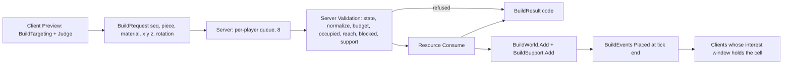
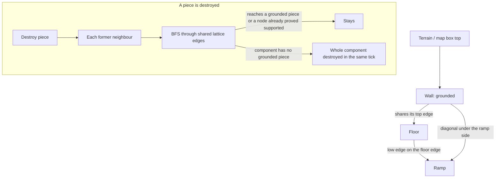
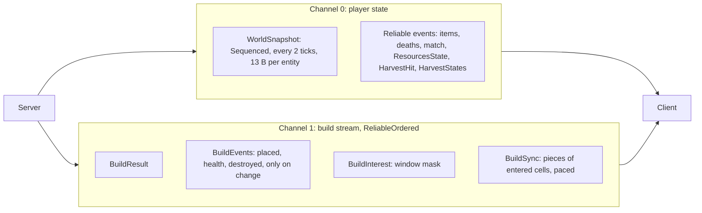

# Phase 13 Harvesting & Building Implementation Plan

> **For agentic workers:** REQUIRED SUB-SKILL: Use superpowers:subagent-driven-development (recommended) or superpowers:executing-plans to implement this plan task-by-task. Steps use checkbox (`- [ ]`) syntax for tracking.

**Goal:** 채집과 건설을 더해, 총격 중에도 바로 벽을 세워 막고 경사로로 높이를 잡는 배틀로얄을 만든다.
- 채집 도구(F)로 나무·바위·잔해·상자를 쳐서 나무·돌·금속을 얻는다. 약점을 치면 두 배다. 부서진 대상은 사라지고 다음 판에 다시 선다.
- 건축 모드(Q)에서 벽·바닥·경사로·지붕을 5 m 격자에 짓는다. 재료는 나무·돌·금속이고, 회전(R)·재료(T)·Turbo(누르고 있기)가 있다.
- 구조물은 짓는 동안 체력이 자라고, 총과 채집 도구로 부서진다. 받치던 구조물이 부서지면 땅에 닿지 않는 덩어리가 같은 Tick에 무너진다.
- 모든 판정은 서버가 한다. Client는 미리보기와 대기 중 표시만 하고, 확정된 구조물로만 충돌을 예측한다.
- 건설 상태는 플레이어 Snapshot에 넣지 않는다. 별도 채널(1)의 사건 스트림과 관심 영역(20 m 칸, 반경 2)으로 보낸다. Entity Snapshot은 13 B 그대로다.
- 구조물 수천 개가 있는 경기를 전제로 한다. 매 Tick 전체 순회와 O(N²) 지지 탐색이 없다.

**Architecture:**
- **Shared Simulation(`Shared/Runtime/Simulation`, game-core-rules 4절 예외 4).**
  - `BuildGrid`: 5 m 칸, 3 m 층, 32 × 32칸 × 16층, 슬롯 키, 조각 모양(벽·바닥은 상자, 경사로·지붕은 `Slope`)
  - `PieceGrid`: 조각 id → 칸, 칸(Column)마다 id 순서 목록. 서버 `BuildWorld`와 Client `BuildStore`가 같이 쓴다.
  - `CollisionWorld`: 이동 한 번의 충돌 후보(맵 상자 → 닫힌 문 → 서 있는 채집 대상 → 주변 조각, id 순서). `ColliderId`(종류, id)로 막은 것을 알린다.
  - `MovementSimulation`: 경사면을 지형처럼, 계단 오르기 0.1 m, 맞닿은 상자에서 다른 상자로 밀지 않는 밀어내기
  - `GameMap.Harvestables`(41개)
- **Protocol v11(Shared).**
  - 새 패킷 9개(`PacketId` 26–34): `BuildCatalog`, `BuildRequest`, `BuildResult`, `BuildEvents`, `BuildSync`, `BuildInterest`, `ResourcesState`, `HarvestHit`, `HarvestStates`
  - 입력 `ToolHarvest` 4096, `ToolBuild` 8192. 도구는 Entity `Flags` bit6–7과 Self 무기 칸 바이트의 위 2비트
  - `ItemKind.Material`, 채널 2개(`BuildChannel` 1)
- **Server(Game Loop 단일 Writer, 새 Lock 없음).**
  - 채집: `HarvestWorld`(체력, 파괴 마스크, 결정적 약점), `HarvestRules`(도구 전환, 휘두르기 광선)
  - 건설: `BuildingCatalog`(`building.json`), `BuildWorld`(저장, 필요할 때 늘어나는 배열), `BuildRules`(배치 검사), `BuildSupport`(격자 모서리 이웃, 선형 BFS 붕괴), `PieceTrace`(사격·채집 광선의 2D DDA), `BuildReplication`(Tick 사건 묶음, 관심 영역, Sync 속도 조절), `BuildRequestQueue`(플레이어당 8)
  - 수신 스레드는 요청을 검사(초당 20)해 유한 채널에 넣기만 한다.
  - 관측: Health 줄 `build`·`buildRejects`·`harvest`, Meter `projecth.build.*`·`projecth.harvest.*`
- **봇.** `BotBuilder`: 방어 벽, 높은 적 쪽 경사로, `--build-spam N`. `--build false`는 건설을 끈다.
- **Client.**
  - 순수 코드: `ToolState`(도구 예측), `BuildTargeting`(격자 미리보기), `TurboGate`, `BuildStore`(id로 적용, 관심 칸), `BuildController`(요청 번호, 대기, 판정), `BuildPieceLook`
  - 표현: `PieceMeshes`, `BuildPieceViews`(종류별 풀, Material 9개), `BuildPreview`(유령 4 + 대기 8), `HarvestableViews`, `HarvestEffects`, `BuildHud`, `BuildAudio`(소리 자리), F1 건설 줄

**Tech Stack:** Unity 6000.3.24f1(URP, UGUI Legacy `Text`, Input System), .NET 10, C# 9(Shared netstandard2.1, Unity Client), LiteNetLib 2.1.4, xUnit, NUnit(EditMode). 새 패키지는 없다.

**Spec:** `Docs/specs/2026-10-02-phase13-harvesting-building-design.md`(요청서 `Docs/requests/2026-10-02-phase13-harvesting-building-request.md`)

## Global Constraints

- **Commit:** 작업 Branch(`phase13-building`)에서 Task마다 Commit한다.
  - 각 Task의 **Files**에 적힌 경로만 `git add`한다. `git add -A`는 쓰지 않는다.
  - Push는 Phase가 끝난 뒤 `github-push` 스킬로 한다. Force Push는 하지 않는다.
  - `.claude/settings.json`, `.superpowers`, 다른 사람의 추적되지 않은 파일(`README.md`, `Docs/Troubleshooting.md`, `Docs/ServerTestPlan.md`)은 Stage하지 않는다.
  - Task 1은 하네스 파일 둘을 고친다: `.claude/skills/game-core-rules/SKILL.md`(4절 "예외 4(Phase 13)")와 `CLAUDE.md`(변경 이력 한 줄). CLAUDE.md가 Shared 예외를 더할 때 이력을 남기라고 하기 때문이다.
- **`.meta` 파일은 만들지 않는다.** Unity가 Editor를 열 때 만든다. 이 Phase에서 생기는 것은 다음 23개다(`git diff --name-status --diff-filter=A` 기준). "Phase 완료 확인" 9에서 함께 커밋한다.
  - `Shared/Runtime/Simulation/`: `BuildGrid.cs.meta`, `CollisionWorld.cs.meta`, `PieceGrid.cs.meta`
  - `Shared/Runtime/Protocol/`: `BuildPackets.cs.meta`, `HarvestPackets.cs.meta`
  - `Client/Assets/Scripts/Game/`: `HarvestableViews.cs.meta`, 새 폴더 `Build.meta`
  - `Client/Assets/Scripts/Game/Build/`: `BuildAudio`, `BuildController`, `BuildHud`, `BuildPieceLook`, `BuildPieceViews`, `BuildPreview`, `BuildStore`, `BuildTargeting`, `HarvestEffects`, `PieceMeshes`, `ToolState`의 `.cs.meta` 11개
  - `Client/Assets/Tests/EditMode/`: `BuildControllerTests`, `BuildPieceLookTests`, `BuildStoreTests`, `BuildTargetingTests`, `ToolStateTests`의 `.cs.meta` 5개
- **코드 규칙:** 모든 코드는 `.claude/skills/game-core-rules/SKILL.md`를 따른다.
  - **새 Lock은 없다.** 채집·건설·관심 영역 상태는 Game Loop 스레드만 쓴다. 수신 스레드는 연결별 요청 수를 세고(`PeerState`, 그 연결의 수신 스레드만) 유한 채널(`InboundChannels.Build`)에 넣는다. `HealthCounters`의 새 값은 Game Loop가 Tick마다 한 번 `Volatile.Write`로 쓰고 Meter·Health 줄이 읽는다(기존 방식). Client 코드는 모두 Unity 메인 스레드다.
  - **Collection 상한:**
    - 서버 조각 저장(`BuildWorld`, `PieceGrid`, `BuildSupport`, `BuildReplication`의 Tick 목록): 256에서 두 배씩 늘어나고 경기 상한(20,000)에서 멈춘다. 상한에 닿으면 `BudgetFull`이다.
    - 요청 큐: 플레이어당 8. 수신 채널: 유한. Sync: 받는 사람마다 Tick당 4패킷
    - 채집 대상: 고정 배열(41, 최대 64). `CollisionWorld`: 고정 배열(조각 225 + 상자·문·채집 대상)
    - Client `BuildStore`: 최대 20,000, 대기 배치 8, 조각 뷰 풀 종류마다 256, 유령 4 + 8, 효과 고정 풀. 봇의 조각 id 기억 4096
  - **매 Tick·매 프레임 할당이 없다.**
    - 서버: 사건은 Tick 끝에 한 번 모으고, 진행도·체력은 저장하지 않고 필요할 때 계산한다. 매 Tick 전체 조각 순회가 없다. 붕괴 탐색은 무너지는 덩어리와 그 경계에 비례한다.
    - Client: 조각 뷰는 바뀐 조각과 짓는 중인 조각만 다시 그린다. 미리보기는 만든 유령을 옮기기만 한다. HUD 문자열은 숫자가 바뀔 때만, F1 건설 줄은 0.25초마다 바뀐 값이 있을 때만 만든다. 거절 안내는 상수 문자열이다.
  - **Shared(`Shared/Runtime`)는 netstandard2.1, C# 9다.** `record`·`init`이 없고 UnityEngine과 LiteNetLib을 쓰지 않는다. Simulation에는 격자·모양·충돌 후보·채집 대상 상자(데이터)만 둔다. 배치 규칙, 지지 연결, 채집 규칙, 약점 위치는 서버에만 있다(4절 예외 4).
  - **소스 링크하는 Client 파일(`Game/Build/ToolState.cs`, `Game/Build/BuildStore.cs`, `UI/UiText.cs`)은 UnityEngine을 쓰지 않는다.** 서버 테스트 프로젝트가 서버 규칙과 실제 서버 바이트로 비교한다(`DoorRule`과 같은 방식).
- **수치(spec):**
  - `ProtocolVersion` 11, `PacketId` 26–34(위 Architecture 순서), `InputButtons.ToolHarvest` 4096·`ToolBuild` 8192, `ItemKind.Material` 4, 채널 2
  - 크기(PacketId 포함): `BuildCatalog` 49 B, `BuildRequest` 9 B, `BuildResult` 8 B, `BuildEvents` 헤더 8 B + Placed 14 B / Health 6 B / Destroyed 4 B, `BuildSync` 헤더 7 B + 조각 16 B × 최대 74 = 1191 B, `BuildInterest` 9 B, `ResourcesState` 7 B, `HarvestHit` 18 B, `HarvestStates` 9 B. Entity 13 B, Self 14 B, 90명 Snapshot 1197 B 그대로
  - 격자: 칸 5 m, 층 3 m, 32 × 32 × 16, 벽·바닥·판 두께 0.25 m, 경사로 +3 m, 지붕 +1.5 m
  - `building.json`: 비용 10, 최대 체력 150 / 240 / 360, 처음 30 %, 건설 1.5 / 3 / 5초, 자원 최대 500, 채집 도구 2.5 m·0.4초·환경 25·구조물 50·약점 0.4 m ×2, 대상 체력 나무 150·상자 100·바위 200·잔해 250, 한 번 6/6/5/4, 부술 때 +10, 건설 범위 7 m·시야각 75°·간격 0.1초·경기 20,000·플레이어 500·초당 20, 관심 칸 20 m·반경 2·여유 1
  - 이동: 후보 조각 ±1칸·±2층·최대 225, 계단 오르기 0.1 m, 지지 접지 허용 0.5 m
  - Client: 미리보기 시선 띠 ±35°, 발 + 1.5 m로 층, 대기 1초·최대 8, 조각 높이 20 %부터
- **범위:** spec D20의 항목은 하지 않는다. 건설 편집, 함정, 수리, 업그레이드, 팀 소유권, 청사진, 탈것, 물리 파괴, DB 저장, Redis·Broker·Microservice, 건설 기록 되감기, 예측 충돌 조각(대기 배치는 충돌하지 않는다), 지도 UI가 그 예다. Scene과 Prefab은 만들거나 고치지 않는다.
- **Docker:** 띄우거나 내리지 않는다. DB 테스트는 `PROJECTH_TEST_MYSQL`이 있을 때만 돈다.
- **부하 측정 프로세스:** 7790 같은 빈 포트를 쓴다. 자기가 띄운 프로세스는 pid로만 끈다. 이름으로 끄지 않는다(`taskkill /IM`, `pkill -f` 금지).
- **명령 실행 위치:** 저장소 루트(`E:/popol/ProjectH`)에서 실행한다.
  - 시작 기준은 서버 테스트 전체 1082개(1073 통과, 9개 건너뜀), EditTests 112개다.
  - 이 계획의 코드는 계획 단계에서 스크래치 복사본(6e10c2e)에 Task 순서대로 이 문서만 읽어 그대로 적용했다(`applyplan.py`). 그 상태에서 Task마다 다음을 확인했다.
    - 빌드 경고 0
    - 아래 테스트 수
    - `UnityCompile` 경고·오류 0
    - `EditTests` 테스트 수
    - 마지막 결과가 프로토타입과 한 글자도 다르지 않다.
  - **할당을 재는 테스트는 가끔 혼자 실패한다**(다른 테스트가 병렬로 돌 때 Tiered JIT 같은 일이 같은 스레드의 할당으로 잡힌다). 계획 단계에서 본 것: `WorldItemsTests.AddSearchRemove_AllocateNothing`(전부터), `MatchFlowTests.Update_DoesNotAllocate`, `MatchEliminationTests.MatchTicks_WithZoneDamage_DoNotAllocate`(문서만 바뀐 Task 10에서 한 번, 다시 돌리면 통과), 그리고 `HardeningIntegrationTests.Rejects_ByVersionAndBadRequest_AreCountedApart`(UDP 타이밍, 전부터). 그중 하나만 실패하면 한 번 더 돌린다. 같은 테스트가 다시 실패하면 고치지 말고 보고한다. 다른 할당 테스트(`BotBrainTests.ATick_*`, `SnapshotSplit`, `ConsumableTests`)가 실패하면 조각 저장이 미리 크게 잡히고 있지 않은지(256에서 시작) 먼저 본다.
- **스크립트와 수정 방식:** 코드는 아래 표시대로 넣는다.
  - **새 파일**: 내용 그대로 만든다.
  - **파일 전체를 바꾼다**: 내용 그대로 덮어쓴다.
  - **수정**: "변경 전" 블록이 파일에 정확히 한 번 나와야 "변경 후"로 바꾼다. 한 파일의 여러 수정은 적힌 순서대로 한다. 파일의 줄바꿈(CRLF/LF)은 지킨다.
  - 기준 텍스트가 없거나 두 번 이상 나오면 멈춘다. 파일을 손으로 고치지 말고, 앞 단계가 빠졌는지 같은 원인부터 확인한다.
  - 계획 단계의 적용 스크립트: `C:/Users/aaa/AppData/Local/Temp/claude/e--popol-ProjectH/eec88c12-a24f-409c-b8be-9064c2a69779/scratchpad/s13/applyplan.py <이 문서> <저장소> <Task 번호>`. 이 문서만 읽어 그 Task의 블록을 적용한다. 손으로 옮기는 대신 써도 된다.
- **Unity 확인 도구(Task 1 Step 1에서 만든다):**
  - `UnityCompile`: Client 스크립트, Shared, EditMode 테스트를 실제 Unity DLL로 컴파일한다. Phase 12 도구를 그대로 복사한다.
  - `EditTests`: Unity 밖 NUnit으로 EditMode 테스트를 돌린다. 이 Phase의 복사본은 Phase 12 범위에 다음을 더한다.
    - `PickupRule`·`WorldItemList`와 그 테스트(Task 7이 `Material`을 더한다)
    - Task 8·9의 순수 코드와 테스트: `ToolState`, `BuildTargeting`, `BuildStore`, `BuildController`, `BuildPieceLook`
    - `MovementPredictionTests`의 조각 위 일치 3개(Task 1)
  - 둘 다 저장소 밖 스크래치 폴더에 둔다. Phase 12 도구 원본은 읽기만 한다.
  - View·HUD 클래스(GameObject, Mesh, Collider, Canvas)는 테스트가 없다. 컴파일은 `UnityCompile`로 확인하고, 동작은 Editor 확인 목록과 빌드 캡처로 본다.
- **Unity API 확인(계획 단계, Unity 6000.3.24f1 DLL):** 다음은 모두 컴파일 확인했다(경고·오류 0). `ProjectH.Client.asmdef`는 바꾸지 않는다.
  - `Mesh`(`vertices`, `triangles`, `RecalculateNormals`, `RecalculateBounds`), `MeshFilter.sharedMesh`, `MeshRenderer`, `MeshCollider.sharedMesh`·`convex`, `BoxCollider.size`
  - `Transform.SetPositionAndRotation`, `Shader.Find("Sprites/Default")`, `Debug.isDebugBuild`
  - Input System 경로 `"<Keyboard>/q"`, `"/f"`, `"/z"`, `"/x"`, `"/v"`, `"/b"`, `"/t"`

## Review Focus

- **예측과 서버가 같은 충돌 세계를 본다.** 서버 `Match.Move`와 Client `LocalPlayerPredictor`가 같은 `CollisionWorld.Gather`(같은 순서, 같은 상한)로 후보를 모은다. Client는 확정 조각(`BuildStore.Grid`)만 넣는다. `MovementPredictionTests`의 조각 위 3개(경사로 오르기, 지붕 위, 벽 줄)는 서버 복제본과 예측기를 실제 Snapshot으로 맞춰 보정 0번을 본다(Task 1).
- **맞닿은 상자와 경사로 이음매.** 벽이 이어지고 지붕이 걸치면 상자가 옆면으로 맞닿는다. 밀어내기는 원래 겹치지 않았던 다른 상자로 들어가는 쪽을 고르지 않는다(두 번). 계단 오르기 0.1 m는 경사로 끝과 바닥·벽 윗면 사이(0.0006–0.075 m)를 넘게 한다. `PieceCollisionTests`의 무작위 1000건 이상(조각 면에서 0.35 m 안의 시작점)이 갇힘 0을 본다. 한 상자씩만 밀면 이 테스트가 실패한다(계획 단계에서 확인).
- **경사면.** 발 아래 높이는 발자국 범위의 가장 높은 표면이고 끝점 높이가 정확하다(경사 3/5를 끝에서 정확히). 오르는 중이 아니면 판이 옆에서 막고, 아래에서는 천장이다. 슬라이드는 경사로에서 가속하지 않는다.
- **검증 순서와 자원.** `TryBuild`는 상태 → 값 → 상한 → 자리 → 범위·시야각 → 막힘 → 지지 → 자원 순서로 보고, 모두 통과한 뒤에만 자원을 뺀다. 같은 번호의 요청은 다시 처리하지 않는다(u16 순환 비교). 요청은 이동 전에 그 Tick의 입력 조준으로 처리하고, 플레이어마다 간격(0.1초)당 하나다.
- **지지는 선형이다.** 조각마다 격자 모서리 키(최대 6)를 색인에 넣는다. 부서진 조각의 옛 이웃마다 BFS를 하되, 앞선 검색이 지지된다고 밝힌 노드에 닿으면 멈춘다. 2340개 탑이 한 Tick에 무너지는 테스트가 있다(`SupportTests`).
- **건설 스트림.** 채널 1(ReliableOrdered)에만 다닌다. Tick 끝 순서: 사건 모음 → 플레이어마다 관심 창(`BuildInterest`는 바뀐 때만) → 받는 사람마다 관심 칸으로 걸러 낸 사건 → Sync(최대 4패킷). 같은 채널이라 Client는 창을 먼저 받고 그다음 조각을 받는다. Join·Resume·라운드는 reset Sync부터다.
- **Client 저장소는 서버와 같다.** `BuildReplicationTests`가 서버가 보낸 실제 바이트를 소스 링크한 Client `BuildStore`에 넣어, 관심 칸·조각·피해·충돌 격자 수가 서버의 창 안 조각과 같음을 모든 시나리오(Join, 진입·이탈, 큰 Sync, Sync 중 파괴, Resume)에서 본다. 관심 칸 번호와 자리 판정도 32 × 32칸 전체에서 서버와 같다.
- **도구 예측.** `ToolState.Select`는 서버 `HarvestRules.SelectTool`의 복사본이고, 서버 테스트가 키 조합 4단계 2401가지로 둘을 비교한다. 무기 예측(`WeaponState.Step`)은 도구가 무기인 입력에서만 돈다.
- **할당과 메모리.** 빈 경기가 큰 배열을 미리 잡지 않는다(256에서 시작). 계획 단계에서 20,000칸을 미리 잡았을 때 Match 하나에 약 5 MB가 생겨 다른 할당 테스트가 흔들렸다. 늘어나는 배열로 바꾼 뒤 사라졌다.

## Spec 해석

1. **건설의 "경기 중"은 `Finished`·`Closing`이 아닌 모든 상태다.** 대기실(`WaitingForPlayers`·`Starting`)과 개발 모드에서도 짓는다. 경기 시작과 판 재시작에 모두 지우므로 남지 않는다. 채집 휘두르기는 spec D7대로 피해가 허용될 때만이다(`DamageAllowed`: 경기 중과 개발 모드).
2. **"행동 가능 모드"는 Phase 12의 `ActionsAllowed`(지상·웅크리기·슬라이드)다.** 땅에서 뛴 점프는 `Ground` 모드라 짓는다(D9 §115).
3. **도구 전환 우선순위는 무기 키 → F → Q다.** 같은 입력에 여러 키가 있으면 이 순서로 하나만 본다. Q를 건축 모드에서 다시 누르면 직전 도구로 돌아간다(직전 도구는 건축 모드에 들어갈 때만 기억한다).
4. **휘두르기 광선은 첫 대상에서 멈춘다.** 맵 상자·닫힌 문·서 있는 채집 대상·조각·지형 중 가장 가까운 것이다. 채집 대상이면 채집, 조각이면 구조물 피해(자원 없음), 나머지는 헛친다(간격은 쓴다).
5. **약점은 처음 맞은 면(휘두른 쪽)에 생기고, 맞히면 같은 면 안에서 옮긴다.** 위치는 (id, 맞은 횟수)의 정수 해시로 면의 15–85 %, 높이 0.4–2 m(또는 윗면 0.1 m 아래)다. 약점은 휘두른 사람에게만 `HarvestHit`으로 간다.
6. **자원 최대치는 받는 순간 자른다.** 넘친 양은 버린다. `HarvestHit.Gained`는 실제로 받은 양이다.
7. **배치 범위는 눈에서 조각 경계 상자 중심까지 7 m + 경계 상자 대각선의 절반이다.** 시야각은 조준 광선이 경계 상자를 범위 안에서 지나거나, 중심이 조준에서 75° 안이면 통과다.
8. **"정적 상자·문과 크게 겹치지 않음"은 축마다 min(0.3 m, 조각 반 크기)를 넘게 겹치지 않음이다.** 벽을 맵 벽에 붙여 세울 수 있고, 맵 벽을 뚫고 세울 수는 없다. 문은 열려 있어도 센다(닫힐 수 있어야 한다). 서 있는 채집 대상도 센다.
9. **"몸 중심이 조각 안"은 벽·바닥만이다.** 경사로·지붕은 올라설 수 있어 예외다(D9). 몸 중심은 발 + 모드 높이의 절반이다.
10. **지지 "연결"은 격자 모서리를 같이 쓰는 것이다.** 벽은 네 변과 두 대각선, 바닥·지붕은 네 변, 경사로는 낮은·높은 변과 두 옆 경사선이다. "지지된 이웃"은 "이웃"과 같다(서 있는 조각은 모두 지지된 상태라서).
11. **관심 창은 서버가 정해 보낸다(`BuildInterest`).** Client가 여유 1칸을 따로 계산하지 않는다. 받는 마스크 밖의 조각은 저장하지 않고 지운다.
12. **건설 진행 표시는 서버 Tick 추정(렌더 Tick + 보간 지연)으로 계산한다.** 서버와 같은 식(`BuildPieceLook`)이고 표시 전용이다.
13. **Material 아이템의 `DefId`는 재료 + 1이다.** 0이 "없음"인 기존 아이템 규칙과 맞춘다.
14. **부하 시나리오.**
    - A(기준선): 봇 50명 `--build false`. Phase 12와 같은 조건이다(건설 트래픽 0).
    - B(건설): 봇 50명 기본 규칙(방어 벽·경사로) + 서버 `BuildInfiniteResources`. 실제 배치가 일어난다.
    - C(Turbo): 봇 50명 `--build-spam 10`(초당 500 요청) + `BuildInfiniteResources`
    - D(대량 붕괴), 조각 수 단계, 100명: 프로세스 안 스트레스 테스트(`BuildStressTests`, 환경 변수)와 100봇 `--build-spam`

## Spec과 다른 점

계획 단계의 프로토타입에서 spec과 다르게 정한 것이다. 컨트롤러가 spec에 반영한다.

1. **`BuildingCatalog`는 `Game/Build/`에 둔다.** spec 1절은 `Data/BuildingCatalog.cs`다. 서버에 `Data` 폴더가 없고, 다른 카탈로그(`WeaponCatalog`, `ItemCatalog`)도 `Game` 아래다.
2. **지지 연결 규칙은 서버 `BuildSupport`에 둔다.** spec D12는 Shared `BuildGrid`의 이웃 표다. game-core-rules 4절이 Shared에 규칙을 두지 못하게 하고, Client는 지지를 계산하지 않는다(서버가 붕괴를 사건으로 보낸다).
3. **이웃 "표" 대신 격자 모서리 키를 쓴다.** 조각마다 자기 모서리(최대 6개)를 계산하고, 같은 모서리를 쓰는 조각이 이웃이다. 경우의 표를 손으로 만들면 빠지는 경우(경사로 옆면과 벽 대각선)가 생겨서다. 결과는 spec의 예(벽–바닥, 위·아래 벽, 이웃 바닥, 경사로 끝)를 모두 포함한다.
4. **부하용 무한 자원은 `--Server:BuildInfiniteResources=true`다.** spec D17은 `Build:InfiniteResources`다. 서버 설정은 모두 `Server` 절(`ServerOptions`)에 있고, `building.json`은 게임 수치만 둔다.
5. **"배치 직후 충돌 지연"은 설정을 두지 않는다.** spec D4의 값이 0이고, 조각은 생긴 Tick부터 충돌한다. 0 아닌 값을 쓸 계획이 없으면 코드 경로만 늘어난다.
6. **맞닿은 조각은 "틈"이 아니라 밀어내기 개선과 계단 오르기로 푼다.** spec D2가 계획 단계에 맡긴 선택이다.
   - 밀어내기: 겹친 상자마다 가장 짧게 밀되, 원래 겹치지 않았던 다른 상자로 들어가는 쪽은 고르지 않는다(없으면 가장 짧은 쪽). 두 번 돈다.
   - `MovementTuning.StepUpHeight` 0.1 m: 땅에 있을 때 그 높이 안의 윗면에 올라선다(경사로–바닥, 경사로–벽 윗면 이음매).
   - 0.01 m 틈은 경사로 끝과 바닥의 높이 차를 없애지 못하고, 서버·Client의 모든 모양 계산에 예외를 만든다.
7. **`BuildInterest` 패킷(31, 9 B)을 더한다.** spec D19의 목록에 없다. 서버가 여유 1칸을 지닌 창을 갖고 있으므로 그 마스크를 보내면 Client가 같은 계산을 다시 하지 않는다. 죽은 사람·관전자(맵 전체)도 같은 패킷으로 끝난다. `BuildSync`의 reset 플래그는 "모두 버림"이다.
8. **Sync는 받는 사람마다 Tick당 최대 4패킷(약 4.7 KB)이다.** spec은 속도를 정하지 않았다. 창 전체(수천 조각)를 한 Tick에 보내면 그 Tick의 송신이 몰린다. 칸 → 칸 안 열 → id 순서로 이어 보낸다.
9. **바닥과 그 아래층 지붕은 함께 있을 수 없다(`Occupied`).** 둘 다 같은 높이의 판을 쓴다(바닥 윗면 = 다음 층 높이 = 지붕 처마). spec은 "Ramp와 Roof는 같은 칸에 함께 있을 수 있다"만 정했다. 경사로와 지붕은 그대로 함께 있을 수 있다.
10. **요청은 이동 전에 처리하고, 조각의 생성 Tick은 다음 Tick이다.** 그 Tick의 입력 조준(마지막 입력)과 이동 전 위치로 검사해야, 클라이언트가 조준한 순간과 맞는다. 생성 Tick = 지금 + 1은 그 Tick의 사건이 나가는 Snapshot Tick과 같다.
11. **저장 배열은 미리 잡지 않고 늘린다(256 → 두 배, 경기 상한까지).** spec D10은 "미리 할당한 배열"이다. 20,000칸을 미리 잡으면 빈 경기도 약 5 MB를 쓰고, 계획 단계에서 다른 할당 테스트가 흔들렸다. 상한은 그대로라 끝없이 늘지 않는다.
12. **채집 대상은 41개(나무 23, 바위 8, 잔해 6, 상자 4)다.** 상자 4개는 Loot가 없던 엄폐물을 `Boxes`에서 옮긴 것이라 `Boxes`는 58개에서 54개가 된다.
13. **조각 수 단계의 "20,000"은 19,000을 미리 채우고 측정 중 플레이어가 짓는다.** 20,000을 다 채우면 모든 요청이 `BudgetFull`이 되어 배치 경로를 재지 못한다. 줄의 `pieces`는 미리 채운 수다.
14. **조각 수 단계·대량 붕괴는 프로세스 안 스트레스 테스트로 잰다.** 봇으로 수천 조각을 쌓으려면 수 분이 걸리고 매번 다르다. `BuildStressTests`는 `PROJECTH_BUILD_STRESS=1`일 때만 돌고(평소에는 건너뜀 3개), Release에서 서버 `Match`를 직접 돌린다(소켓 없음, 송신 바이트를 센다).
15. **봇에 `--build`(기본 true)를 더한다.** spec D17에 없다. 시나리오 A가 Phase 12와 같은 조건이 되려면 방어 벽 요청도 없어야 한다.
16. **미리보기는 물리 질의 없이 격자 계산만 한다.** spec D16은 "물리 질의는 한 번"이다. 발 칸과 시선 축만으로 서버 격자와 같은 결과가 나오고, Collider 상태(아직 안 온 조각)에 흔들리지 않는다.
17. **Client의 미리보기 판정은 사거리·자리·자원·대기 중인 자리만 본다.** 시야각, 막힘, 지지는 Client가 정확히 알 수 없어서 `BuildResult`(거절 안내)로 안다.
18. **R은 벽(내 칸 둘레로)과 경사로(제자리)만 돌린다.** 바닥·지붕은 돌려도 같은 모양이다.
19. **건설 진행은 몸 높이로 보이고 Collider는 처음부터 전체 크기다.** 서버가 생긴 Tick부터 전체 크기로 충돌·사격하기 때문이다.
20. **바뀐 기존 테스트.** 무엇이 왜 바뀌는지:
    - `MovementModesTests`·`DoorTests`(Task 1): `StepResult.BlockedBy`가 배열 위치에서 `ColliderId`가 됐다. 같은 대상을 (종류, id)로 본다.
    - 패킷 번호·크기를 고정한 테스트(Task 2): `PacketWriterReaderTests`·`StatsPacketTests`의 범위 밖 Id 26 → 35, `ProtocolConstantsTests.ProtocolVersion_IsEleven`, `PacketTests`의 알려진 버튼 `0x3FFF`, `TraversalPacketTests`의 모르는 비트(0x1000 → 0x4000), `ProtocolFuzzTests`의 새 파서
    - `MatchTests`(Task 3): Join 순서에 `BuildCatalog`가 셋째로 들어가 뒤 번호가 하나씩 밀린다.
    - `ItemPacketTests`(Task 7): 종류 4가 `Material`이 되어, 잘못된 종류 예는 5로 바꾸고 `Material` 경우를 더한다. EditMode `PickupRuleTests`에 `Material` 경우를 더한다.
    - `MonitoringTests`(Task 6): Health 줄과 Meter의 새 값
    - 약하게 만든 테스트는 없다.
21. **Client 위치.** spec 1절의 `Game/Harvest/`는 두지 않는다. 채집 대상 표시(`HarvestableViews`)는 Task 2(13A)에서 `Game/`에, 채집 효과는 건설 표시와 같은 `Game/Build/`의 `HarvestEffects`에 둔다. 휘두르기 표시는 표현 Task 9에 있다.
22. **소리는 자리만 있다(`BuildAudio`).** 클립이 없어 횟수만 센다. spec D16과 같고, 요청서 §109의 "효과음"은 에셋이 생기면 이 클래스만 바꾼다.
23. **F1 건설 줄은 Development Build와 Editor에서만 보인다(`Debug.isDebugBuild`, 요청서 §190).** 다른 F1 줄은 Phase 11·12대로 모든 빌드에서 보인다.
24. **유령(미리보기·대기)은 `Sprites/Default` 반투명이다.** URP Lit의 투명 변형은 빌드에서 빠질 수 있다(Phase 6 `ZoneView`와 같은 이유).
25. **이동 이상 검사(Phase 12 D12)는 건설 조각 안에서 시작한 이동을 세지 않는다(`Penetrates(..., piecesOnly: true)`). 맵 상자·문·채집 대상은 그대로 센다.** 머리를 가로지르게 지은 경사로는 그 Tick에 캐릭터를 표면 위로 2 m 넘게 들어 올린다(지상 한도 2.15 m/Tick). 시뮬레이션 버그가 아니라 조각이 민 것이다. 계획 단계의 봇 20명 Turbo 실행에서 이 경우가 13번 나와 찾았고, 고친 뒤 0이다(`BuildPlacementTests.ARampBuiltUnderItsBuilder_LiftsThem_WithoutAMovementAnomaly`, Task 3). 한도를 넘은 Tick에만 겹침을 본다.

---

### Task 1: Shared 충돌 재구성 (격자, 조각 모양, 경사면, 후보 수집, 맞닿은 상자)

**Files:**
- Create: `Shared/Runtime/Simulation/BuildGrid.cs`, `PieceGrid.cs`, `CollisionWorld.cs`
- Modify: `Shared/Runtime/Simulation/MovementSimulation.cs`(파일 전체), `MovementTuning.cs`, `GameMap.cs`
- Modify: `Server/src/ProjectH.Server/Game/Doors.cs`, `Game/Match.cs`
- Modify: `Client/Assets/Scripts/Game/LocalPlayerPredictor.cs`, `PredictedDoors.cs`
- Modify: `.claude/skills/game-core-rules/SKILL.md`(4절 예외 4), `CLAUDE.md`(변경 이력 한 줄)
- Test:
  - Create: `Server/tests/ProjectH.Server.Tests/Shared/BuildGridTests.cs`, `CollisionWorldTests.cs`, `PieceCollisionTests.cs`
  - Modify: `Server/tests/ProjectH.Server.Tests/Game/DoorTests.cs`, `Shared/MovementModesTests.cs`(Spec과 다른 점 20)
  - Modify: `Client/Assets/Tests/EditMode/MovementPredictionTests.cs`
- 저장소 밖: Unity 확인 도구(`<스크래치>/p13tools`)

**Interfaces:**
- Produces(Shared, namespace `ProjectH.Shared.Simulation`):
  - `enum BuildPieceType : byte { Wall, Floor, Ramp, Roof }`, `enum BuildMaterialType : byte { Wood, Stone, Metal }`, `enum BuildSlotKind : byte { WallSouth, WallWest, Floor, Ramp, Roof }`
  - `readonly struct BuildPieceShape(Type, X, Y, Z, Rotation)` : `IEquatable`
  - `static class BuildGrid`: `CellSize` 5, `LevelHeight` 3, `CellsX`·`CellsZ` 32, `Levels` 16, `TryNormalize`, `SlotOf`, `SlotKey`, `CellX`·`CellZ`·`Level`, `BoxOf`(벽·바닥), `SlopeOf`(경사로·지붕), `BoundsOf`, `CenterOf`
  - `enum SlopeKind { Ramp, Roof }`, `readonly struct Slope`: `HeightAt`, `Range(x0, z0, x1, z1, out low, out high, out bottom)`, `Top`
  - `sealed class PieceGrid(int capacity)`: `TryAdd`, `Remove`, `Clear`, `First(x, z)`/`Next(slot)`(칸 안 id 순서), `SlotOf`, `IdAt`, `ShapeAt`, `Count`, `Version`
  - `enum ColliderKind { None, Static, Door, Harvestable, Piece }`, `readonly struct ColliderId(Kind, Id)`
  - `sealed class CollisionWorld`: `Gather(feet, openDoors, destroyedHarvestables, PieceGrid)`, `Boxes`·`BoxIds`·`Slopes`·`SlopeIds`, `MaxPieces` 225
  - `MovementSimulation.Step(ref MoveState, in InputCommand, float, CollisionWorld, HeightField, out StepResult)`, `IsGrounded`·`GroundDistance`의 `CollisionWorld` 오버로드, `Penetrates(feet, height, world, piecesOnly = false)`. `StepResult.BlockedBy`·`BlockedByZ`가 `ColliderId`가 된다(전에는 배열 위치 `int`).
  - `MovementTuning.StepUpHeight` 0.1
  - `GameMap`: `HarvestKind`, `struct Harvestable { Kind, Bounds }`, `MaxHarvestables` 64. 목록 `Harvestables`는 아직 비어 있다(Task 2).
- Server: `DoorSet`의 막힌 문 찾기가 `ColliderId`(Door, 문 번호)를 쓴다. `Match.Move`는 Tick마다 플레이어 주변을 모은 `CollisionWorld`로 움직인다.
- Client: `LocalPlayerPredictor`가 서버와 같은 순서로 모은다. `DestroyedHarvestables`(ulong)와 `Pieces`(`PieceGrid`) 속성이 생긴다. 지금은 비어 있다.

- [ ] **Step 1: Unity 확인 도구를 만든다(저장소 밖, 한 번만)**

아래 경로의 `<스크래치>`는 저장소 밖 아무 폴더다(예: `%TEMP%/projecth-p13`).

1. `UnityCompile`: Phase 12 도구를 복사한다. 원본은 고치지 않는다.

   ```bash
   mkdir -p <스크래치>/p13tools/uc <스크래치>/p13tools/edittests
   cp C:/Users/aaa/AppData/Local/Temp/claude/e--popol-ProjectH/eec88c12-a24f-409c-b8be-9064c2a69779/scratchpad/p12tools/uc/UnityCompile.csproj <스크래치>/p13tools/uc/
   ```

   원본이 없어졌으면 Phase 11 계획(`Docs/plans/2026-10-01-phase11-game-ui.md`) Task 3 Step 1의 `make_unitycompile.py`로 다시 만든다. 저장소 경로는 `RepoRoot` 속성으로 받는다(기본 `E:/popol/ProjectH`).

2. `EditTests`: 아래 내용을 `<스크래치>/p13tools/edittests/EditTests.csproj`로 저장한다. 뒤 Task가 만드는 파일은 `Condition="Exists(...)"`로 넣어 두어, 처음부터 끝까지 같은 파일을 쓴다. Phase 12 범위에 `PickupRule`·`WorldItemList`(Task 7이 `Material`을 더한다)와 Task 8·9의 순수 코드를 더했다.

```xml
<Project Sdk="Microsoft.NET.Sdk">
  <!-- Phase 13 copy of the Phase 12 EditTests tool (itself a copy of Phase 11's). Runs EditMode tests outside Unity (NUnit) against RepoRoot's sources:
       the pure HUD text classes (Phase 11) and the prediction / camera math, which use only managed UnityEngine members
       (Vector2/3, Mathf, Quaternion fields), compiled against Unity's CoreModule. Tests that need the Unity runtime
       (Physics, GameObject, native calls) are not listed. -->
  <PropertyGroup>
    <RepoRoot Condition="'$(RepoRoot)' == ''">E:/popol/ProjectH</RepoRoot>
    <UnityManaged>C:/Program Files/Unity/Hub/Editor/6000.3.24f1/Editor/Data/Managed/UnityEngine</UnityManaged>
    <TargetFramework>net10.0</TargetFramework>
    <Nullable>disable</Nullable>
    <IsPackable>false</IsPackable>
    <EnableDefaultCompileItems>false</EnableDefaultCompileItems>
    <NoWarn>$(NoWarn);CS0436</NoWarn>
  </PropertyGroup>
  <ItemGroup>
    <PackageReference Include="Microsoft.NET.Test.Sdk" Version="17.14.1" />
    <PackageReference Include="NUnit" Version="3.14.0" />
    <PackageReference Include="NUnit3TestAdapter" Version="4.6.0" />
    <PackageReference Include="LiteNetLib" Version="2.1.4" />
  </ItemGroup>
  <ItemGroup>
    <Reference Include="UnityEngine.CoreModule"><HintPath>$(UnityManaged)/UnityEngine.CoreModule.dll</HintPath></Reference>
  </ItemGroup>
  <ItemGroup>
    <ProjectReference Include="$(RepoRoot)/Server/src/ProjectH.Shared/ProjectH.Shared.csproj" />
    <!-- Phase 11: HUD texts. -->
    <Compile Include="$(RepoRoot)/Client/Assets/Tests/EditMode/MatchHudTextTests.cs" />
    <Compile Include="$(RepoRoot)/Client/Assets/Tests/EditMode/InventoryHudTextTests.cs" />
    <Compile Include="$(RepoRoot)/Client/Assets/Scripts/Game/MatchHudText.cs" />
    <Compile Include="$(RepoRoot)/Client/Assets/Scripts/Game/InventoryHudText.cs" />
    <Compile Include="$(RepoRoot)/Client/Assets/Scripts/Game/WeaponState.cs" />
    <Compile Include="$(RepoRoot)/Client/Assets/Scripts/Game/ZoneMath.cs" />
    <Compile Include="$(RepoRoot)/Client/Assets/Scripts/UI/UiText.cs" />
    <!-- Phase 12: prediction and camera math. -->
    <Compile Include="$(RepoRoot)/Client/Assets/Tests/EditMode/LocalPlayerPredictorTests.cs" />
    <Compile Include="$(RepoRoot)/Client/Assets/Tests/EditMode/MapPredictionTests.cs" />
    <Compile Include="$(RepoRoot)/Client/Assets/Tests/EditMode/ShoulderCameraMathTests.cs" />
    <Compile Include="$(RepoRoot)/Client/Assets/Tests/EditMode/MovementPredictionTests.cs" Condition="Exists('$(RepoRoot)/Client/Assets/Tests/EditMode/MovementPredictionTests.cs')" />
    <Compile Include="$(RepoRoot)/Client/Assets/Scripts/Game/LocalPlayerPredictor.cs" />
    <Compile Include="$(RepoRoot)/Client/Assets/Scripts/Game/AimSolver.cs" />
    <Compile Include="$(RepoRoot)/Client/Assets/Scripts/Game/PredictedDoors.cs" Condition="Exists('$(RepoRoot)/Client/Assets/Scripts/Game/PredictedDoors.cs')" />
    <Compile Include="$(RepoRoot)/Client/Assets/Scripts/Game/DoorRule.cs" Condition="Exists('$(RepoRoot)/Client/Assets/Scripts/Game/DoorRule.cs')" />
    <Compile Include="$(RepoRoot)/Client/Assets/Scripts/Net/VectorConversions.cs" />
    <Compile Include="$(RepoRoot)/Client/Assets/Scripts/Camera/ShoulderCameraMath.cs" />
    <Compile Include="$(RepoRoot)/Client/Assets/Tests/EditMode/PlayerPoseTests.cs" Condition="Exists('$(RepoRoot)/Client/Assets/Tests/EditMode/PlayerPoseTests.cs')" />
    <Compile Include="$(RepoRoot)/Client/Assets/Scripts/Game/PlayerPose.cs" Condition="Exists('$(RepoRoot)/Client/Assets/Scripts/Game/PlayerPose.cs')" />
    <!-- Phase 12 final fix wave: remote interpolation (pose at the render tick) and the weapon copy. -->
    <Compile Include="$(RepoRoot)/Client/Assets/Tests/EditMode/RemotePlayerInterpolatorTests.cs" />
    <Compile Include="$(RepoRoot)/Client/Assets/Scripts/Game/RemotePlayerInterpolator.cs" />
    <Compile Include="$(RepoRoot)/Client/Assets/Scripts/Game/ServerClock.cs" />
    <Compile Include="$(RepoRoot)/Client/Assets/Tests/EditMode/WeaponStateTests.cs" />
    <!-- Phase 13: the tool, build mode and the build store (pure), and the pickup rule's Material case. -->
    <Compile Include="$(RepoRoot)/Client/Assets/Scripts/Game/Build/ToolState.cs" Condition="Exists('$(RepoRoot)/Client/Assets/Scripts/Game/Build/ToolState.cs')" />
    <Compile Include="$(RepoRoot)/Client/Assets/Scripts/Game/Build/BuildTargeting.cs" Condition="Exists('$(RepoRoot)/Client/Assets/Scripts/Game/Build/BuildTargeting.cs')" />
    <Compile Include="$(RepoRoot)/Client/Assets/Scripts/Game/Build/BuildStore.cs" Condition="Exists('$(RepoRoot)/Client/Assets/Scripts/Game/Build/BuildStore.cs')" />
    <Compile Include="$(RepoRoot)/Client/Assets/Scripts/Game/Build/BuildController.cs" Condition="Exists('$(RepoRoot)/Client/Assets/Scripts/Game/Build/BuildController.cs')" />
    <Compile Include="$(RepoRoot)/Client/Assets/Tests/EditMode/ToolStateTests.cs" Condition="Exists('$(RepoRoot)/Client/Assets/Tests/EditMode/ToolStateTests.cs')" />
    <Compile Include="$(RepoRoot)/Client/Assets/Tests/EditMode/BuildTargetingTests.cs" Condition="Exists('$(RepoRoot)/Client/Assets/Tests/EditMode/BuildTargetingTests.cs')" />
    <Compile Include="$(RepoRoot)/Client/Assets/Tests/EditMode/BuildStoreTests.cs" Condition="Exists('$(RepoRoot)/Client/Assets/Tests/EditMode/BuildStoreTests.cs')" />
    <Compile Include="$(RepoRoot)/Client/Assets/Tests/EditMode/BuildControllerTests.cs" Condition="Exists('$(RepoRoot)/Client/Assets/Tests/EditMode/BuildControllerTests.cs')" />
    <Compile Include="$(RepoRoot)/Client/Assets/Scripts/Game/PickupRule.cs" Condition="Exists('$(RepoRoot)/Client/Assets/Scripts/Game/PickupRule.cs')" />
    <Compile Include="$(RepoRoot)/Client/Assets/Scripts/Game/WorldItemList.cs" Condition="Exists('$(RepoRoot)/Client/Assets/Scripts/Game/WorldItemList.cs')" />
    <Compile Include="$(RepoRoot)/Client/Assets/Tests/EditMode/PickupRuleTests.cs" Condition="Exists('$(RepoRoot)/Client/Assets/Tests/EditMode/PickupRuleTests.cs')" />
    <Compile Include="$(RepoRoot)/Client/Assets/Tests/EditMode/WorldItemListTests.cs" Condition="Exists('$(RepoRoot)/Client/Assets/Tests/EditMode/WorldItemListTests.cs')" />
    <Compile Include="$(RepoRoot)/Client/Assets/Scripts/Game/Build/BuildPieceLook.cs" Condition="Exists('$(RepoRoot)/Client/Assets/Scripts/Game/Build/BuildPieceLook.cs')" />
    <Compile Include="$(RepoRoot)/Client/Assets/Tests/EditMode/BuildPieceLookTests.cs" Condition="Exists('$(RepoRoot)/Client/Assets/Tests/EditMode/BuildPieceLookTests.cs')" />
  </ItemGroup>
</Project>
```

3. 지금 상태(이 Phase 시작 전)를 확인한다.

   Run: `dotnet build <스크래치>/p13tools/uc/UnityCompile.csproj --no-incremental` → 경고 0, 오류 0
   Run: `dotnet test <스크래치>/p13tools/edittests/EditTests.csproj` → 112개 통과
   Run: `dotnet test Server/ProjectH.Server.slnx` → 전체 1082개(1073 통과, 9개 건너뜀)

- [ ] **Step 2: 실패하는 테스트를 쓴다**

**수정** `Client/Assets/Tests/EditMode/MovementPredictionTests.cs`:

변경 전:

```csharp
            public readonly PredictedDoors Doors = new PredictedDoors();   // only its server state is used
```

변경 후:

```csharp
            public readonly PredictedDoors Doors = new PredictedDoors();   // only its server state is used
            // Phase 13 D3: the server gathers its world around the character before each step (Match.Move); so do these.
            public readonly CollisionWorld World = new CollisionWorld();
            public PieceGrid Pieces;
```

변경 전:

```csharp
                }
                MovementSimulation.Step(ref State, input, Step, Doors.World, GameMap.Terrain, out StepResult result);
                Sprinting = result.Sprinting;
                if (result.Charging && result.BlockedBy >= 0)
```

변경 후:

```csharp
                }
                World.Gather(State.Position, Doors.OpenMask, 0UL, Pieces);
                MovementSimulation.Step(ref State, input, Step, World, GameMap.Terrain, out StepResult result);
                Sprinting = result.Sprinting;
                if (result.Charging && !result.BlockedBy.IsNone)
```

변경 전:

```csharp
            Assert.AreEqual(0f, predictor.InputAt(2).AimPitch, 1e-3f);
        }
```

변경 후:

```csharp
            Assert.AreEqual(0f, predictor.InputAt(2).AimPitch, 1e-3f);
        }

        // ---- Phase 13 D2, D3: moving on building pieces ----

        // The server and the prediction both know these pieces (the predictor's Pieces is the client's store of confirmed
        // pieces; here the same grid), so they gather the same world and agree with no correction. Plaza cell 16:
        // x 0..5, z 0..5.
        private void Pieces(params BuildPieceShape[] shapes)
        {
            var grid = new PieceGrid(64);
            for (int i = 0; i < shapes.Length; i++) Assert.IsTrue(grid.TryAdd((uint)(i + 1), shapes[i], out _));
            _server.Pieces = grid;
            _predictor.Pieces = grid;
        }

        private static BuildPieceShape Shape(BuildPieceType type, int x, int y, int z, int rotation = 0)
        {
            Assert.IsTrue(BuildGrid.TryNormalize(type, x, y, z, rotation, out BuildPieceShape shape));
            return shape;
        }

        [Test]
        public void UpARampOntoAFloor_AndBackDown_Agrees()
        {
            Start(At(2.5f, -3f));
            Pieces(Shape(BuildPieceType.Ramp, 16, 0, 16, 0), Shape(BuildPieceType.Floor, 16, 1, 17));
            Frames(55, Vector2.up, 0f);
            Assert.AreEqual(3f, _predictor.PredictedPosition.y, 1e-4f);
            AssertAgrees("up the ramp");
            Frames(40, Vector2.up, 180f, InputButtons.Sprint);
            Assert.AreEqual(0f, _predictor.PredictedPosition.y, 1e-4f);
            AssertAgrees("down the ramp");
        }

        [Test]
        public void SprintingUpARampOntoARoof_AndJumpingOnIt_Agrees()
        {
            Start(At(2.5f, -8f));
            Pieces(Shape(BuildPieceType.Ramp, 16, 0, 15, 0), Shape(BuildPieceType.Wall, 16, 0, 16, 0), Shape(BuildPieceType.Wall, 16, 0, 16, 1),
                Shape(BuildPieceType.Wall, 16, 0, 16, 2), Shape(BuildPieceType.Wall, 16, 0, 16, 3), Shape(BuildPieceType.Roof, 16, 0, 16));
            Frames(46, Vector2.up, 0f, InputButtons.Sprint);
            Assert.Greater(_predictor.PredictedPosition.y, 4f);
            Frame(Vector2.up, 0f, InputButtons.None, InputButtons.Jump);
            Frames(30, Vector2.up, 20f);
            AssertAgrees("roof");
        }

        [Test]
        public void PressingAlongAWallLine_AndInsideABox_Agrees()
        {
            Start(At(-13f, -0.6f, 90f));
            Pieces(Shape(BuildPieceType.Wall, 13, 0, 16, 0), Shape(BuildPieceType.Wall, 14, 0, 16, 0), Shape(BuildPieceType.Wall, 15, 0, 16, 0),
                Shape(BuildPieceType.Wall, 16, 0, 16, 0), Shape(BuildPieceType.Wall, 16, 0, 16, 1), Shape(BuildPieceType.Wall, 16, 0, 16, 2),
                Shape(BuildPieceType.Wall, 16, 0, 16, 3), Shape(BuildPieceType.Floor, 16, 1, 16));
            Frames(140, new Vector2(-1f, 1f), 90f);   // forward +X, strafing into the wall line
            Assert.Greater(_predictor.PredictedPosition.x, 0f);
            AssertAgrees("wall line");
        }
```

**수정** `Server/tests/ProjectH.Server.Tests/Game/DoorTests.cs`:

변경 전:

```csharp
        var s = new MoveState { Position = OffCentre };
        MovementSimulation.Step(ref s, SprintDiagonal, 1f / 30f, doors.World, GameMap.Terrain, out StepResult r);
        Assert.True(r.Charging);
        Assert.Equal(-1, doors.DoorAt(r.BlockedBy));          // the X sweep: the jamb
        Assert.Equal(0, doors.DoorAt(r.BlockedByZ));          // the Z sweep: door 0
```

변경 후:

```csharp
        var s = new MoveState { Position = OffCentre };
        // Phase 13 D3: the world gathered around the character names its colliders by kind and id.
        var world = new CollisionWorld();
        world.Gather(s.Position, doors.OpenMask, 0UL, null);
        MovementSimulation.Step(ref s, SprintDiagonal, 1f / 30f, world, GameMap.Terrain, out StepResult r);
        Assert.True(r.Charging);
        Assert.Equal(ColliderKind.Static, r.BlockedBy.Kind);                  // the X sweep: the jamb
        Assert.Equal(new ColliderId(ColliderKind.Door, 0), r.BlockedByZ);     // the Z sweep: door 0
```

**새 파일** `Server/tests/ProjectH.Server.Tests/Shared/BuildGridTests.cs`:

```csharp
using System.Collections.Generic;
using System.Numerics;
using ProjectH.Shared.Simulation;
using Xunit;

namespace ProjectH.Server.Tests.Shared;

// Phase 13 D1, D2: the building grid, slot keys and piece shapes.
public class BuildGridTests
{
    [Fact]
    public void TheGrid_Covers160By160MetresIn32Cells_And16Levels()
    {
        Assert.Equal(-GameMap.HalfSize, BuildGrid.OriginX);
        Assert.Equal(-GameMap.HalfSize, BuildGrid.OriginZ);
        Assert.Equal(2f * GameMap.HalfSize, BuildGrid.CellsX * BuildGrid.CellSize);
        Assert.Equal(2f * GameMap.HalfSize, BuildGrid.CellsZ * BuildGrid.CellSize);
        Assert.Equal(48f, BuildGrid.Levels * BuildGrid.LevelHeight);
        Assert.Equal(16, BuildGrid.CellX(0.01f));
        Assert.Equal(15, BuildGrid.CellX(-0.01f));
        Assert.Equal(0, BuildGrid.CellZ(-80f));
        Assert.Equal(1, BuildGrid.Level(3f));
    }

    // D1: the ramp's slope is MaxSlope, so climbing it needs no new movement rule.
    [Fact]
    public void ARamp_RisesAtTheMaximumWalkableSlope()
    {
        Assert.Equal(MoveSettings.MaxSlope, BuildGrid.RampRise / BuildGrid.CellSize, 6);
        Assert.Equal(MoveSettings.MaxSlope, BuildGrid.RoofRise / (BuildGrid.CellSize * 0.5f), 6);
    }

    [Theory]
    [InlineData(2, 4, 3, 7, 0)]    // north edge of (4, 7) = south edge of (4, 8)
    [InlineData(3, 4, 3, 7, 1)]    // east edge of (4, 7) = west edge of (5, 7)
    public void NorthAndEastWalls_AreTheNextCellsSouthAndWestWalls(int rotation, int x, int y, int z, int expectedRotation)
    {
        Assert.True(BuildGrid.TryNormalize(BuildPieceType.Wall, x, y, z, rotation, out BuildPieceShape shape));
        Assert.Equal(expectedRotation, shape.Rotation);
        Assert.Equal(rotation == 2 ? x : x + 1, shape.X);
        Assert.Equal(rotation == 2 ? z + 1 : z, shape.Z);
        Assert.True(BuildGrid.TryNormalize(BuildPieceType.Wall, shape.X, shape.Y, shape.Z, shape.Rotation, out BuildPieceShape again));
        Assert.Equal(shape, again);
        Assert.Equal(BuildGrid.BoxOf(shape).Center, BuildGrid.BoxOf(again).Center);
    }

    [Theory]
    [InlineData(4, 0, 0, 0, 0)]       // no such piece
    [InlineData(255, 0, 0, 0, 0)]
    [InlineData(0, -1, 0, 0, 0)]
    [InlineData(0, 32, 0, 0, 0)]
    [InlineData(1, 0, 16, 0, 0)]      // level 16
    [InlineData(1, 0, -1, 0, 0)]
    [InlineData(2, 0, 0, 0, 4)]       // rotation 4
    [InlineData(0, 0, 0, 31, 2)]      // the north edge of the last row: off the grid
    [InlineData(0, 31, 0, 0, 3)]      // the east edge of the last column
    [InlineData(1, 0, 0, int.MaxValue, 0)]
    [InlineData(1, int.MinValue, 0, 0, 0)]
    public void OffTheGrid_OrUnknown_IsRefused(int type, int x, int y, int z, int rotation)
    {
        Assert.False(BuildGrid.TryNormalize((BuildPieceType)type, x, y, z, rotation, out _));
    }

    [Fact]
    public void FloorsAndRoofs_DropTheirRotation_AndRampsKeepIt()
    {
        Assert.True(BuildGrid.TryNormalize(BuildPieceType.Floor, 3, 1, 3, 2, out BuildPieceShape floor));
        Assert.Equal(0, floor.Rotation);
        Assert.True(BuildGrid.TryNormalize(BuildPieceType.Roof, 3, 1, 3, 3, out BuildPieceShape roof));
        Assert.Equal(0, roof.Rotation);
        Assert.True(BuildGrid.TryNormalize(BuildPieceType.Ramp, 3, 1, 3, 3, out BuildPieceShape ramp));
        Assert.Equal(3, ramp.Rotation);
    }

    [Fact]
    public void EverySlot_HasItsOwnKey()
    {
        var keys = new HashSet<uint>();
        for (int y = 0; y < BuildGrid.Levels; y++)
            for (int z = 0; z < BuildGrid.CellsZ; z++)
                for (int x = 0; x < BuildGrid.CellsX; x++)
                    for (int slot = 0; slot < BuildGrid.SlotKinds; slot++)
                        Assert.True(keys.Add(BuildGrid.SlotKey(x, y, z, (BuildSlotKind)slot)));
        Assert.Equal(BuildGrid.Levels * BuildGrid.CellsX * BuildGrid.CellsZ * BuildGrid.SlotKinds, keys.Count);
    }

    [Fact]
    public void AllRampRotations_ShareTheRampSlot()
    {
        uint key = 0;
        for (int r = 0; r < 4; r++)
        {
            Assert.True(BuildGrid.TryNormalize(BuildPieceType.Ramp, 5, 2, 6, r, out BuildPieceShape ramp));
            if (r == 0) key = BuildGrid.SlotKey(ramp);
            Assert.Equal(key, BuildGrid.SlotKey(ramp));
        }
    }

    // D1: pieces meet exactly: neighbouring walls touch end to end, a floor's top is its level's height, a ramp's top edge
    // and a roof's eaves are exactly the next level's height (the same float a floor has), for every level.
    [Fact]
    public void PiecesMeetExactly_AtEveryLevel()
    {
        for (int y = 0; y < BuildGrid.Levels; y++)
        {
            Box a = BuildGrid.BoxOf(new BuildPieceShape(BuildPieceType.Wall, 3, y, 4, 0));
            Box b = BuildGrid.BoxOf(new BuildPieceShape(BuildPieceType.Wall, 4, y, 4, 0));
            Assert.Equal(a.Max.X, b.Min.X);
            Assert.Equal(BuildGrid.LevelBase(y), a.Min.Y);
            Assert.Equal(BuildGrid.LevelBase(y + 1), a.Max.Y);
            Assert.Equal(BuildGrid.WallThickness, a.Size.Z);

            Box floor = BuildGrid.BoxOf(new BuildPieceShape(BuildPieceType.Floor, 3, y, 4, 0));
            Assert.Equal(BuildGrid.LevelBase(y), floor.Max.Y);
            Assert.Equal(BuildGrid.FloorThickness, floor.Size.Y);

            for (byte r = 0; r < 4; r++)
            {
                Slope ramp = BuildGrid.SlopeOf(new BuildPieceShape(BuildPieceType.Ramp, 3, y, 4, r));
                Assert.Equal(BuildGrid.LevelBase(y + 1), ramp.Top);
                Assert.True(ramp.Range(ramp.MinX, ramp.MinZ, ramp.MaxX, ramp.MaxZ, out float low, out float high, out _));
                Assert.Equal(BuildGrid.LevelBase(y), low);
                Assert.Equal(BuildGrid.LevelBase(y + 1), high);
            }
            Slope roof = BuildGrid.SlopeOf(new BuildPieceShape(BuildPieceType.Roof, 3, y, 4, 0));
            Assert.Equal(BuildGrid.LevelBase(y + 1), roof.BaseY);
            Assert.Equal(BuildGrid.LevelBase(y + 1), roof.HeightAt(roof.MinX, roof.MinZ));
            Assert.Equal(BuildGrid.LevelBase(y + 1) + BuildGrid.RoofRise, roof.HeightAt((roof.MinX + roof.MaxX) * 0.5f, (roof.MinZ + roof.MaxZ) * 0.5f));
        }
    }

    [Theory]
    [InlineData(0, 0f, 2.5f, 1.5f)]   // rising +Z: z = 2.5 m in
    [InlineData(1, 2.5f, 0f, 1.5f)]   // rising +X
    [InlineData(2, 0f, 4f, 0.6f)]     // rising -Z: 1 m from the +Z edge
    [InlineData(3, 4f, 0f, 0.6f)]     // rising -X: 1 m from the +X edge
    public void ARamp_RisesInItsDirection(int rotation, float x, float z, float expected)
    {
        Slope ramp = BuildGrid.SlopeOf(new BuildPieceShape(BuildPieceType.Ramp, 16, 0, 16, rotation));
        Assert.Equal(expected, ramp.HeightAt(ramp.MinX + x, ramp.MinZ + z), 5);
    }

    [Fact]
    public void ASlopesRange_UnderAFootprint_IsItsHighestAndLowestPoint()
    {
        Slope ramp = BuildGrid.SlopeOf(new BuildPieceShape(BuildPieceType.Ramp, 16, 0, 16, 0));   // x 0..5, z 0..5, +Z
        Assert.True(ramp.Range(2f, 1f, 3f, 2f, out float low, out float high, out float bottom));
        Assert.Equal(0.6f, low, 5);
        Assert.Equal(1.2f, high, 5);
        Assert.Equal(0.6f - BuildGrid.SlopeThickness, bottom, 5);
        Assert.False(ramp.Range(5f, 1f, 6f, 2f, out _, out _, out _));   // touching the edge only
        Assert.True(ramp.Range(-1f, 4.5f, 1f, 6f, out _, out high, out _));
        Assert.Equal(3f, high);                                             // clipped to the cell

        Slope roof = BuildGrid.SlopeOf(new BuildPieceShape(BuildPieceType.Roof, 16, 0, 16, 0));
        Assert.True(roof.Range(2f, 2f, 3f, 3f, out low, out high, out bottom));
        Assert.Equal(4.5f, high);
        Assert.Equal(3f + (2.5f - 0.5f) * 0.6f, low, 5);
        Assert.Equal(3f - BuildGrid.SlopeThickness, bottom);
    }

    [Fact]
    public void Bounds_HoldEveryPiece()
    {
        var wall = new BuildPieceShape(BuildPieceType.Wall, 3, 2, 4, 1);
        Assert.Equal(BuildGrid.BoxOf(wall).Min, BuildGrid.BoundsOf(wall).Min);
        Box ramp = BuildGrid.BoundsOf(new BuildPieceShape(BuildPieceType.Ramp, 3, 2, 4, 0));
        Assert.Equal(new Vector3(BuildGrid.CellMinX(3), 6f - BuildGrid.SlopeThickness, BuildGrid.CellMinZ(4)), ramp.Min);
        Assert.Equal(9f, ramp.Max.Y);
        Box roof = BuildGrid.BoundsOf(new BuildPieceShape(BuildPieceType.Roof, 3, 2, 4, 0));
        Assert.Equal(9f - BuildGrid.SlopeThickness, roof.Min.Y);
        Assert.Equal(10.5f, roof.Max.Y);
    }
}
```

**새 파일** `Server/tests/ProjectH.Server.Tests/Shared/CollisionWorldTests.cs`:

```csharp
using System;
using System.Numerics;
using ProjectH.Shared.Simulation;
using Xunit;

namespace ProjectH.Server.Tests.Shared;

// Phase 13 D3: the piece store for collision (PieceGrid) and the world one step gathers (CollisionWorld).
public class CollisionWorldTests
{
    private static BuildPieceShape Shape(BuildPieceType type, int x, int y, int z, int r = 0)
    {
        Assert.True(BuildGrid.TryNormalize(type, x, y, z, r, out BuildPieceShape s));
        return s;
    }

    // ---- PieceGrid ----

    [Fact]
    public void PieceGrid_AddsRemovesAndFindsById()
    {
        var grid = new PieceGrid(4);
        BuildPieceShape wall = Shape(BuildPieceType.Wall, 3, 0, 4);
        Assert.True(grid.TryAdd(7, wall, out int slot));
        Assert.False(grid.TryAdd(7, wall, out _));            // the id is taken
        Assert.True(grid.Contains(7));
        Assert.Equal(slot, grid.SlotOf(7));
        Assert.True(grid.TryGet(7, out BuildPieceShape back));
        Assert.Equal(wall, back);
        int version = grid.Version;
        Assert.True(grid.Remove(7));
        Assert.False(grid.Remove(7));
        Assert.False(grid.Contains(7));
        Assert.Equal(-1, grid.SlotOf(7));
        Assert.True(grid.Version > version);
        Assert.Equal(0, grid.Count);
    }

    [Fact]
    public void PieceGrid_IsBounded_AndClearEmptiesIt()
    {
        var grid = new PieceGrid(3);
        for (uint id = 1; id <= 3; id++) Assert.True(grid.TryAdd(id, Shape(BuildPieceType.Floor, (int)id, 0, 0), out _));
        Assert.False(grid.TryAdd(4, Shape(BuildPieceType.Floor, 9, 0, 0), out _));
        grid.Clear();
        Assert.Equal(0, grid.Count);
        Assert.Equal(-1, grid.First(1, 0));
        Assert.True(grid.TryAdd(4, Shape(BuildPieceType.Floor, 9, 0, 0), out _));
    }

    // A column is in id order whatever order its pieces arrive in (the client's sync chunks and events interleave).
    [Fact]
    public void PieceGrid_KeepsEachColumnInIdOrder()
    {
        var grid = new PieceGrid(16);
        uint[] ids = { 9, 3, 12, 5, 1 };
        for (int i = 0; i < ids.Length; i++) Assert.True(grid.TryAdd(ids[i], Shape(BuildPieceType.Floor, 2, i, 2), out _));
        Assert.True(grid.Remove(5));
        uint last = 0;
        int count = 0;
        for (int slot = grid.First(2, 2); slot >= 0; slot = grid.Next(slot))
        {
            Assert.True(grid.IdAt(slot) > last);
            last = grid.IdAt(slot);
            count++;
        }
        Assert.Equal(4, count);
        Assert.Equal(-1, grid.First(-1, 2));
        Assert.Equal(-1, grid.First(2, 32));
    }

    [Fact]
    public void PieceGrid_AddAndRemove_AllocateNothing()
    {
        var grid = new PieceGrid(64);
        BuildPieceShape floor = Shape(BuildPieceType.Floor, 4, 0, 4);
        for (uint id = 1; id <= 64; id++) grid.TryAdd(id, floor, out _);
        for (uint id = 1; id <= 64; id++) grid.Remove(id);
        long before = GC.GetAllocatedBytesForCurrentThread();
        for (uint id = 100; id < 164; id++) grid.TryAdd(id, floor, out _);
        for (uint id = 100; id < 164; id++) grid.Remove(id);
        Assert.Equal(before, GC.GetAllocatedBytesForCurrentThread());
    }

    // ---- CollisionWorld ----

    [Fact]
    public void Gather_TakesNearbyMapBoxes_AndOnlyClosedDoors_NamedByKindAndId()
    {
        // Door 0 is in the south wall of the Rustvale house at (-54, 54): x -54.75..-53.25, z 50.15..50.35.
        Box door = GameMap.Doors[0];
        var feet = new Vector3(door.Center.X, 0f, door.Min.Z - 1f);
        var world = new CollisionWorld();
        world.Gather(feet, 0, 0UL, null);
        Assert.Contains(new ColliderId(ColliderKind.Door, 0), world.BoxIds.ToArray());
        world.Gather(feet, 1, 0UL, null);
        Assert.DoesNotContain(new ColliderId(ColliderKind.Door, 0), world.BoxIds.ToArray());

        // Every map box within the radius is there, as Static with its index, in map order; far ones are not.
        int last = -1;
        for (int i = 0; i < world.Boxes.Length; i++)
        {
            ColliderId id = world.BoxIds[i];
            Assert.Equal(ColliderKind.Static, id.Kind);
            Assert.Equal(GameMap.Boxes[(int)id.Id].Min, world.Boxes[i].Min);
            Assert.True((int)id.Id > last);
            last = (int)id.Id;
        }
        for (int i = 0; i < GameMap.Boxes.Length; i++)
        {
            Box b = GameMap.Boxes[i];
            bool near = b.Max.X >= feet.X - CollisionWorld.GatherRadius && b.Min.X <= feet.X + CollisionWorld.GatherRadius &&
                        b.Max.Z >= feet.Z - CollisionWorld.GatherRadius && b.Min.Z <= feet.Z + CollisionWorld.GatherRadius;
            Assert.Equal(near, Array.IndexOf(world.BoxIds.ToArray(), new ColliderId(ColliderKind.Static, (uint)i)) >= 0);
        }
    }

    // The order is static boxes, doors, then pieces in id order (boxes and slopes each in id order), whatever order the
    // pieces were added in: both sides must gather the same list.
    [Fact]
    public void Gather_PutsPiecesAfterTheMap_InIdOrder()
    {
        var grid = new PieceGrid(32);
        grid.TryAdd(40, Shape(BuildPieceType.Wall, 16, 0, 16), out _);
        grid.TryAdd(12, Shape(BuildPieceType.Floor, 17, 0, 15), out _);
        grid.TryAdd(31, Shape(BuildPieceType.Ramp, 15, 0, 16, 1), out _);
        grid.TryAdd(25, Shape(BuildPieceType.Wall, 15, 1, 17, 1), out _);
        grid.TryAdd(2, Shape(BuildPieceType.Roof, 16, 0, 17), out _);
        var world = new CollisionWorld();
        world.Gather(new Vector3(2f, 0f, 2f), 0, 0UL, grid);
        Assert.Equal(5, world.PieceCount);
        Assert.Equal(new[] { 12u, 25u, 40u }, PieceIds(world.BoxIds));
        Assert.Equal(new[] { 2u, 31u }, PieceIds(world.SlopeIds));
        for (int i = 0; i < world.BoxIds.Length; i++)
        {
            if (world.BoxIds[i].Kind != ColliderKind.Piece) continue;
            for (int j = i; j < world.BoxIds.Length; j++) Assert.Equal(ColliderKind.Piece, world.BoxIds[j].Kind);
            break;
        }
    }

    private static uint[] PieceIds(ReadOnlySpan<ColliderId> ids)
    {
        var list = new System.Collections.Generic.List<uint>();
        foreach (ColliderId id in ids)
        {
            if (id.Kind == ColliderKind.Piece) list.Add(id.Id);
        }
        return list.ToArray();
    }

    [Fact]
    public void Gather_TakesPiecesWithinOneCell_AndTwoLevels()
    {
        var grid = new PieceGrid(32);
        grid.TryAdd(1, Shape(BuildPieceType.Floor, 17, 2, 17), out _);   // one cell over, two levels up: in
        grid.TryAdd(2, Shape(BuildPieceType.Floor, 18, 0, 16), out _);   // two cells over: out
        grid.TryAdd(3, Shape(BuildPieceType.Floor, 16, 3, 16), out _);   // three levels up: out
        grid.TryAdd(4, Shape(BuildPieceType.Floor, 15, 0, 15), out _);   // diagonal neighbour: in
        var world = new CollisionWorld();
        world.Gather(new Vector3(2f, 0.5f, 2f), 0, 0UL, grid);
        Assert.Equal(new[] { 1u, 4u }, PieceIds(world.BoxIds));
        world.Gather(new Vector3(2f, 6.5f, 2f), 0, 0UL, grid);           // level 2: now 3 is in, 4 still (0 = 2 - 2)
        Assert.Equal(new[] { 1u, 3u, 4u }, PieceIds(world.BoxIds));
    }

    [Fact]
    public void Gather_HoldsAFullBlockOfPieces()
    {
        var grid = new PieceGrid(CollisionWorld.MaxPieces + 10);
        uint id = 1;
        for (int y = 0; y < 5; y++)
            for (int z = 15; z <= 17; z++)
                for (int x = 15; x <= 17; x++)
                {
                    grid.TryAdd(id++, Shape(BuildPieceType.Wall, x, y, z, 0), out _);
                    grid.TryAdd(id++, Shape(BuildPieceType.Wall, x, y, z, 1), out _);
                    grid.TryAdd(id++, Shape(BuildPieceType.Floor, x, y, z), out _);
                    grid.TryAdd(id++, Shape(BuildPieceType.Ramp, x, y, z), out _);
                    grid.TryAdd(id++, Shape(BuildPieceType.Roof, x, y, z), out _);
                }
        var world = new CollisionWorld();
        world.Gather(new Vector3(2f, 6.5f, 2f), 0, 0UL, grid);
        Assert.Equal(CollisionWorld.MaxPieces, world.PieceCount);
        Assert.Equal(CollisionWorld.MaxPieces * 3 / 5, world.BoxIds.Length - CountMap(world.BoxIds));
        Assert.Equal(CollisionWorld.MaxPieces * 2 / 5, world.Slopes.Length);
    }

    private static int CountMap(ReadOnlySpan<ColliderId> ids)
    {
        int n = 0;
        foreach (ColliderId id in ids)
        {
            if (id.Kind != ColliderKind.Piece) n++;
        }
        return n;
    }

    [Fact]
    public void Gather_AllocatesNothing()
    {
        var grid = new PieceGrid(64);
        for (uint id = 1; id <= 20; id++) grid.TryAdd(id, Shape(BuildPieceType.Floor, 14 + (int)(id % 5), (int)(id % 3), 16), out _);
        var world = new CollisionWorld();
        world.Gather(new Vector3(2f, 0f, 2f), 0, 0UL, grid);
        long before = GC.GetAllocatedBytesForCurrentThread();
        for (int i = 0; i < 100; i++) world.Gather(new Vector3(2f + i * 0.01f, 0f, 2f), 0, 0UL, grid);
        Assert.Equal(before, GC.GetAllocatedBytesForCurrentThread());
    }
}
```

**수정** `Server/tests/ProjectH.Server.Tests/Shared/MovementModesTests.cs`:

변경 전:

```csharp
        Assert.Equal(MovementMode.Crouch, s.Mode);
        Assert.Equal(0, r.BlockedBy);
```

변경 후:

```csharp
        Assert.Equal(MovementMode.Crouch, s.Mode);
        Assert.Equal(new ColliderId(ColliderKind.Static, 0), r.BlockedBy);
```

**새 파일** `Server/tests/ProjectH.Server.Tests/Shared/PieceCollisionTests.cs`:

```csharp
using System;
using System.Numerics;
using ProjectH.Shared.Simulation;
using Xunit;

namespace ProjectH.Server.Tests.Shared;

// Phase 13 D2, D3: moving on and against building pieces, with the world gathered around the character before every
// step exactly as Match and the client prediction do. Every structure stands in the plaza (cells 15-17, flat terrain at
// 0, no map box within the gather radius), so only the pieces matter. Cell 16 is x 0..5, z 0..5.
public class PieceCollisionTests
{
    private const float Dt = 1f / 30f;
    private const int C = 16;   // the plaza's build cell (x 0..5, z 0..5)

    private static readonly InputCommand Idle = new();

    private static BuildPieceShape Wall(int x, int y, int z, int rotation)
    {
        Assert.True(BuildGrid.TryNormalize(BuildPieceType.Wall, x, y, z, rotation, out BuildPieceShape shape));
        return shape;
    }

    private static BuildPieceShape Piece(BuildPieceType type, int x, int y, int z, int rotation = 0)
    {
        Assert.True(BuildGrid.TryNormalize(type, x, y, z, rotation, out BuildPieceShape shape));
        return shape;
    }

    private static PieceGrid Grid(params BuildPieceShape[] shapes)
    {
        var grid = new PieceGrid(256);
        for (int i = 0; i < shapes.Length; i++) Assert.True(grid.TryAdd((uint)(i + 1), shapes[i], out _));
        return grid;
    }

    // One step as Match.Move runs it.
    private static StepResult StepOnce(ref MoveState s, InputCommand input, PieceGrid grid, CollisionWorld world)
    {
        world.Gather(s.Position, 0, 0UL, grid);
        MovementSimulation.Step(ref s, input, Dt, world, GameMap.Terrain, out StepResult result);
        return result;
    }

    private static bool Penetrates(in MoveState s, PieceGrid grid, CollisionWorld world)
    {
        world.Gather(s.Position, 0, 0UL, grid);
        return MovementSimulation.Penetrates(s.Position, MovementSimulation.CollisionHeight(s.Mode), world);
    }

    private static bool Grounded(in MoveState s, PieceGrid grid, CollisionWorld world)
    {
        world.Gather(s.Position, 0, 0UL, grid);
        return MovementSimulation.IsGrounded(s, world, GameMap.Terrain);
    }

    private static float X0(int x) => BuildGrid.CellMinX(x);
    private static float Z0(int z) => BuildGrid.CellMinZ(z);

    // ---- Walls ----

    [Fact]
    public void WalkingAlongAWallLine_PressedAgainstIt_NeverSticksAtAJoint()
    {
        // Six walls side by side on the south edges of cells 13..18 (one line at z = 0, touching end to end).
        PieceGrid grid = Grid(Wall(13, 0, C, 0), Wall(14, 0, C, 0), Wall(15, 0, C, 0), Wall(16, 0, C, 0), Wall(17, 0, C, 0), Wall(18, 0, C, 0));
        var world = new CollisionWorld();
        foreach (float side in new[] { -1f, 1f })
        {
            // Diagonally into the wall from its south (or north) side, moving along +X.
            var s = new MoveState { Position = new Vector3(X0(13) + 1f, 0f, side * 0.6f) };
            var into = new InputCommand { MoveX = side < 0f ? -1f : 1f, MoveY = 1f, Yaw = 90f };   // forward +X, strafe into the wall
            float lastX = s.Position.X;
            for (int i = 0; i < 300; i++)
            {
                StepOnce(ref s, into, grid, world);
                Assert.False(Penetrates(s, grid, world), $"side {side}, tick {i}: {s.Position}");
                Assert.True(s.Position.X > lastX + 0.08f, $"side {side}, tick {i}: stuck at {s.Position}");
                lastX = s.Position.X;
                if (s.Position.X > X0(18) + 4f) break;
            }
            Assert.True(s.Position.X > X0(18) + 4f, $"side {side}: reached {s.Position}");
            Assert.True(MathF.Abs(s.Position.Z) >= BuildGrid.WallThickness * 0.5f + MoveSettings.HalfWidth);
        }
    }

    [Fact]
    public void InsideAOneCellBox_ACharacterNeverLeavesItOrEntersAWall()
    {
        // Four walls, a floor and a roof around cell 16 at level 0.
        PieceGrid grid = Grid(Wall(C, 0, C, 0), Wall(C, 0, C, 1), Wall(C, 0, C, 2), Wall(C, 0, C, 3), Piece(BuildPieceType.Floor, C, 0, C),
            Piece(BuildPieceType.Roof, C, 0, C));
        var world = new CollisionWorld();
        var rng = new Random(13);
        var s = new MoveState { Position = new Vector3(2.5f, 0f, 2.5f) };
        const float inner = BuildGrid.WallThickness * 0.5f + MoveSettings.HalfWidth;
        for (int i = 0; i < 900; i++)
        {
            var input = new InputCommand
            {
                MoveX = (float)rng.NextDouble() * 2f - 1f, MoveY = (float)rng.NextDouble() * 2f - 1f, Yaw = (float)rng.NextDouble() * 360f,
                Buttons = (rng.Next(4) == 0 ? InputButtons.Jump : 0) | (rng.Next(2) == 0 ? InputButtons.Sprint : 0) |
                          (rng.Next(8) == 0 ? InputButtons.Crouch : 0),
            };
            StepOnce(ref s, input, grid, world);
            Assert.False(Penetrates(s, grid, world), $"tick {i}: {s.Position}");
            Assert.InRange(s.Position.X, inner - 0.01f, BuildGrid.CellSize - inner + 0.01f);
            Assert.InRange(s.Position.Z, inner - 0.01f, BuildGrid.CellSize - inner + 0.01f);
            Assert.True(s.Position.Y + MovementSimulation.CollisionHeight(s.Mode) <= BuildGrid.LevelHeight - BuildGrid.SlopeThickness + 0.01f);
        }
    }

    // Phase 13 prototype (Spec과 다른 점 2): pieces touch side by side and overlap at wall corners, unlike the map's boxes.
    // Characters pushed into them through every face, as deep as the placement rule allows (the body centre outside every
    // piece, so up to about 0.35 m), always come out in one step, can always walk away, and the result is deterministic.
    // The last layout stands on a Rustvale house roof, so the pieces also overlap map boxes (the roof slab and the walls).
    [Fact]
    public void PushedIntoTouchingPieces_ACharacterComesOutInOneStep_AndCanWalkAway()
    {
        BuildPieceShape[][] layouts =
        {
            new[] { Wall(15, 0, C, 0), Wall(C, 0, C, 0), Wall(17, 0, C, 0) },                                     // a wall line
            new[] { Wall(C, 0, C, 0), Wall(C, 0, C, 1) },                                                          // an L corner
            new[] { Wall(C, 0, C, 0), Wall(C, 0, C, 1), Wall(C, 0, C, 2), Wall(C, 0, C, 3), Piece(BuildPieceType.Floor, C, 0, C) },
            new[] { Piece(BuildPieceType.Floor, C, 1, C), Piece(BuildPieceType.Floor, 17, 1, C), Wall(C, 1, C, 0), Wall(17, 1, C, 0) }, // walls on floors
            new[] { Wall(C, 0, C, 0), Wall(17, 0, C, 0), Piece(BuildPieceType.Floor, C, 1, C), Piece(BuildPieceType.Floor, 17, 1, C) }, // floors over walls
            new[] { Wall(5, 1, 27, 0), Wall(5, 1, 26, 1), Piece(BuildPieceType.Floor, 5, 1, 26) },                // on a house roof
        };
        var world = new CollisionWorld();
        var rng = new Random(1301);
        int cases = 0;
        foreach (BuildPieceShape[] layout in layouts)
        {
            PieceGrid grid = Grid(layout);
            for (int n = 0; n < 300; n++)
            {
                // A body overlapping one piece's box through one face by up to 0.35 m, anywhere along that face.
                Box box = BuildGrid.BoxOf(layout[rng.Next(layout.Length)]);
                float depth = 0.002f + (float)rng.NextDouble() * 0.35f;
                float along = (float)rng.NextDouble();
                float up = (float)rng.NextDouble();
                float x = box.Min.X - 0.3f + along * (box.Max.X - box.Min.X + 0.6f);
                float z = box.Min.Z - 0.3f + along * (box.Max.Z - box.Min.Z + 0.6f);
                float y = MathF.Max(0f, box.Min.Y - 1.5f + up * (box.Max.Y - box.Min.Y + 1.4f));
                Vector3 feet;
                switch (rng.Next(6))
                {
                    case 0: feet = new Vector3(box.Min.X + depth - MoveSettings.HalfWidth, y, z); break;
                    case 1: feet = new Vector3(box.Max.X - depth + MoveSettings.HalfWidth, y, z); break;
                    case 2: feet = new Vector3(x, y, box.Min.Z + depth - MoveSettings.HalfWidth); break;
                    case 3: feet = new Vector3(x, y, box.Max.Z - depth + MoveSettings.HalfWidth); break;
                    case 4: feet = new Vector3(x, box.Max.Y - depth, z); break;
                    default: feet = new Vector3(x, MathF.Max(0f, box.Min.Y - MoveSettings.Height + depth), z); break;
                }
                feet.Y = MathF.Max(feet.Y, GameMap.Terrain.Height(feet.X, feet.Z));
                world.Gather(feet, 0, 0UL, grid);
                if (!MovementSimulation.Penetrates(feet, MoveSettings.Height, world) || CentreInAPiece(feet, world)) continue;
                cases++;

                var a = new MoveState { Position = feet };
                StepOnce(ref a, Idle, grid, world);
                Assert.False(Penetrates(a, grid, world), $"case {cases}: {feet} -> {a.Position}");
                var b = new MoveState { Position = feet };
                StepOnce(ref b, Idle, grid, world);
                Assert.Equal(a.Position, b.Position);

                // Some direction walks at least half a metre away within 20 ticks, never into a piece.
                bool away = false;
                for (int d = 0; d < 4 && !away; d++)
                {
                    MoveState w = a;
                    for (int t = 0; t < 20; t++)
                    {
                        StepOnce(ref w, new InputCommand { MoveY = 1f, Yaw = d * 90f }, grid, world);
                        Assert.False(Penetrates(w, grid, world), $"case {cases} walking {d * 90}: {w.Position}");
                    }
                    away = Vector2.Distance(new Vector2(w.Position.X, w.Position.Z), new Vector2(a.Position.X, a.Position.Z)) >= 0.5f;
                }
                Assert.True(away, $"case {cases}: trapped at {a.Position}");
            }
        }
        Assert.True(cases > 1000, $"only {cases} cases");
    }

    private static bool CentreInAPiece(Vector3 feet, CollisionWorld world)
    {
        Vector3 centre = feet + new Vector3(0f, MoveSettings.Height * 0.5f, 0f);
        foreach (Box b in world.Boxes)
        {
            if (centre.X > b.Min.X && centre.X < b.Max.X && centre.Y > b.Min.Y && centre.Y < b.Max.Y && centre.Z > b.Min.Z && centre.Z < b.Max.Z)
                return true;
        }
        return false;
    }

    [Fact]
    public void AWallBuiltDeepIntoTheBody_PushesItOutTheShortWay()
    {
        // The wall on z = 0, the character's body 0.3 m into it from the south: out to the south.
        PieceGrid grid = Grid(Wall(C, 0, C, 0));
        var world = new CollisionWorld();
        var s = new MoveState { Position = new Vector3(2.5f, 0f, -0.125f - MoveSettings.HalfWidth + 0.3f) };
        StepOnce(ref s, Idle, grid, world);
        Assert.False(Penetrates(s, grid, world));
        Assert.True(s.Position.Z <= -0.125f - MoveSettings.HalfWidth);
        Assert.True(s.Position.Z > -0.125f - MoveSettings.HalfWidth - 0.01f);
    }

    [Fact]
    public void AWallOnAHouseRoof_StopsAWalkerOnTheRoof_WithoutTrapping()
    {
        // Rustvale house at (-54, 54): x -58..-50, z 50..58, roof top 3.25. A level 1 wall (y 3..6) on the south edge of
        // cell (5, 27) runs along z = 55 over x -55..-50 and overlaps the roof slab's top 0.25 m.
        Box roof = GameMap.Boxes[0];
        foreach (Box b in GameMap.Boxes)
        {
            if (b.Min.X == -58f && b.Min.Z == 50f && b.Max.Y == 3.25f) roof = b;
        }
        Assert.Equal(3.25f, roof.Max.Y);
        PieceGrid grid = Grid(Wall(5, 1, 27, 0));
        var world = new CollisionWorld();
        var s = new MoveState { Position = new Vector3(-52.5f, 3.25f, 53f) };
        for (int i = 0; i < 40; i++)
        {
            StepOnce(ref s, new InputCommand { MoveY = 1f, Yaw = 0f }, grid, world);
            Assert.False(Penetrates(s, grid, world), $"tick {i}: {s.Position}");
        }
        Assert.Equal(3.25f, s.Position.Y);
        Assert.InRange(s.Position.Z, 55f - 0.125f - MoveSettings.HalfWidth - 0.01f, 55f - 0.125f - MoveSettings.HalfWidth);
        for (int i = 0; i < 20; i++) StepOnce(ref s, new InputCommand { MoveY = 1f, Yaw = 180f }, grid, world);
        Assert.True(s.Position.Z < 53f);
    }

    // ---- Ramps ----

    // Ramp at cell (16, 0, 16) rising +Z from 0 to 3, then a level 1 floor on cell (16, 17): z 5..10, top 3.
    private static PieceGrid RampToFloor() => Grid(Piece(BuildPieceType.Ramp, C, 0, C, 0), Piece(BuildPieceType.Floor, C, 1, 17));

    [Fact]
    public void WalkingUpARamp_OntoAFloor_StaysGroundedEveryTick_AndEndsExactlyOnTheNextLevel()
    {
        PieceGrid grid = RampToFloor();
        var world = new CollisionWorld();
        var s = new MoveState { Position = new Vector3(2.5f, 0f, -3f) };
        float lastY = 0f;
        for (int i = 0; i < 90 && s.Position.Z < 9f; i++)
        {
            StepOnce(ref s, new InputCommand { MoveY = 1f, Yaw = 0f }, grid, world);
            Assert.True(Grounded(s, grid, world), $"tick {i}: airborne at {s.Position}");
            Assert.False(Penetrates(s, grid, world), $"tick {i}: {s.Position}");
            Assert.True(s.Position.Y >= lastY);
            lastY = s.Position.Y;
        }
        Assert.True(s.Position.Z > 7f, $"stopped at {s.Position}");
        Assert.Equal(BuildGrid.LevelBase(1), s.Position.Y);
    }

    [Fact]
    public void WalkingDownARamp_FromTheFloor_StaysGroundedEveryTick()
    {
        PieceGrid grid = RampToFloor();
        var world = new CollisionWorld();
        var s = new MoveState { Position = new Vector3(2.5f, 3f, 8f), Yaw = 180f };
        for (int i = 0; i < 90; i++)
        {
            StepOnce(ref s, new InputCommand { MoveY = 1f, Yaw = 180f }, grid, world);
            Assert.True(Grounded(s, grid, world), $"tick {i}: airborne at {s.Position}");
            Assert.False(Penetrates(s, grid, world));
        }
        Assert.True(s.Position.Z < -1f);
        Assert.Equal(0f, s.Position.Y);
    }

    [Fact]
    public void SprintingDiagonallyAcrossARamp_StaysGrounded()
    {
        PieceGrid grid = Grid(Piece(BuildPieceType.Ramp, C, 0, C, 0), Piece(BuildPieceType.Ramp, 17, 0, C, 0));
        var world = new CollisionWorld();
        var s = new MoveState { Position = new Vector3(0.5f, 0f, -1f) };
        bool climbed = false;
        for (int i = 0; i < 45; i++)
        {
            StepOnce(ref s, new InputCommand { MoveY = 1f, Yaw = 45f, Buttons = InputButtons.Sprint }, grid, world);
            if (s.Position.Z < 5f - MoveSettings.HalfWidth) Assert.True(Grounded(s, grid, world), $"tick {i}: airborne at {s.Position}");
            climbed |= s.Position.Y > 2f;
        }
        Assert.True(climbed);
    }

    [Fact]
    public void AJumpOntoARamp_LandsOnItsSurface()
    {
        PieceGrid grid = Grid(Piece(BuildPieceType.Ramp, C, 0, C, 1));   // rising +X
        var world = new CollisionWorld();
        var s = new MoveState { Position = new Vector3(2.5f, 4f, 2.5f) };
        for (int i = 0; i < 40; i++) StepOnce(ref s, Idle, grid, world);
        // The footprint's highest point: along = 2.5 + 0.35.
        Assert.Equal(0f + (2.5f + MoveSettings.HalfWidth) * 3f / 5f, s.Position.Y, 4);
        Assert.Equal(0f, s.VelocityY);
        Assert.True(Grounded(s, grid, world));
    }

    [Fact]
    public void UnderARamp_AWalkerIsStoppedByItsSlab_NotSwallowed()
    {
        // Ramp at level 0 rising +Z; a walker from the north at ground level passes under the high end and is stopped where
        // the slab comes down to its head.
        PieceGrid grid = Grid(Piece(BuildPieceType.Ramp, C, 0, C, 0));
        var world = new CollisionWorld();
        var s = new MoveState { Position = new Vector3(2.5f, 0f, 8f) };
        for (int i = 0; i < 90; i++)
        {
            StepOnce(ref s, new InputCommand { MoveY = 1f, Yaw = 180f }, grid, world);
            Assert.False(Penetrates(s, grid, world), $"tick {i}: {s.Position}");
        }
        Assert.Equal(0f, s.Position.Y);
        Assert.True(s.Position.Z > 3f, $"walked to {s.Position}");
    }

    [Fact]
    public void AJumpUnderARamp_HitsItsUnderside()
    {
        PieceGrid grid = Grid(Piece(BuildPieceType.Ramp, C, 0, C, 0));
        var world = new CollisionWorld();
        var s = new MoveState { Position = new Vector3(2.5f, 0f, 4.5f) };
        float top = 0f;
        StepOnce(ref s, new InputCommand { Buttons = InputButtons.Jump }, grid, world);
        for (int i = 0; i < 40; i++)
        {
            StepOnce(ref s, Idle, grid, world);
            top = MathF.Max(top, s.Position.Y);
            Assert.False(Penetrates(s, grid, world), $"tick {i}: {s.Position}");
        }
        // The slab's bottom over the footprint (along 4.15..4.85) is lowest at 4.15: 2.49 - 0.25.
        Assert.True(top + MoveSettings.Height <= 4.15f * 3f / 5f - BuildGrid.SlopeThickness + 0.001f, $"head reached {top + MoveSettings.Height}");
    }

    [Fact]
    public void ARampBuiltOnACharacter_LiftsItOntoTheSurface()
    {
        PieceGrid grid = Grid(Piece(BuildPieceType.Ramp, C, 0, C, 0));
        var world = new CollisionWorld();
        var s = new MoveState { Position = new Vector3(2.5f, 0f, 2.5f) };
        StepOnce(ref s, Idle, grid, world);
        Assert.Equal((2.5f + MoveSettings.HalfWidth) * 3f / 5f, s.Position.Y, 4);
        Assert.True(Grounded(s, grid, world));
    }

    [Fact]
    public void ARampChain_ClimbsTwoLevels()
    {
        PieceGrid grid = Grid(Piece(BuildPieceType.Ramp, C, 0, C, 0), Piece(BuildPieceType.Ramp, C, 1, 17, 0), Piece(BuildPieceType.Floor, C, 2, 18));
        var world = new CollisionWorld();
        var s = new MoveState { Position = new Vector3(2.5f, 0f, -2f) };
        for (int i = 0; i < 120 && s.Position.Z < 12f; i++)
        {
            StepOnce(ref s, new InputCommand { MoveY = 1f, Yaw = 0f, Buttons = InputButtons.Sprint }, grid, world);
            Assert.True(Grounded(s, grid, world), $"tick {i}: airborne at {s.Position}");
        }
        Assert.True(s.Position.Z >= 12f);
        Assert.Equal(BuildGrid.LevelBase(2), s.Position.Y);
    }

    // ---- Roofs ----

    [Fact]
    public void UpARamp_OntoARoof_OverItsPeak_AndDownTheOtherSide()
    {
        // A box of four walls with a roof (eaves at 3, peak 4.5 at the centre), reached by a ramp from the south.
        PieceGrid grid = Grid(Piece(BuildPieceType.Ramp, C, 0, 15, 0), Wall(C, 0, C, 0), Wall(C, 0, C, 1), Wall(C, 0, C, 2), Wall(C, 0, C, 3),
            Piece(BuildPieceType.Roof, C, 0, C));
        var world = new CollisionWorld();
        var s = new MoveState { Position = new Vector3(2.5f, 0f, -8f) };
        float peak = 0f;
        for (int i = 0; i < 70; i++)
        {
            StepOnce(ref s, new InputCommand { MoveY = 1f, Yaw = 0f }, grid, world);
            Assert.False(Penetrates(s, grid, world), $"tick {i}: {s.Position}");
            if (s.Position.Z < 4.5f) Assert.True(Grounded(s, grid, world), $"tick {i}: airborne at {s.Position}");
            peak = MathF.Max(peak, s.Position.Y);
        }
        Assert.Equal(BuildGrid.LevelBase(1) + BuildGrid.RoofRise, peak, 4);
    }

    [Fact]
    public void AGliderLandsOnARoof()
    {
        PieceGrid grid = Grid(Piece(BuildPieceType.Roof, C, 0, C));
        var world = new CollisionWorld();
        var s = new MoveState { Position = new Vector3(2.5f, 6f, 2.5f), Mode = MovementMode.Glide };
        for (int i = 0; i < 60 && s.Mode == MovementMode.Glide; i++) StepOnce(ref s, Idle, grid, world);
        Assert.Equal(MovementMode.Ground, s.Mode);
        Assert.Equal(BuildGrid.LevelBase(1) + BuildGrid.RoofRise, s.Position.Y, 4);
    }

    [Fact]
    public void StandingUnderARoof_NoJumpPassesItsCeiling()
    {
        PieceGrid grid = Grid(Piece(BuildPieceType.Roof, C, 0, C));
        var world = new CollisionWorld();
        var s = new MoveState { Position = new Vector3(2.5f, 0f, 2.5f) };
        StepOnce(ref s, new InputCommand { Buttons = InputButtons.Jump }, grid, world);
        for (int i = 0; i < 40; i++) StepOnce(ref s, Idle, grid, world);
        Assert.Equal(0f, s.Position.Y);
        Assert.False(Penetrates(s, grid, world));
    }

    [Fact]
    public void StepsOnPieces_AreDeterministic()
    {
        PieceGrid grid = Grid(Piece(BuildPieceType.Ramp, C, 0, C, 0), Wall(C, 0, C, 1), Piece(BuildPieceType.Floor, C, 1, 17),
            Piece(BuildPieceType.Roof, 17, 0, C));
        var rng = new Random(7);
        var inputs = new InputCommand[300];
        for (int i = 0; i < inputs.Length; i++)
        {
            inputs[i] = new InputCommand
            {
                MoveX = (float)rng.NextDouble() * 2f - 1f, MoveY = (float)rng.NextDouble() * 2f - 1f, Yaw = (float)rng.NextDouble() * 360f,
                Buttons = rng.Next(5) == 0 ? InputButtons.Jump : 0,
            };
        }
        MoveState Run()
        {
            var world = new CollisionWorld();
            var s = new MoveState { Position = new Vector3(2.5f, 0f, -1f) };
            foreach (InputCommand input in inputs) StepOnce(ref s, input, grid, world);
            return s;
        }
        Assert.Equal(Run(), Run());
    }
}
```

- [ ] **Step 3: 테스트가 실패하는지 확인한다**

Run: `dotnet build Server/ProjectH.Server.slnx`
Expected: 컴파일 실패(`BuildGrid`, `PieceGrid`, `CollisionWorld`, `ColliderId` 등이 없다)

- [ ] **Step 4: 격자·충돌을 구현한다**

**수정** `.claude/skills/game-core-rules/SKILL.md`:

변경 전:

```markdown
예외 3(Phase 12): 이동 모드(웅크리기·슬라이드·Vault·자유 낙하·글라이드·수송기 탑승)와 그 판정(`CanStand`, Mantle·Hurdle 후보 검사, 지면 거리), 수송기 경로에서 위치를 구하는 순수 계산(`DropRoute`·`Ride`), 문 상자(`GameMap.Doors`)는 이동 계산의 일부라 `Shared/Runtime/Simulation`에 둔다. 예측과 서버가 같은 결과를 내야 하기 때문이다. 경로를 시드로 고르는 난수(`DropPlanner`)와 문 상호작용 규칙(`DoorRules`, Client는 같은 규칙의 복사본과 일치 테스트)은 서버·Client 쪽에 두고 Shared에 넣지 않는다. 문 상호작용 거리·각도 상수는 두 규칙 복사본이 같이 읽으므로 Shared 상수로 둔다(`MovementTuning.DoorInteractRange`·`DoorInteractHalfAngle`). 낙하 피해처럼 서버만 쓰는 규칙의 상수는 Shared에 두지 않는다(`CombatRules.FallDamage*`).
```

변경 후:

```markdown
예외 3(Phase 12): 이동 모드(웅크리기·슬라이드·Vault·자유 낙하·글라이드·수송기 탑승)와 그 판정(`CanStand`, Mantle·Hurdle 후보 검사, 지면 거리), 수송기 경로에서 위치를 구하는 순수 계산(`DropRoute`·`Ride`), 문 상자(`GameMap.Doors`)는 이동 계산의 일부라 `Shared/Runtime/Simulation`에 둔다. 예측과 서버가 같은 결과를 내야 하기 때문이다. 경로를 시드로 고르는 난수(`DropPlanner`)와 문 상호작용 규칙(`DoorRules`, Client는 같은 규칙의 복사본과 일치 테스트)은 서버·Client 쪽에 두고 Shared에 넣지 않는다. 문 상호작용 거리·각도 상수는 두 규칙 복사본이 같이 읽으므로 Shared 상수로 둔다(`MovementTuning.DoorInteractRange`·`DoorInteractHalfAngle`). 낙하 피해처럼 서버만 쓰는 규칙의 상수는 Shared에 두지 않는다(`CombatRules.FallDamage*`).

예외 4(Phase 13): 건설 격자와 조각 모양(`BuildGrid`: 좌표·슬롯 키·벽과 바닥 상자·Ramp와 Roof 경사면 `Slope`), 경사면 이동, 충돌 후보 수집(`CollisionWorld`: 정적 상자·문·채집 대상·주변 조각을 정한 순서로), 조각 저장소의 충돌용 부분(`PieceGrid`), 채집 대상 상자(`GameMap.Harvestables`)는 이동 충돌의 일부라 `Shared/Runtime/Simulation`에 둔다. 예측과 서버가 같은 조각·같은 순서로 같은 충돌 결과를 내야 하기 때문이다. 배치 검증, 지지·붕괴(이웃 표 포함), 건설·채집 수치(`building.json`), 관심 영역·복제 규칙, 약점 위치 계산은 서버 쪽에 두고 Shared에 넣지 않는다. Client는 서버가 확정한 조각만 `PieceGrid`에 넣고, 예측 배치 조각은 충돌에 넣지 않는다.
```

**수정** `CLAUDE.md`:

변경 전:

```markdown
| 2026-10-02 | Shared 예외에 이동 모드·Vault 판정·수송기 경로 위치(`DropRoute`·`Ride`)·문 상자(`GameMap.Doors`) 추가 | `game-core-rules` 4절 | 예측과 서버가 같은 이동 결과를 내야 함. 경로 난수와 문 상호작용 규칙은 Shared 밖, 두 규칙 복사본이 같이 읽는 문 상호작용 거리·각도 상수만 Shared, 서버 전용 낙하 피해 상수는 서버(`CombatRules`) (Phase 12) |
```

변경 후:

```markdown
| 2026-10-02 | Shared 예외에 이동 모드·Vault 판정·수송기 경로 위치(`DropRoute`·`Ride`)·문 상자(`GameMap.Doors`) 추가 | `game-core-rules` 4절 | 예측과 서버가 같은 이동 결과를 내야 함. 경로 난수와 문 상호작용 규칙은 Shared 밖, 두 규칙 복사본이 같이 읽는 문 상호작용 거리·각도 상수만 Shared, 서버 전용 낙하 피해 상수는 서버(`CombatRules`) (Phase 12) |
| 2026-10-02 | Shared 예외에 건설 격자·조각 모양·경사면·충돌 후보 수집·채집 대상 상자 추가 | `game-core-rules` 4절 | 예측과 서버가 같은 조각 충돌을 계산해야 함. 검증·지지·복제 규칙은 서버에만 둠 (Phase 13 D1–D3, D6) |
```

**수정** `Client/Assets/Scripts/Game/LocalPlayerPredictor.cs`:

변경 전:

```csharp
    // Client-side prediction for the local player (Docs/Networking.md).
    // Moves against Shared GameMap.Boxes plus the predicted closed doors (PredictedDoors) and GameMap.Terrain, the same
    // world the server passes in Match.Tick.
```

변경 후:

```csharp
    // Client-side prediction for the local player (Docs/Networking.md).
    // Moves against the world gathered around the character (Phase 13 D3, CollisionWorld): Shared GameMap.Boxes, the
    // predicted closed doors (PredictedDoors), the standing harvestables and the confirmed building pieces, and
    // GameMap.Terrain, gathered exactly as the server's Match.Move does.
```

변경 전:

```csharp
        private readonly PredictedDoors _doors;
```

변경 후:

```csharp
        private readonly PredictedDoors _doors;
        private readonly CollisionWorld _collision = new CollisionWorld();
```

변경 전:

```csharp
        public double RenderTick => (double)(_tickBase + LastSeq - 1) + (double)_accumulator / _stepSeconds;
```

변경 후:

```csharp
        public double RenderTick => (double)(_tickBase + LastSeq - 1) + (double)_accumulator / _stepSeconds;

        // Phase 13 D3, D6: the harvestables the server says are destroyed (HarvestStates) and the confirmed pieces
        // (BuildStore; never the predicted ones). Replays use the newest values, like the doors.
        public ulong DestroyedHarvestables { get; set; }
        public PieceGrid Pieces { get; set; }
```

변경 전:

```csharp
            {
                result = new StepResult { BlockedBy = -1, BlockedByZ = -1 };
                return;
            }
            MovementSimulation.Step(ref state, command, _stepSeconds, _doors.World, GameMap.Terrain, out result);
            if (result.Charging && result.BlockedBy >= 0)
```

변경 후:

```csharp
            {
                result = default;
                return;
            }
            _collision.Gather(state.Position, _doors.OpenMask, DestroyedHarvestables, Pieces);
            MovementSimulation.Step(ref state, command, _stepSeconds, _collision, GameMap.Terrain, out result);
            if (result.Charging && !result.BlockedBy.IsNone)
```

**수정** `Client/Assets/Scripts/Game/PredictedDoors.cs`:

변경 전:

```csharp
        public int Version { get; private set; }
        // What the local prediction moves against.
```

변경 후:

```csharp
        public int Version { get; private set; }
        // The map boxes and the closed doors in the server's DoorSet order (DoorTests compares the two). Phase 13 D3: the
        // prediction gathers its world around the character from OpenMask instead (LocalPlayerPredictor).
```

변경 전:

```csharp
        // The door a step was stopped by, the same rule as the server's DoorSet.DoorBlocking: the box that stopped it, or
        // when that is no door, the Z sweep's. -1 = no door.
        public int DoorBlocking(in StepResult step)
        {
            int door = DoorAt(step.BlockedBy);
            return door >= 0 || step.BlockedByZ < 0 ? door : DoorAt(step.BlockedByZ);
        }
```

변경 후:

```csharp
        // The door a step was stopped by, the same rule as the server's DoorSet.DoorBlocking: the collider that stopped it,
        // or when that is no door, the Z sweep's. -1 = no door. Phase 13 D3: colliders are named by kind and id.
        public int DoorBlocking(in StepResult step)
        {
            if (step.BlockedBy.Kind == ColliderKind.Door) return (int)step.BlockedBy.Id;
            return step.BlockedByZ.Kind == ColliderKind.Door ? (int)step.BlockedByZ.Id : -1;
        }
```

**수정** `Server/src/ProjectH.Server/Game/Doors.cs`:

변경 전:

```csharp
    // What every move, shot and drop of this match collides with.
    public ReadOnlySpan<Box> World => new(_world, 0, _length);
```

변경 후:

```csharp
    // What every shot and drop of this match collides with. Phase 13 D3: moves gather their own world around the
    // character (CollisionWorld), with the doors' OpenMask.
    public ReadOnlySpan<Box> World => new(_world, 0, _length);
```

변경 전:

```csharp
    // D9: the door a step was stopped by: the box that stopped it, or when both sweeps were stopped and that box is no door,
    // the Z sweep's (a sprint into a doorway a little off-centre meets the jamb on one axis and the door on the other).
    // -1 = no door. The client's PredictedDoors.DoorBlocking is the same.
    public int DoorBlocking(in StepResult step)
    {
        int door = DoorAt(step.BlockedBy);
        return door >= 0 || step.BlockedByZ < 0 ? door : DoorAt(step.BlockedByZ);
    }
```

변경 후:

```csharp
    // D9: the door a step was stopped by: the collider that stopped it, or when that is no door, the Z sweep's (a sprint
    // into a doorway a little off-centre meets the jamb on one axis and the door on the other). -1 = no door. Phase 13 D3:
    // the step names colliders by kind and id (CollisionWorld), so a door is Door i wherever it was gathered. The client's
    // PredictedDoors.DoorBlocking is the same.
    public int DoorBlocking(in StepResult step)
    {
        if (step.BlockedBy.Kind == ColliderKind.Door) return (int)step.BlockedBy.Id;
        return step.BlockedByZ.Kind == ColliderKind.Door ? (int)step.BlockedByZ.Id : -1;
    }
```

**수정** `Server/src/ProjectH.Server/Game/Match.cs`:

변경 전:

```csharp
    private byte _sentDoors;
```

변경 후:

```csharp
    private byte _sentDoors;
    // Phase 13 D3: the colliders around the player being moved, gathered before each Step (one buffer for everyone).
    private readonly CollisionWorld _collision = new();
```

변경 전:

```csharp
        Vector3 from = player.State.Position;
        MovementSimulation.Step(ref player.State, input, _tickSeconds, _doors.World, GameMap.Terrain, out StepResult step);
        player.Sprinting = step.Sprinting;

        // D9: sprinting or sliding into a closed door shoulders it open; the move goes on next tick.
        if (step.Charging && step.BlockedBy >= 0)
```

변경 후:

```csharp
        Vector3 from = player.State.Position;
        // Phase 13 D3: the same gather as the client's prediction (LocalPlayerPredictor.Simulate).
        GatherAround(from);
        MovementSimulation.Step(ref player.State, input, _tickSeconds, _collision, GameMap.Terrain, out StepResult step);
        player.Sprinting = step.Sprinting;

        // D9: sprinting or sliding into a closed door shoulders it open; the move goes on next tick.
        if (step.Charging && !step.BlockedBy.IsNone)
```

변경 전:

```csharp
        return !(step.LandingSpeed > 0f && _flow.DamageAllowed && ApplyFallDamage(player, step.LandingSpeed));
```

변경 후:

```csharp
        return !(step.LandingSpeed > 0f && _flow.DamageAllowed && ApplyFallDamage(player, step.LandingSpeed));
    }

    // Phase 13 D3: the colliders a step at these feet may touch: map boxes, closed doors.
    private CollisionWorld GatherAround(Vector3 feet)
    {
        _collision.Gather(feet, _doors.OpenMask, 0UL, null);
        return _collision;
```

**새 파일** `Shared/Runtime/Simulation/BuildGrid.cs`:

```csharp
using System;
using System.Numerics;

namespace ProjectH.Shared.Simulation
{
    // Phase 13 D1: the four pieces. Values are the wire format: never renumber, never add a piece in this phase.
    public enum BuildPieceType : byte
    {
        Wall = 0,
        Floor = 1,
        Ramp = 2,
        Roof = 3,
    }

    // Phase 13 request §5: the three building materials (and resources). Values are the wire format.
    public enum BuildMaterialType : byte
    {
        Wood = 0,
        Stone = 1,
        Metal = 2,
    }

    // D1: the slot a piece takes. A cell owns a floor, a ramp and a roof slot and its south and west edges; its north and
    // east walls are the next cells' south and west walls, so one edge has one key.
    public enum BuildSlotKind : byte
    {
        WallSouth = 0,
        WallWest = 1,
        Floor = 2,
        Ramp = 3,
        Roof = 4,
    }

    // The geometry of one piece in canonical grid coordinates (BuildGrid.TryNormalize). Rotation: a wall's edge (0 south,
    // 1 west), a ramp's rising direction (0 +Z, 1 +X, 2 -Z, 3 -X, the yaw convention); 0 for a floor and a roof.
    public struct BuildPieceShape : IEquatable<BuildPieceShape>
    {
        public BuildPieceType Type;
        public byte X;
        public byte Y;
        public byte Z;
        public byte Rotation;

        public BuildPieceShape(BuildPieceType type, int x, int y, int z, int rotation)
        {
            Type = type;
            X = (byte)x;
            Y = (byte)y;
            Z = (byte)z;
            Rotation = (byte)rotation;
        }

        public bool Equals(BuildPieceShape other) =>
            Type == other.Type && X == other.X && Y == other.Y && Z == other.Z && Rotation == other.Rotation;

        public override bool Equals(object obj) => obj is BuildPieceShape other && Equals(other);

        public override int GetHashCode() => (int)BuildGrid.SlotKey(this) ^ (Rotation << 24);

        public override string ToString() => $"{Type}({X},{Y},{Z} r{Rotation})";
    }

    // Phase 13 D1, D2: the building grid and the shape of every piece, computed from integers so pieces always meet
    // exactly (no accumulated float error). Shared because movement collides with pieces (game-core-rules §4, Phase 13
    // exception): client prediction and the server must see the same boxes and slopes. Which piece may go where
    // (validation, support) is server-only. Pure, no allocation.
    public static class BuildGrid
    {
        public const float CellSize = 5f;
        public const float LevelHeight = 3f;
        public const float OriginX = -GameMap.HalfSize;
        public const float OriginZ = -GameMap.HalfSize;
        public const int CellsX = 32;
        public const int CellsZ = 32;
        public const int Levels = 16;
        public const int SlotKinds = 5;

        public const float WallThickness = 0.25f;
        public const float FloorThickness = 0.25f;
        // D2: a ramp rises one level over one cell (3 / 5 = 0.6 = MoveSettings.MaxSlope); a roof is a pyramid whose top is
        // RoofRise above its eaves, the same slope.
        public const float RampRise = LevelHeight;
        public const float RoofRise = 1.5f;
        // The slab under a ramp's or a roof's surface: walking from below is blocked by it.
        public const float SlopeThickness = 0.25f;

        // D1: validates a piece the client asked for and returns its canonical shape: a north or east wall becomes the
        // next cell's south or west wall. False for an unknown type, a rotation above 3, or a cell or level off the grid.
        public static bool TryNormalize(BuildPieceType type, int x, int y, int z, int rotation, out BuildPieceShape shape)
        {
            shape = default;
            if ((uint)type > (uint)BuildPieceType.Roof || rotation < 0 || rotation > 3) return false;
            if (y < 0 || y >= Levels) return false;
            if (type == BuildPieceType.Wall)
            {
                if (rotation == 2)
                {
                    z += 1;
                    rotation = 0;
                }
                else if (rotation == 3)
                {
                    x += 1;
                    rotation = 1;
                }
            }
            else if (type != BuildPieceType.Ramp)
            {
                rotation = 0;
            }
            if (x < 0 || x >= CellsX || z < 0 || z >= CellsZ) return false;
            shape = new BuildPieceShape(type, x, y, z, rotation);
            return true;
        }

        public static BuildSlotKind SlotOf(in BuildPieceShape shape)
        {
            switch (shape.Type)
            {
                case BuildPieceType.Wall: return shape.Rotation == 0 ? BuildSlotKind.WallSouth : BuildSlotKind.WallWest;
                case BuildPieceType.Floor: return BuildSlotKind.Floor;
                case BuildPieceType.Ramp: return BuildSlotKind.Ramp;
                default: return BuildSlotKind.Roof;
            }
        }

        // D1: one key per slot: x 6 bits, z 6 bits, level 4 bits, slot kind 3 bits.
        public static uint SlotKey(in BuildPieceShape shape) => SlotKey(shape.X, shape.Y, shape.Z, SlotOf(shape));

        public static uint SlotKey(int x, int y, int z, BuildSlotKind slot) =>
            (uint)(x & 63) | ((uint)(z & 63) << 6) | ((uint)(y & 15) << 12) | ((uint)slot << 16);

        public static float CellMinX(int x) => OriginX + x * CellSize;
        public static float CellMinZ(int z) => OriginZ + z * CellSize;
        public static float LevelBase(int y) => y * LevelHeight;

        // The cell or level a world coordinate lies in (may be off the grid: callers check the range).
        public static int CellX(float x) => (int)MathF.Floor((x - OriginX) / CellSize);
        public static int CellZ(float z) => (int)MathF.Floor((z - OriginZ) / CellSize);
        public static int Level(float y) => (int)MathF.Floor(y / LevelHeight);

        public static bool IsSlope(BuildPieceType type) => type == BuildPieceType.Ramp || type == BuildPieceType.Roof;

        // D2: a wall stands on its edge (WallThickness, centred on it, one level high); a floor is a thin box whose top
        // is the level's height. Only for walls and floors.
        public static Box BoxOf(in BuildPieceShape shape)
        {
            float x0 = CellMinX(shape.X);
            float z0 = CellMinZ(shape.Z);
            float y0 = LevelBase(shape.Y);
            const float half = WallThickness * 0.5f;
            if (shape.Type == BuildPieceType.Wall)
            {
                return shape.Rotation == 0
                    ? new Box(new Vector3(x0, y0, z0 - half), new Vector3(x0 + CellSize, y0 + LevelHeight, z0 + half))
                    : new Box(new Vector3(x0 - half, y0, z0), new Vector3(x0 + half, y0 + LevelHeight, z0 + CellSize));
            }
            return new Box(new Vector3(x0, y0 - FloorThickness, z0), new Vector3(x0 + CellSize, y0, z0 + CellSize));
        }

        // D2: a ramp rises from its level's height across the cell in its direction; a roof sits on the level's walls
        // (eaves at the next level's height). Only for ramps and roofs.
        public static Slope SlopeOf(in BuildPieceShape shape)
        {
            float x0 = CellMinX(shape.X);
            float z0 = CellMinZ(shape.Z);
            return shape.Type == BuildPieceType.Ramp
                ? new Slope(x0, z0, x0 + CellSize, z0 + CellSize, LevelBase(shape.Y), SlopeKind.Ramp, shape.Rotation)
                : new Slope(x0, z0, x0 + CellSize, z0 + CellSize, LevelBase(shape.Y + 1), SlopeKind.Roof, 0);
        }

        // The box that holds the whole piece (a slope: its cell from the slab's lowest point to its top).
        public static Box BoundsOf(in BuildPieceShape shape)
        {
            if (!IsSlope(shape.Type)) return BoxOf(shape);
            // The slab's lowest point: under a ramp's low edge, or a roof's flat ceiling.
            Slope slope = SlopeOf(shape);
            return new Box(new Vector3(slope.MinX, slope.BaseY - SlopeThickness, slope.MinZ), new Vector3(slope.MaxX, slope.Top, slope.MaxZ));
        }

        public static Vector3 CenterOf(in BuildPieceShape shape) => BoundsOf(shape).Center;
    }

    public enum SlopeKind : byte
    {
        Ramp = 0,
        Roof = 1,
    }

    // Phase 13 D2: a walkable sloped surface over one cell: a ramp (a plane) or a roof (a four-sided pyramid). Movement
    // treats it like the terrain (the floor height under the feet) plus a thin slab under the surface that blocks from
    // below. Immutable; all queries are pure and allocate nothing.
    public readonly struct Slope
    {
        public readonly float MinX;
        public readonly float MinZ;
        public readonly float MaxX;
        public readonly float MaxZ;
        // Ramp: the height of its low edge. Roof: the height of its eaves (the pyramid's base).
        public readonly float BaseY;
        public readonly SlopeKind Kind;
        // Ramp: the rising direction, 0 +Z, 1 +X, 2 -Z, 3 -X.
        public readonly byte Direction;

        public Slope(float minX, float minZ, float maxX, float maxZ, float baseY, SlopeKind kind, byte direction)
        {
            MinX = minX;
            MinZ = minZ;
            MaxX = maxX;
            MaxZ = maxZ;
            BaseY = baseY;
            Kind = kind;
            Direction = direction;
        }

        public float Top => Kind == SlopeKind.Ramp ? BaseY + BuildGrid.RampRise : BaseY + BuildGrid.RoofRise;

        // The surface height at a point (clamped into the cell).
        public float HeightAt(float x, float z)
        {
            x = Clamp(x, MinX, MaxX);
            z = Clamp(z, MinZ, MaxZ);
            if (Kind == SlopeKind.Ramp) return RampHeight(Along(x, z));
            float cx = (MinX + MaxX) * 0.5f;
            float cz = (MinZ + MaxZ) * 0.5f;
            return RoofHeight(MathF.Max(MathF.Abs(x - cx), MathF.Abs(z - cz)));
        }

        // The lowest and highest surface over the rectangle (x0..x1, z0..z1) where it overlaps the cell, and the bottom of
        // the slab there. False when the rectangle does not overlap the cell (touching edges do not count).
        public bool Range(float x0, float z0, float x1, float z1, out float low, out float high, out float bottom)
        {
            low = high = bottom = 0f;
            if (!(x0 < MaxX && x1 > MinX && z0 < MaxZ && z1 > MinZ)) return false;
            float ax = MathF.Max(x0, MinX);
            float bx = MathF.Min(x1, MaxX);
            float az = MathF.Max(z0, MinZ);
            float bz = MathF.Min(z1, MaxZ);
            if (Kind == SlopeKind.Ramp)
            {
                float a = Along(ax, az);
                float b = Along(bx, bz);
                float alongLow = MathF.Min(a, b);
                float alongHigh = MathF.Max(a, b);
                low = RampHeight(alongLow);
                high = RampHeight(alongHigh);
                bottom = low - BuildGrid.SlopeThickness;
                return true;
            }
            float cx = (MinX + MaxX) * 0.5f;
            float cz = (MinZ + MaxZ) * 0.5f;
            // Chebyshev distance from the centre: the nearest point of the rectangle is the highest, its farthest corner
            // the lowest.
            float nearX = cx < ax ? ax - cx : cx > bx ? cx - bx : 0f;
            float nearZ = cz < az ? az - cz : cz > bz ? cz - bz : 0f;
            float farX = MathF.Max(MathF.Abs(ax - cx), MathF.Abs(bx - cx));
            float farZ = MathF.Max(MathF.Abs(az - cz), MathF.Abs(bz - cz));
            high = RoofHeight(MathF.Max(nearX, nearZ));
            low = RoofHeight(MathF.Max(farX, farZ));
            // The roof is a solid pyramid down to its flat ceiling: shots and heads stop at the ceiling.
            bottom = BaseY - BuildGrid.SlopeThickness;
            return true;
        }

        // Distance from the low edge in the rising direction, 0..CellSize.
        private float Along(float x, float z)
        {
            switch (Direction)
            {
                case 0: return z - MinZ;
                case 1: return x - MinX;
                case 2: return MaxZ - z;
                default: return MaxX - x;
            }
        }

        // rise = along x 3 / 5: exact at both ends (0 and 3), so a ramp's top edge is exactly the next level's height,
        // the same float a floor's top has (BuildGrid.LevelBase).
        private float RampHeight(float along)
        {
            if (!(along > 0f)) return BaseY;
            if (along >= BuildGrid.CellSize) return BaseY + BuildGrid.RampRise;
            return BaseY + along * BuildGrid.RampRise / BuildGrid.CellSize;
        }

        // The pyramid: RoofRise at the centre, the eaves (BaseY) at Chebyshev distance CellSize / 2.
        private float RoofHeight(float distance)
        {
            const float half = BuildGrid.CellSize * 0.5f;
            if (!(distance < half)) return BaseY;
            if (!(distance > 0f)) return BaseY + BuildGrid.RoofRise;
            return BaseY + (half - distance) * BuildGrid.RoofRise / half;
        }

        private static float Clamp(float v, float min, float max) => v < min ? min : v > max ? max : v;
    }
}
```

**새 파일** `Shared/Runtime/Simulation/CollisionWorld.cs`:

```csharp
using System;
using System.Numerics;

namespace ProjectH.Shared.Simulation
{
    // Phase 13 D3: what a collider is. Values are stable (tests and logs read them).
    public enum ColliderKind : byte
    {
        None = 0,
        Static = 1,        // GameMap.Boxes[Id]
        Door = 2,          // GameMap.Doors[Id] (closed)
        Harvestable = 3,   // GameMap.Harvestables[Id] (not destroyed)
        Piece = 4,         // a building piece, Id = its piece id
    }

    // D3: a collider named by kind and id instead of its position in a span, so a door, a tree or a piece is the same
    // collider whatever else was gathered around the character.
    public readonly struct ColliderId : IEquatable<ColliderId>
    {
        public readonly ColliderKind Kind;
        public readonly uint Id;

        public ColliderId(ColliderKind kind, uint id)
        {
            Kind = kind;
            Id = id;
        }

        public static readonly ColliderId None = default;

        public bool IsNone => Kind == ColliderKind.None;

        public bool Equals(ColliderId other) => Kind == other.Kind && Id == other.Id;
        public override bool Equals(object obj) => obj is ColliderId other && Equals(other);
        public override int GetHashCode() => ((int)Kind << 28) ^ (int)Id;
        public static bool operator ==(ColliderId a, ColliderId b) => a.Equals(b);
        public static bool operator !=(ColliderId a, ColliderId b) => !a.Equals(b);
        public override string ToString() => Kind + ":" + Id;
    }

    // Phase 13 D3: the colliders one step may touch, gathered around the character before Step. The server (Match) and
    // client prediction (LocalPlayerPredictor) gather with this same code from the same inputs (open doors, destroyed
    // harvestables, the pieces they know), so both step against the same boxes and slopes in the same order:
    // static boxes, then doors, then harvestables (each in map order), then pieces in id order. Static boxes, doors and
    // harvestables come from GatherRadius around the feet on the ground plane (any height: the glider's ground distance
    // looks straight down); pieces from the build cells within PieceCellRadius and the levels within PieceLevelRadius.
    // Both cover the longest move of one step (a vault, under 4.2 m) with room to spare. Fixed buffers, no allocation:
    // reuse one instance (the server one for all players, the client one for its predictor).
    public sealed class CollisionWorld
    {
        public const float GatherRadius = 6f;
        public const int PieceCellRadius = 1;
        public const int PieceLevelRadius = 2;
        // Every slot of the gathered cells and levels: (2r + 1)^2 cells x (2r + 1) levels x 5 slots.
        public const int MaxPieces = (2 * PieceCellRadius + 1) * (2 * PieceCellRadius + 1) * (2 * PieceLevelRadius + 1) * BuildGrid.SlotKinds;
        public const int MaxStaticAndDoors = 128 + GameMap.DoorCount;
        public const int MaxBoxes = MaxStaticAndDoors + GameMap.MaxHarvestables + MaxPieces;

        private readonly Box[] _boxes = new Box[MaxBoxes];
        private readonly ColliderId[] _boxIds = new ColliderId[MaxBoxes];
        private readonly Slope[] _slopes = new Slope[MaxPieces];
        private readonly ColliderId[] _slopeIds = new ColliderId[MaxPieces];
        private readonly uint[] _pieceIds = new uint[MaxPieces];
        private readonly int[] _pieceSlots = new int[MaxPieces];
        private int _boxCount;
        private int _slopeCount;

        public ReadOnlySpan<Box> Boxes => new ReadOnlySpan<Box>(_boxes, 0, _boxCount);
        public ReadOnlySpan<ColliderId> BoxIds => new ReadOnlySpan<ColliderId>(_boxIds, 0, _boxCount);
        public ReadOnlySpan<Slope> Slopes => new ReadOnlySpan<Slope>(_slopes, 0, _slopeCount);
        public ReadOnlySpan<ColliderId> SlopeIds => new ReadOnlySpan<ColliderId>(_slopeIds, 0, _slopeCount);
        // Pieces gathered by the last Gather (boxes and slopes together), for counters and tests.
        public int PieceCount { get; private set; }

        // openDoors: bit i = GameMap.Doors[i] is open (DoorStates). destroyedHarvestables: bit i = GameMap.Harvestables[i]
        // is gone (HarvestStates). pieces: null = no building pieces.
        public void Gather(Vector3 feet, byte openDoors, ulong destroyedHarvestables, PieceGrid pieces)
        {
            _boxCount = 0;
            _slopeCount = 0;
            PieceCount = 0;
            float minX = feet.X - GatherRadius;
            float maxX = feet.X + GatherRadius;
            float minZ = feet.Z - GatherRadius;
            float maxZ = feet.Z + GatherRadius;

            ReadOnlySpan<Box> statics = GameMap.Boxes;
            for (int i = 0; i < statics.Length; i++)
            {
                if (Near(statics[i], minX, minZ, maxX, maxZ)) AddBox(statics[i], new ColliderId(ColliderKind.Static, (uint)i));
            }
            ReadOnlySpan<Box> doors = GameMap.Doors;
            for (int i = 0; i < doors.Length; i++)
            {
                if ((openDoors & (1 << i)) == 0 && Near(doors[i], minX, minZ, maxX, maxZ)) AddBox(doors[i], new ColliderId(ColliderKind.Door, (uint)i));
            }
            ReadOnlySpan<Harvestable> harvestables = GameMap.Harvestables;
            for (int i = 0; i < harvestables.Length; i++)
            {
                if ((destroyedHarvestables & (1UL << i)) == 0 && Near(harvestables[i].Bounds, minX, minZ, maxX, maxZ))
                    AddBox(harvestables[i].Bounds, new ColliderId(ColliderKind.Harvestable, (uint)i));
            }
            if (pieces == null || pieces.Count == 0) return;

            int cellX = BuildGrid.CellX(feet.X);
            int cellZ = BuildGrid.CellZ(feet.Z);
            int level = BuildGrid.Level(feet.Y);
            int count = 0;
            for (int z = cellZ - PieceCellRadius; z <= cellZ + PieceCellRadius; z++)
            {
                for (int x = cellX - PieceCellRadius; x <= cellX + PieceCellRadius; x++)
                {
                    for (int slot = pieces.First(x, z); slot >= 0; slot = pieces.Next(slot))
                    {
                        int y = pieces.ShapeAt(slot).Y;
                        if (y < level - PieceLevelRadius || y > level + PieceLevelRadius || count == MaxPieces) continue;
                        // Insertion by id: every column is in id order, but the columns interleave.
                        uint id = pieces.IdAt(slot);
                        int k = count++;
                        while (k > 0 && _pieceIds[k - 1] > id)
                        {
                            _pieceIds[k] = _pieceIds[k - 1];
                            _pieceSlots[k] = _pieceSlots[k - 1];
                            k--;
                        }
                        _pieceIds[k] = id;
                        _pieceSlots[k] = slot;
                    }
                }
            }
            for (int i = 0; i < count; i++)
            {
                ref readonly BuildPieceShape shape = ref pieces.ShapeAt(_pieceSlots[i]);
                var id = new ColliderId(ColliderKind.Piece, _pieceIds[i]);
                if (BuildGrid.IsSlope(shape.Type))
                {
                    _slopes[_slopeCount] = BuildGrid.SlopeOf(shape);
                    _slopeIds[_slopeCount++] = id;
                }
                else
                {
                    AddBox(BuildGrid.BoxOf(shape), id);
                }
            }
            PieceCount = count;
        }

        private void AddBox(in Box box, ColliderId id)
        {
            _boxes[_boxCount] = box;
            _boxIds[_boxCount++] = id;
        }

        private static bool Near(in Box box, float minX, float minZ, float maxX, float maxZ) =>
            box.Max.X >= minX && box.Min.X <= maxX && box.Max.Z >= minZ && box.Min.Z <= maxZ;
    }
}
```

**수정** `Shared/Runtime/Simulation/GameMap.cs`:

변경 전:

```csharp
    // Phase 6 map (D1-D7): 160 x 160 m inside the outer walls, terrain with hills and a plateau, four POIs and open
```

변경 후:

```csharp
    // Phase 13 D6: what a harvestable map object is. Values are stable (the map data and tests name them).
    public enum HarvestKind : byte
    {
        Tree = 0,    // Wood
        Rock = 1,    // Stone
        Wreck = 2,   // Metal
        Crate = 3,   // Wood (a wooden crate of the earlier map)
    }

    // Phase 13 D6: one harvestable object: a solid box like the map's boxes while it stands, gone (from movement, shots
    // and the client's view) once the server destroys it. Its id is its index in GameMap.Harvestables.
    public readonly struct Harvestable
    {
        public readonly Box Bounds;
        public readonly HarvestKind Kind;

        public Harvestable(Box bounds, HarvestKind kind)
        {
            Bounds = bounds;
            Kind = kind;
        }

        // The resource it gives (request §14).
        public BuildMaterialType Material =>
            Kind == HarvestKind.Rock ? BuildMaterialType.Stone : Kind == HarvestKind.Wreck ? BuildMaterialType.Metal : BuildMaterialType.Wood;
    }

    // Phase 6 map (D1-D7): 160 x 160 m inside the outer walls, terrain with hills and a plateau, four POIs and open
```

변경 전:

```csharp
        public const int DoorCount = 5;

        private static readonly Box[] s_boxes;
        private static readonly Box[] s_doors;
```

변경 후:

```csharp
        public const int DoorCount = 5;
        // Phase 13 D6: at most 64 harvestables, so one ulong holds which are destroyed (HarvestStates).
        public const int MaxHarvestables = 64;

        private static readonly Box[] s_boxes;
        private static readonly Box[] s_doors;
        private static readonly Harvestable[] s_harvestables = new Harvestable[0];
```

변경 전:

```csharp
        public static HeightField Terrain { get; }
```

변경 후:

```csharp
        // Phase 13 D6: the harvestable objects in a fixed order (id = index). Not part of Boxes: a destroyed one leaves the
        // collision world (CollisionWorld.Gather skips it).
        public static ReadOnlySpan<Harvestable> Harvestables => s_harvestables;

        public static HeightField Terrain { get; }
```

**파일 전체를 바꾼다** `Shared/Runtime/Simulation/MovementSimulation.cs`:

```csharp
using System;
using System.Numerics;

namespace ProjectH.Shared.Simulation
{
    // Phase 12: what one step reports besides the new state. The server acts on it (fall damage D10, shoulder bash D9);
    // client prediction uses the bash only.
    public struct StepResult
    {
        // Vertical speed (m/s, positive) the character hit the ground with this tick in Ground, Crouch or Slide mode.
        // 0 = no landing. Vault, glide and freefall landings report 0 (D10).
        public float LandingSpeed;
        // Phase 13 D3: the collider that stopped a horizontal move this tick (the X sweep's first), None = none. Named by
        // kind and id, not by its place in the gathered world.
        public ColliderId BlockedBy;
        // The collider that stopped the Z sweep, None = none (equal to BlockedBy when only Z was stopped). A door counts
        // when either sweep met it (D9: a doorway entered a little off-centre meets the jamb on one axis).
        public ColliderId BlockedByZ;
        // Sprinting this tick (snapshot flag, D11).
        public bool Sprinting;
        // Sprinting or sliding: a closed door in BlockedBy is shouldered open (D9).
        public bool Charging;
    }

    // The one piece of game logic allowed in Shared (see game-core-rules §4): client prediction and
    // the authoritative server run exactly this code. Pure math, no allocation, no engine types.
    // The character is an axis-aligned box (MoveSettings.HalfWidth, and a height that depends on the mode) with its feet
    // at MoveState.Position; the world is the terrain (Phase 6 D2-D4), the boxes passed in and, since Phase 13, the
    // slopes (building ramps and roofs, D2). Every terrain slope is walkable (GameMapTests), so the terrain never blocks a
    // horizontal move: it only sets the floor height under the feet. A slope is walked like the terrain where the feet
    // can climb onto it, and its slab blocks like a wall elsewhere.
    // Phase 12 D1: Step branches on MoveState.Mode into a few plain functions; there is no state object or class
    // hierarchy. Every number is in MovementTuning (new) or MoveSettings (Phase 1-6).
    public static class MovementSimulation
    {
        private const float DegToRad = 0.017453292f;
        private const int AxisX = 0;
        private const int AxisY = 1;
        private const int AxisZ = 2;

        // Phase 13: everything one step collides with. Box i is named by BoxIds[i] (or Static i without ids: the plain
        // span overloads); slopes by SlopeIds.
        private readonly ref struct Scene
        {
            public readonly ReadOnlySpan<Box> Boxes;
            public readonly ReadOnlySpan<ColliderId> BoxIds;
            public readonly ReadOnlySpan<Slope> Slopes;
            public readonly ReadOnlySpan<ColliderId> SlopeIds;
            public readonly HeightField Terrain;

            public Scene(ReadOnlySpan<Box> boxes, ReadOnlySpan<ColliderId> boxIds, ReadOnlySpan<Slope> slopes, ReadOnlySpan<ColliderId> slopeIds,
                HeightField terrain)
            {
                Boxes = boxes;
                BoxIds = boxIds;
                Slopes = slopes;
                SlopeIds = slopeIds;
                Terrain = terrain;
            }

            public ColliderId BoxId(int i) =>
                i < 0 ? ColliderId.None : i < BoxIds.Length ? BoxIds[i] : new ColliderId(ColliderKind.Static, (uint)i);

            public ColliderId SlopeId(int i) => i < 0 || i >= SlopeIds.Length ? ColliderId.None : SlopeIds[i];
        }

        public static void Step(ref MoveState state, in InputCommand input, float deltaTime, ReadOnlySpan<Box> world, HeightField terrain)
        {
            Step(ref state, input, deltaTime, world, terrain, out _);
        }

        public static void Step(ref MoveState state, in InputCommand input, float deltaTime, ReadOnlySpan<Box> world, HeightField terrain,
            out StepResult result)
        {
            Run(ref state, input, deltaTime, new Scene(world, default, default, default, terrain), out result);
        }

        // Phase 13 D3: the world gathered around the character (CollisionWorld.Gather at its position before this step).
        public static void Step(ref MoveState state, in InputCommand input, float deltaTime, CollisionWorld world, HeightField terrain,
            out StepResult result)
        {
            Run(ref state, input, deltaTime, new Scene(world.Boxes, world.BoxIds, world.Slopes, world.SlopeIds, terrain), out result);
        }

        private static void Run(ref MoveState state, in InputCommand input, float deltaTime, Scene scene, out StepResult result)
        {
            result = new StepResult();

            // Untrusted input: non-finite values become 0 and the move vector is clamped to length 1,
            // so no input can exceed the configured speed.
            float moveX = Finite(input.MoveX);
            float moveY = Finite(input.MoveY);
            float lengthSq = moveX * moveX + moveY * moveY;
            if (lengthSq > 1f)
            {
                float inv = 1f / MathF.Sqrt(lengthSq);
                moveX *= inv;
                moveY *= inv;
            }

            ApplyYaw(ref state, input.Yaw);

            // Unity convention: yaw rotates around +Y and yaw 0 faces +Z.
            // right = (cos, 0, -sin), forward = (sin, 0, cos).
            float yawRad = state.Yaw * DegToRad;
            float sin = MathF.Sin(yawRad);
            float cos = MathF.Cos(yawRad);
            var move = new Vector2(cos * moveX + sin * moveY, -sin * moveX + cos * moveY);

            switch (state.Mode)
            {
                case MovementMode.Vault:
                    StepVault(ref state, deltaTime);
                    return;
                case MovementMode.Transport:
                    // D5: the rider only looks around; DropTransport.Ride places it and handles the jump.
                    return;
                case MovementMode.Freefall:
                case MovementMode.Glide:
                    StepAir(ref state, input.Buttons, moveX, moveY, sin, cos, deltaTime, scene);
                    return;
            }
            // D8: a vault may start on a jump press while moving forward; it faces where the character looks.
            var forward = new Vector2(sin, cos);
            StepGround(ref state, input.Buttons, move, moveY > 0f ? forward : Vector2.Zero, deltaTime, scene, ref result);
        }

        // Ground, Crouch and Slide (D7), walking, sprinting, jumping and falling (D3 air momentum).
        // move: the input direction in world X/Z, length 0..1. vaultDirection: the facing direction when the input moves
        // forward (a vault may start), else zero.
        private static void StepGround(ref MoveState state, InputButtons buttons, Vector2 move, Vector2 vaultDirection, float deltaTime,
            Scene scene, ref StepResult result)
        {
            bool jump = (buttons & InputButtons.Jump) != 0;
            bool crouchHeld = (buttons & InputButtons.Crouch) != 0;
            bool sprintHeld = (buttons & InputButtons.Sprint) != 0;
            bool moving = move.X != 0f || move.Y != 0f;
            Vector3 position = state.Position;

            // 1) Leave any box or slab we start inside (reconcile snap, rounding, a piece built onto us): sweeps assume a
            //    free start (D4).
            Depenetrate(ref position, CollisionHeight(state.Mode), scene);

            // 2) Stateless ground check (D3). Snapping Y onto the surface keeps a standing player at an
            //    exact height, so grounded/airborne never alternates from rounding. A fall that ends in the snap is a
            //    landing too (D10).
            bool grounded = false;
            bool onTerrain = false;
            if (state.VelocityY <= 0f && TryFindGround(position, scene, out float groundY, out onTerrain))
            {
                grounded = true;
                if (state.VelocityY < 0f) result.LandingSpeed = -state.VelocityY;
                position.Y = groundY;
                state.VelocityY = 0f;
            }

            // 3) Posture (D7), on the ground only: crouch pressed while sprinting starts a slide, otherwise a crouch;
            //    released, the character stands up where the standing box fits.
            bool slideStarted = grounded && UpdatePosture(ref state, position, crouchHeld, sprintHeld, scene, deltaTime);

            // 4) Sprint and energy (D3, D7): Shift while moving in Ground mode on the ground, with energy. In the air Sprint
            //    is ignored (no cost, no charge): a sprint jump's speed was decided at the takeoff.
            bool sprinting = sprintHeld && grounded && state.Mode == MovementMode.Ground && !state.Exhausted && moving;
            if (!slideStarted) UpdateEnergy(ref state, sprinting, deltaTime);   // a slide start already paid and reset the delay
            result.Sprinting = sprinting;

            // 5) Horizontal velocity: the input on the ground, the slide's own speed, momentum plus air control in the air.
            //    Phase 13: a slide speeds up downhill on the terrain only, not on ramps or roofs (no gradient there).
            if (grounded && state.Mode == MovementMode.Slide)
            {
                SlideVelocity(ref state, position, onTerrain, scene.Terrain, deltaTime);
            }
            else if (grounded)
            {
                float speed = state.Mode == MovementMode.Crouch ? MovementTuning.CrouchSpeed
                    : sprinting ? MoveSettings.SprintSpeed : MoveSettings.WalkSpeed;
                state.HorizontalVelocity = move * speed;
            }
            else
            {
                AirControl(ref state, move, deltaTime);
            }

            // 6) Jump. On the ground, moving forward, an obstacle ahead turns it into a vault (D8), which moves this tick
            //    already. Otherwise a jump: from a crouch only where the standing box fits; a slide jump keeps the slide's
            //    speed; a sprint jump takes off faster (D3) at the same height.
            if (grounded && jump && state.Mode == MovementMode.Ground && vaultDirection != Vector2.Zero &&
                TryStartVault(ref state, position, vaultDirection, scene, deltaTime))
            {
                state.Position = position;
                StepVault(ref state, deltaTime);
                return;
            }
            bool walking = grounded;
            if (grounded && jump && TryStartJump(ref state, position, scene))
            {
                state.VelocityY = MoveSettings.JumpSpeed;
                if (sprinting) state.HorizontalVelocity = move * (MoveSettings.SprintSpeed * MovementTuning.SprintJumpSpeedScale);
                walking = false;
            }
            else if (!grounded)
            {
                state.VelocityY += MoveSettings.Gravity * deltaTime;
            }
            result.Charging = sprinting || state.Mode == MovementMode.Slide;
            float height = CollisionHeight(state.Mode);

            // 7) Axis-separated sweeps X -> Z (D2): a blocked axis stops, the other keeps moving. The blocked part of the
            //    velocity is gone (it matters in the air and in a slide, which carry it over).
            float startX = position.X;
            float startZ = position.Z;
            bool blocked = false;
            float wantX = state.HorizontalVelocity.X * deltaTime;
            if (MoveAxis(ref position, height, AxisX, wantX, grounded, scene, out ColliderId hitX))
            {
                state.HorizontalVelocity.X = 0f;
                result.BlockedBy = hitX;
                blocked = true;
            }
            float wantZ = state.HorizontalVelocity.Y * deltaTime;
            if (MoveAxis(ref position, height, AxisZ, wantZ, grounded, scene, out ColliderId hitZ))
            {
                state.HorizontalVelocity.Y = 0f;
                if (result.BlockedBy.IsNone) result.BlockedBy = hitZ;
                result.BlockedByZ = hitZ;
                blocked = true;
            }
            // D7: a slide that runs into something ends in a crouch.
            if (blocked && state.Mode == MovementMode.Slide) state.Mode = MovementMode.Crouch;

            // 8) Phase 6 D4: uphill the terrain lifts the feet; downhill a walking character follows the slope instead
            //    of leaving the ground for a tick. MaxSlope bounds the drop over the distance moved, and the Y sweep
            //    stops on a box top on the way down. Phase 13: a ramp or roof is a floor like the terrain where the feet
            //    can climb onto it (its surface at most MaxSlope times the distance moved above them).
            float dx = position.X - startX;
            float dz = position.Z - startZ;
            float reach = MathF.Sqrt(dx * dx + dz * dz) * MoveSettings.MaxSlope + MoveSettings.GroundProbe;
            float floor = FloorUnder(position, position.Y + reach, scene, out _);
            if (position.Y < floor)
            {
                position.Y = floor;
            }
            else if (walking)
            {
                float drop = position.Y - floor;
                if (drop > 0f && drop <= reach) position.Y += Sweep(position, height, AxisY, -drop, scene, out _);
            }

            // 9) Y sweep, the floor being the terrain and the slopes under the feet. Stopped on the way down is a landing
            //    (D10).
            float wantY = state.VelocityY * deltaTime;
            float movedY = Sweep(position, height, AxisY, wantY, scene, out _);
            if (movedY != wantY)
            {
                if (wantY < 0f) result.LandingSpeed = -state.VelocityY;
                state.VelocityY = 0f;   // landed or hit a ceiling
            }
            position.Y += movedY;

            state.Position = position;
        }

        // One horizontal axis: the box sweep (on the ground a box top within StepUpHeight is stepped onto when the body
        // fits there), then the slopes (D2): a move that would put the body into a slope's slab without being a climb onto
        // its surface does not happen at all. Returns true when the axis was blocked (hit says by what).
        private static bool MoveAxis(ref Vector3 position, float height, int axis, float want, bool stepUp, Scene scene, out ColliderId hit)
        {
            float moved = Sweep(position, height, axis, want, scene, out int boxHit);
            if (stepUp && moved != want && boxHit >= 0)
            {
                float top = scene.Boxes[boxHit].Max.Y;
                float rise = top - position.Y;
                if (rise > 0f && rise <= MovementTuning.StepUpHeight)
                {
                    Vector3 lifted = position;
                    lifted.Y = top;
                    if (Fits(lifted, height, scene))
                    {
                        float liftedMoved = Sweep(lifted, height, axis, want, scene, out int liftedHit);
                        if (MathF.Abs(liftedMoved) > MathF.Abs(moved))
                        {
                            position = lifted;
                            moved = liftedMoved;
                            boxHit = liftedHit;
                        }
                    }
                }
            }
            hit = scene.BoxId(boxHit);
            if (moved != 0f)
            {
                Vector3 to = position;
                if (axis == AxisX) to.X += moved;
                else to.Z += moved;
                int slope = SlopeBlocking(position, to, height, MathF.Abs(moved), scene);
                if (slope >= 0)
                {
                    hit = scene.SlopeId(slope);
                    return want != 0f;
                }
                position = to;
            }
            return moved != want;
        }

        // The first slope whose slab the body would enter at `to` (moved from `from` by `moved` metres) other than by
        // climbing onto it, or -1. A slab the body was already in at `from` does not block (it may walk out).
        private static int SlopeBlocking(Vector3 from, Vector3 to, float height, float moved, Scene scene)
        {
            ReadOnlySpan<Slope> slopes = scene.Slopes;
            float climb = moved * MoveSettings.MaxSlope + MoveSettings.GroundProbe;
            for (int i = 0; i < slopes.Length; i++)
            {
                if (!InSlab(to, height, slopes[i], out float high)) continue;
                if (high - to.Y <= climb) continue;
                if (InSlab(from, height, slopes[i], out _)) continue;
                return i;
            }
            return -1;
        }

        // The body at these feet is inside the slope's slab (between its bottom and its surface, under the footprint),
        // by more than Skin. high: the surface's highest point under the footprint.
        private static bool InSlab(Vector3 feet, float height, in Slope slope, out float high)
        {
            if (!slope.Range(feet.X - MoveSettings.HalfWidth, feet.Z - MoveSettings.HalfWidth, feet.X + MoveSettings.HalfWidth,
                    feet.Z + MoveSettings.HalfWidth, out _, out high, out float bottom)) return false;
            return feet.Y < high - MoveSettings.Skin && feet.Y + height > bottom + MoveSettings.Skin;
        }

        // The highest floor under the footprint at or below `upTo`: the terrain under the feet or a slope's surface.
        // onTerrain: the terrain is that floor.
        private static float FloorUnder(Vector3 feet, float upTo, Scene scene, out bool onTerrain)
        {
            float floor = scene.Terrain.Height(feet.X, feet.Z);
            onTerrain = true;
            ReadOnlySpan<Slope> slopes = scene.Slopes;
            for (int i = 0; i < slopes.Length; i++)
            {
                if (!slopes[i].Range(feet.X - MoveSettings.HalfWidth, feet.Z - MoveSettings.HalfWidth, feet.X + MoveSettings.HalfWidth,
                        feet.Z + MoveSettings.HalfWidth, out _, out float high, out _)) continue;
                if (high > upTo || high <= floor) continue;
                floor = high;
                onTerrain = false;
            }
            return floor;
        }

        // D7: crouch held on the ground: a slide while sprinting (Sprint held, not exhausted, at least SlideMinStartSpeed),
        // otherwise a crouch. So a crouch held through a landing, or pressed at walking speed, never slides. Released: stand
        // up where the standing box fits (a slide that cannot stand becomes a crouch).
        // Starting a slide costs SlideStartEnergyCost and restarts the recovery delay, like a sprint tick; reaching 0 sets
        // Exhausted (and an exhausted character cannot start a slide). Without this cost a Sprint+Crouch hop chain is free:
        // each landing starts a slide before any sprint tick is counted, and the air costs nothing.
        // Returns true when a slide started this tick.
        private static bool UpdatePosture(ref MoveState state, Vector3 position, bool crouchHeld, bool sprintHeld, Scene scene,
            float deltaTime)
        {
            switch (state.Mode)
            {
                case MovementMode.Ground:
                    if (!crouchHeld) return false;
                    float speed = state.HorizontalVelocity.Length();
                    if (sprintHeld && !state.Exhausted && speed >= MovementTuning.SlideMinStartSpeed)
                    {
                        state.Mode = MovementMode.Slide;
                        state.HorizontalVelocity *= MathF.Max(speed, MovementTuning.SlideStartSpeed) / speed;
                        Spend(ref state, (int)MathF.Round(MovementTuning.SlideStartEnergyCost * MovementTuning.EnergyScale), deltaTime);
                        return true;
                    }
                    state.Mode = MovementMode.Crouch;
                    return false;

                case MovementMode.Crouch:
                    if (!crouchHeld && CanStand(position, scene)) state.Mode = MovementMode.Ground;
                    return false;

                case MovementMode.Slide:
                    if (!crouchHeld) state.Mode = CanStand(position, scene) ? MovementMode.Ground : MovementMode.Crouch;
                    return false;
            }
            return false;
        }

        // D3: the slide keeps its direction and loses SlideFriction per second; on the terrain a downhill slope adds
        // slope x gravity x SlideSlopeFactor. Below SlideMinSpeed it ends in a crouch.
        private static void SlideVelocity(ref MoveState state, Vector3 position, bool onTerrain, HeightField terrain, float deltaTime)
        {
            Vector2 velocity = state.HorizontalVelocity;
            float speed = velocity.Length();
            if (speed < MovementTuning.SlideMinSpeed)
            {
                state.Mode = MovementMode.Crouch;
                return;
            }
            Vector2 direction = velocity / speed;
            speed -= MovementTuning.SlideFriction * deltaTime;
            if (onTerrain)
            {
                // Rise per metre along the slide; negative is downhill.
                float rise = Vector2.Dot(terrain.Gradient(position.X, position.Z), direction);
                if (rise < 0f) speed += -rise * -MoveSettings.Gravity * MovementTuning.SlideSlopeFactor * deltaTime;
            }
            if (speed > MovementTuning.SlideMaxSpeed) speed = MovementTuning.SlideMaxSpeed;
            if (speed < MovementTuning.SlideMinSpeed) state.Mode = MovementMode.Crouch;
            state.HorizontalVelocity = direction * speed;
        }

        // D3: in the air the velocity carries over. The input accelerates it by AirAcceleration, and the speed never
        // grows above the larger of what it was and the walking speed (a standing jump can still drift).
        private static void AirControl(ref MoveState state, Vector2 move, float deltaTime)
        {
            if (move.X == 0f && move.Y == 0f) return;
            Vector2 velocity = state.HorizontalVelocity;
            float limit = MathF.Max(velocity.Length(), state.Mode == MovementMode.Crouch ? MovementTuning.CrouchSpeed : MoveSettings.WalkSpeed);
            velocity += move * (MovementTuning.AirAcceleration * deltaTime);
            float speed = velocity.Length();
            if (speed > limit) velocity *= limit / speed;
            state.HorizontalVelocity = velocity;
        }

        // D6: freefall and glide. A jump press or the ground within GlideAutoDeployHeight opens the glider (never the
        // other way). Freefall accelerates down to its terminal speed, the glider sinks at a steady speed; the input
        // steers the horizontal velocity in the character's frame towards the mode's forward, side and back limits.
        // Crouch is ignored (D12). Touching the ground lands in Ground mode with no horizontal velocity and no fall damage
        // (LandingSpeed stays 0, D10). The outer walls are only 4 m high, so the air is bounded by them too.
        private static void StepAir(ref MoveState state, InputButtons buttons, float moveX, float moveY, float sin, float cos, float deltaTime,
            Scene scene)
        {
            Vector3 position = state.Position;
            Depenetrate(ref position, MoveSettings.Height, scene);

            bool freefall = state.Mode == MovementMode.Freefall;
            if (freefall && ((buttons & InputButtons.Jump) != 0 || GroundDistance(position, scene) <= MovementTuning.GlideAutoDeployHeight))
            {
                state.Mode = MovementMode.Glide;
                freefall = false;
            }

            if (freefall)
            {
                state.VelocityY += MoveSettings.Gravity * deltaTime;
                if (state.VelocityY < -MovementTuning.FreefallTerminalSpeed) state.VelocityY = -MovementTuning.FreefallTerminalSpeed;
            }
            else
            {
                state.VelocityY = -MovementTuning.GlideFallSpeed;
            }

            // The horizontal velocity in the character's frame, moved towards the input's target by at most accel x dt.
            var forward = new Vector2(sin, cos);
            var right = new Vector2(cos, -sin);
            float alongForward = Vector2.Dot(state.HorizontalVelocity, forward);
            float alongRight = Vector2.Dot(state.HorizontalVelocity, right);
            float targetForward = moveY >= 0f
                ? moveY * (freefall ? MovementTuning.FreefallForwardSpeed : MovementTuning.GlideForwardSpeed)
                : moveY * (freefall ? MovementTuning.FreefallBackSpeed : MovementTuning.GlideBackSpeed);
            float targetRight = moveX * (freefall ? MovementTuning.FreefallSideSpeed : MovementTuning.GlideSideSpeed);
            var change = new Vector2(targetForward - alongForward, targetRight - alongRight);
            float maxChange = (freefall ? MovementTuning.FreefallAcceleration : MovementTuning.GlideAcceleration) * deltaTime;
            float length = change.Length();
            if (length > maxChange) change *= maxChange / length;
            alongForward += change.X;
            alongRight += change.Y;
            state.HorizontalVelocity = forward * alongForward + right * alongRight;

            float startX = position.X;
            float startZ = position.Z;
            if (MoveAxis(ref position, MoveSettings.Height, AxisX, state.HorizontalVelocity.X * deltaTime, false, scene, out _)) state.HorizontalVelocity.X = 0f;
            if (MoveAxis(ref position, MoveSettings.Height, AxisZ, state.HorizontalVelocity.Y * deltaTime, false, scene, out _)) state.HorizontalVelocity.Y = 0f;

            const float bound = GameMap.HalfSize - MoveSettings.HalfWidth - MoveSettings.Skin;
            if (position.X > bound || position.X < -bound)
            {
                position.X = position.X > 0f ? bound : -bound;
                state.HorizontalVelocity.X = 0f;
            }
            if (position.Z > bound || position.Z < -bound)
            {
                position.Z = position.Z > 0f ? bound : -bound;
                state.HorizontalVelocity.Y = 0f;
            }

            bool landed = false;
            float dx = position.X - startX;
            float dz = position.Z - startZ;
            float reach = MathF.Sqrt(dx * dx + dz * dz) * MoveSettings.MaxSlope + MoveSettings.GroundProbe;
            float floor = FloorUnder(position, position.Y + reach, scene, out _);
            if (position.Y < floor)
            {
                position.Y = floor;   // came over rising terrain (or onto a ramp)
                landed = true;
            }
            float wantY = state.VelocityY * deltaTime;
            float movedY = Sweep(position, MoveSettings.Height, AxisY, wantY, scene, out _);
            position.Y += movedY;
            if (landed || movedY != wantY)
            {
                state.Mode = MovementMode.Ground;
                state.VelocityY = 0f;
                state.HorizontalVelocity = Vector2.Zero;
            }
            state.Position = position;
        }

        // D6: height of the feet above the ground under them: the terrain or the highest box top below the feet under
        // the character's footprint.
        public static float GroundDistance(Vector3 feet, ReadOnlySpan<Box> world, HeightField terrain) =>
            GroundDistance(feet, new Scene(world, default, default, default, terrain));

        // Phase 13: the same in a gathered world, slopes included.
        public static float GroundDistance(Vector3 feet, CollisionWorld world, HeightField terrain) =>
            GroundDistance(feet, new Scene(world.Boxes, world.BoxIds, world.Slopes, world.SlopeIds, terrain));

        private static float GroundDistance(Vector3 feet, Scene scene)
        {
            float ground = FloorUnder(feet, feet.Y + MoveSettings.GroundProbe, scene, out _);
            float minX = feet.X - MoveSettings.HalfWidth;
            float maxX = feet.X + MoveSettings.HalfWidth;
            float minZ = feet.Z - MoveSettings.HalfWidth;
            float maxZ = feet.Z + MoveSettings.HalfWidth;
            ReadOnlySpan<Box> world = scene.Boxes;
            for (int i = 0; i < world.Length; i++)
            {
                ref readonly Box box = ref world[i];
                if (box.Max.X <= minX || box.Min.X >= maxX || box.Max.Z <= minZ || box.Min.Z >= maxZ) continue;
                if (box.Max.Y <= feet.Y + MoveSettings.GroundProbe && box.Max.Y > ground) ground = box.Max.Y;
            }
            return feet.Y - ground;
        }

        // D8: a vault starts only when all four checks pass: (1) an obstacle within VaultReach ahead, standing on the
        // feet's level, (2) its top in hurdle or mantle range, (3) room to stand at the destination, (4) the destination
        // inside no box and above the terrain. A low obstacle is hurdled only at sprint speed (else this is a normal jump);
        // a hurdle lands HurdleLandingGap past the far side, or on the top when the obstacle is deeper than HurdleMaxDepth
        // or there is no room behind it. A mantle stands MantleInset inside the top's edge. The vault then moves at one
        // constant velocity for its ticks, so the snapshot's velocities and ModeTicks are all a replay needs.
        // Linear passes over the boxes; it runs on every grounded tick that reads the jump level (forward + jump held).
        // The straight path must be clear of every box except the obstacle itself (a wall or door between is a blocker),
        // and a hurdle lands on a surface within VaultBaseTolerance of the feet's level. Phase 13: obstacles are boxes
        // (walls and floors included); a ramp or roof is never one, but a destination on one counts as ground.
        private static bool TryStartVault(ref MoveState state, Vector3 feet, Vector2 direction, Scene scene, float deltaTime)
        {
            ReadOnlySpan<Box> world = scene.Boxes;
            int obstacle = -1;
            float nearest = MovementTuning.VaultReach;
            for (int i = 0; i < world.Length; i++)
            {
                ref readonly Box box = ref world[i];
                float rise = box.Max.Y - feet.Y;
                if (rise < MovementTuning.HurdleMinHeight || rise > MovementTuning.MantleMaxHeight) continue;
                if (box.Min.Y > feet.Y + MovementTuning.VaultBaseTolerance) continue;   // not standing on our level
                // When the standing footprint moving along direction would touch the box.
                if (!RayBox2D(feet.X, feet.Z, direction, box.Min.X - MoveSettings.HalfWidth, box.Min.Z - MoveSettings.HalfWidth,
                        box.Max.X + MoveSettings.HalfWidth, box.Max.Z + MoveSettings.HalfWidth, out float enter, out _)) continue;
                if (enter < -MoveSettings.Skin || enter > nearest) continue;
                nearest = enter;
                obstacle = i;
            }
            if (obstacle < 0) return false;

            Box target = world[obstacle];
            float height = target.Max.Y - feet.Y;
            bool hurdle = height <= MovementTuning.HurdleMaxHeight;
            if (hurdle && state.HorizontalVelocity.Length() < MovementTuning.HurdleMinSpeed) return false;
            // Where the line through the feet crosses the obstacle itself (a corner graze is no vault).
            if (!RayBox2D(feet.X, feet.Z, direction, target.Min.X, target.Min.Z, target.Max.X, target.Max.Z, out float face, out float back))
                return false;

            Vector3 destination = default;
            bool found = false;
            if (hurdle && back - face <= MovementTuning.HurdleMaxDepth)
            {
                float reach = back + MoveSettings.HalfWidth + MovementTuning.HurdleLandingGap;
                float x = feet.X + direction.X * reach;
                float z = feet.Z + direction.Y * reach;
                float surface = SurfaceUnder(x, z, feet.Y, scene);
                destination = new Vector3(x, surface, z);
                found = MathF.Abs(surface - feet.Y) <= MovementTuning.VaultBaseTolerance && IsFreeStand(destination, scene);
            }
            if (!found)
            {
                float reach = MathF.Min(face + MovementTuning.MantleInset, (face + back) * 0.5f);
                destination = new Vector3(feet.X + direction.X * reach, target.Max.Y, feet.Z + direction.Y * reach);
                found = IsFreeStand(destination, scene);
            }
            if (!found || !IsPathClear(feet, destination, obstacle, world)) return false;
            // Skin above the surface: the constant-velocity sum may land a hair low, and the next ground check snaps the
            // feet onto it anyway.
            destination.Y += MoveSettings.Skin;

            byte ticks = TicksOf(hurdle ? MovementTuning.HurdleSeconds : MovementTuning.MantleSeconds, deltaTime);
            float seconds = ticks * deltaTime;
            state.Mode = MovementMode.Vault;
            state.ModeTicks = ticks;
            state.HorizontalVelocity = new Vector2(destination.X - feet.X, destination.Z - feet.Z) / seconds;
            state.VelocityY = (destination.Y - feet.Y) / seconds;
            return true;
        }

        // The highest surface under a footprint at (x, z) that is not above the feet's level (plus the vault tolerance): the
        // terrain, a slope or a box top.
        private static float SurfaceUnder(float x, float z, float feetY, Scene scene)
        {
            float surface = FloorUnder(new Vector3(x, feetY, z), feetY + MovementTuning.VaultBaseTolerance, scene, out _);
            ReadOnlySpan<Box> world = scene.Boxes;
            for (int i = 0; i < world.Length; i++)
            {
                ref readonly Box box = ref world[i];
                if (box.Max.X <= x - MoveSettings.HalfWidth || box.Min.X >= x + MoveSettings.HalfWidth ||
                    box.Max.Z <= z - MoveSettings.HalfWidth || box.Min.Z >= z + MoveSettings.HalfWidth) continue;
                if (box.Max.Y > surface && box.Max.Y <= feetY + MovementTuning.VaultBaseTolerance) surface = box.Max.Y;
            }
            return surface;
        }

        // The swept box of the straight vault path (start to destination, standing height) overlaps no box except the
        // vault's own obstacle, which the path passes through or over by design. Boxes whose top is at the feet are floor.
        private static bool IsPathClear(Vector3 from, Vector3 to, int skip, ReadOnlySpan<Box> world)
        {
            float minX = MathF.Min(from.X, to.X) - MoveSettings.HalfWidth;
            float maxX = MathF.Max(from.X, to.X) + MoveSettings.HalfWidth;
            float minZ = MathF.Min(from.Z, to.Z) - MoveSettings.HalfWidth;
            float maxZ = MathF.Max(from.Z, to.Z) + MoveSettings.HalfWidth;
            // The bottom is the start's feet: a hurdle that lands lower (a step down behind it) passes over the floor there.
            float minY = from.Y + MoveSettings.Skin;
            float maxY = MathF.Max(from.Y, to.Y) + MoveSettings.Height;
            for (int i = 0; i < world.Length; i++)
            {
                if (i == skip) continue;
                ref readonly Box box = ref world[i];
                if (minX < box.Max.X && maxX > box.Min.X && minY < box.Max.Y && maxY > box.Min.Y && minZ < box.Max.Z && maxZ > box.Min.Z)
                    return false;
            }
            return true;
        }

        // The standing box fits at these feet: no box or slab overlaps it and the terrain is not above the feet.
        private static bool IsFreeStand(Vector3 feet, Scene scene) =>
            feet.Y >= scene.Terrain.Height(feet.X, feet.Z) - MoveSettings.GroundProbe && CanStand(feet, scene);

        // 2D ray from (x, z) along a unit direction against an X/Z rectangle: the distances where it enters and leaves.
        // False when it misses or the rectangle is behind.
        private static bool RayBox2D(float x, float z, Vector2 direction, float minX, float minZ, float maxX, float maxZ, out float enter, out float leave)
        {
            enter = float.NegativeInfinity;
            leave = float.PositiveInfinity;
            if (!Slab(x, direction.X, minX, maxX, ref enter, ref leave)) return false;
            if (!Slab(z, direction.Y, minZ, maxZ, ref enter, ref leave)) return false;
            return leave >= 0f && enter <= leave;
        }

        private static bool Slab(float origin, float direction, float min, float max, ref float enter, ref float leave)
        {
            if (MathF.Abs(direction) < 1e-6f) return origin > min && origin < max;
            float t1 = (min - origin) / direction;
            float t2 = (max - origin) / direction;
            if (t1 > t2)
            {
                float swap = t1;
                t1 = t2;
                t2 = swap;
            }
            if (t1 > enter) enter = t1;
            if (t2 < leave) leave = t2;
            return enter <= leave;
        }

        // D8: one tick of a vault: the constant velocity set at its start, no collision (the path was checked then). The
        // last tick ends it standing in Ground mode.
        private static void StepVault(ref MoveState state, float deltaTime)
        {
            if (state.ModeTicks > 0)
            {
                state.Position += new Vector3(state.HorizontalVelocity.X, state.VelocityY, state.HorizontalVelocity.Y) * deltaTime;
                state.ModeTicks--;
            }
            if (state.ModeTicks > 0) return;
            state.Mode = MovementMode.Ground;
            state.VelocityY = 0f;
            state.HorizontalVelocity = Vector2.Zero;
        }

        // A jump from the ground. A crouch stands up first and cannot jump where the standing box does not fit; a slide
        // jump becomes a normal jump with the slide's velocity.
        private static bool TryStartJump(ref MoveState state, Vector3 position, Scene scene)
        {
            if (state.Mode == MovementMode.Crouch || state.Mode == MovementMode.Slide)
            {
                if (!CanStand(position, scene)) return false;
                state.Mode = MovementMode.Ground;
            }
            return true;
        }

        // D3: sprinting costs SprintEnergyCostPerSecond and restarts the recovery delay; after the delay the energy
        // recovers at EnergyRecoveryPerSecond. Running out sets Exhausted (the sprint of this tick is already paid), which
        // stays until SprintResumeEnergy is back. Integer hundredths per tick, so both sides and the wire agree exactly.
        private static void UpdateEnergy(ref MoveState state, bool sprinting, float deltaTime)
        {
            if (sprinting)
            {
                Spend(ref state, PerTick(MovementTuning.SprintEnergyCostPerSecond, deltaTime), deltaTime);
                return;
            }
            if (state.EnergyDelayTicks > 0)
            {
                state.EnergyDelayTicks--;
                return;
            }
            int left = state.EnergySpent - PerTick(MovementTuning.EnergyRecoveryPerSecond, deltaTime);
            state.EnergySpent = (ushort)(left > 0 ? left : 0);
            if (state.Exhausted && state.Energy >= MovementTuning.SprintResumeEnergy) state.Exhausted = false;
        }

        // Spends energy hundredths (a sprint tick, a slide start): 0 left sets Exhausted; the recovery delay starts over.
        private static void Spend(ref MoveState state, int hundredths, float deltaTime)
        {
            int spent = state.EnergySpent + hundredths;
            if (spent >= MoveState.MaxEnergyHundredths)
            {
                spent = MoveState.MaxEnergyHundredths;
                state.Exhausted = true;
            }
            state.EnergySpent = (ushort)spent;
            state.EnergyDelayTicks = TicksOf(MovementTuning.EnergyRecoveryDelaySeconds, deltaTime);
        }

        // Energy hundredths per tick for a per-second rate.
        private static int PerTick(float perSecond, float deltaTime) =>
            (int)MathF.Round(perSecond * MovementTuning.EnergyScale * deltaTime);

        // Whole ticks for a duration (at least 1, at most 255).
        private static byte TicksOf(float seconds, float deltaTime)
        {
            float ticks = MathF.Round(seconds / deltaTime);
            if (!(ticks >= 1f)) return 1;
            return ticks > 255f ? (byte)255 : (byte)ticks;
        }

        // D7, D13: the collision (and hit) box height of a mode.
        public static float CollisionHeight(MovementMode mode) =>
            mode == MovementMode.Crouch || mode == MovementMode.Slide ? MovementTuning.CrouchHeight : MoveSettings.Height;

        // D7: the standing box fits at these feet (nothing in the 0.6 m above a crouch).
        public static bool CanStand(Vector3 feet, ReadOnlySpan<Box> world) => !OverlapsAny(feet, MoveSettings.Height, world);

        // Phase 13: neither a box nor a slope's slab (a ramp or roof overhead) is in the standing box.
        private static bool CanStand(Vector3 feet, Scene scene) => Fits(feet, MoveSettings.Height, scene);

        // A character box of this height at these feet is in no box and no slab.
        private static bool Fits(Vector3 feet, float height, Scene scene)
        {
            if (OverlapsAny(feet, height, scene.Boxes)) return false;
            ReadOnlySpan<Slope> slopes = scene.Slopes;
            for (int i = 0; i < slopes.Length; i++)
            {
                if (InSlab(feet, height, slopes[i], out _)) return false;
            }
            return true;
        }

        public static bool IsGrounded(in MoveState state, ReadOnlySpan<Box> world, HeightField terrain)
        {
            return state.VelocityY <= 0f && TryFindGround(state.Position, new Scene(world, default, default, default, terrain), out _, out _);
        }

        public static bool IsGrounded(in MoveState state, CollisionWorld world, HeightField terrain)
        {
            return state.VelocityY <= 0f &&
                   TryFindGround(state.Position, new Scene(world.Boxes, world.BoxIds, world.Slopes, world.SlopeIds, terrain), out _, out _);
        }

        // True if the standing character box at these feet overlaps any box by more than zero on every axis.
        // Touching faces (as after a sweep or a ground snap) do not count.
        public static bool OverlapsAny(Vector3 feet, ReadOnlySpan<Box> world) => OverlapsAny(feet, MoveSettings.Height, world);

        // The same for a character box of this height.
        public static bool OverlapsAny(Vector3 feet, float height, ReadOnlySpan<Box> world)
        {
            GetBounds(feet, height, out Vector3 min, out Vector3 max);
            for (int i = 0; i < world.Length; i++)
            {
                ref readonly Box box = ref world[i];
                if (min.X < box.Max.X && max.X > box.Min.X &&
                    min.Y < box.Max.Y && max.Y > box.Min.Y &&
                    min.Z < box.Max.Z && max.Z > box.Min.Z)
                {
                    return true;
                }
            }
            return false;
        }

        // Phase 13: a character box of this height is inside a gathered box by more than Skin on every axis, or inside a
        // slope's slab. Tests use it for "nothing ever traps or swallows the character". piecesOnly: building pieces only
        // (every slope is a piece), for the server's movement self-check.
        public static bool Penetrates(Vector3 feet, float height, CollisionWorld world, bool piecesOnly = false)
        {
            GetBounds(feet, height, out Vector3 min, out Vector3 max);
            ReadOnlySpan<Box> boxes = world.Boxes;
            ReadOnlySpan<ColliderId> ids = world.BoxIds;
            for (int i = 0; i < boxes.Length; i++)
            {
                if (piecesOnly && ids[i].Kind != ColliderKind.Piece) continue;
                if (OverlapDepth(min, max, boxes[i]) > MoveSettings.Skin) return true;
            }
            ReadOnlySpan<Slope> slopes = world.Slopes;
            for (int i = 0; i < slopes.Length; i++)
            {
                if (InSlab(feet, height, slopes[i], out _)) return true;
            }
            return false;
        }

        // Phase 13 D2: the start of a step leaves every box and slab it is in.
        //  - Below the terrain: onto it.
        //  - In a slope's slab (a ramp or roof built onto the character, rounding): onto its surface ("올라선다", D9).
        //  - In a box: out through the face that needs the shortest push, in the fixed order -X, +X, -Z, +Z, +Y, -Y for
        //    ties. Phase 13 (pieces touch side by side, unlike the map's boxes): a push that would put the character into
        //    another box it was not in is skipped for the next shortest one, so two touching walls never push it back
        //    and forth between them; only when every direction does that is the shortest taken. Down only while the feet
        //    stay above the floor. A second pass catches what the first moved it into.
        private static void Depenetrate(ref Vector3 feet, float height, Scene scene)
        {
            float terrain = scene.Terrain.Height(feet.X, feet.Z);
            if (feet.Y < terrain) feet.Y = terrain;

            ReadOnlySpan<Slope> slopes = scene.Slopes;
            for (int i = 0; i < slopes.Length; i++)
            {
                if (InSlab(feet, height, slopes[i], out float high)) feet.Y = high;
            }

            ReadOnlySpan<Box> world = scene.Boxes;
            Span<float> push = stackalloc float[6];
            for (int pass = 0; pass < 2; pass++)
            {
                bool moved = false;
                for (int i = 0; i < world.Length; i++)
                {
                    ref readonly Box box = ref world[i];
                    GetBounds(feet, height, out Vector3 min, out Vector3 max);
                    if (OverlapDepth(min, max, box) <= MoveSettings.Skin) continue;

                    // Distance to clear each face.
                    push[0] = max.X - box.Min.X;
                    push[1] = box.Max.X - min.X;
                    push[2] = max.Z - box.Min.Z;
                    push[3] = box.Max.Z - min.Z;
                    push[4] = box.Max.Y - min.Y;
                    push[5] = max.Y - box.Min.Y;
                    // Pushing down is only allowed while the feet stay above the floor.
                    float floor = FloorUnder(feet, feet.Y + MoveSettings.GroundProbe, scene, out _);
                    if (feet.Y - push[5] - MoveSettings.Skin < floor) push[5] = float.PositiveInfinity;

                    int chosen = -1;
                    int shortest = -1;
                    for (int round = 0; round < 6; round++)
                    {
                        int best = -1;
                        for (int d = 0; d < 6; d++)
                        {
                            if (push[d] >= 0f && (best < 0 || push[d] < push[best])) best = d;
                        }
                        if (best < 0 || float.IsPositiveInfinity(push[best])) break;
                        if (shortest < 0) shortest = best;
                        if (!EntersAnother(feet, Pushed(feet, best, push[best] + MoveSettings.Skin), height, i, world))
                        {
                            chosen = best;
                            break;
                        }
                        push[best] = -1f;   // tried
                    }
                    if (chosen < 0) chosen = shortest;
                    if (chosen < 0) continue;
                    // The tried pushes were marked -1; recompute the chosen one's distance.
                    float distance = Distance(chosen, min, max, box) + MoveSettings.Skin;
                    feet = Pushed(feet, chosen, distance);
                    moved = true;
                }
                if (!moved) break;
            }
        }

        private static float Distance(int direction, Vector3 min, Vector3 max, in Box box)
        {
            switch (direction)
            {
                case 0: return max.X - box.Min.X;
                case 1: return box.Max.X - min.X;
                case 2: return max.Z - box.Min.Z;
                case 3: return box.Max.Z - min.Z;
                case 4: return box.Max.Y - min.Y;
                default: return max.Y - box.Min.Y;
            }
        }

        private static Vector3 Pushed(Vector3 feet, int direction, float distance)
        {
            switch (direction)
            {
                case 0: feet.X -= distance; break;
                case 1: feet.X += distance; break;
                case 2: feet.Z -= distance; break;
                case 3: feet.Z += distance; break;
                case 4: feet.Y += distance; break;
                default: feet.Y -= distance; break;
            }
            return feet;
        }

        // The character box at `to` is inside some box other than `skip` (by more than Skin) that it was not inside at
        // `from`.
        private static bool EntersAnother(Vector3 from, Vector3 to, float height, int skip, ReadOnlySpan<Box> world)
        {
            GetBounds(from, height, out Vector3 fromMin, out Vector3 fromMax);
            GetBounds(to, height, out Vector3 toMin, out Vector3 toMax);
            for (int j = 0; j < world.Length; j++)
            {
                if (j == skip) continue;
                if (OverlapDepth(toMin, toMax, world[j]) > MoveSettings.Skin && OverlapDepth(fromMin, fromMax, world[j]) <= MoveSettings.Skin)
                    return true;
            }
            return false;
        }

        // The smallest overlap of the character box with the box over the three axes (<= 0: apart or touching).
        private static float OverlapDepth(Vector3 min, Vector3 max, in Box box)
        {
            float x = MathF.Min(max.X, box.Max.X) - MathF.Max(min.X, box.Min.X);
            float y = MathF.Min(max.Y, box.Max.Y) - MathF.Max(min.Y, box.Min.Y);
            float z = MathF.Min(max.Z, box.Max.Z) - MathF.Max(min.Z, box.Min.Z);
            return MathF.Min(x, MathF.Min(y, z));
        }

        // Highest floor or box top within GroundProbe of the feet, under the character's footprint. The terrain floor
        // is its height under the feet (Phase 6 D4); a slope's floor is its highest point under the footprint (Phase 13).
        // onTerrain: the ground found is the terrain, not a box top or a slope.
        private static bool TryFindGround(Vector3 feet, Scene scene, out float groundY, out bool onTerrain)
        {
            float floor = scene.Terrain.Height(feet.X, feet.Z);
            bool found = feet.Y <= floor + MoveSettings.GroundProbe;
            groundY = floor;
            onTerrain = found;

            float minX = feet.X - MoveSettings.HalfWidth;
            float maxX = feet.X + MoveSettings.HalfWidth;
            float minZ = feet.Z - MoveSettings.HalfWidth;
            float maxZ = feet.Z + MoveSettings.HalfWidth;
            ReadOnlySpan<Box> world = scene.Boxes;
            for (int i = 0; i < world.Length; i++)
            {
                ref readonly Box box = ref world[i];
                if (box.Max.X <= minX || box.Min.X >= maxX || box.Max.Z <= minZ || box.Min.Z >= maxZ) continue;

                float top = box.Max.Y;
                if (top < feet.Y - MoveSettings.GroundProbe || top > feet.Y + MoveSettings.GroundProbe) continue;
                if (!found || top > groundY)
                {
                    groundY = top;
                    found = true;
                    onTerrain = false;
                }
            }
            ReadOnlySpan<Slope> slopes = scene.Slopes;
            for (int i = 0; i < slopes.Length; i++)
            {
                if (!slopes[i].Range(minX, minZ, maxX, maxZ, out _, out float top, out _)) continue;
                if (top < feet.Y - MoveSettings.GroundProbe || top > feet.Y + MoveSettings.GroundProbe) continue;
                if (!found || top > groundY)
                {
                    groundY = top;
                    found = true;
                    onTerrain = false;
                }
            }
            return found;
        }

        // How far the character may move along one axis (same sign as delta, |result| <= |delta|).
        // Every box that overlaps on the other two axes and lies ahead limits the move to its near
        // face minus Skin, whatever the distance, so a fast fall cannot pass through a thin box.
        // hit: the index of the box that limited the move, -1 = none (the floor, a slope or nothing).
        // Phase 13: down, the floor is the terrain or a slope surface under the feet; up, a slope's slab overhead is a
        // ceiling.
        private static float Sweep(Vector3 feet, float height, int axis, float delta, Scene scene, out int hit)
        {
            hit = -1;
            if (delta == 0f) return 0f;

            GetBounds(feet, height, out Vector3 min, out Vector3 max);
            float limit = MathF.Abs(delta);
            if (axis == AxisY && delta < 0f)
            {
                // The floor under the feet, no Skin.
                float above = min.Y - FloorUnder(feet, feet.Y + MoveSettings.GroundProbe, scene, out _);
                if (above < 0f) above = 0f;
                if (above < limit) limit = above;
            }
            else if (axis == AxisY)
            {
                ReadOnlySpan<Slope> slopes = scene.Slopes;
                for (int i = 0; i < slopes.Length; i++)
                {
                    if (!slopes[i].Range(min.X, min.Z, max.X, max.Z, out _, out float high, out float bottom)) continue;
                    if (high <= feet.Y + MoveSettings.GroundProbe || bottom < max.Y - MoveSettings.Skin) continue;   // a floor, or not overhead
                    float gap = bottom - max.Y - MoveSettings.Skin;
                    if (gap < 0f) gap = 0f;
                    if (gap < limit) limit = gap;
                }
            }

            ReadOnlySpan<Box> world = scene.Boxes;
            for (int i = 0; i < world.Length; i++)
            {
                ref readonly Box box = ref world[i];
                if (!OverlapsOnOtherAxes(min, max, box, axis)) continue;

                float gap;
                if (delta > 0f)
                {
                    float near = Component(box.Min, axis);
                    float front = Component(max, axis);
                    if (near < front - MoveSettings.Skin) continue;   // behind us or already overlapping
                    gap = near - front - MoveSettings.Skin;
                }
                else
                {
                    float near = Component(box.Max, axis);
                    float front = Component(min, axis);
                    if (near > front + MoveSettings.Skin) continue;
                    gap = front - near - MoveSettings.Skin;
                }

                if (gap < 0f) gap = 0f;
                if (gap < limit)
                {
                    limit = gap;
                    hit = i;
                }
            }
            return delta > 0f ? limit : -limit;
        }

        private static bool OverlapsOnOtherAxes(Vector3 min, Vector3 max, in Box box, int axis)
        {
            bool x = axis == AxisX || (min.X < box.Max.X && max.X > box.Min.X);
            bool y = axis == AxisY || (min.Y < box.Max.Y && max.Y > box.Min.Y);
            bool z = axis == AxisZ || (min.Z < box.Max.Z && max.Z > box.Min.Z);
            return x && y && z;
        }

        private static void GetBounds(Vector3 feet, float height, out Vector3 min, out Vector3 max)
        {
            min = new Vector3(feet.X - MoveSettings.HalfWidth, feet.Y, feet.Z - MoveSettings.HalfWidth);
            max = new Vector3(feet.X + MoveSettings.HalfWidth, feet.Y + height, feet.Z + MoveSettings.HalfWidth);
        }

        // System.Numerics.Vector3 has no indexer in netstandard2.1.
        private static float Component(Vector3 v, int axis) => axis == AxisX ? v.X : axis == AxisY ? v.Y : v.Z;

        // The input's camera heading, when it is a number (Step and DropTransport.Ride).
        internal static void ApplyYaw(ref MoveState state, float yaw)
        {
            if (IsFinite(yaw)) state.Yaw = NormalizeYaw(yaw);
        }

        private static float Finite(float value) => IsFinite(value) ? value : 0f;

        private static bool IsFinite(float value) => !float.IsNaN(value) && !float.IsInfinity(value);

        private static float NormalizeYaw(float yaw)
        {
            yaw %= 360f;
            if (yaw < 0f) yaw += 360f;
            return yaw;
        }
    }
}
```

**수정** `Shared/Runtime/Simulation/MovementTuning.cs`:

변경 전:

```csharp
        // Fall damage (D3, D10) is a server rule: its numbers are CombatRules.FallDamage*, not here.
```

변경 후:

```csharp
        // Phase 13 D2: on the ground, a box whose top is at most this far above the feet does not stop a walk: the feet step
        // onto it. Building pieces need it where a ramp meets a floor or a wall top (the ramp's surface under the footprint
        // reaches the level's height only past the wall's half thickness: 0.075 m short). The map's boxes never have a top
        // this close above walkable ground (GameMapTests), so their collision is unchanged.
        public const float StepUpHeight = 0.1f;

        // Fall damage (D3, D10) is a server rule: its numbers are CombatRules.FallDamage*, not here.
```

**새 파일** `Shared/Runtime/Simulation/PieceGrid.cs`:

```csharp
using System;
using System.Collections.Generic;

namespace ProjectH.Shared.Simulation
{
    // Phase 13 D3, D10: the building pieces a side knows, by id and by grid column (cell X, Z), for movement collision.
    // The server's BuildWorld and the client's BuildStore each own one and add or remove pieces only when the server says
    // so (the client: confirmed pieces only, never its predicted ones), so client prediction gathers the same pieces the
    // server does. Each column is a list in id order (ids grow, so an add is usually an append), which keeps the gather
    // order the same on both sides. At most Capacity pieces; the slot arrays start small and double as pieces arrive
    // (up to Capacity), so an empty match costs little, and once they are big enough add and remove allocate nothing.
    // One thread only (the server's game loop, or the client's main thread).
    public sealed class PieceGrid
    {
        private const int ColumnCount = BuildGrid.CellsX * BuildGrid.CellsZ;
        private const int InitialSlots = 256;

        private readonly Dictionary<uint, int> _slotOfId = new Dictionary<uint, int>();
        private uint[] _ids;
        private BuildPieceShape[] _shapes;
        private int[] _next;
        private int[] _prev;
        private int[] _free;
        private readonly int[] _heads = new int[ColumnCount];
        private readonly int[] _tails = new int[ColumnCount];
        private int _freeCount;
        private int _used;

        public PieceGrid(int capacity)
        {
            if (capacity < 1) throw new ArgumentOutOfRangeException(nameof(capacity));
            Capacity = capacity;
            int slots = Math.Min(capacity, InitialSlots);
            _ids = new uint[slots];
            _shapes = new BuildPieceShape[slots];
            _next = new int[slots];
            _prev = new int[slots];
            _free = new int[slots];
            Clear();
        }

        public int Capacity { get; }
        public int Count => _slotOfId.Count;
        // Changes on every add and remove (client views redraw only then).
        public int Version { get; private set; }
        // Slots handed out so far (every slot index is below it): the size other per-slot arrays need.
        public int SlotCount => _used;

        public bool Contains(uint id) => _slotOfId.ContainsKey(id);

        // The slot index of a piece (0..Capacity-1), or -1. Stable while the piece exists: the server keeps its own
        // per-piece data in arrays indexed by it.
        public int SlotOf(uint id) => _slotOfId.TryGetValue(id, out int slot) ? slot : -1;

        public uint IdAt(int slot) => _ids[slot];
        public ref readonly BuildPieceShape ShapeAt(int slot) => ref _shapes[slot];

        public bool TryGet(uint id, out BuildPieceShape shape)
        {
            if (_slotOfId.TryGetValue(id, out int slot))
            {
                shape = _shapes[slot];
                return true;
            }
            shape = default;
            return false;
        }

        // False when the id is already here, the grid is full, or the shape's cell is off the grid.
        public bool TryAdd(uint id, in BuildPieceShape shape, out int slot)
        {
            slot = -1;
            if (_slotOfId.ContainsKey(id)) return false;
            if (shape.X >= BuildGrid.CellsX || shape.Z >= BuildGrid.CellsZ) return false;
            if (_freeCount > 0) slot = _free[--_freeCount];
            else if (_used < Capacity) slot = _used++;
            else return false;
            if (slot >= _ids.Length) Grow();
            _ids[slot] = id;
            _shapes[slot] = shape;
            _slotOfId.Add(id, slot);

            // Keep the column in id order: walk back from the tail past larger ids (an append in the usual case).
            int column = shape.X + shape.Z * BuildGrid.CellsX;
            int after = _tails[column];
            while (after >= 0 && _ids[after] > id) after = _prev[after];
            int before = after >= 0 ? _next[after] : _heads[column];
            _prev[slot] = after;
            _next[slot] = before;
            if (after >= 0) _next[after] = slot;
            else _heads[column] = slot;
            if (before >= 0) _prev[before] = slot;
            else _tails[column] = slot;
            Version++;
            return true;
        }

        public bool Remove(uint id)
        {
            if (!_slotOfId.TryGetValue(id, out int slot)) return false;
            _slotOfId.Remove(id);
            ref BuildPieceShape shape = ref _shapes[slot];
            int column = shape.X + shape.Z * BuildGrid.CellsX;
            int prev = _prev[slot];
            int next = _next[slot];
            if (prev >= 0) _next[prev] = next;
            else _heads[column] = next;
            if (next >= 0) _prev[next] = prev;
            else _tails[column] = prev;
            _free[_freeCount++] = slot;
            Version++;
            return true;
        }

        public void Clear()
        {
            _slotOfId.Clear();
            for (int i = 0; i < ColumnCount; i++)
            {
                _heads[i] = -1;
                _tails[i] = -1;
            }
            _freeCount = 0;
            _used = 0;
            Version++;
        }

        // Iteration over one column in id order: First, then Next until -1. Off-grid columns are empty.
        public int First(int x, int z) =>
            x < 0 || x >= BuildGrid.CellsX || z < 0 || z >= BuildGrid.CellsZ ? -1 : _heads[x + z * BuildGrid.CellsX];

        public int Next(int slot) => _next[slot];

        // Doubles the slot arrays (up to Capacity): the only allocation after construction, and only while the match
        // holds more pieces than ever before.
        private void Grow()
        {
            int size = Math.Min(Capacity, _ids.Length * 2);
            Array.Resize(ref _ids, size);
            Array.Resize(ref _shapes, size);
            Array.Resize(ref _next, size);
            Array.Resize(ref _prev, size);
            Array.Resize(ref _free, size);
        }
    }
}
```

- [ ] **Step 5: 확인한다**

Run: `dotnet build Server/ProjectH.Server.slnx --no-incremental` → 경고 0
Run: `dotnet test Server/ProjectH.Server.slnx` → 모두 통과. 전체 1133개(1124 통과, 9개 건너뜀)
Run: `dotnet build <스크래치>/p13tools/uc/UnityCompile.csproj --no-incremental` → 경고 0, 오류 0
Run: `dotnet test <스크래치>/p13tools/edittests/EditTests.csproj` → 115개 통과

- [ ] **Step 6: Commit** — `feat(shared): add the build grid, piece shapes, slopes and per-move collision gathering (Phase 13 D1-D3)`

---

### Task 2: 13A 채집 (도구, 채집 대상, 약점, 자원, Protocol v11 시작)

**Files:**
- Create: `Shared/Runtime/Protocol/HarvestPackets.cs`
- Modify: `Shared/Runtime/Protocol/ClientPackets.cs`, `PacketId.cs`, `PacketReader.cs`, `ProtocolConstants.cs`, `ServerPackets.cs`
- Modify: `Shared/Runtime/Simulation/GameMap.cs`(채집 대상 41개, 상자 4개를 옮김), `InputCommand.cs`(`ToolHarvest`, `ToolBuild`)
- Create: `Server/src/ProjectH.Server/building.json`, `Game/Build/BuildingCatalog.cs`, `Game/Harvest/HarvestWorld.cs`, `Game/Harvest/HarvestRules.cs`
- Modify: `Server/src/ProjectH.Server/ProjectH.Server.csproj`(`building.json` 복사), `Game/GameData.cs`, `Game/Items/Inventory.cs`, `Game/Match.cs`, `Game/PlayerEntity.cs`
- Create: `Client/Assets/Scripts/Game/HarvestableViews.cs`
- Modify: `Client/Assets/Scripts/Game/GameClient.cs`, `Net/NetClient.cs`
- Test:
  - Create: `Server/tests/ProjectH.Server.Tests/Game/SandboxHarness.cs`, `HarvestTests.cs`, `ToolTests.cs`, `BuildingCatalogTests.cs`
  - Create: `Server/tests/ProjectH.Server.Tests/Shared/HarvestPacketTests.cs`, `HarvestableMapTests.cs`
  - Modify: `Shared/PacketTests.cs`, `PacketWriterReaderTests.cs`, `ProtocolConstantsTests.cs`, `ProtocolFuzzTests.cs`, `StatsPacketTests.cs`, `TraversalPacketTests.cs`(Spec과 다른 점 20)

**Interfaces:**
- Produces(Shared):
  - `ProtocolConstants.ProtocolVersion` 11
  - `PacketId` 26–34: `BuildCatalog`, `BuildRequest`, `BuildResult`, `BuildEvents`, `BuildSync`, `BuildInterest`, `ResourcesState`, `HarvestHit`, `HarvestStates`. 읽기 범위 끝은 `HarvestStates`다. 건설 패킷 본문은 Task 3이 만든다.
  - `InputButtons.ToolHarvest` 4096, `ToolBuild` 8192. 알려진 비트 `0x3FFF`
  - `enum ToolKind : byte { Weapon, Harvest, Build }`. `SnapshotSelf.Tool`(무기 칸 바이트 bit6–7, 3은 읽기 실패), `SnapshotEntity.Tool`(Flags bit6–7), `MakeFlags(..., ToolKind tool = Weapon)`
  - `struct ResourcesState { Wood, Stone, Metal; Get(material) }` 7 B, `struct HarvestHit { TargetId, Health, WeakPoint, Gained, Flags }` 18 B, `HarvestStatesPacket` 9 B
  - `GameMap.Harvestables`(41개, 배열 위치 = id)
- Server:
  - `BuildingCatalog`(`building.json`, `DefaultJson`): 재료·자원 최대치·채집 도구·채집 대상·건설·관심 영역. `GameData`의 다섯째 인자(없으면 `BuildingCatalog.Default`)
  - `Inventory`: `Tool`, `PreviousTool`, `Resource(material)`, `SetResource`, `ResourcesChanged`, `ResourcesToWire()`. `Clear()`가 도구와 자원도 비운다.
  - `HarvestWorld(catalog)`: `Health(id)`, `IsDestroyed(id)`, `DestroyedMask`, `HasWeakPoint`·`WeakPoint(id)`, `Hit(id, point, direction)` → `HarvestHitResult`, `Reset()`. `HarvestRules.SelectTool(player, buttons)`(바뀌면 true), `HarvestRules.Trace(origin, direction, range, destroyed, blockers, terrain, ...)`
  - `Match`: 도구 전환, 휘두르기(`Swing`), `HarvestHit`·`HarvestStates`·`ResourcesState` 전송, 경기 시작과 판 재시작에 `_harvest.Reset()`
- Client: `NetClient.HarvestStatesReceived`, `HarvestableViews`(대상마다 상자, 파괴 마스크로 켜고 끔)

- [ ] **Step 1: 실패하는 테스트를 쓴다**

**새 파일** `Server/tests/ProjectH.Server.Tests/Game/BuildingCatalogTests.cs`:

```csharp
using System;
using System.IO;
using ProjectH.Server.Game;
using ProjectH.Server.Game.Build;
using ProjectH.Shared.Simulation;
using Xunit;

namespace ProjectH.Server.Tests.Game;

// Phase 13 D4: building.json. The shipped file holds the spec's numbers and equals the built-in default; a bad file is
// refused with a message naming the field.
public class BuildingCatalogTests
{
    private static BuildingCatalog Shipped() => BuildingCatalog.LoadFile(Path.Combine(AppContext.BaseDirectory, GameData.BuildingFile), 30);

    [Fact]
    public void TheShippedFile_HoldsTheSpecsNumbers()
    {
        BuildingCatalog c = Shipped();
        int[] health = { 150, 240, 360 };
        int[] ticks = { 45, 90, 150 };   // 1.5, 3 and 5 s at 30 Hz
        for (int m = 0; m < 3; m++)
        {
            BuildMaterialConfig material = c.Material((BuildMaterialType)m);
            Assert.Equal(10, material.ResourceCost);
            Assert.Equal(health[m], material.MaxHealth);
            Assert.Equal((int)MathF.Round(health[m] * 0.3f), material.InitialHealth);
            Assert.Equal(ticks[m], material.ConstructionTicks);
            Assert.Equal(1f, material.StructureDamageMultiplier);
            Assert.Equal(1f, material.HarvestToolDamageMultiplier);
        }
        Assert.Equal(500, c.MaxResource);
        Assert.Equal(2.5f, c.HarvestRange);
        Assert.Equal(12, c.HarvestCooldownTicks);
        Assert.Equal(25, c.EnvironmentDamage);
        Assert.Equal(50, c.HarvestStructureDamage);
        Assert.Equal(0.4f, c.WeakPointRadius);
        Assert.Equal(2, c.WeakPointMultiplier);
        Assert.Equal(150, c.Harvestable(HarvestKind.Tree).Health);
        Assert.Equal(100, c.Harvestable(HarvestKind.Crate).Health);
        Assert.Equal(200, c.Harvestable(HarvestKind.Rock).Health);
        Assert.Equal(250, c.Harvestable(HarvestKind.Wreck).Health);
        Assert.Equal(6, c.Harvestable(HarvestKind.Tree).BaseResourcePerHit);
        Assert.Equal(5, c.Harvestable(HarvestKind.Rock).BaseResourcePerHit);
        Assert.Equal(4, c.Harvestable(HarvestKind.Wreck).BaseResourcePerHit);
        Assert.Equal(10, c.Harvestable(HarvestKind.Tree).DestroyBonus);
        Assert.Equal(7f, c.BuildRange);
        Assert.Equal(75f, c.ViewAngleDegrees);
        Assert.Equal(3, c.MinBuildIntervalTicks);
        Assert.Equal(20000, c.MaxPiecesPerMatch);
        Assert.Equal(500, c.MaxPiecesPerPlayer);
        Assert.Equal(20, c.MaxRequestsPerSecond);
        Assert.Equal(20f, c.InterestCellSize);
        Assert.Equal(2, c.InterestRadius);
        Assert.Equal(1, c.InterestKeepMargin);
    }

    [Fact]
    public void TheShippedFile_EqualsTheDefault()
    {
        BuildingCatalog a = Shipped();
        BuildingCatalog b = BuildingCatalog.Default(30);
        for (int m = 0; m < 3; m++)
        {
            BuildMaterialConfig x = a.Material((BuildMaterialType)m);
            BuildMaterialConfig y = b.Material((BuildMaterialType)m);
            Assert.Equal((x.ResourceCost, x.MaxHealth, x.InitialHealth, x.ConstructionTicks, x.StructureDamageMultiplier, x.HarvestToolDamageMultiplier),
                (y.ResourceCost, y.MaxHealth, y.InitialHealth, y.ConstructionTicks, y.StructureDamageMultiplier, y.HarvestToolDamageMultiplier));
        }
        for (int k = 0; k < 4; k++)
        {
            HarvestableConfig x = a.Harvestable((HarvestKind)k);
            HarvestableConfig y = b.Harvestable((HarvestKind)k);
            Assert.Equal((x.Health, x.BaseResourcePerHit, x.DestroyBonus), (y.Health, y.BaseResourcePerHit, y.DestroyBonus));
        }
        Assert.Equal((a.MaxResource, a.HarvestRange, a.HarvestCooldownTicks, a.EnvironmentDamage, a.HarvestStructureDamage, a.WeakPointRadius, a.WeakPointMultiplier),
            (b.MaxResource, b.HarvestRange, b.HarvestCooldownTicks, b.EnvironmentDamage, b.HarvestStructureDamage, b.WeakPointRadius, b.WeakPointMultiplier));
        Assert.Equal((a.BuildRange, a.ViewAngleDegrees, a.MinBuildIntervalTicks, a.MaxPiecesPerMatch, a.MaxPiecesPerPlayer, a.MaxRequestsPerSecond),
            (b.BuildRange, b.ViewAngleDegrees, b.MinBuildIntervalTicks, b.MaxPiecesPerMatch, b.MaxPiecesPerPlayer, b.MaxRequestsPerSecond));
        Assert.Equal((a.InterestCellSize, a.InterestRadius, a.InterestKeepMargin), (b.InterestCellSize, b.InterestRadius, b.InterestKeepMargin));
    }

    [Fact]
    public void GameData_LoadsTheBuildingFile_AndDefaultsWithoutOne()
    {
        GameData data = GameData.LoadDirectory(AppContext.BaseDirectory, 30);
        Assert.Equal(500, data.Building.MaxResource);
        Assert.Equal(500, TestGameData.Create().Building.MaxResource);
    }

    [Theory]
    [InlineData("\"type\": \"Wood\", \"resourceCost\": 10", "\"type\": \"Stone\", \"resourceCost\": 10", "materials[1]")]   // Stone twice
    [InlineData("\"maxHealth\": 150", "\"maxHealth\": 0", "maxHealth")]
    [InlineData("\"initialHealthRatio\": 0.3, \"constructionSeconds\": 1.5", "\"initialHealthRatio\": 1.5, \"constructionSeconds\": 1.5", "initialHealthRatio")]
    [InlineData("\"constructionSeconds\": 1.5", "\"constructionSeconds\": -1", "constructionSeconds")]
    [InlineData("\"maxResource\": 500", "\"maxResource\": 0", "maxResource")]
    [InlineData("\"range\": 2.5", "\"range\": 0", "harvestTool.range")]
    [InlineData("\"weakPointMultiplier\": 2", "\"weakPointMultiplier\": 0", "weakPointMultiplier")]
    [InlineData("{ \"kind\": \"Crate\", \"health\": 100", "{ \"kind\": \"Tree\", \"health\": 100", "harvestables[1]")]
    [InlineData("\"maxBuildPiecesPerPlayer\": 500", "\"maxBuildPiecesPerPlayer\": 30000", "maxBuildPiecesPerPlayer")]
    [InlineData("\"cellSize\": 20", "\"cellSize\": 30", "interest.cellSize")]
    [InlineData("\"cellSize\": 20", "\"cellSize\": 10", "interest.cellSize")]
    [InlineData("\"minimumBuildInterval\": 0.1", "\"minimumBuildInterval\": 0", "minimumBuildInterval")]
    public void ABadValue_IsRefused_WithItsName(string from, string to, string expected)
    {
        string json = BuildingCatalog.DefaultJson.Replace(from, to);
        Assert.NotEqual(BuildingCatalog.DefaultJson, json);
        Assert.False(BuildingCatalog.TryParse(json, 30, out _, out string? error));
        Assert.Contains(expected, error);
    }

    [Fact]
    public void BrokenJson_IsRefused()
    {
        Assert.False(BuildingCatalog.TryParse("{ not json", 30, out _, out string? error));
        Assert.Contains("invalid JSON", error);
        Assert.False(BuildingCatalog.TryParse(BuildingCatalog.DefaultJson, 0, out _, out _));
    }
}
```

**새 파일** `Server/tests/ProjectH.Server.Tests/Game/HarvestTests.cs`:

```csharp
using System;
using System.Linq;
using System.Numerics;
using ProjectH.Server.Game;
using ProjectH.Server.Game.Harvest;
using ProjectH.Shared.Protocol;
using ProjectH.Shared.Simulation;
using Xunit;

namespace ProjectH.Server.Tests.Game;

// Phase 13 D5-D7 (request §173): the harvest tool, hits, resources, the cap, destruction and the weak point, in the dev
// sandbox (damage always allowed). Tree 0 stands at (-36, 64): trunk x -35.5..-36.5, z 63.5..64.5, 4 m high, 150 health;
// the tests stand south of it at z 62, facing north, so the trunk's south face is 1.5 m from the eye.
public class HarvestTests
{
    private const int Tree = 0;
    private static readonly Box Trunk = GameMap.Harvestables[Tree].Bounds;
    private static readonly Vector3 SouthOfTree = SandboxHarness.Ground(-36f, 62f);
    private static readonly Vector3 TrunkFace = new(-36f, 1.6f, Trunk.Min.Z);

    private readonly SandboxHarness _h = new();

    private PlayerEntity WithTool(int peer, Vector3 feet)
    {
        PlayerEntity p = _h.Join(peer, feet);
        _h.Press(p, InputButtons.ToolHarvest);
        Assert.Equal(ToolKind.Harvest, p.Inventory.Tool);
        return p;
    }

    private HarvestHit LastHit(int peer)
    {
        SandboxHarness.Sent sent = _h.To(peer, PacketId.HarvestHit).Last();
        PacketReader r = SandboxHarness.Body(sent);
        Assert.True(HarvestHit.TryRead(ref r, out HarvestHit hit));
        return hit;
    }

    private void Swing(PlayerEntity p, Vector3 at)
    {
        // Past the cooldown, then one press.
        _h.Ticks(_h.Match.Building.HarvestCooldownTicks);
        _h.Act(p, InputButtons.Fire, at);
        _h.Act(p, InputButtons.None, at);
    }

    [Fact]
    public void TheTreeAsCatalogued()
    {
        Assert.Equal(HarvestKind.Tree, GameMap.Harvestables[Tree].Kind);
        Assert.Equal(new Vector3(-36f, 2f, 64f), Trunk.Center);
        Assert.Equal(150, _h.Match.Harvest.Health(Tree));
    }

    [Fact]
    public void AValidHit_DamagesTheTree_GivesWood_AndTellsTheSwinger()
    {
        PlayerEntity p = WithTool(1, SouthOfTree);
        _h.Act(p, InputButtons.Fire, TrunkFace);
        Assert.Equal(125, _h.Match.Harvest.Health(Tree));
        Assert.Equal(6, p.Inventory.Resource(BuildMaterialType.Wood));
        HarvestHit hit = LastHit(1);
        Assert.Equal(Tree, hit.TargetId);
        Assert.Equal(125, hit.Health);
        Assert.Equal(6, hit.Gained);
        Assert.False(hit.WeakPointHit);
        Assert.False(hit.Destroyed);
        Assert.True(hit.HasWeakPoint);   // the first hit makes it, on the face that was hit
        Assert.Equal(Trunk.Min.Z, hit.WeakPoint.Z);
        Assert.Equal(1, _h.Match.HarvestHits);
        // ResourcesState went to the swinger at the end of that tick.
        PacketReader r = SandboxHarness.Body(_h.To(1, PacketId.ResourcesState).Last());
        Assert.True(ResourcesState.TryRead(ref r, out ResourcesState resources));
        Assert.Equal(6, resources.Wood);
    }

    [Fact]
    public void OutOfRange_IsNoHit()
    {
        PlayerEntity p = WithTool(1, SandboxHarness.Ground(-36f, 60.6f));   // the face is 2.9 m from the eye
        _h.Act(p, InputButtons.Fire, TrunkFace);
        Assert.Equal(150, _h.Match.Harvest.Health(Tree));
        Assert.Empty(_h.To(1, PacketId.HarvestHit));
    }

    [Fact]
    public void TheWrongDirection_IsNoHit()
    {
        PlayerEntity p = WithTool(1, SouthOfTree);
        _h.Act(p, InputButtons.Fire, SouthOfTree + new Vector3(0f, 1.6f, -2f));   // facing away
        Assert.Equal(150, _h.Match.Harvest.Health(Tree));
        Assert.Equal(0, p.Inventory.Resource(BuildMaterialType.Wood));
    }

    [Fact]
    public void HeldFire_SwingsOncePerCooldown()
    {
        PlayerEntity p = WithTool(1, SouthOfTree);
        int cooldown = _h.Match.Building.HarvestCooldownTicks;
        Assert.Equal(12, cooldown);   // 0.4 s at 30 Hz
        for (int i = 0; i < cooldown; i++) _h.Act(p, InputButtons.Fire, TrunkFace);
        Assert.Equal(125, _h.Match.Harvest.Health(Tree));
        _h.Act(p, InputButtons.Fire, TrunkFace);
        Assert.True(_h.Match.Harvest.Health(Tree) < 125);
    }

    [Fact]
    public void TheResourceCap_LimitsTheGain()
    {
        PlayerEntity p = WithTool(1, SouthOfTree);
        p.Inventory.SetResource(BuildMaterialType.Wood, 498);
        _h.Act(p, InputButtons.Fire, TrunkFace);
        Assert.Equal(500, p.Inventory.Resource(BuildMaterialType.Wood));
        Assert.Equal(2, LastHit(1).Gained);
        Swing(p, TrunkFace);
        Assert.Equal(500, p.Inventory.Resource(BuildMaterialType.Wood));
        Assert.Equal(0, LastHit(1).Gained);
        Assert.True(_h.Match.Harvest.Health(Tree) < 125);   // the hit still did its damage
    }

    [Fact]
    public void ATreeHitToZero_IsDestroyed_LeavesTheWorld_AndEveryoneHears()
    {
        PlayerEntity p = WithTool(1, SouthOfTree);
        _h.Join(2, SandboxHarness.Ground(-30f, 50f));
        // Aimed away from the weak point, every hit is a plain 25: six hits.
        int wood = 0;
        for (int i = 0; i < 6; i++)
        {
            Swing(p, i == 0 ? TrunkFace : FarFrom(_h.Match.Harvest.WeakPoint(Tree)));
            wood += LastHit(1).Gained;
        }
        Assert.True(_h.Match.Harvest.IsDestroyed(Tree));
        HarvestHit last = LastHit(1);
        Assert.True(last.Destroyed);
        Assert.Equal(0, last.Health);
        Assert.Equal(16, last.Gained);                    // 6 + the destroy bonus 10
        Assert.Equal(wood, p.Inventory.Resource(BuildMaterialType.Wood));
        Assert.Equal(1, _h.Match.EnvironmentDestroyed);
        foreach (int peer in new[] { 1, 2 })
        {
            PacketReader r = SandboxHarness.Body(_h.To(peer, PacketId.HarvestStates).Last());
            Assert.True(HarvestStatesPacket.TryRead(ref r, out ulong mask));
            Assert.Equal(1UL << Tree, mask);
        }

        // Gone from the collision world: walking north passes where the trunk stood.
        var world = new CollisionWorld();
        world.Gather(SouthOfTree, 0, _h.Match.Harvest.DestroyedMask, null);
        Assert.DoesNotContain(new ColliderId(ColliderKind.Harvestable, Tree), world.BoxIds.ToArray());
    }

    // A point on the trunk's south face at least 0.5 m from the weak point.
    private static Vector3 FarFrom(Vector3 weak)
    {
        var low = new Vector3(Trunk.Min.X + 0.1f, 0.3f, Trunk.Min.Z);
        var high = new Vector3(Trunk.Max.X - 0.1f, 2.4f, Trunk.Min.Z);
        return Vector3.Distance(low, weak) > Vector3.Distance(high, weak) ? low : high;
    }

    [Fact]
    public void ADestroyedObject_IsNotHitAgain()
    {
        PlayerEntity p = WithTool(1, SouthOfTree);
        for (int i = 0; i < 8 && !_h.Match.Harvest.IsDestroyed(Tree); i++) Swing(p, FarFrom(_h.Match.Harvest.WeakPoint(Tree)));
        Assert.True(_h.Match.Harvest.IsDestroyed(Tree));
        int hits = _h.To(1, PacketId.HarvestHit).Count();
        int wood = p.Inventory.Resource(BuildMaterialType.Wood);
        Swing(p, TrunkFace);
        Assert.Equal(hits, _h.To(1, PacketId.HarvestHit).Count());
        Assert.Equal(wood, p.Inventory.Resource(BuildMaterialType.Wood));
    }

    [Fact]
    public void TheWeakPoint_DoublesDamageAndWood_AndMoves()
    {
        PlayerEntity p = WithTool(1, SouthOfTree);
        _h.Act(p, InputButtons.Fire, TrunkFace);
        Vector3 weak = LastHit(1).WeakPoint;
        Assert.Equal(_h.Match.Harvest.WeakPoint(Tree), weak);
        Assert.InRange(weak.Y, 0.4f, 2f);
        Swing(p, weak);
        HarvestHit hit = LastHit(1);
        Assert.True(hit.WeakPointHit);
        Assert.Equal(125 - 50, hit.Health);
        Assert.Equal(12, hit.Gained);
        Assert.NotEqual(weak, hit.WeakPoint);
        Assert.Equal(Trunk.Min.Z, hit.WeakPoint.Z);   // still on the face first hit
    }

    [Fact]
    public void AMissedWeakPoint_IsAPlainHit_AndStays()
    {
        PlayerEntity p = WithTool(1, SouthOfTree);
        _h.Act(p, InputButtons.Fire, TrunkFace);
        Vector3 weak = LastHit(1).WeakPoint;
        Swing(p, FarFrom(weak));
        HarvestHit hit = LastHit(1);
        Assert.False(hit.WeakPointHit);
        Assert.Equal(100, hit.Health);
        Assert.Equal(6, hit.Gained);
        Assert.Equal(weak, hit.WeakPoint);
    }

    [Fact]
    public void TheWeakPoint_IsTheSameForTheSameHits()
    {
        var a = new HarvestWorld(_h.Match.Building);
        var b = new HarvestWorld(_h.Match.Building);
        for (int i = 0; i < 4; i++)
        {
            a.Hit(5, TrunkFace, Vector3.UnitZ);
            b.Hit(5, TrunkFace, Vector3.UnitZ);
            Assert.Equal(a.WeakPoint(5), b.WeakPoint(5));
        }
    }

    [Fact]
    public void WithoutTheHarvestTool_FireIsNoSwing()
    {
        PlayerEntity p = _h.Join(1, SouthOfTree);
        Assert.Equal(ToolKind.Weapon, p.Inventory.Tool);
        _h.Act(p, InputButtons.Fire, TrunkFace);   // a shot at the trunk instead
        Assert.Equal(150, _h.Match.Harvest.Health(Tree));
        Assert.Contains(_h.Packets, s => s.Id == PacketId.ShotFired);
    }

    [Fact]
    public void ARockGivesStone_AndAWreckMetal()
    {
        int rock = Array.FindIndex(GameMap.Harvestables.ToArray(), h => h.Kind == HarvestKind.Rock);
        int wreck = Array.FindIndex(GameMap.Harvestables.ToArray(), h => h.Kind == HarvestKind.Wreck);
        foreach ((int id, BuildMaterialType material, int perHit) in new[] { (rock, BuildMaterialType.Stone, 5), (wreck, BuildMaterialType.Metal, 4) })
        {
            Box b = GameMap.Harvestables[id].Bounds;
            PlayerEntity p = WithTool(10 + id, SandboxHarness.Ground(b.Center.X, b.Min.Z - 1f));
            _h.Act(p, InputButtons.Fire, new Vector3(b.Center.X, b.Min.Y + 0.6f, b.Min.Z));
            Assert.Equal(perHit, p.Inventory.Resource(material));
        }
    }

    [Fact]
    public void AShotStopsAtATree()
    {
        PlayerEntity shooter = _h.Join(1, SouthOfTree);
        PlayerEntity target = _h.Join(2, SandboxHarness.Ground(-36f, 67f));
        _h.Act(shooter, InputButtons.Fire, target.State.Position + new Vector3(0f, 1.2f, 0f));
        Assert.Empty(_h.To(1, PacketId.HitConfirmed));
        Assert.Equal(100, target.Health);
    }

    [Fact]
    public void AJoiningPlayer_GetsTheHarvestStates_AndItsResources()
    {
        _h.Join(1, SouthOfTree);
        Assert.Single(_h.To(1, PacketId.HarvestStates));
        Assert.Single(_h.To(1, PacketId.ResourcesState));
    }

    // ---- Round reset (a battle royale match) ----

    [Fact]
    public void ANewRound_StandsEveryHarvestableUp_AndStartsWithNoResources()
    {
        var h = new RoyaleHarness();
        PlayerEntity a = h.Join(1);
        h.Join(2);
        h.RunToMatch();
        Match m = h.Match;
        a.Inventory.SetResource(BuildMaterialType.Wood, 40);
        m.Harvest.Hit(Tree, TrunkFace, Vector3.UnitZ);
        for (int i = 0; i < 10 && !m.Harvest.IsDestroyed(Tree); i++) m.Harvest.Hit(Tree, FarFrom(m.Harvest.WeakPoint(Tree)), Vector3.UnitZ);
        Assert.True(m.Harvest.IsDestroyed(Tree));
        h.Ticks(1);
        m.Leave(2);   // the other is out: the match finishes, then the round closes
        h.TickUntil(() => m.Flow.State == MatchFlowState.WaitingForPlayers || m.Flow.State == MatchFlowState.Starting, 200);
        Assert.Equal(0UL, m.Harvest.DestroyedMask);
        Assert.Equal(150, m.Harvest.Health(Tree));
        Assert.Equal(0, a.Inventory.Resource(BuildMaterialType.Wood));
        var last = h.Packets.Where(s => s.PeerId == 1 && s.Id == PacketId.HarvestStates).Last();
        var r = new PacketReader(last.Data);
        r.TryReadPacketId(out _);
        Assert.True(HarvestStatesPacket.TryRead(ref r, out ulong mask));
        Assert.Equal(0UL, mask);
    }
}
```

**새 파일** `Server/tests/ProjectH.Server.Tests/Game/SandboxHarness.cs`:

```csharp
using System;
using System.Collections.Generic;
using System.Linq;
using System.Numerics;
using LiteNetLib;
using ProjectH.Server.Game;
using ProjectH.Server.Game.Items;
using ProjectH.Shared.Protocol;
using ProjectH.Shared.Simulation;
using Xunit;

namespace ProjectH.Server.Tests.Game;

// Phase 13: a dev-sandbox Match (DevRespawn, damage always allowed) driven tick by tick for the harvest and build rule
// tests. Every sent packet is recorded with its delivery method.
internal sealed class SandboxHarness
{
    public sealed record Sent(int PeerId, byte[] Data, DeliveryMethod Method)
    {
        public PacketId Id => (PacketId)Data[0];
    }

    private readonly Dictionary<int, uint> _seq = new();

    public SandboxHarness(StartingLoadout? loadout = null, ServerOptions? options = null, GameData? data = null)
    {
        options ??= new ServerOptions { MaxPlayers = 8, DevRespawn = true };
        Match = new Match(options, data ?? TestGameData.Create(), (peer, bytes, method) => Packets.Add(new Sent(peer, bytes.ToArray(), method)),
            loadout ?? TestGameData.CombatLoadout);
    }

    public Match Match { get; }
    public List<Sent> Packets { get; } = new();

    public static Vector3 Ground(float x, float z) => new(x, GameMap.Terrain.Height(x, z), z);

    public PlayerEntity Join(int peer, Vector3 feet, float yaw = 0f)
    {
        Assert.Equal(JoinResult.Ok, Match.TryJoin(peer, "p" + peer));
        Match.TryGetPlayer(peer, out var player);
        Place(player, feet, yaw);
        return player;
    }

    public void Place(PlayerEntity player, Vector3 feet, float yaw = 0f)
    {
        player.State.Position = feet;
        player.State.Yaw = yaw;
        player.History.Reset(Match.ServerTick, feet);
    }

    // One input for the next tick (Seq numbered per player).
    public void Send(PlayerEntity player, InputCommand command)
    {
        _seq.TryGetValue(player.PeerId, out uint seq);
        command.Seq = ++seq;
        _seq[player.PeerId] = seq;
        var packet = new PlayerInputPacket { Count = 1 };
        packet.Set(0, command);
        Match.EnqueueInput(player.PeerId, packet);
    }

    // An input with these buttons, aimed from the player's eye at a world point, then one tick.
    public void Act(PlayerEntity player, InputButtons buttons, Vector3 aimAt)
    {
        TestAim.YawPitch(player.State.Position, aimAt, out float yaw, out float pitch);
        Send(player, new InputCommand { Buttons = buttons, Yaw = player.State.Yaw, AimYaw = yaw, AimPitch = pitch });
        Match.Tick();
    }

    public void Press(PlayerEntity player, InputButtons buttons)
    {
        Send(player, new InputCommand { Buttons = buttons, Yaw = player.State.Yaw });
        Match.Tick();
    }

    public void Ticks(int count)
    {
        for (int i = 0; i < count; i++) Match.Tick();
    }

    public IEnumerable<Sent> To(int peer, PacketId id) => Packets.Where(p => p.PeerId == peer && p.Id == id);

    public static PacketReader Body(Sent sent)
    {
        var reader = new PacketReader(sent.Data);
        Assert.True(reader.TryReadPacketId(out _));
        return reader;
    }

    public void Clear() => Packets.Clear();
}
```

**새 파일** `Server/tests/ProjectH.Server.Tests/Game/ToolTests.cs`:

```csharp
using System.Linq;
using System.Numerics;
using ProjectH.Server.Game;
using ProjectH.Server.Game.Harvest;
using ProjectH.Shared.Protocol;
using ProjectH.Shared.Simulation;
using Xunit;

namespace ProjectH.Server.Tests.Game;

// Phase 13 D5 (request §9, §25, §26, §112, §113): the tool in hand. Q build mode (again: back), F the harvest tool, 1-3 the
// weapons; Fire by tool; the tool in the snapshot.
public class ToolTests
{
    private readonly SandboxHarness _h = new();
    private static readonly Vector3 Spot = SandboxHarness.Ground(-40f, 0f);

    [Fact]
    public void Q_EntersBuildMode_AndQAgain_GoesBackToTheToolBefore()
    {
        PlayerEntity p = _h.Join(1, Spot);
        Assert.Equal(ToolKind.Weapon, p.Inventory.Tool);
        _h.Press(p, InputButtons.ToolBuild);
        Assert.Equal(ToolKind.Build, p.Inventory.Tool);
        _h.Press(p, InputButtons.ToolBuild);
        Assert.Equal(ToolKind.Weapon, p.Inventory.Tool);

        _h.Press(p, InputButtons.ToolHarvest);
        Assert.Equal(ToolKind.Harvest, p.Inventory.Tool);
        _h.Press(p, InputButtons.ToolBuild);
        Assert.Equal(ToolKind.Build, p.Inventory.Tool);
        _h.Press(p, InputButtons.ToolBuild);
        Assert.Equal(ToolKind.Harvest, p.Inventory.Tool);
    }

    [Fact]
    public void AWeaponSlotKey_TakesTheWeaponsOut_FromAnyTool_EvenTheCurrentSlot()
    {
        PlayerEntity p = _h.Join(1, Spot);
        _h.Press(p, InputButtons.ToolBuild);
        _h.Press(p, InputButtons.Slot1);   // slot 0 is already current
        Assert.Equal(ToolKind.Weapon, p.Inventory.Tool);
        Assert.Equal(0, p.Inventory.CurrentSlot);
        _h.Press(p, InputButtons.ToolHarvest);
        _h.Press(p, InputButtons.Slot2);
        Assert.Equal(ToolKind.Weapon, p.Inventory.Tool);
        Assert.Equal(1, p.Inventory.CurrentSlot);
    }

    [Fact]
    public void KeysTogether_TheSlotWins_ThenF()
    {
        PlayerEntity p = _h.Join(1, Spot);
        _h.Press(p, InputButtons.ToolBuild | InputButtons.ToolHarvest);
        Assert.Equal(ToolKind.Harvest, p.Inventory.Tool);
        _h.Press(p, InputButtons.ToolBuild | InputButtons.ToolHarvest | InputButtons.Slot1);
        Assert.Equal(ToolKind.Weapon, p.Inventory.Tool);
    }

    [Fact]
    public void InBuildMode_FireShootsNothing()
    {
        PlayerEntity p = _h.Join(1, Spot);
        _h.Press(p, InputButtons.ToolBuild);
        int ammo = p.Inventory.Current.MagAmmo;
        _h.Act(p, InputButtons.Fire, Spot + new Vector3(0f, 1.6f, 10f));
        Assert.Equal(ammo, p.Inventory.Current.MagAmmo);
        Assert.DoesNotContain(_h.Packets, s => s.Id == PacketId.ShotFired);
    }

    [Fact]
    public void WithAToolOut_ReloadDoesNothing_AndSwitchingCancelsAReload()
    {
        PlayerEntity p = _h.Join(1, Spot);
        p.Inventory.Current.MagAmmo = 1;
        _h.Press(p, InputButtons.Reload);
        Assert.True(p.Reloading);
        _h.Press(p, InputButtons.ToolHarvest);
        Assert.False(p.Reloading);
        _h.Press(p, InputButtons.Reload);
        Assert.False(p.Reloading);
    }

    [Fact]
    public void TheTool_IsInTheSnapshot_ForTheOwnerAndForOthers()
    {
        PlayerEntity a = _h.Join(1, Spot);
        _h.Join(2, Spot + new Vector3(3f, 0f, 0f));
        _h.Press(a, InputButtons.ToolBuild);
        _h.Clear();
        _h.Ticks(2);   // a snapshot every second tick at the default rates
        SandboxHarness.Sent toA = _h.To(1, PacketId.WorldSnapshot).Last();
        PacketReader r = SandboxHarness.Body(toA);
        Assert.True(WorldSnapshotHeader.TryRead(ref r, out WorldSnapshotHeader header));
        Assert.Equal(ToolKind.Build, header.Self.Tool);
        Assert.Equal(0, header.Self.WeaponSlot);

        SandboxHarness.Sent toB = _h.To(2, PacketId.WorldSnapshot).Last();
        r = SandboxHarness.Body(toB);
        Assert.True(WorldSnapshotHeader.TryRead(ref r, out header));
        bool found = false;
        for (int i = 0; i < header.Count; i++)
        {
            Assert.True(SnapshotEntity.TryRead(ref r, out SnapshotEntity e));
            if (e.EntityId != a.EntityId) continue;
            found = true;
            Assert.Equal(ToolKind.Build, e.Tool);
            Assert.True(e.IsAlive);
        }
        Assert.True(found);
    }

    [Fact]
    public void ARespawn_StartsWithTheWeaponsOut()
    {
        PlayerEntity p = _h.Join(1, Spot);
        _h.Press(p, InputButtons.ToolBuild);
        p.Inventory.Clear();   // what every respawn does (StartingLoadout.ApplyTo)
        Assert.Equal(ToolKind.Weapon, p.Inventory.Tool);
        Assert.Equal(ToolKind.Weapon, p.Inventory.PreviousTool);
    }

    [Fact]
    public void SelectTool_ReportsAChange_Only()
    {
        PlayerEntity p = _h.Join(1, Spot);
        Assert.False(HarvestRules.SelectTool(p, InputButtons.None));
        Assert.False(HarvestRules.SelectTool(p, InputButtons.Slot1));
        Assert.True(HarvestRules.SelectTool(p, InputButtons.ToolHarvest));
        Assert.False(HarvestRules.SelectTool(p, InputButtons.ToolHarvest));
    }
}
```

**새 파일** `Server/tests/ProjectH.Server.Tests/Shared/HarvestPacketTests.cs`:

```csharp
using System;
using System.Numerics;
using ProjectH.Shared.Protocol;
using ProjectH.Shared.Simulation;
using Xunit;

namespace ProjectH.Server.Tests.Shared;

// Phase 13 D5, D6, D7, D15, D19: the harvest packets and the tool on the wire. Sizes include the packet id.
public class HarvestPacketTests
{
    private readonly byte[] _buffer = new byte[ProtocolConstants.MaxPacketSize];

    private PacketReader After(int length, PacketId expected)
    {
        var reader = new PacketReader(new ReadOnlySpan<byte>(_buffer, 0, length));
        Assert.True(reader.TryReadPacketId(out PacketId id));
        Assert.Equal(expected, id);
        return reader;
    }

    [Fact]
    public void ResourcesState_Is7Bytes_AndRoundTrips()
    {
        var writer = new PacketWriter(_buffer);
        ResourcesState.Write(ref writer, new ResourcesState { Wood = 120, Stone = 80, Metal = 35 });
        Assert.Equal(ResourcesState.Size, writer.Length);
        Assert.Equal(7, writer.Length);
        var r = After(writer.Length, PacketId.ResourcesState);
        Assert.True(ResourcesState.TryRead(ref r, out ResourcesState s));
        Assert.Equal(120, s.Get(BuildMaterialType.Wood));
        Assert.Equal(80, s.Get(BuildMaterialType.Stone));
        Assert.Equal(35, s.Get(BuildMaterialType.Metal));
        var shortReader = new PacketReader(new byte[5]);
        Assert.False(ResourcesState.TryRead(ref shortReader, out _));
    }

    [Fact]
    public void HarvestHit_Is18Bytes_RoundTrips_AndRefusesBadValues()
    {
        var hit = new HarvestHit
        {
            TargetId = 3, Health = 75, WeakPoint = new Vector3(1f, 2f, 3f), Gained = 12,
            Flags = HarvestHit.WeakPointHitFlag | HarvestHit.HasWeakPointFlag,
        };
        var writer = new PacketWriter(_buffer);
        HarvestHit.Write(ref writer, hit);
        Assert.Equal(18, writer.Length);
        var r = After(writer.Length, PacketId.HarvestHit);
        Assert.True(HarvestHit.TryRead(ref r, out HarvestHit back));
        Assert.Equal(hit.TargetId, back.TargetId);
        Assert.Equal(hit.Health, back.Health);
        Assert.Equal(hit.WeakPoint, back.WeakPoint);
        Assert.Equal(hit.Gained, back.Gained);
        Assert.True(back.WeakPointHit);
        Assert.True(back.HasWeakPoint);
        Assert.False(back.Destroyed);

        foreach (HarvestHit bad in new[]
        {
            hit with { TargetId = (byte)GameMap.Harvestables.Length },
            hit with { Flags = 8 },
            hit with { WeakPoint = new Vector3(float.NaN, 0f, 0f) },
        })
        {
            writer = new PacketWriter(_buffer);
            HarvestHit.Write(ref writer, bad);
            r = After(writer.Length, PacketId.HarvestHit);
            Assert.False(HarvestHit.TryRead(ref r, out _));
        }
    }

    [Fact]
    public void HarvestStates_Is9Bytes_RoundTrips_AndRefusesUnknownBits()
    {
        ulong mask = (1UL << 0) | (1UL << 17) | (1UL << (GameMap.Harvestables.Length - 1));
        var writer = new PacketWriter(_buffer);
        HarvestStatesPacket.Write(ref writer, mask);
        Assert.Equal(HarvestStatesPacket.Size, writer.Length);
        Assert.Equal(9, writer.Length);
        var r = After(writer.Length, PacketId.HarvestStates);
        Assert.True(HarvestStatesPacket.TryRead(ref r, out ulong back));
        Assert.Equal(mask, back);

        writer = new PacketWriter(_buffer);
        HarvestStatesPacket.Write(ref writer, 1UL << GameMap.Harvestables.Length);
        r = After(writer.Length, PacketId.HarvestStates);
        Assert.False(HarvestStatesPacket.TryRead(ref r, out _));
    }

    // D5: the owner's tool in the weapon slot byte's top bits; the self block stays 14 bytes and the slot is unchanged.
    [Theory]
    [InlineData(0, ToolKind.Weapon)]
    [InlineData(2, ToolKind.Harvest)]
    [InlineData(1, ToolKind.Build)]
    public void TheSelfBlock_CarriesTheTool_In14Bytes(byte slot, ToolKind tool)
    {
        var writer = new PacketWriter(_buffer);
        SnapshotSelf.Write(ref writer, new SnapshotSelf { Health = 90, WeaponSlot = slot, Tool = tool, Ammo = 7, Energy = 500 });
        Assert.Equal(14, writer.Length);
        Assert.Equal(SnapshotSelf.Size, writer.Length);
        var r = new PacketReader(new ReadOnlySpan<byte>(_buffer, 0, writer.Length));
        Assert.True(SnapshotSelf.TryRead(ref r, out SnapshotSelf s));
        Assert.Equal(slot, s.WeaponSlot);
        Assert.Equal(tool, s.Tool);
        Assert.Equal(7, s.Ammo);
    }

    [Fact]
    public void TheSelfBlock_RefusesToolThree()
    {
        var writer = new PacketWriter(_buffer);
        SnapshotSelf.Write(ref writer, new SnapshotSelf { Energy = 0 });
        _buffer[2] = 0xC0;   // the weapon slot byte with tool bits 11
        var r = new PacketReader(new ReadOnlySpan<byte>(_buffer, 0, writer.Length));
        Assert.False(SnapshotSelf.TryRead(ref r, out _));
    }

    // D5: the tool in entity flag bits 6-7; the entity stays 13 bytes and the other flags are untouched.
    [Fact]
    public void TheEntityFlags_CarryTheTool_In13Bytes()
    {
        foreach (ToolKind tool in new[] { ToolKind.Weapon, ToolKind.Harvest, ToolKind.Build })
        {
            byte flags = SnapshotEntity.MakeFlags(true, MovementMode.Slide, true, true, tool);
            var writer = new PacketWriter(_buffer);
            SnapshotEntity.Write(ref writer, new SnapshotEntity { EntityId = 4, Flags = flags });
            Assert.Equal(13, writer.Length);
            var r = new PacketReader(new ReadOnlySpan<byte>(_buffer, 0, writer.Length));
            Assert.True(SnapshotEntity.TryRead(ref r, out SnapshotEntity e));
            Assert.Equal(tool, e.Tool);
            Assert.Equal(MovementMode.Slide, e.Mode);
            Assert.True(e.IsAlive && e.IsSprinting && e.IsExhausted);
        }
        Assert.Equal(ToolKind.Weapon, new SnapshotEntity { Flags = 0xC0 }.Tool);   // 3 (a bad packet) reads as Weapon
        Assert.Equal(SnapshotEntity.MakeFlags(true, MovementMode.Ground, false, false), SnapshotEntity.MakeFlags(true, MovementMode.Ground, false, false, ToolKind.Weapon));
    }

    [Fact]
    public void TheToolButtons_AreKnownInputBits()
    {
        Assert.Equal(4096, (int)InputButtons.ToolHarvest);
        Assert.Equal(8192, (int)InputButtons.ToolBuild);
        var packet = new PlayerInputPacket { Count = 1 };
        packet.Set(0, new InputCommand { Seq = 1, Buttons = InputButtons.ToolHarvest | InputButtons.ToolBuild });
        var writer = new PacketWriter(_buffer);
        PlayerInputPacket.Write(ref writer, packet);
        var r = After(writer.Length, PacketId.PlayerInput);
        Assert.True(PlayerInputPacket.TryRead(ref r, out PlayerInputPacket read));
        Assert.Equal(InputButtons.ToolHarvest | InputButtons.ToolBuild, read.Get(0).Buttons);
    }

    [Fact]
    public void ThePhase13PacketIds_AreStable()
    {
        Assert.Equal(26, (byte)PacketId.BuildCatalog);
        Assert.Equal(27, (byte)PacketId.BuildRequest);
        Assert.Equal(28, (byte)PacketId.BuildResult);
        Assert.Equal(29, (byte)PacketId.BuildEvents);
        Assert.Equal(30, (byte)PacketId.BuildSync);
        Assert.Equal(31, (byte)PacketId.BuildInterest);
        Assert.Equal(32, (byte)PacketId.ResourcesState);
        Assert.Equal(33, (byte)PacketId.HarvestHit);
        Assert.Equal(34, (byte)PacketId.HarvestStates);
        var reader = new PacketReader(new byte[] { 34 });
        Assert.True(reader.TryReadPacketId(out _));
    }
}
```

**새 파일** `Server/tests/ProjectH.Server.Tests/Shared/HarvestableMapTests.cs`:

```csharp
using System;
using System.Numerics;
using ProjectH.Server.Game;
using ProjectH.Shared.Simulation;
using Xunit;

namespace ProjectH.Server.Tests.Shared;

// Phase 13 D6: the map's harvestable objects follow the map's layout rules (GameMapTests) and keep clear of what the
// earlier phases placed: loot points, drop points, doors, the plaza.
public class HarvestableMapTests
{
    private const float MinGap = 2f * MoveSettings.HalfWidth + 2f * MoveSettings.Skin;

    private static ReadOnlySpan<Harvestable> All => GameMap.Harvestables;

    [Fact]
    public void ThereAreAbout40_AtMost64_OfEveryKind()
    {
        Assert.Equal(41, All.Length);
        Assert.True(All.Length <= GameMap.MaxHarvestables);
        int[] kinds = new int[4];
        foreach (Harvestable h in All) kinds[(int)h.Kind]++;
        Assert.Equal(new[] { 23, 8, 6, 4 }, kinds);
        Assert.Equal(BuildMaterialType.Wood, new Harvestable(default, HarvestKind.Tree).Material);
        Assert.Equal(BuildMaterialType.Wood, new Harvestable(default, HarvestKind.Crate).Material);
        Assert.Equal(BuildMaterialType.Stone, new Harvestable(default, HarvestKind.Rock).Material);
        Assert.Equal(BuildMaterialType.Metal, new Harvestable(default, HarvestKind.Wreck).Material);
    }

    [Fact]
    public void EachStandsOnFlatTerrain_InsideTheWalls_OutsideThePlaza()
    {
        foreach (Harvestable h in All)
        {
            Box b = h.Bounds;
            float level = GameMap.Terrain.Height(b.Center.X, b.Center.Z);
            Assert.Equal(level, b.Min.Y);
            for (float z = b.Min.Z - 1f; z <= b.Max.Z + 1f; z += 0.5f)
                for (float x = b.Min.X - 1f; x <= b.Max.X + 1f; x += 0.5f)
                    Assert.True(GameMap.Terrain.Height(x, z) == level, $"{h.Kind} at {b.Center}: terrain not flat at ({x}, {z})");
            Assert.True(MathF.Abs(b.Center.X) <= GameMap.HalfSize - 5f && MathF.Abs(b.Center.Z) <= GameMap.HalfSize - 5f);
            Assert.True(new Vector2(b.Center.X, b.Center.Z).Length() >= GameMap.PlazaRadius + 2f);
        }
    }

    // GameMapTests' rule for boxes, for harvestables among themselves and against the boxes and doors: never touching side
    // by side, and a gap the character either fits through or not at all.
    [Fact]
    public void NoneTouchesABoxADoorOrAnother_AndEveryGapIsWalkable()
    {
        for (int i = 0; i < All.Length; i++)
        {
            Box a = All[i].Bounds;
            for (int j = i + 1; j < All.Length; j++) AssertApart(a, All[j].Bounds, $"harvestables {i} and {j}");
            for (int k = 0; k < GameMap.Boxes.Length; k++) AssertApart(a, GameMap.Boxes[k], $"harvestable {i} and box {k}");
            for (int d = 0; d < GameMap.Doors.Length; d++) AssertApart(a, GameMap.Doors[d], $"harvestable {i} and door {d}");
        }
    }

    private static void AssertApart(Box a, Box b, string what)
    {
        bool sameBand = a.Min.Y < b.Max.Y && b.Min.Y < a.Max.Y;
        if (!sameBand) return;
        float gap = MathF.Max(MathF.Max(b.Min.X - a.Max.X, a.Min.X - b.Max.X), MathF.Max(b.Min.Z - a.Max.Z, a.Min.Z - b.Max.Z));
        Assert.True(gap >= MinGap, $"{what}: gap {gap}");
    }

    [Fact]
    public void LootAndDropPointsAndDoors_StayClear()
    {
        foreach (Harvestable h in All)
        {
            var c = new Vector2(h.Bounds.Center.X, h.Bounds.Center.Z);
            foreach (LootPoint loot in LootPoints.All)
                Assert.True(Vector2.Distance(c, new Vector2(loot.Position.X, loot.Position.Z)) >= 3f, $"{h.Kind} at {c} by loot {loot.Position}");
            foreach (Vector3 drop in DropPoints.All)
                Assert.True(Vector2.Distance(c, new Vector2(drop.X, drop.Z)) >= DropPoints.ClearRadius + 2f, $"{h.Kind} at {c} by drop {drop}");
            foreach (Box door in GameMap.Doors)
                Assert.True(Vector2.Distance(c, new Vector2(door.Center.X, door.Center.Z)) >= 5f, $"{h.Kind} at {c} by a door");
        }
    }

    // The four crates moved from the boxes (no loot point on their tops); the two the earlier tests use stay boxes.
    [Fact]
    public void TheCrates_AreTheFourWithoutLoot_AndTheTestedOnesAreStillBoxes()
    {
        Vector3[] crates = { new(58f, 0.75f, 60f), new(8f, 0.5f, -24f), new(70f, 0.75f, -10f), new(-70f, 0.75f, 20f) };
        int n = 0;
        foreach (Harvestable h in All)
        {
            if (h.Kind != HarvestKind.Crate) continue;
            Assert.Equal(crates[n++], h.Bounds.Center);
        }
        foreach (Box box in GameMap.Boxes)
        {
            foreach (Vector3 c in crates) Assert.NotEqual(c, box.Center);
        }
        bool vaultCrate = false;
        bool predictionCrate = false;
        foreach (Box box in GameMap.Boxes)
        {
            vaultCrate |= box.Center == new Vector3(34f, 0.75f, 60f);
            predictionCrate |= box.Center == new Vector3(0f, 0.5f, 22f);
        }
        Assert.True(vaultCrate && predictionCrate);
    }

    [Fact]
    public void AStandingHarvestable_BlocksAWalk_AndADestroyedOneDoesNot()
    {
        Box trunk = All[0].Bounds;   // tree 0 at (-36, 64)
        var world = new CollisionWorld();
        foreach (ulong destroyed in new[] { 0UL, 1UL })
        {
            var s = new MoveState { Position = new Vector3(-36f, 0f, 62f) };
            for (int i = 0; i < 40; i++)
            {
                world.Gather(s.Position, 0, destroyed, null);
                MovementSimulation.Step(ref s, new InputCommand { MoveY = 1f, Yaw = 0f }, 1f / 30f, world, GameMap.Terrain, out _);
            }
            if (destroyed == 0) Assert.True(s.Position.Z <= trunk.Min.Z - MoveSettings.HalfWidth);
            else Assert.True(s.Position.Z > trunk.Max.Z + 1f);
        }
    }

    [Fact]
    public void LobbySpawns_AndTheMapsBoxesRule_StillHold()
    {
        for (ushort id = 1; id <= 50; id++)
        {
            Vector3 spawn = Match.SpawnPosition(id);
            foreach (Harvestable h in All) Assert.False(MovementSimulation.OverlapsAny(spawn, new[] { h.Bounds }));
        }
    }
}
```

**수정** `Server/tests/ProjectH.Server.Tests/Shared/PacketTests.cs`:

변경 전:

```csharp
                     InputButtons.Slot1 | InputButtons.Slot2 | InputButtons.Slot3 | InputButtons.Interact |
                     InputButtons.Drop | InputButtons.UseMedkit | InputButtons.UseShieldCell | InputButtons.Crouch, read.Get(0).Buttons);
        Assert.Equal(0x0FFF, (int)read.Get(0).Buttons);   // Phase 12: Crouch (2048) is known
```

변경 후:

```csharp
                     InputButtons.Slot1 | InputButtons.Slot2 | InputButtons.Slot3 | InputButtons.Interact |
                     InputButtons.Drop | InputButtons.UseMedkit | InputButtons.UseShieldCell | InputButtons.Crouch |
                     InputButtons.ToolHarvest | InputButtons.ToolBuild, read.Get(0).Buttons);
        Assert.Equal(0x3FFF, (int)read.Get(0).Buttons);   // Phase 13: ToolHarvest (4096) and ToolBuild (8192) are known
```

**수정** `Server/tests/ProjectH.Server.Tests/Shared/PacketWriterReaderTests.cs`:

변경 전:

```csharp
    [InlineData(0)]
    [InlineData(26)]   // one above PacketId.DoorStates (Phase 12)
```

변경 후:

```csharp
    [InlineData(0)]
    [InlineData(35)]   // one above PacketId.HarvestStates (Phase 13)
```

**수정** `Server/tests/ProjectH.Server.Tests/Shared/ProtocolConstantsTests.cs`:

변경 전:

```csharp
    [Fact]
    public void ProtocolVersion_IsTen()
    {
        // Phase 12 changed the snapshot, two packets and the movement itself; v9 clients must be rejected at connect.
        Assert.Equal((ushort)10, ProtocolConstants.ProtocolVersion);
```

변경 후:

```csharp
    [Fact]
    public void ProtocolVersion_IsEleven()
    {
        // Phase 13 added the tool bits, the build and harvest packets and piece collision; v10 clients must be rejected.
        Assert.Equal((ushort)11, ProtocolConstants.ProtocolVersion);
```

**수정** `Server/tests/ProjectH.Server.Tests/Shared/ProtocolFuzzTests.cs`:

변경 전:

```csharp
            // Half of them start with a valid packet id, so the body parsers also see plausible headers.
            if (length > 0 && random.Next(2) == 0) buffer[0] = (byte)random.Next(1, (int)PacketId.DoorStates + 1);
```

변경 후:

```csharp
            // Half of them start with a valid packet id, so the body parsers also see plausible headers.
            if (length > 0 && random.Next(2) == 0) buffer[0] = (byte)random.Next(1, (int)PacketId.HarvestStates + 1);
```

변경 전:

```csharp
        if (DoorStatesPacket.TryRead(ref r, out _)) ok++;
```

변경 후:

```csharp
        if (DoorStatesPacket.TryRead(ref r, out _)) ok++;
        r = new PacketReader(data);
        if (ResourcesState.TryRead(ref r, out _)) ok++;   // Phase 13
        r = new PacketReader(data);
        if (HarvestHit.TryRead(ref r, out _)) ok++;
        r = new PacketReader(data);
        if (HarvestStatesPacket.TryRead(ref r, out _)) ok++;
```

**수정** `Server/tests/ProjectH.Server.Tests/Shared/StatsPacketTests.cs`:

변경 전:

```csharp
        Assert.Equal(PacketId.StatsResponse, id);
        reader = new PacketReader(new byte[] { 26 });   // Phase 12 added 24 and 25
```

변경 후:

```csharp
        Assert.Equal(PacketId.StatsResponse, id);
        reader = new PacketReader(new byte[] { 35 });   // Phase 12 added 24 and 25, Phase 13 26-34
```

**수정** `Server/tests/ProjectH.Server.Tests/Shared/TraversalPacketTests.cs`:

변경 전:

```csharp
        var packet = new PlayerInputPacket { Count = 1 };
        packet.Set(0, new InputCommand { Seq = 1, Buttons = InputButtons.Crouch | (InputButtons)0x1000 | (InputButtons)0x8000 });
```

변경 후:

```csharp
        var packet = new PlayerInputPacket { Count = 1 };
        packet.Set(0, new InputCommand { Seq = 1, Buttons = InputButtons.Crouch | (InputButtons)0x4000 | (InputButtons)0x8000 });   // Phase 13: 0x1000 and 0x2000 are tools
```

- [ ] **Step 2: 테스트가 실패하는지 확인한다**

Run: `dotnet build Server/ProjectH.Server.slnx`
Expected: 컴파일 실패(`ToolKind`, `HarvestHit`, `HarvestWorld`, `BuildingCatalog`, `SandboxHarness`가 쓰는 `Inventory.Tool` 등이 없다)

- [ ] **Step 3: 채집을 구현한다**

**수정** `Client/Assets/Scripts/Game/GameClient.cs`:

변경 전:

```csharp
        private DoorViews _doorViews;
```

변경 후:

```csharp
        private DoorViews _doorViews;
        // Phase 13 D6: the harvestables on screen and which the server says are destroyed (the prediction collides with
        // the standing ones).
        private HarvestableViews _harvestables;
        private ulong _destroyedHarvestables;
```

변경 전:

```csharp
            _doorViews = new DoorViews();
```

변경 후:

```csharp
            _doorViews = new DoorViews();
            _harvestables = new HarvestableViews();
```

변경 전:

```csharp
            _net.DoorStatesReceived += OnDoorStates;
```

변경 후:

```csharp
            _net.DoorStatesReceived += OnDoorStates;
            _net.HarvestStatesReceived += OnHarvestStates;
```

변경 전:

```csharp
            _net.DoorStatesReceived -= OnDoorStates;
            _net.Dispose();
            ClearMatchState();
            _killFeed.Dispose();
```

변경 후:

```csharp
            _net.DoorStatesReceived -= OnDoorStates;
            _net.HarvestStatesReceived -= OnHarvestStates;
            _net.Dispose();
            ClearMatchState();
            _killFeed.Dispose();
            _harvestables.Dispose();
```

변경 전:

```csharp
                _predictor = new LocalPlayerPredictor(_simHz, new MoveState { Position = spawned.Position, Yaw = spawned.Yaw }, _doors);
```

변경 후:

```csharp
                _predictor = new LocalPlayerPredictor(_simHz, new MoveState { Position = spawned.Position, Yaw = spawned.Yaw }, _doors);
                _predictor.DestroyedHarvestables = _destroyedHarvestables;
```

변경 전:

```csharp
        private void OnStats(StatsResponse response)
```

변경 후:

```csharp
        // Phase 13 D6: a destroyed harvestable leaves the screen and the predicted collision at once.
        private void OnHarvestStates(ulong destroyed)
        {
            _destroyedHarvestables = destroyed;
            _harvestables.Apply(destroyed);
            if (_predictor != null) _predictor.DestroyedHarvestables = destroyed;
        }

        private void OnStats(StatsResponse response)
```

변경 전:

```csharp
            _doors.Reset();
```

변경 후:

```csharp
            _doors.Reset();
            _destroyedHarvestables = 0;
            _harvestables.Apply(0);
```

**새 파일** `Client/Assets/Scripts/Game/HarvestableViews.cs`:

```csharp
using ProjectH.Client.Net;
using ProjectH.Shared.Simulation;
using UnityEngine;
using UnityEngine.Rendering;

namespace ProjectH.Client.Game
{
    // Phase 13 D6: one cube per Shared GameMap harvestable (a tree trunk, a rock, a wreck, a crate), hidden once the server
    // says it is destroyed (HarvestStates) and shown again at a round reset. Its collider (default layer) stops the camera
    // and the aim ray like the server's shots stop at it. Built once; Apply changes them only when the mask changes.
    // Four shared materials, one per kind. Dispose destroys the objects and the materials.
    public sealed class HarvestableViews : System.IDisposable
    {
        private readonly GameObject[] _views;
        private readonly Material[] _materials = new Material[4];
        private ulong _shownMask;

        public HarvestableViews()
        {
            var root = new GameObject("Harvestables");
            Root = root;
            int count = GameMap.Harvestables.Length;
            _views = new GameObject[count];
            Material source = null;
            for (int i = 0; i < count; i++)
            {
                Harvestable h = GameMap.Harvestables[i];
                var cube = GameObject.CreatePrimitive(PrimitiveType.Cube);
                cube.name = "Harvestable " + i;
                cube.transform.SetParent(root.transform, false);
                cube.transform.position = h.Bounds.Center.ToUnity();
                cube.transform.localScale = h.Bounds.Size.ToUnity();
                var renderer = cube.GetComponent<Renderer>();
                if (source == null) source = LitMaterial.Source(renderer.sharedMaterial);
                renderer.shadowCastingMode = ShadowCastingMode.Off;
                _views[i] = cube;
            }
            _materials[(int)HarvestKind.Tree] = new Material(source) { color = new Color(0.36f, 0.25f, 0.14f) };
            _materials[(int)HarvestKind.Rock] = new Material(source) { color = new Color(0.5f, 0.5f, 0.52f) };
            _materials[(int)HarvestKind.Wreck] = new Material(source) { color = new Color(0.42f, 0.28f, 0.22f) };
            _materials[(int)HarvestKind.Crate] = new Material(source) { color = new Color(0.66f, 0.5f, 0.3f) };
            for (int i = 0; i < count; i++) _views[i].GetComponent<Renderer>().sharedMaterial = _materials[(int)GameMap.Harvestables[i].Kind];
        }

        public GameObject Root { get; }

        // HarvestStates: bit i = harvestable i is destroyed.
        public void Apply(ulong destroyedMask)
        {
            if (destroyedMask == _shownMask) return;
            _shownMask = destroyedMask;
            for (int i = 0; i < _views.Length; i++)
            {
                bool standing = (destroyedMask & (1UL << i)) == 0;
                if (_views[i] != null && _views[i].activeSelf != standing) _views[i].SetActive(standing);
            }
        }

        public void Dispose()
        {
            if (Root != null) Object.Destroy(Root);
            for (int i = 0; i < _materials.Length; i++)
            {
                if (_materials[i] != null) Object.Destroy(_materials[i]);
            }
        }
    }
}
```

**수정** `Client/Assets/Scripts/Net/NetClient.cs`:

변경 전:

```csharp
        public event Action<byte> DoorStatesReceived;
```

변경 후:

```csharp
        public event Action<byte> DoorStatesReceived;
        // Phase 13 D6: which harvestables are destroyed.
        public event Action<ulong> HarvestStatesReceived;
```

변경 전:

```csharp
                    if (DoorStatesPacket.TryRead(ref packet, out byte doors)) DoorStatesReceived?.Invoke(doors);
                    break;
```

변경 후:

```csharp
                    if (DoorStatesPacket.TryRead(ref packet, out byte doors)) DoorStatesReceived?.Invoke(doors);
                    break;

                case PacketId.HarvestStates:
                    if (HarvestStatesPacket.TryRead(ref packet, out ulong destroyed)) HarvestStatesReceived?.Invoke(destroyed);
                    break;
```

**새 파일** `Server/src/ProjectH.Server/Game/Build/BuildingCatalog.cs`:

```csharp
using System;
using System.Collections.Generic;
using System.IO;
using ProjectH.Shared.Protocol;
using ProjectH.Shared.Simulation;

namespace ProjectH.Server.Game.Build;

// Phase 13 D4 (request §7): one building material's numbers. Tick values are already in simulation ticks.
public sealed class BuildMaterialConfig
{
    public BuildMaterialConfig(BuildMaterialType type, int resourceCost, int maxHealth, float initialHealthRatio, ushort constructionTicks,
        float structureDamageMultiplier, float harvestToolDamageMultiplier)
    {
        Type = type;
        ResourceCost = resourceCost;
        MaxHealth = maxHealth;
        InitialHealthRatio = initialHealthRatio;
        InitialHealth = Math.Max(1, (int)MathF.Round(maxHealth * initialHealthRatio));
        ConstructionTicks = constructionTicks;
        StructureDamageMultiplier = structureDamageMultiplier;
        HarvestToolDamageMultiplier = harvestToolDamageMultiplier;
    }

    public BuildMaterialType Type { get; }
    public int ResourceCost { get; }
    public int MaxHealth { get; }
    public float InitialHealthRatio { get; }
    // The health a piece is placed with (D10: it grows to MaxHealth over ConstructionTicks).
    public int InitialHealth { get; }
    public ushort ConstructionTicks { get; }
    public float StructureDamageMultiplier { get; }
    public float HarvestToolDamageMultiplier { get; }
}

// Phase 13 D4, D6: one kind of harvestable object.
public sealed class HarvestableConfig
{
    public HarvestableConfig(HarvestKind kind, int health, int baseResourcePerHit, int destroyBonus)
    {
        Kind = kind;
        Health = health;
        BaseResourcePerHit = baseResourcePerHit;
        DestroyBonus = destroyBonus;
    }

    public HarvestKind Kind { get; }
    public int Health { get; }
    public int BaseResourcePerHit { get; }
    public int DestroyBonus { get; }
}

// Phase 13 D4: building.json, loaded and validated once at startup like the other data files (a bad file stops the
// server). Immutable afterwards, so the game loop reads it without locks. The client and the bots get what they need of
// it at join (BuildCatalog packet); only the server decides with it.
public sealed class BuildingCatalog
{
    public const string FileName = "building.json";
    public const int MaxResourceLimit = ushort.MaxValue;

    private readonly BuildMaterialConfig[] _materials;
    private readonly HarvestableConfig[] _harvestables;

    private BuildingCatalog(BuildMaterialConfig[] materials, HarvestableConfig[] harvestables, int simHz, BuildingJson root, ushort cooldownTicks,
        ushort intervalTicks)
    {
        _materials = materials;
        _harvestables = harvestables;
        SimHz = simHz;
        MaxResource = root.MaxResource;
        HarvestToolJson tool = root.HarvestTool!;
        HarvestRange = (float)tool.Range;
        HarvestCooldownTicks = cooldownTicks;
        EnvironmentDamage = tool.EnvironmentDamage;
        HarvestStructureDamage = tool.StructureDamage;
        WeakPointRadius = (float)tool.WeakPointRadius;
        WeakPointMultiplier = tool.WeakPointMultiplier;
        BuildJson build = root.Build!;
        BuildRange = (float)build.Range;
        ViewAngleDegrees = (float)build.ViewAngleDegrees;
        MinBuildIntervalTicks = intervalTicks;
        MaxPiecesPerMatch = build.MaxBuildPiecesPerMatch;
        MaxPiecesPerPlayer = build.MaxBuildPiecesPerPlayer;
        MaxRequestsPerSecond = build.MaxRequestsPerSecond;
        InterestJson interest = root.Interest!;
        InterestCellSize = (float)interest.CellSize;
        InterestRadius = interest.Radius;
        InterestKeepMargin = interest.KeepMargin;
    }

    public int SimHz { get; }
    public int MaxResource { get; }
    public float HarvestRange { get; }
    public ushort HarvestCooldownTicks { get; }
    public int EnvironmentDamage { get; }
    public int HarvestStructureDamage { get; }
    public float WeakPointRadius { get; }
    public int WeakPointMultiplier { get; }
    // D9: from the eye to a piece's centre at most BuildRange plus the piece's radius, within ViewAngleDegrees of the aim.
    public float BuildRange { get; }
    public float ViewAngleDegrees { get; }
    public ushort MinBuildIntervalTicks { get; }
    public int MaxPiecesPerMatch { get; }
    public int MaxPiecesPerPlayer { get; }
    public int MaxRequestsPerSecond { get; }
    // D14: the interest cells (InterestCellSize metres square), the window radius in cells, and how many cells further
    // a piece is kept before the client forgets it.
    public float InterestCellSize { get; }
    public int InterestRadius { get; }
    public int InterestKeepMargin { get; }

    public BuildMaterialConfig Material(BuildMaterialType type) => _materials[(int)type];

    public HarvestableConfig Harvestable(HarvestKind kind) => _harvestables[(int)kind];

    // The shipped numbers (the same as building.json; BuildingCatalogTests pins the two). GameData uses them when no file is
    // given (tests).
    public static BuildingCatalog Default(int simHz)
    {
        if (!TryParse(DefaultJson, simHz, out var catalog, out string? error))
            throw new InvalidOperationException("The default building data is invalid: " + error);
        return catalog!;
    }

    public static BuildingCatalog LoadFile(string path, int simHz)
    {
        if (!File.Exists(path)) throw new InvalidOperationException($"Building data not found: {path}");
        if (!TryParse(File.ReadAllText(path), simHz, out var catalog, out string? error))
            throw new InvalidOperationException($"Invalid building data {path}: {error}");
        return catalog!;
    }

    public static bool TryParse(string json, int simHz, out BuildingCatalog? catalog, out string? error)
    {
        catalog = null;
        if (simHz < 1)
        {
            error = "SimHz must be positive.";
            return false;
        }
        if (!DataJson.TryDeserialize(json, out BuildingJson? root, out error)) return false;

        List<MaterialJson?>? list = root!.Materials;
        if (list == null || list.Count != 3)
        {
            error = "\"materials\" must list Wood, Stone and Metal once each.";
            return false;
        }
        var materials = new BuildMaterialConfig[3];
        for (int i = 0; i < list.Count; i++)
        {
            MaterialJson? m = list[i];
            if (m == null || !Enum.TryParse(m.Type, false, out BuildMaterialType type) || !Enum.IsDefined(type) || materials[(int)type] != null)
            {
                error = $"materials[{i}]: type must be Wood, Stone or Metal, each once.";
                return false;
            }
            if (m.ResourceCost < 1 || m.ResourceCost > 1000) return Fail($"materials[{i}]: resourceCost must be 1-1000.", out error);
            if (m.MaxHealth < 1 || m.MaxHealth > ushort.MaxValue) return Fail($"materials[{i}]: maxHealth must be 1-65535.", out error);
            if (!(m.InitialHealthRatio > 0 && m.InitialHealthRatio <= 1)) return Fail($"materials[{i}]: initialHealthRatio must be above 0, at most 1.", out error);
            if (!DataJson.TryTicks(m.ConstructionSeconds, simHz, out ushort constructionTicks))
                return Fail($"materials[{i}]: constructionSeconds must be positive and finite.", out error);
            if (!PositiveFinite(m.StructureDamageMultiplier) || !PositiveFinite(m.HarvestToolDamageMultiplier))
                return Fail($"materials[{i}]: the damage multipliers must be positive and finite.", out error);
            materials[(int)type] = new BuildMaterialConfig(type, m.ResourceCost, m.MaxHealth, (float)m.InitialHealthRatio, constructionTicks,
                (float)m.StructureDamageMultiplier, (float)m.HarvestToolDamageMultiplier);
        }
        if (root.MaxResource < 1 || root.MaxResource > MaxResourceLimit) return Fail("maxResource must be 1-65535.", out error);

        HarvestToolJson? tool = root.HarvestTool;
        if (tool == null) return Fail("\"harvestTool\" is required.", out error);
        if (!PositiveFinite(tool.Range) || tool.Range > 10) return Fail("harvestTool.range must be above 0, at most 10.", out error);
        if (!DataJson.TryTicks(tool.CooldownSeconds, simHz, out ushort cooldownTicks)) return Fail("harvestTool.cooldownSeconds must be positive.", out error);
        if (tool.EnvironmentDamage < 1 || tool.StructureDamage < 1 || tool.EnvironmentDamage > ushort.MaxValue || tool.StructureDamage > ushort.MaxValue)
            return Fail("harvestTool damages must be 1-65535.", out error);
        if (!PositiveFinite(tool.WeakPointRadius) || tool.WeakPointRadius > 2) return Fail("harvestTool.weakPointRadius must be above 0, at most 2.", out error);
        if (tool.WeakPointMultiplier < 1 || tool.WeakPointMultiplier > 10) return Fail("harvestTool.weakPointMultiplier must be 1-10.", out error);

        List<HarvestableJson?>? kinds = root.Harvestables;
        int kindCount = Enum.GetValues<HarvestKind>().Length;
        if (kinds == null || kinds.Count != kindCount) return Fail("\"harvestables\" must list Tree, Rock, Wreck and Crate once each.", out error);
        var harvestables = new HarvestableConfig[kindCount];
        for (int i = 0; i < kinds.Count; i++)
        {
            HarvestableJson? h = kinds[i];
            if (h == null || !Enum.TryParse(h.Kind, false, out HarvestKind kind) || !Enum.IsDefined(kind) || harvestables[(int)kind] != null)
                return Fail($"harvestables[{i}]: kind must be Tree, Rock, Wreck or Crate, each once.", out error);
            if (h.Health < 1 || h.Health > ushort.MaxValue) return Fail($"harvestables[{i}]: health must be 1-65535.", out error);
            if (h.BaseResourcePerHit < 0 || h.BaseResourcePerHit > 100 || h.DestroyBonus < 0 || h.DestroyBonus > 1000)
                return Fail($"harvestables[{i}]: baseResourcePerHit must be 0-100 and destroyBonus 0-1000.", out error);
            harvestables[(int)kind] = new HarvestableConfig(kind, h.Health, h.BaseResourcePerHit, h.DestroyBonus);
        }

        BuildJson? build = root.Build;
        if (build == null) return Fail("\"build\" is required.", out error);
        if (!PositiveFinite(build.Range) || build.Range > 30) return Fail("build.range must be above 0, at most 30.", out error);
        if (!(build.ViewAngleDegrees > 0 && build.ViewAngleDegrees <= 180)) return Fail("build.viewAngleDegrees must be above 0, at most 180.", out error);
        if (!DataJson.TryTicks(build.MinimumBuildInterval, simHz, out ushort intervalTicks)) return Fail("build.minimumBuildInterval must be positive.", out error);
        if (build.MaxBuildPiecesPerMatch < 1 || build.MaxBuildPiecesPerMatch > 100_000) return Fail("build.maxBuildPiecesPerMatch must be 1-100000.", out error);
        if (build.MaxBuildPiecesPerPlayer < 1 || build.MaxBuildPiecesPerPlayer > build.MaxBuildPiecesPerMatch)
            return Fail("build.maxBuildPiecesPerPlayer must be 1 to maxBuildPiecesPerMatch.", out error);
        if (build.MaxRequestsPerSecond < 1 || build.MaxRequestsPerSecond > 1000) return Fail("build.maxRequestsPerSecond must be 1-1000.", out error);

        InterestJson? interest = root.Interest;
        if (interest == null) return Fail("\"interest\" is required.", out error);
        // The window is a 64-bit mask over the interest cells: at most 8 x 8 cells, and each a whole number of build cells.
        double cellsPerSide = 2 * GameMap.HalfSize / interest.CellSize;
        if (!(interest.CellSize >= 20) || cellsPerSide != Math.Floor(cellsPerSide) || interest.CellSize % BuildGrid.CellSize != 0)
            return Fail("interest.cellSize must be 20, 40, 80 or 160 (whole build cells, at most 8 x 8 interest cells).", out error);
        if (interest.Radius < 0 || interest.Radius > 7 || interest.KeepMargin < 0 || interest.KeepMargin > 7)
            return Fail("interest.radius and interest.keepMargin must be 0-7.", out error);

        catalog = new BuildingCatalog(materials, harvestables, simHz, root, cooldownTicks, intervalTicks);
        error = null;
        return true;
    }

    private static bool PositiveFinite(double value) => double.IsFinite(value) && value > 0;

    private static bool Fail(string message, out string? error)
    {
        error = message;
        return false;
    }

    // The shipped file without its comment (building.json).
    public const string DefaultJson = """
        {
          "materials": [
            { "type": "Wood", "resourceCost": 10, "maxHealth": 150, "initialHealthRatio": 0.3, "constructionSeconds": 1.5, "structureDamageMultiplier": 1.0, "harvestToolDamageMultiplier": 1.0 },
            { "type": "Stone", "resourceCost": 10, "maxHealth": 240, "initialHealthRatio": 0.3, "constructionSeconds": 3.0, "structureDamageMultiplier": 1.0, "harvestToolDamageMultiplier": 1.0 },
            { "type": "Metal", "resourceCost": 10, "maxHealth": 360, "initialHealthRatio": 0.3, "constructionSeconds": 5.0, "structureDamageMultiplier": 1.0, "harvestToolDamageMultiplier": 1.0 }
          ],
          "maxResource": 500,
          "harvestTool": { "range": 2.5, "cooldownSeconds": 0.4, "environmentDamage": 25, "structureDamage": 50, "weakPointRadius": 0.4, "weakPointMultiplier": 2 },
          "harvestables": [
            { "kind": "Tree", "health": 150, "baseResourcePerHit": 6, "destroyBonus": 10 },
            { "kind": "Crate", "health": 100, "baseResourcePerHit": 6, "destroyBonus": 10 },
            { "kind": "Rock", "health": 200, "baseResourcePerHit": 5, "destroyBonus": 10 },
            { "kind": "Wreck", "health": 250, "baseResourcePerHit": 4, "destroyBonus": 10 }
          ],
          "build": { "range": 7.0, "viewAngleDegrees": 75, "minimumBuildInterval": 0.1, "maxBuildPiecesPerMatch": 20000, "maxBuildPiecesPerPlayer": 500, "maxRequestsPerSecond": 20 },
          "interest": { "cellSize": 20, "radius": 2, "keepMargin": 1 }
        }
        """;

    private sealed class BuildingJson
    {
        public List<MaterialJson?>? Materials { get; set; }
        public int MaxResource { get; set; }
        public HarvestToolJson? HarvestTool { get; set; }
        public List<HarvestableJson?>? Harvestables { get; set; }
        public BuildJson? Build { get; set; }
        public InterestJson? Interest { get; set; }
    }

    // Missing numbers stay 0 and fail validation, so every required field must be written.
    private sealed class MaterialJson
    {
        public string? Type { get; set; }
        public int ResourceCost { get; set; }
        public int MaxHealth { get; set; }
        public double InitialHealthRatio { get; set; }
        public double ConstructionSeconds { get; set; }
        public double StructureDamageMultiplier { get; set; }
        public double HarvestToolDamageMultiplier { get; set; }
    }

    private sealed class HarvestToolJson
    {
        public double Range { get; set; }
        public double CooldownSeconds { get; set; }
        public int EnvironmentDamage { get; set; }
        public int StructureDamage { get; set; }
        public double WeakPointRadius { get; set; }
        public int WeakPointMultiplier { get; set; }
    }

    private sealed class HarvestableJson
    {
        public string? Kind { get; set; }
        public int Health { get; set; }
        public int BaseResourcePerHit { get; set; }
        public int DestroyBonus { get; set; }
    }

    private sealed class BuildJson
    {
        public double Range { get; set; }
        public double ViewAngleDegrees { get; set; }
        public double MinimumBuildInterval { get; set; }
        public int MaxBuildPiecesPerMatch { get; set; }
        public int MaxBuildPiecesPerPlayer { get; set; }
        public int MaxRequestsPerSecond { get; set; }
    }

    private sealed class InterestJson
    {
        public double CellSize { get; set; }
        public int Radius { get; set; }
        public int KeepMargin { get; set; }
    }
}
```

**수정** `Server/src/ProjectH.Server/Game/GameData.cs`:

변경 전:

```csharp
using System.IO;
```

변경 후:

```csharp
using System.IO;
using ProjectH.Server.Game.Build;
```

변경 전:

```csharp
    public const string ZonesFile = "zones.json";

    public GameData(WeaponCatalog weapons, ItemCatalog items, LootTable loot, ZoneData zones)
```

변경 후:

```csharp
    public const string ZonesFile = "zones.json";
    public const string BuildingFile = BuildingCatalog.FileName;

    // Phase 13: building null = the shipped numbers (BuildingCatalog.Default), so tests need no file.
    public GameData(WeaponCatalog weapons, ItemCatalog items, LootTable loot, ZoneData zones, BuildingCatalog? building = null)
```

변경 전:

```csharp
        Zones = zones ?? throw new ArgumentNullException(nameof(zones));
```

변경 후:

```csharp
        Zones = zones ?? throw new ArgumentNullException(nameof(zones));
        Building = building ?? BuildingCatalog.Default(weapons.SimHz);
        if (Building.SimHz != weapons.SimHz)
            throw new ArgumentException($"Weapons were built for SimHz {weapons.SimHz}, building data for {Building.SimHz}.", nameof(building));
```

변경 전:

```csharp
    public ZoneData Zones { get; }
```

변경 후:

```csharp
    public ZoneData Zones { get; }
    // Phase 13 D4: materials, resources, the harvest tool, harvestables, placement limits, the interest window.
    public BuildingCatalog Building { get; }
```

변경 전:

```csharp
        var zones = ZoneData.LoadFile(Path.Combine(directory, ZonesFile), simHz);
        try
        {
            return new GameData(weapons, items, loot, zones);
```

변경 후:

```csharp
        var zones = ZoneData.LoadFile(Path.Combine(directory, ZonesFile), simHz);
        var building = BuildingCatalog.LoadFile(Path.Combine(directory, BuildingFile), simHz);
        try
        {
            return new GameData(weapons, items, loot, zones, building);
```

**새 파일** `Server/src/ProjectH.Server/Game/Harvest/HarvestRules.cs`:

```csharp
using System;
using System.Numerics;
using ProjectH.Server.Game.Combat;
using ProjectH.Shared.Protocol;
using ProjectH.Shared.Simulation;

namespace ProjectH.Server.Game.Harvest;

// Phase 13 D5, D7: the tool in hand and what a harvest swing reaches. Pure rules on PlayerEntity and plain data: Match
// decides when to call them and sends the packets.
public static class HarvestRules
{
    // D5: one input's tool keys. A weapon slot key (1-3) takes the weapons out (request §112: at once, whichever tool is
    // in hand), F the harvest tool, Q build mode or, from build mode, back to the tool before it. When several are
    // pressed together the slot key wins, then F. Changing tools cancels a reload (the weapon is put away). Returns true
    // when the tool changed.
    public static bool SelectTool(PlayerEntity player, InputButtons buttons)
    {
        var inventory = player.Inventory;
        ToolKind before = inventory.Tool;
        ToolKind target;
        if ((buttons & (InputButtons.Slot1 | InputButtons.Slot2 | InputButtons.Slot3)) != 0) target = ToolKind.Weapon;
        else if ((buttons & InputButtons.ToolHarvest) != 0) target = ToolKind.Harvest;
        else if ((buttons & InputButtons.ToolBuild) != 0) target = before == ToolKind.Build ? inventory.PreviousTool : ToolKind.Build;
        else return false;
        if (target == before) return false;
        if (target == ToolKind.Build) inventory.PreviousTool = before;
        inventory.Tool = target;
        player.Reloading = false;
        return true;
    }

    // D7: the first thing a swing from origin along direction (unit) meets within range: a standing harvestable (returns
    // its id), or anything else in blockers (the map boxes, closed doors, other standing harvestables) or the terrain
    // (returns -1). distance: where the ray met the harvestable. Allocates nothing.
    public static int Trace(Vector3 origin, Vector3 direction, float range, ulong destroyed, ReadOnlySpan<Box> blockers, HeightField terrain,
        out float distance)
    {
        distance = range;
        int target = -1;
        ReadOnlySpan<Harvestable> all = GameMap.Harvestables;
        for (int i = 0; i < all.Length; i++)
        {
            if ((destroyed & (1UL << i)) != 0) continue;
            ref readonly Box box = ref all[i].Bounds;
            if (HitScan.IntersectAabb(origin, direction, box.Min, box.Max, distance, out float d) && d < distance)
            {
                distance = d;
                target = i;
            }
        }
        if (target < 0) return -1;
        // Anything solid in front of it (the blockers hold the harvestables too: the one found is not in front of itself).
        float world = HitScan.TraceWorld(origin, direction, distance, blockers, terrain);
        return world < distance ? -1 : target;
    }
}
```

**새 파일** `Server/src/ProjectH.Server/Game/Harvest/HarvestWorld.cs`:

```csharp
using System;
using System.Numerics;
using ProjectH.Server.Game.Build;
using ProjectH.Shared.Simulation;

namespace ProjectH.Server.Game.Harvest;

// What one hit on a harvestable did (HarvestWorld.Hit).
public struct HarvestHitResult
{
    public int Damage;
    public int HealthLeft;
    public bool WeakPointHit;
    public bool Destroyed;
    // Resources the hit is worth before the player's cap (the per-hit yield, doubled on the weak point, plus the
    // destroy bonus).
    public int Resources;
}

// Phase 13 D6, D7: the state of the map's harvestable objects in the current match: health, which are destroyed, and
// each one's weak point. Fixed arrays of GameMap.Harvestables.Length; nothing allocates after construction. Reset at
// every match start and round reset (and a new Match starts reset). Owned by Match on the game loop thread.
public sealed class HarvestWorld
{
    private readonly BuildingCatalog _catalog;
    private readonly int[] _health;
    private readonly int[] _hits;
    private readonly bool[] _hasWeakPoint;
    private readonly int[] _face;
    private readonly Vector3[] _weakPoint;

    public HarvestWorld(BuildingCatalog catalog)
    {
        _catalog = catalog;
        int count = GameMap.Harvestables.Length;
        _health = new int[count];
        _hits = new int[count];
        _hasWeakPoint = new bool[count];
        _face = new int[count];
        _weakPoint = new Vector3[count];
        Reset();
    }

    public int Count => _health.Length;
    // Bit i = GameMap.Harvestables[i] is destroyed (HarvestStates, CollisionWorld.Gather).
    public ulong DestroyedMask { get; private set; }
    // Harvestables destroyed since this world was made (counters).
    public long DestroyedTotal { get; private set; }

    public bool IsDestroyed(int id) => (DestroyedMask & (1UL << id)) != 0;
    public int Health(int id) => _health[id];
    public bool HasWeakPoint(int id) => _hasWeakPoint[id];
    public Vector3 WeakPoint(int id) => _weakPoint[id];

    // D6 (request §24): every object stands again at full health, without a weak point.
    public void Reset()
    {
        ReadOnlySpan<Harvestable> all = GameMap.Harvestables;
        for (int i = 0; i < all.Length; i++)
        {
            _health[i] = _catalog.Harvestable(all[i].Kind).Health;
            _hits[i] = 0;
            _hasWeakPoint[i] = false;
        }
        DestroyedMask = 0;
    }

    // D7: one hit at point (on the object's surface) by a swing along direction. The first hit makes the weak point on the
    // side facing the swinger; a hit within WeakPointRadius of it does WeakPointMultiplier x the damage and resources and
    // moves it. Positions come from (id, hits), so they are reproducible (request §21).
    public HarvestHitResult Hit(int id, Vector3 point, Vector3 direction)
    {
        Harvestable target = GameMap.Harvestables[id];
        HarvestableConfig config = _catalog.Harvestable(target.Kind);
        bool weak = _hasWeakPoint[id] && Vector3.Distance(point, _weakPoint[id]) <= _catalog.WeakPointRadius;
        int multiplier = weak ? _catalog.WeakPointMultiplier : 1;
        int damage = Math.Min(_health[id], _catalog.EnvironmentDamage * multiplier);
        _health[id] -= damage;
        _hits[id]++;
        if (!_hasWeakPoint[id])
        {
            _face[id] = FacingSide(direction);
            _hasWeakPoint[id] = true;
            _weakPoint[id] = PlaceWeakPoint(id, _face[id], _hits[id]);
        }
        else if (weak)
        {
            _weakPoint[id] = PlaceWeakPoint(id, _face[id], _hits[id]);
        }
        bool destroyed = _health[id] <= 0;
        if (destroyed)
        {
            DestroyedMask |= 1UL << id;
            DestroyedTotal++;
            _hasWeakPoint[id] = false;
        }
        return new HarvestHitResult
        {
            Damage = damage,
            HealthLeft = _health[id],
            WeakPointHit = weak,
            Destroyed = destroyed,
            Resources = config.BaseResourcePerHit * multiplier + (destroyed ? config.DestroyBonus : 0),
        };
    }

    // The side of a box that faces a swing along direction: 0 -X, 1 +X, 2 -Z, 3 +Z (the side the swing comes in through).
    private static int FacingSide(Vector3 direction)
    {
        if (MathF.Abs(direction.X) >= MathF.Abs(direction.Z)) return direction.X > 0f ? 0 : 1;
        return direction.Z > 0f ? 2 : 3;
    }

    // A point on that side: 15-85 % across it, and between 0.4 m above the base and 2 m (or 0.1 m under the top), where a
    // standing swing reaches.
    private static Vector3 PlaceWeakPoint(int id, int side, int hits)
    {
        Box box = GameMap.Harvestables[id].Bounds;
        uint h = Hash(id, hits);
        float across = 0.15f + 0.7f * (h & 0xFFFF) / 65535f;
        float up = (h >> 16) / 65535f;
        float bottom = box.Min.Y + 0.4f;
        float top = MathF.Min(box.Max.Y - 0.1f, box.Min.Y + 2f);
        float y = bottom + (top - bottom) * up;
        switch (side)
        {
            case 0: return new Vector3(box.Min.X, y, box.Min.Z + across * (box.Max.Z - box.Min.Z));
            case 1: return new Vector3(box.Max.X, y, box.Min.Z + across * (box.Max.Z - box.Min.Z));
            case 2: return new Vector3(box.Min.X + across * (box.Max.X - box.Min.X), y, box.Min.Z);
            default: return new Vector3(box.Min.X + across * (box.Max.X - box.Min.X), y, box.Max.Z);
        }
    }

    // An integer mix of (id, hits): the same inputs always give the same point.
    private static uint Hash(int id, int hits)
    {
        uint h = (uint)id * 0x9E3779B1u + (uint)hits * 0x85EBCA77u + 0x27D4EB2Fu;
        h ^= h >> 15;
        h *= 0x2C1B3C6Du;
        h ^= h >> 12;
        h *= 0x297A2D39u;
        h ^= h >> 15;
        return h;
    }
}
```

**수정** `Server/src/ProjectH.Server/Game/Items/Inventory.cs`:

변경 전:

```csharp
using ProjectH.Shared.Protocol;
```

변경 후:

```csharp
using ProjectH.Shared.Protocol;
using ProjectH.Shared.Simulation;
```

변경 전:

```csharp
    public ref HeldWeapon Current => ref Slots[CurrentSlot];
```

변경 후:

```csharp
    // Phase 13 D5: the tool in hand (the snapshot carries it), and the one before build mode (Q goes back to it).
    public ToolKind Tool;
    public ToolKind PreviousTool;
    // Phase 13 D15: wood, stone and metal (index = BuildMaterialType), 0..BuildingCatalog.MaxResource. Match sends one
    // ResourcesState at the end of a tick in which ResourcesChanged was set, then clears it.
    private readonly int[] _resources = new int[3];
    public bool ResourcesChanged;

    public int Resource(BuildMaterialType material) => _resources[(int)material];

    public void SetResource(BuildMaterialType material, int amount)
    {
        if (_resources[(int)material] == amount) return;
        _resources[(int)material] = amount;
        ResourcesChanged = true;
    }

    public ResourcesState ResourcesToWire() => new()
    {
        Wood = (ushort)Math.Clamp(_resources[0], 0, ushort.MaxValue),
        Stone = (ushort)Math.Clamp(_resources[1], 0, ushort.MaxValue),
        Metal = (ushort)Math.Clamp(_resources[2], 0, ushort.MaxValue),
    };

    public ref HeldWeapon Current => ref Slots[CurrentSlot];
```

변경 전:

```csharp
        Changed = true;
```

변경 후:

```csharp
        Changed = true;
        // Phase 13: a new life starts with the weapons out and no resources.
        Tool = ToolKind.Weapon;
        PreviousTool = ToolKind.Weapon;
        Array.Clear(_resources);
        ResourcesChanged = true;
```

**수정** `Server/src/ProjectH.Server/Game/Match.cs`:

변경 전:

```csharp
using LiteNetLib;
using ProjectH.Server.Game.Combat;
using ProjectH.Server.Game.Flow;
```

변경 후:

```csharp
using LiteNetLib;
using ProjectH.Server.Game.Build;
using ProjectH.Server.Game.Combat;
using ProjectH.Server.Game.Flow;
using ProjectH.Server.Game.Harvest;
```

변경 전:

```csharp
    private readonly CollisionWorld _collision = new();
```

변경 후:

```csharp
    private readonly CollisionWorld _collision = new();
    // Phase 13 D4, D6, D7: the building numbers, the harvestables' state and what every client was last told of it.
    private readonly BuildingCatalog _building;
    private readonly HarvestWorld _harvest;
    private ulong _sentHarvest;
    // What shots, swings and item drops stop at: the map boxes, the closed doors and the standing harvestables. Rebuilt
    // only when a door or a harvestable changed since the last use (Blockers).
    private readonly Box[] _blockers = new Box[GameMap.Boxes.Length + GameMap.DoorCount + GameMap.MaxHarvestables];
    private int _blockerCount = -1;
    private byte _blockerDoors;
    private ulong _blockerHarvest;
```

변경 전:

```csharp
        _items = data.Items;
```

변경 후:

```csharp
        _items = data.Items;
        _building = data.Building;
        _harvest = new HarvestWorld(_building);
```

변경 전:

```csharp
    internal DoorSet Doors => _doors;
```

변경 후:

```csharp
    internal DoorSet Doors => _doors;
    // Phase 13 test seams: the harvestables' state and the building numbers.
    internal HarvestWorld Harvest => _harvest;
    internal BuildingCatalog Building => _building;
    // Phase 13 D18: harvest swings that hit a harvestable since this match object was made.
    public long HarvestHits { get; private set; }
    public long EnvironmentDestroyed => _harvest.DestroyedTotal;
```

변경 전:

```csharp
        SendDoors(peerId);   // Phase 12 D9
```

변경 후:

```csharp
        SendDoors(peerId);   // Phase 12 D9
        SendHarvestStates(peerId);   // Phase 13 D6
        SendResources(player);       // Phase 13 D15
```

변경 전:

```csharp
        SendDoorChanges();
```

변경 후:

```csharp
        SendDoorChanges();
        SendHarvestChanges();
        SendResourceChanges();
```

변경 전:

```csharp
    // Phase 13 D3: the colliders a step at these feet may touch: map boxes, closed doors.
    private CollisionWorld GatherAround(Vector3 feet)
    {
        _collision.Gather(feet, _doors.OpenMask, 0UL, null);
        return _collision;
    }
```

변경 후:

```csharp
    // Phase 13 D3: the colliders a step at these feet may touch: map boxes, closed doors, standing harvestables.
    private CollisionWorld GatherAround(Vector3 feet)
    {
        _collision.Gather(feet, _doors.OpenMask, _harvest.DestroyedMask, null);
        return _collision;
    }

    // Phase 13 D6: the map boxes, the closed doors and the standing harvestables, for shots, swings and drops.
    private ReadOnlySpan<Box> Blockers
    {
        get
        {
            if (_blockerCount < 0 || _blockerDoors != _doors.OpenMask || _blockerHarvest != _harvest.DestroyedMask)
            {
                ReadOnlySpan<Box> world = _doors.World;
                world.CopyTo(_blockers);
                int count = world.Length;
                ReadOnlySpan<Harvestable> all = GameMap.Harvestables;
                for (int i = 0; i < all.Length; i++)
                {
                    if (!_harvest.IsDestroyed(i)) _blockers[count++] = all[i].Bounds;
                }
                _blockerCount = count;
                _blockerDoors = _doors.OpenMask;
                _blockerHarvest = _harvest.DestroyedMask;
            }
            return new ReadOnlySpan<Box>(_blockers, 0, _blockerCount);
        }
    }
```

변경 전:

```csharp
    // One real input of a living player, in the spec §2 order: cancel use -> slot -> drop -> pickup ->
    // reload -> fire -> start use. (Movement came first; finishing a use comes after, every tick.)
    private void ProcessActions(PlayerEntity player, in InputCommand input, uint now)
    {
        ConsumableRules.CancelIfInterrupted(player, input.Buttons);
        WeaponRules.SelectSlot(player, input.Buttons);
```

변경 후:

```csharp
    // One real input of a living player, in the spec §2 order: cancel use -> tool -> slot -> drop -> pickup ->
    // reload -> fire -> start use. (Movement came first; finishing a use comes after, every tick.)
    // Phase 13 D5: Fire acts by the tool in hand: a shot (Weapon), a swing (Harvest), nothing (Build: placing is a
    // BuildRequest). Reload is the weapon's only.
    private void ProcessActions(PlayerEntity player, in InputCommand input, uint now)
    {
        ConsumableRules.CancelIfInterrupted(player, input.Buttons);
        HarvestRules.SelectTool(player, input.Buttons);
        WeaponRules.SelectSlot(player, input.Buttons);
```

변경 전:

```csharp
        bool aimValid = CombatRules.TryAimDirection(input.AimYaw, input.AimPitch, out Vector3 direction);
        if (WeaponRules.Apply(player, input.Buttons, aimValid, now))
            FireShot(player, direction, input.ViewTick);

        ConsumableRules.TryStart(player, _items, input.Buttons, now);
```

변경 후:

```csharp
        bool aimValid = CombatRules.TryAimDirection(input.AimYaw, input.AimPitch, out Vector3 direction);
        bool fire = (input.Buttons & InputButtons.Fire) != 0;
        switch (player.Inventory.Tool)
        {
            case ToolKind.Weapon:
                if (WeaponRules.Apply(player, input.Buttons, aimValid, now))
                    FireShot(player, direction, input.ViewTick);
                break;
            case ToolKind.Harvest:
                player.FireHeld = fire;
                if (fire && aimValid) Swing(player, direction, now);
                break;
            default:
                player.FireHeld = fire;
                break;
        }

        ConsumableRules.TryStart(player, _items, input.Buttons, now);
    }

    // Phase 13 D7: a harvest swing (held Fire swings at the cooldown) while damage is allowed (the dev sandbox or the
    // match). The server finds the target along the aim from the eye; a harvestable takes the damage, gives the swinger
    // its material up to the cap, and the swinger hears what happened (HarvestHit). A destroyed one leaves the world at
    // once (shots, moves) and everyone hears it at the end of the tick (HarvestStates).
    private void Swing(PlayerEntity player, Vector3 direction, uint now)
    {
        if (!_flow.DamageAllowed || now < player.NextSwingTick) return;
        player.NextSwingTick = now + _building.HarvestCooldownTicks;
        Vector3 origin = player.State.Position + new Vector3(0f, CombatRules.EyeHeightOf(player.State.Mode), 0f);
        int target = HarvestRules.Trace(origin, direction, _building.HarvestRange, _harvest.DestroyedMask, Blockers, GameMap.Terrain,
            out float distance);
        if (target < 0) return;

        HarvestHitResult hit = _harvest.Hit(target, origin + direction * distance, direction);
        HarvestHits++;
        BuildMaterialType material = GameMap.Harvestables[target].Material;
        int have = player.Inventory.Resource(material);
        int gained = Math.Clamp(Math.Min(hit.Resources, _building.MaxResource - have), 0, byte.MaxValue);
        if (gained > 0) player.Inventory.SetResource(material, have + gained);

        byte flags = 0;
        if (hit.WeakPointHit) flags |= HarvestHit.WeakPointHitFlag;
        if (hit.Destroyed) flags |= HarvestHit.DestroyedFlag;
        if (_harvest.HasWeakPoint(target)) flags |= HarvestHit.HasWeakPointFlag;
        var writer = new PacketWriter(_sendBuffer);
        HarvestHit.Write(ref writer, new HarvestHit
        {
            TargetId = (byte)target,
            Health = (ushort)Math.Clamp(hit.HealthLeft, 0, ushort.MaxValue),
            WeakPoint = _harvest.WeakPoint(target),
            Gained = (byte)gained,
            Flags = flags,
        });
        _send(player.PeerId, writer.WrittenSpan, DeliveryMethod.ReliableOrdered);
```

변경 전:

```csharp
        Vector3 origin = shooter.State.Position + new Vector3(0f, CombatRules.EyeHeightOf(shooter.State.Mode), 0f);
        float nearest = HitScan.TraceWorld(origin, direction, weapon.Range, _doors.World, GameMap.Terrain);   // a closed door stops it
```

변경 후:

```csharp
        Vector3 origin = shooter.State.Position + new Vector3(0f, CombatRules.EyeHeightOf(shooter.State.Mode), 0f);
        float nearest = HitScan.TraceWorld(origin, direction, weapon.Range, Blockers, GameMap.Terrain);   // a closed door or a tree stops it
```

변경 전:

```csharp
            Vector3 dropOffset = ItemRules.Offset(player.State.Yaw, ItemRules.DropDistance);
            Vector3 dropAt = ItemRules.DropPosition(player.State.Position, dropOffset, _doors.World, GameMap.Terrain);
```

변경 후:

```csharp
            Vector3 dropOffset = ItemRules.Offset(player.State.Yaw, ItemRules.DropDistance);
            Vector3 dropAt = ItemRules.DropPosition(player.State.Position, dropOffset, Blockers, GameMap.Terrain);
```

변경 전:

```csharp
        // world list only, so the ref into the inventory stays valid.
        if (SpawnItem(roll, ItemRules.DropPosition(player.State.Position, offset, _doors.World, GameMap.Terrain), -1) == 0) return;
```

변경 후:

```csharp
        // world list only, so the ref into the inventory stays valid.
        if (SpawnItem(roll, ItemRules.DropPosition(player.State.Position, offset, Blockers, GameMap.Terrain), -1) == 0) return;
```

변경 전:

```csharp
        Vector3 offset = ItemRules.Offset(player.State.Yaw + 360f * n / count, ItemRules.DeathDropRadius);
        return SpawnItem(roll, ItemRules.DropPosition(player.State.Position, offset, _doors.World, GameMap.Terrain), -1) != 0;
```

변경 후:

```csharp
        Vector3 offset = ItemRules.Offset(player.State.Yaw + 360f * n / count, ItemRules.DeathDropRadius);
        return SpawnItem(roll, ItemRules.DropPosition(player.State.Position, offset, Blockers, GameMap.Terrain), -1) != 0;
```

변경 전:

```csharp
        DoorStatesPacket.Write(ref writer, _doors.OpenMask);
        _send(peerId, writer.WrittenSpan, DeliveryMethod.ReliableOrdered);
```

변경 후:

```csharp
        DoorStatesPacket.Write(ref writer, _doors.OpenMask);
        _send(peerId, writer.WrittenSpan, DeliveryMethod.ReliableOrdered);
    }

    // Phase 13 D6: at the end of a tick in which a harvestable was destroyed (or all stood up again at a reset), the
    // destroyed set to everyone: one small packet however many changed.
    private void SendHarvestChanges()
    {
        if (_harvest.DestroyedMask == _sentHarvest) return;
        _sentHarvest = _harvest.DestroyedMask;
        foreach (var p in _players) SendHarvestStates(p.PeerId);
    }

    private void SendHarvestStates(int peerId)
    {
        var writer = new PacketWriter(_sendBuffer);
        HarvestStatesPacket.Write(ref writer, _harvest.DestroyedMask);
        _send(peerId, writer.WrittenSpan, DeliveryMethod.ReliableOrdered);
    }

    // Phase 13 D15: each owner's resources, only at the end of a tick in which they changed.
    private void SendResourceChanges()
    {
        foreach (var p in _players)
        {
            if (p.Inventory.ResourcesChanged) SendResources(p);
        }
    }

    private void SendResources(PlayerEntity player)
    {
        player.Inventory.ResourcesChanged = false;
        var writer = new PacketWriter(_sendBuffer);
        ResourcesState.Write(ref writer, player.Inventory.ResourcesToWire());
        _send(player.PeerId, writer.WrittenSpan, DeliveryMethod.ReliableOrdered);
```

변경 전:

```csharp
        _doors.CloseAll();
```

변경 후:

```csharp
        _doors.CloseAll();
        // Phase 13 D6 (request §24): every harvestable stands again (the change goes out at the end of this tick).
        _harvest.Reset();
```

변경 전:

```csharp
        _hasRoute = false;
```

변경 후:

```csharp
        _hasRoute = false;
        // Phase 13 D6: the lobby gets the whole map back.
        _harvest.Reset();
```

변경 전:

```csharp
                    Yaw = p.State.Yaw,
                    // Phase 12 D11: alive, the mode, sprinting and exhausted in the one flag byte.
                    Flags = SnapshotEntity.MakeFlags(p.Alive, p.State.Mode, p.Sprinting, p.State.Exhausted),
```

변경 후:

```csharp
                    Yaw = p.State.Yaw,
                    // Phase 12 D11: alive, the mode, sprinting and exhausted in the one flag byte. Phase 13 D5: and the tool.
                    Flags = SnapshotEntity.MakeFlags(p.Alive, p.State.Mode, p.Sprinting, p.State.Exhausted, p.Inventory.Tool),
```

변경 전:

```csharp
            WeaponSlot = (byte)p.Inventory.CurrentSlot,
```

변경 후:

```csharp
            WeaponSlot = (byte)p.Inventory.CurrentSlot,
            Tool = p.Inventory.Tool,                      // Phase 13 D5
```

변경 전:

```csharp
        // The match ended while it was away: FinishMatch sent its result to no connection, so it gets it now.
```

변경 후:

```csharp
        SendHarvestStates(peerId);   // Phase 13 D6
        SendResources(player);       // Phase 13 D15
        // The match ended while it was away: FinishMatch sent its result to no connection, so it gets it now.
```

**수정** `Server/src/ProjectH.Server/Game/PlayerEntity.cs`:

변경 전:

```csharp
    public bool FireHeld;
```

변경 후:

```csharp
    public bool FireHeld;
    // Phase 13 D7: the tick the harvest tool can swing again (held Fire swings at the cooldown).
    public uint NextSwingTick;
```

**수정** `Server/src/ProjectH.Server/ProjectH.Server.csproj`:

변경 전:

```xml
    <None Update="zones.json" CopyToOutputDirectory="PreserveNewest" />
```

변경 후:

```xml
    <None Update="zones.json" CopyToOutputDirectory="PreserveNewest" />
    <None Update="building.json" CopyToOutputDirectory="PreserveNewest" />
```

**새 파일** `Server/src/ProjectH.Server/building.json`:

```jsonc
{
  // Phase 13 D4: building materials, resources, the harvest tool, harvestable objects, placement limits and the build
  // interest window. Names follow the request (§7, §18, §57, §130). Validated at startup (BuildingCatalog).
  "materials": [
    { "type": "Wood", "resourceCost": 10, "maxHealth": 150, "initialHealthRatio": 0.3, "constructionSeconds": 1.5, "structureDamageMultiplier": 1.0, "harvestToolDamageMultiplier": 1.0 },
    { "type": "Stone", "resourceCost": 10, "maxHealth": 240, "initialHealthRatio": 0.3, "constructionSeconds": 3.0, "structureDamageMultiplier": 1.0, "harvestToolDamageMultiplier": 1.0 },
    { "type": "Metal", "resourceCost": 10, "maxHealth": 360, "initialHealthRatio": 0.3, "constructionSeconds": 5.0, "structureDamageMultiplier": 1.0, "harvestToolDamageMultiplier": 1.0 }
  ],
  "maxResource": 500,
  "harvestTool": { "range": 2.5, "cooldownSeconds": 0.4, "environmentDamage": 25, "structureDamage": 50, "weakPointRadius": 0.4, "weakPointMultiplier": 2 },
  "harvestables": [
    { "kind": "Tree", "health": 150, "baseResourcePerHit": 6, "destroyBonus": 10 },
    { "kind": "Crate", "health": 100, "baseResourcePerHit": 6, "destroyBonus": 10 },
    { "kind": "Rock", "health": 200, "baseResourcePerHit": 5, "destroyBonus": 10 },
    { "kind": "Wreck", "health": 250, "baseResourcePerHit": 4, "destroyBonus": 10 }
  ],
  "build": { "range": 7.0, "viewAngleDegrees": 75, "minimumBuildInterval": 0.1, "maxBuildPiecesPerMatch": 20000, "maxBuildPiecesPerPlayer": 500, "maxRequestsPerSecond": 20 },
  "interest": { "cellSize": 20, "radius": 2, "keepMargin": 1 }
}
```

**수정** `Shared/Runtime/Protocol/ClientPackets.cs`:

변경 전:

```csharp
                                                     InputButtons.Slot3 | InputButtons.Interact | InputButtons.Drop |
                                                     InputButtons.UseMedkit | InputButtons.UseShieldCell | InputButtons.Crouch);
```

변경 후:

```csharp
                                                     InputButtons.Slot3 | InputButtons.Interact | InputButtons.Drop |
                                                     InputButtons.UseMedkit | InputButtons.UseShieldCell | InputButtons.Crouch |
                                                     InputButtons.ToolHarvest | InputButtons.ToolBuild);
```

**새 파일** `Shared/Runtime/Protocol/HarvestPackets.cs`:

```csharp
using System.Numerics;
using ProjectH.Shared.Simulation;

namespace ProjectH.Shared.Protocol
{
    // Phase 13 D5: what a character has in hand. Values are the wire format (snapshot flag bits 6-7, the self block's
    // weapon slot byte bits 6-7): never renumber.
    public enum ToolKind : byte
    {
        Weapon = 0,
        Harvest = 1,
        Build = 2,
    }

    // Phase 13 D15: S->C, ReliableOrdered, to its owner only: the three building resources, at the end of a tick in which
    // they changed and at a join or resume. Not in the snapshot (they change only on a hit, a build or a pickup).
    public struct ResourcesState
    {
        public const int Size = 7;   // with the packet id

        public ushort Wood;
        public ushort Stone;
        public ushort Metal;

        public ushort Get(BuildMaterialType material)
        {
            switch (material)
            {
                case BuildMaterialType.Wood: return Wood;
                case BuildMaterialType.Stone: return Stone;
                default: return Metal;
            }
        }

        public static void Write(ref PacketWriter writer, in ResourcesState s)
        {
            writer.WriteByte((byte)PacketId.ResourcesState);
            writer.WriteUInt16(s.Wood);
            writer.WriteUInt16(s.Stone);
            writer.WriteUInt16(s.Metal);
        }

        public static bool TryRead(ref PacketReader reader, out ResourcesState s)
        {
            s = default;
            if (reader.Remaining < Size - 1) return false;
            reader.TryReadUInt16(out s.Wood);
            reader.TryReadUInt16(out s.Stone);
            reader.TryReadUInt16(out s.Metal);
            return true;
        }
    }

    // Phase 13 D7: S->C, ReliableOrdered, to the player whose swing hit a harvestable: what the hit did. The client never
    // names a target or a weak point (request §12, §20); this only tells it what the server decided.
    public struct HarvestHit
    {
        public const int Size = 18;   // with the packet id
        public const byte WeakPointHitFlag = 1;
        public const byte DestroyedFlag = 2;
        public const byte HasWeakPointFlag = 4;

        public byte TargetId;          // GameMap.Harvestables index
        public ushort Health;          // left after the hit
        public Vector3 WeakPoint;      // where the weak point is now (HasWeakPointFlag)
        public byte Gained;            // resources added (the target's material), after the cap
        public byte Flags;

        public bool WeakPointHit => (Flags & WeakPointHitFlag) != 0;
        public bool Destroyed => (Flags & DestroyedFlag) != 0;
        public bool HasWeakPoint => (Flags & HasWeakPointFlag) != 0;

        public static void Write(ref PacketWriter writer, in HarvestHit h)
        {
            writer.WriteByte((byte)PacketId.HarvestHit);
            writer.WriteByte(h.TargetId);
            writer.WriteUInt16(h.Health);
            writer.WriteVector3(h.WeakPoint);
            writer.WriteByte(h.Gained);
            writer.WriteByte(h.Flags);
        }

        // A target the map does not have, an unknown flag bit or a non-finite weak point is refused.
        public static bool TryRead(ref PacketReader reader, out HarvestHit h)
        {
            h = default;
            if (reader.Remaining < Size - 1) return false;
            reader.TryReadByte(out h.TargetId);
            reader.TryReadUInt16(out h.Health);
            reader.TryReadVector3(out h.WeakPoint);
            reader.TryReadByte(out h.Gained);
            reader.TryReadByte(out h.Flags);
            return h.TargetId < GameMap.Harvestables.Length && (h.Flags & ~(WeakPointHitFlag | DestroyedFlag | HasWeakPointFlag)) == 0 &&
                   Finite.Check(h.WeakPoint);
        }
    }

    // Phase 13 D6: S->C, ReliableOrdered: which harvestables are destroyed (bit i = GameMap.Harvestables[i]). To everyone
    // at the end of a tick in which one was destroyed and at a round reset (all standing again), and to a newcomer or a
    // resumed player.
    public static class HarvestStatesPacket
    {
        public const int Size = 9;   // with the packet id

        public static void Write(ref PacketWriter writer, ulong destroyedMask)
        {
            writer.WriteByte((byte)PacketId.HarvestStates);
            writer.WriteUInt32((uint)destroyedMask);
            writer.WriteUInt32((uint)(destroyedMask >> 32));
        }

        // A bit for a harvestable the map does not have is refused.
        public static bool TryRead(ref PacketReader reader, out ulong destroyedMask)
        {
            destroyedMask = 0;
            if (!reader.TryReadUInt32(out uint low) || !reader.TryReadUInt32(out uint high)) return false;
            destroyedMask = low | ((ulong)high << 32);
            int count = GameMap.Harvestables.Length;
            return count >= 64 || destroyedMask >> count == 0;
        }
    }
}
```

**수정** `Shared/Runtime/Protocol/PacketId.cs`:

변경 전:

```csharp
        DoorStates = 25,
```

변경 후:

```csharp
        DoorStates = 25,
        // Phase 13 D19: building and harvesting. BuildRequest is the only one a client sends.
        BuildCatalog = 26,
        BuildRequest = 27,
        BuildResult = 28,
        BuildEvents = 29,
        BuildSync = 30,
        BuildInterest = 31,
        ResourcesState = 32,
        HarvestHit = 33,
        HarvestStates = 34,
```

**수정** `Shared/Runtime/Protocol/PacketReader.cs`:

변경 전:

```csharp
            // Upper bound is the highest id in PacketId; raise it whenever a packet is added.
            if (raw < (byte)PacketId.JoinMatchRequest || raw > (byte)PacketId.DoorStates) return false;
```

변경 후:

```csharp
            // Upper bound is the highest id in PacketId; raise it whenever a packet is added.
            if (raw < (byte)PacketId.JoinMatchRequest || raw > (byte)PacketId.HarvestStates) return false;
```

**수정** `Shared/Runtime/Protocol/ProtocolConstants.cs`:

변경 전:

```csharp
        //     button, TransportRoute, DoorStates, the mode in PlayerRespawned, the cause in PlayerDied; movement changed).
        public const ushort ProtocolVersion = 10;
```

변경 후:

```csharp
        //     button, TransportRoute, DoorStates, the mode in PlayerRespawned, the cause in PlayerDied; movement changed).
        // 11: Phase 13 harvesting and building (the tool in the snapshot flags and the self block, two tool buttons, the
        //     build and harvest packets, the Material world item, LiteNetLib channel 1; movement collides with pieces,
        //     harvestables and slopes).
        public const ushort ProtocolVersion = 11;
```

**수정** `Shared/Runtime/Protocol/ServerPackets.cs`:

변경 전:

```csharp
    // the horizontal velocity is quantized like the entity's VelocityY.
    public struct SnapshotSelf
    {
        public const int Size = 14;

        public byte Health;
        public byte Shield;
        public byte WeaponSlot;             // loadout index: 0 = Slot1, 1 = Slot2
```

변경 후:

```csharp
    // the horizontal velocity is quantized like the entity's VelocityY.
    // Phase 13 D5: the owner's tool rides in the weapon slot byte's top two bits (still 14 bytes).
    public struct SnapshotSelf
    {
        public const int Size = 14;
        private const int ToolShift = 6;
        private const byte SlotMask = 0x3F;

        public byte Health;
        public byte Shield;
        public byte WeaponSlot;             // loadout index: 0 = Slot1, 1 = Slot2 (bits 0-5 on the wire)
        public ToolKind Tool;               // Phase 13: bits 6-7 of the weapon slot byte
```

변경 전:

```csharp
            writer.WriteByte(s.Shield);
            writer.WriteByte(s.WeaponSlot);
```

변경 후:

```csharp
            writer.WriteByte(s.Shield);
            writer.WriteByte((byte)((s.WeaponSlot & SlotMask) | ((int)s.Tool << ToolShift)));
```

변경 전:

```csharp
            reader.TryReadByte(out s.Shield);
            reader.TryReadByte(out s.WeaponSlot);
```

변경 후:

```csharp
            reader.TryReadByte(out s.Shield);
            reader.TryReadByte(out byte slotAndTool);
            s.WeaponSlot = (byte)(slotAndTool & SlotMask);
            int tool = slotAndTool >> ToolShift;
            s.Tool = (ToolKind)tool;
```

변경 전:

```csharp
            s.HorizontalVelocity = new Vector2(SnapshotEntity.FromFixed(velocityX), SnapshotEntity.FromFixed(velocityZ));
            return s.Energy <= MoveState.MaxEnergyHundredths;
```

변경 후:

```csharp
            s.HorizontalVelocity = new Vector2(SnapshotEntity.FromFixed(velocityX), SnapshotEntity.FromFixed(velocityZ));
            return s.Energy <= MoveState.MaxEnergyHundredths && tool <= (int)ToolKind.Build;
```

변경 전:

```csharp
    // Phase 12 D11: Flags bit 0 alive, bits 1-3 the MovementMode, bit 4 sprinting, bit 5 exhausted (the owner's prediction
    // needs it; others may show it). Bits 6-7 are 0.
```

변경 후:

```csharp
    // Phase 12 D11: Flags bit 0 alive, bits 1-3 the MovementMode, bit 4 sprinting, bit 5 exhausted (the owner's prediction
    // needs it; others may show it). Phase 13 D5: bits 6-7 the tool in hand (others see a pickaxe or a build plan).
```

변경 전:

```csharp
        public const byte ExhaustedFlag = 32;
```

변경 후:

```csharp
        public const byte ExhaustedFlag = 32;
        public const int ToolShift = 6;
        public const byte ToolMask = 0xC0;
```

변경 전:

```csharp
        // The mode in the flags. A value above Transport (a bad packet) reads as Ground.
```

변경 후:

```csharp
        // Phase 13: the tool in the flags. 3 (a bad packet) reads as Weapon.
        public ToolKind Tool
        {
            get
            {
                int tool = (Flags & ToolMask) >> ToolShift;
                return tool <= (int)ToolKind.Build ? (ToolKind)tool : ToolKind.Weapon;
            }
        }

        // The mode in the flags. A value above Transport (a bad packet) reads as Ground.
```

변경 전:

```csharp
        public static byte MakeFlags(bool alive, MovementMode mode, bool sprinting, bool exhausted)
        {
            int flags = ((int)mode << ModeShift) & ModeMask;
            if (alive) flags |= AliveFlag;
```

변경 후:

```csharp
        public static byte MakeFlags(bool alive, MovementMode mode, bool sprinting, bool exhausted, ToolKind tool = ToolKind.Weapon)
        {
            int flags = ((int)mode << ModeShift) & ModeMask;
            flags |= ((int)tool << ToolShift) & ToolMask;
            if (alive) flags |= AliveFlag;
```

**수정** `Shared/Runtime/Simulation/GameMap.cs`:

변경 전:

```csharp
        private static readonly Box[] s_doors;
        private static readonly Harvestable[] s_harvestables = new Harvestable[0];
```

변경 후:

```csharp
        private static readonly Box[] s_doors;
        private static readonly Harvestable[] s_harvestables;
```

변경 전:

```csharp
            boxes.Add(Box.FromCenterSize(new Vector3(57f, 0.5f, 40f), new Vector3(2f, 1f, 2f)));     // low crate (climbable)
            boxes.Add(Box.FromCenterSize(new Vector3(58f, 0.75f, 60f), new Vector3(2f, 1.5f, 2f)));  // high crate
            boxes.Add(Box.FromCenterSize(new Vector3(34f, 0.75f, 60f), new Vector3(2f, 1.5f, 2f)));  // high crate
```

변경 후:

```csharp
            boxes.Add(Box.FromCenterSize(new Vector3(57f, 0.5f, 40f), new Vector3(2f, 1f, 2f)));     // low crate (climbable)
            boxes.Add(Box.FromCenterSize(new Vector3(34f, 0.75f, 60f), new Vector3(2f, 1.5f, 2f)));  // high crate
            // Phase 13 D6: the other high crate (58, 60) is a harvestable now (below).
```

변경 전:

```csharp
            boxes.Add(Box.FromCenterSize(new Vector3(0f, 0.5f, 22f), new Vector3(2f, 1f, 2f)));
            boxes.Add(Box.FromCenterSize(new Vector3(8f, 0.5f, -24f), new Vector3(2f, 1f, 2f)));
            boxes.Add(Box.FromCenterSize(new Vector3(0f, 1.5f, 70f), new Vector3(6f, WallHeight, WallThickness)));
            boxes.Add(Box.FromCenterSize(new Vector3(70f, 0.75f, -10f), new Vector3(2f, 1.5f, 2f)));
            boxes.Add(Box.FromCenterSize(new Vector3(-70f, 0.75f, 20f), new Vector3(2f, 1.5f, 2f)));
```

변경 후:

```csharp
            boxes.Add(Box.FromCenterSize(new Vector3(0f, 0.5f, 22f), new Vector3(2f, 1f, 2f)));
            boxes.Add(Box.FromCenterSize(new Vector3(0f, 1.5f, 70f), new Vector3(6f, WallHeight, WallThickness)));
```

변경 전:

```csharp
            s_doors = doors.ToArray();
```

변경 후:

```csharp
            s_doors = doors.ToArray();
            s_harvestables = BuildHarvestables();
        }

        // Phase 13 D6: 41 harvestables on flat ground, clear of the boxes, the doors, the loot and drop points and the plaza
        // (HarvestableMapTests). Trees and rocks are new; four crates without a loot point on top (the high crate at
        // Gearworks and three open-ground crates) moved here from the boxes. Never reorder: the index is the id.
        private static Harvestable[] BuildHarvestables()
        {
            var list = new List<Harvestable>(MaxHarvestables);
            // Trees, a 1 x 4 x 1 m trunk: north-west woods, east woods, south-east, west, and a few strays.
            float[] trees =
            {
                -36f, 64f, -30f, 59f, -24f, 66f, -44f, 70f, -56f, 74f, -20f, 74f,
                40f, 30f, 46f, 25f, 52f, 32f, 60f, 28f, 66f, 34f, 72f, 26f,
                48f, -68f, 56f, -73f, 62f, -66f,
                -70f, -26f, -62f, -22f, -54f, -30f, -44f, -24f,
                -20f, -72f, 12f, -74f, 30f, 66f, 64f, 74f,
            };
            for (int i = 0; i < trees.Length; i += 2) list.Add(OnGround(HarvestKind.Tree, trees[i], trees[i + 1], new Vector3(1f, 4f, 1f)));
            // Rocks, 2 x 1.2 x 2 m: by the ruins, the Lookout and the hills.
            float[] rocks = { -60f, -36f, -72f, -52f, -32f, -58f, 24f, -58f, 70f, -52f, 64f, -60f, -30f, -16f, 30f, 24f };
            for (int i = 0; i < rocks.Length; i += 2) list.Add(OnGround(HarvestKind.Rock, rocks[i], rocks[i + 1], new Vector3(2f, 1.2f, 2f)));
            // Wrecks, 3 x 1.5 x 2 m.
            float[] wrecks = { 28f, 44f, 24f, 10f, -40f, 28f, -66f, 28f, -8f, -26f, 18f, 62f };
            for (int i = 0; i < wrecks.Length; i += 2) list.Add(OnGround(HarvestKind.Wreck, wrecks[i], wrecks[i + 1], new Vector3(3f, 1.5f, 2f)));
            // The crates (same boxes as before Phase 13).
            list.Add(new Harvestable(Box.FromCenterSize(new Vector3(58f, 0.75f, 60f), new Vector3(2f, 1.5f, 2f)), HarvestKind.Crate));
            list.Add(new Harvestable(Box.FromCenterSize(new Vector3(8f, 0.5f, -24f), new Vector3(2f, 1f, 2f)), HarvestKind.Crate));
            list.Add(new Harvestable(Box.FromCenterSize(new Vector3(70f, 0.75f, -10f), new Vector3(2f, 1.5f, 2f)), HarvestKind.Crate));
            list.Add(new Harvestable(Box.FromCenterSize(new Vector3(-70f, 0.75f, 20f), new Vector3(2f, 1.5f, 2f)), HarvestKind.Crate));
            return list.ToArray();
        }

        // A harvestable standing on the terrain at (x, z) (flat there: HarvestableMapTests).
        private static Harvestable OnGround(HarvestKind kind, float x, float z, Vector3 size)
        {
            float ground = Terrain.Height(x, z);
            return new Harvestable(Box.FromCenterSize(new Vector3(x, ground + size.Y * 0.5f, z), size), kind);
```

**수정** `Shared/Runtime/Simulation/InputCommand.cs`:

변경 전:

```csharp
        Crouch = 2048,        // Phase 12 D7: held. C toggles it on the client, Ctrl holds it.
```

변경 후:

```csharp
        Crouch = 2048,        // Phase 12 D7: held. C toggles it on the client, Ctrl holds it.
        ToolHarvest = 4096,   // Phase 13 D5: F, pressed: the harvest tool
        ToolBuild = 8192,     // Phase 13 D5: Q, pressed: build mode, or back to the tool before it
```

- [ ] **Step 4: 확인한다**

Run: `dotnet build Server/ProjectH.Server.slnx --no-incremental` → 경고 0
Run: `dotnet test Server/ProjectH.Server.slnx` → 모두 통과. 전체 1190개(1181 통과, 9개 건너뜀)
Run: `dotnet build <스크래치>/p13tools/uc/UnityCompile.csproj --no-incremental` → 경고 0, 오류 0
Run: `dotnet test <스크래치>/p13tools/edittests/EditTests.csproj` → 115개 통과

- [ ] **Step 5: Commit** — `feat: add harvesting and building resources (Phase 13A, D4-D7)`

---

### Task 3: 13B 기본 건설 (패킷, 저장, 검증, 배치, 복제 기초)

**Files:**
- Create: `Shared/Runtime/Protocol/BuildPackets.cs`
- Create: `Server/src/ProjectH.Server/Game/Build/BuildWorld.cs`, `BuildRules.cs`, `BuildReplication.cs`, `BuildRequestQueue.cs`
- Modify: `Server/src/ProjectH.Server/Game/Match.cs`, `Game/PlayerEntity.cs`, `GameLoop.cs`, `Net/InboundChannels.cs`, `Net/InboundMessages.cs`, `Net/NetworkListener.cs`
- Test:
  - Create: `Server/tests/ProjectH.Server.Tests/Game/BuildPlacementTests.cs`, `Shared/BuildPacketTests.cs`
  - Modify: `Game/MatchTests.cs`(Join 패킷 순서), `Shared/ProtocolFuzzTests.cs`

**Interfaces:**
- Produces(Shared, `ProjectH.Shared.Protocol`):
  - `enum BuildResultCode : byte { Ok, NoResource, OutOfRange, Blocked, Unsupported, Occupied, RateLimited, InvalidState, InvalidRequest, BudgetFull }`
  - `struct BuildRequest`(9 B, `IsNewer(a, b)` u16 순환 비교), `struct BuildResult`(8 B)
  - `struct BuildPieceRecord { Id, Shape, Material, Owner, CreatedTick, Damage }`: Placed 14 B, Sync 16 B
  - `BuildEventsPacket`(헤더 8 B, Health 6 B, Destroyed 4 B), `BuildSyncPacket`(헤더 7 B, `MaxRecords` 74, reset 플래그), `BuildInterestPacket`(9 B)
  - `sealed class BuildCatalogData`, `BuildCatalogPacket`(49 B)
- Server:
  - `BuildWorld`: `Add`, `Remove`, `TryGetSlot`, `At(slot)`, `IdAtSlotKey`, `OwnerCount`, `Count`, `Grid`(`PieceGrid`), `Progress`, `Health`. 슬롯 배열은 256에서 두 배씩 늘어난다(경기 상한까지).
  - `BuildRules`: `Occupied`, `InReach`, `BehindAWall`, `Buried`, `OverlapsTooMuch`, `HoldsBodyCentre`
  - `BuildReplication`: Tick 사건 모음(`Placed`, `Damaged`, `Destroyed`), `Collect`, `NextPacket`, `Clear`, `Reset`, `Version`. 관심 영역은 Task 6
  - `BuildRequestQueue`(플레이어당 8), `Match.EnqueueBuild`(가득 차면 `RateLimited`), `ProcessBuildRequests`(이동 전, 간격마다 1개), `TryBuild`
  - `Match.Move`: 건설 조각 안에서 시작한 이동(새 조각이 민 것)은 이동 이상으로 세지 않는다(Spec과 다른 점 25, Task 1의 `Penetrates(..., piecesOnly)`)
  - 수신: `InboundMessages.BuildMessage`, `InboundChannels.Build`(유한 채널), `GameLoop.DrainBuild`
  - Join 순서: WeaponCatalog → ItemCatalog → `BuildCatalog` → WorldItems → InventoryState → ... (`MatchTests`가 고정)

- [ ] **Step 1: 실패하는 테스트를 쓴다**

**새 파일** `Server/tests/ProjectH.Server.Tests/Game/BuildPlacementTests.cs`:

```csharp
using System;
using System.Collections.Generic;
using System.Linq;
using System.Numerics;
using ProjectH.Server.Game;
using ProjectH.Server.Game.Build;
using ProjectH.Shared.Protocol;
using ProjectH.Shared.Simulation;
using Xunit;

namespace ProjectH.Server.Tests.Game;

// Phase 13 D8-D10, D13 (request §174, §175): placing pieces in the dev sandbox. The builder stands in the plaza at
// (2.5, 0, -3), facing north into cell 16 (x 0..5, z 0..5, flat terrain at 0, no map box near), with wood to spend.
public class BuildPlacementTests
{
    private const int C = 16;
    private static readonly Vector3 Builder = new(2.5f, 0f, -3f);

    private readonly SandboxHarness _h = new();
    private readonly Dictionary<int, ushort> _seq = new();

    private PlayerEntity Ready(int peer, Vector3 feet, int wood = 100)
    {
        PlayerEntity p = _h.Join(peer, feet);
        _h.Press(p, InputButtons.ToolBuild);
        p.Inventory.SetResource(BuildMaterialType.Wood, wood);
        return p;
    }

    private static BuildRequest Request(BuildPieceType type, int x, int y, int z, int rotation = 0, BuildMaterialType material = BuildMaterialType.Wood) =>
        new() { Piece = (byte)type, Material = (byte)material, X = (byte)x, Y = (byte)y, Z = (byte)z, Rotation = (byte)rotation };

    private ushort NextSeq(PlayerEntity p)
    {
        _seq.TryGetValue(p.PeerId, out ushort s);
        _seq[p.PeerId] = ++s;
        return s;
    }

    // Aims at the piece (one tick, so it is the player's last input), then sends the request and runs the tick that
    // processes it. Returns the result the player got.
    private BuildResult Build(PlayerEntity p, BuildRequest request, Vector3? aimAt = null, bool newSequence = true)
    {
        Vector3 at = aimAt ?? CentreOf(request);
        _h.Act(p, InputButtons.None, at);
        if (newSequence) request.Sequence = NextSeq(p);
        _h.Match.EnqueueBuild(p.PeerId, request);
        _h.Act(p, InputButtons.None, at);
        return LastResult(p);
    }

    private BuildResult LastResult(PlayerEntity p)
    {
        PacketReader r = SandboxHarness.Body(_h.To(p.PeerId, PacketId.BuildResult).Last());
        Assert.True(BuildResult.TryRead(ref r, out BuildResult result));
        return result;
    }

    private static Vector3 CentreOf(in BuildRequest r)
    {
        if (!BuildGrid.TryNormalize((BuildPieceType)r.Piece, r.X, r.Y, r.Z, r.Rotation, out BuildPieceShape shape)) return new Vector3(2.5f, 1f, 2.5f);
        return BuildGrid.CenterOf(shape);
    }

    private List<BuildPieceRecord> PlacedTo(int peer)
    {
        var list = new List<BuildPieceRecord>();
        foreach (SandboxHarness.Sent sent in _h.To(peer, PacketId.BuildEvents))
        {
            PacketReader r = SandboxHarness.Body(sent);
            Assert.True(BuildEventsPacket.TryReadHeader(ref r, out _, out int placed, out _, out _));
            for (int i = 0; i < placed; i++)
            {
                Assert.True(BuildPieceRecord.TryReadPlaced(ref r, out BuildPieceRecord p));
                list.Add(p);
            }
        }
        return list;
    }

    // ---- Valid pieces ----

    [Theory]
    [InlineData(BuildPieceType.Wall, 0)]
    [InlineData(BuildPieceType.Floor, 0)]
    [InlineData(BuildPieceType.Ramp, 0)]
    [InlineData(BuildPieceType.Roof, 0)]
    public void AValidPiece_IsPlaced_Paid_AndAnnouncedToEveryone(BuildPieceType type, int rotation)
    {
        PlayerEntity p = Ready(1, Builder);
        _h.Join(2, new Vector3(-6f, 0f, -6f));
        BuildResult result = Build(p, Request(type, C, 0, C, rotation));
        Assert.Equal(BuildResultCode.Ok, result.Code);
        Assert.NotEqual(0u, result.PieceId);
        Assert.Equal(1, _h.Match.BuildPieces);
        Assert.Equal(90, p.Inventory.Resource(BuildMaterialType.Wood));
        Assert.Equal(1, _h.Match.BuildResults(BuildResultCode.Ok));
        foreach (int peer in new[] { 1, 2 })
        {
            BuildPieceRecord placed = Assert.Single(PlacedTo(peer));
            Assert.Equal(result.PieceId, placed.Id);
            Assert.Equal(type, placed.Shape.Type);
            Assert.Equal(BuildMaterialType.Wood, placed.Material);
            Assert.Equal(p.EntityId, placed.Owner);
            Assert.Equal(_h.Match.ServerTick, placed.CreatedTick);
        }
        // The owner heard of the cost at the end of that tick.
        PacketReader r = SandboxHarness.Body(_h.To(1, PacketId.ResourcesState).Last());
        Assert.True(ResourcesState.TryRead(ref r, out ResourcesState resources));
        Assert.Equal(90, resources.Wood);
    }

    [Fact]
    public void EveryMaterial_CostsItsOwnResource()
    {
        PlayerEntity p = Ready(1, Builder);
        p.Inventory.SetResource(BuildMaterialType.Stone, 15);
        p.Inventory.SetResource(BuildMaterialType.Metal, 10);
        Assert.Equal(BuildResultCode.Ok, Build(p, Request(BuildPieceType.Wall, C, 0, C, 0, BuildMaterialType.Stone)).Code);
        _h.Ticks(3);
        Assert.Equal(BuildResultCode.Ok, Build(p, Request(BuildPieceType.Floor, C, 0, C, 0, BuildMaterialType.Metal)).Code);
        Assert.Equal(5, p.Inventory.Resource(BuildMaterialType.Stone));
        Assert.Equal(0, p.Inventory.Resource(BuildMaterialType.Metal));
        Assert.Equal(100, p.Inventory.Resource(BuildMaterialType.Wood));
    }

    [Fact]
    public void APlacedWall_StopsAMoveInTheSameTick()
    {
        PlayerEntity p = Ready(1, Builder);
        PlayerEntity walker = _h.Join(2, new Vector3(2.5f, 0f, -1f));
        _h.Act(p, InputButtons.None, CentreOf(Request(BuildPieceType.Wall, C, 0, C)));
        var request = Request(BuildPieceType.Wall, C, 0, C);
        request.Sequence = NextSeq(p);
        _h.Match.EnqueueBuild(1, request);
        for (int i = 0; i < 30; i++)
        {
            _h.Send(walker, new InputCommand { MoveY = 1f, Yaw = 0f });
            _h.Match.Tick();
        }
        Assert.True(walker.State.Position.Z <= -BuildGrid.WallThickness * 0.5f - MoveSettings.HalfWidth);
    }

    // ---- Refusals: nothing changes ----

    private void AssertNothingChanged(PlayerEntity p, int wood = 100)
    {
        Assert.Equal(0, _h.Match.BuildPieces);
        Assert.Equal(wood, p.Inventory.Resource(BuildMaterialType.Wood));
        Assert.Empty(PlacedTo(p.PeerId));
    }

    [Fact]
    public void NoResource_IsRefused()
    {
        PlayerEntity p = Ready(1, Builder, wood: 9);
        Assert.Equal(BuildResultCode.NoResource, Build(p, Request(BuildPieceType.Wall, C, 0, C)).Code);
        AssertNothingChanged(p, wood: 9);
    }

    [Fact]
    public void TooFar_OrNotLookedAt_IsOutOfRange()
    {
        PlayerEntity p = Ready(1, Builder);
        Assert.Equal(BuildResultCode.OutOfRange, Build(p, Request(BuildPieceType.Wall, C, 0, 19)).Code);   // 15 m north
        Assert.Equal(BuildResultCode.OutOfRange, Build(p, Request(BuildPieceType.Wall, C, 0, C), aimAt: Builder + new Vector3(0f, 1.6f, -5f)).Code);
        AssertNothingChanged(p);
    }

    [Fact]
    public void AWallThroughAPlayer_IsBlocked()
    {
        PlayerEntity p = Ready(1, Builder);
        _h.Join(2, new Vector3(2.5f, 0f, 0f));   // standing on the cell's south edge
        Assert.Equal(BuildResultCode.Blocked, Build(p, Request(BuildPieceType.Wall, C, 0, C)).Code);
        AssertNothingChanged(p);
    }

    [Fact]
    public void ARampOverAPlayer_IsAllowed_AndLiftsThem()
    {
        PlayerEntity p = Ready(1, Builder);
        PlayerEntity other = _h.Join(2, new Vector3(2.5f, 0f, 2.5f));
        Assert.Equal(BuildResultCode.Ok, Build(p, Request(BuildPieceType.Ramp, C, 0, C)).Code);
        _h.Ticks(2);
        Assert.True(other.State.Position.Y > 1.5f);
    }

    [Fact]
    public void AWallCuttingACrate_IsBlocked()
    {
        // High crate (34, 0.75, 60): x 33..35, z 59..61. The south wall of cell (22, 28) runs along z 60 over x 30..35.
        PlayerEntity p = Ready(1, new Vector3(32f, 0f, 56f));
        Assert.Equal(BuildResultCode.Blocked, Build(p, Request(BuildPieceType.Wall, 22, 0, 28)).Code);
        AssertNothingChanged(p);
    }

    [Fact]
    public void BehindAMapWall_IsBlocked()
    {
        // The cover wall at (-26, 0): x -26.25..-25.75, z -2.5..2.5, 3 m high. West of it, the west edge of cell (10, 15).
        PlayerEntity p = Ready(1, SandboxHarness.Ground(-24f, 0f));
        Assert.Equal(BuildResultCode.Blocked, Build(p, Request(BuildPieceType.Wall, 10, 0, 15, 1)).Code);
        AssertNothingChanged(p);
    }

    [Fact]
    public void AFloorUnderThePlateau_IsBuried()
    {
        // The Lookout plateau's flat top is 6 m high at (44, -44); a level 0 floor there is under it.
        PlayerEntity p = Ready(1, SandboxHarness.Ground(44f, -42f));
        Assert.Equal(BuildResultCode.Blocked, Build(p, Request(BuildPieceType.Floor, 24, 0, 7)).Code);
        AssertNothingChanged(p);
    }

    [Fact]
    public void ATakenSlot_IsOccupied_WhicheverSideItIsAskedFrom()
    {
        PlayerEntity p = Ready(1, Builder);
        Assert.Equal(BuildResultCode.Ok, Build(p, Request(BuildPieceType.Wall, C, 0, C, 0)).Code);
        _h.Ticks(3);
        Assert.Equal(BuildResultCode.Occupied, Build(p, Request(BuildPieceType.Wall, C, 0, C, 0)).Code);
        Assert.Equal(BuildResultCode.Occupied, Build(p, Request(BuildPieceType.Wall, C, 0, 15, 2)).Code);   // the north edge of the cell below
        Assert.Equal(1, _h.Match.BuildPieces);
        Assert.Equal(90, p.Inventory.Resource(BuildMaterialType.Wood));
    }

    [Fact]
    public void AFloorAndTheRoofBelowIt_ShareTheirSlab()
    {
        PlayerEntity p = Ready(1, Builder);
        Assert.Equal(BuildResultCode.Ok, Build(p, Request(BuildPieceType.Roof, C, 0, C)).Code);
        _h.Ticks(3);
        Assert.Equal(BuildResultCode.Occupied, Build(p, Request(BuildPieceType.Floor, C, 1, C)).Code);
        _h.Ticks(3);
        Assert.Equal(BuildResultCode.Ok, Build(p, Request(BuildPieceType.Ramp, C, 0, C)).Code);   // D1: a ramp under a roof
    }

    [Theory]
    [InlineData(4, 0, 16, 0, 16, 0)]      // no such piece
    [InlineData(0, 3, 16, 0, 16, 0)]      // no such material
    [InlineData(2, 0, 16, 0, 16, 4)]      // rotation 4
    [InlineData(1, 0, 40, 0, 16, 0)]      // off the grid
    [InlineData(1, 0, 16, 16, 16, 0)]     // level 16
    [InlineData(255, 255, 255, 255, 255, 255)]
    public void AnImpossibleRequest_IsInvalid(int piece, int material, int x, int y, int z, int rotation)
    {
        PlayerEntity p = Ready(1, Builder);
        var request = new BuildRequest { Piece = (byte)piece, Material = (byte)material, X = (byte)x, Y = (byte)y, Z = (byte)z, Rotation = (byte)rotation };
        Assert.Equal(BuildResultCode.InvalidRequest, Build(p, request, aimAt: new Vector3(2.5f, 1f, 2.5f)).Code);
        AssertNothingChanged(p);
    }

    [Fact]
    public void WithoutBuildMode_OrDead_OrFalling_IsInvalidState()
    {
        PlayerEntity p = Ready(1, Builder);
        _h.Press(p, InputButtons.Slot1);
        Assert.Equal(BuildResultCode.InvalidState, Build(p, Request(BuildPieceType.Wall, C, 0, C)).Code);
        _h.Press(p, InputButtons.ToolBuild);
        p.State.Mode = MovementMode.Freefall;
        p.State.Position = new Vector3(2.5f, 1.5f, -3f);
        _h.Match.EnqueueBuild(1, Request(BuildPieceType.Wall, C, 0, C) with { Sequence = NextSeq(p) });
        _h.Match.Tick();
        Assert.Equal(BuildResultCode.InvalidState, LastResult(p).Code);
        p.State = new MoveState { Position = Builder };
        p.Alive = false;
        p.RespawnAtTick = uint.MaxValue;   // stays dead in the sandbox
        Assert.Equal(BuildResultCode.InvalidState, Build(p, Request(BuildPieceType.Wall, C, 0, C)).Code);
        AssertNothingChanged(p);
    }

    [Fact]
    public void AJumpingPlayer_CanBuild()
    {
        PlayerEntity p = Ready(1, Builder);
        _h.Act(p, InputButtons.Jump, CentreOf(Request(BuildPieceType.Floor, C, 0, C)));
        Assert.True(p.State.Position.Y > 0f);
        Assert.Equal(BuildResultCode.Ok, Build(p, Request(BuildPieceType.Floor, C, 0, C)).Code);
    }

    // ---- Sequences, queue, interval ----

    [Fact]
    public void TheSameRequestTwice_PlacesAndCostsOnce()
    {
        PlayerEntity p = Ready(1, Builder);
        BuildRequest request = Request(BuildPieceType.Wall, C, 0, C);
        request.Sequence = NextSeq(p);
        Build(p, request, newSequence: false);
        _h.Ticks(3);
        int results = _h.To(1, PacketId.BuildResult).Count();
        Build(p, request, newSequence: false);                                        // a replay: dropped, no answer
        BuildRequest older = Request(BuildPieceType.Floor, C, 0, C);
        older.Sequence = (ushort)(request.Sequence - 1);
        Build(p, older, newSequence: false);
        Assert.Equal(results, _h.To(1, PacketId.BuildResult).Count());
        Assert.Equal(1, _h.Match.BuildPieces);
        Assert.Equal(90, p.Inventory.Resource(BuildMaterialType.Wood));
        Assert.Equal(2, _h.Match.BuildDuplicates);
    }

    [Fact]
    public void SequencesWrapAround()
    {
        Assert.True(BuildRequest.IsNewer(0, 65535));
        Assert.True(BuildRequest.IsNewer(5, 65530));
        Assert.False(BuildRequest.IsNewer(65530, 5));
        Assert.False(BuildRequest.IsNewer(7, 7));
        Assert.False(BuildRequest.IsNewer(0x8007, 7));
    }

    [Fact]
    public void TwoRequestsInOneTick_TheSecondWaitsForTheInterval()
    {
        PlayerEntity p = Ready(1, Builder);
        _h.Act(p, InputButtons.None, new Vector3(2.5f, 1f, 2.5f));
        _h.Match.EnqueueBuild(1, Request(BuildPieceType.Floor, C, 0, C) with { Sequence = NextSeq(p) });
        _h.Match.EnqueueBuild(1, Request(BuildPieceType.Wall, C, 0, C) with { Sequence = NextSeq(p) });
        _h.Act(p, InputButtons.None, new Vector3(2.5f, 1f, 2.5f));
        Assert.Equal(1, _h.Match.BuildPieces);
        Assert.Single(_h.To(1, PacketId.BuildResult));
        _h.Ticks(_h.Match.Building.MinBuildIntervalTicks);
        Assert.Equal(2, _h.Match.BuildPieces);
        Assert.Equal(2, _h.To(1, PacketId.BuildResult).Count());
    }

    [Fact]
    public void AFullQueue_RefusesAtOnce()
    {
        PlayerEntity p = Ready(1, Builder);
        for (int i = 0; i < BuildRequestQueue.Capacity + 1; i++)
            _h.Match.EnqueueBuild(1, Request(BuildPieceType.Wall, C, 0, C) with { Sequence = NextSeq(p) });
        PacketReader r = SandboxHarness.Body(Assert.Single(_h.To(1, PacketId.BuildResult)));
        Assert.True(BuildResult.TryRead(ref r, out BuildResult refused));
        Assert.Equal(BuildResultCode.RateLimited, refused.Code);
        Assert.Equal(BuildRequestQueue.Capacity + 1, refused.Sequence);
    }

    [Fact]
    public void APlayersBudget_IsEnforced()
    {
        string json = BuildingCatalog.DefaultJson.Replace("\"maxBuildPiecesPerPlayer\": 500", "\"maxBuildPiecesPerPlayer\": 2");
        Assert.True(BuildingCatalog.TryParse(json, 30, out BuildingCatalog? catalog, out _));
        var items = TestGameData.Items();
        var data = new GameData(TestWeapons.Create(), items, TestGameData.Loot(items), TestGameData.Zones(), catalog);
        var h = new SandboxHarness(data: data);
        PlayerEntity p = h.Join(1, Builder);
        h.Press(p, InputButtons.ToolBuild);
        p.Inventory.SetResource(BuildMaterialType.Wood, 100);
        BuildResultCode Place(BuildRequest request, ushort seq)
        {
            h.Act(p, InputButtons.None, CentreOf(request));
            h.Match.EnqueueBuild(1, request with { Sequence = seq });
            h.Ticks(4);
            PacketReader r = SandboxHarness.Body(h.To(1, PacketId.BuildResult).Last());
            BuildResult.TryRead(ref r, out BuildResult result);
            return result.Code;
        }
        Assert.Equal(BuildResultCode.Ok, Place(Request(BuildPieceType.Floor, C, 0, C), 1));
        Assert.Equal(BuildResultCode.Ok, Place(Request(BuildPieceType.Wall, C, 0, C), 2));
        Assert.Equal(BuildResultCode.BudgetFull, Place(Request(BuildPieceType.Wall, C, 0, C, 1), 3));
        Assert.Equal(80, p.Inventory.Resource(BuildMaterialType.Wood));
    }

    [Fact]
    public void AResume_StartsTheSequenceOver()
    {
        var h = new RoyaleHarness(reconnectGraceSeconds: 10);
        PlayerEntity a = h.Join(1);
        h.Join(2);
        h.RunToMatch();
        a.LastBuildSequence = 500;
        a.HasBuildSequence = true;
        Assert.True(h.Match.Disconnect(1, allowGrace: true));
        Assert.Equal(JoinResult.Resumed, h.Match.TryJoin(7, "p1"));
        Assert.False(a.HasBuildSequence);
    }

    // ---- Match states and the round reset ----

    [Fact]
    public void AFinishedMatch_TakesNoRequest_AndTheRoundResetClearsEveryPiece()
    {
        var h = new RoyaleHarness();
        PlayerEntity a = h.Join(1);
        h.Join(2);
        h.RunToMatch();
        Match m = h.Match;
        m.Build.Add(new BuildPieceShape(BuildPieceType.Floor, 16, 0, 16, 0), BuildMaterialType.Wood, a.EntityId, m.ServerTick, grounded: true);
        uint nextId = m.Build.NextId;
        Assert.Equal(1, m.BuildPieces);
        m.Leave(2);
        h.Ticks(1);
        Assert.Equal(MatchFlowState.Finished, m.Flow.State);
        a.Inventory.Tool = ToolKind.Build;
        a.Inventory.SetResource(BuildMaterialType.Wood, 100);
        m.EnqueueBuild(1, Request(BuildPieceType.Wall, C, 0, C) with { Sequence = 1 });
        h.Ticks(1);
        var result = h.Packets.Where(s => s.PeerId == 1 && s.Id == PacketId.BuildResult).Last();
        var r = new PacketReader(result.Data);
        r.TryReadPacketId(out _);
        Assert.True(BuildResult.TryRead(ref r, out BuildResult refused));
        Assert.Equal(BuildResultCode.InvalidState, refused.Code);

        h.TickUntil(() => m.Flow.State == MatchFlowState.WaitingForPlayers, 200);
        Assert.Equal(0, m.BuildPieces);
        Assert.Equal(nextId, m.Build.NextId);   // ids keep growing
        var reset = h.Packets.Where(s => s.PeerId == 1 && s.Id == PacketId.BuildSync).Last();
        r = new PacketReader(reset.Data);
        r.TryReadPacketId(out _);
        Assert.True(BuildSyncPacket.TryReadHeader(ref r, out _, out bool cleared, out int count));
        Assert.True(cleared);
        Assert.Equal(0, count);
    }

    [Fact]
    public void ALateJoiner_IsASpectator_AndCannotBuild()
    {
        var h = new RoyaleHarness();
        h.Join(1);
        h.Join(2);
        h.RunToMatch();
        PlayerEntity late = h.Join(3);
        Assert.False(late.Alive);
        late.Inventory.Tool = ToolKind.Build;
        late.Inventory.SetResource(BuildMaterialType.Wood, 100);
        h.Match.EnqueueBuild(3, Request(BuildPieceType.Wall, C, 0, C) with { Sequence = 1 });
        h.Ticks(1);
        Assert.Equal(0, h.Match.BuildPieces);
        Assert.Equal(1, h.Match.BuildResults(BuildResultCode.InvalidState));
    }

    // A ramp built through its builder's head lifts them onto its surface at once (here more than 2 m in one tick). That is the new
    // piece's push, so the movement self-check (Phase 12 D12) does not count it.
    [Fact]
    public void ARampBuiltUnderItsBuilder_LiftsThem_WithoutAMovementAnomaly()
    {
        PlayerEntity p = Ready(1, new Vector3(1.6f, 0f, -2.5f));                 // cell (16, 15): the slab crosses the head
        Assert.Equal(BuildResultCode.Ok, Build(p, Request(BuildPieceType.Ramp, C, 0, C - 1, rotation: 3)).Code);   // rising west
        _h.Ticks(1);
        Assert.True(p.State.Position.Y > 2.15f, $"lifted to {p.State.Position.Y}");
        Assert.Equal(0, _h.Match.MovementAnomalies);
    }

    [Fact]
    public void AMatchStart_ClearsTheLobbysPieces()
    {
        var h = new RoyaleHarness();
        PlayerEntity a = h.Join(1);
        h.Match.Build.Add(new BuildPieceShape(BuildPieceType.Floor, 16, 0, 16, 0), BuildMaterialType.Wood, a.EntityId, 0, grounded: true);
        h.Join(2);
        h.RunToMatch();
        Assert.Equal(0, h.Match.BuildPieces);
    }
}
```

**수정** `Server/tests/ProjectH.Server.Tests/Game/MatchTests.cs`:

변경 전:

```csharp
        Assert.Equal(DeliveryMethod.ReliableOrdered, toPeer[2].Method);
        Assert.Equal(PacketId.WorldItems, toPeer[3].Id);   // 17 loot points: one chunk
        Assert.Equal(PacketId.InventoryState, toPeer[4].Id);
        Assert.Equal(PacketId.PlayerSpawned, toPeer[5].Id);
```

변경 후:

```csharp
        Assert.Equal(DeliveryMethod.ReliableOrdered, toPeer[2].Method);
        Assert.Equal(PacketId.BuildCatalog, toPeer[3].Id);   // Phase 13 D4: the third catalog
        Assert.Equal(PacketId.WorldItems, toPeer[4].Id);   // 17 loot points: one chunk
        Assert.Equal(PacketId.InventoryState, toPeer[5].Id);
        Assert.Equal(PacketId.PlayerSpawned, toPeer[6].Id);
```

**새 파일** `Server/tests/ProjectH.Server.Tests/Shared/BuildPacketTests.cs`:

```csharp
using System;
using System.Collections.Generic;
using ProjectH.Server.Game.Build;
using ProjectH.Shared.Protocol;
using ProjectH.Shared.Simulation;
using Xunit;

namespace ProjectH.Server.Tests.Shared;

// Phase 13 D8, D13, D14, D19: the build packets. Sizes include the packet id (records are counted without it).
public class BuildPacketTests
{
    private readonly byte[] _buffer = new byte[ProtocolConstants.MaxPacketSize];

    private PacketReader After(int length, PacketId expected)
    {
        var reader = new PacketReader(new ReadOnlySpan<byte>(_buffer, 0, length));
        Assert.True(reader.TryReadPacketId(out PacketId id));
        Assert.Equal(expected, id);
        return reader;
    }

    private static BuildPieceRecord Piece(uint id, BuildPieceType type, int x, int y, int z, int rotation, BuildMaterialType material) =>
        new() { Id = id, Shape = new BuildPieceShape(type, x, y, z, rotation), Material = material, Owner = 77, CreatedTick = 123456, Damage = 40 };

    [Fact]
    public void BuildRequest_Is9Bytes_AndRoundTrips()
    {
        var request = new BuildRequest { Sequence = 65000, Piece = 2, Material = 1, X = 31, Y = 15, Z = 0, Rotation = 3 };
        var writer = new PacketWriter(_buffer);
        BuildRequest.Write(ref writer, request);
        Assert.Equal(9, writer.Length);
        Assert.Equal(BuildRequest.Size, writer.Length);
        var r = After(writer.Length, PacketId.BuildRequest);
        Assert.True(BuildRequest.TryRead(ref r, out BuildRequest back));
        Assert.Equal(request, back);
        // Any byte values parse (the server's rules refuse them); a wrong length does not.
        var shortReader = new PacketReader(new byte[7]);
        Assert.False(BuildRequest.TryRead(ref shortReader, out _));
        var longReader = new PacketReader(new byte[9]);
        Assert.False(BuildRequest.TryRead(ref longReader, out _));
    }

    [Fact]
    public void BuildResult_Is8Bytes_AndAnOkHasAnId()
    {
        var writer = new PacketWriter(_buffer);
        BuildResult.Write(ref writer, new BuildResult { Sequence = 9, Code = BuildResultCode.Ok, PieceId = 4242 });
        Assert.Equal(8, writer.Length);
        var r = After(writer.Length, PacketId.BuildResult);
        Assert.True(BuildResult.TryRead(ref r, out BuildResult back));
        Assert.Equal(4242u, back.PieceId);
        foreach (BuildResult bad in new[]
        {
            new BuildResult { Code = BuildResultCode.Ok, PieceId = 0 },
            new BuildResult { Code = BuildResultCode.Occupied, PieceId = 3 },
            new BuildResult { Code = (BuildResultCode)10 },
        })
        {
            writer = new PacketWriter(_buffer);
            BuildResult.Write(ref writer, bad);
            r = After(writer.Length, PacketId.BuildResult);
            Assert.False(BuildResult.TryRead(ref r, out _));
        }
    }

    // D13: Placed 14 bytes, Sync 16; every type, material, level and rotation survives.
    [Fact]
    public void APieceRecord_Is14Bytes_16InASync_AndRoundTrips()
    {
        foreach (BuildPieceRecord p in new[]
        {
            Piece(1, BuildPieceType.Wall, 31, 15, 31, 1, BuildMaterialType.Metal),
            Piece(uint.MaxValue, BuildPieceType.Ramp, 0, 0, 0, 3, BuildMaterialType.Wood),
            Piece(70000, BuildPieceType.Roof, 12, 7, 30, 0, BuildMaterialType.Stone),
            Piece(5, BuildPieceType.Floor, 3, 2, 1, 0, BuildMaterialType.Wood),
        })
        {
            var writer = new PacketWriter(_buffer);
            BuildPieceRecord.WritePlaced(ref writer, p);
            Assert.Equal(BuildPieceRecord.PlacedSize, writer.Length);
            Assert.Equal(14, writer.Length);
            var r = new PacketReader(new ReadOnlySpan<byte>(_buffer, 0, writer.Length));
            Assert.True(BuildPieceRecord.TryReadPlaced(ref r, out BuildPieceRecord back));
            Assert.Equal((p.Id, p.Shape, p.Material, p.Owner, p.CreatedTick), (back.Id, back.Shape, back.Material, back.Owner, back.CreatedTick));

            writer = new PacketWriter(_buffer);
            BuildPieceRecord.WriteSync(ref writer, p);
            Assert.Equal(16, writer.Length);
            r = new PacketReader(new ReadOnlySpan<byte>(_buffer, 0, writer.Length));
            Assert.True(BuildPieceRecord.TryReadSync(ref r, out back));
            Assert.Equal(40, back.Damage);
        }
    }

    [Fact]
    public void ARecord_RefusesIdZero_AndNonCanonicalShapes()
    {
        foreach (BuildPieceRecord bad in new[]
        {
            Piece(0, BuildPieceType.Wall, 1, 1, 1, 0, BuildMaterialType.Wood),
            Piece(3, BuildPieceType.Wall, 1, 1, 1, 2, BuildMaterialType.Wood),      // a north wall is never sent: it is the next cell's south
            Piece(3, BuildPieceType.Floor, 1, 1, 1, 1, BuildMaterialType.Wood),     // a floor has no rotation
            Piece(3, BuildPieceType.Floor, 1, 1, 1, 0, (BuildMaterialType)3),
        })
        {
            var writer = new PacketWriter(_buffer);
            BuildPieceRecord.WritePlaced(ref writer, bad);
            var r = new PacketReader(new ReadOnlySpan<byte>(_buffer, 0, writer.Length));
            Assert.False(BuildPieceRecord.TryReadPlaced(ref r, out _));
        }
        var unused = new byte[14];
        unused[0] = 1;
        unused[7] = 0x10;   // grid bit 28
        var reader = new PacketReader(unused);
        Assert.False(BuildPieceRecord.TryReadPlaced(ref reader, out _));
    }

    [Fact]
    public void Destroyed_Is4Bytes_Health6_AndTheHeader8()
    {
        var writer = new PacketWriter(_buffer);
        BuildEventsPacket.WriteHeader(ref writer, 99);
        Assert.Equal(BuildEventsPacket.HeaderSize, writer.Length);
        int before = writer.Length;
        BuildEventsPacket.WriteHealth(ref writer, 7, 120);
        Assert.Equal(6, writer.Length - before);
        before = writer.Length;
        BuildEventsPacket.WriteDestroyed(ref writer, 8);
        Assert.Equal(4, writer.Length - before);
        BuildEventsPacket.Patch(_buffer, 0, 1, 1);
        var r = After(writer.Length, PacketId.BuildEvents);
        Assert.True(BuildEventsPacket.TryReadHeader(ref r, out uint version, out int placed, out int health, out int destroyed));
        Assert.Equal((99u, 0, 1, 1), (version, placed, health, destroyed));
        Assert.True(BuildEventsPacket.TryReadHealth(ref r, out uint hid, out ushort damage));
        Assert.Equal((7u, (ushort)120), (hid, damage));
        Assert.True(BuildEventsPacket.TryReadDestroyed(ref r, out uint did));
        Assert.Equal(8u, did);

        // Counts that do not match the bytes are refused.
        BuildEventsPacket.Patch(_buffer, 1, 1, 1);
        r = After(writer.Length, PacketId.BuildEvents);
        Assert.False(BuildEventsPacket.TryReadHeader(ref r, out _, out _, out _, out _));
    }

    [Fact]
    public void SyncAndInterest_HaveTheirSizes()
    {
        Assert.Equal(74, BuildSyncPacket.MaxRecords);
        Assert.True(BuildSyncPacket.HeaderSize + BuildSyncPacket.MaxRecords * BuildPieceRecord.SyncSize <= ProtocolConstants.MaxPacketSize);
        var writer = new PacketWriter(_buffer);
        BuildSyncPacket.WriteHeader(ref writer, 5, true, 1);
        BuildPieceRecord.WriteSync(ref writer, Piece(9, BuildPieceType.Ramp, 4, 1, 4, 2, BuildMaterialType.Stone));
        Assert.Equal(7 + 16, writer.Length);
        var r = After(writer.Length, PacketId.BuildSync);
        Assert.True(BuildSyncPacket.TryReadHeader(ref r, out uint version, out bool reset, out int count));
        Assert.Equal((5u, true, 1), (version, reset, count));

        writer = new PacketWriter(_buffer);
        BuildInterestPacket.Write(ref writer, 0x8000_0000_0000_0001UL);
        Assert.Equal(9, writer.Length);
        r = After(writer.Length, PacketId.BuildInterest);
        Assert.True(BuildInterestPacket.TryRead(ref r, out ulong cells));
        Assert.Equal(0x8000_0000_0000_0001UL, cells);
    }

    [Fact]
    public void BuildCatalog_Is49Bytes_AndCarriesTheNumbers()
    {
        var c = new BuildCatalogData
        {
            MaxResource = 500, BuildRange = 7f, ViewAngleDegrees = 75f, HarvestRange = 2.5f, HarvestCooldownTicks = 12, MinBuildIntervalTicks = 3,
            InterestCellSize = 20f, InterestRadius = 2, InterestKeepMargin = 1,
        };
        for (int m = 0; m < 3; m++)
        {
            c.ResourceCost[m] = 10;
            c.MaxHealth[m] = (ushort)(150 + 100 * m);
            c.InitialHealth[m] = 45;
            c.ConstructionTicks[m] = (ushort)(45 * (m + 1));
        }
        var writer = new PacketWriter(_buffer);
        BuildCatalogPacket.Write(ref writer, c);
        Assert.Equal(49, writer.Length);
        var r = After(writer.Length, PacketId.BuildCatalog);
        Assert.True(BuildCatalogPacket.TryRead(ref r, out BuildCatalogData back));
        Assert.Equal(350, back.MaxHealth[2]);
        Assert.Equal(135, back.ConstructionTicks[2]);
        Assert.Equal(7f, back.BuildRange);
        Assert.Equal(2, back.InterestRadius);

        c.BuildRange = float.NaN;
        writer = new PacketWriter(_buffer);
        BuildCatalogPacket.Write(ref writer, c);
        r = After(writer.Length, PacketId.BuildCatalog);
        Assert.False(BuildCatalogPacket.TryRead(ref r, out _));
    }

    // D13: a tick's events split into packets of at most MaxPacketSize bytes, in order (placed, health, destroyed), and a
    // client's window filters them by interest cell.
    [Fact]
    public void ATicksEvents_SplitIntoPackets_InOrder_AndFilterByCell()
    {
        BuildingCatalog catalog = BuildingCatalog.Default(30);
        var world = new BuildWorld(catalog);
        var replication = new BuildReplication(world, catalog, 100);
        var shapes = new List<BuildPieceShape>();
        for (int x = 0; x < 32; x++)
            for (int z = 0; z < 32; z++) shapes.Add(new BuildPieceShape(BuildPieceType.Floor, x, 0, z, 0));
        var ids = new List<uint>();
        foreach (BuildPieceShape s in shapes) ids.Add(world.Add(s, BuildMaterialType.Wood, 1, 0, true));
        for (int i = 0; i < 100; i++) replication.Placed(new BuildPieceRecord { Id = ids[i], Shape = shapes[i] });
        for (int i = 0; i < 300; i++)
        {
            world.TryGetSlot(ids[i], out int slot);
            world.At(slot).Damage = (ushort)i;
            replication.Damaged(slot);
        }
        for (int i = 300; i < 1024; i++)
        {
            world.TryGetSlot(ids[i], out int slot);
            replication.Destroyed(slot, ids[i], shapes[i]);
        }
        replication.Collect();

        foreach (ulong cells in new[] { ulong.MaxValue, 1UL })
        {
            var cursor = new BuildReplication.Cursor();
            int length;
            int placed = 0, health = 0, destroyed = 0, packets = 0;
            var buffer = new byte[ProtocolConstants.MaxPacketSize];
            uint lastDestroyed = 0;
            while ((length = replication.NextPacket(buffer, ref cursor, cells)) > 0)
            {
                packets++;
                Assert.True(length <= ProtocolConstants.MaxPacketSize);
                var r = new PacketReader(new ReadOnlySpan<byte>(buffer, 0, length));
                Assert.True(r.TryReadPacketId(out _));
                Assert.True(BuildEventsPacket.TryReadHeader(ref r, out uint version, out int p, out int h, out int d));
                Assert.Equal(replication.Version, version);
                // Inside one packet, and across packets, placed come before health before destroyed.
                if (h > 0 || d > 0) Assert.Equal(cells == ulong.MaxValue ? 100 : 16, placed + p);
                for (int i = 0; i < p; i++) Assert.True(BuildPieceRecord.TryReadPlaced(ref r, out _));
                for (int i = 0; i < h; i++) Assert.True(BuildEventsPacket.TryReadHealth(ref r, out _, out _));
                for (int i = 0; i < d; i++)
                {
                    Assert.True(BuildEventsPacket.TryReadDestroyed(ref r, out uint id));
                    Assert.True(id > lastDestroyed);
                    lastDestroyed = id;
                }
                placed += p;
                health += h;
                destroyed += d;
            }
            if (cells == ulong.MaxValue)
            {
                Assert.Equal((100, 300, 724), (placed, health, destroyed));
                Assert.True(packets >= 4);
            }
            else
            {
                // Interest cell 0 = build cells x 0..3, z 0..3 (index x * 32 + z): 16 of the placed and damaged, none destroyed.
                Assert.Equal((16, 16, 0), (placed, health, destroyed));
            }
        }
    }
}
```

**수정** `Server/tests/ProjectH.Server.Tests/Shared/ProtocolFuzzTests.cs`:

변경 전:

```csharp
        if (PlayerInputPacket.TryRead(ref r, out _)) ok++;
```

변경 후:

```csharp
        if (PlayerInputPacket.TryRead(ref r, out _)) ok++;
        r = new PacketReader(data);
        if (r.TryReadPacketId(out PacketId buildId) && buildId == PacketId.BuildRequest && BuildRequest.TryRead(ref r, out _)) ok++;   // Phase 13
        r = new PacketReader(data);
        if (BuildRequest.TryRead(ref r, out _)) ok++;
```

변경 전:

```csharp
        if (HarvestStatesPacket.TryRead(ref r, out _)) ok++;
```

변경 후:

```csharp
        if (HarvestStatesPacket.TryRead(ref r, out _)) ok++;
        r = new PacketReader(data);
        if (BuildResult.TryRead(ref r, out _)) ok++;
        r = new PacketReader(data);
        if (BuildCatalogPacket.TryRead(ref r, out _)) ok++;
        r = new PacketReader(data);
        if (BuildInterestPacket.TryRead(ref r, out _)) ok++;
        r = new PacketReader(data);
        if (BuildEventsPacket.TryReadHeader(ref r, out _, out int placed, out int health, out int destroyed))
        {
            ok++;
            for (int i = 0; i < placed && BuildPieceRecord.TryReadPlaced(ref r, out _); i++) ok++;
            for (int i = 0; i < health && BuildEventsPacket.TryReadHealth(ref r, out _, out _); i++) ok++;
            for (int i = 0; i < destroyed && BuildEventsPacket.TryReadDestroyed(ref r, out _); i++) ok++;
        }
        r = new PacketReader(data);
        if (BuildSyncPacket.TryReadHeader(ref r, out _, out _, out int synced))
        {
            ok++;
            for (int i = 0; i < synced && BuildPieceRecord.TryReadSync(ref r, out _); i++) ok++;
        }
        r = new PacketReader(data);
        if (BuildPieceRecord.TryReadSync(ref r, out _)) ok++;
```

- [ ] **Step 2: 테스트가 실패하는지 확인한다**

Run: `dotnet build Server/ProjectH.Server.slnx`
Expected: 컴파일 실패(`BuildRequest`, `BuildResultCode`, `BuildWorld`, `Match.EnqueueBuild` 등이 없다)

- [ ] **Step 3: 기본 건설을 구현한다**

**새 파일** `Server/src/ProjectH.Server/Game/Build/BuildReplication.cs`:

```csharp
using System;
using ProjectH.Shared.Protocol;
using ProjectH.Shared.Simulation;

namespace ProjectH.Server.Game.Build;

// Phase 13 D13: one tick's building events, collected while the tick runs and written at its end as BuildEvents packets
// (placed, then health, then destroyed; at most MaxPacketSize bytes each). Each event knows its interest cell (D14), so
// a packet holds only the events a client's window covers. Health is coalesced: a piece hit several times in a tick
// sends one record with its damage at the end (request §85). Placed holds one piece per player (a player places at most
// one per tick); the damaged, health and destroyed lists grow with the pieces up to the match's piece limit (a collapse
// can take every piece in one tick). Game loop thread only.
public sealed class BuildReplication
{
    private readonly BuildWorld _world;
    private readonly BuildPieceRecord[] _placed;
    private readonly byte[] _placedCell;
    private int _placedCount;
    private int[] _damagedSlots;
    private bool[] _damagedFlag;
    private int _damagedCount;
    // Written by Collect from _damagedSlots at the end of the tick: the pieces still standing.
    private uint[] _healthIds;
    private ushort[] _healthDamage;
    private byte[] _healthCell;
    private int _healthCount;
    private uint[] _destroyed;
    private byte[] _destroyedCell;
    private int _destroyedCount;
    private readonly int _cellsPerInterest;
    private readonly int _interestPerSide;

    public BuildReplication(BuildWorld world, BuildingCatalog catalog, int maxPlayers)
    {
        _world = world;
        int pieces = Math.Min(world.Capacity, 256);
        _placed = new BuildPieceRecord[Math.Max(1, maxPlayers)];
        _placedCell = new byte[_placed.Length];
        _damagedSlots = new int[pieces];
        _damagedFlag = new bool[pieces];
        _healthIds = new uint[pieces];
        _healthDamage = new ushort[pieces];
        _healthCell = new byte[pieces];
        _destroyed = new uint[pieces];
        _destroyedCell = new byte[pieces];
        _cellsPerInterest = (int)(catalog.InterestCellSize / BuildGrid.CellSize);
        _interestPerSide = BuildGrid.CellsX / _cellsPerInterest;
    }

    // D14: how many building events the match has had (BuildEvents.Version).
    public uint Version { get; private set; }
    public int PlacedCount => _placedCount;
    public int HealthCount => _healthCount;
    public int DestroyedCount => _destroyedCount;
    public bool HasEvents => _placedCount > 0 || _healthCount > 0 || _destroyedCount > 0;
    // The interest grid: InterestPerSide x InterestPerSide cells of CellsPerInterest x CellsPerInterest build cells.
    public int InterestPerSide => _interestPerSide;

    // D14: the interest cell (bit index in a 64-bit window) of a build cell.
    public int InterestCell(int buildX, int buildZ) => buildX / _cellsPerInterest + _interestPerSide * (buildZ / _cellsPerInterest);

    public int InterestCell(in BuildPieceShape shape) => InterestCell(shape.X, shape.Z);

    public void Placed(in BuildPieceRecord record)
    {
        if (_placedCount == _placed.Length) return;   // unreachable: one per player per tick
        _placed[_placedCount] = record;
        _placedCell[_placedCount++] = (byte)InterestCell(record.Shape);
        Version++;
    }

    // A piece took damage this tick (its Health record goes out at the end of the tick, once).
    public void Damaged(int slot)
    {
        if (slot >= _damagedFlag.Length) Array.Resize(ref _damagedFlag, Grown(_damagedFlag.Length, slot + 1));
        if (_damagedFlag[slot]) return;
        _damagedFlag[slot] = true;
        if (_damagedCount == _damagedSlots.Length) Array.Resize(ref _damagedSlots, Grown(_damagedSlots.Length, _damagedCount + 1));
        _damagedSlots[_damagedCount++] = slot;
    }

    // Doubling, at least to need, never past the match's piece limit (no list holds more than every piece).
    private int Grown(int length, int need) => Math.Min(_world.Capacity, Math.Max(need, length * 2));

    // A piece left the world this tick (destroyed or collapsed). Its pending health record is dropped.
    public void Destroyed(int slot, uint id, in BuildPieceShape shape)
    {
        if (slot < _damagedFlag.Length && _damagedFlag[slot])
        {
            _damagedFlag[slot] = false;
            for (int i = 0; i < _damagedCount; i++)
            {
                if (_damagedSlots[i] != slot) continue;
                _damagedSlots[i] = _damagedSlots[--_damagedCount];
                break;
            }
        }
        if (_destroyedCount == _destroyed.Length)
        {
            if (_destroyed.Length == _world.Capacity) return;   // unreachable: at most every piece once per tick
            int size = Grown(_destroyed.Length, _destroyedCount + 1);
            Array.Resize(ref _destroyed, size);
            Array.Resize(ref _destroyedCell, size);
        }
        _destroyed[_destroyedCount] = id;
        _destroyedCell[_destroyedCount++] = (byte)InterestCell(shape);
        Version++;
    }

    // End of the tick: the damaged pieces' health records, from their damage now.
    public void Collect()
    {
        if (_damagedCount > _healthIds.Length)
        {
            int size = Grown(_healthIds.Length, _damagedCount);
            Array.Resize(ref _healthIds, size);
            Array.Resize(ref _healthDamage, size);
            Array.Resize(ref _healthCell, size);
        }
        for (int i = 0; i < _damagedCount; i++)
        {
            int slot = _damagedSlots[i];
            _damagedFlag[slot] = false;
            ref BuildPiece piece = ref _world.At(slot);
            if (piece.Id == 0) continue;
            _healthIds[_healthCount] = piece.Id;
            _healthDamage[_healthCount] = piece.Damage;
            _healthCell[_healthCount++] = (byte)InterestCell(piece.Shape);
            Version++;
        }
        _damagedCount = 0;
    }

    // Where the next packet starts (one cursor per recipient pass).
    public struct Cursor
    {
        public int Placed;
        public int Health;
        public int Destroyed;
    }

    // Writes the next BuildEvents packet into buffer from cursor, with only the events whose interest cell is in cells,
    // and returns its length (0: no more events for these cells). At most buffer.Length bytes.
    public int NextPacket(Span<byte> buffer, ref Cursor cursor, ulong cells)
    {
        var writer = new PacketWriter(buffer);
        BuildEventsPacket.WriteHeader(ref writer, Version);
        int placed = 0;
        int health = 0;
        int destroyed = 0;
        int room = buffer.Length - BuildEventsPacket.HeaderSize;
        for (; cursor.Placed < _placedCount && placed < 255; cursor.Placed++)
        {
            if ((cells & (1UL << _placedCell[cursor.Placed])) == 0) continue;
            if (room < BuildPieceRecord.PlacedSize) break;
            BuildPieceRecord.WritePlaced(ref writer, _placed[cursor.Placed]);
            room -= BuildPieceRecord.PlacedSize;
            placed++;
        }
        if (cursor.Placed == _placedCount)
        {
            for (; cursor.Health < _healthCount && health < 255; cursor.Health++)
            {
                if ((cells & (1UL << _healthCell[cursor.Health])) == 0) continue;
                if (room < BuildEventsPacket.HealthSize) break;
                BuildEventsPacket.WriteHealth(ref writer, _healthIds[cursor.Health], _healthDamage[cursor.Health]);
                room -= BuildEventsPacket.HealthSize;
                health++;
            }
        }
        if (cursor.Placed == _placedCount && cursor.Health == _healthCount)
        {
            for (; cursor.Destroyed < _destroyedCount && destroyed < 255; cursor.Destroyed++)
            {
                if ((cells & (1UL << _destroyedCell[cursor.Destroyed])) == 0) continue;
                if (room < BuildEventsPacket.DestroyedSize) break;
                BuildEventsPacket.WriteDestroyed(ref writer, _destroyed[cursor.Destroyed]);
                room -= BuildEventsPacket.DestroyedSize;
                destroyed++;
            }
        }
        if (placed + health + destroyed == 0) return 0;
        BuildEventsPacket.Patch(buffer, placed, health, destroyed);
        return writer.Length;
    }

    // After every recipient got its packets.
    public void Clear()
    {
        _placedCount = 0;
        _healthCount = 0;
        _destroyedCount = 0;
    }

    // A round reset: nothing pending survives, and the damaged flags start clean.
    public void Reset()
    {
        for (int i = 0; i < _damagedCount; i++) _damagedFlag[_damagedSlots[i]] = false;
        _damagedCount = 0;
        Clear();
    }
}
```

**새 파일** `Server/src/ProjectH.Server/Game/Build/BuildRequestQueue.cs`:

```csharp
using ProjectH.Shared.Protocol;

namespace ProjectH.Server.Game.Build;

// Phase 13 D8: one player's build requests waiting for the game loop, oldest first. Capacity is fixed: a request that
// does not fit is refused (RateLimited) instead of growing the queue. Game loop thread only.
public sealed class BuildRequestQueue
{
    public const int Capacity = 8;

    private readonly BuildRequest[] _items = new BuildRequest[Capacity];
    private int _head;
    private int _count;

    public int Count => _count;

    public bool TryAdd(in BuildRequest request)
    {
        if (_count == Capacity) return false;
        _items[(_head + _count) % Capacity] = request;
        _count++;
        return true;
    }

    public bool TryTake(out BuildRequest request)
    {
        if (_count == 0)
        {
            request = default;
            return false;
        }
        request = _items[_head];
        _head = (_head + 1) % Capacity;
        _count--;
        return true;
    }

    public void Clear()
    {
        _head = 0;
        _count = 0;
    }
}
```

**새 파일** `Server/src/ProjectH.Server/Game/Build/BuildRules.cs`:

```csharp
using System;
using System.Numerics;
using ProjectH.Server.Game.Combat;
using ProjectH.Shared.Simulation;

namespace ProjectH.Server.Game.Build;

// Phase 13 D9 (request §44-§48): the placement checks that need no match state. Pure, no allocation.
public static class BuildRules
{
    // A piece may overlap a map box, a door or a harvestable this deep on every axis (a wall on a house roof slab overlaps
    // it 0.25 m), but not more (request §47, §82).
    public const float MaxMapOverlap = 0.3f;
    // A piece whose top is this far below the terrain at its centre is buried.
    public const float BuriedTolerance = 0.3f;
    // A wall or floor box closer than this along the eye's line to it than a map box or the terrain is "behind" it.
    private const float LineOfSightSlack = 0.05f;

    // D1: the slot is taken, or the piece would share its space with another: a floor and the roof of the level below
    // fill the same slab.
    public static bool Occupied(BuildWorld world, in BuildPieceShape shape)
    {
        if (world.IdAtSlotKey(BuildGrid.SlotKey(shape)) != 0) return true;
        if (shape.Type == BuildPieceType.Floor && shape.Y > 0)
            return world.IdAtSlotKey(BuildGrid.SlotKey(shape.X, shape.Y - 1, shape.Z, BuildSlotKind.Roof)) != 0;
        if (shape.Type == BuildPieceType.Roof && shape.Y + 1 < BuildGrid.Levels)
            return world.IdAtSlotKey(BuildGrid.SlotKey(shape.X, shape.Y + 1, shape.Z, BuildSlotKind.Floor)) != 0;
        return false;
    }

    // D9: the piece's centre is within range (plus its own radius) of the eye, and the aim points at it: the aim ray meets
    // its bounds within reach, or its centre is within the view angle of the aim. aim is a unit vector.
    public static bool InReach(Vector3 eye, Vector3 aim, in BuildPieceShape shape, float range, float viewAngleDegrees)
    {
        Box bounds = BuildGrid.BoundsOf(shape);
        Vector3 center = bounds.Center;
        float radius = bounds.Size.Length() * 0.5f;
        Vector3 toCenter = center - eye;
        float distance = toCenter.Length();
        if (!(distance <= range + radius)) return false;
        if (HitScan.IntersectAabb(eye, aim, bounds.Min, bounds.Max, range + 2f * radius, out _)) return true;
        if (distance < 1e-4f) return true;
        float cos = Vector3.Dot(aim, toCenter / distance);
        return cos >= MathF.Cos(viewAngleDegrees * (MathF.PI / 180f));
    }

    // D9: the straight line from the eye to the piece's centre meets a map box, a closed door or the terrain before it
    // reaches the piece (building behind a wall). blockers: the map boxes and the closed doors.
    public static bool BehindAWall(Vector3 eye, in BuildPieceShape shape, ReadOnlySpan<Box> blockers, HeightField terrain)
    {
        Box bounds = BuildGrid.BoundsOf(shape);
        Vector3 toCenter = bounds.Center - eye;
        float distance = toCenter.Length();
        if (distance < 1e-4f) return false;
        Vector3 direction = toCenter / distance;
        if (!HitScan.IntersectAabb(eye, direction, bounds.Min, bounds.Max, distance, out float entry)) entry = distance;
        float wall = HitScan.TraceWorld(eye, direction, entry, blockers, terrain);
        return wall < entry - LineOfSightSlack;
    }

    // D9: the piece's top is buried under the terrain at its centre.
    public static bool Buried(in BuildPieceShape shape, HeightField terrain)
    {
        Box bounds = BuildGrid.BoundsOf(shape);
        Vector3 c = bounds.Center;
        return terrain.Height(c.X, c.Z) > bounds.Max.Y + BuriedTolerance;
    }

    // D9: the piece's box overlaps this map box (a static box, a door or a harvestable) deeper on every axis than
    // MaxMapOverlap or half the piece's own size on that axis, whichever is less: a thin wall cutting through a crate
    // counts, a wall standing on a roof slab 0.25 m deep does not.
    public static bool OverlapsTooMuch(in BuildPieceShape shape, in Box other)
    {
        Box b = BuildGrid.BoundsOf(shape);
        Vector3 size = b.Size;
        float x = MathF.Min(b.Max.X, other.Max.X) - MathF.Max(b.Min.X, other.Min.X);
        float y = MathF.Min(b.Max.Y, other.Max.Y) - MathF.Max(b.Min.Y, other.Min.Y);
        float z = MathF.Min(b.Max.Z, other.Max.Z) - MathF.Max(b.Min.Z, other.Min.Z);
        return x > MathF.Min(MaxMapOverlap, size.X * 0.5f) && y > MathF.Min(MaxMapOverlap, size.Y * 0.5f) &&
               z > MathF.Min(MaxMapOverlap, size.Z * 0.5f);
    }

    // D9: a wall or floor whose box holds a character's body centre would cut through it. Ramps and roofs lift a character
    // standing in them onto their surface instead (D2), so they never count.
    public static bool HoldsBodyCentre(in BuildPieceShape shape, Vector3 feet, float height)
    {
        if (BuildGrid.IsSlope(shape.Type)) return false;
        Box b = BuildGrid.BoxOf(shape);
        Vector3 c = feet + new Vector3(0f, height * 0.5f, 0f);
        return c.X > b.Min.X && c.X < b.Max.X && c.Y > b.Min.Y && c.Y < b.Max.Y && c.Z > b.Min.Z && c.Z < b.Max.Z;
    }
}
```

**새 파일** `Server/src/ProjectH.Server/Game/Build/BuildWorld.cs`:

```csharp
using System;
using System.Collections.Generic;
using ProjectH.Shared.Protocol;
using ProjectH.Shared.Simulation;

namespace ProjectH.Server.Game.Build;

// Phase 13 D10: what the server keeps of one piece. Small and plain; construction progress and current health are not
// stored but computed when needed (Health), so nothing runs over every piece every tick (request §63, §64).
public struct BuildPiece
{
    public uint Id;
    public BuildPieceShape Shape;
    public BuildMaterialType Material;
    public ushort Owner;          // the builder's entity id
    public uint CreatedTick;
    public ushort Damage;         // taken so far
    public bool Grounded;         // D12: touches the terrain or a map box (fixed: neither ever changes)
}

// Phase 13 D10 (request §124, §125): every piece of the current match, with one index per kind of lookup:
//  - id -> storage slot: PieceGrid's dictionary;
//  - grid slot (BuildSlotKey) -> id: _bySlot, for "is this slot taken" and the support neighbours (D12);
//  - build cell -> ids: PieceGrid's columns, for collision (CollisionWorld), shots (D11) and interest cells (D14).
// Storage is per-slot arrays that grow with PieceGrid's slots up to MaxPiecesPerMatch (an empty match costs little) and
// are reused through it; ids only grow (never reused, also across rounds). Clear empties everything at a round reset or a
// match start. Game loop thread only.
public sealed class BuildWorld
{
    private readonly BuildingCatalog _catalog;
    private BuildPiece[] _pieces;
    private readonly Dictionary<uint, uint> _bySlot = new();
    private readonly Dictionary<ushort, int> _ownerCounts = new();
    private uint _nextId = 1;

    public BuildWorld(BuildingCatalog catalog)
    {
        _catalog = catalog;
        Capacity = catalog.MaxPiecesPerMatch;
        Grid = new PieceGrid(Capacity);
        _pieces = new BuildPiece[Math.Min(Capacity, 256)];
    }

    public int Capacity { get; }
    public int Count => Grid.Count;
    // The pieces' shapes by id and by cell: the collision side, shared with client prediction (CollisionWorld.Gather).
    public PieceGrid Grid { get; }
    // The next id to hand out (ids before it were used in this server's life).
    public uint NextId => _nextId;

    public bool TryGetSlot(uint id, out int slot)
    {
        slot = Grid.SlotOf(id);
        return slot >= 0;
    }

    public ref BuildPiece At(int slot) => ref _pieces[slot];

    public bool Contains(uint id) => Grid.Contains(id);

    // The id in that grid slot, or 0.
    public uint IdAtSlotKey(uint slotKey) => _bySlot.TryGetValue(slotKey, out uint id) ? id : 0;

    public int OwnerCount(ushort owner) => _ownerCounts.TryGetValue(owner, out int n) ? n : 0;

    // A new piece in an empty slot (the caller checked it and the budgets). Returns its id, 0 when full.
    public uint Add(in BuildPieceShape shape, BuildMaterialType material, ushort owner, uint createdTick, bool grounded)
    {
        uint key = BuildGrid.SlotKey(shape);
        if (Grid.Count >= Capacity || _bySlot.ContainsKey(key)) return 0;
        uint id = _nextId++;
        if (!Grid.TryAdd(id, shape, out int slot)) return 0;
        if (slot >= _pieces.Length) Array.Resize(ref _pieces, Math.Min(Capacity, Math.Max(slot + 1, _pieces.Length * 2)));
        _pieces[slot] = new BuildPiece
        {
            Id = id, Shape = shape, Material = material, Owner = owner, CreatedTick = createdTick, Grounded = grounded,
        };
        _bySlot.Add(key, id);
        _ownerCounts[owner] = OwnerCount(owner) + 1;
        return id;
    }

    public bool Remove(uint id)
    {
        int slot = Grid.SlotOf(id);
        if (slot < 0) return false;
        ref BuildPiece piece = ref _pieces[slot];
        _bySlot.Remove(BuildGrid.SlotKey(piece.Shape));
        int owned = OwnerCount(piece.Owner) - 1;
        if (owned > 0) _ownerCounts[piece.Owner] = owned;
        else _ownerCounts.Remove(piece.Owner);
        Grid.Remove(id);
        piece = default;
        return true;
    }

    // Every piece gone (a round reset, a match start). Ids keep growing.
    public void Clear()
    {
        Grid.Clear();
        _bySlot.Clear();
        _ownerCounts.Clear();
        Array.Clear(_pieces);
    }

    // D10: construction progress 0..1 at tick now: (now - created) / the material's construction ticks.
    public float Progress(in BuildPiece piece, uint now)
    {
        uint ticks = _catalog.Material(piece.Material).ConstructionTicks;
        uint age = now > piece.CreatedTick ? now - piece.CreatedTick : 0;
        return age >= ticks ? 1f : age / (float)ticks;
    }

    // D10: health at tick now: initial + (max - initial) x progress - damage taken (request §59-§62).
    public int Health(in BuildPiece piece, uint now)
    {
        BuildMaterialConfig m = _catalog.Material(piece.Material);
        float grown = m.InitialHealth + (m.MaxHealth - m.InitialHealth) * Progress(piece, now);
        return (int)MathF.Floor(grown) - piece.Damage;
    }
}
```

**수정** `Server/src/ProjectH.Server/Game/Match.cs`:

변경 전:

```csharp
    private ulong _blockerHarvest;
```

변경 후:

```csharp
    private ulong _blockerHarvest;
    // Phase 13 D10, D13: the pieces of this match and this tick's building events.
    private readonly BuildWorld _build;
    private readonly BuildReplication _replication;
    private readonly long[] _buildResults = new long[(int)BuildResultCode.BudgetFull + 1];
    private readonly BuildCatalogData _buildCatalogWire;
```

변경 전:

```csharp
        _harvest = new HarvestWorld(_building);
```

변경 후:

```csharp
        _harvest = new HarvestWorld(_building);
        _build = new BuildWorld(_building);
        _replication = new BuildReplication(_build, _building, options.MaxPlayers);
        _buildCatalogWire = BuildCatalogWire(_building);
```

변경 전:

```csharp
    public long HarvestHits { get; private set; }
```

변경 후:

```csharp
    public long HarvestHits { get; private set; }
    // Phase 13 test seams: the pieces and this tick's events.
    internal BuildWorld Build => _build;
    internal BuildReplication Replication => _replication;
    // Phase 13 D18: build requests by result since this match object was made (Ok = accepted), and the ones dropped
    // without a result (a sequence already processed).
    public long BuildResults(BuildResultCode code) => _buildResults[(int)code];
    public long BuildDuplicates { get; private set; }
    public int BuildPieces => _build.Count;
```

변경 전:

```csharp
    public void Tick()
```

변경 후:

```csharp
    // Phase 13 D8: a build request from the network (GameLoop.DrainBuild). It waits in the player's queue for the next
    // tick; a full queue refuses it at once (RateLimited), so a flood costs one small answer each and no memory.
    public void EnqueueBuild(int peerId, in BuildRequest request)
    {
        if (!_playersByPeer.TryGetValue(peerId, out var player)) return;
        if (!player.BuildQueue.TryAdd(request)) SendBuildResult(player, request.Sequence, BuildResultCode.RateLimited, 0);
    }

    public void Tick()
```

변경 전:

```csharp
        RefillLootPoints(now);

        foreach (var player in _players)
```

변경 후:

```csharp
        RefillLootPoints(now);

        // Phase 13 D8: build requests before the moves and shots, so a wall placed this tick already blocks them (the
        // fastest defence, request §117). Placement uses each player's last input (its aim) and position.
        ProcessBuildRequests(now);

        foreach (var player in _players)
```

변경 전:

```csharp
        SendResourceChanges();
```

변경 후:

```csharp
        SendResourceChanges();
        SendBuildEvents();
```

변경 전:

```csharp
        float limit = MathF.Max(MovementLimits.MaxSpeed(before), MovementLimits.MaxSpeed(player.State.Mode)) * _tickSeconds * MovementLimits.Slack;
        if (Vector3.DistanceSquared(from, player.State.Position) > limit * limit)
        {
```

변경 후:

```csharp
        // Phase 13: a move that starts inside a building piece (one just built over or under the player, which a ramp lifts
        // by up to 3 m at once) is the piece's push, not the simulation's: it is not an anomaly. Map boxes, doors and
        // harvestables still count. Checked only past the limit.
        float limit = MathF.Max(MovementLimits.MaxSpeed(before), MovementLimits.MaxSpeed(player.State.Mode)) * _tickSeconds * MovementLimits.Slack;
        if (Vector3.DistanceSquared(from, player.State.Position) > limit * limit &&
            !MovementSimulation.Penetrates(from, MovementSimulation.CollisionHeight(before), _collision, piecesOnly: true))
        {
```

변경 전:

```csharp
    // Phase 13 D3: the colliders a step at these feet may touch: map boxes, closed doors, standing harvestables.
    private CollisionWorld GatherAround(Vector3 feet)
    {
        _collision.Gather(feet, _doors.OpenMask, _harvest.DestroyedMask, null);
        return _collision;
    }
```

변경 후:

```csharp
    // Phase 13 D3: the colliders a step at these feet may touch: map boxes, closed doors, standing harvestables and the
    // pieces around.
    private CollisionWorld GatherAround(Vector3 feet)
    {
        _collision.Gather(feet, _doors.OpenMask, _harvest.DestroyedMask, _build.Grid);
        return _collision;
    }

    // Phase 13 D8, D9: each player's waiting requests, oldest first. One placement per player per MinBuildInterval: once a
    // piece is placed the rest wait for a later tick (not refused); a refused request does not use the interval. A
    // sequence that is not newer than the last one processed is dropped (a replay or a duplicate, request §149).
    private void ProcessBuildRequests(uint now)
    {
        foreach (var player in _players)
        {
            while (player.BuildQueue.Count > 0 && now >= player.NextBuildTick)
            {
                player.BuildQueue.TryTake(out BuildRequest request);
                if (player.HasBuildSequence && !BuildRequest.IsNewer(request.Sequence, player.LastBuildSequence))
                {
                    BuildDuplicates++;
                    continue;
                }
                player.LastBuildSequence = request.Sequence;
                player.HasBuildSequence = true;
                BuildResultCode code = TryBuild(player, request, now + 1, out uint id);
                _buildResults[(int)code]++;
                SendBuildResult(player, request.Sequence, code, id);
                if (code != BuildResultCode.Ok) continue;
                player.NextBuildTick = now + _building.MinBuildIntervalTicks;
                break;
            }
        }
    }

    // D9 (request §45): every check in order; the first that fails is the answer, and nothing changes then. On success the
    // resources go first, then the piece is made and announced (request §51). tick: the tick being simulated (the piece's
    // CreatedTick).
    private BuildResultCode TryBuild(PlayerEntity player, in BuildRequest request, uint tick, out uint id)
    {
        id = 0;
        if (!player.Alive || _flow.State == MatchFlowState.Finished || _flow.State == MatchFlowState.Closing) return BuildResultCode.InvalidState;
        if (player.Inventory.Tool != ToolKind.Build || !ActionsAllowed(player.State.Mode)) return BuildResultCode.InvalidState;
        if (request.Material > (byte)BuildMaterialType.Metal ||
            !BuildGrid.TryNormalize((BuildPieceType)request.Piece, request.X, request.Y, request.Z, request.Rotation, out BuildPieceShape shape))
            return BuildResultCode.InvalidRequest;
        var material = (BuildMaterialType)request.Material;
        if (_build.Count >= _building.MaxPiecesPerMatch || _build.OwnerCount(player.EntityId) >= _building.MaxPiecesPerPlayer)
            return BuildResultCode.BudgetFull;
        if (BuildRules.Occupied(_build, shape)) return BuildResultCode.Occupied;

        Vector3 eye = player.State.Position + new Vector3(0f, CombatRules.EyeHeightOf(player.State.Mode), 0f);
        if (!CombatRules.TryAimDirection(player.LastInput.AimYaw, player.LastInput.AimPitch, out Vector3 aim) ||
            !BuildRules.InReach(eye, aim, shape, _building.BuildRange, _building.ViewAngleDegrees))
            return BuildResultCode.OutOfRange;
        if (BuildRules.Buried(shape, GameMap.Terrain) || BuildRules.BehindAWall(eye, shape, _doors.World, GameMap.Terrain) || CutsTheMap(shape) ||
            CutsAPlayer(shape))
            return BuildResultCode.Blocked;

        int cost = _building.Material(material).ResourceCost;
        int have = player.Inventory.Resource(material);
        if (have < cost) return BuildResultCode.NoResource;

        player.Inventory.SetResource(material, have - cost);
        id = _build.Add(shape, material, player.EntityId, tick, grounded: false);
        if (id == 0) return BuildResultCode.BudgetFull;   // unreachable: the budget was checked
        _build.TryGetSlot(id, out int slot);
        _replication.Placed(Record(_build.At(slot)));
        return BuildResultCode.Ok;
    }

    // D9: a map box, any door (open or closed: a door must be able to close) or a standing harvestable overlapped too much.
    private bool CutsTheMap(in BuildPieceShape shape)
    {
        foreach (Box box in GameMap.Boxes)
        {
            if (BuildRules.OverlapsTooMuch(shape, box)) return true;
        }
        foreach (Box door in GameMap.Doors)
        {
            if (BuildRules.OverlapsTooMuch(shape, door)) return true;
        }
        ReadOnlySpan<Harvestable> all = GameMap.Harvestables;
        for (int i = 0; i < all.Length; i++)
        {
            if (!_harvest.IsDestroyed(i) && BuildRules.OverlapsTooMuch(shape, all[i].Bounds)) return true;
        }
        return false;
    }

    // D9: a wall or floor through a living character's body centre.
    private bool CutsAPlayer(in BuildPieceShape shape)
    {
        foreach (var p in _players)
        {
            if (p.Alive && BuildRules.HoldsBodyCentre(shape, p.State.Position, MovementSimulation.CollisionHeight(p.State.Mode))) return true;
        }
        return false;
    }

    private static BuildPieceRecord Record(in BuildPiece piece) => new()
    {
        Id = piece.Id, Shape = piece.Shape, Material = piece.Material, Owner = piece.Owner, CreatedTick = piece.CreatedTick, Damage = piece.Damage,
    };

    private void SendBuildResult(PlayerEntity player, ushort sequence, BuildResultCode code, uint id)
    {
        var writer = new PacketWriter(_sendBuffer);
        BuildResult.Write(ref writer, new BuildResult { Sequence = sequence, Code = code, PieceId = id });
        _send(player.PeerId, writer.WrittenSpan, DeliveryMethod.ReliableOrdered);
    }

    // D13: this tick's building events to everyone, in as few packets as fit.
    private void SendBuildEvents()
    {
        _replication.Collect();
        if (!_replication.HasEvents) return;
        var cursor = new BuildReplication.Cursor();
        int length;
        while ((length = _replication.NextPacket(_sendBuffer, ref cursor, ulong.MaxValue)) > 0)
            Broadcast(_sendBuffer.AsSpan(0, length), DeliveryMethod.ReliableOrdered);
        _replication.Clear();
    }

    // D10 (request §70, §132): every piece goes at a round reset and a match start; clients clear theirs (a reset sync).
    private void ClearBuilds()
    {
        _build.Clear();
        _replication.Reset();
        foreach (var p in _players)
        {
            p.BuildQueue.Clear();
            p.NextBuildTick = 0;
        }
        var writer = new PacketWriter(_sendBuffer);
        BuildSyncPacket.WriteHeader(ref writer, _replication.Version, reset: true, count: 0);
        Broadcast(writer.WrittenSpan, DeliveryMethod.ReliableOrdered);
    }
```

변경 전:

```csharp
            Vector3 dropOffset = ItemRules.Offset(player.State.Yaw, ItemRules.DropDistance);
            Vector3 dropAt = ItemRules.DropPosition(player.State.Position, dropOffset, Blockers, GameMap.Terrain);
```

변경 후:

```csharp
            Vector3 dropOffset = ItemRules.Offset(player.State.Yaw, ItemRules.DropDistance);
            Vector3 dropAt = ItemRules.DropPosition(player.State.Position, dropOffset, GatherAround(player.State.Position).Boxes, GameMap.Terrain);
```

변경 전:

```csharp
        // world list only, so the ref into the inventory stays valid.
        if (SpawnItem(roll, ItemRules.DropPosition(player.State.Position, offset, Blockers, GameMap.Terrain), -1) == 0) return;
```

변경 후:

```csharp
        // world list only, so the ref into the inventory stays valid.
        if (SpawnItem(roll, ItemRules.DropPosition(player.State.Position, offset, GatherAround(player.State.Position).Boxes, GameMap.Terrain), -1) == 0) return;
```

변경 전:

```csharp
        Vector3 offset = ItemRules.Offset(player.State.Yaw + 360f * n / count, ItemRules.DeathDropRadius);
        return SpawnItem(roll, ItemRules.DropPosition(player.State.Position, offset, Blockers, GameMap.Terrain), -1) != 0;
```

변경 후:

```csharp
        Vector3 offset = ItemRules.Offset(player.State.Yaw + 360f * n / count, ItemRules.DeathDropRadius);
        return SpawnItem(roll, ItemRules.DropPosition(player.State.Position, offset, GatherAround(player.State.Position).Boxes, GameMap.Terrain), -1) != 0;
```

변경 전:

```csharp
        _matchStartedUtc = DateTime.UtcNow;
```

변경 후:

```csharp
        // Phase 13 D10: no piece of the lobby survives into the match.
        ClearBuilds();
        _matchStartedUtc = DateTime.UtcNow;
```

변경 전:

```csharp
        _hasRoute = false;
        // Phase 13 D6: the lobby gets the whole map back.
        _harvest.Reset();
```

변경 후:

```csharp
        _hasRoute = false;
        // Phase 13 D6, D10: the lobby gets the whole map back, without the match's pieces.
        _harvest.Reset();
        ClearBuilds();
```

변경 전:

```csharp
        ItemCatalogPacket.Write(ref writer, _items.Wire);
```

변경 후:

```csharp
        ItemCatalogPacket.Write(ref writer, _items.Wire);
        _send(peerId, writer.WrittenSpan, DeliveryMethod.ReliableOrdered);

        // Phase 13 D4: what the client needs of the building numbers.
        writer = new PacketWriter(_sendBuffer);
        BuildCatalogPacket.Write(ref writer, _buildCatalogWire);
```

변경 전:

```csharp
        player.FireHeld = false;
```

변경 후:

```csharp
        player.FireHeld = false;
        // Phase 13 D8: the new client numbers its build requests from 1.
        player.BuildQueue.Clear();
        player.HasBuildSequence = false;
```

변경 전:

```csharp
        if (_flow.State == MatchFlowState.Finished && player.Participant) SendMatchResult(player);
```

변경 후:

```csharp
        if (_flow.State == MatchFlowState.Finished && player.Participant) SendMatchResult(player);
    }

    // Phase 13 D4: the BuildCatalog packet's content, built once.
    private static BuildCatalogData BuildCatalogWire(BuildingCatalog c)
    {
        var data = new BuildCatalogData
        {
            MaxResource = (ushort)c.MaxResource,
            BuildRange = c.BuildRange,
            ViewAngleDegrees = c.ViewAngleDegrees,
            HarvestRange = c.HarvestRange,
            HarvestCooldownTicks = c.HarvestCooldownTicks,
            MinBuildIntervalTicks = c.MinBuildIntervalTicks,
            InterestCellSize = c.InterestCellSize,
            InterestRadius = (byte)c.InterestRadius,
            InterestKeepMargin = (byte)c.InterestKeepMargin,
        };
        for (int m = 0; m < 3; m++)
        {
            BuildMaterialConfig material = c.Material((BuildMaterialType)m);
            data.ResourceCost[m] = (ushort)material.ResourceCost;
            data.MaxHealth[m] = (ushort)material.MaxHealth;
            data.InitialHealth[m] = (ushort)material.InitialHealth;
            data.ConstructionTicks[m] = material.ConstructionTicks;
        }
        return data;
```

**수정** `Server/src/ProjectH.Server/Game/PlayerEntity.cs`:

변경 전:

```csharp
using ProjectH.Server.Game.Combat;
```

변경 후:

```csharp
using ProjectH.Server.Game.Build;
using ProjectH.Server.Game.Combat;
```

변경 전:

```csharp
    public uint NextSwingTick;
```

변경 후:

```csharp
    public uint NextSwingTick;
    // Phase 13 D8: build requests waiting for the game loop (BuildRequestQueue.Capacity at most), the newest sequence
    // processed (older or equal ones are dropped: a replay or a duplicate), and the tick it may place again.
    public readonly BuildRequestQueue BuildQueue = new();
    public ushort LastBuildSequence;
    public bool HasBuildSequence;
    public uint NextBuildTick;
```

**수정** `Server/src/ProjectH.Server/GameLoop.cs`:

변경 전:

```csharp
        DrainInput();
```

변경 후:

```csharp
        DrainInput();
        DrainBuild();
```

변경 전:

```csharp
                _match.EnqueueInput(message.PeerId, message.Packet);
            }
```

변경 후:

```csharp
                _match.EnqueueInput(message.PeerId, message.Packet);
            }
        }
    }

    // Phase 13 D8: build requests, bounded per tick like inputs (the channel holds at most this many).
    private void DrainBuild()
    {
        var reader = _channels.Build.Reader;
        int budget = _options.MaxPlayers * Game.Build.BuildRequestQueue.Capacity;
        while (budget-- > 0 && reader.TryRead(out BuildMessage message))
        {
            if (_peers.TryGetValue(message.PeerId, out var peer) && ReferenceEquals(peer, message.Peer))
                _match.EnqueueBuild(message.PeerId, message.Request);
```

**수정** `Server/src/ProjectH.Server/Net/InboundChannels.cs`:

변경 전:

```csharp
// | Input   | LiteNetLib event threads | GameLoop | MaxPlayers * InputBuffer | DropOldest (newest input matters most) |
```

변경 후:

```csharp
// | Input   | LiteNetLib event threads | GameLoop | MaxPlayers * InputBuffer | DropOldest (newest input matters most) |
// | Build   | LiteNetLib event threads | GameLoop | MaxPlayers * BuildRequestQueue.Capacity | DropOldest (Phase 13 D8; the client's prediction of a dropped one times out) |
```

변경 전:

```csharp
        }, _ => stats.AddInputDrop());
```

변경 후:

```csharp
        }, _ => stats.AddInputDrop());

        Build = Channel.CreateBounded<BuildMessage>(new BoundedChannelOptions(options.MaxPlayers * Game.Build.BuildRequestQueue.Capacity)
        {
            FullMode = BoundedChannelFullMode.DropOldest,
            SingleReader = true,
            SingleWriter = false,
        });
```

변경 전:

```csharp
    public Channel<InputMessage> Input { get; }
```

변경 후:

```csharp
    public Channel<InputMessage> Input { get; }
    public Channel<BuildMessage> Build { get; }
```

**수정** `Server/src/ProjectH.Server/Net/InboundMessages.cs`:

변경 전:

```csharp
public readonly struct InputMessage
```

변경 후:

```csharp
// Phase 13 D8: one parsed build request.
public readonly struct BuildMessage
{
    public BuildMessage(int peerId, NetPeer peer, in BuildRequest request)
    {
        PeerId = peerId;
        Peer = peer;
        Request = request;
    }

    public int PeerId { get; }
    public NetPeer Peer { get; }
    public BuildRequest Request { get; }
}

public readonly struct InputMessage
```

**수정** `Server/src/ProjectH.Server/Net/NetworkListener.cs`:

변경 전:

```csharp
            case PacketId.StatsRequest:
```

변경 후:

```csharp
            case PacketId.BuildRequest:
                // Phase 13 D8: only from a joined connection (like input). The game loop queues it per player.
                if (peer.Tag is not PeerState buildState || !buildState.JoinRequested)
                {
                    OnBadPacket(peer, BadPacketReason.InputBeforeJoin);
                    break;
                }
                if (BuildRequest.TryRead(ref packet, out var build))
                    _channels.Build.Writer.TryWrite(new BuildMessage(peer.Id, peer, build));
                else
                    OnBadPacket(peer, BadPacketReason.Malformed);
                break;

            case PacketId.StatsRequest:
```

**새 파일** `Shared/Runtime/Protocol/BuildPackets.cs`:

```csharp
using System;
using ProjectH.Shared.Simulation;

namespace ProjectH.Shared.Protocol
{
    // Phase 13 D9, request §108: why a build request was refused. Values are the wire format.
    public enum BuildResultCode : byte
    {
        Ok = 0,
        NoResource = 1,
        OutOfRange = 2,     // too far, or not where the player looks
        Blocked = 3,        // through a wall, in the terrain, in a map box, through a player
        Unsupported = 4,
        Occupied = 5,
        RateLimited = 6,    // more requests waiting than the server keeps
        InvalidState = 7,   // dead, spectating, the match finished, not in build mode, in the air
        InvalidRequest = 8, // no such piece, material, rotation or cell
        BudgetFull = 9,     // the match's or the player's piece limit
    }

    // Phase 13 D8: C->S on the build channel, ReliableOrdered: place one piece. Grid coordinates only, never a world
    // position. Sequence grows by one per request (u16, wrapping); the server drops any it already processed. Values are
    // checked by the server (BuildRules), not here: the reader only checks the length.
    public struct BuildRequest
    {
        public const int Size = 9;   // with the packet id

        public ushort Sequence;
        public byte Piece;      // BuildPieceType
        public byte Material;   // BuildMaterialType
        public byte X;
        public byte Y;
        public byte Z;
        public byte Rotation;   // a wall's edge (0-3) or a ramp's direction (0-3)

        public static void Write(ref PacketWriter writer, in BuildRequest r)
        {
            writer.WriteByte((byte)PacketId.BuildRequest);
            writer.WriteUInt16(r.Sequence);
            writer.WriteByte(r.Piece);
            writer.WriteByte(r.Material);
            writer.WriteByte(r.X);
            writer.WriteByte(r.Y);
            writer.WriteByte(r.Z);
            writer.WriteByte(r.Rotation);
        }

        public static bool TryRead(ref PacketReader reader, out BuildRequest r)
        {
            r = default;
            if (reader.Remaining != Size - 1) return false;
            reader.TryReadUInt16(out r.Sequence);
            reader.TryReadByte(out r.Piece);
            reader.TryReadByte(out r.Material);
            reader.TryReadByte(out r.X);
            reader.TryReadByte(out r.Y);
            reader.TryReadByte(out r.Z);
            reader.TryReadByte(out r.Rotation);
            return true;
        }

        // Sequence a is after b (u16 serial number arithmetic: up to 32767 ahead).
        public static bool IsNewer(ushort a, ushort b)
        {
            ushort ahead = (ushort)(a - b);
            return ahead != 0 && ahead < 0x8000;
        }
    }

    // Phase 13 D13: S->C, to the requester: the request's sequence, the result, the new piece's id (0 when refused).
    public struct BuildResult
    {
        public const int Size = 8;   // with the packet id

        public ushort Sequence;
        public BuildResultCode Code;
        public uint PieceId;

        public static void Write(ref PacketWriter writer, in BuildResult r)
        {
            writer.WriteByte((byte)PacketId.BuildResult);
            writer.WriteUInt16(r.Sequence);
            writer.WriteByte((byte)r.Code);
            writer.WriteUInt32(r.PieceId);
        }

        public static bool TryRead(ref PacketReader reader, out BuildResult r)
        {
            r = default;
            if (reader.Remaining < Size - 1) return false;
            reader.TryReadUInt16(out r.Sequence);
            reader.TryReadByte(out byte code);
            reader.TryReadUInt32(out r.PieceId);
            r.Code = (BuildResultCode)code;
            return code <= (byte)BuildResultCode.BudgetFull && (r.Code == BuildResultCode.Ok) == (r.PieceId != 0);
        }
    }

    // Phase 13 D13: one piece as clients learn of it. Placed: Id 4 + grid 4 (x 5, z 5, level 4, rotation 2, type 2,
    // material 2 bits) + owner 2 + created tick 4 = 14 bytes. A sync record adds the damage taken so far (16 bytes).
    public struct BuildPieceRecord
    {
        public const int PlacedSize = 14;
        public const int SyncSize = 16;

        public uint Id;
        public BuildPieceShape Shape;
        public BuildMaterialType Material;
        public ushort Owner;          // the builder's entity id (Phase 13.5 edit permission; shown nowhere yet)
        public uint CreatedTick;      // construction progress = (now - CreatedTick) / the material's construction ticks
        public ushort Damage;         // sync only (events carry it as Health records)

        public static void WritePlaced(ref PacketWriter writer, in BuildPieceRecord p)
        {
            writer.WriteUInt32(p.Id);
            uint grid = (uint)(p.Shape.X & 31) | ((uint)(p.Shape.Z & 31) << 5) | ((uint)(p.Shape.Y & 15) << 10) |
                        ((uint)(p.Shape.Rotation & 3) << 14) | ((uint)((byte)p.Shape.Type & 3) << 16) | ((uint)((byte)p.Material & 3) << 18);
            writer.WriteUInt32(grid);
            writer.WriteUInt16(p.Owner);
            writer.WriteUInt32(p.CreatedTick);
        }

        public static void WriteSync(ref PacketWriter writer, in BuildPieceRecord p)
        {
            WritePlaced(ref writer, p);
            writer.WriteUInt16(p.Damage);
        }

        // Refuses id 0, unused bits, a material above Metal and a shape that is not canonical (BuildGrid.TryNormalize).
        public static bool TryReadPlaced(ref PacketReader reader, out BuildPieceRecord p)
        {
            p = default;
            if (reader.Remaining < PlacedSize) return false;
            reader.TryReadUInt32(out p.Id);
            reader.TryReadUInt32(out uint grid);
            reader.TryReadUInt16(out p.Owner);
            reader.TryReadUInt32(out p.CreatedTick);
            if (p.Id == 0 || grid >> 20 != 0) return false;
            int material = (int)(grid >> 18) & 3;
            if (material > (int)BuildMaterialType.Metal) return false;
            p.Material = (BuildMaterialType)material;
            var type = (BuildPieceType)((grid >> 16) & 3);
            int x = (int)(grid & 31);
            int z = (int)((grid >> 5) & 31);
            int y = (int)((grid >> 10) & 15);
            int rotation = (int)((grid >> 14) & 3);
            if (!BuildGrid.TryNormalize(type, x, y, z, rotation, out p.Shape)) return false;
            return p.Shape.X == x && p.Shape.Z == z && p.Shape.Rotation == rotation;
        }

        public static bool TryReadSync(ref PacketReader reader, out BuildPieceRecord p)
        {
            if (!TryReadPlaced(ref reader, out p)) return false;
            return reader.TryReadUInt16(out p.Damage);
        }
    }

    // Phase 13 D13: S->C on the build channel, ReliableOrdered: one tick's building events for one client, in this order:
    // pieces placed, health changes (the damage a piece has taken so far, once per piece per tick), pieces destroyed.
    // Layout: [PacketId 1][Version 4][Placed 1][Health 1][Destroyed 1] (8 bytes), then the records: Placed 14, Health 6
    // (id + damage), Destroyed 4 (id). At most MaxPacketSize bytes; a tick with more is split into several packets that
    // keep that order. Version is the match's building event count after the tick (debugging and order checks, D14).
    public static class BuildEventsPacket
    {
        public const int HeaderSize = 8;
        public const int HealthSize = 6;
        public const int DestroyedSize = 4;
        public const int VersionOffset = 1;
        public const int CountsOffset = 5;

        // Placeholder counts; Patch writes the real ones once the records are in.
        public static void WriteHeader(ref PacketWriter writer, uint version)
        {
            writer.WriteByte((byte)PacketId.BuildEvents);
            writer.WriteUInt32(version);
            writer.WriteByte(0);
            writer.WriteByte(0);
            writer.WriteByte(0);
        }

        // packet starts with the PacketId byte.
        public static void Patch(Span<byte> packet, int placed, int health, int destroyed)
        {
            packet[CountsOffset] = (byte)placed;
            packet[CountsOffset + 1] = (byte)health;
            packet[CountsOffset + 2] = (byte)destroyed;
        }

        public static void WriteHealth(ref PacketWriter writer, uint id, ushort damage)
        {
            writer.WriteUInt32(id);
            writer.WriteUInt16(damage);
        }

        public static void WriteDestroyed(ref PacketWriter writer, uint id) => writer.WriteUInt32(id);

        public static bool TryReadHeader(ref PacketReader reader, out uint version, out int placed, out int health, out int destroyed)
        {
            version = 0;
            placed = health = destroyed = 0;
            if (reader.Remaining < HeaderSize - 1) return false;
            reader.TryReadUInt32(out version);
            reader.TryReadByte(out byte p);
            reader.TryReadByte(out byte h);
            reader.TryReadByte(out byte d);
            placed = p;
            health = h;
            destroyed = d;
            return reader.Remaining == placed * BuildPieceRecord.PlacedSize + health * HealthSize + destroyed * DestroyedSize;
        }

        public static bool TryReadHealth(ref PacketReader reader, out uint id, out ushort damage)
        {
            damage = 0;
            return reader.TryReadUInt32(out id) && reader.TryReadUInt16(out damage) && id != 0;
        }

        public static bool TryReadDestroyed(ref PacketReader reader, out uint id) => reader.TryReadUInt32(out id) && id != 0;
    }

    // Phase 13 D14: S->C on the build channel, ReliableOrdered: the current pieces of some interest cells (a join, a
    // resume, cells entered). Reset first: the client drops every piece it has before applying (a join, a resume, a
    // round reset). Layout: [PacketId 1][Version 4][Flags 1][Count 1] then Count x 16-byte records; at most
    // MaxRecords per packet (1191 bytes).
    public static class BuildSyncPacket
    {
        public const int HeaderSize = 7;
        public const byte ResetFlag = 1;
        public const int MaxRecords = (ProtocolConstants.MaxPacketSize - HeaderSize) / BuildPieceRecord.SyncSize;   // 74

        public static void WriteHeader(ref PacketWriter writer, uint version, bool reset, int count)
        {
            writer.WriteByte((byte)PacketId.BuildSync);
            writer.WriteUInt32(version);
            writer.WriteByte(reset ? ResetFlag : (byte)0);
            writer.WriteByte((byte)count);
        }

        public static bool TryReadHeader(ref PacketReader reader, out uint version, out bool reset, out int count)
        {
            version = 0;
            reset = false;
            count = 0;
            if (reader.Remaining < HeaderSize - 1) return false;
            reader.TryReadUInt32(out version);
            reader.TryReadByte(out byte flags);
            reader.TryReadByte(out byte n);
            reset = (flags & ResetFlag) != 0;
            count = n;
            return (flags & ~ResetFlag) == 0 && count <= MaxRecords && reader.Remaining == count * BuildPieceRecord.SyncSize;
        }
    }

    // Phase 13 D14: S->C on the build channel, ReliableOrdered: the interest cells (8 x 8 over the map, bit = cellX +
    // 8 x cellZ) whose pieces this client keeps. Pieces in any other cell are dropped (the server sends nothing for them
    // until a later BuildSync brings them back). Sent when the set changes.
    public static class BuildInterestPacket
    {
        public const int Size = 9;   // with the packet id

        public static void Write(ref PacketWriter writer, ulong cells)
        {
            writer.WriteByte((byte)PacketId.BuildInterest);
            writer.WriteUInt32((uint)cells);
            writer.WriteUInt32((uint)(cells >> 32));
        }

        public static bool TryRead(ref PacketReader reader, out ulong cells)
        {
            cells = 0;
            if (!reader.TryReadUInt32(out uint low) || !reader.TryReadUInt32(out uint high)) return false;
            cells = low | ((ulong)high << 32);
            return true;
        }
    }

    // Phase 13 D4: what a client needs of the server's building numbers (preview, HUD, the harvest swing, construction
    // visuals), once at join. The server alone decides with them.
    public sealed class BuildCatalogData
    {
        public ushort[] ResourceCost = new ushort[3];        // by BuildMaterialType
        public ushort[] MaxHealth = new ushort[3];
        public ushort[] InitialHealth = new ushort[3];
        public ushort[] ConstructionTicks = new ushort[3];
        public ushort MaxResource;
        public float BuildRange;
        public float ViewAngleDegrees;
        public float HarvestRange;
        public ushort HarvestCooldownTicks;
        public ushort MinBuildIntervalTicks;
        public float InterestCellSize;
        public byte InterestRadius;
        public byte InterestKeepMargin;
    }

    // Phase 13 D4: S->C, ReliableOrdered, once after the item catalog. 49 bytes.
    public static class BuildCatalogPacket
    {
        public const int Size = 49;

        public static void Write(ref PacketWriter writer, BuildCatalogData c)
        {
            writer.WriteByte((byte)PacketId.BuildCatalog);
            for (int m = 0; m < 3; m++)
            {
                writer.WriteUInt16(c.ResourceCost[m]);
                writer.WriteUInt16(c.MaxHealth[m]);
                writer.WriteUInt16(c.InitialHealth[m]);
                writer.WriteUInt16(c.ConstructionTicks[m]);
            }
            writer.WriteUInt16(c.MaxResource);
            writer.WriteSingle(c.BuildRange);
            writer.WriteSingle(c.ViewAngleDegrees);
            writer.WriteSingle(c.HarvestRange);
            writer.WriteUInt16(c.HarvestCooldownTicks);
            writer.WriteUInt16(c.MinBuildIntervalTicks);
            writer.WriteSingle(c.InterestCellSize);
            writer.WriteByte(c.InterestRadius);
            writer.WriteByte(c.InterestKeepMargin);
        }

        // Allocates the catalog: read once per join.
        public static bool TryRead(ref PacketReader reader, out BuildCatalogData c)
        {
            c = null;
            if (reader.Remaining < Size - 1) return false;
            var data = new BuildCatalogData();
            for (int m = 0; m < 3; m++)
            {
                reader.TryReadUInt16(out data.ResourceCost[m]);
                reader.TryReadUInt16(out data.MaxHealth[m]);
                reader.TryReadUInt16(out data.InitialHealth[m]);
                reader.TryReadUInt16(out data.ConstructionTicks[m]);
                if (data.MaxHealth[m] == 0 || data.InitialHealth[m] == 0 || data.InitialHealth[m] > data.MaxHealth[m] || data.ConstructionTicks[m] == 0)
                    return false;
            }
            reader.TryReadUInt16(out data.MaxResource);
            reader.TryReadSingle(out data.BuildRange);
            reader.TryReadSingle(out data.ViewAngleDegrees);
            reader.TryReadSingle(out data.HarvestRange);
            reader.TryReadUInt16(out data.HarvestCooldownTicks);
            reader.TryReadUInt16(out data.MinBuildIntervalTicks);
            reader.TryReadSingle(out data.InterestCellSize);
            reader.TryReadByte(out data.InterestRadius);
            reader.TryReadByte(out data.InterestKeepMargin);
            if (!Positive(data.BuildRange) || !Positive(data.ViewAngleDegrees) || !Positive(data.HarvestRange) || !Positive(data.InterestCellSize))
                return false;
            if (data.MaxResource == 0 || data.HarvestCooldownTicks == 0 || data.MinBuildIntervalTicks == 0) return false;
            c = data;
            return true;
        }

        private static bool Positive(float value) => value > 0f && value < 1000f;   // also refuses NaN
    }
}
```

- [ ] **Step 4: 확인한다**

Run: `dotnet build Server/ProjectH.Server.slnx --no-incremental` → 경고 0
Run: `dotnet test Server/ProjectH.Server.slnx` → 모두 통과. 전체 1231개(1222 통과, 9개 건너뜀)
Run: `dotnet build <스크래치>/p13tools/uc/UnityCompile.csproj --no-incremental` → 경고 0, 오류 0
Run: `dotnet test <스크래치>/p13tools/edittests/EditTests.csproj` → 115개 통과

- [ ] **Step 5: Commit** — `feat: add server-authoritative build placement (Phase 13B, D8-D10)`

---

### Task 4: 13C 구조물 피해 (사격·채집 도구, 건설 중 체력, 파괴)

**Files:**
- Create: `Server/src/ProjectH.Server/Game/Build/PieceTrace.cs`
- Modify: `Server/src/ProjectH.Server/Game/Match.cs`
- Test: Create `Server/tests/ProjectH.Server.Tests/Game/StructureDamageTests.cs`

**Interfaces:**
- `PieceTrace.Trace(origin, direction, range, BuildWorld, out id, out slot, out distance)`: 건설 칸 2D DDA, 각 칸과 동·북 이웃 칸의 벽. `PieceTrace.Hit(shape, o, d, maxDistance, out t)`: 벽·바닥은 상자, 경사로 판·지붕 사각뿔은 반공간 자르기
- `Match`: 사격(`FireShot`)이 조각을 먼저 만나면 조각이 맞고 멈춘다. `DamagePiece`, `DestroyPiece`, `PiecesDestroyed`(누적). 휘두르기(`Swing`)는 조각에 구조물 피해(자원 없음)
- 한 Tick의 여러 피해는 `BuildReplication`이 Health 기록 하나로 합친다(Task 3).

- [ ] **Step 1: 실패하는 테스트를 쓴다**

**새 파일** `Server/tests/ProjectH.Server.Tests/Game/StructureDamageTests.cs`:

```csharp
using System;
using System.Collections.Generic;
using System.Linq;
using System.Numerics;
using ProjectH.Server.Game;
using ProjectH.Server.Game.Build;
using ProjectH.Shared.Protocol;
using ProjectH.Shared.Simulation;
using Xunit;

namespace ProjectH.Server.Tests.Game;

// Phase 13 D10, D11 (request §176): shots and harvest swings against pieces, construction health, destruction. The wall
// stands on the south edge of plaza cell 16 (z 0, x 0..5, 3 m high); shooters stand south of it.
public class StructureDamageTests
{
    private static readonly BuildPieceShape WallShape = new(BuildPieceType.Wall, 16, 0, 16, 0);
    private static readonly Vector3 WallCentre = new(2.5f, 1.5f, 0f);

    private readonly SandboxHarness _h = new();

    // A wood wall that finished building (150 health) unless age says otherwise (the match runs past the longest
    // construction time first).
    private uint Wall(uint age = 1000, BuildMaterialType material = BuildMaterialType.Wood)
    {
        if (age > 0) _h.Ticks(160);
        uint created = _h.Match.ServerTick + 1 > age ? _h.Match.ServerTick + 1 - age : 0;
        return _h.Match.Build.Add(WallShape, material, 99, created, grounded: true);
    }

    private int Health(uint id)
    {
        Assert.True(_h.Match.Build.TryGetSlot(id, out int slot));
        return _h.Match.Build.Health(_h.Match.Build.At(slot), _h.Match.ServerTick);
    }

    private List<(uint Id, ushort Damage)> HealthRecords(int peer)
    {
        var list = new List<(uint, ushort)>();
        foreach (SandboxHarness.Sent sent in _h.To(peer, PacketId.BuildEvents))
        {
            PacketReader r = SandboxHarness.Body(sent);
            Assert.True(BuildEventsPacket.TryReadHeader(ref r, out _, out int placed, out int health, out _));
            for (int i = 0; i < placed; i++) BuildPieceRecord.TryReadPlaced(ref r, out _);
            for (int i = 0; i < health; i++)
            {
                Assert.True(BuildEventsPacket.TryReadHealth(ref r, out uint id, out ushort damage));
                list.Add((id, damage));
            }
        }
        return list;
    }

    private List<uint> DestroyedRecords(int peer)
    {
        var list = new List<uint>();
        foreach (SandboxHarness.Sent sent in _h.To(peer, PacketId.BuildEvents))
        {
            PacketReader r = SandboxHarness.Body(sent);
            Assert.True(BuildEventsPacket.TryReadHeader(ref r, out _, out int placed, out int health, out int destroyed));
            for (int i = 0; i < placed; i++) BuildPieceRecord.TryReadPlaced(ref r, out _);
            for (int i = 0; i < health; i++) BuildEventsPacket.TryReadHealth(ref r, out _, out _);
            for (int i = 0; i < destroyed; i++)
            {
                Assert.True(BuildEventsPacket.TryReadDestroyed(ref r, out uint id));
                list.Add(id);
            }
        }
        return list;
    }

    private void Shoot(PlayerEntity shooter, Vector3 at)
    {
        _h.Ticks(TestWeapons.AutoInterval);
        _h.Act(shooter, InputButtons.Fire, at);
        _h.Act(shooter, InputButtons.None, at);
    }

    [Fact]
    public void AShot_DamagesTheWall_AndStopsThere()
    {
        uint wall = Wall();
        PlayerEntity shooter = _h.Join(1, new Vector3(2.5f, 0f, -3f));
        PlayerEntity behind = _h.Join(2, new Vector3(2.5f, 0f, 3f));
        _h.Act(shooter, InputButtons.Fire, behind.State.Position + new Vector3(0f, 1.2f, 0f));
        Assert.Equal(150 - TestWeapons.AutoDamage, Health(wall));
        Assert.Equal(100 + TestGameData.LoadoutShield, behind.Health + behind.Shield);
        Assert.Empty(_h.To(1, PacketId.HitConfirmed));
        PacketReader r = SandboxHarness.Body(_h.Packets.Last(s => s.Id == PacketId.ShotFired));
        Assert.True(ShotFired.TryRead(ref r, out ShotFired shot));
        Assert.Equal(-BuildGrid.WallThickness * 0.5f, shot.End.Z, 3);
        foreach (int peer in new[] { 1, 2 }) Assert.Equal((wall, (ushort)TestWeapons.AutoDamage), Assert.Single(HealthRecords(peer)));
    }

    [Fact]
    public void TwoShotsInOneTick_SendOneHealthRecord()
    {
        uint wall = Wall();
        PlayerEntity a = _h.Join(1, new Vector3(1.5f, 0f, -3f));
        PlayerEntity b = _h.Join(2, new Vector3(3.5f, 0f, -3f));
        TestAim.YawPitch(a.State.Position, WallCentre, out float ya, out float pa);
        TestAim.YawPitch(b.State.Position, WallCentre, out float yb, out float pb);
        _h.Send(a, new InputCommand { Buttons = InputButtons.Fire, AimYaw = ya, AimPitch = pa });
        _h.Send(b, new InputCommand { Buttons = InputButtons.Fire, AimYaw = yb, AimPitch = pb });
        _h.Match.Tick();
        Assert.Equal(150 - 2 * TestWeapons.AutoDamage, Health(wall));
        Assert.Equal((wall, (ushort)(2 * TestWeapons.AutoDamage)), Assert.Single(HealthRecords(1)));
    }

    [Fact]
    public void ShotsToZero_DestroyTheWall_AndThenPassThrough()
    {
        uint wall = Wall();
        PlayerEntity shooter = _h.Join(1, new Vector3(2.5f, 0f, -3f));
        PlayerEntity behind = _h.Join(2, new Vector3(2.5f, 0f, 3f));
        Vector3 chest = behind.State.Position + new Vector3(0f, 1.2f, 0f);
        for (int i = 0; i < 5; i++) Shoot(shooter, chest);
        Assert.False(_h.Match.Build.Contains(wall));
        Assert.Equal(0, _h.Match.BuildPieces);
        Assert.Equal(1, _h.Match.PiecesDestroyed);
        Assert.Equal(wall, Assert.Single(DestroyedRecords(2)));
        Assert.Equal(100 + TestGameData.LoadoutShield, behind.Health + behind.Shield);
        Shoot(shooter, chest);   // the wall is gone
        Assert.Equal(100 + TestGameData.LoadoutShield - TestWeapons.AutoDamage, behind.Health + behind.Shield);
        Assert.Single(_h.To(1, PacketId.HitConfirmed));
    }

    [Fact]
    public void UnderConstruction_HealthGrowsFromTheInitial_AndItCanBeHit()
    {
        BuildingCatalog c = _h.Match.Building;
        BuildMaterialConfig wood = c.Material(BuildMaterialType.Wood);
        var piece = new BuildPiece { Material = BuildMaterialType.Wood, CreatedTick = 1000 };
        Assert.Equal(wood.InitialHealth, _h.Match.Build.Health(piece, 1000));
        Assert.Equal(45, wood.InitialHealth);
        Assert.Equal(96, _h.Match.Build.Health(piece, 1000 + 22));   // 45 + 105 x 22 / 45
        Assert.Equal(150, _h.Match.Build.Health(piece, 1000u + wood.ConstructionTicks));
        Assert.Equal(150, _h.Match.Build.Health(piece, 99999));
        Assert.Equal(45, _h.Match.Build.Health(piece, 10));            // a tick before it: initial
        piece.Damage = 30;
        Assert.Equal(66, _h.Match.Build.Health(piece, 1000 + 22));

        // A fresh wall (45 health) falls to two shots.
        uint wall = Wall(age: 0);
        PlayerEntity shooter = _h.Join(1, new Vector3(2.5f, 0f, -3f));
        _h.Act(shooter, InputButtons.Fire, WallCentre);
        Assert.True(_h.Match.Build.Contains(wall));
        Shoot(shooter, WallCentre);
        Assert.False(_h.Match.Build.Contains(wall));
    }

    [Fact]
    public void Materials_Differ_InHealthAndBuildTime()
    {
        BuildingCatalog c = _h.Match.Building;
        Assert.True(c.Material(BuildMaterialType.Wood).MaxHealth < c.Material(BuildMaterialType.Stone).MaxHealth);
        Assert.True(c.Material(BuildMaterialType.Stone).MaxHealth < c.Material(BuildMaterialType.Metal).MaxHealth);
        Assert.True(c.Material(BuildMaterialType.Wood).ConstructionTicks < c.Material(BuildMaterialType.Stone).ConstructionTicks);
        Assert.True(c.Material(BuildMaterialType.Stone).ConstructionTicks < c.Material(BuildMaterialType.Metal).ConstructionTicks);
        uint metal = Wall(material: BuildMaterialType.Metal);
        Assert.Equal(360, Health(metal));
    }

    [Fact]
    public void TheHarvestTool_DamagesAPiece_AndGivesNothing()
    {
        uint wall = Wall();
        PlayerEntity p = _h.Join(1, new Vector3(2.5f, 0f, -1.2f));
        _h.Press(p, InputButtons.ToolHarvest);
        _h.Act(p, InputButtons.Fire, WallCentre);
        Assert.Equal(150 - _h.Match.Building.HarvestStructureDamage, Health(wall));
        Assert.Equal(0, p.Inventory.Resource(BuildMaterialType.Wood));
        Assert.Empty(_h.To(1, PacketId.HarvestHit));
        for (int i = 0; i < 2; i++)
        {
            _h.Ticks(_h.Match.Building.HarvestCooldownTicks);
            _h.Act(p, InputButtons.Fire, WallCentre);
        }
        Assert.False(_h.Match.Build.Contains(wall));
    }

    [Fact]
    public void TheStructureMultiplier_ScalesShotDamage()
    {
        string json = BuildingCatalog.DefaultJson.Replace(
            "\"constructionSeconds\": 3.0, \"structureDamageMultiplier\": 1.0", "\"constructionSeconds\": 3.0, \"structureDamageMultiplier\": 0.5");
        Assert.True(BuildingCatalog.TryParse(json, 30, out BuildingCatalog? catalog, out _));
        var items = TestGameData.Items();
        var h = new SandboxHarness(data: new GameData(TestWeapons.Create(), items, TestGameData.Loot(items), TestGameData.Zones(), catalog));
        uint stone = h.Match.Build.Add(WallShape, BuildMaterialType.Stone, 99, 0, grounded: true);
        PlayerEntity shooter = h.Join(1, new Vector3(2.5f, 0f, -3f));
        h.Ticks(200);
        h.Act(shooter, InputButtons.Fire, WallCentre);
        h.Match.Build.TryGetSlot(stone, out int slot);
        Assert.Equal(TestWeapons.AutoDamage / 2, h.Match.Build.At(slot).Damage);
    }

    [Fact]
    public void BeforeTheMatch_ShotsDoNotDamagePieces()
    {
        var h = new RoyaleHarness(loadout: TestGameData.CombatLoadout);
        PlayerEntity a = h.Join(1);
        uint wall = h.Match.Build.Add(WallShape, BuildMaterialType.Wood, a.EntityId, 0, grounded: true);
        h.Place(a, new Vector3(2.5f, 0f, -3f));
        TestAim.YawPitch(a.State.Position, WallCentre, out float yaw, out float pitch);
        var packet = new PlayerInputPacket { Count = 1 };
        packet.Set(0, new InputCommand { Seq = 1, Buttons = InputButtons.Fire, AimYaw = yaw, AimPitch = pitch });
        h.Match.EnqueueInput(1, packet);
        h.Ticks(1);
        h.Match.Build.TryGetSlot(wall, out int slot);
        Assert.Equal(0, h.Match.Build.At(slot).Damage);
    }

    // ---- The trace itself ----

    private static BuildWorld World(params BuildPieceShape[] shapes)
    {
        var world = new BuildWorld(BuildingCatalog.Default(30));
        foreach (BuildPieceShape s in shapes) world.Add(s, BuildMaterialType.Wood, 1, 0, true);
        return world;
    }

    [Fact]
    public void TheTrace_MeetsRampsRoofsAndWallsWhereTheyAre()
    {
        BuildWorld ramp = World(new BuildPieceShape(BuildPieceType.Ramp, 16, 0, 16, 0));
        Assert.True(PieceTrace.Trace(new Vector3(2.5f, 10f, 2.5f), -Vector3.UnitY, 50f, ramp, out _, out _, out float t));
        Assert.Equal(10f - 1.5f, t, 3);
        // Under the high end the slab is overhead; going south at 0.5 m the ray meets its underside at z = 1.25.
        Assert.True(PieceTrace.Trace(new Vector3(2.5f, 0.5f, 8f), -Vector3.UnitZ, 50f, ramp, out _, out _, out t));
        Assert.Equal(8f - 1.25f, t, 3);

        BuildWorld roof = World(new BuildPieceShape(BuildPieceType.Roof, 16, 0, 16, 0));
        Assert.True(PieceTrace.Trace(new Vector3(2.5f, 10f, 2.5f), -Vector3.UnitY, 50f, roof, out _, out _, out t));
        Assert.Equal(10f - 4.5f, t, 3);
        Assert.True(PieceTrace.Trace(new Vector3(-2f, 3.1f, 2.5f), Vector3.UnitX, 50f, roof, out _, out _, out t));
        Assert.Equal(2.5f - (4.5f - 3.1f) / 0.6f + 2f, t, 3);
        Assert.False(PieceTrace.Trace(new Vector3(-2f, 1.5f, 2.5f), Vector3.UnitX, 50f, roof, out _, out _, out _));   // under the ceiling

        // A wall stored with the next cell, met from the cell before it.
        BuildWorld wall = World(new BuildPieceShape(BuildPieceType.Wall, 16, 0, 16, 0));
        Assert.True(PieceTrace.Trace(new Vector3(2.5f, 1.5f, -3f), Vector3.UnitZ, 50f, wall, out _, out _, out t));
        Assert.Equal(3f - 0.125f, t, 4);
        Assert.False(PieceTrace.Trace(new Vector3(2.5f, 1.5f, -3f), Vector3.UnitZ, 2f, wall, out _, out _, out _));   // out of range
    }

    // The cell walk finds the same first piece as testing every piece.
    [Fact]
    public void TheTrace_FindsTheSameFirstPiece_AsTestingEveryPiece()
    {
        var rng = new Random(1311);
        var shapes = new List<BuildPieceShape>();
        var keys = new HashSet<uint>();
        while (shapes.Count < 300)
        {
            var type = (BuildPieceType)rng.Next(4);
            if (!BuildGrid.TryNormalize(type, 10 + rng.Next(12), rng.Next(4), 10 + rng.Next(12), rng.Next(4), out BuildPieceShape s)) continue;
            if (keys.Add(BuildGrid.SlotKey(s))) shapes.Add(s);
        }
        BuildWorld world = World(shapes.ToArray());
        for (int n = 0; n < 2000; n++)
        {
            var origin = new Vector3(-35f + (float)rng.NextDouble() * 70f, (float)rng.NextDouble() * 14f, -35f + (float)rng.NextDouble() * 70f);
            var direction = Vector3.Normalize(new Vector3((float)rng.NextDouble() * 2f - 1f, (float)rng.NextDouble() * 1.4f - 0.7f, (float)rng.NextDouble() * 2f - 1f));
            bool hit = PieceTrace.Trace(origin, direction, 60f, world, out uint id, out _, out float t);
            float best = 60f;
            uint bestId = 0;
            for (int i = 0; i < shapes.Count; i++)
            {
                if (PieceTrace.Hit(shapes[i], origin, direction, best, out float ti) && ti < best)
                {
                    best = ti;
                    bestId = (uint)(i + 1);
                }
            }
            Assert.Equal(bestId != 0, hit);
            if (hit) Assert.Equal(best, t, 4);
        }
    }

    [Fact]
    public void TheTrace_AllocatesNothing()
    {
        BuildWorld world = World(new BuildPieceShape(BuildPieceType.Ramp, 16, 0, 16, 0), new BuildPieceShape(BuildPieceType.Wall, 17, 0, 16, 1));
        PieceTrace.Trace(new Vector3(-10f, 1f, 2f), Vector3.UnitX, 50f, world, out _, out _, out _);
        long before = GC.GetAllocatedBytesForCurrentThread();
        for (int i = 0; i < 1000; i++) PieceTrace.Trace(new Vector3(-10f, 1f, 2f + i * 0.001f), Vector3.UnitX, 50f, world, out _, out _, out _);
        Assert.Equal(before, GC.GetAllocatedBytesForCurrentThread());
    }
}
```

- [ ] **Step 2: 테스트가 실패하는지 확인한다**

Run: `dotnet build Server/ProjectH.Server.slnx`
Expected: 컴파일 실패(`PieceTrace`, `Match.PiecesDestroyed`가 없다)

- [ ] **Step 3: 구조물 피해를 구현한다**

**새 파일** `Server/src/ProjectH.Server/Game/Build/PieceTrace.cs`:

```csharp
using System;
using System.Numerics;
using ProjectH.Server.Game.Combat;
using ProjectH.Shared.Simulation;

namespace ProjectH.Server.Game.Build;

// Phase 13 D11: the first building piece along a ray (a shot or a harvest swing). Walks only the build cells the ray's
// ground track crosses (2D DDA, request §126), nearest first, testing the pieces of each cell plus the walls of the next
// cells east and north (a wall stands across its edge, half in each cell), and stops once the next cell starts beyond the
// best hit. Walls and floors are boxes; a ramp is its slab (a convex solid between two planes), a roof its pyramid down
// to the ceiling. Pieces are tested as they are now: shots are not rewound for building (D11, like doors). Pure, no
// allocation.
public static class PieceTrace
{
    private const float ParallelEpsilon = 1e-8f;

    public static bool Trace(Vector3 origin, Vector3 direction, float range, BuildWorld world, out uint id, out int slot, out float distance)
    {
        id = 0;
        slot = -1;
        distance = range;
        if (world.Count == 0 || !IsFinite(origin) || !IsFinite(direction) || !(range > 0f) || !float.IsFinite(range)) return false;
        PieceGrid grid = world.Grid;

        // The part of the ray over the grid.
        float tStart = 0f;
        float tEnd = range;
        float minX = BuildGrid.OriginX;
        float minZ = BuildGrid.OriginZ;
        float maxX = minX + BuildGrid.CellsX * BuildGrid.CellSize;
        float maxZ = minZ + BuildGrid.CellsZ * BuildGrid.CellSize;
        if (!Slab(origin.X, direction.X, minX, maxX, ref tStart, ref tEnd)) return false;
        if (!Slab(origin.Z, direction.Z, minZ, maxZ, ref tStart, ref tEnd)) return false;
        if (tStart > tEnd) return false;

        float cell = BuildGrid.CellSize;
        int i = Math.Clamp((int)MathF.Floor((origin.X + direction.X * tStart - minX) / cell), 0, BuildGrid.CellsX - 1);
        int j = Math.Clamp((int)MathF.Floor((origin.Z + direction.Z * tStart - minZ) / cell), 0, BuildGrid.CellsZ - 1);
        int stepI = direction.X > 0f ? 1 : -1;
        int stepJ = direction.Z > 0f ? 1 : -1;
        float nextX = Boundary(origin.X, direction.X, minX + (i + (stepI > 0 ? 1 : 0)) * cell);
        float nextZ = Boundary(origin.Z, direction.Z, minZ + (j + (stepJ > 0 ? 1 : 0)) * cell);
        float deltaX = MathF.Abs(direction.X) < ParallelEpsilon ? float.PositiveInfinity : cell / MathF.Abs(direction.X);
        float deltaZ = MathF.Abs(direction.Z) < ParallelEpsilon ? float.PositiveInfinity : cell / MathF.Abs(direction.Z);

        float cellStart = tStart;
        while (cellStart <= distance && cellStart <= tEnd)
        {
            TestColumn(grid, i, j, false, origin, direction, ref distance, ref slot);
            TestColumn(grid, i + 1, j, true, origin, direction, ref distance, ref slot);
            TestColumn(grid, i, j + 1, true, origin, direction, ref distance, ref slot);
            if (nextX <= nextZ)
            {
                cellStart = nextX;
                i += stepI;
                nextX += deltaX;
            }
            else
            {
                cellStart = nextZ;
                j += stepJ;
                nextZ += deltaZ;
            }
            if (i < 0 || i >= BuildGrid.CellsX || j < 0 || j >= BuildGrid.CellsZ) break;
        }
        if (slot < 0) return false;
        id = grid.IdAt(slot);
        return true;
    }

    private static void TestColumn(PieceGrid grid, int x, int z, bool wallsOnly, Vector3 o, Vector3 d, ref float best, ref int bestSlot)
    {
        for (int s = grid.First(x, z); s >= 0; s = grid.Next(s))
        {
            ref readonly BuildPieceShape shape = ref grid.ShapeAt(s);
            if (wallsOnly && shape.Type != BuildPieceType.Wall) continue;
            if (Hit(shape, o, d, best, out float t) && t < best)
            {
                best = t;
                bestSlot = s;
            }
        }
    }

    // The ray against one piece within maxDistance: where it enters the piece's solid (0 when it starts inside).
    public static bool Hit(in BuildPieceShape shape, Vector3 o, Vector3 d, float maxDistance, out float t)
    {
        if (!BuildGrid.IsSlope(shape.Type))
        {
            Box box = BuildGrid.BoxOf(shape);
            return HitScan.IntersectAabb(o, d, box.Min, box.Max, maxDistance, out t);
        }
        Slope slope = BuildGrid.SlopeOf(shape);
        float t0 = 0f;
        float t1 = maxDistance;
        t = 0f;
        if (!Slab(o.X, d.X, slope.MinX, slope.MaxX, ref t0, ref t1)) return false;
        if (!Slab(o.Z, d.Z, slope.MinZ, slope.MaxZ, ref t0, ref t1)) return false;
        const float rise = BuildGrid.RampRise / BuildGrid.CellSize;   // 0.6, the roof's slope too
        if (slope.Kind == SlopeKind.Ramp)
        {
            // along(p) = a . (x, z) + c for the rising direction; the slab: base - T <= y - rise x along <= base.
            float ax = 0f, az = 0f, c;
            switch (slope.Direction)
            {
                case 0: az = 1f; c = -slope.MinZ; break;
                case 1: ax = 1f; c = -slope.MinX; break;
                case 2: az = -1f; c = slope.MaxZ; break;
                default: ax = -1f; c = slope.MaxX; break;
            }
            // g(t) = y - rise x along at the ray's point t, linear in t.
            float g0 = o.Y - rise * (ax * o.X + az * o.Z + c);
            float gd = d.Y - rise * (ax * d.X + az * d.Z);
            if (!Slab(g0, gd, slope.BaseY - BuildGrid.SlopeThickness, slope.BaseY, ref t0, ref t1)) return false;
        }
        else
        {
            // y + rise |x - cx| <= top and y + rise |z - cz| <= top (four planes), and y >= the ceiling.
            float cx = (slope.MinX + slope.MaxX) * 0.5f;
            float cz = (slope.MinZ + slope.MaxZ) * 0.5f;
            float top = slope.Top;
            if (!Below(o.Y + rise * (o.X - cx), d.Y + rise * d.X, top, ref t0, ref t1)) return false;
            if (!Below(o.Y - rise * (o.X - cx), d.Y - rise * d.X, top, ref t0, ref t1)) return false;
            if (!Below(o.Y + rise * (o.Z - cz), d.Y + rise * d.Z, top, ref t0, ref t1)) return false;
            if (!Below(o.Y - rise * (o.Z - cz), d.Y - rise * d.Z, top, ref t0, ref t1)) return false;
            if (!Below(-o.Y, -d.Y, -(slope.BaseY - BuildGrid.SlopeThickness), ref t0, ref t1)) return false;
        }
        t = t0;
        return t0 <= t1;
    }

    // Narrows [t0, t1] to where value0 + rate x t <= limit.
    private static bool Below(float value0, float rate, float limit, ref float t0, ref float t1)
    {
        if (MathF.Abs(rate) < ParallelEpsilon) return value0 <= limit;
        float t = (limit - value0) / rate;
        if (rate > 0f)
        {
            if (t < t1) t1 = t;
        }
        else if (t > t0)
        {
            t0 = t;
        }
        return t0 <= t1;
    }

    private static bool Slab(float origin, float direction, float min, float max, ref float tMin, ref float tMax)
    {
        if (MathF.Abs(direction) < ParallelEpsilon) return origin >= min && origin <= max;
        float inverse = 1f / direction;
        float t1 = (min - origin) * inverse;
        float t2 = (max - origin) * inverse;
        if (t1 > t2)
        {
            float swap = t1;
            t1 = t2;
            t2 = swap;
        }
        if (t1 > tMin) tMin = t1;
        if (t2 < tMax) tMax = t2;
        return tMin <= tMax;
    }

    private static float Boundary(float origin, float direction, float boundary) =>
        MathF.Abs(direction) < ParallelEpsilon ? float.PositiveInfinity : (boundary - origin) / direction;

    private static bool IsFinite(Vector3 v) => float.IsFinite(v.X) && float.IsFinite(v.Y) && float.IsFinite(v.Z);
}
```

**수정** `Server/src/ProjectH.Server/Game/Match.cs`:

변경 전:

```csharp
    public long BuildDuplicates { get; private set; }
```

변경 후:

```csharp
    public long BuildDuplicates { get; private set; }
    // Phase 13 D18: pieces destroyed (by damage or, Phase 13 D12, collapse) since this match object was made.
    public long PiecesDestroyed { get; private set; }
```

변경 전:

```csharp
            out float distance);
```

변경 후:

```csharp
            out float distance);
        // Phase 13 D11 (request §68): a piece in front takes the tool's structure damage and gives no resources.
        float pieceRange = target >= 0 ? distance : _building.HarvestRange;
        if (PieceTrace.Trace(origin, direction, pieceRange, _build, out _, out int pieceSlot, out float pieceDistance) &&
            HitScan.TraceWorld(origin, direction, pieceDistance, Blockers, GameMap.Terrain) >= pieceDistance)
        {
            DamagePiece(pieceSlot, _building.HarvestStructureDamage * _building.Material(_build.At(pieceSlot).Material).HarvestToolDamageMultiplier);
            return;
        }
```

변경 전:

```csharp
        float nearest = HitScan.TraceWorld(origin, direction, weapon.Range, Blockers, GameMap.Terrain);   // a closed door or a tree stops it
```

변경 후:

```csharp
        float nearest = HitScan.TraceWorld(origin, direction, weapon.Range, Blockers, GameMap.Terrain);   // a closed door or a tree stops it
        // Phase 13 D11: a piece in front stops the shot too (no rewind: pieces as they are now, like doors).
        bool hitPiece = PieceTrace.Trace(origin, direction, nearest, _build, out _, out int pieceSlot, out float pieceDistance);
        if (hitPiece) nearest = pieceDistance;
```

변경 전:

```csharp
        if (target != null && _flow.DamageAllowed) ApplyHit(shooter, target, damage);
```

변경 후:

```csharp
        if (target != null && _flow.DamageAllowed) ApplyHit(shooter, target, damage);
        // Phase 13 D11: the piece takes the weapon's damage times its material's structure multiplier.
        else if (target == null && hitPiece && _flow.DamageAllowed)
            DamagePiece(pieceSlot, damage * _building.Material(_build.At(pieceSlot).Material).StructureDamageMultiplier);
    }

    // Phase 13 D11: damage to a piece, standing or under construction (its health is computed from the tick, D10). At 0 it
    // is destroyed at once; otherwise its health goes out once at the end of the tick, whatever the hits (request §85).
    private void DamagePiece(int slot, float amount)
    {
        ref BuildPiece piece = ref _build.At(slot);
        int damage = Math.Max(1, (int)MathF.Round(amount));
        piece.Damage = (ushort)Math.Min(ushort.MaxValue, piece.Damage + damage);
        if (_build.Health(piece, ServerTick + 1) <= 0) DestroyPiece(slot);
        else _replication.Damaged(slot);
    }

    // Phase 13 D11: a piece leaves the world now (moves and shots of the rest of this tick no longer meet it) and every
    // client hears of it at the end of the tick.
    private void DestroyPiece(int slot)
    {
        ref BuildPiece piece = ref _build.At(slot);
        uint id = piece.Id;
        _replication.Destroyed(slot, id, piece.Shape);
        _build.Remove(id);
        PiecesDestroyed++;
```

- [ ] **Step 4: 확인한다**

Run: `dotnet build Server/ProjectH.Server.slnx --no-incremental` → 경고 0
Run: `dotnet test Server/ProjectH.Server.slnx` → 모두 통과. 전체 1242개(1233 통과, 9개 건너뜀)
Run: `dotnet build <스크래치>/p13tools/uc/UnityCompile.csproj --no-incremental` → 경고 0, 오류 0

- [ ] **Step 5: Commit** — `feat: add structure damage and destruction (Phase 13C, D11)`

---

### Task 5: 13D 지지와 붕괴

**Files:**
- Create: `Server/src/ProjectH.Server/Game/Build/BuildSupport.cs`
- Modify: `Server/src/ProjectH.Server/Game/Match.cs`
- Test:
  - Create: `Server/tests/ProjectH.Server.Tests/Game/SupportTests.cs`
  - Modify: `Game/BuildPlacementTests.cs`, `Game/SandboxHarness.cs`(`AddPiece` 도우미)

**Interfaces:**
- `BuildSupport(capacity)`: `static Edges(shape, Span<uint>)`(격자 모서리 키, 최대 6), `static IsGrounded(shape, terrain, mapBoxes)`(0.5 m), `HasNeighbour(shape)`, `Add(slot, shape)`, `Remove(slot)`, `Clear`, `Neighbours(slot, Span<int>)`(최대 64), `Unsupported(starts, world)`(검색마다 표식을 남기는 BFS, 선형)
- `Match`: `TryBuild`가 `Unsupported`를 거절 이유로 쓴다. `DestroyPiece`가 붕괴를 돌린다. `internal DestroyPiece(uint id)`(테스트용), `PiecesCollapsed`(누적)
- `SandboxHarness.AddPiece(match, shape)`: 검사 없이 조각을 넣는다(지지 색인 포함)

- [ ] **Step 1: 실패하는 테스트를 쓴다**

**수정** `Server/tests/ProjectH.Server.Tests/Game/BuildPlacementTests.cs`:

변경 전:

```csharp
        _h.Join(2, new Vector3(-6f, 0f, -6f));
        BuildResult result = Build(p, Request(type, C, 0, C, rotation));
        Assert.Equal(BuildResultCode.Ok, result.Code);
        Assert.NotEqual(0u, result.PieceId);
        Assert.Equal(1, _h.Match.BuildPieces);
```

변경 후:

```csharp
        _h.Join(2, new Vector3(-6f, 0f, -6f));
        // A roof needs something under its eaves (D12): a wall already standing there.
        int before = type == BuildPieceType.Roof ? 1 : 0;
        if (type == BuildPieceType.Roof) _h.AddPiece(new BuildPieceShape(BuildPieceType.Wall, C, 0, C, 1));
        BuildResult result = Build(p, Request(type, C, 0, C, rotation));
        Assert.Equal(BuildResultCode.Ok, result.Code);
        Assert.NotEqual(0u, result.PieceId);
        Assert.Equal(before + 1, _h.Match.BuildPieces);
```

변경 전:

```csharp
        Assert.Equal(BuildResultCode.Ok, Build(p, Request(BuildPieceType.Roof, C, 0, C)).Code);
```

변경 후:

```csharp
        _h.AddPiece(new BuildPieceShape(BuildPieceType.Wall, C, 0, C, 1));
        Assert.Equal(BuildResultCode.Ok, Build(p, Request(BuildPieceType.Roof, C, 0, C)).Code);
```

**수정** `Server/tests/ProjectH.Server.Tests/Game/SandboxHarness.cs`:

변경 전:

```csharp
using ProjectH.Server.Game;
```

변경 후:

```csharp
using ProjectH.Server.Game;
using ProjectH.Server.Game.Build;
```

변경 전:

```csharp
    public void Clear() => Packets.Clear();
```

변경 후:

```csharp
    public void Clear() => Packets.Clear();

    // A piece put straight into the world (no request, no event), with its support edges, as a placement would.
    public uint AddPiece(BuildPieceShape shape, BuildMaterialType material = BuildMaterialType.Wood, uint createdTick = 0, ushort owner = 99) =>
        AddPiece(Match, shape, material, createdTick, owner);

    public static uint AddPiece(Match match, BuildPieceShape shape, BuildMaterialType material = BuildMaterialType.Wood, uint createdTick = 0,
        ushort owner = 99)
    {
        uint id = match.Build.Add(shape, material, owner, createdTick, BuildSupport.IsGrounded(shape, GameMap.Terrain, GameMap.Boxes));
        Assert.NotEqual(0u, id);
        match.Build.TryGetSlot(id, out int slot);
        match.Support.Add(slot, shape);
        return id;
    }
```

**새 파일** `Server/tests/ProjectH.Server.Tests/Game/SupportTests.cs`:

```csharp
using System;
using System.Collections.Generic;
using System.Diagnostics;
using System.Linq;
using System.Numerics;
using ProjectH.Server.Game;
using ProjectH.Server.Game.Build;
using ProjectH.Shared.Protocol;
using ProjectH.Shared.Simulation;
using Xunit;

namespace ProjectH.Server.Tests.Game;

// Phase 13 D12 (request §177): connections, grounding, placement support and collapse. Plaza cell 16 is x 0..5, z 0..5 on
// flat terrain at 0; level 1 is 3 m up, out of the ground's reach.
public class SupportTests
{
    private const int C = 16;
    private readonly SandboxHarness _h = new();

    private static BuildPieceShape S(BuildPieceType type, int x, int y, int z, int r = 0)
    {
        Assert.True(BuildGrid.TryNormalize(type, x, y, z, r, out BuildPieceShape s));
        return s;
    }

    private static bool Connected(BuildPieceShape a, BuildPieceShape b)
    {
        Span<uint> ka = stackalloc uint[BuildSupport.MaxEdges];
        Span<uint> kb = stackalloc uint[BuildSupport.MaxEdges];
        int na = BuildSupport.Edges(a, ka);
        int nb = BuildSupport.Edges(b, kb);
        for (int i = 0; i < na; i++)
            for (int j = 0; j < nb; j++)
                if (ka[i] == kb[j]) return true;
        return false;
    }

    // ---- The connection table ----

    [Fact]
    public void Connections_FollowSharedEdges()
    {
        BuildPieceShape wall = S(BuildPieceType.Wall, C, 0, C, 0);
        Assert.True(Connected(wall, S(BuildPieceType.Floor, C, 1, C)));        // a floor on its top edge
        Assert.True(Connected(wall, S(BuildPieceType.Floor, C, 0, C)));        // the floor it stands on
        Assert.True(Connected(wall, S(BuildPieceType.Floor, C, 0, 15)));       // and the one on its other side
        Assert.True(Connected(wall, S(BuildPieceType.Wall, C, 1, C, 0)));      // stacked
        Assert.True(Connected(wall, S(BuildPieceType.Wall, 17, 0, C, 0)));     // end to end
        Assert.True(Connected(wall, S(BuildPieceType.Wall, C, 0, C, 1)));      // a corner
        Assert.True(Connected(wall, S(BuildPieceType.Roof, C, 0, C)));         // the roof on its top
        Assert.True(Connected(wall, S(BuildPieceType.Ramp, C, 1, C, 0)));      // a ramp starting on its top
        Assert.True(Connected(wall, S(BuildPieceType.Ramp, C, 0, 15, 0)));     // a ramp ending at its top
        Assert.True(Connected(S(BuildPieceType.Wall, C, 0, C, 1), S(BuildPieceType.Ramp, C, 0, C, 0)));   // a ramp's side on a wall
        Assert.True(Connected(S(BuildPieceType.Ramp, C, 0, C, 0), S(BuildPieceType.Ramp, C, 1, 17, 0)));  // a ramp chain
        Assert.True(Connected(S(BuildPieceType.Ramp, C, 0, C, 0), S(BuildPieceType.Ramp, 17, 0, C, 0)));  // ramps side by side
        Assert.True(Connected(S(BuildPieceType.Ramp, C, 0, C, 0), S(BuildPieceType.Floor, C, 1, 17)));    // ramp top to a floor
        Assert.True(Connected(S(BuildPieceType.Roof, C, 0, C), S(BuildPieceType.Floor, 17, 1, C)));       // eaves meet a floor
        Assert.False(Connected(S(BuildPieceType.Floor, C, 1, C), S(BuildPieceType.Floor, 17, 1, 17)));    // a corner point only
        Assert.False(Connected(wall, S(BuildPieceType.Wall, C, 2, C, 0)));
        Assert.True(Connected(S(BuildPieceType.Wall, C, 0, C, 1), S(BuildPieceType.Ramp, C, 0, C, 1)));   // a ramp starting at its foot
        Assert.True(Connected(S(BuildPieceType.Wall, C, 1, C, 1), S(BuildPieceType.Ramp, C, 0, C, 3)));   // a ramp ending at its foot
        Assert.False(Connected(S(BuildPieceType.Wall, C, 2, C, 1), S(BuildPieceType.Ramp, C, 0, C, 3)));  // a level apart
    }

    [Fact]
    public void Grounded_IsTheTerrainOrAMapBoxTop_NotTheAir()
    {
        Assert.True(BuildSupport.IsGrounded(S(BuildPieceType.Wall, C, 0, C), GameMap.Terrain, GameMap.Boxes));
        Assert.True(BuildSupport.IsGrounded(S(BuildPieceType.Ramp, C, 0, C, 2), GameMap.Terrain, GameMap.Boxes));
        Assert.False(BuildSupport.IsGrounded(S(BuildPieceType.Floor, C, 1, C), GameMap.Terrain, GameMap.Boxes));
        Assert.False(BuildSupport.IsGrounded(S(BuildPieceType.Roof, C, 0, C), GameMap.Terrain, GameMap.Boxes));
        // A level 1 floor on a Rustvale house roof (top 3.25, within 0.5 of 3).
        Assert.True(BuildSupport.IsGrounded(S(BuildPieceType.Floor, 5, 1, 26), GameMap.Terrain, GameMap.Boxes));
        // A floor's level-0 foot under terrain (a slope rising over it) also stands.
        Assert.True(BuildSupport.IsGrounded(S(BuildPieceType.Floor, 24, 0, 7), GameMap.Terrain, GameMap.Boxes));
    }

    // ---- Placement through requests ----

    private PlayerEntity Builder()
    {
        PlayerEntity p = _h.Join(1, new Vector3(2.5f, 0f, -3f));
        _h.Press(p, InputButtons.ToolBuild);
        p.Inventory.SetResource(BuildMaterialType.Wood, 200);
        return p;
    }

    private ushort _seq;

    private BuildResultCode Place(PlayerEntity p, BuildPieceShape s)
    {
        Vector3 at = BuildGrid.CenterOf(s);
        _h.Act(p, InputButtons.None, at);
        _h.Match.EnqueueBuild(1, new BuildRequest
        {
            Sequence = ++_seq, Piece = (byte)s.Type, Material = 0, X = s.X, Y = s.Y, Z = s.Z, Rotation = s.Rotation,
        });
        _h.Act(p, InputButtons.None, at);
        _h.Ticks(_h.Match.Building.MinBuildIntervalTicks);
        PacketReader r = SandboxHarness.Body(_h.To(1, PacketId.BuildResult).Last());
        Assert.True(BuildResult.TryRead(ref r, out BuildResult result));
        return result.Code;
    }

    [Fact]
    public void AGroundWall_ThenAFloor_ThenARamp_AreSupported_ButAFloorInTheAirIsNot()
    {
        PlayerEntity p = Builder();
        Assert.Equal(BuildResultCode.Unsupported, Place(p, S(BuildPieceType.Floor, C, 1, C)));
        Assert.Equal(200, p.Inventory.Resource(BuildMaterialType.Wood));
        Assert.Equal(BuildResultCode.Ok, Place(p, S(BuildPieceType.Wall, C, 0, C)));
        Assert.Equal(BuildResultCode.Ok, Place(p, S(BuildPieceType.Floor, C, 1, C)));
        Assert.Equal(BuildResultCode.Ok, Place(p, S(BuildPieceType.Ramp, C, 1, C, 0)));
        Assert.Equal(3, _h.Match.BuildPieces);
        Assert.Equal(170, p.Inventory.Resource(BuildMaterialType.Wood));
    }

    // ---- Collapse ----

    private List<uint> DestroyedThisTick()
    {
        var ids = new List<uint>();
        foreach (SandboxHarness.Sent sent in _h.To(1, PacketId.BuildEvents))
        {
            PacketReader r = SandboxHarness.Body(sent);
            Assert.True(BuildEventsPacket.TryReadHeader(ref r, out _, out int placed, out int health, out int destroyed));
            for (int i = 0; i < placed; i++) BuildPieceRecord.TryReadPlaced(ref r, out _);
            for (int i = 0; i < health; i++) BuildEventsPacket.TryReadHealth(ref r, out _, out _);
            for (int i = 0; i < destroyed; i++)
            {
                Assert.True(BuildEventsPacket.TryReadDestroyed(ref r, out uint id));
                ids.Add(id);
            }
        }
        return ids;
    }

    [Fact]
    public void DestroyingTheFoundation_CollapsesWhatItHeld_InOneTick()
    {
        _h.Join(1, new Vector3(-6f, 0f, -6f));
        uint wall = _h.AddPiece(S(BuildPieceType.Wall, C, 0, C));
        uint floor = _h.AddPiece(S(BuildPieceType.Floor, C, 1, C));
        uint ramp = _h.AddPiece(S(BuildPieceType.Ramp, C, 1, C, 0));
        uint other = _h.AddPiece(S(BuildPieceType.Wall, 10, 0, 10));   // not connected: stays
        _h.Clear();
        _h.Match.DestroyPiece(wall);
        _h.Match.Tick();
        Assert.Equal(new[] { wall, floor, ramp }.OrderBy(i => i), DestroyedThisTick().OrderBy(i => i));
        Assert.Equal(1, _h.Match.BuildPieces);
        Assert.True(_h.Match.Build.Contains(other));
        Assert.Equal(2, _h.Match.PiecesCollapsed);
    }

    [Fact]
    public void AFloorHeldByTwoWalls_StaysWhenOneGoes_AndFallsWithTheSecond()
    {
        uint south = _h.AddPiece(S(BuildPieceType.Wall, C, 0, C, 0));
        uint north = _h.AddPiece(S(BuildPieceType.Wall, C, 0, C, 2));
        uint floor = _h.AddPiece(S(BuildPieceType.Floor, C, 1, C));
        _h.Match.DestroyPiece(south);
        Assert.True(_h.Match.Build.Contains(floor));
        _h.Match.DestroyPiece(north);
        Assert.False(_h.Match.Build.Contains(floor));
    }

    [Fact]
    public void ABridge_PartlySupported_KeepsWhatAWallStillHolds()
    {
        // Walls on x = 0 (cell 16's west edge) and x = 15 (cell 19's west edge); floors over cells 16, 17, 18 at level 1.
        uint west = _h.AddPiece(S(BuildPieceType.Wall, 16, 0, C, 1));
        _h.AddPiece(S(BuildPieceType.Wall, 19, 0, C, 1));
        uint a = _h.AddPiece(S(BuildPieceType.Floor, 16, 1, C));
        uint b = _h.AddPiece(S(BuildPieceType.Floor, 17, 1, C));
        uint c = _h.AddPiece(S(BuildPieceType.Floor, 18, 1, C));
        _h.Match.DestroyPiece(b);
        Assert.True(_h.Match.Build.Contains(a) && _h.Match.Build.Contains(c));
        _h.Match.DestroyPiece(west);
        Assert.False(_h.Match.Build.Contains(a));
        Assert.True(_h.Match.Build.Contains(c));
        Assert.False(_h.Match.Build.Contains(west));
    }

    // Request §177 "Large Connected Component", §126: a tower of about 2,300 pieces over 144 cells and 15 levels, standing
    // on one row of walls. Taking the walls away collapses all of it in one tick, through shared edges only.
    [Fact]
    public void ALargeTower_CollapsesAtOnce_WhenItsLastFoundationGoes()
    {
        _h.Join(1, new Vector3(-6f, 0f, -6f));
        var foundations = new List<uint>();
        for (int x = 10; x <= 21; x++) foundations.Add(_h.AddPiece(S(BuildPieceType.Wall, x, 0, 10, 0)));
        for (int level = 1; level <= 15; level++)
        {
            for (int z = 10; z <= 21; z++)
                for (int x = 10; x <= 21; x++) _h.AddPiece(S(BuildPieceType.Floor, x, level, z));
            if (level < 15)
                for (int x = 10; x <= 21; x++) _h.AddPiece(S(BuildPieceType.Wall, x, level, 10, 0));
        }
        int total = _h.Match.BuildPieces;
        Assert.True(total > 2300, $"{total} pieces");
        for (int i = 0; i < foundations.Count - 1; i++) _h.Match.DestroyPiece(foundations[i]);
        Assert.Equal(total - foundations.Count + 1, _h.Match.BuildPieces);
        _h.Match.Tick();
        _h.Clear();
        var clock = Stopwatch.StartNew();
        _h.Match.DestroyPiece(foundations[^1]);
        _h.Match.Tick();
        clock.Stop();
        Assert.Equal(0, _h.Match.BuildPieces);
        Assert.Equal(total - foundations.Count + 1, DestroyedThisTick().Count);
        Assert.All(_h.To(1, PacketId.BuildEvents), s => Assert.True(s.Data.Length <= ProtocolConstants.MaxPacketSize));
        Assert.True(clock.ElapsedMilliseconds < 200, $"{clock.ElapsedMilliseconds} ms");
    }

    [Fact]
    public void ARoundReset_ForgetsTheSupportToo()
    {
        var h = new RoyaleHarness();
        h.Join(1);
        h.Join(2);
        SandboxHarness.AddPiece(h.Match, S(BuildPieceType.Wall, C, 0, C));
        h.RunToMatch();
        Assert.False(h.Match.Support.HasNeighbour(S(BuildPieceType.Floor, C, 1, C)));
        Assert.Equal(0, h.Match.BuildPieces);
    }
}
```

- [ ] **Step 2: 테스트가 실패하는지 확인한다**

Run: `dotnet build Server/ProjectH.Server.slnx`
Expected: 컴파일 실패(`BuildSupport`, `Match.PiecesCollapsed`, `SandboxHarness.AddPiece`가 없다)

- [ ] **Step 3: 지지를 구현한다**

**새 파일** `Server/src/ProjectH.Server/Game/Build/BuildSupport.cs`:

```csharp
using System;
using System.Collections.Generic;
using ProjectH.Shared.Simulation;

namespace ProjectH.Server.Game.Build;

// Phase 13 D12 (request §71-§80): which pieces hold each other up, and what falls when one goes.
//  - Connection: two pieces are connected when they share an edge of the building lattice (cell corners at every level):
//    a wall's four sides and its two diagonals, a floor's or roof's four sides, a ramp's low and high edges and its two
//    sloped sides. So a wall holds the floor on its top edge, walls meet at corners and stack, a ramp meets the floor at
//    its low or high edge, and a ramp's side lies on the wall beside it (the wall's diagonal).
//  - Grounded: a piece whose bottom touches the terrain or the top of a map box (not a harvestable: it can be destroyed)
//    within GroundTolerance. Fixed for the piece's life (neither ever changes).
//  - Placement needs a grounded piece or a neighbour (every piece standing is supported).
//  - After a piece goes, each former neighbour's connected component is searched (breadth first, through shared edges
//    only, never the whole map, request §76, §77); a component with no grounded piece collapses at once.
// Edges are kept in an index (lattice edge -> the pieces on it) so a neighbour lookup is one dictionary read per edge.
// Per-slot arrays grow with the pieces (up to the match's piece limit), like BuildWorld's. Game loop thread only.
public sealed class BuildSupport
{
    public const int MaxEdges = 6;
    // More than any piece can have: at most about ten pieces share one lattice edge.
    public const int MaxNeighbours = 64;
    public const float GroundTolerance = 0.5f;
    private const int PointsX = BuildGrid.CellsX + 1;
    private const int PointsZ = BuildGrid.CellsZ + 1;

    private readonly Dictionary<uint, int> _heads = new();
    private readonly int _capacity;
    private uint[] _keys;
    private int[] _next;
    private int[] _prev;
    private byte[] _edgeCount;
    private int[] _visited;
    private int[] _queue;
    private int[] _collapse;
    private int _stamp;

    public BuildSupport(int capacity)
    {
        _capacity = capacity;
        int slots = Math.Min(capacity, 256);
        _keys = new uint[slots * MaxEdges];
        _next = new int[slots * MaxEdges];
        _prev = new int[slots * MaxEdges];
        _edgeCount = new byte[slots];
        _visited = new int[slots];
        _queue = new int[slots];
        _collapse = new int[slots];
    }

    // Every per-slot array reaches past slot (doubling, up to the piece limit).
    private void EnsureSlot(int slot)
    {
        if (slot < _edgeCount.Length) return;
        int size = Math.Min(_capacity, Math.Max(slot + 1, _edgeCount.Length * 2));
        Array.Resize(ref _keys, size * MaxEdges);
        Array.Resize(ref _next, size * MaxEdges);
        Array.Resize(ref _prev, size * MaxEdges);
        Array.Resize(ref _edgeCount, size);
        Array.Resize(ref _visited, size);
        Array.Resize(ref _queue, size);
        Array.Resize(ref _collapse, size);
    }

    // The lattice edges of a piece (4 or 6), as keys: (lower point index) | (higher point index << 16).
    public static int Edges(in BuildPieceShape s, Span<uint> keys)
    {
        int x = s.X, y = s.Y, z = s.Z;
        switch (s.Type)
        {
            case BuildPieceType.Wall:
                return s.Rotation == 0
                    ? Rect(keys, Point(x, y, z), Point(x + 1, y, z), Point(x, y + 1, z), Point(x + 1, y + 1, z), true)
                    : Rect(keys, Point(x, y, z), Point(x, y, z + 1), Point(x, y + 1, z), Point(x, y + 1, z + 1), true);
            case BuildPieceType.Floor:
                return Rect(keys, Point(x, y, z), Point(x + 1, y, z), Point(x, y, z + 1), Point(x + 1, y, z + 1), false);
            case BuildPieceType.Roof:
                return Rect(keys, Point(x, y + 1, z), Point(x + 1, y + 1, z), Point(x, y + 1, z + 1), Point(x + 1, y + 1, z + 1), false);
            default:
                // Ramp: low edge (a0, a1) at level y, high edge (b0, b1) at y + 1, sides a0-b0 and a1-b1.
                int a0, a1, b0, b1;
                switch (s.Rotation)
                {
                    case 0: a0 = Point(x, y, z); a1 = Point(x + 1, y, z); b0 = Point(x, y + 1, z + 1); b1 = Point(x + 1, y + 1, z + 1); break;
                    case 1: a0 = Point(x, y, z); a1 = Point(x, y, z + 1); b0 = Point(x + 1, y + 1, z); b1 = Point(x + 1, y + 1, z + 1); break;
                    case 2: a0 = Point(x, y, z + 1); a1 = Point(x + 1, y, z + 1); b0 = Point(x, y + 1, z); b1 = Point(x + 1, y + 1, z); break;
                    default: a0 = Point(x + 1, y, z); a1 = Point(x + 1, y, z + 1); b0 = Point(x, y + 1, z); b1 = Point(x, y + 1, z + 1); break;
                }
                keys[0] = Key(a0, a1);
                keys[1] = Key(b0, b1);
                keys[2] = Key(a0, b0);
                keys[3] = Key(a1, b1);
                return 4;
        }
    }

    // A rectangle p00-p10 / p01-p11 (p00-p01 and p10-p11 its other sides), with both diagonals for a wall.
    private static int Rect(Span<uint> keys, int p00, int p10, int p01, int p11, bool diagonals)
    {
        keys[0] = Key(p00, p10);
        keys[1] = Key(p01, p11);
        keys[2] = Key(p00, p01);
        keys[3] = Key(p10, p11);
        if (!diagonals) return 4;
        keys[4] = Key(p00, p11);
        keys[5] = Key(p10, p01);
        return 6;
    }

    private static int Point(int x, int y, int z) => x + PointsX * (z + PointsZ * y);

    private static uint Key(int a, int b) => a < b ? (uint)a | ((uint)b << 16) : (uint)b | ((uint)a << 16);

    // D12: the piece's bottom rests on the terrain or a map box top, at any of a few points along it.
    public static bool IsGrounded(in BuildPieceShape s, HeightField terrain, ReadOnlySpan<Box> mapBoxes)
    {
        float x0 = BuildGrid.CellMinX(s.X);
        float z0 = BuildGrid.CellMinZ(s.Z);
        float y = BuildGrid.LevelBase(s.Y);
        const float c = BuildGrid.CellSize;
        const float inset = 0.1f;
        switch (s.Type)
        {
            case BuildPieceType.Wall:
                if (s.Rotation == 0)
                    return Rests(x0 + inset, y, z0, terrain, mapBoxes) || Rests(x0 + c * 0.5f, y, z0, terrain, mapBoxes) || Rests(x0 + c - inset, y, z0, terrain, mapBoxes);
                return Rests(x0, y, z0 + inset, terrain, mapBoxes) || Rests(x0, y, z0 + c * 0.5f, terrain, mapBoxes) || Rests(x0, y, z0 + c - inset, terrain, mapBoxes);
            case BuildPieceType.Floor:
            case BuildPieceType.Roof:
                if (s.Type == BuildPieceType.Roof) y = BuildGrid.LevelBase(s.Y + 1);
                return Rests(x0 + c * 0.5f, y, z0 + c * 0.5f, terrain, mapBoxes) || Rests(x0 + inset, y, z0 + inset, terrain, mapBoxes) ||
                       Rests(x0 + c - inset, y, z0 + inset, terrain, mapBoxes) || Rests(x0 + inset, y, z0 + c - inset, terrain, mapBoxes) ||
                       Rests(x0 + c - inset, y, z0 + c - inset, terrain, mapBoxes);
            default:
                // A ramp rests on its low edge.
                float lx0, lz0, lx1, lz1;
                switch (s.Rotation)
                {
                    case 0: lx0 = x0 + inset; lz0 = z0; lx1 = x0 + c - inset; lz1 = z0; break;
                    case 1: lx0 = x0; lz0 = z0 + inset; lx1 = x0; lz1 = z0 + c - inset; break;
                    case 2: lx0 = x0 + inset; lz0 = z0 + c; lx1 = x0 + c - inset; lz1 = z0 + c; break;
                    default: lx0 = x0 + c; lz0 = z0 + inset; lx1 = x0 + c; lz1 = z0 + c - inset; break;
                }
                return Rests(lx0, y, lz0, terrain, mapBoxes) || Rests((lx0 + lx1) * 0.5f, y, (lz0 + lz1) * 0.5f, terrain, mapBoxes) ||
                       Rests(lx1, y, lz1, terrain, mapBoxes);
        }
    }

    // A point at height y rests on the ground: the terrain under it is at most GroundTolerance lower (or higher: the
    // piece's foot is in the ground), or a map box top under it is within GroundTolerance of y.
    private static bool Rests(float x, float y, float z, HeightField terrain, ReadOnlySpan<Box> mapBoxes)
    {
        if (terrain.Height(x, z) >= y - GroundTolerance) return true;
        for (int i = 0; i < mapBoxes.Length; i++)
        {
            ref readonly Box b = ref mapBoxes[i];
            if (x >= b.Min.X && x <= b.Max.X && z >= b.Min.Z && z <= b.Max.Z && MathF.Abs(b.Max.Y - y) <= GroundTolerance) return true;
        }
        return false;
    }

    // Placement: some standing piece shares an edge with this shape.
    public bool HasNeighbour(in BuildPieceShape shape)
    {
        Span<uint> keys = stackalloc uint[MaxEdges];
        int n = Edges(shape, keys);
        for (int k = 0; k < n; k++)
        {
            if (_heads.ContainsKey(keys[k])) return true;
        }
        return false;
    }

    public void Add(int slot, in BuildPieceShape shape)
    {
        EnsureSlot(slot);
        Span<uint> keys = stackalloc uint[MaxEdges];
        int n = Edges(shape, keys);
        _edgeCount[slot] = (byte)n;
        for (int k = 0; k < n; k++)
        {
            int node = slot * MaxEdges + k;
            _keys[node] = keys[k];
            _prev[node] = -1;
            _next[node] = _heads.TryGetValue(keys[k], out int head) ? head : -1;
            if (_next[node] >= 0) _prev[_next[node]] = node;
            _heads[keys[k]] = node;
        }
    }

    public void Remove(int slot)
    {
        int n = _edgeCount[slot];
        for (int k = 0; k < n; k++)
        {
            int node = slot * MaxEdges + k;
            int prev = _prev[node];
            int next = _next[node];
            if (prev >= 0) _next[prev] = next;
            else if (next >= 0) _heads[_keys[node]] = next;
            else _heads.Remove(_keys[node]);
            if (next >= 0) _prev[next] = prev;
        }
        _edgeCount[slot] = 0;
    }

    public void Clear()
    {
        _heads.Clear();
        Array.Clear(_edgeCount);
    }

    // The slots sharing an edge with this one (each once), into result; returns how many.
    public int Neighbours(int slot, Span<int> result)
    {
        int count = 0;
        int n = _edgeCount[slot];
        for (int k = 0; k < n; k++)
        {
            for (int node = _heads.TryGetValue(_keys[slot * MaxEdges + k], out int head) ? head : -1; node >= 0; node = _next[node])
            {
                int other = node / MaxEdges;
                if (other == slot || result.Slice(0, count).IndexOf(other) >= 0 || count == result.Length) continue;
                result[count++] = other;
            }
        }
        return count;
    }

    // D12: after a piece went, the pieces that lost their support, starting from its former neighbours. Each start's
    // component is searched once; a component that reaches a grounded piece (or a piece an earlier search of this call
    // found supported) stays. Returns the slots to collapse (the buffer is reused by the next call). Visits at most every
    // piece once per call.
    public ReadOnlySpan<int> Unsupported(ReadOnlySpan<int> starts, BuildWorld world)
    {
        int collapse = 0;
        // One stamp per search; stamps from callBase on belong to this call.
        if (_stamp > int.MaxValue - starts.Length - 2)
        {
            Array.Clear(_visited);
            _stamp = 0;
        }
        int callBase = _stamp + 1;
        Span<int> around = stackalloc int[MaxNeighbours];
        for (int s = 0; s < starts.Length; s++)
        {
            int start = starts[s];
            if (_visited[start] >= callBase || world.At(start).Id == 0) continue;
            int search = ++_stamp;
            int head = 0;
            int tail = 0;
            _queue[tail++] = start;
            _visited[start] = search;
            bool supported = false;
            while (head < tail && !supported)
            {
                int slot = _queue[head++];
                if (world.At(slot).Grounded)
                {
                    supported = true;
                    break;
                }
                int n = Neighbours(slot, around);
                for (int i = 0; i < n; i++)
                {
                    int next = around[i];
                    if (_visited[next] == search) continue;
                    if (_visited[next] >= callBase)
                    {
                        // Reached by an earlier search of this call, which stopped at a grounded piece (a search that finds
                        // none explores its whole component, so it would have reached this start already).
                        supported = true;
                        break;
                    }
                    _visited[next] = search;
                    _queue[tail++] = next;
                }
            }
            if (supported) continue;
            for (int i = 0; i < tail; i++) _collapse[collapse++] = _queue[i];
        }
        return new ReadOnlySpan<int>(_collapse, 0, collapse);
    }
}
```

**수정** `Server/src/ProjectH.Server/Game/Match.cs`:

변경 전:

```csharp
    private readonly BuildReplication _replication;
```

변경 후:

```csharp
    private readonly BuildReplication _replication;
    // Phase 13 D12: which pieces hold each other up (lattice edges), and the former neighbours of a destroyed piece.
    private readonly BuildSupport _support;
    private readonly int[] _supportStarts = new int[BuildSupport.MaxNeighbours];
```

변경 전:

```csharp
        _replication = new BuildReplication(_build, _building, options.MaxPlayers);
```

변경 후:

```csharp
        _replication = new BuildReplication(_build, _building, options.MaxPlayers);
        _support = new BuildSupport(_build.Capacity);
```

변경 전:

```csharp
    public long BuildDuplicates { get; private set; }
    // Phase 13 D18: pieces destroyed (by damage or, Phase 13 D12, collapse) since this match object was made.
    public long PiecesDestroyed { get; private set; }
```

변경 후:

```csharp
    public long BuildDuplicates { get; private set; }
    // Phase 13 D18: pieces destroyed (by damage or, Phase 13 D12, collapse) since this match object was made, and of
    // those the ones that collapsed.
    public long PiecesDestroyed { get; private set; }
    public long PiecesCollapsed { get; private set; }
    internal BuildSupport Support => _support;
```

변경 전:

```csharp
        int cost = _building.Material(material).ResourceCost;
```

변경 후:

```csharp
        // D12: on the ground or a map box, or held by a standing piece.
        bool grounded = BuildSupport.IsGrounded(shape, GameMap.Terrain, GameMap.Boxes);
        if (!grounded && !_support.HasNeighbour(shape)) return BuildResultCode.Unsupported;

        int cost = _building.Material(material).ResourceCost;
```

변경 전:

```csharp
        player.Inventory.SetResource(material, have - cost);
        id = _build.Add(shape, material, player.EntityId, tick, grounded: false);
        if (id == 0) return BuildResultCode.BudgetFull;   // unreachable: the budget was checked
        _build.TryGetSlot(id, out int slot);
```

변경 후:

```csharp
        player.Inventory.SetResource(material, have - cost);
        id = _build.Add(shape, material, player.EntityId, tick, grounded);
        if (id == 0) return BuildResultCode.BudgetFull;   // unreachable: the budget was checked
        _build.TryGetSlot(id, out int slot);
        _support.Add(slot, shape);
```

변경 전:

```csharp
        _build.Clear();
```

변경 후:

```csharp
        _build.Clear();
        _support.Clear();
```

변경 전:

```csharp
    // Phase 13 D11: a piece leaves the world now (moves and shots of the rest of this tick no longer meet it) and every
    // client hears of it at the end of the tick.
    private void DestroyPiece(int slot)
```

변경 후:

```csharp
    // Phase 13 D11: a piece leaves the world now (moves and shots of the rest of this tick no longer meet it) and every
    // client hears of it at the end of the tick. D12: then whatever it held up and nothing else holds collapses in this
    // same tick, in the same BuildEvents (request §80).
    private void DestroyPiece(int slot)
    {
        int starts = _support.Neighbours(slot, _supportStarts);
        RemovePiece(slot);
        ReadOnlySpan<int> fallen = _support.Unsupported(new ReadOnlySpan<int>(_supportStarts, 0, starts), _build);
        for (int i = 0; i < fallen.Length; i++)
        {
            RemovePiece(fallen[i]);
            PiecesCollapsed++;
        }
    }

    // Test seam: a piece destroyed as if its health reached 0 (support and events included).
    internal void DestroyPiece(uint id)
    {
        if (_build.TryGetSlot(id, out int slot)) DestroyPiece(slot);
    }

    private void RemovePiece(int slot)
```

변경 전:

```csharp
        _replication.Destroyed(slot, id, piece.Shape);
```

변경 후:

```csharp
        _replication.Destroyed(slot, id, piece.Shape);
        _support.Remove(slot);
```

- [ ] **Step 4: 확인한다**

Run: `dotnet build Server/ProjectH.Server.slnx --no-incremental` → 경고 0
Run: `dotnet test Server/ProjectH.Server.slnx` → 모두 통과. 전체 1250개(1241 통과, 9개 건너뜀)

- [ ] **Step 5: Commit** — `feat: add building support system (Phase 13D, D12)`

---

### Task 6: 13E 네트워크와 규모 (채널 1, 관심 영역, Sync, 재접속, 관측)

**Files:**
- Modify: `Shared/Runtime/Protocol/ProtocolConstants.cs`(채널), `Shared/Runtime/Simulation/PieceGrid.cs`(`OccupiedColumns`)
- Modify: `Server/src/ProjectH.Server/Game/Build/BuildReplication.cs`, `Game/Match.cs`, `Game/PlayerEntity.cs`, `GameLoop.cs`, `Net/NetworkListener.cs`, `Net/PeerState.cs`, `Diagnostics/HealthCounters.cs`, `Diagnostics/ServerMeter.cs`
- Modify: `Server/src/ProjectH.Bots/BotConnection.cs`, `Client/Assets/Scripts/Net/NetClient.cs`(채널 2개)
- Test:
  - Create: `Server/tests/ProjectH.Server.Tests/Game/BuildReplicationTests.cs`, `Integration/BuildIntegrationTests.cs`
  - Modify: `Integration/HeadlessClient.cs`, `Diagnostics/MonitoringTests.cs`

**Interfaces:**
- `ProtocolConstants.ReliableChannel` 0, `BuildChannel` 1, `ChannelCount` 2. 서버·Client·봇·`HeadlessClient`가 `ChannelsCount = 2`로 연다.
- `BuildReplication`: `AllCells`, `InterestCellAt(position)`, `InterestCell(x, z)`, `Window(cell, radius)`, `WindowFor(cell, current, radius, keepMargin)`, `NextSyncPacket(...)`, `MaxSyncPacketsPerTick` 4, `static Record(piece)`
- `PlayerEntity`: `InterestCells`, `SyncPending`, `SyncCell`, `SyncColumn`, `SyncAfterId`, `ResetInterest()`
- `Match(..., sendBuild)`: 건설 스트림은 이 대리자로 채널 1에 보낸다. Tick 끝 순서: 사건 모음 → 플레이어마다 관심 창 → 받는 사람마다 걸러 낸 사건 → Sync(최대 4패킷). Join·Resume·`ClearBuilds`는 reset Sync. `BuildCounts()`
- 관측: `BadPacketReason.BuildRate`, `record struct BuildCounts`, `HealthCounters.SetBuild`·`Build`·`BuildRejects`, Meter `projecth.build.*`, `projecth.harvest.*`
- `PeerState.TryCountBuildRequest(now, max)`, `NetworkListener(..., maxBuildRequestsPerSecond = 20)`
- `HeadlessClient`: `SendBuild`, `BuildResults`, `BuildPackets`(채널 포함)

- [ ] **Step 1: 실패하는 테스트를 쓴다**

**수정** `Server/tests/ProjectH.Server.Tests/Diagnostics/MonitoringTests.cs`:

변경 전:

```csharp
                     "tickFailures=0", "loopFailures=0", "matchResets=0", "stalls=0", "movementAnomalies=0",
```

변경 후:

```csharp
                     "tickFailures=0", "loopFailures=0", "matchResets=0", "stalls=0", "movementAnomalies=0",
                     "buildRate=0",   // Phase 13 D8
                     "build pieces=0 cells=0 requests=0 accepted=0 destroyed=0 collapsed=0 duplicates=0", // Phase 13 D18
                     "buildRejects noResource=0 outOfRange=0 blocked=0 unsupported=0 occupied=0 rateLimited=0 invalidState=0 invalidRequest=0 budgetFull=0",
                     "harvest hits=0 destroyed=0",
```

변경 전:

```csharp
        health.AddMovementAnomaly();
```

변경 후:

```csharp
        health.AddMovementAnomaly();
        health.SetBuild(new BuildCounts(7, 3, 8, 5, 2, 10, 4, 1, 9, 2, 0, 0), code => code == BuildResultCode.Occupied ? 2 : 0);
```

변경 전:

```csharp
        Assert.Contains(("projecth.movement_anomalies", 1L, ""), seen);   // Phase 12 D12
```

변경 후:

```csharp
        Assert.Contains(("projecth.movement_anomalies", 1L, ""), seen);   // Phase 12 D12
        Assert.Contains(("projecth.build.pieces", 7L, ""), seen);         // Phase 13 D18
        Assert.Contains(("projecth.build.cells", 3L, ""), seen);
        Assert.Contains(("projecth.build.requests", 5L, "result=Ok"), seen);
        Assert.Contains(("projecth.build.requests", 2L, "result=Occupied"), seen);
        Assert.Contains(("projecth.build.destroyed", 4L, "cause=collapse"), seen);
        Assert.Contains(("projecth.harvest.hits", 9L, ""), seen);
```

**새 파일** `Server/tests/ProjectH.Server.Tests/Game/BuildReplicationTests.cs`:

```csharp
using System;
using System.Collections.Generic;
using System.Linq;
using System.Numerics;
using LiteNetLib;
using ProjectH.Server.Game;
using ProjectH.Server.Game.Build;
using ProjectH.Shared.Protocol;
using ProjectH.Shared.Simulation;
using Xunit;

namespace ProjectH.Server.Tests.Game;

// Phase 13 D13, D14 (request §178): what each client is told of the building, in the dev sandbox. A mirror of one client
// applies the packets in order (as BuildStore does), so the tests compare what a client would hold with the server.
// Interest cells are 20 m (8 x 8); the plaza is interest cell (4, 4) = 36, build cells 16..19.
public class BuildReplicationTests
{
    private readonly List<(int Peer, byte[] Data, bool BuildChannel)> _sent = new();
    private readonly Match _match;

    public BuildReplicationTests()
    {
        _match = new Match(new ServerOptions { MaxPlayers = 8, DevRespawn = true }, TestGameData.Create(),
            (peer, data, _) => _sent.Add((peer, data.ToArray(), false)), TestGameData.CombatLoadout,
            sendBuild: (peer, data, _) => _sent.Add((peer, data.ToArray(), true)));
    }

    private PlayerEntity Join(int peer, Vector3 feet)
    {
        Assert.Equal(JoinResult.Ok, _match.TryJoin(peer, "p" + peer));
        _match.TryGetPlayer(peer, out var p);
        p.State.Position = feet;
        p.History.Reset(_match.ServerTick, feet);
        return p;
    }

    private sealed class Mirror
    {
        public readonly Dictionary<uint, BuildPieceRecord> Pieces = new();
        public ulong Cells;
        public uint Version;
        public int SyncPackets;
        public int Resets;

        public void Apply(byte[] data)
        {
            var r = new PacketReader(data);
            Assert.True(r.TryReadPacketId(out PacketId id));
            switch (id)
            {
                case PacketId.BuildSync:
                    Assert.True(BuildSyncPacket.TryReadHeader(ref r, out uint version, out bool reset, out int count));
                    Assert.True(data.Length <= ProtocolConstants.MaxPacketSize);
                    Version = version;
                    if (reset)
                    {
                        Pieces.Clear();
                        Resets++;
                    }
                    else SyncPackets++;
                    for (int i = 0; i < count; i++)
                    {
                        Assert.True(BuildPieceRecord.TryReadSync(ref r, out BuildPieceRecord p));
                        Pieces[p.Id] = p;
                    }
                    break;
                case PacketId.BuildEvents:
                    Assert.True(BuildEventsPacket.TryReadHeader(ref r, out version, out int placed, out int health, out int destroyed));
                    Assert.True(version >= Version);
                    Version = version;
                    for (int i = 0; i < placed; i++)
                    {
                        Assert.True(BuildPieceRecord.TryReadPlaced(ref r, out BuildPieceRecord p));
                        Pieces[p.Id] = p;
                    }
                    for (int i = 0; i < health; i++)
                    {
                        Assert.True(BuildEventsPacket.TryReadHealth(ref r, out uint hid, out ushort damage));
                        if (Pieces.TryGetValue(hid, out var piece)) Pieces[hid] = piece with { Damage = damage };
                    }
                    for (int i = 0; i < destroyed; i++)
                    {
                        Assert.True(BuildEventsPacket.TryReadDestroyed(ref r, out uint did));
                        Pieces.Remove(did);
                    }
                    break;
                case PacketId.BuildInterest:
                    Assert.True(BuildInterestPacket.TryRead(ref r, out ulong cells));
                    Cells = cells;
                    foreach (uint gone in Pieces.Where(kv => (cells & (1UL << Cell(kv.Value.Shape))) == 0).Select(kv => kv.Key).ToList())
                        Pieces.Remove(gone);
                    break;
            }
        }
    }

    private static int Cell(BuildPieceShape s) => s.X / 4 + 8 * (s.Z / 4);

    private Mirror MirrorOf(int peer)
    {
        var m = new Mirror();
        foreach (var s in _sent.Where(s => s.Peer == peer && s.BuildChannel)) m.Apply(s.Data);
        return m;
    }

    // The server's pieces in a window of cells.
    private Dictionary<uint, BuildPieceShape> ServerPieces(ulong cells)
    {
        var result = new Dictionary<uint, BuildPieceShape>();
        PieceGrid grid = _match.Build.Grid;
        for (int z = 0; z < BuildGrid.CellsZ; z++)
            for (int x = 0; x < BuildGrid.CellsX; x++)
                for (int slot = grid.First(x, z); slot >= 0; slot = grid.Next(slot))
                {
                    if ((cells & (1UL << Cell(grid.ShapeAt(slot)))) != 0) result[grid.IdAt(slot)] = grid.ShapeAt(slot);
                }
        return result;
    }

    private void AssertMirrorMatches(int peer)
    {
        Mirror m = MirrorOf(peer);
        _match.TryGetPlayer(peer, out var p);
        Assert.Equal(p.InterestCells, m.Cells);
        Dictionary<uint, BuildPieceShape> server = ServerPieces(m.Cells);
        Assert.Equal(server.Keys.OrderBy(k => k), m.Pieces.Keys.OrderBy(k => k));
        foreach (var kv in server) Assert.Equal(kv.Value, m.Pieces[kv.Key].Shape);
    }

    private uint Add(int x, int y, int z, BuildPieceType type = BuildPieceType.Floor, int rotation = 0) =>
        SandboxHarness.AddPiece(_match, new BuildPieceShape(type, x, y, z, rotation));

    [Fact]
    public void TheInterestGrid_Is8By8_AndAWindowIs5By5()
    {
        BuildReplication r = _match.Replication;
        Assert.Equal(8, r.InterestPerSide);
        Assert.Equal(36, r.InterestCellAt(new Vector3(2f, 0f, 2f)));
        Assert.Equal(0, r.InterestCellAt(new Vector3(-200f, 0f, -200f)));
        Assert.Equal(63, r.InterestCellAt(new Vector3(79.9f, 0f, 79.9f)));
        Assert.Equal(25, System.Numerics.BitOperations.PopCount(r.Window(36, 2)));
        Assert.Equal(9, System.Numerics.BitOperations.PopCount(r.Window(0, 2)));   // a corner
        Assert.Equal(ulong.MaxValue, r.AllCells);
    }

    [Fact]
    public void AJoin_ResetsTheClient_ThenSyncsItsWindow()
    {
        uint near = Add(16, 0, 16);
        uint far = Add(1, 0, 1);    // interest cell 0, far from the plaza
        Join(1, new Vector3(2f, 0f, 2f));
        _match.Tick();
        Mirror m = MirrorOf(1);
        Assert.Equal(1, m.Resets);
        Assert.Contains(near, m.Pieces.Keys);
        Assert.DoesNotContain(far, m.Pieces.Keys);
        AssertMirrorMatches(1);
        // Every building packet went on the building channel; the catalog on channel 0.
        Assert.DoesNotContain(_sent, s => !s.BuildChannel && (PacketId)s.Data[0] is PacketId.BuildSync or PacketId.BuildEvents or PacketId.BuildInterest);
        Assert.Contains(_sent, s => !s.BuildChannel && (PacketId)s.Data[0] == PacketId.BuildCatalog);
    }

    [Fact]
    public void Events_GoOnlyToClientsWhoseWindowHasThem_AndADeadPlayerWatchesEverything()
    {
        Join(1, new Vector3(2f, 0f, 2f));
        PlayerEntity dead = Join(2, new Vector3(2f, 0f, 2f));
        dead.Alive = false;
        dead.RespawnAtTick = uint.MaxValue;
        _match.Tick();
        uint far = Add(1, 0, 1);
        _match.Replication.Placed(BuildReplication.Record(_match.Build.At(_match.Build.Grid.SlotOf(far))));
        uint near = Add(16, 0, 16);
        _match.Replication.Placed(BuildReplication.Record(_match.Build.At(_match.Build.Grid.SlotOf(near))));
        _match.Tick();
        Mirror alive = MirrorOf(1);
        Mirror watcher = MirrorOf(2);
        Assert.Contains(near, alive.Pieces.Keys);
        Assert.DoesNotContain(far, alive.Pieces.Keys);
        Assert.Contains(far, watcher.Pieces.Keys);
        Assert.Equal(ulong.MaxValue, watcher.Cells);
        AssertMirrorMatches(1);
        AssertMirrorMatches(2);
    }

    [Fact]
    public void WalkingIntoACell_SyncsIt_AndWalkingFarAway_DropsIt()
    {
        PlayerEntity p = Join(1, new Vector3(2f, 0f, 2f));
        uint far = Add(1, 0, 1);    // interest cell 0
        _match.Tick();
        Assert.DoesNotContain(far, MirrorOf(1).Pieces.Keys);
        // Interest cell (1, 1) is 2 cells from cell 0: (−60..−40, −60..−40).
        p.State.Position = new Vector3(-50f, GameMap.Terrain.Height(-50f, -50f), -50f);
        _match.Tick();
        Assert.Contains(far, MirrorOf(1).Pieces.Keys);
        AssertMirrorMatches(1);
        // Back to the plaza: cell 0 is 4 away (beyond 2 + the keep margin 1): dropped.
        p.State.Position = new Vector3(2f, 0f, 2f);
        _match.Tick();
        Assert.DoesNotContain(far, MirrorOf(1).Pieces.Keys);
        AssertMirrorMatches(1);
    }

    [Fact]
    public void ACellJustOutsideTheRadius_IsKept_ThenDroppedFurther()
    {
        PlayerEntity p = Join(1, new Vector3(2f, 0f, 2f));   // cell (4, 4): window x 2..6
        uint west = Add(9, 0, 16);                            // interest cell (2, 4)
        _match.Tick();
        Assert.Contains(west, MirrorOf(1).Pieces.Keys);
        int syncs = MirrorOf(1).SyncPackets;
        p.State.Position = new Vector3(22f, 0f, 2f);         // cell (5, 4): (2, 4) is 3 away, within 2 + 1
        _match.Tick();
        Assert.Contains(west, MirrorOf(1).Pieces.Keys);
        p.State.Position = new Vector3(2f, 0f, 2f);
        _match.Tick();
        Assert.Equal(syncs, MirrorOf(1).SyncPackets);         // never dropped, so never synced again
        p.State.Position = new Vector3(42f, 0f, 2f);         // cell (6, 4): 4 away
        _match.Tick();
        Assert.DoesNotContain(west, MirrorOf(1).Pieces.Keys);
    }

    [Fact]
    public void ALargeWindow_IsSyncedInChunks_AtMostFourPacketsATick_EveryPieceOnce()
    {
        // 600 pieces: floors on levels 0..4 over the 144 build cells around the plaza (interest cells 3..5 x 3..5).
        int added = 0;
        for (int level = 0; level < 5 && added < 600; level++)
            for (int z = 12; z < 24 && added < 600; z++)
                for (int x = 12; x < 24 && added < 600; x++, added++) Add(x, level, z);
        Join(1, new Vector3(2f, 0f, 2f));
        _match.Tick();
        int perTick = _sent.Count(s => s.Peer == 1 && (PacketId)s.Data[0] == PacketId.BuildSync) - 1;   // minus the reset
        Assert.Equal(BuildReplication.MaxSyncPacketsPerTick, perTick);
        for (int i = 0; i < 5; i++) _match.Tick();
        var counts = new Dictionary<uint, int>();
        foreach (var s in _sent.Where(s => s.Peer == 1 && (PacketId)s.Data[0] == PacketId.BuildSync))
        {
            Assert.True(s.Data.Length <= ProtocolConstants.MaxPacketSize);
            var r = new PacketReader(s.Data);
            r.TryReadPacketId(out _);
            Assert.True(BuildSyncPacket.TryReadHeader(ref r, out _, out _, out int count));
            for (int i = 0; i < count; i++)
            {
                BuildPieceRecord.TryReadSync(ref r, out var p);
                counts[p.Id] = counts.TryGetValue(p.Id, out int n) ? n + 1 : 1;
            }
        }
        Assert.Equal(600, counts.Count);
        Assert.All(counts.Values, n => Assert.Equal(1, n));
        AssertMirrorMatches(1);
    }

    [Fact]
    public void APieceDestroyedDuringTheSync_IsNotSentLater()
    {
        var ids = new List<uint>();
        for (int level = 0; level < 4; level++)
            for (int z = 12; z < 24; z++)
                for (int x = 12; x < 24; x++) ids.Add(Add(x, level, z));
        Join(1, new Vector3(2f, 0f, 2f));
        _match.Tick();
        // 296 went out in the first tick; destroy pieces of the cells not sent yet.
        foreach (uint id in ids.Skip(400)) _match.DestroyPiece(id);
        for (int i = 0; i < 5; i++) _match.Tick();
        AssertMirrorMatches(1);
    }

    [Fact]
    public void AResume_ResetsAndSyncsAgain()
    {
        var h = new RoyaleHarness(reconnectGraceSeconds: 10);
        PlayerEntity a = h.Join(1);
        h.Join(2);
        h.RunToMatch();
        uint id = SandboxHarness.AddPiece(h.Match, new BuildPieceShape(BuildPieceType.Floor, 16, 0, 16, 0));
        Assert.True(h.Match.Disconnect(1, allowGrace: true));
        h.Ticks(3);
        int before = h.Packets.Count;
        Assert.Equal(JoinResult.Resumed, h.Match.TryJoin(7, "p1"));
        h.Ticks(1);
        var after = h.Packets.Skip(before).Where(s => s.PeerId == 7).ToList();
        var resetPacket = after.First(s => s.Id == PacketId.BuildSync);
        var r = new PacketReader(resetPacket.Data);
        r.TryReadPacketId(out _);
        Assert.True(BuildSyncPacket.TryReadHeader(ref r, out _, out bool reset, out _));
        Assert.True(reset);
        bool synced = false;
        foreach (var s in after.Where(s => s.Id == PacketId.BuildSync))
        {
            r = new PacketReader(s.Data);
            r.TryReadPacketId(out _);
            BuildSyncPacket.TryReadHeader(ref r, out _, out _, out int count);
            for (int i = 0; i < count; i++)
            {
                BuildPieceRecord.TryReadSync(ref r, out var p);
                synced |= p.Id == id;
            }
        }
        Assert.True(synced);
        Assert.True(a.Alive);
    }

    [Fact]
    public void Versions_OnlyGrow()
    {
        Join(1, new Vector3(2f, 0f, 2f));
        uint last = 0;
        for (int i = 0; i < 5; i++)
        {
            uint id = Add(16, i, 16, BuildPieceType.Wall);
            _match.Replication.Placed(BuildReplication.Record(_match.Build.At(_match.Build.Grid.SlotOf(id))));
            _match.Tick();
            Assert.True(_match.Replication.Version > last);
            last = _match.Replication.Version;
        }
        Assert.Equal(last, MirrorOf(1).Version);
    }

    [Fact]
    public void TheCounts_ReportPiecesAndCells()
    {
        Add(16, 0, 16);
        Add(16, 1, 16);
        Add(1, 0, 1);
        var c = _match.BuildCounts();
        Assert.Equal(3, c.Pieces);
        Assert.Equal(2, c.Cells);
    }
}
```

**새 파일** `Server/tests/ProjectH.Server.Tests/Integration/BuildIntegrationTests.cs`:

```csharp
using System.Linq;
using Microsoft.Extensions.Logging.Abstractions;
using ProjectH.Server.Diagnostics;
using ProjectH.Shared.Protocol;
using ProjectH.Shared.Simulation;
using Xunit;
using static ProjectH.Server.Tests.Integration.HardeningIntegrationTests;

namespace ProjectH.Server.Tests.Integration;

// Phase 13 D8, D13 over real UDP: building packets travel on channel 1 both ways, and a flood of build requests is
// counted as invalid packets.
public sealed class BuildIntegrationTests
{
    private static GameLoop StartServer()
    {
        var loop = new GameLoop(new ServerOptions { Port = 0, MaxPlayers = 4, DevRespawn = true, StatsIntervalSeconds = 60 },
            TestGameData.Create(), NullLogger.Instance, TestGameData.CombatLoadout);
        loop.Start();
        return loop;
    }

    [Fact]
    public void ABuildRequest_IsAnsweredOnTheBuildChannel()
    {
        using GameLoop server = StartServer();
        using HeadlessClient client = Join(server, "builder");
        // Not in build mode: refused, but answered, on channel 1.
        client.SendBuild(new BuildRequest { Sequence = 1, Piece = (byte)BuildPieceType.Wall, X = 16, Y = 0, Z = 16 });
        Assert.True(Pump.Until(() => client.BuildResults.Count == 1, 3000, client), "result");
        Assert.Equal(BuildResultCode.InvalidState, client.BuildResults[0].Code);
        Assert.True(Pump.Until(() => client.BuildPackets.Any(p => p.Id == PacketId.BuildInterest), 3000, client), "interest");
        Assert.All(client.BuildPackets.Where(p => p.Id != PacketId.BuildCatalog), p => Assert.Equal(ProtocolConstants.BuildChannel, p.Channel));
        Assert.Contains(client.BuildPackets, p => p.Id == PacketId.BuildCatalog && p.Channel == ProtocolConstants.ReliableChannel);
        Assert.Contains(client.BuildPackets, p => p.Id == PacketId.BuildSync);   // the join's reset
    }

    [Fact]
    public void MoreBuildRequestsThanTheLimit_AreInvalidPackets()
    {
        using GameLoop server = StartServer();
        using HeadlessClient client = Join(server, "spammer");
        for (int i = 0; i < 25; i++) client.SendBuild(new BuildRequest { Sequence = (ushort)(i + 1), Piece = 9 });
        Assert.True(Pump.Until(() => server.Health.BadPackets(BadPacketReason.BuildRate) >= 5, 3000, client), "rate");
        Assert.False(client.Disconnected);   // 5 is below the kick threshold
    }
}
```

**수정** `Server/tests/ProjectH.Server.Tests/Integration/HeadlessClient.cs`:

변경 전:

```csharp
    {
        _net = new NetManager(_listener, null) { UnsyncedEvents = false };
```

변경 후:

```csharp
    {
        _net = new NetManager(_listener, null) { UnsyncedEvents = false, ChannelsCount = ProtocolConstants.ChannelCount };
```

변경 전:

```csharp
    public List<DropRoute> TransportRoutes { get; } = new();
```

변경 후:

```csharp
    public List<DropRoute> TransportRoutes { get; } = new();
    // Phase 13: build results, and every building packet with the channel it came on.
    public List<BuildResult> BuildResults { get; } = new();
    public List<(PacketId Id, byte Channel)> BuildPackets { get; } = new();
```

변경 전:

```csharp
    public void SendRaw(byte[] data) => _peer.Send(data, DeliveryMethod.ReliableOrdered);
```

변경 후:

```csharp
    public void SendRaw(byte[] data) => _peer.Send(data, DeliveryMethod.ReliableOrdered);

    // Phase 13 D8: a build request on the building channel.
    public void SendBuild(in BuildRequest request)
    {
        var writer = new PacketWriter(_buffer);
        BuildRequest.Write(ref writer, request);
        _peer.Send(writer.WrittenSpan, ProtocolConstants.BuildChannel, DeliveryMethod.ReliableOrdered);
    }
```

변경 전:

```csharp
                if (TransportRoutePacket.TryRead(ref r, out var route)) TransportRoutes.Add(route);
                break;
```

변경 후:

```csharp
                if (TransportRoutePacket.TryRead(ref r, out var route)) TransportRoutes.Add(route);
                break;
            case PacketId.BuildResult:
                BuildPackets.Add((id, channel));
                if (BuildResult.TryRead(ref r, out var built)) BuildResults.Add(built);
                break;
            case PacketId.BuildEvents:
            case PacketId.BuildSync:
            case PacketId.BuildInterest:
            case PacketId.BuildCatalog:
                BuildPackets.Add((id, channel));
                break;
```

- [ ] **Step 2: 테스트가 실패하는지 확인한다**

Run: `dotnet build Server/ProjectH.Server.slnx`
Expected: 컴파일 실패(`ProtocolConstants.BuildChannel`, `PlayerEntity.InterestCells`, `Match`의 `sendBuild` 인자 등이 없다)

- [ ] **Step 3: 건설 스트림과 관심 영역을 구현한다**

**수정** `Client/Assets/Scripts/Net/NetClient.cs`:

변경 전:

```csharp
                MtuOverride = ProtocolConstants.Mtu,   // same value as the server so both sides agree on datagram size
```

변경 후:

```csharp
                MtuOverride = ProtocolConstants.Mtu,   // same value as the server so both sides agree on datagram size
                ChannelsCount = ProtocolConstants.ChannelCount,   // Phase 13 D13: channel 1 is the building stream
```

**수정** `Server/src/ProjectH.Bots/BotConnection.cs`:

변경 전:

```csharp
    {
        _net = new NetManager(_listener) { UnsyncedEvents = false, AutoRecycle = true };
```

변경 후:

```csharp
    {
        // Phase 13 D13: the same channels as the server (channel 1: building).
        _net = new NetManager(_listener) { UnsyncedEvents = false, AutoRecycle = true, ChannelsCount = ProtocolConstants.ChannelCount };
```

**수정** `Server/src/ProjectH.Server/Diagnostics/HealthCounters.cs`:

변경 전:

```csharp
    HandlerException, // the receive handler threw (a server bug, counted against the peer)
    Count,
}
```

변경 후:

```csharp
    HandlerException, // the receive handler threw (a server bug, counted against the peer)
    BuildRate,        // Phase 13 D8: above the building catalog's maxRequestsPerSecond
    Count,
}

// Phase 13 D18: the match's building and harvesting numbers (since the match object was made; a match reset starts them
// over). Requests counts every request processed or dropped as a duplicate.
public readonly record struct BuildCounts(int Pieces, int Cells, long Requests, long Accepted, long Rejected, long Destroyed, long Collapsed,
    long Duplicates, long HarvestHits, long EnvironmentDestroyed, long EventPackets, long SyncPackets);
```

변경 전:

```csharp
    private long _movementAnomalies;
```

변경 후:

```csharp
    private long _movementAnomalies;
    // Phase 13 D18: written by the game loop after every tick (BuildCounts); the fields are read one by one.
    private long _buildPieces;
    private long _buildCells;
    private long _buildRequests;
    private long _buildAccepted;
    private long _buildRejected;
    private long _buildDestroyed;
    private long _buildCollapsed;
    private long _buildDuplicates;
    private long _harvestHits;
    private long _environmentDestroyed;
    private long _buildEventPackets;
    private long _buildSyncPackets;
    private readonly long[] _buildRejects = new long[(int)BuildResultCode.BudgetFull + 1];
```

변경 전:

```csharp
    public long Rejects(RejectReason reason) => Interlocked.Read(ref _rejects[(int)reason]);
```

변경 후:

```csharp
    public void SetBuild(in BuildCounts c, Func<BuildResultCode, long> rejects)
    {
        Volatile.Write(ref _buildPieces, c.Pieces);
        Volatile.Write(ref _buildCells, c.Cells);
        Volatile.Write(ref _buildRequests, c.Requests);
        Volatile.Write(ref _buildAccepted, c.Accepted);
        Volatile.Write(ref _buildRejected, c.Rejected);
        Volatile.Write(ref _buildDestroyed, c.Destroyed);
        Volatile.Write(ref _buildCollapsed, c.Collapsed);
        Volatile.Write(ref _buildDuplicates, c.Duplicates);
        Volatile.Write(ref _harvestHits, c.HarvestHits);
        Volatile.Write(ref _environmentDestroyed, c.EnvironmentDestroyed);
        Volatile.Write(ref _buildEventPackets, c.EventPackets);
        Volatile.Write(ref _buildSyncPackets, c.SyncPackets);
        for (int i = 1; i < _buildRejects.Length; i++) Volatile.Write(ref _buildRejects[i], rejects((BuildResultCode)i));
    }

    public BuildCounts Build => new((int)Volatile.Read(ref _buildPieces), (int)Volatile.Read(ref _buildCells), Volatile.Read(ref _buildRequests),
        Volatile.Read(ref _buildAccepted), Volatile.Read(ref _buildRejected), Volatile.Read(ref _buildDestroyed), Volatile.Read(ref _buildCollapsed),
        Volatile.Read(ref _buildDuplicates), Volatile.Read(ref _harvestHits), Volatile.Read(ref _environmentDestroyed),
        Volatile.Read(ref _buildEventPackets), Volatile.Read(ref _buildSyncPackets));

    public long BuildRejects(BuildResultCode code) => Volatile.Read(ref _buildRejects[(int)code]);

    public long Rejects(RejectReason reason) => Interlocked.Read(ref _rejects[(int)reason]);
```

**수정** `Server/src/ProjectH.Server/Diagnostics/ServerMeter.cs`:

변경 전:

```csharp
            description: "Moves faster than their movement mode allows (a simulation bug; should stay 0)");
```

변경 후:

```csharp
            description: "Moves faster than their movement mode allows (a simulation bug; should stay 0)");
        // Phase 13 D18: building and harvesting (since the match object was made).
        _meter.CreateObservableGauge("projecth.build.pieces", () => h.Build.Pieces, description: "Building pieces standing (game.build.count)");
        _meter.CreateObservableGauge("projecth.build.cells", () => h.Build.Cells, description: "Build cells holding a piece (the spatial index)");
        _meter.CreateObservableCounter("projecth.build.requests", () => BuildRequests(h));
        _meter.CreateObservableCounter("projecth.build.destroyed", () => new[]
        {
            new Measurement<long>(h.Build.Destroyed - h.Build.Collapsed, Tag("cause", "damage")),
            new Measurement<long>(h.Build.Collapsed, Tag("cause", "collapse")),
        });
        _meter.CreateObservableCounter("projecth.harvest.hits", () => h.Build.HarvestHits);
        _meter.CreateObservableCounter("projecth.harvest.destroyed", () => h.Build.EnvironmentDestroyed);
```

변경 전:

```csharp
            result[reason] = new Measurement<long>(h.BadPackets((BadPacketReason)reason), Tag("reason", ((BadPacketReason)reason).ToString()));
```

변경 후:

```csharp
            result[reason] = new Measurement<long>(h.BadPackets((BadPacketReason)reason), Tag("reason", ((BadPacketReason)reason).ToString()));
        return result;
    }

    // Accepted, each refusal reason, and duplicates.
    private static Measurement<long>[] BuildRequests(HealthCounters h)
    {
        var result = new Measurement<long>[(int)BuildResultCode.BudgetFull + 2];
        result[0] = new Measurement<long>(h.Build.Accepted, Tag("result", "Ok"));
        for (int code = 1; code <= (int)BuildResultCode.BudgetFull; code++)
            result[code] = new Measurement<long>(h.BuildRejects((BuildResultCode)code), Tag("result", ((BuildResultCode)code).ToString()));
        result[^1] = new Measurement<long>(h.Build.Duplicates, Tag("result", "Duplicate"));
```

**수정** `Server/src/ProjectH.Server/Game/Build/BuildReplication.cs`:

변경 전:

```csharp
using System;
```

변경 후:

```csharp
using System;
using System.Numerics;
```

변경 전:

```csharp
    public int InterestPerSide => _interestPerSide;
```

변경 후:

```csharp
    public int InterestPerSide => _interestPerSide;
    // D14: sync packets a client gets per tick at most (about 4.8 kB): a big window arrives over a few ticks instead of in
    // one burst queued behind LiteNetLib's reliable window.
    public const int MaxSyncPacketsPerTick = 4;

    // Every interest cell (a dead player or a spectator watches the whole map, D14).
    public ulong AllCells => _interestPerSide * _interestPerSide >= 64 ? ulong.MaxValue : (1UL << (_interestPerSide * _interestPerSide)) - 1;

    // The interest cell a world position lies in (clamped to the map).
    public int InterestCellAt(Vector3 position)
    {
        int bx = Math.Clamp(BuildGrid.CellX(position.X), 0, BuildGrid.CellsX - 1);
        int bz = Math.Clamp(BuildGrid.CellZ(position.Z), 0, BuildGrid.CellsZ - 1);
        return InterestCell(bx, bz);
    }

    // The cells within radius (Chebyshev) of a cell.
    public ulong Window(int cell, int radius)
    {
        int cx = cell % _interestPerSide;
        int cz = cell / _interestPerSide;
        ulong mask = 0;
        for (int z = Math.Max(0, cz - radius); z <= Math.Min(_interestPerSide - 1, cz + radius); z++)
            for (int x = Math.Max(0, cx - radius); x <= Math.Min(_interestPerSide - 1, cx + radius); x++)
                mask |= 1UL << (x + _interestPerSide * z);
        return mask;
    }

    // D14: the window a living player's client keeps: the cells within radius of its cell, plus those it already keeps
    // that are still within radius + keepMargin (so walking along a cell border does not drop and resend pieces).
    public ulong WindowFor(int cell, ulong current, int radius, int keepMargin) =>
        Window(cell, radius) | (current & Window(cell, radius + keepMargin));

    // D14: the next BuildSync packet for one client, from the current pieces (a piece destroyed meanwhile is simply not
    // in it): the pending cells in index order, each cell's build columns in order, each column in id order, resuming
    // after (cell, column, afterId). A finished cell leaves pending. Returns the length, or 0 when nothing is left; the
    // packet holds at most BuildSyncPacket.MaxRecords pieces.
    public int NextSyncPacket(Span<byte> buffer, ref ulong pending, ref int cell, ref int column, ref uint afterId)
    {
        var writer = new PacketWriter(buffer);
        BuildSyncPacket.WriteHeader(ref writer, Version, reset: false, count: 0);
        int count = 0;
        int columns = _cellsPerInterest * _cellsPerInterest;
        PieceGrid grid = _world.Grid;
        while (count < BuildSyncPacket.MaxRecords && (pending != 0 || cell >= 0))
        {
            if (cell < 0 || (pending & (1UL << cell)) == 0)
            {
                if (pending == 0)
                {
                    cell = -1;
                    break;
                }
                cell = BitOperations.TrailingZeroCount(pending);
                column = 0;
                afterId = 0;
            }
            int baseX = cell % _interestPerSide * _cellsPerInterest;
            int baseZ = cell / _interestPerSide * _cellsPerInterest;
            bool full = false;
            for (; column < columns; column++)
            {
                int x = baseX + column % _cellsPerInterest;
                int z = baseZ + column / _cellsPerInterest;
                for (int slot = grid.First(x, z); slot >= 0; slot = grid.Next(slot))
                {
                    uint id = grid.IdAt(slot);
                    if (id <= afterId) continue;
                    if (count == BuildSyncPacket.MaxRecords)
                    {
                        full = true;
                        break;
                    }
                    BuildPieceRecord.WriteSync(ref writer, Record(_world.At(slot)));
                    afterId = id;
                    count++;
                }
                if (full) break;
                afterId = 0;
            }
            if (full) break;
            pending &= ~(1UL << cell);
            cell = -1;
        }
        if (count == 0) return 0;
        buffer[BuildSyncPacket.HeaderSize - 1] = (byte)count;
        return writer.Length;
    }

    public static BuildPieceRecord Record(in BuildPiece piece) => new()
    {
        Id = piece.Id, Shape = piece.Shape, Material = piece.Material, Owner = piece.Owner, CreatedTick = piece.CreatedTick, Damage = piece.Damage,
    };
```

**수정** `Server/src/ProjectH.Server/Game/Match.cs`:

변경 전:

```csharp
using LiteNetLib;
```

변경 후:

```csharp
using LiteNetLib;
using ProjectH.Server.Diagnostics;
```

변경 전:

```csharp
    private readonly SendPacket _send;
```

변경 후:

```csharp
    private readonly SendPacket _send;
    // Phase 13 D13: the building stream's own channel.
    private readonly SendPacket _sendBuild;
```

변경 전:

```csharp
    // map's LootPoints.All; dropPoints null = the map's DropPoints.All (Phase 6 D9).
    public Match(ServerOptions options, GameData data, SendPacket send, StartingLoadout? loadout = null, LootPoint[]? lootPoints = null,
        Vector3[]? dropPoints = null, Action<MatchRecord>? matchSink = null, Action<string>? graceExpired = null,
        Action? movementAnomaly = null)
```

변경 후:

```csharp
    // map's LootPoints.All; dropPoints null = the map's DropPoints.All (Phase 6 D9).
    // Phase 13 D13: sendBuild sends on the building channel (LiteNetLib channel 1); null = everything through send (tests).
    public Match(ServerOptions options, GameData data, SendPacket send, StartingLoadout? loadout = null, LootPoint[]? lootPoints = null,
        Vector3[]? dropPoints = null, Action<MatchRecord>? matchSink = null, Action<string>? graceExpired = null,
        Action? movementAnomaly = null, SendPacket? sendBuild = null)
```

변경 전:

```csharp
            if (peerId != PlayerEntity.NoPeer) raw(peerId, data, method);
```

변경 후:

```csharp
            if (peerId != PlayerEntity.NoPeer) raw(peerId, data, method);
        };
        SendPacket rawBuild = sendBuild ?? raw;
        _sendBuild = (peerId, data, method) =>
        {
            if (peerId != PlayerEntity.NoPeer) rawBuild(peerId, data, method);
```

변경 전:

```csharp
    public long PiecesCollapsed { get; private set; }
```

변경 후:

```csharp
    public long PiecesCollapsed { get; private set; }
    // D13, D14: BuildEvents and BuildSync packets sent (all recipients) since this match object was made.
    public long BuildEventPackets { get; private set; }
    public long BuildSyncPackets { get; private set; }

    // D18: the building and harvesting numbers for the Health line and the Meter (GameLoop copies them every tick).
    public BuildCounts BuildCounts()
    {
        long rejected = 0;
        for (int i = 1; i < _buildResults.Length; i++) rejected += _buildResults[i];
        return new BuildCounts(_build.Count, _build.Grid.OccupiedColumns, rejected + _buildResults[0] + BuildDuplicates, _buildResults[0],
            rejected, PiecesDestroyed, PiecesCollapsed, BuildDuplicates, HarvestHits, EnvironmentDestroyed, BuildEventPackets, BuildSyncPackets);
    }
```

변경 전:

```csharp
        // Phase 12 D16: a newcomer during an air-drop match sees the transport too.
```

변경 후:

```csharp
        StartBuildSync(player);      // Phase 13 D14
        // Phase 12 D16: a newcomer during an air-drop match sees the transport too.
```

변경 전:

```csharp
    }

    private static BuildPieceRecord Record(in BuildPiece piece) => new()
    {
        Id = piece.Id, Shape = piece.Shape, Material = piece.Material, Owner = piece.Owner, CreatedTick = piece.CreatedTick, Damage = piece.Damage,
    };
```

변경 후:

```csharp
    }

    private static BuildPieceRecord Record(in BuildPiece piece) => BuildReplication.Record(piece);
```

변경 전:

```csharp
        BuildResult.Write(ref writer, new BuildResult { Sequence = sequence, Code = code, PieceId = id });
        _send(player.PeerId, writer.WrittenSpan, DeliveryMethod.ReliableOrdered);
    }

    // D13: this tick's building events to everyone, in as few packets as fit.
    private void SendBuildEvents()
    {
        _replication.Collect();
        if (!_replication.HasEvents) return;
        var cursor = new BuildReplication.Cursor();
        int length;
        while ((length = _replication.NextPacket(_sendBuffer, ref cursor, ulong.MaxValue)) > 0)
            Broadcast(_sendBuffer.AsSpan(0, length), DeliveryMethod.ReliableOrdered);
        _replication.Clear();
```

변경 후:

```csharp
        BuildResult.Write(ref writer, new BuildResult { Sequence = sequence, Code = code, PieceId = id });
        _sendBuild(player.PeerId, writer.WrittenSpan, DeliveryMethod.ReliableOrdered);
    }

    // D13, D14, end of the tick, per client: its interest window first (BuildInterest when it changed), then this tick's
    // events in its window, then up to MaxSyncPacketsPerTick sync packets for the cells it entered. All on the building
    // channel, in this order.
    private void SendBuildEvents()
    {
        _replication.Collect();
        foreach (var p in _players) UpdateInterest(p);
        if (_replication.HasEvents)
        {
            foreach (var p in _players)
            {
                if (p.IsGraced) continue;
                var cursor = new BuildReplication.Cursor();
                int length;
                while ((length = _replication.NextPacket(_sendBuffer, ref cursor, p.InterestCells)) > 0)
                {
                    _sendBuild(p.PeerId, _sendBuffer.AsSpan(0, length), DeliveryMethod.ReliableOrdered);
                    BuildEventPackets++;
                }
            }
        }
        _replication.Clear();
        foreach (var p in _players)
        {
            if (p.IsGraced) continue;
            for (int i = 0; i < BuildReplication.MaxSyncPacketsPerTick; i++)
            {
                int length = _replication.NextSyncPacket(_sendBuffer, ref p.SyncPending, ref p.SyncCell, ref p.SyncColumn, ref p.SyncAfterId);
                if (length == 0) break;
                _sendBuild(p.PeerId, _sendBuffer.AsSpan(0, length), DeliveryMethod.ReliableOrdered);
                BuildSyncPackets++;
            }
        }
    }

    // D14: a living player keeps the cells around it (radius, plus the keep margin for cells it has); a dead player or a
    // spectator the whole map. Cells it enters go to its sync queue; cells it leaves stop being sent and its client drops
    // their pieces (BuildInterest).
    private void UpdateInterest(PlayerEntity p)
    {
        if (p.IsGraced) return;
        ulong desired = !p.Alive ? _replication.AllCells
            : _replication.WindowFor(_replication.InterestCellAt(p.State.Position), p.InterestCells, _building.InterestRadius, _building.InterestKeepMargin);
        if (desired == p.InterestCells) return;
        ulong entered = desired & ~p.InterestCells;
        p.InterestCells = desired;
        p.SyncPending = (p.SyncPending | entered) & desired;
        if (p.SyncCell >= 0 && (desired & (1UL << p.SyncCell)) == 0) p.SyncCell = -1;
        var writer = new PacketWriter(_sendBuffer);
        BuildInterestPacket.Write(ref writer, desired);
        _sendBuild(p.PeerId, writer.WrittenSpan, DeliveryMethod.ReliableOrdered);
    }

    // D14: a join or a resume: the client drops whatever it has (a reset sync), and the window and its pieces follow at
    // the end of the tick.
    private void StartBuildSync(PlayerEntity player)
    {
        player.ResetInterest();
        var writer = new PacketWriter(_sendBuffer);
        BuildSyncPacket.WriteHeader(ref writer, _replication.Version, reset: true, count: 0);
        _sendBuild(player.PeerId, writer.WrittenSpan, DeliveryMethod.ReliableOrdered);
```

변경 전:

```csharp
            p.NextBuildTick = 0;
        }
        var writer = new PacketWriter(_sendBuffer);
        BuildSyncPacket.WriteHeader(ref writer, _replication.Version, reset: true, count: 0);
        Broadcast(writer.WrittenSpan, DeliveryMethod.ReliableOrdered);
```

변경 후:

```csharp
            p.NextBuildTick = 0;
            StartBuildSync(p);
        }
```

변경 전:

```csharp
        // The match ended while it was away: FinishMatch sent its result to no connection, so it gets it now.
```

변경 후:

```csharp
        StartBuildSync(player);      // Phase 13 D14: the client's old pieces are not trusted
        // The match ended while it was away: FinishMatch sent its result to no connection, so it gets it now.
```

**수정** `Server/src/ProjectH.Server/Game/PlayerEntity.cs`:

변경 전:

```csharp
    public uint NextBuildTick;
```

변경 후:

```csharp
    public uint NextBuildTick;
    // Phase 13 D14: the interest cells this player's client keeps (the last BuildInterest), the ones still to sync, and
    // where the sync of the current one stands (its build column, the last piece id sent there). 0 cells = not yet told.
    public ulong InterestCells;
    public ulong SyncPending;
    public int SyncCell = -1;
    public int SyncColumn;
    public uint SyncAfterId;

    // A join, a resume or a round reset: the client starts from nothing and the window is sent again.
    public void ResetInterest()
    {
        InterestCells = 0;
        SyncPending = 0;
        SyncCell = -1;
        SyncColumn = 0;
        SyncAfterId = 0;
    }
```

**수정** `Server/src/ProjectH.Server/GameLoop.cs`:

변경 전:

```csharp
    private Match _match;
```

변경 후:

```csharp
    private Match _match;
    // Phase 13 D18: the current match's refusals by reason, for HealthCounters (one delegate, made once).
    private readonly Func<ProjectH.Shared.Protocol.BuildResultCode, long> _buildRejects;
```

변경 전:

```csharp
        _health.StatsQueries = () => _statsQueries.Counts;
        _listener = new NetworkListener(options, _channels, _stats, _health, _statsQueries, logger);
```

변경 후:

```csharp
        _health.StatsQueries = () => _statsQueries.Counts;
        _listener = new NetworkListener(options, _channels, _stats, _health, _statsQueries, logger, data.Building.MaxRequestsPerSecond);
```

변경 전:

```csharp
            MtuOverride = ProtocolConstants.Mtu,
```

변경 후:

```csharp
            MtuOverride = ProtocolConstants.Mtu,
            // Phase 13 D13: channel 0 as before, channel 1 the building stream.
            ChannelsCount = ProtocolConstants.ChannelCount,
```

변경 전:

```csharp
        _match = NewMatch();
    }

    private Match NewMatch() => new(_options, _data, SendToPeer, _loadout, dropPoints: _dropPoints, matchSink: _matchSink,
        graceExpired: OnGraceExpired, movementAnomaly: _health.AddMovementAnomaly);
```

변경 후:

```csharp
        _match = NewMatch();
        _buildRejects = code => _match.BuildResults(code);
    }

    private Match NewMatch() => new(_options, _data, SendToPeer, _loadout, dropPoints: _dropPoints, matchSink: _matchSink,
        graceExpired: OnGraceExpired, movementAnomaly: _health.AddMovementAnomaly, sendBuild: SendToPeerBuild);
```

변경 전:

```csharp
        _health.SetGauges(_peers.Count, _match.PlayerCount, _match.GracedCount, _match.Flow.State);
```

변경 후:

```csharp
        _health.SetGauges(_peers.Count, _match.PlayerCount, _match.GracedCount, _match.Flow.State);
        _health.SetBuild(_match.BuildCounts(), _buildRejects);
```

변경 전:

```csharp
    // Every StatsIntervalSeconds: the Stats line (performance of the interval), then the Health line (state and totals
```

변경 후:

```csharp
    // Phase 13 D13: the building stream on its own channel.
    private void SendToPeerBuild(int peerId, ReadOnlySpan<byte> data, DeliveryMethod method)
    {
        if (!_peers.TryGetValue(peerId, out var peer)) return;
        peer.Send(data, ProtocolConstants.BuildChannel, method);
        _stats.AddOut(data.Length);
    }

    // Every StatsIntervalSeconds: the Stats line (performance of the interval), then the Health line (state and totals
```

변경 전:

```csharp
        HealthCounters h = _health;
```

변경 후:

```csharp
        HealthCounters h = _health;
        BuildCounts b = h.Build;
```

변경 전:

```csharp
            "badPackets unknownId={BadUnknown} malformed={BadMalformed} beforeJoin={BadBeforeJoin} duplicateJoin={BadDuplicate} " +
            "inputRate={BadRate} wrongDirection={BadDirection} handlerException={BadHandler} " +
            "tickFailures={TickFailures} loopFailures={LoopFailures} matchResets={Resets} stalls={Stalls} movementAnomalies={MovementAnomalies} " +
```

변경 후:

```csharp
            "badPackets unknownId={BadUnknown} malformed={BadMalformed} beforeJoin={BadBeforeJoin} duplicateJoin={BadDuplicate} " +
            "inputRate={BadRate} wrongDirection={BadDirection} handlerException={BadHandler} buildRate={BadBuildRate} " +
            "tickFailures={TickFailures} loopFailures={LoopFailures} matchResets={Resets} stalls={Stalls} movementAnomalies={MovementAnomalies} " +
            "build pieces={BuildPieces} cells={BuildCells} requests={BuildRequests} accepted={BuildAccepted} destroyed={BuildDestroyed} " +
            "collapsed={BuildCollapsed} duplicates={BuildDuplicates} eventPackets={BuildEventPackets} syncPackets={BuildSyncPackets} " +
            "buildRejects noResource={RejectNoResource} outOfRange={RejectRange} blocked={RejectBlocked} unsupported={RejectUnsupported} " +
            "occupied={RejectOccupied} rateLimited={RejectRate} invalidState={RejectState} invalidRequest={RejectRequest} budgetFull={RejectBudget} " +
            "harvest hits={HarvestHits} destroyed={HarvestDestroyed} " +
```

변경 전:

```csharp
            h.BadPackets(BadPacketReason.DuplicateJoin), h.BadPackets(BadPacketReason.InputRate), h.BadPackets(BadPacketReason.WrongDirection),
            h.BadPackets(BadPacketReason.HandlerException),
            h.TickFailures, h.LoopFailures, h.MatchResets, h.Stalls, h.MovementAnomalies,
```

변경 후:

```csharp
            h.BadPackets(BadPacketReason.DuplicateJoin), h.BadPackets(BadPacketReason.InputRate), h.BadPackets(BadPacketReason.WrongDirection),
            h.BadPackets(BadPacketReason.HandlerException), h.BadPackets(BadPacketReason.BuildRate),
            h.TickFailures, h.LoopFailures, h.MatchResets, h.Stalls, h.MovementAnomalies,
            b.Pieces, b.Cells, b.Requests, b.Accepted, b.Destroyed, b.Collapsed, b.Duplicates, b.EventPackets, b.SyncPackets,
            h.BuildRejects(BuildResultCode.NoResource), h.BuildRejects(BuildResultCode.OutOfRange), h.BuildRejects(BuildResultCode.Blocked),
            h.BuildRejects(BuildResultCode.Unsupported), h.BuildRejects(BuildResultCode.Occupied), h.BuildRejects(BuildResultCode.RateLimited),
            h.BuildRejects(BuildResultCode.InvalidState), h.BuildRejects(BuildResultCode.InvalidRequest), h.BuildRejects(BuildResultCode.BudgetFull),
            b.HarvestHits, b.EnvironmentDestroyed,
```

**수정** `Server/src/ProjectH.Server/Net/NetworkListener.cs`:

변경 전:

```csharp
    public NetworkListener(ServerOptions options, InboundChannels channels, ServerStats stats, HealthCounters health,
        StatsQueryQueue statsQueries, ILogger logger)
    {
        _options = options;
```

변경 후:

```csharp
    // Phase 13 D8: build requests a peer may send per second (building.json); more are invalid packets.
    private readonly int _maxBuildRequestsPerSecond;

    public NetworkListener(ServerOptions options, InboundChannels channels, ServerStats stats, HealthCounters health,
        StatsQueryQueue statsQueries, ILogger logger, int maxBuildRequestsPerSecond = 20)
    {
        _maxBuildRequestsPerSecond = maxBuildRequestsPerSecond;
        _options = options;
```

변경 전:

```csharp
                if (BuildRequest.TryRead(ref packet, out var build))
```

변경 후:

```csharp
                if (!buildState.TryCountBuildRequest(Environment.TickCount64, _maxBuildRequestsPerSecond))
                {
                    OnBadPacket(peer, BadPacketReason.BuildRate);
                    break;
                }
                if (BuildRequest.TryRead(ref packet, out var build))
```

**수정** `Server/src/ProjectH.Server/Net/PeerState.cs`:

변경 전:

```csharp
    private bool _statsRequested;
```

변경 후:

```csharp
    private long _buildWindowStartMs;
    private int _buildRequestsInWindow;

    // Phase 13 D8: the same fixed 1-second window for build requests (LiteNetLib's receive path only).
    public bool TryCountBuildRequest(long nowMs, int maxPerSecond)
    {
        if (nowMs - _buildWindowStartMs >= 1000)
        {
            _buildWindowStartMs = nowMs;
            _buildRequestsInWindow = 0;
        }
        return ++_buildRequestsInWindow <= maxPerSecond;
    }

    private bool _statsRequested;
```

**수정** `Shared/Runtime/Protocol/ProtocolConstants.cs`:

변경 전:

```csharp
        // LiteNetLib does not fragment Unreliable/Sequenced packets, so one snapshot packet must fit one datagram (a snapshot is up to MaxSnapshotParts packets).
```

변경 후:

```csharp
        // Phase 13 D13: LiteNetLib channels. Everything before Phase 13 uses channel 0; the building stream (BuildRequest,
        // BuildResult, BuildEvents, BuildSync, BuildInterest) has channel 1 to itself, so a burst of building never queues
        // ahead of a death or a hit on channel 0's ReliableOrdered window. Server, client and bots set ChannelCount.
        public const byte ReliableChannel = 0;
        public const byte BuildChannel = 1;
        public const int ChannelCount = 2;

        // LiteNetLib does not fragment Unreliable/Sequenced packets, so one snapshot packet must fit one datagram (a snapshot is up to MaxSnapshotParts packets).
```

**수정** `Shared/Runtime/Simulation/PieceGrid.cs`:

변경 전:

```csharp
        public int Count => _slotOfId.Count;
```

변경 후:

```csharp
        public int Count => _slotOfId.Count;
        // Columns (build cells) holding at least one piece: the spatial index's size (Phase 13 D18).
        public int OccupiedColumns { get; private set; }
```

변경 전:

```csharp
            int after = _tails[column];
```

변경 후:

```csharp
            if (_heads[column] < 0) OccupiedColumns++;
            int after = _tails[column];
```

변경 전:

```csharp
            else _tails[column] = prev;
```

변경 후:

```csharp
            else _tails[column] = prev;
            if (_heads[column] < 0) OccupiedColumns--;
```

변경 전:

```csharp
            _slotOfId.Clear();
```

변경 후:

```csharp
            _slotOfId.Clear();
            OccupiedColumns = 0;
```

- [ ] **Step 4: 확인한다**

Run: `dotnet build Server/ProjectH.Server.slnx --no-incremental` → 경고 0
Run: `dotnet test Server/ProjectH.Server.slnx` → 모두 통과. 전체 1262개(1253 통과, 9개 건너뜀)
Run: `dotnet build <스크래치>/p13tools/uc/UnityCompile.csproj --no-incremental` → 경고 0, 오류 0

- [ ] **Step 5: Commit** — `perf: add building interest management and the build stream channel (Phase 13E, D13, D14, D18)`

---

### Task 7: 재료 아이템, 봇 건설, 스트레스 테스트

**Files:**
- Modify: `Shared/Runtime/Protocol/ItemPackets.cs`(`ItemKind.Material`)
- Modify: `Server/src/ProjectH.Server/Game/Items/ItemRules.cs`, `Game/Items/WorldItems.cs`, `Game/Match.cs`, `ServerOptions.cs`
- Create: `Server/src/ProjectH.Bots/BotBuilder.cs`
- Modify: `Server/src/ProjectH.Bots/BotConnection.cs`, `BotOptions.cs`, `BotRunner.cs`, `BotView.cs`
- Modify: `Client/Assets/Scripts/Game/PickupRule.cs`, `WorldItemViews.cs`
- Test:
  - Create: `Server/tests/ProjectH.Server.Tests/Game/MaterialItemTests.cs`, `Game/BuildStressTests.cs`, `Bots/BotBuilderTests.cs`
  - Modify: `Shared/ItemPacketTests.cs`(Spec과 다른 점 20), `Client/Assets/Tests/EditMode/PickupRuleTests.cs`

**Interfaces:**
- `ItemKind.Material` 4(`DefId` = 재료 + 1, `Amount` = 양)
- `ItemRules.MaterialPickupRange` 1.5, `MaterialPickupEveryTicks` 3. `WorldItems.FindNearest`는 `Material`을 건너뛴다(E 대상 아님).
- `Match`: 3 Tick마다 자동 줍기(`PickUpMaterials`), 죽을 때 자원 드롭, `ServerOptions.BuildInfiniteResources`(비용 0)
- 봇: `BotBuilder(seed, spamPerSecond)`의 `Tick(view, now, target, ref command, out BuildRequest)`, `BotOptions.BuildSpam`(`--build-spam` 0–20), `BotOptions.Build`(`--build`, 기본 true. false면 건설하지 않는다), `BotConnection.SendBuild`, `BotView`의 건설 상태(카탈로그, 자원, 받은 피해 방향, 조각 id 최대 4096)
- `BuildStressTests`: `[BuildStressFact]`는 `PROJECTH_BUILD_STRESS=1`일 때만 돈다(평소에는 건너뜀 3개).

- [ ] **Step 1: 실패하는 테스트를 쓴다**

**수정** `Client/Assets/Tests/EditMode/PickupRuleTests.cs`:

변경 전:

```csharp
            Assert.AreEqual(-1, PickupRule.FindNearest(list, feet));
        }
```

변경 후:

```csharp
            Assert.AreEqual(-1, PickupRule.FindNearest(list, feet));
        }

        // Phase 13 D15: resources are picked up on touch (the server's WorldItems.FindNearest skips them too).
        [Test]
        public void AMaterialItem_IsNeverTheEPrompt()
        {
            var feet = NVector3.Zero;
            var resources = new WorldItemData { ItemId = 3, Kind = ItemKind.Material, DefId = 1, Amount = 40, Position = new NVector3(0.5f, 0f, 0f) };
            var list = ListOf(resources);
            Assert.AreEqual(-1, PickupRule.FindNearest(list, feet));
            list = ListOf(resources, Item(8, new NVector3(1.5f, 0f, 0f)));
            Assert.AreEqual(8, list[PickupRule.FindNearest(list, feet)].ItemId);
        }
```

**새 파일** `Server/tests/ProjectH.Server.Tests/Bots/BotBuilderTests.cs`:

```csharp
using System.Collections.Generic;
using System.Diagnostics;
using System.Numerics;
using Microsoft.Extensions.Logging.Abstractions;
using ProjectH.Bots;
using ProjectH.Server.Game;
using ProjectH.Shared.Protocol;
using ProjectH.Shared.Simulation;

namespace ProjectH.Server.Tests.Bots;

// Phase 13 D17 (request §133-§137): the bots' building: a wall against a hit, a ramp up to a higher target, and the
// --build-spam load mode, plus one run against a real server.
public class BotBuilderTests
{
    private const float Dt = 1f / 30f;

    private static BotView View(ToolKind tool = ToolKind.Weapon)
    {
        BotView view = BotTestView.Create(new Vector3(2.5f, 0f, 2.5f));   // plaza cell 16
        view.Self = new SnapshotSelf { Health = 100, Tool = tool };
        return view;
    }

    // Steps the builder like BotRunner: the brain's command (empty here) plus the builder's additions.
    private static List<(InputCommand Command, BuildRequest? Request)> Run(BotBuilder builder, BotView view, float start, int ticks, ushort target = 0)
    {
        var result = new List<(InputCommand, BuildRequest?)>();
        for (int i = 0; i < ticks; i++)
        {
            var command = new InputCommand { Buttons = InputButtons.Fire };
            bool send = builder.Tick(view, start + i * Dt, target, ref command, out BuildRequest request);
            result.Add((command, send ? request : null));
            // The server's answer to a tool press shows in the next snapshot.
            if ((command.Buttons & InputButtons.ToolBuild) != 0) view.Self = view.Self with { Tool = ToolKind.Build };
            if ((command.Buttons & InputButtons.Slot1) != 0) view.Self = view.Self with { Tool = ToolKind.Weapon };
        }
        return result;
    }

    [Fact]
    public void AHit_GetsAWallTowardsTheAttacker_ThenTheWeaponsComeOut()
    {
        BotView view = View();
        var builder = new BotBuilder(seed: 1, chance: 1f);
        view.ApplyDamage(new DamageTaken { AttackerId = 5, Damage = 20, FromDirection = new Vector3(1f, 0f, 0.2f) });
        var steps = Run(builder, view, 10f, 6);
        Assert.True((steps[0].Command.Buttons & InputButtons.ToolBuild) != 0);
        BuildRequest request = Assert.Single(steps, s => s.Request.HasValue).Request!.Value;
        Assert.Equal((byte)BuildPieceType.Wall, request.Piece);
        Assert.Equal((16, 0, 16, 3), (request.X, request.Y, request.Z, request.Rotation));   // the east edge
        Assert.Equal(1, request.Sequence);
        Assert.Contains(steps, s => (s.Command.Buttons & InputButtons.Slot1) != 0);
        Assert.Equal(ToolKind.Weapon, view.Self.Tool);
        // The aim at the request's tick points at the wall (east of the bot).
        var sent = steps.Find(s => s.Request.HasValue).Command;
        Assert.InRange(sent.AimYaw, 60f, 120f);
        Assert.Equal(1, builder.Requests);
    }

    [Fact]
    public void WithoutLuck_OrInCooldown_NoWall()
    {
        BotView view = View();
        var never = new BotBuilder(seed: 1, chance: 0f);
        view.ApplyDamage(new DamageTaken { FromDirection = Vector3.UnitX });
        Assert.DoesNotContain(Run(never, view, 10f, 10), s => s.Request.HasValue);

        var always = new BotBuilder(seed: 1, chance: 1f);
        view.ApplyDamage(new DamageTaken { FromDirection = Vector3.UnitX });
        Assert.Single(Run(always, view, 10f, 10), s => s.Request.HasValue);
        view.ApplyDamage(new DamageTaken { FromDirection = Vector3.UnitX });
        Assert.DoesNotContain(Run(always, view, 11f, 10), s => s.Request.HasValue);   // within the 3 s cooldown
        view.ApplyDamage(new DamageTaken { FromDirection = Vector3.UnitX });
        Assert.Single(Run(always, view, 14f, 10), s => s.Request.HasValue);
    }

    [Fact]
    public void AHigherTarget_GetsARampTowardsIt()
    {
        BotView view = View();
        view.Others[0] = new SnapshotEntity { EntityId = 9, Position = new Vector3(2.5f, 3.2f, 9f), Flags = SnapshotEntity.MakeFlags(true, MovementMode.Ground, false, false) };
        view.OtherCount = 1;
        var builder = new BotBuilder(seed: 1, chance: 0f);
        var steps = Run(builder, view, 10f, 6, target: 9);
        BuildRequest request = Assert.Single(steps, s => s.Request.HasValue).Request!.Value;
        Assert.Equal((byte)BuildPieceType.Ramp, request.Piece);
        Assert.Equal((16, 0, 17, 0), (request.X, request.Y, request.Z, request.Rotation));   // the next cell north, rising north
    }

    [Fact]
    public void BuildSpam_StaysInBuildMode_AndSendsAboutNASecond_ToDifferentSlots()
    {
        BotView view = View();
        var builder = new BotBuilder(seed: 1, spamPerSecond: 10);
        var steps = Run(builder, view, 10f, 90);   // 3 s
        int sent = 0;
        var slots = new HashSet<uint>();
        foreach (var s in steps)
        {
            Assert.True((s.Command.Buttons & (InputButtons.Fire | InputButtons.Slot1)) == 0);
            if (!s.Request.HasValue) continue;
            sent++;
            BuildRequest r = s.Request.Value;
            Assert.True(BuildGrid.TryNormalize((BuildPieceType)r.Piece, r.X, r.Y, r.Z, r.Rotation, out BuildPieceShape shape));
            slots.Add(BuildGrid.SlotKey(shape));
        }
        Assert.InRange(sent, 27, 31);
        Assert.True(slots.Count >= 27);
        Assert.Equal(ToolKind.Build, view.Self.Tool);
    }

    [Fact]
    public void ATick_AllocatesNothing()
    {
        BotView view = View();
        var builder = new BotBuilder(seed: 1, spamPerSecond: 20);
        for (int i = 0; i < 60; i++)
        {
            var c = new InputCommand();
            builder.Tick(view, i * Dt, 0, ref c, out _);
            view.Self = view.Self with { Tool = ToolKind.Build };
        }
        long before = System.GC.GetAllocatedBytesForCurrentThread();
        for (int i = 60; i < 360; i++)
        {
            var c = new InputCommand();
            builder.Tick(view, i * Dt, 0, ref c, out _);
        }
        Assert.Equal(before, System.GC.GetAllocatedBytesForCurrentThread());
    }

    [Fact]
    public void TheBuildSpamOption_IsParsedAndBounded()
    {
        Assert.True(BotOptions.TryParse(new[] { "--build-spam", "5" }, out BotOptions options, out _));
        Assert.Equal(5, options.BuildSpam);
        Assert.False(BotOptions.TryParse(new[] { "--build-spam", "25" }, out _, out string? error));
        Assert.Contains("--build-spam", error);
        // --build false turns building off (load scenario A); spam then makes no sense.
        Assert.True(BotOptions.TryParse(new[] { "--build", "false" }, out options, out _));
        Assert.False(options.Build);
        Assert.True(new BotOptions().Build);
        Assert.False(BotOptions.TryParse(new[] { "--build", "false", "--build-spam", "5" }, out _, out error));
        Assert.Contains("--build true", error);
    }

    [Fact]
    public void ASpammingBot_BuildsOnARealServer()
    {
        var server = new GameLoop(new ServerOptions
        {
            Port = 0, MaxPlayers = 4, DevRespawn = true, BuildInfiniteResources = true, DisconnectTimeoutMs = 3000, StatsIntervalSeconds = 60,
        }, TestGameData.Create(), NullLogger.Instance);
        server.Start();
        using (server)
        {
            using var bots = new BotRunner(new BotOptions { Port = server.LocalPort, Count = 1, ConnectIntervalMs = 0, BuildSpam = 10 }, _ => { });
            BotView view = bots.Connection(0).View;
            var clock = Stopwatch.StartNew();
            while (clock.ElapsedMilliseconds < 15000 && view.BuildResults[(int)BuildResultCode.Ok] < 3)
            {
                bots.Step();
                System.Threading.Thread.Sleep(33);
            }
            Assert.True(view.BuildResults[(int)BuildResultCode.Ok] >= 3, $"accepted {view.BuildResults[0]}, results {string.Join(",", view.BuildResults)}");
            Assert.True(view.Pieces.Count >= 3);
            Assert.True(server.Health.Build.Accepted >= 3);
        }
    }
}
```

**새 파일** `Server/tests/ProjectH.Server.Tests/Game/BuildStressTests.cs`:

```csharp
using System;
using System.Collections.Generic;
using System.Diagnostics;
using System.Linq;
using System.Numerics;
using ProjectH.Server.Game;
using ProjectH.Shared.Protocol;
using ProjectH.Shared.Simulation;
using Xunit;
using Xunit.Abstractions;

namespace ProjectH.Server.Tests.Game;

// Runs only with PROJECTH_BUILD_STRESS=1 (Phase 13 request §137-§140: the synthetic build load test). Measures, not checks.
public sealed class BuildStressFactAttribute : FactAttribute
{
    public const string Variable = "PROJECTH_BUILD_STRESS";

    public BuildStressFactAttribute()
    {
        if (Environment.GetEnvironmentVariable(Variable) != "1") Skip = $"Set {Variable}=1 to run the build stress measurements.";
    }
}

// Phase 13 request §137-§140, §184-§187: the server's Match driven in-process (no sockets: the send delegates count
// packets and bytes), with 50 (or 100) players moving, shooting and building, over 1,000 / 5,000 / 10,000 / 20,000
// pieces spread over the map, and one mass collapse. Prints one line per run: Tick p50/p95/p99, allocation per tick,
// GC counts, memory per piece, packets and bytes per second on each channel. Run in Release:
//   PROJECTH_BUILD_STRESS=1 dotnet test Server/ProjectH.Server.slnx -c Release --filter "FullyQualifiedName~BuildStressTests" --logger "console;verbosity=detailed"
public sealed class BuildStressTests
{
    private const int SimHz = 30;
    private readonly ITestOutputHelper _out;
    private long _packets;
    private long _bytes;
    private long _buildPackets;
    private long _buildBytes;

    public BuildStressTests(ITestOutputHelper output) => _out = output;

    private Match NewMatch(int players)
    {
        return new Match(new ServerOptions { MaxPlayers = players, DevRespawn = true, BuildInfiniteResources = true }, TestGameData.Create(),
            (_, data, _) =>
            {
                _packets++;
                _bytes += data.Length;
            }, TestGameData.CombatLoadout, Array.Empty<LootPoint>(),
            sendBuild: (_, data, _) =>
            {
                _buildPackets++;
                _buildBytes += data.Length;
            });
    }

    // Floors, then south and west walls, cell by cell and level by level over the whole map.
    private static int Fill(Match match, int count)
    {
        int added = 0;
        for (int y = 0; y < BuildGrid.Levels && added < count; y++)
            for (int kind = 0; kind < 3 && added < count; kind++)
                for (int z = 0; z < BuildGrid.CellsZ && added < count; z++)
                    for (int x = 0; x < BuildGrid.CellsX && added < count; x++)
                    {
                        var shape = kind == 0 ? new BuildPieceShape(BuildPieceType.Floor, x, y, z, 0) : new BuildPieceShape(BuildPieceType.Wall, x, y, z, kind - 1);
                        SandboxHarness.AddPiece(match, shape);
                        added++;
                    }
        return added;
    }

    private static List<int> Join(Match match, int players)
    {
        var peers = new List<int>();
        for (int i = 1; i <= players; i++)
        {
            Assert.Equal(JoinResult.Ok, match.TryJoin(i, "s" + i));
            match.TryGetPlayer(i, out PlayerEntity p);
            // Spread over the map on a 10 x 10 grid, 14 m apart.
            float x = -63f + 14f * ((i - 1) % 10);
            float z = -63f + 14f * ((i - 1) / 10);
            p.State.Position = new Vector3(x, GameMap.Terrain.Height(x, z), z);
            p.History.Reset(match.ServerTick, p.State.Position);
            peers.Add(i);
        }
        return peers;
    }

    // Every player walks in a slowly turning direction. Even peers shoot (Fire held, their reserve topped up so they keep
    // shooting); odd peers stay in build mode and, every buildEveryTicks, send one request in their own cell at level 0-3
    // (a wall, a floor or a ramp, any rotation; many are refused, which is part of the load).
    private static void Drive(Match match, List<int> peers, int tick, int buildEveryTicks, Random rng, uint[] seq, ushort[] buildSeq)
    {
        foreach (int peer in peers)
        {
            match.TryGetPlayer(peer, out PlayerEntity p);
            float yaw = (peer * 37 + tick * 2) % 360;
            bool builder = buildEveryTicks > 0 && peer % 2 == 1;
            var input = new InputCommand
            {
                Seq = ++seq[peer], MoveY = 1f, Yaw = yaw, AimYaw = yaw, AimPitch = builder ? 30f : 5f, ViewTick = match.ServerTick,
                Buttons = builder ? (p.Inventory.Tool == ToolKind.Build ? InputButtons.None : InputButtons.ToolBuild) : InputButtons.Fire,
            };
            if (!builder && tick % 30 == 0) p.Inventory.SetAmmo(AmmoType.Medium, TestGameData.LoadoutMediumAmmo);
            var packet = new PlayerInputPacket { Count = 1 };
            packet.Set(0, input);
            match.EnqueueInput(peer, packet);
            if (builder && p.Inventory.Tool == ToolKind.Build && (tick + peer) % buildEveryTicks == 0)
            {
                int x = Math.Clamp(BuildGrid.CellX(p.State.Position.X), 0, 31);
                int z = Math.Clamp(BuildGrid.CellZ(p.State.Position.Z), 0, 31);
                int kind = rng.Next(3);
                match.EnqueueBuild(peer, new BuildRequest
                {
                    Sequence = ++buildSeq[peer], Piece = (byte)(kind == 0 ? BuildPieceType.Wall : kind == 1 ? BuildPieceType.Floor : BuildPieceType.Ramp),
                    X = (byte)x, Y = (byte)rng.Next(4), Z = (byte)z, Rotation = (byte)rng.Next(4),
                });
            }
        }
    }

    private string Measure(Match match, List<int> peers, int ticks, int buildEveryTicks)
    {
        var rng = new Random(13);
        var seq = new uint[peers.Count + 2];
        var buildSeq = new ushort[peers.Count + 2];
        for (int t = 0; t < 30; t++)
        {
            Drive(match, peers, t, buildEveryTicks, rng, seq, buildSeq);
            match.Tick();
        }
        _packets = _bytes = _buildPackets = _buildBytes = 0;
        var samples = new double[ticks];
        long allocated = GC.GetTotalAllocatedBytes(precise: true);
        int gc0 = GC.CollectionCount(0), gc1 = GC.CollectionCount(1), gc2 = GC.CollectionCount(2);
        long accepted = match.BuildResults(BuildResultCode.Ok);
        long requests = match.BuildCounts().Requests;
        var clock = new Stopwatch();
        for (int t = 0; t < ticks; t++)
        {
            Drive(match, peers, 30 + t, buildEveryTicks, rng, seq, buildSeq);
            clock.Restart();
            match.Tick();
            samples[t] = clock.Elapsed.TotalMilliseconds;
        }
        double seconds = ticks / (double)SimHz;
        Array.Sort(samples);
        double P(double q) => samples[Math.Min(samples.Length - 1, (int)(q * samples.Length))];
        return $"tickMs p50={P(0.50):F3} p95={P(0.95):F3} p99={P(0.99):F3} max={samples[^1]:F3} " +
               $"alloc/tick={(GC.GetTotalAllocatedBytes(precise: true) - allocated) / ticks:F0}B gc={GC.CollectionCount(0) - gc0}/{GC.CollectionCount(1) - gc1}/{GC.CollectionCount(2) - gc2} " +
               $"ch0 pkt/s={_packets / seconds:F0} bytes/s={_bytes / seconds:F0} ch1 pkt/s={_buildPackets / seconds:F0} bytes/s={_buildBytes / seconds:F0} " +
               $"buildReq/s={(match.BuildCounts().Requests - requests) / seconds:F1} accepted/s={(match.BuildResults(BuildResultCode.Ok) - accepted) / seconds:F1} " +
               $"pieces={match.BuildPieces} workingSetMB={Environment.WorkingSet / 1048576.0:F0}";
    }

    [BuildStressFact]
    public void PieceCountSteps_With50PlayersBuilding()
    {
        foreach (int count in new[] { 0, 1000, 5000, 10000, 20000 })
        {
            GC.Collect();
            long before = GC.GetTotalMemory(forceFullCollection: true);
            Match match = NewMatch(50);
            long empty = GC.GetTotalMemory(forceFullCollection: true);
            int added = Fill(match, Math.Min(count, 19_000));   // room left for the players' own pieces
            long filled = GC.GetTotalMemory(forceFullCollection: true);
            List<int> peers = Join(match, 50);
            string line = Measure(match, peers, 600, count == 0 ? 0 : 10);
            _out.WriteLine($"pieces={added,5} matchMB={(empty - before) / 1048576.0:F1} bytes/piece={(added > 0 ? (filled - empty) / added : 0)} {line}");
            GC.KeepAlive(match);
        }
    }

    [BuildStressFact]
    public void Turbo_And100Players()
    {
        foreach ((int players, int every) in new[] { (50, 3), (100, 6) })
        {
            Match match = NewMatch(players);
            Fill(match, 2000);
            List<int> peers = Join(match, players);
            _out.WriteLine($"players={players} buildEvery={every}ticks {Measure(match, peers, 600, every)}");
        }
    }

    [BuildStressFact]
    public void AMassCollapse()
    {
        Match match = NewMatch(50);
        List<int> peers = Join(match, 50);
        var foundations = new List<uint>();
        for (int x = 10; x <= 21; x++) foundations.Add(SandboxHarness.AddPiece(match, new BuildPieceShape(BuildPieceType.Wall, x, 0, 10, 0)));
        for (int level = 1; level <= 15; level++)
        {
            for (int z = 10; z <= 21; z++)
                for (int x = 10; x <= 21; x++) SandboxHarness.AddPiece(match, new BuildPieceShape(BuildPieceType.Floor, x, level, z, 0));
            if (level < 15)
                for (int x = 10; x <= 21; x++) SandboxHarness.AddPiece(match, new BuildPieceShape(BuildPieceType.Wall, x, level, 10, 0));
        }
        for (int i = 0; i < foundations.Count - 1; i++) match.DestroyPiece(foundations[i]);
        for (int t = 0; t < 30; t++) match.Tick();
        int pieces = match.BuildPieces;
        _buildPackets = _buildBytes = 0;
        var clock = Stopwatch.StartNew();
        match.DestroyPiece(foundations[^1]);
        match.Tick();
        clock.Stop();
        _out.WriteLine($"collapse pieces={pieces} tickMs={clock.Elapsed.TotalMilliseconds:F2} ch1 packets={_buildPackets} bytes={_buildBytes} " +
                       $"(to {peers.Count} players) left={match.BuildPieces}");
        Assert.Equal(0, match.BuildPieces);
    }
}
```

**새 파일** `Server/tests/ProjectH.Server.Tests/Game/MaterialItemTests.cs`:

```csharp
using System.Linq;
using System.Numerics;
using ProjectH.Server.Game;
using ProjectH.Server.Game.Items;
using ProjectH.Shared.Protocol;
using ProjectH.Shared.Simulation;
using Xunit;

namespace ProjectH.Server.Tests.Game;

// Phase 13 D15, D17 (request §157-§160, §175): a dead player's resources as world items, picked up on touch up to the
// cap; E never takes them; the load-test switch that makes building free.
public class MaterialItemTests
{
    private readonly SandboxHarness _h = new();
    private static readonly Vector3 Spot = new(2f, 0f, -6f);

    private PlayerEntity KillWithResources(int wood, int metal)
    {
        PlayerEntity victim = _h.Join(1, Spot);
        PlayerEntity shooter = _h.Join(2, Spot + new Vector3(0f, 0f, -5f));
        victim.Inventory.Clear();   // nothing but resources to drop
        victim.Inventory.SetResource(BuildMaterialType.Wood, wood);
        victim.Inventory.SetResource(BuildMaterialType.Metal, metal);
        victim.Health = 1;
        victim.Shield = 0;
        victim.RespawnAtTick = uint.MaxValue;
        _h.Act(shooter, InputButtons.Fire, Spot + new Vector3(0f, 1.2f, 0f));
        Assert.False(victim.Alive);
        victim.RespawnAtTick = uint.MaxValue;   // stays dead: the sandbox would respawn it
        return victim;
    }

    private WorldItemData[] Materials() =>
        Enumerable.Range(0, _h.Match.WorldItems.Count).Select(i => _h.Match.WorldItems[i].Data).Where(d => d.Kind == ItemKind.Material).ToArray();

    [Fact]
    public void ADeadPlayer_DropsItsResources_OneItemPerMaterial()
    {
        PlayerEntity victim = KillWithResources(wood: 40, metal: 5);
        WorldItemData[] dropped = Materials();
        Assert.Equal(2, dropped.Length);
        Assert.Contains(dropped, d => d.DefId == 1 + (int)BuildMaterialType.Wood && d.Amount == 40);
        Assert.Contains(dropped, d => d.DefId == 1 + (int)BuildMaterialType.Metal && d.Amount == 5);
        Assert.Equal(0, victim.Inventory.Resource(BuildMaterialType.Wood));
        Assert.Equal(0, victim.Inventory.Resource(BuildMaterialType.Metal));
        Assert.Contains(_h.To(2, PacketId.ItemSpawned), s =>
        {
            PacketReader r = SandboxHarness.Body(s);
            return ItemSpawnedPacket.TryRead(ref r, out WorldItemData item) && item.Kind == ItemKind.Material;
        });
    }

    [Fact]
    public void WalkingOverResources_PicksThemUp_UpToTheCap()
    {
        KillWithResources(wood: 40, metal: 5);
        PlayerEntity looter = _h.Join(3, Spot + new Vector3(8f, 0f, 0f));
        looter.Inventory.SetResource(BuildMaterialType.Wood, _h.Match.Building.MaxResource - 15);
        _h.Place(looter, Spot);
        _h.Ticks(ItemRules.MaterialPickupEveryTicks);
        Assert.Equal(_h.Match.Building.MaxResource, looter.Inventory.Resource(BuildMaterialType.Wood));
        Assert.Equal(5, looter.Inventory.Resource(BuildMaterialType.Metal));
        WorldItemData left = Assert.Single(Materials());
        Assert.Equal(25, left.Amount);   // 40 - 15 stays on the ground
    }

    [Fact]
    public void E_NeverPicksUpResources()
    {
        KillWithResources(wood: 40, metal: 0);
        PlayerEntity looter = _h.Join(3, Spot + new Vector3(8f, 0f, 0f));
        looter.Inventory.SetResource(BuildMaterialType.Wood, _h.Match.Building.MaxResource);   // full: the touch takes nothing
        _h.Place(looter, Spot);
        Assert.Equal(-1, _h.Match.WorldItems.FindNearest(Spot, ItemRules.PickupRange, ItemRules.PickupHeight));
        _h.Press(looter, InputButtons.Interact);
        PacketReader r = SandboxHarness.Body(_h.To(3, PacketId.PickupResult).Last());
        Assert.True(PickupResult.TryRead(ref r, out PickupResult result));
        Assert.Equal(PickupResultCode.NothingInRange, result.Result);
        Assert.Single(Materials());
    }

    [Fact]
    public void AddStack_PutsMaterialInTheResources_AndIgnoresUnknownKinds()
    {
        var inventory = new Inventory();
        ItemRules.AddStack(inventory, ItemKind.Material, 1 + (byte)BuildMaterialType.Stone, 12);
        Assert.Equal(12, inventory.Resource(BuildMaterialType.Stone));
        Assert.Equal(0, inventory.ShieldCells);
        ItemRules.AddStack(inventory, (ItemKind)9, 2, 5);
        Assert.Equal(0, inventory.ShieldCells);
        Assert.Equal(0, inventory.Medkits);
        Assert.Equal(0, ItemRules.Room(inventory, TestGameData.Items(), ItemKind.Material, 1));
    }

    [Fact]
    public void WithInfiniteResources_BuildingCostsNothing()
    {
        var h = new SandboxHarness(options: new ServerOptions { MaxPlayers = 4, DevRespawn = true, BuildInfiniteResources = true });
        PlayerEntity p = h.Join(1, new Vector3(2.5f, 0f, -3f));
        h.Press(p, InputButtons.ToolBuild);
        Vector3 at = BuildGrid.CenterOf(new BuildPieceShape(BuildPieceType.Wall, 16, 0, 16, 0));
        h.Act(p, InputButtons.None, at);
        h.Match.EnqueueBuild(1, new BuildRequest { Sequence = 1, Piece = (byte)BuildPieceType.Wall, X = 16, Y = 0, Z = 16 });
        h.Act(p, InputButtons.None, at);
        Assert.Equal(1, h.Match.BuildPieces);
        Assert.Equal(0, p.Inventory.Resource(BuildMaterialType.Wood));
    }
}
```

**수정** `Server/tests/ProjectH.Server.Tests/Shared/ItemPacketTests.cs`:

변경 전:

```csharp
    [InlineData(1, ItemKind.None, 1, 0, 5)]
    [InlineData(1, (ItemKind)4, 1, 0, 5)]
```

변경 후:

```csharp
    [InlineData(1, ItemKind.None, 1, 0, 5)]
    [InlineData(1, (ItemKind)5, 1, 0, 5)]            // Phase 13: 4 is Material
    [InlineData(1, ItemKind.Material, 0, 0, 5)]      // no such material (DefId = material + 1)
    [InlineData(1, ItemKind.Material, 4, 0, 5)]
    [InlineData(1, ItemKind.Material, 1, 1, 5)]      // no rarity
    [InlineData(1, ItemKind.Material, 1, 0, 0)]      // empty
```

- [ ] **Step 2: 테스트가 실패하는지 확인한다**

Run: `dotnet build Server/ProjectH.Server.slnx`
Expected: 컴파일 실패(`ItemKind.Material`, `BotBuilder`, `ServerOptions.BuildInfiniteResources` 등이 없다)

- [ ] **Step 3: 재료 아이템과 봇 건설을 구현한다**

**수정** `Client/Assets/Scripts/Game/PickupRule.cs`:

변경 전:

```csharp
                Vector3 d = items[i].Position - feet;
```

변경 후:

```csharp
                // Phase 13 D15: resources are picked up on touch, never with E.
                if (items[i].Kind == ProjectH.Shared.Protocol.ItemKind.Material) continue;
                Vector3 d = items[i].Position - feet;
```

**수정** `Client/Assets/Scripts/Game/WorldItemViews.cs`:

변경 전:

```csharp
        private readonly Material _shieldCellMaterial;
```

변경 후:

```csharp
        private readonly Material _shieldCellMaterial;
        private readonly Material _resourceMaterial;
```

변경 전:

```csharp
            _shieldCellMaterial = new Material(template) { color = new Color(0.3f, 0.85f, 1f) };
```

변경 후:

```csharp
            _shieldCellMaterial = new Material(template) { color = new Color(0.3f, 0.85f, 1f) };
            _resourceMaterial = new Material(template) { color = new Color(0.55f, 0.4f, 0.25f) };   // Phase 13 D15
```

변경 전:

```csharp
            if (_shieldCellMaterial != null) Object.Destroy(_shieldCellMaterial);
```

변경 후:

```csharp
            if (_shieldCellMaterial != null) Object.Destroy(_shieldCellMaterial);
            if (_resourceMaterial != null) Object.Destroy(_resourceMaterial);
```

변경 전:

```csharp
                    view.localScale = new Vector3(0.25f, 0.15f, 0.25f);
```

변경 후:

```csharp
                    view.localScale = new Vector3(0.25f, 0.15f, 0.25f);
                    break;
                case ItemKind.Material:
                    filter.sharedMesh = _cube;
                    renderer.sharedMaterial = _resourceMaterial;
                    view.localScale = new Vector3(0.4f, 0.25f, 0.4f);
```

**새 파일** `Server/src/ProjectH.Bots/BotBuilder.cs`:

```csharp
using System.Numerics;
using ProjectH.Shared.Protocol;
using ProjectH.Shared.Simulation;

namespace ProjectH.Bots;

// Phase 13 D17 (request §133-§137): a bot's building, on top of the brain's input. Three behaviours:
//  - Defence: after a hit (DamageTaken), at most once per DefenceCooldownSeconds and with DefenceChance, a wall on the
//    bot's cell edge towards the attacker.
//  - Height: a fight target at least RampHeight above the bot within RampRange gets a ramp in the cell ahead (towards
//    it), at most once per DefenceCooldownSeconds.
//  - Spam (--build-spam N, load tests): N requests per second cycling through the slots of the cells around the bot.
// One placement goes like a player's: press Q (build mode), aim at the piece for a tick, send the request on the building
// channel, then press 1 to take the weapons out again (spam stays in build mode). The server decides everything; with
// normal resources (no harvesting) most defence attempts are refused NoResource, which is the real rule (§136). Pure
// logic: time and randomness come in; allocates nothing.
public sealed class BotBuilder
{
    public const float DefenceCooldownSeconds = 3f;
    public const float DefenceChance = 0.3f;
    public const float RampHeight = 1.5f;
    public const float RampRange = 15f;
    private const float ButtonRepeatSeconds = 0.5f;

    private readonly System.Random _rng;
    private readonly float _chance;
    private readonly int _spamPerSecond;
    private int _damageSeen;
    private float _nextPlan;
    private float _nextSpam;
    private float _nextToolPress;
    private int _spamCursor;
    private ushort _sequence;
    // The placement in progress: 0 none, 1 aiming (build mode pressed), 2 sent (back to weapons next).
    private int _phase;
    private BuildRequest _pending;
    private Vector3 _aimAt;

    public BotBuilder(int seed, int spamPerSecond = 0, float chance = DefenceChance)
    {
        _rng = new System.Random(seed);
        _spamPerSecond = spamPerSecond;
        _chance = chance;
    }

    public int Requests { get; private set; }

    // Adds this tick's building buttons and aim to the brain's command; request is what to send this tick (on the
    // building channel), if anything.
    public bool Tick(BotView view, float now, ushort fightTarget, ref InputCommand command, out BuildRequest request)
    {
        request = default;
        if (!view.Joined || !view.HasSnapshot || !view.Alive || !ActionsAllowed(view.MyMode)) return false;
        if (_spamPerSecond > 0) return Spam(view, now, ref command, out request);

        switch (_phase)
        {
            case 1:
                // Aimed at the piece for one input; the server places with the last input's aim.
                Aim(view, ref command);
                command.Buttons &= ~InputButtons.Fire;
                if (view.Self.Tool != ToolKind.Build)
                {
                    if (now >= _nextToolPress) Press(ref command, InputButtons.ToolBuild, now);
                    return false;
                }
                request = _pending;
                request.Sequence = ++_sequence;
                Requests++;
                _phase = 2;
                return true;
            case 2:
                Aim(view, ref command);
                command.Buttons |= InputButtons.Slot1;
                _phase = 0;
                return false;
        }

        if (now < _nextPlan) return false;
        if (view.DamageTakenCount != _damageSeen)
        {
            _damageSeen = view.DamageTakenCount;
            Vector3 from = view.LastDamageDirection;
            if ((from.X != 0f || from.Z != 0f) && _rng.NextDouble() < _chance && Plan(view, BuildPieceType.Wall, from)) return Start(view, now, ref command);
        }
        if (fightTarget != 0 && view.TryGetOther(fightTarget, out SnapshotEntity target))
        {
            Vector3 to = target.Position - view.MyPosition;
            float flat = MathF.Sqrt(to.X * to.X + to.Z * to.Z);
            if (to.Y >= RampHeight && flat <= RampRange && flat > 0.1f && Plan(view, BuildPieceType.Ramp, to)) return Start(view, now, ref command);
        }
        return false;
    }

    private bool Start(BotView view, float now, ref InputCommand command)
    {
        _phase = 1;
        _nextPlan = now + DefenceCooldownSeconds;
        Press(ref command, InputButtons.ToolBuild, now);
        Aim(view, ref command);
        return false;
    }

    // A wall on the bot's cell edge facing direction, or a ramp in the next cell that way rising towards it, at the bot's
    // level, in the first material the bot can pay for (any, with infinite resources the server does not ask).
    private bool Plan(BotView view, BuildPieceType type, Vector3 direction)
    {
        int x = BuildGrid.CellX(view.MyPosition.X);
        int z = BuildGrid.CellZ(view.MyPosition.Z);
        int y = System.Math.Clamp(BuildGrid.Level(view.MyPosition.Y + 0.1f), 0, BuildGrid.Levels - 1);
        int rotation;
        if (MathF.Abs(direction.X) >= MathF.Abs(direction.Z)) rotation = direction.X > 0f ? 3 : 1;   // east / west edge
        else rotation = direction.Z > 0f ? 2 : 0;                                                     // north / south edge
        if (type == BuildPieceType.Ramp)
        {
            // The cell ahead, rising away from the bot: wall edges 0 S, 1 W, 2 N, 3 E map to directions -Z, -X, +Z, +X.
            switch (rotation)
            {
                case 0: z--; rotation = 2; break;
                case 1: x--; rotation = 3; break;
                case 2: z++; rotation = 0; break;
                default: x++; rotation = 1; break;
            }
        }
        if (!BuildGrid.TryNormalize(type, x, y, z, rotation, out BuildPieceShape shape)) return false;
        _pending = new BuildRequest
        {
            Piece = (byte)type, Material = (byte)Affordable(view), X = (byte)x, Y = (byte)y, Z = (byte)z, Rotation = (byte)rotation,
        };
        _aimAt = BuildGrid.CenterOf(shape);
        return true;
    }

    private static BuildMaterialType Affordable(BotView view)
    {
        if (view.BuildCatalog == null) return BuildMaterialType.Wood;
        for (int m = 0; m < 3; m++)
        {
            if (view.Resources.Get((BuildMaterialType)m) >= view.BuildCatalog.ResourceCost[m]) return (BuildMaterialType)m;
        }
        return BuildMaterialType.Wood;
    }

    // --build-spam: stay in build mode and send N requests a second, each aimed a tick before it is sent, cycling through
    // walls, floors and ramps of the 3 x 3 cells around the bot on its level and the next.
    private bool Spam(BotView view, float now, ref InputCommand command, out BuildRequest request)
    {
        request = default;
        command.Buttons &= ~(InputButtons.Fire | InputButtons.Slot1 | InputButtons.Slot2 | InputButtons.Slot3);
        if (view.Self.Tool != ToolKind.Build)
        {
            if (now >= _nextToolPress) Press(ref command, InputButtons.ToolBuild, now);
            return false;
        }
        if (_phase == 1)
        {
            Aim(view, ref command);
            request = _pending;
            request.Sequence = ++_sequence;
            Requests++;
            _phase = 0;
            return true;
        }
        if (now < _nextSpam) return false;
        // A fixed rate (not "a period after this one"): ticks never line up exactly with the period. A long stall
        // starts over instead of bursting.
        _nextSpam = now - _nextSpam > 1f ? now + 1f / _spamPerSecond : _nextSpam + 1f / _spamPerSecond;
        int cell = _spamCursor % 9;
        int kind = _spamCursor / 9 % 4;
        int level = _spamCursor / 36 % 2;
        _spamCursor++;
        int x = BuildGrid.CellX(view.MyPosition.X) + cell % 3 - 1;
        int z = BuildGrid.CellZ(view.MyPosition.Z) + cell / 3 - 1;
        int y = System.Math.Clamp(BuildGrid.Level(view.MyPosition.Y + 0.1f) + level, 0, BuildGrid.Levels - 1);
        BuildPieceType type;
        int rotation = 0;
        switch (kind)
        {
            case 0: type = BuildPieceType.Wall; break;                    // the cell's south edge
            case 1: type = BuildPieceType.Wall; rotation = 1; break;      // its west edge
            case 2: type = BuildPieceType.Floor; break;
            default: type = BuildPieceType.Ramp; rotation = _spamCursor / 72 % 4; break;
        }
        if (!BuildGrid.TryNormalize(type, x, y, z, rotation, out BuildPieceShape shape)) return false;
        _pending = new BuildRequest
        {
            Piece = (byte)type, Material = (byte)BuildMaterialType.Wood, X = shape.X, Y = shape.Y, Z = shape.Z, Rotation = shape.Rotation,
        };
        _aimAt = BuildGrid.CenterOf(shape);
        _phase = 1;
        Aim(view, ref command);
        return false;
    }

    private void Press(ref InputCommand command, InputButtons button, float now)
    {
        command.Buttons |= button;
        _nextToolPress = now + ButtonRepeatSeconds;
    }

    // Aim from the eye (the server's build check) at the planned piece.
    private void Aim(BotView view, ref InputCommand command)
    {
        Vector3 d = _aimAt - (view.MyPosition + new Vector3(0f, 1.6f, 0f));
        float flat = MathF.Sqrt(d.X * d.X + d.Z * d.Z);
        if (flat < 1e-3f && MathF.Abs(d.Y) < 1e-3f) return;
        command.AimYaw = MathF.Atan2(d.X, d.Z) * 180f / MathF.PI;
        command.AimPitch = -MathF.Atan2(d.Y, flat) * 180f / MathF.PI;
    }

    private static bool ActionsAllowed(MovementMode mode) =>
        mode == MovementMode.Ground || mode == MovementMode.Crouch || mode == MovementMode.Slide;
}
```

**수정** `Server/src/ProjectH.Bots/BotConnection.cs`:

변경 전:

```csharp
    public long InputsSent { get; private set; }
```

변경 후:

```csharp
    public long InputsSent { get; private set; }
    // Phase 13 D17: build requests sent (on the building channel).
    public long BuildsSent { get; private set; }
```

변경 전:

```csharp
        InputsSent++;
```

변경 후:

```csharp
        InputsSent++;
    }

    // Phase 13 D8: one build request on the building channel (ReliableOrdered; the server answers there too).
    public void SendBuild(in BuildRequest request)
    {
        if (_peer == null || !Connected || Disconnected) return;
        var writer = new PacketWriter(_buffer);
        BuildRequest.Write(ref writer, request);
        _peer.Send(writer.WrittenSpan, ProtocolConstants.BuildChannel, DeliveryMethod.ReliableOrdered);
        BuildsSent++;
```

변경 전:

```csharp
                break;
        }
```

변경 후:

```csharp
                break;
            // Phase 13 D17.
            case PacketId.DamageTaken:
                if (DamageTaken.TryRead(ref r, out var damage)) view.ApplyDamage(damage);
                break;
            case PacketId.BuildCatalog:
                if (BuildCatalogPacket.TryRead(ref r, out var buildCatalog)) view.BuildCatalog = buildCatalog;
                break;
            case PacketId.ResourcesState:
                if (ResourcesState.TryRead(ref r, out var resources)) view.Resources = resources;
                break;
            case PacketId.BuildResult:
                if (BuildResult.TryRead(ref r, out var built)) view.BuildResults[(int)built.Code]++;
                break;
            case PacketId.BuildSync:
                if (!BuildSyncPacket.TryReadHeader(ref r, out _, out bool reset, out int synced)) return;
                if (reset) view.Pieces.Clear();
                for (int i = 0; i < synced && BuildPieceRecord.TryReadSync(ref r, out var piece); i++) view.AddPiece(piece.Id);
                break;
            case PacketId.BuildEvents:
                if (!BuildEventsPacket.TryReadHeader(ref r, out _, out int placed, out int health, out int destroyed)) return;
                for (int i = 0; i < placed && BuildPieceRecord.TryReadPlaced(ref r, out var piece); i++) view.AddPiece(piece.Id);
                for (int i = 0; i < health && BuildEventsPacket.TryReadHealth(ref r, out _, out _); i++) { }
                for (int i = 0; i < destroyed && BuildEventsPacket.TryReadDestroyed(ref r, out uint gone); i++) view.Pieces.Remove(gone);
                break;
            case PacketId.BuildInterest:
                // The window moved: what we keep is not worth tracking per cell for a bot; the next syncs bring it back.
                if (BuildInterestPacket.TryRead(ref r, out _)) view.Pieces.Clear();
                break;
        }
```

**수정** `Server/src/ProjectH.Bots/BotOptions.cs`:

변경 전:

```csharp
    public bool Reconnect { get; set; }
```

변경 후:

```csharp
    public bool Reconnect { get; set; }
    // Phase 13 D17 (request §136, §137): build requests per second per bot (0 = off). Load tests run the server with
    // --Server:BuildInfiniteResources=true.
    public int BuildSpam { get; set; }
    // Phase 13: false = no building at all (load scenario A, comparable with Phase 12: not even defence walls).
    public bool Build { get; set; } = true;
```

변경 전:

```csharp
        if (StatsIntervalSeconds < 1) return "--stats-interval must be at least 1.";
```

변경 후:

```csharp
        if (StatsIntervalSeconds < 1) return "--stats-interval must be at least 1.";
        if (BuildSpam < 0 || BuildSpam > 20) return "--build-spam must be 0-20 (the server refuses more than 20 a second).";
        if (!Build && BuildSpam > 0) return "--build-spam needs --build true.";
```

변경 전:

```csharp
                "--reconnect" => SetBool(value, v => parsed.Reconnect = v),
```

변경 후:

```csharp
                "--reconnect" => SetBool(value, v => parsed.Reconnect = v),
                "--build-spam" => SetInt(value, v => parsed.BuildSpam = v),
                "--build" => SetBool(value, v => parsed.Build = v),
```

**수정** `Server/src/ProjectH.Bots/BotRunner.cs`:

변경 전:

```csharp
    private readonly BotBrain[] _brains;
```

변경 후:

```csharp
    private readonly BotBrain[] _brains;
    // Phase 13 D17: each bot's building, on top of its brain.
    private readonly BotBuilder[] _builders;
```

변경 전:

```csharp
        _brains = new BotBrain[options.Count];
```

변경 후:

```csharp
        _brains = new BotBrain[options.Count];
        _builders = new BotBuilder[options.Count];
```

변경 전:

```csharp
            _brains[i] = new BotBrain(unchecked(options.Seed + i));
```

변경 후:

```csharp
            _brains[i] = new BotBrain(unchecked(options.Seed + i));
            _builders[i] = new BotBuilder(unchecked(options.Seed + 7919 * (i + 1)), options.BuildSpam);
```

변경 전:

```csharp
    public BotBrain Brain(int index) => _brains[index];
```

변경 후:

```csharp
    public BotBrain Brain(int index) => _brains[index];
    public BotBuilder Builder(int index) => _builders[index];
```

변경 전:

```csharp
            }
            if (_brains[i].Tick(connection.View, now, out var command)) connection.SendInput(command);
```

변경 후:

```csharp
            }
            if (_brains[i].Tick(connection.View, now, out var command))
            {
                BuildRequest request = default;
                bool build = _options.Build && _builders[i].Tick(connection.View, now, _brains[i].Target, ref command, out request);
                connection.SendInput(command);
                // After the input that carries the aim, so the server places with it (it uses the last input's aim).
                if (build) connection.SendBuild(request);
            }
```

변경 전:

```csharp
        _brains[i] = new BotBrain(unchecked(_options.Seed + i));
```

변경 후:

```csharp
        _brains[i] = new BotBrain(unchecked(_options.Seed + i));
        _builders[i] = new BotBuilder(unchecked(_options.Seed + 7919 * (i + 1)), _options.BuildSpam);
```

변경 전:

```csharp
        long inputs = _retiredInputs, packets = _retiredPackets, bytes = _retiredBytes;
```

변경 후:

```csharp
        long inputs = _retiredInputs, packets = _retiredPackets, bytes = _retiredBytes;
        long builds = 0, accepted = 0, refused = 0, pieces = 0;
```

변경 전:

```csharp
            bytes += c.BytesIn;
        }
        _log($"Bots connected={connected}/{_connections.Length} joined={joined} alive={alive} match={match} " +
             $"inputs/s={(inputs - _lastInputs) / seconds:F0} pktIn/s={(packets - _lastPackets) / seconds:F0} " +
             $"bytesIn/s={(bytes - _lastBytes) / seconds:F0} loopMs p95={LoopP95():F2} reconnects={_reconnects}");
```

변경 후:

```csharp
            bytes += c.BytesIn;
            builds += c.BuildsSent;
            accepted += c.View.BuildResults[0];
            for (int code = 1; code < c.View.BuildResults.Length; code++) refused += c.View.BuildResults[code];
            pieces = Math.Max(pieces, c.View.Pieces.Count);
        }
        _log($"Bots connected={connected}/{_connections.Length} joined={joined} alive={alive} match={match} " +
             $"inputs/s={(inputs - _lastInputs) / seconds:F0} pktIn/s={(packets - _lastPackets) / seconds:F0} " +
             $"bytesIn/s={(bytes - _lastBytes) / seconds:F0} loopMs p95={LoopP95():F2} reconnects={_reconnects} " +
             $"builds sent={builds} accepted={accepted} refused={refused} piecesSeen={pieces}");
```

**수정** `Server/src/ProjectH.Bots/BotView.cs`:

변경 전:

```csharp
    public DropRoute Route;
```

변경 후:

```csharp
    public DropRoute Route;
    // Phase 13 D17: the building numbers, our resources, the latest hit's direction (towards the attacker), and what
    // the building stream told us: results by code, and how many pieces the server keeps in our window (bounded: only
    // ids, at most MaxPieces).
    public const int MaxPieces = 4096;
    public BuildCatalogData? BuildCatalog;
    public ResourcesState Resources;
    public int DamageTakenCount;
    public Vector3 LastDamageDirection;
    public readonly long[] BuildResults = new long[(int)BuildResultCode.BudgetFull + 1];
    public readonly HashSet<uint> Pieces = new(MaxPieces);

    public void ApplyDamage(in DamageTaken damage)
    {
        DamageTakenCount++;
        LastDamageDirection = damage.FromDirection;
    }

    // A building packet's pieces (placed or synced: kept up to MaxPieces; destroyed or out of the window: forgotten).
    public void AddPiece(uint id)
    {
        if (Pieces.Count < MaxPieces) Pieces.Add(id);
    }

    // The other player with this entity id in the latest snapshot.
    public bool TryGetOther(ushort id, out SnapshotEntity entity)
    {
        for (int i = 0; i < OtherCount; i++)
        {
            if (Others[i].EntityId != id) continue;
            entity = Others[i];
            return true;
        }
        entity = default;
        return false;
    }
```

**수정** `Server/src/ProjectH.Server/Game/Items/ItemRules.cs`:

변경 전:

```csharp
    private const float BlockCheckHeight = 0.5f;
```

변경 후:

```csharp
    private const float BlockCheckHeight = 0.5f;
    // Phase 13 D15: a Material item (a dead player's resources) is picked up by walking within this distance (across the
    // ground; up or down PickupHeight), checked every MaterialPickupEveryTicks ticks. E never picks one.
    public const float MaterialPickupRange = 1.5f;
    public const int MaterialPickupEveryTicks = 3;
```

변경 전:

```csharp
            default:
                return 0;
```

변경 후:

```csharp
            default:
                return 0;   // weapons have no stack; Material's room is the building catalog's (Match.PickUpMaterials)
```

변경 전:

```csharp
            inventory.SetAmmo(type, inventory.GetAmmo(type) + amount);
```

변경 후:

```csharp
            inventory.SetAmmo(type, inventory.GetAmmo(type) + amount);
        }
        else if (kind == ItemKind.Material)
        {
            // Phase 13 D15: explicit, so a Material never falls through to the consumables below.
            var material = (BuildMaterialType)(defId - 1);
            inventory.SetResource(material, inventory.Resource(material) + amount);
        }
        else if (kind != ItemKind.Consumable)
        {
            return;
```

**수정** `Server/src/ProjectH.Server/Game/Items/WorldItems.cs`:

변경 전:

```csharp
    // and verticalRange up or down, or -1. Ties go to the lower ItemId, so the result does not depend on
    // the storage order (the client prompt applies the same rule to its own list).
```

변경 후:

```csharp
    // and verticalRange up or down, or -1. Ties go to the lower ItemId, so the result does not depend on
    // the storage order (the client prompt applies the same rule to its own list). Phase 13 D15: never a Material
    // item (those are picked up on touch).
```

변경 전:

```csharp
            Vector3 d = _items[i].Data.Position - feet;
```

변경 후:

```csharp
            if (_items[i].Data.Kind == ItemKind.Material) continue;
            Vector3 d = _items[i].Data.Position - feet;
```

**수정** `Server/src/ProjectH.Server/Game/Match.cs`:

변경 전:

```csharp
    private readonly long[] _buildResults = new long[(int)BuildResultCode.BudgetFull + 1];
```

변경 후:

```csharp
    private readonly long[] _buildResults = new long[(int)BuildResultCode.BudgetFull + 1];
    private readonly bool _infiniteResources;
```

변경 전:

```csharp
        _building = data.Building;
```

변경 후:

```csharp
        _building = data.Building;
        _infiniteResources = options.BuildInfiniteResources;
```

변경 전:

```csharp
        RefillLootPoints(now);
```

변경 후:

```csharp
        RefillLootPoints(now);
        // Phase 13 D15: resources lying in reach are picked up on touch.
        if (now % ItemRules.MaterialPickupEveryTicks == 0) PickUpMaterials();
```

변경 전:

```csharp
        int cost = _building.Material(material).ResourceCost;
        int have = player.Inventory.Resource(material);
```

변경 후:

```csharp
        int cost = _infiniteResources ? 0 : _building.Material(material).ResourceCost;
        int have = player.Inventory.Resource(material);
```

변경 전:

```csharp
    // D8, D9: the server picks the nearest item in range itself; the client never names one, so it cannot
```

변경 후:

```csharp
    // Phase 13 D15 (request §158, §159): every living player on foot takes the Material items within MaterialPickupRange,
    // up to the resource cap; what does not fit stays with the smaller amount. Players in list order, so two reaching
    // for one item: the first takes it. At most WorldItems.Capacity items per player, every few ticks.
    private void PickUpMaterials()
    {
        float rangeSq = ItemRules.MaterialPickupRange * ItemRules.MaterialPickupRange;
        foreach (var player in _players)
        {
            if (!player.Alive || !ActionsAllowed(player.State.Mode)) continue;
            for (int i = _worldItems.Count - 1; i >= 0; i--)
            {
                WorldItemData item = _worldItems[i].Data;
                if (item.Kind != ItemKind.Material) continue;
                Vector3 d = item.Position - player.State.Position;
                if (d.X * d.X + d.Z * d.Z > rangeSq || d.Y > ItemRules.PickupHeight || d.Y < -ItemRules.PickupHeight) continue;
                var material = (BuildMaterialType)(item.DefId - 1);
                int take = Math.Min(item.Amount, Math.Max(0, _building.MaxResource - player.Inventory.Resource(material)));
                if (take == 0) continue;
                ItemRules.AddStack(player.Inventory, ItemKind.Material, item.DefId, take);
                if (take == item.Amount) RemoveItemAt(i);
                else SetItemAmount(i, (ushort)(item.Amount - take));
            }
        }
    }

    // D8, D9: the server picks the nearest item in range itself; the client never names one, so it cannot
```

변경 전:

```csharp
        if (inventory.ShieldCells > 0) count++;
```

변경 후:

```csharp
        if (inventory.ShieldCells > 0) count++;
        for (int m = 0; m < 3; m++) if (inventory.Resource((BuildMaterialType)m) > 0) count++;   // Phase 13 D15
```

변경 전:

```csharp
            inventory.ShieldCells = 0;
```

변경 후:

```csharp
            inventory.ShieldCells = 0;
        // Phase 13 D15: the building resources too, one item per material (DefId = material + 1).
        for (int m = 0; m < 3; m++)
        {
            var material = (BuildMaterialType)m;
            int amount = Math.Min(inventory.Resource(material), ushort.MaxValue);
            if (amount > 0 && DropAround(player, n++, count, new LootRoll(ItemKind.Material, (byte)(m + 1), 0, (ushort)amount)))
                inventory.SetResource(material, 0);
        }
```

**수정** `Server/src/ProjectH.Server/ServerOptions.cs`:

변경 전:

```csharp
    public bool AirDrop { get; set; } = true;
```

변경 후:

```csharp
    public bool AirDrop { get; set; } = true;
    // Phase 13 D17 (request §136): building costs nothing (load tests: --Server:BuildInfiniteResources=true). Off in
    // production; bots in a real match follow the normal resource rules.
    public bool BuildInfiniteResources { get; set; }
```

**수정** `Shared/Runtime/Protocol/ItemPackets.cs`:

변경 전:

```csharp
        Consumable = 3,   // DefId = ConsumableType, Amount = count
```

변경 후:

```csharp
        Consumable = 3,   // DefId = ConsumableType, Amount = count
        Material = 4,     // Phase 13 D15: DefId = BuildMaterialType + 1, Amount = resources (a dead player's, picked up on touch)
```

변경 전:

```csharp
                    return item.DefId >= 1 && item.DefId <= ItemConstants.ConsumableTypeCount && item.Rarity == 0 && item.Amount > 0;
```

변경 후:

```csharp
                    return item.DefId >= 1 && item.DefId <= ItemConstants.ConsumableTypeCount && item.Rarity == 0 && item.Amount > 0;
                case ItemKind.Material:
                    return item.DefId >= 1 && item.DefId <= 3 && item.Rarity == 0 && item.Amount > 0;
```

- [ ] **Step 4: 확인한다**

Run: `dotnet build Server/ProjectH.Server.slnx --no-incremental` → 경고 0
Run: `dotnet test Server/ProjectH.Server.slnx` → 모두 통과. 전체 1281개(1269 통과, 12개 건너뜀)(새 스트레스 테스트 3개가 건너뜀에 더해진다)
Run: `dotnet build <스크래치>/p13tools/uc/UnityCompile.csproj --no-incremental` → 경고 0, 오류 0
Run: `dotnet test <스크래치>/p13tools/edittests/EditTests.csproj` → 116개 통과

- [ ] **Step 5: Commit** — `test: add building load tests, material drops and bot building (Phase 13E, D15, D17)`

---

### Task 8: 13F Client 핵심 (도구 예측, 입력, 미리보기 계산, Turbo, 건설 저장소, 패킷 처리)

**Files:**
- Create: `Client/Assets/Scripts/Game/Build/ToolState.cs`, `BuildTargeting.cs`, `BuildStore.cs`, `BuildController.cs`
- Modify: `Client/Assets/Scripts/Game/GameClient.cs`, `Game/LocalPlayerPredictor.cs`, `Input/InputReader.cs`, `Net/NetClient.cs`
- Test:
  - Create: `Client/Assets/Tests/EditMode/ToolStateTests.cs`, `BuildTargetingTests.cs`, `BuildStoreTests.cs`, `BuildControllerTests.cs`
  - Modify: `Server/tests/ProjectH.Server.Tests/ProjectH.Server.Tests.csproj`(소스 링크 2개), `Game/ToolTests.cs`, `Game/BuildReplicationTests.cs`

**Interfaces:**
- 모두 `ProjectH.Client.Game`, UnityEngine이 없다(EditMode 테스트와 서버 소스 링크).
  - `ToolState`: `static Select(current, ref previous, buttons)`(서버 `HarvestRules.SelectTool`의 복사본), `Step(seq, buttons, acts)`, `At(seq)`, `ApplyServer(tool, ack)`, `Reset`
  - `BuildSelection`(`Piece`, `Material`, `RotationOffset`), `BuildTargeting.TryPick(piece, feet, yaw, pitch, rotationOffset, out shape)`, `BuildTargeting.Direction(yaw)`, `TurboGate.ShouldSend(now, pressed, held, valid, slotKey)`
  - `BuildStore`: `ApplyInterest`, `ApplyPiece(record, version)`, `ApplyHealth`, `ApplyDestroyed`, `Reset`, `Changed`·`ClearChanged`, `Occupied`, `CellOf`, `Grid`(`PieceGrid`, 예측 충돌), `Cells`, `Ignored`
  - `BuildController(Action<BuildRequest> send)`: `Update(now, inBuildMode, pressed, held, feet, eye, yaw, pitch, store)`, `Judge`, `OnResult`, `Reset`, `ShownResource`, `PendingCount`·`PendingAt`·`PendingVersion`, `Sent`·`Refused`·`LastRefusal`, `enum BuildPreviewState { Valid, Invalid, NoResource }`
- `NetClient`: `SendBuild`(채널 1), 이벤트 `BuildCatalogReceived`, `ResourcesReceived`, `HarvestHitReceived`, `BuildResultReceived`, `BuildPieceReceived`(record, version), `BuildHealthReceived`, `BuildDestroyedReceived`, `BuildResetReceived`, `BuildInterestReceived`
- `InputReader`: Q·F 누름(`QueuedButtons`), `PiecePressed`(Z X V B), `MaterialPressed`(T)
- `GameClient`: 입력마다 도구를 Step하고(무기는 도구가 무기일 때만), Snapshot Self의 도구로 맞춘다. 건축 모드에서 R은 회전이다. 확정 조각을 예측기에 준다(`Pieces = BuildStore.Grid`).

- [ ] **Step 1: 실패하는 테스트를 쓴다**

**새 파일** `Client/Assets/Tests/EditMode/BuildControllerTests.cs`:

```csharp
using System.Collections.Generic;
using NUnit.Framework;
using ProjectH.Client.Game;
using ProjectH.Shared.Protocol;
using ProjectH.Shared.Simulation;
using NVector3 = System.Numerics.Vector3;

namespace ProjectH.Client.Tests
{
    // Phase 13 D8, D16: build mode's requests: numbered from 1, shown as pending until their result or a timeout, never
    // two for one slot, and judged before sending.
    public class BuildControllerTests
    {
        private static readonly NVector3 Feet = new NVector3(-27.5f, 0f, -17.5f);
        private static readonly NVector3 Eye = Feet + new NVector3(0f, 1.6f, 0f);

        private readonly List<BuildRequest> _sent = new List<BuildRequest>();

        private BuildController Controller(int wood = 100)
        {
            _sent.Clear();
            var c = new BuildController(r => _sent.Add(r))
            {
                Catalog = new BuildCatalogData { BuildRange = 7f, MinBuildIntervalTicks = 3 },
                Resources = new ResourcesState { Wood = (ushort)wood },
            };
            c.Catalog.ResourceCost[0] = 10;
            return c;
        }

        private static BuildStore Store()
        {
            var store = new BuildStore();
            store.ApplyInterest(ulong.MaxValue);
            return store;
        }

        private bool Press(BuildController c, float now, BuildStore store, bool inBuildMode = true) =>
            c.Update(now, inBuildMode, true, true, Feet, Eye, 0f, 0f, store);

        [Test]
        public void APress_SendsTheCandidate_AndShowsItPending()
        {
            BuildController c = Controller();
            Assert.IsTrue(Press(c, 0f, Store()));
            Assert.AreEqual(1, _sent.Count);
            Assert.AreEqual(1, _sent[0].Sequence);
            Assert.AreEqual(new BuildPieceShape(BuildPieceType.Wall, 10, 0, 13, 0), c.Candidate);
            Assert.AreEqual(1, c.PendingCount);
            Assert.AreEqual(90, c.ShownResource(BuildMaterialType.Wood));
        }

        [Test]
        public void APendingSlot_IsNotOfferedAgain_UntilItsResult()
        {
            BuildController c = Controller();
            BuildStore store = Store();
            Press(c, 0f, store);
            Assert.IsFalse(Press(c, 0.5f, store));
            Assert.AreEqual(BuildPreviewState.Invalid, c.CandidateState);
            c.OnResult(new BuildResult { Sequence = 1, Code = BuildResultCode.Blocked });
            Assert.AreEqual(0, c.PendingCount);
            Assert.AreEqual(1, c.Refused);
            Assert.AreEqual(BuildResultCode.Blocked, c.LastRefusal);
            Assert.IsTrue(Press(c, 0.6f, store));
            Assert.AreEqual(2, _sent[1].Sequence);
        }

        [Test]
        public void APendingPlacement_GoesAfterTheTimeout()
        {
            BuildController c = Controller();
            Press(c, 0f, Store());
            c.Update(BuildController.TimeoutSeconds + 0.01f, false, false, false, Feet, Eye, 0f, 0f, Store());
            Assert.AreEqual(0, c.PendingCount);
        }

        [Test]
        public void NotAffordable_IsShownAndNotSent()
        {
            BuildController c = Controller(wood: 5);
            Assert.IsFalse(Press(c, 0f, Store()));
            Assert.AreEqual(BuildPreviewState.NoResource, c.CandidateState);
            Assert.AreEqual(0, _sent.Count);
        }

        [Test]
        public void ATakenSlot_IsInvalid()
        {
            BuildController c = Controller();
            BuildStore store = Store();
            store.ApplyPiece(new BuildPieceRecord { Id = 4, Shape = new BuildPieceShape(BuildPieceType.Wall, 10, 0, 13, 0) }, 1);
            Assert.IsFalse(Press(c, 0f, store));
            Assert.AreEqual(BuildPreviewState.Invalid, c.CandidateState);
        }

        [Test]
        public void OutOfBuildMode_ThereIsNoCandidate()
        {
            BuildController c = Controller();
            Assert.IsFalse(Press(c, 0f, Store(), inBuildMode: false));
            Assert.IsFalse(c.HasCandidate);
        }

        [Test]
        public void Reset_NumbersFromOneAgain()
        {
            BuildController c = Controller();
            Press(c, 0f, Store());
            c.Reset();
            Assert.AreEqual(0, c.PendingCount);
            c.Resources = new ResourcesState { Wood = 100 };
            Press(c, 5f, Store());
            Assert.AreEqual(1, _sent[_sent.Count - 1].Sequence);
        }
    }
}
```

**새 파일** `Client/Assets/Tests/EditMode/BuildStoreTests.cs`:

```csharp
using NUnit.Framework;
using ProjectH.Client.Game;
using ProjectH.Shared.Protocol;
using ProjectH.Shared.Simulation;

namespace ProjectH.Client.Tests
{
    // Phase 13 D13, D14: the confirmed pieces are applied by id, so repeats and late events change nothing, and the
    // interest window decides what is kept.
    public class BuildStoreTests
    {
        private const ulong All = ulong.MaxValue;

        private static BuildPieceRecord Piece(uint id, int x, int z, BuildPieceType type = BuildPieceType.Floor) => new BuildPieceRecord
        {
            Id = id,
            Shape = new BuildPieceShape(type, x, 0, z, 0),
            Material = BuildMaterialType.Wood,
            CreatedTick = 10,
        };

        private static BuildStore Store(ulong cells = All)
        {
            var store = new BuildStore();
            store.ApplyInterest(cells);
            return store;
        }

        [Test]
        public void ARepeatedPlacement_ChangesNothing()
        {
            BuildStore store = Store();
            store.ApplyPiece(Piece(1, 3, 3), 1);
            store.ApplyPiece(Piece(1, 3, 3), 1);
            Assert.AreEqual(1, store.Count);
            Assert.AreEqual(1, store.Grid.Count);
            Assert.AreEqual(1, store.Changed.Count);
        }

        [Test]
        public void HealthAndDestroyed_ForAnUnknownPiece_AreIgnored()
        {
            BuildStore store = Store();
            store.ApplyHealth(9, 50, 2);
            store.ApplyDestroyed(9, 3);
            Assert.AreEqual(0, store.Count);
            Assert.AreEqual(2, store.Ignored);
            Assert.AreEqual(3u, store.Version);
        }

        [Test]
        public void ADestroyedPiece_StaysGone_WhenALateHealthEventFollows()
        {
            BuildStore store = Store();
            store.ApplyPiece(Piece(1, 3, 3), 1);
            store.ApplyHealth(1, 20, 2);
            Assert.IsTrue(store.TryGet(1, out BuildPieceRecord hurt));
            Assert.AreEqual(20, hurt.Damage);
            store.ApplyDestroyed(1, 3);
            store.ApplyDestroyed(1, 3);
            store.ApplyHealth(1, 30, 3);
            Assert.IsFalse(store.TryGet(1, out _));
            Assert.AreEqual(0, store.Grid.Count);
        }

        [Test]
        public void APieceOutsideTheWindow_IsNotKept()
        {
            BuildStore store = Store(1UL);   // interest cell 0 only: build cells 0-3 by 0-3
            store.ApplyPiece(Piece(1, 2, 2), 1);
            store.ApplyPiece(Piece(2, 4, 0), 1);   // interest cell 1
            Assert.IsTrue(store.TryGet(1, out _));
            Assert.IsFalse(store.TryGet(2, out _));
            Assert.AreEqual(1, store.Ignored);
        }

        [Test]
        public void LeavingACell_DropsItsPieces_AndEnteringAgainTakesTheSync()
        {
            BuildStore store = Store(0b11UL);
            store.ApplyPiece(Piece(1, 2, 2), 1);
            store.ApplyPiece(Piece(2, 5, 1), 1);
            store.ClearChanged();
            store.ApplyInterest(0b01UL);
            Assert.IsTrue(store.TryGet(1, out _));
            Assert.IsFalse(store.TryGet(2, out _));
            Assert.AreEqual(1, store.Grid.Count);
            CollectionAssert.AreEqual(new[] { 2u }, store.Changed);
            store.ApplyInterest(0b11UL);
            store.ApplyPiece(Piece(2, 5, 1), 4);   // the server's sync for the cell entered
            Assert.IsTrue(store.TryGet(2, out _));
        }

        [Test]
        public void AResetSync_DropsEverything()
        {
            BuildStore store = Store();
            store.ApplyPiece(Piece(1, 2, 2), 1);
            store.ApplyPiece(Piece(2, 5, 1), 1);
            store.Reset();
            Assert.AreEqual(0, store.Count);
            Assert.AreEqual(0, store.Grid.Count);
            Assert.AreEqual(0UL, store.Cells);
            store.ApplyPiece(Piece(3, 2, 2), 2);   // nothing is kept until the window comes again
            Assert.AreEqual(0, store.Count);
        }

        [Test]
        public void Occupied_SeesTheSameSlot_AndAFloorOverARoof()
        {
            BuildStore store = Store();
            store.ApplyPiece(Piece(1, 2, 2, BuildPieceType.Roof), 1);
            Assert.IsTrue(store.Occupied(new BuildPieceShape(BuildPieceType.Roof, 2, 0, 2, 0)));
            Assert.IsTrue(store.Occupied(new BuildPieceShape(BuildPieceType.Floor, 2, 1, 2, 0)));
            Assert.IsFalse(store.Occupied(new BuildPieceShape(BuildPieceType.Floor, 2, 0, 2, 0)));
            Assert.IsFalse(store.Occupied(new BuildPieceShape(BuildPieceType.Roof, 3, 0, 2, 0)));
        }

        [Test]
        public void CellOf_FollowsTheCatalogsInterestCellSize()
        {
            var store = new BuildStore();
            Assert.AreEqual(0, store.CellOf(new BuildPieceShape(BuildPieceType.Floor, 3, 0, 3, 0)));
            Assert.AreEqual(9, store.CellOf(new BuildPieceShape(BuildPieceType.Floor, 4, 0, 4, 0)));
            store.CellsPerInterest = 8;
            Assert.AreEqual(5, store.CellOf(new BuildPieceShape(BuildPieceType.Floor, 8, 0, 8, 0)));
        }
    }
}
```

**새 파일** `Client/Assets/Tests/EditMode/BuildTargetingTests.cs`:

```csharp
using NUnit.Framework;
using ProjectH.Client.Game;
using ProjectH.Shared.Simulation;
using NVector3 = System.Numerics.Vector3;

namespace ProjectH.Client.Tests
{
    // Phase 13 D16: the preview's grid math (where each piece goes from the feet and the look) and the turbo gate.
    public class BuildTargetingTests
    {
        // The centre of cell (10, 12) on the ground: x = -80 + 52.5, z = -80 + 62.5.
        private static readonly NVector3 Feet = new NVector3(-27.5f, 0f, -17.5f);

        private static BuildPieceShape Pick(BuildPieceType piece, float yaw, float pitch = 0f, int offset = 0)
        {
            return PickAt(Feet, piece, yaw, pitch, offset);
        }

        private static BuildPieceShape PickAt(NVector3 feet, BuildPieceType piece, float yaw, float pitch = 0f, int offset = 0)
        {
            Assert.IsTrue(BuildTargeting.TryPick(piece, feet, yaw, pitch, offset, out BuildPieceShape shape));
            return shape;
        }

        private static BuildPieceShape Shape(BuildPieceType type, int x, int y, int z, int rotation) => new BuildPieceShape(type, x, y, z, rotation);

        [TestCase(0f, 0)]
        [TestCase(44f, 0)]
        [TestCase(46f, 1)]
        [TestCase(90f, 1)]
        [TestCase(180f, 2)]
        [TestCase(-90f, 3)]
        [TestCase(315f, 0)]
        [TestCase(720f, 0)]
        public void Direction_IsTheYawsNearestAxis(float yaw, int direction)
        {
            Assert.AreEqual(direction, BuildTargeting.Direction(yaw));
        }

        [Test]
        public void AWall_GoesOnTheEdgeThePlayerFaces()
        {
            Assert.AreEqual(Shape(BuildPieceType.Wall, 10, 0, 13, 0), Pick(BuildPieceType.Wall, 0f));    // north: the south edge of z 13
            Assert.AreEqual(Shape(BuildPieceType.Wall, 11, 0, 12, 1), Pick(BuildPieceType.Wall, 90f));   // east: the west edge of x 11
            Assert.AreEqual(Shape(BuildPieceType.Wall, 10, 0, 12, 0), Pick(BuildPieceType.Wall, 180f));
            Assert.AreEqual(Shape(BuildPieceType.Wall, 10, 0, 12, 1), Pick(BuildPieceType.Wall, 270f));
            Assert.AreEqual(Shape(BuildPieceType.Wall, 10, 1, 13, 0), Pick(BuildPieceType.Wall, 0f, -60f));   // looking up: one higher
        }

        [Test]
        public void R_TurnsAWallRoundThePlayersCell()
        {
            Assert.AreEqual(Shape(BuildPieceType.Wall, 11, 0, 12, 1), Pick(BuildPieceType.Wall, 0f, 0f, 1));
            Assert.AreEqual(Shape(BuildPieceType.Wall, 10, 0, 12, 0), Pick(BuildPieceType.Wall, 0f, 0f, 2));
        }

        [Test]
        public void AFloor_GoesAhead_DownUnderTheFeet_UpOverTheHead()
        {
            Assert.AreEqual(Shape(BuildPieceType.Floor, 10, 0, 13, 0), Pick(BuildPieceType.Floor, 0f));
            Assert.AreEqual(Shape(BuildPieceType.Floor, 10, 0, 12, 0), Pick(BuildPieceType.Floor, 0f, 60f));
            Assert.AreEqual(Shape(BuildPieceType.Floor, 10, 1, 12, 0), Pick(BuildPieceType.Floor, 0f, -60f));
            Assert.AreEqual(Shape(BuildPieceType.Floor, 10, 0, 13, 0), Pick(BuildPieceType.Floor, 0f, 0f, 1));   // R does nothing
        }

        [Test]
        public void ARamp_RisesTheWayThePlayerLooks_AndRTurnsItInPlace()
        {
            Assert.AreEqual(Shape(BuildPieceType.Ramp, 11, 0, 12, 1), Pick(BuildPieceType.Ramp, 90f));
            Assert.AreEqual(Shape(BuildPieceType.Ramp, 10, 0, 12, 1), Pick(BuildPieceType.Ramp, 90f, 60f));
            Assert.AreEqual(Shape(BuildPieceType.Ramp, 11, 1, 12, 1), Pick(BuildPieceType.Ramp, 90f, -60f));
            Assert.AreEqual(Shape(BuildPieceType.Ramp, 11, 0, 12, 2), Pick(BuildPieceType.Ramp, 90f, 0f, 1));
        }

        [Test]
        public void HalfWayUpARamp_TheNextLevelIsAimedAt()
        {
            Assert.AreEqual(Shape(BuildPieceType.Ramp, 10, 1, 13, 0), PickAt(new NVector3(-27.5f, 1.6f, -17.5f), BuildPieceType.Ramp, 0f));
            Assert.AreEqual(Shape(BuildPieceType.Ramp, 10, 0, 13, 0), PickAt(new NVector3(-27.5f, 1.4f, -17.5f), BuildPieceType.Ramp, 0f));
        }

        [Test]
        public void ARoof_GoesAhead_OrOverThePlayer()
        {
            Assert.AreEqual(Shape(BuildPieceType.Roof, 10, 0, 13, 0), Pick(BuildPieceType.Roof, 0f));
            Assert.AreEqual(Shape(BuildPieceType.Roof, 10, 0, 12, 0), Pick(BuildPieceType.Roof, 0f, -60f));
        }

        [Test]
        public void OffTheGrid_OrNotANumber_HasNoTarget()
        {
            var edge = new NVector3(77.5f, 0f, 77.5f);   // cell (31, 31): nothing ahead to the north
            Assert.IsFalse(BuildTargeting.TryPick(BuildPieceType.Floor, edge, 0f, 0f, 0, out _));
            Assert.IsFalse(BuildTargeting.TryPick(BuildPieceType.Floor, new NVector3(float.NaN, 0f, 0f), 0f, 0f, 0, out _));
            Assert.IsFalse(BuildTargeting.TryPick(BuildPieceType.Floor, Feet, float.PositiveInfinity, 0f, 0, out _));
            Assert.IsFalse(BuildTargeting.TryPick(BuildPieceType.Floor, new NVector3(-27.5f, 60f, -17.5f), 0f, 0f, 0, out _));
        }

        [Test]
        public void Turbo_APressSendsAtOnce_HoldingStillNeverResendsOneSlot()
        {
            var gate = new TurboGate { Interval = 0.1f };
            Assert.IsTrue(gate.ShouldSend(0f, true, true, true, 7));
            Assert.IsFalse(gate.ShouldSend(0.05f, false, true, true, 8));   // within the interval
            Assert.IsFalse(gate.ShouldSend(0.2f, false, true, true, 7));    // the same slot
            Assert.IsFalse(gate.ShouldSend(0.5f, false, true, true, 7));
            Assert.IsTrue(gate.ShouldSend(0.6f, false, true, true, 8));     // moved: the next slot
            Assert.IsFalse(gate.ShouldSend(0.65f, false, true, true, 9));
            Assert.IsTrue(gate.ShouldSend(0.71f, false, true, true, 9));
        }

        [Test]
        public void Turbo_ReleasingForgetsTheSlot_AndAnInvalidCandidateIsNotSent()
        {
            var gate = new TurboGate { Interval = 0.1f };
            Assert.IsTrue(gate.ShouldSend(0f, true, true, true, 7));
            Assert.IsFalse(gate.ShouldSend(0.3f, false, false, false, 7));   // released
            Assert.IsTrue(gate.ShouldSend(0.31f, true, true, true, 7));      // pressed again: the same slot is tried again
            Assert.IsFalse(gate.ShouldSend(0.5f, false, true, false, 8));    // not valid
            Assert.IsTrue(gate.ShouldSend(0.6f, false, true, true, 8));
        }
    }
}
```

**새 파일** `Client/Assets/Tests/EditMode/ToolStateTests.cs`:

```csharp
using NUnit.Framework;
using ProjectH.Client.Game;
using ProjectH.Shared.Protocol;
using ProjectH.Shared.Simulation;

namespace ProjectH.Client.Tests
{
    // Phase 13 D5: the predicted tool switches like the server's HarvestRules.SelectTool and follows the snapshot.
    public class ToolStateTests
    {
        [Test]
        public void Q_EntersBuildMode_AndQAgain_GoesBackToTheToolBefore()
        {
            var tools = new ToolState();
            Assert.AreEqual(ToolKind.Harvest, tools.Step(1, InputButtons.ToolHarvest, true));
            Assert.AreEqual(ToolKind.Build, tools.Step(2, InputButtons.ToolBuild, true));
            Assert.AreEqual(ToolKind.Harvest, tools.Step(3, InputButtons.ToolBuild, true));
            Assert.AreEqual(ToolKind.Weapon, tools.Step(4, InputButtons.Slot2, true));
        }

        [Test]
        public void AnInputThatCannotAct_SwitchesNothing()
        {
            var tools = new ToolState();
            Assert.AreEqual(ToolKind.Weapon, tools.Step(1, InputButtons.ToolBuild, false));
            Assert.AreEqual(ToolKind.Weapon, tools.At(1));
        }

        [Test]
        public void KeysTogether_TheSlotWins_ThenF()
        {
            ToolKind previous = ToolKind.Weapon;
            Assert.AreEqual(ToolKind.Weapon, ToolState.Select(ToolKind.Build, ref previous, InputButtons.Slot1 | InputButtons.ToolHarvest));
            Assert.AreEqual(ToolKind.Harvest, ToolState.Select(ToolKind.Weapon, ref previous, InputButtons.ToolHarvest | InputButtons.ToolBuild));
        }

        [Test]
        public void AMatchingSnapshot_KeepsThePrediction()
        {
            var tools = new ToolState();
            tools.Step(1, InputButtons.ToolBuild, true);
            tools.Step(2, InputButtons.None, true);
            tools.ApplyServer(ToolKind.Build, 1);
            Assert.AreEqual(ToolKind.Build, tools.Current);
        }

        [Test]
        public void ADifferentSnapshot_ReplacesThePrediction_AndRunsTheNewerInputsAgain()
        {
            var tools = new ToolState();
            tools.Step(1, InputButtons.ToolBuild, true);    // the server did not take this one (say it could not act)
            tools.Step(2, InputButtons.ToolHarvest, true);
            tools.Step(3, InputButtons.ToolBuild, true);    // build, remembering harvest
            tools.ApplyServer(ToolKind.Weapon, 1);
            Assert.AreEqual(ToolKind.Build, tools.Current);
            Assert.AreEqual(ToolKind.Harvest, tools.Previous);
            tools.Step(4, InputButtons.ToolBuild, true);
            Assert.AreEqual(ToolKind.Harvest, tools.Current);
        }

        [Test]
        public void ASnapshotOutsideTheHistory_IsTakenAsIs()
        {
            var tools = new ToolState();
            tools.Step(1, InputButtons.None, true);
            tools.ApplyServer(ToolKind.Harvest, 500);
            Assert.AreEqual(ToolKind.Harvest, tools.Current);
            tools.Reset();
            Assert.AreEqual(ToolKind.Weapon, tools.Current);
            Assert.AreEqual(ToolKind.Weapon, tools.Previous);
        }
    }
}
```

**수정** `Server/tests/ProjectH.Server.Tests/Game/BuildReplicationTests.cs`:

변경 전:

```csharp
using LiteNetLib;
```

변경 후:

```csharp
using LiteNetLib;
using ProjectH.Client.Game;
```

변경 전:

```csharp
// applies the packets in order (as BuildStore does), so the tests compare what a client would hold with the server.
// Interest cells are 20 m (8 x 8); the plaza is interest cell (4, 4) = 36, build cells 16..19.
```

변경 후:

```csharp
// applies the packets in order (as BuildStore does), so the tests compare what a client would hold with the server.
// Interest cells are 20 m (8 x 8); the plaza is interest cell (4, 4) = 36, build cells 16..19. The client's real store
// (BuildStore, linked from the client) is fed the same packets as NetClient feeds it and must hold the same pieces.
```

변경 전:

```csharp
    private Mirror MirrorOf(int peer)
```

변경 후:

```csharp
    // What NetClient does with the building stream, into the client's real store.
    private BuildStore StoreOf(int peer)
    {
        var store = new BuildStore();
        foreach (var s in _sent.Where(s => s.Peer == peer && s.BuildChannel)) ApplyToStore(store, s.Data);
        return store;
    }

    private static void ApplyToStore(BuildStore store, byte[] data)
    {
        var r = new PacketReader(data);
        Assert.True(r.TryReadPacketId(out PacketId id));
        switch (id)
        {
            case PacketId.BuildSync:
                Assert.True(BuildSyncPacket.TryReadHeader(ref r, out uint version, out bool reset, out int count));
                if (reset) store.Reset();
                for (int i = 0; i < count; i++)
                {
                    Assert.True(BuildPieceRecord.TryReadSync(ref r, out BuildPieceRecord p));
                    store.ApplyPiece(p, version);
                }
                break;
            case PacketId.BuildEvents:
                Assert.True(BuildEventsPacket.TryReadHeader(ref r, out version, out int placed, out int health, out int destroyed));
                for (int i = 0; i < placed; i++)
                {
                    Assert.True(BuildPieceRecord.TryReadPlaced(ref r, out BuildPieceRecord p));
                    store.ApplyPiece(p, version);
                }
                for (int i = 0; i < health; i++)
                {
                    Assert.True(BuildEventsPacket.TryReadHealth(ref r, out uint hid, out ushort damage));
                    store.ApplyHealth(hid, damage, version);
                }
                for (int i = 0; i < destroyed; i++)
                {
                    Assert.True(BuildEventsPacket.TryReadDestroyed(ref r, out uint did));
                    store.ApplyDestroyed(did, version);
                }
                break;
            case PacketId.BuildInterest:
                Assert.True(BuildInterestPacket.TryRead(ref r, out ulong cells));
                store.ApplyInterest(cells);
                break;
        }
    }

    private Mirror MirrorOf(int peer)
```

변경 전:

```csharp
        foreach (var kv in server) Assert.Equal(kv.Value, m.Pieces[kv.Key].Shape);
```

변경 후:

```csharp
        foreach (var kv in server) Assert.Equal(kv.Value, m.Pieces[kv.Key].Shape);
        // The client's real store holds the same window and pieces (and its collision grid the same count).
        BuildStore store = StoreOf(peer);
        Assert.Equal(m.Cells, store.Cells);
        Assert.Equal(server.Count, store.Count);
        Assert.Equal(server.Count, store.Grid.Count);
        foreach (var kv in server)
        {
            Assert.True(store.TryGet(kv.Key, out BuildPieceRecord piece));
            Assert.Equal(kv.Value, piece.Shape);
            Assert.Equal(m.Pieces[kv.Key].Damage, piece.Damage);
        }
```

변경 전:

```csharp
        SandboxHarness.AddPiece(_match, new BuildPieceShape(type, x, y, z, rotation));
```

변경 후:

```csharp
        SandboxHarness.AddPiece(_match, new BuildPieceShape(type, x, y, z, rotation));

    // The client files a piece under the same interest cell as the server, and sees the same slots taken.
    [Fact]
    public void TheClientsStore_UsesTheServersInterestCells_AndOccupiedRule()
    {
        var store = new BuildStore();
        for (int z = 0; z < BuildGrid.CellsZ; z++)
            for (int x = 0; x < BuildGrid.CellsX; x++)
                Assert.Equal(_match.Replication.InterestCell(x, z), store.CellOf(new BuildPieceShape(BuildPieceType.Floor, x, 0, z, 0)));

        Add(17, 1, 17);                                     // a floor on level 1
        Add(18, 0, 17, BuildPieceType.Roof);                // a roof on level 0 (its slab is level 1's floor)
        Add(17, 0, 17, BuildPieceType.Wall);
        Add(16, 0, 16, BuildPieceType.Ramp, 1);
        Join(1, new Vector3(2f, 0f, 2f));
        _match.Tick();
        BuildStore client = StoreOf(1);
        Assert.Equal(4, client.Count);
        for (int type = 0; type < 4; type++)
            for (int y = 0; y < 3; y++)
                for (int z = 15; z < 20; z++)
                    for (int x = 15; x < 20; x++)
                        for (int rotation = 0; rotation < 4; rotation++)
                        {
                            if (!BuildGrid.TryNormalize((BuildPieceType)type, x, y, z, rotation, out BuildPieceShape shape)) continue;
                            Assert.Equal(BuildRules.Occupied(_match.Build, shape), client.Occupied(shape));
                        }
    }
```

**수정** `Server/tests/ProjectH.Server.Tests/Game/ToolTests.cs`:

변경 전:

```csharp
using System.Numerics;
```

변경 후:

```csharp
using System.Numerics;
using ProjectH.Client.Game;
```

변경 전:

```csharp
        Assert.False(HarvestRules.SelectTool(p, InputButtons.ToolHarvest));
    }
```

변경 후:

```csharp
        Assert.False(HarvestRules.SelectTool(p, InputButtons.ToolHarvest));
    }

    // The client predicts the tool with its own copy of the rule (ToolState.Select): every sequence of four inputs drawn
    // from the tool keys (alone and together) must leave both copies on the same tool and the same tool before.
    [Fact]
    public void TheClientsCopy_SwitchesLikeTheServer()
    {
        InputButtons[] keys =
        {
            InputButtons.None, InputButtons.Slot1, InputButtons.Slot3, InputButtons.ToolHarvest, InputButtons.ToolBuild,
            InputButtons.ToolHarvest | InputButtons.ToolBuild, InputButtons.Slot2 | InputButtons.ToolBuild,
        };
        PlayerEntity p = _h.Join(1, Spot);
        int n = keys.Length;
        for (int combo = 0; combo < n * n * n * n; combo++)
        {
            p.Inventory.Clear();
            ToolKind current = ToolKind.Weapon;
            ToolKind previous = ToolKind.Weapon;
            for (int i = 0, c = combo; i < 4; i++, c /= n)
            {
                InputButtons buttons = keys[c % n];
                HarvestRules.SelectTool(p, buttons);
                current = ToolState.Select(current, ref previous, buttons);
                Assert.Equal(p.Inventory.Tool, current);
                Assert.Equal(p.Inventory.PreviousTool, previous);
            }
        }
    }
```

**수정** `Server/tests/ProjectH.Server.Tests/ProjectH.Server.Tests.csproj`:

변경 전:

```xml
    <Compile Include="..\..\..\Client\Assets\Scripts\Game\PredictedDoors.cs" Link="ClientCopies\PredictedDoors.cs" />
```

변경 후:

```xml
    <Compile Include="..\..\..\Client\Assets\Scripts\Game\PredictedDoors.cs" Link="ClientCopies\PredictedDoors.cs" />
    <!-- Phase 13 D5: the client's copy of the tool rule, compared with the server's HarvestRules.SelectTool (ToolTests). -->
    <Compile Include="..\..\..\Client\Assets\Scripts\Game\Build\ToolState.cs" Link="ClientCopies\ToolState.cs" />
    <!-- Phase 13 D13, D14: the client's build store, fed the server's real building stream (BuildReplicationTests). -->
    <Compile Include="..\..\..\Client\Assets\Scripts\Game\Build\BuildStore.cs" Link="ClientCopies\BuildStore.cs" />
```

- [ ] **Step 2: 테스트가 실패하는지 확인한다**

Run: `dotnet build Server/ProjectH.Server.slnx`
Expected: 컴파일 실패(소스 링크한 `ToolState.cs`·`BuildStore.cs`가 없다)

- [ ] **Step 3: Client 핵심을 구현한다**

**새 파일** `Client/Assets/Scripts/Game/Build/BuildController.cs`:

```csharp
using System;
using System.Numerics;
using ProjectH.Shared.Protocol;
using ProjectH.Shared.Simulation;

namespace ProjectH.Client.Game
{
    // Phase 13 D16 (request §52-§54): a placement the client has sent and not heard back on. It is drawn at once in the
    // "waiting" look (BuildPieceViews) and goes when its BuildResult comes (accepted: the confirmed piece arrives in the
    // building stream; refused: it just goes) or after TimeoutSeconds without one. It never collides.
    public struct PendingBuild
    {
        public ushort Sequence;
        public BuildPieceShape Shape;
        public BuildMaterialType Material;
        public float SentAt;
    }

    // Phase 13 D16: build mode's local side. Each frame (Update) it picks the candidate (BuildTargeting), judges it as far
    // as the client can (inside the server's range, not taken, affordable: the preview's Valid / Invalid / NoResource),
    // and, while the build button is held, sends it through TurboGate. Requests are numbered from 1 per connection; a
    // placement is shown at once as pending (at most MaxPending, the server's queue). The resources shown are the server's
    // minus the pending costs (request §107). Pure, no UnityEngine; sending is a delegate. Main thread only.
    public sealed class BuildController
    {
        public const int MaxPending = 8;
        public const float TimeoutSeconds = 1f;

        private readonly Action<BuildRequest> _send;
        private readonly PendingBuild[] _pending = new PendingBuild[MaxPending];
        private int _pendingCount;
        private ushort _sequence;

        public BuildController(Action<BuildRequest> send)
        {
            _send = send ?? throw new ArgumentNullException(nameof(send));
        }

        public BuildSelection Selection { get; } = new BuildSelection();
        public TurboGate Turbo { get; } = new TurboGate();
        public BuildCatalogData Catalog { get; set; }
        public ResourcesState Resources { get; set; }
        public int SimHz { get; set; } = 30;

        // This frame's candidate.
        public bool HasCandidate { get; private set; }
        public BuildPieceShape Candidate { get; private set; }
        public BuildPreviewState CandidateState { get; private set; }
        public int PendingCount => _pendingCount;
        public PendingBuild PendingAt(int i) => _pending[i];
        // Debug (F1): requests sent, refusals heard, and the newest refusal's reason.
        public int Sent { get; private set; }
        public int Refused { get; private set; }
        public BuildResultCode LastRefusal { get; private set; }
        // Changes whenever the pending set does (views redraw only then).
        public int PendingVersion { get; private set; }

        // Wood, stone and metal as shown: the server's numbers minus what pending placements will cost.
        public int ShownResource(BuildMaterialType material)
        {
            int value = Resources.Get(material);
            if (Catalog == null) return value;
            for (int i = 0; i < _pendingCount; i++)
            {
                if (_pending[i].Material == material) value -= Catalog.ResourceCost[(int)material];
            }
            return Math.Max(0, value);
        }

        // One frame. inBuildMode: the predicted tool is Build and the player is alive and on foot; eye: the server's eye
        // (feet + eye height of the mode). Returns true when a request went out.
        public bool Update(float now, bool inBuildMode, bool pressed, bool held, Vector3 feet, Vector3 eye, float yaw, float pitch, BuildStore store)
        {
            Expire(now);
            BuildPieceShape shape = default;
            HasCandidate = inBuildMode && BuildTargeting.TryPick(Selection.Piece, feet, yaw, pitch, Selection.RotationOffset, out shape);
            if (!HasCandidate)
            {
                Turbo.ShouldSend(now, false, false, false, 0);
                return false;
            }
            Candidate = shape;
            // A slot already waiting for its answer is not offered again.
            CandidateState = IsPending(shape) ? BuildPreviewState.Invalid : Judge(shape, eye, store);
            if (Catalog != null) Turbo.Interval = Math.Max(0.05f, Catalog.MinBuildIntervalTicks / (float)SimHz);
            if (!Turbo.ShouldSend(now, pressed, held, CandidateState == BuildPreviewState.Valid && _pendingCount < MaxPending, BuildGrid.SlotKey(shape)))
                return false;
            var request = new BuildRequest
            {
                Sequence = ++_sequence, Piece = (byte)shape.Type, Material = (byte)Selection.Material, X = shape.X, Y = shape.Y, Z = shape.Z,
                Rotation = shape.Rotation,
            };
            _pending[_pendingCount++] = new PendingBuild { Sequence = request.Sequence, Shape = shape, Material = Selection.Material, SentAt = now };
            PendingVersion++;
            Sent++;
            _send(request);
            return true;
        }

        // What the client can tell before the server: out of reach, taken, or not affordable.
        public BuildPreviewState Judge(in BuildPieceShape shape, Vector3 eye, BuildStore store)
        {
            Box bounds = BuildGrid.BoundsOf(shape);
            float range = Catalog != null ? Catalog.BuildRange : 7f;
            if (Vector3.Distance(eye, bounds.Center) > range + bounds.Size.Length() * 0.5f) return BuildPreviewState.Invalid;
            if (store != null && store.Occupied(shape)) return BuildPreviewState.Invalid;
            int cost = Catalog != null ? Catalog.ResourceCost[(int)Selection.Material] : 0;
            return ShownResource(Selection.Material) < cost ? BuildPreviewState.NoResource : BuildPreviewState.Valid;
        }

        // BuildResult: the pending placement with this sequence goes (an accepted one comes back as a confirmed piece).
        public void OnResult(in BuildResult result)
        {
            if (result.Code != BuildResultCode.Ok)
            {
                Refused++;
                LastRefusal = result.Code;
            }
            for (int i = 0; i < _pendingCount; i++)
            {
                if (_pending[i].Sequence != result.Sequence) continue;
                RemoveAt(i);
                return;
            }
        }

        // A new connection numbers its requests from 1 again (the server's sequence starts over at a join and a resume).
        public void Reset()
        {
            _sequence = 0;
            _pendingCount = 0;
            PendingVersion++;
            HasCandidate = false;
            Selection.Reset();
            Resources = default;
        }

        private bool IsPending(in BuildPieceShape shape)
        {
            for (int i = 0; i < _pendingCount; i++)
            {
                if (_pending[i].Shape.Equals(shape)) return true;
            }
            return false;
        }

        private void Expire(float now)
        {
            for (int i = _pendingCount - 1; i >= 0; i--)
            {
                if (now - _pending[i].SentAt >= TimeoutSeconds) RemoveAt(i);
            }
        }

        private void RemoveAt(int i)
        {
            _pending[i] = _pending[--_pendingCount];
            PendingVersion++;
        }
    }

    // Phase 13 D16 (request §37): how the preview looks.
    public enum BuildPreviewState : byte
    {
        Valid = 0,
        Invalid = 1,
        NoResource = 2,
    }
}
```

**새 파일** `Client/Assets/Scripts/Game/Build/BuildStore.cs`:

```csharp
using System.Collections.Generic;
using ProjectH.Shared.Protocol;
using ProjectH.Shared.Simulation;

namespace ProjectH.Client.Game
{
    // Phase 13 D13, D14 (request §93-§97, §150-§152): the pieces the server has confirmed in this client's interest window.
    // The building stream arrives in order on its own channel; every message is applied by id, so a repeat changes
    // nothing:
    //  - a placed (or synced) piece is added, or updated when its id is known;
    //  - health and destroyed for an unknown id are ignored (a piece of a cell not synced yet, or already gone);
    //  - a piece whose cell is outside the window (BuildInterest) is never kept, so a late event cannot bring it back;
    //  - BuildInterest drops every piece outside the new window; a reset sync drops everything (join, resume, round).
    // Pieces also go into a PieceGrid that client prediction collides with (only these confirmed pieces, never the
    // predicted ones). Changed ids are listed for the views (each at most once until taken). Bounded by MaxPieces.
    // Main thread only; no UnityEngine.
    public sealed class BuildStore
    {
        public const int MaxPieces = 20000;   // the server's default piece limit per match
        public const int CellsPerSide = 8;    // 20 m interest cells (the shipped building.json)

        private readonly Dictionary<uint, BuildPieceRecord> _pieces = new Dictionary<uint, BuildPieceRecord>();
        private readonly List<uint> _changed = new List<uint>();
        private readonly HashSet<uint> _changedSet = new HashSet<uint>();
        private readonly List<uint> _scratch = new List<uint>();

        public PieceGrid Grid { get; } = new PieceGrid(MaxPieces);
        public ulong Cells { get; private set; }
        public uint Version { get; private set; }
        public int Count => _pieces.Count;
        // Events or syncs that did nothing because the piece was unknown or outside the window (debug).
        public int Ignored { get; private set; }
        // Interest cell size in build cells (from the BuildCatalog: 20 m = 4).
        public int CellsPerInterest { get; set; } = 4;

        public bool TryGet(uint id, out BuildPieceRecord piece) => _pieces.TryGetValue(id, out piece);

        public IReadOnlyList<uint> Changed => _changed;

        public void ClearChanged()
        {
            _changed.Clear();
            _changedSet.Clear();
        }

        // The interest cell (bit index) a piece lies in.
        public int CellOf(in BuildPieceShape shape)
        {
            int per = CellsPerInterest < 1 ? 1 : CellsPerInterest;
            int side = BuildGrid.CellsX / per;
            return shape.X / per + side * (shape.Z / per);
        }

        public void Reset()
        {
            foreach (uint id in _pieces.Keys) MarkChanged(id);
            _pieces.Clear();
            Grid.Clear();
            Cells = 0;
        }

        public void ApplyInterest(ulong cells)
        {
            Cells = cells;
            _scratch.Clear();
            foreach (KeyValuePair<uint, BuildPieceRecord> kv in _pieces)
            {
                if ((cells & (1UL << CellOf(kv.Value.Shape))) == 0) _scratch.Add(kv.Key);
            }
            for (int i = 0; i < _scratch.Count; i++) Remove(_scratch[i]);
        }

        // A placed or synced piece.
        public void ApplyPiece(in BuildPieceRecord piece, uint version)
        {
            if (version > Version) Version = version;
            if ((Cells & (1UL << CellOf(piece.Shape))) == 0)
            {
                Ignored++;
                return;
            }
            if (_pieces.TryGetValue(piece.Id, out BuildPieceRecord known))
            {
                if (!known.Shape.Equals(piece.Shape))
                {
                    Grid.Remove(piece.Id);
                    Grid.TryAdd(piece.Id, piece.Shape, out _);
                }
                _pieces[piece.Id] = piece;
                MarkChanged(piece.Id);
                return;
            }
            if (_pieces.Count >= MaxPieces || !Grid.TryAdd(piece.Id, piece.Shape, out _))
            {
                Ignored++;
                return;
            }
            _pieces.Add(piece.Id, piece);
            MarkChanged(piece.Id);
        }

        public void ApplyHealth(uint id, ushort damage, uint version)
        {
            if (version > Version) Version = version;
            if (!_pieces.TryGetValue(id, out BuildPieceRecord piece))
            {
                Ignored++;
                return;
            }
            piece.Damage = damage;
            _pieces[id] = piece;
            MarkChanged(id);
        }

        public void ApplyDestroyed(uint id, uint version)
        {
            if (version > Version) Version = version;
            if (!Remove(id)) Ignored++;
        }

        private bool Remove(uint id)
        {
            if (!_pieces.Remove(id)) return false;
            Grid.Remove(id);
            MarkChanged(id);
            return true;
        }

        private void MarkChanged(uint id)
        {
            if (_changedSet.Add(id)) _changed.Add(id);
        }

        // D1: the slot is taken (or shares the slab of a floor and the roof below it), as the server's BuildRules.Occupied.
        // Only the pieces of that cell's column are looked at (at most 16 levels x 5 slots).
        public bool Occupied(in BuildPieceShape shape)
        {
            uint key = BuildGrid.SlotKey(shape);
            for (int slot = Grid.First(shape.X, shape.Z); slot >= 0; slot = Grid.Next(slot))
            {
                BuildPieceShape s = Grid.ShapeAt(slot);
                if (BuildGrid.SlotKey(s) == key) return true;
                if (shape.Type == BuildPieceType.Floor && s.Type == BuildPieceType.Roof && s.X == shape.X && s.Z == shape.Z && s.Y + 1 == shape.Y) return true;
                if (shape.Type == BuildPieceType.Roof && s.Type == BuildPieceType.Floor && s.X == shape.X && s.Z == shape.Z && s.Y == shape.Y + 1) return true;
            }
            return false;
        }
    }
}
```

**새 파일** `Client/Assets/Scripts/Game/Build/BuildTargeting.cs`:

```csharp
using System;
using System.Numerics;
using ProjectH.Shared.Simulation;

namespace ProjectH.Client.Game
{
    // Phase 13 D16 (request §40-§42): what the player has chosen in build mode: the piece (Z wall, X floor, V ramp,
    // B roof), the material (T cycles) and a rotation offset (R turns walls and ramps a quarter). Local only: nothing of it
    // goes to the server until a placement. Pure.
    public sealed class BuildSelection
    {
        public BuildPieceType Piece { get; private set; } = BuildPieceType.Wall;
        public BuildMaterialType Material { get; private set; } = BuildMaterialType.Wood;
        public int RotationOffset { get; private set; }

        public void Select(BuildPieceType piece) => Piece = piece;

        public void NextMaterial() => Material = (BuildMaterialType)(((int)Material + 1) % 3);

        public void Rotate() => RotationOffset = (RotationOffset + 1) % 4;

        public void Reset()
        {
            Piece = BuildPieceType.Wall;
            Material = BuildMaterialType.Wood;
            RotationOffset = 0;
        }
    }

    // Phase 13 D16 (request §38): where the chosen piece goes, from the player's feet and where it looks, in grid math
    // only (no physics query): the cell the feet are in and the next one in the look direction (the yaw's nearest axis).
    //  - Looking ahead (pitch within LookBand of level): a wall on the edge between the two cells, a floor, ramp or roof in
    //    the next cell.
    //  - Looking down: a wall on that edge, a floor, ramp or roof in the player's own cell.
    //  - Looking up: one level higher (a wall over the edge, a floor or roof over the player, a ramp ahead).
    // The level is the one the feet are in, counted from FeetLift above them, so standing past half way up a ramp aims at
    // the next level (ramp rushing, §116). A ramp rises in the look direction; R turns walls (round the player's cell)
    // and ramps (in place) a quarter each; floors and roofs ignore it. Off the grid: no target. Pure, no allocation.
    public static class BuildTargeting
    {
        public const float LookBand = 35f;
        public const float FeetLift = 1.5f;

        public static bool TryPick(BuildPieceType piece, Vector3 feet, float yaw, float pitch, int rotationOffset, out BuildPieceShape shape)
        {
            shape = default;
            if (!IsFinite(feet.X) || !IsFinite(feet.Y) || !IsFinite(feet.Z) || !IsFinite(yaw) || !IsFinite(pitch)) return false;
            int x = BuildGrid.CellX(feet.X);
            int z = BuildGrid.CellZ(feet.Z);
            int level = Math.Max(0, BuildGrid.Level(feet.Y + FeetLift));
            int look = Direction(yaw);                                          // 0 +Z, 1 +X, 2 -Z, 3 -X
            int direction = (look + (rotationOffset & 3)) % 4;                  // a wall's side, a ramp's rise
            int aheadX = x + (look == 1 ? 1 : look == 3 ? -1 : 0);
            int aheadZ = z + (look == 0 ? 1 : look == 2 ? -1 : 0);
            bool down = pitch >= LookBand;
            bool up = pitch <= -LookBand;

            switch (piece)
            {
                case BuildPieceType.Wall:
                    // The edge on the direction's side of the player's cell: north 2, east 3, south 0, west 1.
                    int edge = direction == 0 ? 2 : direction == 1 ? 3 : direction == 2 ? 0 : 1;
                    return BuildGrid.TryNormalize(piece, x, up ? level + 1 : level, z, edge, out shape);
                case BuildPieceType.Ramp:
                    // A ramp's rotation is its rising direction: 0 +Z, 1 +X, 2 -Z, 3 -X (the same order).
                    if (down) return BuildGrid.TryNormalize(piece, x, level, z, direction, out shape);
                    return BuildGrid.TryNormalize(piece, aheadX, up ? level + 1 : level, aheadZ, direction, out shape);
                case BuildPieceType.Floor:
                    if (down) return BuildGrid.TryNormalize(piece, x, level, z, 0, out shape);
                    if (up) return BuildGrid.TryNormalize(piece, x, level + 1, z, 0, out shape);
                    return BuildGrid.TryNormalize(piece, aheadX, level, aheadZ, 0, out shape);
                default:
                    if (down || up) return BuildGrid.TryNormalize(piece, x, level, z, 0, out shape);
                    return BuildGrid.TryNormalize(piece, aheadX, level, aheadZ, 0, out shape);
            }
        }

        // The yaw's nearest axis: 0 +Z (yaw 0), 1 +X (90), 2 -Z (180), 3 -X (270).
        public static int Direction(float yaw)
        {
            float y = yaw % 360f;
            if (y < 0f) y += 360f;
            return (int)MathF.Floor((y + 45f) / 90f) % 4;
        }

        private static bool IsFinite(float v) => !float.IsNaN(v) && !float.IsInfinity(v);
    }

    // Phase 13 D16 (request §56-§58): when a held build button places again. A new press tries at once; while it is held
    // the candidate is looked at again every Interval and sent only when it is a different slot from the last one sent
    // (so holding still never resends one slot, and moving or turning lays the next piece). Pure.
    public sealed class TurboGate
    {
        private float _nextAt;
        private uint _lastSlot;
        private bool _hasLast;

        public float Interval { get; set; } = 0.1f;

        // valid: the candidate exists and may be tried (in range, free, affordable). Returns true when it should be sent
        // now; then it counts as the last one sent.
        public bool ShouldSend(float now, bool pressed, bool held, bool valid, uint slotKey)
        {
            if (!held)
            {
                _hasLast = false;
                return false;
            }
            if (pressed) _hasLast = false;
            else if (now < _nextAt) return false;
            if (!valid || (_hasLast && slotKey == _lastSlot))
            {
                if (pressed) _nextAt = now + Interval;
                return false;
            }
            _lastSlot = slotKey;
            _hasLast = true;
            _nextAt = now + Interval;
            return true;
        }
    }
}
```

**새 파일** `Client/Assets/Scripts/Game/Build/ToolState.cs`:

```csharp
using ProjectH.Shared.Protocol;
using ProjectH.Shared.Simulation;

namespace ProjectH.Client.Game
{
    // Phase 13 D5: the tool in hand as the local player predicts it: the server's rule (HarvestRules.SelectTool) run on
    // every input that acts, so Q, F and 1-3 switch at once (request §26, §112). The snapshot's self block carries the
    // server's tool for the acked input; a different value replaces the prediction there and the newer inputs are run
    // again. ToolTests.TheClientsCopy_SwitchesLikeTheServer keeps this rule the same as the server's. Pure, no UnityEngine,
    // no allocation after construction. Main thread only.
    public sealed class ToolState
    {
        public const int HistorySize = 64;

        private readonly ToolKind[] _after = new ToolKind[HistorySize];
        private readonly ToolKind[] _previousAfter = new ToolKind[HistorySize];
        private readonly InputButtons[] _buttons = new InputButtons[HistorySize];
        private readonly bool[] _acts = new bool[HistorySize];
        private uint _lastSeq;

        public ToolKind Current { get; private set; }
        public ToolKind Previous { get; private set; }

        // The server's rule (HarvestRules.SelectTool): a weapon slot key wins, then F, then Q (from build mode: back to the
        // tool before it). Returns the tool after the input and updates previous.
        public static ToolKind Select(ToolKind current, ref ToolKind previous, InputButtons buttons)
        {
            ToolKind target;
            if ((buttons & (InputButtons.Slot1 | InputButtons.Slot2 | InputButtons.Slot3)) != 0) target = ToolKind.Weapon;
            else if ((buttons & InputButtons.ToolHarvest) != 0) target = ToolKind.Harvest;
            else if ((buttons & InputButtons.ToolBuild) != 0) target = current == ToolKind.Build ? previous : ToolKind.Build;
            else return current;
            if (target == current) return current;
            if (target == ToolKind.Build) previous = current;
            return target;
        }

        // One input (seq) as the server will run it: it switches only when the input acts (ActionsAllowedAt).
        public ToolKind Step(uint seq, InputButtons buttons, bool acts)
        {
            if (acts)
            {
                ToolKind previous = Previous;
                Current = Select(Current, ref previous, buttons);
                Previous = previous;
            }
            int slot = (int)(seq % HistorySize);
            _after[slot] = Current;
            _previousAfter[slot] = Previous;
            _buttons[slot] = buttons;
            _acts[slot] = acts;
            _lastSeq = seq;
            return Current;
        }

        // The tool the prediction had after input seq (one of the last HistorySize).
        public ToolKind At(uint seq) => _after[(int)(seq % HistorySize)];

        // The snapshot's tool after the acked input. A match keeps the prediction; otherwise the server's value replaces it
        // there and the inputs after it are run again (their previous-tool memory follows from the server's tool).
        public void ApplyServer(ToolKind server, uint ackSeq)
        {
            if (ackSeq == 0 || ackSeq > _lastSeq || _lastSeq - ackSeq >= HistorySize)
            {
                if (Current != server) Reset(server);
                return;
            }
            int ackSlot = (int)(ackSeq % HistorySize);
            if (_after[ackSlot] == server) return;
            ToolKind current = server;
            ToolKind previous = _previousAfter[ackSlot] == server ? ToolKind.Weapon : _previousAfter[ackSlot];
            _after[ackSlot] = server;
            _previousAfter[ackSlot] = previous;
            for (uint seq = ackSeq + 1; seq <= _lastSeq; seq++)
            {
                int slot = (int)(seq % HistorySize);
                if (_acts[slot]) current = Select(current, ref previous, _buttons[slot]);
                _after[slot] = current;
                _previousAfter[slot] = previous;
            }
            Current = current;
            Previous = previous;
        }

        // A respawn, a join or a resume: the weapons are out (the server's inventory starts over).
        public void Reset(ToolKind tool = ToolKind.Weapon)
        {
            Current = tool;
            Previous = ToolKind.Weapon;
        }
    }
}
```

**수정** `Client/Assets/Scripts/Game/GameClient.cs`:

변경 전:

```csharp
        private ulong _destroyedHarvestables;
```

변경 후:

```csharp
        private ulong _destroyedHarvestables;
        // Phase 13 D5, D13-D16: the predicted tool, the confirmed pieces of our interest window (prediction collides with
        // them), and build mode's local side (selection, preview, turbo, pending placements).
        private readonly ToolState _tools = new ToolState();
        private readonly BuildStore _buildStore = new BuildStore();
        private BuildController _build;
```

변경 전:

```csharp
            _net = new NetClient();
```

변경 후:

```csharp
            _net = new NetClient();
            _build = new BuildController(request => _net.SendBuild(request));
```

변경 전:

```csharp
            _net.HarvestStatesReceived += OnHarvestStates;
```

변경 후:

```csharp
            _net.HarvestStatesReceived += OnHarvestStates;
            _net.BuildCatalogReceived += OnBuildCatalog;
            _net.ResourcesReceived += OnResources;
            _net.BuildResultReceived += OnBuildResult;
            _net.BuildPieceReceived += OnBuildPiece;
            _net.BuildHealthReceived += OnBuildHealth;
            _net.BuildDestroyedReceived += OnBuildDestroyed;
            _net.BuildResetReceived += OnBuildReset;
            _net.BuildInterestReceived += OnBuildInterest;
```

변경 전:

```csharp
            if (blocked) _input.QueuedButtons = InputButtons.None;
```

변경 후:

```csharp
            if (blocked) _input.QueuedButtons = InputButtons.None;
            if (!blocked) UpdateBuildKeys();
```

변경 전:

```csharp
            _fireEffects.Tick(now);
```

변경 후:

```csharp
            _fireEffects.Tick(now);
            UpdateBuild(alive, LocalPlayerPredictor.ActionsAllowed(_predictor.Mode), now);
            _buildStore.ClearChanged();   // Task 9's views read the changes first
```

변경 전:

```csharp
            UpdateMatchHud(alive);
```

변경 후:

```csharp
            UpdateMatchHud(alive);
        }

        // Phase 13 D16: piece keys select (and enter build mode), T cycles the material; in build mode R turns the piece
        // instead of reloading (the Reload press is taken back before it reaches an input).
        private void UpdateBuildKeys()
        {
            int piece = _input.PiecePressed;
            if (piece >= 0)
            {
                _build.Selection.Select((BuildPieceType)piece);
                if (_tools.Current != ToolKind.Build) _input.QueuedButtons |= InputButtons.ToolBuild;
            }
            if (_tools.Current != ToolKind.Build) return;
            if (_input.MaterialPressed) _build.Selection.NextMaterial();
            if ((_input.QueuedButtons & InputButtons.Reload) != 0)
            {
                _input.QueuedButtons &= ~InputButtons.Reload;
                _build.Selection.Rotate();
            }
        }

        // Phase 13 D16: build mode this frame: the candidate, its look, and a placement while the button is held.
        private void UpdateBuild(bool alive, bool onFoot, float now)
        {
            bool inBuildMode = alive && onFoot && _tools.Current == ToolKind.Build && !_blockedThisFrame;
            Vector3 feet = _predictor.PredictedPosition;
            var eye = feet.ToNumerics() + new System.Numerics.Vector3(0f, AimSolver.EyeHeightOf(_predictor.Mode), 0f);
            bool pressed = inBuildMode && _input.FirePressed && !_fireBlockedUntilRelease;
            _build.Update(now, inBuildMode, pressed, inBuildMode && _fireHeld, feet.ToNumerics(), eye, _camera.Yaw, _camera.Pitch, _buildStore);
```

변경 전:

```csharp
            _net.HarvestStatesReceived -= OnHarvestStates;
```

변경 후:

```csharp
            _net.HarvestStatesReceived -= OnHarvestStates;
            _net.BuildCatalogReceived -= OnBuildCatalog;
            _net.ResourcesReceived -= OnResources;
            _net.BuildResultReceived -= OnBuildResult;
            _net.BuildPieceReceived -= OnBuildPiece;
            _net.BuildHealthReceived -= OnBuildHealth;
            _net.BuildDestroyedReceived -= OnBuildDestroyed;
            _net.BuildResetReceived -= OnBuildReset;
            _net.BuildInterestReceived -= OnBuildInterest;
```

변경 전:

```csharp
        {
            if (_weapons == null) return 0;
            int count = Math.Min(steps, LocalPlayerPredictor.HistorySize);
```

변경 후:

```csharp
        {
            int count = Math.Min(steps, LocalPlayerPredictor.HistorySize);
            if (_weapons == null)
            {
                // No catalog yet: the tool still follows the inputs.
                for (int i = count - 1; i >= 0; i--)
                {
                    uint s = _predictor.LastSeq - (uint)i;
                    _tools.Step(s, _predictor.InputAt(s).Buttons, _predictor.ActionsAllowedAt(s));
                }
                return 0;
            }
```

변경 전:

```csharp
                // Phase 12 D12: riding, falling, gliding or vaulting, the server takes no action from the input (it only
                // follows the held fire button).
                if (_weapons.Step(seq, _predictor.InputAt(seq).Buttons, _predictor.ActionsAllowedAt(seq))) shots++;
```

변경 후:

```csharp
                // Phase 12 D12: riding, falling, gliding or vaulting, the server takes no action from the input (it only
                // follows the held fire button). Phase 13 D5: the tool switches first, and only the weapons shoot.
                InputButtons buttons = _predictor.InputAt(seq).Buttons;
                bool acts = _predictor.ActionsAllowedAt(seq);
                ToolKind tool = _tools.Step(seq, buttons, acts);
                if (_weapons.Step(seq, buttons, acts && tool == ToolKind.Weapon)) shots++;
```

변경 전:

```csharp
            _simHz = response.SimHz;
```

변경 후:

```csharp
            _simHz = response.SimHz;
            // Phase 13 D8: a new connection numbers its build requests from 1; the server resends the tool and the pieces.
            _build.Reset();
            _build.SimHz = response.SimHz;
            _tools.Reset();
```

변경 전:

```csharp
                _predictor.DestroyedHarvestables = _destroyedHarvestables;
```

변경 후:

```csharp
                _predictor.DestroyedHarvestables = _destroyedHarvestables;
                _predictor.Pieces = _buildStore.Grid;   // Phase 13 D3: confirmed pieces only
```

변경 전:

```csharp
            _clock.OnSnapshot(header.ServerTick, Time.unscaledTimeAsDouble);

            // D10: our own health, shield and weapon come with every snapshot.
            _health = header.Self.Health;
            _shield = header.Self.Shield;
            if (_weapons != null) _weapons.ApplyServer(header.Self, header.AckInputSeq);
```

변경 후:

```csharp
            _clock.OnSnapshot(header.ServerTick, Time.unscaledTimeAsDouble);

            // D10: our own health, shield and weapon come with every snapshot. Phase 13 D5: and our tool.
            _health = header.Self.Health;
            _shield = header.Self.Shield;
            if (_weapons != null) _weapons.ApplyServer(header.Self, header.AckInputSeq);
            _tools.ApplyServer(header.Self.Tool, header.AckInputSeq);
```

변경 전:

```csharp
            _input.QueuedButtons = InputButtons.None;
            _input.ResetCrouch();
```

변경 후:

```csharp
            _input.QueuedButtons = InputButtons.None;
            _input.ResetCrouch();
            _tools.Reset();   // Phase 13: a new life starts with the weapons out
```

변경 전:

```csharp
            _doors.ApplyServer(openMask);
        }
```

변경 후:

```csharp
            _doors.ApplyServer(openMask);
        }

        // Phase 13 D4: what the client needs of the building numbers.
        private void OnBuildCatalog(BuildCatalogData catalog)
        {
            _build.Catalog = catalog;
            _buildStore.CellsPerInterest = Mathf.Max(1, Mathf.RoundToInt(catalog.InterestCellSize / BuildGrid.CellSize));
        }

        private void OnResources(ResourcesState resources) => _build.Resources = resources;

        private void OnBuildResult(BuildResult result) => _build.OnResult(result);

        // Phase 13 D13, D14: the building stream, applied by id (BuildStore).
        private void OnBuildPiece(BuildPieceRecord piece, uint version) => _buildStore.ApplyPiece(piece, version);

        private void OnBuildHealth(uint id, ushort damage, uint version) => _buildStore.ApplyHealth(id, damage, version);

        private void OnBuildDestroyed(uint id, uint version) => _buildStore.ApplyDestroyed(id, version);

        private void OnBuildReset(uint version) => _buildStore.Reset();

        private void OnBuildInterest(ulong cells) => _buildStore.ApplyInterest(cells);
```

변경 전:

```csharp
            _harvestables.Apply(0);
```

변경 후:

```csharp
            _harvestables.Apply(0);
            _buildStore.Reset();
            _buildStore.ClearChanged();
            _build.Reset();
            _tools.Reset();
```

**수정** `Client/Assets/Scripts/Game/LocalPlayerPredictor.cs`:

변경 전:

```csharp
                                                   InputButtons.Slot3 | InputButtons.Interact | InputButtons.Drop |
                                                   InputButtons.UseMedkit | InputButtons.UseShieldCell;
```

변경 후:

```csharp
                                                   InputButtons.Slot3 | InputButtons.Interact | InputButtons.Drop |
                                                   InputButtons.UseMedkit | InputButtons.UseShieldCell | InputButtons.ToolBuild |
                                                   InputButtons.ToolHarvest;
```

**수정** `Client/Assets/Scripts/Input/InputReader.cs`:

변경 전:

```csharp
        private readonly InputAction _crouchHold;
```

변경 후:

```csharp
        private readonly InputAction _crouchHold;
        // Phase 13 D16: Q build mode, F the harvest tool; in build mode Z wall, X floor, V ramp, B roof, T material (R
        // rotates instead of reloading: GameClient decides).
        private readonly InputAction _toolBuild;
        private readonly InputAction _toolHarvest;
        private readonly InputAction _pieceWall;
        private readonly InputAction _pieceFloor;
        private readonly InputAction _pieceRamp;
        private readonly InputAction _pieceRoof;
        private readonly InputAction _material;
```

변경 전:

```csharp
            _crouchHold = new InputAction("CrouchHold", InputActionType.Button, "<Keyboard>/leftCtrl");
```

변경 후:

```csharp
            _crouchHold = new InputAction("CrouchHold", InputActionType.Button, "<Keyboard>/leftCtrl");
            _toolBuild = new InputAction("ToolBuild", InputActionType.Button, "<Keyboard>/q");
            _toolHarvest = new InputAction("ToolHarvest", InputActionType.Button, "<Keyboard>/f");
            _pieceWall = new InputAction("PieceWall", InputActionType.Button, "<Keyboard>/z");
            _pieceFloor = new InputAction("PieceFloor", InputActionType.Button, "<Keyboard>/x");
            _pieceRamp = new InputAction("PieceRamp", InputActionType.Button, "<Keyboard>/v");
            _pieceRoof = new InputAction("PieceRoof", InputActionType.Button, "<Keyboard>/b");
            _material = new InputAction("Material", InputActionType.Button, "<Keyboard>/t");
```

변경 전:

```csharp
            _crouchHold.Enable();
```

변경 후:

```csharp
            _crouchHold.Enable();
            _toolBuild.Enable();
            _toolHarvest.Enable();
            _pieceWall.Enable();
            _pieceFloor.Enable();
            _pieceRamp.Enable();
            _pieceRoof.Enable();
            _material.Enable();
```

변경 전:

```csharp
        public void ResetCrouch() => _crouchToggled = false;
```

변경 후:

```csharp
        public void ResetCrouch() => _crouchToggled = false;

        // Phase 13 D16: this frame's piece key (Z X V B), or -1; T this frame. Read by GameClient once per frame.
        public int PiecePressed =>
            _pieceWall.WasPressedThisFrame() ? (int)BuildPieceType.Wall :
            _pieceFloor.WasPressedThisFrame() ? (int)BuildPieceType.Floor :
            _pieceRamp.WasPressedThisFrame() ? (int)BuildPieceType.Ramp :
            _pieceRoof.WasPressedThisFrame() ? (int)BuildPieceType.Roof : -1;
        public bool MaterialPressed => _material.WasPressedThisFrame();
```

변경 전:

```csharp
            if (_useShieldCell.WasPressedThisFrame()) QueuedButtons |= InputButtons.UseShieldCell;
```

변경 후:

```csharp
            if (_useShieldCell.WasPressedThisFrame()) QueuedButtons |= InputButtons.UseShieldCell;
            if (_toolBuild.WasPressedThisFrame()) QueuedButtons |= InputButtons.ToolBuild;       // Phase 13 D5
            if (_toolHarvest.WasPressedThisFrame()) QueuedButtons |= InputButtons.ToolHarvest;
```

변경 전:

```csharp
            _crouchHold.Dispose();
```

변경 후:

```csharp
            _crouchHold.Dispose();
            _toolBuild.Dispose();
            _toolHarvest.Dispose();
            _pieceWall.Dispose();
            _pieceFloor.Dispose();
            _pieceRamp.Dispose();
            _pieceRoof.Dispose();
            _material.Dispose();
```

**수정** `Client/Assets/Scripts/Net/NetClient.cs`:

변경 전:

```csharp
        public event Action<ulong> HarvestStatesReceived;
```

변경 후:

```csharp
        public event Action<ulong> HarvestStatesReceived;
        // Phase 13 D4, D7, D13-D15: the building numbers, our resources, our harvest hits, and the building stream (channel
        // 1): a request's result, pieces placed or synced (with the stream's version), health, destroyed, a reset sync, the
        // interest window. Structs, so raising them does not allocate (the catalog is allocated once per join).
        public event Action<BuildCatalogData> BuildCatalogReceived;
        public event Action<ResourcesState> ResourcesReceived;
        public event Action<HarvestHit> HarvestHitReceived;
        public event Action<BuildResult> BuildResultReceived;
        public event Action<BuildPieceRecord, uint> BuildPieceReceived;
        public event Action<uint, ushort, uint> BuildHealthReceived;
        public event Action<uint, uint> BuildDestroyedReceived;
        public event Action<uint> BuildResetReceived;
        public event Action<ulong> BuildInterestReceived;
```

변경 전:

```csharp
            if (_server != null) _net.DisconnectPeer(_server);
```

변경 후:

```csharp
            if (_server != null) _net.DisconnectPeer(_server);
        }

        // Phase 13 D8: one placement on the building channel. False when not joined.
        public bool SendBuild(in BuildRequest request)
        {
            if (State != ClientState.Joined) return false;
            var writer = new PacketWriter(_sendBuffer);
            BuildRequest.Write(ref writer, request);
            _server.Send(writer.WrittenSpan, ProtocolConstants.BuildChannel, DeliveryMethod.ReliableOrdered);
            return true;
```

변경 전:

```csharp
                    if (HarvestStatesPacket.TryRead(ref packet, out ulong destroyed)) HarvestStatesReceived?.Invoke(destroyed);
                    break;
```

변경 후:

```csharp
                    if (HarvestStatesPacket.TryRead(ref packet, out ulong destroyed)) HarvestStatesReceived?.Invoke(destroyed);
                    break;

                case PacketId.BuildCatalog:
                    if (BuildCatalogPacket.TryRead(ref packet, out var buildCatalog)) BuildCatalogReceived?.Invoke(buildCatalog);
                    break;

                case PacketId.ResourcesState:
                    if (ResourcesState.TryRead(ref packet, out var resources)) ResourcesReceived?.Invoke(resources);
                    break;

                case PacketId.HarvestHit:
                    if (HarvestHit.TryRead(ref packet, out var harvestHit)) HarvestHitReceived?.Invoke(harvestHit);
                    break;

                case PacketId.BuildResult:
                    if (BuildResult.TryRead(ref packet, out var buildResult)) BuildResultReceived?.Invoke(buildResult);
                    break;

                case PacketId.BuildEvents:
                    if (!BuildEventsPacket.TryReadHeader(ref packet, out uint version, out int placed, out int health, out int gone)) return;
                    for (int i = 0; i < placed; i++)
                    {
                        if (!BuildPieceRecord.TryReadPlaced(ref packet, out var piece)) return;
                        BuildPieceReceived?.Invoke(piece, version);
                    }
                    for (int i = 0; i < health; i++)
                    {
                        if (!BuildEventsPacket.TryReadHealth(ref packet, out uint pieceId, out ushort pieceDamage)) return;
                        BuildHealthReceived?.Invoke(pieceId, pieceDamage, version);
                    }
                    for (int i = 0; i < gone; i++)
                    {
                        if (!BuildEventsPacket.TryReadDestroyed(ref packet, out uint goneId)) return;
                        BuildDestroyedReceived?.Invoke(goneId, version);
                    }
                    break;

                case PacketId.BuildSync:
                    if (!BuildSyncPacket.TryReadHeader(ref packet, out uint syncVersion, out bool reset, out int synced)) return;
                    if (reset) BuildResetReceived?.Invoke(syncVersion);
                    for (int i = 0; i < synced; i++)
                    {
                        if (!BuildPieceRecord.TryReadSync(ref packet, out var piece)) return;
                        BuildPieceReceived?.Invoke(piece, syncVersion);
                    }
                    break;

                case PacketId.BuildInterest:
                    if (BuildInterestPacket.TryRead(ref packet, out ulong cells)) BuildInterestReceived?.Invoke(cells);
                    break;
```

- [ ] **Step 4: 확인한다**

Run: `dotnet build Server/ProjectH.Server.slnx --no-incremental` → 경고 0
Run: `dotnet test Server/ProjectH.Server.slnx` → 모두 통과. 전체 1283개(1271 통과, 12개 건너뜀)
Run: `dotnet build <스크래치>/p13tools/uc/UnityCompile.csproj --no-incremental` → 경고 0, 오류 0
Run: `dotnet test <스크래치>/p13tools/edittests/EditTests.csproj` → 154개 통과

- [ ] **Step 5: Commit** — `feat(client): add tool prediction, build mode input, preview math, turbo and the build store (Phase 13F, D16)`

---

### Task 9: 13F Client 표현 (조각, 미리보기, 채집 효과, HUD, F1, 소리 자리)

**Files:**
- Create: `Client/Assets/Scripts/Game/Build/PieceMeshes.cs`, `BuildPieceViews.cs`, `BuildPieceLook.cs`, `BuildPreview.cs`, `HarvestEffects.cs`, `BuildHud.cs`, `BuildAudio.cs`
- Modify: `Client/Assets/Scripts/Game/GameClient.cs`, `UI/DebugOverlay.cs`, `UI/UiRoot.cs`, `UI/UiText.cs`
- Test:
  - Create: `Client/Assets/Tests/EditMode/BuildPieceLookTests.cs`
  - Create: `Server/tests/ProjectH.Server.Tests/ClientUi/UiTextBuildTests.cs`

**Interfaces:**
- `BuildPieceLook`(순수): `Progress(createdTick, serverTick, constructionTicks)`, `Health(record, catalog, serverTick)`(서버 `BuildWorld.Health`와 같은 식), `Stage(health, max)`, `ConstructionScale(progress)`
- `PieceMeshes`: 상자·경사로·지붕 Mesh, `Place(root, body, shape, height)`
- `BuildPieceViews(meshes, source)`: `Apply(store, catalog, serverTick)`(바뀐 조각과 짓는 중인 조각만), `TryGetCenter(id, out center)`, `Clear`, `Count`
- `BuildPreview(meshes, fallback)`: `Update(controller)`, `HideAll`
- `HarvestEffects(source)`: `OnHit`, `OnStates`, `Puff`, `Swing`, `Tick`, `HideAll`
- `BuildHud`: `SetResources`, `SetMode`, `ShowNotice`, `Tick`
- `BuildAudio.Play(BuildSound, position)`(클립 없음, 횟수만)
- `UiText`: `PieceName`, `MaterialName`, `ToolName`, `ResourcesLine`, `BuildModeLine`, `BuildRefusal`, `BuildDebugLine`, `BuildKeys`
- `DebugOverlay.TickBuild(...)`, `GameClient.TickBuildDebug(overlay, now)`(Development Build·Editor만)

- [ ] **Step 1: 실패하는 테스트를 쓴다**

**새 파일** `Client/Assets/Tests/EditMode/BuildPieceLookTests.cs`:

```csharp
using NUnit.Framework;
using ProjectH.Client.Game;
using ProjectH.Shared.Protocol;
using ProjectH.Shared.Simulation;

namespace ProjectH.Client.Tests
{
    // Phase 13 D10: the drawn piece follows the server's construction and health rule (BuildWorld.Progress / Health).
    public class BuildPieceLookTests
    {
        private static BuildCatalogData Catalog()
        {
            var c = new BuildCatalogData();
            c.MaxHealth[0] = 150;
            c.InitialHealth[0] = 30;
            c.ConstructionTicks[0] = 60;
            return c;
        }

        private static BuildPieceRecord Piece(ushort damage = 0) => new BuildPieceRecord
        {
            Id = 1,
            Shape = new BuildPieceShape(BuildPieceType.Wall, 1, 0, 1, 0),
            Material = BuildMaterialType.Wood,
            CreatedTick = 100,
            Damage = damage,
        };

        [Test]
        public void Progress_GoesFromZeroToOne_OverTheConstructionTicks()
        {
            Assert.AreEqual(0f, BuildPieceLook.Progress(100, 90, 60));
            Assert.AreEqual(0.5f, BuildPieceLook.Progress(100, 130, 60), 1e-5f);
            Assert.AreEqual(1f, BuildPieceLook.Progress(100, 160, 60));
            Assert.AreEqual(1f, BuildPieceLook.Progress(100, 100, 0));
        }

        [Test]
        public void Health_GrowsWhileBuilding_LessTheDamage()
        {
            Assert.AreEqual(30, BuildPieceLook.Health(Piece(), Catalog(), 100));
            Assert.AreEqual(90, BuildPieceLook.Health(Piece(), Catalog(), 130));
            Assert.AreEqual(150, BuildPieceLook.Health(Piece(), Catalog(), 1000));
            Assert.AreEqual(100, BuildPieceLook.Health(Piece(50), Catalog(), 1000));
        }

        [TestCase(150, 0)]
        [TestCase(101, 0)]
        [TestCase(100, 1)]
        [TestCase(51, 1)]
        [TestCase(50, 2)]
        [TestCase(1, 2)]
        public void Stage_SplitsTheHealthInThirds(int health, int stage)
        {
            Assert.AreEqual(stage, BuildPieceLook.Stage(health, 150));
        }

        [Test]
        public void ConstructionScale_StartsLow_AndEndsFull()
        {
            Assert.AreEqual(BuildPieceLook.MinConstructionScale, BuildPieceLook.ConstructionScale(0f), 1e-5f);
            Assert.AreEqual(1f, BuildPieceLook.ConstructionScale(1f), 1e-5f);
            Assert.AreEqual(1f, BuildPieceLook.ConstructionScale(3f), 1e-5f);
        }
    }
}
```

**새 파일** `Server/tests/ProjectH.Server.Tests/ClientUi/UiTextBuildTests.cs`:

```csharp
using ProjectH.Client.UI;
using ProjectH.Shared.Protocol;
using ProjectH.Shared.Simulation;
using Xunit;

namespace ProjectH.Server.Tests.ClientUi;

// Phase 13 D16: the client's building strings (HUD lines, refusals, the F1 line), compiled here through the UiText
// source link.
public class UiTextBuildTests
{
    [Fact]
    public void TheHudLines_NameThePieceTheMaterialAndTheResources()
    {
        Assert.Equal("나무 120   돌 0   금속 35", UiText.ResourcesLine(120, 0, 35));
        Assert.Equal("건축: 경사로 · 돌", UiText.BuildModeLine(BuildPieceType.Ramp, BuildMaterialType.Stone));
        Assert.Equal("건축: 지붕 · 금속", UiText.BuildModeLine(BuildPieceType.Roof, BuildMaterialType.Metal));
    }

    [Fact]
    public void EveryRefusal_HasAText_AndOkHasNone()
    {
        Assert.Null(UiText.BuildRefusal(BuildResultCode.Ok));
        Assert.Equal("자원이 부족합니다", UiText.BuildRefusal(BuildResultCode.NoResource));
        for (int code = 1; code <= (int)BuildResultCode.BudgetFull + 1; code++)
            Assert.False(string.IsNullOrEmpty(UiText.BuildRefusal((BuildResultCode)code)));
    }

    [Fact]
    public void TheDebugLine_ShowsTheCounts()
    {
        Assert.Equal("도구 건축   벽/나무   구조물 12 (표시 10, 무시 3)   요청 40 (6/s)   거절 2 Blocked",
            UiText.BuildDebugLine(ToolKind.Build, BuildPieceType.Wall, BuildMaterialType.Wood, 12, 10, 3, 40, 2, BuildResultCode.Blocked, 6));
    }
}
```

- [ ] **Step 2: 테스트가 실패하는지 확인한다**

Run: `dotnet build Server/ProjectH.Server.slnx`
Expected: 컴파일 실패(`UiText.ResourcesLine` 등이 없다)

- [ ] **Step 3: 표현을 구현한다**

**새 파일** `Client/Assets/Scripts/Game/Build/BuildAudio.cs`:

```csharp
using UnityEngine;

namespace ProjectH.Client.Game
{
    // Phase 13 D16 (request §48): the sounds building and harvesting will make. The project has no audio clips yet, so
    // this is the one place they will be played from: GameClient calls Play at each moment, and for now only the counts
    // are kept (the F1 line can show them). Adding sound later changes only this class. Main thread only.
    public enum BuildSound : byte
    {
        Placed = 0,
        Refused = 1,
        PieceDestroyed = 2,
        HarvestHit = 3,
        WeakPointHit = 4,
        HarvestDestroyed = 5,
        Swing = 6,
    }

    public sealed class BuildAudio
    {
        private readonly int[] _played = new int[7];

        public void Play(BuildSound sound, Vector3 position)
        {
            int i = (int)sound;
            if (i >= 0 && i < _played.Length) _played[i]++;
        }

        public int Played(BuildSound sound)
        {
            int i = (int)sound;
            return i >= 0 && i < _played.Length ? _played[i] : 0;
        }
    }
}
```

**새 파일** `Client/Assets/Scripts/Game/Build/BuildHud.cs`:

```csharp
using ProjectH.Client.UI;
using ProjectH.Shared.Simulation;
using UnityEngine;
using UnityEngine.UI;

namespace ProjectH.Client.Game
{
    // Phase 13 D16 (request §41, §107): the resources (bottom right, the server's numbers minus pending placements),
    // the build mode line and keys (above the weapon slots, in build mode), and a refusal notice. Its own canvas without
    // a GraphicRaycaster; each text is rebuilt only when a shown value changes, so an unchanged HUD allocates nothing.
    // Dispose destroys the canvas.
    public sealed class BuildHud : System.IDisposable
    {
        private const float NoticeSeconds = 1.5f;

        private readonly GameObject _root;
        private readonly Text _resources;
        private readonly Text _mode;
        private readonly Text _keys;
        private readonly Text _notice;
        private bool _visible;
        private int _wood = -1;
        private int _stone = -1;
        private int _metal = -1;
        private bool _modeShown;
        private BuildPieceType _piece;
        private BuildMaterialType _material;
        private float _noticeHideTime = -1f;

        public BuildHud()
        {
            _root = UiFactory.CreateCanvas("BuildHud", 92, interactive: false);
            _resources = UiFactory.CreateText("Resources", _root.transform, string.Empty, 18, TextAnchor.LowerRight, new Vector2(1f, 0f),
                new Vector2(-24f, 20f), new Vector2(420f, 24f));
            _mode = UiFactory.CreateText("Mode", _root.transform, string.Empty, 20, TextAnchor.LowerCenter, new Vector2(0.5f, 0f),
                new Vector2(0f, 150f), new Vector2(520f, 26f));
            _mode.color = UiFactory.AccentColor;
            _keys = UiFactory.CreateText("Keys", _root.transform, string.Empty, 16, TextAnchor.LowerCenter, new Vector2(0.5f, 0f),
                new Vector2(0f, 126f), new Vector2(720f, 22f));
            _notice = UiFactory.CreateText("Notice", _root.transform, string.Empty, 18, TextAnchor.MiddleCenter, new Vector2(0.5f, 0.5f),
                new Vector2(0f, -170f), new Vector2(520f, 24f));
            _notice.color = new Color(1f, 0.55f, 0.4f);
            _root.SetActive(false);
        }

        public void SetVisible(bool visible)
        {
            if (_root == null || visible == _visible) return;
            _visible = visible;
            _root.SetActive(visible);
        }

        public void SetResources(int wood, int stone, int metal)
        {
            if (_root == null || (wood == _wood && stone == _stone && metal == _metal)) return;
            _wood = wood;
            _stone = stone;
            _metal = metal;
            _resources.text = UiText.ResourcesLine(wood, stone, metal);
        }

        public void SetMode(bool buildMode, BuildPieceType piece, BuildMaterialType material)
        {
            if (_root == null) return;
            if (buildMode == _modeShown && (!buildMode || (piece == _piece && material == _material))) return;
            _modeShown = buildMode;
            _piece = piece;
            _material = material;
            _mode.text = buildMode ? UiText.BuildModeLine(piece, material) : string.Empty;
            _keys.text = buildMode ? UiText.BuildKeys : string.Empty;
        }

        // message: a constant (UiText.BuildRefusal), so a notice allocates nothing.
        public void ShowNotice(string message, float now)
        {
            if (_root == null || message == null) return;
            _notice.text = message;
            _noticeHideTime = now + NoticeSeconds;
        }

        public void Tick(float now)
        {
            if (_root == null || _noticeHideTime < 0f || now < _noticeHideTime) return;
            _noticeHideTime = -1f;
            _notice.text = string.Empty;
        }

        public void Dispose()
        {
            if (_root != null) Object.Destroy(_root);
        }
    }
}
```

**새 파일** `Client/Assets/Scripts/Game/Build/BuildPieceLook.cs`:

```csharp
using System;
using ProjectH.Shared.Protocol;

namespace ProjectH.Client.Game
{
    // Phase 13 D10, D16 (request §44-§47, §59-§62): how a confirmed piece looks at a server tick: how far it is built
    // (the server's BuildWorld.Progress), its health (BuildWorld.Health: initial + (max - initial) x progress - damage),
    // the damage stage its material is drawn with, and the height its construction is drawn at. Presentation only; the
    // server decides health. Pure, no UnityEngine, no allocation.
    public static class BuildPieceLook
    {
        public const int Stages = 3;               // whole, damaged, nearly broken
        public const float MinConstructionScale = 0.2f;

        public static float Progress(uint createdTick, double serverTick, int constructionTicks)
        {
            if (constructionTicks <= 0 || serverTick >= createdTick + (double)constructionTicks) return 1f;
            if (serverTick <= createdTick) return 0f;
            return (float)((serverTick - createdTick) / constructionTicks);
        }

        public static int Health(in BuildPieceRecord piece, BuildCatalogData catalog, double serverTick)
        {
            if (catalog == null) return 1;
            int m = (int)piece.Material;
            float progress = Progress(piece.CreatedTick, serverTick, catalog.ConstructionTicks[m]);
            float grown = catalog.InitialHealth[m] + (catalog.MaxHealth[m] - catalog.InitialHealth[m]) * progress;
            return (int)Math.Floor(grown) - piece.Damage;
        }

        // 0 above two thirds of the material's full health, 1 above one third, 2 below.
        public static int Stage(int health, int maxHealth)
        {
            if (maxHealth <= 0 || health * 3 > maxHealth * 2) return 0;
            return health * 3 > maxHealth ? 1 : 2;
        }

        // The drawn height while building: from MinConstructionScale up to full.
        public static float ConstructionScale(float progress) =>
            MinConstructionScale + (1f - MinConstructionScale) * Math.Max(0f, Math.Min(1f, progress));
    }
}
```

**새 파일** `Client/Assets/Scripts/Game/Build/BuildPieceViews.cs`:

```csharp
using System.Collections.Generic;
using ProjectH.Client.Net;
using ProjectH.Shared.Protocol;
using ProjectH.Shared.Simulation;
using UnityEngine;
using UnityEngine.Rendering;

namespace ProjectH.Client.Game
{
    // Phase 13 D16 (request §44-§47, §123-§125): the confirmed pieces on screen. Each is a root with its collider at full
    // size (the aim ray and the camera stop at it, like the server's shots and collision do from the first tick) and a
    // body child drawn with one of 9 shared materials (3 materials x 3 damage stages) at its construction height.
    //  - Apply reads BuildStore.Changed (call it before ClearChanged): a piece added or changed is placed, one gone goes
    //    back to its type's pool. Nothing is done for pieces that did not change.
    //  - Tick redraws only the pieces still being built (their height and stage grow with the server tick).
    // Pools are per type (the collider kind differs) and bounded by MaxPooled; meshes are shared (PieceMeshes). Main
    // thread only. Dispose destroys the objects and the materials.
    public sealed class BuildPieceViews : System.IDisposable
    {
        public const int MaxPooled = 256;

        private static readonly Color[] MaterialColors =
        {
            new Color(0.62f, 0.45f, 0.27f),   // wood
            new Color(0.58f, 0.58f, 0.6f),    // stone
            new Color(0.42f, 0.48f, 0.56f),   // metal
        };

        private sealed class PieceView
        {
            public GameObject Root;
            public Transform Body;
            public MeshRenderer Renderer;
            public BoxCollider Box;   // walls and floors
            public BuildPieceType Type;
            public int Stage = -1;
            public float Height = -1f;
            public bool Building;
        }

        private readonly PieceMeshes _meshes;
        private readonly GameObject _root;
        private readonly Material[] _materials = new Material[3 * BuildPieceLook.Stages];
        private readonly Stack<PieceView>[] _pools = new Stack<PieceView>[4];
        private readonly Dictionary<uint, PieceView> _active = new Dictionary<uint, PieceView>();
        private readonly List<uint> _building = new List<uint>();

        public BuildPieceViews(PieceMeshes meshes, Material source)
        {
            _meshes = meshes;
            _root = new GameObject("BuildPieces");
            for (int m = 0; m < 3; m++)
            {
                for (int s = 0; s < BuildPieceLook.Stages; s++)
                {
                    // Darker per stage, and the last one reddened: damage reads at a glance.
                    Color c = MaterialColors[m] * (1f - 0.25f * s);
                    if (s == 2) c = Color.Lerp(c, new Color(0.55f, 0.12f, 0.08f), 0.35f);
                    c.a = 1f;
                    _materials[m * BuildPieceLook.Stages + s] = new Material(source) { color = c };
                }
            }
            for (int i = 0; i < _pools.Length; i++) _pools[i] = new Stack<PieceView>();
        }

        public int Count => _active.Count;

        public void Apply(BuildStore store, BuildCatalogData catalog, double serverTick)
        {
            if (_root == null) return;
            IReadOnlyList<uint> changed = store.Changed;
            for (int i = 0; i < changed.Count; i++)
            {
                uint id = changed[i];
                if (store.TryGet(id, out BuildPieceRecord piece)) Show(id, piece, catalog, serverTick);
                else Hide(id);
            }
            Tick(store, catalog, serverTick);
        }

        // The world position of a shown piece (for a destruction effect), false when it is not shown.
        public bool TryGetCenter(uint id, out Vector3 center)
        {
            if (_active.TryGetValue(id, out PieceView view) && view.Root != null)
            {
                center = view.Root.transform.position;
                return true;
            }
            center = default;
            return false;
        }

        public void Clear()
        {
            _building.Clear();
            foreach (KeyValuePair<uint, PieceView> kv in _active) Release(kv.Value);
            _active.Clear();
        }

        public void Dispose()
        {
            if (_root != null) Object.Destroy(_root);
            for (int i = 0; i < _materials.Length; i++)
            {
                if (_materials[i] != null) Object.Destroy(_materials[i]);
            }
            _active.Clear();
            _building.Clear();
        }

        private void Tick(BuildStore store, BuildCatalogData catalog, double serverTick)
        {
            for (int i = _building.Count - 1; i >= 0; i--)
            {
                uint id = _building[i];
                if (!_active.TryGetValue(id, out PieceView view) || !store.TryGet(id, out BuildPieceRecord piece))
                {
                    RemoveBuildingAt(i);
                    continue;
                }
                Draw(view, piece, catalog, serverTick);
                if (!view.Building) RemoveBuildingAt(i);
            }
        }

        private void Show(uint id, in BuildPieceRecord piece, BuildCatalogData catalog, double serverTick)
        {
            if (_active.TryGetValue(id, out PieceView view) && view.Type != piece.Shape.Type)
            {
                Release(view);
                _active.Remove(id);
                view = null;
            }
            if (view == null)
            {
                view = Take(piece.Shape.Type);
                _active.Add(id, view);
            }
            view.Height = -1f;   // placed again below
            bool wasBuilding = view.Building;
            Draw(view, piece, catalog, serverTick);
            if (view.Building && !wasBuilding) _building.Add(id);
        }

        private void Draw(PieceView view, in BuildPieceRecord piece, BuildCatalogData catalog, double serverTick)
        {
            int m = (int)piece.Material;
            int constructionTicks = catalog != null ? catalog.ConstructionTicks[m] : 0;
            float progress = BuildPieceLook.Progress(piece.CreatedTick, serverTick, constructionTicks);
            view.Building = progress < 1f;
            float height = BuildPieceLook.ConstructionScale(progress);
            if (height != view.Height)
            {
                view.Height = height;
                _meshes.Place(view.Root.transform, view.Body, piece.Shape, height);
                if (view.Box != null) view.Box.size = BuildGrid.BoxOf(piece.Shape).Size.ToUnity();
            }
            int max = catalog != null ? catalog.MaxHealth[m] : 1;
            int stage = BuildPieceLook.Stage(BuildPieceLook.Health(piece, catalog, serverTick), max);
            int index = m * BuildPieceLook.Stages + stage;
            if (index != view.Stage)
            {
                view.Stage = index;
                view.Renderer.sharedMaterial = _materials[index];
            }
        }

        private void Hide(uint id)
        {
            if (!_active.TryGetValue(id, out PieceView view)) return;
            _active.Remove(id);
            Release(view);
        }

        private void RemoveBuildingAt(int i)
        {
            int last = _building.Count - 1;
            _building[i] = _building[last];
            _building.RemoveAt(last);
        }

        private PieceView Take(BuildPieceType type)
        {
            Stack<PieceView> pool = _pools[(int)type];
            while (pool.Count > 0)
            {
                PieceView pooled = pool.Pop();
                if (pooled.Root == null) continue;   // destroyed with the scene
                pooled.Root.SetActive(true);
                pooled.Stage = -1;
                pooled.Building = false;
                return pooled;
            }
            var root = new GameObject("Piece " + type);
            root.transform.SetParent(_root.transform, false);
            var body = new GameObject("Body");
            body.transform.SetParent(root.transform, false);
            body.AddComponent<MeshFilter>().sharedMesh = _meshes.MeshOf(type);
            var renderer = body.AddComponent<MeshRenderer>();
            renderer.shadowCastingMode = ShadowCastingMode.Off;
            BoxCollider box = null;
            if (type == BuildPieceType.Wall || type == BuildPieceType.Floor)
            {
                // The root sits at the box centre; the collider is the box's size (set when placed).
                box = root.AddComponent<BoxCollider>();
            }
            else
            {
                var collider = root.AddComponent<MeshCollider>();
                collider.sharedMesh = _meshes.MeshOf(type);
                collider.convex = true;
            }
            return new PieceView { Root = root, Body = body.transform, Renderer = renderer, Box = box, Type = type };
        }

        private void Release(PieceView view)
        {
            if (view.Root == null) return;
            view.Building = false;
            Stack<PieceView> pool = _pools[(int)view.Type];
            if (pool.Count >= MaxPooled)
            {
                Object.Destroy(view.Root);
                return;
            }
            view.Root.SetActive(false);
            pool.Push(view);
        }
    }
}
```

**새 파일** `Client/Assets/Scripts/Game/Build/BuildPreview.cs`:

```csharp
using ProjectH.Shared.Simulation;
using UnityEngine;
using UnityEngine.Rendering;

namespace ProjectH.Client.Game
{
    // Phase 13 D16 (request §37, §52-§54): the see-through pieces of build mode. One ghost per piece type for the
    // candidate, tinted by BuildController's judgement (valid, invalid, not affordable), and BuildController.MaxPending
    // ghosts for the placements waiting for their BuildResult (white). Ghosts have no collider: they never stop the
    // camera, the aim ray or the player (prediction collides with confirmed pieces only, D3). Built once; the pending
    // ghosts are redrawn only when the pending set changes. Sprites/Default for the transparency (always in a build, like
    // ZoneView's wall). Dispose destroys the objects and the materials.
    public sealed class BuildPreview : System.IDisposable
    {
        private static readonly Color ValidColor = new Color(0.3f, 0.7f, 1f, 0.35f);
        private static readonly Color InvalidColor = new Color(1f, 0.25f, 0.2f, 0.35f);
        private static readonly Color NoResourceColor = new Color(1f, 0.65f, 0.15f, 0.35f);
        private static readonly Color PendingColor = new Color(1f, 1f, 1f, 0.3f);

        private readonly PieceMeshes _meshes;
        private readonly GameObject _root;
        private readonly Transform[] _ghostRoots = new Transform[4];
        private readonly Transform[] _ghostBodies = new Transform[4];
        private readonly MeshRenderer[] _ghostRenderers = new MeshRenderer[4];
        private readonly Transform[] _pendingRoots = new Transform[BuildController.MaxPending];
        private readonly Transform[] _pendingBodies = new Transform[BuildController.MaxPending];
        private readonly MeshFilter[] _pendingFilters = new MeshFilter[BuildController.MaxPending];
        private readonly Material[] _stateMaterials = new Material[3];
        private readonly Material _pendingMaterial;
        private int _shownType = -1;
        private int _pendingVersion = -1;

        public BuildPreview(PieceMeshes meshes, Material fallback)
        {
            _meshes = meshes;
            _root = new GameObject("BuildPreview");
            Shader sprite = Shader.Find("Sprites/Default");
            _stateMaterials[(int)BuildPreviewState.Valid] = Make(sprite, fallback, ValidColor);
            _stateMaterials[(int)BuildPreviewState.Invalid] = Make(sprite, fallback, InvalidColor);
            _stateMaterials[(int)BuildPreviewState.NoResource] = Make(sprite, fallback, NoResourceColor);
            _pendingMaterial = Make(sprite, fallback, PendingColor);
            for (int t = 0; t < 4; t++)
            {
                Transform body = CreateGhost("Ghost " + (BuildPieceType)t, meshes.MeshOf((BuildPieceType)t), _stateMaterials[0], out _ghostRoots[t], out MeshFilter _);
                _ghostBodies[t] = body;
                _ghostRenderers[t] = body.GetComponent<MeshRenderer>();
            }
            for (int i = 0; i < _pendingRoots.Length; i++)
                _pendingBodies[i] = CreateGhost("Pending", meshes.Box, _pendingMaterial, out _pendingRoots[i], out _pendingFilters[i]);
        }

        public void Update(BuildController build)
        {
            if (_root == null) return;
            int type = build.HasCandidate ? (int)build.Candidate.Type : -1;
            if (type != _shownType)
            {
                if (_shownType >= 0) _ghostRoots[_shownType].gameObject.SetActive(false);
                if (type >= 0) _ghostRoots[type].gameObject.SetActive(true);
                _shownType = type;
            }
            if (type >= 0)
            {
                _meshes.Place(_ghostRoots[type], _ghostBodies[type], build.Candidate, 1f);
                Material material = _stateMaterials[(int)build.CandidateState];
                if (_ghostRenderers[type].sharedMaterial != material) _ghostRenderers[type].sharedMaterial = material;
            }
            if (build.PendingVersion == _pendingVersion) return;
            _pendingVersion = build.PendingVersion;
            for (int i = 0; i < _pendingRoots.Length; i++)
            {
                bool show = i < build.PendingCount;
                if (show)
                {
                    BuildPieceShape shape = build.PendingAt(i).Shape;
                    _pendingFilters[i].sharedMesh = _meshes.MeshOf(shape.Type);
                    _meshes.Place(_pendingRoots[i], _pendingBodies[i], shape, 1f);
                }
                if (_pendingRoots[i].gameObject.activeSelf != show) _pendingRoots[i].gameObject.SetActive(show);
            }
        }

        public void HideAll()
        {
            if (_root == null) return;
            if (_shownType >= 0) _ghostRoots[_shownType].gameObject.SetActive(false);
            _shownType = -1;
            for (int i = 0; i < _pendingRoots.Length; i++) _pendingRoots[i].gameObject.SetActive(false);
            _pendingVersion = -1;
        }

        public void Dispose()
        {
            if (_root != null) Object.Destroy(_root);
            for (int i = 0; i < _stateMaterials.Length; i++)
            {
                if (_stateMaterials[i] != null) Object.Destroy(_stateMaterials[i]);
            }
            if (_pendingMaterial != null) Object.Destroy(_pendingMaterial);
        }

        private Transform CreateGhost(string name, Mesh mesh, Material material, out Transform root, out MeshFilter filter)
        {
            var go = new GameObject(name);
            go.transform.SetParent(_root.transform, false);
            var body = new GameObject("Body");
            body.transform.SetParent(go.transform, false);
            filter = body.AddComponent<MeshFilter>();
            filter.sharedMesh = mesh;
            var renderer = body.AddComponent<MeshRenderer>();
            renderer.sharedMaterial = material;
            renderer.shadowCastingMode = ShadowCastingMode.Off;
            renderer.receiveShadows = false;
            go.SetActive(false);
            root = go.transform;
            return body.transform;
        }

        private static Material Make(Shader sprite, Material fallback, Color color)
        {
            if (sprite != null) return new Material(sprite) { color = color };
            return new Material(fallback) { color = new Color(color.r, color.g, color.b, 1f) };
        }
    }
}
```

**새 파일** `Client/Assets/Scripts/Game/Build/HarvestEffects.cs`:

```csharp
using ProjectH.Client.Net;
using ProjectH.Shared.Protocol;
using ProjectH.Shared.Simulation;
using UnityEngine;
using UnityEngine.Rendering;

namespace ProjectH.Client.Game
{
    // Phase 13 D6, D7, D16 (request §18-§22): harvesting on screen, all presentation (the server decides hits and gains).
    //  - The weak point: a small marker where HarvestHit says it now is, until the target falls or a few seconds pass.
    //  - A hit: the marker flashes bigger on a weak point hit.
    //  - A fall: a puff (a cube that grows and vanishes) where a harvestable or a piece was.
    //  - The local swing: a tool head that sweeps in front of the player each swing interval while F's tool fires.
    // Created once, no colliders, nothing allocated per hit. Dispose destroys the objects and the materials.
    public sealed class HarvestEffects : System.IDisposable
    {
        public const float MarkerSeconds = 4f;
        private const float MarkerSize = 0.3f;
        private const float FlashSize = 0.55f;
        private const float FlashSeconds = 0.15f;
        private const float PuffSeconds = 0.4f;
        private const int PuffCount = 4;
        private const float SwingSeconds = 0.2f;

        private readonly GameObject _root;
        private readonly Material _markerMaterial;
        private readonly Material _puffMaterial;
        private readonly Transform _marker;
        private readonly Transform _tool;
        private readonly Transform[] _puffs = new Transform[PuffCount];
        private readonly float[] _puffStart = new float[PuffCount];
        private readonly float[] _puffSize = new float[PuffCount];
        private readonly RingCursor _nextPuff = new RingCursor(PuffCount);
        private int _markerTarget = -1;
        private float _markerHideAt;
        private float _flashUntil;
        private float _swingStart = -1f;
        private Vector3 _swingFeet;
        private float _swingYaw;

        public HarvestEffects(Material source)
        {
            _root = new GameObject("HarvestEffects");
            _markerMaterial = new Material(source) { color = new Color(1f, 0.85f, 0.1f) };
            _puffMaterial = new Material(source) { color = new Color(0.7f, 0.66f, 0.6f) };
            _marker = CreateCube("WeakPoint", _markerMaterial, MarkerSize);
            _tool = CreateCube("HarvestTool", _markerMaterial, 0.18f);
            for (int i = 0; i < PuffCount; i++) _puffs[i] = CreateCube("Puff", _puffMaterial, 1f);
        }

        public void OnHit(in HarvestHit hit, float now)
        {
            if (_root == null) return;
            if (hit.Destroyed)
            {
                if (hit.TargetId < GameMap.Harvestables.Length)
                {
                    Box bounds = GameMap.Harvestables[hit.TargetId].Bounds;
                    Puff(bounds.Center.ToUnity(), Mathf.Max(bounds.Size.X, Mathf.Max(bounds.Size.Y, bounds.Size.Z)), now);
                }
                if (_markerTarget == hit.TargetId) HideMarker();
                return;
            }
            if (!hit.HasWeakPoint)
            {
                if (_markerTarget == hit.TargetId) HideMarker();
                return;
            }
            _markerTarget = hit.TargetId;
            _markerHideAt = now + MarkerSeconds;
            _marker.position = hit.WeakPoint.ToUnity();
            if (hit.WeakPointHit) _flashUntil = now + FlashSeconds;
            _marker.gameObject.SetActive(true);
        }

        // A harvestable gone by another player's hit (HarvestStates) loses its marker too.
        public void OnStates(ulong destroyed)
        {
            if (_markerTarget >= 0 && (destroyed & (1UL << _markerTarget)) != 0) HideMarker();
        }

        public void Puff(Vector3 center, float size, float now)
        {
            if (_root == null) return;
            int i = _nextPuff.Next();
            _puffStart[i] = now;
            _puffSize[i] = Mathf.Clamp(size, 0.5f, 5f);
            _puffs[i].position = center;
            _puffs[i].gameObject.SetActive(true);
        }

        public void Swing(Vector3 feet, float yaw, float now)
        {
            if (_root == null) return;
            _swingStart = now;
            _swingFeet = feet;
            _swingYaw = yaw;
            _tool.gameObject.SetActive(true);
        }

        public void Tick(float now)
        {
            if (_root == null) return;
            if (_markerTarget >= 0)
            {
                if (now >= _markerHideAt) HideMarker();
                else
                {
                    float size = now < _flashUntil ? FlashSize : MarkerSize;
                    _marker.localScale = new Vector3(size, size, size);
                }
            }
            for (int i = 0; i < PuffCount; i++)
            {
                if (!_puffs[i].gameObject.activeSelf) continue;
                float t = (now - _puffStart[i]) / PuffSeconds;
                if (t >= 1f)
                {
                    _puffs[i].gameObject.SetActive(false);
                    continue;
                }
                float s = _puffSize[i] * (0.6f + 0.6f * t) * (1f - t);
                _puffs[i].localScale = new Vector3(s, s, s);
            }
            if (_swingStart >= 0f)
            {
                float t = (now - _swingStart) / SwingSeconds;
                if (t >= 1f)
                {
                    _swingStart = -1f;
                    _tool.gameObject.SetActive(false);
                    return;
                }
                // From up and right to down and centre, half a metre in front of the chest.
                float angle = Mathf.Lerp(60f, -30f, t);
                Quaternion facing = Quaternion.Euler(0f, _swingYaw, 0f);
                Vector3 local = new Vector3(0.3f * (1f - t), 1.3f + 0.6f * Mathf.Sin(angle * Mathf.Deg2Rad), 0.6f);
                _tool.position = _swingFeet + facing * local;
            }
        }

        public void HideAll()
        {
            if (_root == null) return;
            HideMarker();
            for (int i = 0; i < PuffCount; i++) _puffs[i].gameObject.SetActive(false);
            _swingStart = -1f;
            _tool.gameObject.SetActive(false);
        }

        public void Dispose()
        {
            if (_root != null) Object.Destroy(_root);
            if (_markerMaterial != null) Object.Destroy(_markerMaterial);
            if (_puffMaterial != null) Object.Destroy(_puffMaterial);
        }

        private void HideMarker()
        {
            _markerTarget = -1;
            _marker.gameObject.SetActive(false);
        }

        private Transform CreateCube(string name, Material material, float size)
        {
            var cube = GameObject.CreatePrimitive(PrimitiveType.Cube);
            cube.name = name;
            Object.Destroy(cube.GetComponent<Collider>());   // effects never stop the camera, the aim or a shot
            var renderer = cube.GetComponent<Renderer>();
            renderer.sharedMaterial = material;
            renderer.shadowCastingMode = ShadowCastingMode.Off;
            cube.transform.SetParent(_root.transform, false);
            cube.transform.localScale = new Vector3(size, size, size);
            cube.SetActive(false);
            return cube.transform;
        }
    }
}
```

**새 파일** `Client/Assets/Scripts/Game/Build/PieceMeshes.cs`:

```csharp
using ProjectH.Client.Net;
using ProjectH.Shared.Simulation;
using UnityEngine;

namespace ProjectH.Client.Game
{
    // Phase 13 D2, D16: the three shared meshes every piece is drawn with, built once in code: a unit box (walls and
    // floors, scaled to BuildGrid.BoxOf), a ramp slab and a roof pyramid, both in metres with their pivot on the cell's
    // centre at the slope's base height (BuildGrid.SlopeOf), so a ramp only turns by its rotation. The shapes are the
    // ones Shared collides with: the ramp's top is the plane from the low edge to RampRise, the roof's top the pyramid
    // to RoofRise, each over a SlopeThickness slab. Place puts a piece's root (full size: its collider) and its body
    // (the drawn part, lowered to the construction height). Dispose destroys the meshes.
    public sealed class PieceMeshes : System.IDisposable
    {
        public PieceMeshes()
        {
            Box = BuildBox();
            Ramp = BuildRamp();
            Roof = BuildRoof();
        }

        public Mesh Box { get; }
        public Mesh Ramp { get; }
        public Mesh Roof { get; }

        public Mesh MeshOf(BuildPieceType type) => type == BuildPieceType.Ramp ? Ramp : type == BuildPieceType.Roof ? Roof : Box;

        // root: position and rotation; body: a child, scaled (box: to the piece's size) and lowered to height (0-1].
        public void Place(Transform root, Transform body, in BuildPieceShape shape, float height)
        {
            if (shape.Type == BuildPieceType.Wall || shape.Type == BuildPieceType.Floor)
            {
                Shared.Simulation.Box box = BuildGrid.BoxOf(shape);
                Vector3 size = box.Size.ToUnity();
                root.SetPositionAndRotation(box.Center.ToUnity(), Quaternion.identity);
                body.localRotation = Quaternion.identity;
                body.localScale = new Vector3(size.x, size.y * height, size.z);
                body.localPosition = new Vector3(0f, -size.y * (1f - height) * 0.5f, 0f);
                return;
            }
            Slope slope = BuildGrid.SlopeOf(shape);
            var pivot = new Vector3((slope.MinX + slope.MaxX) * 0.5f, slope.BaseY, (slope.MinZ + slope.MaxZ) * 0.5f);
            float yaw = shape.Type == BuildPieceType.Ramp ? shape.Rotation * 90f : 0f;
            root.SetPositionAndRotation(pivot, Quaternion.Euler(0f, yaw, 0f));
            body.localRotation = Quaternion.identity;
            body.localPosition = Vector3.zero;
            body.localScale = new Vector3(1f, height, 1f);
        }

        public void Dispose()
        {
            Object.Destroy(Box);
            Object.Destroy(Ramp);
            Object.Destroy(Roof);
        }

        // A unit cube centred on the origin, one quad per face (flat normals).
        private static Mesh BuildBox()
        {
            var c = new Vector3[8];
            for (int i = 0; i < 8; i++) c[i] = new Vector3((i & 1) != 0 ? 0.5f : -0.5f, (i & 2) != 0 ? 0.5f : -0.5f, (i & 4) != 0 ? 0.5f : -0.5f);
            return Hull("PieceBox", c);
        }

        // Rising toward +Z: the top from (z -2.5, y 0) to (z +2.5, y RampRise), the bottom SlopeThickness lower.
        private static Mesh BuildRamp()
        {
            const float h = BuildGrid.CellSize * 0.5f;
            const float t = BuildGrid.SlopeThickness;
            const float rise = BuildGrid.RampRise;
            var c = new[]
            {
                new Vector3(-h, -t, -h), new Vector3(h, -t, -h), new Vector3(-h, 0f, -h), new Vector3(h, 0f, -h),
                new Vector3(-h, rise - t, h), new Vector3(h, rise - t, h), new Vector3(-h, rise, h), new Vector3(h, rise, h),
            };
            return Hull("PieceRamp", c);
        }

        // A box corner order (bit 0 x, bit 1 y, bit 2 z) made into six flat quads: works for any hexahedron given that way.
        private static Mesh Hull(string name, Vector3[] c)
        {
            int[][] faces =
            {
                new[] { 0, 2, 3, 1 }, new[] { 4, 5, 7, 6 },   // -z, +z
                new[] { 0, 4, 6, 2 }, new[] { 1, 3, 7, 5 },   // -x, +x
                new[] { 0, 1, 5, 4 }, new[] { 2, 6, 7, 3 },   // -y, +y
            };
            var vertices = new Vector3[24];
            var triangles = new int[36];
            for (int f = 0; f < 6; f++)
            {
                for (int k = 0; k < 4; k++) vertices[f * 4 + k] = c[faces[f][k]];
                int v = f * 4;
                int t = f * 6;
                triangles[t] = v;
                triangles[t + 1] = v + 1;
                triangles[t + 2] = v + 2;
                triangles[t + 3] = v;
                triangles[t + 4] = v + 2;
                triangles[t + 5] = v + 3;
            }
            var mesh = new Mesh { name = name, vertices = vertices, triangles = triangles };
            mesh.RecalculateNormals();
            mesh.RecalculateBounds();
            return mesh;
        }

        // Four sloped faces to the apex (RoofRise over the eaves), a SlopeThickness skirt under the eaves and a flat
        // ceiling. Separate vertices per face for flat normals; clockwise seen from outside (Unity's front face).
        private static Mesh BuildRoof()
        {
            const float h = BuildGrid.CellSize * 0.5f;
            const float t = BuildGrid.SlopeThickness;
            var apex = new Vector3(0f, BuildGrid.RoofRise, 0f);
            Vector3[] eave = { new Vector3(-h, 0f, -h), new Vector3(-h, 0f, h), new Vector3(h, 0f, h), new Vector3(h, 0f, -h) };
            var vertices = new Vector3[4 * 3 + 4 * 4 + 4];
            var triangles = new int[4 * 3 + 4 * 6 + 6];
            int vi = 0;
            int ti = 0;
            for (int i = 0; i < 4; i++)
            {
                Vector3 a = eave[i];
                Vector3 b = eave[(i + 1) % 4];
                vertices[vi] = a;
                vertices[vi + 1] = apex;
                vertices[vi + 2] = b;
                triangles[ti++] = vi;
                triangles[ti++] = vi + 2;
                triangles[ti++] = vi + 1;
                vi += 3;
                // The skirt: a, b and the same points SlopeThickness lower, facing out.
                vertices[vi] = a;
                vertices[vi + 1] = b;
                vertices[vi + 2] = b + Vector3.down * t;
                vertices[vi + 3] = a + Vector3.down * t;
                triangles[ti++] = vi;
                triangles[ti++] = vi + 2;
                triangles[ti++] = vi + 1;
                triangles[ti++] = vi;
                triangles[ti++] = vi + 3;
                triangles[ti++] = vi + 2;
                vi += 4;
            }
            // The ceiling, facing down.
            for (int i = 0; i < 4; i++) vertices[vi + i] = eave[i] + Vector3.down * t;
            triangles[ti++] = vi;
            triangles[ti++] = vi + 3;
            triangles[ti++] = vi + 2;
            triangles[ti++] = vi;
            triangles[ti++] = vi + 2;
            triangles[ti++] = vi + 1;
            var mesh = new Mesh { name = "PieceRoof", vertices = vertices, triangles = triangles };
            mesh.RecalculateNormals();
            mesh.RecalculateBounds();
            return mesh;
        }
    }
}
```

**수정** `Client/Assets/Scripts/Game/GameClient.cs`:

변경 전:

```csharp
        private BuildController _build;
```

변경 후:

```csharp
        private BuildController _build;
        // Phase 13 D16: building and harvesting on screen.
        private PieceMeshes _pieceMeshes;
        private BuildPieceViews _pieceViews;
        private BuildPreview _buildPreview;
        private HarvestEffects _harvestEffects;
        private BuildHud _buildHud;
        private readonly BuildAudio _buildAudio = new BuildAudio();
        private Material _buildSource;
        private float _nextSwingAt;
```

변경 전:

```csharp
            _harvestables = new HarvestableViews();
```

변경 후:

```csharp
            _harvestables = new HarvestableViews();
            // Phase 13 D16: one Lit base for the pieces and effects (LitMaterial: never a primitive's default material).
            var probe = GameObject.CreatePrimitive(PrimitiveType.Cube);
            _buildSource = LitMaterial.Source(probe.GetComponent<Renderer>().sharedMaterial);
            Destroy(probe);
            _pieceMeshes = new PieceMeshes();
            _pieceViews = new BuildPieceViews(_pieceMeshes, _buildSource);
            _buildPreview = new BuildPreview(_pieceMeshes, _buildSource);
            _harvestEffects = new HarvestEffects(_buildSource);
            _buildHud = new BuildHud();
```

변경 전:

```csharp
            _net.BuildInterestReceived += OnBuildInterest;
```

변경 후:

```csharp
            _net.BuildInterestReceived += OnBuildInterest;
            _net.HarvestHitReceived += OnHarvestHit;
```

변경 전:

```csharp
            UpdateBuild(alive, LocalPlayerPredictor.ActionsAllowed(_predictor.Mode), now);
            _buildStore.ClearChanged();   // Task 9's views read the changes first
```

변경 후:

```csharp
            UpdateBuild(alive, LocalPlayerPredictor.ActionsAllowed(_predictor.Mode), now);
            UpdateBuildPresentation(alive, now);
```

변경 전:

```csharp
            _build.Update(now, inBuildMode, pressed, inBuildMode && _fireHeld, feet.ToNumerics(), eye, _camera.Yaw, _camera.Pitch, _buildStore);
```

변경 후:

```csharp
            _build.Update(now, inBuildMode, pressed, inBuildMode && _fireHeld, feet.ToNumerics(), eye, _camera.Yaw, _camera.Pitch, _buildStore);
        }

        // Phase 13 D16: the confirmed pieces (only those that changed, and those still being built), the ghosts, the swing
        // and harvest effects, and the HUD. The store's change list is taken here, every frame.
        private void UpdateBuildPresentation(bool alive, float now)
        {
            _pieceViews.Apply(_buildStore, _build.Catalog, EstimatedServerTick());
            _buildStore.ClearChanged();
            _buildPreview.Update(_build);
            bool onFoot = LocalPlayerPredictor.ActionsAllowed(_predictor.Mode);
            if (alive && onFoot && _tools.Current == ToolKind.Harvest && _fireHeld && !_blockedThisFrame && now >= _nextSwingAt)
            {
                float interval = _build.Catalog != null && _simHz > 0 ? _build.Catalog.HarvestCooldownTicks / (float)_simHz : 0.5f;
                _nextSwingAt = now + Mathf.Max(0.1f, interval);
                _harvestEffects.Swing(_predictor.RenderPosition, _camera.Yaw, now);
                _buildAudio.Play(BuildSound.Swing, _predictor.RenderPosition);
            }
            _harvestEffects.Tick(now);
            _buildHud.SetVisible(alive);
            _buildHud.SetResources(_build.ShownResource(BuildMaterialType.Wood), _build.ShownResource(BuildMaterialType.Stone),
                _build.ShownResource(BuildMaterialType.Metal));
            _buildHud.SetMode(alive && _tools.Current == ToolKind.Build, _build.Selection.Piece, _build.Selection.Material);
            _buildHud.Tick(now);
        }

        // The server tick now, estimated as the match HUD does (render tick plus the interpolation delay); 0 before a clock.
        private double EstimatedServerTick() =>
            _clock != null && _clock.IsReady && _simHz > 0 ? _renderTick + _interpolationDelaySeconds * _simHz : 0;

        // Phase 13 D16: the F1 build line (UiRoot owns the overlay). Request §190: Development Builds (and the Editor) only.
        public void TickBuildDebug(DebugOverlay overlay, float now)
        {
            if (!Debug.isDebugBuild) return;
            overlay.TickBuild(now, _tools.Current, _build.Selection.Piece, _build.Selection.Material, _buildStore.Count, _pieceViews.Count,
                _buildStore.Ignored, _build.Sent, _build.Refused, _build.LastRefusal);
```

변경 전:

```csharp
            _net.BuildInterestReceived -= OnBuildInterest;
            _net.Dispose();
            ClearMatchState();
            _killFeed.Dispose();
```

변경 후:

```csharp
            _net.BuildInterestReceived -= OnBuildInterest;
            _net.HarvestHitReceived -= OnHarvestHit;
            _net.Dispose();
            ClearMatchState();
            _killFeed.Dispose();
            _buildHud.Dispose();
            _harvestEffects.Dispose();
            _buildPreview.Dispose();
            _pieceViews.Dispose();
            _pieceMeshes.Dispose();
```

변경 전:

```csharp
        private void OnResources(ResourcesState resources) => _build.Resources = resources;

        private void OnBuildResult(BuildResult result) => _build.OnResult(result);
```

변경 후:

```csharp
        private void OnResources(ResourcesState resources) => _build.Resources = resources;

        private void OnBuildResult(BuildResult result)
        {
            _build.OnResult(result);
            Vector3 at = _predictor != null ? _predictor.RenderPosition : Vector3.zero;
            if (result.Code == BuildResultCode.Ok)
            {
                _buildAudio.Play(BuildSound.Placed, at);
                return;
            }
            _buildHud.ShowNotice(UiText.BuildRefusal(result.Code), Time.time);
            _buildAudio.Play(BuildSound.Refused, at);
        }

        // Phase 13 D7: our own harvest hit: the weak point marker, a fall's puff, the sounds.
        private void OnHarvestHit(HarvestHit hit)
        {
            _harvestEffects.OnHit(hit, Time.time);
            Vector3 at = hit.WeakPoint.ToUnity();
            _buildAudio.Play(hit.Destroyed ? BuildSound.HarvestDestroyed : hit.WeakPointHit ? BuildSound.WeakPointHit : BuildSound.HarvestHit, at);
        }
```

변경 전:

```csharp
        private void OnBuildHealth(uint id, ushort damage, uint version) => _buildStore.ApplyHealth(id, damage, version);

        private void OnBuildDestroyed(uint id, uint version) => _buildStore.ApplyDestroyed(id, version);
```

변경 후:

```csharp
        private void OnBuildHealth(uint id, ushort damage, uint version) => _buildStore.ApplyHealth(id, damage, version);

        private void OnBuildDestroyed(uint id, uint version)
        {
            // Destroyed (not just out of the window): a puff where it was drawn.
            if (_pieceViews.TryGetCenter(id, out Vector3 center))
            {
                _harvestEffects.Puff(center, BuildGrid.CellSize * 0.6f, Time.time);
                _buildAudio.Play(BuildSound.PieceDestroyed, center);
            }
            _buildStore.ApplyDestroyed(id, version);
        }
```

변경 전:

```csharp
            _harvestables.Apply(destroyed);
```

변경 후:

```csharp
            _harvestables.Apply(destroyed);
            _harvestEffects.OnStates(destroyed);
```

변경 전:

```csharp
            _buildStore.ClearChanged();
            _build.Reset();
            _tools.Reset();
```

변경 후:

```csharp
            _buildStore.ClearChanged();
            _pieceViews.Clear();
            _buildPreview.HideAll();
            _harvestEffects.HideAll();
            _buildHud.SetVisible(false);
            _build.Reset();
            _tools.Reset();
            _nextSwingAt = 0f;
```

**수정** `Client/Assets/Scripts/UI/DebugOverlay.cs`:

변경 전:

```csharp
using ProjectH.Client.Net;
```

변경 후:

```csharp
using ProjectH.Client.Net;
using ProjectH.Shared.Protocol;
```

변경 전:

```csharp
        private readonly Text _route;
```

변경 후:

```csharp
        private readonly Text _route;
        private readonly Text _build;
```

변경 전:

```csharp
        private DropRoute _shownRoute;
```

변경 후:

```csharp
        private DropRoute _shownRoute;
        // Phase 13 D16: the build line, rebuilt at most 4 times a second when a shown value changed; the request rate is
        // counted over whole seconds.
        private float _nextBuildAt;
        private readonly int[] _buildShown = new int[10];
        private bool _buildDirty = true;
        private int _rateSent;
        private float _rateFrom = -1f;
        private int _rate;
```

변경 전:

```csharp
            _route.horizontalOverflow = HorizontalWrapMode.Overflow;
```

변경 후:

```csharp
            _route.horizontalOverflow = HorizontalWrapMode.Overflow;
            _build = UiFactory.CreateText("Build", _root.transform, string.Empty, 20, TextAnchor.UpperLeft, new Vector2(0f, 1f),
                new Vector2(24f, -150f), new Vector2(900f, 30f));
            _build.horizontalOverflow = HorizontalWrapMode.Overflow;
```

변경 전:

```csharp
            _route.text = string.Empty;
```

변경 후:

```csharp
            _route.text = string.Empty;
            _buildDirty = true;
```

변경 전:

```csharp
        private static bool SameRoute(in DropRoute a, in DropRoute b) =>
```

변경 후:

```csharp
        // Phase 13 D16: the tool, the selection, the confirmed pieces stored and drawn, events ignored, requests (and per
        // second) and refusals.
        public void TickBuild(float now, ToolKind tool, BuildPieceType piece, BuildMaterialType material, int stored, int drawn, int ignored,
            int sent, int refused, BuildResultCode lastRefusal)
        {
            if (_root == null || !_visible) return;
            if (_rateFrom < 0f || sent < _rateSent)
            {
                _rateFrom = now;
                _rateSent = sent;
            }
            else if (now - _rateFrom >= 1f)
            {
                _rate = Mathf.RoundToInt((sent - _rateSent) / (now - _rateFrom));
                _rateFrom = now;
                _rateSent = sent;
            }
            if (now < _nextBuildAt) return;
            int[] v = _buildShown;
            if (!_buildDirty && v[0] == (int)tool && v[1] == (int)piece && v[2] == (int)material && v[3] == stored && v[4] == drawn &&
                v[5] == ignored && v[6] == sent && v[7] == refused && v[8] == (int)lastRefusal && v[9] == _rate)
                return;
            _buildDirty = false;
            v[0] = (int)tool;
            v[1] = (int)piece;
            v[2] = (int)material;
            v[3] = stored;
            v[4] = drawn;
            v[5] = ignored;
            v[6] = sent;
            v[7] = refused;
            v[8] = (int)lastRefusal;
            v[9] = _rate;
            _nextBuildAt = now + 0.25f;
            _build.text = UiText.BuildDebugLine(tool, piece, material, stored, drawn, ignored, sent, refused, lastRefusal, _rate);
        }

        private static bool SameRoute(in DropRoute a, in DropRoute b) =>
```

**수정** `Client/Assets/Scripts/UI/UiRoot.cs`:

변경 전:

```csharp
            _client.TickMovementDebug(_debug, Time.unscaledTime);
```

변경 후:

```csharp
            _client.TickMovementDebug(_debug, Time.unscaledTime);
            _client.TickBuildDebug(_debug, Time.unscaledTime);
```

**수정** `Client/Assets/Scripts/UI/UiText.cs`:

변경 전:

```csharp
using ProjectH.Shared.Protocol;
```

변경 후:

```csharp
using ProjectH.Shared.Protocol;
using ProjectH.Shared.Simulation;
```

변경 전:

```csharp
        public const string HintDoorClose = "[E] 문 닫기";
```

변경 후:

```csharp
        public const string HintDoorClose = "[E] 문 닫기";
        // Phase 13 D16: the build mode keys.
        public const string BuildKeys = "[Z] 벽  [X] 바닥  [V] 경사로  [B] 지붕  [T] 재료  [R] 회전  [Q] 나가기";
```

변경 전:

```csharp
        // ---- Debug line (D4, F1) ----
```

변경 후:

```csharp
        // ---- Building (Phase 13 D16) ----

        // Constant names: no allocation.
        public static string PieceName(BuildPieceType piece)
        {
            switch (piece)
            {
                case BuildPieceType.Wall: return "벽";
                case BuildPieceType.Floor: return "바닥";
                case BuildPieceType.Ramp: return "경사로";
                default: return "지붕";
            }
        }

        public static string MaterialName(BuildMaterialType material)
        {
            switch (material)
            {
                case BuildMaterialType.Wood: return "나무";
                case BuildMaterialType.Stone: return "돌";
                default: return "금속";
            }
        }

        public static string ToolName(ToolKind tool)
        {
            switch (tool)
            {
                case ToolKind.Harvest: return "채집";
                case ToolKind.Build: return "건축";
                default: return "무기";
            }
        }

        // The resources line (the server's numbers minus pending placements). Rebuilt only when a number changes.
        public static string ResourcesLine(int wood, int stone, int metal) =>
            "나무 " + Int(wood) + "   돌 " + Int(stone) + "   금속 " + Int(metal);

        // Build mode: the chosen piece and material.
        public static string BuildModeLine(BuildPieceType piece, BuildMaterialType material) =>
            "건축: " + PieceName(piece) + " · " + MaterialName(material);

        // A refused placement (BuildResult). Constants; null for Ok.
        public static string BuildRefusal(BuildResultCode code)
        {
            switch (code)
            {
                case BuildResultCode.Ok: return null;
                case BuildResultCode.NoResource: return "자원이 부족합니다";
                case BuildResultCode.OutOfRange: return "너무 멉니다";
                case BuildResultCode.Blocked: return "막혀 있습니다";
                case BuildResultCode.Unsupported: return "받쳐 줄 구조물이 없습니다";
                case BuildResultCode.Occupied: return "이미 지어져 있습니다";
                case BuildResultCode.RateLimited: return "너무 빠릅니다";
                case BuildResultCode.BudgetFull: return "더 지을 수 없습니다";
                default: return "지을 수 없습니다";
            }
        }

        // F1: the tool, the selection, the stored and shown pieces, refusals and requests per second.
        public static string BuildDebugLine(ToolKind tool, BuildPieceType piece, BuildMaterialType material, int stored, int drawn,
            int ignored, int sent, int refused, BuildResultCode lastRefusal, int requestsPerSecond) =>
            "도구 " + ToolName(tool) + "   " + PieceName(piece) + "/" + MaterialName(material) + "   구조물 " + Int(stored) + " (표시 " + Int(drawn) +
            ", 무시 " + Int(ignored) + ")   요청 " + Int(sent) + " (" + Int(requestsPerSecond) + "/s)   거절 " + Int(refused) + " " + lastRefusal;

        // ---- Debug line (D4, F1) ----
```

- [ ] **Step 4: 확인한다**

Run: `dotnet build Server/ProjectH.Server.slnx --no-incremental` → 경고 0
Run: `dotnet test Server/ProjectH.Server.slnx` → 모두 통과. 전체 1286개(1274 통과, 12개 건너뜀)
Run: `dotnet build <스크래치>/p13tools/uc/UnityCompile.csproj --no-incremental` → 경고 0, 오류 0
Run: `dotnet test <스크래치>/p13tools/edittests/EditTests.csproj` → 163개 통과

- [ ] **Step 5: Commit** — `feat(client): add building and harvesting presentation, HUD and the F1 build line (Phase 13F, D16)`

---

### Task 10: 문서

**Files:**
- Create: `Docs/Building.md`
- Modify: `Docs/Networking.md`, `Docs/Movement.md`, `Docs/Map.md`, `Docs/Client.md`, `Docs/Bots.md`, `Docs/Server.md`, `Docs/Architecture.md`
- `Docs/LoadTest.md`는 "Phase 완료 확인" 3의 측정 뒤에 고친다.

숫자와 이름은 Task 1–9의 코드와 같다. `Building.md`에는 요청서 §192–195의 Mermaid 셋(배치 흐름, 지지와 붕괴, Snapshot과 건설 스트림)이 있다.

- [ ] **Step 1: 문서를 쓴다**

**수정** `Docs/Architecture.md`:

변경 전:

```markdown
# Architecture

Phase 12 Deployment & Traversal 기준. 설계 근거: `Docs/specs/2026-09-30-phase0-network-sync-design.md`, `Docs/specs/2026-09-30-phase1-character-prototype-design.md`, `Docs/specs/2026-10-01-phase3-combat-design.md`, `Docs/specs/2026-10-01-phase4-inventory-loot-design.md`, `Docs/specs/2026-10-01-phase5-battle-royale-design.md`, `Docs/specs/2026-10-01-phase6-map-design.md`, `Docs/specs/2026-10-01-phase7-bots-design.md`, `Docs/specs/2026-10-01-phase8-optimization-design.md`(Snapshot 분할·양자화, 부하 재측정), `Docs/specs/2026-10-01-phase9-persistence-design.md`(MySQL 경기 기록·통계), `Docs/specs/2026-10-01-phase10-hardening-design.md`(끊기 코드, 재접속 유예, Timeout, 예외 복구, 관측), `Docs/specs/2026-10-01-phase11-game-ui-design.md`(게임 UI, 전적 조회, 이름), `Docs/specs/2026-10-02-phase12-deployment-traversal-design.md`(공중 투입, 이동 모드, 문, 낙하 피해).
```

변경 후:

```markdown
# Architecture

Phase 13 Harvesting & Building 기준. 설계 근거: `Docs/specs/2026-09-30-phase0-network-sync-design.md`, `Docs/specs/2026-09-30-phase1-character-prototype-design.md`, `Docs/specs/2026-10-01-phase3-combat-design.md`, `Docs/specs/2026-10-01-phase4-inventory-loot-design.md`, `Docs/specs/2026-10-01-phase5-battle-royale-design.md`, `Docs/specs/2026-10-01-phase6-map-design.md`, `Docs/specs/2026-10-01-phase7-bots-design.md`, `Docs/specs/2026-10-01-phase8-optimization-design.md`(Snapshot 분할·양자화, 부하 재측정), `Docs/specs/2026-10-01-phase9-persistence-design.md`(MySQL 경기 기록·통계), `Docs/specs/2026-10-01-phase10-hardening-design.md`(끊기 코드, 재접속 유예, Timeout, 예외 복구, 관측), `Docs/specs/2026-10-01-phase11-game-ui-design.md`(게임 UI, 전적 조회, 이름), `Docs/specs/2026-10-02-phase12-deployment-traversal-design.md`(공중 투입, 이동 모드, 문, 낙하 피해), `Docs/specs/2026-10-02-phase13-harvesting-building-design.md`(채집, 자원, 건설, 지지, 건설 스트림, `Building.md`).
```

변경 전:

```markdown
        Net --> MatchC[MatchHud, ZoneView, SpectatorCamera, PoiLabel]
```

변경 후:

```markdown
        Net --> MatchC[MatchHud, ZoneView, SpectatorCamera, PoiLabel]
        Net --> BuildC[BuildStore, BuildController, BuildPieceViews, BuildPreview]
        BuildC --> Predictor
```

변경 전:

```markdown
        Protocol[Protocol: packets, DisconnectCode, DisconnectCodes]
        Sim[Simulation: MovementSimulation, MovementMode, MovementTuning, DropTransport, HeightField, GameMap + Doors, LootPoints, DropPoints, MapPois]
```

변경 후:

```markdown
        Protocol[Protocol: packets, DisconnectCode, DisconnectCodes]
        Sim[Simulation: MovementSimulation, CollisionWorld, BuildGrid, PieceGrid, MovementMode, MovementTuning, DropTransport, HeightField, GameMap + Doors + Harvestables, LootPoints, DropPoints, MapPois]
```

변경 전:

```markdown
        Match --> DoorsS[DoorSet, DoorRules, MovementLimits]
```

변경 후:

```markdown
        Match --> DoorsS[DoorSet, DoorRules, MovementLimits]
        Match --> BuildS[Build: BuildWorld, BuildRules, BuildSupport, BuildReplication, PieceTrace / Harvest: HarvestWorld]
        Listener -->|Build channel| Loop
```

변경 전:

```markdown
    Bots[ProjectH.Bots: headless clients]
    Client <-->|UDP / LiteNetLib| Server
```

변경 후:

```markdown
    Bots[ProjectH.Bots: headless clients]
    Client <-->|UDP / LiteNetLib, channel 0 state, channel 1 build| Server
```

변경 전:

```markdown
|---|---|
| `Client/` | Unity. 입력·표시·예측·보간. 결과를 확정하지 않는다. 카메라·조준점은 Client 표시 전용이고, 발사는 입력에 조준 방향만 실어 보낸다(누구를 맞혔는지는 보내지 않는다). Zone 원(`ZoneMath`)과 관전은 표시 전용이고 Shared에 두지 않는다(서버 식과 같은지는 테스트로 고정). 화면 흐름은 `UiFlow`(순수, 서버 테스트가 소스 링크로 시험한다). Phase 12: 이동 모드·위치는 예측하되 서버가 확정한다. 문은 예측 문(`PredictedDoors`)이 서버의 `DoorStates` 위에 내 예측을 겹쳐 쓰고, 예측 문 규칙(`DoorRule`)은 서버 규칙의 복사본이다. 카메라 목표·원격 자세·수송기 표시는 Client 전용이다 |
| `Server/` | .NET 10 Dedicated Server. 이동 결과와 명중·피해·사망·부활, Loot 배치·줍기·버리기·회복, 투입 지점 배정, 지형 사격 판정, 경기 상태·Safe Zone·Zone 피해·순위·승자를 결정하고 인벤토리를 소유한다. Phase 12: 수송기 경로(`DropPlanner`)와 탑승·강제 뛰어내리기, 문 상태·충돌 세계(`DoorSet`)와 E 규칙(`DoorRules`), 낙하 피해, 모드별 행동 제한, 이동 이상 검사(`MovementLimits`)도 서버가 한다. 데이터는 `weapons.json`, `items.json`, `loot.json`, `zones.json`. `src/ProjectH.Bots`: 부하·경기 테스트용 Headless 봇 Client(서버를 참조하지 않는다, `Bots.md`) |
| `Shared/` | 패킷 DTO, 프로토콜 상수, 전적 패킷(`StatsPackets`), 끊는 이유 코드(`DisconnectCode`)와 재접속 표(`DisconnectCodes`, Client와 봇이 같이 쓴다), 이동 계산과 그 지형(박스, 높이 격자)·충돌(`Simulation/`, 로직 예외: `game-core-rules` 4절. Phase 12: 이동 모드 `MovementMode`·수치 `MovementTuning`·수송기 경로와 `Ride`(`DropTransport`)·문 상자(`GameMap.Doors`)), v10 패킷(`TraversalPackets`: `TransportRoute`, `DoorStates`. 그 밖에 Snapshot의 `Flags`·Self 블록, `Crouch` 버튼, `PlayerRespawned.Mode`, `PlayerDied.Cause`), 맵 배치 데이터(`LootPoints`, `DropPoints`, `MapPois`, 좌표·이름 상수만: 4절 예외 2) |
| `Docs/` | 이 문서들(맵 데이터와 규칙은 `Map.md`, 이동 모드와 수치는 `Movement.md`) |
```

변경 후:

```markdown
|---|---|
| `Client/` | Unity. 입력·표시·예측·보간. 결과를 확정하지 않는다. 카메라·조준점은 Client 표시 전용이고, 발사는 입력에 조준 방향만 실어 보낸다(누구를 맞혔는지는 보내지 않는다). Zone 원(`ZoneMath`)과 관전은 표시 전용이고 Shared에 두지 않는다(서버 식과 같은지는 테스트로 고정). 화면 흐름은 `UiFlow`(순수, 서버 테스트가 소스 링크로 시험한다). Phase 12: 이동 모드·위치는 예측하되 서버가 확정한다. 문은 예측 문(`PredictedDoors`)이 서버의 `DoorStates` 위에 내 예측을 겹쳐 쓰고, 예측 문 규칙(`DoorRule`)은 서버 규칙의 복사본이다. 카메라 목표·원격 자세·수송기 표시는 Client 전용이다. Phase 13: 도구는 예측(`ToolState`, 서버 규칙의 복사본)하고, 건설은 미리보기와 대기 표시만 하며 확정 조각(`BuildStore`)만으로 충돌을 예측한다 |
| `Server/` | .NET 10 Dedicated Server. 이동 결과와 명중·피해·사망·부활, Loot 배치·줍기·버리기·회복, 투입 지점 배정, 지형 사격 판정, 경기 상태·Safe Zone·Zone 피해·순위·승자를 결정하고 인벤토리를 소유한다. Phase 12: 수송기 경로(`DropPlanner`)와 탑승·강제 뛰어내리기, 문 상태·충돌 세계(`DoorSet`)와 E 규칙(`DoorRules`), 낙하 피해, 모드별 행동 제한, 이동 이상 검사(`MovementLimits`)도 서버가 한다. Phase 13: 채집(`HarvestWorld`)·자원·건설 배치 검사(`BuildRules`)·저장(`BuildWorld`)·지지와 붕괴(`BuildSupport`)·건설 스트림과 관심 영역(`BuildReplication`)을 Game Loop가 한다. 데이터는 `weapons.json`, `items.json`, `loot.json`, `zones.json`, `building.json`. `src/ProjectH.Bots`: 부하·경기 테스트용 Headless 봇 Client(서버를 참조하지 않는다, `Bots.md`) |
| `Shared/` | 패킷 DTO, 프로토콜 상수, 전적 패킷(`StatsPackets`), 끊는 이유 코드(`DisconnectCode`)와 재접속 표(`DisconnectCodes`, Client와 봇이 같이 쓴다), 이동 계산과 그 지형(박스, 높이 격자)·충돌(`Simulation/`, 로직 예외: `game-core-rules` 4절. Phase 12: 이동 모드 `MovementMode`·수치 `MovementTuning`·수송기 경로와 `Ride`(`DropTransport`)·문 상자(`GameMap.Doors`)), v10 패킷(`TraversalPackets`: `TransportRoute`, `DoorStates`. 그 밖에 Snapshot의 `Flags`·Self 블록, `Crouch` 버튼, `PlayerRespawned.Mode`, `PlayerDied.Cause`), 맵 배치 데이터(`LootPoints`, `DropPoints`, `MapPois`, 좌표·이름 상수만: 4절 예외 2). Phase 13(4절 예외 4): 건설 격자와 조각 모양(`BuildGrid`), 공간 색인(`PieceGrid`), 충돌 후보(`CollisionWorld`), 채집 대상 상자(`GameMap.Harvestables`), v11 패킷(`BuildPackets`, `HarvestPackets`). 배치 규칙·지지·채집 규칙은 서버에만 있다 |
| `Docs/` | 이 문서들(맵 데이터와 규칙은 `Map.md`, 이동 모드와 수치는 `Movement.md`, 채집과 건설은 `Building.md`) |
```

**수정** `Docs/Bots.md`:

변경 전:

```markdown
| `--stats-interval` | 10 | 로그 간격(초), 1 이상 |
```

변경 후:

```markdown
| `--stats-interval` | 10 | 로그 간격(초), 1 이상 |
| `--build` | true | Phase 13. false면 건설을 전혀 하지 않는다(방어 벽·경사로도 없음. 부하 시나리오 A, Phase 12와 비교). `--build-spam`과 같이 쓸 수 없다 |
| `--build-spam` | 0 | Phase 13. 0–20. 봇마다 초당 이만큼 건설 요청을 보낸다(부하 테스트, 건축 모드에 머문다). 0이면 보통 규칙(방어 벽, 높은 적 쪽 경사로)만 쓴다 |
```

변경 전:

```markdown
| 줍기 | 수평 1.5 m, 높이 차 1.8 m 안에서 E (서버 허용 2 m) |

## 봇이 쓰는 정보
```

변경 후:

```markdown
| 줍기 | 수평 1.5 m, 높이 차 1.8 m 안에서 E (서버 허용 2 m) |

## 건설 (Phase 13 D17, `BotBuilder`)

- 방어: 맞으면(`DamageTaken`) 3초에 한 번, 확률 0.3으로 공격자 쪽 칸 가장자리에 벽을 짓는다.
- 높이: 15 m 안의 적이 1.5 m 이상 높으면 앞 칸에 그쪽으로 오르는 경사로를 짓는다(3초에 한 번).
- 스팸(`--build-spam N`): 초당 N개, 주변 칸의 슬롯을 돌며 보낸다(고정 일정, 밀리지 않는다).
- 한 번의 배치: Q(건축 모드) → 한 Tick 조준 → 채널 1로 `BuildRequest` → 1(무기). 서버가 모두 정한다. 보통 경기에서는 채집을 하지 않으므로 대부분 `NoResource`로 거절된다(실제 규칙 그대로). 부하 측정은 `--Server:BuildInfiniteResources=true`로 서버를 띄운다.
- 통계 줄에 보낸 건설 요청 수가 더해졌다.

## 봇이 쓰는 정보
```

변경 전:

```markdown
- Phase 12: `TransportRoute`(수송기 경로. 뛰어내리기 Tick 계산), 자기 Entity의 모드(Snapshot `Flags`, 투입 규칙의 입구), `PlayerRespawned.Mode`(경기 시작 때 `Transport`)
```

변경 후:

```markdown
- Phase 12: `TransportRoute`(수송기 경로. 뛰어내리기 Tick 계산), 자기 Entity의 모드(Snapshot `Flags`, 투입 규칙의 입구), `PlayerRespawned.Mode`(경기 시작 때 `Transport`)
- Phase 13: `BuildCatalog`, `ResourcesState`, `BuildResult`, 건설 스트림의 조각 id(최대 4096개 기억), `DamageTaken`의 방향
```

변경 전:

```markdown
- `BotDeployTests`(Phase 12): 뛰어내리기 Tick은 수송기가 목표에 가장 가까워지는 Tick이고 구간 안이다. 탑승 중에는 이동 없이 그 Tick부터 0.5초마다 Jump를 보낸다. 낙하 중에는 목표를 보고 앞으로 가다 5 m 안에서 멈춘다. 목표는 맵 안이고 POI·아이템에 흩어진다. 착지하면 전과 같이 논다. 경로가 없으면 기다린다. 막힌 봇은 달린다
```

변경 후:

```markdown
- `BotDeployTests`(Phase 12): 뛰어내리기 Tick은 수송기가 목표에 가장 가까워지는 Tick이고 구간 안이다. 탑승 중에는 이동 없이 그 Tick부터 0.5초마다 Jump를 보낸다. 낙하 중에는 목표를 보고 앞으로 가다 5 m 안에서 멈춘다. 목표는 맵 안이고 POI·아이템에 흩어진다. 착지하면 전과 같이 논다. 경로가 없으면 기다린다. 막힌 봇은 달린다
- `BotBuilderTests`(Phase 13): 방어 벽 방향·확률·대기, 경사로 조건, 스팸 일정, 실제 서버에서 스팸 요청이 받아들여짐
```

**새 파일** `Docs/Building.md`:

````markdown
# Building

Phase 13 Harvesting & Building 기준. 설계 근거와 결정 D1–D20: `Docs/specs/2026-10-02-phase13-harvesting-building-design.md`, 구현 계획(Spec과 다른 점): `Docs/plans/2026-10-02-phase13-harvesting-building.md`. 채집으로 자원(나무·돌·금속)을 얻고, 그 자원으로 벽·바닥·경사로·지붕을 격자에 짓는다. 모든 결과는 서버가 정한다. Client는 미리보기와 대기 중 표시만 하고, 충돌은 서버가 확정한 구조물로만 예측한다.

## 구조

```mermaid
flowchart LR
    subgraph Client[Unity Client]
        Keys[InputReader: Q F Z X V B T R] --> Tools[ToolState]
        Keys --> Ctl[BuildController: BuildTargeting, TurboGate]
        Store[BuildStore + PieceGrid] --> Ctl
        Store --> Pred[LocalPlayerPredictor: CollisionWorld]
        Store --> Views[BuildPieceViews]
        Ctl --> Ghost[BuildPreview]
    end
    subgraph Shared[/Shared/]
        Grid[BuildGrid, PieceGrid, Slope]
        Coll[CollisionWorld, MovementSimulation]
        Pk[BuildPackets, HarvestPackets]
    end
    subgraph Server[Game Loop thread]
        Q[BuildRequestQueue per player] --> Rules[BuildRules, BuildSupport]
        Rules --> World[BuildWorld + PieceGrid]
        World --> Rep[BuildReplication: events, interest, sync]
        Harvest[HarvestWorld, HarvestRules] --> Inv[Inventory resources]
        Trace[PieceTrace] --> World
    end
    Ctl -->|BuildRequest, channel 1| Q
    Rep -->|BuildResult, BuildEvents, BuildSync, BuildInterest, channel 1| Store
```

| 위치 | 파일 | 역할 |
|---|---|---|
| Shared `Simulation` | `BuildGrid` | 격자 상수, 조각 종류·재료·슬롯, 정규화(`TryNormalize`), 슬롯 키, 상자(`BoxOf`)·경사면(`SlopeOf`) |
| | `PieceGrid` | 조각 id → 칸, 칸(Column)마다 id 순서 목록. 서버와 Client가 같은 공간 색인을 쓴다 |
| | `CollisionWorld` | 이동 한 번의 충돌 후보(맵 상자, 닫힌 문, 서 있는 채집 대상, 가까운 조각) |
| | `GameMap.Harvestables` | 채집 대상 41개(나무 23, 바위 8, 잔해 6, 상자 4) |
| Shared `Protocol` | `BuildPackets`, `HarvestPackets` | v11 패킷(아래 "네트워크") |
| Server `Game/Build` | `BuildingCatalog`(`building.json`), `BuildWorld`, `BuildRules`, `BuildSupport`, `BuildReplication`, `BuildRequestQueue`, `PieceTrace` | 수치, 저장, 배치 검사, 지지, 복제, 요청 큐, 사격·채집 광선 |
| Server `Game/Harvest` | `HarvestWorld`, `HarvestRules` | 채집 대상 상태(체력·약점), 도구 전환, 휘두르기 판정 |
| Client `Game/Build` | `ToolState`, `BuildTargeting`, `BuildStore`, `BuildController`, `BuildPieceLook`, `PieceMeshes`, `BuildPieceViews`, `BuildPreview`, `HarvestEffects`, `BuildHud`, `BuildAudio` | 도구 예측, 미리보기 계산, 확정 조각 저장, 요청·대기, 표시 |
| Bots | `BotBuilder` | 방어 벽, 높은 적을 향한 경사로, `--build-spam`(부하) |

모든 건설 상태는 Game Loop 스레드 하나가 쓴다(단일 Writer). Lock이 없다. 요청은 수신 스레드가 `InboundChannels.Build`(유한 채널)에 넣고 Game Loop가 Tick마다 꺼낸다.

## 격자 (`BuildGrid`)

- 칸 5 m × 5 m, 층 3 m. 원점은 맵 모서리(−80, −80)이고 32 × 32칸, 16층이다(맵 160 m 전체).
- 슬롯(`BuildSlotKind`): 칸마다 남쪽 벽, 서쪽 벽, 바닥, 경사로, 지붕. 북쪽·동쪽 벽은 옆 칸의 남쪽·서쪽 벽으로 정규화한다(회전 2 → z+1·회전 0, 회전 3 → x+1·회전 1). 그래서 한 벽 자리에 키가 하나다(`SlotKey` = x | z≪6 | y≪12 | slot≪16).
- 조각 모양:
  - 벽: 칸 가장자리에 서는 0.25 m 두께 상자, 높이 3 m.
  - 바닥: 윗면이 층 높이인 0.25 m 두께 판.
  - 경사로: 낮은 가장자리(층 높이)에서 높은 가장자리(+3 m)까지 칸을 가로지르는 평면, 아래로 0.25 m 판. 회전이 오르는 방향이다(0 +Z, 1 +X, 2 −Z, 3 −X).
  - 지붕: 다음 층 높이(처마)에서 1.5 m 올라가는 사각뿔, 아래로 0.25 m 판(평평한 천장).
- 경사면(`Slope`)은 이동에서 지형처럼 다룬다. 발밑 높이는 발자국 범위의 가장 높은 표면이고 양 끝 높이가 정확하다(경사로 3/5 기울기를 끝점에서 정확히 계산한다). 판은 아래에서 막는다.

## 채집

- 도구(`ToolKind`): 무기(1–3), 채집(F), 건축(Q). Q를 다시 누르면 이전 도구로 돌아간다. 키가 같이 눌리면 무기 키, F, Q 순서다. 도구는 Snapshot의 Self(무기 칸 바이트의 위 2비트)와 Entity `Flags` bit6–7에 실린다. Client는 같은 규칙(`ToolState.Select`)으로 예측하고 서버 테스트가 두 규칙을 비교한다.
- 휘두르기: 채집 도구로 Fire. 간격 0.4초, 사거리 2.5 m. 서버가 눈에서 조준 방향으로 광선을 쏴 가장 가까운 것(맵 상자·닫힌 문·채집 대상·조각)을 맞힌다.
- 채집 대상(`building.json` `harvestables`): 나무 체력 150·한 번에 6, 상자 100·6, 바위 200·5, 잔해 250·4, 부술 때 추가 10. 피해는 25(`environmentDamage`). 나무와 상자는 나무, 바위는 돌, 잔해는 금속을 준다.
- 약점: 첫 타격이 휘두른 쪽 면에 약점을 만든다. 반지름 0.4 m 안을 치면 피해와 자원이 2배이고 약점이 옮겨 간다. 위치는 (id, 타격 수)의 정수 해시라 재현된다. 위치는 `HarvestHit`으로 휘두른 사람에게만 간다.
- 부서진 대상은 충돌·사격에서 빠지고(`HarvestStates` 비트 마스크) 다음 경기·판에 다시 선다.

## 자원

- 재료마다 최대 500(`maxResource`). 넘는 양은 버린다. 인벤토리(`Inventory.Resource`)에 있고 바뀐 Tick 끝에 `ResourcesState`(7 B)로 본인에게 간다.
- 죽으면 자원이 Material 월드 아이템으로 떨어진다(`ItemKind.Material`). Material은 E 없이 1.5 m 안에 들어오면 3 Tick마다 자동으로 줍는다. E 줍기 대상(`FindNearest`)에서는 빠진다.
- `--Server:BuildInfiniteResources=true`면 비용이 0이다(부하 테스트용).

## 배치



- 미리보기(`BuildTargeting`, 물리 질의 없음): 발이 있는 칸과 시선 방향(Yaw의 가장 가까운 축)의 다음 칸. 수평(±35°)이면 벽은 그 사이 가장자리, 바닥·경사로·지붕은 다음 칸. 아래를 보면 내 칸, 위를 보면 한 층 위. 층은 발 + 1.5 m로 정해 경사로 중간을 넘으면 다음 층을 겨눈다(경사로 달리기). R은 벽(내 칸 둘레)과 경사로(제자리)를 90°씩 돌린다.
- 미리보기 색(`BuildPreview`, 충돌 없는 반투명): 파랑 가능, 빨강 불가(사거리 밖, 이미 있음, 대기 중인 자리), 주황 자원 부족. 대기 중인 배치는 흰색으로 결과가 오거나 1초가 지날 때까지 보인다(최대 8개, 서버 큐와 같다).
- Turbo(`TurboGate`): 누르는 순간 한 번, 누르고 있으면 `minimumBuildInterval`(0.1초)마다 후보를 다시 보고 마지막으로 보낸 자리와 다를 때만 보낸다. 가만히 누르고 있으면 같은 자리를 다시 보내지 않는다.
- 요청 번호는 연결마다 1부터 시작하는 u16이다. 서버는 이미 본 번호 이하(감김 비교)를 다시 처리하지 않는다(중복 요청 = 자원 이중 차감 없음).
- 서버 처리: 이동보다 먼저(그 Tick의 입력 위치·조준으로), 플레이어마다 Tick당 최대 1개를 받아들인다. 큐가 가득 차면 `RateLimited`로 답한다. 받아들인 조각의 생성 Tick은 다음 Tick이다.

## 검증 (`Match.TryBuild`)

순서대로 보고 처음 걸린 이유로 답한다(`BuildResultCode`).

| 순서 | 검사 | 코드 |
|---|---|---|
| 1 | 살아 있고 경기가 끝나지 않았다. 도구가 건축이고 지상 모드(행동 가능)다. 관전자·죽은 사람은 여기서 막힌다 | `InvalidState` 7 |
| 2 | 재료 0–2, 조각 0–3, 회전 0–3, 칸·층이 격자 안 | `InvalidRequest` 8 |
| 3 | 경기 상한 20,000개, 플레이어 상한 500개 | `BudgetFull` 9 |
| 4 | 같은 슬롯에 조각이 있다. 바닥과 그 아래층 지붕은 판을 같이 써서 함께 있을 수 없다 | `Occupied` 5 |
| 5 | 눈에서 7 m(조각 크기의 절반을 더한 거리) 안이고 조준에서 75° 안 | `OutOfRange` 2 |
| 6 | 지형에 묻힘, 눈과 조각 사이에 벽(맵 상자·닫힌 문·지형), 맵 상자·문·서 있는 채집 대상과 너무 겹침(축마다 min(0.3 m, 조각 반 크기) 넘게), 살아 있는 캐릭터의 몸 중심을 벽·바닥이 가름 | `Blocked` 3 |
| 7 | 땅이나 맵 상자 위에 있거나 이웃 조각이 있다 | `Unsupported` 4 |
| 8 | 자원이 비용(재료마다 10) 이상 | `NoResource` 1 |

통과하면 자원을 빼고 저장한다. 실패하면 아무것도 바뀌지 않는다. Client가 보낸 좌표는 격자 번호뿐이고 서버가 모양을 만든다.

## 체력과 파괴

- 재료(`building.json` `materials`): 나무 최대 150·건설 1.5초, 돌 240·3초, 금속 360·5초. 처음 체력은 최대의 30 %. 체력 = 처음 + (최대 − 처음) × 진행도 − 받은 피해이고, 진행도와 체력은 저장하지 않고 필요할 때 계산한다(매 Tick 전체 순회가 없다).
- 짓는 중에도 맞는다. 총알은 조각에서 멈춘다(`PieceTrace`: 광선이 지나는 칸만 2D DDA로 걷는다). 무기 피해 그대로, 채집 도구는 50. 조각을 쳐도 자원은 없다.
- 한 Tick에 여러 번 맞으면 Tick 끝에 Health 기록 하나로 보낸다. 체력이 0 이하면 파괴하고 지지를 다시 계산한다.
- 라운드 재시작과 경기 시작에 모두 지운다(`ClearBuilds`). Client는 reset Sync로 모두 버린다.

## 지지 (`BuildSupport`)



- 연결: 두 조각이 격자 모서리(칸 꼭짓점을 층마다 이은 선분)를 같이 쓰면 이웃이다. 벽은 네 변과 두 대각선, 바닥·지붕은 네 변, 경사로는 낮은·높은 가장자리와 두 옆 경사선. 그래서 벽 위에 바닥이 얹히고, 벽끼리 모서리에서 만나고 쌓이며, 경사로는 바닥 가장자리에 닿고, 경사로 옆면은 옆 벽의 대각선 위에 놓인다.
- 접지: 조각 바닥이 지형이나 맵 상자 윗면에서 0.5 m 안이다(채집 대상은 부서지므로 아니다). 조각이 있는 동안 바뀌지 않는다.
- 배치는 접지되었거나 이웃이 있어야 한다.
- 파괴 뒤: 옛 이웃마다 연결 요소를 너비 우선으로 찾는다. 앞선 탐색이 이미 지지된다고 밝힌 노드에 닿으면 바로 멈춘다(검색마다 표식). 접지 조각이 없는 요소는 같은 Tick에 모두 무너진다. 비용은 무너진 조각과 닿은 모서리 수에 비례한다(전체 맵 순회가 없다, O(N²) 없음). 모서리 색인(모서리 → 조각)이 있어 이웃 찾기는 모서리마다 사전 조회 하나다.

## 네트워크

Protocol v11. 건설 패킷은 채널 1(`ProtocolConstants.BuildChannel`, ReliableOrdered)로만 다닌다. 플레이어 Snapshot(채널 0, Sequenced)에는 건설을 싣지 않는다.



섞지 않는 이유: Snapshot은 최신 하나만 의미가 있어 잃어도 되고(Sequenced) 크기가 플레이어 수에 묶여 있다(패킷당 90명, 1197 B). 건설은 수천 개가 될 수 있고 하나라도 잃으면 상태가 틀어지므로 순서 있는 신뢰 전송이 필요하다. 같은 채널에 두면 큰 Sync가 Snapshot과 이벤트를 막는다(Head-of-line). 채널을 나누면 건설 재전송이 이동·전투를 기다리게 하지 않는다. Player Entity는 13 B 그대로다(도구는 빈 `Flags` 비트).

| Packet | 방향 | 크기 | 내용 |
|---|---|---|---|
| `BuildCatalog` (26) | S→C | 49 B | 재료 3개(비용·최대·처음 체력·건설 Tick), 최대 자원, 사거리, 시야각, 채집 사거리·간격, 최소 간격 Tick, 관심 칸 크기·반지름·여유. Join 때 아이템 카탈로그 뒤 |
| `BuildRequest` (27) | C→S | 9 B | 번호 u16, 조각, 재료, x, y, z, 회전 |
| `BuildResult` (28) | S→C 본인 | 8 B | 번호, 코드, 조각 id |
| `BuildEvents` (29) | S→C | 헤더 8 B + Placed 14 B / Health 6 B / Destroyed 4 B | Tick 끝, 받는 사람의 관심 칸에 든 것만. 1200 B로 나눈다 |
| `BuildSync` (30) | S→C | 헤더 7 B + 조각 16 B × 최대 74 = 1191 B | 새로 들어온 관심 칸의 조각(체력 포함). reset 플래그는 모두 버리라는 뜻 |
| `BuildInterest` (31) | S→C | 9 B | 관심 칸 64비트 마스크 |
| `ResourcesState` (32) | S→C 본인 | 7 B | 나무·돌·금속 |
| `HarvestHit` (33) | S→C 본인 | 18 B | 대상, 남은 체력, 약점 위치, 얻은 양, 플래그 |
| `HarvestStates` (34) | S→C | 9 B | 부서진 채집 대상 마스크 |

- 받는 쪽 규칙(`BuildStore`): 모두 id로 적용한다. 같은 Placed가 두 번 와도 하나다. 모르는 id의 Health·Destroyed는 무시한다. 관심 칸 밖의 조각은 저장하지 않는다. 그래서 순서가 어긋나거나 늦은 이벤트가 사라진 조각을 되살리지 않는다.
- 재접속(Resume)과 늦은 합류: reset Sync → 다음 Tick 끝에 `BuildInterest` → 그 칸들의 Sync. 요청 번호도 1부터 다시 센다.
- 보안: 연결마다 초당 20개(`maxRequestsPerSecond`)를 넘는 요청은 잘못된 패킷 `BuildRate`로 센다(잘못된 패킷이 연결마다 20개 쌓이면 `Kicked`로 끊는다, `BadPacketDisconnectThreshold`). Fuzz 테스트가 새 파서 모두를 거친다.

## 관심 영역

- 관심 칸은 20 m(건설 칸 4 × 4)이고 맵은 8 × 8 = 64칸이라 마스크 하나(u64)다.
- 창: 플레이어가 있는 관심 칸에서 반지름 2(5 × 5칸)를 원한다. 이미 가진 칸은 반지름 3까지 유지한다(여유 1, 경계에서 들락날락하지 않게). 죽은 사람과 관전자는 맵 전체다.
- 창이 바뀐 Tick에만 `BuildInterest`를 보낸다. 새로 들어온 칸은 Sync 대기열에 넣어 Tick마다 최대 4패킷(`MaxSyncPacketsPerTick`)씩 보낸다(칸 → 칸 안 열 → id 순서로 이어 간다). 나간 칸의 조각은 Client가 지운다.
- Client 예측은 관심 창 안의 확정 조각만으로 충돌한다. 이동 한 번의 후보는 발 주변 ±1칸, ±2층의 조각이다(최대 225개, id 순서).

## 성능

- 매 Tick 전체 조각 순회가 없다. Tick 비용은 그 Tick의 요청·피해·파괴 수와 플레이어 주변 칸의 조각 수에 비례한다.
- 저장은 칸 색인(`PieceGrid`)과 슬롯 배열이고 필요할 때 두 배로 늘린다(처음 256, 경기 상한까지). 빈 경기가 큰 배열을 미리 잡지 않는다.
- 붕괴는 연결 요소에 비례한다(위 "지지").
- 이벤트는 Tick 끝에 모아 받는 사람마다 관심 칸으로 걸러 보낸다. Health는 Tick당 조각마다 하나로 합친다.
- Client: 바뀐 조각만 다시 그린다(`BuildStore.Changed`), 짓는 중인 조각만 프레임마다 높이를 바꾼다. 조각 뷰는 종류별 풀(최대 256)과 공유 Mesh 3개·Material 9개(재료 3 × 손상 3단계)를 쓴다. 미리보기는 고정된 유령 4개와 대기 8개를 재사용한다(매 프레임 Instantiate 없음).
- 측정: `LoadTest.md` "Phase 13"(시나리오 A–D, 조각 수 단계, 100명). 스트레스 테스트는 환경 변수가 있을 때만 돈다:

```bash
PROJECTH_BUILD_STRESS=1 dotnet test Server/ProjectH.Server.slnx -c Release --filter "FullyQualifiedName~BuildStressTests" --logger "console;verbosity=detailed"
```

## 테스트

- Shared: `BuildGridTests`, `CollisionWorldTests`, `PieceCollisionTests`(맞닿은 조각 사이 이동, 무작위 1000건 이상), `BuildPacketTests`, `HarvestPacketTests`, `HarvestableMapTests`
- Server: `HarvestTests`, `ToolTests`(Client 복사본 비교 포함), `BuildPlacementTests`, `StructureDamageTests`, `SupportTests`, `BuildReplicationTests`(서버가 보낸 실제 바이트를 Client의 `BuildStore`에 넣어 같은 조각·관심 칸·자리 판정을 갖는지 본다), `BuildIntegrationTests`(실제 UDP 채널 1, 속도 제한), `MaterialItemTests`, `BuildingCatalogTests`, `BuildStressTests`(환경 변수), `UiTextBuildTests`
- Bots: `BotBuilderTests`
- Client EditMode: `ToolStateTests`, `BuildTargetingTests`(격자 미리보기, Turbo), `BuildStoreTests`(중복, 늦은 이벤트, 관심 칸 나감·들어옴, reset), `BuildControllerTests`(대기, 시간 초과, 번호), `BuildPieceLookTests`, `MovementPredictionTests`(조각 위 예측 일치)
````

**수정** `Docs/Client.md`:

변경 전:

```markdown
| `Game/DoorViews` | `GameMap.Doors`마다 갈색 상자 하나. `PredictedDoors.Version`이 바뀔 때만 켜고 끈다(닫혀 있으면 보인다). Collider가 있어 카메라와 조준 광선을 막는다(서버 사격이 닫힌 문에서 멈추는 것과 같다) |
```

변경 후:

```markdown
| `Game/DoorViews` | `GameMap.Doors`마다 갈색 상자 하나. `PredictedDoors.Version`이 바뀔 때만 켜고 끈다(닫혀 있으면 보인다). Collider가 있어 카메라와 조준 광선을 막는다(서버 사격이 닫힌 문에서 멈추는 것과 같다) |
| `Game/Build/ToolState` | 도구 예측(서버 `HarvestRules.SelectTool`의 복사본, 서버 테스트가 소스 링크로 비교). 입력마다 Step, Snapshot Self의 도구가 다르면 Ack에서 다시 계산. 무기는 도구가 무기일 때만 Step한다 |
| `Game/Build/BuildTargeting`, `BuildController`, `BuildStore` | 순수 코드(UnityEngine 없음). 미리보기 격자 계산과 선택(조각·재료·회전), Turbo, 요청 번호·대기(최대 8, 1초), 판정(사거리·자리·자원). `BuildStore`는 확정 조각(id로 적용, 관심 칸 마스크)과 예측 충돌용 `PieceGrid` |
| `Game/Build/PieceMeshes`, `BuildPieceViews`, `BuildPreview`, `BuildPieceLook` | 조각 Mesh 3개(상자, 경사로 판, 지붕 사각뿔)를 코드로 한 번 만든다. 조각 뷰는 뿌리(전체 크기 Collider: 카메라·조준 광선이 멈춘다)와 몸(건설 높이로 줄여 그림), 종류별 풀(최대 256), Material 9개(재료 3 × 손상 3단계). 바뀐 조각과 짓는 중인 조각만 다시 그린다. 미리보기 유령 4개와 대기 8개는 `Sprites/Default` 반투명이고 Collider가 없다 |
| `Game/Build/HarvestEffects`, `BuildHud`, `BuildAudio` | 약점 표시(맞으면 커진다, 4초), 부서질 때 연기, 내 휘두르기. HUD: 자원 줄(대기 비용을 뺀 값), 건축 줄과 키 안내, 거절 안내(1.5초). `BuildAudio`는 소리 자리(아직 클립 없음, 횟수만 센다) |
| `Game/HarvestableViews` | `GameMap.Harvestables`마다 상자 하나(종류별 Material 4개, Collider). `HarvestStates`가 바뀔 때만 켜고 끈다 |
```

변경 전:

```markdown
- **수송기 상자와 문:** `TransportView`가 경로를 한 번 받아 렌더 Tick마다 위치를 계산한다. `DoorViews`는 `PredictedDoors`에 맞춰 닫힌 문만 보인다.
```

변경 후:

```markdown
- **수송기 상자와 문:** `TransportView`가 경로를 한 번 받아 렌더 Tick마다 위치를 계산한다. `DoorViews`는 `PredictedDoors`에 맞춰 닫힌 문만 보인다.

## 채집과 건설 (Phase 13)

`Building.md`가 규칙이다. Client 쪽:

- **조작:** F 채집 도구, Q 건축 모드(다시 누르면 이전 도구), 1–3 무기. 건축 모드에서 Z 벽, X 바닥, V 경사로, B 지붕(누르면 건축 모드로 들어간다), T 재료(나무 → 돌 → 금속), R 회전(재장전 대신), 좌클릭 배치(누르고 있으면 Turbo).
- **예측:** 도구는 입력마다 예측한다(`ToolState`). 이동은 확정 조각과 충돌한다(`LocalPlayerPredictor.Pieces = BuildStore.Grid`). 대기 중인 배치는 그리기만 하고 충돌하지 않는다.
- **HUD:** 오른쪽 아래 "나무 n   돌 n   금속 n"(서버 값 − 대기 비용), 건축 모드에서 "건축: 벽 · 나무"와 키 안내, 거절 이유("자원이 부족합니다" 등, `UiText.BuildRefusal`).
- **F1:** 건설 줄 "도구 · 조각/재료 · 구조물 n(표시 n, 무시 n) · 요청 n(n/s) · 거절 n 코드"(0.25초마다, 바뀔 때만). 요청 §190에 따라 Development Build와 Editor에서만 보인다(`Debug.isDebugBuild`). 다른 F1 줄은 전과 같다.
- **Lifetime:** `PieceMeshes`, `BuildPieceViews`, `BuildPreview`, `HarvestEffects`, `BuildHud`는 `Awake`에서 만들고 `OnDestroy`에서 해제한다. 이벤트 구독이 9개 늘었다(`BuildCatalogReceived`, `ResourcesReceived`, `BuildResultReceived`, `BuildPieceReceived`, `BuildHealthReceived`, `BuildDestroyedReceived`, `BuildResetReceived`, `BuildInterestReceived`, `HarvestHitReceived`). 연결이 끊기면(`ClearMatchState`) 조각·유령·효과를 모두 치운다.
```

변경 전:

```markdown
11. Console에 `error`·`Exception`이 없다. F1의 "보정" 값이 평소 0.00 m이고, 문을 밀치는 순간만 잠깐 커질 수 있다(D9).

## 자동 검사
```

변경 후:

```markdown
11. Console에 `error`·`Exception`이 없다. F1의 "보정" 값이 평소 0.00 m이고, 문을 밀치는 순간만 잠깐 커질 수 있다(D9).

## Unity 확인 순서 (Phase 13)

사용자가 Editor에서 한다. 서버를 `dotnet run --project Server/src/ProjectH.Server -- --Persistence:Enabled=false --Server:AirDrop=false`로 띄우고 Play한다(자원을 모으려면 그대로, 빨리 보려면 `--Server:BuildInfiniteResources=true`를 더한다). Player 2도 켠다.

1. **채집:** F를 누르고 나무를 친다. 오른쪽 아래 나무 숫자가 오르고 노란 약점이 생긴다. 약점을 치면 더 많이 오르고 약점이 옮겨 간다. 계속 치면 나무가 연기와 함께 사라진다. 바위는 돌, 잔해는 금속을 준다.
2. **미리보기 위치:** Q로 건축 모드. 파란 반투명 벽이 바라보는 칸 가장자리에 붙는다. 몸을 돌리면 90°마다 옮겨 간다. 아래를 보면 바닥이 발밑, 위를 보면 한 층 위. 자원이 없으면 주황, 이미 있는 자리는 빨강.
3. **벽·바닥 연결:** 벽 네 개로 칸을 두르고 그 위에 바닥을 얹는다. 벽 위에 정확히 맞는다.
4. **경사로 이동:** V로 경사로를 짓고 걸어 올라간다. 끝에서 바닥으로 걸림 없이 넘어간다. 달리며 Turbo로 경사로를 이어 지으면 계속 올라간다(경사로 중간을 넘으면 다음 층을 겨눈다).
5. **지붕 충돌:** B로 지붕을 짓고 위를 걷는다. 아래에서 점프하면 천장에 머리가 막힌다.
6. **재료 차이:** T로 돌·금속을 고른다. 색이 다르고 짓는 속도(높이가 자라는 시간)가 다르다(1.5·3·5초).
7. **Turbo 느낌:** 좌클릭을 누른 채 돌면 벽이 이어 지어진다. 가만히 누르고 있으면 한 번만 지어진다. 흰 대기 표시가 잠깐 보였다가 확정 조각으로 바뀐다.
8. **무기 ↔ 건축 전환:** 1을 누르면 무기, Q로 다시 건축. 건축 모드에서 R은 재장전이 아니라 회전이다.
9. **구조물 파괴:** 무기나 채집 도구로 벽을 친다. 손상되면 어두워지고 붉어진다. 부서지면 연기와 함께 사라진다. 바닥을 받치던 벽들을 부수면 바닥이 같이 무너진다.
10. **Player 2:** 같은 조각이 보이고 그 위를 걷는다. 멀리(관심 칸 3칸 넘게, 60–80 m) 가면 조각이 사라지고 돌아오면 다시 보인다.
11. Console에 `error`·`Exception`이 없다. F1의 건설 줄에서 거절 수와 요청/s가 보이고, 이동 줄의 "보정"이 조각 위에서도 평소 0.00 m다.

## 자동 검사
```

변경 전:

```markdown
(Editor가 프로젝트를 열고 있지 않을 때)

```

변경 후:

```markdown
(Editor가 프로젝트를 열고 있지 않을 때)

Phase 13: EditMode에 `ToolStateTests`, `BuildTargetingTests`, `BuildStoreTests`, `BuildControllerTests`, `BuildPieceLookTests`가 더해졌다(모두 순수 코드라 `EditTests` 도구로도 돈다). `MovementPredictionTests`에 조각 위 일치 3개가 더해졌다. 조각 뷰·유령·효과·HUD는 위 "Unity 확인 순서 (Phase 13)"가 본다.

```

**수정** `Docs/Map.md`:

변경 전:

```markdown
- **이동:** 오르막에서는 발을 지형 위로 올린다. 걷는 중의 내리막에서는 땅에 붙인다(`Networking.md` "이동 충돌").

## 박스 (`GameMap.Boxes`, 58개)
```

변경 후:

```markdown
- **이동:** 오르막에서는 발을 지형 위로 올린다. 걷는 중의 내리막에서는 땅에 붙인다(`Networking.md` "이동 충돌").

## 박스 (`GameMap.Boxes`, 54개)
```

변경 전:

```markdown
- **라운드 시작:** 경기 시작 Tick에 모든 문이 닫힌다(그 전에 열려 있던 문도).
```

변경 후:

```markdown
- **라운드 시작:** 경기 시작 Tick에 모든 문이 닫힌다(그 전에 열려 있던 문도).

## 채집 대상 (`GameMap.Harvestables`, 41개, Phase 13 D6)

- 나무 23개(1 × 4 × 1 m), 바위 8개(2 × 1.2 × 2 m), 잔해 6개(3 × 1.5 × 2 m), 상자 4개. 상자 4개는 Phase 12까지 `Boxes`에 있던 엄폐물((58, 60), (8, −24), (70, −10), (−70, 20))을 옮긴 것이다. 그래서 `Boxes`는 54개다.
- 배열 순서가 id이고 `HarvestStates`의 비트 번호다(최대 64개, `MaxHarvestables`).
- 서 있는 동안 이동·사격·채집·건설 검사에서 박스처럼 막는다. 부서지면 빠지고 다음 경기·판에 다시 선다.
- 배치 규칙(`HarvestableMapTests`): 64개 이하이고 종류마다 하나 이상, 외곽벽 안·중앙 광장 밖의 평평한 지형에 서고, 같은 높이대의 박스·문·서로와 캐릭터가 지나갈 간격을 두며, Loot·투입 지점·문과 떨어져 있다. 상자 4개는 Loot가 없는 엄폐물이었던 것이다.
- 건설 격자(`BuildGrid`): 맵 전체가 5 m 칸 32 × 32, 3 m 층 16개다(`Building.md`).
```

변경 전:

```markdown
   - Vault 높이 구분(`MovementTuning`의 Hurdle·Mantle 높이)에 걸리는 박스 높이를 바꾸면 `VaultTests`의 맵 테스트(Gearworks 상자)도 본다.
```

변경 후:

```markdown
   - Vault 높이 구분(`MovementTuning`의 Hurdle·Mantle 높이)에 걸리는 박스 높이를 바꾸면 `VaultTests`의 맵 테스트(Gearworks 상자)도 본다.
   - 채집 대상을 바꾸면 `HarvestableMapTests`를 돌린다. 개수나 순서를 바꾸면 `HarvestStates` 비트가 달라지므로 프로토콜이 달라진다.
```

**수정** `Docs/Movement.md`:

변경 전:

```markdown
| `Transport` | 0 (`Ride`가 놓는다) |

## 수송기
```

변경 후:

```markdown
| `Transport` | 0 (`Ride`가 놓는다) |

### 건설 조각과 충돌 후보 (Phase 13 D2, D3)

- 이동 한 번의 충돌 세계는 `CollisionWorld.Gather`가 모은다. 순서는 맵 상자, 닫힌 문, 서 있는 채집 대상, 조각(id 순서)이다. 조각은 발이 있는 칸 ±1칸, 층 ±2층에서 최대 225개다(`GatherRadius` 6 m 안의 맵 상자도 같은 방식으로 거른다). 서버와 Client 예측이 같은 순서로 모으므로 같은 결과가 나온다.
- 경사로와 지붕은 지형처럼 다룬다: 발 아래 높이는 발자국 범위의 가장 높은 표면이다. 오르는 중이면(이번 이동 × 0.6 + 탐침 안) 그 높이로 올린다. 표면 아래 0.25 m 판은 옆에서 들어오는 것과 아래에서 올라가는 것을 막는다(천장).
- 계단 오르기 0.1 m(`MovementTuning.StepUpHeight`): 땅에 있을 때 앞 상자의 윗면이 발보다 0.1 m 안이면 올라선다. 경사로 끝과 바닥·벽 윗면 사이 이음매에서 걸리지 않게 한다.
- 맞닿은 상자에서 밀어내기: 겹친 상자에서 가장 짧게 밀되, 원래 겹치지 않았던 다른 상자로 들어가는 쪽은 고르지 않는다(없으면 가장 짧은 쪽). 두 번 돈다. 벽이 이어진 줄, 지붕이 걸친 집에서 캐릭터가 벽 속으로 밀려 들어가지 않는다(`PieceCollisionTests`의 무작위 1000건 이상).
- 슬라이드는 경사로에서 경사 가속을 받지 않는다(지형 기울기만 쓴다). 글라이더 자동 전개의 지면 거리는 모은 층(±2) 안의 조각만 본다.
- 받은 적 없는 조각(관심 창 밖, 아직 Sync 전)은 예측에 없다. 그 경우 서버가 막고 Client는 보정을 받는다.

## 수송기
```

변경 전:

```markdown
- `Shared/TraversalPacketTests`: `TransportRoute`·`DoorStates`·Self·Flags·`PlayerRespawned`·`PlayerDied`·`Crouch` 비트, 범위 밖 값 거절
```

변경 후:

```markdown
- `Shared/TraversalPacketTests`: `TransportRoute`·`DoorStates`·Self·Flags·`PlayerRespawned`·`PlayerDied`·`Crouch` 비트, 범위 밖 값 거절
- Phase 13: `Shared/BuildGridTests`, `Shared/CollisionWorldTests`, `Shared/PieceCollisionTests`(맞닿은 조각, 경사로·지붕 위 걷기, 이음매, 천장). Client EditMode `MovementPredictionTests`에 조각 위 예측 일치 3개가 더해졌다.
```

**수정** `Docs/Networking.md`:

변경 전:

```markdown
Transport: LiteNetLib 2.1.4 (UDP). 프레이밍 `[PacketId: byte][payload]`, little-endian, 수기 직렬화(`PacketWriter`/`PacketReader`).
`ProtocolVersion`(현재 10. Phase 12: 이동 모드를 Snapshot Entity의 `Flags`에 싣고, 수신자 블록(Self)이 6B에서 14B가 됐고, `Crouch` 버튼, 새 패킷 `TransportRoute`·`DoorStates`, `PlayerRespawned.Mode`, `PlayerDied.Cause`가 생겼다. 이동 규칙도 바뀌었다("투입과 문 (Phase 12)", `Movement.md`). Phase 11: 전적 패킷 `StatsRequest`/`StatsResponse`가 생겼고 `PlayerSpawned`에 이름(`Name`)이 들어갔다("전적 조회 (Phase 11 D8)"). Phase 10: 서버가 끊을 때 이유 코드(`DisconnectCode`)를 보내고 `JoinResult.Resumed`가 생겼다("끊기와 재접속 (Phase 10)"). 패킷 형식은 같다. Phase 8: Snapshot을 여러 패킷으로 나누고 엔티티를 양자화했다("Snapshot 분할과 양자화"). Phase 6: 지형과 새 맵 박스로 이동 결과가 바뀌었다. 패킷 형식은 같다. Phase 3에서 입력 명령·Snapshot 형식이 바뀌고 전투 패킷이 생겼고, Phase 4에서 Buttons가 2B가 되고 무기 카탈로그에 탄약 종류가, 아이템 패킷 6종이 생겼고, Phase 5에서 경기 패킷 3종(`MatchState`, `ZoneState`, `MatchResult`)과 `PlayerDied`의 Placement가 생겼다) 불일치 연결은 접속 단계(`OnConnectionRequest`)에서 `RejectReason.VersionMismatch`로 거절된다. 그 외 거절 사유: `ServerFull`(연결 수 ≥ MaxPlayers), `BadRequest`(연결 데이터 없음·파싱 실패·DevPlayerId가 이름 규칙에 어긋남. 아래 "Validation"). Client는 거절 사유를 끊김 화면이 한국어로 보여 준다(`UiText.Reject`).
```

변경 후:

```markdown
Transport: LiteNetLib 2.1.4 (UDP). 프레이밍 `[PacketId: byte][payload]`, little-endian, 수기 직렬화(`PacketWriter`/`PacketReader`).
`ProtocolVersion`(현재 11. Phase 13: 건설 패킷 6종과 채집 패킷 3종(`PacketId` 26–34), 건설 전용 채널 1, 입력 버튼 `ToolHarvest`·`ToolBuild`, Snapshot의 도구(Self 무기 칸 바이트의 위 2비트, Entity `Flags` bit6–7), 아이템 종류 `Material`이 생겼다("건설과 채집 (Phase 13)", `Building.md`). Phase 12: 이동 모드를 Snapshot Entity의 `Flags`에 싣고, 수신자 블록(Self)이 6B에서 14B가 됐고, `Crouch` 버튼, 새 패킷 `TransportRoute`·`DoorStates`, `PlayerRespawned.Mode`, `PlayerDied.Cause`가 생겼다. 이동 규칙도 바뀌었다("투입과 문 (Phase 12)", `Movement.md`). Phase 11: 전적 패킷 `StatsRequest`/`StatsResponse`가 생겼고 `PlayerSpawned`에 이름(`Name`)이 들어갔다("전적 조회 (Phase 11 D8)"). Phase 10: 서버가 끊을 때 이유 코드(`DisconnectCode`)를 보내고 `JoinResult.Resumed`가 생겼다("끊기와 재접속 (Phase 10)"). 패킷 형식은 같다. Phase 8: Snapshot을 여러 패킷으로 나누고 엔티티를 양자화했다("Snapshot 분할과 양자화"). Phase 6: 지형과 새 맵 박스로 이동 결과가 바뀌었다. 패킷 형식은 같다. Phase 3에서 입력 명령·Snapshot 형식이 바뀌고 전투 패킷이 생겼고, Phase 4에서 Buttons가 2B가 되고 무기 카탈로그에 탄약 종류가, 아이템 패킷 6종이 생겼고, Phase 5에서 경기 패킷 3종(`MatchState`, `ZoneState`, `MatchResult`)과 `PlayerDied`의 Placement가 생겼다) 불일치 연결은 접속 단계(`OnConnectionRequest`)에서 `RejectReason.VersionMismatch`로 거절된다. 그 외 거절 사유: `ServerFull`(연결 수 ≥ MaxPlayers), `BadRequest`(연결 데이터 없음·파싱 실패·DevPlayerId가 이름 규칙에 어긋남. 아래 "Validation"). Client는 거절 사유를 끊김 화면이 한국어로 보여 준다(`UiText.Reject`).
```

변경 전:

```markdown
| StatsRequest | C→S | ReliableOrdered | 없음(PacketId만). Join을 요청한 연결만, 연결당 2초에 한 번. 본문이 있으면 잘못된 패킷 |
```

변경 후:

```markdown
| StatsRequest | C→S | ReliableOrdered | 없음(PacketId만). Join을 요청한 연결만, 연결당 2초에 한 번. 본문이 있으면 잘못된 패킷 |
| BuildCatalog | S→C | ReliableOrdered(채널 0) | Phase 13. Join 때 ItemCatalog 뒤 1회. 49B. 내용은 `Building.md` "네트워크" |
| ResourcesState · HarvestHit · HarvestStates | S→C | ReliableOrdered(채널 0) | Phase 13. 자원 7B(본인, 바뀐 Tick 끝·Join·Resume), 채집 타격 18B(휘두른 사람), 부서진 채집 대상 마스크 9B(바뀐 Tick 끝·Join·Resume) |
| BuildRequest | C→S | ReliableOrdered(채널 1) | Phase 13. 9B. Join한 연결만, 연결당 초당 20개 |
| BuildResult · BuildEvents · BuildSync · BuildInterest | S→C | ReliableOrdered(채널 1) | Phase 13. 8B, 헤더 8B + 기록(Placed 14B, Health 6B, Destroyed 4B), 헤더 7B + 조각 16B × 최대 74(1191B), 9B. `Building.md` "네트워크" |
```

변경 전:

```markdown
  | 11 | 2048 | `Crouch` | Phase 12. 누르고 있는 상태(토글은 Client가 만든다). 뛰어내리기·글라이더·Vault는 Jump, 문은 Interact를 다시 쓴다 |
```

변경 후:

```markdown
  | 11 | 2048 | `Crouch` | Phase 12. 누르고 있는 상태(토글은 Client가 만든다). 뛰어내리기·글라이더·Vault는 Jump, 문은 Interact를 다시 쓴다 |
  | 12 | 4096 | `ToolHarvest` | Phase 13. F(누름). 알려진 비트는 0x3FFF가 된다 |
  | 13 | 8192 | `ToolBuild` | Phase 13. Q(누름). 건축 모드에서는 Fire가 배치 대신 아무것도 쏘지 않고, 배치는 `BuildRequest`로 간다 |
```

변경 전:

```markdown
## 전적 조회 (Phase 11 D8)
```

변경 후:

```markdown
## 건설과 채집 (Phase 13)

설계 근거: `Docs/specs/2026-10-02-phase13-harvesting-building-design.md` D5–D8, D13–D15. 규칙과 패킷의 자세한 내용은 `Building.md`다.

- **채널:** `ProtocolConstants.ChannelCount` = 2. 채널 0(`ReliableChannel`)은 지금까지의 모든 패킷이고, 채널 1(`BuildChannel`)은 `BuildRequest`와 건설 스트림(`BuildResult`, `BuildEvents`, `BuildSync`, `BuildInterest`)만이다. 서버·Client·봇·테스트 Client가 모두 `ChannelsCount = 2`로 연다. 건설 스트림이 커져도 채널 0의 이벤트와 Snapshot이 기다리지 않는다.
- **Snapshot은 그대로다:** Entity 13B, Self 14B. 도구는 빈 비트에 넣었다. 건설 상태는 Snapshot에 싣지 않는다.
- **요청 검사(수신 스레드):** Join 전 요청은 `InputBeforeJoin`, 본문이 틀리면 `Malformed`, 연결당 초당 20개를 넘으면 `BuildRate`(잘못된 패킷, 고정 1초 창). 통과한 요청은 유한 채널(`InboundChannels.Build`)로 Game Loop에 가고, 플레이어마다 큐 8개다(가득 차면 `RateLimited`로 답한다).
- **받는 쪽:** `BuildStore`가 id로 적용한다(중복·늦은 이벤트 무시, 관심 칸 밖 조각은 저장하지 않음). reset Sync를 받으면 모두 버린다(Join·Resume·라운드).
- **Fuzz:** 새 파서 9개 모두 `ProtocolFuzzTests`에 들어 있다.

## 전적 조회 (Phase 11 D8)
```

변경 전:

```markdown
- 알 수 없는 PacketId, 클라이언트가 보낼 수 없는 PacketId(서버→클라이언트 패킷), 잘리거나 개수가 범위 밖인 PlayerInput → drop하고 잘못된 패킷으로 센다. 연결별 `BadPacketDisconnectThreshold`(20) 이상이면 `Kicked` 코드로 끊는다(Warning 로그).
- 잘못된 패킷은 이유별로 센다(`BadPacketReason` 7가지, Health 줄과 Meter): `UnknownId`(빈 패킷·모르는 첫 바이트), `Malformed`(아는 Id인데 본문이 틀림), `InputBeforeJoin`, `DuplicateJoin`, `InputRate`(초당 상한 초과), `WrongDirection`(서버→Client 패킷 Id), `HandlerException`(받기 핸들러가 던진 예외).
```

변경 후:

```markdown
- 알 수 없는 PacketId, 클라이언트가 보낼 수 없는 PacketId(서버→클라이언트 패킷), 잘리거나 개수가 범위 밖인 PlayerInput → drop하고 잘못된 패킷으로 센다. 연결별 `BadPacketDisconnectThreshold`(20) 이상이면 `Kicked` 코드로 끊는다(Warning 로그).
- 잘못된 패킷은 이유별로 센다(`BadPacketReason` 8가지, Health 줄과 Meter. Phase 13: `BuildRate` = 연결당 초당 건설 요청 상한 초과): `UnknownId`(빈 패킷·모르는 첫 바이트), `Malformed`(아는 Id인데 본문이 틀림), `InputBeforeJoin`, `DuplicateJoin`, `InputRate`(초당 상한 초과), `WrongDirection`(서버→Client 패킷 Id), `HandlerException`(받기 핸들러가 던진 예외).
```

**수정** `Docs/Server.md`:

변경 전:

```markdown
dotnet run --project Server/src/ProjectH.Server -- --Server:AirDrop=false   # Phase 12: 수송기 없이 땅에서 시작(비교용)
```

변경 후:

```markdown
dotnet run --project Server/src/ProjectH.Server -- --Server:AirDrop=false   # Phase 12: 수송기 없이 땅에서 시작(비교용)
dotnet run --project Server/src/ProjectH.Server -- --Server:BuildInfiniteResources=true   # Phase 13: 건설 비용 0(부하 테스트)
```

변경 전:

```markdown
| AirDrop | true | Phase 12: 경기가 수송기에서 시작한다(`BattleRoyale.md` "공중 투입". Zone 시계는 경로가 끝나는 Tick에 시작). false면 Phase 6의 투입 지점에서 땅으로 시작한다(Phase 5–11 규칙 테스트와 Phase 11과의 부하 비교용). `DevRespawn`이 true면 이 값과 상관없이 땅에서 시작한다 |
```

변경 후:

```markdown
| AirDrop | true | Phase 12: 경기가 수송기에서 시작한다(`BattleRoyale.md` "공중 투입". Zone 시계는 경로가 끝나는 Tick에 시작). false면 Phase 6의 투입 지점에서 땅으로 시작한다(Phase 5–11 규칙 테스트와 Phase 11과의 부하 비교용). `DevRespawn`이 true면 이 값과 상관없이 땅에서 시작한다 |
| BuildInfiniteResources | false | Phase 13: true면 건설에 자원이 들지 않는다(부하 테스트용, `Building.md` "자원"). 운영은 false |
```

변경 전:

```markdown
데이터 파일: `Server/src/ProjectH.Server/weapons.json`, `items.json`, `loot.json`, `zones.json`(출력 폴더로 복사). 시작 시 `GameData.LoadDirectory`가 넷을 읽고 검증한다.
- `weapons.json`(`WeaponCatalog`): 무기 1–8개, Id 1–255·이름 중복 없음, 이름 1–16 UTF-8 바이트, damage 1–65535, magazineSize 1–255, fireIntervalSeconds·reloadSeconds > 0이고 Tick으로 바꿔 65535 이하, range > 0, spread·recoil ≥ 0, ammoType Light·Medium·Heavy, 모두 유한.
```

변경 후:

```markdown
데이터 파일: `Server/src/ProjectH.Server/weapons.json`, `items.json`, `loot.json`, `zones.json`, `building.json`(Phase 13, 출력 폴더로 복사). 시작 시 `GameData.LoadDirectory`가 다섯을 읽고 검증한다.
- `building.json`(`BuildingCatalog`, Phase 13): 재료 Wood·Stone·Metal 각 1개(비용·최대 체력·처음 체력 비율·건설 초·피해 배율), 최대 자원, 채집 도구(사거리·간격·피해·약점 반지름·배율), 채집 대상 4종(체력·한 번 양·부술 때 추가), 건설(사거리, 시야각, 최소 간격, 경기·플레이어 조각 상한, 초당 요청 상한 1–1000), 관심 영역(칸 크기는 건설 칸의 배수이고 맵을 64칸 이하로 나눔, 반지름, 여유). 칸 크기는 20·40·80·160 m만 된다. 파일이 없거나 틀리면 서버가 시작하지 않는다. 코드 안의 같은 값(`BuildingCatalog.DefaultJson`, 파일과 같음을 `BuildingCatalogTests`가 고정)은 파일 없이 만드는 테스트용 `GameData`만 쓴다.
- `weapons.json`(`WeaponCatalog`): 무기 1–8개, Id 1–255·이름 중복 없음, 이름 1–16 UTF-8 바이트, damage 1–65535, magazineSize 1–255, fireIntervalSeconds·reloadSeconds > 0이고 Tick으로 바꿔 65535 이하, range > 0, spread·recoil ≥ 0, ammoType Light·Medium·Heavy, 모두 유한.
```

변경 전:

```markdown
  tickFailures loopFailures matchResets stalls movementAnomalies
```

변경 후:

```markdown
  tickFailures loopFailures matchResets stalls movementAnomalies
  build pieces cells requests accepted destroyed collapsed duplicates eventPackets syncPackets
  buildRejects noResource outOfRange blocked unsupported occupied rateLimited invalidState invalidRequest budgetFull
  harvest hits destroyed
```

변경 전:

```markdown
- `tickFailures`·`loopFailures`·`matchResets`: 예외 복구 카운터. `stalls`: Watchdog이 센 멈춤.
- `movementAnomalies`(Phase 12 D12): 한 Tick의 이동이 그 모드의 최대 속도 × dt × 1.5를 넘은 수(`MovementLimits`, `Movement.md` "이동 이상 검사"). 서버가 이동을 입력만으로 직접 계산하므로 치트가 아니라 시뮬레이션 버그를 알리는 값이다. 정상이면 언제나 0이다.
```

변경 후:

```markdown
- `tickFailures`·`loopFailures`·`matchResets`: 예외 복구 카운터. `stalls`: Watchdog이 센 멈춤.
- `movementAnomalies`(Phase 12 D12): 한 Tick의 이동이 그 모드의 최대 속도 × dt × 1.5를 넘은 수(`MovementLimits`, `Movement.md` "이동 이상 검사"). 서버가 이동을 입력만으로 직접 계산하므로 치트가 아니라 시뮬레이션 버그를 알리는 값이다. 정상이면 언제나 0이다. Phase 13: 건설 조각 안에서 시작한 이동(머리를 가로질러 지은 경사로가 한 번에 2 m 넘게 들어 올리는 경우 등)은 조각이 민 것이라 세지 않는다. 맵 상자·문·채집 대상 안에서 시작한 이동은 그대로 센다.
- `build`(Phase 13): `pieces`·`cells`는 지금 서 있는 조각 수와 조각이 있는 건설 칸 수(공간 색인), 나머지는 누적이다. `requests`는 Game Loop가 처리한 요청, `accepted`는 지어진 수, `destroyed`는 부서진 조각(붕괴 포함), `collapsed`는 그중 지지를 잃어 무너진 수, `duplicates`는 이미 본 번호라 버린 요청, `eventPackets`·`syncPackets`는 보낸 건설 패킷 수다. `buildRejects`는 거절 코드별 수다. `badPackets`에는 `buildRate`(연결당 초당 상한 초과)가 더해졌다.
- `harvest`(Phase 13): 채집 타격 수와 부서진 채집 대상 수.
```

변경 전:

```markdown
| `projecth.movement_anomalies` | Counter | Phase 12. 정상이면 0 |
```

변경 후:

```markdown
| `projecth.movement_anomalies` | Counter | Phase 12. 정상이면 0 |
| `projecth.build.pieces`, `projecth.build.cells` | Gauge | Phase 13. 서 있는 조각, 조각이 있는 건설 칸 |
| `projecth.build.requests` | Counter | `result` = `Ok` / 거절 코드 이름 9개 / `Duplicate` |
| `projecth.build.destroyed` | Counter | `cause` = `damage` / `collapse` |
| `projecth.harvest.hits`, `projecth.harvest.destroyed` | Counter | Phase 13 |
```

- [ ] **Step 2: 확인한다**

Run: `dotnet build Server/ProjectH.Server.slnx --no-incremental` → 경고 0(문서만 바뀌었다)

- [ ] **Step 3: Commit** — `docs: Phase 13 harvesting and building`

---

## Phase 완료 확인

1. **빌드·테스트.**
   - `dotnet build Server/ProjectH.Server.slnx --no-incremental`: 경고 0
   - `dotnet test Server/ProjectH.Server.slnx`: 모두 통과. 전체 1286개(1274 통과, 12개 건너뜀)(MySQL 9개와 스트레스 3개가 건너뜀)
   - 두세 번 반복한다. UDP 통합 테스트가 Timeout에 민감하다. 할당·타이밍 테스트의 단독 실패는 Global Constraints대로 한다. 다른 테스트가 한 번이라도 실패하면 원인을 찾는다. 테스트 서버의 Timeout을 늘려 넘기지 않는다.
2. **DB가 있으면 `PROJECTH_TEST_MYSQL`을 켜고 DB 테스트를 돌린다.** 컨테이너는 이 계획이 띄우지 않는다. 꺼져 있으면 "DB 테스트 대기"로 보고한다.

   ```bash
   export PROJECTH_TEST_MYSQL="Server=127.0.0.1;Port=3306;Database=projecth;User ID=projecth;Password=projecth_dev"
   dotnet test Server/ProjectH.Server.slnx --filter "FullyQualifiedName~Persistence"
   dotnet test Server/ProjectH.Server.slnx
   ```

   Expected: 첫 명령은 모두 통과하고 건너뜀 0이다. 둘째 명령은 MySQL 9개도 돌아 건너뜀이 스트레스 3개뿐이다.
3. **부하 측정(요청서 §183–§187, 컨트롤러가 실행).** 모두 Release다. 봇 실행은 2분이고 집계는 Stats 줄 12개 중 처음 2개를 버린 10개다. 각 서버는 다른 빈 포트를 쓰고, 끝나면 자기 pid로만 끈다.

   ```bash
   dotnet build Server/ProjectH.Server.slnx -c Release
   SRV=Server/src/ProjectH.Server/bin/Release/net10.0/ProjectH.Server.dll
   BOTS=Server/src/ProjectH.Bots/bin/Release/net10.0/ProjectH.Bots.dll

   # A. 기준선: 50명, 건설 없음(Phase 12 개발 모드와 같은 조건)
   dotnet $SRV --Server:Port=7790 --Server:MaxPlayers=100 --Server:DevRespawn=true --Persistence:Enabled=false > load13-a-server.log 2>&1 &
   echo $! > load13-a-server.pid
   # 4초 뒤
   dotnet $BOTS --port 7790 --count 50 --duration 120 --connect-interval-ms 30 --build false > load13-a-bots.log 2>&1
   kill $(cat load13-a-server.pid)

   # B. 건설: 50명, 봇 기본 규칙(맞으면 벽, 높은 적에게 경사로), 자원 무한
   dotnet $SRV --Server:Port=7791 --Server:MaxPlayers=100 --Server:DevRespawn=true --Persistence:Enabled=false --Server:BuildInfiniteResources=true > load13-b-server.log 2>&1 &
   echo $! > load13-b-server.pid
   dotnet $BOTS --port 7791 --count 50 --duration 120 --connect-interval-ms 30 > load13-b-bots.log 2>&1
   kill $(cat load13-b-server.pid)

   # C. Turbo: 50명, 봇마다 초당 10개(서버는 플레이어마다 0.1초에 1개 받는다), 자원 무한
   dotnet $SRV --Server:Port=7792 --Server:MaxPlayers=100 --Server:DevRespawn=true --Persistence:Enabled=false --Server:BuildInfiniteResources=true > load13-c-server.log 2>&1 &
   echo $! > load13-c-server.pid
   dotnet $BOTS --port 7792 --count 50 --duration 120 --connect-interval-ms 30 --build-spam 10 > load13-c-bots.log 2>&1
   kill $(cat load13-c-server.pid)

   # 100명: C와 같고 봇 100명
   dotnet $SRV --Server:Port=7793 --Server:MaxPlayers=100 --Server:DevRespawn=true --Persistence:Enabled=false --Server:BuildInfiniteResources=true > load13-100-server.log 2>&1 &
   echo $! > load13-100-server.pid
   dotnet $BOTS --port 7793 --count 100 --duration 120 --connect-interval-ms 30 --build-spam 10 > load13-100-bots.log 2>&1
   kill $(cat load13-100-server.pid)

   # D와 조각 수 단계(0 / 1,000 / 5,000 / 10,000 / 20,000), Turbo 50·100명: 프로세스 안 측정
   PROJECTH_BUILD_STRESS=1 dotnet test Server/ProjectH.Server.slnx -c Release --filter "FullyQualifiedName~BuildStressTests" --logger "console;verbosity=detailed" > load13-stress.log 2>&1
   ```

   - **비교 기준(`Docs/LoadTest.md` "Phase 12 확인" A, 봇 50명 개발 모드):** Tick p50 0.07 ms, p95 0.09–0.11 ms, p99 최댓값 0.17 ms, pktOut/s 1512–2504, bytesOut/s 523–546 KB/s, cpu 0.1–0.2 %. A가 같은 수준인지 본다. A의 Tick p95가 0.2 ms를 넘으면 한 번 더 재고, 그래도 넘으면 원인(이동마다의 후보 수집, 채집 대상 41개)을 찾아 보고한다(요청서 §188, §189 순서). A의 bytesOut/s는 같아야 한다(건설 트래픽 0, Entity 13 B 그대로).
   - **A·B·C·100명에서 적는 것(요청서 §186 형식):** Players, Build Pieces(Health 줄 `build pieces=`, 시작·끝), Build Requests/sec(`build requests=` 차이 / 시간, `accepted`와 거절 이유별), Tick p50/p95/p99, CPU, Memory(`workingSetMB`), GC, Network Send/Receive(`bytesOut/s`, `pktOut/s`, `pktIn/s`), 건설 패킷(`eventPackets`, `syncPackets`)
     - C와 100명은 개발 모드라 판이 없어 조각이 쌓인다. 플레이어당 500, 경기 20,000에서 `budgetFull`이 늘기 시작한다. 그 시점과 그 뒤의 Tick도 적는다.
   - **스트레스 줄에서 적는 것:** 조각 수 단계마다 `pieces`, Tick p50/p95/p99, Tick당 할당, GC, `bytes/piece`(서버 조각 하나의 관리 비용, §187), 채널별 패킷·바이트/s. Turbo 50·100명 줄. 붕괴 줄(`collapse pieces=… tickMs=…`, 채널 1 패킷·바이트). 계획 단계의 프로토타입에서 잰 참고값(최종 코드 전, 다시 잰다): Tick p95 0 / 1k / 5k / 10k / 19k = 0.38 / 0.32 / 0.54 / 0.80 / 1.16 ms, 조각당 약 255–346 B, 2,329개 붕괴 3.3 ms·채널 1 236패킷·216 KB(50명), 100명 Turbo p95 0.81 ms.
   - **Health 줄(A·B·C·100명 모두)에서 다음은 모두 0이어야 한다.** `kicks`, 이유별 `badPackets`(특히 `buildRate`: 봇은 초당 20 미만), `tickFailures`, `loopFailures`, `matchResets`, `stalls`, `movementAnomalies`, 봇 `reconnects`
   - **크기:** Placed 14 B, Destroyed 4 B, Sync 조각 16 B, Entity 13 B(Phase 12와 같음), 90명 Snapshot 1197 B. `BuildPacketTests`·`PacketTests`가 고정한다. 결과와 함께 적는다.
   - 결과는 `Docs/LoadTest.md`에 "Phase 13 확인" 절로 남긴다. 숫자는 실제로 잰 값만 적고, 재지 못한 것은 재지 못했다고 쓴다(§201).
4. **Unity 컴파일(실제 저장소).**
   - `dotnet build <스크래치>/p13tools/uc/UnityCompile.csproj --no-incremental`(`RepoRoot` 기본값 = `E:/popol/ProjectH`): 경고 0, 오류 0. EditMode 테스트까지 컴파일된다.
   - `dotnet test <스크래치>/p13tools/edittests/EditTests.csproj`: 163개 통과
   - 컨트롤러의 원래 `UnityCompile.csproj`(테스트 제외)로도 `dotnet build`: 경고 0, 오류 0
   - 그 다음 사용자에게 Unity Editor를 포커스해 달라고 요청한다. 자동 import가 끝나면 `Editor.log`(`%LOCALAPPDATA%/Unity/Editor/Editor.log`)의 새 줄에 `error CS`가 없는지 확인한다. Unity가 Global Constraints의 `.meta` 23개를 만든다.
   - Editor에서 EditMode 테스트 전체(Test Runner)를 돌릴 수 있으면 돌린다. `EditTests` 밖의 테스트(`AimSolverTests` 등)도 그대로 통과해야 한다. 사용자가 Editor를 열 수 없으면 "Unity 확인 대기"로 기록하고 넘어간다.
5. **Unity Editor 확인 목록(사용자, 요청서 §182).** `Docs/Client.md` "Unity 확인 순서 (Phase 13)"과 같다(Task 10). 서버를 `dotnet run --project Server/src/ProjectH.Server -- --Persistence:Enabled=false --Server:AirDrop=false`로 띄우고 Play한다(빨리 보려면 `--Server:BuildInfiniteResources=true`). Player 2도 켠다. §182 항목마다 결과를 적는다.

   | §182 항목 | 확인 |
   |---|---|
   | Harvest Feel, Weak Point 표시 | F로 나무를 친다. 나무 숫자가 오르고 노란 약점이 생긴다. 약점을 치면 더 오르고 약점이 옮긴다. 바위는 돌, 잔해는 금속 |
   | Build Preview 위치 | Q. 파란 유령 벽이 바라보는 칸 가장자리에 붙고 90°마다 옮긴다. 아래·위를 보면 발밑·한 층 위. 자원이 없으면 주황, 이미 있는 자리는 빨강 |
   | Wall 연결, Floor 연결 | 벽 네 개로 칸을 두르고 바닥을 얹는다. 벽 위에 정확히 맞고 틈이 없다 |
   | Ramp 이동 | 경사로를 걸어 오른다. 끝에서 바닥으로 걸리지 않고 넘어간다. 달리며 Turbo로 경사로를 이어 짓고 계속 오른다 |
   | Roof Collision | 지붕 위를 걷는다. 아래에서 점프하면 천장에 막힌다 |
   | Material 시각 차이, Build Animation | T로 나무·돌·금속. 색이 다르고, 아래에서 위로 자라는 시간이 1.5·3·5초다 |
   | Turbo Build Feel | 좌클릭을 누른 채 돌면 벽이 이어 지어진다. 가만히 있으면 한 번만. 흰 대기 표시가 잠깐 보였다가 확정 조각이 된다 |
   | Weapon ↔ Build 전환 | 1은 무기, Q는 건축, F는 채집. 건축 모드의 R은 회전이다(재장전 아님) |
   | Structure Destruction | 총과 채집 도구로 벽을 친다. 어두워지고 붉어진 뒤 연기와 함께 사라진다. 바닥을 받치던 벽들을 부수면 바닥도 무너진다 |
   | 다른 Client | Player 2에게 같은 조각이 보이고 그 위를 걷는다. 60–80 m 넘게 떨어지면 사라지고 돌아오면 다시 보인다 |
   | 프레임 시간 | 한 곳에 조각을 수백 개 쌓은 뒤(자원 무한, Turbo) Stats 창(Game 뷰)의 FPS가 Phase 12 수준인지 본다. 조각 하나가 GameObject 2개다 |
   | 오류 | Console에 `error`·`Exception`이 없다. F1 건설 줄에 요청/s와 거절이 보이고, 이동 줄의 "보정"이 조각 위에서도 평소 0.00 m다 |

6. **Windows 빌드 화면 확인(컨트롤러).** 컨트롤러의 방식대로 한다.
   1. `Client/Assets`, `Packages`, `ProjectSettings`와 `Shared`를 스크래치로 복사한다.
   2. `Unity.exe -batchmode -quit -buildWindows64Player`로 빌드한다(Development Build로 한 번 더 빌드하면 F1 건설 줄도 본다).
   3. 서버(`--Server:DevRespawn=true --Server:BuildInfiniteResources=true --Persistence:Enabled=false`)와 봇 몇 명(`--build-spam 5`)을 띄우고 플레이어를 `-autoConnect -port N -devId X`로 실행한다.
   4. `PrintWindow`로 창을 캡처한다.

   캡처에서 다음을 본다.
   - 조각·채집 대상·유령이 분홍색(magenta)이 아니다(조각 Material은 `LitMaterial`, 유령은 `Sprites/Default`).
   - 봇이 지은 벽·바닥·경사로·지붕, 재료 색, 손상 단계
   - 오른쪽 아래 자원 줄, 채집 대상(나무 줄기, 바위, 잔해, 상자)
   - Player.log에 `Exception`이 없다.
7. **범위 확인.**
   - `git diff --stat main -- Shared`에는 다음만 있어야 한다.
     - `Simulation`: `BuildGrid.cs`, `PieceGrid.cs`, `CollisionWorld.cs`, `MovementSimulation.cs`, `MovementTuning.cs`, `GameMap.cs`, `InputCommand.cs`
     - `Protocol`: `BuildPackets.cs`, `HarvestPackets.cs`, `ClientPackets.cs`, `ItemPackets.cs`, `PacketId.cs`, `PacketReader.cs`, `ProtocolConstants.cs`, `ServerPackets.cs`
     - 그리고 4의 `.meta`
   - `git diff --stat main -- Client`에는 Task 1·2·6·7·8·9의 `Client/Assets/Scripts` 파일, `Client/Assets/Tests/EditMode`의 일곱 파일(새 다섯, `MovementPredictionTests`, `PickupRuleTests`)과 `.meta`만 있어야 한다.
   - `git diff --stat main -- Server/src/ProjectH.Bots`에는 Task 6·7의 다섯 파일만 있어야 한다.
   - 요청서 §198(하지 말 것)을 다시 본다: 건축 편집, DB 저장, Snapshot에 건설, 매 Tick 전체 순회, 매 프레임 Instantiate, Client 결과 신뢰, 무제한 Build·이벤트 큐, O(N²) 지지, 건설마다 Thread·`Task.Run`·DB Query가 없다.
8. **요청서 §200 완료 조건.** 각 줄에 근거(테스트 이름, 3·5의 결과)를 붙여 보고한다. 자동으로 확인되지 않는 줄("Preview가 즉각적이다", "Grid Snap이 정확하다", "Turbo Build가 가능하다")은 5의 결과로 답한다.
9. **`.meta` 커밋.** Unity가 만든 Global Constraints의 `.meta` 23개를 Push 전에 함께 커밋한다(`git add`로 하나씩).
10. **Push.** `github-push` 스킬로 `main`에 Squash Commit·Push한다.
